# 第二章 使用 iCloud 和存储 API

在本章中，我们将介绍 iCloud 的功能及其存储 API。这些 API 允许您开发应用程序，以便在公共和中央位置编写和存储用户文档，并能够从所有电脑和 iOS 设备访问这些项目。

通过 iCloud 使用户的文档可用意味着用户可以直接从任何设备查看或编辑这些文档，无需同步或传输这些文件。在用户的 iCloud 账户中存储文档为用户提供了一个额外的安全层。即使用户丢失了设备，只要文档包含在 iCloud 存储中，就可以轻松检索。

通过使用 iCloud 存储 API，您可以使您的应用程序足够强大，能够存储用户文档和键值数据，允许这些信息及其更改同时推送到所有 iOS 设备。通过使用 iCloud，您可以创建一些优秀的应用程序，添加一些令人信服的功能。

在本章中，我们将：

+   充分利用 iCloud 存储

+   使用 iCloud 备份备份我们的数据

+   在 iCloud 存储中存储文档

+   在云端搜索文档

+   处理文件版本冲突

+   将文档移动和存储到 iCloud 存储

+   配置和设置准备就绪的 iCloud 存储配置文件。

让我们开始吧。

# 比较苹果 iCloud 和 Google Docs

当苹果公司宣布他们新的基于云的文件管理系统 iCloud 时，它允许您将文件备份到云端，并在多台设备之间同步数据。

例如 iPad 和 iPhone 等设备可以自动备份文件，如照片、音乐和文档到 iCloud，并使这些文件与您的其他苹果设备同步。

您会在 iCloud 和 Google Docs 之间注意到的一个显著差异是，iCloud 仅适用于苹果设备，如 iPhone、iPod Touch 和 iPad。

iCloud 通过存储您所有的音乐、照片、文档、书籍等，并自动将它们无线推送到您的其他设备。

任何存储在 iCloud 中的文档都可以从任何连接到互联网的设备访问和查看。目前，iCloud 还没有提供与其他用户共享文档的方式。

另一方面，Google Docs 是谷歌提供的免费文档管理服务，允许您在云端创建、编辑和管理各种类型的文档。所有这些都在易于使用的界面中处理，以管理您的文档，每个文档都组织在相当于文件夹的标签下。与 iCloud 不同，您可以从任何电脑、平板电脑，甚至使用 iPhone 和 iPad 访问这些文档在云端的副本。

Google Docs 目前支持并存储以下文件类型在云端。这些文件可以在网络上的任何地方访问。

+   文档

+   电子表格

+   演示文稿

+   **绘图**：这是 Google Docs 家族的新增功能。

iCloud 和 Google Docs 都提供免费存储空间，但也有一些限制。iCloud 每个账户的总存储限制为 5GB；如果需要，可以购买额外的空间。

Google Docs 也是免费的，但有一些限制和限制，这些限制基于你可以存储的文档总数以及每个文档的长度/内容。

与 iCloud 不同，Google Docs 为你提供了一种与其他用户共享文档的方式。

你可以灵活地共享和设置文档的用户权限。你有能力使一个文档在互联网上公开可用，仅提供查看权限，或者允许选定的人进行编辑。

# 在 iCloud 中存储和使用文档

在云中存储文档为你提供了一个共同的中心位置，便于访问这些文档。对文档所做的任何更新都可以发送到每个使用相同 Apple ID 上传这些文档的 iOS 设备或计算机。

当文档上传到 iCloud 时，它不会立即移动到那里。文档必须首先从应用程序沙盒移动到本地系统管理的目录中，这样 iCloud 服务就可以对其进行监控。

一旦这个过程完成，文件就会传输到 iCloud，然后尽快分发到用户的其他 iOS 设备上。当文件存储在 iCloud 存储中时，任何在一个设备上所做的更改最初都会在本地存储，然后立即通过本地守护进程服务推送到 iCloud。

这是为了防止文件冲突同时发生；这由**文件**协调器处理，它协调应用程序和负责将文档传输到 iCloud 服务之间的本地守护进程服务所做的更改。

文件协调器在文档中起到类似锁定机制的作用，从而防止你的应用程序和守护进程服务同时应用修改到文档上。

### 注意

每当你的应用程序将文档存储到 iCloud 时，它必须指定一个或多个容器，这些文档和内容将存储在这些容器中，通过在你的应用程序权限文件中包含键值条目`com.apple.developer.ubiquity-container-identifiers`来实现。这在本节*请求 iCloud 存储权限*中有详细说明。

以下截图显示了在一个设备上做出更改的过程，以及在这些更改在通过本地守护进程过程推回到 iCloud 服务之前先在本地存储。

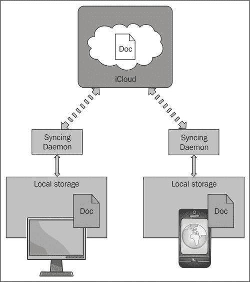

从实现的角度来看，为您的应用程序提供管理存储在 iCloud 中的文档的能力，最简单的方法是使用`UIDocument`类。这个类处理了读取和写入存储在 iCloud 中的文件所需的所有操作。它可以：

+   处理文件协调器的创建和使用来修改文档

+   无缝检测从其他设备接收到的更改

+   处理当两个设备以冲突的方式更新同一文件时可能出现的任何潜在冲突

+   防止大量冲突的更改同时发生

当我们在*创建 iCloudExample 应用程序*部分开始创建示例应用程序时，我们将探讨在 iCloud 中存储文档。

## 在 iCloud 中存储键值数据

在 iCloud 中存储数据为您提供了使您的应用程序能够在其他计算机和其他 iOS 设备上运行的同数据副本之间共享数据的方法。

允许您执行此操作的类称为`NSUbiquitousKeyValueStore`。这个类为您提供了在您的设备之间共享少量数据的能力。

`NSUserDefaults`类提供了一个程序接口，用于与系统默认值交互，允许应用程序根据用户的偏好定制其行为。例如，您可以设置应用程序以指定文档自动保存的频率。这个类允许您在稍后使用数据之前，将详细信息保存到各种数据类型中，即数字、字符串、日期、数组等等。

`NSUserDefaults`类与`NSUbiquitousKeyValueStore`类的主要区别在于，`NSUserDefaults`类将数据写入用户的 iCloud 存储，这样就可以被运行在不同 iOS 设备或计算机上的应用程序检索。

以下代码片段展示了如何设置云存储，以便您能够将数据写入用户的 iCloud 存储：

```swift
// TeamID + Bundle Identifier
NSFileManager *fileManager = [NSFileManagerdefaultManager];
NSURL *CloudURL = [fileManager URLForUbiquityContainerIdentifier: @"TEAMID.com.yourcompany.iCloudExample"];
// Log our iCloud URL to the console window
NSLog(@"iCloudURL: %@", [CloudURLabsoluteString]);
// Get a reference to the user's cloud store.
NSUbiquitousKeyValueStore *cloudStore = [NSUbiquitousKeyValueStoredefaultStore];
// Store our Cloud URL to the iCloudURL key.
[cloudStoresetString:[CloudURLabsoluteString] forKey:@"CloudURL"];
// This is important to include as it stores the
// values you set earlier on iCloud.
[cloudStore synchronize];

```

### 注意

当使用`NSUbiquitousKeyValueStore`类时，您必须确保将`com.apple.developer.ubiquity-kvstore-identifier`权限添加到您的项目权限文件中。这在本节*请求 iCloud 存储权限*中有详细说明。

单个键值存储可用的空间限制为 64KB；写入容器中单个键值的数据大小不得超过 4KB。这样，您可以存储有关应用程序的小量数据，但建议不要用它来存储用户文档或大量数据。

例如，您可能有一个应用程序，可能会存储当前版本号和用户正在查看的屏幕或文档的名称。这样，如果用户在另一台设备上打开应用程序，该设备上的应用程序版本可以打开与之前设备相同的屏幕或文档。

## 请求 iCloud 存储权限

为了保护应用程序创建的数据，需要在构建时创建一些特定的权限，以便使用 iCloud 存储。您需要确保已选择启用应用程序 App ID 的 iCloud 选项。

您需要从位于[`developer.apple.com/devcenter/ios/index.action#`](http://https://developer.apple.com/devcenter/ios/index.action#)的 iOS 配置文件门户内创建一个新的 App ID。或者，如果您正在使用现有的 ID，则该 ID 不能是通配符 ID，即`com.yourcompany.*`。

要为您的 App ID 启用 iCloud 服务，请按照以下简单步骤操作：

1.  首先，通过在**配置 App ID**屏幕中勾选**启用 iCloud**复选框来设置用于 iCloud 的配置文件。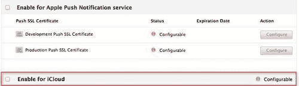

1.  接下来，您将看到一个弹出对话框，解释您使用所选 App ID 创建的任何新配置文件都将启用 iCloud 服务。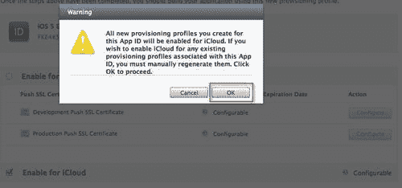

1.  一旦您点击了**确定**按钮，弹出对话框将消失，您将返回到**配置 App ID**屏幕，并且**启用 iCloud**按钮将变为绿色，如图所示：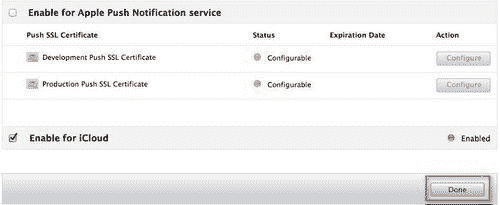

1.  点击**完成**按钮以关闭此屏幕。

1.  接下来，从**配置**选项卡，下载您的**开发和分发配置文件**。

1.  接下来，从**项目导航器**窗口，点击您的项目，然后点击**目标**部分，然后点击**摘要**页面。

1.  滚动到**权限**部分，勾选**启用权限**复选框。这将向您的项目添加一个名为**iCloudExample.entitlements**的文件。

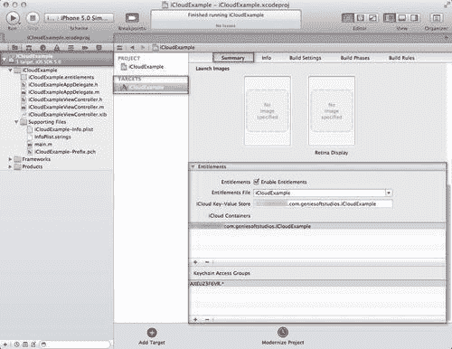

当您向项目添加权限时，它们会直接绑定到用于将您的应用程序文档和数据存储库与其他应用程序区分开来的应用程序配置文件。根据应用程序需要使用的 iCloud 功能，应用程序可以请求两种权限。这些权限在以下表格中解释。

| **权限** | **描述** |
| --- | --- |
| `com.apple.developer.ubiquity-container-identifiers` | 使用此权限请求 iCloud 文档存储权限。此键的值是一个容器标识符字符串数组（数组中的第一个字符串不得包含任何通配符字符）。 |
| `com.apple.developer.ubiquity-kvstore-identifier` | 使用此权限请求 iCloud 键值数据存储权限。此键的值是一个单个容器标识符字符串。 |

当你指定容器标识符字符串时，它必须采用`<TEAMID>.<CUSTOM_STRING>`的形式，其中`<TEAMID>`是与你的开发团队关联的唯一十位字符标识符。`<CUSTOM_STRING>`标识符是一个反向 DNS 字符串，用于标识存储你的应用程序文档的容器。

此字符串不一定需要是你的应用程序的捆绑标识符，但可以是对你或你的开发团队有意义的任何内容。

### 注意

要找到与你的开发团队关联的唯一标识符，请登录到苹果开发者连接网站，然后转到**会员中心**页面([`developer.apple.com/membercenter`](http://developer.apple.com/membercenter))。从**会员中心**主页，选择**您的账户**选项卡，然后从该选项卡的左侧列中选择**组织概要**。你的团队标识符位于**公司/组织 ID**字段中。

使用 iCloud 文档存储的应用程序可以指定多个容器来存储文档和数据。`com.apple.developer.ubiquity-container-identifiers`键的值是一个字符串数组。此数组中的第一个字符串必须是与你的应用程序关联的主要容器标识符。

以下代码片段显示了`iCloudExample`权限文件的 XML，该文件请求 iPhone 应用程序的密钥。它可以读取和写入其自己的文档，这些文档存储在容器目录中，如高亮代码部分所示。

```swift
<?xml version="1.0" encoding="UTF-8"?>
<!DOCTYPE plist PUBLIC "-//Apple//DTD PLIST 1.0//EN" "http://www.apple.com/DTDs/PropertyList-1.0.dtd">
<plist version="1.0">
<dict>
<key>application-identifier</key>
<string>AXEUZ3F6VR.com.geniesoftstudios</string> <key>com.apple.developer.ubiquity-container-identifiers</key>
<array>
<string>TEAMID.com.yourcompany.iCloudExample</string>
</array>
<key>com.apple.developer.ubiquity-kvstore-identifier</key>
<string>TEAMID.com.yourcompany.iCloudExample</string>
<key>get-task-allow</key>
<true/>
</dict>
</plist>

```

以下截图显示了`iCloudExample.Entitlements`权限文件在项目导航器中的属性列表视图。

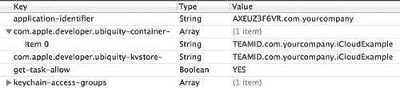

**TEAMID**值（如前一张截图所示），可以从你的**开发者账户**的**账户摘要**页面和**个人 ID**获取，如下一个截图所示：

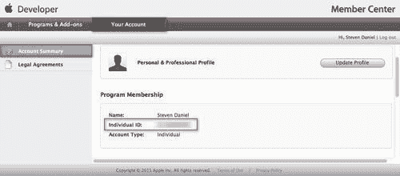

### 注意

你在 entitlements 属性列表文件中指定的字符串也是你传递给`URLForUbiquityContainerIdentifier:`方法以请求用户 iCloud 存储中目录位置的字符串。

## iCloud 备份

当使用 iCloud 备份时，用户可以选择将他们的应用程序和数据直接备份到他们的 iCloud 账户。这使得在以后的时间恢复应用程序到最近的状态变得更容易。选择将数据备份到 iCloud，将使用户更容易将数据重新安装到任何新的或现有的 iOS 设备上。

iCloud 会确定哪些文件需要备份，这基于文件存储的位置，通常在应用程序或主目录内。其他需要备份的区域包括用户文档目录内的所有内容，以及应用程序库的内容。在开发 iCloud 应用程序时，为了最小化存储在用户 iCloud 账户中的数据量，建议将更多文件放在`Library/Caches`目录中，尤其是那些可以轻松重新创建或以其他方式获取的文件。

为了将您的数据备份到 iCloud，您需要在所有 iOS 设备上激活此功能。这可以通过以下简单步骤实现：

1.  从设备中的**设置**面板选择**iCloud**。这如图所示：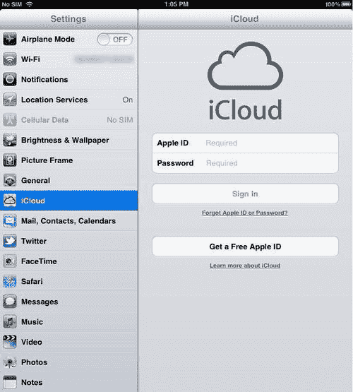

1.  接下来，使用您的**AppleID**和**密码**登录，然后点击如图所示的**登录**按钮。

1.  您需要同意 iCloud 的条款和条件，然后点击**同意**按钮关闭弹出对话框。

1.  在下一个屏幕截图中，您可以选择您想要备份到 iCloud 的项。

1.  接下来，点击**存储与备份**选项进入下一屏幕：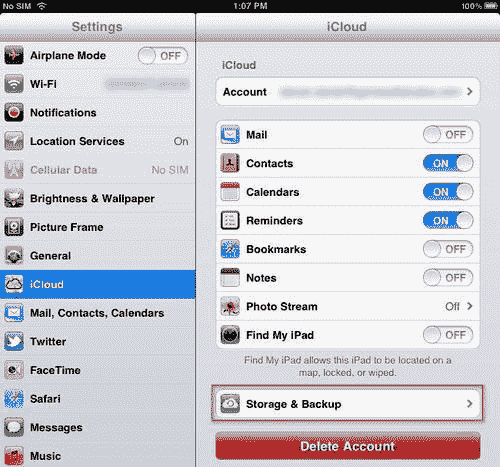

1.  接下来，将**备份到 iCloud**选项从**备份**部分设置为**开启**。这将自动将所有相机照片、文档和设置备份到 iCloud。

### 注意

将此选项设置为**开启**将防止 iTunes 备份您的详细信息，因为您的 iOS 设备将处理这项工作。

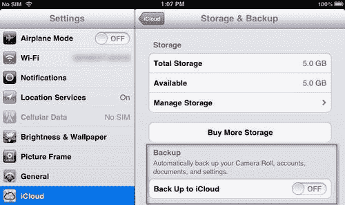

当在应用程序中使用 iCloud 存储 API 时，任何应用程序明确存储在 iCloud 中的文档都不会与应用程序一起备份；这是因为这些文件已经存储在您的 iCloud 账户中，因此不需要单独备份。

### 注意

关于如何在 iCloud 中存储文档的信息，请参阅*在 iCloud 中存储和使用文档*部分。要确定哪些目录被备份，请查看[iOS 应用程序编程指南](http://developer.apple.com/library/ios/#documentation/iphone/conceptual/iphoneosprogrammingguide/Introduction/Introduction.html)。

### 创建 iCloudExample 应用程序

在我们创建`iCloudExample`应用程序之前，我们必须首先启动 Xcode 开发环境。

1.  从`/Developer/Applications`文件夹启动 Xcode。

1.  从**项目**模板对话框中选择**单视图应用程序**模板来使用。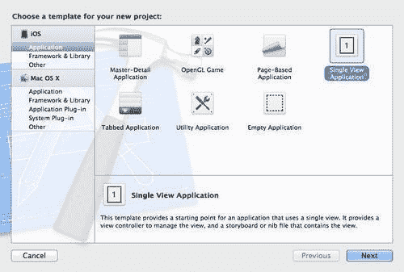

1.  然后，点击**下一步**按钮继续到向导的下一个步骤。这将允许你输入**产品名称**和你的**公司标识符**。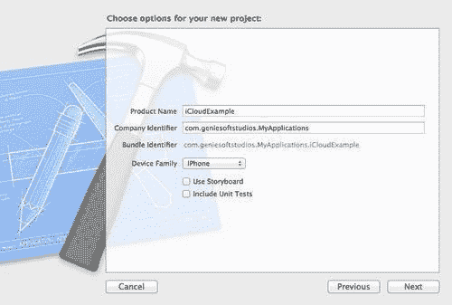

1.  将**产品名称**输入为`iCloudExample`，并确保你已经从**设备家族**下拉框中选择了**iPhone**。

1.  点击**下一步**按钮继续到向导的最后一步。

1.  选择你想要保存项目的文件夹位置。

1.  点击**创建**按钮，将你的项目保存到*步骤 6*中指定的位置。

一旦你的项目创建完成，你将在**项目导航器**窗口中看到 Xcode 开发界面，以及模板为你创建的项目文件。

我们接下来的步骤是开始构建我们的用户界面以获取云 URL，在云中存储密钥和文档，并了解如何从云中检索信息：

1.  在**项目导航器**窗口中，从`iCloudExample`文件夹中选择`iCloudExampleViewController.xib`文件。

1.  从**对象库**中选择并拖动一个(`UIButton`)按钮控制，到视图中。

1.  修改按钮控制的**对象属性**，并将标题设置为**获取 iCloud URL**。

1.  选择并拖动一个(`UILabel`)标签控制到视图中，并将其放置在**获取 iCloud URL**按钮下方。

1.  修改标签控制的**对象属性**，并将**文本**属性设置为**iCloud URL:**。

重复之前的步骤添加**存储到 iCloud、DocPath、从 iCloud 读取**和**项目值**的按钮和标签。

如果你一切操作正确，你的视图应该看起来像下一个截图。请随意根据需要进行调整。

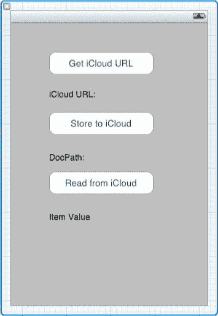

现在我们已经创建了一个用户界面，你需要将控件绑定起来以创建必要的事件，然后按照以下步骤操作：

1.  打开位于你项目`iCloudExample`文件夹中的`iCloudExampleViewController.h`接口文件，并添加以下代码：

    ```swift
    #import<UIKit/UIKit.h>
    @interfaceiCloudExampleViewController : UIViewController {
    UILabel *iCloudURL;
    UILabel *documentPath;
    UILabel *authorName;
    }
    - (IBAction)getCloudURL:(id)sender;
    - (IBAction)storeDocument:(id)sender;
    - (IBAction)readDocument:(id)sender;
    @property (strong, nonatomic) IBOutletUILabel *iCloudURL;
    @property (strong, nonatomic) IBOutletUILabel *documentPath;
    @property (strong, nonatomic) IBOutletUILabel *authorName;
    @end

    ```

1.  打开位于你项目`iCloudExample`文件夹中的`iCloudExampleViewController.m`实现文件，并添加以下高亮代码：

    ```swift
    #import "iCloudExampleViewController.h" #import<Foundation/Foundation.h>
    #import<Foundation/NSObject.h>
    @implementationiCloudExampleViewController; @synthesizeiCloudURL;
    @synthesizedocumentPath;
    @synthesizeauthorName;

    ```

    ### 注意

    如果我们不声明这些，我们将收到编译器警告信息，这可能导致你的应用程序出现意外的结果，甚至可能导致应用程序意外终止。

1.  接下来，我们需要声明一个将连接到 iCloud 服务的方法，使用我们的`TEAMID`和捆绑标识符，并检索 iCloud URL。输入以下代码片段。

    ```swift
    // Function to obtain the iCloud URL based on the TEAMID
    // and the Bundle Identifier
    - (IBAction)getCloudURL:(id)sender {
    // TeamID + Bundle Identifier
    NSFileManager *fileManager = [NSFileManagerdefaultManager];
    NSURL *CloudURL = [fileManager URLForUbiquityContainerIdentifier :@"TEAMID.com.yourcompany.iCloudExample"];
    iCloudURL.text = [@"iCloudURL = " stringByAppendingFormat:@"%@", [CloudURLabsoluteString ]];
    iCloudURL.numberOfLines = 4;
    iCloudURL.textColor = [UIColorblueColor];
    }

    ```

1.  当这个按钮被执行时，它将显示基于你的 TEAMID 和捆绑标识符的 iCloud 服务 URL。

    `file://localhost/private/var/mobile/Library/Mobile%20Documents/TEAMID~com~yourcompany~iCloudExample/`

1.  接下来，我们需要实现一个方法，该方法将用于将文档存储到我们的 iCloud 沙盒中。输入以下代码片段：

    ```swift
    - (IBAction)storeDocument:(id)sender {
    // Store document in the Cloud
    NSArray *searchPath = NSSearchPathForDirectoriesInDomains( NSDocumentDirectory, NSUserDomainMask, YES);
    NSString *docPath = [searchPath objectAtIndex:0];
    NSString *fileName = [NSStringstringWithFormat: @"%@/iCloudExample.doc",docPath];
    NSString *fileContent = @"Welcome to storing documents using icloud. iCloud Rocks!!!";
    // Now Save the content to the documents directory
    [fileContentwriteToFile:fileNameatomically: NOencoding:NSStringEncodingConversionAllowLossyerror:nil];
    NSURL *fileURL = [NSURL URLWithString:fileName];
    documentPath.text = [@"DocPath = " stringByAppendingFormat: @"%@", [fileURLabsoluteString ]];
    documentPath.textColor = [UIColorblueColor];
    documentPath.lineBreakMode = UILineBreakModeWordWrap;
    }

    ```

1.  当此按钮执行时，它将显示位于 iCloud 应用程序沙盒中的文档文件夹的路径：`/var/mobile/Applications/6BF2CE1F-C184-43FA-8D00-E4D476F8A538/Documents/iCloudExample.doc`。

1.  接下来，如果您通过选择**窗口**|**组织者**打开**组织者**窗口，您会注意到我们的`iCloudExample.doc`已经被添加到我们的应用程序沙盒中。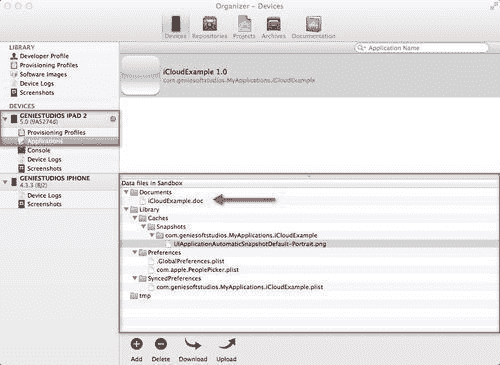

1.  接下来，我们需要实现一个方法，该方法将用于在我们的 iCloud 存储库中添加和检索键值。

    ```swift
    - (IBAction)readAuthor:(id)sender {
    NSUbiquitousKeyValueStore *cloudStore = [NSUbiquitousKeyValueStoredefaultStore];
    [cloudStoresetString:@"John Grisham" forKey:@"FavoriteAuthor"];
    // Important, as it first stores your in memory key values
    // to disk based storage, prior to eventually storing this
    //within iCloud
    [cloudStore synchronize];
    // Get the latest values from iCloud
    authorName.text = [@"Favorite Author = " stringByAppendingFormat :@"%@", [cloudStorestringForKey:@"FavoriteAuthor"]];
    authorName.textColor = [UIColorredColor];
    authorName.lineBreakMode = UILineBreakModeWordWrap;
    }

    ```

1.  当此按钮执行时，它将显示位于 iCloud 应用程序沙盒中的**Favorite Author**键值数据的键入值：**Favorite Author = John Grisham**。

1.  我们现在可以构建和编译我们的`iCloudExample`应用程序。以下截图显示了按下每个按钮时的输出：

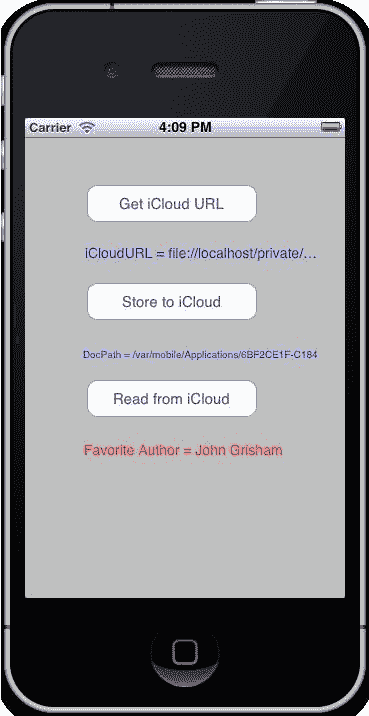

因此，我们已经成功创建了一个简单而强大的应用程序，它可以与 iCloud 通信来存储文档和键值数据，并从云中检索数据。

## 将文档移动到 iCloud 存储

当将文档移动到 iCloud 时，您可以在容器目录内创建额外的子目录来管理您的文件。

从开发的角度来看，建议在将文档添加到 iCloud 时，您应该创建一个`Documents`子目录，并使用该目录来存储用户文档。在 iCloud 中，`Documents`目录的内容对用户可见，因此可以删除单个文档，而`Documents`目录之外的所有内容则被组合在一起，作为一个用户可以保留或删除的单个实体。

以下代码片段首先在您的应用程序沙盒中创建并保存文件，然后再将文件移动到 iCloud 中指定的目标位置。

```swift
// TeamID + Bundle Identifier
NSFileManager *fileManager = [NSFileManagerdefaultManager];
NSURL *CloudURL = [fileManager URLForUbiquityContainerIdentifier: @"TEAMID.com.yourcompany.iCloudExample"];
NSString *docString = @"Documents";
NSURL *tempURL = [NSURL URLWithString:docString];
BOOL myVal = [fileManagersetUbiquitous:YESitemAtURL: fileURLdestinationURL:CloudURLerror:NULL];

```

在此代码片段中，我们创建了一个`NSURL`对象，该对象指定了文件在用户 iCloud 存储中的目标位置。然后我们调用`NSFileManager`类的`URLForUbiquityContainerIdentifier:`方法来获取目录的根 URL，然后向该 URL 追加任何额外的目录和文件名。最后，我们调用`NSFileManager`的`setUbiquitous:itemAtURL:destinationURL:error:`方法，将文件移动到 iCloud 中指定的目标位置。

## iCloud 存储 API

iCloud 存储 API 允许您的应用程序将用户文档和数据写入中央位置，并从用户的全部计算机和 iOS 设备访问这些项目。

### 小贴士

使用 iCloud 使用户的文档无处不在，这意味着用户可以从任何设备查看或编辑这些文档，而无需显式同步或传输文件。

在用户的 iCloud 账户中存储文档为用户提供了一层安全保障。如果用户不幸丢失了设备，如果这些文档包含在 iCloud 存储中，它们可以很容易地恢复。有两种方式可以利用 iCloud 存储，每种方式都有其重要的用途。以下表格中解释了这些用途：

| **存储类型** | **描述** |
| --- | --- |
| iCloud 文档存储 | 使用此功能将用户文档和数据存储在用户的 iCloud 账户中。请参阅本章中位于“在 iCloud 中存储和使用文档”部分的章节。 |
| iCloud 键值数据存储 | 使用此功能在应用程序的实例之间共享少量数据。请参阅本章中位于“在 iCloud 中存储键值数据”部分的章节。 |

大多数你创建的应用程序都将使用 iCloud 文档存储来共享用户 iCloud 账户中的文档。这将提供跨多设备共享文档和管理特定设备上文档的能力。

当使用 iCloud 键值数据存储时，用户不会看到这一点，因为这由你的应用程序处理，并且只共享少量信息；这些信息仅由应用程序使用。例如，你可以存储用户登录你的应用程序的时间，或者他们当前正在查看的屏幕。

以下截图显示了在应用程序沙盒中创建本地 iCloud 存储信息的过程。

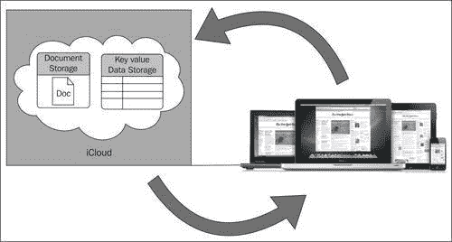

### 注意

关于如何在 iCloud 中存储和使用文档的更多信息，请参阅本章中位于“在 iCloud 中存储和使用文档”部分的章节。

## 在 iCloud 中搜索文档

有时候，在修改文档之前，你可能需要检查云中某个位置的文档是否存在。例如，如果你想在应用程序中打开文档之前检查该文档是否存在，如果不进行检查而尝试打开，你将收到一个错误。

另一种情况可能是你需要从你的 iCloud 存储库中删除一个文件；在尝试删除此文件之前，你仍然需要执行检查以确保该文档确实存在，否则你将收到一个处理不当的错误，导致你的应用程序崩溃。

要实现任何这些案例场景，你需要使用`NSMetadataQuery`对象搜索 iCloud 存储库。通过 iCloud 存储库进行搜索是确保在用户的 iCloud 存储和你的应用程序沙盒中找到文档的可靠方法。

你应该始终使用查询对象而不是持久保存 URL，因为当你的应用程序未运行时，用户可以删除 iCloud 存储中的文件。使用查询进行搜索是确保准确文档列表的唯一方法。

```swift
NSMetadataQuery *mdQuery = [[NSMetadataQueryalloc] init];
[mdQuerysetPredicate:[NSPredicatepredicateWithFormat:@"(kMDItemFSName LIKE 'iCloudDoc *')"]];
[[NSNotificationCenterdefaultCenter] addObserver:selfselector: @selector(processQuery:) name:nilobject:mdQuery];
[mdQuerystartQuery];

```

以下代码片段显示了`NSNotification`类的关联`processQuery`方法，并展示了我们如何为每个不同的`NSMetadataQuery`通知方法执行和处理比较。

```swift
-(void)processQuery:(NSNotification *)notification {
NSMetadataQuery *mdQuery = [notification object];
if ([[notification name] isEqualToString: NSMetadataQueryDidStartGatheringNotification]) {
NSLog(@"%@ %@ Query started", [self class], NSStringFromSelector(_cmd));
}
else if ([[notification name] isEqualToString: NSMetadataQueryGatheringProgressNotification]) {
NSLog(@"%@ %@ %ld", [self class], NSStringFromSelector(_cmd), (long)[mdQueryresultCount]);
}
else if ([[notification name] isEqualToString: NSMetadataQueryDidFinishGatheringNotification]) {
NSUIntegertheResultCount = [mdQueryresultCount];
theResultCount = 20;
for (NSUIntegeri; i<theResultCount; i++) {
NSLog(@"%@ %@ %ld %@", [self class], NSStringFromSelector(_cmd), (long)i, [mdQueryresultAtIndex:i]);
}
}
else {
NSLog(@"%@ %@ NSMetadataQueryDidUpdateNotification: %@", [self class], NSStringFromSelector(_cmd), notification);
}
}

```

在 iOS 5.0 中，`NSMetadataQuery`类支持几个用于文档的搜索作用域。如下表所示。

| **NSMetadataQuery 类方法** | **描述** |
| --- | --- |
| `NSMetadataQueryUbiquitousDocumentsScope` | 使用此功能在 iCloud 中搜索位于文档目录内的文档（对于任何给定的容器目录，将用户允许访问的文档放在文档子目录中）。 |
| `NSMetadataQueryUbiquitousDataScope` | 使用此功能在 iCloud 中搜索位于除文档目录之外的任何位置的文档（对于任何给定的容器目录，使用此作用域来存储您的应用程序需要共享但不想让用户直接操作的用户相关数据文件）。 |

## 在 iCloud 中处理文档

当您的应用程序需要读取或写入 iCloud 中的文档时，它必须以协调的方式进行。您的应用程序可能不是唯一试图在任何给定时刻操作本地文件的应用程序。将文档传输到和从 iCloud 的守护进程也需要定期监控文件。为了防止您的应用程序干扰守护进程（反之亦然），iOS 提供了一个与您针对 iCloud 存储目标文件和目录协同工作的锁定机制。

iCloud 锁定机制的核心是文件协调器和文件展示者。

### 文件协调器

每次您需要读取和写入文件时，您都应使用文件协调器，它是`NSFileCoordinator`类的一个实例。文件协调器的任务是协调应用程序和同步守护进程在相同文档上执行的读取和写入操作。例如，您的应用程序和守护进程可能同时读取文档，但任何时候只能有一个写入文件。

此外，如果一个进程正在读取文档，则另一个进程将被阻止向文档写入，直到先前的进程完成读取文档。

### 文件展示者

除了协调操作外，文件协调器还与文件展示者合作，通知应用程序何时将要发生更改。文件展示者是指任何遵循`NSFilePresenter`协议的对象，并负责管理应用程序中特定文件（或文件目录）。

文件展示者的工作是保护其自身数据结构的完整性。它是通过监听来自其他文件协调器的消息并使用这些消息来更新其内部数据结构来做到这一点的。在大多数情况下，文件展示者可能不需要做任何事情。然而，如果一个文件协调器声明它即将将文件移动到新的 URL，文件展示者就需要用文件协调器提供给它的新 URL 替换其旧的 URL。

## 处理文件版本冲突

处理文件版本冲突是软件开发中常见的问题。使用 iCloud 时，我们需要能够在多个设备上运行多个应用程序实例时处理这种情况，并且它们都尝试修改同一文档。当两个设备同时尝试上传对文件的更改时，这将导致冲突。

到这一点，iCloud 将会有同一文件的两种不同版本，并必须决定如何处理它们。它的解决方案是将最近修改的文件作为当前文件，并将任何其他版本的文件标记为冲突版本。

为了避免丢失对那些文档所做的更改，您的应用程序将需要提示用户选择适当的操作步骤。例如，您可能让用户选择保留文件的哪个版本，或者您可能提供将旧版本保存为新名称的选项。

您需要确定当前文件和版本，使用`currentVersionOfItemAtURL:`类方法，然后通过调用`unresolvedConflictVersionsOfItemAtURL:`类方法来获取冲突版本的数组。

对于每个冲突的文件版本，您需要执行适当的操作来解决冲突，可以通过以下列出的任何操作来实现：

+   自动将冲突版本与当前文件合并，如果这样做是可行的。

+   选择忽略冲突版本，这将导致那些文件中的数据丢失。

+   提示用户选择适当的操作步骤，并决定他们确实应该保留哪个版本。这应该是您的最后一步行动。

## 负责任地使用 iCloud 存储

利用 iCloud 存储功能的程序在存储数据时应负责任。每个用户账户中可用的空间是有限的，并且由所有应用程序共享。此外，用户可以看到特定应用程序消耗了多少空间，并可以选择删除与该特定应用程序关联的文档和数据。出于这些原因，您的应用程序在管理文件时应负责任。以下是一些帮助您适当管理文档的建议：

+   而不是存储所有文档，让用户选择他们想要存储在 iCloud 账户中的文档。如果用户创建了大量的文档，将所有这些文档存储在 iCloud 中可能会耗尽用户的可用空间。为用户提供一种指定要存储在 iCloud 中的文档的方式，可以让用户在决定如何最好地使用可用空间时拥有更多的灵活性。

+   记住，删除文档会将其从用户的 iCloud 账户以及所有该用户的计算机和设备中删除。确保用户知道这一点，并确认任何删除操作。为了使你的应用程序删除文档的本地副本，然后从 iCloud 下载一个新的副本，请使用`NSFileManager`的`evictUbiquitousItemAtURL:error:`方法。

+   当在 iCloud 中存储文档时，尽可能将它们放在文档目录中。用户可以单独删除文档目录中的文档以释放空间。然而，该目录之外的所有内容都被视为数据，必须一次性删除。

+   永远不要在用户的 iCloud 存储中存储你的应用程序专有的缓存或其他文件。用户的 iCloud 账户应仅用于存储用户数据和内容。

+   以对待你应用程序沙盒中所有其他文件的方式对待 iCloud 中的文件。保存文件的时间应由你应用程序的需求以及保留用户数据的需求来驱动。你不应该改变你的应用程序以更频繁或更少地保存文件到 iCloud。iCloud 会自动优化其到服务器的传输，以确保最佳性能。

当内容通过互联网发送时，iCloud 通过使用 SSL 对其进行加密来保护你的内容。这导致你的内容以加密格式存储，并使用安全令牌进行身份验证。

### 注意

关于如何在 iCloud 中存储和使用文档的更多信息，请参阅本章中位于“在 iCloud 中存储和使用文档”部分的说明。

# 摘要

在本章中，我们学习了使用 iCloud 的好处，以及如何通过它们的存储 API 来访问它们。我们探讨了如何在我们的代码中集成 iCloud 功能，如何存储和检索键值数据，以及如何在应用程序沙盒内的文件夹中存储文档。

我们还学习了如何在 iCloud 存储库中搜索和定位文档的过程，以及如何处理和避免在多个设备上更新同一文件的多个副本时提交到 iCloud 存储库所遇到的文件版本冲突。

在下一章中，我们将学习 OpenGL ES 的新调试功能，以及这个新的 Xcode 调试器如何允许你直接在 IDE 中跟踪 OpenGL ES 代码中的特定问题。
