# 第四章 使用故事板

从 Xcode 4.2 的发布开始，开发者和设计师现在可以使用新加入 Interface Builder 的**故事板**功能来布局他们应用程序的工作流程。故事板可以用来构建游戏菜单系统，在屏幕之间切换，或者它们可以用来构建使用导航栏和标签栏控件在不同视图之间切换的商业应用程序，因为它们管理由开发者创建的视图控制器。

以前，您不是创建多个界面文件，现在您可以在一个地方开始拖放并编辑所有视图，同时能够指定屏幕之间的过渡以及触发它们的关联操作。故事板还包括一种可以实施的设计模式，用于在控制器之间发送和接收数据。在之前的实例中，您将不得不实现协议、代理、通知或某种其他自定义方式来维护屏幕之间的状态。

在本章中，我们将深入了解故事板实际上是什么，以及熟悉在 Interface Builder 中实施的新工作流程。我们将查看创建故事板的步骤以及如何在不同视图之间应用不同的过渡技术，以创建一个用于发布消息和照片的 Twitter 应用程序。

在本章中，我们将：

+   了解故事板是什么

+   学习如何使用故事板创建和配置场景之间的过渡

+   创建一个简单的具有 Twitter 集成的故事板应用程序

+   学习创建故事板文件的过程

+   发布推文消息并添加照片

+   以编程方式过渡到新的故事板视图控制器

在本章中，我们将涵盖一些精彩的内容，让我们开始吧。

# 理解故事板

在过去，当您需要为您的应用程序创建一个新视图时，您将不得不为每个视图创建一个新的 xib 文件。当处理复杂的应用程序时，这变得非常繁琐，因为它们包含了许多不同的视图，并且从视图控制器切换到下一个视图变得困难。

苹果决定大幅改进这一领域，通过在用户界面设计过程中引入一种称为**故事板**的技术，在用户界面设计方面进行了实质性的改进。

故事板是 Xcode 4.2 及其后续版本中内置的功能，它允许将 iOS 应用程序的各个屏幕以及通过这些屏幕的导航路径进行视觉组装。当您使用故事板时，它们使您能够设计屏幕的应用程序工作流程，类似于电影导演为每个拍摄场景准备故事板草图的方式。

你可以使用 Interface Builder 图形化地布局每个屏幕的各个部分，以及它们之间的过渡，以及触发过渡的控制。

以下截图显示了一个简单的 Storyboard 应用程序，其中包含两个视图控制器，它们之间存在链接。


## 过渡

Xcode 提供了更改在 Storyboard 中从一个场景到另一个场景发生的过渡视觉外观的选项，这被称为**segue**。使用过渡可以使你为每个要渲染和显示到视图中的视图控制器应用各种不同的样式，这些样式由视图控制器之间的箭头表示。默认情况下，执行**垂直覆盖**过渡，其中新场景从视图底部垂直向上滑动以覆盖当前显示的场景。

你可能已经在应用程序中看到过这样的过渡，例如 iPhone 和 iPad 中包含的 Photos 应用程序，在那里你可以应用过渡并开始幻灯片放映。

你还可以定义自定义过渡，这使你能够提供一个自定义 segue 类方法来处理过渡。这可以通过将 segue 的样式选择为**自定义**，并填写要使用的自定义 segue 类名称来实现。要使用任何标准 segue 类，这些类位于`UIKit`类中。

### 注意

有关标准 segue 类的信息，请参阅位于 Apple 开发者连接网站上的`UIKit`框架参考，使用以下链接：[`developer.apple.com/library/ios/#documentation/uikit/reference/UIKit_Framework/_index.html`](http://developer.apple.com/library/ios/#documentation/uikit/reference/UIKit_Framework/_index.html)。

为了配置 segue 以指定在场景之间使用的一种过渡，请单击 segue 并打开**属性**检查器，如图下所示：

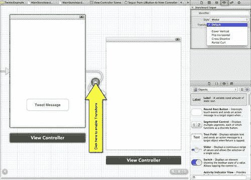

你可以选择仅适用于**模态**样式的各种过渡类型；这些类型在以下表中解释：

| **过渡名称** | **描述** |
| --- | --- |
| **默认** | 当选择此过渡时，它使用**垂直覆盖**过渡样式。 |
| **垂直覆盖** | 当呈现视图控制器时，其视图从屏幕底部滑动向上。当视图消失时，它滑动回原位。 |
| **水平翻转** | 当呈现视图控制器时，当前视图从右到左开始一个水平 3D 翻转，从而像在先前视图的背面一样揭示新视图。当此视图消失时，翻转从左到右发生，返回到原始视图。 |
| **交叉溶解** | 当视图控制器被展示时，当前视图淡出，同时新视图淡入。当视图被关闭时，使用类似类型的交叉溶解来返回到原始视图。 |
| **部分卷曲** | 当视图控制器被展示时，当前视图的一个角落卷曲起来以显示下面的模态视图。当视图被关闭时，卷曲的页面会自动展开回到模态视图的顶部。使用这种转换方式展示的模态视图本身被阻止展示任何额外的模态视图。这种转换样式仅在父视图控制器展示全屏视图且你使用`UIModalPresentationFullScreen`模态展示样式时才受支持。尝试使用不同的父视图形式因子或不同的展示样式将触发异常。 |

### 注意

关于上述转换类型的更多信息，请参考位于苹果开发者网站上的`UIViewController`框架参考，使用以下链接：[`developer.apple.com/library/ios/#documentation/uikit/reference/UIViewController_Class/Reference/Reference.html`](http://developer.apple.com/library/ios/#documentation/uikit/reference/UIViewController_Class/Reference/Reference.html)。

现在我们已经了解了如何为视图创建转换，我们的下一步是看看我们如何创建 Storyboard 以及如何为 Storyboard 应用程序配置场景。

## 如何创建 Storyboard 文件

在下一节中，我们将探讨如何创建 Storyboard 应用程序。当你创建一个新的 Storyboard 文件时，这将为你提供一个代表场景的视图控制器对象，这是初始视图控制器。

每个视图控制器代表单个屏幕的内容。当为 iPad 创建应用程序时，一个屏幕可以由多个场景的内容组成，并且你需要将包含在视图控制器中的每个对象链接到实现另一个场景的另一个视图控制器。

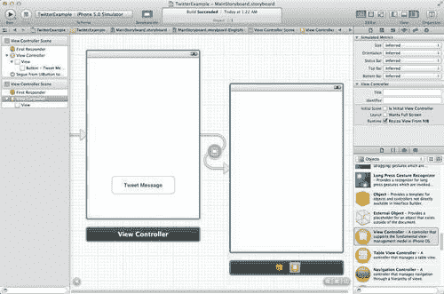

如从这张截图中所见，初始视图控制器包含一个绿色轮廓。你可以通过 Interface Builder 使用*Control* + 拖动在控件和视图控制器之间来链接各种视图控制器。你可以在每个视图控制器的视图中添加控件和视图，就像你向窗口或 XIB 文件中的视图添加对象一样。

## 创建一个简单的 Storyboard（Twitter）应用程序

在我们继续之前，我们首先需要创建我们的`TwitterExample`项目。为了唤起你的记忆，你可以参考我们在第二章中介绍的部分。

1.  从`/Developer/Applications`文件夹中启动 Xcode。

1.  选择**创建一个新的 Xcode 项目**，或**文件 | 新项目**。

1.  从**项目模板**对话框中选择**单视图应用程序**模板。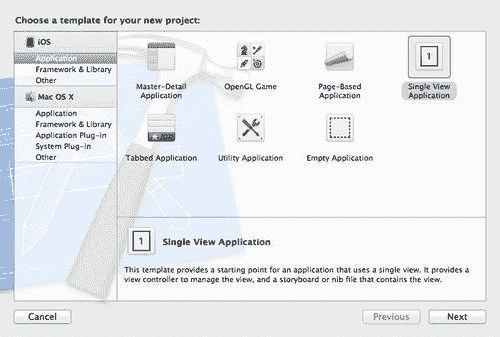

1.  然后，点击**下一步**按钮继续向导的下一步。这将允许您输入**产品名称**和您的**公司标识符**。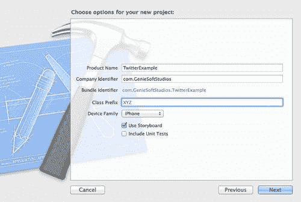

1.  在**产品名称**中输入`TwitterExample`，并确保您已从**设备家族**下拉框中选择**iPhone**，并且已勾选**使用故事板**选项。

1.  接下来，点击**下一步**按钮继续向导的最终步骤。

1.  选择您希望保存项目的文件夹位置。

1.  然后，点击**创建**按钮以在指定位置保存您的项目。

一旦您的项目创建完成，您将看到 Xcode 开发界面，以及模板在**项目导航器**窗口中为您创建的项目文件。我们的下一步是开始构建我们的 Twitter 应用程序的用户界面。

## 创建场景

创建场景的过程涉及将一个新的视图控制器添加到故事板中，这被称为**场景**。每个视图控制器负责管理单个场景。更好地描述场景的方式是将场景集合想象成一部电影，其中正在显示的每一帧都是实际连接到下一部分的场景。

当向您的故事板文件添加场景时，您可以在视图控制器视图中添加控件和视图，就像您为 XIB 文件做的那样，并且能够在视图控制器及其视图之间配置出口和动作。

要将新场景添加到您的故事板文件中，请按照以下简单步骤操作：

1.  在**项目导航器**中，选择名为`MainStoryboard.storyboard`的文件。

1.  从**对象库**中选择并拖动一个新的视图控制器到故事板画布上。这在上面的屏幕截图中显示：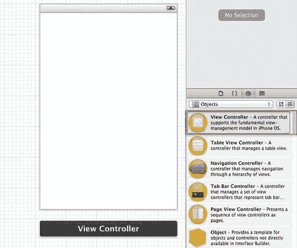

1.  接下来，将一个`UIButton`控件拖动到我们将在后续部分使用的视图中。在按钮的属性中，将文本更改为读取`返回`。

1.  最后，在第一个视图控制器上，将一个`UIButton`控件拖动到视图上，位于**推文消息**按钮上方。在按钮的属性中，将文本更改为读取`关于应用`。这将用于调用我们在上一步中添加的新视图。

    一旦您已将控件添加到每个视图中，您的最终界面应类似于以下屏幕截图所示。

    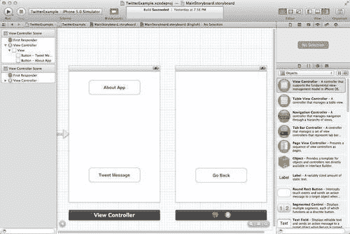

1.  接下来，为**关于应用**按钮创建动作事件；在键盘上按住控制键，并将鼠标从**关于应用**按钮拖动到`ViewController.h`接口文件。

1.  从**连接类型**下拉菜单中选择**动作（Action**），然后输入`showAbout`作为要创建的`IBAction`方法的名称，然后点击**连接（Connect**）按钮以接受更改，如图所示：

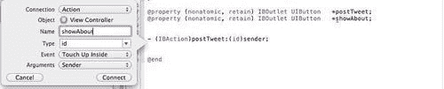

现在我们已经创建了场景、按钮和动作，我们的下一步是配置场景，这将在下一节中展示。

## 配置场景

当你想从一个视图控制器切换到另一个视图控制器时，你可以按住**控制**键并点击一个按钮、表格视图单元格或任何其他来自一个视图控制器的对象，然后将其拖动到新的视图控制器以创建不同的场景。这种在视图控制器之间拖动的技术被称为**转场（Segue**）。

转场是一个可配置的对象，支持`UIKit`类参考中提供的所有类型的转换，例如模态转换和导航转换。

你还可以定义自定义转换，用另一个视图控制器替换一个视图控制器。要创建转场并配置场景，请按照以下简单步骤操作：

1.  使用鼠标选择**关于应用**按钮，并按住**控制**键将其拖动到当按钮被选中时要加载的场景视图控制器。

1.  释放鼠标按钮，然后从弹出菜单选择**模态（Modal**）选项。配置场景

    +   你会注意到一个灰色箭头连接了两个视图控制器。当按下**关于应用**按钮时，它将显示包含**返回**按钮的页面。

1.  接下来，我们需要为我们的第二个视图做同样的事情，以便当按下**返回**按钮时，它将返回到我们的第一个视图。

1.  重复**步骤 1**到**步骤 2**，但将**返回**按钮替换为**关于应用**按钮。

    Xcode 4 中包含的 Storyboard 转场解释如下表所示：

    | **转场名称** | **描述** |
    | --- | --- |
    | **模态（Modal**） | 模态视图控制器不是`UIViewController`类的特定子类，因为任何类型的视图控制器都可以通过你的应用程序以模态方式呈现。然而，就像标签栏和导航视图控制器一样，当你想要传达前一个视图层次结构和新呈现的视图层次结构之间的特定关系时，你可以以模态方式呈现你的视图控制器。 |
    | **推送（Push**） | **推送（Push**）转场允许你将新的视图控制器推送到导航堆栈中，就像堆叠盘子一样。堆栈顶部的视图是渲染的视图。 |
    | **自定义** | 这些允许你使用`prepareForSegue`方法从代码中自定义和调用视图控制器，并且是你用来展示应用程序内容的方式。视图控制器的工作是管理某些内容的展示，并协调内容的更新以及与应用程序底层数据对象的同步。在自定义视图控制器的情况下，这涉及到创建一个视图来展示内容，并实现将视图内容与你的应用程序数据结构同步所需的基础设施。 |

    +   完成这些操作后，你的视图控制器应该看起来像下一张截图所示的那样。你可以为每个视图控制器应用多种过渡效果，以便它们在显示到视图时执行动画。

    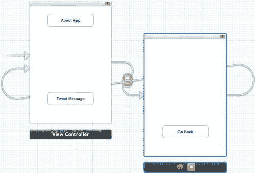

    +   要了解如何将过渡效果应用到你的视图控制器上，请参阅本章中关于*过渡*的部分。

1.  现在你已经将每个 segues 应用到视图控制器上，我们的最后一步是编译、构建并运行我们的应用程序。

1.  构建 Twitter 应用程序

    以下截图显示了我们的应用程序在 iOS 模拟器中运行，以及它们各自关联的屏幕显示。

接下来，将一个`UITextView`拖到你的视图中，并调整大小以适应合理数量的文本输入，并确保删除此控件中显示的默认文本。

所以，这就是全部内容。在本节中，我们学习了如何创建和添加新场景到我们的主故事板中，以及当按钮被按下时如何链接和配置每个场景的过程。

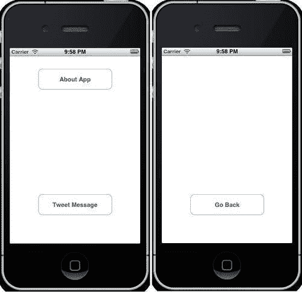

## 我们还可以通过编程方法过渡到故事板中的场景。当我们开始本章的*以编程方式展示故事板视图控制器*部分时，我们将更详细地探讨这一点。

Twitter 为我们提供了一些非常简单的 API 来关注，这使得与它们交互变得轻而易举。在本节中，我们将探讨如何使用这些 API 发布推文消息并添加图片。

1.  从**产品**菜单中选择**运行**。或者，按**Command | R**键编译、构建并运行应用程序。

1.  从**产品**菜单中选择**运行**。或者，按**Command | R**键编译、构建并运行应用程序。

1.  最后，我们需要将一个`UIButton`拖到视图中以处理消息的发布。在按钮的属性中，将文本更改为“推文消息”。你的最终界面应该看起来像这样：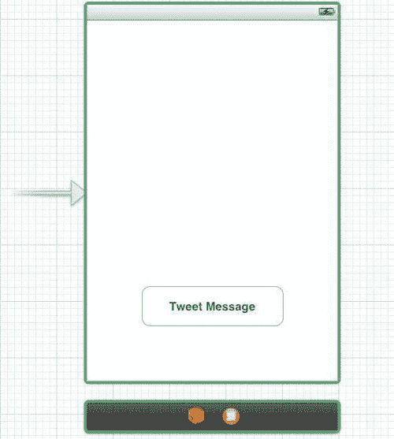

1.  接下来，打开`ViewController.h`接口文件，并创建以下突出显示的条目，如下面的代码片段所示：

    ```swift
    #import <UIKit/UIKit.h>
    @interface ViewController :UIViewController { UIButton *postTweet;
    } @property (nonatomic, retain) IBOutlet UIButton *postTweet;
    @end

    ```

1.  接下来，我们需要连接我们的**Tweet Message**按钮控件，并创建用于发布推文的`IBAction`事件。我们需要确保使用的事件类型是`UIButton`的`TouchUpInside`方法。

1.  要创建一个动作事件，请按住键盘上的**Control**键，然后将鼠标拖动到以下截图所示的`ViewController.h`接口文件。

1.  将要创建的`IBAction`方法的名称输入为`postTweet`，然后点击`Connect`按钮以接受更改。

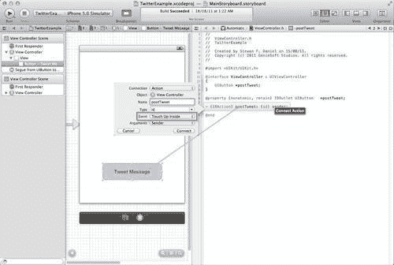

现在我们已经将`IBAction`事件连接到用于发布推文的调用方法，我们的下一步是在查看如何实现此代码之前，将 Twitter 框架添加到我们的项目中。

要将 Twitter 框架添加到你的项目中，请选择**Project Navigator Group**，然后按照以下简单步骤操作：

1.  在**Project Navigator**中选择你的项目。

1.  然后，从**TARGETS**组下选择你的项目目标。

1.  选择**Build Phases**标签。

1.  展开链接二进制与库的展开三角形。

1.  最后，使用**+**来添加你想要的库。如果你在列表中找不到 Twitter 框架，也可以进行搜索。

如果你仍然不清楚如何添加框架，请参考以下截图，它突出显示了你需要选择的区域：

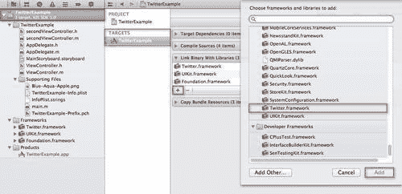

现在我们已经将`Twitter.framework`添加到我们的项目中，我们可以看看如何实现使用此框架发布推文消息的代码。

## 编写推文消息

每当你想要提交 Twitter 消息时，你都需要使用`TWTweetComposeViewController`类实例。这个类处理所需的一切，并为我们提供一个推文编辑表单，以便我们可以开始输入推文消息。此类还允许你设置要使用的初始 Twitter 文本信息，以及如何添加图片和 URL。

### 注意

关于`TWTweetComposeViewController`类的更多信息，你可以参考位于以下位置的 Twitter 框架参考文档：`http://developer.apple.com/library/ios/#documentation/Twitter/Reference/TWTweetSheetViewControllerClassRef/Reference/Reference.html`。

在以下代码片段中，我们看看如何使用`TWTweetComposeViewController`类来编写推文。

在我们能够在应用程序中使用 Twitter 的功能之前，我们需要包含 Twitter 框架的头文件。

1.  从**Project Navigator**中打开`ViewController.m`实现文件，并输入以下`import`语句，如下所示：

    ```swift
    #import <Twitter/Twitter.h>
    #import <Twitter/TWTweetComposeViewController.h>

    ```

1.  接下来，我们需要实现代码以显示 Twitter 推文表单，我们可以在这里编辑，然后发布我们的消息。打开位于`TwitterExample`文件夹中的`ViewController.m`实现文件，并输入以下代码片段：

    ```swift
    - (IBAction) postTweet: (id) sender {
    TWTweetComposeViewController *myTwitter = [[TWTweetComposeViewController alloc] init];
    [myTwitter setInitialText:@"Welcome to iOS 5 and Xcode 4.2, using the Twitter API."];
    [self presentModalViewController:myTwitter animated:YES];
    // Retrieve the result of the Twitter handler to
    // determine if the message was successfully sent.
    myTwitter.completionHandler = ^(TWTweetComposeViewControllerResult res){
    if (res == TWTweetComposeViewControllerResultDone) {
    UIAlertView *alertView = [[UIAlertView alloc] initWithTitle:@"Success" message:@"Your Tweet was posted successfully." delegate:self cancelButtonTitle:@"OK" otherButtonTitles:nil];
    [alertView show];
    [self dismissModalViewControllerAnimated:YES];
    }
    else if (res == TWTweetComposeViewControllerResultCancelled) {
    UIAlertView *alertView = [[UIAlertView alloc] initWithTitle:@"Error" message:@"Your Tweet was not posted." delegate:self cancelButtonTitle:@"OK" otherButtonTitles:nil];
    [alertView show];
    [self dismissModalViewControllerAnimated:YES];
    }
    };
    }

    ```

1.  在这个代码片段中，我们声明了一个变量`myTwitter`，并将其赋值为我们的`TWTweetComposeViewController`类的一个实例。然后我们通过设置`setInitialText`方法，给我们的编辑表单设置了一些文本，并将其显示到视图中。然后我们设置了一个处理程序，使用`completionHandler`方法来通知我们用户已经完成了推文的编辑，并根据方法返回的结果显示了相关的警告。

1.  可选地，你可以在向用户展示视图之前，使用`canSendTweet`类方法检查 Twitter 是否已设置并可达，如下面的代码片段所示：

    ```swift
    BOOL isSUCCESS = TWTweetComposeViewController.canSendTweet;
    if (isSUCCESS== YES){
    Do something…
    }
    // Twitter account credentials have not been set up correctly.
    else{
    UIAlertView *alertView = [[UIAlertViewalloc] initWithTitle:@"Twitter Error" message:@"Your Twitter account has not been set up correctly." delegate:self cancelButtonTitle:@"OK" otherButtonTitles:nil];
    [alertView show];
    }

    ```

在上述代码片段中，我们使用了`TWTweetComposeViewController`类的`canSendTweet`类方法。这个方法会检查用户是否正确安装并正确设置了 Twitter。如果没有这样做，这个语句将失败，并将返回一个`NO`（或`FALSE`）值给`isSuccess`变量。

## 向推文添加照片

每当你想要向推文消息中添加图片以提交时，你需要使用`TWTweetComposeViewController`类实例。这个类处理所有必需的操作，并展示给我们一个推文编辑表单，以便我们可以添加图片和 URL。

在下一个代码片段中，我们看看如何使用`TWTweetComposeViewController`类轻松地向现有的 Twitter 消息添加图片。

打开位于**项目导航器**中的`TwitterExample`文件夹内的`ViewController.m`实现文件，找到`postTweet`方法，并输入以下高亮显示的代码，如下所示：

```swift
- (IBAction) postTweet: (id) sender {

// Attach an image to our Tweet message
TWTweetComposeViewController *myTwitter = [[TWTweetComposeViewControlleralloc] init];

[myTwitter addImage:[UIImage imageNamed:@"Blue-Aqua-Apple.png"]];
[self presentModalViewController:myTwitteranimated:YES];
}

```

在这个代码片段中，我们声明了一个变量`myTwitter`，并将其赋值为我们的`TWTweetComposeViewController`类的一个实例。然后我们使用`addImageinstance`方法向推文消息中添加一张图片，并将带有图片的视图展示给用户。

现在我们已经将最后一部分代码添加到`TwitterExample`应用中，我们需要在构建和运行应用之前首先配置我们的 Twitter 账户信息。按照以下步骤设置和配置 Twitter。

1.  从 iOS 主屏幕打开**设置**应用。

1.  从**设置**菜单中选择**Twitter**选项。

1.  输入你的**用户名**和**密码**凭证信息，然后点击**登录**按钮。如果你没有 Twitter 账户，你可以通过选择**创建新账户**选项在此屏幕上创建一个。

1.  我们的最后一步是编译、构建并运行我们的`TwitterExample`应用，可以通过在 Xcode IDE 中点击**播放**按钮，或者使用*Command* + *R*快捷键。

    以下截图显示了当 TwitterExample 应用程序在 iOS 模拟器上运行时的样子。

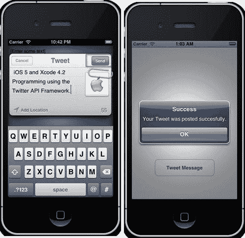

当你开始编写推文消息时，你可以选择将你的当前地理位置添加到消息中。此功能基本上使用 Google Maps API 来映射推文，并给 Twitter 用户提供在[`twitter.com/`](http://twitter.com/)上推文位置并允许他人查看 Google Maps 上精确位置的选择。

你还可以将附件添加到已编写的消息中，这可以是任何有效的图像（PNG、JPG 等）。点击**发送**按钮将消息提交到你的 Twitter 账户，你将收到一条消息，说明推文已成功发布。

以下截图显示了由前一个截图提交的推文条目，它将显示在[`twitter.com/:`](http://twitter.com/)上的样子。

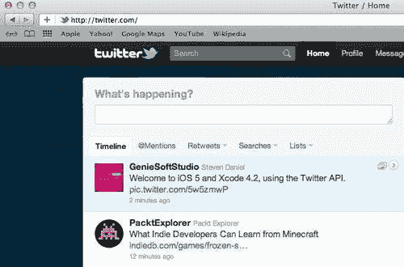

在本节中，我们探讨了如何将类似 Twitter 的功能集成到我们的应用程序中。通过包含 Twitter，应用程序可以以多种方式变得更加社交。例如，你可以在解锁游戏中的特殊物品、完成游戏或只想上传你的高分成就时自动推文。

这让他们的所有朋友都知道他们正在玩你的游戏，这反过来又让你获得更多的曝光。另一个例子可能是一个商业应用程序，它可能允许用户推文他们已完成的项目数量。鉴于 Twitter 最近受到如此多的关注，不将某种 Twitter 集成到自己的 iOS 应用程序中简直是疯了。

## 准备过渡到新的视图控制器

当用户在当前场景中触发 segue 时，故事板运行时会调用当前视图控制器的`prepareForSegue:sender:`方法。此方法给当前视图控制器一个机会，将任何所需的数据传递给即将显示的视图控制器。

为了以编程方式执行 segue，请按照以下简单步骤操作：

1.  确保你已经在两个`UIViewControllers`之间绘制了一个 segue。

1.  接下来，点击 segue 并填写标识符字段，使用一个唯一的名称，如以下截图所示：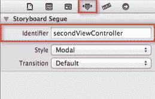

1.  现在，从`UIButton`的`IBAction`级别运行`prepareForSegue:segue:sender:`方法调用，如下面的代码片段所示：

    ```swift
    - (void)prepareForSegue:(UIStoryboardSegue *)segue sender:(id)sender{
    // Check to see that we are processing the correct
    // segue, before processing the alert.
    if ([segue.identifierisEqualToString: @"secondViewController"]) {
    UIAlertView *alert = [[UIAlertView alloc]initWithTitle: @"TwitterExample" message:@"Currently displaying View #2" delegate:self cancelButtonTitle:@"OK" otherButtonTitles:nil];
    [alert show];
    }
    }

    ```

在此代码片段中，我们使用控制器的标识符执行与控制器关联的 segue 调用。在显示警报之前，我们首先检查确保我们正在处理正确的 segue。

以这种方式处理可以让我们自定义转场，并且只要标识符是唯一的，就会将任何过渡应用到你的故事板中位于场景内的场景。

### 注意

关于如何实现`UIViewController`类的方法的信息，你可以参考以下位置的`UIViewController`类参考：`http://developer.apple.com/library/ios/#documentation/UIKit/Reference/UIViewController_Class/Reference/Reference.html#//apple_ref/occ/cl/UIViewController`。

## 以编程方式呈现故事板视图控制器

虽然故事板运行时通常处理视图控制器之间的过渡，但你也可以通过编程方式直接在代码中触发转场。你可能选择在 Interface Builder 中设置转场时这样做，或者你可能想使用加速度计事件来触发过渡并显示图形动画。

如果你查看以下示例代码片段，你将能够看到我们首先使用`UIStoryboard`的`instantiateViewControllerWithIdentifier`方法编程地加载视图控制器。最后，我们通过将其推入导航堆栈来呈现视图控制器。

```swift
// SampleViewController
- (void)viewDidLoad{
[super viewDidLoad];
// Instantiate the Samplesubview controller
// from the storyboard.
SampleViewController *subviewController = [self.mainStoryboard instantiateViewControllerWithIdentifier:@"subviewController"];
// Note: the "subviewController" Identifier value must
// be set in the Attributes Inspector on the
// subviewController scene.
// Add to self as child controller
[self addChildViewController:subviewController];
[self mainSubviewaddSubview:subviewController.view];
}

```

在本例中，我们将探讨如何将额外的视图控制器子类添加到我们的故事板中，并使用`performSegueWithIdentifier`方法调用编程地确定我们处于哪个视图。那么，让我们开始吧。

我们需要创建一个新的`UIViewController`子类文件，该文件将用于我们的第二个视图控制器。要创建`UIViewController`子类文件，请按照以下简单步骤操作：

1.  从**Xcode IDE**菜单中选择**文件 | 新建 | 新文件**。

1.  接下来，从可用模板列表中选择要使用的**UIViewController 子类**模板，如图所示。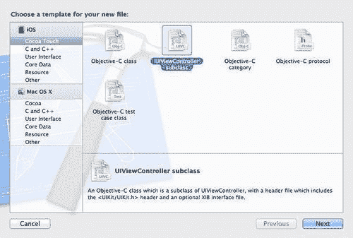

1.  在以下屏幕截图中输入`secondViewController`作为要创建的类的名称：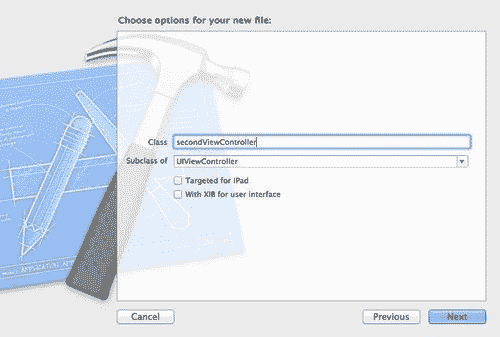

1.  确保你选择`UIViewController`作为要创建的子类名称。

1.  确保你没有勾选**针对 iPad**和**带有 XIB 用户界面**两个复选框。

1.  指定保存类文件的路径，然后点击**创建**按钮。

    完成后，你将返回到 Xcode IDE。你的`secondViewController`的接口和实现文件将出现在**项目导航器**窗口中。

1.  在**项目导航器**中，从**TwitterExample**文件夹下打开**ViewController.h**接口文件。

1.  修改文件并包含以下代码片段中指定的突出显示的代码部分：

    ```swift
    //
    // ViewController.h
    // TwitterExample
    //
    #import <UIKit/UIKit.h> @interface ViewController : UIViewController <UIActionSheetDelegate, UIAlertViewDelegate>{
    UIButton *postTweet;
    UIButton *aboutApp;
    }
    @property (nonatomic, retain) IBOutlet UIButton *postTweet;
    @property (nonatomic, retain) IBOutlet UIButton *showAbout;
    - (IBAction)postTweet:(id)sender;
    - (IBAction)showAbout:(id)sender;
    @end

    ```

1.  在此代码片段中，我们正在设置我们的代理对象，以便在视图控制器之间传递信息。

1.  在**Project Navigator**中，从`TwitterExample`文件夹中打开位于`ViewController.m`实现文件。

1.  修改文件，并包含以下代码片段中指定的突出显示的代码部分：

    ```swift
    - (void)prepareForSegue:(UIStoryboardSegue *)segue sender:(id)sender{
    // Check to see that we are processing the correct segue,
    //before processing the alert. if ([segue.identifierisEqualToString: @"firstViewController"]) {
    UIAlertView *alert = [[UIAlertView alloc]initWithTitle: @"TwitterExample" message:@"Currently displaying View #2" delegate:self cancelButtonTitle:@"OK" otherButtonTitles:nil];
    [alert show];
    }
    }

    ```

在此代码片段中，我们所做的是确定我们视图控制器的当前视图，并确保我们处于`firstViewController`中。我们通过检查`segue`属性，并获取我们之前声明的标识符值来实现这一点。如果我们处于正确的视图，则会在当前视图中显示一个弹出警告。

1.  在**Project Navigator**中，从`TwitterExample`文件夹中打开位于`secondViewController.h`接口文件。

1.  修改文件，并包含以下代码片段中指定的突出显示的代码部分：

    ```swift
    //
    // secondViewController.h
    // TwitterExample
    //
    #import <UIKit/UIKit.h> @interface secondViewController :UIViewController <UIActionSheetDelegate, UIAlertViewDelegate>
    - (IBAction)GoBack:(id)sender;
    @property (strong, nonatomic) IBOutlet UIButton *GoBack;
    @end

    ```

1.  在此代码片段中，我们所做的是设置我们的代理对象，以便在视图控制器之间传递信息。

1.  在**Project Navigator**中，从`TwitterExample`文件夹中打开位于`secondViewController.m`实现文件。

1.  修改文件，并包含以下代码片段中指定的突出显示的代码部分：

    ```swift
    - (void)prepareForSegue:(UIStoryboardSegue *)segue sender:(id)sender{
    // Check to see that we are processing the correct segue,
    // before processing the alert.
    if ([segue.identifierisEqualToString: @"secondViewController"]) {
    UIAlertView *alert = [[UIAlertView alloc]initWithTitle: @"TwitterExample" message:@"Currently displaying View #1" delegate:self cancelButtonTitle:@"OK" otherButtonTitles:nil];
    [alert show];
    }
    }

    ```

1.  在这里，我们正在确定我们视图控制器的当前视图，并确保我们处于`secondViewController`中。我们通过检查`segue`属性并获取我们之前声明的标识符值来实现这一点。如果我们处于正确的视图，则会在当前视图中显示一个弹出警告。

1.  选择我们刚刚创建的第二个视图控制器，然后在身份检查器部分中，点击**Custom Class**标题栏，并将**Class**更改为`secondViewController`，如图所示：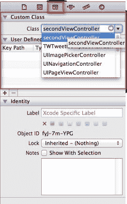

1.  在**Inspector**属性部分下，在**Storyboard Segue**部分中，输入`secondViewController`作为在视图之间移动时要使用的标识符，如图所示：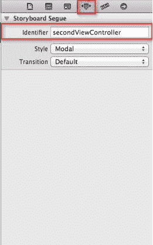

1.  接下来，我们需要为我们的第一个视图控制器应用相同的 Storyboard Segues。

1.  选择**Inspector**属性部分，然后在**Storyboard Segue**部分中，输入`firstViewController`作为要使用的唯一标识符。

1.  我们需要重复与`secondViewController`相同的步骤。

1.  我们的最后一步是通过在 Xcode IDE 中点击**Play**按钮或按*Command* + *R*来编译、构建和运行我们的`TwitterExample`应用程序。

    以下截图显示了在 iOS 模拟器中运行的`TwitterExample`应用程序，显示了在故事板中定义的每个视图控制器之间的程序性转换。

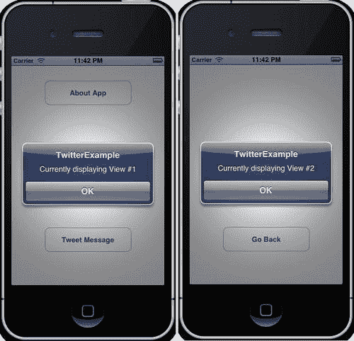

当你点击**关于应用**按钮时，它将过渡到第二个视图控制器，然后根据`prepareForSegue:(UIStoryboardSegue*)segue`方法调用显示消息，确定当前在视图中显示的当前视图控制器的标识符。

当你点击**返回**按钮时，这将控制权转移到第一个视图控制器，会调用`prepareForSegue`方法，以确定当前视图的当前标识符。

# 摘要

在本章中，我们学习了故事板实际上是什么，它们是如何工作的，如何添加场景并在故事板中配置这些场景，以及如何应用不同的过渡方法。

我们学习了 Twitter 框架以及我们如何使用可用的 Twitter API 集合成功发布消息和图片到 Twitter 账户。为了结束本章，我们探讨了如何使用各种方法在主故事板中的每个视图控制器之间进行过渡，无论是通过编程还是使用故事板过渡。

在下一章中，我们将学习**AirPlay**和**Core Image**框架，并探讨我们如何使用和实现这些框架到我们的应用中。我们将了解不同的图像过滤效果，以及如何在我们的应用中展示这些效果并将输出发送到外部设备，例如 Apple TV。
