# 第五章 使用 AirPlay 和 Core Image

从 iOS 4.2 的发布开始，开发者可以使用 AirPlay 将视频、音频和照片流式传输到支持 Apple TV 的设备。在 iOS 5 中，现在甚至更容易通过 Apple TV 自动无线镜像 iPad 2 上的所有内容到 HDTV。

随着 iOS 5 中提供的附加 API 集，使用 AV Foundation 框架构建的应用程序现在支持加密的音频和视频流，这些流通过 HTTP Live Streaming 传输，并且可以在每个 HDTV 和 iPad 2 屏幕上显示不同的内容。

Core Image 框架是一个硬件加速框架，它提供了一种简单的方式来增强照片和视频。这使得你可以在相机和图像编辑应用程序中创建惊人的效果。**Core Image** 提供了几个内置的过滤器，如色彩效果、扭曲和过渡。它还包括高级功能，如自动增强、红眼减少和面部识别。

在本章中，我们将更深入地了解这些框架是什么，以及如何在我们的应用程序中实现它们。我们将查看如何在我们的应用程序中集成 AirPlay，并使用 Apple TV 将信息导向另一个输出设备。我们还将查看 Core Image 框架，以及如何使用`CIImage`类使用各种过滤器效果。

在本章中，我们将：

+   了解 AirPlay 和 Core Image 框架

+   创建一个简单的 AirPlay 和 Core Image 应用程序

+   学习如何将应用程序内容输出到 Apple TV 设备

+   查看如何使用 `CIImage` 类应用各种过滤器效果，用于扭曲、过渡和色彩效果

本章我们将探讨一些精彩的内容。那么，让我们开始吧。

# 理解 AirPlay 框架

AirPlay 框架是一个更新的框架，允许您从任何基于 iOS 的设备流式传输音频和视频内容到任何支持 Airplay 的设备，这些设备能够播放音频和视频，例如电视和音频系统。从 iOS 5 开始，开发者现在可以灵活地将 Airplay 内容集成到他们的应用程序中，并将这些信息输出到附近的 Apple TV 2 接收器。

在本节中，我们将查看如何创建一个简单的应用程序，在 iOS 设备上播放视频内容，然后查看将此内容输出到 Apple TV 2 设备所需的步骤。

## 创建一个简单的 AirPlay 应用程序

播放视频是任何 iOS 设备上最常见的一项任务，所有视频都必须全屏播放和显示。在我们能够播放任何视频之前，我们需要将媒体播放器框架添加到我们的应用程序项目中。

在我们继续之前，我们首先需要创建我们的`AirPlayExample`项目。为了回忆如何创建新项目，你可以参考我们在第一章中覆盖的章节，名为*Creating the MyEmailApp application*下的*What's New in iOS5*。

1.  从`/Xcode4/Applications`文件夹中启动 Xcode。

1.  选择**Create a new Xcode project**，或**File | New Project**。

1.  从可用模板列表中选择**Single View Application**模板。

1.  在**Device Family**下拉菜单中选择**iPhone**。

1.  点击**Next**按钮继续到向导的下一步。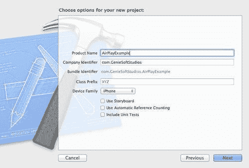

1.  将项目名称输入为`AirPlayExample`，然后点击**Next**按钮继续到向导的下一步。

1.  指定你想要保存项目的位置。

1.  点击**Save**按钮继续并显示 Xcode 工作区环境。

现在我们已经创建了`AirPlayExample`项目，我们需要向项目中添加一个重要的框架，以使我们的应用具有播放电影文件的能力。要将媒体播放器框架添加到你的项目中，选择**Project Navigator Group**，然后按照以下简单步骤操作：

1.  点击并从**Project Navigator**中选择你的项目。

1.  然后从**TARGETS**组下选择你的项目目标。

1.  选择**Build Phases**标签。

1.  展开**Link binary with Libraries**三角符号。

1.  最后，使用**+**来添加你想要的库。

1.  从可用框架列表中选择**MediaPlayer.framework**。如果你在列表中找不到所需的框架，也可以进行搜索。

如果你仍然不清楚如何添加框架，可以参考以下截图，它突出显示了你需要选择的部分（被红色矩形包围）：

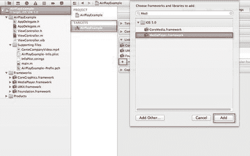

现在你已经将`MediaPlayer.framework`添加到你的项目中，我们需要开始构建我们的用户界面，该界面将负责播放电影：

1.  从 Project Navigator 中选择并打开**ViewController.xib**文件。

1.  从**Object Library**中选择并拖动一个圆角矩形按钮（`UIButton`）控件，并将其添加到我们的视图中。

1.  根据需要调整大小，然后修改圆角矩形按钮的**Object Attributes**部分，并将其标题设置为`Play Movie`。

我们不需要添加停止按钮，因为我们将在电影播放完毕时添加一个事件来处理它。如果你正确地遵循了步骤，你的视图应该看起来像以下截图所示。如果它看起来和我的一样，请随意调整你的：

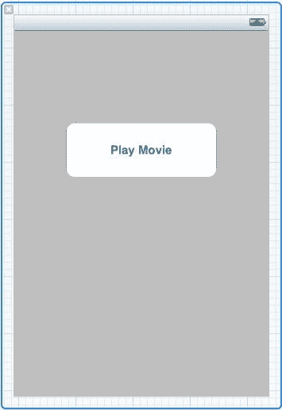

如您所见，我们的表单在这个阶段并没有做什么，如果您在模拟器中运行此应用程序，您会看到控件放置在您的屏幕上。以下步骤将向您展示如何将按钮连接到操作事件，每个事件将执行播放视频的任务。所以让我们开始吧：

1.  打开 `ViewController.h` 接口文件，并创建以下突出显示的条目，如代码片段所示：

    ```swift
    #import <UIKit/UIKit.h> #import <MediaPlayer/MediaPlayer.h>
    @interface ViewController : UIViewController -(IBAction)playMovie:(id)sender;
    @end

    ```

1.  我们需要创建一个操作事件。选择 **播放电影** 按钮，并按住 Control 键，将其拖入以下截图所示的 `ViewController.m` 实现文件类中：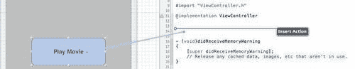

1.  为您要创建的操作指定一个名称。输入 `playMovie` 作为操作的名称。

1.  设置事件类型为 **Touch Up Inside**。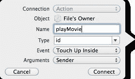

1.  点击 **连接** 按钮让 Xcode 创建事件。

1.  现在我们需要向 `playMovie` 函数中添加代码，该函数将处理播放我们的示例电影文件。为此函数输入以下代码片段：

    ```swift
    -(IBAction)playMovie:(id)sender{
    NSString *filepath = [[NSBundle mainBundle] pathForResource:@"GenieCompanyVideo" ofType:@"mp4"];
    NSURL *fileURL = [NSURL fileURLWithPath:filepath];
    MPMoviePlayerController *moviePlayerController = [[MPMoviePlayerController alloc]initWithContentURL:fileURL];
    [[NSNotificationCenter defaultCenter] addObserver:self selector:@selector(moviePlaybackComplete:) name:MPMoviePlayerPlaybackDidFinishNotification object:moviePlayerController];
    [self.view addSubview:moviePlayerController.view];
    moviePlayerController.fullscreen = YES;
    moviePlayerController.scalingMode = MPMovieScalingModeAspectFit;
    [moviePlayerController play];
    }

    ```

我们刚刚声明了一个变量（NSString）`filePath`，它将包含电影文件的文件路径。接下来，我们创建一个（NSURL）`fileUrl`，将文件路径转换为对象，这是 `MPMoviePlayerController` 在初始化时所需的。然后我们将 `MPMoviePlayerController` 视图添加到我们的自定义视图控制器中，以便它在屏幕上显示。我们指定要全屏显示，最后我们告诉 `moviePlayerController` 开始播放。

由于我们已经为 `moviePlayerController` 对象分配了内存，在这个阶段我们还没有释放它，这主要是因为我们不知道电影播放何时实际上会完成。

幸运的是，`MPMoviePlayerController` 对象预先构建了处理此场景的方法，并在电影播放完成后向 `NSNotificationCenter` 发送一个名为 `MPMoviePlayerPlaybackDidFinishNotification` 的通知方法，如前一个代码片段中突出显示的代码所示。

当我们在 iPhone 应用程序中播放视频内容时，有时需要修改 `MPMoviePlayerController` 对象的 `scalingMode` 属性。通过设置此属性，它将确定电影图像如何适应填充您定义的播放大小。以下是目前存在的缩放模式，并在此处显示：

+   `MPMovieScalingModeNone`

+   `MPMovieScalingModeAspectFit`

+   `MPMovieScalingModeAspectFill`

+   `MPMovieScalingModeFill`

两个主要的常用缩放模式是 `MPMovieScalingModeAspectFill` 和 `MPMovieScalingModeFill`。

### 注意

关于不同缩放模式之间的比较的更多信息，请参阅以下位置的*MPMoviePlayerController 类参考* `http://developer.apple.com/library/ios/#documentation/mediaplayer/reference/MPMoviePlayerController_Class/Reference/Reference.html#//apple_ref/doc/c_ref/MPMoviePlayerController`。

为了在您的应用程序中实现此属性，请在`[moviePlayerController play]`语句之前插入以下行代码：

```swift
moviePlayerController.scalingMode = MPMovieScalingModeFill;

```

当您运行应用程序时，您会注意到视频占据了整个可用空间。接下来，我们需要创建`moviePlaybackComplete:`方法，它将负责释放我们的`moviePlayerController`对象，如下面的代码片段所示：

```swift
- (void)moviePlaybackComplete:(NSNotification *)notification{
MPMoviePlayerController *moviePlayerController = [notification object];
[[NSNotificationCenter defaultCenter] removeObserver:self name:MPMoviePlayerPlaybackDidFinishNotification object:moviePlayerController];
[moviePlayerController.view removeFromSuperview];
[moviePlayerController release];
}

```

在此代码片段中，我们将一个对象传递给了通知方法。这 whatever 我们在之前的代码片段中传递的内容，由于`moviePlayerController`对象。我们首先使用`[notification object]`语句检索对象，然后使用新的`MPMoviePlayerController`指针引用它。

然后，我们向`NSNotificationCenter`方法发送消息，移除我们在`playMovie`函数中之前注册的观察者。我们最后继续清理我们的自定义视图控制器，并释放之前分配给`moviePlayerController`对象的内存。

以下截图显示了我们的`AirPlayExample`应用程序在 iOS 模拟器中运行，电影播放设置为横幅模式进行查看；支持在竖幅模式下显示此内容：

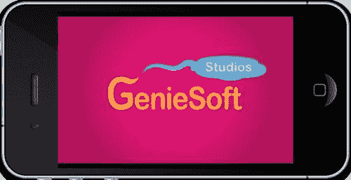

在本节中，我们学习了`MediaPlayer`框架，以及我们如何在应用程序中使用它来获得播放音频和视频的能力。

如您所见，通过使用媒体播放器框架和`MPMoviePlayerController`类，您可以将电影播放功能集成到您的 iOS 应用程序中。在下一节中，我们将探讨修改应用程序的步骤，以便使用 Apple TV 在电视屏幕上显示。我们学习了视频播放的各种缩放模式以及如何实现这些模式。

## 使用 AirPlay 将应用程序内容呈现到 Apple TV

从 iOS 4.3 版本开始，苹果公司决定向其开发者提供迄今为止最令人印象深刻的框架之一，这将允许开发者将 AirPlay 功能集成到他们的应用程序中。只需几行代码，任何 iOS 应用程序都可以修改为具有直接将视频流式传输到 Apple TV 设备的能力。

要启用 AirPlay 功能，我们需要在`MPMoviePlayerController`对象上启用一个特殊属性，通过将`allowsAirPlay`属性设置为`YES`。

要在您的应用程序中启用 AirPlay 功能，请按照以下简单步骤操作：

1.  打开位于`AirPlayExample`文件夹内的`ViewController.m`实现文件，并在`playMovie`函数中找到以下语句：

    ```swift
    [self.view addSubview:moviePlayerController.view];

    ```

1.  接下来，添加以下代码片段：

    ```swift
    if([moviePlayerController respondsToSelector:@selector(setAllowsAirPlay:)]){
    [moviePlayerController setAllowsAirPlay:YES];
    }

    ```

1.  在此代码片段中，我们使用`MPMoviePlayerController`对象的`.respondsToSelector:`方法来适应不支持`allowsAirPlay`属性的较旧 iOS 设备。

    如果我们不这样做，它将导致运行时错误异常发生，这将导致您的应用程序崩溃。为了仅向支持 AirPlay 的设备提供 AirPlay，我们需要在检查`MPMoviePlayerController`对象是否支持`allowsAirPlay`选项的语句周围放置一个条件语句。

    ### 注意

    当此设置被激活时，它将在电影播放器控制器面板中引起一个额外图标的显示。您无法通过编程方式控制此图标的位置。

1.  最后，构建并运行您的应用程序，然后点击**播放电影**按钮。以下截图显示了启用 AirPlay 时此图标的外观：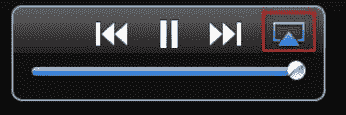

1.  当按下 AirPlay 图标时，您将看到一个弹出列表，其中包含可选择的检测到的输出设备选项。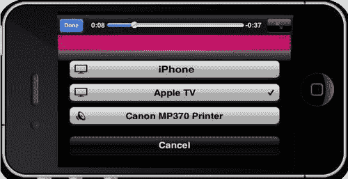

1.  如果您选择如截图所示的**Apple TV**选项，您的 iOS 设备上的输出将消失，并且您将收到通知，视频正在 Apple TV 设备上播放。这如图下所示：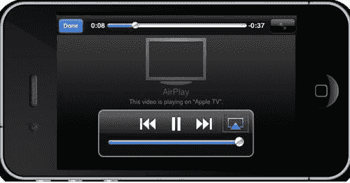

1.  最后，您将在 Apple TV 设备上看到您的视频正在播放，如图下所示：

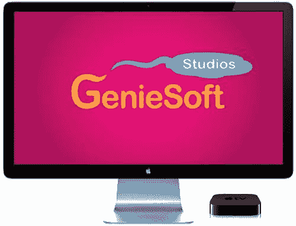

如您所见，通过遵循几个简单的步骤，您可以轻松地将现有应用程序的功能集成到 Airplay 感知应用程序中。

在以下列表中，您将找到在将 AirPlay 集成到您的项目中时需要考虑的一些事项：

+   苹果公司仅在其最新的设备上提供了 AirPlay 4.3 SDK 的此功能。因此，iPhone 3G 设备没有 AirPlay 支持。

+   当启动 AirPlay 启用应用程序时，您需要确保您的 iOS 设备和 Apple TV 软件运行的是同一版本的操作系统，否则您可能会遇到一些问题。

+   为了让 iOS 设备找到其他 Apple AirPlay 启用设备，您需要确保您连接的是与您的 AirPlay 设备相同的 Wi-Fi 网络。

### 注意

如需了解更多关于 AirPlay 框架的信息，您可以参考以下 Apple 开发者网站：[`developer.apple.com/library/ios/#releasenotes/General/WhatsNewIniPhoneOS/Articles/iOS4_3.html#//apple_ref/doc/uid/TP40010567-SW1`](http://developer.apple.com/library/ios/#releasenotes/General/WhatsNewIniPhoneOS/Articles/iOS4_3.html#//apple_ref/doc/uid/TP40010567-SW1).

## 理解 Core Image 框架

Core Image 框架是一个可扩展的图像处理技术架构，它已集成到 Mac OS X v10.4 和 iOS 5.0 中。此框架利用可编程图形硬件提供近似实时的、像素级准确的图像处理，以及视频处理。Core Image 随带超过 100 个内置过滤器，供希望在其应用程序中支持图像处理的过滤器客户端使用。

Core Image 过滤器参考描述了这些过滤器；内置过滤器的列表可能会更改，因此出于这个原因，Core Image 提供了让您查询系统以获取这些可用过滤器的功能。您还可以加载第三方开发者打包为图像单元的过滤器。Core Image **应用程序编程接口**（**API**）是 **Quartz Core 框架**（**QuartzCore.framework**）的一部分，它提供了对内置图像过滤器（包括视频和静态图像）的访问，并支持创建自定义过滤器。

您可以通过链接到 Core Image 框架来使用 Cocoa 和 Carbon 框架中的 Core Image。通过使用 Core Image 框架，您可以使用 Core Image 中捆绑的过滤器或您或另一位开发者创建的过滤器执行以下类型的操作：

+   裁剪图像并校正颜色，例如执行白点调整

+   应用颜色效果，例如棕褐色

+   模糊或锐化图像

+   合成图像并扭曲或变换图像的几何形状

+   生成颜色、棋盘图案、高斯渐变和其他图案图像

+   向图像或视频添加过渡效果

+   在视频上提供实时颜色调整

以下截图向您展示了 Core Image 在 Mac OS X 中与其他图形技术的关系：

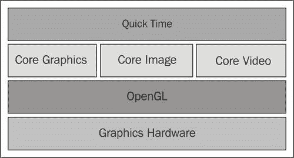

如您所见，**Core Image** 框架已与这些技术集成，允许您将它们一起使用以实现广泛的结果。您可以使用 Core Image 处理在 Quartz 2D（Core Graphics）中创建的图像以及在 OpenGL 中创建的纹理。您还可以将 Core Image 过滤器应用于使用 Core Video 播放的视频。

Core Image 随带超过 100 个内置过滤器，供希望在其应用程序中支持图像处理的过滤器客户端使用。Core Image 过滤器参考描述了这些过滤器；内置过滤器的列表可能会更改，因此 Core Image 提供了让您查询系统以获取这些可用过滤器的功能。您还可以加载第三方开发者打包为图像单元的过滤器。

### 备注

关于 Core Image API 中可用的内置过滤器更多信息，请参考 [Mac OS X 开发者库](http://developer.apple.com/library/mac/#documentation/graphicsimaging/reference/CoreImageFilterReference/Reference/reference.html)。

以下代码片段显示了可用内置 Core Image 过滤器的列表。

```swift
NSArray *builtInFilterList = [CIFilter filterNamesInCategory:kCICategoryBuiltIn];
NSLog(@"%@", builtInFilterList);

```

以下表格显示了当执行此代码时可用核心图像过滤器列表：

| 核心图像过滤器名称 | 核心图像过滤器名称 |
| --- | --- |
| `CIAdditionCompositing` | `CIAffineTransform` |
| `CICheckerboardGenerator` | `CIColorBlendMode` |
| `CIColorBurnBlendMode` | `CIColorControls` |
| `CIColorCube` | `CIColorDodgeBlendMode` |
| `CIColorInvert` | `CIColorMatrix` |
| `CIColorMonochrome` | `CIConstantColorGenerator` |
| `CICrop` | `CIDarkenBlendMode` |
| `CIDifferenceBlendMode` | `CIExclusionBlendMode` |
| `CIExposureAdjust` | `CIFalseColor` |
| `CIGammaAdjust` | `CIGaussianGradient` |
| `CIHardLightBlendMode` | `CIHighlightShadowAdjust` |
| `CIHueAdjust` | `CIHueBlendMode` |
| `CILightenBlendMode` | `CILinearGradient` |
| `CILuminosityBlendMode` | `CIMaximumCompositing` |
| `CIMinimumCompositing` | `CIMultiplyBlendMode` |
| `CIMultiplyCompositing` | `CIOverlayBlendMode` |
| `CIRadialGradient` | `CISaturationBlendMode` |
| `CIScreenBlendMode` | `CISepiaTone` |
| `CISoftLightBlendMode` | `CISourceAtopCompositing` |
| `CISourceInCompositing` | `CISourceOutCompositing` |
| `CISourceOverCompositing` | `CIStraightenFilter` |
| `CIStripesGenerator` | `CITemperatureAndTint` |
| `CIToneCurve` | `CIVibrance` |
| `CIVignette` | `CIWhitePointAdjust` |

显示的列表包含适用于 Mac OS X 和 iOS 5 操作系统的过滤器，因此建议您参考 Core Image 过滤器参考文档以确定哪些过滤器适用于哪些技术。

### 备注

关于 Core Image 框架和 Core Image 过滤器参考文档的更多信息，您可以在 Apple 开发者网站上获取：[`developer.apple.com/library/ios/#documentation/GraphicsImaging/Conceptual/CoreImaging/ci_intro/ci_intro.html`](http://developer.apple.com/library/ios/#documentation/GraphicsImaging/Conceptual/CoreImaging/ci_intro/ci_intro.html)。

## 创建一个简单的 Core Image 应用程序

Apple 提供了超过 100 个 Core Image 图像处理过滤器，因此你很容易在你的应用程序中启用对图像处理的支持，使用这些内置功能。图像处理包括对照片应用效果以翻转或旋转图像，增强图像的清晰度，甚至从家庭照片中去除红眼。在我们能够做到这一点之前，我们需要将 Core Image 框架作为我们应用程序项目的一部分包含进来。

在我们继续之前，我们首先需要创建我们的`CIFilterEffectsproject`。为了刷新你的记忆，你可以参考我们在第一章中覆盖的部分，即*iOS5 的新特性*下的*创建 MyEmailApp 应用程序*部分。

1.  从`/Xcode4/Applications`文件夹中启动 Xcode。

1.  选择**创建一个新的 Xcode 项目**，或者**文件 | 新项目**。

1.  从可用模板列表中选择**单视图应用程序**模板。

1.  从**设备家族**下拉菜单中选择**iPhone**。

1.  点击**下一步**按钮，进入向导的下一步。

1.  将项目名称输入为`CIFilterEffects`，然后点击**下一步**按钮继续向导的下一步。

1.  指定你想要保存项目的位置。

1.  点击**保存**按钮继续，并显示 Xcode 工作区环境。

现在我们已经创建了`CIFilterEffects`项目，我们现在需要向项目中添加一个重要的框架，这将使我们能够应用多种不同的图像效果。要将 Core Image 框架添加到你的项目中，选择**项目导航器组**，然后按照以下简单步骤操作：

1.  点击并从**项目导航器**中选择你的项目。

1.  然后在**TARGETS**组下选择你的项目目标。

1.  3 选择**构建阶段**标签。

1.  展开链接二进制与库的展开三角形。

1.  使用**+**添加你想要的库。

1.  从可用框架列表中选择**CoreImage.framework**。如果你在列表中找不到你想要的框架，也可以进行搜索。

如果你仍然不清楚如何添加框架，请查看这个截图，它突出显示了你需要选择的部分（被红色矩形包围）：

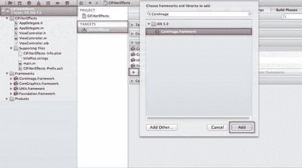

现在你已经将**CoreImage.framework**添加到你的项目中，我们需要开始构建我们的用户界面，它将负责允许选择图像并应用过滤器效果：

1.  从项目导航器中，选择并打开**ViewController.xib**文件。

1.  从**对象库**中，选择并拖动一个（`UIImageView`）图像视图控件到我们的视图中。

1.  根据需要调整这个控件的大小，使其占据屏幕的整个区域。

1.  从**对象库**中，选择并拖动一个（`UIButton`）圆形矩形按钮控件到我们的视图中。

1.  根据需要调整大小，然后修改圆角矩形按钮的 **对象** 属性部分，并将其标题设置为 `Choose Image`。

1.  接下来，从 **对象库** 中选择并拖动一个 (`UIButton`) 圆角矩形按钮控件到 **Choose Image** 按钮右侧的视图中。

1.  根据需要调整大小，然后修改圆角矩形按钮的 **对象属性** 部分，并将其标题设置为 `Filter Effects`。

如果你正确地遵循了步骤，你的视图应该看起来像以下截图所示。如果它看起来不太像我的一样，请随意调整你的。

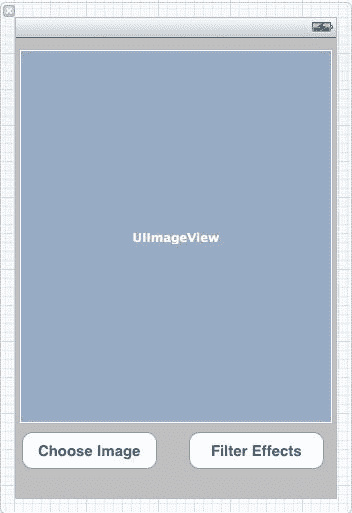

如您所见，我们的表单在这个阶段并没有做什么，如果您在模拟器上运行此应用程序，您将看到控件放置在您的屏幕上。以下步骤将向您展示如何将按钮连接到动作事件，每个事件都将执行选择图片并应用滤镜效果的任务。那么，让我们开始吧：

1.  打开 `ViewController.h` 接口文件，并按照以下代码片段创建以下突出显示的条目：

    ```swift
    #import <UIKit/UIKit.h> @interface ViewController : UIViewController<UIImagePickerControllerDelegate, UINavigationControllerDelegate, UIAlertViewDelegate, UIActionSheetDelegate> {
    UIImageView *imageView;
    UIButton *chooseImage;
    UIButton *filterEffects;
    }
    @property (nonatomic, retain) IBOutlet UIImageView *imageView;
    @property (nonatomic, retain) IBOutlet UIButton *chooseImage;
    @property (nonatomic, retain) IBOutlet UIButton *filterEffects;
    -(IBAction) getImage:(id) sender;
    -(IBAction) getFilterEffects:(id) sender;
    @end

    ```

1.  我们需要创建一个动作事件。选择 **选择图片** 按钮，并按住 *Ctrl* 键将其拖动到 `ViewController.m` 实现文件类中，如图所示：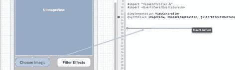

1.  为要创建的动作指定一个名称。输入 `getImage` 作为动作的名称。

1.  将事件类型设置为 **触摸内部释放**：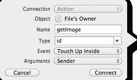

1.  点击 **连接** 按钮让 Xcode 创建事件。

1.  我们需要创建一个动作事件。选择 **Filter Effects** 按钮，并按住 *Ctrl* 键将其拖动到 `ViewController.m` 实现文件类中，如图所示：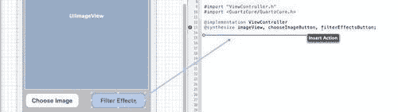

1.  为要创建的动作指定一个名称。输入 `getFilterEffects` 作为动作的名称。

1.  将事件类型设置为 **触摸内部释放**：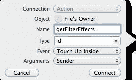

1.  点击 **连接** 按钮让 Xcode 创建事件。

现在我们已经连接了我们的动作事件，我们现在需要合成我们的用户界面控件，以便我们可以在视图中访问它们。

1.  打开位于 `CIFilterEffects` 文件夹中的 `ViewController.m` 实现文件，并在 `@implementation` 语句下方添加以下突出显示的语句。

    ```swift
    #import "ViewController.h" #import "QuartzCore/QuartzCore.h"
    @implementation ViewController @synthesize imageView, chooseImage, filterEffects;

    ```

1.  在此代码片段中，我们让实现文件了解位于我们用户界面表单上的控件。如果没有声明，我们将收到警告消息，这可能会使程序产生一些奇怪的结果，甚至可能在 iOS 设备上导致应用程序崩溃。

1.  接下来，我们需要将代码添加到我们的`getImage`函数中，这将使我们能够从照片库中选择一个图像，并将其显示到我们的`UIViewImage`控件中。为此函数输入以下代码片段：

    ```swift
    -(IBAction) getImage:(id) sender {
    UIImagePickerController * picker = [[UIImagePickerController alloc] init];
    picker.delegate = self;
    picker.sourceType = UIImagePickerControllerSourceTypeSavedPhotosAlbum;
    [self presentModalViewController:picker animated:YES];
    }
    - (void)imagePickerController:(UIImagePickerController *) picker didFinishPickingMediaWithInfo:(NSDictionary *)info {
    [picker dismissModalViewControllerAnimated:YES];
    imageView.image = [info objectForKey:@"UIImagePickerControllerOriginalImage"];
    [picker release];
    }

    ```

1.  此代码片段创建了一个`UIImagePickerController`实例，这将使我们能够从 iOS 设备的相册中选择照片图像。然后，我们修改并初始化选择器控件的`sourceType`属性，并告诉它使用`UIImagePickerControllerSourceTypeSavedPhotosAlbum`常量。最后的语句显示相册，并允许你选择一个图像。

1.  然后，我们声明另一个方法，`imagePickerController:(UIImagePickerController *)picker didFinishPickingMediaWithInfo:(NSDictionary *)info`，该方法在图像选择后会被调用。选择器随后关闭，并将图像显示到我们放置在用户界面上的`UIImageView`控件中。`UIImagePickerController`类采用了`UIImagePickerControllerDelegate`和`UINavigationControllerDelegate`协议。

1.  接下来，我们需要将代码添加到我们的`getFilterEffects`函数中，这将使我们能够从一系列选项中选择一个滤镜效果，并将其应用到`imageView`控件中的加载图像上。

1.  在此函数中输入以下代码片段：

    ```swift
    // Displays our Action Sheet
    - (IBAction)getFilterEffects:(id)sender {
    // Define an instance of our Action Sheet
    UIActionSheet *actionSheet;
    // Initialise our Action Sheet with options
    actionSheet=[[UIActionSheet alloc]initWithTitle:@"Available Actions" delegate:self cancelButtonTitle:@"Cancel" destructiveButtonTitle:@"Close" otherButtonTitles: @"Hue Adjust",@"Vibrance",@"Color Invert",@"Straighten Filter",@"Ripple Effect", nil];
    [actionSheet showInView:self.view];
    [actionSheet release];
    }

    ```

1.  此代码片段声明、创建并初始化了一个`actionSheet`变量，该变量设置了一个可以选择并应用于图像的滤镜选项列表。值得一提的是，`UIActionSheet`类采用了`UIActionSheetDelegate`协议。以下截图显示了这些选项在显示时的样子：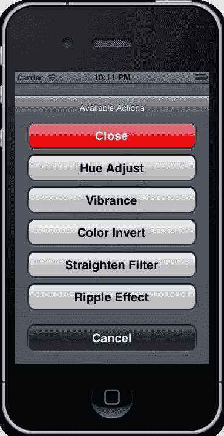

1.  接下来，我们需要创建`actionSheet`函数，该函数将根据列表中选择的按钮索引处理并应用所需的滤镜类型到图像上。

1.  为此函数输入以下代码片段：

    ```swift
    // Delegate which handles the processing of the option buttons //selected
    - (void)actionSheet:(UIActionSheet *)actionSheet clickedButtonAtIndex:(NSInteger)buttonIndex{}

    ```

1.  此代码片段将用于确定从动作表选项面板中选择了哪个按钮。这是通过传递到该函数的`buttonIndex`属性推导出来的。在下一节中，我们将探讨如何根据列表中的选择应用这些图像效果。

## 学习如何使用 CIImage 类应用图像滤镜效果

当你想对图像应用效果时，会使用`Core Image`类。这可能是当你想要像素化一个图像，或者处理图像中的红眼时。你可以使用`CIImage`对象与其它`Core Image`类一起使用，例如`CIFilter`、`CIContent`、`CIVector`和`CIColor`类。为了在处理图像时利用内置的`Core Image`滤镜，你可以使用`CVImageBufferRef`从多种数据源创建`CIImage`对象，包括 Quartz 2D 图像和 Core Video 图像缓冲区。

`CIImage` 对象与其相关联的是图像数据，但它本身并不是一个图像。一个 `CIImage` 对象包含了生成图像所需的所有信息，但 Core Image 不会实际渲染图像，直到被指示这样做。此方法允许 Core Image 以尽可能高效的方式运行。当使用 `CIImage` 类时，它包含多个参数，这些参数在以下表格中进行了说明：

| **CIImage 类参数** | **描述** |
| --- | --- |
| 过滤器类别 | 这指定了效果类型（模糊、扭曲、生成等）或其预期用途（静态图像、视频、非正方形像素等）。一个过滤器可以属于多个类别之一。 |
| 显示名称 | 这是应在用户界面中显示的名称 |
| 过滤器名称 | 这是用于程序访问过滤器的名称。 |
| 输入参数 | 这些可以包含一个或多个输入参数，让你可以控制处理方式。 |
| 属性类 | 你创建的每个输入参数都包含一个属性类，用于指定其数据类型，例如 NSNumber。输入参数可以可选地具有其他属性，例如其默认值、允许的最小和最大值、参数的显示名称以及 CIFilter 中描述的任何其他属性。 |

例如，如果你选择单色颜色过滤器，它包含三个输入参数：要处理的图像、单色颜色和颜色强度。你提供图像，并可以选择设置颜色和颜色强度。

大多数过滤器，包括单色颜色过滤器，为每个非图像输入参数都有默认值。如果你选择不提供自己的输入参数值，Core Image 将使用默认值来处理你的图像。过滤器属性存储为键值对。

**键**是一个标识属性的常量，**值**是与键关联的设置。Core Image 属性值通常是以下数据类型之一：

+   **字符串**：这些用于诸如显示名称之类的用途。

+   **浮点数**：它们用于指定标量值，例如强度级别和半径。

+   **向量**：它们可以有两个、三个或四个元素，每个元素都是一个浮点数。这些用于指定位置、区域和颜色值。

+   **颜色**：它们指定颜色值和颜色空间，以解释这些值。

+   **图像**：它们是轻量级对象，用于指定图像。

+   **变换**：它们指定应用于 `image.CIContext` 的仿射变换。

在下一节中，我们将探讨如何在将各种类型的颜色效果应用到我们的 `CIFilterEffects` 应用程序时使用一些这些技术，当从我们的操作表选项列表中选择了一个过滤器类型时。

打开位于 `CIFilterEffects` 文件夹中的 `ViewController.m` 实现文件，找到 `- (void)actionSheet:(UIActionSheet *)actionSheet clickedButtonAtIndex:(NSInteger)buttonIndex`，并在函数声明之后添加以下代码语句。

```swift
CIContext *context = [CIContext contextWithOptions:nil];
CIImage *cImage = [CIImage imageWithCGImage:[imageView.image CGImage]];
CIImage *result;

```

在这个代码片段中，我们声明了一个名为 `context` 的 `CIContext` 变量。这个变量将用于将图像对象 `cImage` 渲染到视图中。然后，我们声明了一个 `cImage` 变量对象，其类型为 `CIImage`，包含指向 `imageView` 中图像的指针。最后，我们声明了一个 `CIImage result` 变量，用于应用图像过滤器更改，并将修改后的图像输出到 `imageView` 控件。

### 颜色效果

在本节中，我们将查看将操作表弹出窗口中显示的每个选项应用到我们选择的苹果标志图像上，该图像来自我们的 iOS 照片库。

1.  打开位于 `CIFilterEffects` 文件夹中的 `ViewController.m` 实现文件。

1.  接下来，定位到 `- (void)actionSheet:(UIActionSheet *)actionSheet clickedButtonAtIndex:(NSInteger)buttonIndex`，并在之前代码片段中应用的变量声明之后添加以下代码语句：

    ```swift
    // Handle when the Hue Adjust Filter option has been chosen.
    if (buttonIndex == 1){
    CIFilter *hueAdjust = [CIFilter filterWithName:@"CIHueAdjust"];
    [hueAdjust setDefaults];
    [hueAdjust setValue: cImage forKey: @"inputImage"];
    [hueAdjust setValue: [NSNumber numberWithFloat: 2.094] forKey: @"inputAngle"];
    result = [hueAdjust valueForKey: @"outputImage"];
    }

    ```

1.  在这个代码片段中，我们首先声明了一个名为 `hueAdjust` 的 `CIFilter` 变量。这个变量将用来表示我们想要应用到图像上的过滤器类型。

1.  在下一步中，我们将变量 `cImage` 的类型 `CIImage` 指向我们 `UIImageView` 控件中选择的图像，并将其分配给 `inputImage`。

接下来，我们通过设置 `inputAngle` 属性的值来指定应用到图像上的色调级别。完成这些操作后，我们将对图像应用 `hue Adjustment`，并将结果返回到我们的 `UIImage` 结果中，基于 `outputImage` 属性，然后将这个结果输出到我们的 `UIImageView` 控件。

### 注意

当设置 `inputAngle` 属性的值时，这些值从最小值 `-3.14` 到最大值 `3.14` 有一个起始范围。还有一个默认值 `0.00`。

以下截图显示了应用了色调饱和度的图像输出。你会注意到它改变了源像素的整体色调或色调：

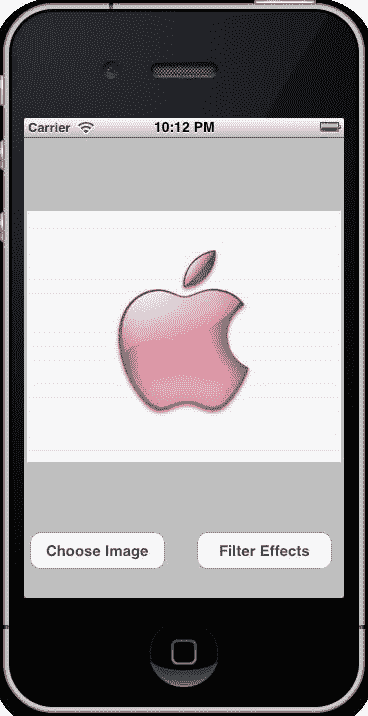

接下来，我们将查看 **Vibrance** 选项，并看看当我们在操作表中的选项列表中选择这个 Core Image 过滤器时会发生什么。

1.  打开位于 `CIFilterEffects` 文件夹中的 `ViewController.m` 实现文件，并在之前代码片段中应用的下一段代码块下方添加以下代码语句：

    ```swift
    // Handle when the Vibrance Filter option has been chosen.
    else if (buttonIndex == 2){
    CIFilter *vibrance = [CIFilter filterWithName:@"CIVibrance"];
    [vibrance setDefaults];
    [vibrance setValue: cImage forKey: @"inputImage"];
    [vibrance setValue: [NSNumber numberWithFloat: 1.00] forKey: @"inputAmount"];
    result = [vibrance valueForKey: @"outputImage"];
    }

    ```

1.  在这个代码片段中，我们首先声明了一个名为 `vibrance` 的 `CIFilter` 变量。这个变量将用来表示我们想要应用到图像上的过滤器类型。

1.  在下一步中，我们将变量 `cImage` 的类型设置为 `CIImage`，它指向我们 `UIImageView` 控件中选择的照片，并将其分配给 `inputImage`。最后，我们通过设置 `inputAmount` 属性的值来分配应用到图像的饱和度级别。

### 注意

在设置 `inputAmount` 属性的值时，这些值从最小值 `-1.00` 到最大值 `1.00` 有一个起始范围。还有一个默认值 `0.00`。

+   以下截图显示了应用了 Vibrance 饱和度的图像输出。您会注意到它减少了图像颜色，同时保持了良好的肤色平衡：

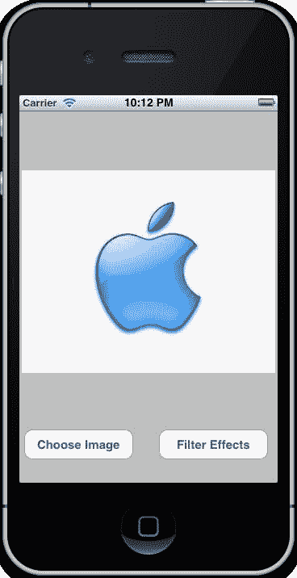

接下来，我们将查看 **Color Invert** 选项，并观察当我们在 actionsheet 的选项列表中选择此 Core Image 过滤器时会发生什么。

1.  打开位于 `CIFilterEffects` 文件夹中的 `ViewController.m` 实现文件，并在之前代码片段中应用的下一段代码块下方添加以下代码语句。

    ```swift
    // Handle when the Color Invert option has been chosen.
    else if (buttonIndex == 3){
    CIFilter *invert = [CIFilter
    filterWithName:@"CIColorInvert"];
    [invert setDefaults];
    [invert setValue: cImage forKey:@"inputImage"];
    result = [invert valueForKey:@"outputImage"];
    }

    ```

1.  在此代码片段中，我们首先声明一个名为 `invert` 的 `CIFilter` 变量。这将用于表示我们想要应用到图像上的过滤器的类型。

1.  在下一步中，我们将变量 `cImage` 的类型设置为 `CIImage`，它指向我们 `UIImageView` 控件中选择的照片，并将其分配给 `inputImage`。

    以下截图显示了应用了 Color Invert 过滤器的图像输出。您会注意到图像颜色已被反转，以显示更多负图像：

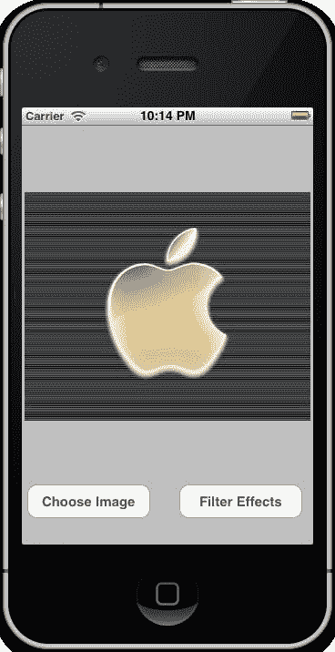

接下来，我们将查看 **Straighten Filter** 选项，并观察当我们在 actionsheet 的选项列表中选择此 Core Image 过滤器时会发生什么。

1.  打开位于 `CIFilterEffects` 文件夹中的 `ViewController.m` 实现文件，并在之前代码片段中应用的下一段代码块下方添加以下代码语句。

    ```swift
    // Handle when the Straighten Filter option has been chosen.
    else if (buttonIndex == 4){
    CIFilter *straightenFilter = [CIFilter filterWithName:@"CIStraightenFilter"];
    [straightenFilter setDefaults];
    [straightenFilter setValue: cImage forKey:@"inputImage"];
    [straightenFilter setValue: [NSNumber numberWithFloat: 3.10] forKey: @"inputAngle"];
    result = [straightenFilter valueForKey:@"outputImage"];
    }

    ```

1.  在此代码片段中，我们首先声明一个名为 straightenFilter 的 CIFilter 变量。这将用于表示我们想要应用到图像上的过滤器的类型。

1.  在下一步中，我们将变量 `cImage` 的类型设置为 `CIImage`，它指向我们 `UIImageView` 控件中选择的照片，并将其分配给 `inputImage`。最后，我们通过设置 `inputAngle` 属性的值来分配应用到图像的角度级别旋转。

### 注意

在设置 `inputAngle` 属性的值时，这些值从最小值 -3.14 到最大值 `3.14` 有一个起始范围。还有一个默认值 `0.00`。

+   以下截图显示了应用了 Straighten 过滤器的图像输出。您会注意到它将源图像按指定的弧度旋转。然后图像被缩放并裁剪，以便旋转后的图像适合视图：

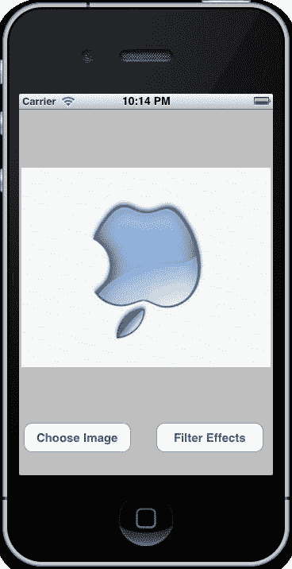

接下来，我们需要添加代码，用于在应用基于我们的核心图像滤镜后输出更新后的图像。

1.  打开位于`CIFilterEffects`文件夹中的`ViewController.m`实现文件，并在之前代码片段中应用的上一个代码块下方添加以下代码语句：

    ```swift
    // Only process when button index is based on the list of //options.Ignore the Close and Cancel buttons and then display
    // our update image to our UIImageView Control.
    if (buttonIndex != 0 && buttonIndex != 5 && buttonIndex != 6) {
    self.imageView.image = [UIImage imageWithCGImage:[context createCGImage:result fromRect:CGRectMake(0, 0, self.imageView.image.size.width, self.imageView.image.size.height)]];
    }

    ```

1.  在此代码片段中，我们首先检查确保我们不是在处理我们的**关闭**和**取消**按钮，因为这些按钮不会将核心图像过滤器应用于图像。这是一种保护我们应用程序的通用方法，以防止它崩溃。

    接下来，我们使用`imageWithCGImage`方法创建并返回一个表示指定 Quartz 图像的图像对象，然后将此图像显示回我们的`UIImageView imageView`控件，并设置其显示为图像视图的宽度和高度。

在下一节中，我们将探讨如何利用 Quartz Core 框架将转换效果应用于图像。

### 转换

**转换**通常用于将某种效果应用于图像。这些效果随时间渲染，需要你设置一个计时器事件。在本节中，我们将向我们的`CIFilterEffects`示例应用程序添加一些代码，以展示我们可以将水波纹效果应用于图像的最简单方法之一。

幸运的是，你不必担心，因为 QuartzCore 框架中已经包含了一个涟漪效果组件，这将在渲染此效果时利用图形硬件加速。

为了在我们应用程序中使用转换，我们需要向项目中添加一个重要的框架，这将使我们能够应用多种不同的图像效果。

要将 QuartzCore 框架添加到你的项目中，请选择**项目导航器组**，然后按照以下简单步骤操作：

1.  点击并从**项目导航器**中选择你的项目。

1.  然后从**TARGETS**组下选择你的项目目标。

1.  选择**构建阶段**选项卡。

1.  展开显示**链接二进制与库**的展开三角形。

1.  最后，使用**+**来添加你想要的库。

1.  从可用的框架列表中选择**QuartzCore.framework**。如果你找不到你想要的框架，也可以在列表中进行搜索。

如果你仍然不清楚如何添加框架，可以查看这张截图，它突出显示了你需要选择的区域（被矩形包围）：

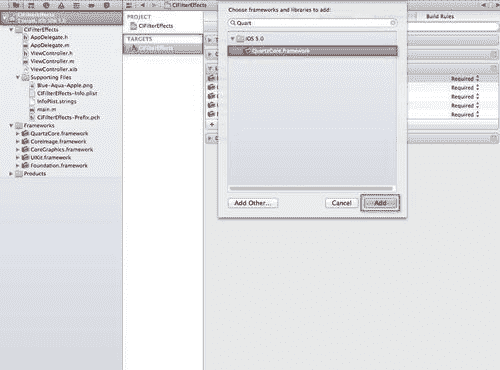

现在我们已经将`QuartzCore.framework`添加到你的项目中，我们可以开始向示例项目添加必要的代码，以应用水波纹效果。

1.  打开位于`CIFilterEffects`文件夹中的`ViewController.m`实现文件，并在直通滤波器代码块下方添加以下代码语句：

    ```swift
    else if (buttonIndex == 5){
    CATransition *animation = [CATransition animation];
    [animation setDelegate:self];
    [animation setDuration:3.0f];
    [animation setTimingFunction:UIViewAnimationCurveEaseInOut];
    [animation setType:@"rippleEffect" ];
    [self.view.layer addAnimation:animation forKey:NULL];
    }

    ```

1.  在这个代码片段中，我们首先声明了一个名为 `animation` 的变量，该变量将负责处理我们 `UIView` 层的过渡动画。在下一步中，我们指定了涟漪效果的持续时间，这将用来定义动画的单次迭代显示需要多长时间，以秒为单位。

    接下来，我们设置了一个计时函数。这将用于指定 `UIViewAnimationCurveEaseInOut` 作为我们想要使用的动画类型。这会导致动画开始时速度较慢，然后在中期加速，最后在迭代的末尾开始减速。

    这是大多数动画的默认曲线。在下一步中，我们指定我们想要使用的动画类型是 `rippleEffect` 过渡效果。最后，我们将动画效果应用到我们的视图中。以下截图显示了应用了水波纹效果的输出。您会注意到它从内部向外弯曲，更像是真空效果：

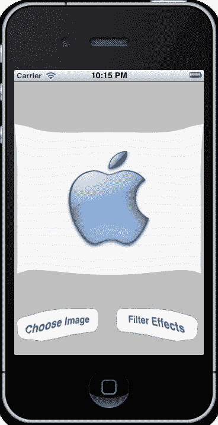

如您所见，通过使用 Core Image 和 QuartzCore 框架，您可以在应用程序中创建一些令人惊叹的视觉效果，并使它们栩栩如生。

### 注意

关于 Core Image 和 QuartzCore 框架的更多信息，请参阅以下链接：[`developer.apple.com/library/mac/#documentation/GraphicsImaging/Conceptual/CoreImaging/ci_intro/ci_intro.html`](http://developer.apple.com/library/mac/#documentation/GraphicsImaging/Conceptual/CoreImaging/ci_intro/ci_intro.html)。

关于 Core Image 过滤器的更多信息，请参阅以下链接：[`developer.apple.com/library/mac/#documentation/GraphicsImaging/Reference/CoreImageFilterReference/Reference/reference.html`](http://developer.apple.com/library/mac/#documentation/GraphicsImaging/Reference/CoreImageFilterReference/Reference/reference.html)。

# 摘要

在本章中，我们学习了 AirPlay 和 Core Image 框架，并探讨了如何将这些框架集成到我们的应用程序中，以便将输出输出到外部设备，例如 Apple TV。

然后，我们学习了 Core Image 过滤器类，以及我们如何通过不同的内置过滤器（如颜色效果）应用不同的图像过滤效果来增强图像。然后，我们熟悉了 QuartzCore 框架，并探讨了如何使用该框架，使用内置的扭曲和过渡效果过滤器，将水波纹效果应用到图像上。

在下一章中，我们将学习对 Xcode 开发工具所做的改进，并查看 **自动引用计数** (ARC)。这是 LLVM 编译器的最新功能。我们还将查看对 Interface Builder、iOS 位置模拟器和 OpenGL ES 调试工具集的改进。
