# 第六章。Xcode 工具 - 改进

自从 2010 年 iPhone 4 发布以来，开发者们对那块令人印象深刻的`960x640 分辨率`视网膜屏幕显示印象深刻，并提供了使用 FaceTime 视频通话功能与朋友和家人保持联系的方法。

iPhone 4 的摄像头已更新，具有前置和后置摄像头，以及内置 LED 闪光灯的标准 500 万像素摄像头，以及支持录制和编辑令人惊叹的 HD 视频的高清视频编辑功能。随着 iPhone 4S 的发布，这一功能已更新，包括录制 1080 像素 HD 视频的能力，并增加了直接在 iOS 设备内编辑视频的功能。

从 Xcode 4 开始，**陀螺仪**功能被整合到加速度计中，这为开发者提供了编程此功能并创建一些令人惊叹的游戏的灵活性。随着 iOS 5 SDK 的发布，LLVM 编译器已更新，包括新的**自动引用计数**（**ARC**）功能。

随着 Xcode 4.2 和 iOS 5 SDK 的发布，Interface Builder 已更新，通过引入 iOS 应用程序的故事板，为你的视图和视图控制器之间提供更好的过渡方式，这些故事板直接集成在 Xcode IDE 中。

你还会注意到 iOS 模拟器也得到了改进，现在可以使用 Core Location 框架在 Xcode 开发环境中直接模拟不同的位置。

在本章中，我们将：

+   了解 LLVM 编译器的最新改进

+   了解如何使用 Interface Builder 创建故事板文件

+   了解 iOS 模拟器所做的更改

+   了解 OpenGL ES 的改进

+   了解应用程序数据管理和 UI 自动化增强

让我们开始吧。

# LLVM 编译器

这项技术是一种开源编译器技术，目前由苹果的编译器团队领导，用于全球多个高端性能项目。LLVM 2.0 编译器也得到了大幅更新，现在编译速度是 GCC 编译器的两倍，产生的应用程序在 iOS 设备上加载速度更快。

它已被重写为一组优化后的代码库，这些代码库是围绕当今的现代芯片架构设计的。它已完全集成到 Xcode 4 开发 IDE 中，并提供了对以下语言的完整支持：C、Objective-C 和 C++。

在下一节中，我们将讨论作为 LLVM 编译器一部分添加的自动引用计数功能。

## 自动引用计数（ARC）

**自动引用计数**（**ARC**）使内存管理成为编译器的职责。当你使用新的 Apple LLVM 3.0 编译器启用 ARC 时，这将很大程度上减轻手动释放内存的负担，并避免因内存泄漏或过早释放的对象而导致的程序错误的无限循环。

ARC 编译器完全理解你的对象，并在对象不再使用时立即释放它们，因此应用程序运行速度与以前一样快，具有可预测的、平稳的性能。在大多数情况下，你将不再需要键入 retain 或 release，这将极大地简化开发过程，同时减少崩溃和内存泄漏。

Xcode 附带了一个新的**转换为 Objective-C ARC**工具，该工具位于 IDE 中的**编辑 | 重构**菜单内，如下截图所示：

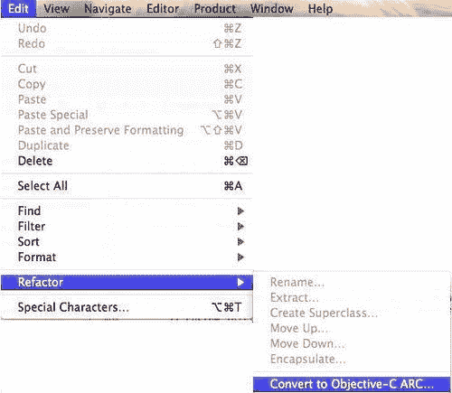

此工具通过删除`retain`和`release`等方法调用来自动化 ARC 转换的机械部分，并帮助你修复迁移器无法自动处理的错误。ARC 迁移工具将项目中的所有文件转换为使用 ARC；你还可以选择按文件使用 ARC，以克服 ARC 的一些当前限制，并对某些文件使用手动引用计数。

以下截图表明，编写操作代码所需的时间几乎与 retain/release 逻辑一样长。对于经验丰富的 Objective-C 开发者来说，这并不准确，但如果你是新手，刚开始接触 Objective-C，这可能是保守的估计。

### 注意

关于 Objective-C 的更多信息，请参考以下位置的*Apple 开发者文档*：[`developer.apple.com/library/mac/#documentation/Cocoa/Conceptual/ObjectiveC/Introduction/introObjectiveC.html#//apple_ref/doc/uid/TP30001163`](http://developer.apple.com/library/mac/#documentation/Cocoa/Conceptual/ObjectiveC/Introduction/introObjectiveC.html#//apple_ref/doc/uid/TP30001163).

你仍然需要为你的类如何管理对其他对象的引用承担一些责任，而不是完全依赖 ARC。


ARC 为你的对象提供自动内存管理，无需你记住何时使用 retain、release 和 auto-release。ARC 首先评估你的对象，并在编译时自动为你插入适当的方法调用，同时为你生成适当的`dealloc`方法调用。

例如，让我们看看在 ARC 使用之前的老方法的一个示例，如下代码片段所示：

```swift
NSObject *obj = [[NSObject alloc] init];
…
…
// do some program logic here.
[obj release];

```

在分配和初始化对象之间，以及最终释放对象之前，你可以随意使用它，对象只有在不再使用时才会被释放和解除分配。

同样，通过将对象添加到自动释放池中，它将一直存在，直到需要它，并在不再需要时被释放。以下代码片段显示了在 ARC 之前如何进行这一操作。

```swift
- (NSObject *) someMethod {
NSObject *obj = [[[NSObject alloc] init] autorelease];
return obj; // This will be released by the autorelease pool.
}

```

如果你刚开始学习 iOS 编程，你可能会在最初难以理解引用计数内存的使用，但一旦你掌握了它，你很快就会看到它的潜力。这在为 iOS 设备开发应用程序时尤其有用，因为它可以消除由泄漏或过度释放对象引起的错误追踪负担。

许多开发者忘记释放先前声明的对象的内存分配，这会导致性能问题，或者更严重的是，导致他们的应用程序挂起或崩溃。

在 ARC 下，这会有不同的处理方式，并且会进行预编译步骤，这会自动将保留、释放和自动释放语句添加到代码中。这绝对不是垃圾回收的一种形式，引用计数的内存并没有消失，它只是被自动化了。

查看以下启用 ARC 的代码片段：

```swift
NSObject *obj = [NSObject alloc] init];
…
…
// do some program logic here.

```

ARC 预编译步骤会自动将其转换为：

```swift
NSObject *obj = [NSObject alloc] init];
// do some program logic here.
[obj release]; // Added by ARC

```

为了编译器生成正确的代码，ARC 对你可以使用的方法施加了一些严格的限制，并引入了新的生命周期限定符用于对象引用和声明属性。

这些新规则在其他编译器模式下并不存在，旨在提供一个完全可靠的内存管理模型。在某些情况下，它们被设置为强制最佳实践。在其他情况下，它们简化了你的代码，这样你就不必处理内存管理问题。

违反这些规则将导致立即的编译时错误，而不仅仅是程序运行时可能出现的某些程序错误。以下表格解释了你需要遵守的规则，以便使用 ARC 进行编译：

| **ARC 规则** | **描述** |
| --- | --- |
| 分配/初始化对象 | 在创建对象时，你不能调用保留、释放、自动释放和保留 `Count` 方法，或者间接调用它们的选择器，即 `@selector(retain)` 和 `@selector(release)`。 |
| 释放方法 | 通常这些方法会为你创建，但你不能直接调用 `dealloc`。然而，如果你需要释放除了实例变量之外的其他资源，你仍然可以创建一个自定义的 `dealloc` 方法。在创建自定义 `dealloc` 方法时，不要调用 `[super dealloc]` 方法，因为这将为你完成，并且由编译器强制执行。 |
| 声明属性 | 在 ARC 之前，我们通过使用 `@property` 指令的 `assign, retain` 和 `copy` 参数来告诉编译器如何使用这些参数来管理声明的 `public` 属性的内存。在 ARC 中，这些参数不再使用。相反，我们有两个新的参数，`weak` 和 `strong`，它们告诉编译器我们希望如何处理我们的属性。 |
| C 结构中的对象指针 | Apple 文档建议将它们存储在类中而不是结构体中。这很有道理，因为否则它们将不为 ARC 所知。这可能会引起一些额外的迁移问题。 |
| `id`和`void*`之间的随意转换 | 当在 Core Foundation 的 C 库函数和 Foundation Kit 的 Objective-C 库方法之间传递对象时，经常会在`id`和`void*`数据类型之间进行转换。这被称为**Toll Free Bridging**。在 ARC 中，你必须提供提示/限定符来告诉编译器 CF 对象何时进入和退出其控制范围以进行内存管理。这些限定符包括`__bridge, __bridge_retain`, 和 `__bridge_transfer`。你仍然需要调用`CFRetain`和`CFRelease`来管理 Core Foundation 对象的内存。 |
| `@autoreleasepool`代替`NSAutoReleasePool` | 如果你在应用程序中使用 ARC 兼容的代码，它不能使用`NSAutoReleasePool`对象，而必须使用`@autoreleasepool{}`代码块。一个很好的例子可以在任何 ARC 项目的`main.m`文件中找到.int main(int argc, char *argv[]){@autoreleasepool {return UIApplicationMain(argc, argv, nil, NSStringFromClass([MyAppDelegate class]));}} |
| 内存区域 | 你不能使用基于`NSZone`的内存区域（这不再是运行时的一部分）；你不能使用`NSAllocateObject`或`NSDeallocateObject`。 |

作为程序员，我们发现自己需要做出决定，比如是否将某个东西定义为变量或常量，或者是否需要在局部或全局范围内定义。当我们决定我们的属性如何与其他对象相关联时，这个概念同样适用。为了做到这一点，我们使用强和/或弱限定符来通知编译器这些关系。

### 强引用

这些提供了对对象的引用，阻止它被释放。换句话说，它创建了一个所有者关系。在 ARC 之前，你会这样声明你的属性：

```swift
// Non-ARC Compliant Declaration
@property(retain) NSObject *obj;

```

如果我们看看在 ARC 下如何声明相同的属性，这将按照以下方式完成，以确保类实例拥有被引用的对象：

```swift
// ARC Compliant Declaration
@property(strong) NSObject *obj;

```

考虑以下代码片段：

```swift
MyClass *obj1 = [[MyClass alloc] init];
MyClass *obj2 = obj1;

```

如您所见，我们声明了两个对象，并将内存分配给了我们的`obj1`对象变量。然后我们声明一个新的对象变量`obj2`，它对`obj1`有一个强引用。如果我们从内存中移除`obj2`，那么`obj1`也会被移除。

### 弱引用

这些提供了对对象的引用，但不会阻止它被释放。换句话说，它不会创建所有者关系。在 ARC 之前，你会这样做：

```swift
// Non-ARC Compliant Declaration
@property(assign) NSObject *parentObj;

```

如果我们看看在 ARC 下如何声明相同的属性。这将按照以下方式完成，以确保你不拥有被引用的对象。

```swift
// ARC Compliant Declaration
@property(weak) NSObject *parentObj;

```

考虑以下代码片段：

```swift
__weak NSString *weakName = self.textField.text;

```

我们首先声明一个名为`weakName`的变量，它指向与`textField.text`属性指向的相同字符串对象——这包含名字`Albert Einstein`。如果字符串内容发生变化，那么字符串对象就不再有任何所有者，并且会被释放。这在下面的代码片段中显示：

```swift
__weak NSString *weakName = @"Captain Jack Sparrow";

```

当这种情况发生时，`weakName` 的值会自动变为 `nil`，这被称为零引用弱指针。这非常方便，因为它防止了弱指针指向已释放的内存。以前，这类事情经常导致许多编程错误；例如，悬垂指针或僵尸。

**弱指针**主要用于两个对象具有父子关系时。父对象将拥有对子对象的强指针并因此拥有子对象，但为了防止所有权循环，子对象只对父对象有弱指针。考虑以下代码片段：

```swift
__weak NSString *str = [[NSString alloc] initWithFormat:@"Weakname: %@", weakName];
NSLog(@"%@", str); // This will output "(null)"

```

由于字符串对象没有所有者（因为 `str` 是弱引用），对象将在创建后立即被释放。当你尝试这样做时，Xcode 会给出警告，因为这可能不是你想要做的（警告：*将保留对象赋值给弱变量；对象将在赋值后释放]*)。

### ARC 限定符常规变量

ARC 为对象引入了几个新的生命周期限定符，以及零引用弱引用。弱引用不会延长它所指向的对象的生命周期。零引用弱引用，也称为弱限定符，指示编译器你不需要保留该对象。如果指向此对象的引用都降为零，则对象将被释放并设置为 `nil`。

这很重要，因为向 `nil` 对象发送的消息不会导致崩溃；它只是什么也不做。然而，你仍然可以使用 `assign`，但建议你使用 `weak`，因为它会将已释放的对象设置为 `nil`。弱限定符特别用于父子对象关系，其中父对象对子对象有强引用，而子对象对父对象有弱引用，否则你将最终创建一个循环引用。

### 变量限定符

在之前的代码片段中，我们说明了如何管理我们声明的属性。对于常规变量，我们有：

+   `__strong`

+   `__weak`

+   `__unsafe_unretained`

+   `__autoreleasing`

一般而言，这些额外的限定符不需要经常使用。你可能会首先在使用迁移工具时遇到这些限定符和其他限定符。然而，对于新项目，你通常不需要它们，并且主要使用 `strong/weak` 与你声明的属性一起使用。

| **ARC 类型** | **描述** |
| --- | --- |
| `__strong` | 这是默认值，因此你不需要输入它。这意味着使用 `alloc/init` 创建的任何对象都会保留在其当前作用域的生命周期内。**当前作用域**通常是指变量声明的花括号内（即方法、`for` 循环、`if` 块等）。 |
| `__weak` | 这意味着对象可以在任何时候被销毁。这仅在对象在其他地方有强烈的引用时才有用。当对象被销毁时，带有 `__weak` 的变量会被设置为 `nil`。 |
| `__unsafe_unretained` | 这与 `__weak` 类型相似，但对象被释放时指针不会被设置为 `nil`。相反，指针被留在指向内存中不安全区域的指针上。 |
| `__autoreleasing` | 这不是在从方法返回对象之前调用 `autorelease`，而是用于通过引用传递对象，例如，在通过引用传递 `NSError` 对象时，如 `[myObject performOperationWithError:&tmp]`； |

### 注意

关于 *LLVM Clang Objective-C 自动引用计数* 文档的更多信息，您可以参考以下提供的链接：[`clang.llvm.org/docs/AutomaticReferenceCounting.html#ownership`](http://clang.llvm.org/docs/AutomaticReferenceCounting.html#ownership)。

## Interface builder

在 Xcode 4 中，Interface Builder 是一个用户界面设计工具，您可以通过从对象库中将对象拖放到空白画布上来构建用户界面。生成的用户界面将保存为 XIB 文件，它是您对象及其实例变量的 XML 表示。

在过去，当创建一个新视图时，您必须为应用程序所需的每个视图创建一个 XIB 文件，以便从每个视图转换到下一个视图。为了使设计 iOS 应用程序变得更加容易，苹果改进了用户界面设计过程，并引入了 **Storyboarding** 功能。

### 支持为 iOS 应用程序创建 storyboard 文件

随着 Xcode 4.2 的发布，Interface Builder 已更新，提供了一种更好的方式来设计用户界面，通过在单个画布中图形化地排列所有视图，以便您可以定义应用程序，逻辑流程以及它们之间的转换。

在您的应用程序中使用 storyboards 可以通过为您管理视图控制器来简化开发过程。您可以在不手动编码的情况下指定在视图之间切换时使用的转换和 segues。

为了刷新您的记忆，您可以参考在 *如何创建 Storyboard 文件* 部分下的 第四章，*使用 Storyboards*，以获取有关如何使用 Interface Builder 创建 storyboard 文件的信息。

## 位置模拟器

从 Xcode 4.2 和 iOS 5 的发布开始，您现在可以在不离开办公桌的情况下测试应用程序中的基于位置的功能。您现在可以在 iOS 模拟器中选择预设的位置和路线，并在运行模拟应用程序的同时选择具有精度的自定义纬度和经度。

### 创建一个简单的地理应用程序

在我们继续之前，我们首先需要创建我们的 `MapKitExample` 项目。为了刷新您的记忆，您可以参考 第一章 中名为 *创建 MyEmailApp 应用程序* 的部分，*iOS5 中的新功能*。

1.  从`/Xcode4/Applications`文件夹启动 Xcode。

1.  选择**创建一个新的 Xcode 项目**，或**文件 | 新建项目**。

1.  从可用模板列表中选择**Single View Application**模板。

1.  从**设备家族**下拉菜单中选择**iPhone**。

1.  确保你已从**iPhone 设备家族**下拉菜单中勾选了**使用自动引用计数**选项。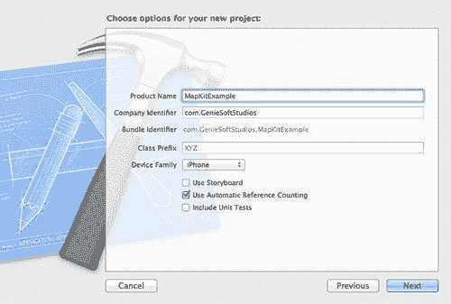

1.  点击**下一步**按钮继续向导的下一步。

1.  输入`MapKitExample`，然后点击**下一步**按钮继续向导的下一步。

1.  指定你想要保存项目的位置。

1.  点击**保存**按钮继续，并显示 Xcode 工作区环境。

现在我们已经创建了`MapKitExample`项目，我们需要将`MapKit`框架添加到我们的项目中，以便我们的应用程序可以查看地图信息。选择**项目导航器组**，然后按照以下简单步骤操作：

1.  选择你的项目。

1.  然后从`TARGETS`组下选择你的项目目标。

1.  选择**构建阶段**选项卡。

1.  展开链接库与库的展开三角形。

1.  使用**+**添加你想要的库。如果你在列表中找不到你想要的框架，也可以进行搜索。

如果你仍然不清楚如何添加框架，请参考以下截图，它突出显示了你需要选择的部分（被红色矩形包围）：


现在你已经将`MapKit.framework`添加到你的项目中，我们需要将代码导入到负责显示我们的地图位置信息的`ViewController`中。

为了使我们的应用程序在我们的视图中显示地图，我们需要导入`<MapKit/MapKit.h>`接口头文件，以便我们可以利用其方法：

1.  打开位于**Classes**文件夹中的`ViewController.h`接口文件，并添加以下代码：

    ```swift
    #import <UIKit/UIKit.h> #import <MapKit/MapKit.h>
    @interface ViewController : UIViewController {
    MKMapView *mapView;
    }

    ```

1.  在这个代码片段中，我们包含了对 Cocoa 的`MapKit.h`头文件的引用，这将暴露其方法，以便我们可以在`ViewController`实现文件中使用这些方法，然后我们创建了一个实例变量（`mapView`），它是一个指向我们的`MKMapView`对象的字符串指针，该对象负责存储我们的地图位置信息。

1.  我们还没有完全完成。现在我们需要修改位于`ViewController.m`实现文件中的`ViewDidLoad`方法。因此，打开`ViewController.m`实现文件。

1.  定位并取消注释`ViewDidLoad`方法，并向其中添加以下代码片段：

    ```swift
    - (void)viewDidLoad {
    [super viewDidLoad]; mapView = [[MKMapView alloc] initWithFrame:[self.view bounds]];
    [self.view addSubview:mapView];
    }

    ```

1.  在这个代码片段中，我们实际上为在`ViewController.h`文件中声明的`mapView`对象分配和初始化了内存，然后我们将`mapView`对象添加到当前视图中，以便我们可以在屏幕上显示它。

1.  `mapKit` 框架具有在地图上显示您当前位置的能力。它还允许您设置各种 `mapTypes`。接下来，我们将在 `ViewDidLoad` 方法中添加一些额外的代码，如下面的代码片段所示。此代码位于我们的 `ViewController.m` 实现文件中。

    ```swift
    - (void)viewDidLoad {
    [super viewDidLoad];
    mapView = [[MKMapView alloc] initWithFrame:[self.view bounds]];
    mapView.mapType=MKMapTypeHybrid;
    mapView.showsUserLocation=YES;
    [self.view addSubview:mapView];
    }

    ```

1.  在此代码片段中，我们所做的是增加了显示我们的地图在 **混合** 视图（卫星视图和道路信息的组合）中的能力，同时将我们的地图指向显示我们的当前位置，该位置将由一个动画蓝色标记指示。

iOS 原生地图应用程序允许您从以下三种可能的地图类型中选择：

| **地图类型常量** | **描述** |
| --- | --- |
| `MKMapTypeStandard` | 这是默认的地图类型，如果没有指定，此类型将显示包含街道和道路名称的正常地图。 |
| `MKMapTypeSatellite` | 设置此类型的地图将显示卫星视图信息。 |
| `MKMapTypeHybrid` | 此类型的地图将显示卫星视图与道路和街道信息叠加的组合。 |

如果您构建并运行了您的应用程序，现在应该会看到一个带有闪烁的动画蓝色标记的地图显示。我已经旋转了设备并在一个随机位置进行了缩放，以展示 `MapKit` 框架的功能，如下面的截图所示：


### 小贴士

当使用 iOS 模拟器运行 `MapKit` 应用程序时，它将始终默认显示位于加利福尼亚州 1 Infinite Loop 的苹果公司总部。

为了获得更好的位置，使用您的 iOS 设备会更好。这是因为 iOS 模拟器使用您的 IP 地址来估算您的位置。

您也可以选择在 iOS 模拟器运行时导航到不同的位置。为此，请按照以下简单步骤操作：

1.  点击如下所示的 **模拟位置** 图标。这将显示可用位置列表：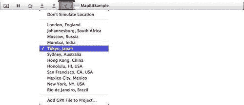

1.  从显示的位置列表中选择 **东京，日本** 或类似选项。

1.  iOS 模拟器将更新以反映所选位置，如下面的截图所示：


在本节中，我们了解了 `MapKit` 框架，以及我们如何在应用程序中使用它来模拟特定位置。我们学习了如何使用 Xcode 调试器的 **模拟位置** 功能，在 iOS 模拟器中导航到各种位置。

### 注意

有关`MKMapView`类参考的更多信息，请参阅以下链接位置提供的*Apple 开发者文档*：[`developer.apple.com/library/ios/#documentation/MapKit/Reference/MKMapView_Class/MKMapView/MKMapView.html#//apple_ref/doc/uid/TP40008205`](http://developer.apple.com/library/ios/#documentation/MapKit/Reference/MKMapView_Class/MKMapView/MKMapView.html#//apple_ref/doc/uid/TP40008205)。

## OpenGL ES 调试

OpenGL ES 调试器允许你追踪应用程序中特定于 OpenGL ES 的问题。然后你可以选择在程序中的某个特定点中断。为了刷新你的记忆，你可以参考我们在第三章，*使用 OpenGL ES 进行调试*中提到的名为*通过设置断点检测错误*的部分，以获取有关如何调试 OpenGL ES 项目的更多信息。

## OpenGL ES 帧捕获

OpenGL ES 帧捕获是 Xcode 调试器的一部分，允许你在捕获点捕捉到应用程序中正在绘制的所有帧的快照。然后你可以选择浏览每个帧，查看相关的代码，以及在不同之间的实体或线框视图之间切换。为了刷新你的记忆，你可以参考名为*在帧边界处中断*的部分，在第三章，*使用 OpenGL ES 进行调试*，以获取有关如何捕获 OpenGL ES 帧的更多信息。

## 应用数据管理

iOS 为在 iOS 设备上安装的应用程序之间共享信息提供了强大的连接选项。使用基于 URL 的语法，你可以让你的应用程序访问来自 Web 的数据，以及将此信息传递给其他已安装的应用程序，如邮件、iTunes 和 YouTube。

你的应用程序可以声明一个独特的 URL 方案，允许任何应用程序与你的应用程序协作并共享数据。

你还可以选择使用 XML 文件；这些文件提供了一种轻量级结构化格式，你的应用程序可以轻松地读取和写入。XML 文件可以很好地适应 iOS 文件系统，并可用于在内置的**用户默认值**数据库中存储你的应用程序设置和用户偏好设置。这个基于 XML 的数据存储包括一个简单的 API，具有强大的功能，包括按需序列化和恢复复杂对象的能力。

### 注意

有关应用数据管理功能的更多信息，请参阅以下链接位置的*Apple 开发者文档*：[DOCUMENTATION/DataManagement/Conceptual/iPhoneCoreData01/Articles/01_StartingOut.html#//apple_ref/doc/uid/TP40008305-CH105-SW2](http://DOCUMENTATION/DataManagement/Conceptual/iPhoneCoreData01/Articles/01_StartingOut.html#//apple_ref/doc/uid/TP40008305-CH105-SW2)。

## UI 自动化增强

**自动化**工具是在 iOS SDK 4.0 的版本中添加的。这个工具允许你通过脚本化触摸事件来自动化你的 iOS 应用程序的界面测试，允许你将这些结果记录下来，以便稍后用于分析。自动化工具包含一个脚本编辑器，因此你可以选择使用 JavaScript 将测试脚本写入 UI 自动化 API，或者从文件中将其加载到编辑器中。

这是在 iOS 平台上使用测试自动化测试你的应用程序的一个巨大的进步，这可以减少你手动测试应用程序所花费的时间。自动化功能可以用于模拟支持多任务处理且运行 iOS 4.0 或更高版本的设备上的许多用户操作。

你还有能力直接在你的脚本中捕获和记录在 iOS 设备上执行的动作。

自动化 UI 测试允许你：

+   为其他工作释放关键人员和资源

+   进行更全面的测试

+   开发可重复的回归测试

+   最小化程序错误

+   提高产品更新开发周期时间

自动化工具的一个重要好处是你可以用它与其他工具一起执行复杂的测试，例如追踪内存泄漏和隔离性能问题的原因。

### 注意

自动化工具不允许你处理任何未使用你的配置文件签名应用的应用程序，并且它不会在 iOS 模拟器中运行。它需要在运行 iOS 4 或更高版本的 iOS 兼容设备上运行。

### 准备你的应用程序

在我们开始使用自动化工具之前，我们需要做一些前期工作来准备我们的应用程序，以便它可以与自动化工具一起工作。UI 自动化库依赖于你的 UI 中的可访问性信息，因此我们将在稍后添加这一信息，这将使你的应用程序测试变得容易得多。

### 创建一个简单的 UIAutomation 应用程序

在我们继续之前，我们首先需要创建我们的 `UIAutomation` 项目。为了刷新你的记忆，你可以参考第一章,*iOS5 中的新功能*中名为 *创建 MyEmailApp 应用程序* 的部分。

1.  从`/Xcode4/Applications`文件夹中启动 Xcode。

1.  选择**创建一个新的 Xcode 项目**，或者**文件 | 新项目**。

1.  从可用模板列表中选择**单视图应用程序**模板。

1.  从**设备家族**下拉菜单中选择**iPhone**。

1.  确保你已经检查了**设备家族**下拉菜单下的**使用自动引用计数**复选框。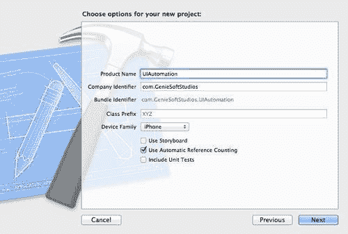

1.  点击**下一步**按钮，进入向导的下一个步骤。

1.  输入`UIAutomation`，然后点击**下一步**按钮，进入向导的下一个步骤。

1.  指定你想要保存项目的位置。

1.  点击** **保存** **按钮**继续并显示 Xcode 工作区环境。

现在我们已经创建了我们的 `UIAutomation` 项目，我们可以开始构建我们的用户界面，并添加所需的代码。

1.  从**项目导航器**中选择并打开 `ViewController.xib` 文件。

1.  从**对象库**中选择并拖动一个（`UIButton`）圆形矩形按钮控件，并将其添加到我们的视图中。

1.  根据需要调整大小，然后修改圆形矩形按钮的**对象属性**部分，并将其标题设置为 `Tap Me`。

1.  接下来，从**对象库**中选择并拖动一个（`UIButton`）圆形矩形按钮控件，并将其添加到**Tap Me**按钮下面的视图中。

1.  根据需要调整大小，然后修改圆形矩形按钮的**对象属性**部分，并将其标题设置为 `Press Me`。

如果您正确地遵循了这些步骤，您的视图应该看起来像以下截图所示。如果它与我的不完全相同，请随意调整您的。

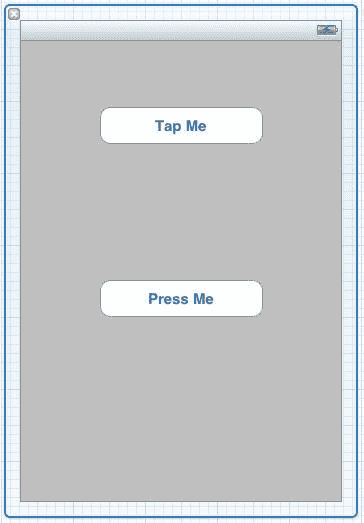

如您所见，我们的表单在这个阶段并没有做什么，如果您在模拟器上运行此应用程序，您会看到控件像在屏幕上放置一样。

以下步骤将向您展示如何将按钮连接到它们的事件，以便它们可以执行各自的任务。那么，让我们开始吧。

1.  打开 `ViewController.h` 接口文件，并创建如下所示的高亮条目：

    ```swift
    #import <UIKit/UIKit.h>
    @interface ViewController : UIViewController @property (strong, nonatomic) IBOutlet UIButton *btnTapMe;
    @property (strong, nonatomic) IBOutlet UIButton *btnPressMe;
    @end

    ```

1.  通过从**导航**菜单中选择**在辅助编辑器中打开**选项，或通过按住**Option** + **Command** + **,**（选项键 + 命令键 + 逗号键），打开**辅助编辑器**窗口。

1.  **我们需要创建一个动作事件。选择** **Tap Me** **按钮，并在将此拖动到 `ViewController.m` 实现文件类中时按住控制键，如图所示：**

1.  **为要创建的动作指定一个名称。输入 `btnTapMe` 作为动作的名称。**

1.  **将事件类型设置为** **触摸内部释放**：

1.  **点击** **连接** **按钮**，让 Xcode 创建事件。

1.  **我们需要创建一个动作事件。选择** **按我** **按钮，并在将此拖动到 `ViewController.m` 实现文件类中时按住 Control 键，如图所示：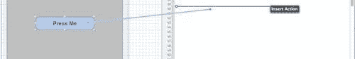**

1.  **为要创建的动作指定一个名称。输入 `btnPressMe` 作为动作的名称。**

1.  **将事件类型设置为** **触摸内部释放**：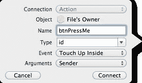

1.  **点击** **连接** **按钮**，让 Xcode 创建事件。

**现在我们已经连接了我们的动作事件，我们现在需要合成我们的用户界面控件，以便我们可以在视控制器中访问它们。**

1.  **打开位于`CIFilterEffects`文件夹中的`ViewController.m`实现文件，并在`@implementation`语句下方添加以下突出显示的语句。**

    ```swift
    //
    // ViewController.m
    // UIAutomation
    //
    // Created by Steven F Daniel on 19/09/11.
    // Copyright (c) 2011 GenieSoft Studios. All rights reserved.
    //
    #import "ViewController.h"
    @implementation ViewController @synthesize btnTapMe, btnPressMe;

    ```**

1.  **在这个代码片段中，我们使我们的实现文件知道位于用户界面表单上的控件。如果没有声明这些控件，我们将收到警告消息，这可能会使您的程序产生一些奇怪的结果，甚至可能使 iOS 设备上的应用程序崩溃。**

1.  **接下来，我们需要将代码添加到我们的`btnTapMe`函数中，该函数将用于在按钮被按下时显示一个警告消息弹出。为此函数输入以下代码片段：**

    ```swift
    // Event to handle when the Tap Me button has been pressed.
    - (IBAction)btnTapMe:(id)sender {
    // Define our alert dialog popup
    UIAlertView *alert = [[UIAlertView alloc]initWithTitle:@"UIAutomation Example" message:@"Tap Me button pressed" delegate:self cancelButtonTitle:@"OK" otherButtonTitles:nil];
    // Display our alert
    [alert show];
    }

    ```**

1.  **此代码片段创建了一个`UIAlertView`类的实例，它将使我们能够在按钮被按下时显示一个警告弹出对话框。您会注意到我们没有释放我们的警告对象变量。这主要是因为 ARC 将自动为我们管理这个对象的释放。**

1.  **接下来，我们需要将代码添加到我们的`btnPressMe`函数中，该函数将帮助我们确定自动化工具何时按下它。为此函数输入以下注释掉的代码片段：**

    ```swift
    // Event to handle when the Press Me button has been pressed.
    - (IBAction)btnPressMe:(id)sender {
    // Define our alert dialog popup
    // UIAlertView *alert = [[UIAlertView alloc]initWithTitle:@"UIAutomation Example" message:@"Press Me button pressed" delegate:self cancelButtonTitle:@"OK" otherButtonTitles:nil];
    // Display our alert
    //[alert show];
    }

    ```**

1.  **此代码片段创建了一个`UIAlertView`类的实例，它将帮助我们确定当我们在进行单元测试时，UI 自动化工具何时按下它。这段代码已被故意注释掉，以便我们能够失败我们稍后将要设置的自动化测试用例。**

**在下一节中，我们将探讨如何设置我们的控件，以便它们可以被自动化工具访问和通信。UI 自动化工具库依赖于您 UI 中的可访问性信息，并查找您控件的`AccessibilityLabel`属性。**

1.  **从`UIAutomation`示例项目导航窗口中，选择`UIAutomation`文件夹中的`ViewController.xib`文件。**

1.  **点击**“Tap Me”**按钮，并选择**“身份检查器”**按钮。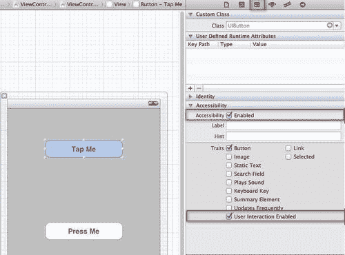

1.  **确保已勾选**“可访问性”**选项，并且已勾选**“用户交互启用”**选项。这使得仅能访问具有这些属性设置的对象，可以直接从视图中访问。这主要是因为它们的属性被公开，这使得从`UIAutomation`测试脚本中访问它们变得更容易。**

1.  **重复**步骤 2**到**步骤 3**，并将相同的操作应用于**“按我”**按钮。**

## **编写 UIAutomation 测试脚本**

**下一步是使用您选择的任何编辑器编写 JavaScript 测试脚本。**测试脚本**基本上是一组有序命令，每个命令都访问您应用程序中的一个用户界面元素，以执行某种用户操作或使用与之关联的信息。**

**您应用程序中的所有用户界面元素都通过`UIAElements`类及其子类定义的对象的有序层次视图来表示给脚本。**

**为了到达指定的 UI 元素，脚本只需从顶层目标对象开始调用元素层次结构。以下代码语句展示了如何在 JavaScript 中声明它：**

```swift
var target = UIATarget.localTarget(); 
```

**`UIATarget`对象是您在 iOS 设备或 iOS 模拟器上运行应用程序的主要起点。当您想要与 iOS 设备交互或需要在 iOS 设备上执行操作时，例如用户手势（包括点击、滑动和摇晃），此对象提供了一种方式。**

**`app`对象是`UIAApplication`类的实例，它为您提供了访问应用程序顶级结构的方式。这为您提供了访问诸如标签栏、导航栏和主窗口等元素的方式。以下代码语句展示了如何在 JavaScript 中声明它：**

```swift
var app = target.frontMostApp(); 
```

**现在您已经了解了 UI 元素结构，我们可以开始构建我们的`UIAutomation`测试脚本。所以，打开您最喜欢的编辑器，让我们开始吧。**

1.  **创建一个新空白文档，并将其保存为`UIAutomation.js`。**

1.  **接下来，我们需要声明应用程序将使用的对象。如下面的代码片段所示：**

    ```swift
    // Initialise our application objects.
    var target = UIATarget.localTarget();
    var app = target.frontMostApp();
    var window = app.mainWindow();
    var view = window.elements()[0];
    var buttons = window.buttons();

    ```**

1.  **在这个代码片段中，我们声明了一组对象，我们可以在代码中使用并引用它们。**

1.  **我们已声明了一个目标级别对象，它指向我们的层次结构的顶层，一个`app`应用程序对象，以及窗口、视图和按钮对象，这些对象可以通过`mainWindow`方法访问。**

1.  **使用`var`关键字告诉编译器您想要在内存中声明一个新变量实例的对象。这类似于 Visual Basic 中的`Dim`（维度）关键字。**

1.  **接下来，我们想在结果面板中添加一些初始标题信息，以显示我们正在为此运行哪个测试用例，如下面的代码片段所示：**

    ```swift
    // UI Automation Test Case - Initial Logging
    var testName = "UI Automation Test Case 1";
    UIALogger.logStart(testName);

    ```**

1.  **在这个代码片段中，我们使用`var`关键字声明了一个名为`testName`的变量，并将其分配给自动化标题信息。这些信息将在结果面板中显示。接下来，我们使用`UIALogger`类的方法`logStart`。这告诉编译器启动指定的测试。**

1.  **在下一步中，我们需要确定屏幕上有多少个按钮。如下面的代码片段所示：**

    ```swift
    // TC001: Check for the number of buttons on screen.
    UIALogger.logMessage("Assert Text - Check number of button(s) on screen");
    if (buttons.length != 2) {
    UIALogger.logFail("FAIL: Invalid number of button(s)");
    }
    else {
    UIALogger.logPass("PASS: Correct number of button(s)");
    }

    ```**

1.  **在这个代码片段中，我们使用 `logMessage` 方法将消息记录到结果窗口。然后我们使用按钮对象来确定我们视图中有多少个可见的按钮，然后使用 `logFail` 和 `logPass` 方法来处理这种情况。**

    `logFail` 方法将消息记录到结果面板，指示测试未成功完成。`logPass` 方法将消息记录到结果面板，指示测试已成功完成。**

1.  **在下一步中，可能会有时候你想检查是否按下了特定的按钮。这在上面的代码片段中显示：**

    ```swift
    // TC002: Check for the existence of the Press Me
    // button within the view.
    UIALogger.logMessage("Assert Text - Check for the existence of the Press Me button.");
    // Get a handle to the button that we are after.
    var btnPressMe = buttons.firstWithName("Press Me");
    if (btnPressMe == null || btnPressMe.toString() == "[object UIAElementNil]") {
    UIALogger.logFail("FAIL: Press Me button not found.");
    }
    else {
    UIALogger.logPass("PASS: Press Me button was found.");
    }

    ```**

1.  **在这个代码片段中，我们使用 `UIAElementArray` 类的 `firstWithName` 方法返回按钮数组中名为 `Press Me` 的第一个元素。然后我们使用 `null` 和 `UIAElementNil` 对象比较和检查按钮是否存在，以防止它引发异常错误，最后使用 `UIALogger` 类的 `logFail` 和 `logPass` 方法将测试结果输出到结果面板。**

1.  **在下一步中，可能会有时候你想模拟屏幕上显示的特定按钮的点击，并显示一个弹窗。这在上面的代码片段中显示：**

    ```swift
    // TC003: Tap on the Press Me button and check for the alert.
    UIALogger.logMessage("Assert Text - Checking for the Press Me Alert dialog.");
    var btnPressMe = buttons.firstWithName("Press Me");
    // Simulate a tap on the Press Me button
    btnPressMe.tap();
    var alert = app.alert();
    if (alert == null || alert.toString() == "[object UIAElementNil]") {
    UIALogger.logFail("FAIL: The alert dialog was not shown after pressing the button.");
    }
    else {
    UIALogger.logPass("PASS: The alert dialog was shown after pressing the button.");
    }

    ```**

1.  **在这个代码片段中，我们使用 `UIAElementArray` 类的 `firstWithName` 方法返回按钮数组中名为 `Press Me` 的第一个元素。然后我们使用按钮的 `tap` 方法来模拟点击。当发生这种情况时，与按钮关联的代码将被执行，并显示一个警报。**

    然后，我们声明一个 `alert` 变量，它接受由表示警报的 `app` 对象返回的警报 `UIAAlert` 对象。接下来，我们使用 `null` 和 `UIAElementNil` 对象比较和检查警报是否存在，以捕获错误，防止它引发 `exception` 错误。最后，我们使用 `UIALogger` 类的 `logFail` 和 `logPass` 方法将返回的结果输出到结果面板。**

1.  **在我们的最后一部分，我们希望向结果面板显示我们的测试用例已完成。这在上面的代码片段中显示：**

    ```swift
    // UI Automation Test Case 1 Completed
    UIALogger.logMessage("UI Automation Test Case 1 Completed. Please check results panel for any errors.");

    ```**

1.  **在这个代码片段中，我们使用 `logMessage` 方法将消息记录到结果窗口，以显示 UI 自动化测试用例已完成，或者可以使用一个过程在延迟完成后点击警报对话框中的按钮。**

**以下表格显示了与 `UIALogger` 类相关的所有方法。它已被分成几个部分，以突出显示哪些用于记录状态，哪些可以用于指定严重性类型。**

| **使用测试状态进行日志记录** |   |
| --- | --- |
| `logStart` | 记录一条消息，并指示测试已开始 |
| `logPass` | 记录一条消息，并指示测试已成功完成 |
| `logIssue` | 记录一条消息，并指示测试异常终止 |
| `logFail` | 记录一条消息，并指示测试失败 |
| 使用严重程度级别进行记录 |   |
| `logDebug` | 记录指定的消息，并将严重程度级别设置为`debug` |
| `logMessage` | 记录指定的消息，并将严重程度级别设置为`message` |
| `logWarning` | 记录指定的消息，并将严重程度级别设置为`warning` |
| `logError` | 记录指定的消息，并将严重程度级别设置为`error` |

### **注意**

**有关 UI 自动化类参考和 JavaScript API 的更多信息，您可以参考以下链接的*Apple 开发者文档*：[`developer.apple.com/library/ios/#documentation/DeveloperTools/Reference/UIAuto/_index.html`](http://developer.apple.com/library/ios/#documentation/DeveloperTools/Reference/UIAuto/_index.html).**

**现在我们已经创建了测试脚本，我们准备开始处理下一部分，即开始对`UIAutomation`示例应用程序进行性能分析。这将在下一节*运行您的测试*中介绍。**

## **运行您的测试**

**现在我们已经创建了测试，我们的下一步是在 Instruments 应用程序环境中对`UIAutomation`示例应用程序进行性能分析。**

1.  **从`/Xcode4/Applications`文件夹中启动 Xcode。**

1.  **打开`UIAutomation`项目，或**文件** | 打开**。**

1.  **从**产品** | **配置**菜单中选择**配置**，或*Command* + *I*。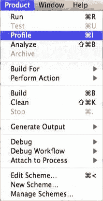**

1.  **这将启动**Xcode Instruments**应用程序。从 iOS 模板部分选择**自动化**，如图所示：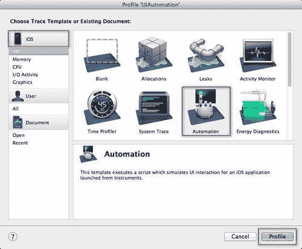**

1.  **接下来，点击**配置**按钮以进入下一步。**

1.  **从**Instruments**窗口中，点击**添加**按钮，然后从下拉列表中选择**导入**，如图所示：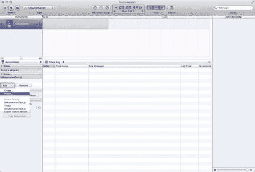**

1.  **接下来，从列表中选择`UIAutomationTest.js`文件，然后点击**打开**按钮将此文件加载到 Instruments 应用程序中。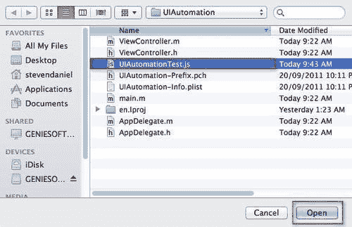**

1.  **最后，点击**记录**按钮，或*Command* + *R*以开始对`UIAutomation`示例应用程序进行性能分析。几分钟后，您的应用程序将启动，然后您的测试将运行。这在上面的屏幕截图中显示：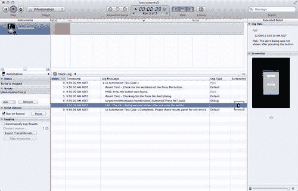**

1.  **一旦测试完成，Instruments 应用程序将继续运行您的应用程序。要正式结束正在执行的测试，请点击红色**停止**按钮，或再次按*Command* + *R*。

    测试结果列在详细视图部分，包括**日志消息**列中的测试名称。如果测试通过，**日志类型**列的值将是**通过**，显示为绿色。如果测试失败，**日志类型**值将是**失败**，显示为红色。

    您可以选择扩展测试结果以查看发生情况的详细信息。截图列在测试失败时使用。在我们的情况下，没有显示警报对话框，因此捕获了截图以显示它失败了。这在上面的截图中显示：

    **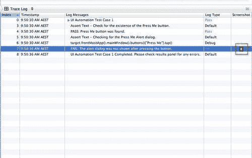**

1.  **回到 `UIAutomation` 示例项目，并在 `btnPressMe` 事件中取消注释 `alert` 弹出对话框代码，如下面的代码片段所示：**

    **```swift
    // Event to handle when the Press Me button has been pressed. - (IBAction)btnPressMe:(id)sender {
    // Define our alert dialog popup
    UIAlertView *alert = [[UIAlertView alloc]initWithTitle:@"UIAutomation Example" message:@"Press Me button pressed" delegate:self cancelButtonTitle:@"OK" otherButtonTitles:nil];
    // Display our alert
    [alert show];
    }

    ```**

1.  **现在，编译并重新运行测试。我们应该现在看到在详细视图部分和 **日志消息** 列下，所有测试现在都应该显示为 **通过** 的值，以绿色显示。这在上面的截图中显示：**

**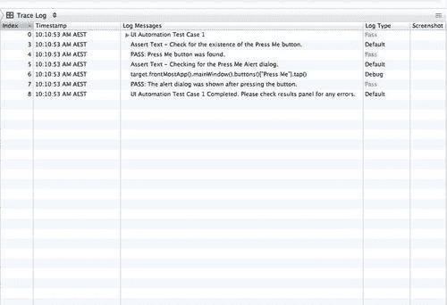**

**如您所见，通过将 `UIAutomation` 工具作为测试的一部分，您可以减半测试时间，并更多地专注于修复在应用程序发布之前那些令人烦恼的程序错误。**

**# 摘要**

在本章中，我们学习了针对 Xcode 开发工具所进行的改进。我们了解了**自动引用计数（ARC**）是什么，以及需要应用的一些编码差异。

我们还查看了对 Interface Builder、iOS 位置模拟器和 OpenGL ES 调试工具集的改进。为了结束本章，我们探讨了如何使用自动化工具来帮助对应用程序进行单元测试，使用 JavaScript 编写的测试脚本调用 UI 自动化 API。

在我们的最后一章中，我们将探讨如何使您的应用程序运行顺畅，Instruments 的新功能，以及如何使用这些功能来跟踪和改进应用程序的性能。**
