# 第七章：使用 Instruments 使您的应用程序运行流畅

恭喜你来到这本书的最后一章。在本章中，我们将关注如何在我们的应用程序中有效地使用**仪器**来追踪可能影响 iOS 应用程序整体性能的区域。

这些类型的问题可能会使我们的应用程序运行缓慢，甚至可能在用户的 iOS 设备上崩溃。我们将探讨 Instruments 应用程序中包含的内置仪器的不同类型，以及我们如何使用 iOS 仪器的**系统跟踪**来帮助您追踪代码中的系统调用、内存和线程，这些可能会影响您 iOS 应用程序的性能。

接下来，我们将探讨如何配置仪器，以便在报告的跟踪文档中以不同的方式显示数据。

在本章中，我们将涵盖以下主题：

+   介绍 Instruments 环境

+   学习如何添加和针对不同的仪器集进行性能分析

+   学习如何检查 iOS 应用程序的性能

+   介绍 Instruments 家族的其他组件

+   介绍 Xcode 4.2 中包含的新 Instruments

我们有很多内容要介绍。所以，让我们开始吧。

# 仪器简介

Instruments 应用程序是一个强大的工具，它使您能够收集有关应用程序性能随时间变化的信息。通过使用 Instruments 应用程序，您可以根据各种不同类型的数据收集信息，并同时在同一时间查看它们。因此，这将使您能够发现其他情况下难以发现的趋势，并且这可以用来查看程序中运行的代码及其相应的内存使用情况。

Instruments 应用程序附带一个标准库，您可以使用它来检查代码的各个方面。您可以将 Instruments 配置为收集有关同一进程或系统上不同进程的数据。

每个仪器收集并显示与文件访问、内存使用、网络连接等相关信息的不同类型。以下截图显示了 Instruments 应用程序正在使用多种不同类型的仪器来监控系统行为，以分析我们的`MapKitExample`：

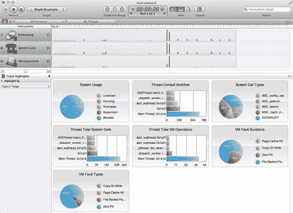

表格中的以下信息概述了 Instruments 应用程序的每个功能，并提供了每个部分覆盖的描述：

| **Instruments 功能** | **描述** |
| --- | --- |
| Instruments 面板 | 此部分列出了所有已添加的仪器，供您针对它们进行性能分析。您可以通过选择并从仪器库中将每个仪器拖动到该面板中添加新仪器。此面板中的项目也可以被删除。 |
| 轨迹面板 | 此部分显示当前仪器返回数据的图形摘要。每个仪器都有自己的轨迹，它提供该仪器收集的数据图表。此面板中的信息为只读。 |
| 详细面板 | 此部分显示每个仪器收集的数据的详细信息。它显示用于在轨迹面板中创建图形视图的事件集。根据仪器的类型，此面板中表示的信息可以自定义以不同方式表示数据。 |
| 扩展详细面板 | 此部分显示当前在详细面板中选定的项目的详细信息。此面板显示为给定事件收集的完整堆栈跟踪、时间戳和其他仪器特定数据。 |
| 导航栏 | 此部分显示您的位置以及您到达那里的步骤。它包括两个菜单：活动仪器菜单和详细视图菜单。您可以在导航栏中单击条目以选择活动仪器以及详细视图中的信息和级别。 |

仪器跟踪文档工具栏允许您添加和控制仪器、打开视图以及配置轨迹面板。


以下表格为工具栏上的每个不同控件提供解释：

| **工具栏项** | **描述** |
| --- | --- |
| **暂停/恢复**按钮 | 在录制过程中暂停收集跟踪数据。选择此选项实际上不会停止录制；它只是简单地停止仪器在录制过程中收集数据。当按下**暂停**按钮时，在轨迹面板中会显示跟踪数据中的间隙以突出显示这一点。 |
| **记录/停止**按钮 | 开始或停止录制过程。您使用此按钮开始收集应用程序的跟踪数据。 |
| **循环**按钮 | 允许您设置记录器在回放期间是否应该循环，以连续重复记录的步骤。如果您想为给定的步骤集收集多个运行，这可能很有用。 |
| **目标**菜单 | 选择文档的跟踪目标。这是收集数据的过程。 |
| **检查范围**控件 | 此控件允许您在轨迹面板中选择时间范围。当设置此范围后，仪器仅显示指定时间段内收集的数据。使用此控件上的按钮，您可以设置检查范围的起始和结束点，并清除当前范围。 |
| **时间/运行**控件 | 显示当前文档跟踪经过的时间。如果跟踪文档包含与它关联的多个数据运行，您可以使用箭头控件选择要在轨迹面板中显示的运行数据。 |
| **视图** 控制 | 隐藏或显示 Instruments 选项卡、详细选项卡和扩展视图选项卡。此控制使您能够仅关注您感兴趣的区域。 |
| **库** 按钮 | 隐藏或显示仪器库窗口。 |
| **搜索** 字段 | 此选项根据您输入的搜索词过滤详细选项卡中的信息。 |

Instruments 应用程序是 Xcode 4 工具安装的一部分，可以在 `<Root>/Developer/Applications` 文件夹中找到，其中 `<Root>` 是 Xcode 4 在您的系统上安装的文件夹。

## 跟踪 iOS 应用程序

Instruments 的一个常见用途是对您的应用程序进行系统跟踪。这个新奇的仪器被添加到 Xcode 4.2 的发布中，可以帮助您追踪可能影响您 iOS 应用程序性能的系统调用、内存和线程。

要展示 iOS Instruments 中系统跟踪的使用，我们将使用我们在 第六章 中创建的 `MapKitExample`，*Xcode 工具改进*。您有多种方法可以启动 Instruments 应用程序；您可以在运行 Instruments 后启动 iOS 应用程序，或者您可以使用 Xcode 中的 **产品** 菜单下的工具。下一节将向您展示如何运行和性能分析 `theMapKitExample` 应用程序项目。

## 加载 MapKitExample 项目

在我们开始性能分析 `MapKitExample` 项目之前，我们必须首先启动 Xcode 开发环境。这可以在 `/Xcode4/Applications` 文件夹中找到。或者，您可以使用 spotlight 通过在搜索框窗口中输入 Xcode 来搜索 Xcode。

1.  选择 **文件 | 打开** 或 *Command* + *O*。

1.  双击进入 **MapKitExample** 文件夹，并选择 **MapKitExample.xcodeproj** 文件。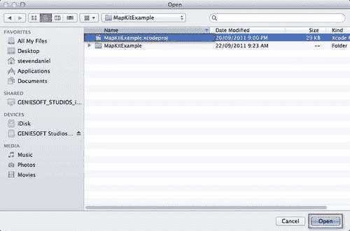

1.  点击 **打开** 按钮继续加载并打开文件到 Xcode 工作区环境。

我们现在需要开始运行和性能分析我们的应用程序，这将用于执行系统跟踪，以确定正在处理的线程和系统调用。

### 运行和性能分析项目

要在 Xcode 环境中运行 Instruments 应用程序，请在 **构建目标** 菜单下选择 **构建用于分析** 选项，或者使用键盘快捷键 *Shift* + *Command* + *I*，然后从 **产品** 菜单中选择 **分析** 选项以启动 Instruments 应用程序。同样，您也可以使用快捷键 *Command* + *I*。

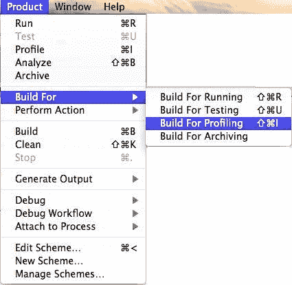

一旦选择了此选项，您最终会在屏幕上看到 Instruments 应用程序窗口。以下截图显示了这一过程：

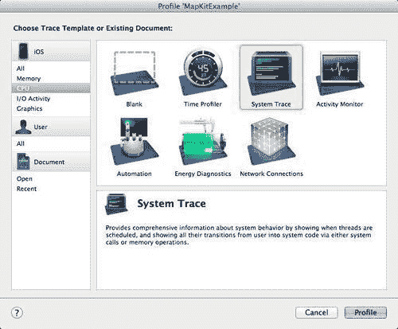

以下表格概述了每个可用的模板，以及 iOS 开发所需的模板：

| **模板** | **描述** |
| --- | --- |
| **空白** | 创建一个空白的跟踪文档，您可以添加自己的仪器组合。 |
| **时间剖析器** | 对一个或所有进程进行低开销和时间采样。 |
| **系统跟踪** | 提供您针对可能影响应用程序性能的操作系统不同方面的剖析能力。 |
| **活动监视器** | 此监视器监控整体 CPU、内存、磁盘和网络活动。 |
| **自动化** | 在您的应用程序内自动执行用户界面测试。 |
| **能耗诊断** | 显示有关设备上用于 GPU 活动、显示亮度、睡眠/唤醒、蓝牙、Wi-Fi 和 GPS 的能耗的诊断信息。 |
| **网络连接** | 使用此工具，您可以查看每个应用程序的每个连接上流动的数据量，以及一些有趣的统计数据，例如往返时间和重传请求。您可以使用这些信息来帮助减少网络流量和能耗。 |
| **分配** | 监控程序中内存和对象分配模式。 |
| **泄漏** | 检测应用程序中的内存泄漏。 |
| **线程** | 分析进程内线程状态转换，包括运行和终止的线程、线程状态以及相关的回溯。 |
| **文件活动** | 监控应用程序与文件系统的交互。 |

我们想要用于此示例的工具类型是**系统跟踪工具**。选择**系统跟踪**选项，然后点击**剖析**按钮，继续加载**Instruments 跟踪文档**窗口，并开始对 `MapKitExample` 应用程序进行剖析。

然后，您的应用程序将被分析，并对所有已对内存进行调用的系统调用和线程进行剖析。这还包括**虚拟内存**（**VM**）操作。

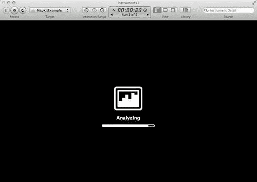

您会注意到，经过几秒钟后，您的跟踪信息将显示出来。这包含有关线程和系统调用的信息，以及您的应用程序当前正在进行的持续时间。其他信息，如虚拟内存故障，也被记录。

您可以选择通过点击红色记录按钮来停止应用程序的剖析，因为 Instruments 应用程序已经完成了其全面分析。

以下列表项显示了您在开发 iOS 应用程序时可能遇到的各类故障的比较，以及它们的解释。

## VM 故障

**虚拟内存**（VM）是位于计算机硬盘上的一种辅助存储，当**随机存取存储器**（RAM）满时，操作系统会使用它。它用于所有正常的计算机应用程序。许多计算机没有正确设置虚拟内存，因此无法获得最佳性能，导致系统故障。

## 内存泄漏

当应用程序分配内存但从未释放时，会发生**内存泄漏**。

让我们更仔细地看看以下示例：

```swift
for (int i = 1; I <= 500; i++) {
NSString *MemStatus = [[NSString alloc]
initWithFomat:@"Memory allocating…"];
}

```

在这个代码片段中，我们在循环中分配了`500`个字符串来演示内存泄漏可能发生的方式。每次循环时，代码都会为每个新的字符串`MemStatus`分配内存，并且让每个分配的字符串指针超出作用域。正如你所看到的，分配的内存从未被释放，导致你的应用程序运行缓慢，甚至可能引发崩溃或简单地挂起。

## 运行时错误

这类错误会导致你的应用程序停止执行。它可能是由未处理的异常引起的，这些异常是由于**内存不足**问题，或者**你正在将一些数据写入数据库**，或者**你可能已经超过了字段可以处理的允许的最大大小**。

## 编译时错误

这类错误最为明显，因为直到所有这些错误都被修复，你的程序将无法编译（因此无法运行）。通常，这些错误来自打字错误。

Xcode 中的 Objective-C 编译是区分大小写的，这意味着`UIcolor`和`UIColor`被处理为不同。例如，在 Objective-C 中，编译器可以理解以下：

```swift
self.view.backgroundColor = [UIColor blueColor];

```

但如果你输入：

```swift
self.view.backgroundColor = [UIColor bluecolor];

```

编译器会将其称为编译时错误，因为你指定了它无法识别的语言特定（语法）。

Instruments 窗口的**Trace Highlights**部分显示了一组基于已分析信息的有用图表。它包含显示系统总体使用情况的图表，以及线程数、系统调用和虚拟内存调用的数量。

此视图中每种颜色都表示与每个不同轨迹相关的信息，以及每个方法属于哪个库。单击任何图表都会进入一个摘要视图，显示每个部分的总体分解，包括调用栈视图、持续时间等。

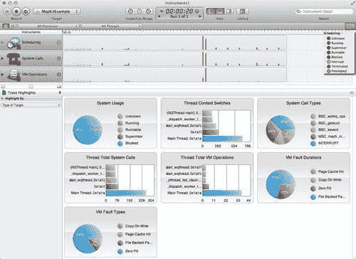

你还可以更改并使每个图表的颜色以不同的颜色显示。这可以通过单击此截图所示的**Scheduling**按钮图标来完成。

要更改任何颜色，请从弹出列表中单击每个颜色。这将显示位于 Instruments 窗口左侧的颜色轮，你可以在其中更改颜色轮提供的相应颜色值。


在本节中，我们探讨了如何使用 Instruments 应用程序运行和配置现有项目，通过使用 iOS 的系统跟踪仪来帮助我们追踪应用程序性能问题。 

我们探讨了 Instruments 应用程序中可用的不同视图，以及如何通过 Trace Highlights 视图将跟踪文档的结果表示为彩色编码的图表，以指示每个方法属于哪个部分。

# 添加和配置仪器

Instruments 应用程序内置了广泛的工具，可以帮助您更轻松地工作，通过它们从一个或多个进程中收集数据。大多数这些工具使用时配置简单，只需将它们添加到您的跟踪文档中即可开始收集跟踪数据。我们将探讨如何将工具添加和配置到现有的跟踪文档中。

## 使用 Instruments 库

Instruments 库显示了您可以使用并添加到跟踪文档中的所有仪器。库包含与 Xcode 4 安装一起提供的所有内置仪器，以及您已经创建的任何自定义仪器。

要打开 **Instruments** 窗口，请从跟踪文档窗口中点击 **库**按钮，或从菜单栏中选择 **窗口 | 库**。或者，您可以使用 *Command* + *L* 键盘快捷键。

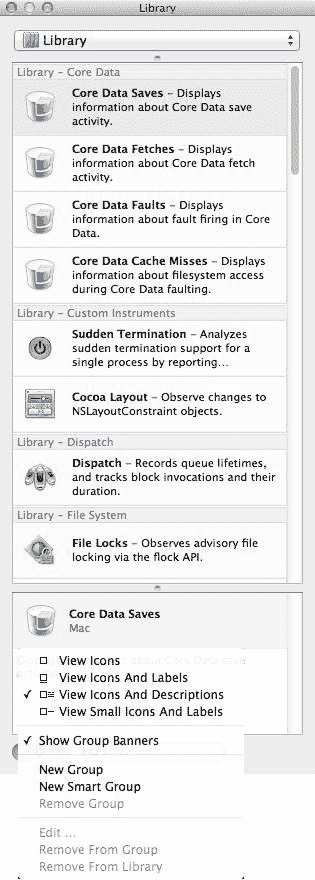

如您从屏幕截图中所见，Instruments **库**列表包含大量仪器，数量会随着时间的推移而增长，尤其是当您开始添加自己的自定义构建仪器时。

库列表提供了多种组织方式，通过不同的查看模式来查找您正在寻找的仪器。**查看模式**帮助您决定在任何时候应显示多少信息，以及您希望该仪器组占用多少空间。

在以下表中，我们描述了 Instruments **库**支持的查看模式。

| **查看模式类型** | **描述** |
| --- | --- |
| **查看图标** | 此设置仅显示代表每个仪器的图标 |
| **查看图标和标签** | 此设置显示带有仪器名称的图标 |
| **查看图标和描述** | 此设置显示每个仪器的图标、名称和完整描述 |
| **查看小图标和标签** | 此设置显示仪器的名称及其小图标版本 |

除了设置 Instruments **库**的查看模式外，仪器还可以分组组织，这使得识别哪个仪器属于哪个组变得更容易。这在上一个屏幕截图中有所展示。

## 在库中定位仪器

在库中定位仪器的有两种方法。一种常见的方法是使用分组选择标准控件，该控件位于**库**窗口的顶部，可以用来选择一个或多个组以限制在**库**窗口中显示的仪器数量。

如果您将弹出菜单和仪器面板之间的分隔条向下拖动，您会注意到弹出菜单从单选选择变为轮廓视图，这样您就可以通过按住*Command*键组合，然后使用鼠标选择所需的组来选择多个组，如图下截图所示：

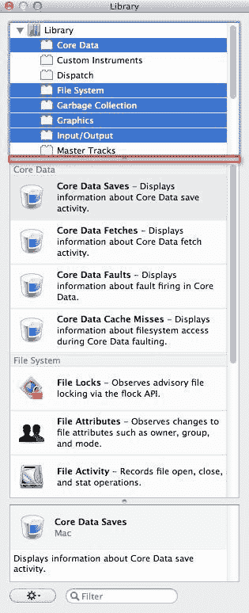

另一种过滤**仪器库**窗口内容的方法是使用位于**库**窗口底部的**搜索**字段。通过使用此**搜索**字段，您可以快速缩小范围并仅显示名称、描述、类别、列表或关键字中包含搜索关键字的所有仪器。

在以下截图中，显示所有包含搜索字符串`file`的仪器。

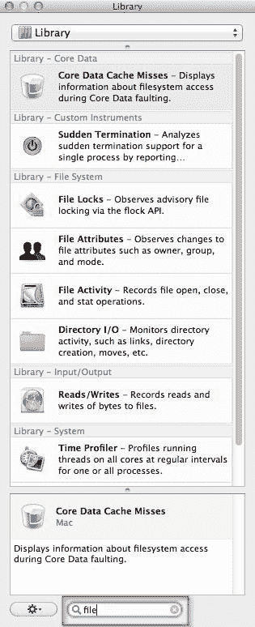

## 添加和删除仪器

有时候，您可能想要将您的应用程序与其他**仪器库**中的仪器进行跟踪。这可能是因为您想检查应用程序在设备上的性能以及应用程序消耗了多少电池。

您可以将任意数量的仪器添加到您的跟踪文档中，但请注意，库中并非所有仪器都能跟踪广泛的系统进程；您会发现有些仪器只能跟踪单个进程。为了解决这个问题，您可以添加多个仪器的实例，并将每个实例分配给不同的进程。通过这种方式，您可以收集同时运行的多程序的相关信息。

要将仪器添加到跟踪文档中，请从**仪器库**中选择仪器，然后将其拖动到**仪器**面板或跟踪文档的轨迹面板上，如图下截图所示：

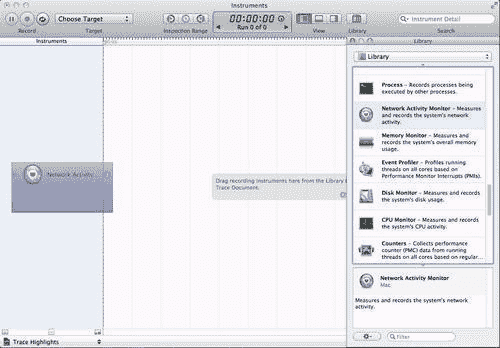

要从跟踪文档中删除仪器，请从**仪器**面板中选择您想要删除的仪器，然后按下键盘上的*Delete*键。您将收到一个确认消息。点击**确定**按钮继续。

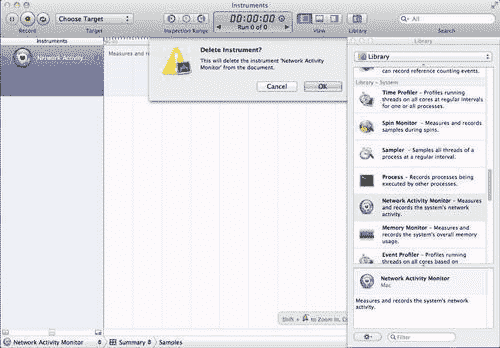

在下一节中，我们将探讨如何配置您已添加到跟踪文档中的仪器。

## 配置仪器

你会发现，你添加到跟踪文档中的大多数仪器都是即用型的。然而，一些仪器可以使用**仪器检查器**进行配置，并且根据配置的仪器类型而有所不同。

你会注意到，大多数仪器都包含配置轨道窗格内容的选项，而只有少数仪器包含额外的功能来确定仪器收集的信息类型。要配置一个仪器，请从**仪器**窗格中选择该仪器，然后点击位于仪器右侧的**仪器检查器图标**。这在上面的屏幕截图中显示：

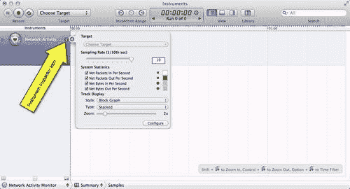

当点击**仪器检查器图标**时，它会在仪器名称旁边显示检查器配置对话框。要关闭检查器，请点击突出显示的**X**的关闭按钮。你可以使用类似的方式，通过*命令* + *I* 和 **文件 | 获取信息**命令来关闭此窗口。根据配置的仪器类型，它们可以在记录跟踪文档中的数据之前、期间或之后进行配置。

在你配置的这些仪器的检查器控制中，你可以找到**缩放**控制。此功能控制显示在轨道窗格中的跟踪数据的放大倍数，并调整仪器在轨道窗格中的高度。或者，你也可以使用**视图 | 减小面板大小**和**视图 | 增大面板大小**菜单选项来完成相同的事情。

## 仪器家族的其他组件解释

除了追踪内存泄漏和分配对象之外，Instruments 应用程序还包含其他仪器。尽管并非每个仪器都与 iOS 应用程序一起工作，但以下表格解释了与哪种类型相关的仪器列表：

| **仪器** | **平台** | **描述** |
| --- | --- | --- |
| 活动监视器 | iOS / 模拟器 | 将系统工作负载与虚拟内存大小相关联。 |
| 分配 | iOS / 模拟器 | 这可以用来在应用程序执行任务时捕获堆快照。如果在两个不同时间点进行捕获，可以用来识别内存丢失或未泄漏的情况。测试案例是先捕获快照，在应用程序中执行某些操作，然后撤销这些操作，使应用程序返回到执行操作之前的状态。如果堆中分配的内存相同，则无需担心。这是一个简单且可重复的任务执行测试场景，并使应用程序返回到执行任务之前的状态。 |
| 自动化 | iOS / 模拟器 | 用于自动化 iOS 应用程序的用户界面测试。 |
| 核动画 | iOS | 通过视觉提示来衡量在 iOS 设备上运行的进程中的核动画每秒帧数，这些提示有助于您理解内容如何在屏幕上渲染。 |
| CPU 采样器 | iOS / 模拟器 | 将整体系统工作量与您的应用程序所做的工作相关联。 |
| 能量诊断 | iOS | 显示有关设备上用于 GPU 活动、显示亮度、睡眠/唤醒、蓝牙、WiFi 和 GPS 的能量使用情况的诊断信息。 |
| 文件活动 | 模拟器 | 通过监控文件何时打开、关闭、读取和写入操作来检查系统中的文件使用模式。它还监控文件系统本身的更改，包括权限和所有者变更。 |
| 内存泄漏 | iOS / 模拟器 | 此工具寻找内存已分配但无法再使用的场景。这些内存泄漏可能导致应用程序崩溃或关闭。 |
| OpenGL ES 驱动程序 | iOS | 确定您在 iOS 设备上使用 OpenGL 和 GPU 的效率。 |
| 系统使用情况 | iOS | 记录在 iOS 设备上对进程内文件操作函数的调用。 |
| 线程 | 模拟器 | 分析进程内的状态转换，包括运行和终止的线程、线程状态以及相关的回溯。 |
| 时间分析器 | iOS / 模拟器 | 执行低开销和时间基础的采样，针对一个或所有进程。 |
| 僵尸 | 模拟器 | 僵尸工具在已释放的对象位置保持一个空或“死亡”对象（在某种意义上），这些“死亡”对象随后被有缺陷的应用程序逻辑访问，导致应用程序执行中断而不会崩溃。这些“僵尸”对象接收调用，并将工具指向应用程序通常崩溃的确切位置。 |

# Instruments 的新功能

Xcode 中的 Instruments 应用程序包含一系列内置工具，旨在使您的工作更轻松，并收集和显示一个或多个进程的数据。在 Xcode 4.2 中，添加了一系列新的工具，以下将进行解释。

## 带有 CPU 策略的时间分析器

**时间分析器工具**展示了每个代码段花费了多少时间。这允许开发者确定在发布前需要重构的逻辑部分。尽管这可以在 iOS 模拟器上运行，但建议在 iOS 设备上运行，因为两者的性能差异很大。

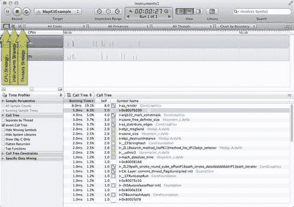

在时间分析器工具中，您可以使用此栏左侧的按钮来显示跟踪视图窗格，使用以下表中显示的三个策略之一：

| **视图模式类型** | **描述** |
| --- | --- |
| CPU 策略 | 此设置显示每个活动核心上的 CPU 活动。此策略可以帮助您确定您的应用程序是否实现了并发。 |
| Instruments 策略 | 此设置以单条轨迹显示 CPU 活动。这是默认策略。 |
| 线程策略 | 此设置显示每个单独线程的 CPU 活动。 |

时间分析器工具还向开发者提供了在 iPad 2 和 iPhone 4/4S 上运行他们正在开发的应用程序的能力。您可以使用 CPU 策略功能来测量每个 CPU 核心的活动。

这在上一张截图中的红色矩形中突出显示。如果您的应用程序支持并发，这应该同时显示 iPad 2 两个核心的活动证据。

### 注意

CPU 策略功能目前仅在时间分析器工具中可用。

您还可以配置时间分析器工具以限制活动处理器核心的数量。这是为了允许您配置应用程序以查看它在运行较少核心的系统上的性能。例如，如果您有一台运行四个活动核心处理器的 MacBook Pro，但您想将其限制为与两个活动核心处理器一起工作，以查看这在运行两个核心的 MacBook Pro 上的性能分析。

如果您的 CPU 支持多线程，这也可以称为**超线程**。这意味着对于每个物理核心，都有一个第二个逻辑核心。例如：如果您有一个启用了超线程并且运行在四个物理核心上的系统，这将导致系统运行在总共八个核心上。

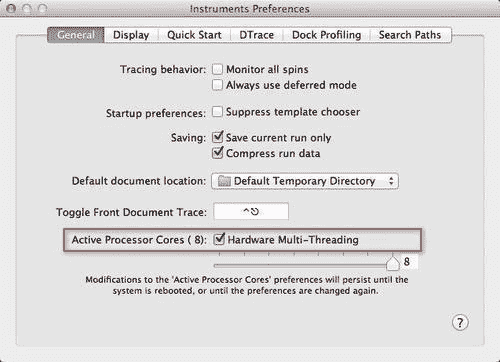

此截图显示了如何配置活动处理器核心的总数。此屏幕可以通过**Instruments | 预设**菜单选项访问，或者您也可以使用*Command* + 键组合。

从此屏幕，点击**常规**选项卡，然后从**活动处理器核心**中选择或取消选择**硬件多线程**复选框，前提是您的系统支持此功能。您还可以使用滑块来指定要使用的活动核心数量。

### 注意

对活动核心数量的任何更改都不会关闭任何处理器核心——相反，Instruments 应用程序会通知系统不要在已停用的核心上调度工作。

## iOS 系统跟踪器

**iOS 系统跟踪器**工具让您能够针对可能影响应用程序性能的操作系统不同方面进行性能分析。这提供了有关任何系统调用、线程调度和**虚拟内存**（**VM**）操作的信息。

此仪器可能有用的情况示例包括：当你想知道为什么你的代码没有及时在 CPU 上执行时，或者如果你是游戏开发者，你想找出为什么你的应用程序帧率意外下降。

在 Instruments 4.2 中，你可以使用系统跟踪工具来分析 iOS 和 Mac OS X。

### 注意

有关如何使用此类仪器的更多信息，请参阅本章中名为*跟踪 iOS 应用程序*的部分。

## 网络连接

**网络连接**仪器让你能够检查你的 iOS 应用程序如何使用 TCP/IP 和 UDP/IP 连接。当你使用此仪器时，它会自动捕捉所有打开的端口的快照，并在详细视图中报告它们的累积网络活动，以查看每个连接和每个应用程序有多少数据流动。

以下截图显示了详细视图中的**连接摘要**部分，显示了传入和传出的网络连接，以及所有进程的所有打开连接。

你还会看到，你可以查看统计数据，例如往返时间和重传请求，以帮助减少网络流量和能耗。

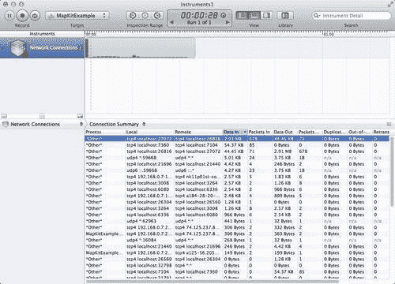

详细视图还允许你从以下显示视图中选择；以下表格中解释了这些视图：

| **视图模式类型** | **描述** |
| --- | --- |
| **进程**摘要 | 此设置仅聚合每个进程的累积数据。 |
| **接口**摘要 | 此设置按网络聚合数据。 |

你还可以选择让详细视图显示一组有用的图表，通过选择**跟踪高亮**选项，如下面的截图所示：

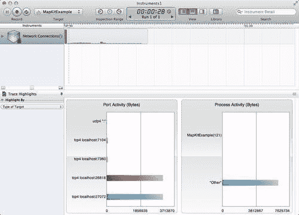

此截图显示了**端口活动**和**进程活动**的比较。**端口活动**功能测量传入和传出的连接。**进程活动**功能测量应用程序使用的活动。

## 网络活动

**网络活动**仪器帮助你在网络（蜂窝和 Wi-Fi）和能耗之间架起桥梁。你可以使用此仪器来跟踪通过每个网络接口的数据流量总量，以及直接从电池获取的能耗水平，同时关联 iOS 设备中的网络活动与能耗，并且它也是 iOS 能耗诊断模板的一部分。

以下截图显示了**能耗诊断**跟踪文档，显示了显示不同**能耗**级别的运行结果：

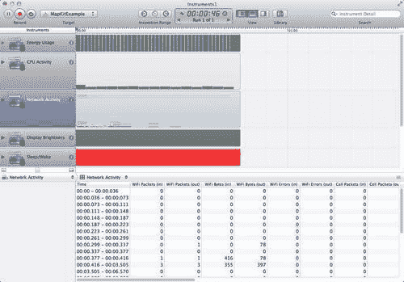

当你第一次运行这个程序时，你会注意到网络活动频繁到足以保持进程活跃，这将导致更大的能量消耗。如果你再次运行这个程序，你会注意到相同的数据以更大的但更少的数据包形式传输，允许应用程序在传输之间进入休眠状态。

**能源诊断**仪器是苹果给予开发者的最激动人心的工具。这个仪器将帮助你通过尽可能接近真实世界场景来测试你的应用程序，从而识别 iOS 设备资源的最佳使用方式。

收集的数据可以稍后进行分析，以查看每个功能消耗了多少设备的电池寿命，并且它将告诉开发者设备的各种组件各自使用了多长时间。如果你需要知道用户的位置，它将告诉你哪些设备被打开以及持续了多长时间。**GPS**是消耗设备大量电池寿命的特定资源。一旦获得位置信息，关闭**位置服务**是理想的。

### 注意

如果你想要了解更多关于 Instruments 的信息，可以参考以下链接提供的*Instruments 用户指南文档*：[`developer.apple.com/library/ios/#documentation/DeveloperTools/Conceptual/InstrumentsUserGuide/Introduction/Introduction.html`](http://developer.apple.com/library/ios/#documentation/DeveloperTools/Conceptual/InstrumentsUserGuide/Introduction/Introduction.html)。

# 摘要

在本章中，我们专注于 Xcode Instruments 应用程序的新增功能，以及我们如何使用这个出色的工具来确保我们的应用程序运行顺畅，不受可能影响应用程序性能的瓶颈的影响。

我们查看了 Instruments 应用程序中成为其一部分的每种内置仪器的不同类型，特别是 iOS 仪器的系统跟踪。这有助于追踪可能影响 iOS 应用程序性能的系统调用、内存和线程。

我们在本章结尾处探讨了如何配置仪器，以便在跟踪文档中用不同的方式表示数据。

我希望你喜欢阅读它，就像我喜欢写作它一样。这当然不是你的终点。在 Xcode 和 iPhone 的世界中还有很多东西可以探索。别担心！你不会孤单一人。有很多开发者愿意在你需要的时候帮助你：[`developer.apple.com/devforums/`](http://developer.apple.com/devforums/)。

祝你在 Xcode 的旅程中一切顺利。我希望不久就能在苹果应用商店看到你的应用程序！
