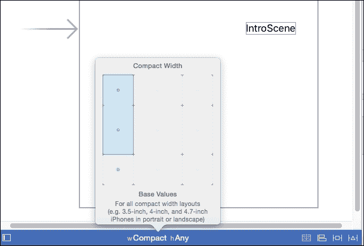

# 第二章. 使用 iOS 9 Storyboard 和 Segues 构建和规划游戏

电子游戏开发有着有趣的历史。它始于电气工程和计算机科学的分支。游戏是工程师们充分利用有限硬件的巨大挑战，当然，还要制作出有趣的东西。今天，电子游戏和电子游戏开发仍然建立在技术、数学和工程的基础上，但几十年来，也一直是娱乐、叙事和媒体领域的主要参与者。

不论你是大型工作室、小型团队，还是独自制作游戏，规划和构建你的游戏项目可以为你提供在开发过程中节省时间的基础，如果是在团队中，可以将工作分配给他人，当然，还可以将你的游戏制作得尽可能接近你想象的样子。

从 iOS 5 开始，Apple 从娱乐行业借鉴了如何构建和规划项目的方法，无论是大项目还是小项目；通过使用 Storyboard 的概念。Storyboard 是项目各种步骤和结构的图形表示；无论是动画、电影，还是我们这里的 iOS 游戏。Storyboard 将图形化地展示制作或应用程序的流程。例如，在动画中，Storyboard 用于细化制作的主要帧或故事点。一旦就场景中的事件序列达成一致，动画师将围绕这些关键点进行动画制作。根据制作是预录音还是 ADR，配音也可以放入 Storyboard 流程中，这为动画师提供了更多具体的内容来工作。

在实际的游戏应用程序中，Storyboard 可以表示游戏的主要部分，例如开场场景、开始菜单屏幕、暂停屏幕、游戏结束屏幕，或者主游戏级别的通用外观。Apple 在 Xcode 中将这些结构命名为 **Storyboard**，它们之间的路径被称为 **Segues**。在本章中，我们将探讨如何在制作游戏应用程序时利用这些功能。


上文是一个简单的 iOS Storyboard 示例。

# 模型-视图-控制器

在我们深入探讨 iOS 9 中的 Storyboard 之前，最好我们先讨论一下 iOS 应用程序的基本流程以及 **模型-视图-控制器**（**MVC**）的概念。模型-视图-控制器是软件工程、编程，甚至在现在的网页设计中使用的一种架构范式。我们可以将 MVC 的模型部分视为应用程序行为的逻辑或 *大脑*。这种逻辑通常独立于用户界面，并决定如何处理应用程序的数据。

我们实际上已经讨论了 MVC 的模型部分！前一章中讨论的 Swift 编程语言就是那个模型；这与它的 Objective-C 前身以及 iOS 或任何其他游戏开发中使用的任何其他编程语言都是如此。你的游戏代码控制玩家、关卡和敌人/目标数据应该做什么。

MVC 中的视图部分是模型的视觉表示。这当然包括我们游戏中的许多视觉方面，从玩家的动画帧、HUD 上的各种游戏统计信息、粒子效果等等。

MVC 中的控制器部分可以被视为将模型和视图粘合在一起的“胶水”。它也是用户与游戏交互的点。无论是动作，如按钮点击、基本的触摸、滑动或其他由 iOS 设备识别的手势，控制器都会接收用户输入，操作模型，然后模型根据相应地更新视图。


此图来自苹果自己的冒险游戏示例。

当我们与 iOS 应用程序合作时，代码和故事板信息的第一个推荐入口点是根视图控制器。正如我们将要发现的，MVC（模型-视图-控制器）在 iOS 应用程序开发和 Xcode 集成开发环境（IDE）中是固有的。故事板是一系列不同类型的视图控制器，它们具有不同的任务，并通过转场（segues）相互连接。

# iOS 应用程序的生命周期

在我们继续处理故事板、转场和游戏应用程序的基础之前，最好回顾一下 iOS 应用程序的整体生命周期，因为了解我们代码的入口点和应用程序的各种对象/结构非常重要。

在我们继续处理故事板、转场和游戏应用程序的基础之前，插入应用程序生命周期图。最好我们回顾一下 iOS 应用程序的整体生命周期，因为了解我们代码的入口点和应用程序的各种对象/结构非常重要。


来源：[`developer.apple.com/library/ios/documentation/iPhone/Conceptual/iPhoneOSProgrammingGuide/TheAppLifeCycle/TheAppLifeCycle.html`](https://developer.apple.com/library/ios/documentation/iPhone/Conceptual/iPhoneOSProgrammingGuide/TheAppLifeCycle/TheAppLifeCycle.html)

任何使用过 C/C++、Java 或其他语言的人都会熟悉 `main()` 函数。`main()` 函数用于指定程序的入口点。前面的例子是苹果为应用程序指定的典型 `main()` 函数。本质上，这是在调用 iOS 应用程序典型生命周期中的第一个类，即 `AppDelegate` 类。

## `main()` 函数

这里是带有 `main()` 函数的代码：

```swift
#import <UIKit/UIKit.h>
#import "AppDelegate.h"

int main(int argc, char * argv[])
{
    @autoreleasepool {
        return UIApplicationMain(argc, argv, nil, NSStringFromClass([AppDelegate class]));
    }
}
//Objective-C example of the Main() function
```

注意 `main()` 函数是如何用 Objective-C 编写的。Swift 再次使声明应用程序的入口点变得简单。

```swift
@UIApplicationMain
class firstClassCalled
{ 
  //class code
}
```

在使用 Swift 构建 iOS 应用程序时，先前 Objective-C 项目中看到的 `main.m` 文件不再需要。相反，我们在类声明的开头使用一个属性调用，`@UIApplicationMain`。

### 注意

**Swift 属性**

以 *at* 字符 `@` 开头的属性用于向声明或类型添加附加信息。在 Swift 中，它们具有以下语法：

```swift
@attribute name
@attribute name(attribute arguments)
```

在其他编程语言中，属性根据其功能，可以用来描述对象、函数，甚至整个类。

例如，`@objc` 属性用于声明在 Objective-C 中可读的代码。

正如我们将在使用和将故事板中的各种对象与我们的代码链接时看到的那样，属性 `@IBOutlet` 和 `@IBAction` 用于描述我们在 Xcode 的 Interface Builder 中创建的对象和函数。

我们将在第七章*发布我们的 iOS 9.0 游戏*中进一步讨论属性。

## UIApplication 类/对象

`UIApplication` 是负责控制应用程序的事件循环以及处理其他高级应用程序流程的对象。无论游戏应用程序与否，它都存在于所有 iOS 应用程序中，并在主入口点首先被调用，并与 `AppDelegate` 类协同工作。尽管可以子类化 `UIApplication`，但通常不推荐这样做。对您的游戏在应用程序各种状态下的行为进行定制是我们使用 `AppDelegate` 类和 `ViewControllers` 的原因，即使没有使用故事板（也就是说，如果您选择主要使用硬编码来编写游戏）。

## AppDelegate 类

我们可以将 `AppDelegate` 类视为您应用程序的主枢纽。它是您游戏的一般自定义的最高级别。在用 Swift（游戏或非游戏）制作应用程序时，它被赋予 `@UIApplicationMain` 属性，因为它是您游戏模型/代码的一般首次入口。

这里是 Apple 几乎为每个在 Xcode 中预设的 iOS 应用程序提供的代码：

```swift
import UIKit

@UIApplicationMain
class AppDelegate: UIResponder, UIApplicationDelegate {

    var window: UIWindow?

    func application(application: UIApplication, didFinishLaunchingWithOptions launchOptions: [NSObject: AnyObject]?) -> Bool {
        // Override point for customization after application launch.
        return true
    }
    func applicationWillResignActive(application: UIApplication) {
        // Sent when the application is about to move from active to inactive state. This can occur for certain types of temporary interruptions (such as an incoming phone call or SMS message) or when the user quits the application and it begins the transition to the background state.
        // Use this method to pause ongoing tasks, disable timers, and throttle down OpenGL ES frame rates. Games should use this method to pause the game.
    }

    func applicationDidEnterBackground(application: UIApplication) {
        // Use this method to release shared resources, save user data, invalidate timers, and store enough application state information to restore your application to its current state in case it is terminated later.
        // If your application supports background execution, this method is called instead of applicationWillTerminate: when the user quits.
    }

    func applicationWillEnterForeground(application: UIApplication) {
        // Called as part of the transition from the background to the inactive state; here you can undo many of the changes made on entering the background.
    }

    func applicationDidBecomeActive(application: UIApplication) {
        // Restart any tasks that were paused (or not yet started) while the application was inactive. If the application was previously in the background, optionally refresh the user interface.
    }

    func applicationWillTerminate(application: UIApplication) {
        // Called when the application is about to terminate. Save data if appropriate. See also applicationDidEnterBackground:.
    }
}
```

这是 Apple 在 iOS 9 游戏预设中为我们提供的直接代码和注释（截至 Xcode 6.4）。在我们深入使用故事板和两个主要框架（SpriteKit 和 SceneKit）来构建游戏结构之前，最好了解这个类中发生的事情。与设备相关的事件，尤其是那些在玩家控制之外的，如来电、通知以及由于低电量而关闭设备，以及那些由玩家控制的（即暂停游戏）事件，都由这个类处理。正如我们所见，Apple 已经为这个类的每个函数提供了很好的说明，所以请务必查看它们。我们将在创建游戏和处理那些特定情况时回到这些说明。请注意，`AppDelegate`类有一个可选变量（意味着它可以设置为 nil），名为`window`，其类型为`UIWindow`。`UIWindow`对象是`UIView`的子类，可以分配各种显示/对象，这些对象可以被放入用户的视图中。技术上，我们可以直接在代码中使用`UIWindow`和`UIView`的对象来创建游戏的视觉效果，但 Apple 提供了更健壮的对象，这些对象可以处理用户与屏幕和视图的交互。这些对象构成了 iOS 故事板，被命名为`ViewControllers`。

## 视图控制器

视图控制器可能是 iOS 开发中最关键的架构之一，也是 Xcode 的 Interface Builder 在设计时在视觉上所表示的内容。就它们典型的入口顺序而言，是`MAIN` --> `AppDelegate` --> `RootViewController` --> [调用任何额外的`ViewControllers`实例]。

当我们在 Xcode 中创建一个新的应用项目时，Apple 会为我们创建一个默认的根视图控制器，命名为`ViewController`。以下是它的代码：

```swift
import UIKit
class ViewController: UIViewController {
    override func viewDidLoad() {
        super.viewDidLoad()
        // Do any additional setup after loading the view, typically from a nib.
    }
    override func didReceiveMemoryWarning() {
        super.didReceiveMemoryWarning()
        // Dispose of any resources that can be recreated.
    }
}
```

这是 Xcode 中默认提供的`ViewController.swift`类作为起始代码。正如我们所见，它是`UIViewController`的子类，因此继承了其父类的所有功能。其中之一就是这里显示的`viewDidLoad()`函数。在 Swift 中，当我们希望覆盖父类的一个函数时，我们在函数声明前使用关键字`override`。我们还可以看到`super.viewDidLoad()`也被调用了。这样做的作用是在我们添加自己的代码/自定义之前调用父类自己的这个函数版本，当使用`UIViewController`的任何函数时，这是推荐的。`UIViewController`函数处理各种视图状态；`viewDidLoad()`处理视图首次加载时的情况，在应用的生命周期中，`UIViewController`对象只会被调用一次。如果我们想在每次视图可见时调用一些代码，我们可以使用`UIViewController`的`viewDidAppear()`函数代替。

这是对这些视图状态的一种视觉表示。


正如我们将看到的，故事板和转场基本上为我们提供了这些状态及其之间的转换的视觉和可定制表示，而不需要编写太多代码。

要深入了解 `UIViewController` 方法，请查看苹果关于该主题的文档：

[`developer.apple.com/library/ios/documentation/UIKit/Reference/UIViewController_Class/`](https://developer.apple.com/library/ios/documentation/UIKit/Reference/UIViewController_Class/)

### 注意

对于熟悉游戏开发引擎 Unity（其脚本用 C#、JavaScript 或 Python 衍生物编写）的人来说，我们可以想象 `UIViewController` 函数 `viewDidLoad()` 和 `viewDidAppear()` 分别类似于 Unity 函数 `Awake()` 和 `OnEnabled()`。一个函数在场景首次加载时被调用，另一个则在对象可见/启用前的第一帧被调用。然而，`UIViewController` 函数是基于整个应用程序的更高级别，而不是基于每个 `gameObject`。

想要了解更多关于整个 iOS 应用生命周期和图形信息，请查看完整的文档：

[`developer.apple.com/library/ios/documentation/iPhone/Conceptual/iPhoneOSProgrammingGuide/TheAppLifeCycle/TheAppLifeCycle.html`](https://developer.apple.com/library/ios/documentation/iPhone/Conceptual/iPhoneOSProgrammingGuide/TheAppLifeCycle/TheAppLifeCycle.html)

## 视图控制器类型

视图控制器有多种类型，我们可以通过继承它们来创建自己的视图控制器。主要有两种类型：**容器视图控制器**，它包含其他视图控制器，以及内容视图控制器，正如我们可以想象的那样，它们是显示内容的地方。内容视图控制器包括 `RootViewController`，这是在应用程序的入口点之后访问的第一个视图控制器，也是预设 Xcode 项目中默认 `Main.Storyboard` 文件中看到的第一个视图控制器。还有其他特殊类型的视图控制器，如用于以表格单元格格式显示数据的 `UITableViewController` 和控制应用程序在视图控制器之间移动时的导航逻辑/图像的 `NavigationController`。

要更深入地了解 UIKit 中可用的各种视图控制器，请查看以下官方文档：

[`developer.apple.com/library/ios/featuredarticles/ViewControllerPGforiPhoneOS/index.html#//apple_ref/doc/uid/TP40007457-CH2-SW1`](https://developer.apple.com/library/ios/featuredarticles/ViewControllerPGforiPhoneOS/index.html#//apple_ref/doc/uid/TP40007457-CH2-SW1)

实际上，正是在这一点上，我们可以开始编写我们的游戏代码，尽管是完全编程 MVC 模型。在 iOS 游戏开发的初期，这基本上是开发原始 iPhone 游戏的方式。我们会通过编程方式与`UIWindow`和`ViewController`对象以及我们游戏的自定义类一起工作来构建应用。随着 iOS 设备家族的壮大，一个明显的问题开始出现。尽管我们可以，有时可能不得不根据设备编程地更改代码，但处理不断增长的屏幕尺寸和设备类型使得我们的代码总是需要重构，并且每当宣布一款新的 Apple iOS 设备时，都会产生越来越多的模糊性。此外，别忘了游戏开发与视觉设计师/动画师的工作一样，也是程序员的工作。如果完全通过代码进行编辑、定位、精炼和更新游戏的各个视觉方面，可能会非常耗时。

故事板是为了帮助解决这一问题而设计的，它允许我们在项目中直观地设计我们的游戏，而不是拥有我们自己的可能手写的仅描述基于模型、以代码为中心的设计的故事板。随着 Xcode 5 中自动布局的引入，我们可以不使用任何代码，为所有类型的 iOS 设备制作一个项目和通用视图。当我们现在终于转向与故事板和转场一起工作时，我们将涉及自动布局，但为了更深入地了解自动布局，请查看 Apple 开发者门户上的官方文档：[`developer.apple.com/library/ios/documentation/UserExperience/Conceptual/AutolayoutPG`](https://developer.apple.com/library/ios/documentation/UserExperience/Conceptual/AutolayoutPG)。

# 故事板和转场

让我们现在终于开始使用这些工具，并学习在更广泛的 Storyboard 级别上结构化游戏应用的基础知识。截至本书编写时，可用的最新 Xcode 版本是 7.0。这将是我们将使用的版本，但 Xcode 总是在更新，甚至有一个单独的测试最新功能的测试版。

访问[`developer.apple.com/xcode/`](https://developer.apple.com/xcode/)下载并了解 Xcode 为 iOS 开发者提供的一切。

要开始使用故事板来结构化你的应用，请遵循以下说明：

1.  首先，在你的`Applications`文件夹中打开 Xcode（或者如果你将其放在 Dock 中以方便访问，就在 Dock 中打开）。

1.  接下来，点击**创建一个新的 Xcode 项目**。

1.  现在，你将需要选择一个模板预设。

1.  为了仅仅理解故事板和转场，选择单视图应用模板。（不要担心，我们将在下一章中使用游戏模板）。

1.  现在我们选择我们的项目选项。将你的项目命名为`StoryBoardExample`。

1.  在**语言**下拉菜单中，确保它设置为**Swift**，并确保**设备**下拉菜单设置为**通用**。

1.  应该还有其他字段由 Xcode 填写，例如你的组织名称和组织标识符。这些与你的应用程序部署时将发布的信息以及你的代码版权注释的内容有关。我们现在可以保持这些默认设置，即 Xcode 已填写的设置。

1.  点击**下一步**，然后选择一个有效的位置来保存此项目。

现在我们已经通过模板创建了默认应用程序。我们应该在左侧的文件导航器面板中看到为我们创建的各种文件和文件夹。正如我们所看到的，`AppDelegate.swift`和`ViewController.swift`文件已经为我们自动创建，在其下方，我们会找到`Main.Storyboard`文件。这是我们的故事板，当你点击它时，你应该在 Xcode 窗口的中心看到两个面板打开。左侧是视图控制器**场景**下拉菜单，它显示了由提供的视图控制器控制的场景层次结构。中心右侧的面板允许我们直观地看到视图控制器以及我们可以放置其中的元素。故事板的主要视觉部分可以放大和缩小。当我们向其中添加更多场景时，这将允许我们看到整个故事板或我们正在工作的部分。

你可能需要稍微缩小一些才能看到它（使用鼠标或使用 MacBook 上的捏合手势），但在视图控制器场景的左侧有一个灰色箭头。这是入口点，与这个箭头相连的第一个视图控制器场景是你的`RootViewController`/初始场景。

### 小贴士

当你想要为你的故事板添加更多场景，无论是为了调试目的还是设计选择，你可以简单地通过点击并拖动该场景左侧的箭头来更改第一个进入的场景。

让我们先为我们的故事板创建一个单独的场景：

1.  在**实用工具**面板的底部（Xcode 项目的最右侧面板），有四个图标代表我们可以放置在我们项目代码和故事板中的各种代码片段和对象。如果第三个图标尚未选中，请点击它。这将打开对象库。

1.  我们可以看到对象库的顶部有一个**视图控制器**对象。

1.  将其拖动到故事板的画布上，最好拖动到初始场景的右侧。

    ### 注意

    如果**实用工具**面板没有打开，请点击项目工具栏窗口右上角的最图标。

    

    ### 注意

    工具栏中的三个按钮可以切换以关闭**导航**面板、**调试**面板和**实用工具**面板。在适用的情况下关闭这些面板可以帮助扩展一般视图，即你的故事板场景的画布。

现在我们故事板中有两个场景，但没有任何东西告诉我们它们是什么。它们只是两个空场景！

让我们在这些场景中放置一个**标签**对象来表示它们是什么，并在运行时告诉我们我们处于哪个场景。

为了保持开发游戏的思维模式，让我们在第一个场景中放置一个名为**Intro Scene**的标签，在那里我们可能会有一个游戏开场动画和一个**开始/选项**菜单，在下一个场景中，放置标签`Game Scene`来表示实际游戏玩法将在这里发生。

下面是如何做到这一点：

1.  前往**实用工具**面板底部，使用搜索字段搜索`label`。这将隔离`label`对象，因此你不必在整个列表中滚动。

1.  将`label`对象拖动到第一个场景的画布上。如果它看起来没有尝试吸附到场景的画布上，你可能需要选择该视图控制器场景层次结构中的**视图**部分，使用主/故事板主视图的左侧面板。或者，你也可以在检查器中双击视图以获得场景焦点，这样你就可以将标签放置在上面。

1.  当我们拖动时，尽量将标签居中。画布会用虚线表示我们处于场景的垂直和/或水平部分。将其放在中心。

    选择标签时，**实用工具**面板应该会显示一些字段，以控制其文本的各个方面，如字体大小、对齐方式和样式。

    

1.  标签默认情况下会显示为`Label`，所以让我们通过在画布上双击标签本身，或者在**实用工具**面板中**文本**字段下方第二个字段中更改名称，将第一个场景重命名为`Intro Scene`。

1.  让这个标签更加突出，所以单击标签，点击**字体**字段中的[T]图标，并将样式设置为粗体，大小为 28。

    注意标签是如何被尺寸增加裁剪的，几乎看不见。

    

1.  简单地单击标签，并展开画布上标签对象角落的任意一个八向缩放图标。

    将标签重新定位以将其放回场景中心。

    

1.  通过简单地按*Command* + *D*复制标签（这样就不必重复所有步骤），然后将它拖动到另一个场景的中心。根据需要缩小视图，如果焦点改变阻止你拖动标签，可能还需要单击层次结构视图部分。

虽然这相当基础，并且还需要做更多的工作，但这就是创建单独场景所需的全部。如果你有一个关于如何构建你的游戏的思路，这就是你可以使用故事板开始的地方。当然，在我们使这个故事板具有任何功能之前，这里还有更多的工作要做。

我们可以看到 Xcode 给出了以下警告：

场景由于缺少入口点而无法访问，并且没有用于运行时访问的标识符`-instantiateViewControllerWithIdentifier`。

这是指由于没有与 Intro 场景或应用的入口点连接而实际上成为孤儿的游戏场景对象。

这就是 segues 发挥作用的地方。然而，在我们使用 segues 并创建到这些场景和其他场景的流程之前，如果我们运行这个应用，我们会注意到另一个问题。我们确信我们已经将文本居中了，但如果我们模拟或运行这个应用，比如在 iPhone 6s 上，文本完全偏离了右上角。这是因为默认画布是通过 Auto Layout 开始的一个通用的**所有设备**模板。

随着 Xcode 每个新版本的发布，Auto Layout 变得更加容易，但有时仍然可以说它仍然有点麻烦，尤其是在创建约束（设置故事板对象之间的空间/边距）时。让我们快速看看如何处理约束。

解决我们这里问题的快速方法就是通过点击故事板画布底部的中心处的**Base Values**面板中的**w/Any h/Any**文本。一旦点击，就会弹出一个单元格表格。用鼠标或触控板在各个单元格上滚动，会显示与**w/Any h/Any**不同的多种配置。这很好，因为你可以根据设备类型简单地通过这些选项来更改/添加和删除各种对象。

### 注意

在故事板和 Auto Layout 之前，这会涉及到在视图控制器或 Nib 类中进行大量的测试和代码重构，以获得你想要的视觉布局。然后苹果会创建具有不同屏幕大小的下一个设备，这会变成更大的麻烦，或者开发者会在最新设备上冒游戏损坏的风险。

要使标签在所有纵向模式的 iPhone 上居中，例如：

1.  将鼠标悬停在 Auto Layout 面板的中心左侧，那里会显示弹出面板/表格顶部的**Compact Width | Any Height**。

1.  这应该会改变画布底部的显示文本为**w/Compact h/Any**，并缩小场景的宽度，因为这个布局代表所有纵向模式的 iPhone 以及任何高度（所以它可能在较旧的 iPhone 4S 上有点不合适，与 iPhone 5 或更新的设备相比）。

1.  注意标签是如何偏离中心向右上方的。这就是在模拟器或实际 iPhone 的纵向模式中看到的样子。将它们拖回到中心，它们现在应该看起来像在这个 Storyboard 画布配置中看到的那样。如果为 iPad 设计，那么其他配置也需要相应更改。

    ### 注意

    使用约束可以实际上简化这个过程。例如，假设你想要在游戏场景的右上角放置一个**暂停**按钮，并且你知道无论设备方向如何，它始终会保持一定的距离（以百分比或像素为单位）远离屏幕的右侧和顶部。我们可以点击画布底部的固定按钮来创建这些**w/Any h/Any**配置的约束，并跳过手动调整每个基本配置上的图标。

    Xcode 已经为我们提供了一个场景，即`LaunchScreen.xib`文件，如果你已经运行过你的代码，那么实际上在 Storyboard 中的第一个视图控制器之前，我们看到的就是这个文件。

    要在启动时只使用`Main.Storyboard`文件，你可以在**导航**面板的左上角选择主项目文件，并在**应用程序图标和启动图像**部分的**启动屏幕**下拉菜单中选择`Main.Storyboard`。然后，如果你不再需要，可以删除`LaunchScreen.xib`文件。这个文件可以用来查看工作约束，如果需要的话，它也可以成为你游戏的初始启动画面。更多关于约束的信息可以在官方文档中找到：[`developer.apple.com/library/prerelease/ios/documentation/UserExperience/Conceptual/AutolayoutPG/WorkingwithConstraintsinInterfaceBuidler.html`](https://developer.apple.com/library/prerelease/ios/documentation/UserExperience/Conceptual/AutolayoutPG/WorkingwithConstraintsinInterfaceBuidler.html)。

## 转场

游戏有场景，所有场景之间都有过渡。转场只是 Storyboard 中场景之间的过渡。转场有多种类型：

+   **显示**：这种方式将下一个视图控制器推到当前视图控制器之上；如果使用`UINavigationController`实例，它还允许回退。

+   **显示详情**：当使用`UISplitViewController`时，通常在 iPad 应用中使用容器视图控制器来浏览新闻/电子邮件应用，其中页面左侧是一个`UITableViewController`对象，而同一页面的另一侧是该表格/列表的详情。当从`UITableViewController`侧的选择项触发手势时，它会调用页面`DetailView`控制器部分的详情。

+   **模态呈现**：这种方式会在当前视图控制器之上呈现下一个视图控制器，并且可以取消，例如全页弹出窗口。

+   **弹出视图**: 这类似于模态显示，但提供了更多尺寸选项来创建一个更小的弹出窗口，可以关闭和销毁。

+   **自定义**: 这是一个可以完全使用面向对象（OOP）代码定制的过渡版本。

当构建例如电子邮件应用时，典型的故事板结构很可能需要使用导航控制器和`UITableView`控制器来结构化数据和应用的流程。现在，我们同样可以为游戏应用做同样的事情。游戏结束、菜单、排名和暂停屏幕都可以使用这些视图控制器。在我们的例子中，我们将保持简单和不受限制，以便你，开发者，有一个更好的起点来分支。

### 注意

我们这里的例子相当简单，但除了提供这个项目的代码外，还将提供使用各种视图控制器和对象的更详细的故事板。

让我们来处理那个警告，并将这些场景链接起来，同时开始展示使用故事板的一个典型游戏的总体结构。

1.  首先，在**简介场景**中，在**简介场景**标签下方放置一个标签为**开始**的按钮。在故事板上放置按钮的方式与放置标签的方式完全相同。在**实用工具**面板中搜索`button`或向下滚动对象，然后将按钮拖放到场景中。

1.  现在在游戏场景视图中创建另外两个按钮；一个按钮标签为**暂停**位于场景的右上角，另一个名为**退出**位于暂停按钮的左上角。

1.  在场景中创建一个新的`ViewController`对象，最好在画布上的游戏场景之上或之下。

1.  在新的暂停场景中，创建一个标签`PAUSED`，其方式与创建`Game Scene`和`Intro Scene`标签的方式相同。

1.  然后，添加两个按钮，**退出**和**继续**，并将它们放在**PAUSED**标签的正下方。

现在我们可以使用故事板来创建视觉上的过渡：

1.  在简介场景中，按住控制键点击**开始**按钮对象，然后仍然按住控制键，将对象拖向画布上的**游戏场景**。当你拖动时，你应该会看到一条蓝色线条跟随你的光标。（如果你需要更多空间，稍微缩小一些，并暂时使用工具栏按钮关闭**导航**和**实用工具**面板）。

1.  将此点放置在视图上的任何非对象位置；这样做时，你应该会看到整个视图变蓝。

1.  会弹出一个询问过渡类型的对话框。选择**显示**。

1.  就这样！你已经创建了一个过渡，并且也已经告诉故事板，当用户点击那个按钮时，它将打开游戏场景—视图控制器。

1.  在你继续创建更多过渡之前，点击画布上代表过渡的门形符号。在**实用工具**面板的资产检查器中，顶部右侧应该看到一个空的**标识符**字段。如果我们愿意，我们可以让过渡保持为空，但如果我们希望在代码中使用以下行来调用过渡，那么命名它可能是有用的：

    ```swift
    performSegueWithIdentifier("segueIDNameeWithIdentifi)
    ```

1.  现在重复步骤*1*至*3*以创建以下过渡：

    1.  将游戏场景的**退出**按钮重新链接到 Intro 场景。

    1.  将游戏场景的**暂停**按钮链接到 PAUSED 场景。

    1.  将 PAUSED 场景的**恢复**按钮链接到游戏场景。

    1.  将 PAUSED 场景的**退出**按钮链接到 Intro 场景。

由于所有场景都已通过过渡连接，警告应该已经消失，并且在可能进行一些自动布局修复后，现在运行的应用程序具有类似游戏的场景结构，并且过渡方式与我们通常在其他游戏中看到的方式相同。我们可以从这里开始并创建其他场景，例如游戏结束场景、阶段胜利场景或其他场景。即使这可能不是你希望最终游戏过渡结束的方式（尤其是默认的 Show 过渡执行快速垂直过渡），这也可以是一个非常快速的方法来直接原型化你的游戏。自定义过渡和通过代码触发的过渡是我们深入了解并微调设置以符合我们对游戏愿景的方式。

如果你真的想深入了解过渡，这里有一些关于创建自定义过渡类的文档：

[`developer.apple.com/library/prerelease/ios/documentation/UIKit/Reference/UIStoryboardSegue_Class/index.html#//apple_ref/doc/uid/TP40010911-CH1-SW11`](https://developer.apple.com/library/prerelease/ios/documentation/UIKit/Reference/UIStoryboardSegue_Class/index.html#//apple_ref/doc/uid/TP40010911-CH1-SW11)

类似于我们如何通过拖动按钮的链接到下一个视图控制器场景，我们也可以对`ViewController.swift`文件做同样的事情。

这里是关于如何为第一个视图控制器进行总结：

1.  移除之前的过渡。这样做的一种方法是在按钮上右键单击，然后在**触发过渡**部分点击**x**。

1.  点击层次结构中的 Intro 场景视图以使其获得焦点。

1.  从 Intro 场景视图控制器左上角的黄色图标开始，控制拖动一条蓝色线到游戏场景视图控制器，并选择 Show 类型的过渡。

1.  点击画布中的过渡图标，现在给这个过渡的标识符命名为`startGame`。

1.  打开辅助编辑器（Xcode 工具栏右上角的两个重叠的圆圈按钮）；关闭一些面板以腾出所需的空间。

1.  将**开始**按钮拖动到`ViewController`类中；最好在代码底部，但仍然在类的闭合括号内。

1.  这将提示输出/动作弹出窗口。在**连接**下拉菜单中选择**动作**选项，并将其命名为`startButton`。

1.  这将创建`IBAction`函数：`@IBAction func startButton(sender: AnyObject) {}`。

1.  在花括号之间输入以下代码：`self.performSegueWithIdentifier("startGame", sender: nil)`

1.  这告诉视图控制器在代码提示此按钮时执行过渡。

# 故事板与编码

只要遵循 MVC 模型，就没有单一正确的方式来设计你的应用程序的结构。实际上，有些程序员完全满意于只使用初始视图控制器，而从不使用任何 Nib 或 Storyboard 文件；因此，他们纯粹通过代码逻辑和程序调用各种视图对象来构建游戏。在 iOS 开发中，设计上大致分为三个主要分支：硬编码、Nibs 和 Storyboard。最初的方法是编码；Nibs 后来出现，首先允许在 Xcode 中进行直接视觉编辑，然后演变为 Storyboard，并通过添加 Auto Layout 进一步发展。

一些开发者和工作室在 iOS 应用程序的视觉结构方法上存在分歧的原因是，Nibs 和 Storyboard 的一个缺点是它们缺乏可移植性。如果你想要将你的游戏移植到另一个平台，如 Android，并且以合理的速度进行，过度使用 Storyboard 会使将应用程序移植到其他平台变得相当困难，因为这些设计功能是特定于 iOS 平台的。这时，纯代码会更有益。尽管如此，Storyboard 为我们开发者提供了一个可编辑的、可视化的应用程序/游戏表示，以及随着设备家族的变化进行少量或无变化的能力。

即使是其他游戏开发引擎，如 Unity、Unreal Engine 等，也更多地采用沙盒化、视觉表示方法，你的代码在视觉上更像是一个组件，而不是游戏角色在屏幕上渲染之前出现的所有事物的完整结构。

# 摘要

在本章中，我们讨论了多个应用程序项目结构和介绍主题。首先，我们讨论了所有应用程序（无论是否为游戏）都遵循的模型-视图-控制器（MVC）范式，以及遵循这种结构的 iOS 应用程序的整体生命周期。接下来，我们回顾了典型应用程序中你的代码的入口点（s）和路径，以及沿途使用的上层对象，例如应用程序系统对象、`AppDelegate`类和视图控制器。最后但同样重要的是，我们讨论了本章的主要主题——Storyboard、转场和创建简单游戏流程结构的说明。从这里，我们可以看到如何相对容易且快速地为游戏构建各种场景并在它们之间通过转场进行切换。再次提醒，尽管 Storyboard 被推荐使用，但它们可以简单地作为一个通向最终产品的通用指南，这给了你，作为开发者，即使最终更倾向于更密集的代码设计选择，也能可视化你的游戏。

在接下来的两章中，我们将最终开始真正编写和设计可玩的游戏。我们将从 2D 游戏开始，自从 iOS 7 以来，苹果为 iOS 开发者提供了一个自己的框架来处理 2D 精灵和游戏物理。这个框架被充分命名为 Spritekit。
