# 第三章：SpriteKit 和 2D 游戏设计

现在我们已经了解了 Swift 编程的基础知识，iOS 应用的通用流程和类结构，以及使用故事板和切换的 app 的可选结构，我们可以继续将我们的应用转换为可玩的游戏。

对于本章，我们将从苹果专为 iOS 游戏开发者创建的 2D 游戏设计和游戏开发框架开始，这个框架被称为 SpriteKit。SpriteKit 首次在 iOS 7 中可用，旨在简化 iOS 设备系列的游戏开发过程。该框架运行一个典型的渲染循环，用于绘制和更新 2D 对象/精灵到游戏场景中。在幕后有很多事情在进行，以运行这个循环并绘制游戏精灵。幸运的是，苹果构建了第一方游戏开发框架，为我们做了很多繁重的工作。这样，我们可以更多地专注于制作游戏本身，而不必过多担心游戏如何与硬件连接和运行，这是过去开发者必须应对的问题。

每次 iOS 和 Xcode 的更新都在继续添加更多工具和框架，以改善游戏设计的便捷性，包括在*WWDC15*上首次引入的 iOS 9 配套框架，称为**GameplayKit**。GameplayKit 可以让我们分离、复制和模块化游戏逻辑，甚至可以复制用于未来游戏项目，无论是 SpriteKit 还是我们下一章的 3D 框架 SceneKit。我们将在后面的章节中详细介绍 GameplayKit。在本章结束时，我们将查看一个完整的游戏示例，其游戏玩法简单，但逻辑相对复杂。

# iOS 游戏开发引擎简史

SpriteKit 和 3D 游戏框架 SceneKit 并非是 iOS 开发游戏时最初使用的方法。我们将很快看到为什么它们成为了开发者工具集受欢迎的补充。最初，我们，即游戏开发者，必须实际上直接使用 OpenGL API 与 GPU 通信，以便将 2D 和 3D 图形/顶点放置到屏幕上。在更高层次上，始终有 Foundation 和 CocoaTouch 与用户手势交互，以操作 UIKit 对象，但处理游戏开发的基本要素，如 SpriteSheets、mipmap、法线贴图、部分发射器、边界框和剔除，涉及到一定程度的底层结构。当苹果公司在 2011 年创建了他们的 GLKit 框架时，他们使这些对各种图形缓冲区和 VBO 的调用稍微容易了一些。幸运的是，各种第三方框架，如 Cocos2D、Box2D、Sparrow、GameMaker、Unity、Unreal Engine 等，通过努力保持游戏设计中的 *设计* 方面作为重点，使得这个过程不那么具有工程密集性。GameMaker、Unity 和 Unreal Engine 是更类似沙盒/拖放风格的引擎，类似于故事板和转场背后的思维模式，而像 Cocos2D 和 Sparrow 这样的引擎则更侧重于代码/样板 OOP 结构，从而简化了初始编码构建。Unity 和 Unreal Engine 等引擎很棒，因为它们提供了一个更上手型的沙盒环境，具有简化 MVC 模型的各种功能。这些引擎的一些缺点是它们有时是闭源的，通常需要付费才能充分利用，并且不是针对特定设备的（Unity 尤其属于这一类别）。与这些视觉引擎一起工作有时可能导致在平台特定的 IDE（如 Xcode）中需要进行优化，因为有时采用了一种 *一刀切* 的方法。苹果的 SpriteKit 和我们稍后将要看到的 3D API SceneKit 提供了一个第一方平台特定的中间地带，它为开发者提供了高级 API 编辑，甚至还有底层图形 API（OpenGL/Metal）的定制化。

### 注意

随着时间的推移，沙盒/拖放式引擎的缺点已经减少。AAA 工作室使用的引擎，如 Unreal Engine、Unity、Havok 等，已经减少了 API 与目标设备底层代码之间的上层模糊性。一个很好的例子是 Unity 的 IL2CPP，它将上层的 API 调用直接转换为快速的设备特定 C++代码。这包括利用苹果的精简 Metal API 的代码和图形管道优化。这种将上层应用程序与传统样板代码同质化的方法现在允许所有技能水平的开发者制作出惊人的游戏。这就是为什么从 iOS 8、iOS 9 开始，苹果的游戏开发框架采用了更直观的设计方法。Xcode 7 引入了游戏状态机、组件，以及在整个项目中编辑/复制和重用玩家动作和动画的能力。这允许开发者专门在 iOS/Xcode 上工作，同时利用设备无关的游戏引擎的视觉设计优势。

对于本章，我们将学习如何使用 SpriteKit 框架和更传统的样板代码方法制作一个名为`SwiftSweeper`的拼图游戏。这意味着我们将以代码密集/模型为中心的方式制作我们的第一个演示游戏。这不仅让我们了解了 SpriteKit 代码的内部工作原理，还让我们能够从第一章《Swift 编程语言》中更多地利用 Swift 编程语言。

我们将通过简要提及苹果最新的 SpriteKit 演示游戏 DemoBots 来结束本章，它利用了 Xcode 7 及以后的更多视觉工具/框架。然而，首先看到更密集的代码方法将使我们能够欣赏这些新工具节省的时间。

苹果为了模仿其他引擎中看到的游戏设计视觉设计方法，不遗余力，因为游戏设计在代码/逻辑方面与艺术和设计一样重要。

# 游戏循环

游戏循环是游戏开发者的路线图。名称根据框架和平台而异，但规则是相同的。游戏循环包括在游戏的单个帧中发生的所有方法、物理更新和绘制调用，以及它们的执行顺序。游戏开发的黄金法则是在不超过 16.6 毫秒，即每秒 60 帧的速度下，始终以完整迭代的方式运行这个循环。

游戏循环的一些方面不需要像过去那样由游戏开发者控制，尽管我们仍然有选择使用 OpenGL 或更好的苹果 Metal API 直接进行 GPU 调用的选项。我们将在稍后讨论这些话题。

下面是 SpriteKit 游戏循环的样子：

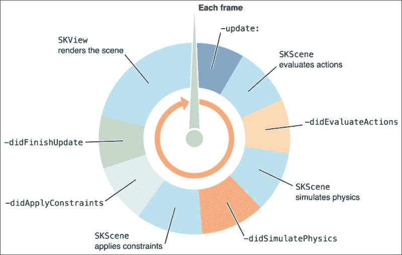

上述内容是直接从苹果开发者网站上给出的示例。我们看到在单个帧中调用了许多函数。首先迭代的是`update()`函数。`update()`函数是我们添加大部分游戏特定更新和游戏对象（如位置和角色状态）的各种检查的地方。

循环结构让我们有机会在知道帧中某些任务已经发生后进行更新，这就是`didEvaluateActions()`、`didSimulatePhysics()`、`didApplyConstraints()`和`didFinishUpdate()`函数派上用场的地方。

### 注意

来自 Unity 的任何人可能对其通用的游戏循环函数很熟悉，例如`Awake()`、`Start()`、`FixedUpdate()`、`update()`和`LateUpdate()`。SpriteKit 游戏循环允许一些类似的代码/渲染流程，但正如我们将看到的，有一些细微的差别。

关于游戏循环及其函数的更多信息，请参阅苹果文档中的以下链接：[`developer.apple.com/library/ios/documentation/GraphicsAnimation/Conceptual/SpriteKit_PG/Actions/Actions.html`](https://developer.apple.com/library/ios/documentation/GraphicsAnimation/Conceptual/SpriteKit_PG/Actions/Actions.html)。

利用其他游戏循环方法可以确保你的游戏中某些调用不会出错，甚至可以帮助以快速、高效的方式完成每个帧的重要任务。

例如，在之前提到的公共游戏 PikiPop 中，以下是游戏如何在主`GameScene.swift`代码中使用游戏循环的方式：

```swift
//Update() Example
//From main GameScene.swift
override func update(currentTime: CFTimeInterval) {
        //Update player
        if(player?.isPlayable==true){
            player!.update(currentTime)
        }
    }
```

上述代码首先检查玩家是否可玩，使用的是`isPlayable`布尔值。这种状态可以意味着许多事情，比如玩家是否存活，是否在生成，等等。游戏循环的`update()`函数，它覆盖了`SKScene`对象的父`update()`函数，接受一个时间实用类型`CFTimeInterval`的参数。`CFTimeInterval`是一种特殊的 Core Foundation 双精度类型，以秒为单位测量时间，因此在每个间隔期间更新玩家对象（如果非空）。

作为 PikiPop 的简要总结，它是一个类似于 Flappy Bird 的程序化 2D 横版滚动游戏。与 Flappy Bird 不同，Piki 可以根据玩家的点击和滑动在所有方向上穿越游戏。Piki 可能会被困在舞台对象和舞台边缘之间。

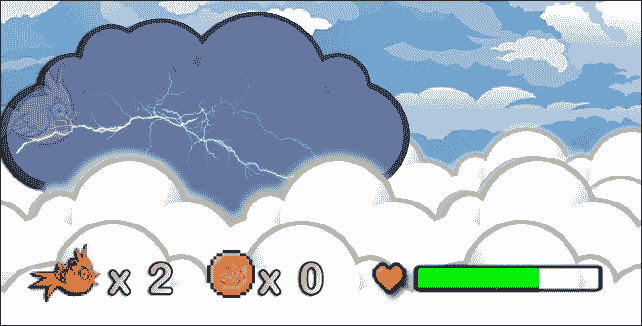

上述图像显示了 Piki 如果被推到屏幕的左侧，会受到伤害。

该游戏阶段中的边缘使用的是 SpriteKit 自己的特殊对象，名为**SKConstraints**。关于这些内容的更多介绍将在后面提供，但简而言之，它们决定了 SpriteKit 精灵可以采取的范围和方向。SpriteKit 中的精灵（包括开发者定义的对象，如 PikiPop 的玩家对象和默认的`SKSpriteNode`）都是来自`SKNode`对象，这些对象与`SKConstraints`和其他基于物理框架的功能一起工作。

我们可以在游戏循环的 `update()` 部分检查 Piki 是否被推到角落，但由于约束是框架物理架构的一部分，最好在 `SKScene` 渲染循环的 `didSimulatePhysics()` 部分进行此检查，如下所示：

```swift
override func didSimulatePhysics() {

    //run check on Player
    let block: (SKNode!, UnsafeMutablePointer<ObjCBool>) ->
	Void  = { node, stop in
        /*checks if the node is the player and is moved/crushed to the left by a physics object.  This is done by comparing the node's position to a position that is, in this case, less than 26% off the left side of the screen; calculated by multiplying the screen's width by 0.26  */
        if let playerNode = node as? Player{
            if (playerNode.position.x < self.frame.size.width*0.26 && playerNode.isPlayable) {
                playerNode.playerHitEdge()
            }

        }

    }

...more code
```

这段代码的第一部分，`let block: (SKNode!, UnsafeMutablePointer<ObjCBool>) -> Void = { node, stop in`，使用的是所谓的**块**或**闭包**语法，Swift 允许我们以相当动态的方式使用它。目前不必关心这类代码的细节；只需注意，在这一部分的游戏循环中，我们检查玩家的位置在 *x* 方向上与窗口框架边缘的位置。

### 注意

这里是关于在 Swift 中编写块/闭包的更多信息：

[`developer.apple.com/library/prerelease/ios/documentation/Swift/Conceptual/Swift_Programming_Language/Closures.html`](https://developer.apple.com/library/prerelease/ios/documentation/Swift/Conceptual/Swift_Programming_Language/Closures.html)

# Tile game – SwiftSweeper

是时候停止谈论 SpriteKit 了，让我们直接进入正题！正如本章开头所述，我们将首先向您展示如何使用稍微复杂一些的样板/代码驱动式设计在 SpriteKit 中制作一个看起来简单的瓦片游戏。不用担心，这不会涉及到像早期控制台游戏开发者那样直接调用 GPU 和处理极小的内存需求。然而，我们将使用大量的与 SpriteKit 对象、函数和类相关的代码调用。诚然，随着 Apple 继续在 Xcode 中提供更多以设计为中心的功能，直接编写代码的开发者责任正在逐渐减少。

了解代码结构可以让你在采用更自上而下的方法进入的开发者中占据优势，并且编写代码始终会落后于自定义游戏逻辑。

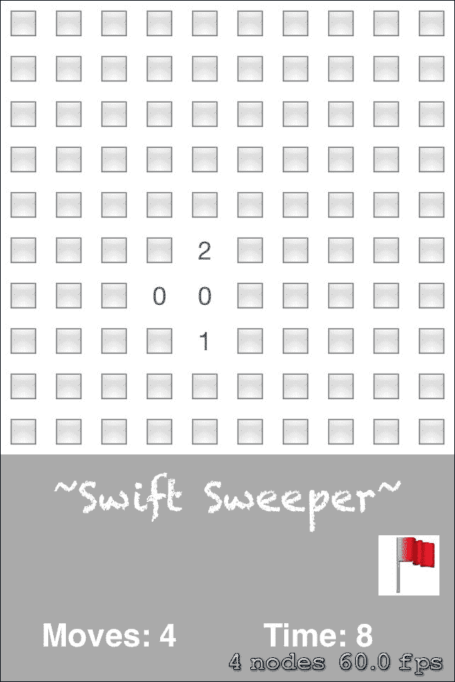

## SwiftSweeper 是什么？

`SwiftSweeper` 是一个完全用 Swift 编写的经典瓦片拼图游戏 MineSweeper 的克隆版。`SwiftSweeper` 利用 Swift 使用 Unicode 表情符号的能力，这样我们就不需要使用许多图像资源，这应该为我们制作自己的具有难度级别的瓦片/拼图游戏提供一个很好的起点。

我们将从零开始构建大部分游戏，但完整的源代码可以在[`github.com/princetrunks/SwiftSweeper`](https://github.com/princetrunks/SwiftSweeper)找到。

### 注意

在本书撰写时，这是在 Xcode 7 测试版（7A120f）中构建的，针对最初的 iOS 9 版本进行了优化，并针对 iPhone 进行了优化。

游戏的目标是在不碰到隐藏在游戏板上的地雷的情况下点击游戏板上的每一个方块。不过，你也会得到一些帮助。不是地雷的每一个方块都会告诉玩家周围有多少个地雷。如果玩家通过排除法确定某个方块肯定有地雷，他们可以在该方块上插上旗帜，以确保不会点击那个空间。点击所有不是地雷的方块以赢得游戏！`SwiftSweeper`甚至还会保存你赢得每个难度级别所需的时间，为游戏增添一些可玩性。

# 创建我们的 SpriteKit 游戏

既然我们已经知道了游戏的目标，以下是我们在 SpriteKit 中构建游戏的方法：

1.  首先，打开 Xcode 并创建一个新项目。

1.  现在选择游戏模板，并点击**下一步**。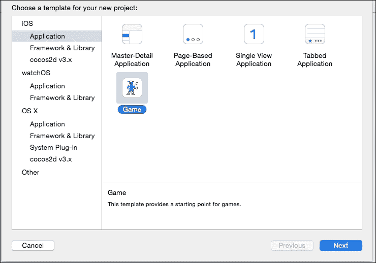

1.  接下来，填写产品名称。我们将把这个项目命名为`SwiftSweeperExample`，并确保语言设置为 Swift，同时将游戏技术选为**SpriteKit**，并将设备设置为 iPhone。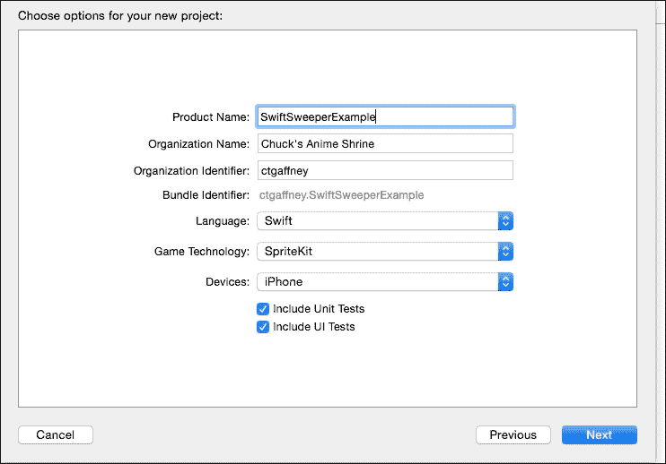

1.  然后，点击**下一步**，我们现在有一个全新的 SpriteKit 游戏项目，其中已经为我们准备好了许多文件，以便我们开始。

1.  现在点击导航面板中的项目主文件，并在**设备方向**字段中取消选择除了**纵向**以外的所有选项。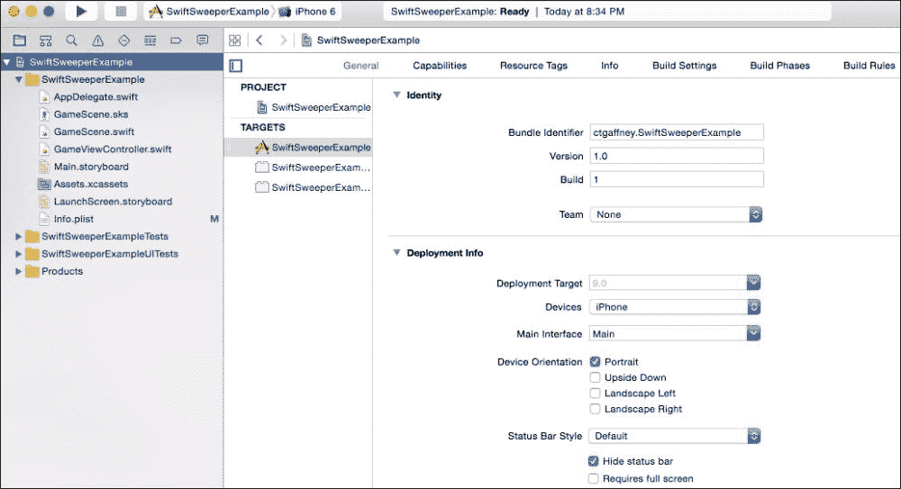

1.  由于我们主要会使用代码，我们可以暂时忽略或删除`GameScene.sks`文件。这些文件是 Xcode 为你提供的用于视觉设计游戏场景的选项。当我们使用更具有视觉设计的 SpriteKit 游戏示例工作时，我们将对这类文件有更深入的了解。

1.  构建并运行应用程序，以查看 Apple 的默认 SpriteKit 项目，其中以 Chalkduster 字体写着`Hello World`，并在您点击或触摸屏幕的地方出现一个旋转的宇宙飞船。

## SpriteKit 结构和对象的概述

在我们添加代码之前，让我们使用这个模板来了解 SpriteKit 的基本对象、函数和流程。

正如我们在上一章中所述，`AppDelegate.swift`是主入口点。代码随后移动到`GameViewController.swift`，它是`UIViewController`类的一个子类，并导入了 SpriteKit 框架。以下代码是在`GameViewController`的`viewDidLoad()`函数中编写的：

```swift
override func viewDidLoad() {
        super.viewDidLoad()
        if let scene = GameScene(fileNamed:"GameScene") {
            // Configure the view.
            let skView = self.view as! SKView
            skView.showsFPS = true
            skView.showsNodeCount = true
            /* Sprite Kit applies additional optimizations to improve rendering performance */
            skView.ignoresSiblingOrder = true
            /* Set the scale mode to scale to fit the window */
            scene.scaleMode = .AspectFill
            skView.presentScene(scene)
        }
    }
```

### 小贴士

**下载示例代码**

您可以从您在[`www.packtpub.com`](http://www.packtpub.com)的账户下载示例代码文件，以获取您购买的所有 Packt Publishing 书籍的示例代码。如果您在其他地方购买了这本书，您可以访问[`www.packtpub.com/support`](http://www.packtpub.com/support)并注册，以便将文件直接通过电子邮件发送给您。

使用关键字`override`，这个版本的`viewDidLoad()`现在可以添加到或完全覆盖父类的功能。`super.viewDidLoad()`调用父类的原始功能，然后执行它自己的自定义功能。这就是 Swift 处理面向对象继承概念的方式。

接下来，我们看到如何使用`GameViewController`首先创建游戏场景。SpriteKit 的一个主要方面是它在`SKScene`类的场景上工作，这些场景本身是`SKNode`类的子类。`SKNode`类是 SpriteKit 中几乎所有对象的主体构建块。无论是精灵、灯光、视频、效果、物理场、音频文件（`SKAudioNodes`）、相机（`SKCameraNodes`）还是标签/UI 对象，它们都是`SKNode`类。这些对象都持有重要信息，最重要的是对象节点家族的坐标信息。对于游戏，这允许开发者创建自定义类，例如`Enemies`、`GameLights`、`Tiles`等，这些类在父节点和子节点上都有屏幕和其他信息。例如，我们可以通过在父`Enemy`类中调用继承的功能来攻击屏幕上的每个敌人。我们不需要检查每个单独的敌人类型，而是通过在`SKScene`的各种游戏循环函数中遍历父节点来枚举：

```swift
enumerateChildNodesWithName("player", usingBlock: block)
```

你还记得 PikiPop 中的块/闭包调用吗？为了在`SKScene`的`didSimulatePhysics()`函数中实际使用它，我们调用`SKNode`的`enumerateChildNodesWithName`函数来仅针对场景中的那些节点，并让该代码块为场景中具有该名称的每个成员运行。

```swift
playerNode.name = "player"
```

名称只是一个可以用`SKNode.name`属性设置的**字符串**。让每个自定义节点以一个给定的名称（或在游戏过程中更改），你就有了一组可以在场景中单独识别的对象。

你可以在 Apple 的官方文档中找到更多关于`SKNode`的信息，链接为[`developer.apple.com/library/ios/documentation/SpriteKit/Reference/SKNode_Ref/`](https://developer.apple.com/library/ios/documentation/SpriteKit/Reference/SKNode_Ref/)。

## 场景过渡和代码、故事板以及/或 SKS 文件的选择

我们项目中的`GameScene.swift`类继承自`SKScene`，游戏循环/渲染函数就是在这里发生的。SpriteKit 在场景上运行，并且可以从场景中过渡和跳转。

在上一章中，我们展示了如何使用故事板和切换来构建游戏。`SKScene` 使得你甚至不需要使用故事板，只需直接使用代码进行切换。我们可以使用故事板，也可以使用 `.sks` 文件或三种方法的组合来视觉设计每个单独的场景。使用代码，`SKScene` 可以通过 `SKTransition` 对象和函数进行切换。实际上，正如我们将通过 `SwiftSweeper` 看到的，我们只需使用代码手动刷新场景中的资源来执行 *切换*。这种方法相当过时，并且不如 `SKTransition` 故事板和 SKS 文件优雅，所以让我们快速了解一下如何使用 `SKTransition`、故事板以及通过代码简要地进入 SKS 文件进行场景切换。稍后，在下一章中，我们将更多地关注视觉 SKS 文件，因为每次 iOS 和 Xcode 的更新都会继续关注这些视觉工具，以缩短编码时间和工作流程。

## 一个 SKTransition 示例

以下代码更改了游戏的场景：

```swift
  override func touchesBegan(touches: Set<UITouch>, withEvent event: UIEvent?) {
    super.touchesBegan(touches, withEvent: event)
    if let location = touches.first?.locationInNode(self) {
        let touchedNode = self.nodeAtPoint(location)
        if touchedNode.name == "SceneChangeButton" {
            let transition = SKTransition.revealWithDirection(SKTransitionDirection.Up, duration: 1.0)

            let scene = AnotherGameScene(size: self.scene!.size)
            scene.scaleMode = SKSceneScaleMode.AspectFill
            self.scene!.view!.presentScene(scene, transition: transition)
        }
    }
}
```

`SKTransition` 类实际上只是切换类型。正如前面的代码所示，切换是一个使用 `SKTransitionDirection.Up` 枚举类型的方向性切换到下一个场景。正如我们在 `GameViewController` 中看到的，新场景是通过控制场景视图大小和宽高比的类似函数创建的，然后使用 `self.scene!.view!.presentScene(scene, transition: transition)` 将场景展示给未包装的视图。

还要注意，这个过程发生在与我们在当前项目中的 `GameScene.swift` 类中看到相同的函数中，即 `override func touchesBegan(touches: Set<UITouch>, withEvent event: UIEvent?){}`。这是处理玩家触摸手势并检查触摸的节点名称是否与 `SceneChangeButton` 字符串匹配的函数。

更多关于 `SKTransition` 以及你可以为你的游戏提供的其他精美切换效果，可以在官方文档中找到：

[`developer.apple.com/library/prerelease/ios/documentation/SpriteKit/Reference/SKTransition_Ref/`](https://developer.apple.com/library/prerelease/ios/documentation/SpriteKit/Reference/SKTransition_Ref/)

### 注意

截至 Swift 2.0 / iOS 9，此触摸代理函数通过 `touches: Set<UITouch>` 接收一个参数，它是一组 `UITouches`，以及一个可选的 `UIEvent`。这与之前的 Swift 迭代不同，并且可能会在未来更新中发生变化。

## 一个 SKScene/Storyboard 示例

这里是一个 `SKScene`/Storyboard 示例的代码：

```swift
@IBAction func buttonPressed(button:UIButton)
{
    // Remove button from the view
    button.removeFromSuperview()
    if let scene = GameScene.unarchiveFromFile("GameScene") as? GameScene {
        // Configure the view.
        let skView = self.view as SKView
        skView.showsFPS = false
        skView.showsNodeCount = false

        //used for optimization of SKView
        skView.ignoresSiblingOrder = true

        scene.scaleMode = .AspectFill
        skView.presentScene(scene)
    }
}
```

正如我们在上一章中看到的，使用故事板文件的视觉帮助可以为我们提供通往我们应用程序的视觉路线图，无论是游戏还是非游戏。前面的代码使用一个链接到故事板文件中的 `@IBAction` 链接来设置一个新的场景。

游戏中的故事板在当我们只知道游戏的一般结构时可以用于原型设计阶段，并且对于游戏的菜单导航甚至对于所有单个游戏场景都是完美的***。

在过渡之前，通过调用`button.removeFromSuperview()`来移除按钮本身，以防止新场景绘制在可能未被看到的菜单按钮上——对玩家来说是看不见的，但对游戏的内存堆栈来说不是。 

### 小贴士

**通常，最好只使用 Storyboard 来设计整体导航菜单，而不是每个单独的水平/场景。`SKScene`和`SKNode`的功能可以让我们重用相似的场景结构，并为类似结构的水平节省大量的编码工作。拥有许多级别的游戏可能会将我们的 Storyboard 变成一个令人困惑的结构网，从而取消其最初的目的。实际游戏场景可以仅在其自己的单个视图控制器中存在于 Storyboard 中，而暂停、分享和其他菜单将由 Storyboard 的 segues 控制。

## 使用 SKS 文件的 SKScene 过渡

`.sks`文件是一种特殊的 SpriteKit 场景文件，它允许以视觉、拖放的方式创建场景以及放置玩家、粒子、敌人和关卡资源。在 Swift 中将过渡到视觉设计的`.sks`文件与我们的初始`SKTransition`示例相同。

```swift
override func touchesBegan(touches: Set<NSObject>, withEvent event: UIEvent) {
    /* Called when a touch begins */
    let introNode = childNodeWithName("introNode")

    if (introNode != nil) {
        let fadeAway = SKAction.fadeOutWithDuration(1.0)

        introNode?.runAction(fadeAway, completion: {
            let doors = SKTransition.doorwayWithDuration(1.0)
            let gameScene = GameScene(fileNamed: "GameScene")
            self.view?.presentScene(gameScene, transition: doors)
        })
    }
}
```

使用`SKScene`初始化器`fileNamed`创建`gameScene`常量，然后将该场景展示给视图，无论是`.swift`文件还是`.sks`文件，其工作原理都是相同的。这使我们能够既通过代码又/或通过视觉设计我们的游戏场景。在`SwiftSweeper`的情况下，我们将采用更侧重于代码的方法，但如果您愿意，也可以使用更多的代码、Storyboard 和/或视觉设计的`SpriteKitScene`（`.sks`）文件来构建这个游戏。

## 资产、精灵和图标

截至 Xcode 7，游戏资源放置在`Assets.xcassets`文件夹中。Xcode 的早期版本可能有一个`Images.xcassets`文件夹用于游戏的图标和精灵，但这一情况已经改变，并且可能会随着每个新的 iOS 版本而继续变化。

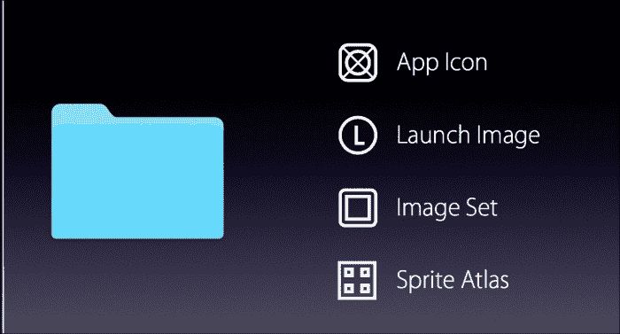

来自 Apple WWDC15 会议的一张图片

从 iOS 9 和 Xcode 7 开始，`assets`文件夹获得了更多的灵活性，能够处理各种应用图标大小、启动图像、图像集和精灵图集。这也允许我们使用 iOS 9 中引入的各种内存节省功能进行开发，如**应用切片**/**应用瘦身**和按需资源。应用切片/瘦身功能确保只有与设备相关的资产被下载，这可以在玩家的 iPhone 或 iPad 上节省空间。按需资源允许我们标记在游戏中的特定部分才存在于设备内存中的资产。这样，我们就可以为玩家创建更大的游戏体验，而不会耗尽苹果设备家族中有时有限的存储空间。

你可以在[`developer.apple.com/library/prerelease/ios/documentation/IDEs/Conceptual/AppDistributionGuide/AppThinning/AppThinning.html`](https://developer.apple.com/library/prerelease/ios/documentation/IDEs/Conceptual/AppDistributionGuide/AppThinning/AppThinning.html)上找到更多关于应用切片/精简的信息。

当为按需服务设置你的游戏时，这是在游戏初期规划中值得了解的，可以在官方文档[`developer.apple.com/library/prerelease/ios/documentation/FileManagement/Conceptual/On_Demand_Resources_Guide/`](https://developer.apple.com/library/prerelease/ios/documentation/FileManagement/Conceptual/On_Demand_Resources_Guide/)中找到。

### 精灵图集和动画精灵

SwiftSweeper 实际上并不使用动画精灵；正如我们将要看到的，它只是使用 Unicode 表情符号字符来动画化屏幕。然而，我们无法在不提及精灵、动画化和使用纹理图集/精灵图来优化它们的情况下讨论 SpriteKit 和 2D 游戏开发，对吧？精灵图集是一组打包成单个图像的图像集合，也称为**精灵图**或**纹理图集**。在开发 2D 游戏时，强烈建议使用纹理图集而不是各种图像集，因为对于渲染器来说，纹理图集将等于更少的绘制调用，从而确保你的游戏以所需的 60 fps 运行。《Collectables.atlas》文件夹位于`Assets.xcassets`中，可以存储你游戏中所有的可收集物品，并且使用`SKTextureAtlas`类，可以有效地将这些可收集物品绘制到屏幕上。当我们存储玩家静止、行走和跳跃动画的图像时，我们使用纹理图集来存储它们。

创建纹理图集非常简单，如下所示：

1.  简单地点击你的`Assests.xcassets`文件夹，然后在文件夹层次结构的空白部分右键点击。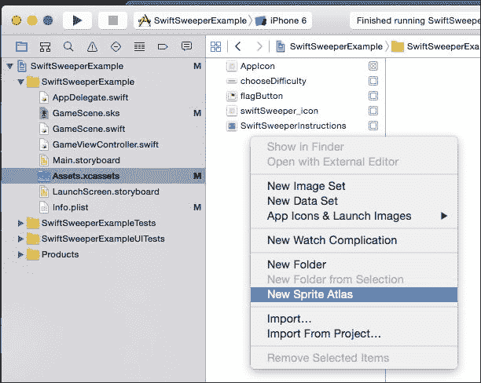

1.  点击**新建精灵图集**，就像这样，我们就有了可以存储我们游戏各种精灵的文件夹。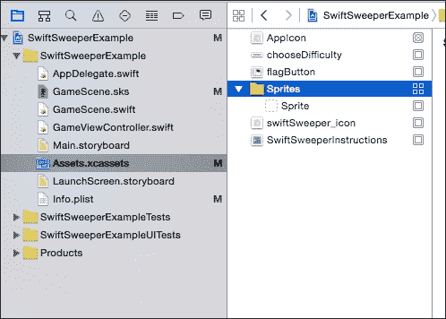

1.  确保根据你希望如何分类精灵组来命名文件夹。在代码中引用它们时你需要这个名称。

要在代码中创建对这张图集的引用并动画化精灵，我们使用`SKTextureAtlas`如下所示：

```swift
let PlayerAtlas = SKTextureAtlas(named:"Player.atlas")

let textures = map(1...4) { number in       
            PlayerAtlas.textureNamed("player_sprite_normal_\(number)")
            } 
            let anim = SKAction.animateWithTextures(textures, timePerFrame: self.animationRefreshRate_)
            let idleAnimation = SKAction.repeatActionForever(anim)
            self.runAction(idleAnimation)
```

首先，这段代码使用初始化器`SKTextureAtlas(named:"Player.atlas")`创建了一个指向玩家精灵图集的`SKTextureAtlas`引用。然后，我们使用 Swift 的一个顺序块`map(NSRange){…}`创建了一个纹理数组。这是一个闭包块，它根据 map 调用中指定的范围遍历精灵图集中的纹理。`number`对象是一个简单的索引对象，我们可以用它来表示映射的索引。

这是因为我们的玩家有这些用于正常/静止动画的精灵名称：

```swift
"player_sprite_normal_1", "player_sprite_normal_2", "player_sprite_normal_3", "player_sprite_normal_4"
```

由于我们知道精灵动画是以索引命名结构命名的，因此在这里使用 Swift 的函数式编程工具，如 `map()`，可以简化代码。具有许多帧帧动画的 2D 精灵（如 Metal Slug）可以以这种方式迭代。

`SKTextureAtlas` 还有一个名为 `preloadTextureAtlases` 的类函数，我们可以使用它来预加载一系列纹理图集：

```swift
SKTextureAtlas.preloadTextureAtlases([PIKIATLAS,BGATLAS,COLLECTABLESATLAS,HUDATLAS, OBSTACLESATLAS])
{
  //perform other tasks while loading TextureAtlases
}
```

这很好，可以确保在进入舞台之前加载舞台的精灵。

# 创建我们的游戏逻辑

为了简化起见，扫雷不会有很多不同的资产或任何精灵纹理。它相反使用 Swift 的 Unicode 表情符号字符能力和 `UIView` 调用来以相当老式、非常类似扫雷的方式设计游戏的图形。

我们这样做不仅是为了给我们一个相对简单的起点，而且还为了展示 Swift 代码和 SpriteKit 类如何让我们在不需要初始精灵资产的情况下创建整个游戏逻辑和流程。这样，无论是作为团队还是个人开发，游戏可以在进行有时令人疲惫的制作精美视觉资产的过程之前制作出来。首先思考代码和结构可以确保你有一个可以稍后用精灵、音乐和氛围进行润色的可工作原型。

到目前为止，我们只是让 SwiftSweeper 作为 SpriteKit 游戏模板的一个外壳等待。是时候我们开始构建游戏模型了：

1.  首先，让我们添加我们的图像资产。更多信息，请访问 [`mega.co.nz/#!XhEgCRgJ!4QqKMl1l1P4opWU7OH2wEN_noVQ86z5mxEyLuyUrcQo`](https://mega.co.nz/#!XhEgCRgJ!4QqKMl1l1P4opWU7OH2wEN_noVQ86z5mxEyLuyUrcQo)。

    这是一个指向 `SwiftSweeper` 的 `Assets.xcassets` 文件夹的链接。我们可以单独添加这些文件，但最简单的方法是直接在计算机上替换你的项目文件夹中的 `Assets.xcassets` 文件夹。你可以在此过程中打开 Xcode，它会自动从原始模板文件更新。

1.  接下来，让我们添加以下 URL 的声音文件：

    [`mega.co.nz/#!T5dUnJZb!NUT837QQnKeQbTpI8Jd8ISJMx7TnXvucZSY7Frw5gcY`](https://mega.co.nz/#!T5dUnJZb!NUT837QQnKeQbTpI8Jd8ISJMx7TnXvucZSY7Frw5gcY)

1.  通过以下步骤添加声音：

    1.  右键点击包含 Swift 文件的 `SwiftSweeperExample` 文件夹，然后从菜单中选择 **New** | **Group**。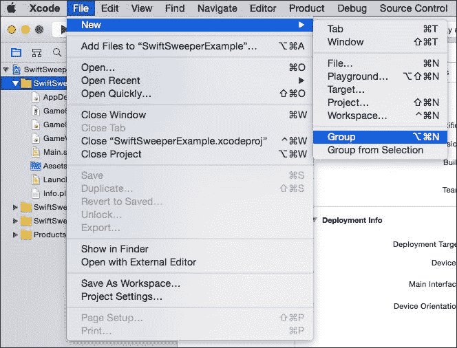

    1.  将此文件夹命名为 `Sounds` 并将其拖到同一 `SwiftSweeperExample` 文件夹中的文件底部。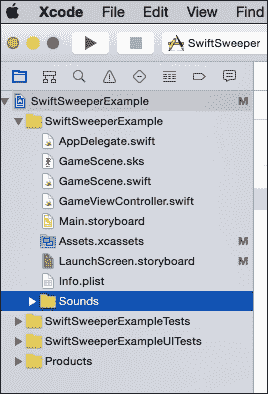

    1.  右键点击 `Sounds` 文件夹，并选择 `Add Files To "SwiftSweeperExample"`。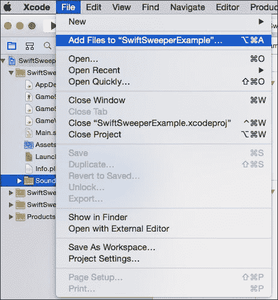

    1.  从 `SwiftSweeperSounds` 文件夹添加声音，现在它们应该已经在你的项目中了。

    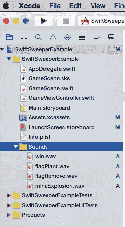

所有资产现在都应该在项目中，因此现在我们可以构建我们的游戏。让我们首先从实际的瓷砖开始。

现在创建一个新的 Swift 文件，将其命名为 `Tile`，并将以下代码粘贴到该文件中：

```swift
class Tile{
    //Properties 
//(1)
    let row : Int
    let column : Int 
//(2)    
    var isTileDown = false
    var isFlagged = false
    var isAMine = false
//(3)
    //Mines counter
    var nearbyMines:Int = 0
//(4)
    init(row:Int, col: Int){
        self.row = row
        self.column = col  
    }
}
```

在创建地砖时，我们遵循以下逐步逻辑：

1.  在构建任何代码逻辑时，我们通常将这个对象的相关属性放在顶部。我们知道在扫雷游戏中的每一块地砖都将是一行和一列的一部分。在游戏过程中，这块地砖所在的行和列的编号不会改变，所以我们将它们设置为常量，使用关键字 `let`，并使用 `Int` 类型来设置，因为我们知道行或列不能有分数，至少在地砖对象方面是这样的。

1.  地砖可以有几个不同的状态。它可能是已经被点击的，它上面可能放置了旗帜，或者它可能是一个地雷。由于这些是布尔属性，我们使用布尔变量 `isTileDown`、`isFlagged` 和 `isAMine` 来设置它们。我们最初将它们设置为 `false`。

1.  在扫雷游戏中，地砖会计算它们周围有多少地雷，因此我们创建一个整数计数器 `nearbyMines` 来保存这些信息。

1.  当创建一个地砖对象的实例时，我们希望游戏在 `GameBoard` 上设置其行和列编号位置，因此我们创建默认初始化器 `init`，它有两个参数输入，分别是行和列。

对于 `Tile` 对象，我们需要的就这些，所以让我们继续使用 `MineTileButton` 类来设置这些 `Tile` 对象的按钮功能。

创建一个新的 Swift 文件，并将其命名为 `MineTileButton`，然后将以下代码粘贴到其中：

```swift
//(1)
import UIKit
class MineTileButton : UIButton {
//(2)
    var tile:Tile
    let tileSize:CGFloat
//(3)
    init(tileButton:Tile, size:CGFloat) {
        self.tile = tileButton
        self.tileSize = size

        let x = CGFloat(self.tile.column) * tileSize
        let y = CGFloat(self.tile.row) * tileSize
        let tileBoundingFrame = CGRectMake(x, y, tileSize, tileSize)  
        super.init(frame: tileBoundingFrame)
    } 
//(4)
    required init(coder aDecoder: NSCoder) {
        fatalError("init(coder:) has not been implemented")
    }
//(5)
    //button text;
    //replace button with an SKSprite for better GUI interface?
    func getTileLabelText() -> String {
        if !self.tile.isAMine {
            if self.tile.nearbyMines == 0 {
                return "0"
            }else {
                return "\(self.tile.nearbyMines)"
            }
        }
//(6)
        return "💥"
    }
}
```

下面是对代码的解释：

1.  由于我们正在创建一个 `UIButton` 对象，因此我们导入 UIKit 框架用于这个对象。

1.  这些是这个按钮对象的属性。我们需要一个名为 `tile` 的 `Tile` 对象来引用，一个名为 `tileSize` 的 `CGFloat` 大小来表示这个按钮将占用的矩形。

1.  这个类的初始化器接受一个名为 `tileButton` 的 `Tile` 对象和一个名为 `size` 的 `CGFloat`。我们将类的自己的地砖分配给 `tileButton`，将 `tileSize` 分配给 `size`，然后使用 `CGRectMake()` 方法创建一个名为 `tileBoundingFrame` 的正方形。这是在我们根据 `tileSize` 为正方形设置 `CGFloat` 的 `x` 和 `y` 值之后完成的。`UIButton` 的父类初始化器 `init(frame:)` 通过 `super.init(frame: tileBoundingFrame)` 使用 `tileBoundingFrame` 作为参数。

1.  由于 Xcode 5 以来，`init` 函数主要是在处理 UI 对象时让编译器满意所需的。

1.  `getTileLabelText()` 函数根据 `tile` 对象的状态返回一个字符串。如果方块不是地雷，我们知道我们必须放置一些东西，因为没有方块；传统上，这只是一个空白空间或一个空的 `""` 字符串，但到目前为止，我们只是在那里放置 `0`，留下逻辑以供自定义。说实话，我们可以简单地返回嵌套的 if-else 语句的返回值 `\(self.tile.nearbyMines)`，它将返回相同的结果。正如我们所见，它返回特定 `Tile` 对象的 `nearbyMines` 属性。

1.  如果方块是地雷，则返回碰撞 Unicode 表情字符。当玩家点击一个未标记的方块时，会调用 `getTileLabelText()` 函数。

1.  Swift 使用 Unicode 字符符号的能力可以在您游戏的规划过程中起到很好的视觉辅助作用。在行 `(6)` 中使用的碰撞 Unicode 表情是 `U+1F4A5 (128165)`。如果您只看到一个方框而不是红色的爆炸状字符，可以在本章前面提到的完整项目下载中查看，或者通过以下链接查看。

### 注意

在 [`www.charbase.com/1f4a5-unicode-collision-symbol`](http://www.charbase.com/1f4a5-unicode-collision-symbol) 查找有关此表情符号的更多信息。

## GameBoard

现在我们已经有了代表每个名为 `MineTileButton` 的方块对象的 tile 对象和按钮逻辑，我们需要创建一个代表这些对象集合的对象，即 `GameBoard`。

完整的 `GameBoard.swift` 代码在这里全部展示出来会有些过大，所以我们将总结其主要功能和部分。

我们可以在本章前面提到的完整项目链接中查看整个代码，或者直接在下面复制到您当前的游戏项目文件中：

[`mega.co.nz/#!X8FB2aAK`](https://mega.co.nz/#!X8FB2aAK)

对于我们的 `GameBoard`，我们希望创建一个 10x10 大小的瓦片板，并且具有三个难度级别：简单、中等和困难。为了创建难度，我们只需使用一个名为 `difficulty` 的枚举来存储游戏的难度级别。

`GameBoard` 的最重要的属性包括 `boardSize_`（在本例中设置为 `10`），一个将代表放置的地雷数量的变量 `mineRandomizer`，板上的活动地雷数量 `mineCount`，以及将填充板上的 `tiles` 对象。

注意 `tiles` 属性所使用的语法：

```swift
var tiles:[[Tile]] = []
```

以这种方式，我们可以在 Swift 中创建一个有序的二维数组（或矩阵）。`GameBoard` 对象基本上将存储一个 `Tile` 类型对象的数组数组。

### 注意

*Swift 有更多方式来表示矩阵，例如，我们可以使用 Structs 来定义我们自己的独特矩阵。截至本出版物的时间，Swift 没有自己真正的固定长度数组功能，正如我们在各种 C 语言中看到的那样。然而，使用嵌套的大括号 `[[]]` 对于我们试图完成的事情来说是完全可以的。

`GameBoard`的初始化器`init(selectedDifficulty:difficulty){}`接受玩家选择的难度作为其单一参数，然后根据`boardSize`属性构建板，然后使用以下嵌套 for-in 循环用`Tile`对象填充整个板：

```swift
        for row in 0 ..< boardSize_ {
            var tilesRow:[Tile] = []
            for col in 0 ..< boardSize_ {
                let tile = Tile(row: row, col: col)
                tilesRow.append(tile)
            }
            tiles.append(tilesRow)
        }
```

由于`tiles`对象是一个二维数组，我们首先需要执行这个嵌套循环，首先为每一行创建一个`Tile`对象的 1D 数组（命名为`tilesRow`），然后使用`.append`函数在该行的每一列中添加一个瓷砖。然后，将`tilesRow`数组附加到主瓷砖二维数组中。

### 小贴士

如果你希望创建一个矩形或其他形状的`GameBoard`实例，你必须考虑到不同的列和行数量。这将使嵌套循环更加复杂，需要单独的`columnSize`和`rowSize`属性。许多益智游戏可能会让玩家看起来很复杂，但它们的内部结构可能仍然很简单，要么是正方形，要么是矩形，通过填充那个瓷砖为不可玩区域或背景/透明瓷砖来实现。

这是一种开发者可以节省时间的同时允许复杂功能和设计的做法。这就是我们为什么用代表瓷砖、瓷砖按钮功能和游戏板布局的单独类来构建这个游戏。

通过继承，我们可以继续自定义每个瓷砖的功能，从而基于简单的基础实现众多功能。

这也是为什么电子游戏一直是利用面向对象设计的典范。

如果一开始难以完全理解这一点，不要担心，因为嵌套循环往往很费脑筋。只需观察内部 for 循环不会退出，直到根据`boardSize`_ 属性填充完列。由于行和列都是 10，这种循环变得更容易。

然后初始化器调用`resetBoard()`函数，将`mineCount`重置为`0`，并执行两个额外的嵌套 for 循环：

```swift
for row in 0 ..< boardSize_ {
            for column in 0 ..< boardSize_ {
                self.createRandomMineTiles(tiles[row][column])
                tiles[row][column].isTileDown = false  
            }
        }
```

这个遍历板的 for 循环使用`createRandomMineTiles()`函数随机设置哪些瓷砖是地雷，以及使用`tiles[row][column].isTileDown = false`调用将瓷砖重置为未触摸状态。`createRandomMineTiles()`函数基于当前难度级别工作，特别是`mineRandomizer`属性，该属性在`implementDifficulty()`函数中确定。`mineRandomizer`值越高，迭代瓷砖成为地雷的机会就越小。

`resetBoard()`中的下一个嵌套 for 循环如下：

```swift
for row in 0 ..< boardSize_ {
            for column in 0 ..< boardSize_ {
                self.calculateNearbyMines(tiles[row][column])
            }
        }
```

这会遍历板上的每个瓷砖，并设置玩家在点击时将看到的数字。这个数字当然是围绕非地雷瓷砖的周围地雷的数量，即`Tile`类的`nearbyMines`属性。

这个相当复杂的计算链从`calculateNearbyMines()`函数开始，然后通过数组/瓷砖索引计算函数`getNearbyTiles()`和`getAdjacentTileLocation()`进行计算。我们在这些函数中提供了各种详细的注释，以便更好地理解它们的工作原理。建议你阅读如何实现的详细细节，但为了避免使已经复杂的游戏逻辑解释更加混乱，请在`getNearbyTiles()`中的以下行做笔记：

```swift
let nearbyTileOffsets =     
   [(-1,-1), //bottom left corner from selected tile
            (0,-1),  //directly below
            (1,-1),  //bottom right corner
            (-1,0),  //directly left
            (1,0),   //directly right
            (-1,1),  //top left corner
            (0,1),   //directly above
            (1,1)]  //top right corner
```

如果要理解这三个复杂函数中的任何一行，那就是这一行。`nearbyTileOffset`对象是一个显式编写的元组数组，包含围绕单个 2D 瓷砖可能存在的每个偏移量。实际上，最好将这个数组中的每个成员视为一个(*x*,*y*) 2D 向量。

因此，正如前述代码中注释的那样，偏移量（`-1`,`-1`）位于瓷砖的左下角，因为`x = -1`（左 1）和`y = -1`（下 1）。同样，(`1`,`0`)位于右侧，(`1`,`1`)是右上角。

我们还必须考虑到一些瓷砖位于边缘和/或列上，因此一些瓷砖偏移量不会返回另一个瓷砖的引用；相反，它们将返回 nil。

```swift
for (rowOffset,columnOffset) in nearbyTileOffsets {

 //optional since tiles in the corners/edges could have less than 8 surrounding tiles and thus could have a nil value
            let ajacentTile:Tile? = getAjacentTileLocation(selectedTile.row+rowOffset, col: selectedTile.column+columnOffset)
            //if validAjacentTile isn't nil, add the Tile object to the nearby Tile array
            if let validAjacentTile = ajacentTile {
                nearbyTiles.append(validAjacentTile)
            }
        }
```

在`getNearbyTiles()`中的这个 for 循环不仅检查每个瓷砖的偏移量，而且还通过调用`getAjacentTileLocation()`来考虑边缘或角落瓷砖。

再次强调，这三个函数相当复杂，即使是在对它们的函数功能进行逐行/半通用解释的情况下也是如此。所以，如果你一开始不理解流程/顺序，请不要担心。

最后，对于`resetBoard()`，如果我们不知道玩家是否得到了每个非地雷瓷砖，我们就无法赢得游戏，所以我们通过以下行获取该信息：

```swift
numOfTappedTilesToWin_ = totalTiles_ - mineCount
```

当玩家的完成移动次数（在`GameScene`类中计数）等于`numOfTappedTilesToWin`时，玩家获胜！

所有这些操作都是在玩家进行第一次移动之前完成的！这样做是为了确保值已经预先确定。是的，我们可以在玩家触摸时进行一些计算，但处理样板游戏逻辑通常足够快，可以在加载时准备游戏，这样我们就可以在游戏循环期间使用游戏玩法来关注效果、序列和其他视觉提示。

这个功能由`GameScene.swift`文件控制，我们将在下一部分对其进行总结。

## 将所有这些在`GameScene.swift`中整合在一起

现在我们已经设置了 SwiftSweeper 逻辑的核心，现在是时候将其展示在游戏模板提供的`SKScene`中，即`GameScene`。这个场景使用了我们在本章开头提到的游戏/渲染循环函数。

SwiftSweeper 的 `GameScene.swift` 版本相当大，大约有 800 行代码，所以像 `GameBoard` 一样，我们不会逐行分析它，而是会总结场景的一些重要方面。正如之前所述，每次 Xcode 和 iOS 的更新都会带来更多设置这些场景的视觉方式，因此了解这个示例中的每一行代码不是必要的，但如果你真的想深入了解如何使用代码来展示 SpriteKit 游戏场景，仍然建议这样做。

完整的代码可以在本章前面提到的完整项目链接中找到，或者（如果你一直在本章从头开始构建）在下面提到的链接中：

[`mega.co.nz/#!PgljBL7b`](https://mega.co.nz/#!PgljBL7b)

我们使用了各种 `//MARK:` 注释来分隔代码的各个部分，这样你可以更容易地导航。将代码复制到你的项目中后，你可以构建并运行应用程序。只要一切都被正确地放置到项目中，你应该在你的手机或手机模拟器上运行一个可工作的 SwiftSweeper 版本。玩一会儿，以了解游戏场景中正在进行的操作，以展示游戏。有时候，看到游戏的实际运行情况能让我们更好地看到其背后的代码。如果出现任何错误，说明出了问题，如果所有其他方法都失败了，你可以从 [`github.com/princetrunks/SwiftSweeper`](https://github.com/princetrunks/SwiftSweeper) 下载完整的项目。

游戏场景（GameScene）的第一个视觉入口点 `didMoveToView()` 实际上相当小，如下所示：

```swift
override func didMoveToView(view: SKView){
        self.backgroundColor = UIColor.whiteColor()
        stageView_ = view
        loadInstructions()
    }
```

我们只是将背景颜色设置为白色并加载说明。再次强调，我们并没有说这是一个看起来很美的游戏。

`loadInstructions()` 函数手动将说明精灵放置在屏幕上，并将 `currentGameState_` 枚举设置为 `.Instructions`。**游戏状态**或**状态机**是常见的游戏开发方法，它指导角色、玩家和游戏本身处于什么状态。这可以用来确保某些游戏玩法不会发生在它们不应该发生的地方。iOS 9 / Xcode 7 引入了框架；我们将在后面的章节中深入探讨，例如 GamePlayKit，它除了其他游戏逻辑函数外，还与可以模块化和独立于特定场景的状态机一起工作。`SKComponents` 类的组件以及 iOS 9 中引入的 `SKAction` 的更现代用法以相同的方式工作，独立于 OOP 继承。想想更动态/可用的协议版本。

游戏场景的下一个整体步骤是 `chooseDifficultyMenu()`，它伴随着 `removeInstructions()` 函数，在玩家点击屏幕后调用。这个点击在之前提到的几个示例中的函数 `touchesBegan()` 中进行检查，使用游戏状态作为逻辑检查：

```swift
override func touchesBegan(touches: Set<UITouch>, withEvent event: UIEvent?) {
       /* Called when a touch begins */
        for touch in touches {
            //flag button Pressed
            if CGRectContainsPoint(flagButton_.frame, touch.locationInNode(self)) {
                flagButtonPressed()
            }
            //instructions removed when tapped
            if CGRectContainsPoint(instructionsSprite_.frame, touch.locationInNode(self)) && currentGameState_ == .Instructions {
                removeInstructions()
            }
        }
    }
```

注意`touchesBegan`函数实际上相当简单。它只检查我们是否点击了旗帜按钮或是否点击了说明。那么方块呢？记住，我们把这些方块都变成了`UIButton`的成员，使用`MineTileButton`类。这是控制这个功能的函数：

```swift
func tileButtonTapped(sender: MineTileButton) {
        //exit function if not playing the game
        if (currentGameState_ != .MineTap && currentGameState_ != .FlagPlanting){
            return
        }
        //reveals the underlying tile, only if the game is in the main state, aka MineTap
        if (!sender.tile.isTileDown && currentGameState_ == .MineTap) {
            sender.tile.isTileDown = true
            sender.setTitle("\(sender.getTileLabelText())", forState: .Normal)
            //sender.backgroundColor = UIColor.lightGrayColor() 
            //mine HIT!
            if sender.tile.isAMine {
                //sender.backgroundColor = UIColor.orangeColor()
                self.mineHit()
            }
            //counts the moves; also used in calculating a win
            moves_++
        }
        else if (!sender.tile.isTileDown && currentGameState_ == .FlagPlanting){  
            self.flagPlant(sender)
        } 
    }
```

`UIButton`类的成员会向场景发送被点击的引用。在这个游戏中，这是一个`MineTileButton`类型的对象。使用游戏状态来检查它是否对场景合理，我们要么使用`mineHit()`函数结束回合，要么增加执行的移动次数（用于通过将其与回合开始时计算的`numOfTappedTilesToWin_`进行比较来计算胜利）。如果游戏状态是`.FlagPlanting`，那么我们则处理在方块上放置旗帜的逻辑。带有旗帜的方块不会对`.MineTap`游戏状态点击做出反应，因此，如果你在错误的方块上放置了旗帜，你将无法在揭示所有非地雷方块之前获得胜利。

在剩余的代码中，我们将找到一个计时器，根据结果向玩家发出警报，甚至可以使用`NSUserDefaults`类的类函数来保存每个难度级别的计时时间。

再次强调，这并不完全是在视觉上非常优雅，但在代码上很复杂，最重要的是一个完全功能性的游戏。我们建议您查看`GameScene.swift`中的更多代码，但可能对设计造成的一个主要问题是，这仅在 iPhone 上工作。

使用如 autolayout 这样的视觉工具，如前一章中简要提到的，将允许为 iOS 设备系列更容易地进行设计更改。由于 SwiftSweeper 的 GameScene 中的许多视觉资产都是手动放置在视图中的（尤其是说明），我们不得不在代码中考虑每种设备类型。这是可能的，但随着设备系列的扩展，用于屏幕视觉的手动代码在未来 iOS 更新和设备公告中可能会很容易被破坏。这就是为什么在下一章关于 SceneKit 以及之后的章节中，我们将主要偏离以代码为中心的结构，并拥抱动手工具和更新的框架，如 Xcode 7 及以后的 GamePlaykit。

# DemoBots

就在本书最初出版时，*WWDC15*刚刚结束，为我们提供了一个名为**DemoBots**的针对 iOS 9 和 Xcode 7 的精彩新的 SpriteKit 演示项目。

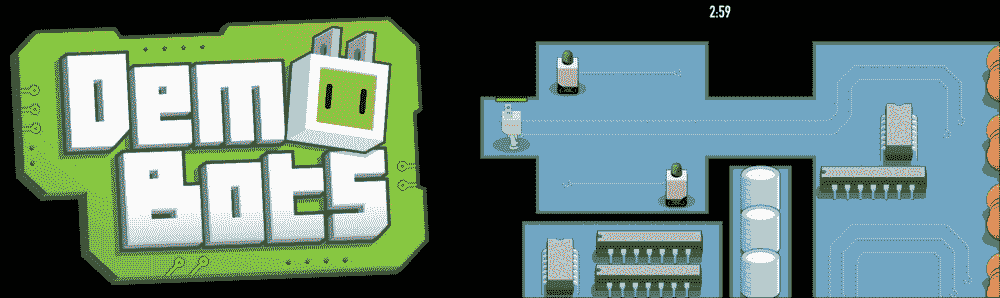

DemoBots 是 Apple 提供的 SpriteKit 项目，它使用组件、状态机、按需服务、GameplayKit、ReplayKit 等！

DemoBots 的完整项目文档可以在[`developer.apple.com/library/prerelease/ios/samplecode/DemoBots/Introduction/Intro.html`](https://developer.apple.com/library/prerelease/ios/samplecode/DemoBots/Introduction/Intro.html)找到。

要从*WWDC15*中看到它的实际效果，请查看*Deeper into GameplayKit with DemoBots*主题演讲的视频和 PDF 文件：

[`developer.apple.com/videos/wwdc/2015/?id=609`](https://developer.apple.com/videos/wwdc/2015/?id=609)

SpriteKit 的演讲可以在以下链接找到：

[`developer.apple.com/videos/wwdc/2015/?id=604`](https://developer.apple.com/videos/wwdc/2015/?id=604)

DemoBots 的游戏玩法甚至有易于编辑的敌人 AI/导航方案，它使用了 iOS 9 中引入的`SKCameraNode`，它跟随玩家，不会像过去版本的 SpriteKit 那样在视图中移动场景。正如我们在本章开头提到的，模仿我们在多平台游戏引擎中看到的工具。

## 摘要

在本章中，我们讨论了多个主题。我们首先讨论了为什么在多年的开发者只能使用第三方游戏框架，如 Cocos2D 和 Sparrow 之后，SpriteKit 成为了 iOS 的受欢迎的补充。我们讨论了 SpriteKit 如何在游戏开发生态系统中适应，因为像 Unity 和 Unreal Engine 这样的强大、多平台游戏引擎继续变得更加突出。接下来，我们探讨了`SKScene`使用的 SpriteKit 游戏循环和渲染周期。然后，我们开始构建我们的演示拼图游戏`SwiftSweeper`，并更深入地了解了 SpriteKit 最突出的对象类的基本结构。除了纹理图集以及如何使用这些资产工具来动画精灵之外，还回顾了 iOS 9 的`assets`文件夹。然后，我们进入了模拟类似扫雷这样的拼图游戏的相对复杂的逻辑和代码。

接下来，我们将转向 iOS 的 3D 游戏开发框架 SceneKit，我们将更多地关注自 iOS 8/iOS 9 以来苹果为我们带来的视觉工具。由于我们已经了解了 SceneKit 和 SpriteKit 共享的基本场景/代码结构，我们现在将采用较少以代码为中心的方法。SpriteKit 场景可以覆盖 SceneKit 场景，因此我们将很快看到我们用苹果自己的 DemoBots 演示暗示的一些内容。
