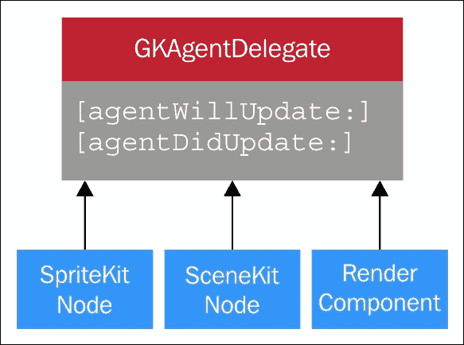

# 第五章. GameplayKit

多年来，视频游戏开发一直依赖于**面向对象设计**（**OOD**）的原则。在 OOD 的核心特性中，继承和多态的概念在这一分支的软件工程中最为有用。将游戏中的实体视为同质的对象群体是有意义的；然后我们为这些对象编写规则，以确定它们如何相互交互。例如，得益于继承，我们游戏中的所有对象都可以赋予`GameObject`类名；它们拥有我们在整个游戏中都会使用的功能，然后我们可以将它们分支到子类，例如`Player`或`Enemy`。然后，随着我们提出更多具体的实体类型，无论是`Player`、不同的敌人、**非玩家角色**（**NPCs**）还是我们为制作的游戏所需要的内容，我们可以继续这种思考过程。对那些对象调用函数，如`Shoot()`或`Health()`，可能对父类的每个子类都是独特的，因此我们在 OOD 中利用了多态。

然而，正如前一章所述，尽管基于继承的结构对于大多数软件应用（包括简单的游戏）来说都很不错，但视频游戏规则和实体的独特需求和配对导致基于继承的结构违反了 OOP 的一个规则。这个规则就是代码的可重用性。解决这个问题的方法是，将游戏对象和游戏规则分开，称为基于组件的结构。以这种心态构建游戏可以让我们构建独特的对象、动作和规则，不仅能够在单个游戏项目中调整它们，还可以在其他项目中使用它们，从而减少通过基于继承的结构构建游戏时可能导致的过度定制化结构。

苹果针对这个问题提出的解决方案是 GameplayKit 框架。GameplayKit 是一个完全独立的框架，可以与 SpriteKit 或 SceneKit 游戏以及使用底层 API（如 OpenGL 和 Metal）编写的游戏一起使用。在*WWDC15*上首次宣布支持 iOS 9 和 Xcode 7，GameplayKit 将多年来在游戏开发中使用的常见方法和概念提取出来，使我们能够独立于屏幕上的绘制内容来处理这些方面。这个框架不处理屏幕上的绘制内容，因此它是专门为 MVC 的模型部分设计的。

GameplayKit 处理了几个游戏开发概念，我们将在本章中回顾这些概念。这些概念包括**实体和组件**、**状态机**、**代理**、**目标**、**行为**、路径查找、MinMaxAI、随机源和规则系统。

# 实体和组件

我们可以将实体想象成游戏中的对象。它们可以是玩家、敌人角色、NPC、关卡装饰和背景，甚至是用来告知玩家生命值、力量和其他统计数据用的 UI。实体被视为组件的容器。组件是决定实体外观和行为的特性。有人可能会问，“这与对象和函数有什么不同？”简短的回答是，在基于继承的设计中，对象和函数描述了我们的游戏对象是什么，而基于组件的结构化则更多地关注它们做什么。随着我们处理 GameplayKit 框架的类和功能，我们将能够更好地理解这一点。在这个框架中，我们将看到实体和组件分别通过 `GKEntity` 和 `GKComponent` 类来处理。

### 注意

如果你对于基于组件的结构化还有一点点困惑，可以回顾我们之前的一章，在那里我们对此进行了更详细的介绍。你还可以访问关于这种设计方法的开发者页面：[`developer.apple.com/library/prerelease/ios/documentation/General/Conceptual/GameplayKit_Guide/EntityComponent.html`](https://developer.apple.com/library/prerelease/ios/documentation/General/Conceptual/GameplayKit_Guide/EntityComponent.html)。

## 在我们的游戏中使用 GKEntity 和 GKComponent 对象

任何熟悉 Java 或 C# 的人都会理解抽象类的概念。`GKComponent` 类本质上是一个抽象类。引用 WWDC 的演讲者的话：将组件想象成“功能的小黑盒”。`GKEntity` 类的实例就像我们之前提到的通用 `GameObject` 类。然而，与之前我们处理的对象不同，我们通常不会给它们添加太多的自定义功能（否则，我们就会倾向于基于继承的结构化）。

我们首先创建一个游戏对象，并将其作为 `GKEntity` 类型的成员进行子类化。在这个例子中，让我们将我们的对象类命名为 `GameEntity`。同时，别忘了导入 GameplayKit API：

```swift
import GameplayKit
class GameEntity : GKEntity
```

```swift
WWDC15 conference, in both Objective-C and Swift, showing how we'd create entities, components, and component systems in our projects:
```

```swift
//Objective-C
/* Make our archer */
GKEntity *archer = [GKEntity entity];
/* Archers can move, shoot, be targeted */
[archer addComponent: [MoveComponent component]];
[archer addComponent: [ShootComponent component]];
[archer addComponent: [TargetComponent component]];
/* Create MoveComponentSystem */
GKComponentSystem *moveSystem =
          [GKComponentSystem systemWithComponentClass:MoveComponent.class];
/* Add archer's MoveComponent to the system */
[moveSystem addComponent: [archer componentForClass:MoveComponent.class]];

//Swift
/* Make our archer */
let archer = GKEntity()
/* Archers can move, shoot, be targeted */
let moveComponent = MoveComponent()
let shootComponent = ShootComponent()
let targetComponent = TargetComponent()

archer.addComponent(moveComponent)
archer.addComponent(shootComponent)
archer.addComponent(targetComponent)

/* Create MoveComponentSystem */
let moveComponentSystem = GKComponentSystem(componentClass: MoveComponent.self)

/* Add archer's MoveComponent to the system */   moveComponentSystem.addComponent(archer.componentForClass(MoveComponent.self)!)
```

这段代码的作用是创建我们的 `GKEntity` 对象；在这个例子中，是塔防游戏示例中的弓箭手角色。接下来，它通过 `addComponent(_:)` 函数添加预定义的 `GKComponent` 对象。我们还创建了一个名为 `moveComponentSystem` 的 `GKComponentSystem` 对象，它将只更新移动类型组件。弓箭手自己的 `moveComponent` 类通过 `moveComponentSystem.addComponent(_:)` 添加到这个系统中。注意，除了初始化之外，通过这个对象传递的参数是组件类型的类类型，这些类型由 `.class` 或 `.self` 属性表示，具体取决于我们用哪种语言编写代码。

### 注意

截至 publication，`componentForClass()` 函数可能对 Swift 编程语言不完全有效。因此，如果 Swift 实现对于这个和其他 GameplayKit 对象初始化没有按预期工作，您将需要使用 Objective-C 版本的此代码，并通过 Objective-C-Swift 桥接文件将其链接到您的项目中。随着苹果继续将 Objective-C 从平台的主要语言转变为次要语言，这很可能在未来 Swift 的更新中得到解决。有关如何创建此桥接文件的更多信息，请参阅此链接：[`developer.apple.com/library/ios/documentation/Swift/Conceptual/BuildingCocoaApps/MixandMatch.html`](https://developer.apple.com/library/ios/documentation/Swift/Conceptual/BuildingCocoaApps/MixandMatch.html)。

苹果为我们提供了一个名为 `Maze` 的项目，该项目使用了这些类以及其他我们很快就会讨论的概念。

这里有一个链接，可以帮助您更好地了解实体和组件：

[`developer.apple.com/sample-code/wwdc/2015/downloads/Maze.zip`](https://developer.apple.com/sample-code/wwdc/2015/downloads/Maze.zip)

在我们讨论与 `GKEntity` 和 `GKComponent` 对象相关的更具体的代码使用之前，我们将探讨一个与这些对象最佳结合的游戏开发概念，即**状态机**的概念。

# 状态机

与其他类型的应用程序相比，视频游戏的大部分逻辑都基于游戏或游戏中的实体当前是否处于多种不同状态之一。

这可能包括检查游戏是否处于 *intro* 场景，是否在主游戏模式中运行，玩家是否已死亡，玩家是否空闲，一个 Boss 敌人是否出现，游戏是否结束，阶段是否结束，Boss 血量是否很低，等等。


状态机示例，适用于人工智能或角色动画

在过去，游戏开发者编写自己的自定义状态机逻辑一直是常见的做法，然后使用更新/渲染周期来检查这些各种状态。通常这会在自定义类或简单地在一个自定义的枚举对象中完成，该对象会通过各种状态进行切换，例如 `.GameOver`、`.MainGame`、`.LowHealth` 等。这些状态也可以描述我们游戏中单个实体的状态，并规定要运行哪个动画周期。例如，玩家可能正在充能攻击，我们希望使用玩家的这种状态来动画化充能动画。游戏场景中的对象可能会通过 switch 语句检查这些状态，以确保它们不会执行与状态上下文不符的任何动作。不久之后，多平台游戏引擎使这部分成为工作流程的一部分，尤其是在动画处理程序中。这些让我们能够通知游戏及其中的实体的各种状态的对象被称为状态机。GameplayKit 允许我们与其组件/实体功能一起工作，这个框架为我们提供了一个抽象类 `GKState`，我们可以从它派生我们的游戏状态，以及一个类 `GKStateMachine`，用于将这些状态对象放入指定的状态机中。`GKStateMachine` 类型的对象一次只能处于一个状态，因此它为我们提供了更好的使用和重用这些状态的方法，而不是旧的样板/switch 语句方法。

之前的图表来自 *WWDC15*，展示了类似 PacMan 的幽灵角色或任何其他游戏角色的动画和 AI 状态机的样子。请注意，并非所有路径都能相互连接。例如，幽灵可以在追逐和逃跑之间来回切换，但在追逐时无法被击败，除非它之前处于被击败状态，否则无法重生。这些被称为状态转换或状态机中的边。

默认情况下，所有边都是有效的，我们在自己的 `GKState` 对象/组件中重写 `isValidNextState(_:)` 函数，以告诉状态机我们是否允许在某些状态之间移动。

在 DemoBots 示例程序中的 `TaskBotAgentControlledState` 类中，就是这样实现的。DemoBots 是在 第三章 中提到的 iOS 9 SpriteKit 示例，*SpriteKit 和 2D 游戏设计*：

```swift
override func isValidNextState(stateClass: AnyClass) -> Bool {
        switch stateClass {
            case is FlyingBotPreAttackState.Type, is GroundBotRotateToAttackState.Type, is TaskBotZappedState.Type:
                return true
            default:
                return false
        }
    }
```

```swift
GKState objects to them:
```

```swift
/* Make some states - Chase, Flee, Defeated, Respawn */
let chase = ChaseState()
let flee  = FleeState()
let defeated = DefeatedState()
let respawn  = RespawnState()
/* Create a state machine */
let stateMachine = GKStateMachine(states: [chase,flee,defeated,respawn])
/* Enter our initial state - Chase */
stateMachine.enterState(chase.classForCoder)
```

在前面的代码中，我们看到从`GKState`（追逐、逃跑、失败和重生）的预制类中创建的状态。在初始化时，`stateMachine`对象接收一个`GKState`对象数组的参数，如下所示：`let stateMachine = GKStateMachine(states: [chase,flee,defeated,respawn])`。然后，在这个例子中，我们从`chase`状态开始那个状态机。当然，这会根据你自己的游戏组件的逻辑而有所不同。`GKStateMachine`对象还可以返回`currentState()`函数；因此，我们可以根据游戏对象的当前脉动来引导我们游戏中的各种实体和组件。

在以下完整文档中了解更多关于`GKState`和`GKStateMachine`的信息：

+   [`developer.apple.com/library/prerelease/ios/documentation/GameplayKit/Reference/GKState_Class/`](https://developer.apple.com/library/prerelease/ios/documentation/GameplayKit/Reference/GKState_Class/)

+   [`developer.apple.com/library/prerelease/ios/documentation/GameplayKit/Reference/GKStateMachine_Class/index.html#//apple_ref/occ/instm/GKStateMachine/canEnterState`](https://developer.apple.com/library/prerelease/ios/documentation/GameplayKit/Reference/GKStateMachine_Class/index.html#//apple_ref/occ/instm/GKStateMachine/canEnterState)

接下来，我们将介绍代理、目标和行为。

## 代理、目标和行为

当我们在游戏中创建实体时，尤其是那些不是玩家的实体，我们希望它们执行各种动作。这些动作是由我们赋予它们的**人工智能**（**AI**）决定的，并基于游戏的各种状态、玩家、环境或玩家自身。我们可以让一组敌人沿着特定的路径移动，追踪玩家，或者使用游戏物理世界自动平滑地绕过障碍物。该框架允许我们使我们的游戏实体成为所谓的**代理**。代理是可以附加目标和行为的实体。

GameplayKit 中的代理，利用`GKAgent`类，可以拥有自动设置各种行为并基于其目标权重`GKComponent`对象。目标权重通常是一个从`0`到`1`的浮点数。与其他目标相比，目标权重值越高，代理执行那些行为的可能性就越大。例如，如果一个敌人角色的健康值很低，我们可能希望他们的`Heal`目标具有更高的目标权重。敌人将通过更频繁地治疗来表现出当前低健康状态的紧迫性，从而给玩家提供一个更具挑战性和智能的对手。换句话说，代理、目标和行为是一个可堆叠和可塑的 AI 系统。

这里是 GameplayKit 中此功能的一个概述：


通过 `GKBehavior` 类，一个行为由一系列 `GKGoal` 对象组成，每个对象都被赋予了一定的权重。例如，我们可以为赛车游戏中的非玩家角色（NPC）创建一个名为 `RacingBehavior` 的 `GKBehavior` 类。这种行为将是两个目标（如 `FollowPath` 和 `AvoidAgents`）的组合，这些目标将使我们的游戏中的角色在当前阶段保持在当前赛道上，同时自动避开其他 NPC。

这里是这些类的视觉表示：


如前图所示，`GKAgent` 对象具有许多基于物理的属性，例如 `mass`（质量）、`radius`（半径）、`maxSpeed`（最大速度）等。与其他 GameplayKit 对象一样，它使用 `updateWithDeltaTime()` 函数与 `GKComponentSystem` 或 `GKEntity` 的渲染/游戏循环更新同步。你开始看到这些对象的模式了吗？从某种意义上说，我们也可以将 `GKAgent` 对象视为类似于 SpriteKit 或 SceneKit 节点，因为它们在我们的游戏物理上工作。然而，无论我们是用 SpriteKit、SceneKit 还是自己的自定义渲染组件（如 OpenGL 或 Metal）制作游戏，我们都需要使用特殊的 `GKAgentDelegate` 类将这些类链接到屏幕上显示的内容。以下是该类及其功能的图解：



`agentWillUpdate()` 函数是我们用来在游戏 `update()` 函数之前告诉智能体要做什么的，而 `agentDidUpdate()` 函数则是用来在 `update()` 函数之后告诉智能体在屏幕上要做什么的。在 `Follow GKGoal` 对象的情况下，这可以是在更新发生之前对玩家位置的引用。以下是从 *WWDC15* 中找到的例子，但与提供的 Objective-C 示例不同，这里使用的是 Swift 编写：

```swift
func agentWillUpdate(agent:GKAgent)
{
   /* Position the agent to match our sprite */
    agent.position = self.position
    agent.rotation = self.zRotation
}
func agentDidUpdate(agent:GKAgent)
{
   /* Position the sprite to match our agent */
    self.position = agent.position
    self.zRotation = agent.zRotation
}
```

```swift
TaskBotBehavior.swift class, which is a child of GKBehavior:
```

```swift
//(1)
let separationGoal = GKGoal(toSeparateFromAgents: agentsToFlockWith, maxDistance: 
GameplayConfiguration.Flocking.separationRadius, maxAngle: GameplayConfiguration.Flocking.separationAngle)
//(2)
behavior.setWeight(GameplayConfiguration.Flocking.separationWeight, forGoal: separationGoal)
```

在行 `(1)` 中，`GKGoal` 的 `toSeparateFromAgents` 参数允许我们传递一个引用，用于我们希望保持一定距离的 `GKAgent` 对象。

在行 `(2)` 中，`behavior.setWeight()` 函数将预定的浮点数 `GameplayConfiguration.Flocking.separationWeight` 作为这个目标的权重传递。权重越高，该目标的重要性就越高。

从稍后链接的 `GKGoal` 的完整文档中，你可以注意到 `GKGoal` 类的大部分内容都处理智能体之间的吸引或排斥。通过组合这种基本功能的不同特性，我们可以创建独特的目标，这些目标由 `GKAgent` 参数获得，如下所示：[`developer.apple.com/library/prerelease/ios/documentation/GameplayKit/Reference/GKGoal_Class/index.html`](https://developer.apple.com/library/prerelease/ios/documentation/GameplayKit/Reference/GKGoal_Class/index.html)。

为了回顾一下，以下是在会议中展示的创建这些对象的基本方法，无论是使用 Objective-C 还是 Swift。

```swift
//Objective-C
/* Make some goals, we want to seek the enemy, avoid obstacles, target speed */
GKGoal *seek = [GKGoal goalToSeekAgent:enemyAgent];
GKGoal *avoid = [GKGoal goalToAvoidObstacles:obstacles];
GKGoal *targetSpeed = [GKGoal goalToReachTargetSpeed:50.0f];
/* Combine goals into behavior */
GKBehavior *behavior = [GKBehavior behaviorWithGoals:@[seek,avoid,targetSpeed]
  andWeights:@[@1.0,@5.0,@0.5]];
/* Make an agent - add the behavior to it */
GKAgent2D *agent = [[GKAgent2D* alloc] init];
agent.behavior = behavior;

//Swift
/* Make some goals, we want to seek the enemy, avoid obstacles, target speed */
let seek  = GKGoal(toSeekAgent: enemyAgent)
let avoid = GKGoal(toAvoidObstacles: obstacles, maxPredictionTime: 0.5)
let targetSpeed = GKGoal(toReachTargetSpeed: 50.0)
/* Combine goals into behavior */
let behavior = GKBehavior(goals: [seek, avoid, targetSpeed], andWeights: [1.0, 5.0, 0.5])
/* Make an agent - add the behavior to it */
let agent = GKAgent2D()
agent.behavior = behavior
```

我们在前面的代码中看到，当我们创建目标时，我们会将代理分配给它们，这些代理要么是寻求的，要么是避免的。代理上的目标可以有目标速度，如`toReachTargetSpeed:`参数所示，所有这些都可以捆绑到当前的行为中，并给予它们相应的权重。

这是关于`GKGoal`、`GKAgent`、`GKAgentDelegate`和`GKBehavior`的更多文档：

[`developer.apple.com/library/prerelease/ios/documentation/General/Conceptual/GameplayKit_Guide/Agent.html`](https://developer.apple.com/library/prerelease/ios/documentation/General/Conceptual/GameplayKit_Guide/Agent.html)

另一点需要注意的是，这里传递的障碍物数组引用是`GKObstacle`类的一部分。这个类引用了场景中的对象，我们告诉代理在移动时通常要避开这些对象，它们是我们下一个主题**路径查找**的一部分。

## 路径查找

导航是大多数游戏的一个基本组成部分。在我们的游戏中，可以有一个世界地图场景，显示已经穿越或尚未访问的各种关卡，每个点都有分支路径，或者我们可以有一个 3D 动作平台游戏，其中有一个法术可以指出通往下一个任务或战斗位置的合理路径。我们还可以在俯视视角的等距游戏中看到路径查找。例如，玩家可能正在屏幕上与一群锁定在玩家位置上的敌人战斗。好的路径查找 AI 不仅会告诉敌人向目标移动，还会动态避开任何不可逾越的障碍物，并自动绕行到更好的路径。在我们的关于代理、目标和行为的讨论中，我们多少涉及了这一点。遵循`GKAgent`对象的行为，与各种游戏物理同步，从而创建与其他场景中的代理/对象一起平滑的 AI 移动。然而，如果能通知这些组件在场景中可以和不可以穿越的地方，那就太好了，这就是路径查找的作用所在。


以下图表显示了路径查找是什么，以及苹果公司在*WWDC15*会议上提供的游戏内视觉。

+   路径查找涉及具有穿越路径的节点，这些路径被称为**导航图**中的节点。

+   这些节点可以是单向的或双向的，最重要的是，可以使用这个图计算出一个路径，该路径代表了`GKAgent`可以采取的最佳路径。

+   在前面的场景中显示的方块代表放置在场景中的`GKObstacle`对象（无论是通过代码还是通过 Xcode 编辑器的工具进行视觉放置）。

这是`GKObstacle`类的完整文档：

[`developer.apple.com/library/prerelease/ios/documentation/GameplayKit/Reference/GKObstacle_Class/index.html`](https://developer.apple.com/library/prerelease/ios/documentation/GameplayKit/Reference/GKObstacle_Class/index.html)

就像其他 GameplayKit 功能一样，我们使用各种抽象类来子类化以设置导航图和整体路径搜索功能；这些类是 `GKGraph`、`GKGridGraph`、`GKGridGraphNode` 和 `GKObstacleGraph`。


当我们看到类的前置图并逐个处理它们时，并不会感到太过令人担忧。最主要的，也是最常用的类是 `GKGraph` 类。这就是我们可以附加两种不同的图规范类型之一的地方：`GKGridGraph` 或 `GKObstacleGraph`。`GKGraph` 允许我们添加和删除节点，连接它们，并找到节点之间的最优路径。在这两种规范类型中，`GKGridGraph` 具有更简单的功能，旨在轻松创建基于 2D 的导航图，而 `GKObstacleGraph` 允许我们使用 `GKObstacle` 对象设置导航图。节点会根据它们的形状自动创建在那些障碍物周围，这些类做了许多计算路径的工作，我们的智能体需要从起点到它们设定的路径的终点。如果我们想给节点添加更多功能，比如说如果我们想根据地形类型进行定制化移动，除了形状之外，我们就可以使用 `GridGraphNode` 的节点。

例如，`costToNode()` 函数可以用来表示，尽管这条路径在平坦、均匀且相似的平面上是最佳路径，但穿越它将花费更多。例如，如果我们的游戏中存在流沙，玩家可以穿越它，因此没有必要在流沙上创建不可逾越的 `GKObstacle` 对象。相反，我们会说，两个节点之间穿越这种地形的路径成本更高。这将使我们的游戏导航更智能，并能处理这样的自定义参数。

### 注意

`costToNode()` 函数实际上是一个最佳实践的例子。我们可以选择不使用它，但如果我们不小心，我们的游戏路径搜索 AI 可能会变得相当不直观。这不仅会给玩家带来糟糕的体验，而且最终会在调试错误的 AI 行为上花费更多时间。

让我们看看一些代码示例，以更好地理解这些类以及如何使用它们。请注意，截至 *WWDC15* 的代码是 Objective-C 编写的。

```swift
/* Make an obstacle - a simple square */
vector_float2 points[] = {{400,400}, {500,400}, {500,500}, {400,500}};
GKPolygonObstacle *obstacle = [[GKPolygonObstacle alloc] initWithPoints:points count:4];
/* Make an obstacle graph */
GKObstacleGraph *graph = [GKObstacleGraph graphWithObstacles:@[obstacle] bufferRadius:10.0f];
/* Make nodes for hero position and destination */
GKGraphNode2D *startNode = [GKGraphNode2D nodeWithPoint:hero.position];
GKGraphNode2D *endNode = [GKGraphNode2D nodeWithPoint:goalPosition];
/* Connect start and end node to graph */
[graph connectNodeUsingObstacles:startNode];
[graph connectNodeUsingObstacles:endNode];
/* Find path from start to end */
NSArray *path = [graph findPathFromNode:startNode toNode:endNode];
```

```swift
GKObstacleGraph by first manually creating 2D vector points in the points array and initializing the GKObstacleGraph object and graph with those points. Next, the two GKGraphNode2D objects are created to represent the start and end nodes for a hero character in the game. Then, finally, the optimal path for that hero character is created and stored into the array automatically; that is, a path using the graph's findpathFromNode: and toNode: parameters using the startNode and endNode objects, respectively. This path object can then be used in our hero's movement component or may be a map visual component to move to or indicate to the player the correct path needed to traverse the game stage's obstacles.
```

以下代码示例展示了 DemoBots 项目如何使用 Swift 中的导航，使用所谓的懒存属性。

更多关于 Swift 关键字 `lazy` 的信息可以在这里找到：

[`developer.apple.com/library/ios/documentation/Swift/Conceptual/Swift_Programming_Language/Properties.html`](https://developer.apple.com/library/ios/documentation/Swift/Conceptual/Swift_Programming_Language/Properties.html)

来自 DemoBots 的 Swift 示例：

```swift
lazy var graph: GKObstacleGraph = GKObstacleGraph(obstacles: self.polygonObstacles, bufferRadius: GameplayConfiguration.TaskBot.pathfindingGraphBufferRadius)

lazy var obstacleSpriteNodes: [SKSpriteNode] = self["world/obstacles/*"] as! [SKSpriteNode]
/*the above line casts the obstacles in our project's "world/obstacles/" folder path as an implicitly unwrapped array of SKSpriteNodes
*/

lazy var polygonObstacles: [GKPolygonObstacle] = SKNode.obstaclesFromNodePhysicsBodies(self.obstacleSpriteNodes)
```

简而言之，`懒惰变量`是快速数组初始化，它们的值最初是未知的，并由外部来源控制。在 DemoBots 的情况下，这些是通过 SpriteKit 节点的边界自动创建的障碍物，这是通过 SpriteKit 节点函数`obstaclesFromNodePhysicsBodies()`完成的。这个例子仅仅展示了使用提供的框架可以节省多少时间。在第一个例子以及过去的游戏开发中，这部分逻辑大多需要通过极其复杂的样板代码逻辑手动完成。

想了解更多关于使用 GameplayKit 进行路径查找的信息，请查看以下示例和文档：

[`developer.apple.com/library/prerelease/ios/documentation/General/Conceptual/GameplayKit_Guide/Pathfinding.html`](https://developer.apple.com/library/prerelease/ios/documentation/General/Conceptual/GameplayKit_Guide/Pathfinding.html)

## MinMaxAI

到目前为止，我们创建的 AI 非常适合那些在场景中活跃的组件和对象，它们有运动、行为和导航，但关于能够理解游戏规则的 AI 呢？一个很好的例子是象棋或其他各种类似棋盘/拼图的游戏。控制计算机在游戏中以不同难度级别取得进展的能力将是非常棒的。我们还可以希望让游戏为我们决定下一步的最佳走法。这种类型的东西在类似**宝石迷阵^®**或**糖果传奇^®**的三匹配类型游戏中很常见，在这些游戏中，你看着网格，游戏会给你提示。这种逻辑正是**MinMaxAI**发挥作用的地方。


MinMaxAI 通过列出游戏中所有可能的走法并将它们放入决策树中来工作。根据我们给 AI 提供的参数，我们可以告诉它如何选择这些决策分支，通常是以游戏难度为标准。这是通过输入玩家、他们所有可能的走法以及他们的分数，并将它们插入到一个`Game Model`协议中完成的，然后该协议使用 MinMaxAI 来确定最佳走法。*WWDC15*中的井字棋示例在前面图中展示。注意，有些分支可能会导致计算机 AI 的损失多于平局或胜利。更难的游戏难度会使计算机*玩家*选择更有可能带来胜利的路径，或者，在那些三匹配游戏中，为玩家提供下一步最佳走法的建议。

当然，正如人们可能已经猜到的，这种逻辑最适合回合制或基于拼图的游戏。MinMaxAI 可以在任何游戏中工作，但那个游戏，或者至少 MinMaxAI 的实现，只有在有一个固定的移动基础和未来移动可以纳入其`Game Model`协议的情况下才能工作。例如，一个动作平台游戏除非提供了某些功能选择，否则无法使用 MinMaxAI。GameplayKit 中这个功能很棒的地方在于，它不需要了解你游戏规则的具体细节；它只需要能够查看未来可能的移动。


类图显示了处理 MinMaxAI 时使用的类和函数。我们看到`GKGameModel`，它实际上是一个游戏状态的协议。遵循此协议的`GKState`对象需要提供一个玩家列表、活动玩家、玩家的得分以及玩家的移动列表，后者通过`gameModelUpdatesForPlayer()`函数实现。然后我们通过`applyGameModelUpdate()`函数告诉`GKGameModel`对象在移动到下一个游戏动作时应该做什么。`GKGameModelUpdate`本质上是对游戏动作的抽象，并由`GKMinMaxStrategist`类用来构建决策树，因此应用于`GKGameModel`以在`setGameModel()`函数中改变状态。

`GKGameModelPlayer`类是一个协议，用于表示进行移动的游戏玩家，如前所述，使用`GKGameModelUpdate`。`playerId`属性是一个可以设置的唯一数字，用于在游戏逻辑中区分玩家并处理他们自己的移动集合。这允许玩家（或多人游戏中的玩家）具有提示结构，同时计算机玩家也有自己的 AI 进行移动。`playerID`属性必须遵循此协议，因为没有它我们就不知道我们引用的是哪个玩家。

`GKMinMaxStrategist`类是实际与之前协议中创建的`gameModel`属性关联的 AI。`maxLookAheadDepth`属性表示 AI 将查看多少步，越多越好，然后通过`bestMoveForPlayer()`函数返回最佳移动。我们可以使用`randomMoveForPlayer()`函数为下一个移动选择添加一些随机性；这可以特别用于计算机自己的 AI，可能通过选择一个不太理想的移动来故意使其出错。

在以下代码中提供了一个快速的对象 C 代码片段，展示了如何通过代码实现这一点。如果你只熟悉我们在这本书中提供的 Swift 语言，不必担心语法；只需了解设置这些对象的基本知识即可。

```swift
/* ChessGameModel implements GKGameModel */
ChessGameModel *chessGameModel = [ChessGameModel new];
GKMinmaxStrategist *minmax = [GKMinmaxStrategist new];
minmax.gameModel = chessGameModel;
minmax.maxLookAheadDepth = 6;
/* Find the best move for the active player */
ChessGameUpdate *chessGameUpdate =
            [minmax bestMoveForPlayer:chessGameModel.activePlayer];
/* Apply update to the game model */
[chessGameModel applyGameModelUpdate:chessGameUpdate];
```

这也是本章中许多代码片段的来源，就像*WWDC15*会议上的内容。它以棋局为例。设置棋局模型的详细过程有些复杂，所以只需注意在这个代码中，首先创建了一个`ChessGameModel`对象（它是抽象`GKGameModel`类的子类）。然后，我们创建了一个名为`minmax`的`GKMinMaxStrategist`类对象，设置了它的游戏模型，将其`maxLookAheadDepth`属性设置为`6`，并将游戏移动和当前活动玩家传递给`minMax`对象。最后，我们使用`applyGameModelUpdate()`函数更新了游戏模型。当时，这是在 Objective-C 中完成的，但请查看这里找到的`FourInaRow`演示：[`developer.apple.com/library/prerelease/ios/samplecode/FourInARow/Introduction/Intro.html`](https://developer.apple.com/library/prerelease/ios/samplecode/FourInARow/Introduction/Intro.html)。

这个项目将让我们看到这个 AI 的更完整实现。

想要了解更多关于 MinMaxAI 的信息，请查看以下文档链接：

[`developer.apple.com/library/prerelease/ios/documentation/General/Conceptual/GameplayKit_Guide/Minmax.html`](https://developer.apple.com/library/prerelease/ios/documentation/General/Conceptual/GameplayKit_Guide/Minmax.html)。

接下来，我们将讨论如何使用 GameplayKit 的随机源为我们的游戏添加*可控*的随机性。

## 随机源

在游戏开发初期，随机性一直是人工智能、玩家移动、关卡设计和游戏*可玩性*的基石。在多种编程语言中的`rand()`函数，以及一系列用于缩放随机性的数字，通常被用来让我们的应用程序产生一些不太可预测的结果。然而，有时游戏需要我们所说的*可控*随机性。在调试游戏时，我们不希望遇到已发布产品存在未测试状态的问题。有时，在采用过去的随机性惯例时，我们可能会遇到一些罕见事件只在游戏发布后，在成千上万的，如果不是数百万的玩家手中发生，这些玩家增加了我们在开发阶段没有的测试池。因此，我们可能想要控制随机性的分布。在典型的随机结果选择中，我们得到一个结果呈钟形曲线，平均或中等范围的结果会比边缘结果更频繁地发生。这在某些游戏中是可以接受的，但在其他游戏中则不太理想。关于`rand()`函数的另一件事是，它的随机性可能会根据其他因素而变化，例如它所在的系统、当前日期和时间以及其他不可控因素。因此，我们需要的是平台无关的确定性和可定制的分布。通过 GameplayKit 的随机源，我们可以实现这一点。


我们在前面的图像中看到了我们可以使用的多个不同类。基本类是 `GKRandomSource`，它实际上默认使用 ARC4 类型算法（通过其 `GKARC4RandomSource` 子类）。ARC4 是一种快速/低开销的算法，具有我们在许多实例中使用的典型随机性。它与 `arc4Random()` C 调用不同，其中 `GKARC4RandomSource` 的实例是相互独立的。`GKRandomSource` 也可以成为线性同余或梅森旋转算法的子类。它们的优缺点在图中显示。

不建议将这些对象用于加密，因此最好使用苹果推荐的加密/哈希框架（[`developer.apple.com/library/ios/documentation/Security/Conceptual/cryptoservices/GeneralPurposeCrypto/GeneralPurposeCrypto.html`](https://developer.apple.com/library/ios/documentation/Security/Conceptual/cryptoservices/GeneralPurposeCrypto/GeneralPurposeCrypto.html))。

剩余的类为我们提供了控制随机数/结果分布方法的能力。`GKRandDistribution` 对象允许我们使用辅助方法，例如，除了让我们设置其最低和最高范围值外，还能创建 x 面骰子。`GKGaussianDistribution` 和 `GKShuffledDistribution` 类也允许我们使用这些辅助函数，但`GKGaussianDistribution` 在我们需要具有中间值比边缘值更频繁出现的钟形曲线类型随机化时使用。其均值和偏差属性为我们提供了对钟形曲线的控制，以及如果我们可能想要更多边缘值出现的情况。`GKShuffledDistribution`，正如其名称所示，非常适合创建均匀且完整的范围分布，用于洗牌或确保每个值均匀出现。此类的 `uniformDistance` 属性是一个介于 `0.0` 和 `1.0` 之间的浮点数。在 `0.0` 时，所有洗牌都是完全随机的；在 `1.0` 时，所有值的分布都是均匀的。

在我们的游戏中添加随机源非常简单。以下是一些使用这些类的代码示例：

```swift
/* Create a six-sided die with its own random source */
let d6 = GKRandomDistribution.d6()
/* Get die value between 1 and 6 */
let choice = d6.nextInt()
/* Create a custom 256-sided die with its own random source */
let d256 = GKRandomDistribution.die(lowest:1, highest:256)
/* Get die value between 1 and 256 */
let choice = d256.nextInt()
/* Create a twenty-sided die with a bell curve bias */
let d20 = GKGaussianDistribution.d20()
/* Get die value between 1 and 20 that is most likely to be around 11 */
let choice = d20.nextInt()
/* Create a twenty-sided die with no clustered values — fair random */
let d20 = GKShuffledDistribution.d20()
/* Get die value between 1 and 20 */
let choice = d20.nextInt()
/* Get another die value that is not the same as 'choice' */
let secondChoice = d20.nextInt()

/* Make a deck of cards */
var deck = [Ace, King, Queen, Jack, Ten]
/* Shuffle them */
deck = GKRandomSource.sharedRandom().shuffle(deck)
/* possible result - [Jack, King, Ten, Queen, Ace] */
/* Get a random card from the deck */
let card = deck[0]
```

如我们所见，这些是非常快速、简单的代码行，所有这些代码都使用了各种随机源类。大多数都是简单的属性调用，因此当我们使用 Swift 创建对象时，如前述代码所示，只需一行或两行代码即可利用这些类类型及其各种随机化功能。结合例如游荡或追踪 AI 行为的目标权重，我们就可以为游戏中的对象和角色获得一些多样化和适度控制的随机性。

要了解更多关于此框架中的随机源/随机化信息，请参阅此处文档链接：

[`developer.apple.com/library/prerelease/ios/documentation/General/Conceptual/GameplayKit_Guide/RandomSources.html`](https://developer.apple.com/library/prerelease/ios/documentation/General/Conceptual/GameplayKit_Guide/RandomSources.html)

## 规则系统

最后但同样重要的是，我们来到了 GameplayKit 的规则系统。框架的这一部分使用所谓的**模糊逻辑**或近似，主要是在游戏状态之间的转换上下文中。这并不是游戏开发中特别新颖的东西。任何熟悉线性插值的人都会感到非常熟悉，因为这实际上是一个相同的概念。与通常围绕物理动作之间的转换的线性插值不同，GameplayKit 的规则系统在各个游戏状态之间执行这些近似转换。想想看，我们游戏中的对象/实体就像名词，组件和动作就像动词，而规则则是这些动词和名词之间的交互。正如我们在本章中看到的，这非常符合游戏状态。那么为什么要在逻辑中添加一个额外的层次呢？好吧，让我们看看 GameplayKit 公告中的这个例子。这是游戏状态和/或实体-组件动作之间可能使用这种模糊逻辑的地方：

```swift
if (car.distance < 5) {
  car.slowDown()
}
else if (car.distance >= 5) {
  car.speedUp()
}
```

这段伪代码可能代表我们游戏中一个 NPC 汽车。也许是一个城市建造游戏，其中有许多具有此代码作为其行为一部分的`GKAgent`汽车对象。这似乎听起来不错，直到我们接近或达到`5`的值。在我们的游戏中，我们可能会注意到一群 NPC 汽车以颠簸的方式加速和制动。为了解决这个问题，我们让制动和加速之间的转换不是那么有限，而是以近似的方式进行转换。


上一张图更好地说明了这一点，左边的原始逻辑和右边的模糊逻辑。这创造了在规则系统起作用时动作或状态之间的平滑过渡；以下是实现此类逻辑所使用的类：


我们使用`GKRuleSystem`和`GKRule`类实例来利用规则系统。`GKRule`代表基于外部状态要作出的一个特定决策，而`GKRuleSystem`则评估一组规则与状态数据，以确定一组事实。我们可以断言事实或撤销它们，并且我们可以对这些规则之间的*模糊性*因素进行评分。

让我们通过代码来看看，以更好地理解它：

```swift
/* Make a rule system */
GKRuleSystem* sys = [[GKRuleSystem alloc] init];
/* Getting distance and asserting facts */
float distance = sys.state[@"distance"];
[sys assertFact:@"close" grade:1.0f - distance / kBrakingDistance];
[sys assertFact:@"far" grade:distance / kBrakingDistance];
/* Grade our facts - farness and closeness */
float farness = [sys gradeForFact@"far"];
float closeness = [sys gradeForFact@"close"];
/* Derive Fuzzy acceleration */
float fuzzyAcceleration = farness - closeness;
[car applyAcceleration:fuzzyAcceleration withDeltaTime:seconds];
```

首先，创建 `GKRuleSystem` 的 `sys` 对象，然后我们获取 `distance` 状态值并将其保存到 `distance` 变量中。接着，我们断言/添加一个名为 `close` 的规则，当 `1.0f - distance / kBrakingDistance` 成立时触发。接下来添加的有限规则是 `far`，定义为 `distance / kBrakingDistance`，或者基本上是任何大于 `1 - distance / kBrakingDistance` 的距离。我们创建了新的模糊值 `close` 和 `far`，分别命名为 `farness` 和 `closeness`，这些值基于 `GKRuleSystem` 的 `gradeForFact` 属性。然后，从这个基础上，我们通过 `farness` 和 `closeness` 之间的差异得到 `fuzzyAcceleration` 值，并将这个加速度应用到我们的汽车上。这个操作在更新渲染周期中自动进行，以保持逻辑转换的平滑性，消除不同状态之间的突然运动。

这个简单的示例代码来自 *WWDC15*，使用的是 Objective-C，但我们可以在完整的文档页面中看到更多示例（其中一些是 Swift 编写的），如下所示：

[`developer.apple.com/library/prerelease/ios/documentation/General/Conceptual/GameplayKit_Guide/RuleSystems.html`](https://developer.apple.com/library/prerelease/ios/documentation/General/Conceptual/GameplayKit_Guide/RuleSystems.html)

我们还可以在之前链接到的演示项目中看到一些这样的实现。

使用这些类，我们可以创建许多复杂的规则系统，这些系统以更流畅的方式转换。

# 摘要

本章深入探讨了大量的独立游戏中心框架。我们首先回顾了实体和组件的基本概念，以及 GameplayKit 如何利用基于组件的结构。然后，我们转向游戏开发的一个基本概念——状态机，以及 GameplayKit 如何利用它们。接着，我们回顾了通过代理、目标和行为自动控制游戏中的组件和实体的方法，以及路径查找的导航图，这些图增加了这种自动化的功能。我们了解到 MinMaxAI 允许我们向玩家暗示未来的移动，或者给计算机提供一种在各种回合制游戏中挑战我们的智能方式。最后，我们看到了如何通过随机源为游戏的结果添加可控制的变化，而规则系统可以防止各种状态转换过于有限。GameplayKit 的内容远不止于此，所以我们强烈建议您阅读之前提供的部分文档链接，以更好地了解这个框架所能提供的内容。在下一章中，我们将继续探讨 Metal API 以及一些其他技巧和提示，这些技巧和提示有助于您充分利用游戏，并保持游戏在至关重要的 60 fps。
