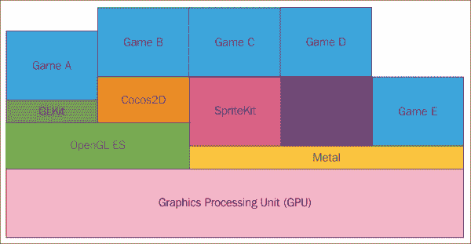
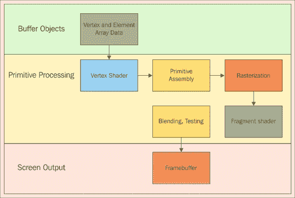
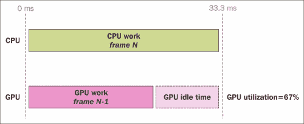
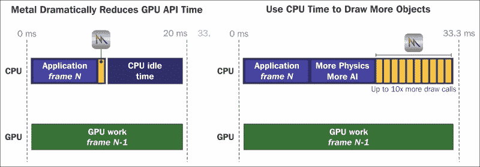

# 第六章：展示你的 Metal 游戏

到目前为止，我们已经学到了很多。我们研究了苹果的 Swift 编程语言，了解了 iOS 应用的一般流程，以及如何通过代码和/或故事板来控制它。我们了解了如何使用**SpriteKit**制作 2D 游戏和 2D 叠加层，以及如何在**Xcode**编辑器中使用 SceneKit 设计 3D 游戏。最后，我们回顾了如何使用**GameplayKit**的各个方面创建可重用的游戏逻辑、组件和 AI。

实际上，这就是规划、编码和构建你自己的游戏所需的所有内容。如果你此时脑海中闪过一个游戏想法，那就直接开始规划吧。前几章中的框架和 Xcode 功能可以帮助将你的抽象想法转化为可能很快就能玩的应用程序。

然而，在继续前进之前，我们想利用这个时间回顾一些额外的提示、技巧和主题，我们要么简要提到了，要么还没有涉及。这些主题主要涵盖了我们可以优化游戏并从苹果硬件中获得更多的方式。在本章中，我们将简要回顾一下苹果 Metal 低级图形 API 的相当高级的主题。

### 注意

这是一个关于低级图形 API 可能相当高级的警告。这不会是一个关于该主题的全面教程；更像是高级总结，以及如何欣赏 SpriteKit 和 SceneKit 在后台为我们所做的一切。我们希望至少它能让你想要探索如何构建自己的自定义渲染对象，这可能会使开发出性能极强且细节丰富的游戏成为可能。

# 苹果 Metal API 和图形管线

如果不是现代视频游戏开发的黄金法则，那么一条规则就是保持我们的游戏以每秒 60 帧或更高的速度持续运行。如果为 VR 设备和应用程序开发，这一点尤为重要，因为帧率下降可能会导致玩家感到恶心，甚至结束游戏体验。

在过去，保持精简是游戏的名字；硬件限制不仅阻止了将内容写入屏幕，还限制了游戏可以存储的内存量。这限制了场景、角色、效果和级别的数量。在过去，游戏开发更多地采用工程思维，因此开发者用他们所拥有的少量资源使事物工作。许多 8 位系统及更早的游戏中的关卡和角色之所以不同，仅仅是因为复杂的精灵切割和重新着色。

随着时间的推移，硬件的进步，尤其是 GPU 的进步，使得图形体验更加丰富。这导致了计算密集型 3D 模型、实时照明、强大的着色器以及其他效果的诞生，我们可以利用这些效果让我们的游戏呈现出更佳的玩家体验；同时，我们还要在这宝贵的 0.016666 秒/60Hz 窗口中尽可能塞入所有这些内容。

为了从硬件中获取一切，并对抗设计师希望创造最佳视觉体验的需求与硬件在当今 CPU/GPU 中存在的限制之间的冲突，苹果开发了 Metal API。

## CPU/GPU 框架级别

Metal 是一种低级 GPU API。当我们在 iOS 平台上构建游戏时，我们的 GPU/CPU 硬件中的机器代码与我们用来设计游戏的东西之间存在不同的级别。这适用于我们工作的任何计算机硬件，无论是苹果还是其他公司。例如，在 CPU 方面，在最底层是**机器代码**。再往上一层是芯片组的**汇编语言**。汇编语言根据 CPU 芯片组的不同而有所不同，允许程序员尽可能详细，比如确定交换数据进出的处理器中的单个寄存器。在 C/C++中，一个简单的 for 循环可能需要几行代码在汇编语言中实现。在代码的较低级别工作的好处是我们可以让我们的游戏运行得更快。然而，大多数中高级别的语言/API 都是为了足够好地工作而设计的，因此这不再是必需的。

### 注意

即使在游戏开发的早期阶段，游戏开发者就已经开始使用汇编语言编写代码。在 20 世纪 90 年代末，游戏开发者 Chris Sawyer 几乎完全使用 x86 汇编语言创建了其游戏**Rollercoster Tycoon™**！对于任何喜欢摆弄计算机硬件内部结构的热情开发者来说，汇编语言可能是一个巨大的挑战。

在链向上移动，我们会遇到 C/C++代码的位置，再上面则是 Swift 和 Objective-C 代码的位置。像 Ruby 和 JavaScript 这样的语言，一些开发者可以在 Xcode 中使用，它们又是一个级别向上。

那是关于 CPU 的，现在转到 GPU。**图形处理单元（GPU**）是协同 CPU 工作以计算我们在屏幕上看到的视觉效果的协处理器。以下图表显示了 GPU、与 GPU 一起工作的 API 以及基于所选框架/API 可以制作的可能的 iOS 游戏。



就像 CPU 一样，最低级别是处理器的机器码。为了尽可能接近 GPU 的机器码，许多开发者会使用 Silicon Graphics 的**OpenGL API**。对于移动设备，如 iPhone 和 iPad，将是 OpenGL 子集，**OpenGL ES**。苹果提供了一个名为**GLKit**的辅助框架/库来帮助 OpenGL ES。GLKit 有助于简化一些着色器逻辑，并减少在此级别与 GPU 一起工作时的人工操作。对于许多游戏开发者来说，这实际上是最初在 iOS 设备家族上制作 3D 游戏的唯一选择；尽管 iOS 的 Core Graphics、Core Animation 和 UIKit 框架的使用对于简单的游戏来说完全是可以接受的。

在 iOS 设备家族的生命周期中不久，第三方框架开始发挥作用，这些框架旨在游戏开发。以 OpenGL ES 为基础，直接位于其上一级的是**Cocos2D 框架**。实际上，这个框架被用于 Rovio 的 Angry Birds™游戏系列在 2009 年的原始版本中。最终，苹果公司意识到游戏对于平台成功的重要性，并创建了他们自己的以游戏为中心的框架，即 SpriteKit 和 SceneKit 框架。它们也像 Cocos2D/3D 一样，直接位于 OpenGL ES 之上。当我们在我们 Xcode 项目中创建 SKSprite 节点或 SCNNodes 时，直到 Metal 的引入，OpenGL 操作在幕后用于在更新/渲染周期中绘制这些对象。截至 iOS 9，SpriteKit 和 SceneKit 使用 Metal 的渲染管线将图形处理到屏幕上。如果设备较旧，它们会回退到 OpenGL ES 作为底层图形 API。

## 图形管线概览

这个主题可以是一本完整的书，但让我们看看图形管线，至少在较高层次上了解 GPU 在单个渲染帧期间做了什么。我们可以想象我们的游戏图形数据被分为两大类：

+   **顶点数据**：这是这些数据可以在屏幕上渲染的位置信息。向量/顶点数据可以表示为点、线或三角形。记住关于视频游戏图形的古老说法，“一切皆三角形。”游戏中所有的多边形都是通过它们的点/向量位置集合而成的三角形。GPU 的**顶点处理单元**（**VPU**）处理这些数据。

+   **渲染/像素数据**：由 GPU 的光栅化器控制，这是告诉 GPU 如何根据顶点数据定位的对象在屏幕上着色/阴影的数据。例如，这里处理了颜色通道，如 RGB 和 alpha。简而言之，这是像素数据，这是我们实际上在屏幕上看到的内容。

下面是一个显示图形管线概览的图表：



图形管道是将我们的数据渲染到屏幕上的步骤序列。前面的图是这个过程的一个简化示例。以下是可能组成管道的主要部分：

+   **缓冲区对象**：在 OpenGL 中被称为 **顶点缓冲区对象**，在 Metal API 中是 `MTLBuffer` 类。这些是我们代码中创建的对象，从 CPU 发送到 GPU 进行 **原始处理**。这些对象包含数据，例如位置、法向量、alpha 值、颜色等。

+   **原始处理**：这些是在 GPU 中进行的步骤，它们将我们的缓冲区对象分解成各种顶点和渲染数据，然后将这些信息绘制到帧缓冲区中，这是我们看到的设备上的屏幕输出。

在我们介绍 Metal 中原始处理步骤之前，我们首先应该了解着色器的历史和基础知识。

# 着色器是什么？

GPU 的首次使用并非因为其他原因，而是因为视频游戏行业。20 世纪 70 年代的街机柜中装有与主 CPU 分离的 GPU 芯片，以处理游戏相对于当时其他计算应用的专业视觉需求。最终，在 1990 年代中期，在游戏中绘制 3D 图形的需求导致了我们现在所拥有的现代 GPU 架构。着色器实际上是在 1988 年由皮克斯公司首次引入的，当时公司由苹果公司的联合创始人史蒂夫·乔布斯领导。着色器是我们可以直接写入 GPU 以处理顶点和像素数据的小程序。最初，OpenGL ES 1.0 等 API 并未使用着色器处理，而是被称为固定功能 API。在固定功能 API 中，程序员只需将简单的渲染命令引用到 GPU 上。随着 GPU 的发展，从 CPU 中接管了更多的工作，着色器的使用量也随之增加。尽管着色器是比固定功能方法更高级的遍历图形管道的方式，但它允许对 GPU 显示到屏幕上的内容进行更深入的定制。游戏开发者和 3D 艺术家继续使用它们推动游戏中的视觉效果。

从 OpenGL 2.0 开始，着色器是用 API 的类似 C 语言 GLSL 构建的。在 Apple Metal API 中，我们使用 Metal 着色语言来构建着色器，这是一种 C++11 的子集，文件类型为 `.metal`，并且可以使用我们的视图控制器在 Objective-C 或 Swift 中运行管道。

## 着色器的类型

着色器有多种类型，随着 3D 游戏和艺术动画的不断发展，这些类型也在不断增加。最常用的有顶点着色器和片段着色器。顶点着色器用于将 3D 坐标转换为屏幕显示的 2D 坐标，简而言之，就是我们的图形的位置数据。片段着色器，也称为像素着色器，用于转换屏幕上像素的颜色和其他视觉属性。片段着色器的其他属性还可以包括凹凸贴图、阴影和特定的高光。我们强调“属性”这个词，因为通常这是我们的着色器程序属性或输入的名称。

下面是一个用 Metal 着色语言编写的简单顶点和片段着色器的代码示例。

```swift
//Shaders.metal
//(1)
#include <metal_stdlib>
using namespace metal;
//(2)
vertex float4 basic_vertex(                           
//(3)
  const device packed_float3* vertex_array [[ buffer(0) ]], 
//(4)
  unsigned int vertexID [[ vertex_id ]]) {       
//(5)          
  return float4(vertex_array[vertexID], 1.0);              
}
//(6)
fragment half4 basic_fragment() { 
  return half4(1.0);  
```

这里的代码与我们在书中看到的不同。让我们逐行过一遍。

1.  Metal 着色语言是一种类似于 C++11 的语言，所以我们看到 Metal 标准库通过在着色器文件中使用`#include <metal_stdlib>`行导入，以及`using namespace metal;`。

1.  下一行是使用`vertex`关键字创建我们的顶点着色器。这个着色器有四个浮点数。为什么是四个浮点数，而 3D 空间只处理*x*、*y*和*z*坐标？为了总结，3D 矩阵数学涉及一个第四个组件*w*，以准确处理 3D 空间的数学计算。简而言之，如果*w= 0*，则*x*、*y*和*z*坐标是向量；如果*w = 1*，则这些坐标是点。这个着色器的作用将是将简单的点绘制到屏幕上，所以*w*将是 1.0。

1.  在这里，我们创建了一个指向`float3`类型数组（用于我们的*x*、*y*和*z*坐标）的指针，并将其设置为第一个缓冲区，使用`[[ buffer(0) ]]`声明。`[[ ]]`语法用于声明着色器输入/属性。

1.  无符号整数`vertexID`是我们为这个特定顶点数组的`vertex_id`属性命名的名称。

1.  这里的`float4`类型是返回的，或者在这种情况下，这个顶点数组的最终位置。我们看到它返回输出中的两个部分：第一部分是引用这个顶点数组，通过`vertex_id`属性和`w`值为`1.0`来识别，表示这些是空间中的点。

1.  这一行是我们创建片段着色器的地方，使用`fragment`关键字。这个着色器的数据类型是`half4`，它是一个[4,4]的 16 位浮点数数组。在这种情况下，最终目的是创建 16 位彩色像素。这个[4,4]组件向量类型将 16 位保存到 R、G、B 和 alpha 通道。这个着色器将简单地显示纯白色像素着色，没有透明度，所以我们简单地写`return half4(1.0);`。这会将所有位设置为 1，相当于`rgba(1,1,1,1)`。

当我们创建一个缓冲区对象时，它可以是屏幕上浮点数的结构体，我们将这些数据通过这些着色器传递，然后在屏幕上会出现一个白色三角形或一组三角形形状。

回顾一下**图形管线**图，我们看到在顶点着色器计算之后，GPU 执行了所谓的**原语装配**。这本质上是将顶点着色器中定义的点向量映射到屏幕空间中的坐标。简而言之，光栅化步骤确定从顶点数据中我们可以和不能使用片段着色器信息将像素数据着色到屏幕上的位置和方式。在接收了片段着色器信息后，GPU 然后使用这些信息进行像素数据的混合。最后，这些输出被发送到或提交到帧缓冲区，玩家在那里看到这些输出。所有这些都在渲染周期中的单个绘制调用中发生。让你的游戏中的所有灯光、像素、效果、物理和其他图形在 0.016666 秒内通过这个循环，这就是游戏的名字。

我们将在稍后介绍更多的 Metal 代码，但你现在需要理解的是，着色器就像是我们 Swift/Object-C 代码中发送给它们的输入数据的小型指令工厂。多年来出现的其他着色器类型包括几何着色器和细分着色器。

### 注意

在这个单独的`.metal`文件中，既有顶点着色器也有片段着色器，但通常着色器是单独编写的。Xcode 和 Metal 会将项目中的所有`.metal`文件合并，所以着色器是否在一个文件中并不重要。OpenGL 的 GLSL 大部分情况下强制着色器类型的分离。

多年来，OpenGL 为许多不同的 GPU 提供了良好的工作效果，但正如我们所见，Apple Metal 允许我们以比 OpenGL ES 快 10 倍的速度执行绘制调用。

# 为什么 Metal 比 OpenGL ES 快？

在 2013 年底，Apple 宣布了**iPhone 5s**。5s 内置了**A7 处理器**，这是 iOS 设备家族的第一个 64 位 GPU。与之前的设备相比，它提供了相当不错的图形提升，并反映了移动设备中的 GPU 如何快速赶上几年前发布的游戏机。尽管 OpenGL 是底层图形 API 的基石，但它并没有充分利用 A7 芯片。

在下一个图中可以看到，CPU 和 GPU 之间的交互并不总是以我们希望的方式为我们的游戏执行。



不论是纹理、着色器还是渲染目标，绘制调用都使用它们自己的状态向量。CPU 通过低级 API 使用大量时间来验证绘制调用的状态。这个过程对 CPU 来说非常昂贵。发生的情况是，在许多周期中，GPU 处于空闲状态，等待 CPU 完成其之前的指令。以下是 API 中占用所有这些时间的操作：

+   **状态验证**：确认 API 使用是有效的。这会将 API 状态编码到硬件状态。

+   **着色器编译**：运行时生成着色器机器代码。这涉及到状态和着色器之间的交互。

+   **向 GPU 发送工作**：管理资源驻留批处理命令。

苹果在他们的 Metal API 中所做的，是以更智能的方式完成这些步骤。着色器编译是在应用程序的加载时间完成的。不需要在每个周期重新加载着色器；这仅仅是旧硬件限制的遗迹。这就是为什么在我们的上一个代码示例中，我们可以在一个 Metal 文件中构建多个着色器，而在 OpenGL ES 中这是被禁止的。尽管状态验证很重要，但不需要在每个周期进行检查。状态验证的检查可以设置为仅在加载新内容时发生。

### 备注

即使 Metal 有其优势，这也是为什么建议将 2D 动画存储在 **SpriteSheets** 中的原因。我们之前在讨论 SpritKit 时提到了 SpriteSheets。它们是一组适合在一个纹理上的精灵。图形管线随后只需处理该内容的单个版本。在 SpriteKit 的内部机制下，与每个角色动画都放置在其单独的纹理上相比，GPU 内部不需要进行那么多的状态向量调用。

CPU 的最后一个处理过程是将信息发送到 GPU 进行处理。这将在每次绘制调用期间完成，无论是在 Metal 还是 Open GL ES 中，这个过程都将是最频繁发生的。以下是 Metal API 中进行的这种内部、低级别重构的结果：



正如我们在 *WWDC14* 的图中看到的，在渲染周期中可以添加多达 10 个额外的绘制调用！我们可以利用节省下来的时间用于其他过程，而不是额外的绘制调用，例如在我们的游戏中增加更多的物理或人工智能。

### 备注

展示的周期图来自 *WWDC2014* 上原始 Metal API 的公告，并使用了 30 fps 的帧率。如果开发 VR 游戏需要 60 fps 或更高的帧率，这些数字将减半。无论如何，这对于移动设备 GPU 来说都非常令人印象深刻。在网上搜索使用 Metal 开发的游戏，你会感到惊讶。由于在每个渲染周期中都有这么多的空间来添加更多内容，所以在 60 fps 下拥有令人印象深刻的游戏是没有理由的。此外，截至 iOS 9，SpriteKit 和 SceneKit 框架默认由 Metal 支持。即使 Metal API 难以理解，我们仍然可以利用我们从这些框架中学到的渲染节省优势。

# 基本的 Metal 对象/代码结构

为了结束我们对 Apple Metal 的讨论，让我们看一下 API 的对象和代码结构概述。我们已经在 Metal 着色语言中简要地看到了一些着色器代码，所以让我们看看我们如何在项目中使用这个 API。

| 对象 | 目的 |
| --- | --- |
| 设备 | 对 GPU 的引用 |
| 命令队列 | 命令缓冲区的串行序列 |
| 命令缓冲区 | 包含 GPU 硬件命令 |
| 命令编码器 | 将 API 命令转换为 GPU 硬件命令 |
| 状态 | 帧缓冲区配置、深度、采样器、混合等 |
| 代码 | 着色器（顶点、片段、几何和细分） |
| 资源 | 纹理和数据缓冲对象（顶点、常量等） |

前面的表格表示我们在直接在 Metal API 中编写游戏时将与之工作的各种对象类型。它们是设备、状态、命令缓冲区、我们的着色器、纹理以及更多。

我们可以使用以下方式将 Metal API 导入到 `ViewController.swift` 类中：

```swift
import Metal
import QuartzCore
```

这导入了 Metal API。还需要 QuartzCore API，因为我们将要与之工作的 `CAMetalLayer` 对象是该库的一个成员。同时，确保将您的目标设备设置为实际 iOS 设备，新或更新的 iPhone 5S，Xcode 模拟器不支持 Metal。否则，Xcode 将给出“无法构建”Objective-C 模型 `Metal` 错误。截至本书编写时的 Xcode 7 Beta 版本，这是真的。随着时间的推移，很可能在 El Capitan OS 的官方公共版本发布后，这将不再需要。目前，为了测试您自己的自定义 Metal 代码，您必须在实际设备上进行测试。这样做将涉及支付自己的 Apple 开发账户费用。更多内容将在下一章中介绍。

这是我们要按照的顺序与之前显示的表格中的对象一起工作，以及一些用 Swift 实现的这些步骤的代码示例：

1.  使用 `MTLDevice` 类创建对设备的引用：

    ```swift
    let device: MTLDevice = MTLCreateSystemDefaultDevice()
    ```

1.  为这些对象在屏幕上创建一个 `CAMetalLayer` 对象：

    ```swift
    let metalLayer = CAMetalLayer()
    ```

1.  创建顶点数据/缓冲对象（VBOs），如下发送数据到着色器：

    ```swift
    /*Simple Vertex Data object, an array of floats that draws a simple triangle to the screen */
    let vertexData:[Float] = [
      0.0, 1.0, 0.0,
      -1.0, -1.0, 0.0,
      1.0, -1.0, 0.0]
    ```

1.  为这些 VBO 创建将与之工作的着色器。

    我们在之前的着色器代码示例中做了这件事。顶点数据与之前制作的着色器结合，在屏幕上创建了一个简单的白色三角形。

1.  如下设置渲染管线：

    ```swift
    //Library objects that reference our shaders we created
    let library = device.newDefaultLibrary()!
    //constant where we pass the vertex shader function
    let vertexFunction = library.newFunctionWithName("basic_vertex")
    //now the fragment shader 
    let fragmentFunction = library.newFunctionWithName("basic_fragment")

    /*Describes the Render Pipeline and sets the vertex and fragment shaders of the Render Pipeine*/
    let pipelineStateDescriptor = MTLRenderPipelineDescriptor()
    //initiates the descriptor's vertex and fragment shader function properties with the constants we created prior
    pipelineStateDescriptor.vertexFunction = vertexFunction
    pipelineStateDescriptor.fragmentFunction = fragmentFunction

    //Makes the pixel format an 8bit color format
    pipelineStateDescriptor.colorAttachments.objectAtIndexedSubscript(0).
    pixelFormat = .BGRA8Unorm

    /*Checks if we described the Render Pipeline correctly, otherwise, throws an error. */
    var pipelineError : NSError?
    pipelineState = device.newRenderPipelineStateWithDescriptor(pipelineStateDescriptor, error: &pipelineError)
    if pipelineState == nil {
      println("Pipeline state not created, error \(pipelineError)")
    ```

1.  如下创建一个命令队列：

    ```swift
    var commandQueue = device.newCommandQueue()
    ```

要在我们的游戏中实际渲染这些对象，我们必须在视图控制器中执行以下过程：

1.  创建一个显示链接。这是一个每次屏幕刷新时都会刷新的计时器。它是 `CADisplayLink` 类的一个成员，并且每次屏幕刷新时，我们都会调用 `gameRenderLoop` 函数。

    ```swift
    var timer = CADisplayLink(target: self, selector: Selector("gameRenderLoop"))
    timer.addToRunLoop(NSRunLoop.mainRunLoop(), forMode: NSDefaultRunLoopMode)
    ```

    `gameRenderLoop` 函数可能看起来像以下这样。它调用即将填充的函数 `render()`：

    ```swift
    func gameRenderloop() {
      autoreleasepool {
        self.render()
      }
    ```

1.  创建一个渲染传递描述符。对于这个例子，要在我们的白色三角形周围创建一个主要为红色的纹理，如下所示：

    ```swift
    let passDescriptor = MTLRenderPassDescriptor() 
    passDescriptor.colorAttachments[0].texture = drawable.texture
    passDescriptor.colorAttachments[0].loadAction = .Clear
    passDescriptor.colorAttachments[0].storeAction = .Store
    passDescriptor.colorAttachments[0].clearColor = MTLClearColorMake(0.8, 0.0, 0.0, 1.0)
    ```

1.  在我们的 `render()` 函数中创建一个命令缓冲区：

    ```swift
    let commandBuffer = commandQueue.commandBuffer()
    ```

1.  创建一个渲染命令编码器。换句话说，是 `commandQueue` 的一组命令。在稍后的代码示例中，这告诉 GPU 使用我们之前创建的 VBO 绘制三角形。这被放置（在这个例子中）在 `render()` 函数中。

    ```swift
    let renderEncoderOpt = commandBuffer.renderCommandEncoderWithDescriptor(renderPassDescriptor)
    if let renderEncoder = renderEncoderOpt {
      renderEncoder.setRenderPipelineState(pipelineState)
      renderEncoder.setVertexBuffer(vertexBuffer, offset: 0, atIndex: 0)
      renderEncoder.drawPrimitives(.Triangle, vertexStart: 0, vertexCount: 3, instanceCount: 1)
      renderEncoder.endEncoding()
    }
    ```

1.  提交你的命令缓冲区。这本质上告诉 GPU 根据已经打包到`commandBuffer`对象中的命令进行绘制调用。在`render()`函数中，将此代码放在之前的`if`语句之后。

    ```swift
    commandBuffer.presentDrawable(drawable) 
    commandBuffer.commit()
    ```

这就是它的简短版本。这是在屏幕上绘制一个简单的三角形并手动在 GPU 上创建渲染循环的一般过程。

你是否更愿意选择 SpriteKit 和 SceneKit 来为你完成所有这些手动工作？这是可以理解的。但记住，就像在困难模式下玩游戏一样，选择更难的路线也会带来回报。是的，从 iOS 9 开始，SpriteKit 和 SceneKit 框架默认使用 Metal。游戏引擎，如 Unity 和 Unreal Engine，在将项目转换为平台时也会实现 Metal。然而，了解如何在 Metal 或 OpenGL 这样的低级图形 API 中构建你的游戏，将赋予开发者创建性能最优化游戏的能力。下次你在网上搜索时，一定要查看一些使用 Metal 创建的游戏。它们真的可以为你的玩家提供极佳的体验。同时，这也将挑战你作为游戏开发者的技能，因为成为一名游戏开发者是艺术家、工程师和计算机科学家的结合。直接在 GPU 的基本功能上工作将挑战这一切。

要更深入地探索 Metal 的低级图形开发这个兔子洞，请查看以下链接：

+   [`developer.apple.com/metal/`](https://developer.apple.com/metal/)

+   [`developer.apple.com/library/ios/documentation/Metal/Reference/MetalShadingLanguageGuide/data-types/data-types.html`](https://developer.apple.com/library/ios/documentation/Metal/Reference/MetalShadingLanguageGuide/data-types/data-types.html)

+   [`www.raywenderlich.com/77488/ios-8-metal-tutorial-swift-getting-started`](http://www.raywenderlich.com/77488/ios-8-metal-tutorial-swift-getting-started)

+   [`realm.io/news/3d-graphics-metal-swift/`](https://realm.io/news/3d-graphics-metal-swift/)

第一个链接是苹果官方开发者页面上的 Metal 页面。下一个链接是苹果在 Metal API 中使用的数据类型列表。最后两个链接是两个使用 Swift 创建简单 Metal 场景的教程。我们使用的部分代码也可以在这些教程以及完整的 Xcode 项目中找到。这两个链接中的第一个链接是 iOS 教程网站[www.raywenderlich.com](http://www.raywenderlich.com)。最后一个链接是一个页面，上面有前苹果工程师*沃伦·摩尔*关于 Swift 和 Metal 3D 图形的精彩视频演示和完整说明。

# 摘要

恭喜你走到这一步。如果这本书是一部游戏，我们可能仅凭这一章就能获得成就。正如我们所见，使用像 Metal 这样的低级 API 可能会有些令人畏惧。我们首先回顾了当开发者和工程师提到低级和高级框架以及代码时，这意味着什么。在 CPU 方面，我们看到最低级的是机器代码，Swift 和 Objective-C 位于中间，而 C/C++和汇编代码位于其上。接下来，我们讨论了 GPU 方面，以及我们在前几章中提到的视觉图形 API 在层次结构中的位置。然后，我们了解了低级图形 API（如 OpenGL ES）的历史，图形管道在底层通常是如何工作的，以及如何制作基本的着色器。最后，我们回顾了为什么 Metal 在渲染周期中比 OpenGL 更快，Metal 背后的总体结构，以及一些用于手动设置渲染循环的代码/对象。这一章只是在这个主题上略作探讨，所以如果你愿意接受挑战，强烈建议继续阅读有关 Metal 如何让你的游戏与众不同的文档。

到目前为止，你应该已经拥有了在 iOS 平台上制作游戏所需的一切。iOS 游戏开发的最后一堂必修课是学习如何测试、发布和更新你在 App Store 上发布的应用。在下一章中，我们将学习如何将游戏上传到 Apple App Store。
