# 第七章。发布我们的 iOS 游戏

制作一款优秀的游戏是件辛苦的工作。作为游戏开发者，我们的目标是开发一款能够被成千上万，甚至数百万的人玩的应用。我们希望他们能玩到我们在那些漫长的星期和几个月里制作的东西。在应用发布之前，我们也可能希望让其他人测试游戏，以排除可能遗漏的任何错误。在 iOS 平台上发布可以让我们做到这两点。

我们可以通过**TestFlight**服务允许他人在我们发布前尝试我们的游戏，当然，我们也可以随后将我们的游戏提交到苹果 App Store 进行发布。发布后，我们可以提交更新。这些更新和未来的版本可能只是为了修复在初始发布中可能遗漏的一些小错误，添加新功能，例如关卡、成就和其他苹果服务，或者我们可能需要在以后更新我们的应用以符合 iOS 平台最终发生的更新。

在本章中，我们将涵盖几个主要主题：

+   在 iTunes Connect 中设置我们的应用以进行测试或发布

+   将我们的应用到应用商店提交以供游玩的步骤

+   测试飞行服务在预发布阶段测试的总结

+   如何使用 iTunes Connect 创建我们应用的更新

我们不会告诉你如何推广你的游戏，因为这完全是一本关于这个主题的书/话题，它取决于你的预算和偏好。然而，我们可以说的是，如果你或你的测试者发现玩游戏很有趣，那么其他人也可能会有同样的感觉。提交到应用商店并不保证立即成功。

即使那些在日益增长的独立游戏奖励展示或游戏马拉松中获得高度赞誉的未发布游戏，在发布后也可能没有在销售和下载量上反映出这种赞誉。我们必须记住，游戏开发场景，部分得益于游戏在流行文化中的地位，是一片由成千上万的开发者，无论是大是小，都在努力制作下一个伟大游戏的海洋。

尽管如此，不要因此气馁。如果你的游戏表现良好，这完全有可能通过苹果 App Store 实现，那么这可能会是一次改变一生的体验。无论结果如何，让制作你自己的游戏和学习这个开发平台的经验让你谦卑，并让你想要在下一个项目中成为一名更好的开发者。最终，这些努力会得到回报。

# 应用提交的持续变化过程

在我们继续解释发布你的游戏所需的步骤之前，我们想指出关于这个主题的一个小事实。这个事实是，提交我们的 iOS 应用进行测试或发布的具体步骤经常发生变化。每隔几个月，这个过程可能会从我们在这里描述的方式改变。

几年来，自从 iOS 开发开始，苹果一直在使这个过程变得更简单、更流畅。Xcode 为我们做的签名/配置工作比过去要多得多，我们应用在 App Store 中永远无法出现的问题几乎不再是问题。

例如，当 Swift 游戏 PikiPop 在 2014 年 11 月提交时，从提交审查到出现在 App Store 供公众使用，仅用了五个工作日。这个审查时间因人而异，但只要我们的应用中没有严重的错误或违反政策，我们可以期待我们的作品能够供数百万玩家潜在地游玩。为了确保您游戏的发布顺利进行，最好审查这里找到的 App 审查指南：[`developer.apple.com/app-store/review/guidelines/`](https://developer.apple.com/app-store/review/guidelines/).

### 注意

我们是在 2015 年夏末编写这本书的，所以如果您在很久以后阅读这本书，觉得其中一些过程可能已经过时，请确保查看苹果自己 App 提交文档页面上的最新更新：

[`developer.apple.com/library/ios/documentation/LanguagesUtilities/Conceptual/iTunesConnect_Guide/Chapters/SubmittingTheApp.html`](https://developer.apple.com/library/ios/documentation/LanguagesUtilities/Conceptual/iTunesConnect_Guide/Chapters/SubmittingTheApp.html)

## 在提交您的应用之前

在您选择将应用提交到 App Store 之前，我们必须提醒您一个潜在的开发陷阱。截至本书出版时，如果您在 Xcode 的 beta 版本中构建应用，该应用将被拒绝审查。

在本书的编写过程中，我们一直在构建我们的应用，并回顾了目前 Xcode 7 的 beta 版本中已有的功能。这是因为 iOS 9 / Xcode 7 中有一系列新功能，在 iOS 8 / Xcode 6 中并不存在，即 GameplayKit 框架和 SceneKit 的视觉编辑工具，这使得 Xcode 开发像多平台游戏引擎一样直观。

### 注意

到您阅读这本书的时候，Xcode 7 应该已经不再处于 beta 阶段。因此，您应该能够发布 iOS 9（或更高版本）的游戏，而不用担心这些功能是否仅为 beta 版本。

当您为发布到 App Store 构建游戏时，请确保首先在当前的非 beta 版本中构建它们。使用 Xcode 的 beta 版本来测试最新未发布的特性以及预发布阶段即将到来的 iOS 构建。

## 为 iTunes Connect 准备我们的应用

所以你已经编码、模拟，并且希望玩玩你投入了大量精力的那个 iOS 游戏。下一步是将你的应用带入测试/预发布阶段。这个阶段的目标是将你的游戏带给更小的游戏者/测试者群体，以模拟成千上万甚至数百万可能玩你的游戏的人的体验。如果你还没有这样做，第一步是注册 Apple 开发者计划：[`developer.apple.com/programs/`](https://developer.apple.com/programs/)。

这将涉及一些费用，并且这个费用将基于你的开发目标。对于个人、个体工商户账户，成为 iOS 开发者每年需要支付 99 美元。如果你是作为开发者团队的一部分工作，那么 299.99 美元的企业计划可能是一个更好的选择。

### 注意

在你的开发者页面，你还需要确保你的配置文件设置正确。这个步骤过去是 iOS 开发者完成的最困难的事情之一，但 Xcode 随着每个新版本的更新使这个过程更加自动化。如果你已经在 Xcode 中使用实际设备测试你的应用，显然你已经完成了这一步。如果没有，这里有一些关于设置你的配置文件（s）的更多信息：[`developer.apple.com/library/mac/documentation/NetworkingInternet/Conceptual/RemoteNotificationsPG/Chapters/ProvisioningDevelopment.html`](https://developer.apple.com/library/mac/documentation/NetworkingInternet/Conceptual/RemoteNotificationsPG/Chapters/ProvisioningDevelopment.html)。

在发布应用的过程中，将成为你最好朋友的门户网站是 iTunes Connect，在这里：

[`itunesconnect.apple.com/`](https://itunesconnect.apple.com/)

iTunes Connect 是你可以查看你提交的应用、跟踪各种应用分析、分配 TestFlight 测试者以及查看你的应用收入的地方。我们无法详细介绍 iTunes Connect 中所有可用的功能；主要我们将查看发布、发布和更新你的游戏的步骤。随着每个新的 iOS 更新，功能不断增加，你可以自由探索 iTunes Connect 为你应用提供的所有功能和设置。

## 在测试/预发布阶段提交你的应用

让我们直接进入提交你的应用的步骤。首先，我们将讨论你游戏的测试/预发布阶段。

这里是游戏测试/预发布阶段所需步骤的摘要：

1.  创建一个 iTunes Connect 应用记录。

1.  更新构建字符串。

1.  归档并验证你的应用。

1.  将你的应用上传到 iTunes Connect。

1.  使用 TestFlight 服务测试你的游戏。

1.  分析崩溃报告并征求测试者的反馈。

### 注意

步骤 *1*-*4* 在你的游戏的测试和发布阶段都是相同的。

### 创建 iTunes Connect 应用记录

这些是将你的 App 添加到 iTunes Connect 应用记录所需的步骤：

1.  登录您的账户至[`itunesconnect.apple.com/`](https://itunesconnect.apple.com/)并进入**我的应用**部分。

1.  现在点击页面左上角的**+**图标，从下拉菜单中选择**New iOS App**。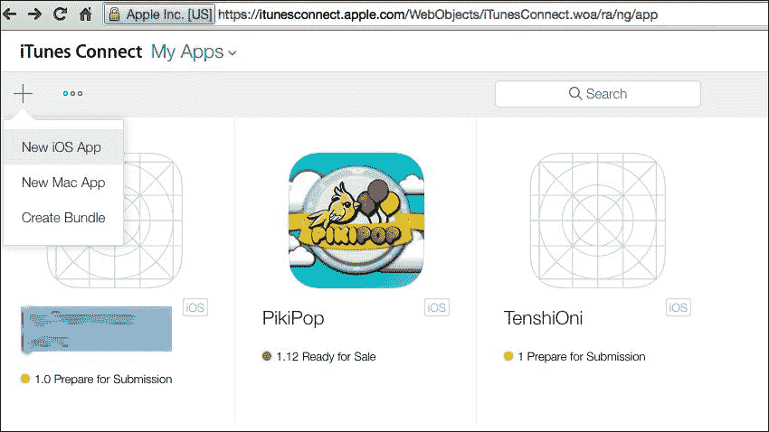

1.  填写适当的字段，如果您已经知道这些信息，请点击**创建**。对于不确定在这里填写什么的人，我们将在以下屏幕截图中回顾每个这些字段：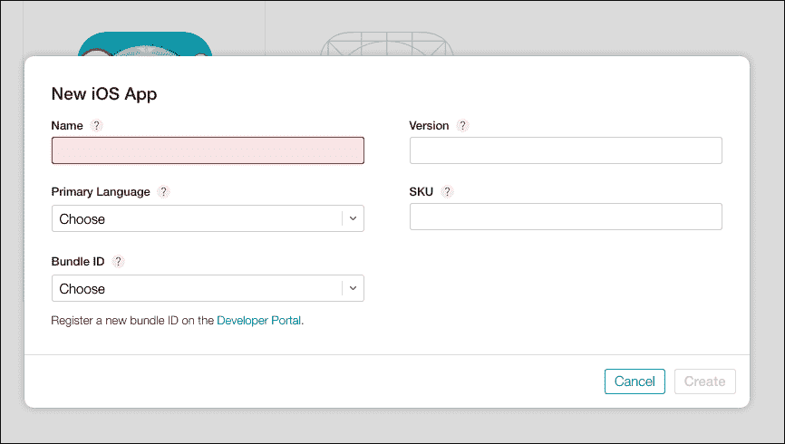

注意**SKU**、**版本**和**Bundle ID**字段。SKU 必须是唯一的，且尚未使用，因为苹果将使用此信息在商店中识别您的应用。**版本**和**Bundle ID**字段必须与您在游戏 Xcode 项目中设置的构建设置相匹配。**Bundle ID**字段是一个下拉菜单，最初可能只显示通配符 App/Bundle ID。

通配符 ID 是两种类型的 Bundle ID 之一，另一种是显式 App ID。以下是一个链接，指向苹果的文档/常见问题解答，说明哪种 ID 最适合您的游戏：[`developer.apple.com/library/ios/qa/qa1713/_index.html`](https://developer.apple.com/library/ios/qa/qa1713/_index.html)。简而言之，如果您打算使用苹果服务，例如通知和游戏中心成就，您将需要一个显式 App ID；如果不是，那么通配符 ID 是最佳选择。

### 注意

如果您希望使用显式 Bundle ID，您必须在苹果开发者门户中注册您的应用 Bundle ID。在开发者门户上注册的 ID 将填充该下拉菜单。这是开发者网站上该页面的链接：[`developer.apple.com/account/ios/identifiers/bundle/bundleCreate.action`](https://developer.apple.com/account/ios/identifiers/bundle/bundleCreate.action)。

**Bundle ID 后缀**字段位于您项目的`info.plist`文件中。这是一个由您的 Xcode 项目创建的唯一字符串，也称为 Bundle Seed ID。当我们在“更新构建字符串”步骤中讲解时，我们将向您展示如何找到这个以及其他基于 bundle/build 的信息。

**名称**字段是您的游戏在 App Store 中的名称。这是人们搜索并希望访问您游戏着陆页时将看到的内容。**主要语言**下拉菜单是如果应用商店无法为该地区本地化您的游戏信息时，您的游戏默认语言将是什么。

### 更新构建字符串

构建字符串代表您游戏包的一个迭代版本。它是一个由两个点分隔的正整数列表，例如 *1.2.3*。基本上，构建字符串是为您的游戏添加的另一层版本控制。在制作 iOS 应用程序时，正如我们的案例一样，更改此构建信息将在上传步骤中自动被 iTunes Connect 所见。如果我们不更新此字段，即使我们更改了游戏代码，iTunes Connect 仍然会认为您正在尝试上传相同的构建版本，并将拒绝您的上传。

在您的 Xcode 项目中，您可以在以下位置找到此信息：

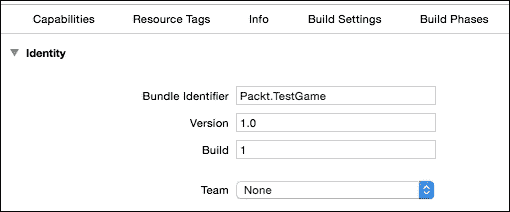

当我们在导航面板中点击项目的主要文件时，在检查器窗口的 **常规** 选项卡中可以找到包标识符、构建字符串、版本号和其他应用程序标识符/全局设置。我们还可以在 `info.plist` 文件中找到这些信息。请确保这些字段与您的 iTunes Connect 记录匹配。

现在，让我们继续在 Xcode 中上传我们的游戏到 iTunes Connect。

### 存档并验证您的应用程序

应用程序发布流程的下一步是存档您游戏的项目包。为此，请转到顶部的下拉菜单，然后导航到 **项目** | **存档**。如果您的测试设备是模拟器而不是 iOS 设备，存档选择可能不可用。

构建完成后，您的存档应用程序将与其他存档一起显示在存档组织器中，这些存档是从该应用程序和其他应用程序创建的。当您构建存档时，此窗口将打开，但您可以通过在顶部菜单中选择 **窗口** | **组织器** 来随时访问它。

窗口如下截图所示：

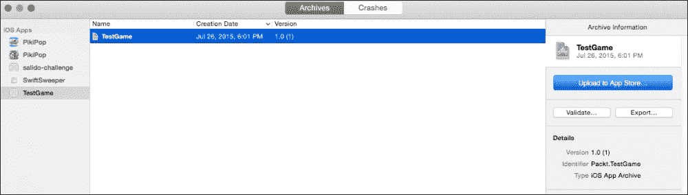

接下来，我们验证您的游戏以确保它符合提交的最小要求。为此，请按照以下步骤操作：

1.  点击前一个存档组织器窗口右侧的 **验证** 按钮。

1.  将会弹出一个窗口，您可以在其中选择为该应用程序进行配置的 **开发团队**。（这是假设您的配置文件已正确设置。）点击 **选择** 以进入下一步。

1.  这将打开一个弹出窗口，显示在执行实际验证之前应用程序的摘要。您还可以在此处看到有关您的应用程序的信息，例如应用程序的包标识符以及之前提到的包种子标识符。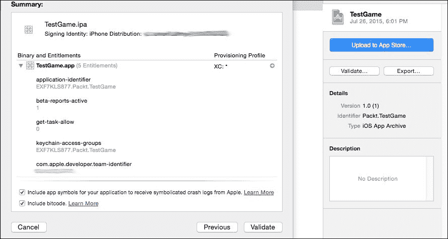

1.  点击 **验证**，如果您的应用程序项目中的信息与我们在 iTunes Connect 上设置的信息正确匹配，那么您的应用程序应该已通过验证，并准备好提交到 iTunes Connect，最终提交到 App Store 本身。

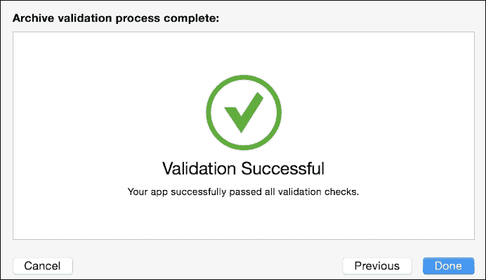

如果您的应用程序未通过验证，请确保您在 iTunes Connect 中的所有信息都匹配，最重要的是包标识符。

### 小贴士

*应用验证*步骤可能只需通过点击**上传到 App Store…**按钮就能跳过，但这是一个在早期测试游戏是否一切正常的好方法。

更多关于应用验证的信息可以在这里找到：

[`developer.apple.com/library/mac/recipes/xcode_help-archives_organizer/articles/ValidatingYourApp.html`](https://developer.apple.com/library/mac/recipes/xcode_help-archives_organizer/articles/ValidatingYourApp.html)

### 将您的应用上传到 iTunes Connect

此步骤现在应该相当简单。点击蓝色**上传到 App Store…**按钮，你应该会看到与应用验证阶段相同的提示。你将被要求选择开发团队；展示您的应用详情，然后你可以通过点击**提交**来选择上传您的应用。如果你的游戏之前已经通过验证，那么它应该可以顺利上传到 iTunes Connect。现在你的游戏应该离在 App Store 上可供测试或购买/下载又近了一步。

### 使用 TestFlight 服务测试您的游戏

每个应用在发布前都应该至少进行某种形式的测试，视频游戏通常是比其他应用更需要这种测试的类型，因为游戏通常有更多的变量和崩溃的机会，而普通的移动程序则没有。此外，像 GameCenter 和内购这样的 Apple 服务，如果不进入这个阶段是无法正确测试的。

在过去，发布 iOS 应用之前测试的唯一方法是通过 ad hoc 分发方法，验证具有 UDID 的个别设备，并给测试者提供带有清单文件的下载，该文件允许应用在他们的设备上实际运行。这就是苹果与 Android 等其他平台有很大不同的地方。苹果在保持开发者喜欢称之为*封闭花园*的应用分发方面非常小心。

在过去，这有点头疼，与 Android 相比，导致应用错误直到发布后才被发现。为了保持苹果应用分发的完整性，并为开发者提供一种更好的方式来轻松预测试他们的应用，并且有比原始的 100 台设备限制更多的人，TestFlight 服务被创建。TestFlight 图标如下所示：

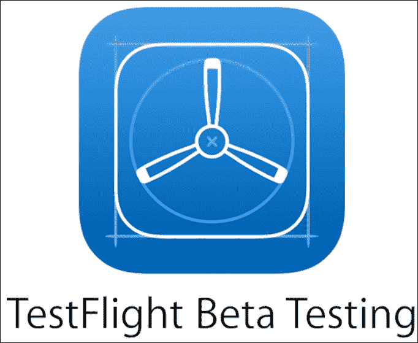

TestFlight 是一个任何人都可以从 Apple App Store 下载到他们的 iOS 设备的 App。对于你，作为开发者，它可以是早期分发你游戏的一个很好的工具。TestFlight 测试者被分为两组：内部测试者和外部测试者。内部测试者由你的团队成员组成，你可以有最多 25 名内部测试者。

在 iTunes Connect 中，您可以在**用户和角色**主部分为您的团队设置角色。这些角色包括管理员、技术、营销和其他。属于管理员和技术类别的成员是您可以指定为内部测试人员的。将这些用户设置为内部测试人员就像打开他们名字旁边的**内部测试人员**开关一样简单。

要让这些用户在 TestFlight 中测试您的游戏，请在 iTunes Connect 的**我的应用**部分中找到您的游戏。如果您的游戏构建已成功添加到 iTunes Connect，如前一部分中提供的步骤，那么您应该会在**预发布**标签中看到它列出。

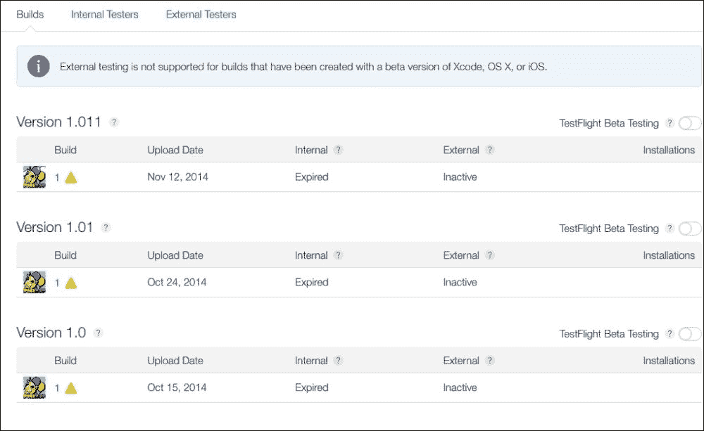

### 注意

当您将应用程序上传到 iTunes Connect 时，它们可以分成版本，然后这些版本再细分为它们自己的构建。例如，版本 1.0（1）是您的游戏的版本 1.0，构建 1，而 1.0(1.2)将是您的游戏的版本 1.0 / 构建版本 1.2。在项目中更改构建字符串然后上传新构建是您如何在 iTunes Connect 的此页面上划分应用程序的方法。我们将在创建您游戏的新更新时进一步讨论这一点，但这是对预发布构建进行版本化的过程。

下一步是点击构建或版本，这将打开构建的元数据页面。填写这些信息以更好地帮助测试人员了解应联系谁以及要测试什么。这些信息是测试人员在下载您游戏的测试版时将看到的信息。

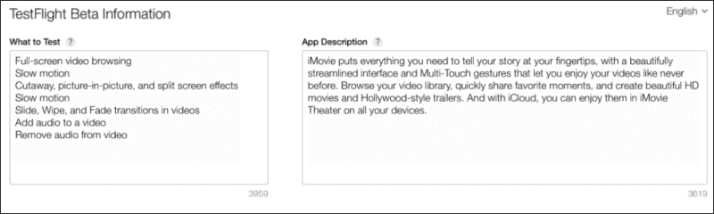

要允许此构建/版本进行 TestFlight 测试，只需在**预发布**标签中版本列表的右上角切换**TestFlight Beta Testing**开关。

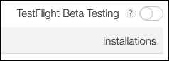

现在要让您的测试人员在他们的 TestFlight 应用程序中测试此构建，只需在游戏的预发布页面上的**构建**标签旁边的**内部测试人员**标签上点击，点击他们名字旁边的勾选框，然后点击**邀请**。

他们应该收到一封电子邮件以接受邀请，一旦他们在 TestFlight 中安装了它，您将看到他们正在测试哪个构建。

#### 外部测试人员邀请

要使用 TestFlight 为您的游戏获取外部测试人员也是一个相当简单的流程，但有一个注意事项；您的应用程序需要提交进行 beta 审查。这样做很简单，您只需点击应用程序构建右侧的**提交 beta 应用审查**链接；再次在**预发布**部分的**构建**标签中。

与实际 App Store 提交一样，可能需要等待才能进行下一步。等待的时间不如完整应用提交长，这是一个非常好的迹象，表明当你进行公开发布时一切都会顺利。与内部测试者不同，所有元数据都必须完成，但你可以有最多 1000 名测试者！一旦点击**提交以供 Beta 应用审查**链接，你的应用等待 beta 测试审查时，你就可以开始邀请测试者。

现在转到**预发布**页面中的**外部测试者**标签，然后点击**+**按钮，通过他们的电子邮件地址（可选）以及他们的名字和姓氏添加他们。点击**下一步**将该人添加到邀请列表中。请注意，你只有 30 天的时间让外部测试者审查你游戏的这个版本。

一旦你的应用通过 beta 审查，外部测试者可以像内部测试者一样测试你的应用。

### 分析崩溃报告和测试者的反馈

现在你已经有人测试你的游戏了，从他们的电子邮件中记录下游戏中可能存在的问题，然后回到你的游戏项目中进行必要的修复。更新 Xcode 项目中构建字符串的版本号，并重新上传构建，以便让测试者能够跟上每个新的预发布更新。

应用崩溃报告可以在 iTunes Connect 的**App Analytics**主部分中查看，如 PikiPop 的信息图片所示。然而，这些详细的崩溃分析似乎是发布后而不是预发布期间。

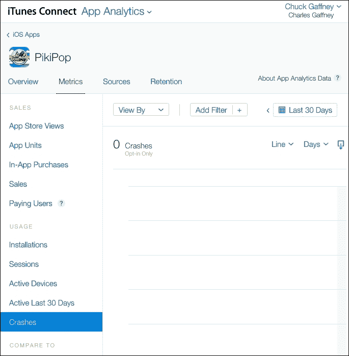

更多关于 TestFlight 以及视频解释可以在苹果官方关于该主题的页面找到，如下所示：

[`developer.apple.com/testflight/`](https://developer.apple.com/testflight/)

# 提交游戏以供审查

这是你游戏开发中努力工作的一个阶段，将其提交到苹果 App Store。好消息是，大部分工作已经完成！要提交游戏以供审查，此时，你所要做的就是前往应用的**版本**标签，然后点击**提交以供审查**标签。

你可以在以下*冒险应用*示例图片中看到这一点：

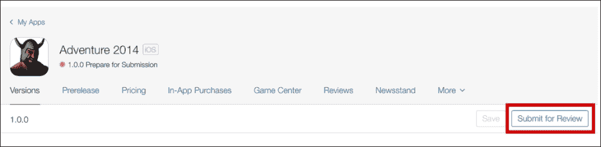

在实际提交之前，你将需要回答一些问题，例如关于出口合规性、内容权利和**广告标识符**（**IDFA**）信息。有关 IDFA 的更多信息可以在此处找到：

[`developer.apple.com/library/ios/documentation/LanguagesUtilities/Conceptual/iTunesConnect_Guide/Chapters/SubmittingTheApp.html#//apple_ref/doc/uid/TP40011225-CH33-SW8`](https://developer.apple.com/library/ios/documentation/LanguagesUtilities/Conceptual/iTunesConnect_Guide/Chapters/SubmittingTheApp.html#//apple_ref/doc/uid/TP40011225-CH33-SW8)

现在，您的游戏处于*等待审核*状态，等待游戏审核的时间开始。再次强调，应用审核的等待时间会有所不同，但通常比过去要短得多。希望一切顺利，您将看到表示游戏提交版本号的绿色标记，并附有**准备销售**的字样；如下所示：

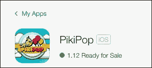

恭喜！您的游戏现在应该位于 App Store 中，供所有 iOS 设备用户下载和游玩！请确保查看 iTunes Connect 提供的各种分析工具，以保持对您游戏的关注。

# 更新您的游戏

今天的游戏几乎都不是一次性的交易。它们往往通过更新、附加内容和修复来保持活跃，甚至在发布之后也是如此。您的应用更新将适用于任何未来的 iOS 更新，增加新的游戏内容，或者两者兼而有之。为此，只需重复*构建字符串*阶段的大部分过程，从创建一个新的版本号开始。这样做将在**预发布**下的**构建**标签中创建一个新的部分，就像 PikiPop 自己的页面所示如下：

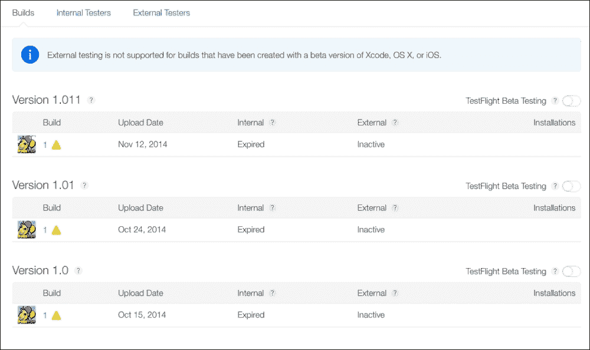

您可以使用 TestFlight 测试版测试来测试新构建的内部和外部测试者，就像您之前做的那样。为了准备好最新版本以供发布，请点击**版本**主标签上的**新版本**按钮，并在弹出窗口中提交最新版本的编号。

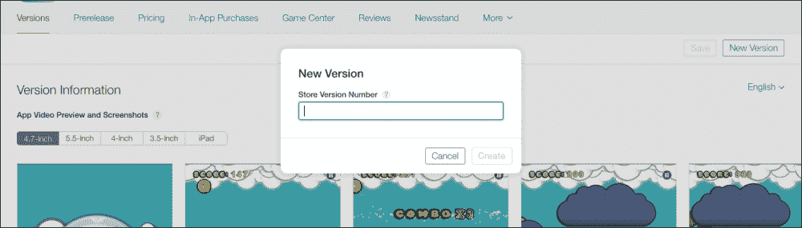

**版本**标签现在将通过易于导航的标签分为当前版本和新版本。就像在原始发布中一样，您可以填写各种元数据以及玩家将获得的新更新的信息。提交版本进行审核，一旦批准，最新的游戏更新将出现在应用商店，玩家将根据其设备的 App Store 更新设置自动下载或收到通知。

大概就是这样！如果 iOS 未来的版本中出现了更多的游戏框架和工具，您可以将它们作为您游戏更新的一部分。为游戏制作出更好的游戏始终是每个游戏开发者的正确选择。

# 摘要

在本章中，我们看到了将您的游戏从 Xcode 项目最终变成 iOS 设备上可玩的游戏所需的一切。我们学习了在提交到 iTunes Connect 之前设置 Xcode 项目所需的步骤。然后，我们了解了 TestFlight，这是一个在我们发布游戏之前进行测试的出色服务。我们看到这些步骤已经为我们提交游戏进行审核所需的大部分内容做好了准备。最后，我们看到了在 iTunes Connect 中创建应用更新是多么容易。

你现在有一个游戏应用，希望成千上万的玩家都能享受它。无论这个游戏是大是小，为玩家创造乐趣的事实本身就值得骄傲。即使是最简单的游戏也能是一项值得骄傲的成就。在这本书的整个过程中，我们都看到制作 iOS 游戏的过程，尽管比几年前容易，但仍需要一些努力和勤奋才能做好。这总结了我们将讨论的所有技术方面。接下来，我们将简要讨论 iOS 和整体游戏开发的未来。
