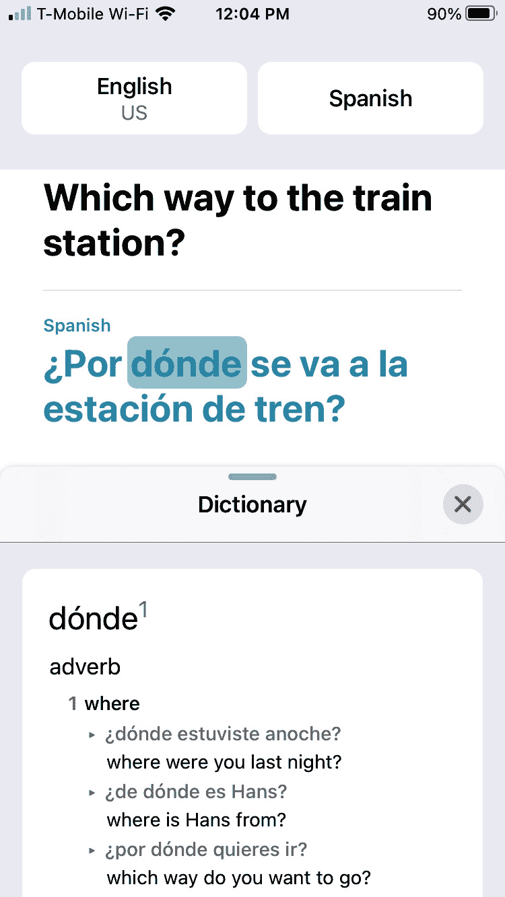

# *第二章*：使用新的 iOS 14 应用

2020 年，苹果推出了 iOS 14，这是 iPhone 的最新操作系统。除了添加新功能外，iOS 14 还包括了**翻译**和**放大镜**应用。翻译应用允许你将口语或书面文字转换为另一种语言，而**放大镜**应用允许你将 iPhone 摄像头变成放大镜，帮助你阅读可能太小而难以舒适阅读的文本。

通过学习如何使用这些新应用，以及使用 iOS 14 的新功能，你可以熟悉使用 iPhone 应用中常见的用户界面元素。由于大多数应用以类似的方式工作，你使用的应用越多，使用 iPhone 就越容易。

在上一章中，你学习了如何使用常见的手势来控制 iPhone 的不同功能。在本章中，你将通过实验 iOS 14 的最新功能来学习 iOS 的常见元素：

+   **放大镜**应用

+   **翻译**应用

+   **应用库**

# 使用放大镜应用

许多人阅读近距离文本有困难。这可能是由于远视或试图在低光照条件下阅读小字。如果你曾经忘记或丢失你的阅读眼镜，你可以使用你的 iPhone 上的**放大镜**应用，如图*图 2.1*所示：

图 2.1 – 放大镜应用

要启动**放大镜**应用，你需要使用两种不同的手势：滑动和点击。首先，你需要使用滑动手势在 iPhone 的不同主屏幕之间滚动，直到找到**放大镜**应用图标。一旦找到**放大镜**应用，你可以通过点击图标来启动它。一旦**放大镜**用户界面出现，你可以将 iPhone 摄像头对准你想要查看的文本或任何项目，如图*图 2.2*所示：

图 2.2 – 使用放大镜应用

**放大镜**应用由按钮和滑块组成。点击图标执行操作，而左右滑动滑块可以增加或减少值，例如亮度或放大倍数。让我们开始：

1.  为了节省空间，只显示缩放滑块。如果你想要显示亮度或对比度滑块，你需要点击**亮度**或**对比度**图标，如图*图 2.3*所示：

    图 2.3 – 缩放、亮度和对比度图标

1.  当你点击**亮度**或**对比度**图标时，会出现一个滑块，以便你可以调整亮度或对比度。在滑块上左右滑动会改变该选项，例如缩放、亮度或对比度。

1.  当你不再想看到亮度或对比度滑块时，再次点击**亮度**或**对比度**图标。（注意，默认情况下，缩放滑块始终可见。）

1.  如果您点击**颜色滤镜**图标，会出现不同颜色滤镜选项的列表，如图 2.4 所示：

    图 2.4 – 颜色滤镜图标

1.  要照亮一个物体，请点击如图 2.5 所示的**手电筒**图标。此**手电筒**图标在开启或关闭闪光灯之间切换，以照亮 iPhone 前方的区域：

    图 2.5 – 手电筒图标

1.  大多数应用都提供了一种自定义应用的方式，因此要在**放大镜**应用中这样做，请按如图 2.6 所示的**设置**图标：

    图 2.6 – 设置图标

1.  点击**设置**图标会显示**自定义控件**屏幕，该屏幕以列表形式显示选项。列表的两个常见功能是允许您删除项目或移动项目。

1.  要删除项目，您可以点击看起来像红色圆圈中白色短划线的**删除**图标。

1.  要移动一个项目，您可以在一个三线图标上向上或向下滑动，这个图标通常被称为“汉堡菜单”，因为它看起来像夹着肉饼的面包的顶部和底部，如图 2.7 所示：

图 2.7 – 自定义控件屏幕

当您完成**自定义控件**屏幕的操作后，请点击屏幕右上角的**完成**按钮。通过实验**放大镜**应用，您可以学习基本的手势和用户界面元素，这有助于您在短时间内学会使用几乎所有应用。

**放大镜**应用的一个独特功能是它允许您捕捉图像以查看或与他人分享。（然而，请注意，当您使用**放大镜**应用拍照时，该图片不会被保存，而是临时存储。）这使您可以捕捉图片并在方便时查看。捕捉和查看图像的两个按钮如图 2.8 所示：

图 2.8 – 捕获视图和查看按钮

点击**捕获视图**按钮会捕捉通过 iPhone 相机看到的任何内容。一旦捕捉到图像，您就可以在空闲时查看捕捉到的图像，而无需再将 iPhone 相机对准页面。**捕获视图**按钮变为**关闭**按钮，因此当您不再想查看捕捉的静态图像时，请点击**关闭**按钮，如图 2.9 所示：

图 2.9 – 捕获视图按钮变为关闭按钮

一旦捕捉到图像，您可以点击关闭按钮来删除该图像。然而，如果您捕捉到图像并希望暂时保存它，请点击**查看**按钮。这会将**捕获视图**按钮转换为**+**按钮以捕捉更多图像，同时显示带有暂时存储图像数量的**查看**按钮，如图*图 2.10*所示：

图 2.10 – 捕捉多张图像时按钮略有变化

如果您点击**+**按钮，您可以捕捉更多图像。如果您点击**查看**按钮，您可以查看之前捕捉到的图像。要删除之前捕捉到的图像，请点击左上角的**结束**按钮。

**放大镜**应用使您在握持 iPhone 时查看图像或捕捉您稍后可以查看的图像变得容易，这样您就不必将 iPhone 放在页面上方。

与大多数应用一样，**放大镜**应用使图标和按钮易于识别。为了了解另一个应用的工作方式，让我们看看新的**翻译**应用。

使用翻译应用

虽然有些人可能是多语言的，但大多数人对自己的母语非常了解，但可能不习惯流利地说另一种语言。这就是为什么苹果在 iOS 14 中包含了一个新的**翻译**应用。**翻译**应用的目的让您可以在一种语言中说话或输入单词，并看到和听到另一种语言的翻译。

目前，**翻译**应用可以翻译以下语言：

+   阿拉伯语

+   中文（普通话）

+   英语（美国和英国）

+   法语

+   德语

+   意大利语

+   日语

+   韩语

+   葡萄牙语

+   俄语

+   西班牙语

**翻译**应用如图*图 2.11*所示：

图 2.11 – 翻译应用

**翻译**应用根据您是否以竖屏或横屏模式握持 iPhone 显示两个不同的屏幕。竖屏模式旨在让您可以说话或输入文本进行翻译，如图*图 2.12*所示：

图 2.12 – 翻译应用在竖屏模式

横屏模式可以翻译对话，并让两个人都能舒适地查看屏幕，如图*图 2.13*所示：

图 2.13 – 翻译应用在横屏模式

要定义您希望**翻译**应用使用的语言，请以竖屏模式握持**翻译**应用。然后，点击屏幕顶部的两个语言按钮。当您点击语言按钮时，会出现支持的语言列表，如图*图 2.14*所示：

图 2.14 – 在翻译应用中选择语言

点击要使用的语言，然后点击屏幕右上角的**完成**按钮。通过这样做，对于输入和输出语言，你可以翻译成多种语言。

一旦你定义了要使用的两种语言，你现在可以使用文本或语音进行翻译。要翻译文本：

1.  点击**输入文本**框以显示虚拟键盘。

1.  输入你的文本，然后点击虚拟键盘右下角的**Go**按钮。

1.  **翻译**应用显示你的文本，以及你选择的语言的翻译，如图 *图 2.15* 所示：

图 2.15 – 翻译文本

要翻译语音，请点击**麦克风**按钮。**翻译**屏幕显示一个音频图像，以及显示**正在监听…**的文本，如图 *图 2.16* 所示：

图 2.16 – 捕获音频输入

说出你想要翻译的单词，然后说完后停止。几秒钟后，**翻译**应用将显示翻译后的文本，如图 *图 2.15* 所示）。清除按钮允许你通过一次点击删除文本字段中的所有文本。无论你是通过键入还是通过语音输入文本，你都会在翻译文本下方看到三个图标（**收藏**、**词典**和**播放**），如图 *图 2.17* 所示：

图 2.17 – 收藏、词典和播放图标

点击**收藏**图标将翻译文本存储在**收藏**类别中，你可以通过点击屏幕右下角的**收藏**图标随时查看。

点击**词典**图标显示**词典**面板。现在，你可以点击任何单词来查看其词典定义，如图 *图 2.18* 所示：

图 2.18 – 词典面板让你识别每个翻译单词的含义

当你不再想使用词典时，点击**词典**面板右上角的关闭图标（**X**）。

点击**播放**图标让你听到 Siri 大声说出翻译后的文本。这可以用来听翻译句子的正确发音，或者向另一个人播放翻译文本。

如果你通过点击**收藏**图标存储了任何翻译，或者你想查看最近翻译的列表，你可以点击屏幕右下角的**收藏**图标。这将打开**收藏**列表，如图 *图 2.19* 所示：

图 2.19 – 收藏图标显示所有标记为收藏的翻译以及最近的翻译

要取消将翻译标记为收藏，只需轻触翻译内容，然后轻触**收藏**图标来切换它开或关。

在竖屏模式下使用**翻译**应用在需要写作或阅读翻译时很有用。然而，当你想与不会说你的语言的人交谈时，使用**翻译**应用的横屏模式会更方便（见图*图 2.13*）：

1.  将 iPhone 保持竖屏方向，然后启动**翻译**应用，并轻触屏幕左上角的**你的语言**按钮。

1.  轻触屏幕右上角的**语言**按钮，选择对方所说的语言。

1.  将你的 iPhone 倾斜到横屏方向。如果需要，轻触屏幕底部的**翻译**按钮。屏幕将分成两半，以显示你的口语和翻译，如图*图 2.20*所示：

    图 2.20 – 在横屏方向显示文本及其翻译

1.  轻触屏幕左下角的按钮，该按钮显示指向相反方向的箭头。这样只会显示你的翻译文本，便于他人阅读，如图*图 2.21*所示：

    图 2.21 – 仅显示翻译文本

1.  轻触屏幕左下角的按钮（包含两个聊天图标），以返回查看原始文本和翻译文本并排显示。

作为向他人展示翻译文本的替代方法，你也可以轻触屏幕右下角的**播放**按钮，这样 Siri 就可以大声说出翻译文本。

通过使用**翻译**应用，你可以与可能不会说你的语言的人进行交流。这可以帮助你们双方以最小的挫败感表达自己的想法，多亏了 iPhone。

如果你打算经常使用**翻译**应用，你可能希望将它移动到主屏幕的一个显眼位置。为了找到应用的其他方法，考虑使用**应用库**，这是 iOS 14 中的另一个新功能。

# 使用应用库

虽然你可以在主屏幕上移动和分组相关的应用图标，但大多数人不会这样做，因为这很耗时。因此，将应用分散存储在主屏幕上，然后很难在特定时刻找到你想要的应用，这种情况更为常见。

为了减少这个问题，iOS 14 提供了**应用库**，当你多次在主屏幕上向左滑动时会出现。你需要向左滑动的次数取决于你的 iPhone 有多少个主屏幕。

**应用库**的目的是将所有应用自动组织成具有描述性目的的相关组，例如**社交**、**实用工具**、**生产力与金融**、**旅行**和**最近添加**。在某些情况下，一个应用可能出现在多个类别中，例如**翻译**应用出现在**最近添加**和**信息与阅读**组中，如图*Figure 2.22*所示：

![Figure 2.22 – 应用库]

![Figure 2.22_B14100.jpg]

Figure 2.22 – 应用库

通过滚动查看**应用库**分类列表，您可以找到并点击您想要使用的应用，例如**翻译**或**放大镜**应用。由于**应用库**隐藏了您最少使用的应用，您在**应用库**中不会看到所有可用的应用。

如果您想要的应用没有出现在**应用库**中，请点击屏幕顶部的**应用库**搜索字段以显示您 iPhone 上所有已安装应用的字母顺序列表，如图*Figure 2.23*所示：

![Figure 2.23 – 点击应用库搜索字段显示所有已安装应用的字母顺序列表]

![Figure 2.23_B14100.jpg]

Figure 2.23 – 点击应用库搜索字段显示所有已安装应用的字母顺序列表

您可以滚动查看这个字母顺序的应用列表，然后点击您想要使用的应用名称。作为一个更快的替代方案，您也可以点击右侧出现的索引。点击索引可以让您跳转到以某个字母开头的应用名称，例如**T**或**R**。

您也可以在**应用库**搜索字段中输入应用名称的全部或部分内容。每次您输入另一个字母，所有匹配的应用列表都会缩小，如图*Figure 2.24*所示：

![Figure 2.24 – 输入应用名称的一部分有助于应用库显示有限数量的应用]

![Figure 2.24_B14100.jpg]

Figure 2.24 – 输入应用名称的一部分有助于应用库显示有限数量的应用

当您看到您想要使用的应用时，只需点击该应用的图标。**应用库**为您提供了一种视觉和文本方式，以便在任何时候都能找到您想要使用的应用。

# 摘要

iOS 14 中的三个最新功能是**放大镜**应用、**翻译**应用和**应用库**。**放大镜**应用可以替代阅读眼镜或放大镜，帮助您阅读小字或仔细检查物品。

**翻译**应用可以帮助您与可能不会说您语言的人进行交流。只要您和对方都使用**翻译**应用支持的语言（例如德语、法语、阿拉伯语、俄语或英语）进行说话和阅读，您就能用您最舒适的语言进行聊天和书写。

最后，使用**应用库**来帮助你找到你想要使用的应用。随着时间的推移，你添加应用的速度会比你删除应用的速度快。最终结果是，你的主屏幕会变得杂乱无章，充满了你没有时间整理的大量应用。这时，你可以依赖**应用库**自动为你整理应用，或者通过搜索应用名称来帮助你找到应用。

对于许多人来说，当他们得到一部 iPhone 时，他们的第一个任务就是通过更改背景图片或选择不同的铃声来自定义它，这就是你将在下一章中学到的内容。
