# *第四章*: 打电话

iPhone 是音乐播放器、口袋电脑和移动电话的结合体，但作为一部手机出售，因此其基本目的是让您能够拨打电话。虽然拨打电话和接听电话听起来很简单，但在拨打电话和接听电话的过程中可能会有各种各样的变化。

例如，您可能想要举行一个电话会议，这样您就可以同时与多个人聊天。或者，在通话过程中，您可能会接到另一个电话，因此需要将一个人置于等待状态，以便您能够接听第二个电话。您也可能接到不再想听到的某些人的电话，因此您会拦截某些电话。此外，在等待时，您可能会被指示按下一个数字来选择一个选项。

如您所见，即使是看似简单直接的拨打电话和接听电话，其过程也可以从简单到复杂，这取决于您想要做什么。在本章中，您将学习在 iPhone 上拨打电话和接听电话的所有基础知识，以及您在通话时可能发现有用的附加功能。

本章我们将讨论以下主题：

+   拨打电话

+   接听电话

+   接听多个电话

+   拦截来电

+   拦截干扰

# 拨打电话

拨打电话最直接的方式是拨打完整的号码。例如，许多企业会在公共场合宣传他们的电话号码，以便人们可以打电话获取信息或购买产品或服务。

然而，在大多数情况下，很少有人会记住并输入任何人的完整电话号码。相反，将某人的电话号码存储一次，然后简单地点击该人的名字来拨打他们的电话号码，以便联系他们。

拨打电话的另一种方式是查看网页或短信中的电话号码。然后您可以简单地点击那个电话号码来拨打，而无需自己输入号码。由于有这么多不同的拨打电话的方式，您在如何使用 iPhone 拨打电话方面有很多选择。

## 输入完整的电话号码

有时您需要第一次给某人打电话，但您不需要存储电话号码以便将来再次拨打。在这种情况下，一次性输入该人的电话号码来拨打电话而不存储该电话号码以供将来使用会更简单。要通过输入完整的电话号码来拨打电话，请按照以下步骤操作：

1.  按主屏幕上的电话图标，如图*图 4.1*所示：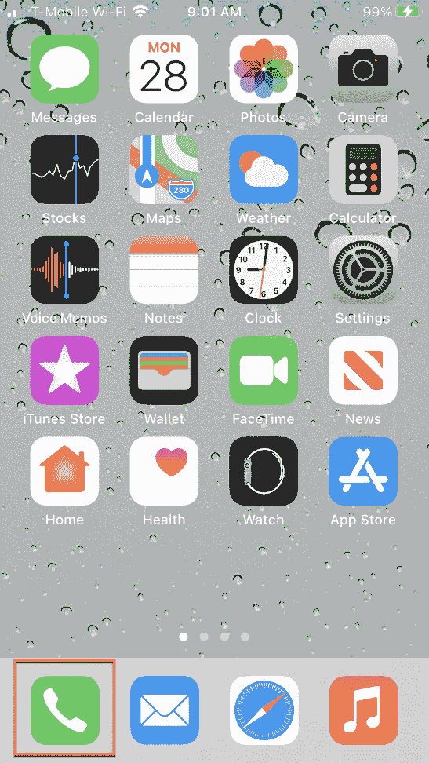

    图 4.1 – 主屏幕上的电话图标

1.  按屏幕底部的**键盘**按钮，如图*图 4.2*所示。键盘屏幕出现，显示电话键盘：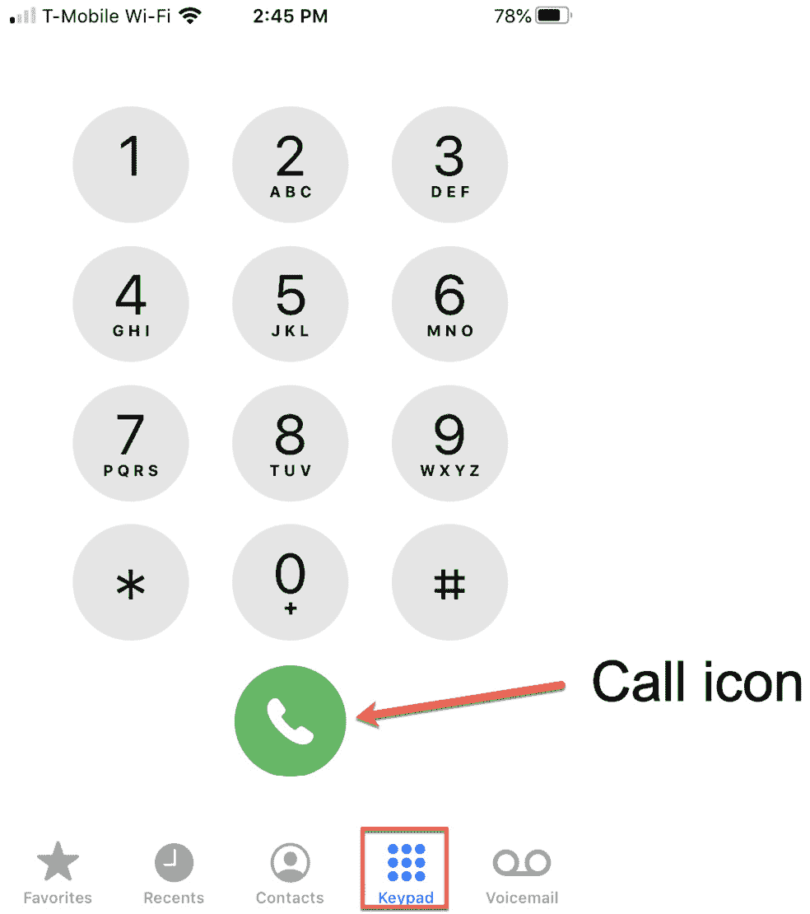

    图 4.2 – 键盘按钮

1.  轻触你想拨打的电话号码的数字（例如`1-800-555-1234`），然后轻触前面图中指示的绿色**呼叫图标**。按下绿色呼叫图标后，它将变成红色挂断图标，你可以轻触它来结束通话，如图 4.3 所示：

图 4.3 – 挂断图标

结束电话的第二种方式是按下 iPhone 侧面的睡眠/唤醒按钮，如图 4.4 所示：

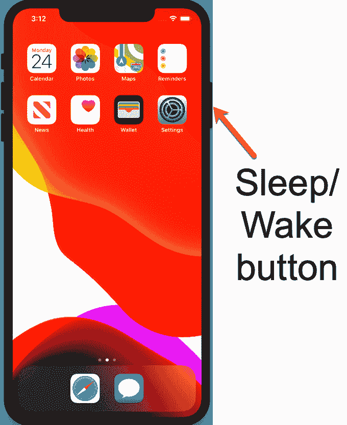

图 4.4 – 睡眠/唤醒按钮

对于你可能不常拨打的电话号码，输入整个电话号码可能就足够了，因为你不需要经常这样做。然而，如果该电话号码已经显示在屏幕上，就没有必要再次输入。

## 从屏幕上拨打电话号码

输入完整的电话号码可能会很繁琐且容易出错，因为如果你输入了错误的号码，你就无法联系到你期望的人。这就是为什么简单地轻触电话号码，让 iPhone 自动为你拨打该号码会更准确。

可以轻触和拨打电话号码的一些常见地方如下：

+   网站

+   邮件

+   短信

+   备注

要在网页、消息、笔记或任何其他应用中拨打屏幕上显示的电话号码，请按照以下步骤操作：

1.  轻触屏幕上你想拨打的号码。会出现一个不同的选项菜单，如图 4.5 所示。具体外观将根据你是在轻触网站上的电话号码、短信或笔记中的电话号码而有所不同：

    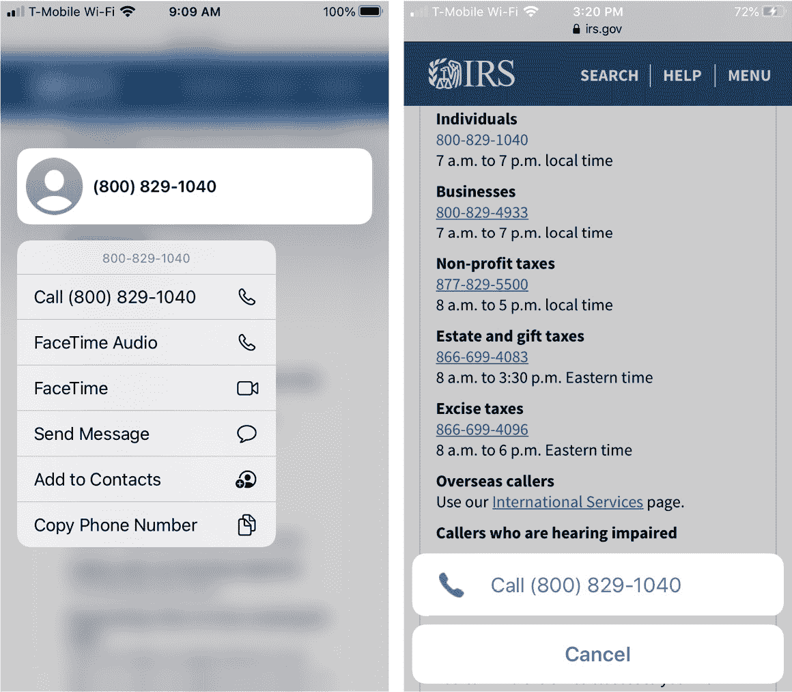

    图 4.5 – 在屏幕上轻触显示的电话号码后，会出现**呼叫**按钮

1.  轻触**呼叫**按钮。如果你轻触**呼叫**按钮，你的 iPhone 会为你拨打该号码。如果你不想拨打，可以在屏幕上远离菜单的任何地方轻触，使其消失，或者如果出现，轻触**取消**按钮。

在屏幕上拨打号码可能很方便，但不是你想打的每个号码都会显示在屏幕上。为了避免记住和输入多个电话号码，使用**联系人**应用存储电话号码会更容易得多。

## 从**联系人**应用存储和拨打号码

当你只需要拨打一个号码一次时，直接输入那个号码会更简单。然而，如果你知道将来还会再次拨打这个号码，将号码存储在**联系人**应用中会更方便。这样，当你再次想拨打这个人的电话时，你只需轻触他们的电话号码即可。

要将电话号码存储在**联系人**应用中，请按照以下步骤操作：

1.  在主屏幕上轻触电话应用。

1.  轻触屏幕底部的**联系人**图标，如图 4.6 所示。会出现当前存储在**联系人**应用中的名字列表：

    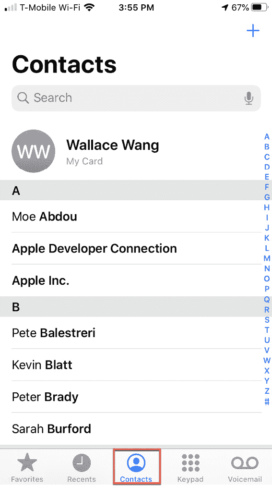

    图 4.6 – **联系人**图标

1.  点击屏幕右上角的**+**（添加）图标以显示新联系人屏幕。

1.  向下滚动并点击**+添加电话**按钮，如图 4.7 所示：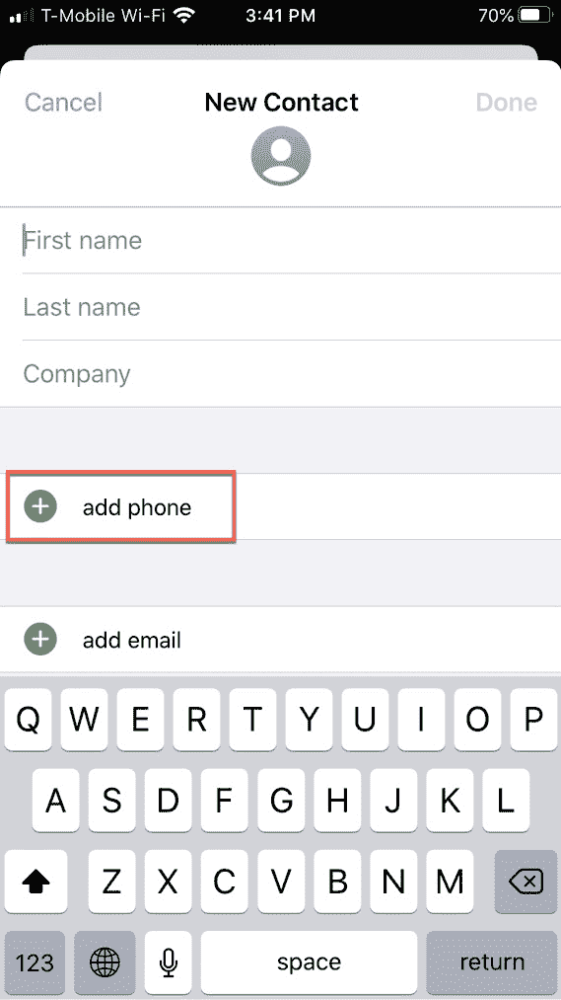

    图 4.7 – 新联系人屏幕上的添加电话按钮

1.  在那个人电话号码处点击，并在添加完任何其他联系信息（如姓名）后点击**完成**。

在你将某人的姓名和电话号码存储在**联系人**应用中后，你可以通过简单地点击该人的电话号码来拨打该人。要拨打存储在**联系人**应用中的号码，请按照以下步骤操作：

1.  点击主屏幕上的**联系人**图标。

1.  点击你想拨打电话的人的名字。

1.  点击图 4.8 所示的电话号码。

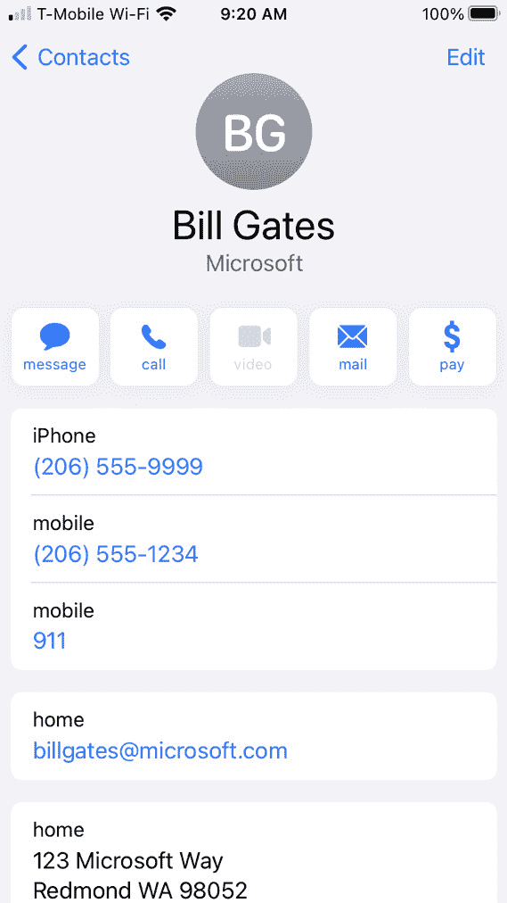

图 4.8 – 点击电话号码进行拨打

**联系人**应用可以方便地存储朋友、商业伙伴、亲戚以及生活中任何重要人物的电话号码。然而，你可能会在**联系人**应用中存储大量的电话号码，但只经常拨打其中的一小部分。为了更快地联系到经常通话的人，你可以将该人指定为收藏联系人。

## 拨打收藏联系人

每个人都有一个经常联系的小名单，可能包括配偶、男朋友/女朋友、家庭成员和商业伙伴。虽然你可以在**联系人**应用中不断查找那个人的电话号码，但将某些人指定为收藏联系人会更快。

将收藏列表视为存储在**联系人**应用中的姓名和电话号码的子集。通过创建收藏列表，你可以快速找到你最关心的人的姓名和电话号码。更好的是，如果某人有多位电话号码，你的收藏列表可以只存储最有可能联系到那个人的电话号码。

要创建收藏列表，请按照以下步骤操作：

1.  在主屏幕上点击“电话”应用。

1.  点击屏幕底部的**收藏**图标。

1.  点击屏幕左上角的**+**图标。**联系人**应用将列出所有存储的姓名。

1.  点击你想识别为收藏联系人的名字。会出现一个对话框，列出**消息**、**电话**或**邮件**，让你选择该人的联系信息用于短信、电话或电子邮件，如图 4.9 所示：

    图 4.9 – 选择要存储在收藏列表中的联系信息

1.  点击**拨打**。如果你选择的联系人有多位电话号码，你将能够选择你想要存储在收藏列表中的号码。

1.  点击一个电话号码。

一旦您在**收藏**列表中存储了一个或多个姓名和电话号码，您就可以通过查看您的**收藏**列表来随时拨打电话。

要从**收藏**列表中拨打电话，请按照以下步骤操作：

1.  点击主屏幕上的电话应用。

1.  点击屏幕底部的**收藏**图标。出现之前存储的收藏姓名列表。

1.  点击姓名以拨打该人。

将姓名和电话号码添加到您的收藏夹列表中可以帮助您找到并拨打您最常联系的人。然而，有时您可能没有在收藏夹列表中存储某人的姓名和电话号码。幸运的是，您总是可以通过查找最近通话者的列表来给任何人回电。

## 拨打最近通话者

每次您给某人打电话或从某人那里接电话时，您的 iPhone 都会记录下该人的姓名（如果您之前在**联系人**应用中存储了它）或电话号码。这个想法是，如果您最近与某人交谈过，您可能会想再次与那个人交谈。

电话应用为您提供查看**所有**或**未接**电话的选择。**未接**列表仅显示尝试给您打电话但您未能接听的人。**所有**列表显示您拨打的（黑色）和尝试给您打电话的人（红色），如图*图 4.10*所示：

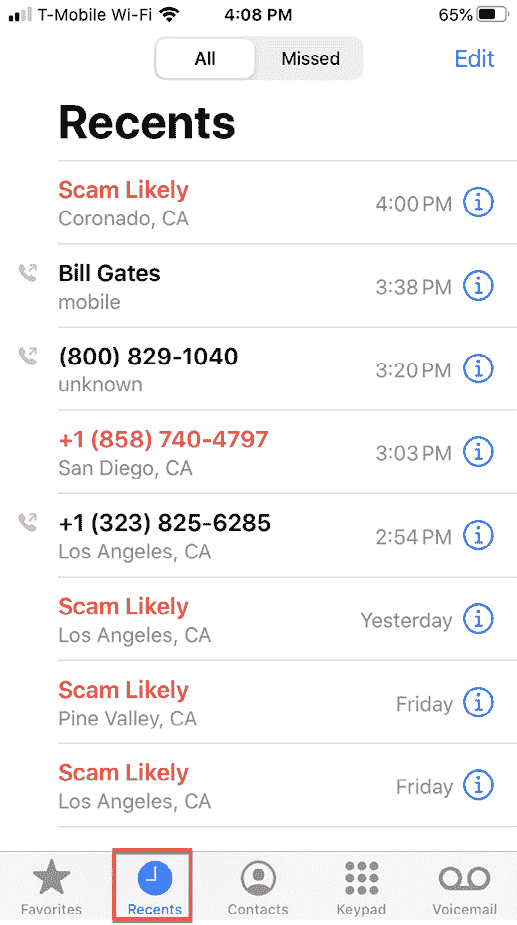

图 4.10 – 所有列表显示您拨打的和拨打您的人

这份最近通话列表在某人给您打电话而您想回电但未在您的 iPhone 上保存他们的电话号码时特别有用。

要拨打**最近**列表中存储的电话号码，请按照以下步骤操作：

1.  点击主屏幕上的电话应用。

1.  点击屏幕底部的**最近**图标。

1.  点击屏幕顶部的**所有**或**未接**标签页。

1.  点击一个姓名或电话号码进行拨打。

虽然您可以拨打其他人，但其他人也可能给您打电话。当有人打电话时，您可以选择接听或拒绝，因此您需要了解接收电话的选项。

# 接听电话

当您接到电话时，您的 iPhone 可以播放声音（称为铃声）和/或振动，以在您没有听到铃声的情况下提供额外的触觉反馈。当您接到电话时，您的 iPhone 将显示来电电话号码（或来电者的姓名，如果您之前在**联系人**应用中存储了该人的姓名和电话号码）。

如果您的 iPhone 当前处于锁定状态，您将看到一个要求您滑动以接听电话的屏幕，如图*图 4.11*所示：

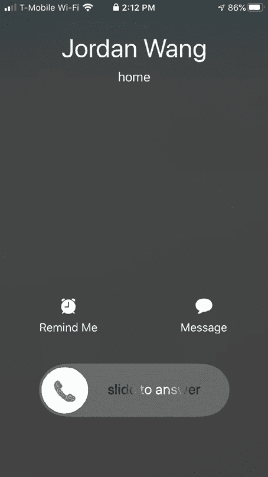

图 4.11 – 在锁定状态下的 iPhone 接听电话

如果您的 iPhone 已解锁且您接到电话，您将看到一个稍微不同的屏幕，该屏幕将为您提供接受或拒绝电话的选项，如图*图 4.12*所示：

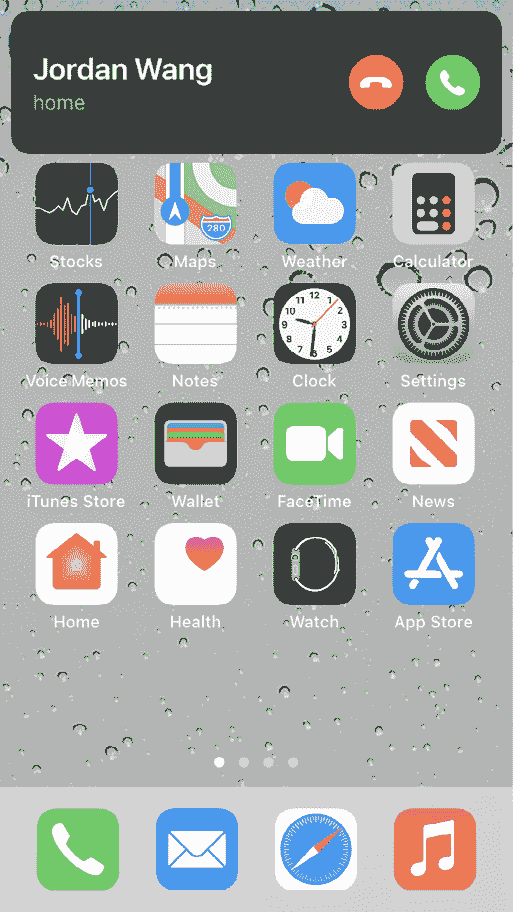

图 4.12 – 在未锁定的 iPhone 上接听电话

如果你轻触前一个图中除了红色或绿色按钮之外的任何地方，横幅会扩展以填充整个屏幕，如图*图 4.13*所示：

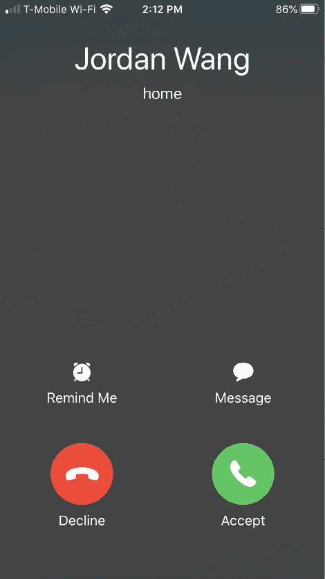

图 4.13 – 扩展的来电屏幕

要定义来电是以横幅或全屏显示，请按照以下步骤操作：

1.  在主屏幕上轻触**设置**图标。

1.  轻触**电话**。出现**电话**屏幕。

1.  轻触**来电**。出现一个屏幕，让你在**横幅**和**全屏**之间进行选择。

当你接电话时，你有几个选项：

+   接听电话（滑动接听或轻触绿色**接受**按钮）。

+   拒绝来电（轻触红色**拒绝**按钮）。

+   设置提醒回拨（轻触**提醒我**图标）。

+   向来电者发送预定义的消息（轻触**消息**图标）。

由于你可能会接到来自各种人的电话，现在花点时间定义你 iPhone 每次接电话时将发出的铃声和触觉反馈。

## 定义铃声和触觉反馈

当你接电话时，铃声会播放特定的声音。触觉反馈会让你的 iPhone 振动，让你知道有人来电。由于你可能不总是想在接电话时播放铃声（例如，当你在一个电影院里），你可以通过切换左侧出现的静音/响铃开关来打开或关闭 iPhone 的声音，如图*图 4.14*所示：

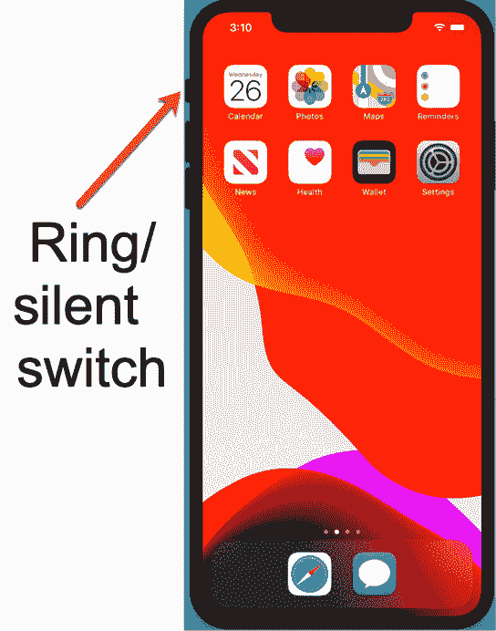

图 4.14 – iPhone 上的静音/响铃开关

要设置铃声和触觉反馈，请按照以下步骤操作：

1.  在主屏幕上轻触**设置**图标。

1.  轻触**声音与触觉**。出现**声音与触觉**屏幕。

1.  轻触**铃声**。出现**铃声**屏幕，让你在不同的铃声之间进行选择或访问**音调商店**，如图*图 4.15*所示：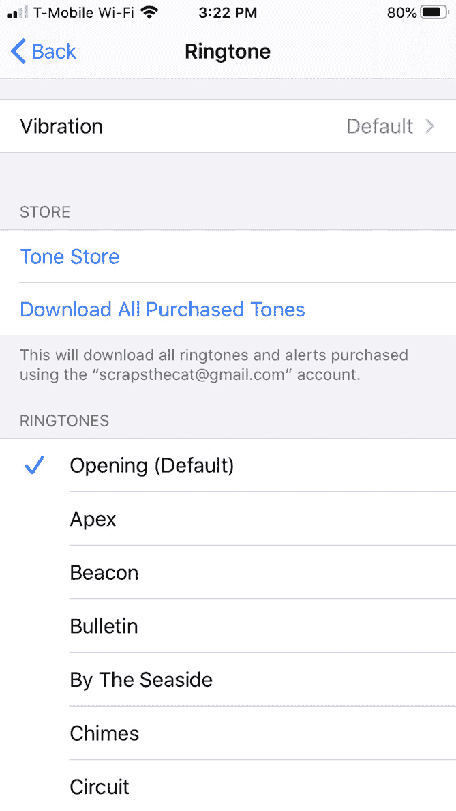

    图 4.15 – 从铃声屏幕中选择铃声

1.  轻触你想要使用的铃声，例如**信标**或**钟声**。

1.  轻触**振动**。出现**振动**屏幕，让你在接电话时从不同的触觉反馈选项中进行选择，如图*图 4.16*所示：

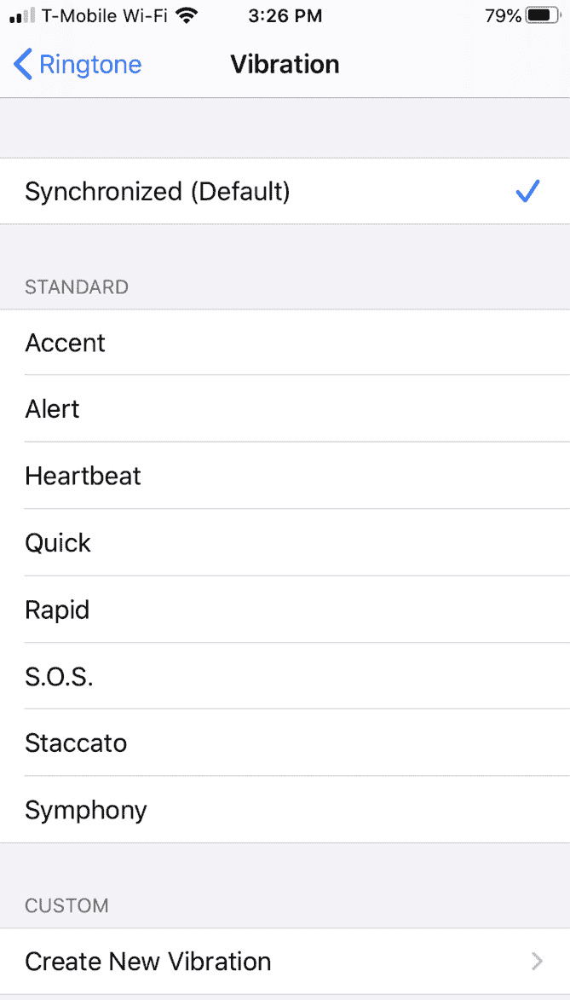

图 4.16 – 接听电话时选择触觉反馈振动模式

一旦你定义了接电话时选择的触觉反馈，你可能想花时间指定你是否还希望你的 iPhone 播放铃声或保持静音。此外，你还可以调整铃声的音量，使其更响或更轻。

要定义是否在静音时或离开当前位置时包含触觉反馈以及 iPhone 静音时，请按照以下步骤操作：

1.  点击主屏幕上的**设置**图标。

1.  点击**声音与触觉**。出现**声音与触觉**屏幕，让你切换**响铃时振动**和**静音时振动**开关，如图*4.17*所示：![Figure 4.17 – 为铃声或静音模式开启或关闭触觉反馈

    ![img/Figure_4.17_B14100.jpg]

    图 4.17 – 为铃声或静音模式开启或关闭触觉反馈

1.  点击**响铃时振动**和**静音时振动**开关来开启或关闭触觉反馈。

1.  拖动音量滑块以调整所选铃声的音量。

1.  点击**使用按钮更改**开关，允许你使用 iPhone 侧面的音量按钮调整铃声的音量。如果此开关关闭，则铃声的音量将由*步骤 4*中的滑块位置定义。

定义铃声、音量和触觉反馈可以很好地通知你来电。然而，如果你接到一个重要电话但当时无法接听，你有两个选择：

+   创建一个提醒给自己。

+   向来电发送预定义的消息。

## 创建回拨电话的提醒

当有人来电而你无法立即接听电话，但又不想忘记这个重要来电时，请设置一个提醒。提醒只是简单地显示一个笔记，提醒你回拨错过的电话。

你可以通过两种方式创建提醒。首先，你可以创建一个提醒，当你离开当前位置时，它会立即出现在你的 iPhone 屏幕上。其次，你可以创建一个提醒，一小时后出现。在两种情况下，提醒可以帮助你回拨重要的电话。

要在无法接听电话时创建提醒，请按照以下步骤操作：

1.  等到你接到电话（见*图 4.11*和*图 4.13*）。

1.  点击**提醒我**图标。出现一个对话框，让你选择在离开当前位置时或一小时后提醒你回拨电话，如图*4.18*所示：![Figure 4.18 – 定义回拨电话的提醒

    ![img/Figure_4.18_B14100.jpg]

    图 4.18 – 定义回拨电话的提醒

1.  点击**离开时**或**1 小时后**。两种方法都会在**提醒事项**应用中存储一个提醒，如图*4.19*所示：

![Figure 4.19 – 在提醒事项应用中查看回拨提醒

![img/Figure_4.19_B14100.jpg]

图 4.19 – 在提醒事项应用中查看回拨提醒

当你离开当前位置或等待一小时，根据你的选择，你的主屏幕上会出现一个提醒，让你回拨之前给你打电话的人。此时，你可以打开**提醒事项**应用，点击绿色的电话图标回拨那个人。

提醒对于立即处理电话很有用。然而，提醒并不能让你的来电者知道你打算回电。这就是为什么你可以准备预定义的消息，你可以立即发送给某人，让来电者知道你将尽快回电。

## 创建回电消息

当有人来电并且你设置了提醒时，你的来电者并不知道你何时甚至是否会回电。为了解决这个问题，花些时间设置一个预定义的消息。现在当有重要的人来电时，你可以发送这个预定义的消息，让他们知道你已经收到了他们的来电，但当时无法回答，并且你将尽快回电。

向来电者发送消息的第一步是创建消息。然后你可以选择你想发送的回复。

要创建发送给来电者的消息，请按照以下步骤操作：

1.  在主屏幕上点击**设置**图标。

1.  点击**电话**。**电话**屏幕出现，如图 *图 4.20* 所示：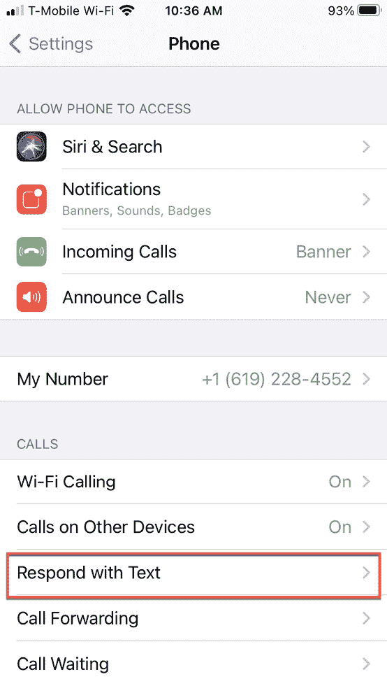

    图 4.20 – 电话屏幕上的回复文本选项

1.  点击**回复文本**。出现一个**回复文本**屏幕，列出了你可以选择的几个回复，如图 *图 4.21* 所示。你可以使用默认回复或自己编写：

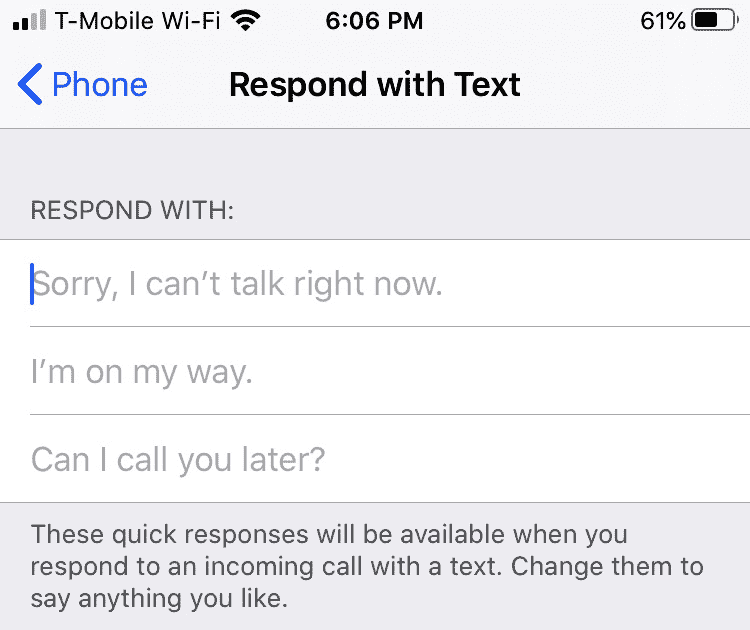

图 4.21 – 查看和编辑预定义的回复

无论你是否定义了自己的消息或只想使用默认消息，你都可以将它们设置为发送给来电者，让他们知道你现在无法使用，但会尽快回电。

要在接听电话时发送消息，请按照以下步骤操作：

1.  等待你接到电话（参见 *图 4.11* 和 *图 4.13*）。

1.  点击**消息**图标。出现一个对话框，让你选择要发送的消息，如图 *图 4.22* 所示：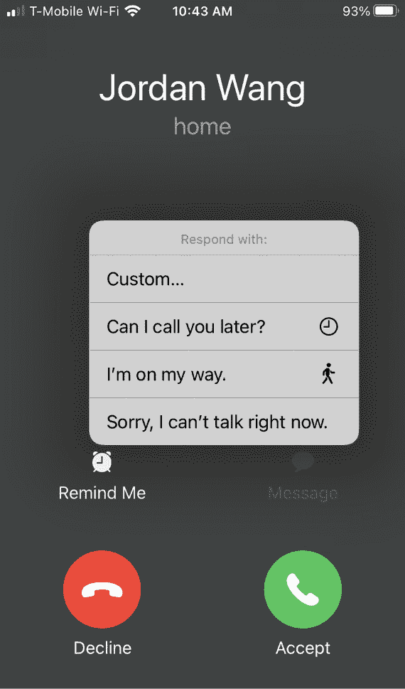

    图 4.22 – 选择发送给来电者的信息

1.  点击你想发送的消息或选择**自定义**来输入要发送的消息。

通过使用提醒和消息，你可以尽快回重要的电话。在某些情况下，当你正在与一个人交谈时，另一个电话进来，你必须立即接听。与其回拨那个人，你可能会选择在保持第一个电话的同时接听第二个电话。

# 接听多个电话

如果你正在与某人交谈，并且另一个重要的电话进来，你可能想保持两个电话都在线。为此，iPhone 为你提供了两个选项。首先，你可以暂时将第一个来电者置于等待状态，同时与第二个来电者交谈。当你完成第二个电话后，你可以返回第一个来电者。

其次，你可以进行多方通话，这样多人可以同时交谈。

当你想一次只与一个人交谈时，将人们置于保持状态可能很有用。当你想一群人互相交谈时，电话会议很有用。

要创建电话会议或将当前来电者置于保持状态，以便你可以与第二个人交谈，请按照以下步骤操作：

1.  给其他人打电话或接听电话。当你已经连接到另一个人时，第二个人打电话给你，你的 iPhone 会给你提供选项来保持或结束当前通话，或者切换到第二个来电者，如图*图 4.23*所示：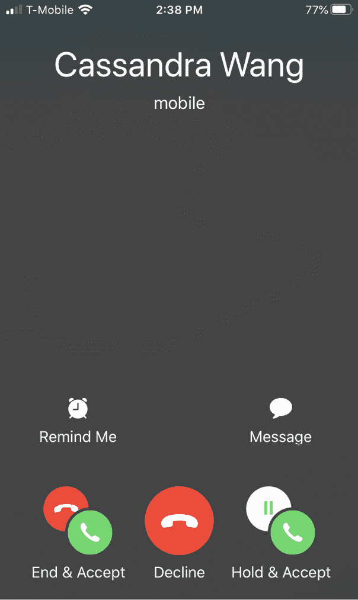

    图 4.23 – 在另一个通话中接收第二个电话

1.  点击**保持并接听**。这将让你在跟第二个来电者通话时，将当前来电者置于保持状态。

1.  点击**合并通话**以创建一个电话会议（或点击**交换**与另一个人交谈），如图*图 4.24*所示：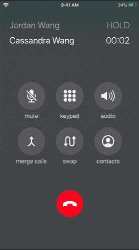

    图 4.24 – 选择合并或交换来电

1.  当你想断开通话时，点击红色的挂断按钮。

在大多数情况下，你会在你的 iPhone 上愉快地接听电话。不幸的是，许多骗子、推销员和普通讨厌的人可能会尝试给你打电话。虽然你可以忽略这些电话，但他们可能会定期不断地打电话。当这种情况发生时，你可能想考虑永久阻止这些来电者。

# 阻止来电

很可能你会接到你不想交谈的人的电话，要么是因为你不再喜欢他们，要么是因为他们是来自你不认识的人的不请自来的电话。

当你接到电话时，如果你在**联系人**应用中添加了该电话号码和来电者的姓名，来电者的姓名会显示在屏幕上。如果你没有在**联系人**应用中添加电话号码和来电者的姓名，则只显示来电者的电话号码。

一旦你接到某个人的电话，你可以阻止该电话号码。要阻止通话，请按照以下步骤操作：

1.  点击主屏幕上的电话图标。

1.  点击屏幕底部的**最近**图标。会出现一个最近通话的列表，每个通话的右侧都有一个显示**i**的圆形图标，如图*图 4.25*所示：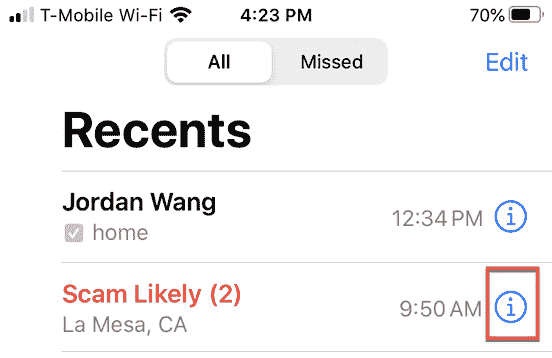

    图 4.25 – 每个接收到的通话旁边都显示信息图标

1.  点击要阻止的来电者右侧出现的圆形图标中的**i**。会出现一个新屏幕，列出有关来电者的详细信息，例如他们的电话号码和通话时间。

1.  滚动此屏幕，直到找到底部的**阻止此来电者**选项，如图*图 4.26*所示：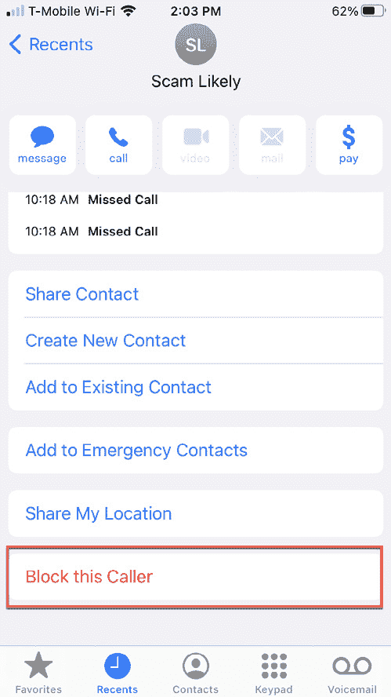

    图 4.26 – 阻止此来电者选项

1.  点击**阻止此来电者**。

一旦你阻止了一个来电，那个人可以一直给你打电话，但他们永远不会因为电话铃声或再次出现在你的 iPhone 上而打扰你。你可以随意阻止任何你喜欢的来电者，包括你不再想交谈的人，或者你一开始就根本不想交谈的陌生人。

有时你可能需要停止阻止特定的电话号码，例如现在你愿意再次交谈的人的电话号码。要取消阻止之前已阻止的电话号码，请按照以下步骤操作：

1.  点击主屏幕上的**设置**图标。

1.  点击**电话**图标，并向下滚动到屏幕底部，如图*图 4.27*所示：![图 4.27 – 电话屏幕上的阻止联系人选项

    ![img/Figure_4.27_B14100.jpg]

    图 4.27 – 电话屏幕上的阻止**联系人**选项

1.  点击**阻止联系人**。会出现一个列出阻止电话号码的列表。

1.  点击你想要取消阻止的电话号码。会出现一个屏幕，列出各种选项，包括**添加到现有联系人**。

1.  点击**添加到现有联系人**将阻止的电话号码添加到你的**联系人**应用中。

在阻止来电者后，定期查看你的阻止呼叫列表，以确保你没有意外阻止了一个未知但有效的来电者。这样你可以确保你只接听你认识的人的电话。

# 阻断干扰

有时你可能想要为不想 iPhone 响铃或显示警报或通知的时间设置时间。当你想要一点宁静和安静时，你可以开启**勿扰**功能。要开启此功能，请按照以下步骤操作：

1.  点击主屏幕上的**设置**图标。

1.  点击**勿扰**图标。**勿扰**屏幕会像*图 4.28*所示那样出现：![图 4.28 – 勿扰屏幕

    ![img/Figure_4.28_B14100.jpg]

    图 4.28 – 勿扰屏幕

1.  点击**勿扰**开关来开启或关闭它。当勿扰开启时，一个新月图标会出现在屏幕右上角。

另一种切换勿扰开启或关闭的方法是打开控制中心（在带 Home 按钮的 iPhone 上从底部向上滑动，或在无 Home 按钮的 iPhone 上从右上角向下滑动）。然后点击*图 4.29*中显示的勿扰图标：

![图 4.29 – 控制中心屏幕上的勿扰图标

![img/Figure_4.29_B14100.jpg]

图 4.29 – 控制中心屏幕上的勿扰图标

最后，如果有人来电而你想要静音铃声，请按锁屏按钮。记住，你可以控制何时接受和拒绝电话和通知。

# 摘要

iPhone 的主要目的是打电话和接电话。打电话和接电话相当直接，但还有一些你可能想要使用的附加选项，例如创建会议电话、将某人置于等待状态或在使用自动服务时通过键盘选择不同的选项。

为了帮助识别来电者，最好在**联系人**应用中存储他们的姓名和电话号码。这样，当他们在打电话时，他们的名字就会出现在 iPhone 屏幕上，你再也不用猜测了。

由于你可能会接到不想要的电话，确保你知道如何阻止和解除阻止来电者。你永远无法阻止所有不想要的电话，但通过阻止某些电话号码，你可以确保不想要的来电者不能再打扰你了。

打电话和接电话是 iPhone 的主要用途之一。然而，还有其他沟通方式，例如短信，许多人使用短信的频率与通话一样高，所以我们将在下一章中介绍这一点。
