# *第六章*：使用 Siri

大多数人都熟悉使用 iPhone 或类似智能手机的触摸屏界面。虽然点击、滑动和捏合屏幕可以成为控制 iPhone 的有效方式，但更革命性的界面是使用你的声音。

Siri 代表了完全依赖语音命令的新用户界面。只需简单地对 Siri 说话，你就可以控制 iPhone 的许多功能，从打电话、安排事件到搜索互联网和更改设置。有了 Siri，你只需用声音就可以控制你的 iPhone。

只需记住，尽管 Siri 可以理解和回应各种语音命令，但它仍然不是完美的。有时在跟 Siri 说话时，你可能需要用不同的词语或改变词语的顺序来重新措辞你的命令。

本章我们将讨论以下主题：

+   设置 Siri

+   向 Siri 下达命令

+   向 Siri 提问

+   使用 Siri 进行语音输入

# 设置 Siri

你可以在获得新 iPhone 后立即开始与 Siri 交谈。然而，你可能想要花点时间自定义 Siri 的设置，以便 Siri 按照你的意愿行事。

自定义 Siri 的第一种方式是定义如何首先启动 Siri。启动 Siri 的常见方式有以下三种：

+   按下 Home 键（适用于那些具有物理 Home 键的 iPhone 型号）。

+   大声说出“嘿，Siri”。

+   按下侧边按钮（适用于没有 Home 键的新款 iPhone 型号）。

另一种自定义 Siri 的方式是定义声音和语言。你可以根据你的特定语言选择男声或女声，以及不同类型的口音。例如，英语使用者可以选择美国、英国或印度口音等几种选项。

你选择的语言将是你更喜欢说话和听到的语言。无论你选择哪种语言，你都会有地区选项。例如，法语使用者可以在法国、加拿大或比利时地区之间进行选择，因为每个地区倾向于以略微不同的方式说出单词。

要自定义 Siri，请按照以下步骤操作：

1.  在主屏幕上点击**设置**图标。

1.  点击**Siri & 搜索**。**Siri & 搜索**屏幕出现，如图*图 6.1*所示：

    图 6.1 – Siri & 搜索屏幕

1.  点击**听“嘿，Siri”**开关以开启或关闭此选项。

1.  点击**按侧边按钮启动 Siri**或**按 Home 键启动 Siri**开关以开启或关闭此选项。

1.  如果你希望即使在 iPhone 锁定的情况下也能与 Siri 交谈（如果你选择此选项，你还需要输入密码以验证你想要开启或关闭此选项）的话，请点击**允许锁定时使用 Siri**开关。

1.  点击**语言**。**语言**屏幕出现，如图*图 6.2*所示：

    图 6.2 – 选择 Siri 语言的界面

1.  点击你偏好的特定语言，例如**英语（印度）**或**英语（英国）**。然后，点击屏幕左上角的**Siri & Search**按钮返回到**Siri & Search**界面。

1.  点击**Siri 语音**。将出现**Siri 语音**界面，如图*图 6.3*所示：![图 6.3 – 选择 Siri 语音个性的 Siri 语音界面

    ![img/Figure_6.03_B14100.jpg]

    图 6.3 – 选择 Siri 语音个性的 Siri 语音界面

1.  点击语调和性别（**男性**或**女性**）。然后，如果你想对 Siri 进行任何其他更改，请点击屏幕左上角的**Siri & Search**按钮返回到**Siri & Search**界面。

随意尝试不同的 Siri 选项，直到找到你最喜欢的。例如，尝试使用男性或女性声音的 Siri，看看哪一个你更喜欢。即使你住在特定的地区，也尝试将 Siri 改为使用另一个地区的口音。这可能会使 Siri 的声音对你来说更加悦耳。

一旦你设置了 Siri，你可以在任何时候返回并更改选项。第一步是尝试以你定义的所有不同方式启动 Siri，例如按侧边按钮或 Home 按钮，或者说出“嘿，Siri”。

记住，Siri 需要连接到蜂窝电话网络或 Wi-Fi 网络。这是因为 Siri 需要将数据发送回苹果的服务器以处理请求，然后将答案发送回你的 iPhone。如果你无法访问蜂窝电话或 Wi-Fi 网络，Siri 可能根本无法工作。

# 向 Siri 提问

使用 Siri 最简单的方法之一是获取你可能向朋友询问的信息，例如查找当前的天气预报，获取关于某个地点的历史或地理信息，或者了解关于热门电影的趣事。

虽然 Siri 可以理解语音命令，但它可能不会总是直接给出答案。相反，Siri 可能会只是指向一个网站，你可以在那里找到你想要的答案。例如，向 Siri 提问“马克·吐温写了多少本书？”然后，Siri 在屏幕上显示一个答案，并提供一个选项，点击 Safari 图标可以查看包含答案的网页，如图*图 6.4*所示：

![图 6.4 – Siri 可能会显示你可以找到答案的网站

![img/Figure_6.04_B14100.jpg]

图 6.4 – Siri 可能会显示你可以找到答案的网站

要向 Siri 提问，请按照以下步骤操作：

1.  按照你定义的方式启动 Siri，例如按侧边按钮或 Home 按钮，或者说出“嘿，Siri”。Siri 图标将出现在屏幕底部，如图*图 6.5*所示：![图 6.5 – 等待你说话的 Siri 界面

    ![img/Figure_6.05_B14100.jpg]

    图 6.5 – 等待你说话的 Siri 界面

1.  提出一个问题。当你完成提问后，保持沉默，这样 Siri 就会知道你已经完成。片刻之后，Siri 将给出答案。

向 Siri 提问很有趣，但您也可以将 Siri 用作助手来帮助您完成特定任务。

# 向 Siri 下达命令

当您向 Siri 提问时，Siri 可能知道如何回答，也可能不知道。与其提出涵盖各种主题的问题，不如使用 Siri 来节省时间。与其亲自执行特定任务，不如告诉 Siri 要做什么。Siri 在执行常见任务方面不仅更加准确，而且依赖 Siri 还可以节省您在多个屏幕上点击以执行设置约会或闹钟等常见任务的时间。

Siri 可以执行的一些不同任务包括以下内容：

+   获取当前时间

+   获取当前天气

+   翻译单词和短语

+   设置、编辑和删除闹钟

+   设置计时器

+   设置提醒

+   设置约会

+   获取路线

+   发送和接收短信

+   打电话

+   打开应用

+   跟踪您上方的航班

让我们看看我们如何让 Siri 执行这些任务。

## 获取当前时间

Siri 可以执行的最简单任务之一是获取时间。您只需询问时间，例如说“嘿，Siri，现在几点？”这将返回您当前位置的时间。

另一个选项是询问另一个城市的时间，以防您想知道在那个城市是否可以打电话给住在不同时区的人。在这种情况下，您可能会说，“嘿，Siri，柏林现在几点？”

如果您没有指定位置，Siri 会假设您想要知道您当前位置的时间。因此，如果您想知道另一个位置的时间，请确保您指定了该位置。

通常最好指定一个特定的城市，而不是国家，因为一个国家可能被划分为不同的时区。通过指定一个特定的城市，您可以帮助 Siri 将其答案缩小到特定的时区。

要询问当前时间，请按照以下步骤操作：

1.  启动 Siri（通过按侧键或说“嘿，Siri”）。

1.  询问“现在几点？”或“______（说出一个城市名）现在几点？”Siri 会显示时间，如图*图 6.6*所示。请注意，Siri 还会显示另一个城市的时间可能比您当前时间早或晚多少小时，例如+9 小时：

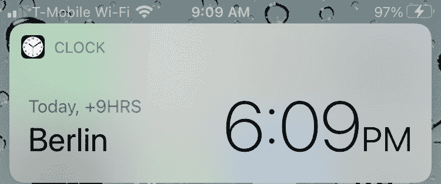

图 6.6 – 向 Siri 询问另一个城市的时间

知道您当前位置或另一个位置的时间可能很有用，但您可能还想了解天气，尤其是如果您计划不久后去另一个城市旅行。

## 获取当前天气

如果您想给那个地区的人打电话并确保他们醒着，知道另一个城市的时间可能很有用。对于计划访问另一个城市的旅行者来说，知道天气以便适当着装可能很有用。

要询问天气，只需使用常见的天气相关术语，例如“温度”、“热”、“冷”或“雨”，或者只说“天气”。

接下来，你可以提及你想要获取天气信息的日期或时间，例如“今天”、“明天”、“下周”、“早上”或“今晚”。

如果你没有指定城市，Siri 会假设你想要该地区的天气预报。否则，提及该地区的特定城市。

要获取天气信息，请按照以下步骤操作：

1.  启动 Siri（通过按侧边按钮或说“嘿 Siri”）。

1.  使用与天气相关的术语（例如“有多热？”），时间（例如“今晚”）和地点（例如“在东京”）来提问。Siri 会像*图 6.7*所示那样提供天气预报：

图 6.7 – 向 Siri 询问天气信息

如果你计划不久后去世界的其他地方旅行，了解那里的天气可能很有用。如果该地区使用不同的语言，你也可能想知道常用的单词或短语。

## 翻译单词和短语

学习一门外语可能很困难，所以你可能想依赖 Siri 来帮助你学习某些单词和短语。通过使用你的 iPhone 和 Siri 作为翻译器，你将能够与世界其他地区的人进行交流，以获取你需要的信息，而不必 necessarily 在另一种语言中流利。

只需向 Siri 询问你想翻译的单词或短语以及你想要的语言，例如“嘿 Siri，hotel 在法语中是什么？”或者“俄语中怎么说出租车？”

当 Siri 回答时，你会看到一个书面翻译，同时听到 Siri 用你选择的正确外语发音单词或短语。

要将单词或短语翻译成另一种语言，请按照以下步骤操作：

1.  启动 Siri（通过按侧边按钮或说“嘿 Siri”）。

1.  提问并指定你想要翻译的单词或短语以及你想要的语言。Siri 会像*图 6.8*所示那样提供翻译。你可以点击播放按钮再次听到 Siri 用你选择的外语发音单词或短语：

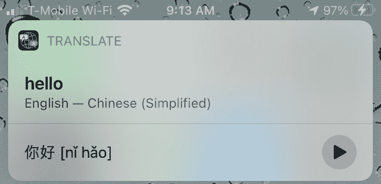

图 6.8 – 向 Siri 翻译语言

无论你在世界的哪个角落，你可能都需要跟踪时间，比如知道什么时候赶飞机或什么时候到达约会地点。为了帮助你跟踪时间，让 Siri 为你设置闹钟和计时器。

## 设置、编辑和删除闹钟

通常，你可以通过时钟应用手动设置、编辑和删除闹钟。然而，执行这些任务需要几个步骤，所以你可能觉得让 Siri 为你做这些工作要容易得多。

闹钟可以在特定时间提醒你。如果你需要早上早起，你可能需要设置一个闹钟在早上 5 点钟叫醒你。

要设置闹钟，指定提醒的时间并提及“闹钟”或“叫醒我”。你也可以指定一个日期或时间，例如“一小时后叫醒我”或“每周六早上 8:00 设置闹钟”。

要设置闹钟，请按照以下步骤操作：

1.  启动 Siri（通过按侧边按钮或说“嘿，Siri”）。

1.  提及“闹钟”或“叫醒我”，然后是时间，例如晚上 9:30 或现在起 2 小时。可选地提及你希望它在特定的一天发生，例如“星期一”。Siri 会显示闹钟，以便你可以验证其准确性，如图*图 6.9*所示：

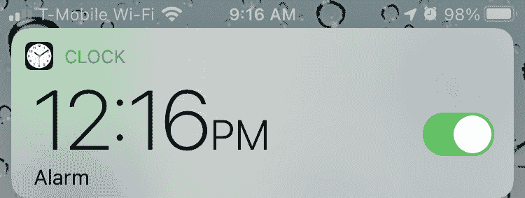

图 6.9 – Siri 显示它设置的闹钟

一旦你设置了闹钟，你可能后来想要编辑该闹钟。要修改现有的闹钟，你需要告诉 Siri 闹钟的时间，然后指定新的时间和/或日期，例如“将我的 1:45 闹钟改为 2:15”。

与编辑闹钟的时间不同，你也可以通过说“打开/关闭”然后是闹钟的时间，例如“下午 2:00 闹钟”，来关闭（或打开）闹钟。

要编辑现有的闹钟，请按照以下步骤操作：

1.  启动 Siri（通过按侧边按钮或说“嘿，Siri”）。

1.  说明你想要编辑的闹钟时间（例如“更改我的 1:30 闹钟”），然后是新时间。Siri 会口头确认你的更改，并显示新的闹钟时间。

有时候，你可能创建了一个闹钟，后来又决定不再需要它。一个选择是关闭或禁用闹钟。另一个选择是彻底删除闹钟。

要删除或禁用闹钟，请按照以下步骤操作：

1.  启动 Siri（通过按侧边按钮或说“嘿，Siri”）。

1.  说明你想要编辑的闹钟时间（例如“我的 1:30 闹钟”），在“关闭”、“禁用”或“删除”之前，这将变为“关闭/禁用/删除我的 1:30 闹钟”。Siri 会确认你的更改。

当你需要在一个特定时间被提醒，比如下午 1:30 时，闹钟会很有用。为了在时间流逝时以另一种方式提醒你，可以通过 Siri 设置一个计时器。

## 设置计时器

虽然闹钟在特定时间提醒你时很有用，但你可能也想设置一个计时器，以便在经过特定时间后提醒你，例如 5 或 10 分钟。通过设置闹钟和计时器，你可以确保你永远不会错过会议或再次煮过头食物。

要设置计时器，说“设置计时器”或“开始计时器”，然后是你想要的时间，例如 10 分钟。一旦计时器开始，你也可以使用 Siri 通过短语如“暂停计时器”或“恢复计时器”来暂停、检查、停止或恢复计时器。

要设置计时器，请按照以下步骤操作：

1.  启动 Siri（通过按侧边按钮或说“嘿，Siri”）。

1.  说明你想要开始或设置一个计时器，然后是时长，例如 20 分钟。Siri 会显示你的计时器信息，并在倒计时过程中显示，如图*图 6.10*所示：

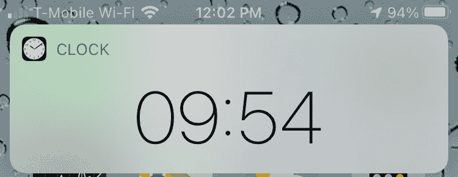

图 6.10 – 通过 Siri 设置计时器

您可以使用计时器来测量一段时间，例如煮鸡蛋或进行锻炼的时间。与计时器类似的是提醒，当您想要在未来某个时间点被通知某个事件时，它们会更有用，比如从现在起一天、一周或一个月后。

## 设置提醒

当您得知即将发生的事件时，立即创建一个提醒。提醒会在您的 iPhone 屏幕上弹出，提醒您特定事件，例如在特定时间打电话给某人。提醒类似于闹钟，但闹钟与特定时间（如凌晨 12:10）相关联，而提醒可以与未来的日期相关联，例如两天后或下周。

要使用 Siri 创建提醒，只需使用“提醒”一词后跟事件和时间，例如“下周”、“5 月 12 日”或“1 小时后”。由于您的 iPhone 可以跟踪您的位置，您还可以创建一个在您到达工作地点或家时发生的提醒。

要设置提醒，请按照以下步骤操作：

1.  启动 Siri（通过按侧边按钮或说“嘿，Siri”）。

1.  通过使用“提醒”一词后跟事件和时间（例如“明天”）来指定您想要设置提醒。Siri 会显示您的提醒，如图*图 6.11*所示。您的提醒现在出现在提醒应用中：

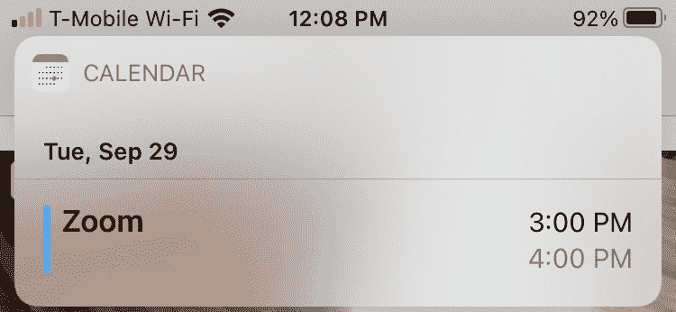

图 6.11 – 使用 Siri 设置提醒

一旦您设置了提醒，您可以通过 Siri 或手动打开提醒应用来删除它。

要通过 Siri 删除提醒，请按照以下步骤操作：

1.  启动 Siri（通过按侧边按钮或说“嘿，Siri”）。

1.  通过说出提醒中使用的独特词汇后跟“提醒”一词来指定您想要删除的提醒。Siri 会显示它认为您想要删除的提醒，如图*图 6.12*所示：

    图 6.12 – 删除提醒

1.  点击**否**或**是**。

提醒是跟踪即将到来的事件的一种方式，但另一种方式是将即将到来的约会存储在日历应用中。

## 设置约会

日历应用不仅让您可以看到一年的即将到来的日期，而且对于存储特定日期的未来约会也很有用，例如医生的预约、商务会议或重要的电话。

与浪费时间打开日历应用并检查特定日期的约会相比，让 Siri 提醒您会更容易。只需问 Siri“我的日历上有什么？”或“我的这一天看起来怎么样？”然后选择一个具体的日期，例如“今天”或“5 月 13 日”。

要检查您的日历，请按照以下步骤操作：

1.  启动 Siri（通过按侧边按钮或说“嘿，Siri”）。

1.  提出一个关于“日历”或“日期”以及特定日期的问题。Siri 会显示该日历的所有预约列表，如图*图 6.13*所示：

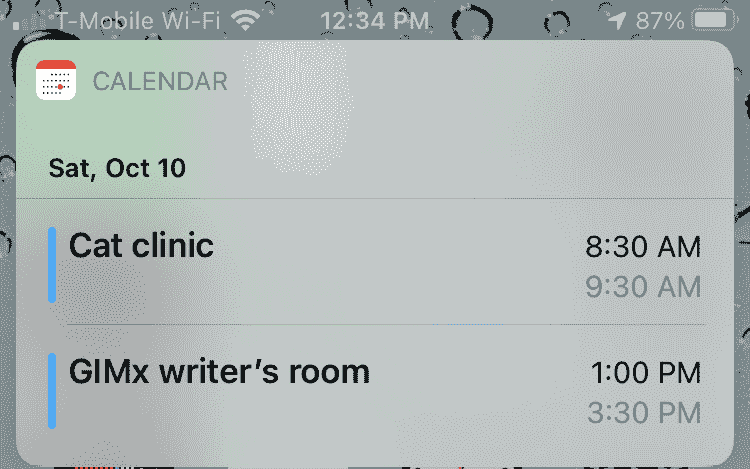

图 6.13 – Siri 列出特定日期的所有约会

查看特定日期安排的约会列表可以帮助你规划那一天。然而，你也可能想要添加、编辑或删除约会。虽然你可以通过日历应用手动完成这些操作，但你也可以让 Siri 为你完成这些操作。

要安排一个约会，对 Siri 说“约会”或“会议”，描述会议，例如“与吉利安博士见面”，并说明时间和日期，例如“8 月 8 日上午 10 点。”

要在你的日历中创建一个约会，请按照以下步骤操作：

1.  启动 Siri（通过按侧边按钮或说“嘿，Siri”）。

1.  使用“会议”或“安排”这个词，描述会议，并给出一个具体的日期和时间。Siri 会显示你的会议，如图 6.14 所示。如果 Siri 需要更多信息，例如时间、日期或澄清你想见哪个人（以防两个人有相似的名字），Siri 会出现一个额外的屏幕询问“你的约会是什么时间？”或类似的问题：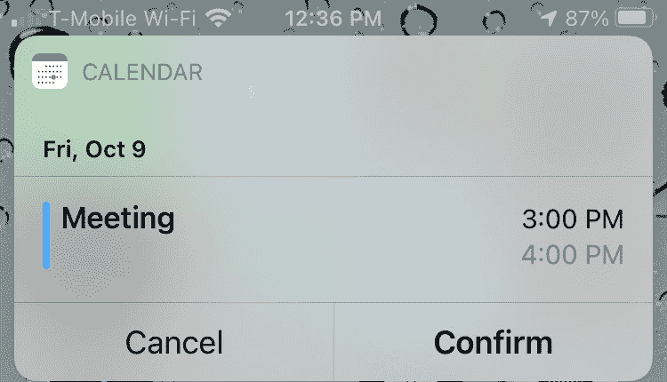

    图 6.14 – Siri 安排约会

1.  点击**取消**或**确认**。

一旦你安排了会议，你总是可以将其更改为另一个时间或日期，或者你可以完全删除它。

要移动或修改一个约会，请使用“修改”或“移动”这个词，然后跟“会议”或“约会”，并指定新的时间和日期，例如“将我的晚上 9:00 的会议与约翰移至下周五上午 10:30。”

如果你想编辑一个约会但提供的信息不足，Siri 将会要求你澄清，例如当你想要重新安排会议的时间。

要移动或修改一个约会，请按照以下步骤操作：

1.  启动 Siri（通过按侧边按钮或说“嘿，Siri”）。

1.  使用“修改”或“移动”这个词，然后识别一个“会议”或“约会”，然后给出另一个时间和日期。如果 Siri 需要更多信息，屏幕上会出现一条消息。当 Siri 有足够的信息来修改约会时，它会显示修改后的约会，如图 6.15 所示：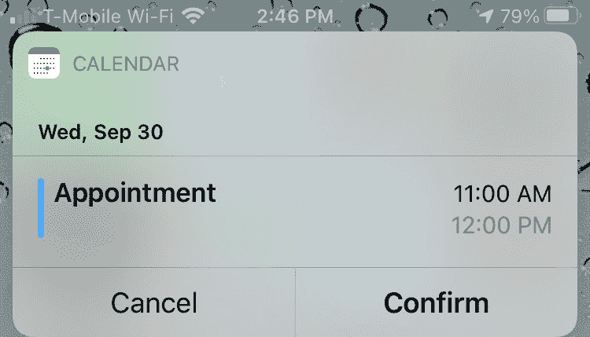

    图 6.15 – Siri 修改约会

1.  点击**取消**或**确认**。

虽然你可能需要修改约会，但你可能也需要完全删除约会。要删除约会，请使用“删除”或“取消”这个词，并指定你想要删除的约会。

要删除一个约会，请按照以下步骤操作：

1.  启动 Siri（通过按侧边按钮或说“嘿，Siri”）。

1.  使用“取消”、“删除”或“删除”这个词，然后识别一个特定时间日期的“会议”或“约会”。如果 Siri 需要更多信息，屏幕上会出现一条消息。当 Siri 有足够的信息来修改约会时，它会要求你验证删除约会，如图 6.16 所示：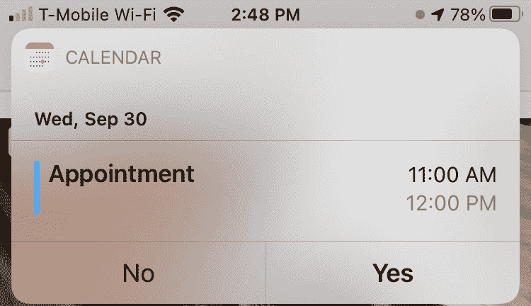

    图 6.16 – Siri 删除预约

1.  点击**否**或**是**。如果 Siri 误解了您，请点击**点击以编辑**按钮并编辑 Siri 认为您所说的文本。这样，您可以纠正任何错误或混淆。

预约通常发生在特定地点，所以一旦您知道您需要在哪一天和什么时间到达某个地方，您可能还需要了解如何到达那里的导航。

## 获取导航

要获取导航，Siri 必须知道您想从哪里出发以及您想去哪里。如果您省略了起始位置，Siri 将假设您的当前位置是起始位置。一旦您确定了目的地，Siri 就可以显示带有导航的地图应用。

获取导航，请按照以下步骤操作：

1.  启动 Siri（通过按侧边按钮或说“嘿，Siri”）。

1.  使用“方向”或“获取”一词加上起始位置和结束目的地来提问。Siri 将打开带有导航的地图应用，如图*图 6.17*所示。从该屏幕，您可以选择驾驶、步行、公交和骑行导航：

图 6.17 – 使用 Siri 获取导航

与获取导航相比，您可能对某个地区的交通状况更感兴趣。通过了解交通是轻松还是繁忙，您可以选择最佳路线到达目的地。

要获取交通信息，请按照以下步骤操作：

1.  启动 Siri（通过按侧边按钮或说“嘿，Siri”）。

1.  使用“交通”一词加上位置（例如“附近”或“在芝加哥”）来提问。Siri 将打开地图应用并识别交通繁忙的区域。

在您附近寻找交通拥堵或瓶颈可能很有用，但您也可以使用 Siri 查找附近的特定地点，例如找到附近的加油站或泰国餐厅。

要查找业务或地点的位置，请按照以下步骤操作：

1.  启动 Siri（通过按侧边按钮或说“嘿，Siri”）。

1.  使用“附近”一词加上您想要的位置或业务，例如“附近有什么巴西餐厅？”如果您省略指定位置，Siri 将假设您想使用您的当前位置。Siri 显示了一个选项列表，如图*图 6.18*所示：

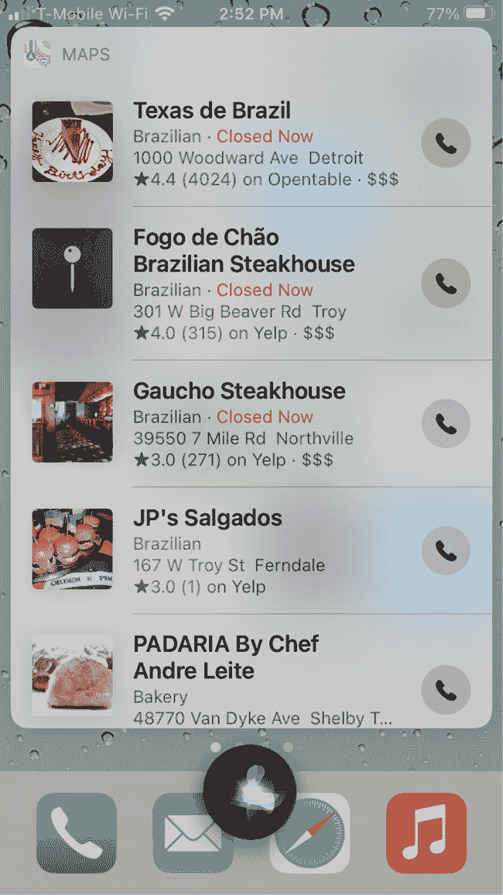

图 6.18 – 查找附近的地点

当您要去一个特定地点时，您可能想与其他人见面。您可以打电话或发短信给他人，但通常让 Siri 帮助您会更方便，这样您就不必手动进行步骤，这在您在寒冷的天气中不想脱下手套去触摸 iPhone 屏幕时尤其有用。

## 发送和接收短信

在 iPhone 的虚拟键盘上打字对于一些人来说可能很笨拙，尤其是如果您想在寒冷气候中戴着手套给某人发短信时。这时，使用 Siri 的帮助发送短信会容易得多。

Siri 还可以方便地大声朗读短信给你听。这样，你可以在回复之前参考之前的短信。你可以让 Siri 朗读你收到的最后一条短信（无论谁发送的），或者你可以指定特定人的最后一条短信。

要让 Siri 朗读短信，请按照以下步骤操作：

1.  启动 Siri（通过按侧边按钮或说“嘿，Siri”）。

1.  使用“read”和“text message”这些词向 Siri 下达命令。你可以选择描述你想阅读短信的人。这个人名和手机号码必须存储在**联系人**应用中。Siri 会读取短信并询问：“你想回复吗？”

1.  说“是”。Siri 会问：“你想说什么？”并显示一个短信气泡，如图 6.19 所示：

    图 6.19 – Siri 显示你的回复短信气泡

1.  语音输入你的回复。Siri 会显示你的消息以及**取消**和**发送**按钮，如图 6.20 所示：

    图 6.20 – 准备发送短信

1.  点击**取消**或**发送**按钮。

你可能还想发送短信给某人而不阅读任何短信。这时，你只需简单地说“发送短信给某人”或手机号码。然后，Siri 会提示你输入要发送的消息。

要避免此提示，你可以说出“发送短信”或“发送短信给某人”或手机号码，然后是实际的消息，例如“发送短信给 Bob，你什么时候能到我的地方？”

要发送短信，请按照以下步骤操作：

1.  启动 Siri（通过按侧边按钮或说“嘿，Siri”）。

1.  使用“Send text”或“Send text message”这些词加上人名或手机号码向 Siri 下达命令。你可以选择包含你想发送的消息。如果你不包含消息，Siri 会提示你添加消息。

1.  Siri 会显示你的短信以及**取消**和**发送**按钮（见图 6.20）。

1.  点击**取消**或**发送**按钮。

通过 Siri 发送短信很方便，但有时你可能想直接与人交谈。这时，你可以使用 Siri 帮助你打电话。

## 打电话

要用 Siri 打电话，你必须指定要拨打的手机号码或已存储在**联系人**应用中的人名。

要打电话，请按照以下步骤操作：

1.  启动 Siri（通过按侧边按钮或说“嘿，Siri”）。

1.  使用“Call”这个词加上人名或手机号码向 Siri 下达命令。你的 iPhone 开始拨打你选择的号码。

用 Siri 打电话只需打开电话应用。当然，你也可以使用 Siri 打开 iPhone 上的任何应用。

## 打开应用

您可能有一个想要使用的应用，但打开主屏幕并滚动不同的图标以找到您想要使用的应用可能会很麻烦。作为一个快捷方式，只需告诉 Siri 打开一个特定的应用，通过说出“打开”加上应用名称，例如“计算器应用”。

要打开一个应用，请按照以下步骤操作：

1.  启动 Siri（通过按侧边按钮或说“嘿，Siri”）。

1.  使用“打开”一词加上应用名称的指令给 Siri，例如“计算器应用”。您选择的应用会出现在屏幕上。

许多人都经常使用的一个应用是音乐应用，这样他们就可以播放他们最喜欢的歌曲。虽然您可以要求 Siri 打开音乐应用，但您可能还想指定一首特定的歌曲。

要打开音乐应用并播放存储在您的音乐库中的歌曲，请按照以下步骤操作：

1.  启动 Siri（通过按侧边按钮或说“嘿，Siri”）。

1.  使用“播放”和“歌曲”等词语向 Siri 下达指令，并跟随后想听的歌曲名称。Siri 会打开音乐应用并开始播放您选择的歌曲。

通过使用 Siri 控制音乐应用，您无需手动搜索音乐库来找到您想要的歌曲。虽然听音乐很有趣，但您可能还想玩一个巧妙的 Siri 技巧来检查您当前位置上方的商业航班。

## 跟踪上方的航班

在任何给定时刻，都会有几架商用飞机在上空飞行。为了好玩，您可以询问 Siri 关于这些航班的信息，并获取各种信息，如航空公司、航班号、高度，甚至飞机类型。

要找出上方的航班，请按照以下步骤操作：

1.  启动 Siri（通过按侧边按钮或说“嘿，Siri”）。

1.  向 Siri 询问“上方有哪些航班？”Siri 会显示结果，如图 6.21 所示：

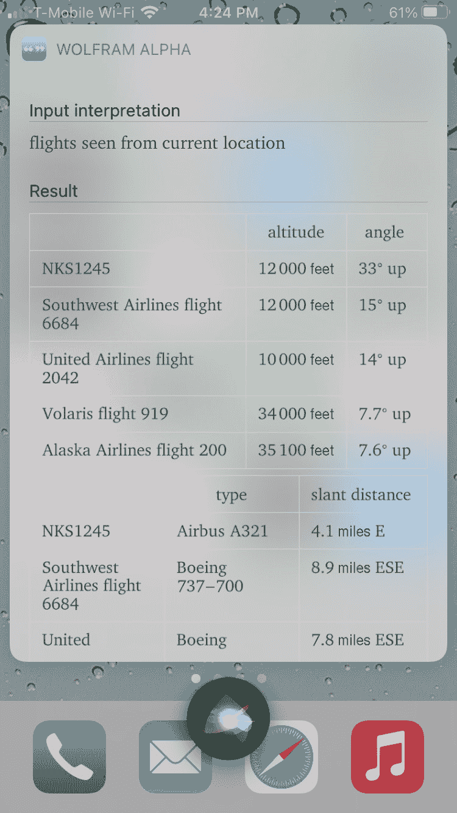

图 6.21 – 获取您当前位置上方航班的信息

观看上方的航班可以很有趣，这可以让您意识到在任何时候有多少飞机正在您当前位置上方飞行。

# 摘要

想象一下，有一个礼貌的仆人随时准备听从您的语音指令，这就是 Siri 为您和您的 iPhone 所能做到的。并不是每个人都需要 Siri 来播放音乐，但您很可能使用 iPhone 来完成一些可以通过依赖 Siri 而变得更容易的任务。

练习使用不同的词语和短语，看看哪些与 Siri 配合得最准确。根据您的发音，某些词语和短语可能比其他词语更有效。当您无法手动控制 iPhone 时，Siri 非常方便。

虽然 Siri 可以控制 iPhone 的大多数功能，但需要您完全注意的一个功能是通过 iPhone 的摄像头拍照，这是下一章的主题。
