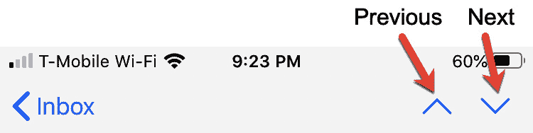

# 第十章：*第十章*：发送和接收电子邮件

通过 iPhone 进行沟通的三个最流行的方式是通过电话、短信和电子邮件。由于人们不能总是接听电话，而短信通常很简短，因此电子邮件可以是一种很好的方式，用于传达大量信息，其他人可以在他们方便的时候进行查看。

通过电子邮件，您可以发送文本和文件附件，如图片或视频。通过在 iPhone 上发送和接收电子邮件，您可以选择最适合您需求的一种沟通方式。

本章涵盖的主题如下：

+   设置电子邮件账户

+   发送电子邮件

+   阅读消息

+   创建 VIP 列表

+   过滤电子邮件

+   标记消息

+   处理垃圾邮件

# 设置电子邮件账户

在您能够发送和接收电子邮件之前，您需要一个电子邮件账户，例如通过 Gmail 或 Yahoo 提供的免费账户，或者通过您的工作提供的账户。当添加一个流行的电子邮件账户，如 Gmail 时，您的 iPhone 只需使用您的电子邮件地址和密码就可以设置电子邮件账户。当添加工作或非常见电子邮件账户时，您可能需要手动输入技术细节，例如 POP 或 IMAP 服务器名称。

## 设置常见电子邮件账户

您的 iPhone 可以自动识别并设置以下类型的电子邮件账户：

+   iCloud

+   微软 Exchange

+   Google (Gmail)

+   Yahoo

+   AOL

+   Outlook

要通过这些电子邮件提供商之一设置电子邮件账户，请按照以下步骤操作：

1.  在主屏幕上点击**设置**应用。出现**设置**屏幕。

1.  点击**邮件**。出现一个**邮件**屏幕。

1.  点击**账户**。出现一个**账户**屏幕。

1.  点击**添加账户**。出现一个如图 10.1 所示的**添加账户**屏幕：

1.  c 点击您的电子邮件提供商的名称（例如**AOL**或**Yahoo**）并按照说明输入您的电子邮件地址和密码。

大多数人使用之前提到的流行电子邮件提供商之一，例如 iCloud 或 Yahoo。然而，在某些情况下，您可能需要手动输入电子邮件账户信息。

## 手动设置电子邮件账户

如果您的电子邮件账户不是更流行的账户之一，例如工作或学校电子邮件账户，您可能需要手动输入您的电子邮件账户信息。这意味着您需要事先获取信息，例如主机名和其他可能需要从 IT 管理员那里获得的技术信息。

要手动设置电子邮件账户，请按照以下步骤操作：

1.  在主屏幕上点击**设置**应用。出现**设置**屏幕。

1.  点击**邮件**。出现一个**邮件**屏幕。

1.  点击**账户**。出现一个**账户**屏幕。

1.  点击**添加账户**。出现一个**添加账户**屏幕（见图 10.1）。

1.  点击**其他**。出现一个**添加账户**屏幕，如图 10.2 所示：

    图 10.2 – 添加账户屏幕

1.  轻触**添加邮件账户**。出现**新账户**屏幕，如图*图 10.3*所示：![Figure 10.3 – 新账户屏幕

    ![img/Figure_10.03_B14100.jpg]

    图 10.3 – 新账户屏幕

1.  输入您的姓名、电子邮件地址、密码以及您电子邮件账户的描述，然后轻触**下一步**。

1.  如果您的 iPhone 能够成功连接到您的电子邮件账户，您可以轻触**完成**。否则，您将需要轻触**下一步**并输入其他信息，例如邮件服务器名称以及您的电子邮件账户是 IMAP 还是 POP。

为了确保您已成功连接到您的电子邮件账户，您可能想请朋友发送一封电子邮件消息以确保您能够接收它。一旦您知道您已成功连接电子邮件账户，您就可以开始发送和接收电子邮件。

# 发送电子邮件

发送电子邮件涉及定义电子邮件地址、主题行以及构成您消息主体的文本。您可以键入电子邮件地址，但选择您之前在**联系人**应用中存储的电子邮件地址要容易得多。

当您发送电子邮件时，您需要指定至少一个电子邮件地址。您还可以在**抄送**：（抄送）或**密送**：（密送）文本字段中指定其他电子邮件地址。

*抄送*意味着所有收到消息的人都可以看到收到相同消息的所有附加电子邮件地址。

*密送*意味着没有人能看到可能收到相同消息的任何附加电子邮件地址。

## 编写和发送电子邮件

要创建一封要发送的电子邮件，您需要指定收件人的电子邮件地址、主题行以及实际的消息内容。

要发送电子邮件，请按照以下步骤操作：

1.  在主屏幕上轻触**邮件**应用。**邮件**应用屏幕出现，并在屏幕右下角显示新消息图标，如图*图 10.4*所示：![Figure 10.4 – 新消息图标

    ![img/Figure_10.04_B14100.jpg]

    图 10.4 – 新消息图标

1.  轻触新消息图标。出现**新消息**屏幕，如图*图 10.5*所示：![Figure 10.5 – 新消息屏幕

    ![img/Figure_10.05_B14100.jpg]

    图 10.5 – 新消息屏幕

1.  在**收件人**文本字段中键入电子邮件地址，或轻触最右侧的**+**图标以打开**联系人**应用，然后轻触一个名称。

1.  （可选）在**抄送**/**密送**、**发件人**文本字段中输入您希望也接收您消息的任何附加电子邮件地址。

1.  在**主题**文本字段中输入您消息的描述。

1.  在**发送自我的 iPhone**文本上方的消息文本字段中输入您的消息。

1.  在屏幕右上角轻触发送图标（它看起来像圆圈内的向上箭头）。

前面的步骤假设您想立即编写并发送一封电子邮件。然而，有时您可能想开始编写一条消息并将其保存为草稿，以便稍后返回。

## 将电子邮件保存为草稿

有时您可能想要先写一部分消息，然后稍后再回来编辑文本，再发送出去。因此，您不是直接编写并发送消息，而是编写消息并将其保存在一个特殊的草稿文件夹中。然后您可以在准备好发送时返回并编辑该消息。

要将消息保存为草稿，请按照以下步骤操作：

1.  点击主屏幕上的**邮件**应用，然后点击屏幕右下角的**新建消息**图标（见图*图 10.4*）。

1.  在空白电子邮件消息中输入文本。

1.  点击屏幕左上角的**取消**。屏幕底部出现一个选项列表，如图*图 10.6*所示：

    图 10.6 – 选择将消息保存为草稿

1.  点击**保存草稿**。（**取消**让您返回编辑您的消息，而**删除草稿**则在不发送的情况下删除您的整个消息。）

一旦将消息保存为草稿，您可以在任何时候返回该消息进行编辑，并最终发送出去。要编辑**草稿**文件夹中存储的消息，请按照以下步骤操作：

1.  点击主屏幕上的**邮件**应用。出现**邮件**屏幕。

1.  点击屏幕左上角的返回箭头，直到出现**邮箱**屏幕，该屏幕显示一个数字，表示**草稿**文件夹中存储的消息数量，如图*图 10.7*所示：

    图 10.7 – 显示草稿文件夹的邮箱屏幕

1.  点击**草稿**。出现**草稿**屏幕，列出您尚未发送的所有消息。

1.  点击您想要编辑的消息。您选择的消息出现，让您可以输入或编辑电子邮件地址、主题行和文本。

1.  编辑您的消息。

1.  点击**发送**图标发送您的消息，或者点击**取消**然后点击**保存草稿**将消息保存回**草稿**文件夹。

最终，您可能想要发送或删除消息。要从**草稿**文件夹中删除消息，请按照以下步骤操作：

1.  点击主屏幕上的**邮件**应用。出现**邮件**屏幕。

1.  点击屏幕左上角的返回箭头，直到出现**邮箱**屏幕，该屏幕显示一个数字，表示**草稿**文件夹中存储的消息数量（见图*图 10.7*）。

1.  点击**草稿**。出现**草稿**屏幕，列出您尚未发送的所有消息。

1.  在您想要删除的消息上向左滑动。屏幕右侧出现一个红色**垃圾桶**图标，如图*图 10.8*所示：

    图 10.8 – 垃圾桶图标让您删除消息

1.  点击垃圾桶图标从**草稿**文件夹中删除消息。

电子邮件可以方便地发送文本，但有时您可能想要发送文件，如文字处理文档或视频。为此，您需要将文件附加到消息中。

## 将文件附加到电子邮件消息

经常需要共享文字处理程序、电子表格或演示文稿文件，或者视频文件。要共享任何类型的文件，你需要将该文件附加到你的电子邮件中。然后你可以发送与文件一起的文字或仅发送文件本身。

要将文件附加到电子邮件消息中，请按照以下步骤操作：

1.  点击主屏幕上的**邮件**应用。出现**邮件**屏幕。

1.  点击新消息图标。出现**新消息**屏幕（见图*图 10.5*）。

1.  在消息文本字段（位于**发送自我的 iPhone**文本上方）上按住指尖，直到出现菜单，如图*图 10.9*所示：

    图 10.9 – 在消息文本字段上按住时出现一个弹出菜单

1.  点击弹出菜单最右侧的右箭头以查看更多选项，如图*图 10.10*所示：

    图 10.10 – 向电子邮件消息添加图片或文档

1.  点击你想附加的文件类型，例如**插入照片或视频**或**添加文档**。你的选择文件类型出现，如图*图 10.11*所示：

    图 10.11 – 选择要附加到电子邮件消息中的文件

1.  点击你想附加到电子邮件消息中的文件。如果你想添加图片或视频，你可以点击多个文件，然后在完成时点击关闭图标（**X**）。你可以重复前面的步骤将多个文件添加到单个电子邮件消息中。只需确保你的电子邮件账户允许你发送大量数据。

    注意

    大多数电子邮件服务提供商都会设置一个最大文件大小限制，你可以在一条电子邮件消息中发送，例如 10 MB 或 25 MB。请咨询你的电子邮件服务提供商，以便你知道你可以发送的最大文件大小。

发送消息只是电子邮件用途的一半。另一半涉及接收和阅读其他人发送给你的消息。

# 阅读消息

一旦你将你的电子邮件地址提供给他人，他们很可能会给你发送消息。当你收到一条消息时，你可以选择阅读它、回复它、将其转发给他人、将其存储在文件夹中以供将来参考，或者完全删除它。

## 选择要阅读的消息

在你能够阅读一条消息之前，你需要选择你想阅读的消息。要阅读消息，请按照以下步骤操作：

1.  点击主屏幕上的**邮件**应用。出现**邮件**屏幕。

1.  点击屏幕左上角的返回箭头，直到出现**邮箱**屏幕。

1.  点击**收件箱**。出现消息列表。

1.  点击你想阅读的消息。你的选择消息出现。

1.  点击屏幕右上角的上一页或下一页图标以阅读上一条或下一条消息，如图*图 10.12*所示：

    图 10.12 – 收件箱、上一条和下一条图标

1.  在屏幕左上角轻触**收件箱**按钮，返回查看**收件箱**文件夹中的消息列表。

你可能只是想阅读一条消息并保留它，但很可能会想要回复那条消息。

## 回复消息

当你回复一条现有消息时，你的回复将包含你输入的任何新文本，以及之前消息的全部内容。这可以让收件人根据你正在回复的文本理解你新消息的上下文。

回复消息有三种选项：

+   **回复**：只向发送给你消息的人发送消息

+   **全部回复**：向通过**抄送**（Cc）或**密送**（Bcc）收到相同消息的每个人发送消息

+   **转发**：向原本不在邮件中的电子邮件地址发送消息

要回复一条消息，请按照以下步骤操作：

1.  在主屏幕上轻触**邮件**应用。**邮件**屏幕出现。

1.  轻触屏幕左上角的返回箭头，直到出现**邮箱**屏幕。

1.  轻触**收件箱**。出现消息列表。

1.  轻触你想要阅读的消息。你选择的消息出现，并在屏幕底部显示一个回复图标，如图 10.13 所示：![Figure 10.13 – 回复图标

    ![img/Figure_10.13_B14100.jpg]

    图 10.13 – 回复图标

1.  轻触回复图标。屏幕底部出现选项表，如图 10.14 所示：![Figure 10.14 – 选项出现在屏幕底部

    ![img/Figure_10.14_B14100.jpg]

    图 10.14 – 选项出现在屏幕底部

1.  轻触**回复**（向发送给你消息的人发送消息），**全部回复**（向所有收到消息的人发送消息），或**转发**（向一个全新的电子邮件地址发送消息）。会出现一个新的消息屏幕，其中包含之前查看的消息的所有文本。

1.  (可选) 如果你选择了*第 6 步*中的**转发**，请输入你想要接收转发消息的电子邮件地址。

1.  在**发送自我的 iPhone**文本上方输入任何其他你希望添加的文本。

1.  在屏幕右上角轻触发送图标以发送你的消息。

回复消息可以是一种快速向发送给你消息的人发送消息的方式。一旦你阅读或回复了一条消息，你可能希望将消息移动到另一个文件夹，以保持你的**收件箱**文件夹的整洁。

## 将消息移动到存档文件夹

每次你收到一条消息，它都会自动进入你的**收件箱**文件夹。由于这可能会使你的**收件箱**文件夹变得杂乱，你可能希望将消息移动到**存档**文件夹。这样，你可以保留一条消息，同时保持**收件箱**文件夹的整洁。

要将消息移动到**存档**文件夹，请按照以下步骤操作：

1.  在主屏幕上轻触**邮件**应用。**邮件**屏幕出现。

1.  轻触屏幕左上角的返回箭头，直到出现**邮箱**屏幕。

1.  点击**收件箱**。出现消息列表。

1.  点击您想要移动到**存档**文件夹的消息。文件夹图标出现在屏幕底部，如图*图 10.15*所示：

    图 10.15 – 文件夹图标

1.  点击文件夹图标。出现文件夹列表，如图*图 10.16*所示：

    图 10.16 – 可用文件夹列表

1.  点击**存档**文件夹。所选消息移动到**存档**文件夹。

一旦您将消息移动到**存档**文件夹，您可能希望稍后查看它。要查看**存档**文件夹中的任何消息，请按照以下步骤操作：

1.  在主屏幕上点击**邮件**应用。**邮件**屏幕出现。

1.  在屏幕左上角点击返回箭头，直到出现**邮箱**屏幕。

1.  点击**存档**。出现**存档**文件夹中的消息列表。

无论您是将消息移动到**存档**文件夹还是保留在**收件箱**文件夹中，当您不再需要它时，您可能最终想要删除该消息。

## 删除消息

每次收到消息时，它会自动进入您的**收件箱**文件夹。由于这可能会使您的**收件箱**文件夹变得杂乱，您可能希望将消息移动到**存档**文件夹。这样，您可以保留消息，同时保持**收件箱**文件夹整洁。

要删除单条消息，请按照以下步骤操作：

1.  在主屏幕上点击**邮件**应用。**邮件**屏幕出现。

1.  在屏幕左上角点击返回箭头，直到出现**邮箱**屏幕。

1.  点击包含您想要删除的消息的文件夹，例如**收件箱**或**存档**。出现消息列表。

1.  向左滑动您想要删除的消息。右侧出现**垃圾箱**图标，如图*图 10.17*所示：

    图 10.17 – 当您向左滑动时出现垃圾箱图标

1.  点击**垃圾箱**图标。

在删除消息之前，您可能想要先查看它。阅读后删除消息的步骤如下：

1.  在主屏幕上点击**邮件**应用。**邮件**屏幕出现。

1.  在屏幕左上角点击返回箭头，直到出现**邮箱**屏幕。

1.  点击包含您想要删除的消息的文件夹，例如**收件箱**或**存档**。出现消息列表。

1.  在删除消息之前，点击您想要阅读的消息。

1.  点击屏幕左下角的垃圾箱图标，如图*图 10.18*所示：

图 10.18 – 垃圾箱图标出现在屏幕左下角

如果您要删除多条消息，您可以在每条消息上向左滑动，或者单独打开它们并点击垃圾箱图标，但这会很麻烦，而且有一个更快的方法。

要删除多条消息，请按照以下步骤操作：

1.  点击主屏幕上的**邮件**应用。出现**邮件**屏幕。

1.  点击屏幕左上角的返回箭头，直到出现**邮箱**屏幕。

1.  点击包含您要删除的消息的文件夹，例如**收件箱**或**存档**。出现消息列表。

1.  点击屏幕右上角的**编辑**。每个消息左侧出现单选按钮（空圆圈）。

1.  按照如图 10.19 所示的示例，点击每个要删除的消息的单选按钮：

    图 10.19 – 选择要删除的多个消息

1.  点击屏幕右下角的**删除**。

如果您不小心删除了一条消息，后来又想恢复它，您可以在**垃圾箱**文件夹中找到它。要从垃圾箱文件夹中恢复消息，请按照以下步骤操作：

1.  点击主屏幕上的**邮件**应用。出现**邮件**屏幕。

1.  点击屏幕左上角的返回箭头，直到出现**邮箱**屏幕。

1.  点击**垃圾箱**文件夹。出现消息列表。

1.  点击要检索的消息。

1.  点击屏幕底部的文件夹图标（见*图 10.15*）。出现文件夹列表。

1.  点击**收件箱**文件夹。

收到电子邮件可能很有趣，但随着时间的推移，您可能会收到来自重要人物的大量电子邮件以及无用消息。您如何整理这些杂乱无章的消息？通过创建一个特殊的 VIP 列表。

# 创建 VIP 列表

VIP 列表背后的主要思想是将某些人的电子邮件自动路由到特殊的 VIP 文件夹中。现在您可以先检查您的 VIP 文件夹中的重要消息，然后稍后再检查您的常规**收件箱**文件夹中的其他所有人的消息。

注意

要创建 VIP 列表，您必须首先在**联系人**应用中存储一个姓名和电子邮件地址。

要创建 VIP 列表，请按照以下步骤操作：

1.  点击主屏幕上的**邮件**应用。出现**邮件**屏幕。

1.  点击屏幕左上角的返回箭头，直到出现**邮箱**屏幕。

1.  点击**VIP**文件夹。出现**VIP 列表**屏幕并显示**添加 VIP**按钮。

1.  点击**添加 VIP**按钮。出现**联系人**屏幕，列出存储在**联系人**应用中的所有姓名。如果某个姓名显示为暗色，则表示您尚未为该姓名存储电子邮件地址。

1.  点击要存储在您的 VIP 列表中的姓名。

一旦您将姓名存储在 VIP 列表中，您在 VIP 文件夹中收到任何电子邮件时都会收到通知。VIP 的**消息**会出现在您的**收件箱**和**VIP**文件夹中。

消息左侧的金星标识表示来自您的 VIP 列表的人的消息，如图 10.20 所示：

图 10.20 – 识别也存储在 VIP 列表中的消息

最终，您可能想从您的 VIP 列表中删除人员。要从 VIP 列表中删除某人，请按照以下步骤操作：

1.  点击主屏幕上的**邮件**应用。出现**邮件**屏幕。

1.  在屏幕左上角轻触返回箭头，直到出现**邮箱**屏幕。VIP 文件夹右侧出现一个信息图标，如图 10.21 所示。只要你在**联系人**应用中至少识别了一个 VIP，这个信息图标就会显示：

    图 10.21 – VIP 文件夹附近的信息图标

1.  轻触 VIP 文件夹右侧出现的信息图标。出现**VIP 列表**屏幕，列出当前存储在您的 VIP 列表中的所有名字。

1.  向左滑动你想从 VIP 列表中移除的名字。在该名字右侧出现一个**删除**图标，如图 10.22 所示：

    图 10.22 – 从 VIP 列表中移除一个名字

1.  轻触**删除**。

VIP 列表可以是一种使查找重要消息更简单的方法。另一种方法是切换显示所有消息和仅显示新消息。

# 过滤电子邮件

通常，**收件箱**文件夹列出所有消息，包括你已读和未读的消息。为了更容易找到和阅读所有未读消息，你可以过滤你的文件夹，只显示未读消息。然后你可以关闭过滤器，再次显示所有消息（已读和未读）。

要过滤一个文件夹，请按照以下步骤操作：

1.  在主屏幕上轻触**邮件**应用。出现**邮件**屏幕。

1.  在屏幕左上角轻触返回箭头，直到出现**邮箱**屏幕。

1.  轻触你想过滤的文件夹，例如**收件箱**文件夹。该文件夹中的消息列表出现。

1.  在屏幕左下角轻触过滤器图标，如图 10.23 所示。当过滤器图标高亮显示时，屏幕只显示未读消息：

    图 10.23 – 过滤器图标

1.  再次轻触过滤器图标。当过滤器图标不再高亮显示时，屏幕将显示所有已读和未读消息。

当你第一次收到一条消息时，它会被标记为未读，并在消息左侧显示一个蓝色圆点。一旦你阅读了它，那条消息就会被视为已读。然而，你可以将一条消息标记为未读，以便在使用过滤器图标时更容易再次找到它。

要将一条消息标记为未读（即使你已经阅读过它），请按照以下步骤操作：

1.  在主屏幕上轻触**邮件**应用。出现**邮件**屏幕。

1.  在屏幕左上角轻触返回箭头，直到出现**邮箱**屏幕。

1.  轻触包含你想标记为未读的消息的文件夹。

1.  向左滑动你想标记为未读的消息。右侧将出现**更多**、**标记**和**垃圾箱**图标。

1.  轻触**更多**。屏幕底部出现一个选项列表，如图 10.24 所示：

    图 10.24 – 标记消息的选项

1.  点击**标记为未读**。现在，该消息左侧会出现一个蓝色圆点，直到您再次打开并阅读该消息。

当您将消息标记为未读时，您可以使用过滤器图标轻松找到它。然而，每次您再次打开该消息时，该消息就不再被视为未读。为了识别某些消息的另一种方式，请考虑标记它们。

# 标记消息

您收到的所有消息可能并不同等重要。为了便于找到重要的消息，您可以标记它们。这样，您可以直观地找到所有重要的消息，并跳过不那么重要的消息。

要标记一条消息，请按照以下步骤操作：

1.  点击主屏幕上的**邮件**应用。出现**邮件**屏幕。

1.  点击屏幕左上角的返回箭头，直到出现**邮箱**屏幕。

1.  点击包含您想要标记的消息的文件夹。

1.  在您想要标记的消息上向左滑动。右侧会出现**更多**、**标记**和**垃圾箱**图标（见*图 10.24*）。

1.  点击**标记**图标。在右侧边距处会出现一个彩色的小旗帜，如图*图 10.25*所示：

图 10.25 – 标记的消息在右侧边距显示标记图标

要从消息中移除标记，只需重复前面的步骤。

# 处理垃圾邮件

垃圾邮件通常涉及诈骗、不想要的销售信息和虚假警告。您的 iPhone 上的**邮件**应用不会将垃圾邮件与合法邮件分开排序，而是依赖您的电子邮件提供商来识别可能的垃圾邮件。

任何情况下，如果您的电子邮件提供商不确定一条消息是否为垃圾邮件，它都会将其发送到您的**垃圾邮件**文件夹。这意味着您应该定期检查是否有误发送到**垃圾邮件**文件夹的消息。

尽管您的电子邮件提供商做出了努力，垃圾邮件仍然会漏网，因此您需要知道如何在收到垃圾邮件时处理它们。

要将消息发送到**垃圾邮件**文件夹，请按照以下步骤操作：

1.  点击主屏幕上的**邮件**应用。出现**邮件**屏幕。

1.  点击屏幕左上角的返回箭头，直到出现**邮箱**屏幕。

1.  点击一个文件夹。

1.  在您想要标记为垃圾邮件的消息上向左滑动。右侧会出现**更多**、**标记**和**垃圾箱**图标。

1.  点击**更多**。屏幕底部会出现一个选项列表。

1.  向上滚动以查看所有选项，如图*图 10.26*所示：

    图 10.26 – 点击更多图标显示的完整选项列表

1.  点击**移动到垃圾邮件**。

一旦您将消息移动到**垃圾邮件**文件夹，或者只想检查您的电子邮件提供商是否已将任何消息发送到**垃圾邮件**文件夹供您审阅，您就需要浏览**垃圾邮件**文件夹内的内容。

要浏览您的**垃圾邮件**文件夹，请按照以下步骤操作：

1.  点击主屏幕上的**邮件**应用。出现**邮件**屏幕。

1.  点击左上角的返回箭头，直到出现**邮箱**屏幕。

1.  点击**垃圾邮件**文件夹。**垃圾邮件**文件夹内出现零条或多条信息。

1.  点击一条信息来阅读它，或者向左滑动并点击**删除**来移除它。

为了避免将明显的垃圾邮件填满你的**垃圾邮件**文件夹，你的电子邮件提供商可能只是将所有明显的垃圾邮件存储在他们自己的服务器上。这意味着，如果你想检查是否有重要信息被错误地标记为垃圾邮件，你首先需要检查 iPhone 上的**垃圾邮件**文件夹，然后检查电子邮件提供商的**垃圾邮件**文件夹。为此，你需要联系你的电子邮件提供商，了解如何检查电子邮件账户的**垃圾邮件**文件夹的详细信息。

# 摘要

发送和接收电子邮件可以帮助你在任何地方使用 iPhone 与重要人物及其信息保持联系。在基本层面上，确保你知道如何阅读和撰写信息。

为了更方便，学习如何回复和转发信息。回复一条信息让你可以包含先前信息的文本并展示你的回应。你可以回复发送那条信息的人，或者回复所有收到那条相同信息的人。

转发让你可以将信息传递给其他人。这样，你可以与你的朋友和同事分享信息，确保他们不会错过任何重要的事情。

在更高级的层面上，使用文件夹、过滤器、VIP 列表和标记来更容易地找到信息。你收到的信息越多，你就越想使用这些方法来帮助你找到对你最重要的信息。

虽然电子邮件很方便，但你可能想立即与某人交谈。与其打电话，不如考虑使用 FaceTime 进行视频通话，这是下一章的主题。
