# *第十二章*：阅读电子书

如果您曾经乘坐过飞机或火车旅行，您可能随身带了一本书。印刷书的缺点是体积庞大，这意味着在它们变得难以携带之前，您最多只能带几本。更糟糕的是，很容易忘记或丢失一本书——然后就会陷入没有书的困境。

幸运的是，您可以将您的 iPhone 变成电子书阅读器。您不仅可以将数百甚至数千本书随身携带，无论您带 iPhone 去哪里都可以阅读，而且您可以在任何有机会的时候阅读，比如排队或乘坐飞机或火车。

使用电子书，您可以随时随地访问世界上任何一本书，只要您愿意，就可以在 iPhone 上阅读。如果您喜欢不查看文本的阅读方式，您也可以购买并收听有声书。

本章涵盖的主题如下：

+   从苹果书店获取电子书

+   将电子书添加到书籍应用中

+   打开电子书

+   阅读电子书

# 从苹果书店获取电子书

将电子书放入 iPhone 有两种方法。首先，您可以从苹果书店购买。当您从苹果书店获取电子书时，这些电子书可以是免费的，也可以是付费的。

第二种选择是从其他来源获取电子书，然后将这些文件复制到书籍应用中，以便您在 iPhone 上阅读。两种流行的电子书文件格式是**PDF**（**便携数字格式**）和**EPUB**（**电子出版物**）文件，您可以从互联网上的各种第三方那里购买或免费获取。

一般而言，您可能需要为电子书付费，例如您最喜欢的作者的最新畅销书。然而，您可以在网上找到许多免费的电子书，包括马克·吐温、简·奥斯汀或查尔斯·狄更斯的经典作品。您也可能找到包含有用信息的免费电子书，这些信息由个人或公司提供，以推广他们的服务或产品。

首先，让我们看看如何通过苹果书店购买电子书。要访问苹果书店，请按照以下步骤操作：

1.  点击主屏幕上的**书籍**应用。

1.  点击屏幕底部的**书店**图标。**书店**屏幕将出现，如图*图 12.1*所示。（如果您想听有声书，请点击屏幕底部的**有声书**图标）：

    图 12.1 – 书店屏幕

1.  点击**浏览分类**。将出现一个选项列表，如图*图 12.2*所示：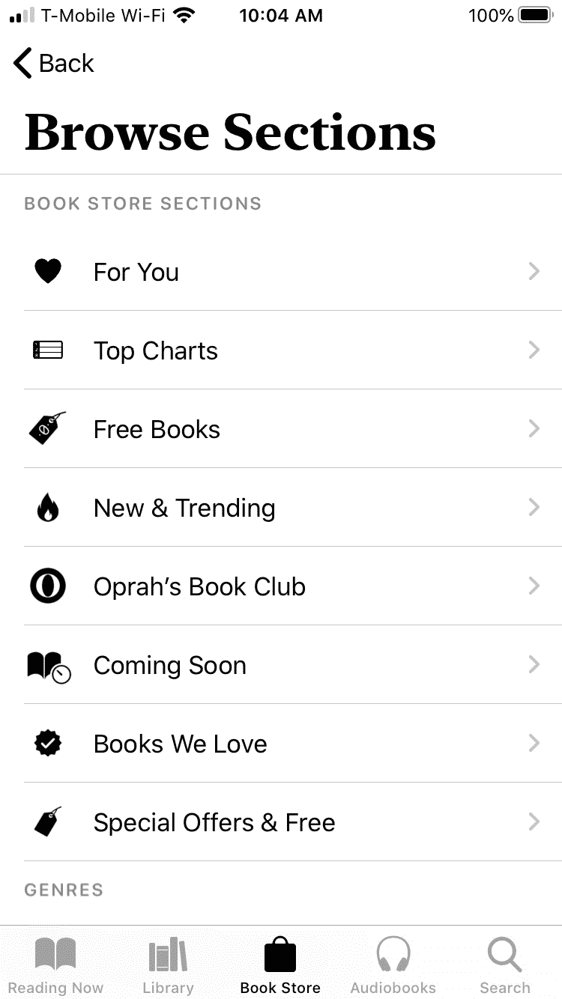

    图 12.2 – 书店屏幕

1.  点击一个类别，然后点击您想在 iPhone 上阅读的书籍。

    电子书的描述将显示出来，同时还有一个**购买**按钮（列出价格）、一个**想要阅读**按钮和一个**预览**按钮，让您阅读书的一部分，如图*图 12.3*所示。如果电子书是免费的，将显示一个**获取**按钮而不是**购买**按钮：

    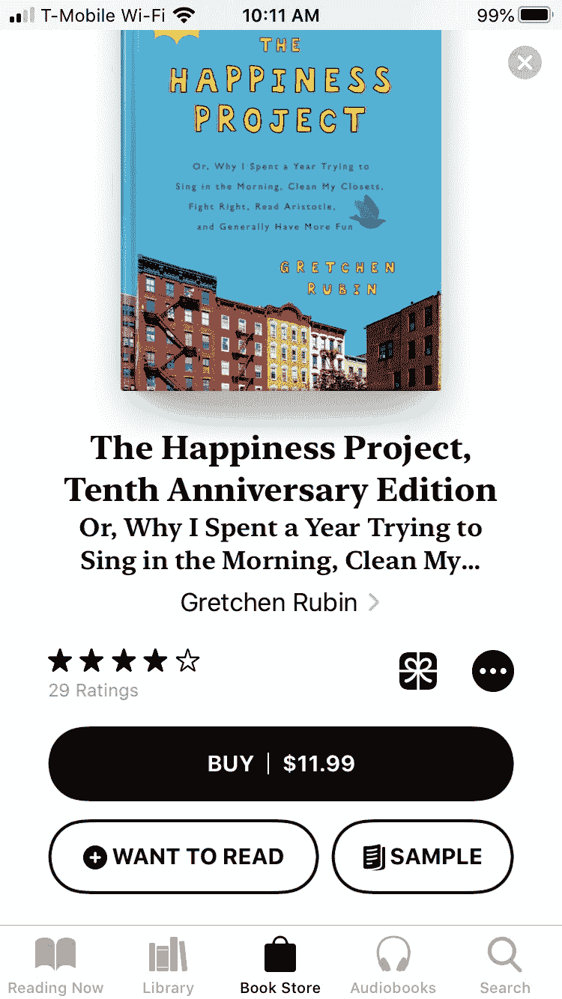

    图 12.3 – 查看单本书

1.  轻触**购买**按钮以购买电子书或轻触**预览**按钮以阅读书籍的一部分。

1.  轻触屏幕右上角的关闭（**x**）图标以返回书籍列表。您可能需要反复轻触屏幕左上角的**返回**按钮以查看之前的屏幕。

在浏览电子书时，您有轻触**想读**按钮（见图 12.3）的选项。这可以让您保存您感兴趣的电子书列表，这样您就不必稍后再次搜索。

一旦您轻触**想读**按钮，您所选的电子书就会被存储在**想读**收藏中。要浏览通过轻触**想读**按钮所选的电子书列表，请按照以下步骤操作：

1.  轻触主屏幕上的**Books**应用。会出现**Books**屏幕。

1.  轻触屏幕底部的**图书馆**图标。会出现**图书馆**屏幕，显示存储在您收藏中的电子书列表，如图*图 12.4*所示：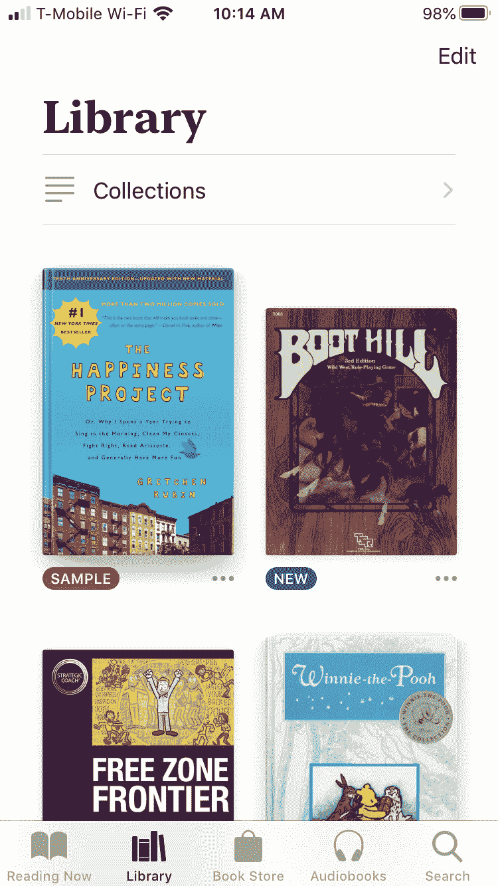

    图 12.4 – 图书馆屏幕

1.  轻触**收藏**以查看所有不同的类别，如图*图 12.5*所示：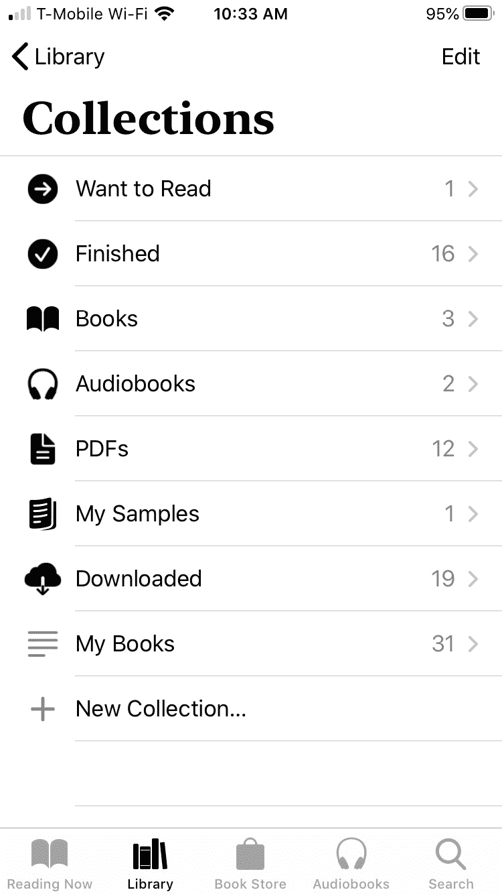

    图 12.5 – 收藏屏幕

1.  轻触**想读**。会出现电子书样本列表。

1.  轻触您想要查看的电子书。

1.  当您想要从“想读”收藏中移除一本电子书时，请轻触屏幕右上角的**编辑**按钮。

1.  轻触您想要从**想读**收藏中移除的每本电子书左侧出现的圆圈。

1.  轻触屏幕左下角的垃圾桶图标。屏幕底部会出现选项列表。

1.  轻触**从想读中移除**。

通过 Apple 的商店寻找电子书是最简单、最方便的方式。然而，您也可以在互联网上找到并从第三方购买电子书。

# 将电子书添加到 Books 应用

许多公司提供以 PDF 文件存储的电子书，您可以从网站上下载或在使用邮件列表注册时接收。其他电子书销售商可能销售存储在 PDF 或 ePub 格式的电子书。

如果您已有电子书，您可能想使用 Books 应用在您的 iPhone 上阅读它们。这意味着您需要将电子书添加到 Books 应用中。如果您在 Macintosh 或 iPhone/iPad 上有一本电子书，您可以使用 AirDrop 将该电子书发送到您的 iPhone。

## 从 Macintosh 添加电子书

AirDrop 可以在 iPhone 和另一款苹果产品（如另一款 iPhone、iPad 或 Macintosh 电脑）之间工作。基本步骤是将电子书文件发送到您的 iPhone，然后将该电子书文件加载到 Books 应用中。

要从 Macintosh 通过 AirDrop 发送电子书，请按照以下步骤操作：

1.  解锁您的 iPhone 并将其放置在包含您想要发送的电子书文件的 Macintosh 附近。

1.  在 Macintosh 上点击 Finder 图标，然后选择**前往** | **AirDrop**。**AirDrop**窗口出现，并显示您的 iPhone 图标，如*图 12.6*所示：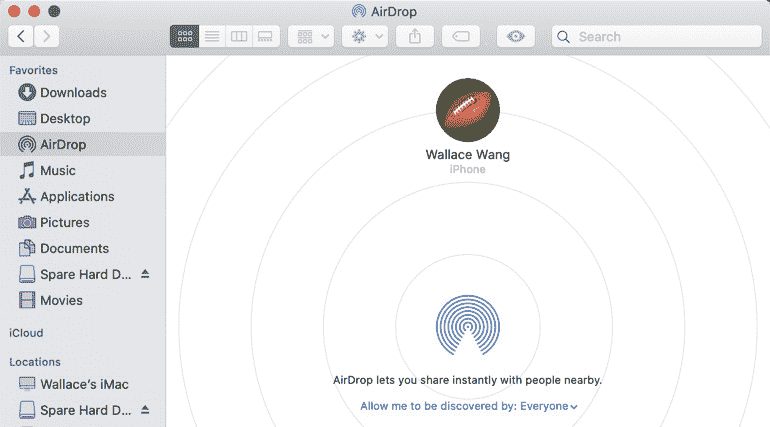

    图 12.6 – Macintosh 上的 AirDrop 窗口

1.  从**Finder**菜单中选择**文件** | **新建 Finder 窗口**，并将电子书文件拖到 AirDrop 窗口中的 iPhone 图标上。iPhone 上会出现一个对话框，如*图 12.7*所示：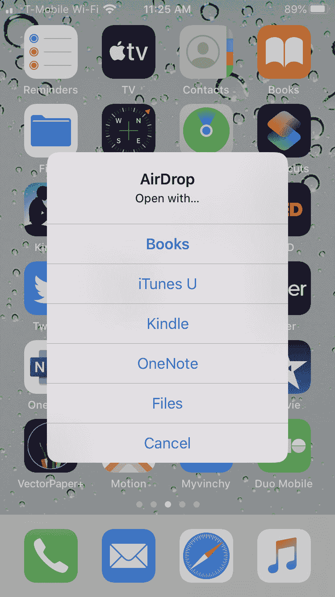

    图 12.7 – 在 iPhone 上选择如何加载电子书文件

1.  点击**书籍**。您的 iPhone 会将发送的电子书文件加载到**书籍**应用中。

如果您在 iPhone 或 iPad 上存储了电子书，您也可以将其发送到您的 iPhone。唯一的限制是，这本书不能是付费电子书，而是一个来自第三方（如 PDF 或 ePub 文件）的电子书文件。

## 从 iPhone/iPad 添加电子书

通常，一个人可能在他们自己的 iPhone/iPad 上有一本免费的电子书，他们想通过 AirDrop 与您分享。要从另一台 iPhone 或 iPad 通过 AirDrop 发送电子书，请按照以下步骤操作：

1.  解锁您的 iPhone，并将其放置在包含您想要发送的电子书文件的 iPhone 或 iPad 附近。

1.  打开包含您想要分享的电子书的 iPhone 或 iPad 上的**书籍**应用。

1.  点击分享图标。将出现一个菜单。

1.  点击**AirDrop**。当出现一个窗口，列出所有可以接收 AirDrop 项目的设备时，点击如*图 12.8*所示的您的 iPhone 图标。iPhone 上会出现一个对话框（见*图 12.7*）：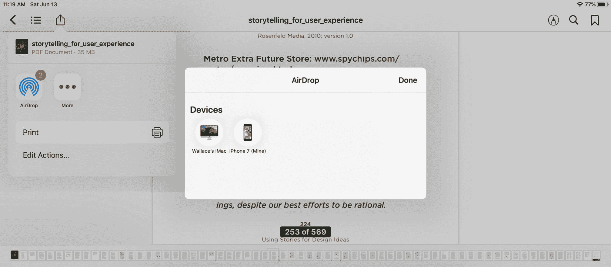

    图 12.8 – 从 iPad 发送电子书

1.  点击**书籍**。您的 iPhone 会将发送的电子书文件加载到**书籍**应用中。

一旦您将电子书加载到**书籍**应用中，无论是通过苹果书店购买还是从另一台设备发送，您需要知道如何阅读该电子书。

# 打开电子书

一旦您在 iPhone 上的**书籍**应用中存储了电子书，您可以在任何时间打开这些电子书。**书籍**应用提供了三种查找要打开的电子书的方法：

+   **正在阅读**：显示您最近阅读的电子书

+   **图书馆**：让您访问存储在**书籍**应用中的所有电子书。

+   **搜索**：让您在**书籍**应用中搜索特定的电子书标题。

## 从**正在阅读**列表中选择

许多人可能在**书籍**应用中存储了多本电子书，并在两本或多本电子书之间切换。因此，**正在阅读**列表显示了您最近打开的电子书，因为您很可能会稍后返回它们。

因此，每次您想阅读最近阅读过的电子书时，请首先检查**正在阅读**列表。**正在阅读**列表不仅显示了您所阅读的每本电子书的封面，而且还以百分比显示了您在每本电子书中的进度，例如 83%或 45%。

要打开**正在阅读**列表以阅读电子书，请按照以下步骤操作：

1.  点击主屏幕上的**Books**应用。将出现**Books**应用屏幕。

1.  点击屏幕底部的**正在阅读**图标。将出现如图 12.9 所示的**正在阅读**屏幕：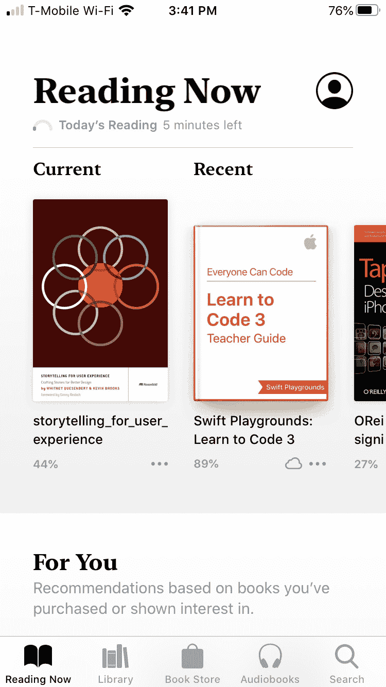

    图 12.9 – 正在阅读列表

1.  横向滚动以查看您最近打开的所有电子书。

1.  点击您想要阅读的电子书。

**正在阅读**列表显示了您最近打开的电子书，但如果您想打开一本新书或很久未阅读的电子书，您需要浏览整个电子书库。

## 从您的电子书库中选择

**正在阅读**列表仅显示最近打开的所有电子书。然而，您可能还想浏览整个电子书收藏，以找到您尚未开始阅读或很久未打开的电子书。

**Books**应用将您的电子书库划分为称为**收藏**的单独类别，如图 12.10 所示。每个收藏包含您整个电子书库的不同子集，包括以下内容：

+   **Finished**：您已经阅读完的电子书

+   **PDFs**：仅存储在 PDF 文件格式中的电子书

+   **我的样本**：从苹果书店检索的阅读样本

+   其余的收藏在*图 12.10*中显示：

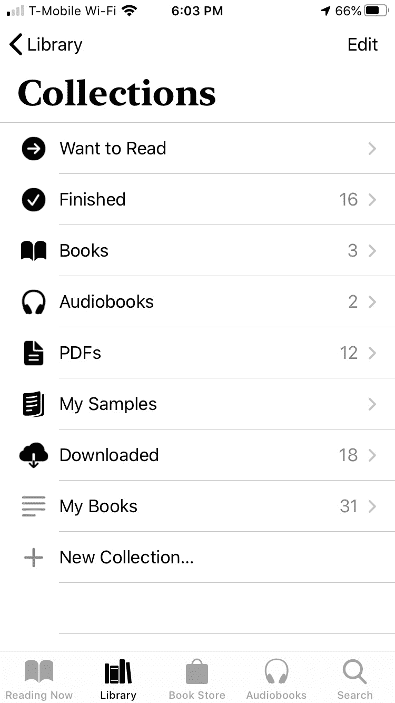

图 12.10 – 电子书库由多个收藏组成

要从您的整个电子书收藏中选择电子书，请按照以下步骤操作：

1.  点击主屏幕上的**Books**应用。将出现**Books**应用屏幕。

1.  点击**图书馆**图标。将出现**收藏**屏幕（见图 12.10）。

1.  点击**PDFs**或**Finished**等收藏类别。

1.  点击您想要阅读的电子书。

图书馆允许您浏览整个电子书列表，但如果您有很多电子书，这可能有些繁琐。为了更快的替代方案，尝试搜索特定的电子书标题。

## 搜索电子书标题

在不确定想读什么时浏览长长的电子书列表可能很好，只是想浏览以找到有趣的东西。然而，如果您知道您想要什么，那么浏览长长的电子书列表可能会很繁琐。

为了更快地找到特定的电子书，搜索其标题。通过搜索，您可以找到您想要的东西，而无需浪费大量时间。

要搜索电子书，请按照以下步骤操作：

1.  点击主屏幕上的**Books**应用。将出现**Books**应用屏幕。

1.  点击屏幕底部的**搜索**图标。

1.  输入您想要查找的所有或部分单词或短语。随着您输入，将出现可能的匹配列表，如图 12.11 所示：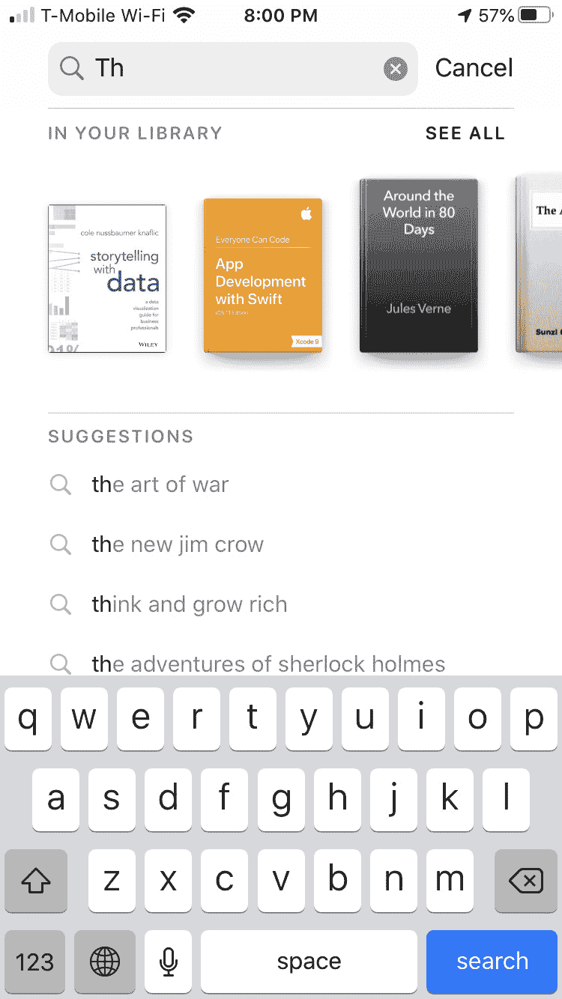

    图 12.11 – 搜索电子书

1.  点击您想要阅读的电子书。

无论你如何选择选择和打开电子书，最终你都需要知道如何阅读它。阅读电子书与阅读纸质书类似，但你需要了解一些独特的导航控制，以便充分利用 iPhone 触摸屏来翻页。

# 阅读电子书

使用纸质书，可以轻松地逐页翻阅或通过打开到另一页来跳转到书的另一部分。使用电子书，从一个部分导航到另一个部分的方式不同，因为电子书显示的是填满整个屏幕的页面。虽然你可以看到整个页面，但如果没有一点练习，很难看到电子书的不同部分。

**书籍**应用可以存储和显示两种类型的电子书：PDF 和 ePub。根据你的电子书存储的格式，翻页之间的导航略有不同。

无论你的电子书可能是什么格式，ePub 和 PDF 文件中都提供了四个基本图标，如图*图 12.12*所示：

+   **关闭**：关闭书籍并带您回到电子书库

+   **目录**：显示整个电子书的目录

+   **搜索**：让你输入一个单词或短语在电子书中查找

+   **书签**：让你标记一页，以便稍后轻松返回：

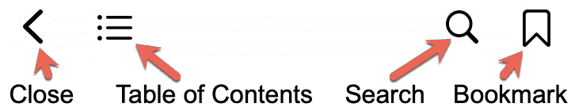

图 12.12 – 常见的电子书导航控制

通过学习在电子书中导航，你可以跳转到你想阅读的部分，而无需滚动多个页面。

## 关闭电子书

你一次只能查看一本电子书，尽管你可以同时打开几本电子书。当你完成一本电子书后，你需要关闭它，以便打开另一本电子书。要了解如何关闭电子书，请按照以下步骤操作：

1.  在主屏幕上轻触**书籍**应用。

1.  轻触电子书以打开它。你可能需要轻触一页，以在屏幕左上角查看关闭图标。

1.  轻触关闭图标。你选择的电子书关闭，并带您回到**正在阅读**的电子书列表。

关闭电子书只是让你打开另一本。如果你只是想切换到另一个应用，不需要关闭电子书。

## 查看目录

目录让你查看电子书中的所有章节标题，以便你可以跳转到特定的章节。根据你阅读的是 ePub 还是 PDF 文件，目录看起来不同。

要使用目录，请按照以下步骤操作：

1.  打开电子书。你可能需要轻触屏幕，以使目录图标出现在屏幕顶部。

1.  轻触目录图标（见*图 12.12*）。在 ePub 文件中，目录列出了电子书的章节标题，如图*图 12.13*所示：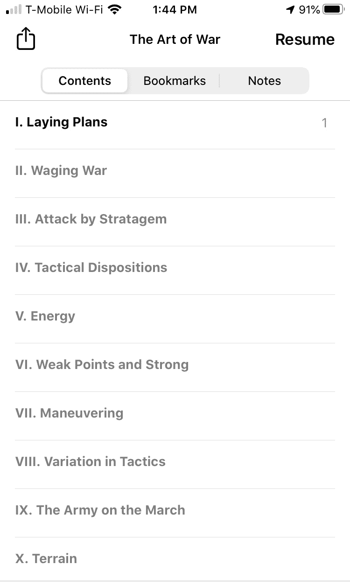

    图 12.13 – ePub 文件中的目录

1.  在 PDF 文件中，目录显示单个页面，如图*图 12.14*所示：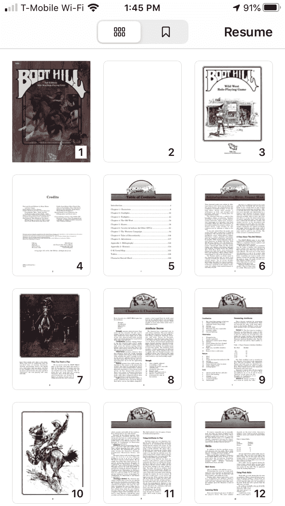

    图 12.14 – PDF 文件中的目录

1.  点击**继续阅读**以返回你正在阅读的页面，或者点击章节标题（ePub）或页面（PDF）以打开新页面。

目录可以帮助你从一个电子书的某个部分跳转到另一个部分，但这可能有些繁琐。作为一个更快的替代方案，考虑搜索特定的文本。

## 电子书搜索

搜索允许你在电子书中查找一个单词或短语。这样，你可以找到文本而无需自己花费时间搜索。

要在电子书中搜索文本，请按照以下步骤操作：

1.  打开一个电子书。你可能需要点击屏幕，以便目录图标出现在屏幕顶部。

1.  点击搜索图标（见图*图 12.12*）。屏幕顶部将出现一个文本字段。

1.  输入一个单词或短语。当你输入时，会出现一个匹配列表，如图*图 12.15*所示：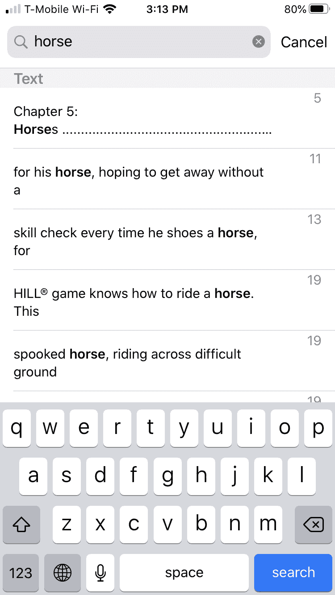

    图 12.15 – 输入时出现的匹配页面

1.  点击页面以跳转到该页面。

当你想查找特定文本时，搜索可能很好，但如果你只是想找到某一页呢？在这种情况下，使用书签会更简单。

## 书签页面

你很少会一次性从头到尾阅读整个电子书。相反，你可能会阅读一些页面，停下来，然后回来继续阅读你离开的地方。为了帮助你标记你离开的地方，你可以放置一个书签。

你可以在电子书中放置多个书签，然后在你想阅读特定页面时选择跳转到哪个书签。

要在电子书中书签页面，请按照以下步骤操作：

1.  打开一个电子书并导航到你想书签的页面。

1.  点击书签图标（见图*图 12.12*）。（你可能需要先点击页面，以便书签图标出现。）书签图标变为红色，以告知你已经放置了书签。

在你放置书签后，你可以稍后查找该书签。查找书签的程序取决于你使用的是 ePub 文件还是 PDF 文件。

要在 ePub 文件中查找书签，请按照以下步骤操作：

1.  打开一个 ePub 电子书并点击目录图标。

1.  点击**书签**标签。出现一个书签列表，如图*图 12.16*所示。如果你在任何一个书签上向左滑动，你可以打开一个**删除**按钮，允许你删除该书签：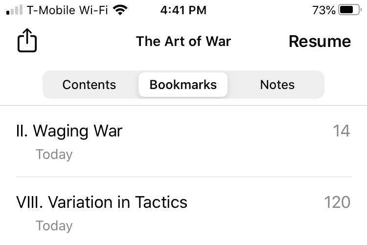

    图 12.16 – 在 ePub 文件中查看书签

1.  点击书签页面以跳转到该页面。屏幕右上角会出现红色的书签图标。

1.  （可选）点击红色的书签图标以移除书签。书签图标现在应该变为白色。

如果你在一个 PDF 文件中创建了一个书签，请按照以下步骤查看书签：

1.  打开一个 PDF 电子书并点击目录图标。

1.  轻触**书签**标签。所有已标记的页面将显示出来，如图*图 12.17*所示：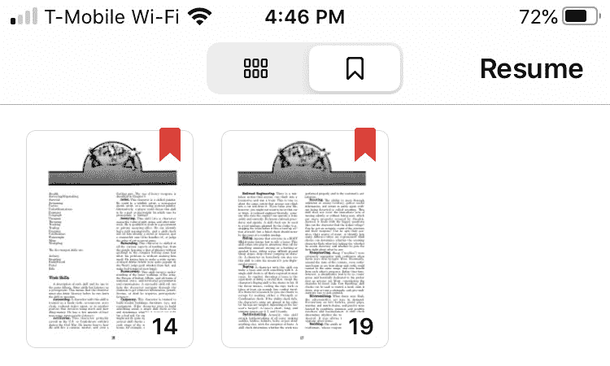

    图 12.17 – 在 PDF 文件中查看书签

1.  轻触你想要阅读的已标记页面。你的选择页面将出现在屏幕上。

1.  （可选）轻触红色书签图标以移除书签。书签图标现在应该显示为白色。

根据你打开的是 ePub 还是 PDF 电子书，你将拥有不同的阅读选项。ePub 电子书允许你增加和减少文本大小以使其更容易阅读。PDF 电子书允许你用颜色标记电子书，例如突出文本。

## 在 ePub 电子书中更改文本大小

当你阅读 ePub 电子书时，你可以选择更改文本大小，以便轻松阅读或在屏幕上显示更多文本。以下是一些你可以更改以使阅读更轻松的选项：

+   屏幕亮度

+   字体大小

+   字体

+   背景颜色

+   电子书水平（默认）或垂直滚动页面

要更改 ePub 电子书的文本大小，请按照以下步骤操作：

1.  打开一个 ePub 电子书并导航到任何页面。

1.  轻触文本大小图标（见*图 12.12*）。出现一个选项菜单，如图*图 12.18*所示：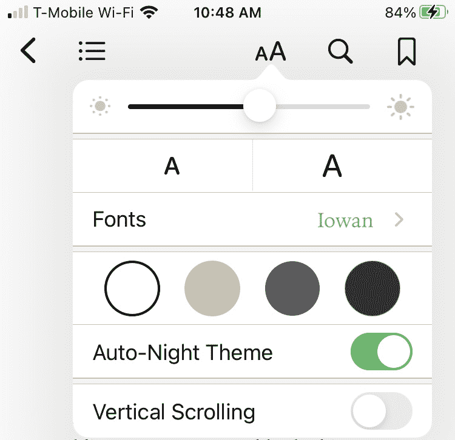

    图 12.18 – 在 ePub 电子书中修改文本

1.  （可选）左右拖动屏幕亮度滑块。

1.  （可选）轻触小或大的**A**图标以减小或增加字体大小。

1.  （可选）轻触**字体**。出现一个可用字体的列表，如图*图 12.19*所示。选择一个字体，然后轻触屏幕左上角的**返回**按钮：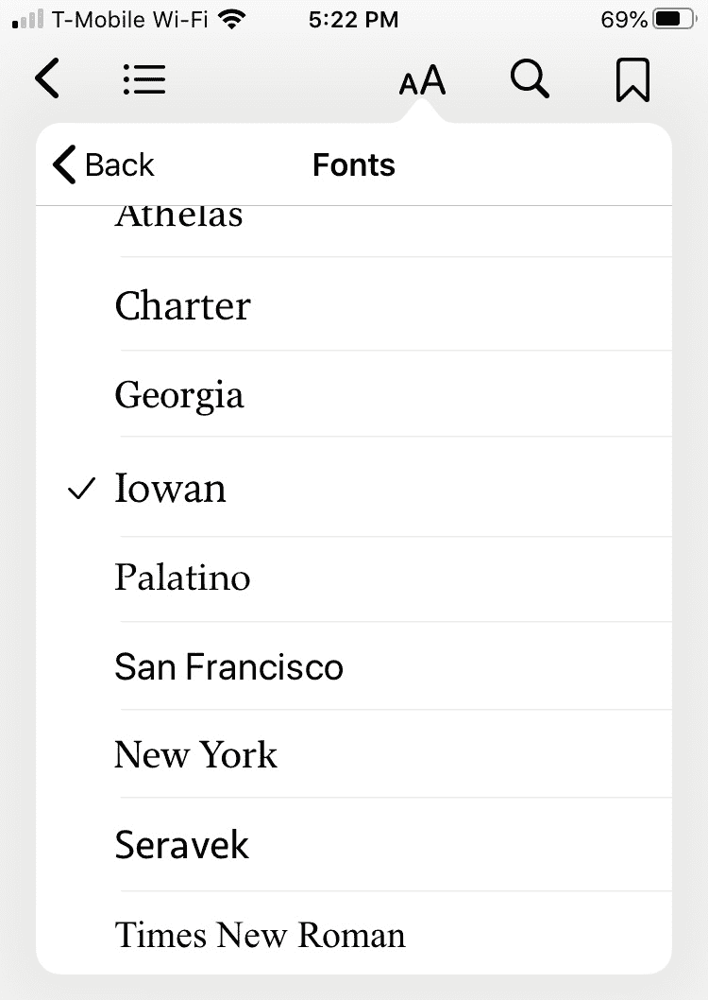

    图 12.19 – 选择新字体

1.  （可选）轻触白色、米色、灰色或黑色等背景颜色。

1.  （可选）如果你想让**书籍**应用根据一天中的时间自动更改背景，请轻触**自动夜间主题**开关。

1.  （可选）轻触**垂直滚动**开关以在水平或垂直滚动文本之间切换。

1.  从菜单上轻触以使其消失。

阅读 ePub 电子书为你提供了使文本更容易阅读的选项。如果你想在不打扰旁边睡觉的人等人的情况下在昏暗的光线下阅读电子书，**自动夜间主题**开关可以使文本更容易阅读，而不需要明亮的屏幕。

除了使电子书更容易阅读外，你可能还想要做可以保存和与他人分享的笔记。

## 在 ePub 电子书中做笔记

经常情况下，当你阅读时，你可能想要记下笔记或保存文本段落。用纸质书，你可以在页边空白处乱写或复印一页。用 ePub 电子书，你也可以做笔记。

要在 ePub 电子书中做笔记，请按照以下步骤操作：

1.  打开一个 ePub 电子书并导航到任何页面。

1.  轻触并按住一个单词以选择它，然后拖动起始和结束标记以选择更多或更少的文本。

1.  点击所选文本以显示菜单，如图*图 12.20*所示：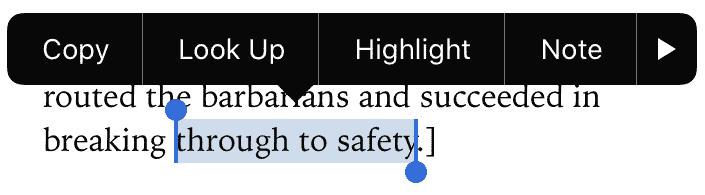

    图 12.20 – 点击所选文本显示菜单

1.  点击**笔记**。会出现笔记屏幕，如图*图 12.21*所示：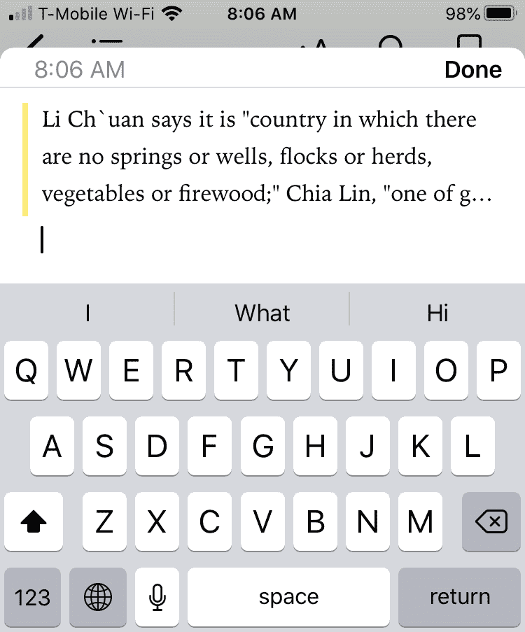

    图 12.21 – 笔记屏幕

1.  在屏幕右上角输入笔记文本并点击**完成**。

保存笔记后，您总是可以稍后查看或删除该笔记。要打开笔记，请按照以下步骤操作：

1.  打开一个 ePub 电子书，导航到任何页面，然后点击页面以在屏幕顶部显示目录图标。

1.  点击目录图标，然后点击**笔记**。会出现笔记列表。

1.  点击笔记以跳转到电子书中的该笔记。如果您在笔记上滑动，您将看到一个删除图标，允许您删除该笔记（如果需要的话）。

记录关于文本的笔记可能很有用，但有时您可能只想在电子书中高亮段落以强调您认为重要的内容。

## ePub 电子书中的高亮

许多人喜欢用彩色标记高亮文本以表示重要文本。在 ePub 电子书中，您可以使用红色下划线或不同颜色来模仿这一点。

要在 ePub 电子书中高亮文本，请按照以下步骤操作：

1.  打开一个 ePub 电子书并导航到任何页面。

1.  点击并按住一个单词以选择它，然后拖动起始和结束标记以选择更多或更少的文本。

1.  点击所选文本以显示菜单（见*图 12.20*）。

1.  点击**高亮**。会出现一个图标菜单，如图*图 12.22*所示：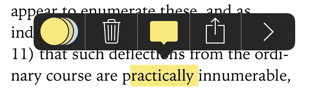

    图 12.22 – 高亮选项菜单

1.  点击最左侧的彩色圆圈。会出现一个高亮颜色菜单，如图*图 12.23*所示：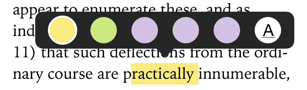

    图 12.23 – 高亮颜色菜单

1.  点击一个颜色以高亮所选文本。

高亮文本后，您总是可以更改颜色或完全移除高亮。要删除或更改高亮文本，请按照以下步骤操作：

1.  打开一个 ePub 电子书并导航到任何页面。

1.  点击高亮文本。会出现一个菜单（见*图 12.22*）。

1.  点击垃圾箱图标以移除高亮或点击最左侧的彩色圆圈，然后点击不同的高亮颜色。

ePub 电子书的一个巨大优势是您可以高亮文本并做笔记。对于 PDF 电子书，您的选项要少得多，但您仍然可以高亮段落。

## 阅读 PDF 电子书

当您阅读 PDF 电子书时，您可以选择更改页面大小或用虚拟笔标记页面。这使您能够高亮或标记文本。

要阅读 PDF 电子书，请按照以下步骤操作：

1.  打开一个 PDF 电子书，导航到任何页面，然后点击页面以在屏幕顶部显示图标，如图*图 12.24*所示：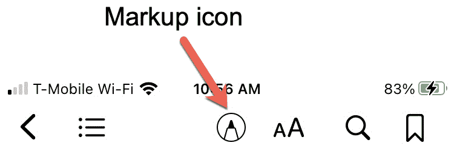

    图 12.24 – PDF 电子书顶部的图标

1.  点击标记图标。菜单会出现在屏幕的顶部和底部，如图*图 12.25*所示：![图 12.25 – PDF 电子书中的顶部和底部标记菜单

    ![img/Figure_12.25_B14100.jpg]

    图 12.25 – PDF 电子书中的顶部和底部标记菜单

1.  在屏幕底部轻触笔型图标，然后用手指在屏幕上滑动来标记任何文本。

1.  如果你犯了错误，在屏幕顶部轻触撤销/重做图标。

1.  当你完成时，在屏幕顶部轻触标记图标。

在 PDF 电子书上标记是一种突出你想保留的重要段落的方法。为了使文本更容易阅读，使用捏合手势缩小或放大文本。

# 摘要

书籍应用确保无论你带着 iPhone 去哪里，你总能找到东西阅读。虽然书籍应用可以显示 ePub 和 PDF 文件，但 ePub 文件在帮助你阅读和记笔记方面提供了更多的灵活性。

抽空在你的 iPhone 上加载一些电子书，这样你就永远不会遇到没有东西可读的情况。虽然阅读纸质书可能感觉更自然，但当你阅读更多电子书时，这会变得越来越容易。随着时间的推移，你会欣赏到拥有几十本甚至几百本电子书而不必携带笨重的书籍所带来的便利。

在下一章中，你将学习如何存储重要联系人。这样，你就能在任何时候联系到你需要联系的人。
