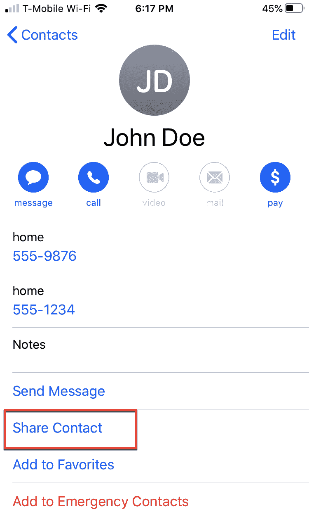

# *第十三章*：存储联系方式

无论你是在工作、在学校，还是只是享受生活，你很可能会遇到你将来想要联系的人。在以前，你可能会在一张纸上交换名片或电话号码，但将某人的姓名和联系方式存储在 iPhone 中要简单得多。

你的 iPhone 不仅能跟踪你需要的所有重要姓名、电话号码和电子邮件地址，还能让你打电话、发短信、FaceTime 或给某人发电子邮件。有了 iPhone，你可以存储关于朋友、亲戚和同事的信息，你可以轻松地与他人分享这些信息。

本章涵盖的主题如下：

+   存储联系方式

+   搜索姓名

+   通过 **联系人**应用进行沟通

+   合并重复联系人

+   识别特殊人物

+   分享联系人

+   删除联系人

+   创建紧急联系人

# 存储联系方式

**联系人**应用是一个简单的数据库，你可以存储关于每个人的所需信息。至少，你需要存储某人的名字和姓氏，以及一种联系该人的方式，例如邮寄地址、电话号码或电子邮件地址。

一旦你存储了某人的姓名和联系方式，你可以选择性地存储任何你希望的信息，例如他们工作的公司、他们的生日、他们喜欢的食物、他们孩子的名字，或者关于他们个性的笔记，这些信息在处理同事或客户时可能会很有用。

与收集可能会丢失的名片不同，只要你拥有 iPhone，你总是会拥有你的联系方式。为了保护你的联系方式，你可以将其复制到你的 Macintosh 上，这样即使你丢失了 iPhone，你也会有一个副本。

首先，让我们看看如何存储你自己的联系方式。你希望自己的联系方式保持最新，以便与他人分享。

要创建自己的联系方式，请按照以下步骤操作：

1.  在主屏幕上轻触 **联系人**应用。

1.  按屏幕顶部的你的名字，如图 *图 13.1* 所示：

    图 13.1 – **联系人**屏幕

1.  在屏幕右上角轻触 **编辑**（**+** 图标）。添加你的名字、电话号码以及你想要添加的其他信息，例如电子邮件地址、邮寄地址以及你想要保存和与他人分享的其他信息。

1.  轻触 **完成**。

一旦你存储了自己的联系方式，你就可以开始添加其他人的姓名和联系方式了。要添加新的联系人，请按照以下步骤操作：

1.  在主屏幕上轻触 **联系人**应用。**联系人**屏幕出现。

1.  点击屏幕右上角的**+**图标。会出现一个**新建联系人**屏幕，允许你添加某人的联系信息，如图*13.2*所示：

    图 13.2 – 新建联系人屏幕

1.  输入任何信息，例如一个人的姓名和电话号码。

1.  （可选）点击**添加照片**。这允许你使用 memoji 代表某人或使用你的 iPhone 摄像头为某人拍照，如图*13.3*所示：

    图 13.3 – 添加照片到联系信息

1.  点击**完成**。现在**联系人**应用已存储你的数据。

一旦你存储了一个或多个姓名和联系信息，你可能会想要再次找到这些信息。这意味着你需要知道所有不同的方式来搜索存储在**联系人**应用中的信息。

搜索姓名

在**联系人**应用中查找特定姓名的最简单方法是向下滚动整个联系人列表，直到找到你想要的姓名。第二种方法是点击**联系人**屏幕右侧的字母，跳转到以特定字母开头的姓名，例如 R 或 W。

更快的方法是搜索姓名。这样，你只需输入姓名的一部分，就可以看到所有可能的匹配项。如果你只知道某人的名字或者不确定某人姓名的完整拼写，搜索特别有用。

要在**联系人**应用中搜索姓名，请按照以下步骤操作：

1.  点击屏幕顶部的**搜索**文本框。

1.  输入几个字母。每次你输入一个字母，**联系人**应用就会缩小可能的匹配列表，如图*13.4*所示：

    图 13.4 – 搜索姓名

1.  点击一个姓名以显示该人的更多信息。

你搜索的文本越多，匹配列表就越窄。然而，如果你不确定某人的姓名拼写，请输入更少的字符并浏览匹配列表。

# 通过**联系人**应用进行沟通

**联系人**应用不仅仅存储姓名和联系信息。你还可以使用**联系人**应用与他人沟通。通常，如果你想发送电子邮件、打电话或发送短信，你必须输入该人的联系信息。

由于**联系人**应用已经包含了某人的联系信息，你只需要打开**联系人**应用，找到你想联系的人，然后选择最佳联系方式，例如电子邮件、FaceTime、电话或短信。

要了解如何使用**联系人**应用来联系某人，请按照以下步骤操作：

1.  点击主屏幕上的**联系人**应用。**联系人**应用屏幕会出现。

1.  点击你想要联系的人的名字。该人的联系方式将显示在屏幕上，如图*图 13.5*所示：![图 13.5 – 查看某人的联系方式

    ![img/Figure_13.05_B14100.jpg]

    图 13.5 – 查看某人的联系方式

1.  点击电话号码或电子邮件地址进行电话通话、发送电子邮件消息或进行 FaceTime 通话。点击**消息**图标发送短信。

通过首先打开**联系人**应用，你可以选择你想联系的人，而无需麻烦地输入那个人的电话号码或电子邮件地址。只要正确输入了某人的电话号码或电子邮件地址，你的 iPhone 就可以使用该正确联系信息拨打电话或向其他人发送电子邮件消息。

使用**联系人**应用的关键是尽可能添加关于一个人的联系方式，因为你永远不知道将来你可能如何联系那个人。

# 合并重复联系人

在许多情况下，你可能添加了某人的信息，然后突然意识到你之前已经添加过关于此人的信息，结果你有了重复的名字，但联系方式不同。

例如，想象你在聚会上遇到某人并获得了他们的名字和电子邮件地址。后来，你与那个人取得联系以进行商务活动，因此你输入了那个人的名字、公司和电话号码。此时，你将会有同一个人存储了两次。

如果你想清楚地分离某人的个人信息和商务联系方式，为单个人创建重复信息可能很有用。然而，在大多数情况下，你可能希望将一个人的所有联系方式都归到一个名字下。

幸运的是，如果你发现自己有关于同一个人的重复联系方式，你可以合并或链接这两个联系方式屏幕，合并成一个。

要了解如何合并重复联系人，你首先需要在**联系人**应用中存储一个名字。然后，你需要创建一个重复的名字，以便与同一名字下存储的现有联系方式合并。

要了解如何合并联系人，请按照以下步骤操作：

1.  点击主屏幕上的**联系人**应用。**联系人**应用屏幕将出现。

1.  点击**+**图标。将出现一个**新建联系人**屏幕（见图*图 13.2*）。

1.  输入一个名字（例如 `John Doe`）和联系方式（例如电话号码），点击**完成**，然后点击**返回**按钮回到**联系人**应用中存储的所有名字列表。此时，你已经在**联系人**应用中存储了一个 John Doe。

1.  点击**+**图标。将出现一个**新建联系人**屏幕（见图*图 13.2*）。

1.  输入相同的名字（例如 `John Doe`）但不同的联系方式（例如不同的电话号码）。

1.  滚动到**新建联系人**屏幕的底部以查看**链接联系人…**按钮，如图*图 13.6*所示：

    图 13.6 – 链接联系人按钮出现在新建联系人屏幕底部

1.  轻触 **链接联系人…**。**联系人** 应用屏幕再次出现。然而，您当前正在编辑的名字将变暗，如图 *图 13.7* 所示：

    图 13.7 – 变暗的名字标识您当前正在编辑的联系人信息

1.  轻触您想要与变暗的名字合并的非变暗重复名字。非变暗的名字的联系人信息将出现在屏幕上，并在右上角出现一个 **链接** 按钮，如图 *图 13.8* 所示：

    图 13.8 – 在右上角出现一个链接按钮

1.  轻触 **链接**，然后轻触 **完成**。重复的联系人信息现在合并为一个名字。

删除重复的名字可以使您的联系人列表更加简洁。随着您添加更多的联系人，您可能会遇到一些比其他人更重要的人。为了识别这些特别的人，请花些额外的时间将您联系人列表中的名字标记为特别重要。

识别特别人物

您的联系人列表可能包含您需要知道的人和您想了解的人。对于您最关心的特别人物，请花些时间以下列方式之一来识别您生活中的重要人物：

+   生日

+   收藏夹

通过添加某人的生日，您可以在 **日历** 应用中看到该人的生日。如果您经常查看 **日历** 应用以查看您可能在那一天有的任何预约，您也会看到任何人的生日。

通过指定某人为收藏夹，您可以在 **电话** 应用中创建一个收藏夹列表，以便您可以快速找到您喜欢的人，并无需翻遍整个联系人列表即可发送短信或给他们打电话。

## 显示生日

要使 **日历** 应用显示某人的生日，您必须首先定义该人的生日。要定义生日，请按照以下步骤操作：

1.  在主屏幕上轻触 **联系人** 应用。**联系人** 应用屏幕出现。

1.  轻触您想要修改的名字。

1.  在屏幕右上角轻触 **编辑**。

1.  向下滚动，直到找到如图 *图 13.9* 所示的 **添加生日** 按钮：

    图 13.9 – 添加生日按钮

1.  轻触 **添加生日**。出现日期选择器，如图 *图 13.10* 所示：

    图 13.10 – 用于定义生日的日期选择器

1.  为该人的生日选择一个日期，然后轻触 **完成**。

1.  在主屏幕上轻触 **日历** 应用。**日历** 屏幕出现。

1.  导航到包含您联系人之一生日月份，然后点击那个日期。出现该人生日提醒，如图 13.11 所示：

    图 13.11 – 日历应用中的生日提醒

1.  点击日历屏幕底部的联系人生日提醒。该联系人的联系信息出现，允许您通过电话、FaceTime、电子邮件或短信与他们联系。

如果某人对您很重要，您可以将其指定为收藏夹。这样，当您想通过**电话**应用拨打他们时，可以一键访问他们。

## 定义收藏夹

每个人都有最喜欢的人，因此您可以指定某些人为收藏夹。当您指定某人为收藏夹时，他们的名字和电话号码会出现在**电话**应用的**收藏**列表中。这样，您可以从您的收藏夹列表而不是整个联系人列表中快速拨打那个人的电话。

要了解如何定义和使用收藏夹，请按照以下步骤操作：

1.  点击主屏幕上的**联系人**应用。**联系人**应用屏幕出现。

1.  点击要修改的名字。**添加到收藏**链接出现在屏幕底部附近，如图 13.12 所示：

    图 13.12 – 添加到收藏链接

1.  点击**添加到收藏**。出现一个菜单，让您存储某人的电话号码用于短信或电话，如图 13.13 所示：

    图 13.13 – 选择联系人的首选联系方式

1.  点击**消息**、**电话**、**视频**或**邮件**，然后选择用于短信或电话的一个电话号码（如果存储了多个电话号码）。

1.  点击**电话**应用，然后点击屏幕底部的**收藏**图标。出现您最喜欢的联系人列表。现在您只需点击一个名字，就可以给那个人发送短信或打电话。

1.  （可选）要从此**收藏**列表中删除一个名字，向左滑动并点击出现的**删除**图标。

随着您收集更多的名字和联系信息，您可能拥有您希望与他人分享的有价值信息。如果您想与他人分享您的联系信息，您可以快速轻松地做到这一点。

# 分享联系人

当您有某人的联系信息时，您可能希望与他人分享。虽然您可以详尽地读出某人的电子邮件地址和电话号码，以及他们的社交媒体联系方式，但直接将这些信息发送给某人以便他们加载到自己的**联系人**数据库中要容易得多。

要分享联系人，请按照以下步骤操作：

1.  点击主屏幕上的**联系人**应用。**联系人**应用屏幕出现。

1.  轻触你想要与他人分享的名字。屏幕底部附近出现**分享联系人**按钮，如图 13.14 所示：

    图 13.14 – 分享联系人的按钮

1.  轻触**分享联系人**。出现一个包含人员和他们接收联系信息方式的列表，如图 13.15 所示：

    图 13.15 – 选择如何分享联系信息

1.  轻触一个人员或一个发送联系信息的方法，例如**信息**或**邮件**。

在商业活动中，分享重要的联系人信息可能至关重要，但最终你可能发现你不再需要某些名字，无论是为了工作还是个人用途。这就是你需要精简你的联系人名单的时候。

# 删除联系人

无论某人的联系信息可能多么有价值，最终你可能想要删除它，因为这个人搬走了或换了工作。当这种情况发生时，你可以删除一个联系人。

实际上，你应该定期审查你的联系人名单，以删除任何你不再需要保存的名字。这样，你可以只保留生活中最重要的人的名单。

要删除联系人，请按照以下步骤操作：

1.  轻触主屏幕上的**联系人**应用。**联系人**应用屏幕出现。

1.  轻触你想要删除的名字。

1.  轻触**编辑**并滚动到屏幕底部。

1.  轻触**删除联系人**。屏幕底部出现**删除联系人**和**取消**按钮。

1.  轻触**删除联系人**。你的 iPhone 将删除你选择的联系人。

在你的联系名单中，可能最重要的一类人是在你受伤时当局应该联系的人。这就是你需要定义紧急联系人时的情况。

# 创建紧急联系人

如果你发生车祸或因任何原因生病而独自一人，没有人会知道该联系谁或你可能处于什么类型的医疗状况。这就是为什么你应该花几分钟时间做以下事情：

+   定义你自己的医疗信息

+   列出你的紧急联系人

当你定义自己的医疗历史并定义紧急联系人名单时，任何人都可以从你的 iPhone 锁屏上检索这些关键信息。这样，他们不需要与你交谈或等待你解锁 iPhone。

第一步是定义你自己的医疗历史，例如你目前可能正在服用的药物类型或你可能对某些药物或食物过敏。你也可以定义任何你认为可能有助于急救人员的信息，例如你的血型。

第二步是定义在**联系人**应用中，急救人员应该联系的人，例如你的配偶或父母。

要为自己定义医疗信息，请按照以下步骤操作：

1.  在主屏幕上轻触**联系人**应用。**联系人**应用屏幕出现。

1.  轻触屏幕顶部的你的名字。

1.  在屏幕右上角点击**编辑**。

1.  向下滚动并点击**创建或编辑医疗 ID**。出现**医疗 ID**屏幕，你可以在此输入你的医疗背景，例如你正在使用的药物或你有的状况，如图*图 13.16*所示：

    图 13.16 – 医疗 ID 屏幕

    此信息可以从你的 iPhone 锁定屏幕访问。这样，如果你处于紧急情况，急救人员可以点击 iPhone 锁定屏幕上的**医疗 ID**按钮来查看你可能保存的任何医疗信息。

1.  向下滚动，直到看到**紧急联系人**类别，如图*图 13.17*所示：

    图 13.17 – 紧急**联系人**类别

1.  点击**添加紧急联系人**。出现**联系人**屏幕。

1.  点击一个名字。出现**关系**屏幕，如图*图 13.18*所示：

    图 13.18 – 关系屏幕

1.  点击一个关系，例如**父母**或**配偶**。根据需要重复*步骤 7 和 8*。

1.  点击**完成**。

没有人可能永远需要你的医疗信息和紧急联系人，但为了以防万一发生紧急情况，现在还是安全为好。

# 摘要

在最简单的层面上，**联系人**应用可以存储你可以在任何时候检索的姓名和联系信息。轻触一下，你可以发送电子邮件消息、打电话或 FaceTime 通话，或发送短信。如果有人给你他们的网站或社交媒体联系信息，你也可以通过这种方式联系那个人。

除了存储姓名和联系信息外，你还可以直接从**联系人**应用中联系人们。这样可以节省你多次输入电子邮件地址或电话号码的时间。

最重要的是，存储你的医疗信息和紧急联系人信息。这样，如果你发生意外，当局将能够联系你的亲人并获取你的医疗记录。

存储姓名和联系信息很重要，但通常当你需要打电话或见某些人时，你需要这些信息。因此，在下一章中，你将学习如何设置约会和提醒。这样，你就不会再迟到或错过约会了。
