# 第十五章：*第十五章*：撰写笔记和录制语音备忘录

当你不在办公桌旁时，很容易突然有灵感，需要捕捉你的想法。很多时候，人们会完全忘记他们的想法。其他时候，你可能需要在任何你能找到的碎片纸上记下你的想法，比如纸巾或信封的背面。理想情况下，你应该随时携带笔记本和笔或铅笔，因为你永远不知道什么时候会有一个好的想法突然出现，你需要把它写下来。

幸运的是，有了你的 iPhone，你将始终有两种方式在任何时候记录你的想法。首先，你可以使用**笔记**应用输入想法，它像一个简单的文字处理器，用于捕捉少量的文本。其次，你可以将你的想法口述给语音备忘录应用，这样你就可以捕捉到你的语音想法的音频文件。

无论灵感在哪里出现，你都可以通过使用你的 iPhone 将你的想法以书面文本或语音音频的形式记录下来。现在你只需要记得随时携带你的 iPhone。

本章涵盖的主题如下：

+   创建笔记和编辑文本

+   在笔记中添加图片和绘图

+   录制语音备忘录

# 做笔记

**笔记**应用模仿了纸质笔记本。虽然纸质笔记本的页数有限，每页的空间也有限，但**笔记**应用允许你创建无限数量的页面，且页面大小无限。

一旦你在**笔记**应用中捕捉到你的想法，你可以与他人分享，或者简单地从**笔记**应用中复制粘贴文本到另一个应用，例如 Pages 文字处理软件。

## 理解文件夹

为了帮助你组织笔记，**笔记**应用可以将它们存储在文件夹中，就像电脑上的文件夹一样。想法是为存储相关笔记创建单独的文件夹，例如为工作项目创建一个文件夹，为个人信息创建另一个文件夹。通过创建和使用文件夹，你可以更好地组织你的笔记，帮助你再次找到它们。

要了解如何创建文件夹，请按照以下步骤操作：

1.  在主屏幕上点击**笔记**应用。

1.  点击屏幕左上角的返回按钮，直到出现**文件夹**屏幕。**文件夹**屏幕显示了 iCloud（在顶部）和你的 iPhone 中笔记的位置，如图*图 15.1*所示：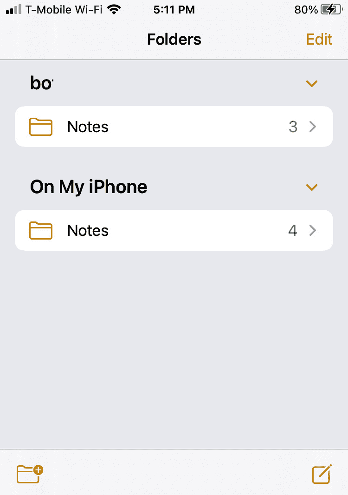

    图 15.1 – 文件夹屏幕

1.  点击屏幕左下角的**新建文件夹**。会出现一个**新建文件夹**对话框，如图*图 15.2*所示：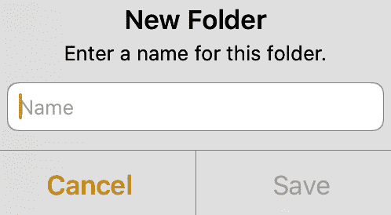

    图 15.2 – 新文件夹屏幕

1.  为你的文件夹输入一个描述性的名称，然后点击**保存**。你的新文件夹将出现在**在我的 iPhone 上**类别下。

一旦你创建了文件夹，你就可以在那个文件夹中存储笔记。要删除文件夹，请按照以下步骤操作：

1.  在主屏幕上点击**笔记**应用。

1.  点击屏幕左上角的返回按钮，直到出现**文件夹**屏幕。

1.  向左滑动该文件夹，并点击右侧出现的删除图标。出现一个对话框，询问您是否确认要删除包含任何笔记和子文件夹的文件夹。

1.  点击**确定**。

删除文件夹后，**笔记**应用将删除的文件夹存储在一个特殊的**最近删除**文件夹中，这将给您 30 天的时间来恢复笔记，在 iPhone 永久删除它们之前。

要从**最近删除**文件夹中恢复文件夹，请按照以下步骤操作：

1.  点击主屏幕上的**笔记**应用。

1.  点击屏幕左上角的返回按钮，直到出现**文件夹**屏幕。**最近删除**文件夹出现，如图*图 15.3*所示：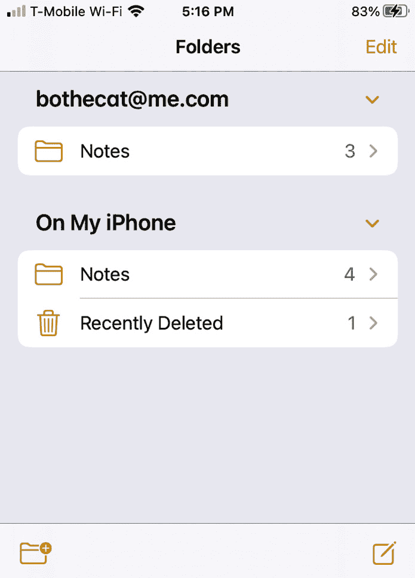

    图 15.3 – 删除至少一个文件夹时出现最近删除文件夹

1.  点击**最近删除**文件夹。出现**最近删除**屏幕，列出您已删除的所有笔记。

1.  在笔记上向左滑动以显示文件夹和删除图标，如图*图 15.4*所示：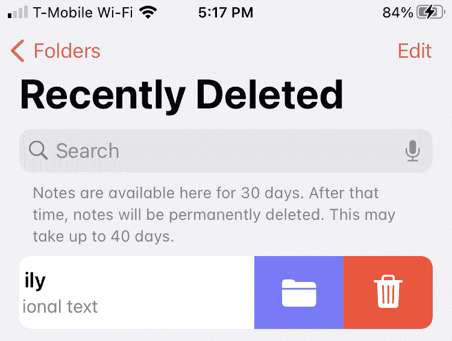

    图 15.4 – 最近删除屏幕显示之前删除的笔记

1.  点击**文件夹**图标。出现**选择一个文件夹**屏幕，让您选择可以放置笔记的文件夹，如图*图 15.5*所示：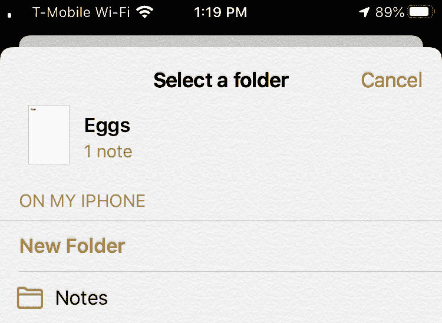

    图 15.5 – 选择一个文件夹屏幕

1.  点击一个文件夹或点击**新建文件夹**以将您的笔记存储在新文件夹中。

一旦您了解了文件夹如何让您在 iPhone 上组织笔记，下一步就是开始创建笔记，以便您可以捕捉您的想法。

## 创建新笔记

当您创建新笔记时，您必须定义您想要存储该笔记的文件夹。当然，您以后总是可以将该笔记移动到不同的文件夹。

要创建新笔记，请按照以下步骤操作：

1.  点击主屏幕上的**笔记**应用。

1.  点击屏幕左上角的返回按钮，直到出现**文件夹**屏幕。

1.  点击您想要存储新笔记的文件夹。注意，屏幕底部出现了一个**新建笔记**图标，如图*图 15.6*所示：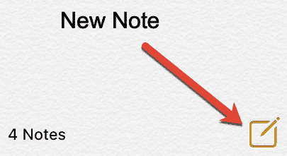

    图 15.6 – 新笔记图标

1.  点击**新建笔记**图标。出现一个空白笔记屏幕，如图*图 15.7*所示：

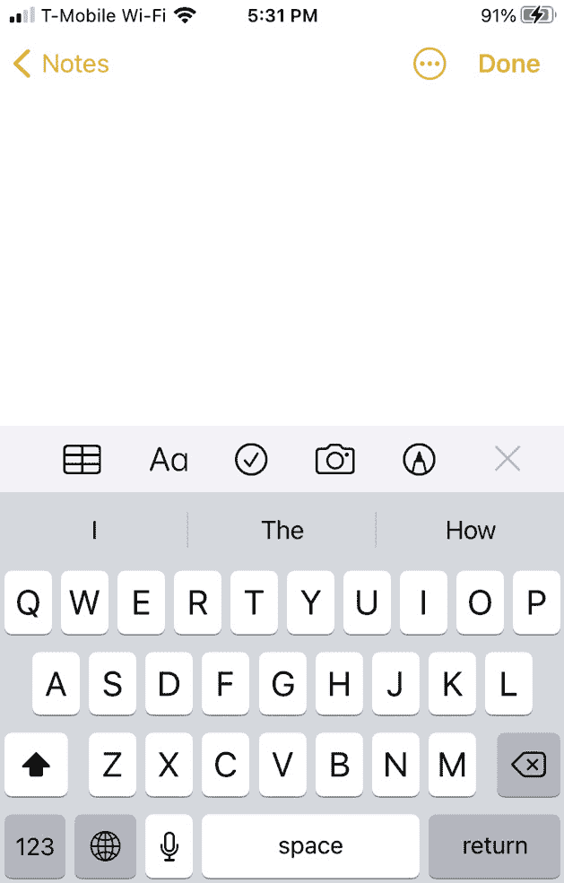

图 15.7 – 新笔记

创建新笔记后，您有几种选择：

+   打字文本。

+   创建表格。

+   创建清单。

+   从照片库或相机添加图片。

+   绘画。

# 打字和编辑文本

笔记最常见的用途是打字和编辑文本。要在笔记中打字，只需点击想要插入文本的位置，并使用屏幕底部出现的虚拟键盘进行打字。

要选择单个单词，您有两个选择：

+   长按单词。

+   双击单词。

要选择整个段落，在该段落中的任何单词上三击。一旦选择任何文本，就会立即出现一个起始和结束的垂直线，如图 15.8 所示：

图 15.8 – 两个垂直线定义所选文本的开始和结束

要选择更多或更少的文本，将这两个垂直线向任何方向拖动。点击所选文本，将出现一个弹出菜单，让您选择**剪切**、**复制**和**粘贴**命令。

**剪切**删除所选文本。**复制**复制所选文本。**粘贴**插入之前剪切或复制的文本。如果您没有剪切或复制任何文本，粘贴命令将不会执行任何操作。

通过使用**剪切**和**粘贴**命令，您可以将文本从一个位置移动到另一个位置。通过使用**复制**和**粘贴**命令，您可以将文本复制到第二个位置。

# 格式化文本

在输入文本之后，您可以选择格式化该文本以选择不同的外观或样式（粗体、斜体或下划线），以及缩进文本或创建编号或项目符号列表。格式化为您提供了一种强调笔记中存储的某些或全部文本的方法。

要在笔记中格式化文本，请按照以下步骤操作：

1.  点击主屏幕上的**笔记**应用。

1.  点击包含您想要格式化文本的笔记。

1.  选择您想要格式化的文本（双击一个单词并/或修改选择）。注意虚拟键盘上方出现的**+**图标，如图 15.9 所示：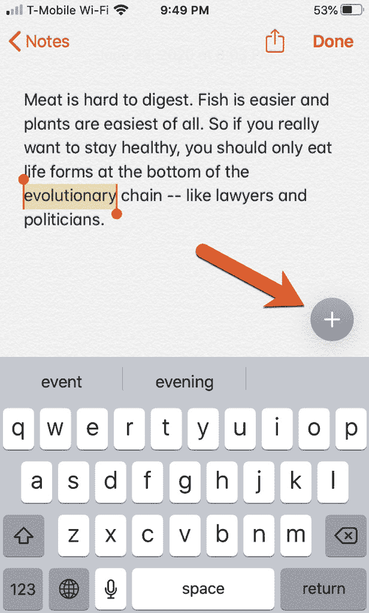

    图 15.9 – 虚拟键盘上方的+图标

1.  点击**+**图标。在虚拟键盘上方出现一个图标列表，如图 15.10 所示：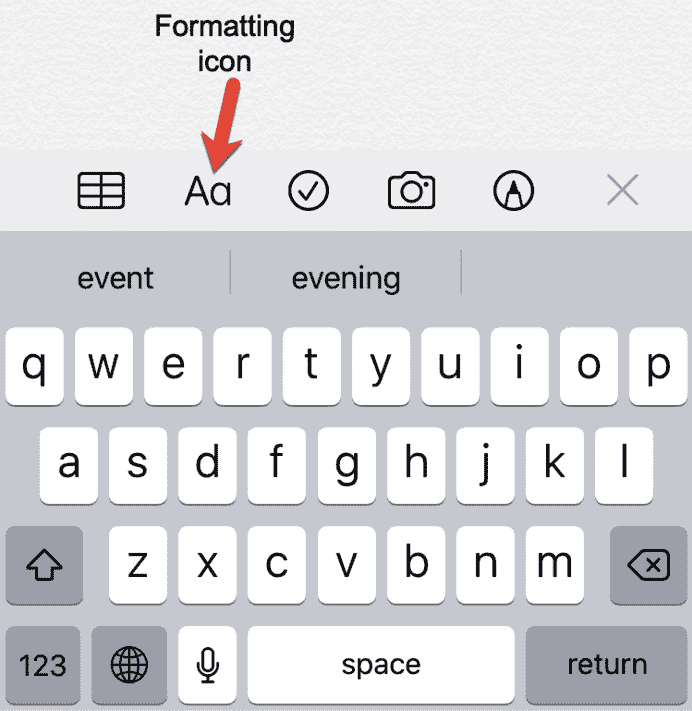

    图 15.10 – 虚拟键盘上方的图标

1.  点击格式化图标。屏幕底部出现格式化选项列表，如图 15.11 所示：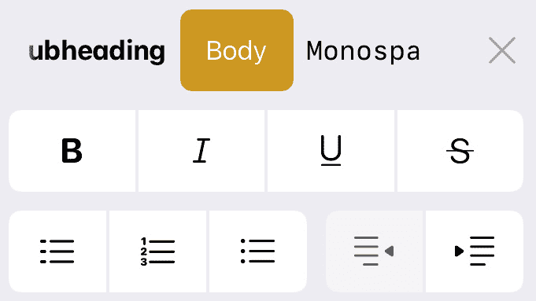

    图 15.11 – 格式化选项

1.  在高亮的**正文**上左右滑动您的手指，您将看到其他选项，例如**标题**和**副标题**。通过点击这些其他选项之一，您可以更改所选文本的外观。

1.  点击粗体、斜体、下划线或删除线图标以更改所选文本。

1.  在左下角点击三个不同的列表图标，以创建虚线、编号或项目符号列表。

1.  再次点击**正文**将列表转换回文本。

1.  在底部右角点击左右缩进图标。

1.  点击这些格式化选项右上角的关闭（**X**）图标，使它们消失。虚拟键盘再次出现。

当您输入文本时，您可能希望将文本对齐到行和列中。与其手动尝试对齐文本，不如创建一个表格要容易得多。

# 使用表格

表格允许您以行和列的形式组织数据，就像电子表格一样。通过使用表格，您可以以普通缩进无法实现的方式对齐文本。

要了解如何创建和使用表格，请按照以下步骤操作：

1.  在主屏幕上轻触**笔记**应用。

1.  轻触要添加表格的笔记。虚拟键盘和图标行出现。表格图标位于最左侧，如图*图 15.12*所示：![Figure 15.12 – The Table icon

    ![img/Figure_15.12_B14100.jpg]

    图 15.12 – The Table icon

1.  轻触**表格**图标。表格出现，如图*图 15.13*所示：![Figure 15.13 – A table in a note

    ![img/Figure_15.13_B14100.jpg]

    图 15.13 – 笔记中的表格

1.  在单元格中轻触并输入文本。

每次创建表格时，**笔记**应用都会创建一个 2 x 2 的表格。如果需要，您可以添加或删除行和列。

## 修改表格行和列

当您创建表格时，您可能需要额外的行或列。同样，表格可能有太多的行和列。在任何时候，您都可以调整表格的大小。

要修改表格中的行或列，请按照以下步骤操作：

1.  轻触主屏幕上的**笔记**应用。

1.  轻触要修改的表格内部。一个三点图标出现在列上方和行左侧（见图*图 15.13*）。

1.  轻触此三点图标以显示一个菜单，用于添加或删除行或列，如图*图 15.14*所示：![Figure 15.14 – Adding or deleting rows and columns

    ![img/Figure_15.14_B14100.jpg]

    图 15.14 – 添加或删除行和列

1.  （可选）：拖动行或列的大小以选择要删除的多行或多列。

1.  轻触选项，例如**添加行**或**删除列**以修改表格的大小。

请记住，如果您删除行或列，您也将删除该行或列中存储的任何文本。

## 移动和复制行和列

有时，您可能在一行或一列中有文本，然后决定它应该出现在表格中的其他位置。您可以使用剪切、复制和粘贴命令对包含文本的整个行或列进行操作。

要移动或复制表格中行或列中存储的文本，请按照以下步骤操作：

1.  在主屏幕上轻触**笔记**应用。

1.  轻触要剪切或复制的列上方的三点图标或行左侧。出现一个菜单，如图*图 15.15*所示：![Figure 15.15 – Cutting or copying a row or column

    ![img/Figure_15.15_B14100.jpg]

    图 15.15 – 剪切或复制行或列

1.  轻触**剪切**或**复制**。（**剪切**命令仅剪切文本，而不是实际的行或列。）

1.  在要粘贴剪切或复制的文本的行或列中轻触。

1.  轻触列上方的三点图标或行左侧。出现一个菜单，如图*图 15.16*所示：![Figure 15.16 – Pasting cut or copied text

    ![img/Figure_15.16_B14100.jpg]

    图 15.16 – 粘贴剪切或复制的文本

1.  点击**粘贴**。你的剪切或复制文本将出现在行或列中。

在表格周围移动或复制文本可以修改表格，但有时你可能想要复制整个表格以便在其他笔记中粘贴。

## 复制表格

你可以复制整个表格以及其中存储的任何文本，而不仅仅是行或列中的文本。

要复制表格，请按照以下步骤操作：

1.  在主屏幕上点击**笔记**应用。

1.  点击你想要复制的表格内部。注意，虚拟键盘上方的表格图标现在在左下角显示一个黑点，如图 15.17 所示：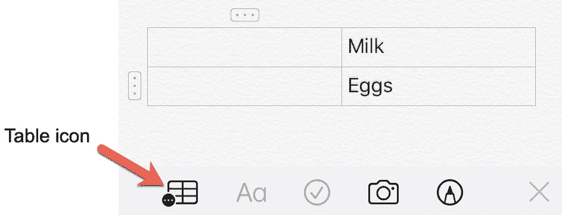

    图 15.17 – 光标在表格内时表格图标

1.  点击表格图标。屏幕上出现选项列表，如图 15.18 所示：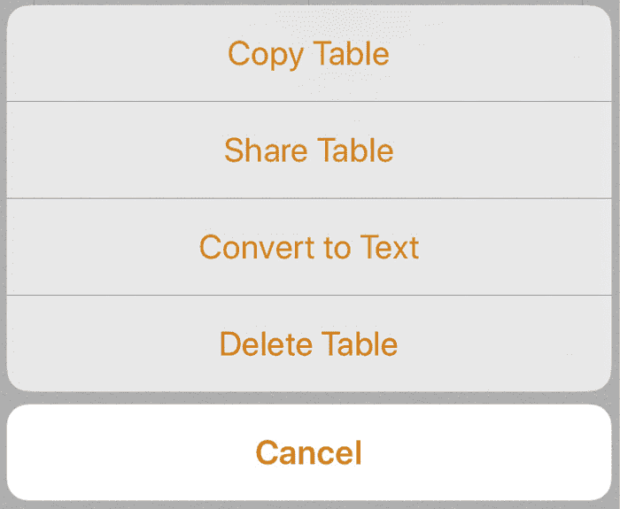

    图 15.18 – 操作整个表格的选项

1.  点击**复制表格**。

1.  在你想要粘贴复制表格的新位置上按住指尖。将出现一个菜单。

1.  点击**粘贴**。你的复制表格现在出现。

复制表格可能很方便，但如果你在图 15.18 中注意到选项列表，还有其他一些选项也是可用的，例如分享表格。

## 分享表格

如果你创建了一个包含文本的表格，你可能想要通过 AirDrop、**消息**、邮件或安装在 iPhone 上的其他应用与他人分享这些信息。通过使用 AirDrop，你可以将表格作为文本文件发送到另一台苹果产品，如 Mac。通过使用**消息**或邮件，你可以将你的表格副本发送给朋友或同事。

要分享表格，请按照以下步骤操作：

1.  在主屏幕上点击**笔记**应用。

1.  点击你想要分享的表格内部。注意，虚拟键盘上方的表格图标现在在左下角显示一个黑点（见图 15.17）。

1.  点击**表格**图标。屏幕上出现选项列表（见图 15.18）。

1.  点击**分享表格**。屏幕底部将出现分享表格的方式列表，如图 15.19 所示：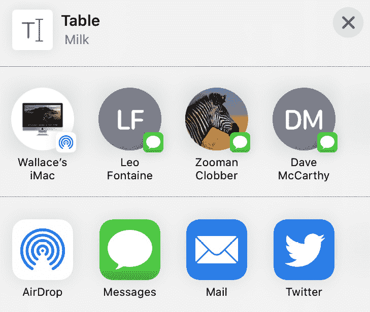

    图 15.19 – 分享表格的选项

1.  点击一个名字或方法来分享你的表格，例如点击**AirDrop**、**消息**或**邮件**。

表格包含文本，但如果你不再想要在行和列中对齐文本，你可以将表格转换为纯文本。

## 将表格转换为文本

表格可以用于对齐文本，但表格的线条可能会分散注意力。因此，你可能想要将表格转换为文本。*图 15.20*显示了表格以及将表格转换为文本后的文本显示：

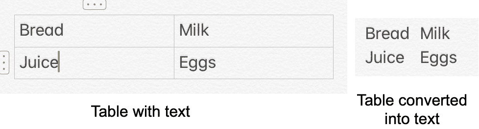

图 15.20 – 将表格转换为文本

要将表格转换为文本，请按照以下步骤操作：

1.  在主屏幕上点击**笔记**应用。

1.  点击你想要转换为表格的表格内部。注意虚拟键盘上方的表格图标现在在左下角显示一个黑点（见*图 15.17*）。

1.  点击表格图标。屏幕上会出现一个选项列表（见*图 15.18*）。

1.  点击**转换为表格**。文本现在不再显示表格。

将表格转换为文本会移除表格，但保留其文本。然而，你可能最终想要删除表格及其内部的所有文本。

## 删除表格

当你不再需要表格时，你可以删除整个表格，包括其中存储的所有文本。

要删除表格，请按照以下步骤操作：

1.  点击主屏幕上的**笔记**应用。

1.  点击你想要删除的表格内部。注意虚拟键盘上方的表格图标现在在左下角显示一个黑点（见*图 15.17*）。

1.  点击表格图标。屏幕上会出现一个选项列表（见*图 15.18*）。

1.  点击**删除表格**。文本现在不再显示表格。

表格可以帮助组织文本，但如果你想要另一种组织文本的方法，可以考虑使用清单。

# 创建清单

许多人通过记笔记来创建待办事项清单和需要完成的任务清单。清单允许你创建一个项目列表，并且可以点击每个项目左侧的圆圈来标记已完成。

要了解如何创建清单，请按照以下步骤操作：

1.  点击主屏幕上的**笔记**应用。

1.  点击你想要创建清单的位置。注意虚拟键盘上方的**+**图标（见*图 15.9*）。（如果你已经在虚拟键盘上方看到了图标，请跳过此步骤。）

1.  点击**+**图标以显示虚拟键盘上方的图标。

1.  如*图 15.21*所示：

    图 15.21 – 清单图标

1.  点击**清单**图标。在笔记中会出现一个空圆圈，

1.  输入一些文本，然后在虚拟键盘上的**回车键**上点击以创建另一个清单项。

1.  再次点击**清单**图标以停止创建空圆圈。

一旦你创建了一个清单，你总是可以通过点击每个项目左侧出现的空圆圈来标记项目，如图*图 15.22*所示：

图 15.22 – 清单中勾选的项目标记

点击这个圆圈会在显示空圆圈和其中的勾选标记之间切换。

# 向笔记添加图片

笔记的全部目的都是为了捕捉你的想法和信息。有时，键入文本就足够了，但有时，你可能想要从 iPhone 的相机中捕捉图片，或者使用你照片库中存储的图片。

**笔记**应用提供了三种将图片添加到笔记中的方法，如图*图 15.23*所示：

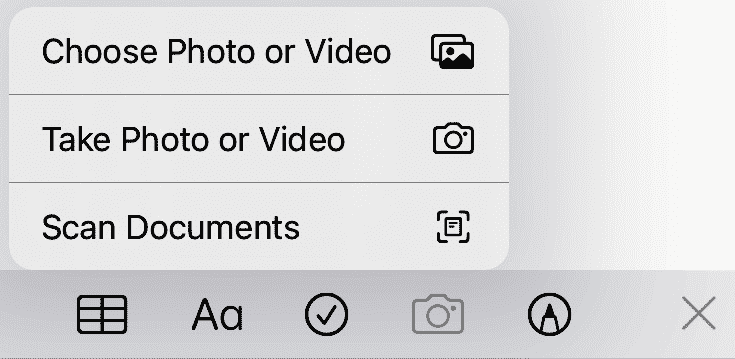

图 15.23 – 向笔记添加图片的三个选项

选项如下：

+   **扫描文档** – 允许您裁剪用相机拍摄的图像，但不会将其保存在照片库中

+   **拍照或录像** – 从 iPhone 相机捕捉照片或视频，但不会将其保存在照片库中

+   **选择照片或视频** – 从照片库中检索图像或视频

## 将图像裁剪到笔记中

**扫描文档**选项旨在捕捉重要文件的图像并允许您裁剪它们，但您可以使用此选项使用 iPhone 相机捕捉任何图像并在将其插入笔记之前进行裁剪。

要为笔记捕捉和裁剪图片，请按照以下步骤操作：

1.  在主屏幕上轻触**笔记**应用。

1.  在您想要添加图片的位置轻触。注意虚拟键盘上方出现的**+**图标（见*图 15.9*）。（如果您已经看到虚拟键盘上方的图标，请跳过此步骤。）

1.  轻触**+**图标以显示虚拟键盘，如图 15.24 所示：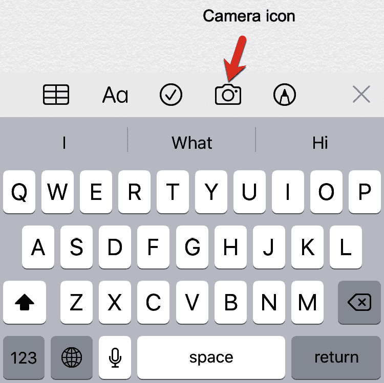

    图 15.24 – 摄像头图标

1.  轻触相机图标。出现一个选项列表（见*图 15.23*）。

1.  轻触**扫描文档**。将 iPhone 相机对准您想要捕捉的对象，如图 15.25 所示：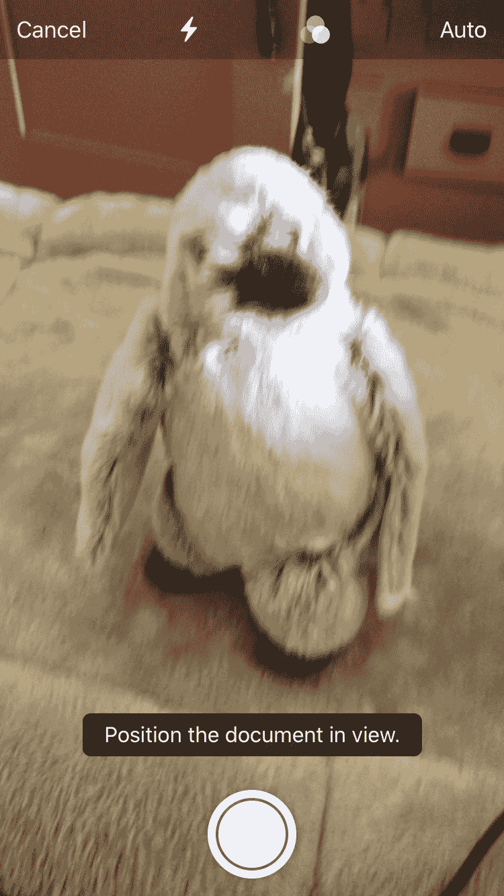

    图 15.25 – 捕捉图像

1.  轻触白色按钮以捕捉图像。图像周围出现裁剪圆圈。

1.  拖动这些裁剪圆圈以定义您想要保留的图像，如图 15.26 所示：

    图 15.26 – 裁剪图像

1.  轻触**保留扫描**。您的裁剪图像出现在笔记中。

1.  在您的笔记中轻触裁剪图像。屏幕底部出现一个图标列表，允许您进一步修改图像，如图 15.27 所示：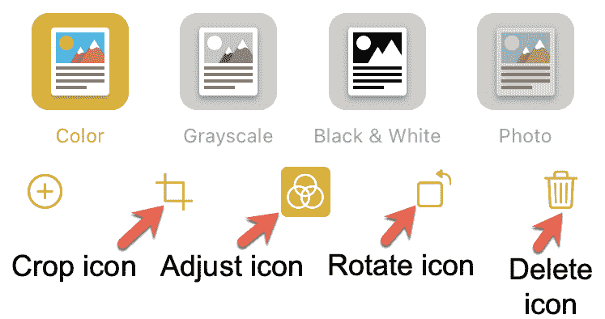

    图 15.27 – 修改裁剪后的图像

1.  轻触裁剪图标，如有必要进行裁剪。

1.  轻触调整图标并从多种方式中选择以调整图像的外观，例如**灰度**或**黑白**。

1.  轻触旋转图标以将图像向左旋转。

1.  如果您想从笔记中删除裁剪的图像，请轻触删除图标。

裁剪图像可以很精确，但有时您只想捕捉整个图片或视频并将其插入到笔记中。

## 将图像和视频添加到笔记中

通过使用 iPhone 相机，您可以捕捉静态图像或视频并将其添加到笔记中。当您在笔记中捕捉图像或视频时，该图像或视频将不会保存在照片库中。

要为笔记捕捉图片或视频，请按照以下步骤操作：

1.  在主屏幕上轻触**笔记**应用。

1.  在您想要添加图片的位置轻触。注意虚拟键盘上方出现的**+**图标（见*图 15.9*）。

1.  轻触**+**图标以显示虚拟键盘上方的图标（见*图 15.24*）。

1.  点击相机图标。出现选项列表（见*图 15.23*）。

1.  点击**拍照或录像**。

1.  选择`视频`或`照片`，然后点击白色（如果正在录制视频则为红色）按钮。

1.  点击**使用照片**或**使用视频**按钮。

而不是通过 iPhone 相机拍照，您可能已经在您的照片库中存储了完美的图片。

## 从照片库添加图片到笔记

而不是拍照，您可能已经在照片库中存储了完美的图片或视频。在这种情况下，您可以将该图片或视频插入到笔记中。

要浏览照片库以将图片或视频插入到笔记中，请按照以下步骤操作：

1.  在主屏幕上点击**笔记**应用。

1.  在您想要添加图片的位置点击。注意虚拟键盘上方出现的**+**图标（见*图 15.9*）。

1.  点击**+**图标以显示虚拟键盘上的图标（见*图 15.24*）。

1.  点击相机图标。出现选项列表（见*图 15.23*）。

1.  点击**选择照片或视频**。出现**照片**屏幕。

1.  点击一个类别，然后点击图片或视频将其插入到笔记中。

1.  在屏幕右上角点击**完成**，将所选图片或视频插入到笔记中。

在笔记中插入图片可能会捕捉到您的想法，但有时您可能想要绘制一些不存在的东西。在这种情况下，您可以在笔记中涂鸦想法并将其插入。

## 在笔记中绘图

使用铅笔或钢笔，您可以写文本、绘制图片或向现有文本添加想法。在许多方面，绘制图片可以更快且更具描述性，因此**笔记**应用允许您在笔记中绘制图像。

注意

您可能会发现，在单独的笔记中创建绘图，然后将其剪切并粘贴到包含现有文本的笔记中会更简单。

要在笔记中绘制，请按照以下步骤操作：

1.  在主屏幕上点击**笔记**应用。

1.  选择一个文件夹。

1.  点击新建笔记图标以创建一个新的笔记。

1.  在您想要添加绘图的位置点击。注意虚拟键盘上方出现的**+**图标（见*图 15.9*）。

1.  点击**+**图标以显示虚拟键盘上方的图标，如图*图 15.28*所示：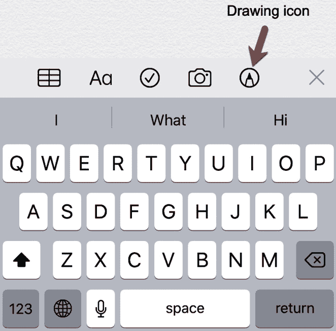

    图 15.28 – 绘图图标

1.  点击绘图图标。屏幕底部出现代表不同绘图工具的图标，如图*图 15.29*所示：

    图 15.29 – 绘图工具

1.  点击绘图工具，并用您的指尖在屏幕上拖动以创建绘图。

1.  （可选）：点击绘图工具以显示绘图厚度，如图*图 15.30*所示：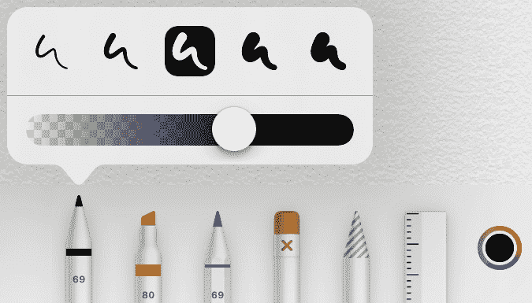

    图 15.30 – 选择绘图工具修改

1.  （可选）点击屏幕右下角的颜色圆圈以显示调色板，以便您可以点击选择您想要的颜色，如图*图 15.31*所示：

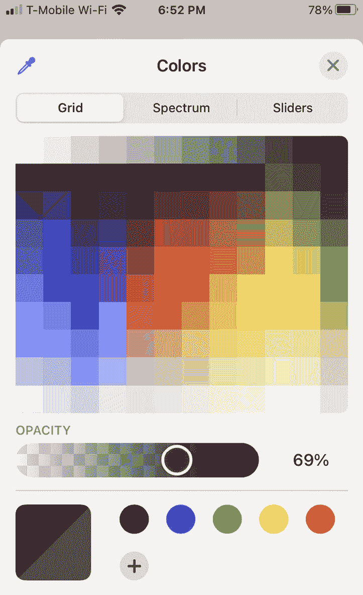

图 15.31 – 显示颜色调板

通过在笔记中添加绘图，您也可以以最简单、最快的方式捕捉您的想法，无论是文本、图片还是绘图。一旦您创建了一篇或多篇笔记，您可能需要搜索和为它们设置密码保护。

# 搜索笔记

一旦您在一篇或多篇笔记中输入了文本，您可能想要再次找到它。与其手动浏览所有笔记，不如让**笔记**应用搜索您笔记中的文本要容易得多。

要在笔记中搜索文本，请按照以下步骤操作：

1.  在主屏幕上轻触**笔记**应用。

1.  轻触包含您想要搜索的笔记的文件夹。

1.  在屏幕顶部的**搜索**文本框中轻触，如图 15.32 所示：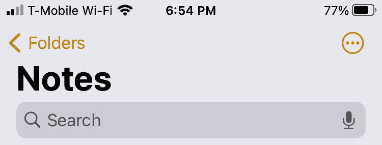

    图 15.32 – 搜索文本框

1.  在**搜索**文本框中轻触并输入您想要查找的部分或全部单词或短语。**笔记**应用将显示所有匹配项，如图 15.33 所示：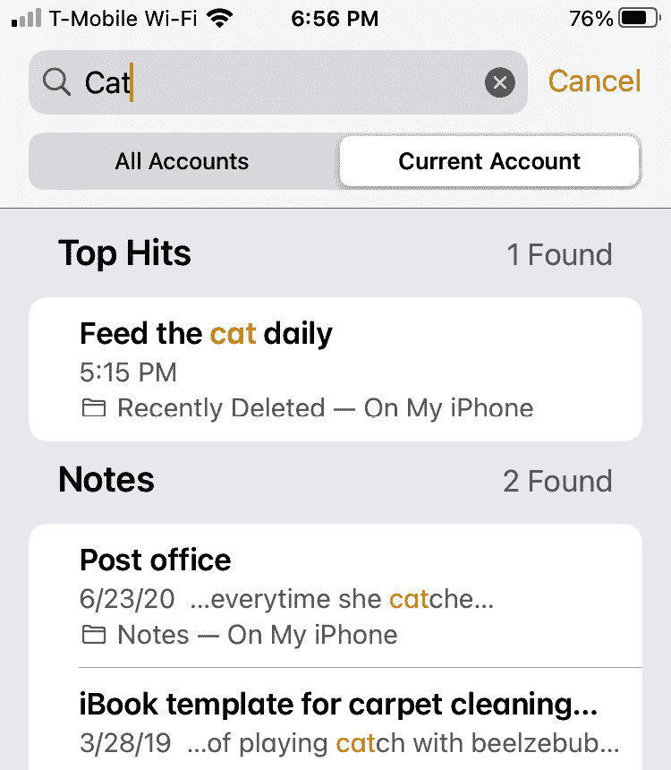

    图 15.33 – 匹配的搜索结果

1.  轻触包含您想要查看的搜索结果的笔记。

通过搜索笔记中的文本可以帮助您精确地找到您想要的笔记。然而，如果您只是想浏览笔记，还有另一种方式来显示笔记，而不仅仅是按笔记名称列表显示。

# 以缩略图形式查看笔记

默认情况下，**笔记**应用按名称列表显示您的笔记。为了更直观地显示笔记，您可以显示为缩略图图标。这可以让您查看每个笔记中的文本，以帮助您找到您想要的笔记。

要在以列表形式或缩略图形式显示笔记文件夹之间切换，请按照以下步骤操作：

1.  在主屏幕上轻触**笔记**应用。

1.  轻触文件夹以显示该文件夹中存储的所有笔记的列表。

1.  轻触屏幕右上角的三个点图标以显示菜单，如图 15.34 所示：

    图 15.34 – 切换到图库视图以显示缩略图形式的笔记

1.  轻触**查看图库**以在以列表形式或缩略图形式显示笔记之间切换。

无论您如何查看或搜索笔记，您可能有一些比其他笔记更重要的笔记。为了保护您的隐私，请考虑为笔记设置密码保护。

# 为笔记设置密码保护

如果有人拿到您的 iPhone 并解锁，他们可以阅读您所有的笔记。如果您有一些重要的笔记不希望别人阅读，您可以设置密码保护。

要为笔记设置密码保护，请按照以下步骤操作：

1.  在主屏幕上轻触**笔记**应用。

1.  轻触包含您想要设置密码保护的笔记的文件夹。

1.  轻触您想要设置密码保护的笔记。

1.  点击屏幕右上角的三个点图标。会出现一个菜单，如图*图 15.35*所示：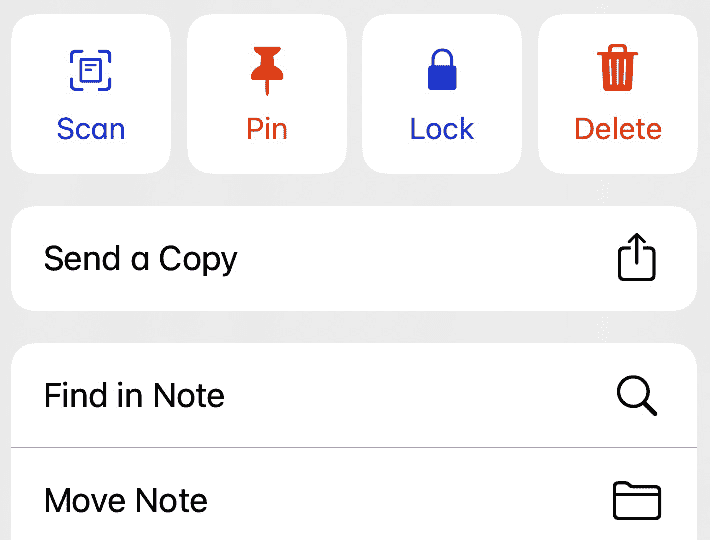

    图 15.35 – 锁定图标

1.  点击**锁定**图标。会出现一个设置密码屏幕，该屏幕会要求 Face ID 或 Touch ID。

1.  点击**完成**。

一旦为笔记设置了密码，您可以通过重复前面的步骤来锁定和解锁它。一个锁图标会出现，让您知道哪些笔记被锁定了，如图*图 15.36*所示：

图 15.36 – 笔记上的一个被锁定的图标

要解锁或锁定一个笔记，请按照以下步骤操作：

1.  点击主屏幕上的**笔记**应用。

1.  点击包含您要打开的笔记的文件夹。

1.  点击一个被锁定的笔记。屏幕会显示，告知您该笔记已被锁定，如图*图 15.37*所示：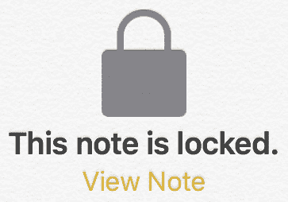

    图 15.37 – 一个被锁定的笔记

1.  点击**查看笔记**。会出现一个对话框。

1.  使用 Touch ID 或 Face ID 解锁笔记。

1.  （可选）：在编辑或查看完毕后，点击右上角的解锁图标来锁定笔记，如图*图 15.38*所示：

图 15.38 – 解锁图标

通过锁定您的笔记，即使有人设法解锁了您的 iPhone，您也可以帮助保护您的隐私。

注意

要删除一个被锁定的笔记，您必须使用 Touch ID 或 Face ID。

# 使用语音备忘录捕获音频

有些人更喜欢说话而不是写下他们的想法。作为替代，您可以使用语音备忘录应用捕获您的语音想法。

要捕获音频录音，请按照以下步骤操作：

1.  点击主屏幕上的**语音备忘录**应用。

1.  点击红色的录音按钮开始说话。

1.  在说完话后，点击红色的停止按钮。

1.  语音备忘录屏幕显示您的音频备忘录及其时间，如图*图 15.39*所示：

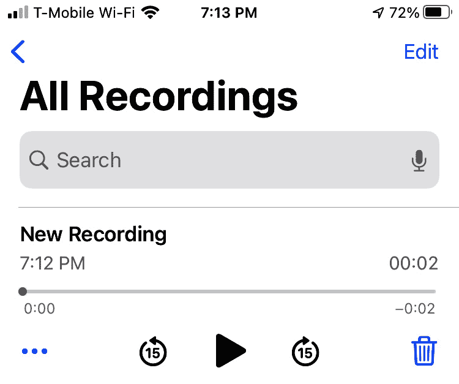

图 15.39 – 列出音频记录的语音备忘录屏幕

在您录制完语音备忘录后，您可以点击播放按钮来收听它，或者拖动滑块移动到音频文件的各个部分。如果您想输入更详细的描述，也可以点击音频备忘录的位置文本。

要共享音频文件，请按照以下步骤操作：

1.  点击主屏幕上的**语音备忘录**应用。

1.  点击三个点图标（见图*图 15.39*）。会出现一个菜单，如图*图 15.40*所示：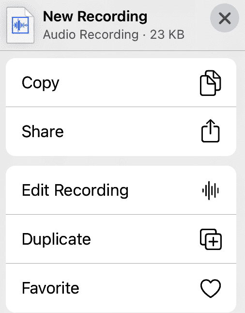

    图 15.40 – 点击三个点图标显示菜单

1.  点击**分享**。会出现一个不同设备和方法的共享列表。

1.  点击设备名称或方法，例如**消息**或邮件，以共享您的语音备忘录。

一旦你录制了语音备忘录，你可以返回并覆盖该语音备忘录的部分内容或添加新的音频。要了解如何修改现有的语音备忘录，请按照以下步骤操作：

1.  点击主屏幕上的**语音备忘录**应用。

1.  点击三个点图标（见*图 15.39*）。会出现一个菜单（见*图 15.40*）。

1.  点击**编辑录音**。会出现一个编辑语音备忘录的屏幕，显示现有的音频文件，如图 15.41 所示：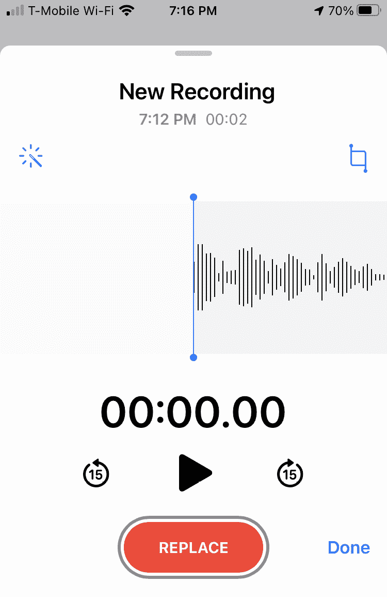

    图 15.41 – 编辑语音备忘录屏幕

1.  滑动音频文件向左或向右。当蓝色垂直线出现在现有音频上方时，屏幕底部会出现一个**替换**按钮。当蓝色垂直线出现在音频末尾时，屏幕底部会出现一个**继续**按钮。

1.  点击**替换**或**继续**按钮并录制更多音频。

1.  完成后，点击暂停按钮。

1.  点击**完成**。

当你可能想要编辑语音备忘录以添加新想法时，你最终可能想完全删除语音备忘录。要删除语音备忘录，请按照以下步骤操作：

1.  点击主屏幕上的**语音备忘录**应用。

1.  点击你想要删除的语音备忘录。

1.  点击**删除**图标。

语音备忘录在无法或不喜欢在**笔记**应用中打字时捕捉想法非常方便。通过使用语音备忘录，你可以像说话一样快速捕捉你的想法。

# 摘要

**笔记**应用是捕捉你想法的最佳方式，无论你在哪里使用 iPhone。你不仅可以输入和格式化文本，还可以捕捉图片或视频插入到笔记中。

为了帮助你保持组织，考虑创建单独的文件夹来存储相关的笔记，例如工作笔记和个人使用笔记。你可以使用笔记来创建每日待办事项列表，或者只是记录你一天中不想忘记的想法。

你还可以使用**笔记**应用作为快速存储有用信息的方式，例如网站地址或有趣地方的图片。**笔记**应用可以帮助你保存你认为值得保留的任何信息。如果你不喜欢写下任何东西，考虑使用语音备忘录应用来捕捉你的口语想法。

由于大多数人都会把 iPhone 带到任何地方，一个有用的功能是地图应用，它可以不仅显示你的位置，还可以为你提供到达任何你想去的地方的路线，这是下一章的主题。
