# 第十七章：*第十七章*：获取时间、天气和股票信息

iPhone 之所以如此受欢迎，其中一个原因就是它可以几乎成为你想要的一切。除了让你打电话和发送短信外，iPhone 还可以作为计时器和新闻来源。人们通常想要的两种常见新闻类型是天气预报和股票报价信息。

一部 iPhone 不仅配备了时钟应用来帮助你跟踪世界各地的时区时间，还作为计时器和秒表使用，这样你可以跟踪分钟或秒来衡量你的锻炼、烹饪或任何需要计时跟踪的活动。

天气应用让你不仅能查看你所在地区的天气预报，还能查看世界上任何城市的天气预报。这样，你可以了解你即将旅行的其他地区的温度和气候，以便你能够适当着装。

最后，iPhone 包括股票应用，让你可以查看股票报价。这样，你可以跟踪你的投资组合并关注你最喜欢的股票，看看它们在一天中的表现如何。

本章涵盖的主题如下：

+   使用时钟应用

+   获取天气预报

+   查看股票报价

# 使用时钟应用

时钟应用可以显示当前时间。当你打开 iPhone 的主屏幕时，你可以在屏幕顶部（以数字格式显示时间，如上午 8:43）或时钟应用本身（以模拟格式显示时间，显示时钟面上的时针和分针）查看当前时间。

时钟应用不仅能显示当前时间。它的五个功能包括以下内容：

+   **世界时钟**：跟踪不同时区的时间

+   **闹钟**：设置一个或多个闹钟，以便你的 iPhone 可以在特定时间提醒你

+   **就寝时间**：定义睡眠和起床的时间

+   **秒表**：跟踪已过去的时间

+   **计时器**：定义一个倒计时的时间间隔，例如 5 分钟

你可能不需要所有这些功能，但很可能有一天你会想要使用其中一个或多个这些功能来携带你的 iPhone。

## 使用世界时钟

如果你需要给住在不同时区的人打电话，你可能不想在他们可能睡觉的时候打电话。同样，你可能也不想在你可能睡觉的时候安排电话会议。

为了帮助你跟踪世界各地的时区，使用**世界时钟**功能跟踪世界各地的常见地区时间，例如柏林、东京或纽约。通过查看另一个时区的时间，你会知道世界另一部分的一天中的时间。

要将时区添加到**世界时钟**功能，请按照以下步骤操作：

1.  在主屏幕上轻触**时钟**应用。

1.  在屏幕底部轻触**世界时钟**图标。

1.  在屏幕右上角轻触**+**图标。会出现一个**选择城市**的屏幕，如图 17.1 所示：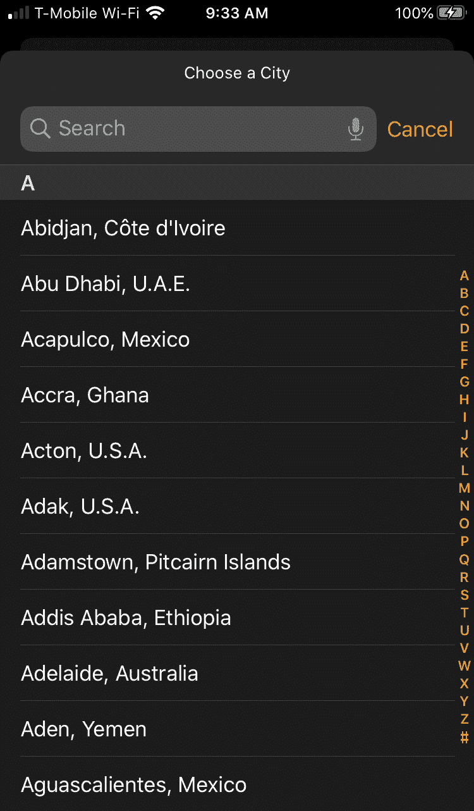

    图 17.1 – 选择要添加到世界时钟的城市

1.  滚动此列表，并在屏幕右侧轻触一个字母（例如**T**以跳转到以 T 开头的城市，如特立尼达），或者轻触屏幕顶部的**搜索**字段并输入你想要使用的城市名称的一部分或全部。随着你输入，会出现匹配城市的列表，如图 17.2 所示：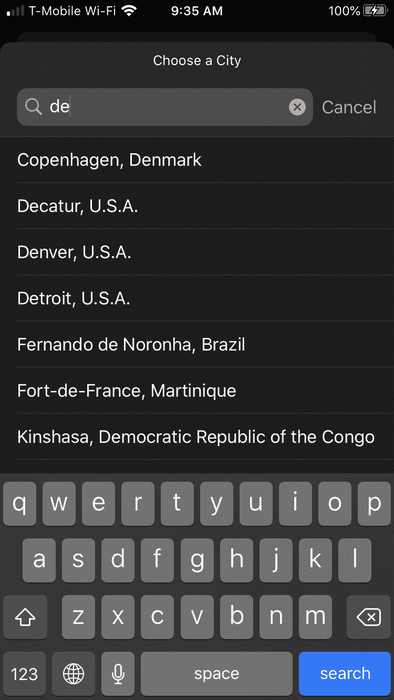

    图 17.2 – 搜索城市

1.  点击城市名称。

1.  对于你想要添加到世界时钟中的每个额外城市，重复步骤 3-5 以创建不同城市及其当前时间的列表，如图 17.3 所示：

图 17.3 – 不同时区的城市列表

时钟应用会按照你添加的顺序组织城市。如果你想重新排列世界时钟列表中的城市或从列表中删除一个城市，请按照以下步骤操作：

1.  在主屏幕上轻触**时钟**应用。

1.  轻触屏幕底部的**世界时钟**图标。

1.  轻触屏幕左上角的**编辑**。注意，每个城市右侧都会出现一个三个横线的图标，如图 17.4 所示：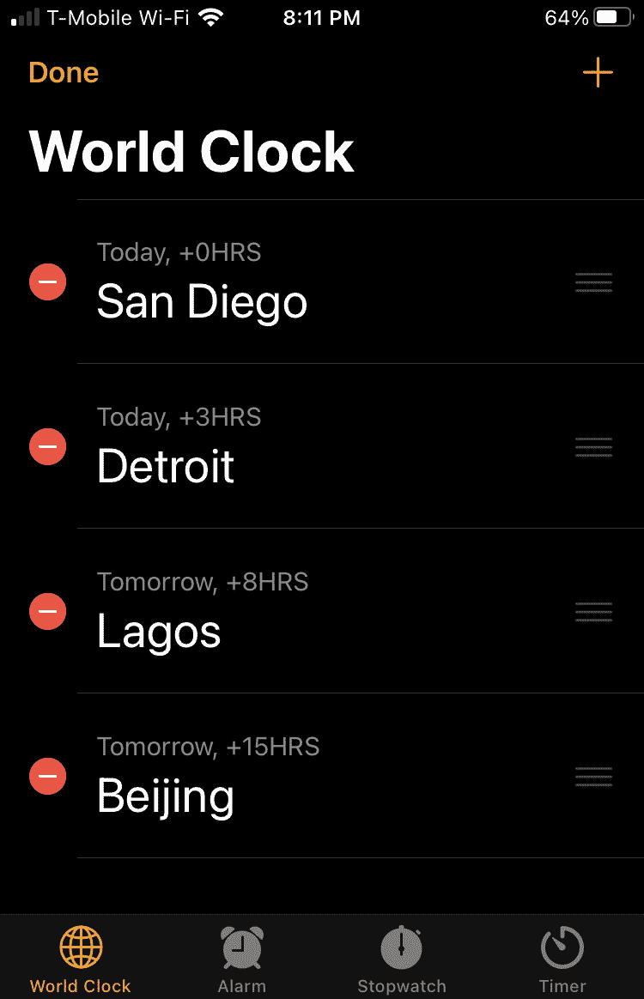

    图 17.4 – 三个横线图标让你可以拖动城市名称上下移动

1.  滚动你想要移动的城市上下的水平图标以重新排列你的列表。

1.  轻触你想要删除的城市左侧红色圆圈内的白色**–**符号，或者向左滑动。会出现一个红色**删除**按钮，如图 17.5 所示：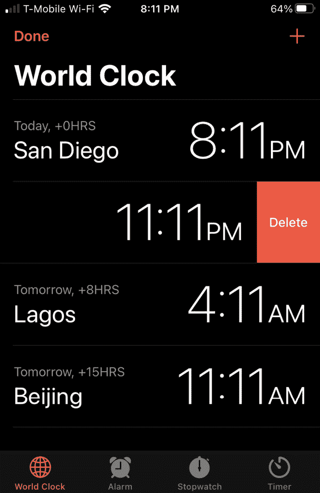

    图 17.5 – 从世界时钟列表中删除城市

1.  轻触**删除**以从列表中删除城市。

1.  轻触屏幕左上角的**完成**。

当然，并不是每个人都需要知道世界另一部分的时间。对于许多人来说，按时醒来或设置闹钟提醒即将到来的约会要重要得多。

## 设置闹钟

闹钟可以方便地按时醒来（例如赶飞机）或简单地提醒你即将到来的约会。你可以设置任意数量的闹钟，但基本想法是为闹钟定义一个响起的时间。

一旦闹钟响起，你可以保存该闹钟以供将来使用，或者简单地删除闹钟。

设置闹钟，请按照以下步骤操作：

1.  在主屏幕上轻触**时钟**应用。

1.  轻触屏幕底部的**闹钟**图标。会出现**闹钟**屏幕。

1.  在屏幕右上角轻触**+**图标。会出现一个**添加闹钟**的屏幕，如图 17.6 所示：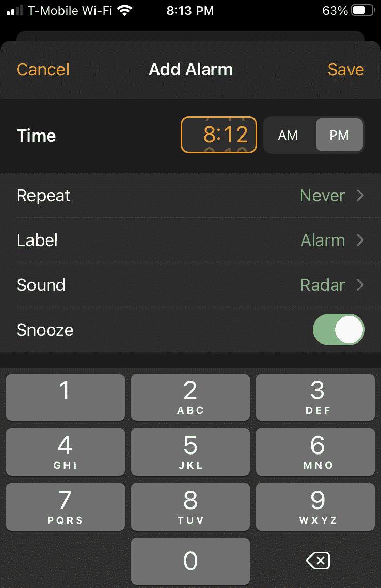

    图 17.6 – 添加闹钟屏幕

1.  选择一个时间。您可以通过在当前显示的时间上滚动上下，或使用数字键盘输入时间。

1.  （可选）轻触**重复**并选择您想要闹钟重复的日期，例如**每周一**或**每周四**。

1.  （可选）轻触**标签**并输入您闹钟的描述性名称。

1.  （可选）轻触**声音**并选择您想要的闹钟声音。

1.  （可选）如果您想允许闹钟的**延时**功能暂时关闭闹钟，请轻触**延时**开关。

1.  在屏幕右上角轻触**保存**。您的闹钟现在将出现在如图 17.7 所示的**闹钟**屏幕上：![Figure 17.7 – An alarm set and ready to go

    ![img/Figure17.07_B14100.jpg]

    图 17.7 – 设置好的闹钟，准备就绪

1.  （可选）轻触您闹钟右侧的开关以切换其开或关状态。

一旦设置了闹钟，您可能想要修改它，例如更改其时间或标签。要编辑现有闹钟，请按照以下步骤操作：

1.  在主屏幕上轻触**时钟**应用。

1.  在屏幕底部轻触**闹钟**图标。将出现**闹钟**屏幕。

1.  在屏幕左上角轻触**编辑**。

1.  轻触您想要修改的闹钟。将出现一个**编辑闹钟**屏幕，其外观几乎与**添加闹钟**屏幕相同（见*图 17.6*）。

1.  进行任何更改后，轻触**保存**。要删除闹钟，向左滑动该闹钟，然后轻触**删除**按钮。

闹钟可以方便地确保您按时醒来，但如果您经常需要闹钟，则应使用**就寝时间**设置。接下来，让我们看看计时器的设置。

## 使用计时器

计时器通常用于时间事件，如比赛。要使用计时器，请按照以下步骤操作：

1.  在主屏幕上轻触**时钟**应用。

1.  在屏幕底部轻触**计时器**图标。将出现如图 17.8 所示的计时器屏幕：![Figure 17.8 – The stopwatch screen

    ![img/Figure17.08_B14100.jpg]

    图 17.8 – 计时器屏幕

1.  轻触**开始**按钮以开始跟踪时间。当计时器开始跟踪时间时，**开始**按钮将变为**停止**按钮。

1.  （可选）每次您想要记录一个单独的时间时，请轻触**计时**按钮，如图 17.9 所示：![Figure 17.9 – Timing multiple laps

    ![img/Figure17.09_B14100.jpg]

    图 17.9 – Timing multiple laps

1.  轻触**重置**以清除时间并重新从 0 开始。

计时器让您跟踪时间，但有时您可能想要从某个时间间隔开始倒计时，这样您就知道何时从烤箱中取出东西或何时在固定时间间隔后停止锻炼。

## 设置计时器

在烹饪时，您可能需要将某物放入烤箱中烤 30 分钟或搅拌某物 10 分钟。这时您需要设置计时器并定义一个倒计时的时间间隔。

要设置计时器，请按照以下步骤操作：

1.  在主屏幕上轻触**时钟**应用。

1.  在屏幕底部轻触**计时器**图标。出现计时器屏幕，如图*图 17.10*所示：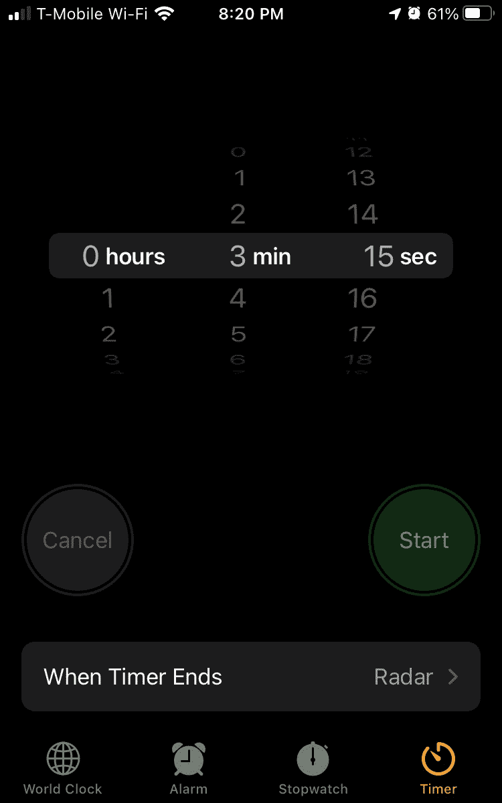

    图 17.10 – 计时器屏幕

1.  设置一个开始倒计时的间隔时间，例如 3 分钟或 1 小时 13 分钟。

1.  （可选）轻触**当计时器结束时**并选择一个当计时器达到零时使用的声音。

1.  轻触**开始**按钮。

时间很重要，但当你外出时，你可能还想知道天气状况，以便你知道如何着装。

# 获取天气预报

了解如何着装以及需要穿什么在您自己的城市中可能很重要，以及您可能计划在不久的将来访问的任何城市。通过查看天气预报，您可以规划活动、旅行以及您需要的衣物。

要使用天气预报应用，请按照以下步骤操作：

1.  在主屏幕上轻触**天气**应用。

1.  轻触屏幕右下角的三个水平线图标。出现不同城市及其当前温度的列表，如图*图 17.11*所示：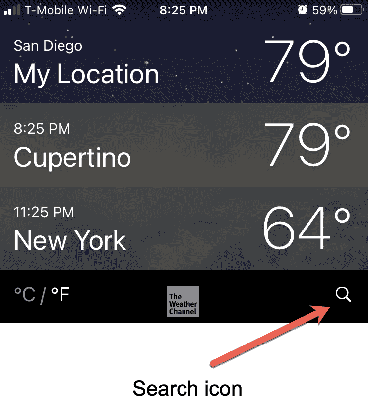

    图 17.11 – 搜索图标

1.  轻触搜索图标。屏幕顶部出现一个**搜索**文本框。

1.  输入城市名称的一部分或全部。出现匹配的城市名称列表，如图*图 17.12*所示：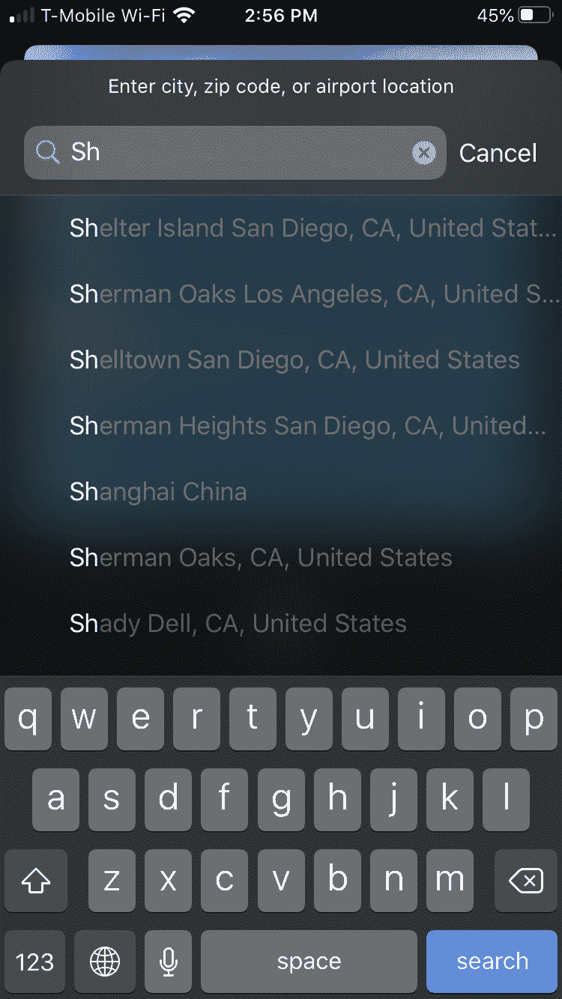

    图 17.12 – 搜索城市名称

1.  轻触城市名称。出现该城市的天气预报。

1.  在右上角轻触**添加**以将此城市添加到您的天气预报列表中，结果如图*图 17.13*所示：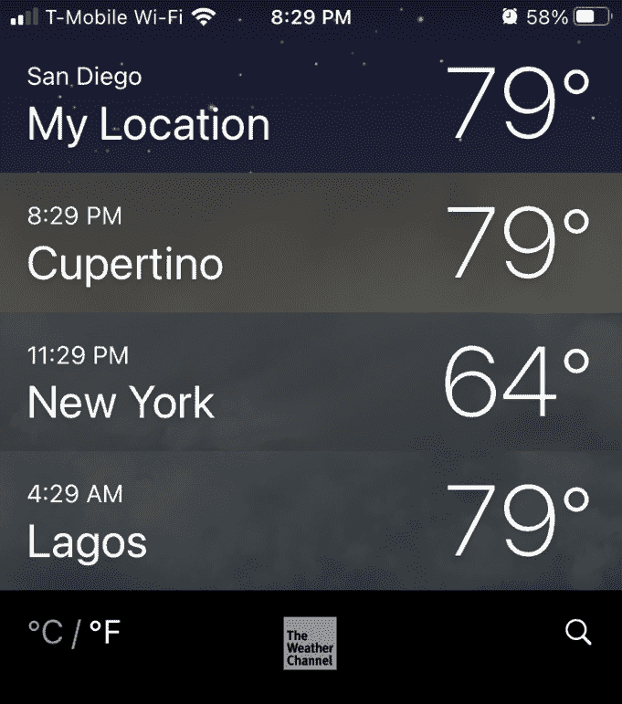

    图 17.13 – 城市列表

1.  轻触**°C**或**°F**图标以查看摄氏度或华氏度的温度。

1.  轻触一个城市以查看更详细的天气预报，如图*图 17.14*所示：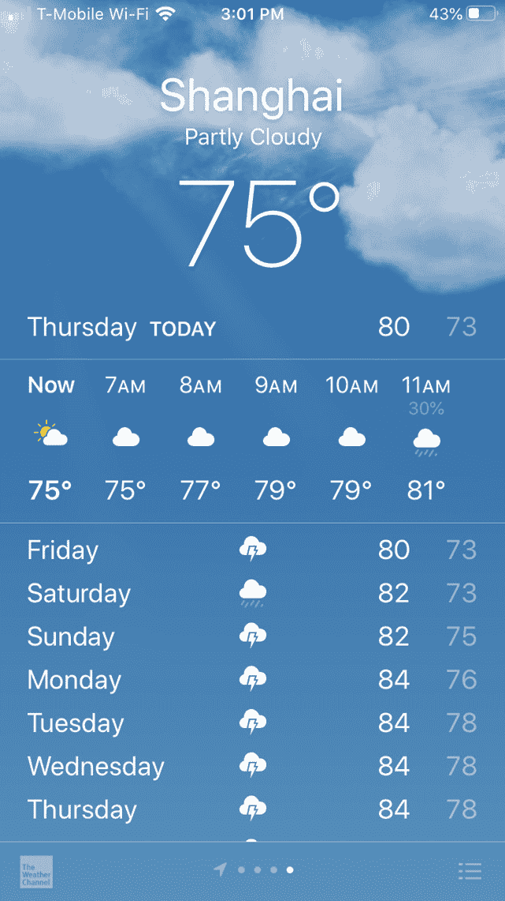

    图 17.14 – 未来几天的天气预报

1.  向下滚动以查看更多天气信息，如图*图 7.15*所示：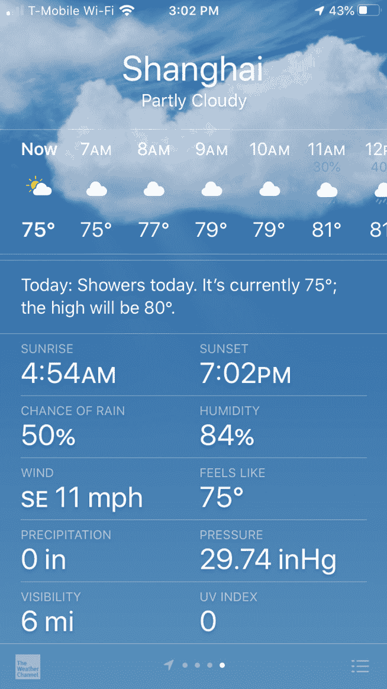

    图 17.15 – 向下滚动显示更多天气信息

1.  向左或向右滑动以查看列表中其他城市的预报。

一旦你定义了一个城市以显示天气预报，如果你不再想看到该城市的预报，你可以随时删除该城市。要从天气预报列表中删除一个城市，请按照以下步骤操作：

1.  在主屏幕上轻触**天气**应用。

1.  如果只有一个城市的天气预报出现，请按屏幕右下角的列表图标，如图*图 17.16*所示。出现城市列表：

    图 17.16 – 列表图标

1.  向左滑动你想要删除的城市名称。右侧出现一个**删除**按钮。

1.  点击**删除**按钮，从天气预报列表中移除你选择的城镇。

结合时钟应用，它让你可以看到世界其他地区的当前时间，天气应用让你可以查看这些地区的天气状况。

虽然每个人都需要知道时间和天气，但并非每个人都需要了解股市。即使你没有在特定股票上投资，你也可能发现同时跟踪股票和商业新闻很有趣。

# 查看股票报价

股票应用让你可以查看股票报价和商业新闻。要使用股票应用，你需要添加你想要关注的公司，并在不再关注时移除它们。

要查看股票报价，请按照以下步骤操作：

1.  在主屏幕上点击**股票**应用。

1.  点击屏幕顶部的**搜索**文本框。

1.  输入公司股票报价符号的一部分或全部，例如 AAPL 代表苹果。将出现可能的股票报价匹配列表，如图*图 17.17*所示：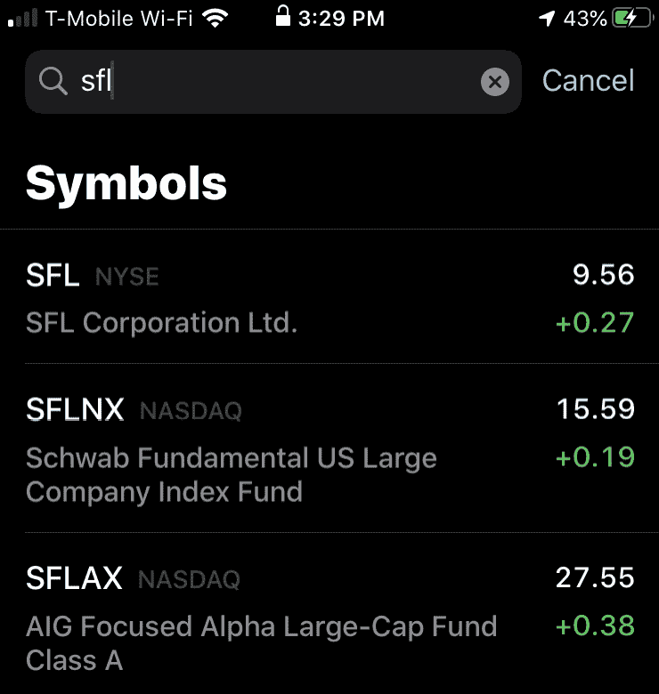

    图 17.17 – 搜索特定股票报价

1.  点击你想要的股票报价。该公司的最新财务新闻将出现，如图*图 17.18*所示：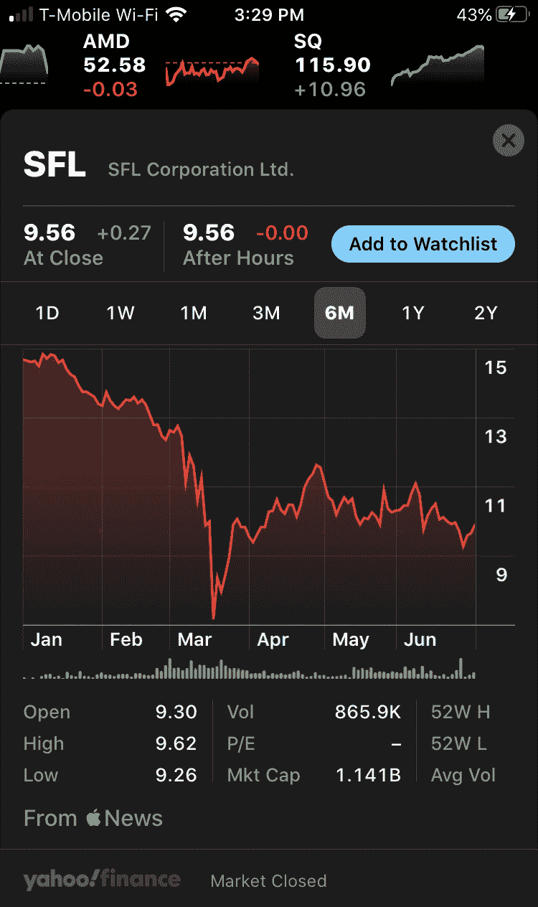

    图 17.18 – 某特定公司的财务新闻

1.  点击**添加到关注列表**以将这家公司的股票报价保存到股票应用中。

1.  点击右上角的关闭（**x**）图标，使财务新闻消失。在任何时候，你都可以点击股票报价以查看更多详细信息。

一旦你创建了一个股票关注列表，你就可以随时通过在股票报价上向左滑动并点击**移除**按钮来从关注列表中移除公司。

# 摘要

时钟应用可以用来设置闹钟以唤醒或入睡，或提醒你即将到来的约会或会议。你还可以使用时钟应用将 iPhone 变成秒表或计时器。

天气应用可以方便地为你提供你所在城市或你计划不久后访问的城市未来几天的天气预报。除了查看预报外，你还可以查看世界不同地区的当前天气状况。

股票应用可以帮助你跟踪你的股票投资组合，以便你可以看到你赚了多少钱或损失了多少钱。

由于跟踪资金可能很有用，你也可能想学习如何通过 Apple Pay 进行无接触支付，这是下一章的主题。
