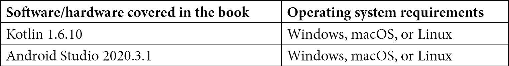

# 前言

使用 Jetpack 库，您可以构建和设计高质量、健壮的 Android 应用程序，这些应用程序具有改进的架构，并且能够在不同的版本和设备上保持一致的工作。这本书将帮助您了解 Jetpack 如何让开发者遵循最佳实践和架构模式来构建 Android 应用程序，同时还能消除样板代码。

使用 Android 和 Kotlin 进行开发的开发者将能够通过这本浓缩的实用指南将他们的知识应用于构建应用程序，该指南涵盖了最受欢迎的 Jetpack 库，包括 Jetpack Compose、ViewModel、Hilt、Room、Paging、Lifecycle 和 Navigation。您将在构建具有真实世界数据的现代应用程序的同时，获得相关库和架构模式的总览，包括 Android 生态系统中的流行库，如 Retrofit、Coroutines 和 Flow。

在完成这本 Android 应用程序开发书籍之后，您将学会如何利用 Jetpack 库和您的架构概念知识来构建、设计和测试适用于各种用例的健壮 Android 应用程序。

# 本书面向对象

本书面向希望提升 Android 开发技能的初级和中级 Android 开发者，以使用 Jetpack 库和其他前沿技术来开发高质量的应用程序。对 Android 开发基础知识有基本了解的初学者也会发现这本书很有用。假设读者熟悉 Kotlin。

# 本书涵盖内容

*第一章*，*使用 Jetpack Compose 创建现代 UI*，介绍了使用 Jetpack Compose 工具包在 Android 上以新的声明性方式构建 UI 的方法，同时开始使用这个新框架从头开始构建应用程序。

*第二章*，*使用 Jetpack ViewModel 处理 UI 状态*，探讨了 ViewModel 架构组件的概念和用法，以及 Compose 应用程序中的 UI 状态概念，以及 ViewModel 如何处理和缓存此类状态。

*第三章*，*使用 Retrofit 从 REST API 显示数据*，介绍了 Retrofit 是什么以及它如何被用作在书中开发的项目中的 Android 网络客户端。

*第四章*，*使用协程处理异步操作*，介绍了 Kotlin 协程背后的核心概念。本章探讨了协程是什么，挂起函数是什么，以及协程的其他重要组件。

*第五章*，*使用 Jetpack Navigation 在 Compose 中添加导航*，介绍了使用 Jetpack Navigation 库在基于 Compose 的屏幕之间进行导航的基础知识，同时探讨了如何支持对 Compose UI 的深链接。

**第六章**（[B17788_06_ePub.xhtml#_idTextAnchor186]），*使用 Jetpack Room 添加离线功能*，介绍了 Room 作为存储结构化数据的解决方案，并探讨了在 Android 上作为构建健壮应用程序的架构决策的数据持久性。

**第七章**（[B17788_07_ePub.xhtml#_idTextAnchor249]），*介绍 Android 中的展示模式*，探讨了架构展示模式及其必要性，同时分析了 MVC、MVP 和 MVVM。

**第八章**（[B17788_08_ePub.xhtml#_idTextAnchor285]），*在 Android 中使用 Clean Architecture 入门*，探讨了 Clean Architecture 在 Android 中的体现以及如何通过在书中开发的项目中实现 Use Cases 来分离业务逻辑。

**第九章**（[B17788_09_ePub.xhtml#_idTextAnchor293]），*使用 Jetpack Hilt 实现依赖注入*，探讨了依赖注入是什么，为什么需要它以及它带来的优势。本章还探讨了 Dagger 的基础知识并介绍了 Jetpack Hilt。

**第十章**（[B17788_10_ePub.xhtml#_idTextAnchor305]），*使用 UI 和单元测试测试您的应用程序*，探讨了测试的重要性，并将它们分为两大类：UI 测试和单元测试。在本章中，您将学习如何通过创建单元测试来测试 Compose UI 和应用程序逻辑。

**第十一章**（[B17788_11_ePub.xhtml#_idTextAnchor317]），*使用 Jetpack Paging 和 Kotlin Flow 创建无限列表*，探讨了分页的概念，并解释了如何借助 Jetpack Paging 在 Android 上实现分页，同时使用 Kotlin Flow。

**第十二章**（[B17788_12_ePub.xhtml#_idTextAnchor327]），*探索 Jetpack 生命周期组件*，探讨了 Jetpack 生命周期中组件（如 ViewModel 和 LiveData）的内部工作原理。在本章中，您还将学习如何创建自己的生命周期感知组件。

# 为了充分利用本书

您需要在您的计算机上安装 Android Studio 的版本——2020.3.1 版本或更高。

所有代码示例都已使用 Kotlin 1.6.10 和 Android Studio 2020.3.1 在 macOS 和 Windows 上测试过。

假设您熟悉 Kotlin 和 Android 的基础知识。



对于**第三章**（[B17788_03_ePub.xhtml#_idTextAnchor094]）的一部分，*使用 Retrofit 显示 REST API 数据*，预期您拥有一个谷歌账户。

对于**第六章**（[B17788_06_ePub.xhtml#_idTextAnchor186]）的一部分，*使用 Jetpack Room 添加离线功能*，预期您对 SQL 数据库和查询有基本的了解。

**如果您使用的是本书的数字版，我们建议您亲自输入代码或从本书的 GitHub 仓库（下一节中提供链接）获取代码。这样做将帮助您避免与代码复制粘贴相关的任何潜在错误。**

# 下载示例代码文件

您可以从 GitHub 下载本书的示例代码文件：[`github.com/PacktPublishing/Kickstart-Modern-Android-Development-with-Jetpack-and-Kotlin`](https://github.com/PacktPublishing/Kickstart-Modern-Android-Development-with-Jetpack-and-Kotlin)。如果代码有更新，它将在 GitHub 仓库中更新。

我们还提供了一系列来自我们丰富图书和视频目录的代码包，可在[`github.com/PacktPublishing/`](https://github.com/PacktPublishing/)找到。查看它们吧！

下载彩色图像

我们还提供了一份包含本书中使用的截图和图表的彩色图像 PDF 文件。您可以从这里下载：[`static.packt-cdn.com/downloads/9781801811071_ColorImages.pdf`](https://static.packt-cdn.com/downloads/9781801811071_ColorImages.pdf)。

使用的约定

本书使用了多种文本约定。

`文本中的代码`: 表示文本中的代码单词、数据库表名、文件夹名、文件名、文件扩展名、路径名、虚拟 URL、用户输入和 Twitter 昵称。以下是一个示例：“`Text`是我们旧爱`TextView`的 Compose 版本。”

代码块设置如下：

```java
@Composable 
fun FriendlyMessage(name: String) { 
   Text(text = "Greetings $name!") 
}
```

当我们希望您注意代码块中特定部分时，表示代码的一部分已被添加或修改，相关的行或项目将以粗体显示：

```java
@Composable 
fun ColoredBox() { 
   Box(modifier = Modifier.size(120.dp)) 
}
```

任何命令行输入或输出都按以下方式编写：

```java
npm install component_name
```

**粗体**: 表示新术语、重要单词或屏幕上看到的单词。例如，菜单或对话框中的单词以**粗体**显示。以下是一个示例：“在**电话和平板**模板部分，选择**Empty Compose Activity**然后选择**下一步**。”

小贴士或重要提示

看起来像这样。

# 联系我们

我们始终欢迎读者的反馈。

**一般反馈**: 如果您对本书的任何方面有疑问，请通过 customercare@packtpub.com 给我们发邮件，并在邮件主题中提及书名。

**勘误**: 尽管我们已经尽最大努力确保内容的准确性，但错误仍然可能发生。如果您在这本书中发现了错误，如果您能向我们报告，我们将不胜感激。请访问[www.packtpub.com/support/errata](http://www.packtpub.com/support/errata)并填写表格。

**盗版**: 如果您在互联网上以任何形式发现我们作品的非法副本，如果您能提供位置地址或网站名称，我们将不胜感激。请通过版权@packt.com 与我们联系，并提供材料的链接。

**如果您有兴趣成为作者**: 如果您在某个领域有专业知识，并且您有兴趣撰写或为书籍做出贡献，请访问[authors.packtpub.com](http://authors.packtpub.com)。

# 分享您的想法

一旦您阅读了《使用 Apache Arrow 的内存分析》，我们很乐意听听您的想法！请点击此处直接进入此书的亚马逊评论页面并分享您的反馈。

您的评论对我们和科技社区都非常重要，并将帮助我们确保我们提供高质量的内容。
