# 第一章：*第一章*：使用 Jetpack Compose 创建现代 UI

Jetpack 库使您能够构建和设计高质量、健壮的 Android 应用，这些应用具有可靠的架构，并在不同版本和设备上保持一致。同时，Jetpack 套件允许您消除样板代码，最终专注于真正重要的事情——构建必要的功能。

在本章中，我们将探讨构建用户界面（**UIs**）最流行的 Jetpack 库之一，称为 **Compose**。简单来说，Jetpack Compose 是一个强大的现代工具包，允许您使用 Kotlin 函数和 API 直接在 Android 上构建原生 UI。

Compose 通过利用声明式编程的力量，结合 Kotlin 编程语言的易用性，加速并极大地简化了 UI 开发。新的工具包在允许您通过声明式函数构建 UI 时，仅依赖于 Kotlin API。

到本章结束时，您将了解如何在 Android 上使用更少的代码、强大的工具、直观的 API 以及无需使用如 XML 等额外语言来构建 UI。

在第一部分，“理解 Compose 的核心概念”，我们将探索 Compose 背后的基本概念，并了解它们如何帮助我们编写更好、更干净的 UI。我们将看到如何使用可组合函数来描述 UI，同时理解在 Android 上构建 UI 的新声明式方法是如何工作的。我们还将探索为什么在 Compose 中组合优于继承，以及数据流是如何在 Compose 中工作的。最后，我们将介绍重新组合是什么，并看到它对我们声明式 UI 的必要性。

在第二部分，“探索 Compose UI 的构建块”，我们将研究 Compose 提供的最重要的一些可组合函数。之后，我们将看到如何预览我们的 Compose UI 以及活动如何渲染它。

我们将在“构建基于 Compose 的屏幕”部分创建我们的第一个关于餐厅的 Compose 项目。在最后一节，标题为“探索 Compose 列表”，我们将学习如何在 Compose 的帮助下正确地显示更多内容。

总结来说，在本章中，我们将涵盖以下主要主题：

+   理解 Compose 的核心概念

+   探索 Compose UI 的构建块

+   构建 Compose-based 屏幕

+   使用 Compose 探索列表

    注意

    由于 Compose 是一个专门的本地 UI 框架，我们将简要介绍核心概念、常见组件和工具包的使用，而不深入探讨高级主题。

# 技术要求

当构建基于 Compose 的 Android 项目时，您通常需要日常的 Android 开发工具。然而，为了顺利跟进，请确保您拥有以下工具：

+   Android Studio 的 Arctic Fox 2020.3.1 版本。您也可以使用更新的 Android Studio 版本或甚至 Canary 构建，但请注意，IDE 界面和其他生成的代码文件可能与本书中使用的不同。

+   必须在 Android Studio 中安装 Kotlin 1.6.10 或更高版本的插件。

+   Jetpack Compose 1.1.1 或更高版本。您应该遵循本章，并使用此版本的工程。如果您愿意，可以探索更新的版本，尽管可能会出现 API 差异。

您可以在此处找到包含本书源代码的 GitHub 仓库：[`github.com/PacktPublishing/Kickstart-Modern-Android-Development-with-Jetpack-and-Kotlin/`](https://github.com/PacktPublishing/Kickstart-Modern-Android-Development-with-Jetpack-and-Kotlin/tree/main/Chapter_01)。

要访问本章中展示的代码，请导航到`Chapter_01`目录。前两节中展示的代码片段可以在位于根目录的`ExamplesActivity.kt`文件中找到。我们将在本章的最后几节中开发的餐厅应用程序的项目编码解决方案可以在`chapter_1_restaurants_app` Android 项目目录中找到。

# 理解 Compose 的核心概念

Jetpack Compose 极大地改变了我们在 Android 上编写 UI 的方式。现在，UI 是用 Kotlin 开发的，这使我们可以使用称为**可组合组件**的控件编写新的声明性布局范式。

在本节中，我们将了解什么是可组合函数以及它们是如何用于编写 UI 的。我们将学习编程范式是如何转变的，以及现在如何强制执行组合，从而增加了我们定义 UI 的方式的灵活性。我们还将讨论 UI 内部的数据流以及尝试理解这些新概念带来的好处。

总结来说，我们将涵盖以下主题：

+   使用可组合函数描述 UI

+   在 Android 上创建 UI 的范式转变

+   优先使用组合而非继承

+   数据的单向流动

+   重组

因此，让我们开始吧。

## 使用可组合函数描述 UI

Compose 允许您通过定义和调用表示屏幕上控件的`@Composable`注解来构建 UI。

Compose 在 Kotlin 的类型检查和代码生成阶段通过 Kotlin 编译器插件的帮助工作。Compose 编译器插件确保您可以创建可组合组件。

例如，一个显示文本片段的可组合组件可能看起来像这样：

```java
@Composable
fun FriendlyMessage(name: String) {
   Text(text = "Greetings $name!")
}
```

在前面的代码块中，我们通过使用`@Composable`注解定义了`FriendlyMessage`可组合函数。通过查看函数定义和主体，我们可以轻松推断出它显示一个问候信息。

重要的是要注意，任何带有 `@Composable` 注解的函数都可以在屏幕上渲染，因为它将生成一个显示内容的 UI 层次结构。在真正意义上，可组合函数根据其定义发出 UI 小部件。

在我们的例子中，之前的函数应该通过将接收到的 `String` 参数值与预定义的消息连接起来来显示问候消息。由于该函数依赖于其输入参数以在每次使用时显示不同的消息，因此可以说可组合函数是数据（如下图中所示为 **F(data**)）的函数，这些函数被转换为 UI 或小部件的片段：

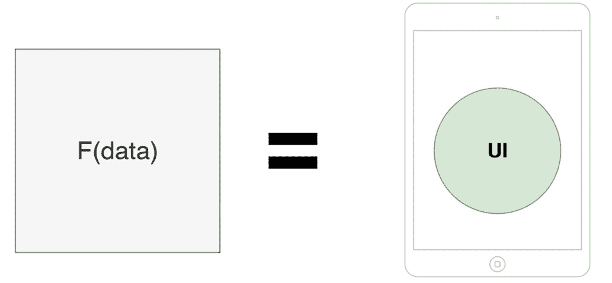

Figure 1.1 – 在 Compose 中，UI 是数据的功能

在后面的 *单向数据流* 小节中，我们将了解为什么拥有描述 UI 小部件的函数对我们项目有益，因为它导致 UI 层更少出现错误。

回到我们的例子，你可能想知道 `Text` 函数调用代表什么。与每个其他框架一样，Compose 提供了 `Text` 等可组合函数，我们可以直接使用。

如其名所示，`Text` 可组合函数允许你在屏幕上显示一些文本。我们将在 *探索 Compose UI 构建块* 部分中介绍 Compose 提供的其他可组合函数。

在此之前，让我们再次查看之前的代码示例，并突出定义可组合函数时最重要的规则：

+   它应该是一个带有 `@Composable` 注解的常规函数。

+   其 UI 输出由通过其输入参数接收到的数据定义。由于可组合函数发出 UI 元素而不像常规函数那样返回数据，因此它们应该返回 `Unit`。大多数时候，我们省略定义 `Unit` 返回类型或甚至返回 `Unit` – 因为 Kotlin 将其标记为冗余 – 就像在之前的例子中那样。

+   它可以包含其他可组合函数或常规 Kotlin 代码。在之前的例子中，`FriendlyMessage` 可组合函数使用了另一个名为 `Text` 的可组合函数，但它也可以调用常规 Kotlin 代码（我们将在接下来的章节中讨论这一点）。

+   它应该以名词或以暗示形容词开头的名词（但永远不是动词）命名。这样，可组合函数设想的是小部件而不是动作。此外，其名称应遵守 PascalCase 命名约定，这意味着变量中每个复合词的第一个字母都应大写。

+   建议该函数是公开的，而不是在类中定义，而是在 Kotlin 文件中直接定义。这样，Compose 促进可组合函数的重用。

现在我们已经了解了什么是可组合函数以及如何定义它，让我们继续探索 Compose 为 Android UI 开发带来的范式转变。

## Android 上创建 UI 的范式转变

Compose 为 Android UI 开发带来了一种新的方法，那就是提供一种声明式的方式来描述你的 UI。在尝试理解声明式方法是如何工作之前，我们将学习传统的视图系统如何依赖于不同的范式——命令式范式。

### 命令式范式

当用 XML 描述你的 UI 时，你将视图层次结构表示为称为视图的组件树，这些组件通常被称为视图。在传统的视图系统中，视图是指从`android.view.View`类继承的所有组件，从`TextView`、`Button`或`ImageView`到`LinearLayout`、`RelativeLayout`等等。

然而，对于视图系统来说，它所依赖的*命令式范式*是至关重要的。因为你的应用程序必须知道如何对用户交互做出反应，并相应地改变 UI 的状态，所以你可以通过`findViewById`调用引用你的视图，然后通过`setText()`、`setBackgroundResource()`等调用更新它们的值。

由于视图保持其内部状态并公开设置器和获取器，你必须通过 imperative 方式为每个组件设置新的状态，如下面的图所示：

![图 1.2 – 命令式范式下的 Android 视图系统特性]

![img/B17788_01_02.jpg]

图 1.2 – 命令式范式下的 Android 视图系统特性

手动操作视图的状态会增加你 UI 中出错和出现 bug 的机会。因为你需要处理多个可能的状态，并且数据块在几个这样的状态下显示，所以很容易搞乱你 UI 的结果。当你的 UI 变得复杂时，非法状态或状态之间的冲突也相对容易出现。

此外，由于布局定义在额外的组件中——即 XML 文件——`Activity`、`Fragment`或`ViewModel`与基于 XML 的 UI 之间的耦合增加。这意味着在 XML 文件中更改 UI 将经常导致`Activity`、`Fragment`或`ViewModel`类中的更改，这是状态处理发生的地方。不仅如此，由于语言差异，内聚性也降低了：一个组件在 Java/Kotlin 中，而另一个在 XML 中。这意味着为了 UI 能够工作，它不仅需要一个`Activity`或`Fragment`，还需要 XML。

### 声明式范式

为了解决标准视图系统中的某些问题，Compose 依赖于一个现代的声明式 UI 模型，这极大地简化了在 Android 上构建、更新和维护 UI 的过程。

如果在传统的视图系统中，命令式范式描述了 UI 应该如何改变，那么在 Compose 中，声明式范式描述了 UI 在某个特定时间点应该渲染的内容。

Compose 通过将屏幕定义为可组合物的树状结构来实现这一点。如下面的示例所示，每个可组合物都会将其数据传递给嵌套的可组合物，就像我们在上一节代码示例中的 `FriendlyMessage` 可组合物将一个名字传递给 `Text` 可组合物一样：

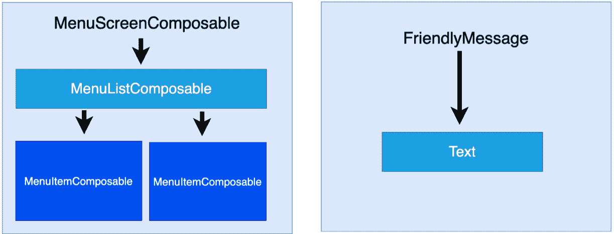

图 1.3 – 可组合小部件树的可视化以及数据如何向下传递

当输入参数发生变化时，Compose 会从头开始重新生成整个小部件树。它应用必要的更改，并消除了手动更新每个小部件的需要和关联的复杂性。

这意味着在 Compose 中，可组合物相对无状态，因此它们不暴露 getter 和 setter 方法。这允许调用者对交互做出反应，并单独处理创建新状态的过程。它是通过调用相同的可组合物但使用不同的参数值来实现的。正如我们在 *使用可组合函数描述 UI* 部分中讨论的那样，Compose 中的 UI 是数据的函数。由此我们可以得出结论，如果向可组合物传递新数据，就可以产生新的 UI 状态。

最后，与视图系统相比，Compose 只依赖于 Kotlin API，这意味着 UI 现在可以用单一技术、单一组件来定义，从而增加了内聚性并减少了耦合性。

现在，让我们看看 Compose 带来的另一个设计上的转变，并讨论组合如何比继承提供更灵活的 UI 定义方式。

## 优先使用组合而非继承

在 Android 视图系统中，每个视图都从父 `View` 类继承功能。由于系统完全依赖于继承，因此创建自定义视图的任务只能通过定义复杂的层次结构来完成。

以 `Button` 视图为例。它从 `TextView` 继承功能，而 `TextView` 又从 `View` 继承：

![图 1.4 – `Button` 视图的类继承层次结构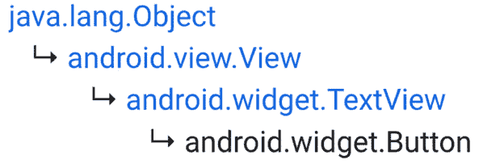

图 1.4 – `Button` 视图的类继承层次结构

这种策略对于重用功能来说很棒，但当试图创建一个视图的多个变体时，继承变得难以扩展，并且灵活性很小。

假设你想要 `Button` 视图渲染图像而不是文本。在视图系统中，你必须创建一个全新的继承层次结构，如下面的层次结构图所示：

![图 1.5 – `ImageButton` 视图的类继承层次结构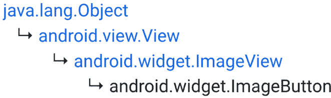

图 1.5 – `ImageButton` 视图的类继承层次结构

但如果你需要一个同时容纳 `TextView` 和 `ImageView` 的按钮呢？这个任务将极具挑战性，因此很容易得出结论，为每个自定义视图拥有独立的继承层次结构既不灵活也不可扩展。

这些例子是真实的，它们展示了视图系统的局限性。正如我们之前看到的，缺乏灵活性的最大原因之一是视图系统的继承模型。

为了解决这个问题，*组合更倾向于组合而非继承*。如图下所示，这意味着组合通过使用更小的组件来构建更复杂的 UI，而不是通过从一个单一父组件继承功能：

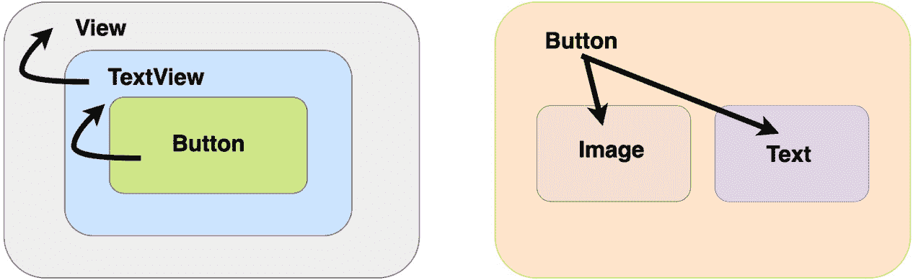

图 1.6 – 继承与组合

让我们简要地解释一下我们之前关于继承和组合的比较：

+   使用继承，你只能继承你的父组件，就像`Button`只从`TextView`继承一样。

+   使用组合，你可以组合多个其他组件，就像`Button`可组合组件包含了一个`Image`和`Text`可组合组件一样，这为你构建 UI 提供了更大的灵活性。

让我们尝试构建一个具有图像和文本的按钮的可组合组件。使用继承时，这是一个巨大的挑战，但 Compose 通过允许你在`Button`可组合组件内部组合`Image`和`Text`可组合组件来简化了这一点：

```java
@Composable
fun SuggestiveButton() {
    Button(onClick = { }) {
        Row() {
            Image(painter = 
                     painterResource(R.drawable.drawable),
                  contentDescription = "")
            Text(text = "Press me")
        }
    }
}
```

现在，我们的`SuggestiveButton`可组合组件包含了`Image`和`Text`可组合组件。这种美在于它可以包含任何其他内容。一个`Button`可组合组件可以接受其他可组合组件，并将其作为其按钮主体的部分进行渲染。现在不必担心这个方面，也不必担心那个奇怪的名为`Row`的可组合组件。*探索 Compose UI 构建块*部分将更详细地介绍这两个方面。

从这个例子中，我们需要记住的是，Compose 为我们提供了轻松构建自定义 UI 的灵活性。接下来，让我们来探讨在 Compose 中数据和事件是如何流动的。

## 数据的单向流动

知道每个可组合组件都会将数据传递给其子可组合组件，我们可以推断出内部状态不再需要。这也转化为数据单向流动，因为可组合组件只期望作为输入的数据，而从不关心它们的状态：

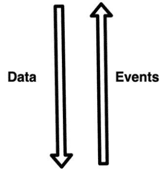

图 1.7 – 可视化数据与事件的单向流动

同样，在数据方面，每个可组合组件都会向下传递回调函数给其子可组合组件。但这次，回调函数是由用户交互引起的，它们创建了一个从每个嵌套可组合组件到其父组件以及更上层的回调函数的上游。这意味着不仅数据是单向的，事件也是如此，只是方向相反。

从这个例子中，很明显，数据和事件只在一个方向上流动，这是好事，因为只有一个真相来源——理想情况下是`ViewModel`——负责处理它们，这导致在 UI 扩展时出现更少的错误和更易于维护。

让我们考虑一个使用 Jetpack Compose 提供的另一个可组合组件`Button`的例子。正如其名所示，它在屏幕上发出一个按钮小部件，并且它公开一个名为`onClick`的回调函数，该函数在用户点击按钮时通知我们。

在以下示例中，我们的`MailButton`可组合组件接收一个电子邮件标识符`mailId`和一个事件回调函数`mailPressedCallback`：

```java
@Composable
fun MailButton(
    mailId: Int,
    mailPressedCallback: (Int) -> Unit
) {
    Button(onClick = { mailPressedCallback(mailId) }) {
        Text(text = "Expand mail $mailId")
    }
}
```

当它通过`mailId`接收数据时，它还会将`mailPressedCallback`函数设置为每次按钮被点击时调用，从而将事件发送回其父级。这样，数据向下流动，回调向上流动。

注意

构建您的 Compose UI 的理想方式是，由`ViewModel`提供的数据从父级可组合组件流向子级可组合组件，事件从每个可组合组件流向`ViewModel`。如果您不熟悉`ViewModel`组件，请不要担心，我们将在即将到来的*第二章*，*使用 Jetpack ViewModel 处理 UI 状态*中介绍它。

## 重组合

我们已经介绍了如何通过输入数据定义可组合函数，并指出每当数据发生变化时，可组合组件都会重建，以渲染与新接收到的数据相对应的新 UI 状态。

当输入改变时再次调用您的可组合函数的过程称为**重组合**。当输入改变时，Compose 会自动为我们触发重组合过程并重建 UI 小部件树，重新绘制由可组合组件发出的小部件，以便它们显示新接收到的数据。

然而，重新组合整个 UI 层次结构是计算密集型的，这就是为什么 Compose 只调用具有新输入的函数，而跳过那些输入未改变的函数。优化重建可组合树的过程是一项复杂的工作，通常被称为*智能重组合*。

注意

在传统的视图系统中，我们会手动调用视图的设置器和获取器，但使用 Compose，只需为我们提供的可组合组件提供新参数即可。这将允许 Compose 为 UI 的部分启动重组合过程，以便显示更新的值。

在深入实际的重组合示例之前，让我们快速看一下可组合函数的生命周期。其生命周期由组合生命周期定义，如下所示：

![图 1.8 – 可组合函数的组合生命周期]

![图片 B17788_01_08.jpg]

图 1.8 – 可组合函数的组合生命周期

这意味着一个可组合组件首先进入组合状态，在离开此过程之前，它可以按需重新组合多次——也就是说，在它从屏幕消失之前，它可以被重新组合和重建多次，每次可能显示不同的值。

重组通常是由`State`对象内部的变化触发的，因此让我们通过一个例子来探讨这一过程是如何在我们几乎没有干预的情况下无缝发生的。假设你有一个`TimerText`可组合组件，它期望显示一个特定的已过`seconds`数，这个数在一个`Text`可组合组件中显示。计时器从 0 开始，每秒更新一次（或 1,000 毫秒），显示已过的秒数：

```java
var seconds by mutableStateOf(0)
val stopWatchTimer = timer(period = 1000) { seconds++ }
   ...
@Composable
fun TimerText(seconds: Int) {
   Text(text = "Elapsed: $seconds")
}
```

在*第二章*的*定义和处理 Compose 状态*部分，我们将更详细地定义 Compose 中的状态，但在此之前，让我们将`seconds`视为一个简单的状态对象（使用`mutableStateOf()`实例化），其初始值为`0`，并且其值会随时间变化，每次变化都会触发一次重组。

每当`stopWatchTimer`增加`seconds`状态对象的值时，Compose 都会触发一次重组，重建组件树并使用新的参数重新绘制可组合组件。

在我们的情况下，`TimerText`将因为接收不同的参数而进行重组或重建——第一次，它将接收`0`，然后是`1`、`2`，依此类推。这反过来又触发了`Text`可组合组件也进行重组，这就是为什么 Compose 会在屏幕上重新绘制它以显示更新的消息。

重组是一个复杂的话题。由于我们现在无法深入探讨，因此也很重要地介绍一些更高级的概念，如文档中所述：[`developer.android.com/jetpack/compose/mental-model#any-order`](https://developer.android.com/jetpack/compose/mental-model#any-order)。

现在我们已经介绍了重组是什么以及 Compose 背后的核心概念，是时候更深入地了解用于构建 Compose UI 的可组合组件了。

# 探索 Compose UI 的构建块

我们迄今为止只简要地看了`Text`和`Button`可组合组件。这就是为什么在本节中，我们不仅将了解活动如何渲染可组合组件而不是 XML，以及如何预览它们，而且还将更深入地了解最重要和最常用的可组合函数：从我们看到的，如`Text`和`Button`，到新的如`TextField`、`Image`、`Row`、`Column`和`Box`。

总结来说，本节将涵盖以下主题：

+   设置内容和预览可组合组件

+   探索核心可组合组件

+   使用修饰符自定义可组合组件

+   Compose 中的布局

让我们开始了解如何在屏幕上渲染可组合函数。

## 设置内容和预览可组合组件

我们快速浏览了一些可组合函数，但并没有涉及到使应用程序显示 Compose UI 的方面。

通过简单地替换传统的`setContentView(R.layout.XML)`调用为`setContent()`并将一个 composable 函数传递给它，就可以轻松设置 composable 内容，并鼓励你在`Activity`类中这样做：

```java
import androidx.activity.compose.setContent
class MainActivity : ComponentActivity() {
   override fun onCreate(savedInstanceState: Bundle?) {
       super.onCreate(savedInstanceState)
       setContent {
           Text("Hello world")
       }
   }
}
```

由于 Compose 不再需要`AppCompat` API 进行向后兼容，我们让我们的`MainActivity`继承自基础`ComponentActivity`类。

在前面的例子中，我们在`MainActivity`的`onCreate`回调中调用了`setContent`方法，并将一个`Text` composable 函数传递给它。如果我们运行这个应用，我们将看到`"Hello world"`消息。

`setContent`方法是为`ComponentActivity`提供的扩展函数，它将给定的 composable 组合到给定的活动中。它只接受一个`@Composable`函数作为尾随 lambda。输入的 composable 函数将成为活动的根视图，并作为你的 Compose 层次结构的容器。

注意

你可以使用`ComposeView`类将 composable 函数添加到已经定义了 XML UI 的片段或活动中，但关于互操作性的细节我们将不会过多介绍。

由于 XML 为我们提供了一个预览工具，一个很好的问题是 Compose 是否也有一个。Compose 带来的是一个更强大的预览工具，它允许我们在每次想要查看 UI 如何演变时，无需在模拟器或真实设备上运行应用程序。

预览你的 composable 非常简单；只需将其添加到`@Preview`注解中：

```java
@Preview(showBackground = true)
@Composable
fun FriendlyMessage() {
   Text(text = "Greetings!")
}
```

IDE 会自动检测你想要预览这个 composable，并将其显示在屏幕的右侧。请确保你*重新构建*你的项目并启用**分割**选项：

![Figure 1.9 – Previewing composable functions in Android Studio

![img/B17788_01_09.jpg]

图 1.9 – 在 Android Studio 中预览 composable 函数

可选地，你可以通过传递值为`true`的`showBackground`参数来指定预览显示背景以获得更好的可见性。

注意

确保你想要预览的 composable 函数没有输入参数。如果有，请为它们提供默认值，以便预览工具可以工作。

尽管这个预览工具比这更强大，因为它支持**交互模式**，允许你与 UI 交互，以及**实时编辑文本**，如果启用，每次你更改宽度、高度或其他设置时，预览都会重新加载，就像真实的 UI 一样。你可以在下面的屏幕截图中看到这两个选项：

![Figure 1.10 – Using the Preview feature in Compose

![img/B17788_01_10.jpg]

图 1.10 – 在 Compose 中使用预览功能

注意

要在 Android Studio Arctic Fox 上启用**交互模式**，请转到**文件** | **设置** | **实验性**（Windows）或**Android Studio** | **首选项** | **实验性**（macOS）。

此外，如果你在每个函数上使用 `@Preview` 注解，你可以同时拥有多个预览。你可以通过 `name` 参数为每个预览添加名称，甚至可以通过 `device` 参数告诉预览工具它应该在哪个设备上显示：

```java
@Preview(
    name = "Greeting preview",
    showSystemUi = true,
    device = Devices.PIXEL_2_XL
)
@Composable
fun FriendlyMessagePreview() { Text(text = "Greetings!") }
@Preview(
        showSystemUi = true,
        device = Devices.NEXUS_5)
@Composable
fun FriendlyMessagePreview2() { Text(text = "Goodbye!") }
```

确保你也设置 `showSystemUi` 为 `true` 以查看整个设备。

备注

`@Preview` 函数应该有不同的名称，以避免预览冲突。

现在我们已经学习了如何设置和预览 Compose UI，是时候探索新的可组合组件了。

## 探索核心可组合组件

我们已经快速浏览了一些最基本的可组合函数：`Text`、`Button` 和 `Image`。在本小节中，我们将花更多的时间探索这些可组合组件，以及新的组件，如 `TextField`。

### 文本

`Text` 是我们旧的和喜爱的 `TextView` 的 Compose 版本。`Text` 由 Compose 提供，实现了任何应用程序中最基本但最重要的功能：显示文本的能力。我们已经在几个示例中使用了这个可组合组件：

```java
Text(text = "Greetings $name!")
```

你可能想知道我们如何自定义它。让我们查看 `Text` 的源代码或文档，以找到它最基本的和最常用的参数：

+   `text` 是唯一的必填参数。它期望一个 `String` 并设置输出文本。

+   `color` 指定输出文本的颜色，并期望一个 `Color` 对象。

+   `fontSize` 类型为 `TextUnit`、`fontStyle` 类型为 `FontStyle`、`fontFamily` 类型为 `FontFamily` 和 `fontWeight` 类型为 `FontWeight` 都允许你自定义文本的外观和样式。

+   `textAlign` 指定文本的水平对齐方式。它期望一个 `TextAlign` 对象。

+   `maxLines` 期望一个 `Int` 值，用于设置输出文本的最大行数。

+   `style` 期望一个 `TextStyle` 对象，并允许你通过主题定义和重用样式。

我们不是逐个检查 `Text` 的所有参数，而是看看一个我们可以自定义 `Text` 可组合函数外观的例子：

```java
@Composable
fun MyAppText() {
   Text(
       text = stringResource(id = R.string.app_name),
       fontStyle = FontStyle.Italic,
       textAlign = TextAlign.Center,
       color = Color.Magenta,
       fontSize = 24.sp,
       fontWeight = FontWeight.ExtraBold)
}
```

而不是传递一些硬编码的文本，我们通过内置的 `stringResource` 函数传递了一个字符串资源，并得到了以下结果：


图 1.11 – 探索自定义的 Text 可组合组件

现在我们已经学会了如何使用 `Text` 可组合组件显示文本，接下来让我们转向按钮。

### 按钮

在任何应用程序中，显示文本都是至关重要的，但拥有可点击的按钮可以让应用程序变得交互式。我们之前已经使用过 `Button` 可组合组件（在视图系统中也称为 `Button`），其主要特点是 `onClick` 回调函数，它会通知我们用户何时按下按钮。

虽然 `Button` 有很多自定义参数，但让我们看看最常用的参数：

+   `onClick` 是一个必填参数，它期望一个函数，当用户按下按钮时将被调用。

+   `colors`期望一个定义内容/背景颜色的`ButtonColors`对象。

+   `shape`期望一个自定义/材料主题`Shape`对象，用于设置按钮的形状。

+   `content`是一个强制参数，它期望一个显示此`Button`内部内容的可组合函数。我们可以在其中添加任何可组合函数，包括`Text`、`Image`等。

让我们尝试构建一个`Button`函数，使其利用这些核心参数：

```java
@Composable
fun ClickableButton() {
   Button(
       onClick = { /* callback */ },
       colors = ButtonDefaults.buttonColors(
           backgroundColor = Color.Blue,
           contentColor = Color.Red),
       shape = MaterialTheme.shapes.medium
   ) { Text("Press me") }
}
```

我们还传递了一个预定义的`MaterialTheme`形状。让我们预览生成的可组合函数：

![图 1.12 – 探索自定义按钮可组合函数![图 1.12 – 探索自定义按钮可组合函数图 1.12 – 探索自定义按钮可组合函数有了这个，我们已经看到了如何轻松地使用`Button`可组合函数创建自定义按钮。接下来，让我们尝试玩转另一个可组合函数——`TextField`。### TextField 添加按钮是拥有交互式 UI 的第一步，但这个领域最重要的元素是`TextField`可组合函数，在视图系统中之前被称为`EditText`。就像`EditText`所做的那样，`TextField`可组合函数允许用户输入和修改文本。虽然`TextField`有很多参数，但它最重要的参数如下：+   `value`是一个强制`String`参数，因为它是显示的文本。这个值应该在我们输入时改变，通过将其保持在`State`对象中；关于这一点，我们很快就会详细介绍。+   `onValueChange`是一个强制函数，每次用户输入新字符或删除现有字符时都会触发。+   `label`期望一个可组合的函数，允许我们添加一个描述性标签。让我们看看一个简单的`TextField`用法，它也处理自己的状态：```java@Composablefun NameInput() {   val textState = remember { mutableStateOf("") }   TextField(        value = textState.value,        onValueChange = { newValue ->            textState.value = newValue        },        label = { Text("Your name") })}```它通过定义一个`MutableState`来持有`TextField`显示的文本来实现这一点。这意味着`textState`在重新组合过程中不会改变，所以每次 UI 因为其他可组合函数而更新时，`textState`都应该被保留。此外，我们还在`MutableState`对象上包裹了一个`remember`块，这告诉 Compose 在重新组合过程中，它不应该将值重置为其初始值；即`""`。要获取或设置`State`或`MutableState`对象的值，我们的`NameInput`可组合函数使用`value`访问器。因为`TextField`通过`value`访问器访问`MutableState`对象，所以 Compose 知道每次`textState`值改变时——在我们的案例中，在`onValueChange`回调中——重新触发*重新组合*。通过这样做，我们确保当我们输入`TextField`中的文本时，UI 也会更新，以显示已添加或从键盘删除的新字符。如果 Compose 中的状态概念现在不太容易理解，请不要担心——我们将在*第二章*中更详细地介绍如何在 Compose 中定义状态，即使用 Jetpack ViewModel 处理 UI 状态。注意：与 `EditText` 不同，`TextField` 没有内部状态。这就是为什么我们创建并处理了它；否则，当我们输入时，UI 不会相应地更新。结果的 `NameInput` 可组合项正确更新了 UI，看起来像这样：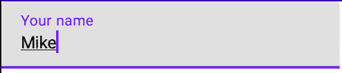

图 1.13 – 探索 TextField 可组合项

现在我们已经学会了如何在基于 Compose 的应用程序中添加输入字段，是时候探索任何 UI 中最常见的元素之一了。

### 图像

在我们的应用程序中显示图形信息是至关重要的，Compose 提供了一个方便的可组合项，称为 `Image`，它是 View 系统中 `ImageView` 的可组合版本。

虽然 `Image` 具有许多自定义参数，但让我们检查一下最常用的参数：

+   `painter` 期望一个 `Painter` 对象。此参数是必需的，因为它设置了图像资源。作为替代，你可以使用 `Image` 的重载版本，直接将 `ImageBitmap` 对象传递给其 `bitmap` 参数。

+   `contentDescription` 是一个必需的 `String`，它被辅助功能服务使用。

+   `contentScale` 期望一个 `ContentScale` 对象，该对象指定了图片的缩放。

让我们添加一个显示应用程序图标的 `Image` 可组合项，使用 `painterResource`：

```java
@Composable
fun BeautifulImage() {
    Image(
        painter =
           painterResource(R.drawable.ic_launcher_foreground),
        contentDescription = "My app icon",
        contentScale = ContentScale.Fit
    )
}
```

最后，让我们预览 `BeautifulImage` 函数，然后继续下一节：


图 1.14 – 探索 Image 可组合项

我们也尝试过使用 Compose 显示图片，但你可能仍在 wondering，我们如何自定义所有这些可组合函数？

## 使用修饰符自定义可组合项

我们到目前为止所涵盖的所有可组合项都包含一个我们尚未涵盖的参数：`modifier`。它期望一个 `Modifier` 对象。简单来说，*修饰符告诉一个可组合项如何在父可组合项中显示、排列或表现。通过传递修饰符，我们可以为可组合项指定许多配置：从大小、填充或形状到背景颜色或边框。*

让我们从一个例子开始，使用 `Box` 可组合项并为其指定一个 `size` 修饰符：

```java
@Composable
fun ColoredBox() {
   Box(modifier = Modifier.size(120.dp))
}
```

我们将在稍后介绍 `Box` 可组合项，但在此之前，你可以将其视为一个容器，我们将使用它来在屏幕上绘制几个形状。这里重要的是我们传递了 `Modifier.size()` 修饰符，它设置了盒子的大小。它接受一个 `dp` 值，代表可组合项的宽度和高度。你还可以在 `size()` 修饰符内部或使用 `height()` 和 `width()` 修饰符单独传递宽度和高度作为参数。

通常只为可组合项指定一个修饰符是不够的。这就是为什么 *修饰符可以被链式调用。让我们通过向我们的 `Box` 添加几个其他配置来链式调用多个修饰符：*

```java
@Composable
fun ColoredBox() {
   Box(modifier = Modifier
           .size(120.dp)
           .background(Color.Green)
           .padding(16.dp)
           .clip(RoundedCornerShape(size = 20.dp))
           .background(Color.Red))
}
```

如我们之前提到的，链式修饰符很简单：从一个空的`Modifier`对象开始，然后依次链接着新的修饰符。我们已经链接着几个新的修饰符，从`background`开始，然后是`padding`、`clip`，最后是另一个`background`。当这些修饰符组合在一起时，产生了一个输出，它是一个绿色的矩形，其中包含一个嵌套的红色圆角矩形：

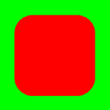

图 1.15 – 探索链式修饰符

注意

链中修饰符的顺序很重要，因为修饰符是从外层应用到内层的。每个修饰符都会修改可组合组件，并为链中的下一个修饰符准备它。不同的修饰符顺序会产生不同的结果。

在前面的例子中，因为修饰符是从最外层应用到最内层的，所以整个矩形框是绿色的，因为绿色是第一个应用的颜色修饰符。向内移动，我们应用了 16 `dp`的内边距。之后，仍然向内移动，应用了`RoundedCornerShape`修饰符。最后，在最内层，我们应用了另一个颜色修饰符——这次是红色——我们得到了最终的结果。

现在我们已经玩转了最常见的可组合组件，是时候开始构建实际布局了，这些布局使用了多个可组合函数。

## Compose 中的布局

通常，即使按照前面的例子，也无法仅通过构建一个简单的屏幕，因为其中大多数例子只包含一个可组合组件。对于简单的用例，可组合函数只包含一个子可组合组件。

要构建更复杂的 UI 组件，Compose 中的布局组件允许您添加所需数量的子可组合组件。

在本节中，我们将介绍那些允许您以线性或叠加方式放置子可组合组件的可组合函数，例如以下内容：

+   `Row`用于水平排列子可组合组件

+   `Column`用于垂直排列子可组合组件

+   `Box`用于将子可组合组件堆叠在一起

根据这些定义，让我们通过以下图表来设想布局可组合组件：

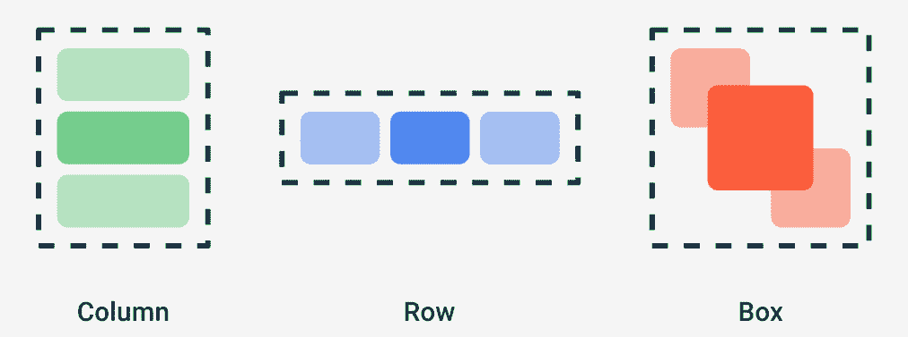

图 1.16 – 探索 Column、Row 和 Box

现在很清楚，通过`Column`、`Row`和`Box`以不同的方式排列子可组合组件可以很容易地实现，所以现在是时候更详细地研究它们了。

### 行

在屏幕上显示多个小部件是通过使用一个`Row`可组合组件来水平排列其子可组合组件来实现的，就像旧的具有水平方向的`LinearLayout`一样：

```java
@Composable
fun HorizontalNumbersList() {
   Row(
       horizontalArrangement = Arrangement.Start,
       verticalAlignment = Alignment.CenterVertically,
       modifier = Modifier.fillMaxWidth()
   ) {
       Text("1", fontSize = 36.sp)
       Text("2", fontSize = 36.sp)
       Text("3", fontSize = 36.sp)
       Text("4", fontSize = 36.sp)
   }
}
```

我们已将 `Row` 设置为仅占用可用宽度，并添加了多个 `Text` 函数作为子元素可组合。这次，我们指定了 `horizontalArrangement` 为 `Start`，这样它们就从父元素的左侧开始，同时也确保它们通过传递 `verticalAlignment` 参数的 `CenterVertically` 对齐来垂直居中。结果是直接的：

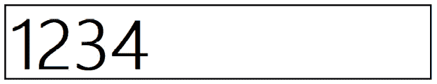

图 1.17 – 探索 Row 可组合元素

主要来说，`Row` 可组合元素的基本参数与子元素的排列或对齐方式相关：

+   `horizontalArrangement` 定义了子元素相对于彼此以及相对于父元素 `Row` 的水平位置。除了 `Arrangement.Start`，还可以传递 `Center`、`End`、`SpaceBetween`、`SpaceEvenly` 或 `SpaceAround`。

+   `verticalAlignment` 设置了子元素在父元素 `Row` 中的垂直位置。除了 `Alignment.CenterVertically`，还可以传递 `Top` 或 `Bottom`。

现在我们已经水平排列了子元素可组合，让我们尝试垂直排列它们。

### Column

在屏幕上显示垂直列表可以通过使用排列其子元素可组合元素的垂直 `Column` 可组合元素来实现，就像旧的具有垂直方向的 `LinearLayout` 一样：

```java
@Composable
fun NamesVerticalList() {
   Column(verticalArrangement = Arrangement.SpaceEvenly,
       horizontalAlignment = Alignment.CenterHorizontally,
       modifier = Modifier.fillMaxSize()
   ) {
       Text("John", fontSize = 36.sp)
       Text("Amanda", fontSize = 36.sp)
       Text("Mike", fontSize = 36.sp)
       Text("Alma", fontSize = 36.sp)
   }
}
```

我们已将 `Column` 设置为占用所有可用空间，并添加了多个 `Text` 函数作为子元素可组合。这次，我们指定了 `verticalArrangement` 为 `SpaceEvenly`，这样子元素在父元素内部均匀分布，但我们还确保它们通过传递 `horizontalAlignment` 参数的 `CenterHorizontally` 对齐来水平居中：

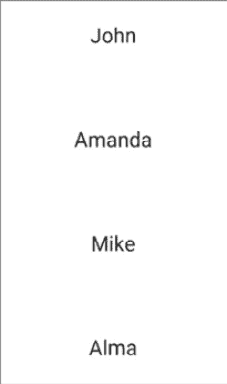

图 1.18 – 探索 Column 可组合元素

与 `Row` 类似，`Column` 的基本参数也与子元素的排列或对齐方式相关。不过，这次排列是垂直的，而对齐是水平的：

+   `verticalArrangement` 定义了子元素在父元素 `Column` 中的垂直位置。这些值与行的 `horizontalArrangement` 相同。

+   `horizontalAlignment` 定义了子元素在父元素 `Column` 中的对齐方式。除了 `Alignment.CenterHorizontally`，还可以传递 `Start` 或 `End`。

    注意

    如果你感到勇敢，现在是探索不同对齐和排列方式的好时机，看看 UI 如何变化。确保使用 `@Preview` 注解预览你的可组合函数。

### Box

到目前为止，我们已经学习了如何水平垂直排列子元素，但如果我们想将它们堆叠在一起呢？`Box` 可组合元素就派上用场了，因为它允许我们堆叠子元素可组合。`Box` 还允许我们将子元素相对于它进行定位。

让我们尝试构建自己的 `Box`。我们将在 `Box` 内部堆叠两个可组合元素：

+   一个绿色圆圈，将使用 `Surface` 的帮助创建。`Surface` 可组合项允许您轻松定义具有特定形状、背景或高度的材质表面。

+   在 `Text` 可组合项内部添加的一个加号（`+`），该可组合项与其父 `Box` 的中心对齐。

这就是代码的样子：

```java
@Composable
fun MyFloatingActionButton() {
   Box {
       Surface(
           modifier = Modifier.size(32.dp),
           color = Color.Green,
           shape = CircleShape,
           content = { })
       Text(text = "+",
            modifier = Modifier.align(Alignment.Center))
   }
}
```

`Surface` 可组合项使用一个强制性的 `content` 参数定义，该参数接受另一个可组合项作为其内部内容。我们不想在其中添加可组合项。相反，我们想在它上面堆叠一个 `Text` 可组合项，因此我们将一个空函数传递给 `content` 参数。

结果类似于我们所有人都习惯的 FAB：

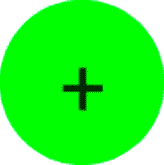

图 1.19 – 探索 Box 可组合项

要充分利用 `Box`，您必须注意以下几点：

+   在 `Box` 内部添加可组合项的顺序定义了它们被绘制和堆叠的顺序。如果您交换 `Surface` 和 `Text` 的顺序，`+` 图标将被绘制在绿色圆圈下方，使其变得不可见。

+   您可以通过为每个子项的对齐修饰符传递不同的值来相对于 `Box` 父项对齐子项可组合项。这就是为什么，除了 `Alignment.Center` 之外，您还可以使用 `CenterStart`、`CenterEnd`、`TopStart`、`TopCenter`、`TopEnd`、`BottomStart`、`BottomEnd` 或 `BottomCenter` 来定位子项可组合项。

现在我们已经涵盖了基础知识，是时候卷起袖子创建我们的第一个 Compose 项目了！

# 构建基于 Compose 的屏幕

假设我们想要构建一个展示一些餐厅的应用程序。我们将使用 Compose 构建 UI，并逐步创建一个新的 Compose 项目。然后我们将为这样的餐厅构建一个列表项，并最终显示一个此类项目的示例列表。

总结来说，在本节中，我们将构建我们的第一个基于 Compose 的应用程序：一个餐厅探索应用程序！为了实现这一点，我们必须显示一些餐厅，我们将通过以下主题来完成：

+   创建您的第一个 Compose 项目

+   构建餐厅元素布局

+   使用 Compose 显示餐厅列表

现在我们已经明确了路径，让我们开始吧。

## 创建您的第一个 Compose 项目

要构建餐厅应用程序，我们必须创建一个新的基于 Compose 的项目：

1.  打开 Android Studio 并选择 **新建项目** 选项：


图 1.20 – 使用 Android Studio 开始新项目

如果您已经打开了 Android Studio，请转到 **文件**，然后是 **新建**，最后是 **新建项目**。

注意

确保您拥有 Arctic Fox 2020.3.1 或更高版本的 Android Studio。如果您使用的是较新版本，则某些文件可能生成的代码存在差异。

1.  在 **手机和平板** 模板部分，选择 **空 Compose 活动**，然后选择 **下一步**：

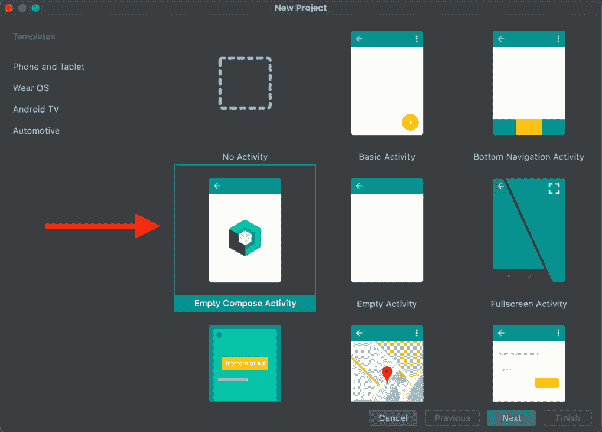

图 1.21 – 使用 Android Studio 开始新项目

1.  接下来，输入一些关于您应用程序的详细信息。在`Restaurants app`中。将**语言**保留为**Kotlin**，并将**最小 SDK**设置为**API 21**。然后，单击**完成**。

    重要提示

    即将进行的步骤是一个重要的配置步骤。它确保项目 Android Studio 为您配置的依赖项版本（从 Compose 到 Kotlin 和其他依赖项）与我们全书所使用的版本相同。通过这样做，您将能够跟随代码片段并检查代码源，而无需担心任何 API 差异。

1.  在新创建的项目中，在检查代码之前，请确保生成的项目使用了全书所使用的依赖项版本。

要这样做，首先转到项目级别的`build.gradle`文件，并在`dependencies`块内确保 Kotlin 版本设置为`1.6.10`：

```java
buildscript {
    […]
    dependencies {
        classpath "com.android.tools.build:gradle:7.0.2"
        classpath "org.jetbrains.kotlin:kotlin-gradle- 
            plugin:1.6.10"
      […]
    }
}
```

或者，如果您使用的是较新版本的 Android Studio，您可能会在`plugins`块中找到本项目中使用的 Kotlin 版本，如下所示：

```java
plugins {
    […]
    id 'org.jetbrains.kotlin.android' version '1.6.10' 
        apply false
}
```

如果您还没有安装，可能需要安装 Android Studio 中 1.6.10 插件的版本。要做到这一点，请单击`1.6.10`。

仍然在项目级别的`build.gradle`文件中，因为 Compose 与我们在项目中使用的 Kotlin 版本相关联，请确保在`ext { }`块内将 Compose 版本设置为`1.1.1`：

```java
buildscript {
    ext {
        compose_version = '1.1.1'
    }
    repositories {…}
    dependencies {…}
}
```

然后，进入应用级别的`build.gradle`文件。首先检查`composeOptions { }`块看起来是否如下：

```java
plugins { ... }
android {
    [...]
    buildFeatures { compose true }
    composeOptions {
        kotlinCompilerExtensionVersion compose_version
    }
    packagingOptions { ... }
}
```

在某些版本的 Android Studio 中，`composeOptions { }`块可能会添加一个过时的`kotlinCompilerVersion '1.x.xx'`行，应该将其删除。

最后，确保应用级别的`build.gradle`文件的`dependencies`块包含以下版本的依赖项：

```java
dependencies {
    implementation 'androidx.core:core-ktx:1.7.0'
    implementation 'androidx.appcompat:appcompat:1.4.1'
    implementation 'com.google.android.material:
        material:1.5.0'
    implementation "androidx.compose.ui:ui:
        $compose_version"
    implementation "androidx.compose.material:
        material:$compose_version"
    implementation "androidx.compose.ui:ui-tooling-
        preview:$compose_version"
    implementation 'androidx.lifecycle:lifecycle-
        runtime-ktx:2.4.1'
    implementation 'androidx.activity:activity-
        compose:1.4.0'
    testImplementation 'junit:junit:4.+'
    androidTestImplementation
        'androidx.test.ext:junit:1.1.3'
    androidTestImplementation 
        'androidx.test.espresso:espresso-core:3.4.0'
    androidTestImplementation "androidx.compose.ui:ui-
        test-junit4:$compose_version"
    debugImplementation "androidx.compose.ui:ui-
        tooling:$compose_version"
}
```

如果您必须进行任何更改，通过在 Android Studio 中单击**同步项目与 Gradle 文件**按钮或通过按**文件**菜单选项然后选择**同步项目与 Gradle 文件**来同步您的项目与 Gradle 文件。

现在我们已经设置好了。让我们回到 Android Studio 生成的源代码。

现在我们已经到达了这里——我们的第一个 Compose 项目已经设置好了！让我们通过导航到`MainActivity.kt`文件来查看源代码。我们可以得出结论，它由三个主要部分组成：

+   `MainActivity`类

+   `Greeting`可组合函数

+   `DefaultPreview`可组合函数

`MainActivity`类是将内容传递到`onCreate`回调中的`setContent`方法的地点。正如我们所知，我们需要调用`setContent`来设置 Compose UI 并传递可组合函数作为我们的 UI：

```java
setContent {
   RestaurantsAppTheme {
       Surface(color = MaterialTheme.colors.background) {
           Greeting("Android")
       }
   }
}
```

IDE 模板已经实现了一个`Greeting`可组合函数，它被包裹在一个使用主题背景色的`Surface`中。但那个作为`setContent`方法父可组合函数传递的`RestaurantsAppTheme`函数是什么？

如果你按*Ctrl* + *B*或*Command* + *B*在函数名上，你将被带到生成主题的`Theme.kt`文件，这是我们的主题生成的地方。`RestaurantsAppTheme`是一个由 IDE 自动生成的可组合函数，因为它包含了应用的名字：

```java
@Composable
fun RestaurantsAppTheme(
   darkTheme: Boolean = isSystemInDarkTheme(),
   content: @Composable() -> Unit
) {
   ...
   MaterialTheme(
       colors = colors,
       typography = Typography,
       shapes = Shapes,
       content = content)
}
```

该应用的主题是`MaterialTheme`的包装，如果我们将其传递给`setContent`调用，它允许我们在应用主题内部重用自定义样式和配色方案。为了使其生效并重用自定义样式，我们必须将我们的可组合函数传递给主题可组合的`content`参数——在我们的案例中，在`MainActivity`中，将包裹在`Surface`可组合中的`Greeting`可组合传递给`RestaurantsAppTheme`可组合。

让我们回到`MainActivity.kt`文件中，看看 Android Studio 生成的其他部分。我们可以看到，`Greeting`可组合通过`Text`显示文本，类似于我们之前的示例中的可组合函数。

为了预览`Greeting`可组合，IDE 还为我们生成了一个名为`DefaultPreview`的预览可组合，它允许我们预览`MainActivity`显示的内容；即`Greeting`。它还使用了主题可组合来获取一致的主题 UI。

现在我们已经实现了一个大里程碑，即创建了一个基于 Compose 的应用程序，现在是时候开始着手我们的餐厅应用了！

## 构建餐厅元素布局

是时候动手构建应用中餐厅的布局了：

1.  通过左键单击应用程序包并选择`RestaurantsScreen`作为名称，然后选择类型为**文件**来创建一个新文件。

1.  在这个文件中，让我们为我们的第一个 Compose 屏幕创建一个`RestaurantsScreen`可组合函数：

    ```java
    @Composable
    fun RestaurantsScreen() {
       RestaurantItem()
    }
    ```

1.  接下来，在`RestaurantsScreen.kt`文件内部，让我们定义`RestaurantItem`可组合，它具有带有提升和填充的`Card`可组合：

    ```java
    @Composable
    fun RestaurantItem() {
        Card(elevation = 4.dp,
             modifier = Modifier.padding(8.dp)
        ) {
            Row(verticalAlignment =
                    Alignment.CenterVertically,
                modifier = Modifier.padding(8.dp)) {
                RestaurantIcon(
                    Icons.Filled.Place,
                    Modifier.weight(0.15f))
                RestaurantDetails(Modifier.weight(0.85f))
            }
        }
    }
    ```

确保你包含的每个导入都是`androidx.compose.*`包的一部分。如果你不确定要包含哪些导入，请查看以下 URL 中`RestaurantsScreen.kt`文件的源代码：

[`github.com/PacktPublishing/Kickstart-Modern-Android-Development-with-Jetpack-and-Kotlin/blob/main/Chapter_01/chapter_1_restaurants_app/app/src/main/java/com/codingtroops/restaurantsapp/RestaurantsScreen.kt`](https://github.com/PacktPublishing/Kickstart-Modern-Android-Development-with-Jetpack-and-Kotlin/blob/main/Chapter_01/chapter_1_restaurants_app/app/src/main/java/com/codingtroops/restaurantsapp/RestaurantsScreen.kt)

回到之前的代码片段，我们可以这样说，`Card`可组合类似于旧视图系统中的`Cardview`，因为它允许我们通过边框或提升美化代表餐厅的 UI 组件。

在我们的案例中，`Card` 包含一个 `Row` 组合器，其子组合器在垂直方向上居中，并且周围有一些填充。我们使用 `Row` 是因为我们将以水平方式显示一些关于餐厅的详细信息：一个图标和一些文本细节。

我们将 `RestaurantIcon` 和 `RestaurantDetails` 组合器作为 `Row` 组合器的子项传递，但这些函数尚未定义，因此我们遇到了编译错误。现在，不要担心权重修饰符。让我们首先定义 `RestaurantIcon` 组合器！

1.  仍然在 `RestaurantsScreen.kt` 文件中，创建另一个名为 `RestaurantIcon` 的组合器函数，其代码如下：

    ```java
    @Composable
    private fun RestaurantIcon(icon: ImageVector, modifier: Modifier) {
       Image(imageVector = icon,
             contentDescription = "Restaurant icon",
             modifier = modifier.padding(8.dp))
    }
    ```

`RestaurantIcon` 组合器将 `ImageVector` 图标设置到 `Image` 组合器中 - 在我们的案例中，是一个预定义的 Material Theme 图标，称为 `Icons.Filled.Place`。它还设置了一个 `contentDescription` 值，并在它接收到的修饰符上添加了填充。

然而，最有趣的部分是 `RestaurantIcon` 接收来自其父 `Row` 的 `Modifier` 作为参数。它接收到的参数是 `Modifier.weight(0.15f)`，这意味着我们的 `Row` 为其水平定位的每个子项分配了权重。这个值 - 在这种情况下，`0.15f` - 意味着这个子 `RestaurantIcon` 将从其父 `Row` 中占用 15% 的水平空间。

1.  现在，仍然在 `RestaurantsScreen.kt` 文件中，创建一个显示餐厅详细信息的 `RestaurantDetails` 函数：

    ```java
    @Composable
    private fun RestaurantDetails(modifier: Modifier) {
       Column(modifier = modifier) {
           Text(text = "Alfredo's dishes",
                style = MaterialTheme.typography.h6)
           CompositionLocalProvider(
               LocalContentAlpha provides 
                   ContentAlpha.medium) {
               Text(text = "At Alfredo's … seafood dishes.",
                    style = MaterialTheme.typography.body2)
           }
       }
    }
    ```

类似地，`RestaurantDetails` 接收来自 `Row` 的 `Modifier.weight(0.85f)` 修饰符作为参数，这将使其占据剩余的 85% 水平空间。

`RestaurantDetails` 组合器是一个简单的 `Column`，垂直排列了两个 `Text` 组合器，一个是餐厅的标题，另一个是它的描述。

但 `CompositionLocalProvider` 是怎么回事？为了显示与标题相比变暗的描述，我们应用了一个 `LocalContentAlpha` 的 `ContentAlpha.medium`。这样，带有餐厅描述的子 `Text` 将被淡化或灰色显示。

`CompositionLocalProvider` 允许我们将数据传递到组合器层次结构中。在这种情况下，我们希望子 `Text` 被灰色显示，因此我们使用后缀 `provides` 方法传递了一个具有 `ContentAlpha.medium` 值的 `LocalContentAlpha` 对象。

1.  暂时转到 `MainActivity.kt` 并删除 `DefaultPreview` 组合器函数，因为我们将在下一个步骤中定义自己的 `@Preview` 组合器。

1.  返回 `RestaurantsScreen.kt` 文件内部，定义一个 `@Preview` 组合器：

    ```java
    @Preview(showBackground = true)
    @Composable
    fun DefaultPreview() {
       RestaurantsAppTheme {
           RestaurantsScreen()
       }
    }
    ```

如果你为你的应用程序选择了不同的名称，你可能需要更新之前在 `Theme.kt` 文件中定义的主题组合器代码片段。

1.  重新构建项目，并通过预览新创建的 `DefaultPreview` 组合器来检查 `RestaurantsScreen()` 组合器，该组合器应显示一个餐厅项目：


图 1.22 – 预览餐厅项目

1.  最后，回到 `MainActivity.kt` 文件，移除 `Greeting` 可组合组件。同时，在 `setContent` 方法中移除 `Surface` 和 `Greeting` 函数调用，并用 `RestaurantScreen` 替换：

    ```java
    setContent {
       RestaurantsAppTheme {
           RestaurantsScreen()
       }
    }
    ```

通过将 `RestaurantScreen` 传递给 `MainActivity` 的 `setContent` 方法，我们确保在构建和运行时应用程序将渲染所需的 UI。

1.  可选地，你现在可以**运行**应用程序，直接在你的设备或模拟器上查看餐厅。

现在我们已经为餐厅构建了一个布局，是时候学习如何显示更多餐厅了！

## 使用 Compose 显示餐厅列表

到目前为止，我们已经显示了一个餐厅项，现在是时候显示整个列表了：

1.  首先，在根包中创建一个新类，在 `MainActivity.kt` 旁边，命名为 `Restaurant.kt`。在这里，我们将添加一个名为 `Restaurant` 的 `data class` 并添加我们期望餐厅拥有的字段：

    ```java
    data class Restaurant(val id: Int,
                          val title: String,
                          val description: String)
    ```

1.  在相同的 `Restaurant.kt` 文件中，创建一个 `Restaurant` 项目的示例列表，最好至少有 10 个以填充整个屏幕：

    ```java
    data class Restaurant(val id: Int,
                          val title: String,
                          val description: String)
    val dummyRestaurants = listOf(
        Restaurant(0, "Alfredo foods", "At Alfredo's …"),
        [...],
        Restaurant(13, "Mike and Ben's food pub", "")
    )
    ```

你可以在本书的 GitHub 仓库中找到预填充的列表，位于 `Restaurant.kt` 文件中：

[`github.com/PacktPublishing/Kickstart-Modern-Android-Development-with-Jetpack-and-Kotlin/blob/main/Chapter_01/chapter_1_restaurants_app/app/src/main/java/com/codingtroops/restaurantsapp/Restaurant.kt`](https://github.com/PacktPublishing/Kickstart-Modern-Android-Development-with-Jetpack-and-Kotlin/blob/main/Chapter_01/chapter_1_restaurants_app/app/src/main/java/com/codingtroops/restaurantsapp/Restaurant.kt).

1.  回到 `RestaurantsScreen.kt` 文件，并更新你的 `RestaurantItem`，使其接收一个 `Restaurant` 对象作为参数，同时将餐厅的 `title` 和 `description` 作为参数传递给 `RestaurantDetails` 可组合组件：

    ```java
    @Composable
    fun RestaurantItem(item: Restaurant) {
        Card(...) {
            Row(...) {
                RestaurantIcon(...)
                RestaurantDetails(
                    item.title,
                    item.description,
                    Modifier.weight(0.85f)
                )
            }
        }
    }
    ```

1.  我们已经将餐厅的 `title` 和 `description` 作为参数传递给了 `RestaurantDetails` 可组合组件。在 `RestaurantDetails` 可组合组件中传播这些更改，并将 `title` 传递给第一个 `Text` 可组合组件，将 `description` 传递给第二个 `Text` 可组合组件：

    ```java
    @Composable
    fun RestaurantDetails(title: String, description: String, modifier: Modifier){
       Column(modifier = modifier) {
           Text(text = title, ...)
           CompositionLocalProvider( … ) {
               Text(text = description, ...)
           }
       }
    }
    ```

1.  回到 `RestaurantsScreen` 可组合组件，并更新它以显示 `Restaurant` 对象的垂直列表。我们已经知道我们可以使用 `Column` 来实现这一点。然后，遍历 `dummyRestaurants` 中的每个餐厅并将其绑定到 `RestaurantItem`：

    ```java
    @Composable
    fun RestaurantsScreen() {
       Column {
           dummyRestaurants.forEach { restaurant ->
               RestaurantItem(restaurant)
           }
       }
    }
    ```

这样将创建一个漂亮的垂直列表，我们可以通过 `DefaultPreview` 可组合组件来预览。

1.  重建项目以查看由 `DefaultPreview` 可组合组件生成的更新预览：

![图 1.23 – 使用 Column 可组合组件预览 RestaurantsScreen

![img/B17788_01_23.jpg]

图 1.23 – 使用 Column 可组合组件预览 RestaurantsScreen

或者，你可以**运行**应用程序，直接在你的设备或模拟器上查看餐厅。

我们终于用 Compose 创建了第一个列表！它看起来非常漂亮，但有一个巨大的问题 – 它不能滚动！我们将在下一节中一起解决这个问题。

# 探索 Compose 中的列表

在上一节中，我们构建了一个基于 Compose 的屏幕，其中包含餐厅列表。然而，如果你在交互模式下运行应用程序或预览屏幕，你会注意到列表无法滚动。这是一个巨大的不便，我们将在本节中通过向我们的 `Column` 可组合组件添加滚动功能来解决它。

接下来，我们将说明为什么 `Column` 适合静态内容，而如果列表很大且其大小是动态的或由服务器响应决定的，我们应该使用 *懒加载可组合组件*。我们将探索各种懒加载可组合组件，并了解为什么它们更适合大型列表。

总结来说，本节将涵盖以下主题：

+   向 `Column` 可组合组件添加滚动

+   介绍懒加载可组合组件

+   使用 `LazyColumn` 显示餐厅

让我们从向我们的 `RestaurantsScreen` 可组合组件添加滚动功能开始。

## 向 Column 可组合组件添加滚动

我们的餐厅列表很长，无法滚动。这是一个糟糕的用户体验，所以让我们来修复它。

让我们通过传递一个接收 `ScrollState` 的 `Modifier.verticalScroll` 修饰符来使 `Column` 可滚动：

```java
@Composable
fun RestaurantsScreen() {
   Column(Modifier.verticalScroll(rememberScrollState())) {
       ...
   }
}
```

我们希望滚动位置在重新组合时保持不变。这就是为什么，通过将 `rememberScrollState` 传递给 `verticalScroll` 修饰符，我们确保每次 UI 重新组合时，滚动状态都会被记住并保留。`rememberScrollState` 持久化机制类似于我们之前使用的 `remember { }` 块，用于在重新组合之间保留 `TextField` 的状态。

现在，你可以 **运行** 应用或以 **交互模式** 预览它，并检查滚动效果。

然而，我们还有一个与 `Column` 如何布局和组合其元素相关的问题。现在让我们深入探讨这个问题，并尝试找到一个更好的替代方案。

## 介绍懒加载可组合组件

让我们从我们的餐厅应用中短暂休息一下，并尝试思考处理大型列表的更好方法。使用 `Row` 或 `Column` 来显示长列表的项目，或者可能是一个未知大小的列表，可能会对你的 UI 和应用性能产生负面影响。这是因为 `Row` 和 `Column` 会渲染或布局所有子元素，无论它们是否可见。它们适合显示静态内容，但传递一个大型列表可能会导致你的 UI 变得卡顿，甚至无法使用。

两个名为 `LazyColumn` 和 `LazyRow` 的懒加载可组合组件将帮助你解决问题，因为它们只组合或输出屏幕上当前可见的项目，因此得名 *lazy*。所以，正如你所见，它们在某种程度上类似于旧的 `RecyclerView`。

作为“行”和“列”之间唯一的区别是儿童在屏幕上的排列方式——水平或垂直——同样的情况也适用于`LazyRow`和`LazyColumn`。这些懒加载的可组合组件会水平或垂直排列其子组件，并自带滚动功能。由于它们只渲染可见项，懒加载的可组合组件非常适合大型列表。

然而，懒加载的可组合组件与我们迄今为止使用的常规可组合组件不同。这主要是因为它们不是接受`@Composable`内容，而是暴露一个`LazyListScope`块：

```java
@Composable
fun LazyColumn(
   ...
   content: LazyListScope.() -> Unit
) { … }
```

`LazyListScope` DSL 允许我们描述我们想要作为列表一部分显示的*项*内容。最常用的有`item()`和`items()`。以下是一个使用 DSL 的`LazyColumn`示例用法：

```java
LazyColumn {
   item() {
       Text(text = "Custom header item")
   }
   items(myLongList) { myItem ->
       MyComposable(myItem)
   }
   item(2) {
       Text(text = "Custom footer item")
   }
}
```

`item()`向列表添加单个可组合元素，而`items()`不仅可以接收如`myLongList`这样的独立内容列表，还可以接收一个`Int`，这将多次添加相同的项。

我们之前展示的代码应该渲染一个包含以下内容的垂直列表：

+   一个标题`Text`可组合组件

+   一个与`myLongList`大小相同的`MyComposable`可组合组件列表

+   两个`Text`页脚可组合组件

返回到 DSL 世界，懒加载的可组合组件的一个值得注意的论点是`contentPadding`，它允许你定义围绕你的列表的水平/垂直填充。这个参数期望一个`PaddingValues`对象——我们很快就会使用它；不要担心！

现在，我们很快就会从远程服务器接收餐厅，这意味着我们不知道列表的大小，因此是时候在我们的餐厅应用程序中实现这样的懒加载可组合组件了。

## 使用`LazyColumn`显示餐厅

我们目前使用`Column`来显示我们的`dummyRestaurants`列表。我们知道这不是最佳实践，因此为了优化我们的 UI 以适应动态内容，我们将用`LazyColumn`替换它，这样我们就可以继续垂直显示餐厅。

返回到`RestaurantsScreen.kt`文件，并在`RestaurantScreen`可组合组件内部，将`Column`可组合组件替换为`LazyColumn`：

```java
@Composable
fun RestaurantsScreen() {
   LazyColumn(
       contentPadding = PaddingValues(
           vertical = 8.dp,
           horizontal = 8.dp)) {
       items(dummyRestaurants) { restaurant ->
           RestaurantItem(restaurant)
       }
   }
}
```

我们已经使用了它的 DSL，并指定了`items`属性，通过传递`dummyRestaurants`列表来填充我们的`LazyColumn`。我们获得了对每个项目的访问权限，它是一个类型为`Restaurant`的餐厅，并通过`RestaurantItem`可组合组件进行渲染。

我们还通过`contentPadding`参数向我们的`LazyColumn`添加了额外的填充，通过传递一个配置了垂直和水平填充的`PaddingValues`对象。

现在，你可以使用`LazyColumn`而不是`Column`。

我们做到了！我们在探索大量可组合函数的同时，从头开始构建了我们的第一个基于 Compose 的应用程序。我们添加了一个滚动优美的列表，现在我们可以为这个结果感到自豪了！

# 摘要

在本章中，我们学习了如何通过使用 Jetpack Compose 工具包直接在 Kotlin 中构建现代 Android UI。你了解到在 Compose 中，一切都是可组合函数，以及这种新的声明性定义 UI 的方式如何使构建 UI 的方式变得更加容易和更少出错。

我们了解到 Compose 通过简洁的 Kotlin API 和无需 XML 或其他额外语言的需求，加速并极大地简化了 UI 开发。然后我们介绍了 Compose 背后的基本概念和允许你构建 UI 的核心组件。

最后，我们看到了如何通过创建一个显示餐厅列表的基于 Compose 的屏幕来轻松构建 UI。

在*第二章* *使用 Jetpack ViewModel 处理 UI 状态*中，我们将利用本章学到的基本原理来回顾 Compose 中的状态概念，并学习它是如何表示的，以及我们如何借助另一个 Jetpack 组件：`ViewModel`来正确管理它。

首先，我们将了解`ViewModel`是什么以及为什么需要这样的组件。然后，通过继续我们在本章开始时启动的餐厅应用程序的工作，我们将学习如何在我们的`ViewModel`类中定义和提升 UI 的状态。

# 进一步阅读

在一个章节中探索 Compose 这样规模的库几乎是不可能的。这就是为什么你也应该探索其他在用 Compose 构建 UI 时非常重要的主题：

+   我们简要介绍了 Compose 如何与 Kotlin 编译器插件协同工作。为了更好地了解这个编译器插件如何帮助我们定义可组合函数，请查看由官方 Android 开发者团队撰写的这篇精彩文章：[`medium.com/androiddevelopers/under-the-hood-of-jetpack-compose-part-2-of-2-37b2c20c6cdd`](https://medium.com/androiddevelopers/under-the-hood-of-jetpack-compose-part-2-of-2-37b2c20c6cdd)。

这篇文章还涵盖了 Compose 的内部机制，所以如果你对 Compose 的执行模型或编译器插件在幕后做了什么感到好奇，确保查看这篇文章。

+   使用 Compose 构建 UI 简单易行，但 Compose 是一个非常强大的框架，它允许你编写高度可重用的 UI。为了利用这一点，每个 Composable 都应该接收一个定义其在调用父元素内部如何排列的`Modifier`对象。通过查看这篇精彩文章了解这意味着什么，然后尝试练习一下：[`chris.banes.dev/always-provide-a-modifier/`](https://chris.banes.dev/always-provide-a-modifier/)。

+   你的布局应该能够适应不同屏幕尺寸或形式的设备。你可以通过查看官方文档了解更多信息，并尝试进行一些实验：[`developer.android.com/jetpack/compose/layouts/adaptive`](https://developer.android.com/jetpack/compose/layouts/adaptive)。
