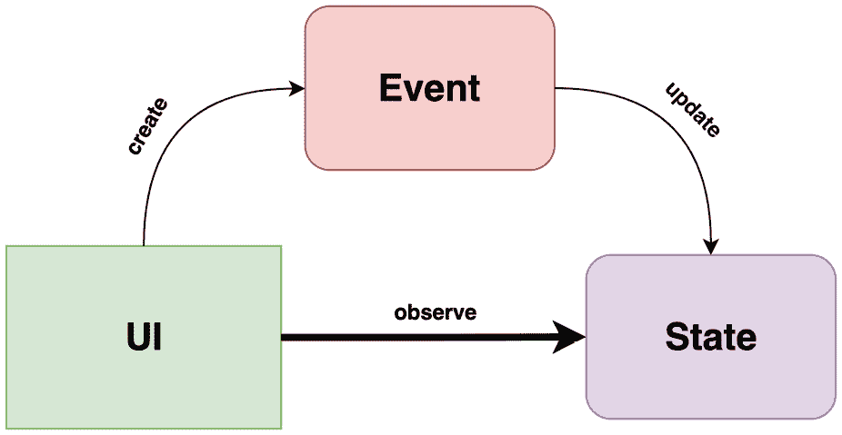
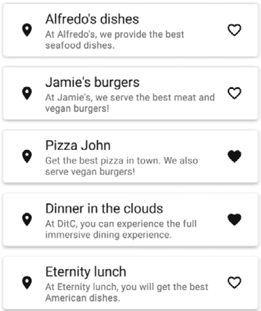
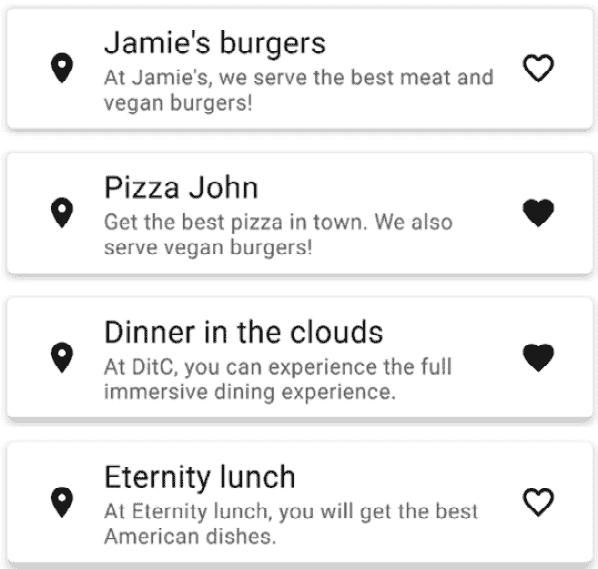
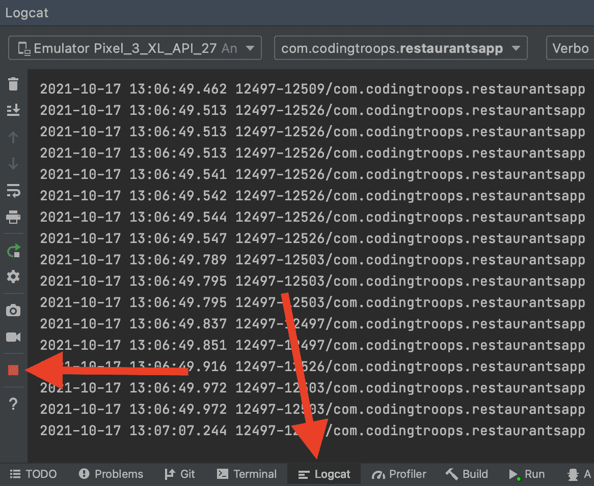
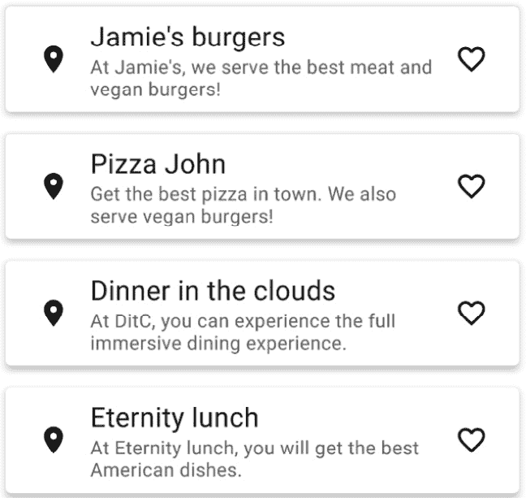

# 第二章：*第二章*：使用 Jetpack ViewModel 处理 UI 状态

在这一章中，我们将介绍 Jetpack 中最重要的库之一：`ViewModel` 架构组件。我们将了解它是什么，为什么我们需要在我们的应用中使用它，以及我们如何在上一章开始的项目“Restaurants”中实现它。

在下一节 *使用 Compose 定义和处理状态* 中，我们将研究状态在 Compose 中的管理方式，并在我们的项目中展示状态的使用示例。之后，在 *在 Compose 中提升状态* 部分，我们将了解状态提升是什么，为什么我们需要实现它，然后我们将将其应用到我们的应用中。

最后，在 *从系统触发的进程死亡中恢复* 部分，我们将介绍什么是系统触发的进程死亡，它是如何发生的，以及对于我们应用能够通过恢复先前的状态细节来从其中恢复，这是多么重要。

总结来说，在这一章中，我们将涵盖以下主要主题：

+   理解 Jetpack ViewModel

+   使用 Compose 定义和处理状态

+   在 Compose 中提升状态

+   从系统触发的进程死亡中恢复

在深入之前，让我们为这一章设置技术要求。

# 技术要求

当使用 Jetpack ViewModel 构建基于 Compose 的 Android 项目时，你通常需要你的日常工具。然而，为了顺利跟进，请确保你具备以下条件：

+   Arctic Fox 2020.3.1 版本的 Android Studio。你也可以使用更新的 Android Studio 版本，甚至是 Canary 构建，但请注意，IDE 界面和其他生成的代码文件可能与本书中使用的不同。

+   在 Android Studio 中安装了 Kotlin 1.6.10 或更新的插件。

+   上一章的“Restaurants”应用代码。

本章的起点是我们上一章开发的“Restaurants”应用。如果你没有跟随实现过程，可以通过导航到本书 GitHub 仓库的 `Chapter_01` 目录并导入名为 `chapter_1_restaurants_app` 的 Android 项目来访问本章的起点。

要访问本章的解决方案代码，请导航到 `Chapter_02` 文件夹：

[`github.com/PacktPublishing/Kickstart-Modern-Android-Development-with-Jetpack-and-Kotlin/tree/main/Chapter_02/chapter_2_restaurants_app`](https://github.com/PacktPublishing/Kickstart-Modern-Android-Development-with-Jetpack-and-Kotlin/tree/main/Chapter_02/chapter_2_restaurants_app)。

我们将在本章中开发的“Restaurants”应用的代码解决方案可以在 `chapter_2_restaurants_app` Android 项目文件夹中找到，你可以导入。

# 理解 Jetpack ViewModel

在开发 Android 应用程序时，你一定听说过“ViewModel”这个术语。如果你还没有听说过，那么不要担心——本节旨在清楚地说明这个组件代表什么，以及我们为什么一开始就需要它。

总结一下，本节将涵盖以下主题：

+   什么是 ViewModel？

+   为什么你需要 ViewModels？

+   介绍 Android Jetpack ViewModel

+   实现你的第一个 ViewModel

让我们从第一个问题开始：我们一直在 Android 中听到的这个`ViewModel`是什么？

## 什么是 ViewModel？

最初，`ViewModel`被设计成允许开发者跨配置更改持久化 UI 状态。随着时间的推移，`ViewModel`成为了一种从边缘情况（如系统启动的进程死亡）中恢复的方法。

然而，通常，Android 应用需要你编写负责从服务器获取数据、转换它、缓存它，然后显示它的代码。为了委托一些工作，开发者使用了这个单独的组件，该组件应该模拟 UI（也称为**View**）——即*ViewModel*。

因此，我们可以将`ViewModel`类视为一个管理和缓存 UI 状态的组件：


图 2.1 – ViewModel 存储状态并接收交互

如我们所见，`ViewModel`不仅处理 UI 状态并将其提供给 UI，而且还从`View`接收用户交互事件并相应地更新状态。

在 Android 中，视图通常由`Activity`、`Fragment`或`Composable`表示，因为它们旨在显示 UI 数据。这些组件在配置变化发生时容易重新创建，所以`ViewModel`必须找到一种方法来缓存并恢复 UI 状态——更多内容将在下一节*为什么你需要 ViewModels？*中介绍。

注意

`ViewModel`监督发送回 UI 控制器的数据以及 UI 状态如何对用户生成的事件做出反应。这就是为什么我们可以称`ViewModel`为 UI 控制器的“大师”——因为它代表了执行 UI 相关事件决策的权威。

我们可以尝试列举一些`ViewModel`应该执行的核心活动。`ViewModel`应该能够做到以下几点：

+   保持、管理和保存整个 UI 状态。

+   从服务器或其他来源请求数据或重新加载内容。

+   通过应用各种转换（如 map、sort、filter 等）来准备要显示的数据。

+   接受用户交互事件并根据这些事件改变状态。

尽管你现在已经理解了什么是`ViewModel`，但你可能还在想，为什么我们需要一个单独的类来保存 UI 状态或准备要显示的数据？为什么我们不能直接在 UI、`Activity`、`Fragment`或 Composable 中做这件事？我们将在下一节中解答这个问题。

## 为什么你需要 ViewModels？

想象一下，如果我们把所有状态处理逻辑都放在 UI 类中。按照这种方法，我们很快就会添加其他逻辑来处理网络请求、缓存或任何其他实现细节——所有这些都会在 UI 层内部。

显然，这不是一个好的方法。如果我们这样做，最终会得到一个拥有过多责任的 `Activity`、`Fragment` 或 `composable` 函数。换句话说，我们的 UI 组件将变得臃肿，充斥着大量代码和责任，从而使整个项目难以维护、修复或扩展。

`ViewModel` 是一个架构组件，可以缓解这些潜在问题。通过将 `ViewModel` 组件添加到我们的项目中，我们迈出了迈向坚实**架构**的第一步，因为我们可以将 UI 控制器的责任委托给 `ViewModel` 等组件。

注意

`ViewModel` 不应引用 UI 控制器，并且应独立于它运行。这减少了 UI 层与 `ViewModel` 之间的耦合，并允许多个 UI 组件重用相同的 `ViewModel`。

防止 UI 控制器承担多重责任是良好系统架构的基石，因为它促进了一个非常简单的原则，即**关注点分离**。这个原则指出，我们应用中的每个组件/模块都应该有一个并处理一个关注点。

如果在我们的情况下，我们将整个应用程序逻辑放入 `Activity`、`Fragment` 或 `composable` 中，这些组件将变成巨大的代码块，违反了关注点分离原则，因为它们知道如何做任何事情：从显示 UI 到获取数据并服务其 UI 状态。为了缓解这个问题，我们可以开始实现 ViewModels。

接下来，我们将看到如何在 Android 中设计 ViewModels。

## 介绍 Android Jetpack ViewModel

创建一个用于管理 `View` 的 UI 状态的 `ViewModel` 类是可行且直接的。我们只需创建一个单独的类并将相应的逻辑移动到那里。

然而，正如我们之前提到的，UI 控制器有自己的生命周期：`Activity` 或 `Fragment` 对象有自己的生命周期，而可组合项有自己的组合周期。这就是为什么 UI 控制器通常是脆弱的，并在发生不同事件（如配置更改或进程死亡）时被重新创建。当这种情况发生时，任何 UI 状态信息都会丢失。

此外，UI 控制器通常需要进行异步调用（例如从服务器获取数据），这些调用必须得到正确管理。这意味着当系统销毁 UI 控制器（例如通过在 `Activity` 上调用 `onDestroy()`）时，您需要手动中断或取消任何挂起或正在进行的操作。否则，由于您的 UI 控制器的内存引用无法由系统释放，您的应用程序可能会泄漏内存。这是因为它仍在尝试完成一些异步工作。

为了保留 UI 状态并更容易管理异步工作，我们的 `ViewModel` 类应该能够克服这些**缺点**。但如何做到呢？

`ViewModel` 具有生命周期感知性，这意味着它知道如何超越由用户触发的配置更改等事件。

它通过将一个**生命周期范围**与 UI 控制器的生命周期绑定来实现这一点。让我们看看`Activity`和`composable`的生命周期是如何定义的，与`ViewModel`的生命周期相比：


图 2.2 – 与 UI 控制器生命周期相比的 ViewModel 生命周期

重要提示

当在 Compose 中使用`ViewModel`时，它默认与父`Fragment`或`Activity`的生存期一样长。为了使`ViewModel`的生存期与顶级`composable`（或屏幕`composable`）函数一样长，如前图所示，必须将`composable`与导航库结合使用。更细粒度的`composable`可以具有更短的生存期。不用担心，我们将在*第五章*，*在 Compose 中使用 Jetpack Navigation 添加导航*中介绍如何将`ViewModel`的生存期范围限定在屏幕`composable`的生存期上。

当 UI 因为此类事件被重新创建或重新组合时，`ViewModel`的生命周期感知能力允许它比这些事件存活得更久，避免被销毁，从而允许状态得以保留。当整个生命周期最终结束时，将调用`ViewModel`的`onCleared()`方法，以便你可以轻松地清理任何挂起的异步工作。

然而，又出现了一个问题：Jetpack 的`ViewModel`是如何做到这一点的？

按设计，`ViewModel`类比特定实例化的`LifecycleOwner`存活得更久。在我们的例子中，UI 控制器是`LifecycleOwner`，因为它们有一个指定的生命周期，并且可以是`Activity`或`Fragment`对象。

要了解`ViewModel`组件是如何针对特定的`Lifecycle`进行范围划分的，让我们看看获取`ViewModel`实例的传统方法：

```java
val vm = ViewModelProvider(this)[MyViewModel::class.java]
```

要获取`MyViewModel`的实例，我们将一个`ViewModelStoreOwner`传递给`ViewModelProvider`构造函数。我们过去在`Activity`或`Fragment`类中是这样获取我们的`ViewModel`的，所以这是一个对当前`ViewModelStoreOwner`的引用。

要控制`MyViewModel`实例的生存期，`ViewModelProvider`需要一个`ViewModelStoreOwner`实例，因为当它创建`MyViewModel`的实例时，它将这个实例的生存期与`ViewModelStoreOwner`的生存期绑定——也就是说，与我们的`Activity`的生存期绑定。

`Activity`或`Fragment`组件是具有生命周期的`LifecycleOwner`，这意味着每次你获取对`ViewModel`的引用时，你收到的对象都是针对`LifecycleOwner`的生命周期进行范围划分的。这意味着你的`ViewModel`将一直存活在内存中，直到`LifecycleOwner`的生命周期结束。

注意

我们将在*第十二章*，*探索 Jetpack 生命周期组件*中更详细地解释`ViewModel`组件的内部工作原理以及它们是如何针对`LifecycleOwner`的生命周期进行范围划分的。

在 Compose 中，使用一个名为 `viewModel()` 的特殊内联函数来实例化 `ViewModel` 对象，该函数抽象了之前需要的所有样板代码。

注意

可选地，如果您需要传递在运行时决定值的参数到您的 `ViewModel` 中，您可以在 `viewModel()` 构造函数中创建并传递一个 `ViewModelFactory` 实例。`ViewModelFactory` 是一个特殊类，它允许您控制 `ViewModel` 的实例化方式。

现在我们已经概述了 Android `ViewModel` 的工作原理，让我们创建一个吧！

## 实现您的第一个 ViewModel

是时候在上一章中创建的餐厅应用程序中创建一个 `ViewModel` 了。为此，请按照以下步骤操作：

1.  首先，通过左键单击应用程序包，选择 `RestaurantsViewModel` 作为名称，并选择 **文件** 作为类型来创建一个新文件。在新建的文件中，添加以下代码：

    ```java
    import androidx.lifecycle.ViewModel
    class RestaurantsViewModel(): ViewModel() {
       fun getRestaurants() = dummyRestaurants
    }
    ```

我们的 `RestaurantsViewModel` 继承自 `ViewModel` 类（之前被称为 Jetpack ViewModel），该类定义在 `androidx.lifecycle.ViewModel` 中，因此它能够感知到实例化它的组件的生命周期。

此外，我们在 `ViewModel` 中添加了 `getRestaurants()` 方法，使其能够成为我们 `dummyRestaurants` 列表的提供者——这是向其赋予管理 UI 状态责任的第一步和初步尝试。

接下来，是时候准备实例化我们的 `RestaurantsViewModel` 了。在 Compose 中，我们不能使用之前实例化 `ViewModel` 对象的语法，因此我们将使用一种特殊且专用的语法。

1.  要获取此特殊语法，请转到应用程序模块中的 `build.gradle` 文件，并在 `dependencies` 块内添加 ViewModel-Compose 依赖项：

    ```java
    dependencies {
          […]
        debugImplementation "androidx.compose.ui:ui-
            tooling:$compose_version"
        implementation "androidx.lifecycle:lifecycle-
            viewmodel-compose:2.4.1"
    }
    ```

在更新 `build.gradle` 文件后，请确保将您的项目与其 Gradle 文件同步。您可以通过点击 **文件** 菜单选项，然后选择 **同步项目与 Gradle 文件** 来完成此操作。

1.  回到 `RestaurantsScreen` 文件，我们希望在 `RestaurantsScreen` 可组合函数内部实例化 `RestaurantsViewModel`。我们可以通过使用 `viewModel()` 内联函数语法并指定我们期望的 `ViewModel` 类型来实现这一点；即 `RestaurantsViewModel`：

    ```java
    @Composable
    fun RestaurantsScreen() {
       val viewModel: RestaurantsViewModel = viewModel()
       LazyColumn( … ) {
           items(viewModel.getRestaurants()) { restaurant->
                 RestaurantItem(restaurant)
           }
       }
    }
    ```

在幕后，`viewModel()` 函数获取 `RestaurantsScreen()` 可组合组件的默认 `ViewModelStoreOwner`。由于我们尚未实现导航库，默认的 `ViewModelStoreOwner` 将是我们的可组合组件的调用父组件——`MainActivity` 组件。这意味着，目前，尽管我们的 `RestaurantsViewModel` 已在可组合组件内部实例化，但它将像 `MainActivity` 一样持续存在。

换句话说，我们的 `RestaurantsViewModel` 的作用域是 `MainActivity` 的生命周期，因此它比 `RestaurantsScreens` 可组合组件或任何其他我们通过 `MainActivity` 内部的 `setContent()` 方法调用传递给的可组合组件存在的时间更长。

为了确保我们的`ViewModel`在需要它的可组合函数存在期间保持活跃，我们将在*第五章*中实现导航库，*在 Compose 中使用 Jetpack Navigation 添加导航*。

我们还确保现在通过在`viewModel`变量上调用`getRestaurants()`来从我们的`RestaurantsViewModel`获取要显示的餐厅。

注意

从现在开始，在某些较旧的 Compose 版本中，Compose 预览功能可能不再按预期工作。由于`RestaurantsScreen`可组合函数现在依赖于`RestaurantsViewModel`对象，Compose 可能无法推断传递给预览可组合函数的数据，因此无法显示内容。这就是为什么在屏幕可组合函数中直接引用`ViewModel`不是一种好做法。我们将在*第八章*中修复这个问题，*在 Android 中使用 Clean Architecture 入门*。或者，为了查看代码中的任何更改，您可以直接在模拟器或物理设备上运行应用程序。

回到我们的餐厅应用程序，我们已经成功添加了一个`ViewModel`，但我们的`RestaurantsViewModel`并没有处理任何 UI 状态。它只发送一个硬编码的餐厅列表，没有任何状态。我们设想它的目的是管理 UI 的状态，所以让我们暂时放下`ViewModel`，专注于理解状态。

# 使用 Compose 定义和处理状态

状态和事件对于任何应用程序都是基本的，因为它们的存续意味着 UI 可以随着您的交互而随时间改变。

在本节中，我们将介绍状态和事件的概念，然后将它们集成到我们的餐厅应用程序中。

总结，本节将涵盖以下主题：

+   理解状态和事件

+   为我们的餐厅应用程序添加状态

让我们从探索 Android 应用程序中状态和事件的基本概念开始。

## 理解状态和事件

**状态**代表在某个时间点 UI 的可能形式。这种形式可以改变或变异。当用户与 UI 交互时，会创建一个事件，该事件触发 UI 状态的改变。因此，**事件**由用户发起的不同交互表示，这些交互针对应用程序，并导致其状态更新。

简而言之，状态因事件而随时间变化。另一方面，UI 应该观察状态中的变化，以便相应地更新：



图 2.3 – UI 更新流程

在 Compose 中，默认情况下，可组合函数是无状态的。这就是为什么当我们试图在前一章中使用`TextField`可组合函数时，它没有将我们在键盘上输入的内容显示在 UI 上。这是因为可组合函数没有定义状态，并且它没有与新值重新组合以显示新内容！

这就是为什么在 Compose 中，我们的任务是定义我们可组合组件的状态对象。借助 *状态* 对象，我们确保每次状态对象的值发生变化时都会触发重新组合。

要使这样的 `TextField` 显示我们正在输入的文本，请记住我们添加了一个 `textState` 变量。我们的 `TextField` 需要这样一个包含 `String` 值的状态对象。这个值代表我们输入的文本，它可以随着我们继续输入而改变：

```java
@Composable
fun NameInput() {
   val textState: MutableState<String> =
       remember { mutableStateOf("") }
   TextField(…) 
}
```

让我们更仔细地看看我们是如何定义我们的 `TextField` 的状态对象的：

+   首先，我们创建了一个变量来保存我们的状态对象，并确保其值可以随时间改变，通过将其定义为 `MutableState`。我们通过定义一个类型为 `MutableState` 的 `textState` 变量来实现这一点，它反过来又持有类型为 `String` 的数据。

在其核心，`textState` 是一个 `androidx.compose.runtime.State` 对象，但由于我们希望能够在时间上改变其值，我们直接使用了一个实现了 `State` 接口的 `MutableState`。

+   我们使用 `mutableStateOf("")` 构造函数实例化了 `textState` 以创建一个状态对象，并传递了它所持有的数据的初始值：一个空字符串。

我们还将在 `remember { }` 块内部包装了 `mutableStateOf("")` 构造函数。`remember` 块。

现在我们已经涵盖了如何定义状态对象，一些问题仍然存在：我们如何更改状态以重新触发重新组合，以及我们如何确保我们的 `TextField` 访问来自 `textState` 的更新值？让我们添加这些缺失的部分：

```java
@Composable
fun NameInput() {
   val textState = remember { mutableStateOf("")}
   TextField(
            value = textState.value,
            onValueChange = { newValue ->
                textState.value = newValue
            },
            label = { Text("Your name") })
}
```

让我们更仔细地看看我们如何在 `TextField` 内部连接一切：

+   为了使 `TextField` 总是能够访问 `textState` 状态对象的最新值，我们使用 `textState.value` 通过 `.value` 访问器获取当前状态值，然后将其传递给 `TextField` 的 `value` 参数以显示它。

+   要更改状态值，我们使用了 `onValueChange` 回调，这可以被视为一个 *事件*。在这个回调内部，我们通过使用相同的 `.value` 访问器来更新 `textState` 状态值，并设置接收到的新的值，称为 `newValue`。由于我们更新了一个 `State` 对象，UI 应该重新组合，我们的 `TextField` 应该渲染从键盘输入的新输入值。只要我们继续写作，这个过程就会重复。

现在我们已经掌握了在 Compose 中定义和修改状态的方法，是时候将这种状态功能添加到我们的餐厅应用中了。

## 将状态添加到我们的餐厅应用中

让我们想象一下，用户可以滚动浏览餐厅列表，然后点击特定的一个，从而将其标记为收藏。为了使这个过程更具提示性，我们将为每个餐厅添加一个爱心图标。为此，请按照以下步骤操作：

1.  在 `RestaurantsScreen.kt` 文件中，在 `RestaurantItem` 内部添加另一个可组合组件，称为 `FavoriteIcon`。然后传递一个权重 `0.15f` 以使其占用父 `Row` 的 15%。

    ```java
    @Composable
    fun RestaurantItem(item: Restaurant) {
       Card(...) {
           Row(...) {
               RestaurantIcon(..., Modifier.weight(0.15f))
               RestaurantDetails(..., Modifier.weight(0.7f))
               FavoriteIcon(Modifier.weight(0.15f))
           }
       }
    }
    ```

我们还确保将 `RestaurantDetails` 的权重从 85% 降低到 70%。

1.  仍然在 `RestaurantsScreen.kt` 文件中，定义缺失的 `FavoriteIcon` 组合组件，该组件接收一个 `imageVector` 作为预定义图标 `Icons.Filled.FavoriteBorder`。同时，让它接收一个具有 `8.dp` 填充的 `Modifier` 对象：

    ```java
    @Composable
    private fun FavoriteIcon(modifier: Modifier) {
       Image(
           imageVector = Icons.Filled.FavoriteBorder,
           contentDescription = "Favorite restaurant icon",
           modifier = modifier.padding(8.dp))
    }
    ```

1.  如果我们尝试刷新预览或运行应用，我们可以看到几个类似于以下的 `RestaurantItem` 组合组件：


图 2.4 – 带有收藏图标的 RestaurantItem 组合组件

我们的 `RestaurantItem` 组合组件现在有一个收藏图标。然而，当我们点击它时，什么也没有发生。点击它应该将心形图标变为实心，标记餐厅为收藏。为了修复这个问题，我们必须添加一个状态，使我们能够保持餐厅的收藏状态。

1.  通过添加以下代码向 `FavoriteIcon` 组合组件添加状态：

    ```java
    @Composable
    private fun FavoriteIcon(modifier: Modifier) {
       val favoriteState = remember { 
           mutableStateOf(false) }
       val icon = if (favoriteState.value)
           Icons.Filled.Favorite
       else
           Icons.Filled.FavoriteBorder
        Image(
            imageVector = icon,
            contentDescription = "Favorite restaurant icon",
            modifier = modifier
                .padding(8.dp)
                .clickable { favoriteState.value =
                        !favoriteState.value
                }
        )
    }
    ```

为了保持是否收藏的状态并触发这个状态值的改变，我们做了以下操作：

1.  我们添加了一个 `favoriteState` 变量，它持有类型为 `Boolean` 的 `MutableState`，初始值为 `false`。像往常一样，我们将 `mutableStateOf` 构造函数包裹在一个 `remember` 块中，以在重新组合之间保留状态值。

1.  我们定义了一个 `icon` 变量，它可以持有 `Icons.Filled.Favorite` 的值，这意味着该餐厅是您的收藏，或者持有 `Icons.Filled.FavoriteBorder` 的值，这意味着该餐厅不是您的收藏。

1.  我们将 `icon` 值传递给 `Image` 组合组件的 `imageVector` 参数。

1.  我们添加了一个 `clickable` 修饰符，它在 `padding` 修饰符之后链式使用。在这个回调中，我们确保通过获取并写入先前取反的值来更新 `favoriteState`。

    注意

    在 Compose 中定义状态对象时，可以用属性委托替换赋值运算符（`=`），这可以通过 `by` 运算符实现：`val favoriteState by remember { … }`。通过这样做，您将不再需要使用 `.value` 访问器，因为它被委托了。

当我们在运行或实时预览应用程序时，我们可以看到，当我们点击每个餐厅的空心形图标时，它变成了实心，标记餐厅为收藏：



图 2.5 – 带有项目收藏状态的 RestaurantsScreen 组合组件

大多数情况下，不建议在组合函数内部保持状态和处理状态逻辑。让我们探讨为什么这不是最佳实践，以及我们如何借助状态提升来改进我们管理状态的方式。

# 在 Compose 中提升状态

组合函数通常根据状态处理分为两大类：

+   `State` 对象。

+   `ViewModel` 组件可以是它们状态的唯一真相来源，以控制和管理 UI 变化，同时避免非法状态。

在我们的案例中，当餐厅被标记为收藏或未收藏时，状态会发生变化。由于我们希望在`ViewModel`类中控制这种交互以跟踪哪些餐厅已被收藏，因此我们需要将状态从`FavoriteIcon`可组合组件提升上来。

将状态从可组合组件向上移动到其调用者可组合组件的模式被称为具有两个参数的`状态`对象：

+   一个用于定义当前状态的`value`参数

+   当发出新值时触发的回调函数

通过接收数据作为输入并将事件转发给父可组合组件，我们确保我们的 Compose UI 遵循之前引入的状态和事件单向流动的概念。这个概念定义了状态值和事件应该只在一个方向上流动：事件向上流动，状态向下流动，并且通过状态提升，我们强制执行这一点。

状态提升的好处如下：

+   `ViewModel`。可组合组件可以从其状态中解耦，以避免在 UI 中出现非法状态。

+   **可重用性**：由于可组合组件只渲染接收到的输入数据，因此它们在其它可组合组件中的重用要容易得多，因为你只需传递不同的值即可。

+   **封装限制**：只有有状态的可组合组件可以内部更改其状态。这意味着你可以限制处理其状态的可组合组件的数量，这可能导致非法的 UI 状态。

现在我们简要介绍了状态提升的概念及其好处，是时候在我们的 Restaurants 应用程序中提升状态了：

1.  首先，通过从函数体顶部移除现有的`favoriteState`和`icon`变量及其实例化逻辑，将状态从`FavoriteIcon`可组合组件提升出来。同时，更新`FavoriteIcon`可组合组件以接受一个`icon`参数来接收输入数据，以及一个`onClick`事件回调来向上转发事件：

    ```java
    @Composable
    private fun FavoriteIcon(icon: ImageVector, 
                             modifier: Modifier,
                             onClick: () -> Unit) {
       Image(
           imageVector = icon,
           contentDescription = "Favorite restaurant icon",
           modifier = [...]
               .clickable { onClick() })
    }
    ```

此外，我们将`icon`传递给`Image`可组合组件的`imageVector`参数，并在`clickable`事件触发时调用`onClick`回调函数。通过应用这些更改，我们将状态提升上来，并将`FavoriteIcon`从有状态的组件转换为无状态的组件。

1.  现在，将`favoriteState`变量移动到`FavoriteIcon`的父可组合组件`RestaurantItem`中。`RestaurantItem`可组合组件为`FavoriteIcon`提供状态，并负责随时间更新其状态：

    ```java
    @Composable
    fun RestaurantItem(item: Restaurant) {
       val favoriteState = remember { 
           mutableStateOf(false) }
       val icon = if (favoriteState.value)
           Icons.Filled.Favorite
       else
           Icons.Filled.FavoriteBorder
       Card(...) {
           Row(...) {
              [...]
              FavoriteIcon(icon, Modifier.weight(0.15f)) {
                   favoriteState.value = 
                       !favoriteState.value
              }
           }
       }
    }
    ```

每个状态的对应`图标`现在传递给`FavoriteIcon`。此外，`RestaurantItem`现在在尾随的 lambda 块中监听`onClick`事件，在该事件中它修改`favoriteState`对象，每次点击都会触发重新组合。

然而，查看`FavoriteIcon`和`RestaurantIcon`，我们可以看到许多相似之处。它们都是无状态的组合组件，接收一个`ImageVector`作为参数。由于它们是无状态的并且执行类似的功能，让我们重用其中一个并删除另一个。

1.  在`RestaurantIcon`内部，添加一个类似的`onClick`函数参数（就像`FavoriteIcon`有的一样）并将其绑定到`clickable`修饰符的回调：

    ```java
    @Composable
    private fun RestaurantIcon(icon: ImageVector, modifier: Modifier, onClick: () -> Unit = { }) {
       Image([...],
           modifier = modifier
               .padding(8.dp)
               .clickable { onClick() }
       )
    }
    ```

由于我们不想在餐厅配置文件图标上执行点击事件，我们为`onClick`参数提供了一个默认的空函数（`{ }`）值。

完成这些操作后，你可以删除`FavoriteIcon`组合组件，因为我们不再需要它了。

1.  在`RestaurantItem`组合组件内部，将`FavoriteIcon`替换为`RestaurantIcon`：

    ```java
    @Composable
    fun RestaurantItem(item: Restaurant) {
       val favoriteState = ...
       Card(...) {
           Row(...) {
              RestaurantIcon(…)
              RestaurantDetails(...)
              RestaurantIcon(icon, Modifier.weight(0.15f)) {
                   favoriteState.value = !favoriteState.value
               }
           }
       }
    }
    ```

现在，你已经将状态从`RestaurantIcon`提升到了`RestaurantItem`组合组件。

让我们继续提升状态，将其提升到`RestaurantsScreen`组合组件。然而，我们无法在这个组合组件内部为每个`RestaurantItem`保留单独的`State`对象，因此我们必须将`State`对象更改为包含一系列`Restaurant`对象，每个对象都有一个单独的`isFavorite`值。

1.  在`Restaurant.kt`文件内部，为`Restaurant`添加另一个属性`isFavorite`。它应该有一个默认值`false`，因为默认情况下，当应用程序启动时，餐厅不会被标记为收藏：

    ```java
    data class Restaurant(val id: Int,
                          val title: String,
                          val description: String,
                          var isFavorite: Boolean = false)
    val dummyRestaurants = listOf(…)
    ```

1.  返回到`RestaurantsScreen.kt`文件内部，再次提升状态，这次是从`RestaurantItem`开始的，通过添加一个在`RestaurantIcon`的回调函数参数内部被触发的`onClick`函数参数。由于我们已经有类型为`Restaurant`的`item`参数，因此我们不需要为输入数据添加新的参数，并且可以安全地移除`favoriteState`变量，因为我们不再需要它了：

    ```java
    @Composable
    fun RestaurantItem(item: Restaurant, 
                       onClick: (id: Int) -> Unit) {
       val icon = if (item.isFavorite)
           Icons.Filled.Favorite
       else
           Icons.Filled.FavoriteBorder
       Card(...) {
           Row(...) {
               ...
              RestaurantIcon(…)
              RestaurantDetails(…)
              RestaurantIcon(…) {
                  onClick(item.id)
              }
           }
       }
    }
    ```

这次，`item`参数将是我们的`Restaurant`对象。`Restaurant`现在包含一个`isFavorite: Boolean`属性，表示餐厅是否被收藏。这就是为什么我们根据项的字段设置`icon`变量的正确值，通过检查`item.isFavorite`的值。

现在，`RestaurantItem`是一个无状态的组合组件，因此是时候向其父组件添加一个`State`对象了。

1.  在`RestaurantsScreen`内部，添加一个`state`变量，它将保存我们的餐厅列表。其类型将是`MutableState<List<Restaurant>>`，我们将从`viewModel`设置餐厅作为其初始值，最后将状态对象的`value`传递给`LazyColumn`的`items`构造函数：

    ```java
    @Composable
    fun RestaurantsScreen() {
      val viewModel: RestaurantsViewModel = viewModel()
      val state: MutableState<List<Restaurant>> =
        remember {
          mutableStateOf(viewModel.getRestaurants())
        }
      LazyColumn(...) {
       items(state.value) { restaurant ->
         RestaurantItem(restaurant) { id ->
           val restaurants = state.value.toMutableList()
           val itemIndex =
             restaurants.indexOfFirst { it.id == id }
           val item = restaurants[itemIndex]
           restaurants[itemIndex] =
             item.copy(isFavorite = !item.isFavorite)
           state.value = restaurants
          }
        }
      }
    }
    ```

在`RestaurantItem`的`onClick`尾随 lambda 块内部，我们必须切换相应餐厅的收藏状态并更新状态。正因为如此，我们做了以下操作：

1.  我们通过调用`state.value`并将其转换为可变列表来获取当前的餐厅列表，以便我们可以替换需要更新`isFavorite`字段值的项。

1.  我们通过`indexOfFirst`函数获得了应该更新`isFavorite`字段的项的索引，其中我们匹配了`Restaurant`对象的`id`属性。

1.  找到`itemIndex`后，我们获得了类型为`Restaurant`的`item`对象，并应用了`copy()`构造函数，其中我们取反了`isFavorite`字段。结果值替换了`itemIndex`处的现有`item`。

1.  最后，我们使用`.value`访问器将更新后的`restaurants`列表返回给`state`对象。

    注意

    对于`Compose`要观察类型为`T`的对象列表中的变化，其中`T`是一个数据类，称为`List<T>`，你必须更新更新项的内存引用。你可以通过调用`T`的`copy()`构造函数来实现这一点，这样当更新的列表返回到你的`State`对象时，`Compose`会触发重组。或者，你可以使用`mutableStateListOf<Restaurant>()`来更容易地触发重组事件。

如果我们尝试运行应用程序，我们应该注意到功能相同，但状态已经提升，我们现在可以更容易地重用`RestaurantItem`或`RestaurantIcon`等可组合组件。

但如果我们切换了几家收藏餐厅，然后旋转设备，从而改变屏幕方向会发生什么呢？

尽管我们使用了`remember`块来在重组之间保留状态，但我们的选择丢失了，所有餐厅都被标记为非收藏。这是因为我们的`RestaurantsScreen`可组合组件的宿主`MainActivity`已被重新创建，因此当配置更改发生时，任何状态也丢失了。

为了解决这个问题，我们可以做以下操作：

+   将`remember`块替换为`rememberSaveable`。这将允许状态在宿主`Activity`的配置更改之间自动保存。

+   将状态提升到`ViewModel`。我们知道`RestaurantsViewModel`尚未限定于我们的`RestaurantsScreen`的生命周期，因为尚未使用导航库，这意味着它限定于`MainActivity`，这允许它在配置更改中存活。

你可以尝试将`remember`块替换为`rememberSaveable`，然后旋转屏幕以查看状态现在在配置更改之间得到了保留。然而，我们希望走正道，确保`ViewModel`是我们状态的唯一真相来源。让我们开始吧：

1.  要将状态提升到`ViewModel`，我们必须将`State`对象从`RestaurantsScreen`可组合组件移动到`RestaurantsViewModel`，并且我们必须创建一个新的方法`toggleFavorite`，该方法将允许`RestaurantsViewModel`在尝试切换餐厅的收藏状态时每次都修改`state`变量的值：

    ```java
    class RestaurantsViewModel() : ViewModel() {
       val state = mutableStateOf(dummyRestaurants)
        fun toggleFavorite(id: Int) {
            val restaurants = state.value.toMutableList()
            val itemIndex =
                restaurants.indexOfFirst { it.id == id }
            val item = restaurants[itemIndex]
            restaurants[itemIndex] =
                item.copy(isFavorite = !item.isFavorite)
            state.value = restaurants
        } 
    }
    ```

新的`toggleFavorite`方法接受目标餐厅的`id`属性。在这个方法内部，我们将`RestaurantItem`的`onClick`尾随 lambda 块中的代码移动出来，在那里我们切换对应项的收藏状态并更新其状态。

到目前为止，你可以安全地从`RestaurantsViewModel`类中移除`getRestaurants()`方法，因为我们不再需要它了。

注意

包含在`ViewModel`中的`State`对象不应公开供其他类修改，因为我们希望它被封装，并且只允许`ViewModel`更新它。我们将在*第七章**，介绍 Android 中的呈现模式中修复这个问题。

1.  在`RestaurantsScreen`可组合组件内部，移除`state`变量，并通过访问`.value`访问器使用`viewModel.state.value`从`RestaurantsViewModel`传递餐厅：

    ```java
    fun RestaurantsScreen() {
       val viewModel: RestaurantsViewModel = viewModel()
       LazyColumn(...) {
           items(viewModel.state.value) { restaurant ->
               RestaurantItem(restaurant) { id ->
                   viewModel.toggleFavorite(id)
               }
           }
       }
    }
    ```

我们还从`RestaurantItem`的`onClick`尾随 lambda 块中移除了旧代码，并用对`ViewModel`的`toggleFavorite`方法的调用替换了它。

如果你运行应用程序，UI 应该按预期执行，因此你应该能够切换任何餐厅为收藏，并在事件如方向改变时保存你的选择。

唯一的区别是现在，`RestaurantsViewModel`是`RestaurantsScreen`状态的唯一真相来源，我们不再需要在可组合组件内部持有或保存 UI 状态。

现在，我们知道如何将状态提升到`ViewModel`中。接下来，让我们探讨一个与 Android 世界中的进程死亡相关的重要场景。

# 从系统触发的进程死亡中恢复

我们已经了解到，每当发生配置更改时，我们的`Activity`都会被重新创建，这可能导致我们的 UI 丢失状态。为了绕过这个问题并保留 UI 的状态，我们最终实现了`ViewModel`组件并将 UI 状态提升到那里。

但在系统触发的进程死亡的情况下会发生什么？

当用户将我们的应用程序置于后台并决定暂时使用其他应用时，会发生**系统触发的进程死亡**。然而，在此期间，系统决定杀死我们的应用程序进程以释放系统资源，从而触发进程死亡。

让我们尝试模拟这样一个事件并看看会发生什么：

1.  使用 IDE 的**运行**按钮启动 Restaurants 应用程序，并将一些餐厅标记为收藏：



图 2.6 – 已制作收藏选择的 RestaurantsScreen 可组合组件

1.  通过按设备/模拟器的**主页**按钮将应用置于后台。

1.  在 Android Studio 中，选择**Logcat**窗口，然后按左侧的红色方块按钮来终止应用程序：



图 2.7 – 在 Logcat 中杀死进程以模拟系统触发的进程死亡

1.  从应用抽屉中重新启动应用程序：



图 2.8 – 收藏选择丢失的餐厅屏幕组件

我们现在模拟了一个系统会杀死我们的进程的情况。当我们返回到应用程序时，我们可以看到我们的选择现在消失了，而且被收藏的餐厅现在处于默认状态。

为了在系统启动进程死亡时恢复状态，我们曾经使用过活动的 `onSaveInstanceState()` 回调。

类似地，每个使用默认 `ViewModelFactory` 的 `ViewModel`（就像我们之前使用 `viewModel()` 内联语法所做的那样）都可以通过其构造函数访问一个 `SavedStateHandle` 对象。如果你使用自定义 `ViewModelFactory`，请确保它扩展 `AbstractSavedStateViewModelFactory`。

`SavedStateHandle` 对象是一个键值映射，允许你保存并恢复对状态至关重要的对象。当系统启动此事件时，此映射在进程死亡事件发生时仍然存在，这允许你检索和恢复保存的对象。

注意

当我们保存状态相关数据时，保存定义状态的轻量级对象而不是屏幕上描述的整个数据至关重要。对于大量数据，我们应该使用本地持久化。

让我们在应用程序中尝试这样做，通过保存被切换为收藏的餐厅的 `id` 值列表到 `SavedStateHandle`。保存 `id` 值比保存整个餐厅列表更好，因为 `Int` 值列表更轻量。而且，由于我们可以在运行时始终获取餐厅列表，唯一缺少的是记住哪些被收藏了。

注意

通常，`SavedStateHandle` 用于保存用户执行的操作，如排序或筛选选择，或其他需要在系统启动进程死亡时恢复的选择。然而，在我们的案例中，收藏的餐厅不仅需要在系统启动进程死亡时恢复，还需要在简单的应用程序重启时恢复。这就是为什么我们将在第六章“使用 Jetpack Room 添加离线功能”中稍后，将这些选择作为应用程序在本地数据库中的域数据保存。

让我们使用 `SavedStateHandle` 对象从系统启动进程死亡中恢复：

1.  将 `SavedStateHandle` 参数添加到你的 `RestaurantsViewModel`：

    ```java
    class RestaurantsViewModel(
        private val stateHandle: SavedStateHandle) : 
    ViewModel() {
       …
    }
    ```

1.  在 `toggleFavorite` 方法中切换餐厅的收藏状态时，调用 `storeSelection` 方法，并传递相应的餐厅：

    ```java
    class RestaurantsViewModel(…) {
       fun toggleFavorite(id: Int) {
           …
           restaurants[itemIndex] = item.copy(isFavorite = 
               !item.isFavorite)
           storeSelection(restaurants[itemIndex])
           state.value = restaurants
       }
     ...
    }
    ```

然而，这段代码无法编译，因为我们还没有定义 `storeSelection` 方法。让我们接下来定义它。

1.  在 `RestaurantsViewModel` 中，创建一个新的 `storeSelection` 方法，该方法接收一个 `Restaurant` 对象，其 `isFavorite` 属性刚刚被更改，并将该选择保存到 `RestaurantsViewModel` 类提供的 `SavedStateHandle` 对象中：

    ```java
    private fun storeSelection(item: Restaurant) {
       val savedToggled = stateHandle
         .get<List<Int>?>(FAVORITES)
         .orEmpty().toMutableList()
       if (item.isFavorite) savedToggled.add(item.id)
       else savedToggled.remove(item.id)
       stateHandle[FAVORITES] = savedToggled
    }
    companion object {
      const val FAVORITES = "favorites"
    }
    ```

这个新方法将尝试在每次切换餐厅的收藏状态时在我们的`stateHandle`对象中保存餐厅的`id`值。它是这样做的：

1.  它通过访问映射中的`FAVORITES`键从`stateHandle`获取包含之前收藏的餐厅 ID 的列表。结果存储在`savedToggle`可变列表中。如果没有餐厅被收藏，列表将为空。

1.  如果这个餐厅被标记为收藏，它将餐厅的 ID 添加到`savedToggle`列表中。否则，它将其从列表中移除。

1.  在`stateHandle`映射中使用`FAVORITES`键保存更新后的收藏餐厅列表。

我们还在`RestaurantsViewModel`类中添加了一个`companion object`构造，作为静态扩展对象。我们使用这个`companion object`定义了一个用于在`stateHandle`映射中保存餐厅选择的键的常量值。

现在，我们已经确保在进程死亡之前缓存了收藏餐厅的选择，因此我们的下一步是找到一种方法在应用从系统启动的进程死亡事件中恢复后恢复这些选择。

1.  在我们传递给`state`对象的初始值`dummyRestaurants`列表上调用`restoreSelections()`扩展方法。这个调用应该恢复 UI 选择：

    ```java
    class RestaurantsViewModel(
       private val stateHandle: SavedStateHandle):
          ViewModel() {
       val state = mutableStateOf(
         dummyRestaurants.restoreSelections()
       )
        ...
    }
    ```

然而，这段代码无法编译，因为我们还没有定义`restoreSelections`方法。让我们接下来定义它。

1.  在`RestaurantsViewModel`内部，定义一个`restoreSelections`扩展函数，这将允许我们在进程死亡时检索被收藏的餐厅：

    ```java
    private fun List<Restaurant>.restoreSelections():
            List<Restaurant> {
        stateHandle.get<List<Int>?>(FAVORITES)?.let {
                selectedIds ->
            val restaurantsMap = this.associateBy { it.id }
            selectedIds.forEach { id ->
                restaurantsMap[id]?.isFavorite = true
            }
            return restaurantsMap.values.toList()
        }
        return this
    }
    ```

这个扩展函数将允许我们标记那些在系统启动进程死亡时用户之前标记为收藏的餐厅。`restoreSelections`扩展函数通过以下方式实现这一点：

1.  首先，通过从`stateHandle`中获取包含之前收藏的餐厅唯一标识符的列表，通过访问映射中的`FAVORITES`键。如果列表不是`null`，这意味着发生了进程死亡，它将列表引用为`selectedIds`；否则，它将返回未做任何修改的列表。

1.  然后，通过创建一个映射，其键是餐厅的`id`值，值是`Restaurant`对象本身，从输入的餐厅列表中创建一个映射。

1.  通过遍历收藏餐厅的唯一标识符，并为每个标识符尝试从我们的新列表中访问相应的餐厅，并将它的`isFavorite`值设置为`true`。

1.  通过从`restaurantMap`返回修改后的餐厅列表。这个列表现在应该包含在死亡过程发生之前恢复的`isFavorite`值。

6. 最后，构建应用，然后重复之前模拟系统启动进程死亡时的*步骤 1*、*步骤 2*、*步骤 3*和*步骤 4*。

应用程序现在应该能够正确显示 UI 状态，包括在系统启动进程死亡之前之前收藏的餐厅。

通过这样，我们确保了我们的应用程序不仅存储了 UI 状态在`ViewModel`级别，而且还可以从系统启动的进程死亡等异常事件中恢复。

# 摘要

在本章中，我们学习了`ViewModel`类是什么，我们探讨了定义它的概念，并学习了如何实例化一个。我们探讨了为什么`ViewModel`作为 UI 的*状态*的单个真实来源是有用的：为了避免非法和不希望的状态。

为了让这有意义，我们探讨了 UI 是如何通过其状态定义的，以及如何在 Compose 中定义这样的状态。然后我们理解了*状态提升*是什么，以及如何将 widget 在*无状态*和*有状态*的 composable 之间分离。

最后，我们将所有这些新概念付诸实践，通过在我们的餐厅应用中定义状态，提升它，然后将它提升到新创建的`ViewModel`中。

最后，我们学习了系统启动的进程死亡发生的方式以及如何通过使用`SavedStateHandle`恢复之前的状态来允许应用恢复。

在下一章中，我们将通过使用 Retrofit 将其连接到我们的数据库来向我们的餐厅应用添加真实数据。

# 进一步阅读

在 Compose 中与 ViewModel 一起工作并处理状态变化是可靠项目的两个基本主题。让我们看看围绕它们的其他主题是什么。

## 探索使用运行时提供的参数的 ViewModel

在大多数情况下，你可以在构造函数中声明并提供依赖项给`ViewModel`，在编译时。然而，在某些情况下，你可能需要使用仅在运行时才知道的参数来初始化`ViewModel`实例。

例如，当我们添加一个显示餐厅详细信息的 composable 屏幕时，而不是通过函数调用从 composable 将目标餐厅的 ID 发送到`ViewModel`，我们可以通过**ViewModelFactory**直接将其提供给`ViewModel`构造函数。

要探索构建`ViewModelFactory`的过程，请查看以下 Codelab：[`developer.android.com/codelabs/kotlin-android-training-view-model#7`](https://developer.android.com/codelabs/kotlin-android-training-view-model#7)。

## 探索 Kotlin Multiplatform 项目的 ViewModel

虽然本章涵盖了纯 Android 应用中的 Jetpack ViewModel for Compose，但如果你的目标是使用**Kotlin Multiplatform** (**KMP**) 或 **Kotlin Multiplatform Mobile** (**KMM**)来构建跨平台项目，Jetpack ViewModel 可能不是最佳选择。

当我们在构建跨平台项目时，我们应该尽量避免平台特定的依赖。Jetpack ViewModel 适用于 Android，因此是一个 Android 依赖项，所以我们可能需要构建或定义一个 ViewModel。

要了解更多关于 KMM 和平台无关的 ViewModel 的信息，请查看以下 GitHub 示例：[`github.com/dbaroncelli/D-KMP-sample`](https://github.com/dbaroncelli/D-KMP-sample)。

## 理解如何最小化重组次数

在本章中，我们学习了如何通过使用`State`对象来触发重组。虽然在使用 Compose 时重组经常发生，但我们还没有机会优化基于 Compose 的屏幕的性能。

我们可以通过确保可组合组件的输入是深度稳定的来减少重组的次数。要了解更多关于如何实现这一点，请访问[`developer.android.com/jetpack/compose/lifecycle?hl=bn-IN&skip_cache=true#skipping`](https://developer.android.com/jetpack/compose/lifecycle?hl=bn-IN&skip_cache=true#skipping)。
