# *第三章*：使用 Retrofit 显示 REST API 的数据

在这一章中，我们将暂时放下 Jetpack 库，通过使用 Android 上一个非常流行的网络库 Retrofit，来专注于在我们的餐厅应用程序中添加真实数据。

Retrofit 是一个 HTTP 客户端库，允许您声明性地创建 HTTP 客户端，并抽象出处理网络请求和响应的大部分底层复杂性。这个库使我们能够连接到真实的网络 API，并在我们的应用程序中检索真实数据。

在 *理解应用如何与远程服务器通信* 部分，我们将专注于探索移动应用程序如何检索和向远程网络 API 发送数据。在 *使用 Firebase 创建并填充数据库* 部分，我们将借助 Firebase 为我们的餐厅应用程序创建数据库，并用 JSON 内容填充它。

在 *探索 Retrofit 作为 Android 的 HTTP 网络客户端* 部分，我们将了解 Retrofit 是什么，以及它如何帮助我们创建餐厅应用程序中的网络请求。

最后，在 *改进我们应用处理网络请求的方式* 部分，我们将解决 Android 应用在创建异步工作以从网络 API 获取数据时出现的常见问题。我们将识别这些问题并修复它们。

总结来说，在本章中，我们将涵盖以下主要主题：

+   理解应用如何与远程服务器通信

+   使用 Firebase 创建并填充数据库

+   探索 Retrofit 作为 Android 的 HTTP 网络客户端

+   改进我们应用处理网络请求的方式

在深入之前，让我们为这一章设定技术要求。

# 技术要求

使用 Retrofit 构建 Compose 基础的 Android 项目通常只需要您日常使用的工具。然而，为了顺利跟进，请确保您具备以下条件：

+   Android Studio 的 Arctic Fox 2020.3.1 版本。您也可以使用更新的 Android Studio 版本，甚至可以尝试 Canary 版本，但请注意，IDE 界面和其他生成的代码文件可能与本书中使用的不同。

+   在 Android Studio 中安装了 Kotlin 1.6.10 或更高版本。

+   上一章的餐厅应用程序代码。

+   一个 Google 账户来创建 Firebase 项目。

本章的起点是我们上一章开发的餐厅应用程序。如果您没有遵循上一章的编码步骤，可以通过导航到本书 GitHub 仓库的 `Chapter_02` 目录并导入名为 `chapter_2_restaurants_app` 的 Android 项目来访问本章的起点。

要访问本章的解决方案代码，请导航到 `Chapter_03` 目录：

[`github.com/PacktPublishing/Kickstart-Modern-Android-Development-with-Jetpack-and-Kotlin/tree/main/Chapter_03`](https://github.com/PacktPublishing/Kickstart-Modern-Android-Development-with-Jetpack-and-Kotlin/tree/main/Chapter_03)。

# 理解应用程序如何与远程服务器通信

现代应用程序需要显示可以随时间变化的真实内容，并且需要避免像我们在前几章中那样硬编码数据。让我们简要地了解一下它们是如何做到这一点的。

大多数网络连接的应用程序使用 HTTP 协议通过 REST API 以 JSON 格式发送或接收数据。

我们刚刚向你抛出了很多词汇，所以让我们来分解它们：

+   **超文本传输协议**（**HTTP**）是一种用于从网络服务器异步获取各种资源的协议。在我们的案例中，资源是我们应用程序需要显示的数据。

+   **JavaScript 对象表示法**（**JSON**）是 HTTP 请求中传输的内容的数据格式。它是结构化的、轻量级的，并且由于其由易于解析的键值对组成，因此易于阅读，常用于应用程序和服务器之间数据交换的合适格式。在我们的应用程序中，我们将以这种 JSON 格式从网络服务器接收数据。

+   `GET`、`PUT`、`POST`、`DELETE` 等等。

+   **REST API** 是一个符合 REST 架构约束的 **应用程序编程接口**（**API**），它允许你与 REST 网络服务进行交互。REST API 是应用程序用于从后端获取或发送数据的合约和入口点。

让我们尝试可视化这些实体之间的关系：

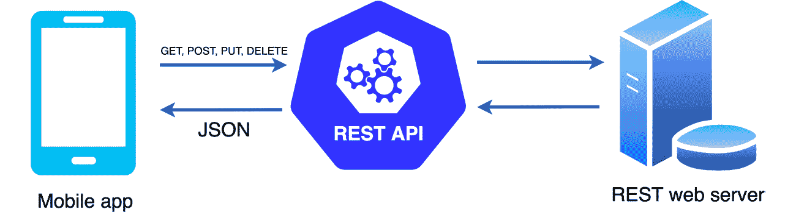

图 3.1 – 应用程序与网络服务器之间 HTTP 通信概述

我们希望在我们的餐厅应用程序中实现类似的功能。为了使其工作，我们需要一个 REST 服务器。为了简化，我们将使用 Firebase 实时数据库并创建一个数据库。

# 使用 Firebase 创建和填充你的数据库

到目前为止，我们只使用了硬编码的数据作为我们餐厅应用程序内容来源。由于几乎每个真实的应用程序都使用来自后端服务器通过 REST API 的动态数据，是时候提高我们的水平，创建一个模拟这种远程 API 的数据库了。

我们可以在 Firebase 的帮助下免费完成这项工作。Firebase 由 Google 支持，代表了一种 **后端即服务**（**BaaS**），这使得我们能够非常容易地构建数据库。我们将使用 Firebase 的实时数据库服务，而无需使用 Firebase Android SDK。尽管这样的数据库不是一个合适的 REST 网络服务，但我们可以使用其数据库 URL 作为 REST 端点，并假装那是我们的 REST 接口，从而模拟一个真实的后端。

注意

正如我们在 *技术要求* 部分中提到的，请确保你有一个现有的 Google 账户，或者事先创建一个。

让我们开始创建一个数据库：

1.  导航到 Firebase 控制台，通过访问 [`console.firebase.google.com/`](https://console.firebase.google.com/) 登录你的 Google 账户。

1.  创建一个新的 Firebase 项目：


图 3.2 – 创建新的 Firebase 项目

1.  输入您项目的名称（它应该是关于餐厅的！）然后按**继续**。

1.  可选地，在下一个对话框中，您可以取消选择 Google Analytics，因为我们不会使用 Firebase SDK。再次按**继续**。此时，项目应该已经创建。

1.  从左侧菜单中，展开**构建**选项卡，搜索**实时数据库**，然后选择它：

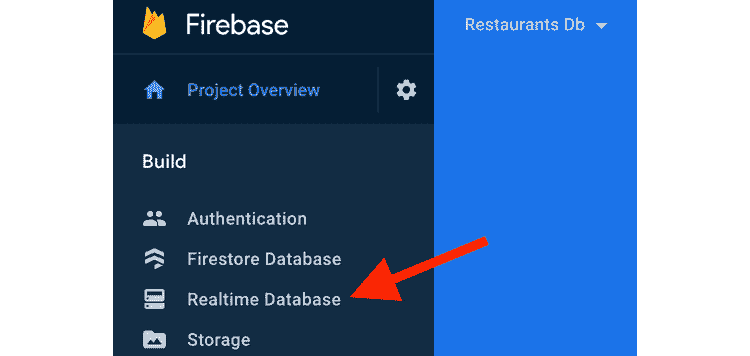

图 3.3 – 访问实时数据库

1.  在新显示的页面上，通过点击**创建数据库**来创建一个新的数据库。

1.  在**设置数据库**对话框中，选择数据库的位置，然后点击**下一步**：

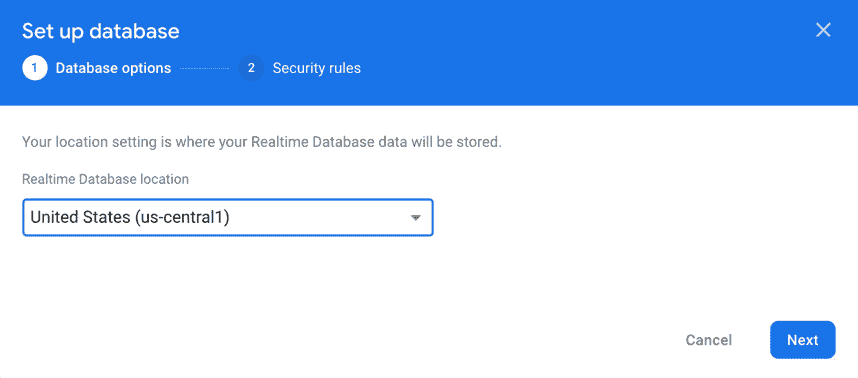

图 3.4 – 设置实时数据库

注意

如果后来对您的 Firebase 数据库的任何网络调用因不明原因失败，您可能会发现自己处于 Firebase 限制位置——正如我撰写这一章节时，由于当前由东战引起的情况，罗马尼亚的所有互联网服务提供商都被限制，对 Firebase 数据库的任何网络调用都失败了。如果这种情况发生在您身上，请尝试为实时数据库实例选择不同的位置。

1.  在相同的对话框中，通过选择**以测试模式开始**然后点击**启用**来定义您的安全规则。

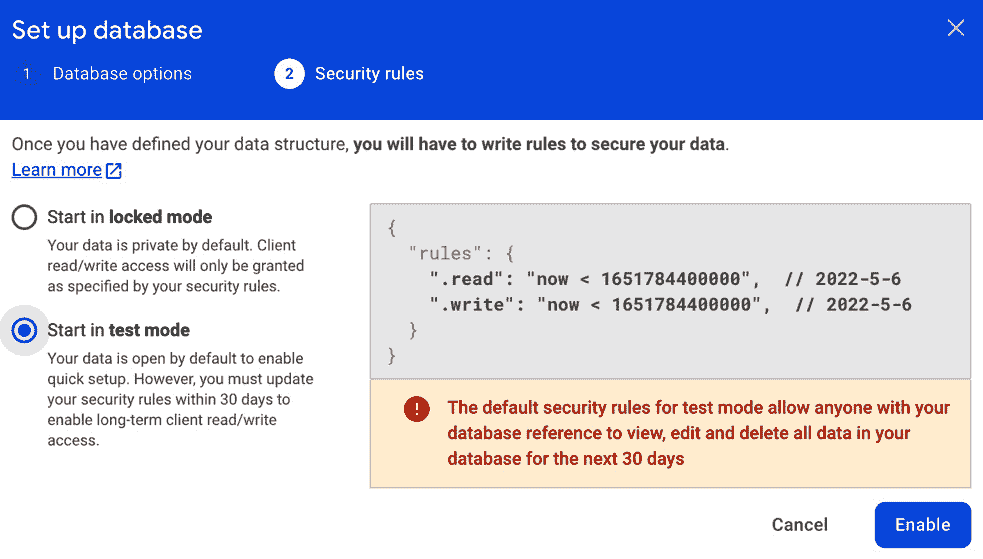

图 3.5 – 设置数据库的安全规则

重要提示

测试模式的默认安全规则允许任何人在创建后的前 30 天内查看或修改您数据库中的内容。在这 30 天后，如果您想继续以测试模式使用数据库，您需要通过更改`".read"`和`".write"`字段的时戳值来更新安全规则，并使用更大的时戳值。为了跳过这一步骤，我们将在下一步中将`".read"`和`".write"`字段设置为`true`。然而，如果您无限期地不设置任何规则而让数据库开放访问，Firebase 可能会限制您的访问权限——这就是为什么我建议您经常访问 Firebase 控制台并检查您数据库的安全规则，以确保访问权限没有被撤销。

此时，您应该被重定向到**数据**选项卡中您数据库的主页：

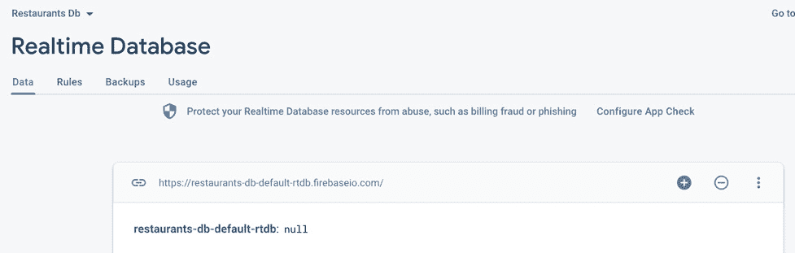

图 3.6 – 观察实时数据库主页

您现在将注意到此数据库的 URL：[`restaurants-db-default-rtdb.firebaseio.com/`](https://restaurants-db-default-rtdb.firebaseio.com/).

您的 URL 应该类似，但可能因您为数据库选择的名称而有所不同。

注意，数据库看起来似乎是空的；我们只有一个名为 `restaurants-db-default-rtdb` 的空根节点。现在是时候向我们的数据库添加数据了。

1.  通过导航到本书 GitHub 仓库的 `Chapter_03` 目录来访问本章的解决方案代码。然后，选择 `restaurants.json` 文件。您也可以通过以下链接访问它：[`github.com/PacktPublishing/Kickstart-Modern-Android-Development-with-Jetpack-and-Kotlin/blob/main/Chapter_03/restaurants.json`](https://github.com/PacktPublishing/Kickstart-Modern-Android-Development-with-Jetpack-and-Kotlin/blob/main/Chapter_03/restaurants.json)。

从这里，下载 `restaurants.json` 文件，因为我们很快就会需要它。为此，点击 Github 网站提供的 **Raw** 按钮，然后右键点击已打开的文档，通过选择 **另存为** 下载 JSON 文件。

1.  返回 Firebase 控制台，点击数据库 URL 右侧的三点菜单，并选择 **导入 JSON**：

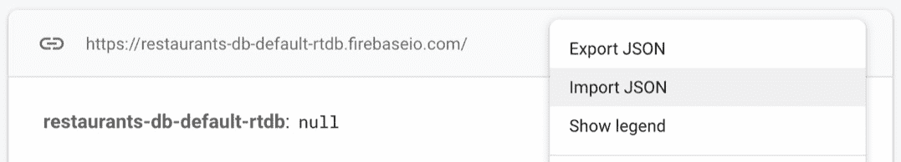

图 3.7 – 将 JSON 内容导入实时数据库

确保您选择之前从书籍的 GitHub 仓库下载的 `restaurants.json` 文件。

1.  等待页面刷新并查看数据库中填充的内容：

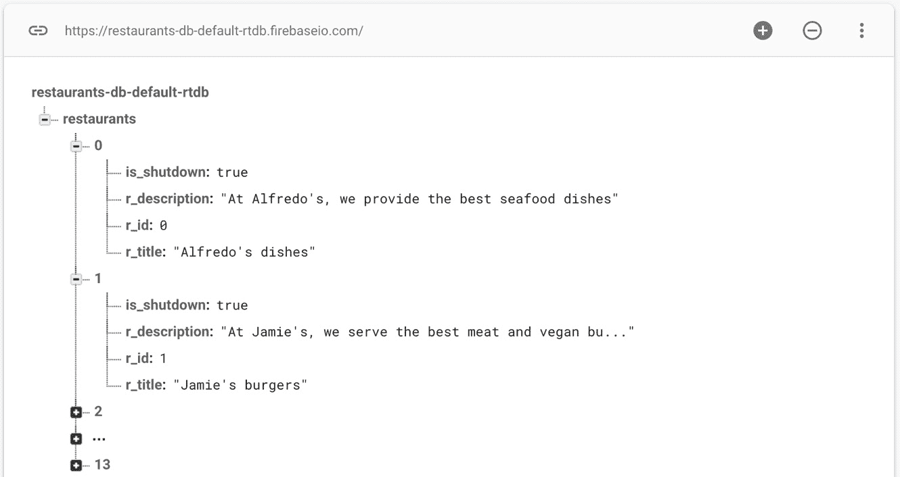

图 3.8 – 观察我们数据库中的内容结构

在这里，我们可以看到我们的数据库包含一个 `Restaurant` 类的列表：一个 ID、标题和描述。我们数据库中的餐厅还包含我们目前不需要的其他字段，所以让我们忽略它们。

备注

如果你比较我们数据库中的内容结构与已上传的 JSON 文件的结构，我们可以看到它们非常相似：我们有一个包含对象的数组的 `restaurants` 节点，每个对象都包含一致的键值对。唯一的例外是每个餐厅的索引（0、1、2 等等），这些是由 Firebase 自动创建的。我们应该忽略这些，因为它们不会影响我们。

现在，尽管我们之前已经将安全规则设置为**测试模式**，但让我们重新审视它们。

1.  将 `".read"` 键的值从 `"true"` 移开：

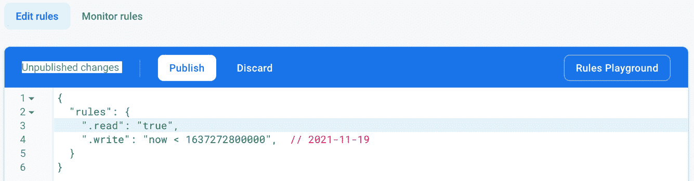

图 3.9 – 更新实时数据库中的安全规则

1.  由于我们正在进行测试而不是发布任何内容到生产环境，请按 `true`。

现在，我们可以将数据库 URL 作为简单的 REST 端点来访问，模拟一个我们可以连接到的真实 REST 服务器。为了实验，复制您新创建的数据库的 URL，追加 `restaurants.json`，并将其粘贴到浏览器中。

访问此 URL 应该返回我们的餐厅的 JSON 响应，其结构我们将在稍后介绍。在此之前，我们需要指示我们的应用程序创建 HTTP 请求以从我们新创建的数据库中获取该数据。所以，让我们继续吧。

# 探索 Retrofit 作为 Android 的 HTTP 网络客户端

为了让应用程序从我们的数据库获取数据，我们需要实现一个 HTTP 客户端，该客户端将向数据库的 REST API 发送网络请求。

我们将使用 **Retrofit** HTTP 客户端库，而不是与 Android 默认提供的 HTTP 库一起工作，它允许你创建一个非常容易与之一起工作的 HTTP 客户端。

如果你计划开发一个与 REST API 交互的 HTTP 客户端，你将不得不处理很多事情——从建立连接、重试失败的请求或缓存到响应解析和错误处理。Retrofit 通过抽象处理网络请求和响应的大部分底层复杂性，为你节省了开发时间和潜在的头痛。

在本节中，我们将涵盖以下主题：

+   使用 Retrofit

+   将 Retrofit 添加到 Restaurants 应用程序

+   将 JSON 映射到模型类

+   执行对 Firebase REST API 的 GET 请求

让我们从 Retrofit 的基础知识开始吧！

## 使用 Retrofit

Retrofit 使 Android 应用中的网络变得简单。它允许我们轻松消费网络服务，创建网络请求，并在减少与实现相关的样板代码的同时接收响应。

注意

Retrofit 还允许你轻松添加自定义头和请求类型、文件上传、模拟响应等。

要使用 Retrofit 执行网络请求，我们需要以下三个组件：

+   定义需要执行 HTTP 操作的接口。这样的接口可以指定请求类型，如 `GET`、`PUT`、`POST`、`DELETE` 等。

+   一个 `Retrofit.Builder` 实例，它创建了一个我们之前定义的接口的具体实现。Builder API 允许我们定义网络参数，如 HTTP 客户端类型、HTTP 操作的 URL 端点、反序列化 JSON 响应的转换器等。

+   模型类允许 Retrofit 知道如何将反序列化的 JSON 对象映射到常规数据类。

理论已经足够了——让我们尝试在 Restaurants 应用程序中实现 Retrofit 并使用我们之前介绍过的组件。

## 将 Retrofit 添加到 Restaurants 应用程序

我们希望将我们的 Restaurants 应用程序连接到新创建的 Firebase 数据库，并向其发送 HTTP 网络请求。更具体地说，当 Restaurants 应用程序启动并且 `RestaurantsScreen` 组合组件被组合时，我们希望在运行时获取餐厅列表，而不是依赖于应用程序内的硬编码内容。

让我们借助 Retrofit 来完成这项工作：

1.  在应用程序模块的 `build.gradle` 文件中，在 `dependencies` 块内添加 Retrofit 的依赖项：

    ```kt
    implementation "com.squareup.retrofit2:retrofit:2.9.0"
    ```

1.  在更新 `build.gradle` 文件后，请确保将项目与其 Gradle 文件同步。您可以通过点击 **文件** 菜单选项，然后选择 **同步项目与 Gradle 文件** 来完成此操作。

1.  创建一个接口，定义我们的应用程序和数据库之间执行的 HTTP 操作。通过点击应用程序包，将名称选为 `RestaurantsApiService`，并选择 **接口** 作为类型。在新建的文件中，添加以下代码：

    ```kt
    import retrofit2.Call
    import retrofit2.http.GET
    interface RestaurantsApiService {
        @GET("restaurants.json")
        fun getRestaurants(): Call<Any>
    }
    ```

让我们将我们刚刚添加的代码分解成有意义的操作：

+   Retrofit 将您的 HTTP API 转换为简单的 Java/Kotlin 接口，因此我们创建了一个 `RestaurantsApiService` 接口，该接口定义了我们需要的 HTTP 操作。

+   我们在接口内部定义了一个 `getRestaurants` 方法，该方法返回一个带有 Kotlin 的 `Any` 类型标记的未定义响应类型的 `Call` 对象。来自 `RestaurantsApiService` 的每个 `Call` 都可以向远程 Web 服务器发出同步或异步 HTTP 请求。

+   我们使用 `@GET` 注解注释了 `getRestaurants` 方法，从而告诉 Retrofit 该方法应执行 `GET` HTTP 操作以从我们的 Web 服务器获取数据。在 `@GET` 注解中，我们传递了端点的路径，它代表我们 Firebase 数据库中的 `restaurants` 节点。这意味着当我们执行此请求时，`restaurants.json` 端点将被附加到 HTTP 客户端的基 URL。

注意

我们提到可以使用我们的 Firebase 实时数据库 URL 作为 REST API。为了访问特定的节点，例如我们数据库中的 `restaurants` 节点，我们还附加了 `.json` 格式，以确保 Firebase 数据库的行为类似于 REST API 并返回 JSON 响应。

之后，在我们实例化 Retrofit 构建器之后，库将知道如何将我们的 `getRestaurants` 方法转换为适当的 HTTP 请求。

但在之前，你可能已经注意到，我们接口中的 `getRestaurants` HTTP 请求将其响应类型定义为 `Any`。我们期望接收将我们的餐厅 JSON 内容映射到我们可以用于我们代码的数据类的 JSON 内容。所以，让我们继续这个工作。

## 将 JSON 映射到模型类

Retrofit 允许您自动序列化请求体和反序列化响应体。在我们的情况下，我们对我们将响应体从 JSON 反序列化为 Java/Kotlin 对象感兴趣。

为了反序列化 JSON 响应，我们将指示 Retrofit 使用 GSON 反序列化库，但在此之前，让我们看看我们的数据库返回的 JSON 响应。记住，当我们填充 Firebase 数据库时，我们导入了一个名为 `restaurants.json` 的 JSON 文件。

让我们用任何文本编辑器打开该文件并观察其结构：

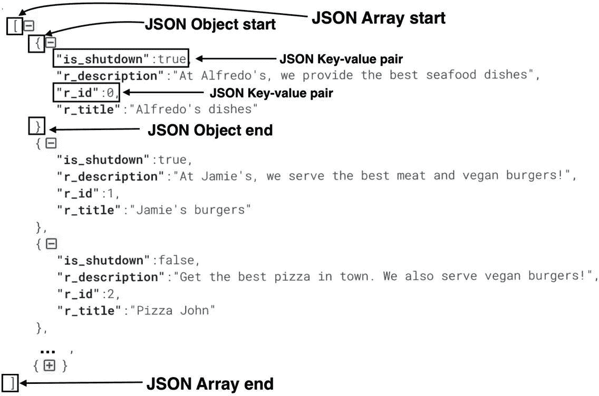

图 3.10 – Firebase 数据库内容的 JSON 结构

我们可以在 JSON 响应结构中观察到以下元素：

+   它包含由 `[` 和 `]` 标识符标记的一系列 JSON 对象。

+   JSON 数组元素的 内容 由 `{` 和 `}` 标识符标记，并包含餐厅的 JSON 对象结构。

+   餐厅 JSON 对象包含四个键值对，由 `,` 分隔。

来自我们数据库的响应将是 `List<?>` 类型，因为响应包含一个 JSON 对象数组。剩下的问题是我们应用程序应该期望列表中包含什么数据类型？

为了回答这个问题，我们必须更仔细地检查餐厅 JSON 对象的结构：

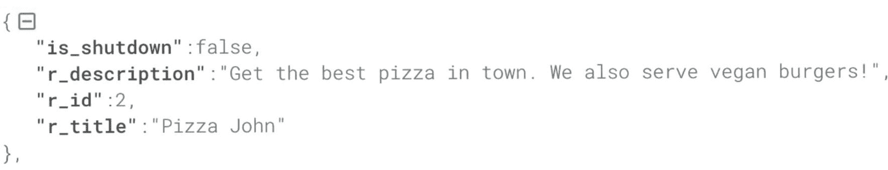

图 3.11 – 餐厅 JSON 对象的结构

在这里，我们可以看到 JSON 餐厅有四个键值对，分别对应餐厅的 `id`、`title`、`description` 和 `shutdown` 状态。这种结构与项目中的 `Restaurant.kt` 数据类类似：

```kt
data class Restaurant(val id: Int,
                      val title: String,
                      val description: String,
                      var isFavorite: Boolean = false)
```

我们的 `Restaurant` 还包含 `id`、`title` 和 `description` 字段。目前我们对 `shutdown` 状态不感兴趣，因此使用 `Restaurant` 类作为响应的模型很诱人，从而使 `RestaurantsApiService` 中的 `getRestaurants()` 方法返回 `List<Restaurant>` 作为请求的响应。

这种方法的缺点是我们需要告诉 Retrofit 将 `r_id` 键的值与我们的 `id` 字段匹配。同样，`r_title` 应该与 `title` 字段匹配，依此类推。我们可以用两种方法来处理这个问题：

+   将 `Restaurant` 数据类的字段重命名，以便它们与响应键匹配：`r_id`、`r_title` 等。在这种情况下，反序列化将自动将我们的字段与 JSON 对象的字段匹配，因为 JSON 键与字段名称相同。

+   使用特殊的序列化匹配器注释 `Restaurant` 数据类的字段，以告诉 Retrofit 哪些键应该与每个字段匹配。这不会改变变量名。

第一种方法不好，因为我们的 `Restaurant` 数据类最终会包含由服务器指定的下划线命名的字段。它也不再符合 Kotlin 的 CamelCase 规范来定义字段变量。

让我们选择第二种方法，其中我们自行指定序列化键。为此，我们将告诉 Retrofit 使用 GSON 反序列化库来反序列化 JSON，这是一个将 JSON 字符串转换为 Java/Kotlin 对象以及相反方向的强大框架：

1.  首先，我们需要添加 GSON 库依赖项来标记我们的字段，使用自定义序列化键。在 app 模块的 `build.gradle` 文件中，在 `dependencies` 块内添加 GSON 依赖项：

    ```kt
    implementation "com.google.code.gson:gson:2.8.6"
    ```

1.  更新 `build.gradle` 文件后，请确保将项目与其 Gradle 文件同步。您可以通过点击 **文件** 菜单选项，然后选择 **与 Gradle 文件同步项目** 来完成此操作。

1.  在 `Restaurant.kt` 中，为每个字段添加 `@SerializedName` 注解，并指定来自 JSON 结构的相应序列化键：

    ```kt
    import com.google.gson.annotations.SerializedName
    data class Restaurant(
        @SerializedName("r_id")
        val id: Int,
        @SerializedName("r_title")
        val title: String,
        @SerializedName("r_description")
        val description: String,
        var isFavorite: Boolean = false)
    ```

通过这样做，我们确保 Retrofit 将正确地将每个 JSON 键的值与 `Restaurant` 数据类中的相应字段匹配，同时匹配数据类型：

+   `r_id` 键与 `id` 字段匹配。在 JSON 结构中，`r_id` 键的值是一个整数，所以我们将其值存储在 `id: Int` 字段中。

+   `r_title` 键与 `title` 字段匹配。`r_title` 键的值是带有 `"` 和 `"` 标识符的文本，所以我们将其值存储在 `title: String` 字段中。

+   `r_description` 键与 `description` 字段匹配。`r_description` 键的值是带有 `"` 和 `"` 标识符的文本，所以我们将其值存储在 `description: String` 字段中。

注意

目前，我们正在将 Restaurant 数据模型同时用作 API 响应模型和整个应用程序中使用的域模型。从架构角度来看，这种做法并不推荐，我们将在 *第八章* 中解释为什么这样做不合适，并将在 *Android 清洁架构入门* 中修复它。

1.  更新 `RestaurantsApiService` 中的 `getRestaurants()` 方法，使其从服务器返回一个类型参数与预期响应匹配的 `Call` 对象。在我们的例子中，这将是一个 `List<Restaurant>`：

    ```kt
    interface RestaurantsApiService {
        @GET("restaurants.json")
        fun getRestaurants(): Call<List<Restaurant>>
    }
    ```

通过这样，我们的 Retrofit API 接口已经定义好了，用于从我们的 Firebase 数据库接收餐厅数据库的内容。剩下的唯一步骤是配置一个 Retrofit 构建器实例并执行请求。

## 执行对 Firebase REST API 的 GET 请求

让我们配置执行请求所需的最后一个组件——`Retrofit.builder` 对象：

1.  首先，我们需要为 Retrofit 添加 GSON 转换器库依赖，以便 Retrofit 在反序列化 JSON 响应时遵循我们之前添加的 GSON 序列化注解。在应用模块的 `build.gradle` 文件中，在 `dependencies` 块内添加 Retrofit GSON 转换器的依赖项：

    ```kt
    implementation "com.squareup.retrofit2:converter-
        gson:2.9.0"
    ```

1.  更新 `build.gradle` 文件后，请确保将项目与其 Gradle 文件同步。您可以通过点击 **文件** 菜单选项，然后选择 **与 Gradle 文件同步项目** 来完成此操作。

1.  在 `RestaurantsViewModel` 中，添加一个类型为 `RestaurantsApiService` 的 `restInterface` 变量，并创建一个 `init` 块，我们将在这里实例化 `Retrofit.builder` 对象：

    ```kt
    class RestaurantsViewModel(…) : ViewModel() {
        private var restInterface: RestaurantsApiService
        val state = mutableStateOf(
            dummyRestaurants.restoreSelections()
        )
        init {
            val retrofit: Retrofit = Retrofit.Builder()
                .addConverterFactory(
                    GsonConverterFactory.create()
                )
                .baseUrl(
                    "https://restaurants-db-default
                            -rtdb.firebaseio.com/"
                )
                .build()
            restInterface = retrofit.create(
                RestaurantsApiService::class.java
            )
        }
        […]
    }
    ```

我们已经为我们的网络客户端添加了所有必要的组件。让我们分析一下这段代码：

+   首先，我们定义了一个类型为 `RestaurantsApiService` 的 `restInterface` 变量，我们将调用它来执行所需的网络请求。在此阶段，`restInterface` 变量没有任何值。

+   我们添加了一个 `init` 块来实例化 Retrofit 构建器对象。由于主构造函数不能包含任何代码，我们将初始化代码放置在一个以 `init` 关键字为前缀的初始化块中。

+   我们使用 `Retrofit.Builder` 访问器实例化了一个 `retrofit: Retrofit` 变量，并指定了以下内容：

+   一个 `GsonConverterFactory`，明确告诉 Retrofit 我们想要使用 GSON 转换器反序列化 JSON，遵循我们在 `Restaurant` 数据类中指定的 `@Serialized` 注解。

+   一个 `baseUrl` 用于执行所有请求——在你的情况下，将此 URL 替换为你的 Firebase 数据库的 URL。

+   最后，我们在之前获得的 `Retrofit` 对象上调用了 `.create()`，并传递了我们的接口以及所需的请求：`RestaurantsApiService`。幕后，Retrofit 创建了我们接口的具体实现，该实现将处理所有网络逻辑，我们无需担心这一点。我们将 Retrofit 中的这个实例存储在 `restInterface` 变量中。

现在，我们可以执行请求——在我们的案例中，是获取餐厅列表的请求。

1.  在 `RestaurantsViewModel` 内部，添加 `getRestaurants` 方法：

    ```kt
    fun getRestaurants() {
        restInterface.getRestaurants().execute().body()
            ?.let { restaurants ->
                state.value = restaurants.restoreSelections()
            }
    }
    ```

我们为我们的网络请求执行添加了所有必要的步骤。让我们分解这段代码：

1.  我们通过调用 `getRestaurants()` 接口方法从 Retrofit 的 `restInterface` 变量中获取了一个名为 `Call<List<Restaurant>>` 的 `Call` 对象。`Call` 对象代表了调用 Retrofit 方法发送网络请求并接收响应的调用。`Call` 对象的类型参数与响应类型相匹配；即 `<List<Restaurant>>`。

1.  在之前获得的 `Call` 对象上，我们调用了 `execute()` 方法。`execute()` 方法是使用 Retrofit 开始网络请求的最简单方法，因为它在主线程（UI 线程）上同步运行请求，并在响应到达之前阻塞它。尽管我们很快会解决这个问题，但任何网络请求都不应该阻塞 UI 线程。

1.  `execute()` 方法返回一个 Retrofit `Response` 对象，它允许我们查看响应是否成功，并获取结果体。

1.  `body()` 访问器返回一个可能为空的 `List<Restaurant>>?` 类型的列表。我们应用 Kotlin 的 `let` 扩展函数，并将列表命名为 `restaurants`。

1.  在系统启动的进程死亡的情况下，我们在恢复选择后，将生成的 `restaurants` 列表传递给我们的 `state` 对象，这与我们为初始状态值所做的方法类似。

通过这种方式，我们指示我们的 `ViewModel` 如何从数据库中获取餐厅列表，并将此结果传递到屏幕的状态中。我们稍后必须解决的问题之一是我们没有捕获 Retrofit 如果请求失败可能抛出的任何错误。在此之前，让我们专注于使用新的结果更新状态。

5. 在`RestaurantsViewModel`内部，我们需要更新状态对象的初始值，使其包含一个空列表。这是因为，当屏幕首次显示时，我们不再有餐厅来渲染 – 我们将在网络请求中稍后获取它们。通过移除`dummyList`并放置一个`emptyList()`来更新`state`对象的初始值：

```kt
val state = mutableStateOf(emptyList<Restaurant>())
```

1.  在`Restaurant.kt`文件中，移除`dummyRestaurants`列表，因为我们将通过之前定义的请求在运行时获取餐厅。

1.  我们希望触发网络请求以从服务器获取餐厅。在`RestaurantsScreen.kt`内部，更新`RestaurantsScreen`可组合函数，使其调用`viewModel`的`getRestaurants()`方法，这将触发网络请求以从服务器获取餐厅：

    ```kt
    @Composable
    fun RestaurantsScreen() {
        val viewModel: RestaurantsViewModel = viewModel()
        viewModel.getRestaurants()
        LazyColumn( … ) { … }
    }
    ```

通过调用`viewModel.getRestaurants()`，我们试图在`RestaurantsScreen`可组合函数首次组合时加载餐厅列表。这种做法是不推荐的，我们将在以下步骤中看到为什么这是不推荐的，以及如何修复它。

1.  在`AndroidManifest.xml`文件中添加互联网权限：

    ```kt
    <manifest xmlns:android="…"
        package="com.codingtroops.restaurantsapp">
        <uses-permission                                   android:name="android.permission.INTERNET" />
          <application> … </application>
    </manifest>
    ```

1.  通过点击**运行**按钮来运行应用程序。

不幸的是，应用程序很可能会崩溃。如果我们检查**Logcat**，我们会注意到一个类似于以下异常堆栈：

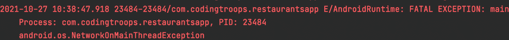

图 3.12 – 在主线程上执行网络请求的崩溃堆栈跟踪

这里抛出的异常是`NetworkOnMainThreadException`，我们很清楚我们的代码哪里出了问题：我们正在主线程上执行网络请求。

这是因为，在 Android Honeycomb SDK 中，*在主线程上执行网络请求是被禁止的*，因为应用程序的 UI 将冻结，直到服务器响应到达，这使得应用程序在该时间段内无法使用。换句话说，我们不能也不应该使用 Retrofit `Call`对象的`.execute()`方法，因为请求将在主线程上同步运行。

相反，我们可以使用一个替代方案，它不仅将以异步方式在单独的线程上执行请求，而且还允许我们处理 Retrofit 抛出的任何错误。

1.  在`ViewModel`的`getRestaurants()`方法中，将`.execute()`调用替换为`.enqueue()`：

    ```kt
    fun getRestaurants() {
       restInterface.getRestaurants().enqueue(
        object : Callback<List<Restaurant>> {
            override fun onResponse(
                call: Call<List<Restaurant>>,
                response: Response<List<Restaurant>>
            ) {
                response.body()?.let { restaurants ->
    state.value = 
                        restaurants.restoreSelections()
                }
            }
            override fun onFailure(
                call: Call<List<Restaurant>>, t: Throwable
            ) {
                t.printStackTrace()
            }
        })
    }
    ```

当为`Call`、`Callback`和`Response`类添加缺少的导入时，确保你添加的是以`import retrofit2.*`开头的 Retrofit2 导入。

回到我们添加的代码，让我们更详细地看看它：

+   在我们从`restInterface.getRestaurants()`方法获得的`Call`对象上，我们调用了`.enqueue()`函数。`.enqueue()`调用是`.execute()`的一个更好的替代方案，因为它在单独的线程上异步运行网络请求，因此它将不再在 UI 线程上运行，也不会阻塞 UI。

+   `.enqueue()` 函数接收一个 `Callback` 对象作为参数，允许我们监听成功或失败回调。`Callback` 对象的类型参数定义了预期的 `Response` 对象。由于我们期望响应类型为 `<List<Restaurant>>`，返回的 `Callback` 类型被定义为 `Callback<List<Restaurant>>`。

+   我们实现了所需的 `object : Callback<List<Restaurant>>` 并实现了其两个回调：

+   `onResponse()`，这是在网络请求成功时被调用的成功回调。它为我们提供了初始的 `Call` 对象，但更重要的是 `Response` 对象；即 `Response<List<Restaurant>>`。在这个回调内部，我们获取响应体并更新 `state` 变量的值，就像我们使用 `execute()` 时做的那样。

+   `onFailure()`，这是失败回调。当与服务器通信时发生网络异常，或者在创建请求或处理响应时发生意外异常时，它会被调用。这个回调为我们提供了初始的 `Call` 对象和被拦截的 `Throwable` 异常，我们打印了其堆栈跟踪。

现在，你可以运行应用程序。它不应该再崩溃了，因为调用 `enqueue()` 允许请求在单独的线程上运行，这样我们就可以安全地等待响应而不阻塞 UI。

注意

作为一种良好的实践，确保当你使用 Retrofit 发起请求时，始终调用 `enqueue()` 函数而不是 `execute()` 函数。你希望用户在等待网络响应时不会遇到崩溃，并且能够与应用程序进行交互。

即使有了这个添加，我们的代码中仍然存在两个令人担忧的问题。你是否注意到了？让我们尝试识别它们。

# 改进应用程序处理网络请求的方式

我们的应用程序现在可以成功地在运行时从服务器动态获取数据。不幸的是，我们在代码中犯了两个主要错误，这两个错误都与应用程序处理请求的方式有关。让我们来识别它们：

+   首先，我们没有取消我们的网络请求作为清理措施。如果我们的 UI 组件（在我们的例子中是 `MainActivity`）在服务器响应到达之前被销毁（例如，如果用户导航到另一个活动），我们可能会创建潜在的内存泄漏。这是因为我们的 `RestaurantsViewModel` 仍然绑定到 `Callback<List<Restaurant>>` 对象上，该对象等待服务器的响应。由于这个原因，垃圾收集器不会释放与这两个实例相关的内存。

+   其次，我们没有从受控环境中触发网络请求。`viewModel.getRestaurants()` 方法是在 `RestaurantsScreen()` 组合函数内部被调用的，没有任何特殊考虑。这意味着每次 UI 重新组合时，组合函数都会要求 `ViewModel` 执行网络请求，从而导致可能的多余和重复请求。

让我们先关注第一个问题。

### 将取消网络请求作为清理措施

我们 `RestaurantsViewModel` 中的主要问题是我们在排队一个 `Call` 对象，并通过 `Callback` 对象等待响应，但我们从未取消那个排队的 `Call`。我们应该在宿主 `Activity` 或 `ViewModel` 被清除时取消它，以防止内存泄漏。让我们在这里做这件事：

1.  在 `RestaurantsViewModel` 中，定义一个类型为 `Call` 且具有 `List<Restaurant>` 类型参数的类变量。将其命名为 `restaurantsCall`，因为我们将会使用它来保存对排队的 `Call` 对象的引用：

    ```kt
    class RestaurantsViewModel(…): ViewModel() {
        private var restInterface: RestaurantsApiService
        val state = […]
        private lateinit var restaurantsCall: 
            Call<List<Restaurant>>
        init {…}
       […]
    }
    ```

我们已将 `restaurantsCall` 标记为 `lateinit` 变量，以便在执行网络请求时稍后实例化它。

1.  在 `RestaurantsViewModel` 的 `getRestaurants()` 方法内部，将您从 `restInterface.getRestaurants()` 方法调用中获得的 `Call` 对象分配给 `restaurantsCall` 成员变量，并对其调用 `enqueue()`：

    ```kt
    fun getRestaurants() {
        restaurantsCall = restInterface.getRestaurants()
        restaurantsCall.enqueue(object : 
     Callback<List<Restaurant>> {…})
    }
    ```

1.  在 `RestaurantsViewModel` 中，重写 `onCleared()` 方法并调用 `restaurantCall` 对象的 `cancel()` 方法：

    ```kt
    override fun onCleared() {
        super.onCleared()
        restaurantsCall.cancel()
    }
    ```

`onCleared()` 回调方法由 Jetpack `ViewModel` 提供，并在 `ViewModel` 由于附加的活动/片段或组合函数被销毁或从组合中移除而销毁之前被调用。

这个回调为我们提供了一个完美的机会来取消任何正在进行的工作——或者在我们的情况下，取消在 `restaurantCall` 对象中排队的挂起 `Call` 对象。这样，我们防止了内存泄漏，并因此修复了我们代码中的第一个问题。

现在，是时候关注第二个问题，即 `RestaurantsScreen()` 组合函数在没有任何特殊考虑的情况下调用了 `viewModel.getRestaurants()` 方法。

### 从受控环境中触发网络请求

调用 `viewModel.getRestaurants()` 方法是因为我们想在 UI 中应用一个 **副作用**。副作用是对应用程序状态所做的更改，通常发生在组合函数的作用域之外。在我们的情况下，副作用是我们需要在用户进入屏幕时首次开始加载餐厅。

根据经验法则，组合函数应该是无副作用的，但在我们的应用程序中，我们需要知道何时触发网络请求，以及还有什么比我们的 UI 首次组合时更好的时机呢？

现有的简单从组合层调用`ViewModel`方法的方法存在一个问题，那就是 Compose UI 可以在屏幕上多次重新组合。例如，当渲染动画时，Compose UI 会多次重新组合以执行动画的关键帧。在每次 UI 重新组合时，我们的组合都会调用`RestaurantsViewModel`上的`getRestaurants()`方法，这会反过来执行网络请求以从服务器获取餐厅，这可能导致多次和冗余的请求。

为了防止这种情况发生，Compose 为我们提供了处理副作用的有效工具：**Effects** API。

一个**effect**是一个组合函数，它不是发出 UI 元素，而是在组合过程完成后执行副作用。这些组合基于 Kotlin Coroutine API，允许你在它们的主体中运行异步工作。然而，我们现在将忽略协程，因为我们将在*第四章*中介绍它们，即使用协程处理异步操作。

在 Compose 中，有许多类型的 effect 组合函数我们可以使用，但我们将不会深入探讨这一点。然而，在我们的情况下，一个合适的效果可以是`LaunchedEffect`组合函数，因为它允许我们在第一次进入组合时只运行一次任务。

`LaunchedEffect`的签名很简单——它包含一个`key1`参数和一个`block`参数，我们可以在这里执行我们的代码。现在，我们应该忽略协程术语，只需将`block`函数参数视为可以异步执行的代码块：

![图 3.13 – `LaunchedEffect`组合函数的签名

![图 3.13 – `LaunchedEffect`组合函数的签名

图 3.13 – `LaunchedEffect`组合函数的签名

当`LaunchedEffect`进入组合过程时，它会运行`block`参数函数，该函数作为参数传递。如果`LaunchedEffect`离开组合，则取消执行该块。如果`LaunchedEffect`使用传递给`key1`参数的不同键重新组合，则现有的代码块执行将被取消，并启动新的执行迭代。

现在我们知道了`LaunchedEffect`是如何工作的，我们可以同意它似乎是我们问题的可行解决方案，至少目前是这样：我们想要确保在初始组合中只执行一次对`ViewModel`的调用，所以`LaunchedEffect`似乎能满足我们的需求。

让我们添加一个`LaunchedEffect`来防止我们的 UI 在每次重新组合时反复从`ViewModel`请求餐厅：

1.  在`RestaurantsScreen`组合函数内部，将`viewModel.getRestaurants()`调用包裹在`LaunchedEffect`组合函数中：

    ```kt
    @Composable
    fun RestaurantsScreen() {
        val viewModel: RestaurantsViewModel = viewModel()
        LaunchedEffect(key1 = "request_restaurants") {
            viewModel.getRestaurants()
        }
        LazyColumn(…) { … }
    }
    ```

为了实现`LaunchedEffect`组合函数，我们做了以下操作：

+   我们将硬编码的 `"request_restaurants"` 字符串值传递给 `key1` 参数。我们向 `key1` 参数传递硬编码的值，因为我们希望传递给 `LaunchedEffect` composable 中的代码块在每次重组时都不执行。我们可以向 `key1` 传递任何常量，但这里重要的是这个值不应该随时间改变。

+   我们在效果的 `block` 参数中传递了调用 `getRestaurants()` 方法的代码。由于 `block` 参数是 `LaunchedEffect` composable 的最后一个参数，并且是一个函数，我们使用了尾随 lambda 语法。

1.  运行应用程序。现在，`LaunchedEffect` 内部的代码应该只执行一次。

即使添加了这一功能，我们的代码仍然存在问题。如果你尝试旋转你正在测试的模拟器或设备，将会触发配置更改，并执行另一个网络请求。但我们之前提到，`LaunchedEffect` 只会执行一次 `viewModel.getRestaurants()` 调用，那么为什么会出现这种情况呢？

`LaunchedEffect` 工作正常——问题在于配置更改时活动被销毁。如果活动被销毁，UI 将从头开始重新组合，并且对于它来说，`LaunchedEffect` 将会第一次运行 `block` 参数中的代码。

你能想到一个更好的替代方案来解决这个问题，即避免由于配置更改而导致活动被销毁吗？

另一个选择是使用 `ViewModel` 组件，因为它会存活于配置更改。如果我们只在 `RestaurantsViewModel` 中触发一次请求，我们就不再关心配置更改是否发生——请求将不会再次执行。按照以下步骤操作：

1.  在 `RestaurantsViewModel` 中，找到 `init` 块，并在其中调用 `getRestaurants()`：

    ```kt
    init {
        val retrofit: Retrofit = Retrofit.Builder().[…].build()
        restInterface = retrofit.create(
            RestaurantsApiService::class.java
        )
        getRestaurants()
    }
    ```

当创建 `ViewModel` 实例时，`init` 块只会被调用一次，因此在这里放置我们的网络请求比在任何 composable 的 UI 层面上更安全。确保你在 `restInterface` 变量实例化之后放置 `getRestaurants()` 调用，因为 `getRestaurants()` 方法依赖于该变量准备好工作。

1.  仍然在 `RestaurantsViewModel` 中，导航到 `getRestaurants()` 方法，将其标记为 `private`：

    ```kt
    private fun getRestaurants() {
        …
    }
    ```

我们不再需要将此方法公开暴露给 UI，因为它现在仅在 `ViewModel` 内部调用。

1.  在 `RestaurantsScreen` composable 中，移除包含所有代码的 `LaunchedEffect` composable 函数，因为我们不再需要它。

1.  运行应用程序。在做出配置更改时，网络请求不应该再次执行，因为 `RestaurantsViewModel` 实例被保留，并且其 `init` 块中的代码不会再次执行。

我们已经采取了相当多的步骤来确保我们的应用程序正确处理网络请求，这是创建现代应用程序的一个很好的第一步。

# 概述

在本章中，我们学习了移动应用程序如何使用 HTTP 连接和 REST API 与远程 Web API 通信。然后，我们在 Firebase 的帮助下为我们的 Restaurants 应用程序创建了一个数据库，并填充了内容。

之后，我们探讨了 Retrofit 是什么以及它是如何抽象处理应用程序与 Web API 之间 HTTP 连接中的网络请求和响应的复杂性的。

然后，我们在我们的 Restaurants 应用程序中使用 Retrofit 执行了一个网络请求，并学习了服务器发送的 JSON 内容是如何被我们的 Retrofit 网络客户端解析或反序列化的。我们还学习了如何正确等待网络响应，以及如何在响应到达时通知应用程序。

最后，我们解决了当我们的应用程序异步与 Web API 通信以检索数据时出现的一些常见问题，尤其是在 Compose 的上下文中。

在下一章中，我们将探讨 Android 中一个用于异步工作的非常高效的工具，这个工具与 Kotlin 一起提供：协程！

# 进一步阅读

在 Retrofit 接口内部使用自定义注解的帮助下，这个库隐藏了与处理网络请求相关的绝大多数复杂性。我们看到了在我们的`RestaurantsApiService`接口中，当我们使用`@GET`注解注释我们的请求时，简单的`GET`请求：

```kt
interface RestaurantsApiService {
    @GET("restaurants.json")
    fun getRestaurants(): Call<List<Restaurant>>
}
```

然而，除了普通的`GET`操作之外，这样的 Retrofit 接口还可以处理其他请求类型，如`PUT`、`POST`和`DELETE`。

例如，如果您需要定义一个将一些数据传递给服务器的请求，这些数据可能需要存储，您可以通过添加`@POST`注解到您希望的方法来使用`POST`请求：

```kt
@POST("user/edit")
fun updateUser(@Field("first_name") firstName: String): 
    Call<User>
```

要了解如何使用 Retrofit 处理此类情况，或更高级的情况，请查看官方文档：https://square.github.io/retrofit/
