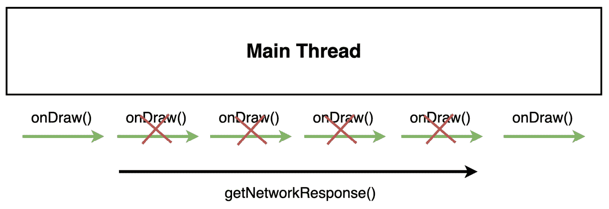
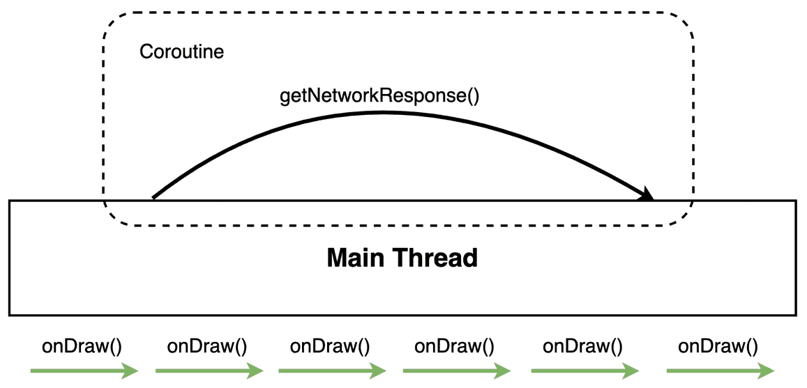

# 第四章：*第四章*：使用协程处理异步操作

在本章中，我们专注于另一个库，尽管它不在 Jetpack 库套件中，但对于编写稳健的应用程序至关重要：**Kotlin 协程**。

协程代表了在 Android 上处理异步工作和并发任务的一种更方便的方式。

在本章中，我们将研究如何在我们的餐厅应用中用协程替换回调。在第一部分*介绍 Kotlin 协程*中，我们将更好地理解协程是什么，它们是如何工作的，以及为什么我们需要在我们的应用中使用它们。

在下一节*探索协程的基本元素*中，我们将探索协程的核心元素，并了解如何更简洁地使用它们来处理异步工作。

最后，在*使用协程进行异步工作*部分，我们将在我们的餐厅应用中实现协程，并让它们处理网络请求。此外，我们还将添加错误处理，并在 Android 应用中使用协程时整合一些最佳实践。

总结来说，在本章中，我们将涵盖以下主要内容：

+   介绍 Kotlin 协程

+   探索协程的基本元素

+   使用协程进行异步工作

在深入之前，让我们为这一章设置技术要求。

# 技术要求

使用协程构建基于 Compose 的 Android 项目通常需要您的日常工具。但是，为了顺利地跟随本章，请确保您有以下内容：

+   Arctic Fox 2020.3.1 版本的 Android Studio。您也可以使用更新的 Android Studio 版本或甚至 Canary 构建，但请注意，IDE 界面和其他生成的代码文件可能与本书中使用的不同。

+   Kotlin 1.6.10 或更新的插件，已安装在 Android Studio 中

+   上一章的餐厅应用代码。

本章的起点是上一章开发的餐厅应用。如果您没有跟随上一章的实现，请通过导航到存储库中的`Chapter_03`目录并导入名为`chapter_3_restaurants_app`的 Android 项目来访问本章的起点。

要访问本章的解决方案代码，请导航到`Chapter_04`目录：

[`github.com/PacktPublishing/Kickstart-Modern-Android-Development-with-Jetpack-and-Kotlin/tree/main/Chapter_04/chapter_4_restaurants_app`](https://github.com/PacktPublishing/Kickstart-Modern-Android-Development-with-Jetpack-and-Kotlin/tree/main/Chapter_04/chapter_4_restaurants_app)。

# 介绍 Kotlin 协程

**协程**是 Kotlin API 的一部分。它们引入了一种新的、更简单的方式来处理异步工作和并发任务。

通常，在 Android 中，我们需要在幕后运行或执行不同的任务。同时，我们不想阻塞应用程序的主线程，并得到一个无响应的用户界面。

为了减轻这个问题，协程允许你更容易地执行异步工作，同时为你的 Android 应用提供主线程安全性。你可以根据需要启动一个或多个**协程**来使用协程 API。

在本节中，我们将涵盖三个关于协程 API 的基本问题，这些问题源于我们之前提到的内容：

+   什么是协程？

+   协程有哪些特性和优势？

+   协程是如何工作的？

让我们开始吧！

## 什么是协程？

协程是异步工作的并发设计模式。*协程代表了一个可挂起的计算实例*。

换句话说，协程是表示可挂起计算任务的代码序列或块。我们称它们为**可挂起的**，因为协程可以在执行过程中被挂起和恢复，这使得它们对并发任务非常高效。

当比较协程和线程时，我们可以这样说：

+   协程是线程的轻量级版本，但并非线程。协程之所以轻量，是因为创建协程不会分配新的线程——通常，协程使用预定义的线程池。

+   和线程一样，协程可以并行运行，互相等待，并进行通信。

+   与线程不同，协程非常便宜：我们可以创建成千上万的协程，而在性能方面几乎不付出任何代价。

接下来，让我们更好地理解协程背后的目的。

## 协程的特性和优势

到目前为止，我们知道在 Android 上，协程可以帮助我们将长时间运行的异步工作从主线程移动到单独的线程。本质上，协程有两个主要可能的用途：

+   用于处理异步工作

+   用于处理多线程

在本章中，我们将仅介绍如何在 Android 应用中正确地使用协程处理异步工作。

然而，在我们尝试理解如何使用协程来实现这一点之前，让我们先探索协程相较于我们过去使用的其他替代方案（如`AsyncTask`类、回调和响应式框架）所提供的优势。协程被描述如下：

+   **轻量级**：我们可以在单个线程上启动许多协程。协程支持在线程上的执行挂起，而不是阻塞它，这导致更少的内存开销。此外，协程并不总是绑定到特定的线程——它可能在一个线程上开始执行，并在另一个线程上产生结果。

+   **易于取消**：当取消父协程时，在同一作用域内启动的任何子协程都将被取消。如果你启动了多个并发运行的操作的协程，取消操作简单直接，并适用于整个受影响的协程层次结构；因此，这消除了任何潜在的内存泄漏。

+   `Activity`、`Fragment`、`ViewModel`等。这意味着您可以从这些组件安全地启动协程，因为当发生不同的生命周期事件时，它们将自动取消，因此您不必担心内存泄漏。

    注意

    我们多次提到了单词*作用域*，我保证我们会在稍后解释它。在此之前，您可以将协程作用域视为一个控制已启动协程生命周期的实体。

现在我们已经对协程的功能有了概念。然而，为了更好地理解它们的目的，首先，我们需要了解为什么我们应该将异步工作从主线程卸载到单独的工作线程。

## 协程是如何工作的？

在 Android 运行时，主线程负责两件事：

+   在屏幕上绘制应用程序的 UI

+   在用户交互时更新 UI

简单来说，主线程在屏幕画布上调用一个绘图方法。这个方法可能对您来说很熟悉，就是`onDraw()`方法，我们可以假设为了您的设备以每秒 60 帧的速度渲染 UI，Android 运行时会大约每 16 毫秒调用这个方法一次。

如果由于某种原因，我们在主线程上执行了繁重的异步工作，应用程序可能会冻结或卡顿。这是因为主线程忙于处理我们的异步工作；因此，它错过了几个本可以更新 UI 并防止冻结效果的`onDraw()`调用。

假设我们需要向我们的服务器发起一个网络请求。这个操作可能需要时间，因为我们必须等待响应，这取决于 Web API 的速度和用户的连接性。让我们想象这样一个方法被命名为`getNetworkResponse()`，并且我们是从主线程调用它的：



图 4.1 – 异步工作阻塞主线程

从它发起网络请求的那一刻起，主线程一直在等待响应，同时无法做任何事情。我们可以看到，由于主线程忙于执行我们的`getNetworkResponse()`方法调用并等待结果，因此错过了几个`onDraw()`调用。

为了减轻这个问题，我们过去使用了许多机制。然而，协程的使用更加简单，并且与 Android 生态系统完美配合。因此，是时候看看它们如何使我们能够执行异步工作了：



图 4.2 – 通过协程在另一个线程上执行异步工作

使用协程，我们可以将任何讨厌的阻塞调用（如`getNetworkResponse()`方法调用）从主线程卸载到协程。

协程在单独的线程上运行，负责执行网络请求并等待响应。这样，主线程就不会被阻塞，也不会错过任何`onDraw()`调用；因此，我们避免了出现任何屏幕冻结效果。

现在我们已经对协程的工作原理有了基本的了解，是时候探索协程所基于的组件了。

# 探索协程的基本元素

使用协程完成异步工作的一个非常简单的方案可以表达如下：首先定义挂起函数，然后创建执行挂起函数的协程。

然而，我们不仅不确定挂起函数看起来像什么，而且也不知道如何允许协程为我们执行异步工作。

让我们一步一步来，从我们需要使用协程执行异步工作的两个基本操作开始：

+   创建挂起函数

+   启动协程

所有这些术语现在都几乎没有什么意义，所以让我们来解决这个问题，从挂起函数开始！

## 创建挂起函数

为了使用协程，我们首先需要定义一个挂起函数，其中包含阻塞任务。

**挂起**函数是一种特殊函数，可以在某个时间点暂停（挂起），然后在稍后某个时间点恢复。这允许我们在函数挂起时执行长时间运行的任务，并在工作完成时最终恢复它。

我们代码中的常规函数调用大多数都是在主线程上同步执行的。本质上，挂起函数允许我们在后台异步执行任务，而不会阻塞调用这些函数的线程。

假设我们需要将有关用户的某些详细信息保存到本地数据库中。这个操作需要时间，因此我们需要显示一个动画直到它完成：

```java
fun saveDetails(user: User) {
    startAnimation()
    database.storeUser(user)
    stopAnimation()
}
```

如果这个操作在主线程上调用，当用户的详细信息被保存时，动画将冻结几百毫秒。

仔细看看之前提供的代码，并问自己以下问题：*哪个方法调用应该是可挂起的？*

由于`storeUser()`方法需要一段时间才能完成，我们希望这个方法成为一个挂起函数，因为这个函数应该在用户的详细信息保存后暂停，然后在任务完成时恢复。这确保了我们不会阻塞主线程或冻结动画。

然而，我们如何使`storeUser()`方法成为一个挂起函数？

挂起函数是一个带有`suspend`关键字的常规函数：

```java
suspend fun storeUser(user: User) {
    // blocking action
}
```

我们知道`storeUser()`方法将详细信息保存到数据库中，这需要一段时间。因此，为了防止这个任务阻塞 UI，我们用额外的`suspend`关键字标记了该方法。

然而，如果我们用一个`suspend`关键字标记一个方法，试图在我们的代码中调用它，会导致编译错误：


图 4.3 – 从常规函数调用挂起函数会导致编译错误

挂起函数只能从协程内部或从另一个挂起函数内部调用。而不是从常规方法中调用我们的`storeUser()`挂起方法，让我们创建一个协程并从那里调用它。

## 启动协程

要执行一个暂停函数，首先，我们需要创建并启动一个协程。为此，我们需要在协程作用域上调用协程构建器：

```java
fun saveDetails(user: User) {
    GlobalScope.launch(Dispatchers.IO) {
startAnimation()
        database.storeUser(user)
        stopAnimation()
    }
}
```

我们刚刚启动了我们的第一个协程，并在其中调用了暂停函数！让我们分析一下刚刚发生了什么：

+   我们使用了一个`GlobalScope`协程作用域，它管理着在其中启动的协程。

+   在协程作用域内，我们调用了`launch()`协程构建器来创建一个协程。

+   然后，我们将`Dispatchers.IO`调度器传递给协程构建器。在这种情况下，我们希望在为 I/O 操作保留的线程中保存用户详细信息。

+   在`launch()`协程构建器为我们提供的块内，我们调用我们的`storeUser()`暂停函数。

现在我们已经成功地将阻塞工作从主线程移至工作线程。因此，我们确保了 UI 不会被阻塞，动画可以流畅运行。

然而，现在我们在`saveDetails()`方法中实现了工作暂停，你可能想知道这个方法内函数调用的顺序是什么。

为了更好地理解正常同步世界与暂停世界的融合，让我们在我们的代码片段中添加一些日志：

```java
fun saveDetails(user: User) {
    Log.d("TAG", "Preparing to launch coroutine")
    GlobalScope.launch(Dispatchers.IO) {
        startAnimation()
        Log.d("TAG", "Starting to do async work")
        database.storeUser(user)
        Log.d("TAG", "Finished async work")
        stopAnimation()
    }
    Log.d("TAG", "Continuing program execution")
}
```

记住，在这段代码块中，唯一需要花费一些时间来计算的暂停函数是`database.storeUser()`。现在，让我们想象我们已经运行了前面的代码片段。

练习

在检查以下输出之前，试着自己思考日志的顺序。你期望函数调用的顺序是什么？

让我们看看输出：


图 4.4 – 正常函数和暂停函数的输出顺序

函数调用的顺序有点混乱，但绝对是正确的。让我们看看发生了什么：

1.  首先，带有`Preparing to launch coroutine`信息的日志函数被调用。这个方法调用是在主线程（UI）上完成的。

1.  尽管接下来我们启动了协程，但我们可以看到第二个日志函数调用是我们代码中的最后一条：`Continuing program execution`。

这是因为协程是连接到暂停世界的桥梁，所以协程中的每一个函数调用都会在主线程之外的不同线程上运行。更精确地说，从主线程切换到`Dispatchers.IO`的操作将花费一些时间。这意味着协程内的所有这些方法都将在外部协程的方法调用之后执行。

1.  下一条日志函数调用是带有`Starting to do async work`信息的。这个方法在协程中在一个为 I/O 操作保留的线程上被调用。这条日志标志着所有暂停工作的执行开始。

1.  最后，在`database.storeUser()`暂停函数中的所有阻塞工作完成后，最后一条带有`Finished async work`信息的日志函数调用被调用。这条日志标志着协程执行的结束。

现在我们已经了解了在函数调用方面，常规世界与挂起世界是如何融合的，但仍有许多术语和概念被抛给了你。主要的是，你可能想知道以下内容：

+   协程作用域是什么？

+   什么是协程调度器？

+   什么是协程构建器？

让我们澄清这些概念，从协程作用域开始。

### 协程作用域

实际上，协程在 **协程作用域** 中运行。要启动一个协程，首先需要一个协程作用域，因为它跟踪其内部启动的所有协程，并且有取消它们的能力。这样，你可以控制协程应该存活多久以及何时取消。

协程作用域包含一个 `CoroutineContext` 对象，它定义了协程运行的环境。在上一个示例中，我们使用了预定义的作用域 `GlobalScope`，但你也可以通过构造一个 `CoroutineContext` 对象并将其传递给 `CoroutineScope()` 函数来定义一个自定义作用域，如下所示：

```java
val job = Job()
val myScope = CoroutineScope(context = job + Dispatchers.IO)
```

`CoroutineScope()` 函数期望一个传递给其 `context` 参数的 `CoroutineContext` 对象，并且知道如何通过特殊的 `plus` 运算符接收元素，然后在幕后构建上下文。

大多数情况下，构建 `CoroutineContext` 对象的两个最重要的元素就是我们刚刚传递的：

+   一个 `Job` 对象：这代表一个可取消的组件，它控制特定作用域中启动的协程的生命周期。当一个作业被取消时，该作业将取消它所管理的协程。例如，如果我们在一个 `Activity` 类中定义了一个 `job` 对象和一个自定义的 `myScope` 对象，那么在 `onDestroy()` 回调中调用 `job` 对象的 `cancel()` 方法是一个取消协程的好地方：

    ```java
    override fun onDestroy() {
        super.onDestroy()
        job.cancel()
    }
    ```

通过这样做，我们确保了在协程中完成的异步工作，该协程使用 `myScope` 作用域，将在活动被销毁时停止，并且不会造成任何内存泄漏。

+   一个 `Dispatcher` 对象：将方法标记为挂起并不会提供关于它应该在哪个线程池上运行的详细信息。因此，通过将一个 `Dispatcher` 对象传递给 `CoroutineScope` 构造函数，我们可以确保在协程中调用并使用此作用域的所有挂起函数将默认使用指定的 `Dispatcher` 对象。在我们的示例中，所有在 `myScope` 中启动的协程将默认在 `Dispatchers.IO` 线程池中运行，并且不会阻塞 UI。

注意，`CoroutineContext` 对象还可以包含一个异常处理对象，我们将在稍后定义。

除了我们之前定义的自定义作用域之外，你还可以使用预定义的与特定生命周期组件绑定的协程作用域。在这种情况下，你将不再需要使用作业定义作用域或手动取消协程作用域：

+   `GlobalScope`: 这允许协程与应用程序的生命周期保持一致。在之前的例子中，我们为了简单起见使用了这个作用域，但应该避免使用`GlobalScope`，因为在这个协程作用域内启动的工作只有当应用程序被销毁时才会取消。在具有比应用程序更窄的生命周期的组件（如`Activity`组件）中使用此作用域可能会允许协程超出该组件的生命周期并产生内存泄漏。

+   `lifecycleScope`: 这个作用域将协程与`LifecycleOwner`实例的生命周期相关联，例如`Activity`组件或`Fragment`组件。我们可以使用 Jetpack KTX 扩展包中定义的`lifecycleScope`作用域：

    ```java
    class UserFragment : Fragment() {
        ...
        fun saveDetails(user: User) {
            lifecycleScope.launch(Dispatchers.IO) {
                startAnimation()
                database.storeUser(user)
                stopAnimation()
            }
        }
    }
    ```

通过在这个上下文中启动协程，我们确保如果`Fragment`组件被销毁，协程作用域将自动取消；因此，这也会取消我们的协程。

+   `viewModelScope`: 为了让我们的协程与`ViewModel`组件的生命周期保持一致，我们可以使用预定义的`viewModelScope`作用域：

    ```java
    class UserViewModel: ViewModel() {
        fun saveDetails(user: User) {
            // do some work
            viewModelScope.launch(Dispatchers.IO) {
                database.storeUser(user)
            }
            // do some other work
        }
    }
    ```

通过在这个上下文中启动协程，我们确保如果`ViewModel`组件被清除，协程作用域将取消其工作——换句话说，它将自动取消我们的协程。

+   `rememberCoroutineScope`: 为了将协程作用域与可组合函数的组合周期相关联，我们可以使用预定义的`rememberCoroutineScope`作用域：

    ```java
    @Composable
    fun UserComposable() {
        val scope = rememberCoroutineScope()
        LaunchedEffect(key1 = "save_user") {
            scope.launch(Dispatchers.IO) { 
                viewModel.saveUser()
            }
        }
    }
    ```

因此，协程的生命周期绑定到`UserComposable`的组合周期。这意味着当`UserComposable`离开组合时，作用域将自动取消，从而防止协程超出其父可组合组件的组合生命周期。

由于我们希望协程仅在组合时启动一次，而不是在每次重新组合时启动，所以我们用`LaunchedEffect`可组合包装了协程。

现在我们已经了解了协程作用域是什么以及它们如何允许我们控制协程的生命周期，是时候更好地理解分发器了。

### 分发器

**CoroutineDispatcher**对象允许我们配置工作应该执行在哪个线程池上。协程的目的是帮助我们将阻塞工作从主线程移开。因此，我们需要以某种方式指导协程使用哪些线程来执行我们传递给它们的工作。

为了做到这一点，我们需要配置协程的`CoroutineContext`对象以设置特定的分发器。实际上，当我们介绍协程作用域时，我们已经解释了`CoroutineContext`是由一个作业和一个分发器定义的。

当创建自定义作用域时，我们可以在实例化作用域时指定默认的分发器，就像我们之前做的那样：

```java
val myScope = CoroutineScope(context = job + Dispatchers.IO)
```

在这种情况下，`myScope`的默认分发器是`Dispatchers.IO`。这意味着无论我们传递给使用`myScope`启动的协程的挂起工作是什么，工作都会被移动到专门用于 I/O 后台工作的线程池。

对于预定义的协程作用域，例如使用 `lifecycleScope`、`viewModelScope` 或 `rememberCoroutineScope`，我们可以在启动协程时指定所需的默认调度器：

```java
scope.launch(Dispatchers.IO) {
    viewModel.saveUser()
}
```

我们使用 `launch` 或 `async` 等协程构建器启动协程，这些内容将在下一节中介绍。在此之前，我们需要了解在启动协程时，我们还可以通过指定 `CoroutineDispatcher` 对象来修改协程的 `CoroutineContext` 对象。

现在我们已经在所有示例中使用了 `Dispatchers.IO` 作为调度器。但还有其他对我们有用的调度器吗？

`Dispatchers.IO` 是 Coroutines API 提供的调度器，但除了这个之外，协程还提供了其他调度器。以下列出最显著的调度器：

+   `Dispatchers.Main`：在 Android 上将工作分发到主线程。对于轻量级工作（不会阻塞 UI）或实际的 UI 函数调用和交互来说，这是理想的。

+   `Dispatchers.IO`：将阻塞工作分发到专门处理磁盘密集型或网络密集型操作的后台线程池。对于在本地数据库上挂起工作或执行网络请求，应指定此调度器。

+   `Dispatchers.Default`：将阻塞工作分发到专门处理 CPU 密集型任务（如排序长列表、解析 JSON 等）的后台线程池。

在之前的示例中，我们为启动的协程的 `CoroutineContext` 对象设置了特定的 `Dispatchers.IO` 调度器，确保挂起的任务将由这个特定的调度器分发。

但我们犯了一个关键的错误！让我们再次查看代码：

```java
class UserFragment : Fragment() {
    ...
    fun saveDetails(user: User) {
        lifecycleScope.launch(Dispatchers.IO) {
            startAnimation()
            database.storeUser(user)
            stopAnimation()
        }
    }
}
```

这段代码的主要问题是 `startAnimation()` 和 `stopAnimation()` 函数可能甚至不是挂起函数，因为它们与 UI 进行交互。

我们希望将 `database.storeUser()` 的阻塞工作在后台线程上运行，因此我们将 `Dispatchers.IO` 调度器指定给 `CoroutineContext` 对象。但这意味着协程块中的所有其他代码（即 `startAnimation()` 和 `stopAnimation()` 函数调用）将被分发到旨在处理后台工作的线程池，而不是分发到主线程。

为了更精细地控制函数被分发到哪些线程，协程允许我们通过使用 `withContext` 块来控制调度器，该块创建了一个可以在不同调度器上运行的代码块。

由于 `startAnimation()` 和 `stopAnimation()` 必须在主线程上工作，让我们重构我们的示例。

让我们使用 `Dispatchers.Main` 的默认调度器启动我们的协程，然后使用 `withContext` 块包装必须运行在后台线程（即 `database.storeUser(user)` 挂起函数）上的工作：

```java
fun saveDetails(user: User) {
    lifecycleScope.launch(Dispatchers.Main) {
        startAnimation()
        withContext(Dispatchers.IO) {
            database.storeUser(user)
        }
        stopAnimation()
    }
}
```

`withContext` 函数允许我们为其暴露的块定义一个更细粒度的 `CoroutineContext` 对象。在我们的例子中，我们必须传递 `Dispatchers.IO` 分派器，以确保我们的数据库阻塞工作在后台线程上运行，而不是被分派到主线程。

换句话说，我们的协程将把所有工作分派给 `Dispatchers.Main` 分派器，除非你定义另一个更细粒度的上下文，该上下文有自己的 `CoroutineDispatcher` 设置。

现在我们已经介绍了如何使用分派器以及如何确保对工作分派到不同线程有更细粒度的控制。然而，我们还没有介绍 `launch { }` 块的含义。让我们接下来看看这个。

### 协程构建器

(`launch`) 是 `CoroutineScope` 的扩展函数，允许我们创建和启动协程。本质上，它们是正常同步世界（具有常规函数）和挂起世界（具有挂起函数）之间的桥梁。

由于我们无法在常规函数内部调用挂起函数，因此在 `CoroutineScope` 对象上执行协程构建方法会创建一个作用域协程，它为我们提供了一个代码块，我们可以在这里调用我们的挂起函数。没有作用域，我们无法创建协程 - 这很好，因为这种做法有助于防止内存泄漏。

我们可以使用三个构建函数来创建协程：

+   `launch`: 这将启动一个与代码其余部分并发运行的协程。使用 `launch` 启动的协程不会将结果返回给调用者 - 相反，所有挂起函数都会在 `launch` 暴露的块内部顺序执行。我们的任务是获取挂起函数的结果，然后与该结果进行交互：

    ```java
    fun getUser() {
        lifecycleScope.launch(Dispatchers.IO) {
            val user = database.getUser()
            // show details to UI
        }
    }
    ```

大多数时候，如果你不需要并发工作，`launch` 是启动协程的首选选项，因为它允许你在提供的代码块内部运行你的挂起工作，并且不关心其他任何事情。

如果在协程构建器中没有指定分派器，将要使用的分派器是用于启动协程的 `CoroutineScope` 默认提供的分派器。在我们的例子中，如果我们没有指定分派器，使用 `launch` 协程构建器启动的协程将使用由 `lifecycleScope` 默认定义的 `Dispatchers.Main` 分派器。

除了 `lifecycleScope`，`viewModelScope` 也提供了相同的预定义分派器 `Dispatchers.Main`。另一方面，如果未向协程构建器提供分派器，则 `GlobalScope` 默认为 `Dispatchers.Default`。

+   `async`: 这将启动一个新的协程，并允许你将结果作为 `Deferred<T>` 对象返回，其中 `T` 是你期望的数据类型。延迟对象是对你的结果 `T` 将在未来返回的承诺。要启动协程并获取结果，你需要调用挂起函数 `await`，这将阻塞调用线程：

    ```java
    lifecycleScope.launch(Dispatchers.IO) {
        val deferredAudio: Deferred<Audio> =
            async { convertTextToSpeech(title) }
        val titleAudio = deferredAudio.await()
        playSound(titleAudio)
    }
    ```

我们不能在普通函数中使用 `async`，因为它必须调用 `await` 挂起函数来获取结果。为了解决这个问题，我们首先使用 `launch` 创建了一个父协程，并在其中启动了子协程。这意味着使用 `async` 启动的子协程从使用 `launch` 启动的父协程继承了其 `CoroutineContext` 对象。

使用 `async`，我们可以在一个地方获取并发工作的结果。`async` 协程构建器在具有并行执行且需要结果的任务中表现出色（并且推荐使用）。

假设我们需要同时将两段文本转换为语音，然后同时播放这两个结果：

```java
lifecycleScope.launch(Dispatchers.IO) {
    val deferredTitleAudio: Deferred<Audio> =
        async { convertTextToSpeech(title) }
    val deferredSubtitleAudio: Deferred<Audio> =
        async { convertTextToSpeech(subtitle) }
    playSounds(
        deferredTitleAudio.await(),
        deferredSubtitleAudio.await()
    )
}
```

在这个特定的例子中，`deferredTitleAudio` 和 `deferredSubtitleAudio` 这两个结果任务将并行运行。

由于我们的餐厅应用之前没有包含并发工作，我们不会深入探讨并发主题。

+   `runBlocking`：这将在被调用的当前线程上启动一个协程，直到协程完成才会阻塞该线程。由于创建线程和阻塞它们效率较低，因此应避免在我们的应用中用于异步工作。然而，这个协程构建器可以用于单元测试。

现在我们已经涵盖了协程的基础知识，是时候在我们的餐厅应用中实现协程了！

# 使用协程进行异步工作

我们必须做的第一件事是确定我们在餐厅应用中已经完成的异步/重型工作。

不看代码，我们知道我们的应用通过使用 Retrofit 初始化网络请求并等待响应来从服务器检索餐厅列表。这个动作符合异步任务的标准，因为我们不希望应用在等待网络响应到达时阻塞主（UI）线程。

如果我们查看 `RestaurantsViewModel` 类，我们可以确定 `getRestaurants()` 方法是我们应用中发生重型阻塞工作的唯一地方：

```java
private fun getRestaurants() {
    restaurantsCall = restInterface.getRestaurants()
    restaurantsCall.enqueue(object : Callback
        <List<Restaurant>> {
            override fun onResponse(...) {
                response.body()?.let { restaurants -> ... }
            }
            override fun onFailure(...) {
                t.printStackTrace()
            }
        })
}
```

当我们实现网络请求时，我们使用了 Retrofit 的 `enqueue()` 方法，并将一个 `Callback` 对象传递给它，这样我们就可以等待结果而不阻塞主线程。

为了简化我们从服务器获取餐厅信息这一异步操作的处理方式，我们将实现协程。这将使我们能够放弃回调，使我们的代码更加简洁。

在本节中，我们将介绍两个主要步骤：

+   用协程代替回调

+   通过协程改进我们的应用工作方式

让我们开始吧！

## 用协程代替回调

要使用协程处理异步工作，我们需要执行以下操作：

+   在一个挂起函数中定义我们的异步工作。

+   接下来，创建一个协程，并在其中调用挂起函数以异步获取结果。

理论已经足够了，现在是时候编写代码了！执行以下步骤：

1.  在 `RestaurantsApiService` 接口内部，将 `suspend` 关键字添加到 `getRestaurants()` 方法中，并将方法的 `Call<List<Restaurant>>` 返回类型替换为 `List<Restaurant>`：

    ```java
    interface RestaurantsApiService {
        @GET("restaurants.json")
        suspend fun getRestaurants(): List<Restaurant>
    }
    ```

Retrofit 默认支持协程用于网络请求。这意味着我们可以在 Retrofit 接口中的任何方法上使用 `suspend` 关键字；因此，我们可以将网络请求转换为不会阻塞应用程序主线程的挂起工作。

由于这个原因，`Call<T>` 返回类型是多余的。我们不再需要 Retrofit 返回一个 `Call` 对象，我们通常会在上面排队一个 `Callback` 对象来监听响应 - 所有这些都将由协程 API 处理。

1.  由于我们不再从 Retrofit 接收 `Call` 对象，因此我们也不再需要在 `RestaurantsViewModel` 类中使用 `Callback` 对象。清理 `RestaurantsViewModel` 组件：

    +   移除 `restaurantsCall: Call<List<Restaurant>>` 成员变量。

    +   移除 `onCleared()` 回调中的 `restaurantsCall.cancel()` 方法调用。

    +   移除 `getRestaurants()` 方法的整个主体。

1.  在 `getRestaurants()` 方法内部，调用 `restInterface.getRestaurants()` 挂起函数并将结果存储在 `restaurants` 变量中：

    ```java
    private fun getRestaurants() {
        val restaurants = restInterface.getRestaurants()
    }
    ```

IDE 将抛出一个错误，告诉我们不能在 `ViewModel` 组件的常规 `getRestaurants()` 函数中调用 `restInterface.getRestaurants()` 挂起函数。

为了解决这个问题，我们必须创建一个协程，启动它，并在那里调用挂起函数。

1.  在创建协程之前，我们需要创建一个 `CoroutineScope` 对象。在 `ViewModel` 组件内部，定义一个类型为 `Job` 的成员变量和另一个类型为 `CoroutineScope` 的成员变量，就像我们之前学过的那样：

    ```java
    class RestaurantsViewModel(…): ViewModel() {
        private var restInterface: RestaurantsApiService
        val state = mutableStateOf(…)
        val job = Job()
        private val scope = CoroutineScope(job + 
            Dispatchers.IO)
        …
    }
    ```

`job` 变量是允许我们取消协程范围的句柄，而 `scope` 变量将确保我们跟踪将要使用它的协程。

由于网络请求是一个重量级的阻塞操作，我们希望其挂起工作在 `IO` 线程池上执行，以避免阻塞主线程，因此我们为我们的 `scope` 对象指定了 `Dispatchers.IO` 分发器。

1.  在 `onCleared()` 回调方法内部，调用新创建的 `job` 变量中的 `cancel()` 方法：

    ```java
    override fun onCleared() {
        super.onCleared()
        job.cancel()
    }
    ```

通过在 `job` 变量上调用 `cancel()`，我们确保如果 `RestaurantsViewModel` 组件被销毁（例如，在用户导航到不同屏幕的场景中），协程 `scope` 对象将通过其 `job` 对象引用被取消。实际上，这将取消任何挂起工作，并防止协程导致内存泄漏。

1.  在我们的 `ViewModel` 组件中的 `getRestaurants()` 方法内部，通过在先前定义的 `scope` 对象上调用 `launch` 来创建一个协程，并在协程暴露的体内添加我们获取餐厅的现有代码：

    ```java
    private fun getRestaurants() {
        scope.launch {
            val restaurants = restInterface.getRestaurants()
        }
    }
    ```

成功！我们已经启动了一个协程，执行了从服务器获取餐厅的挂起工作。

1.  接下来，添加初始代码来更新我们的 `State` 对象，以便 Compose UI 显示新收到的餐厅：

    ```java
    scope.launch {
        val restaurants = restInterface.getRestaurants()
        state.value = restaurants.restoreSelections()
    }
    ```

然而，这种方法是有缺陷的。你能指出为什么吗？

嗯，我们正在错误的线程上更新 UI。我们的 `scope` 被定义为在 `Dispatchers.IO` 线程池中的一个线程上运行协程，但更新 UI 应该在主线程上发生。

1.  在 `getRestaurants()` 方法中，将更新 Compose `State` 对象的代码行用 `withContext` 块包装，该块指定了 `Dispatchers.Main` 分发器：

    ```java
    scope.launch {
        val restaurants = restInterface.getRestaurants()
        withContext(Dispatchers.Main) {
            state.value = restaurants.restoreSelections()
        }
    }
    ```

通过这样做，我们确保在后台线程上执行繁重的工作的同时，UI 从主线程更新。

我们现在已经在我们的应用中成功实现了协程。我们定义了一个作用域并创建了一个协程，在那里我们执行了我们的挂起工作：一个网络请求。

1.  你现在可以 **运行** 应用程序，并注意在外部，应用程序的行为并没有改变。然而，在幕后，我们的异步工作是在比以前更优雅的方式下通过协程完成的。

即使如此，还有一些事情可以改进。让我们接下来解决这些问题。

## 改进我们应用与协程协同工作的方式

我们的应用使用协程将繁重的工作从主线程移动到专门的线程。

然而，如果我们考虑我们的特定实现，我们可以找到一些改进与协程相关的代码的方法：

+   使用预定义的作用域而不是自定义的作用域。

+   添加错误处理。

+   确保每个 `suspend` 函数都可以安全地调用在任何 `Dispatcher` 对象上。

让我们从有趣的部分开始：用预定义的作用域替换我们的自定义作用域！

### 使用预定义的作用域而不是自定义的作用域

在我们的当前实现中，我们定义了一个自定义的 `CoroutineScope` 对象，这将确保其协程的寿命与 `RestaurantsViewModel` 实例一样长。为了实现这一点，我们将一个 `Job` 对象传递给我们的 `CoroutineScope` 构建器，并在 `ViewModel` 组件被销毁时取消它：在 `onCleared()` 回调方法中。

现在，记住协程与 Jetpack 库很好地集成，当我们定义作用域时，我们也讨论了预定义的作用域，例如 `lifecycleScope`、`viewModelScope` 以及更多。这些作用域确保它们的协程寿命与它们所绑定组件的寿命一样长，例如，`lifecycleScope` 是绑定到 `Fragment` 或 `Activity` 组件的。

注意

无论何时你在 `Activity`、`Fragment`、`ViewModel` 或甚至可组合函数等组件中启动协程，请记住，你不需要创建和管理自己的 `CoroutineScope` 对象，你可以使用预定义的，它们会自动取消协程。通过使用预定义的作用域，你可以更好地避免内存泄漏，因为任何挂起的工作在需要时都会被取消。

在我们的场景中，我们可以简化我们的代码，并用 `viewModelScope` 替换我们的自定义 `CoroutineScope` 对象。幕后，这个预定义的作用域将负责在其父 `ViewModel` 实例被清除或销毁时取消所有与之一起启动的协程。

让我们来做这件事：

1.  在 `RestaurantsViewModel` 类的 `getRestaurants()` 方法中，将 `scope` 替换为 `viewModelScope`：

    ```java
    private fun getRestaurants() {
        viewModelScope.launch {
            val restaurants = …
            …
        }
    }
    ```

1.  由于我们不再使用我们的 `scope` 对象，我们需要确保我们的协程将在后台运行挂起工作，就像它使用之前的范围一样。将 `Dispatchers.IO` 分发器传递给 `launch` 方法：

    ```java
    viewModelScope.launch(Dispatchers.IO) {
        val restaurants = restInterface.getRestaurants()
        withContext(Dispatchers.Main) {
            state.value = restaurants.restoreSelections()
        }
    }
    ```

通常，`launch` 协程构建器从其父协程继承 `CoroutineContext`。然而，在我们的特定情况下，如果没有指定分发器，使用 `viewModelScope` 启动的协程将默认使用 `Dispatchers.Main`。

然而，我们希望我们的网络请求在专门的 I/O 线程池的背景线程上执行，因此我们在 `launch` 调用中传递了一个带有 `Dispatchers.IO` 分发器的初始 `CoroutineContext` 对象。

1.  完全从 `ViewModel` 类中移除 `onCleared()` 回调方法。我们将不再需要从 `job` 对象中取消我们的协程 `scope`，因为 `viewModelScope` 会为我们处理这件事。

1.  从 `RestaurantsViewModel` 类中移除 `job` 和 `scope` 成员变量。

1.  现在，你可以 **运行** 应用程序，并再次注意到在外部，应用程序的行为并没有改变。我们的代码现在工作方式相同，但大大简化了，因为我们使用了预定义的作用域，而不是自己处理所有事情。

接下来，我们必须重新在我们的项目中添加错误处理。然而，这次，我们将在协程的上下文中进行。

### 添加错误处理

在之前的带有回调的实现中，我们从 Retrofit 接收了一个错误回调。然而，使用协程时，似乎由于我们的挂起函数返回 `List<Restaurant>`，所以没有空间来处理错误。

事实上，我们并没有处理可能抛出的任何错误。例如，如果你现在尝试在没有互联网的情况下启动应用程序，Retrofit 将会抛出一个 `Throwable` 对象，这反过来会导致我们的应用程序崩溃，并出现如下类似的错误：

```java
E/AndroidRuntime: FATAL EXCEPTION: DefaultDispatcher-worker-1
```

为了处理错误，我们可以在挂起函数调用中简单地使用 `try catch` 块：

```java
viewModelScope.launch(Dispatchers.IO) {
    try {
        val restaurants = restInterface.getRestaurants()
        // show restaurants
    } catch (e: Exception) {
        e.printStackTrace()
    }
}
```

前面的方法是可以的，但由于又增加了一层嵌套，代码变得不那么简洁。此外，为了更好地支持单点错误处理，协程允许你将 `CoroutineExceptionHandler` 对象传递到你的 `CoroutineScope` 对象的上下文中：

![Figure 4.5 – The signature of CoroutineExceptionHandler]

![img/B17788_04_5.jpg]

图 4.5 – `CoroutineExceptionHandler` 的签名

`CoroutineExceptionHandler`对象允许我们处理在`CoroutineScope`对象内部启动的任何协程抛出的错误，无论它可能有多层嵌套。此处理程序为我们提供了访问函数，该函数公开了`CoroutineContext`对象和在此特定上下文中抛出的`Throwable`对象。

让我们在`RestaurantsViewModel`类中添加这样的处理程序。执行以下步骤：

1.  定义一个类型为`CoroutineExceptionHandler`的`errorHandler`成员变量，并打印`exception: Throwable`参数的堆栈跟踪：

    ```java
    class RestaurantsViewModel() : ViewModel() {
        ...
    private val errorHandler = 
            CoroutineExceptionHandler { _, exception ->
                exception.printStackTrace()
        }
        ...
    }
    ```

我们对类型为`CoroutineContext`的第一个参数不感兴趣，所以我们用下划线命名它，`_`。

1.  在`getRestaurants()`方法内部，使用`+`运算符将`errorHandler`变量传递给`launch`块：

    ```java
    private fun getRestaurants() { 
           viewModelScope.launch(Dispatchers.IO +
                                 errorHandler) { 
                … 
           } 
    }
    ```

通过将我们的`errorHandler`变量传递给`launch`方法，我们确保这个协程的`CoroutineContext`对象设置了此`CoroutineExceptionHandler`，这将允许我们在处理程序内部处理错误。

1.  尝试在没有互联网的情况下再次运行应用。

现在应用不应该崩溃，因为`errorHandler`变量会捕获 Retrofit 抛出的`Throwable`对象，并允许我们打印其堆栈跟踪。

注意

作为改进，尝试找到一种方法来通知 UI 已发生错误，从而告知用户刚刚发生了什么。

我们现在使用协程处理错误，因此是时候转向最后一个改进点——正确处理调度器的切换。

### 确保每个挂起函数可以在任何调度器上安全调用

定义挂起函数时，一个好的做法是确保每个挂起函数可以在任何`Dispatcher`对象上调用。这样，调用者（在我们的情况下，是协程）就不必担心需要什么线程来执行挂起函数。

让我们用协程分析我们的代码：

```java
private fun getRestaurants() {
    viewModelScope.launch(Dispatchers.IO + errorHandler) {
        val restaurants = restInterface.getRestaurants()
        withContext(Dispatchers.Main) {
            state.value = restaurants.restoreSelections()
        }
    }
}
```

`restInterface: RestaurantsApiService`接口的`getRestaurants()`方法是一个挂起函数。这个函数应该始终在`Dispatchers.IO`上运行，因为它执行一个重 I/O 操作，即网络请求。

然而，这意味着每次我们必须调用`restInterface.getRestaurants()`时，我们要么必须从具有`Dispatchers.IO`范围的协程中调用这个挂起函数——就像我们之前做的那样——或者总是将调用者协程中的`withContext(Dispatchers.IO)`块包装起来。

这两种替代方案都不太容易扩展。想象一下，你必须在`RestaurantsViewModel`类中调用`restInterface.getRestaurants()` 10 次。你总是需要在调用此函数时小心设置调度器。

让我们通过创建一个单独的方法来解决这个问题，我们可以在其中指定挂起函数的正确调度器：

1.  在`RestaurantsViewModel`类内部，创建一个单独的挂起方法，称为`getRemoteRestaurants()`，并在其中用`withContext()`块包裹`restinterface.getRestaurants()`调用：

    ```java
    private suspend fun getRemoteRestaurants(): List<Restaurant> {
        return withContext(Dispatchers.IO) {
            restInterface.getRestaurants()
        }
    }
    ```

我们向`withContext`方法传递了为此挂起函数对应的调度器：`Dispatchers.IO`。

这意味着每当调用此挂起函数（从一个协程或另一个挂起函数）时，调度器将切换到`Dispatchers.IO`以执行`restinterface.getRestaurants()`调用。

通过这样做，我们确保调用`getRemoteRestaurants()`的人不必关心此方法内容的正确线程调度器。

1.  在`ViewModel`组件的`getRestaurants()`方法中，将`restInterface.getRestaurants()`方法调用替换为`getRemoteRestaurants()`：

    ```java
    private fun getRestaurants() {
        viewModelScope.launch(Dispatchers.IO + errorHandler) 
        {
            val restaurants = getRemoteRestaurants()
            withContext(Dispatchers.Main) {
                state.value = restaurants.restoreSelections()
            }
        }
    }
    ```

1.  由于`getRemoteRestaurants()`方法的内容将在其适当的调度器上调用，我们不再需要将`Dispatchers.IO`传递给启动块。从协程的`launch`块中移除`Dispatchers.IO`调度器：

    ```java
    private fun getRestaurants() {
        viewModelScope.launch(errorHandler) {
            val restaurants = getRemoteRestaurants()
            withContext(Dispatchers.Main) {
                state.value = restaurants.
                    restoreSelections()
            }
        }
    }
    ```

默认情况下，启动块将从其父协程继承`CoroutineContext`（以及其定义的`Dispatcher`对象）。在我们的例子中，没有父协程，因此`launch`块将在`viewModelScope`自定义作用域预定义的`Dispatchers.Main`线程上启动协程。

1.  由于协程现在将在`Dispatchers.Main`线程上运行，我们可以从`getRestaurants()`方法中移除多余的`withContext(Dispatchers.Main)`块。`getRestaurants()`方法现在应该看起来像这样：

    ```java
    private fun getRestaurants() {
        viewModelScope.launch(errorHandler) {
            val restaurants = getRemoteRestaurants()
            state.value = restaurants.restoreSelections()
        }
    }
    ```

现在，我们启动协程的`getRestaurants()`方法更容易阅读和理解。例如，我们的挂起函数调用`getRemoteRestaurants()`是在`Dispatchers.Main`调度器上的这个协程内部进行的。然而，与此同时，我们的挂起函数有自己的`withContext()`块，并设置了相应的`Dispatcher`对象：

```java
private suspend fun getRemoteRestaurants()
        : List<Restaurant> {
    return withContext(Dispatchers.IO) {
        restInterface.getRestaurants()
    }
}
```

这种做法允许我们从具有任何给定`Dispatcher`对象的协程中调用挂起函数，因为挂起函数有自己的`CoroutineContext`对象，并设置了适当的`Dispatcher`对象。

在运行时，尽管协程是在它们的初始`Dispatcher`对象上启动的，但当我们调用挂起函数时，`Dispatcher`对象会暂时被`withContext`块内部包装的每个挂起函数覆盖。

注意

对于像`restInterface.getRestaurants()`这样的 Retrofit 接口调用，我们可以跳过将它们包裹在`withContext()`块中，因为 Retrofit 已经在幕后做了这件事，并为它接口内的所有挂起方法设置了`Dispatchers.IO`调度器。

最后，应用程序应该表现相同。然而，在良好的实践方面，我们确保每个挂起函数都默认设置了正确的 `Dispatcher` 对象，而无需我们在每个协程中手动设置它。

现在我们改进了在挂起函数和协程中设置调度器的方式，是时候总结本章内容了。

# 摘要

在本章中，我们学习了协程如何让我们以更清晰、更简洁的方式编写异步代码。

我们了解了协程是什么，它们是如何工作的，以及为什么一开始就需要它们。我们揭示了协程的核心元素：从 `suspend` 函数到 `CoroutineScope` 对象，再到 `CoroutineContext` 对象和 `Dispatcher` 对象。

然后，我们在我们的 Restaurants 应用程序中将回调替换为协程，并注意到代码变得更加易于理解，嵌套程度更低。此外，我们还学习了如何使用协程进行错误处理，并在与协程一起工作时整合了一些最佳实践。

在下一章中，我们将向我们的 Restaurants 应用程序添加另一个基于 Compose 的屏幕，并学习如何在 Compose 中使用另一个 Jetpack 库在屏幕之间进行导航。

# 进一步阅读

虽然借助相关的 `Job` 对象取消协程可能看起来很简单，但重要的是要注意任何取消都必须是协作的。更具体地说，当协程根据条件语句执行挂起操作时，你必须确保协程在取消方面是协作的。

你可以在官方文档中了解更多关于这个主题的信息：[`kotlinlang.org/docs/cancellation-and-timeouts.html#cancellation-is-cooperative`](https://kotlinlang.org/docs/cancellation-and-timeouts.html#cancellation-is-cooperative)。
