# 第五章：*第五章*: 使用 Jetpack 导航在 Compose 中添加导航

在本章中，我们将重点关注一个核心的 Jetpack 库，即导航组件。这个库对我们来说至关重要，因为它允许我们轻松地在应用程序屏幕之间导航。

到目前为止，我们只在我们的餐厅应用程序中创建了一个屏幕，其中显示了食客的列表。现在是时候提升游戏水平，并为我们的应用程序添加另一个屏幕！

在第一部分，*介绍 Jetpack 导航组件*，我们将探讨导航组件的基本概念和元素。在第二部分，*创建基于 Compose 的新屏幕*，我们将创建一个新的屏幕来显示特定餐厅的详细信息，并意识到我们不知道如何导航到它。

在第三部分，*使用 Jetpack 导航实现导航*，我们将向餐厅应用程序添加导航组件，并使用它导航到第二个屏幕。最后，在*添加对深链接的支持*部分，我们将创建一个指向我们新创建的屏幕的深链接，并确保我们的应用程序知道如何处理它。

总结来说，在本章中我们将涵盖以下主要主题：

+   介绍 Jetpack 导航组件

+   创建一个基于 Compose 的新屏幕

+   使用 Jetpack 导航实现导航

+   添加对深链接的支持

在开始之前，让我们为本章设置技术要求。

# 技术要求

使用 Jetpack 导航构建基于 Compose 的 Android 项目通常需要您的日常工具。然而，为了顺利跟进，请确保您有以下内容：

+   Arctic Fox 2020.3.1 版本的 Android Studio。您也可以使用更新的 Android Studio 版本，甚至 Canary 构建，但请注意，IDE 界面和其他生成的代码文件可能与本书中使用的不同。

+   在 Android Studio 中安装了 Kotlin 1.6.10 或更高版本的插件

+   上一章的餐厅应用程序代码

本章的起点是上一章开发的餐厅应用程序，*第四章*，*使用协程处理异步操作*。如果您没有跟随上一章的实现，请通过导航到存储库的`Chapter_04`目录并导入名为`chapter_4_restaurants_app`的 Android 项目来访问本章的起点。

要访问本章的解决方案代码，请导航到`Chapter_05`目录：[`github.com/PacktPublishing/Kickstart-Modern-Android-Development-with-Jetpack-and-Kotlin/tree/main/Chapter_05/chapter_5_restaurants_app`](https://github.com/PacktPublishing/Kickstart-Modern-Android-Development-with-Jetpack-and-Kotlin/tree/main/Chapter_05/chapter_5_restaurants_app)。

# 介绍 Jetpack 导航组件

**Navigation**组件是 Jetpack 针对 Android 应用程序内导航的解决方案。这个库允许您轻松实现应用程序屏幕之间的导航。

为了促进可预测的用户体验和一致处理应用程序流程的方式，导航组件遵循一系列原则。其中最重要的两个原则如下：

+   该应用程序有一个固定的起始**目的地**（屏幕）——这允许应用程序的行为可预测，因为无论从哪里启动，应用程序都会首先展示这个目的地。

在我们的餐厅应用程序中，我们计划将起始目的地设置为现有的包含餐厅列表的屏幕（由`RestaurantsScreen()`可组合函数表示）。换句话说，这是用户从 Android 启动器屏幕启动应用程序时始终会看到的第一个屏幕。

+   导航状态被定义为目的地栈，通常称为**后台栈**。当应用程序最初启动时，栈将包含应用程序的起始目的地——让我们称它为*屏幕 A*。如果您从*屏幕 A*导航到*屏幕 B*，*B*将被添加到栈顶。这同样适用于导航到*屏幕 C*。为了更好地理解后台栈的工作原理，让我们尝试在以下场景中对其进行说明：

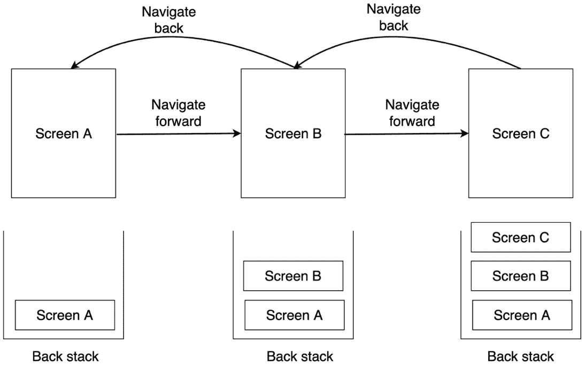

图 5.1 – 用户在应用程序内导航时屏幕的后台栈演变

在后台栈的顶部，您将始终有用户现在所在的当前屏幕。当导航回上一个屏幕时，后台栈的顶部将被弹出，就像我们在*图 5.1*中所做的那样，从*屏幕 C*导航到*屏幕 B*导致从后台栈中弹出*屏幕 C*。

所有这些操作始终在栈顶进行，而栈底将始终包含固定的起始目的地——在我们的案例中，*屏幕 A*。

导航组件负责在幕后为我们处理后台栈操作。

注意

最初，导航组件主要专注于在`Fragment`组件之间提供导航。如今，该库也支持 Compose 以及可组合函数之间的导航。

除了在 UI 导航方面遵循清晰的原则外，导航组件有三个主要组成部分：

+   **导航图**：与您应用程序内导航相关的核心信息源。在导航图中，您定义所有目的地以及用户在整个应用程序中可以采取的可能路径以完成不同的任务。

+   **NavHost**：一个容器可组合函数，将显示可组合目的地。随着用户在各个目的地之间导航，导航宿主的内容将被交换和重新组合。

+   当用户开始在屏幕之间导航时，`NavHost`作为导航开始。

现在，当您在基于 Compose 的 Android 应用中实现导航组件时，您将获得许多好处。以下列出了一些示例：

+   您无需处理在可组合函数之间导航的复杂性。库会为您自动处理。

+   您无需自己处理 *向上* 或 *返回* 操作。如果您按下系统的 **返回** 按钮，库将自动从返回栈中弹出当前目的地，并将用户发送到上一个目的地。

+   您可以从特定导航图或目的地受益于作用域内的 `ViewModel` 组件。这意味着用于可组合目的地的 `ViewModel` 实例将和可组合屏幕一样长时间存在。

+   您无需从头开始实现深链接。深链接允许您直接导航到应用程序中的特定目的地，而无需遍历到达那里的整个屏幕路径。我们将在本章的 *添加对深链接的支持* 部分中看到它们是如何工作的。

现在我们对使用 Jetpack Navigation 的元素和优势有了基本的了解，是时候创建一个新的屏幕，以便我们在餐厅应用中实现导航了。

# 创建新的基于 Compose 的屏幕

现实世界的应用程序需要显示大量内容，所以一个屏幕可能不够。到目前为止，我们的餐厅应用程序有一个简单的屏幕，显示我们从远程数据库接收到的所有餐厅。

让我们通过创建一个新的屏幕来练习我们迄今为止学到的所有技能，这个屏幕将显示特定餐厅的详细信息。计划是当用户在我们的 `RestaurantsScreen()` 可组合屏幕中的列表中点击某个特定餐厅时，我们应该带他们到一个新的详情屏幕，显示该特定餐厅的详细信息。

要在两个屏幕之间进行导航，我们首先需要构建第二个屏幕。与第一个可组合屏幕不同，现在是时候改变我们的策略，从上到下构建它。让我们首先通过定义网络请求，然后在它自己的 `ViewModel` 中执行它，最后创建一个将消费数据的可组合 UI，如下所示：

+   定义获取餐厅内容的 HTTP 请求

+   获取特定餐厅的内容

+   构建餐厅详情屏幕

让我们开始吧！

## 定义获取餐厅内容的 HTTP 请求

我们需要知道如何获取我们新的餐厅详情屏幕的数据。我们不想依赖于之前检索到的数据（餐厅列表），我们希望使我们的应用程序中的每个屏幕尽可能独立。这样，我们设计应用程序以轻松支持深链接，并更好地保护自己免受系统启动的进程死亡等事件的影响。

正因如此，我们将构建这个新的屏幕，使其有自己的内容。换句话说，在新屏幕中，我们将从我们获取餐厅列表的同一数据库中获取特定餐厅的详细信息。但我们如何做到这一点呢？

记住，我们 Firebase 数据库中的餐厅有一个唯一的`Integer`标识字段，称为`r_id`，如下截图所示：

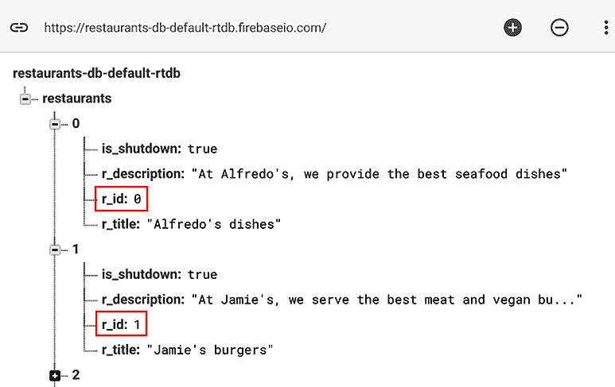

图 5.2 – 识别 Firebase 中餐厅的唯一标识字段

我们可以使用此字段来获取一个特定餐厅的详细信息。由于`r_id`映射到`Restaurant`对象的`id: Int`字段，这意味着当用户在我们的`RestaurantsScreen`可组合组件上点击餐厅时，我们可以将`id`值传递到第二个屏幕。

在第二屏中，我们将向我们的 Firebase REST API 执行一个 API 请求，并传递我们应用中对应远程数据库中餐厅`r_id`标识符的唯一 ID 的餐厅 ID 值。

Firebase REST API 为我们处理此类情况。如果我们想获取餐厅 JSON 内容中一个元素的详细信息，我们必须将两个查询参数附加到用于检索整个餐厅列表的相同 URL：

+   使用`orderBy=r_id`来指示 Firebase 根据其`r_id`字段过滤元素。

+   使用`equalTo=2`让 Firebase 知道我们正在寻找的餐厅元素的`r_id`字段值 – 在这种情况下是`2`。

为了练习，在您的浏览器地址栏中放置您到目前为止用于获取餐厅的 Firebase URL，并附加以下两个查询参数：

```kt
https://restaurants-db-default-rtdb.firebaseio.com/restaurants.json?orderBy="r_id"&equalTo=2
```

如果您访问您的链接，不幸的是，响应将如下所示：

```kt
{ "error" : "Index not defined, add \".indexOn\": \"r_id\", for path \"/restaurants\", to the rules" }
```

为了让我们能够获取列表中单个元素的详细信息，Firebase 需要一些额外的配置，所以现在让我们来做这件事：

1.  导航到您的 Firebase 控制台，通过访问此链接登录您的 Google 账户：[`console.firebase.google.com/`](https://console.firebase.google.com/)。

1.  从 Firebase 项目列表中选择您之前创建的用于存储餐厅的项目。

1.  在左侧菜单中，展开**构建**选项卡，搜索**实时数据库**，然后选择它。

1.  离开预先选择的**数据**选项卡，并选择**规则**选项卡。

1.  我们需要允许 Firebase 根据其`r_id`字段索引餐厅，因此更新写入规则如下：

    ```kt
    {
        "rules": {
            ".read": "true",
            ".write": "true",
            "restaurants": {
              ".indexOn": ["r_id"]
             }
        }
    }
    ```

通过这样做，我们已指示 Firebase，位于`restaurants`节点处的 JSON 数组内容可以被索引并单独访问。

1.  现在，再次尝试使用具有`id`字段值为`2`的餐厅的详细信息访问 URL：

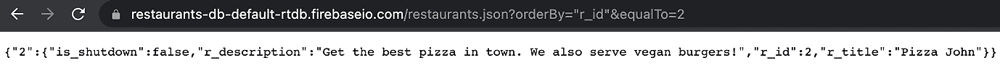

图 5.3 – 获取 Firebase 对一个餐厅 JSON 对象的响应

注意：

为了在浏览器中以更可读的方式查看 JSON 响应的结构，你可以在请求 URL 的末尾添加`&print=pretty`查询参数。

成功！我们已经获取了具有`r_id`字段值为`2`的餐厅的详细信息。

现在，让我们在我们的应用程序中实现这个请求：

1.  首先，在`RestaurantsApiService`接口内部，定义一个名为`getRestaurant()`的`suspend`函数，它将作为另一个`@GET` HTTP 方法，用于获取一个餐厅的详细信息：

    ```kt
    interface RestaurantsApiService {
        […]
        @GET("restaurants.json?orderBy=\"r_id\"")
        suspend fun getRestaurant(
          @Query("equalTo") id: Int): Unit
    }
    ```

让我们分解一下我们刚刚添加到第二个 HTTP 方法中的代码：

+   由该方法定义的 HTTP 调用是一个异步任务，需要一些时间才能完成，因此我们通过添加`suspend`关键字将方法标记为挂起函数。

+   在`@GET`注解内部，我们不仅指定了想要访问`restaurants.json` JSON 内容，这次我们还硬编码了`orderBy`查询参数并指定了`r_id`值，以便通过它们的`r_id`键的值来过滤元素。

+   此方法接收一个基本参数 – `id: Int`，它代表与数据库中`r_id`字段对应的餐厅的唯一 ID。为了告诉 Retrofit 此方法参数是所需 HTTP 调用中的查询参数，我们用`@Query`注解了它，并传递了`"equalTo"`值。

然而，我们由`getRestaurant()`方法定义的 HTTP 调用缺少一个关键的部分：响应类型。我们已经将`Unit`设置为响应类型，但我们需要接收一个合适的响应对象。为了了解我们期望的内容，让我们更仔细地查看我们在浏览器中之前收到的响应：

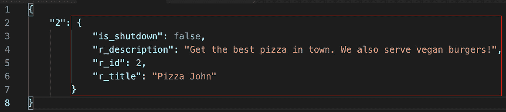

![图 5.4 –餐厅对象的 JSON 响应结构如果我们查看这些字段，`is_shutdown`、`r_description`、`r_id`和`r_title`，我们可以很容易地识别出响应 JSON 对象与我们在现有 HTTP 请求中接收到的所有餐厅的 JSON 对象相同。由于我们过去已经使用`@Serialized`注解将这样的 JSON 对象映射到我们的`Restaurant`数据类中，所以我们可以说我们的新`getRestaurant()` HTTP 调用将接收一个简单的`Restaurant`对象作为响应。我们不会离真理太远，但这个响应不会完全正确。如果我们更仔细地查看之前的 JSON 响应，我们会注意到餐厅 JSON 对象是一个值对象，对应于一个值为`2`的`String`键：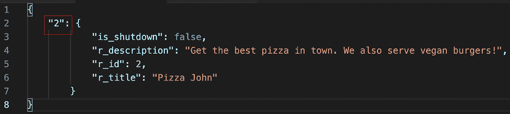

![图 5.5 –识别餐厅对象的键字段

这个键对应于 Firebase 生成的内部索引，它表示相应餐厅被添加到数据库中的顺序号。这种响应结构对于大多数 REST API 响应来说并不典型，但 Firebase 有一个怪癖，即在编译时未知的关键字中包装你的 JSON 对象。

1.  为了解决这个问题，在`RestaurantsApiService`接口内部，更新`getRestaurant()`方法以返回一个包含未知`String`键和`Restaurant`数据类型值的`Map`对象：

    ```kt
    interface RestaurantsApiService {
        …
        @GET("restaurants.json?orderBy=\"r_id\"")
        suspend fun getRestaurant(@Query("equalTo") id: Int)
          : Map<String, Restaurant>
    }
    ```

干得好！我们的应用程序已经准备好执行第二个网络请求，以获取特定餐厅的详细信息，所以现在是调用这个请求的时候了。

## 获取特定餐厅的内容

现在我们知道了如何获取特定餐厅的详细信息，现在是时候执行我们新定义的网络请求了。

我们现有的`RestaurantsScreen`可组合委托将请求显示必须显示的餐厅列表的责任委托给一个`ViewModel`类，因此让我们创建另一个`ViewModel`，以便我们的第二个屏幕也能做到同样的事情：

1.  通过左键单击应用程序包，将`RestaurantDetailsViewModel`作为名称，并选择**文件**作为类型来创建一个新文件。在新建的文件中，添加以下代码：

    ```kt
    class RestaurantDetailsViewModel(): ViewModel() {
        private var restInterface: RestaurantsApiService
        init {
            val retrofit: Retrofit = Retrofit.Builder()
                .addConverterFactory(GsonConverterFactory
                    .create())
                .baseUrl("your-firebase-base-url")
                .build()
            restInterface = retrofit.create(
                RestaurantsApiService::class.java)
        }
    }
    ```

在前面的代码片段中，我们创建了一个`ViewModel`类，在其中实例化了一个`RestaurantsApiService`类型的 Retrofit 客户端，就像我们在`RestaurantsViewModel`类中所做的那样。

初始化 Retrofit 客户端的代码确实在我们两个`ViewModel`类中都重复了，但不用担心，因为您将在*第九章*中修复它，*使用 Jetpack Hilt 实现依赖注入*。

注意

记得将您的 Firebase 数据库 URL 传递给`baseUrl()`方法。这个 URL 应该与`RestaurantsViewModel`类中使用的 URL 相同，并且应该对应于您的 Firebase 实时数据库项目。

1.  在新建的`ViewModel`中，创建一个`getRemoteRestaurant()`方法，该方法接收一个`id`参数，并负责执行网络请求以获取特定餐厅的详细信息：

    ```kt
    class RestaurantDetailsViewModel() : ViewModel() {
        private var restInterface: RestaurantsApiService
         init { […] }
        private suspend fun getRemoteRestaurant(id: Int):
                Restaurant {
            return withContext(Dispatchers.IO) {
                val responseMap = restInterface
                    .getRestaurant(id)
                return@withContext responseMap.values.first()
            }
        }
    }
    ```

让我们分解`getRemoteRestaurant()`方法内部发生的事情：

+   它接收一个`id`参数，对应于我们需要详细信息的餐厅，并返回特定的`Restaurant`对象。

+   由于执行网络请求的工作是会阻塞主线程的挂起工作，因此该方法被标记为`suspend`关键字。

+   它被包裹在一个指定了`Dispatchers.IO`调度器的`withContext()`块中，因为挂起工作应该在专门的 IO 线程上运行。

+   它通过在`restInterface`上调用`getRestaurant()`挂起函数并传递特定餐厅的`id`来执行网络请求以获取餐厅的详细信息。

+   最后，它从 REST API 获取`Map<String, Restaurant>`。为了解包并获取餐厅，我们调用`Map`的`values()`函数，并使用`.first()`扩展函数获取第一个`Restaurant`对象。

注意：

在 `Map` 的 `values()` 函数返回的 `Collection<Restaurant>` 对象上调用 `first()` 扩展函数。使用这个扩展函数，我们正在获取第一个元素，即我们感兴趣的 `Restaurant` 对象。然而，如果由于某种原因查询了一个不存在的餐厅，`first()` 扩展函数可能会抛出 `NoSuchElementException`。在生产环境中，你也应该通过捕获此类异常来处理这种情况。

1.  由于 `RestaurantDetailsViewModel` 将持有餐厅详情屏幕的状态，添加一个 `MutableState` 对象来持有 `Restaurant` 对象，并用 `null` 值初始化它，直到我们完成检索它的网络请求：

    ```kt
    class RestaurantDetailsViewModel(): ViewModel() {
        private var restInterface: RestaurantsApiService
        val state = mutableStateOf<Restaurant?>(null)
         […]
    }
    ```

1.  在 `RestaurantDetailsViewModel` 的 `init` 块中，在 Retrofit 客户端实例化之后，使用 `viewModelScope` 构建器启动一个协程：

    ```kt
    init {
        […]
    restInterface = retrofit.create(…)
        viewModelScope.launch {
            val restaurant = getRemoteRestaurant(2)
            state.value = restaurant
        }
    }
    ```

我们需要启动一个协程，因为从我们的远程 Firebase API 获取 `Restaurant` 对象的任务可能会阻塞主线程。我们使用了内置的 `viewModelScope` 协程构建器来确保启动的协程将像 `RestaurantDetailsViewModel` 实例一样长时间存在。在协程内部，我们做了以下操作：

1.  我们首先调用了挂起函数 `getRemoteRestaurants()` 并将硬编码的值 `2` 作为餐厅的 `id` 传递。此时，`RestaurantsViewModel` 还不知道它正在寻找的餐厅的 `id` 是什么——我们将在执行导航时很快解决这个问题。

1.  我们将获取到的 `Restaurant` 存储在 `restaurant` 变量中，并将其传递给 `RestaurantDetailsViewModel` 类的 `state` 变量，以便 UI 将使用新接收到的餐厅内容重新组合。

我们已执行网络请求以获取有关餐厅的详细信息，并准备了状态，以便基于 Compose 的屏幕可以显示其内容。接下来，让我们构建新的屏幕。

## 构建“餐厅详情”屏幕

我们需要创建一个新的可组合屏幕，用于显示特定餐厅的详细信息：

1.  在应用程序包内创建一个名为 `RestaurantDetailsScreen` 的新文件，并创建一个 `RestaurantDetailsScreen` 可组合组件：

    ```kt
    @Composable
    fun RestaurantDetailsScreen() {
        val viewModel: RestaurantDetailsViewModel =         viewModel()
        val item = viewModel.state.value
        if (item != null) {
            // composables
        }
    }
    ```

在其中，我们实例化了其对应的 `ViewModel` 并访问了 `State` 对象，就像我们在之前的 `RestaurantsScreen` 可组合组件中所做的那样。`State` 对象持有 `Restaurant` 对象，我们将其存储在 `item` 变量中。如果 `item` 不是 `null`，我们将通过传递一个可组合层次结构来显示有关餐厅的详细信息。

1.  由于我们计划重用第一个屏幕中的一些可组合函数，请返回 `RestaurantsScreen.kt` 文件，并将 `RestaurantIcon` 和 `RestaurantDetails` 可组合组件标记为公共，以便通过移除它们的 `private` 关键字来使用。

1.  向`RestaurantDetails`可组合组件添加一个名为`horizontalAlignment`的新参数，并将其传递给列的`horizontalAlignment`参数：

    ```kt
    @Composable
    fun RestaurantDetails(
        … ,
        modifier: Modifier,
        horizontalAlignment: Alignment.Horizontal
                                        = Alignment.Start
    ) {
        Column(
            modifier = modifier,
            horizontalAlignment = horizontalAlignment
        ) { ... }
    }
    ```

通过这样做，我们可以控制`Column`子项的水平对齐方式，以便我们可以在新屏幕中更改此行为。由于我们希望`Column`默认将其子项水平向左对齐（这样在`RestaurantsScreen`可组合组件中的效果不会不同），因此我们将`Alignment.Start`作为默认值传递。

1.  在`RestaurantDetailsScreen`可组合组件内，添加一个包含`RestaurantIcon`、`RestaurantDetails`和`Text`可组合组件的`Column`实例，所有这些组件都垂直排列并水平居中：

    ```kt
    @Composable
    fun RestaurantDetailsScreen() {
        val viewModel: RestaurantDetailsViewModel = 
            viewModel()
        val item = viewModel.state.value
        if (item != null) {
            Column(
    horizontalAlignment = 
                    Alignment.CenterHorizontally,
    modifier = 
                    Modifier.fillMaxSize().padding(16.dp)
            ) {
                RestaurantIcon(
                    Icons.Filled.Place,
                    Modifier.padding(
    top = 32.dp, 
                        bottom = 32.dp
                    )
                )
                RestaurantDetails(
                    item.title,
                    item.description,
                    Modifier.padding(bottom = 32.dp),
                    Alignment.CenterHorizontally)
                Text("More info coming soon!")
            }
        }
    }
    ```

为了证明重用可组合组件有多简单，我们将第一个屏幕中使用的相同`RestaurantIcon`和`RestaurantDetails`可组合组件传递给了我们的`Column`。我们使用不同的`Modifier`对象配置了它们，并且还向之前添加的新对齐参数`RestaurantDetails`可组合组件传递了`Alignment.centerHorizontally`。

1.  为了测试一切是否正常工作，并且我们的新屏幕能够渲染具有`id`值为`2`的硬编码餐厅的详细信息，导航回`MainActivity`并在`setContent`方法内，将`RestaurantsScreen`可组合组件替换为`RestaurantDetailsScreen`：

    ```kt
    setContent {
    RestaurantsAppTheme {
            //RestaurantsScreen()
            RestaurantDetailsScreen()
        }
    }
    ```

1.  运行应用程序，我们得到以下截图：

![图 5.6 – 显示 RestaurantDetailsScreen() 可组合组件

![图片 B17788_05_6.jpg]

图 5.6 – 显示 RestaurantDetailsScreen() 可组合组件

太棒了！我们现在已经创建了第二个屏幕，即餐厅详情屏幕。我们现在可以开始考虑两个屏幕之间的导航。

# 使用 Jetpack 导航实现导航

应用程序内的导航表示那些允许用户在几个屏幕之间导航来回的交互。

在我们的餐厅应用程序中，我们现在有两个屏幕，我们想要从第一个屏幕导航到第二个屏幕。在第一个屏幕中，我们显示餐厅列表，当用户按下列表中的某个餐厅项时，我们希望将他们带到第二个屏幕，即详情屏幕：

![图 5.7 – 从列表屏幕导航到详情屏幕

![图片 B17788_05_7.jpg]

![图 5.7 – 从列表屏幕导航到详情屏幕

基本上，我们想要执行一个简单的导航操作，从`RestaurantsScreen`可组合组件导航到`RestaurantDetailsScreen`可组合组件。为了实现简单的导航操作，我们需要实现一个导航库，这个库不仅允许我们从第一个屏幕切换到第二个屏幕，而且还应该允许我们通过按下**返回**按钮返回上一个屏幕。

如我们所知，Jetpack 导航组件会帮助我们解决问题，因为它将帮助我们实现这种行为！让我们从以下步骤开始：

1.  在应用模块中的`build.gradle`文件内，在依赖项块内添加对包含 Compose 的导航组件的依赖项：

    ```kt
    implementation "androidx.navigation:navigation-compose:2.4.2"
    ```

在更新 `build.gradle` 文件后，请确保将项目与其 Gradle 文件同步。您可以通过点击 **文件** 菜单选项，然后选择 **与 Gradle 文件同步项目** 来完成此操作。

1.  在 `MainActivity` 类中，创建一个新的空组合函数，名为 `RestaurantsApp()`：

    ```kt
    @Composable
    private fun RestaurantsApp() {
    }
    ```

此组合函数将作为我们餐厅应用程序的父组合函数。在这里，将定义应用程序的所有屏幕。

1.  在 `onCreate()` 方法中，将传递给 `setContent` 方法的 `RestaurantsDetailsScreen()` 组合可替换为 `RestaurantsApp()` 组合可：

    ```kt
    setContent {
        RestaurantsAppTheme {
            RestaurantsApp()
        }
    }
    ```

1.  在 `RestaurantsApp()` 组合函数内部，通过 `rememberNavController()` 方法实例化 `NavController`：

    ```kt
    @Composable
    private fun RestaurantsApp() {
        val navController = rememberNavController()
    }
    ```

`NavController` 对象处理组合屏幕之间的导航 – 它在组合目的地的回退栈上操作。这意味着在重新组合之间，它必须保持导航栈的当前状态。为了实现这一点，它必须是一个有状态的对象 – 这就是为什么我们使用了 `rememberNavController` 语法，这与我们在定义 `State` 对象时使用的 `remember` 块类似。

1.  接下来，我们需要创建一个将显示组合目的地的 `NavHost` 容器组合可。每次在组合可之间完成导航操作时，`NavHost` 内的内容会自动重新组合。

添加一个 `NavHost` 组合可，并将之前创建的 `NavController` 实例以及一个空的 `String` 传递给 `startDestination` 参数：

```kt
import androidx.navigation.compose.NavHost
[…]
@Composable
private fun RestaurantsApp() {
    val navController = rememberNavController()
    NavHost(navController, startDestination = "") {
    }
}
```

在其他参数中，`NavHost` 指定了三个强制参数：

+   一个与单个 `NavHost` 组合可关联的 `navController: NavHostController` 对象。`NavHost` 将 `NavController` 与定义应用程序可能目的地的导航图连接起来。在我们的例子中，我们将 `navController` 变量传递给了这个参数。

+   一个 `startDestination: String` 对象，它定义了入口点 `String`，它定义了到达特定目的地（组合屏幕）的路径。每个目的地都应该有一个唯一的路由。在我们的例子中，因为我们还没有定义任何路由，所以我们已将一个空的 `String` 传递给 `startDestination`。

+   `builder: NavGraphBuilder.() -> Unit` 后置 lambda 参数，它使用了来自导航 Kotlin DSL 的 lambda 语法（就像 `LazyColumn` 或 `LazyRow` 使用它们自己的 DSL 一样）来构建导航图。在这里，我们应该定义路由并设置相应的组合可，但到目前为止，我们已将一个空的 `{ }` 函数设置到后置 lambda 参数中。

1.  要构建导航图，我们必须使用 `builder` 参数，而不是只传递一个空函数，在它内部，我们需要开始添加指定组合目的地的路由。

要做到这一点，请使用名为 `composable()` 的 DSL 函数，您可以为 `route` 参数提供一个路由字符串，并将对应于所需目的地的可组合函数传递给尾随的 lambda `content` 参数：

```kt
@Composable
private fun RestaurantsApp() {
    val navController = rememberNavController()
    NavHost(
        navController,
        startDestination = "restaurants"
 ) {
        composable(route = "restaurants") {
            RestaurantsScreen()
        }
    }
}
```

通过 `composable()` DSL 函数，我们创建了一个导航到 `RestaurantsScreen()` 可组合组件的 `"restaurants"` 值的路由。

此外，我们将相同的路由传递给 `NavHost` 的 `startDestination` 参数，从而使我们的 `RestaurantsScreen()` 可组合组件成为我们应用程序的唯一入口点。

1.  通过在导航图构建器内部再次调用 `composable()` DSL 函数，添加另一个指向 `RestaurantDetailsScreen()` 目标的路由，并且通过附加 `{restaurant_id}` 参数占位符从 `"restaurants"` 路由派生：

    ```kt
    NavHost(navController, startDestination = "...") {
    composable(route = "restaurants") { … }
    composable(route = "restaurants/{restaurant_id}") { 
            RestaurantDetailsScreen()
        }
    }
    ```

我们希望从 `"restaurants"` 路由导航到指向 `RestaurantDetailsSreen()` 可组合组件的新路由，因此 `{restaurant_id}` 占位符将取我们试图导航的餐厅的 `id` 值。

在实践中，此路由从 `"restaurants"` 路由分支出来，并且虽然其结构类似于 URL（因为 `""/` 元素分隔了新的路径），但我们可以这样说，此路由可以具有多个值，具体取决于我们想要导航到的餐厅的 `id`。例如，此路由在运行时可以具有 `"restaurants/0"` 或 `"restaurants/2"` 等值。

1.  在导航图中，我们已经定义了路由及其对应的目标，但我们还没有真正执行两个屏幕之间的实际导航。为此，我们首先需要一个触发器或回调来通知我们用户在餐厅列表中点击了餐厅项，这样我们就可以导航到餐厅详情屏幕。

在 `RestaurantsScreen.kt` 文件内部，修改 `RestaurantItem` 可组合组件以公开一个提供被点击餐厅 `id` 的 `onItemClick` 回调函数，并在整个餐厅的 `Card` 被按下时调用它：

```kt
@Composable
fun RestaurantItem(item: Restaurant,
                   onClick: (id: Int) -> Unit, 
                   onItemClick: (id: Int) -> Unit) {
    val icon = …
    Card(elevation = 4.dp,
         modifier = Modifier
            .padding(8.dp)
            .clickable { onItemClick(item.id) }) { … }
}
```

1.  为了避免混淆，通过将旧的 `onClick` 参数重命名为更具说明性的名称，如 `onFavoriteClick` 来重构 `RestaurantItem` 可组合组件：

    ```kt
    @Composable
    fun RestaurantItem(item: Restaurant,
                       onFavoriteClick: (id: Int) -> Unit, 
                       onItemClick: (id: Int) -> Unit) {
        val icon = …
        Card(…) {
            Row(…) {
                …
                RestaurantIcon(icon, Modifier.weight(0.15f)) 
                {
                    onFavoriteClick(item.id)
                }
            }
        }
    }
    ```

1.  在 `RestaurantsScreen()` 可组合组件内部，添加一个类似的 `onItemClick` 回调函数作为参数，并在 `onItemClick` 回调来自 `RestaurantItem` 可组合组件时调用它：

    ```kt
    @Composable
    fun RestaurantsScreen(onItemClick: (id: Int) -> Unit = { }) {
        val viewModel: RestaurantsViewModel = viewModel()
        LazyColumn(...) {
            items(viewModel.state.value) { restaurant ->
                RestaurantItem(
                    restaurant,
                    onFavoriteClick =
                      { id -> viewModel.toggleFavorite(id) },
                    onItemClick = { id -> onItemClick(id) })
            }
        }
    }
    ```

此外，我们将 `RestaurantItem` 可组合调用中的 `onClick` 参数名称更改为与其签名更匹配的名称，例如 `onFavoriteClick`。

我们本质上是在通过从子可组合组件到父可组合组件的回调来传播事件。

1.  在 `NavHost` 内部，更新 `RestaurantsScreen()` 可组合目标以监听导航回调，然后在回调内部，通过调用 `navigate()` 方法来触发可组合组件之间的导航，该方法期望 `route` 作为参数：

    ```kt
    @Composable
    private fun RestaurantsApp() {
        val navController = rememberNavController()
        NavHost(navController, startDestination = "...") {
            composable(route = "restaurants") {
                RestaurantsScreen { id ->
                    navController.navigate("restaurants/$id")
                }
            }
            composable(
                route = "restaurants/{restaurant_id}"
            ) {
                RestaurantDetailsScreen()
            }
        }
    }
    ```

在`RestaurantsScreen`的新尾随 lambda 函数中，我们现在接收需要导航到的餐厅的`id`值。为了触发导航，我们调用了`navigate()`方法，并将其`route`参数传递为`"restaurants/$id"`字符串，以匹配我们其他可组合目标`RestaurantDetailsScreen()`的路线。

1.  尝试运行应用程序并验证以下内容。

当应用启动时，`RestaurantsScreen()`可组合组件被组合并显示。换句话说，你处于`"restaurants"`路由，因为我们已经将此路由设置为导航图的`startDestination`。在导航回退栈中，此目标将被添加：

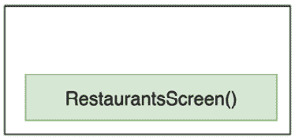

图 5.8 – 包含起始目标的回退栈

当点击列表中的某个餐厅时，会触发导航，并到达`RestaurantDetailsScreen()`可组合目标。在导航回退栈顶部，此目标将被添加：

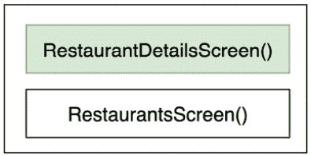

图 5.9 – 导航到另一个目标后的回退栈

当点击系统的`RestaurantDetailsScreen()`目标时，你将被发送回回退栈中的现有目标，即`RestaurantsScreen()`。这意味着在回退栈中，顶部目标将被弹出，只剩下根目标：

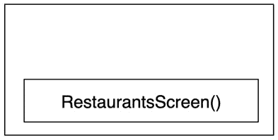

图 5.10 – 返回起始目标后的回退栈

导航是有效的，但如果你注意到了，它总是指向同一个餐厅。这有两个原因：

+   虽然我们在指向`RestaurantDetailsScreen()`的路线中定义了`{restaurant_id}`占位符参数，但我们没有在`composable()`函数内部将其定义为导航参数，因此导航组件不知道如何将其发送到路线的可组合目标。

+   在`RestaurantDetailsViewModel`中，我们硬编码了餐厅的 id 为值`2`。

我们希望用户能够看到被点击的餐厅的详细信息，所以让我们修复这些问题，并动态地传递餐厅的 ID。

1.  对于`RestaurantDetailsScreen()`目标，除了`route`之外，还需要添加一个期望接收`NamedNavArgument`对象列表的`arguments`参数，并使用`navArgument`函数传递这样的参数：

    ```kt
    NavHost(navController, startDestination = "..."){
        composable(route = "restaurants") { … }
        composable(
            route = "restaurants/{restaurant_id}",
            arguments =
                listOf(navArgument("restaurant_id") {
                    type = NavType.IntType
                })
        ) { RestaurantDetailsScreen() }
    }
    ```

此参数指定了我们在`route`中添加的相同的`"restaurant_id"`键，这允许 Navigation 库将此参数暴露给目标可组合组件。此外，`navArgument`函数暴露了`NavArgumentBuilder`，我们在其中指定了参数的类型为`IntType`。

要在`RestaurantDetailsScreen()`目标内部获取参数的值，`composable()` DSL 函数暴露了一个`NavBackStackEntry`对象，允许我们按以下方式获取值：

```kt
composable(…) { navStackEntry ->
    val id =
        navStackEntry.arguments?.getInt("restaurant_id")
    RestaurantDetailsScreen() 
}
```

然而，我们的 `RestaurantDetailsScreen()` 目标不期望餐厅的 `id`，但 `RestaurantDetailsViewModel` 需要，所以我们不会执行之前访问 `navStackEntry` 的更改；相反，我们将在 `ViewModel` 中尽快进行类似的操作。

1.  在幕后，导航组件将存储在 `NavStackEntry` 中的导航参数保存到 `SavedStateHandle` 中，这是我们的 VM 暴露的。这意味着我们可以利用这一点，而不是在 `RestaurantDetailsScreen()` 可组合函数内部获取餐厅的 ID，我们可以在 `RestaurantDetailsViewModel` 中直接获取它。

首先，将 `SavedStateHandle` 参数添加到 `RestaurantDetailsViewModel` 构造函数中，就像我们在 `RestaurantsViewModel` 中做的那样：

```kt
class RestaurantDetailsViewModel(
    private val stateHandle: SavedStateHandle
) : ViewModel() {
    […]
    init { […]  }
    private suspend fun getRemoteRestaurant(id: Int) {
        […]
    }
}
```

1.  在 `ViewModel` 的 `init { }` 块中，在实例化 Retrofit 客户端下方，将餐厅的 ID 存储在一个新的 `id` 变量中，同时从 `SavedStateHandle` 对象中动态获取它，然后将它传递给 `getRemoteRestaurant()` 方法调用：

    ```kt
    class RestaurantDetailsViewModel(private val stateHandle: SavedStateHandle): ViewModel() {
        …
        init {
            val retrofit: Retrofit = Retrofit[…].build()
            restInterface = […]
            val id = stateHandle.get<Int>("restaurant_id") 
                ?: 0
            viewModelScope.launch {
                val restaurant = getRemoteRestaurant(id)
                state.value = restaurant
            }
        }
        …
    }
    ```

我们已指示 `navArgument` 该参数的类型为 `Int`，因此我们从 `stateHandle` 中获取它作为 `Int` 值，并传递了相同的 `"restaurant_id"` 键，我们曾用它来定义 `navArgument`。

这种方法还可以保护我们免受系统引起的进程死亡场景。用户可以导航到具有 `id` 值为 `2` 的餐厅的 `RestaurantDetailsScreen()` 目标，然后暂时最小化应用。在此期间，系统可能会决定杀死应用进程以释放内存，因此当用户恢复应用时，系统会将其恢复，并为我们提供一个包含具有 `2` 值的餐厅 ID 的 `SavedStateHandle` 对象。

总之，应用将知道获取用户最初导航到的餐厅的详细信息，因此应用对于这种边缘情况的行为是正确的。

1.  再次运行应用，并验证这次当在 `RestaurantsScreen()` 起始目标中点击一个餐厅项时，该餐厅的详细信息将在第二个目标 `RestaurantDetailsScreen()` 中显示。

    注意

    我们使用了具有可组合函数目标的导航组件。在这些可组合函数内部，我们实例化 `ViewModel` 对象。由于这些可组合函数位于目标的后退栈中，它们的 `ViewModel` 对象的范围限定在可组合函数的生命周期内。换句话说，随着导航组件的添加，`ViewModel` 对象的生命周期与它们附加的可组合屏幕相同。

完美！现在我们的餐厅应用有两个屏幕，用户可以在点击列表中的任何餐厅时在这些屏幕之间导航。是时候探索另一种导航事件了。

# 添加对深度链接的支持

**深度链接**允许您将用户重定向到应用程序的特定部分，而无需他们通过所有中间屏幕。这种技术对于营销活动特别有用，因为它可以提高用户参与度，同时提供良好的用户体验。

深度链接通常包含在 URI 方案或自定义方案中。这允许您配置从图片广告、文本广告，甚至二维码，当点击或扫描时，会将其重定向到应用程序的特定页面。如果您的应用程序配置为知道如何处理此类方案，用户将能够使用您的应用程序打开该特定链接。

例如，假设对于我们的餐厅应用程序，我们启动一项营销活动，其中在互联网上包含一些展示一些特色餐厅的广告。我们配置广告使其可点击，并重定向到以下链接，其中包含广告餐厅的 ID，例如`2`：`https://www.restaurantsapp.details.com/2`。

当将此 URI 加载到浏览器应用程序中时（因为没有这样的网站），它将无法工作，但我们可以配置我们的应用程序以了解如何将其解释为深度链接。

当用户在搜索引擎中浏览并点击我们餐厅之一的活动广告时，应用程序应知道如何处理这些操作，并允许用户被重定向到我们的应用程序：

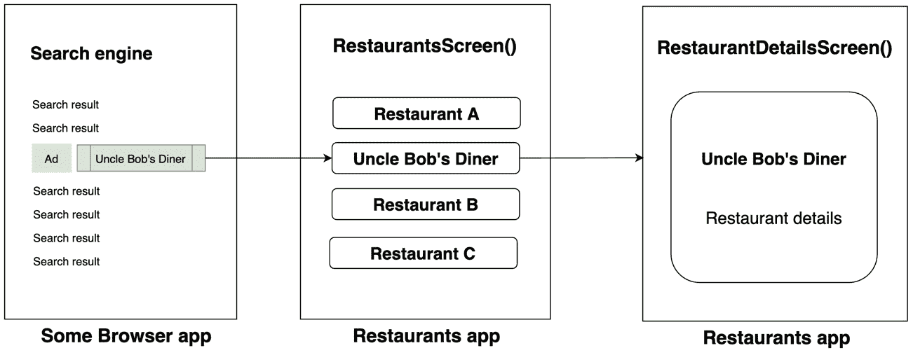

图 5.11 – 不高效的跳转到我们的餐厅应用程序

我们的应用程序以`RestaurantsScreen()`可组合组件作为起始目的地，因此用户应手动找到最初在广告中展示的餐厅，并点击它以导航到`RestaurantDetailsScreen()`目的地。

这显然是一种不良做法，因为我们不希望用户在我们的应用程序中进行手动导航以到达广告中的餐厅。想象一下，如果其他应用程序要求用户按照我们的应用程序那样通过一个或两个屏幕，而是更多屏幕进行导航——这将导致糟糕的用户体验，并且活动将无效。

然而，深度链接允许您自动将用户重定向到您希望的目的地：

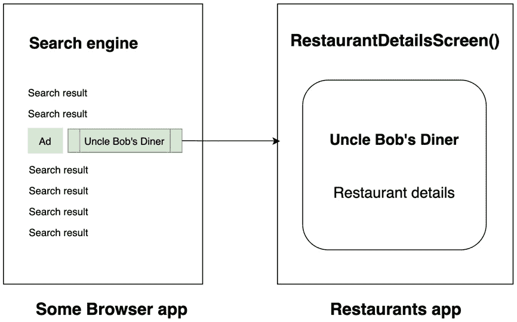

图 5.12 – 直接深度链接到感兴趣的屏幕

通过直接将用户重定向到感兴趣的屏幕，我们改善了用户体验，并期望我们的广告活动表现更好。

让我们借助导航组件库在我们的餐厅应用程序中实现这样的深度链接：

1.  在`RestaurantDetailsScreen()` DSL `composable()`函数内部，除了`route`和`arguments`之外，添加另一个名为`deepLinks`的参数，它期望一个`NavDeepLink`对象的列表，并使用`navDeepLink`函数传递这样的参数：

    ```kt
    NavHost(navController, startDestination = "restaurants")
    {
      composable(route = "restaurants") {…}
      composable(
        route = "restaurants/{restaurant_id}",
        arguments = listOf(
          navArgument("restaurant_id") {…}
        ),
        deepLinks = listOf(navDeepLink {
          uriPattern =
        "www.restaurantsapp.details.com/{restaurant_id}"
          })
         ) { RestaurantDetailsScreen() }
    }
    ```

`navDeepLink` 函数依次期望一个 `NavDeepLinkDslBuilder` 扩展函数，该函数暴露了自己的 DSL。我们已将 `uriPattern` DSL 变量设置为期望我们的自定义 URI `www.restaurantsapp.details.com`，同时添加了占位符 `"restaurant_id"` 参数，这将允许导航组件解析并提供我们从深度链接中获取的餐厅 ID。

目前，我们的应用程序知道如何处理深度链接，但仅限于内部。

1.  要使我们的深度链接对外可用，在 `AndroidManifest.xml` 文件中，在 `MainActivity` 的 `<activity>` 元素内添加以下 `<intent-filter>` 元素：

    ```kt
    <application … >
        <activity
            android:name=".MainActivity"
            […] >
            <intent-filter>
                <action android:name="[…].action.MAIN" />
                <category android:name="[…].LAUNCHER" />
            </intent-filter>
            <intent-filter>
              <data
                    android:host="www.restaurantsapp.
                        details.com"
                    android:scheme="https" />
              <action android:name="android.intent.
                  action.VIEW" />
              <category android:name="android.intent.
                  category.DEFAULT" />
              <category android:name="android.intent.
                  category.BROWSABLE" />
            </intent-filter>
        </activity>
    </application>
    ```

让我们分解一下新 `<intent-filter>` 元素中我们刚刚添加的内容：

+   一个指定以下内容的 `<data>` 元素：

+   `host` 参数作为我们在导航图中之前设置的深度链接 URI。这是我们广告应该链接到的 URI。

+   深度链接的 `scheme` 参数为 `https`。每个 `<data>` 元素都应该定义一个方案，以便识别 URI。

+   一个 `BROWSABLE` 类别的 `<category>` 元素，这是必需的，以便从网络浏览器应用中访问意图过滤器。

+   一个 `DEFAULT` 类别的 `<category>` 元素，使应用隐式拦截深度链接的意图。如果没有它，应用只能在深度链接意图指定了应用程序组件名称时启动。

要测试深度链接，我们需要模拟一个深度链接动作。让我们假设我们想测试一个指向 ID 值为 `2` 的餐厅的深度链接。深度链接看起来像这样：`https://www.restaurantsapp.details.com/2`。

由于我们没有任何指向我们的深度链接的广告，我们有两种选择：

+   使用此 URL 创建一个二维码，然后用我们的设备扫描它。

+   从命令行启动一个意图来模拟深度链接。

让我们选择第二种方案。

1.  构建项目并在模拟器或物理设备上运行应用程序。这一步是必要的，以便安装的应用程序知道如何响应我们的深度链接。

1.  关闭应用或将其最小化，但请确保您的模拟器或设备连接到 Android Studio。

1.  打开 Android Studio 中的终端，粘贴以下命令并输入：

    ```kt
    $ adb shell am start -W -a android.intent.action.VIEW -d "https://www.restaurantsapp.details.com/2"
    ```

1.  连接到 Android Studio 的模拟器/设备现在应该会提示一个歧义对话框，询问您想用哪个应用打开深度链接：

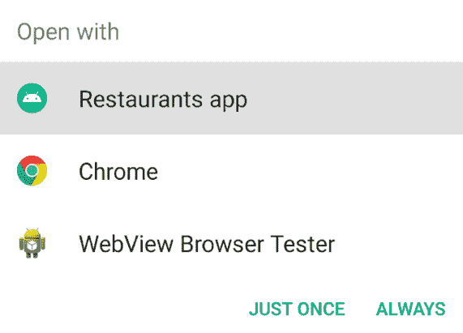

](img/B17788_05_13.jpg)

图 5.13 – 启动深度链接时显示的歧义对话框

我们的应用程序是那些应用程序之一，这意味着它已经被正确配置为拦截我们的深度链接。

1.  选择 `RestaurantDetailsScreen()` 目标并显示所需餐厅的详细信息。

可选地，您可以尝试按系统中的 `RestaurantsScreen` 组合式。

现在我们已经成功地将深度链接功能添加到我们的餐厅应用中，是时候结束这一章了。

# 摘要

在本章中，我们学习了如何在餐厅应用内部导航屏幕。我们借助 Jetpack Navigation 组件库轻松地做到了这一点。

我们从学习 Jetpack Navigation 库的基础知识开始，并了解到在处理导航回退栈时生活变得多么简单。之后，我们创建了一个新的屏幕，实现了 Navigation 库，并探索了在可组合组件之间添加导航的流畅性。最后，我们添加了对深度链接的支持，并确保在我们的应用中测试了这样的深度链接。

接下来，是时候专注于提升我们餐厅应用的质量和架构了。
