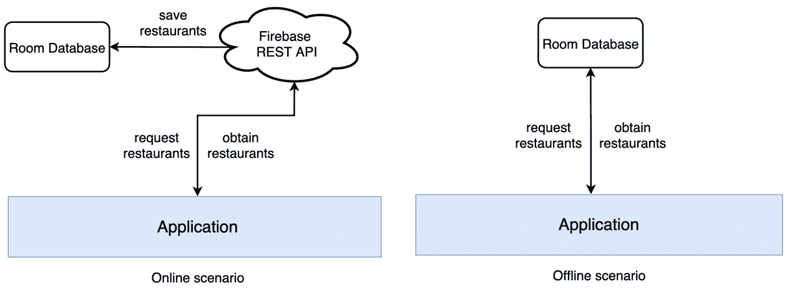
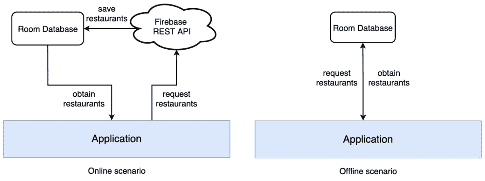

# 第六章：*第六章*：使用 Jetpack Room 添加离线功能

在本章中，我们将从确保我们的应用程序可以在没有互联网连接的情况下使用开始，从而探索构建应用程序架构的方法。

在 *介绍 Jetpack Room* 部分，我们将简要介绍 Android 上的各种缓存机制。然后，我们将介绍 Jetpack Room 库及其核心元素。

接下来，在 *通过实现 Room 启用离线使用* 部分，我们将在我们的餐馆应用程序中实现 Room，并允许用户在没有互联网连接的情况下使用应用程序。在 *将部分更新应用于 Room 数据库* 部分，我们将学习如何部分更新 Room 内部的数据，以便我们可以保存诸如用户是否喜欢餐馆之类的选择。

最后，在 *将本地数据作为应用程序内容的单一事实来源* 部分，我们将了解为什么拥有应用程序数据的单一事实来源是有益的，然后我们将设置 Room 数据库作为我们应用程序的单一内容来源。

总结来说，在本章中，我们将涵盖以下主要主题：

+   介绍 Jetpack Room

+   通过实现 Room 启用离线使用

+   将部分更新应用于 Room 数据库

+   将本地数据作为应用程序内容的单一事实来源

在深入之前，让我们为本章设置技术要求。

# 技术要求

通常，使用 Jetpack Room 构建 Compose 基础的 Android 项目需要您的日常工具。然而，为了顺利地跟随示例，请确保您有以下内容：

+   Arctic Fox 2020.3.1 版本的 Android Studio。您也可以使用更新的 Android Studio 版本或甚至 Canary 构建，但请注意，IDE 界面和其他生成的代码文件可能与本书中使用的不同。

+   安装在 Android Studio 中的 Kotlin 1.6.10 或更新的插件

+   上一章的餐馆应用程序代码。

+   对 SQL 数据库和查询的最低了解

本章的起点是上一章开发的餐馆应用程序。如果您没有遵循上一章中描述的实现，请通过导航到存储库的 `Chapter_05` 目录来访问本章的起始代码。然后，导入名为 `chapter_5_restaurants_app` 的 Android 项目。

要访问本章的解决方案代码，请导航到 `Chapter_06` 目录：

[`github.com/PacktPublishing/Kickstart-Modern-Android-Development-with-Jetpack-and-Kotlin/tree/main/Chapter_06/chapter_6_restaurants_app`](https://github.com/PacktPublishing/Kickstart-Modern-Android-Development-with-Jetpack-and-Kotlin/tree/main/Chapter_06/chapter_6_restaurants_app).

# 介绍 Jetpack Room

现代应用应在任何条件下都可用，包括当用户没有互联网连接时。这允许应用在用户的设备无法访问网络的情况下提供无缝的用户体验和可用性。

在本节中，我们将讨论以下内容：

+   探索 Android 上的缓存机制

+   介绍 Jetpack Room 作为本地缓存的解决方案

那么，让我们开始吧！

## 探索 Android 上的缓存机制

为了缓存特定内容或应用数据，可靠的 Android 应用会使用适合不同用例的各种离线缓存机制：

+   共享首选项用于存储轻量级数据（例如与用户相关的选择）作为键值对。这个选项不应该用来存储应用内容的一部分对象。

+   设备存储（无论是内部还是外部）用于存储重量级数据（例如文件、图片等）。

+   SQLite 数据库用于在私有数据库中以结构化方式存储应用内容。**SQLite** 是一个开源的 SQL 数据库，它将数据存储在私有文本文件中。

在本章中，我们将专注于学习如何在 SQLite 数据库中缓存结构化内容（通常是 Kotlin `data class` 对象持有的内容）。这样，我们允许用户在离线状态下浏览应用的数据。

注意

Android 内置了 SQLite 数据库实现，允许我们保存结构化数据。

在我们的应用中，我们可以将餐厅数组视为一个完美的候选者，可以在 SQLite 数据库中保存的应用内容。由于数据是有结构的，使用 SQLite，我们能够执行不同的操作，例如在数据库中搜索餐厅、更新特定餐厅等。

通过这种方式缓存应用内容，我们可以允许用户在离线状态下浏览应用的餐厅。然而，为了使这一功能正常工作，用户需要之前使用活跃的互联网连接打开过应用，从而允许应用缓存内容以供未来的离线使用。

现在，为了将餐厅保存到 SQLite 私有数据库，我们需要使用 SQLite API。这些 API 功能强大。然而，使用它们时，你会面临相当多的缺点：

+   API 是低级别的，相对难以使用。

+   SQLite API 不提供 SQL 查询的编译时验证，这可能导致不希望的运行时错误。

+   创建数据库、执行 SQL 查询等操作涉及大量的模板代码。

为了减轻这些问题，Google 提供了 Jetpack Room 库。这个库不过是一个包装库，它简化了我们访问和交互 SQLite 数据库的方式。

## 介绍 Jetpack Room 作为本地缓存的解决方案

**Room** 是一个持久化库，它被定义为 SQLite 之上的抽象层，提供了简化的数据库访问，同时利用了 SQLite API 的强大功能。

与使用原始 SQLite API 相比，Room 抽象了与 SQLite 一起工作的大部分复杂性。该库消除了在 Android 上设置和与 SQLite 数据库交互所需的大部分不愉快的样板代码，同时提供了 SQL 查询的编译时检查。

要使用 Room 库并使用其 API 缓存内容，您需要定义三个主要组件：

+   `Restaurant` 数据类作为一个实体。这意味着我们将有一个包含 `Restaurant` 对象的表。换句话说，表的行由我们的餐厅实例表示。

+   一个将包含并公开实际数据库的数据库类。

+   **数据访问对象（DAOs**）代表一个接口。这允许我们获取、插入、删除或更新数据库中的实际内容。

数据库类为我们提供了与 SQLite 数据库关联的 DAO 接口的引用：


图 6.1 – 应用程序与 Room 数据库之间的交互

如前所述，我们可以使用 DAO 以实体对象的形式从数据库检索或更新数据 – 在我们的案例中，实体是餐厅，因此我们将对这些餐厅对象执行此类操作。

现在我们已经基本了解了 Room 的工作原理以及我们如何与之交互，是时候亲自看到它的实际应用并在我们餐厅应用中实现 Room 了。

# 通过实现 Room 启用离线使用

我们希望将我们从 Firebase 数据库接收到的所有餐厅本地缓存。由于此内容是有结构的，我们希望使用 Room 来帮助我们完成这项任务。

实质上，我们试图在用户在线浏览我们的餐厅应用时挽救餐厅。然后，当用户离线浏览应用时，我们将重新使用它们：



图 6.2 – 餐厅应用的数据检索，具有两个数据源

当在线时，我们从我们的网络 API 获取餐厅。在向用户显示之前，首先，我们将它们缓存到 Room 数据库中。如果离线，我们将从 Room 数据库中检索餐厅并向用户显示。

实质上，我们正在为我们的应用创建两个数据源：

+   用户在线时的远程 API

+   用户离线时的本地 Room 数据库

在下一节中，我们将讨论为什么这种方法并不理想。然而，在此之前，我们对于能够在离线状态下使用应用的事实感到满意。

让我们开始实现 Room，然后让我们缓存那些餐厅！执行以下步骤：

1.  在应用模块的 `build.gradle` 文件中，在 `dependencies` 块内添加 Room 的依赖项：

    ```java
    implementation "androidx.room:room-runtime:2.4.2"
    kapt "androidx.room:room-compiler:2.4.2"
    implementation "androidx.room:room-ktx:2.4.2"
    ```

1.  当您仍在 `build.gradle` 文件中时，在 `plugins` 块内添加 Room 的 `kotlin-kapt` 插件：

    ```java
    plugins {
        id 'com.android.application'
        id 'kotlin-android'
        id 'kotlin-kapt'
    }
    ```

`kapt`插件代表**Kotlin 注解处理工具**。这允许 Room 在编译时生成注解代码，同时将大部分相关复杂性隐藏起来。

在更新`build.gradle`文件后，请确保将您的项目与其 Gradle 文件同步。您可以通过点击**文件**菜单选项，然后选择**同步项目与 Gradle 文件**来完成此操作。

1.  由于我们想在本地数据库中存储餐厅对象，让我们指示 Room，`Restaurant`数据类是一个必须保存的实体。进入`Restaurant.kt`文件，并在类声明上方添加`@Entity`注解：

    ```java
    @Entity(tableName = "restaurants")
    data class Restaurant(…)
    ```

在`@Entity`注解内部，我们通过`tableName`参数传递了表的名称。我们将使用此名称进行查询。

1.  现在，Room 将创建一个以`Restaurant`对象为行的表，是时候定义实体的列（或字段）了。当我们在`Restaurant.kt`类内部时，让我们在每个我们感兴趣的、应该代表列的字段上添加`@ColumnInfo`注解：

    ```java
    @Entity(tableName = "restaurants")
    data class Restaurant(
        @ColumnInfo(name = "r_id")
        @SerializedName("r_id")
        val id: Int,
        @ColumnInfo(name = "r_title")
        @SerializedName("r_title")
        val title: String,
        @ColumnInfo(name = "r_description")
        @SerializedName("r_description")
        val description: String,
        var isFavorite: Boolean = false
    )
    ```

对于我们感兴趣的每个字段，我们添加了`@ColumnInfo`注解，并将`String`值传递给`name`参数。这些名称将对应于表列的名称。目前，我们并不感兴趣保存`isFavorite`字段；我们稍后会做这件事。

1.  代表表的实体应该有一个主键列，以确保在数据库中的唯一性。为此，我们可以使用从我们的 Firebase 数据库配置为唯一的`id`字段。当仍在`Restaurant.kt`类内部时，让我们在`id`字段上添加`@PrimaryKey`注解：

    ```java
    @Entity(tableName = "restaurants")
    data class Restaurant(
        @PrimaryKey()
        @ColumnInfo(name = "r_id")
        @SerializedName("r_id")
        val id: Int,
        …)
    ```

现在我们已经定义了数据库的实体并配置了表的列。

是时候创建一个 DAO 了，它将作为我们数据库的入口点，使我们能够执行各种操作。

1.  通过单击应用程序包，选择`RestaurantsDao`作为名称，并选择**接口**作为类型来创建一个 DAO。在新的文件中，添加以下代码：

    ```java
    import androidx.room.*
    @Dao
    interface RestaurantsDao { }
    ```

由于 Room 将负责实现我们需要与数据库交互的任何操作，DAO 是一个接口，就像 Retrofit 也有一个用于 HTTP 方法的接口一样。为了指示 Room 这是一个 DAO 实体，我们在接口声明上方添加了`@Dao`注解。

1.  在`RestaurantsDao`接口内部，添加两个`suspend`函数，这将帮助我们保存餐厅并从数据库中检索它们：

    ```java
    @Dao
    interface RestaurantsDao {
        @Query("SELECT * FROM restaurants")
        suspend fun getAll(): List<Restaurant>
        @Insert(onConflict = OnConflictStrategy.REPLACE)
        suspend fun addAll(restaurants: List<Restaurant>)
    }
    ```

现在，让我们分析我们添加的两个方法：

+   `getAll()`是一个查询语句，它返回之前缓存在数据库中的餐厅。由于我们需要在调用此方法时执行 SQL 查询，我们已使用`@Query`注解标记它，并指定我们想要从在`Restaurant`实体数据类中定义的`restaurants`表中获取所有餐厅（通过添加`*`）。

+   `addAll()`是一个将接收到的餐厅缓存到数据库中的`insert`语句。为了将其标记为 SQL `insert`语句，我们添加了`@Insert`注解。但是，如果正在插入的餐厅已经在数据库中存在，我们应该用新的替换旧的，以刷新我们的缓存。我们通过将`OnConflictStrategy.REPLACE`值传递给`@Insert`注解来指示 Room 这样做。

这两个方法都被标记为`suspend`函数，因为与 Room 数据库的任何交互都可能需要时间，并且是一个异步任务；因此，它不应该阻塞 UI。

现在，我们已经定义了一个实体类和一个 DAO 类，我们必须定义 Room 为了运行所需的最后一个组件，即数据库类。

1.  通过点击应用程序包创建 Room 数据库类。将名称选为`RestaurantsDb`，并将类型选为**文件**。在新的文件中，添加以下代码：

    ```java
    @Database(
        entities = [Restaurant::class], 
        version = 1, 
        exportSchema = false)
    abstract class RestaurantsDb : RoomDatabase() { }
    ```

现在，让我们分析我们刚刚添加的代码：

+   `RestaurantsDb`是一个继承自`RoomDatabase()`的抽象类。这将允许 Room 在幕后创建数据库的实际实现，并隐藏所有繁重的实现细节。

+   对于`RestaurantsDb`类，我们添加了`@Database`注解，以便 Room 知道这个类代表一个数据库并提供其实现。在这个注解内部，我们传递了以下内容：

+   将`Restaurant`类传递给`entities`参数。此参数告诉 Room 哪些实体与该数据库相关联，以便它可以创建相应的表。该参数期望一个数组，因此您可以添加任意多的实体类，只要它们被注解为`@Entity`。

+   `1`作为数据库的`version`版本号。每当数据库的架构发生变化时，我们应该增加这个版本号。由于`Restaurant`类是一个实体，我们可能会更改数据库的架构，Room 需要知道这一点以进行迁移。

+   将`false`传递给`exportSchema`参数。Room 可以外部导出我们数据库的架构；然而，为了简单起见，我们选择不这样做。

1.  在`RestaurantsDb`类内部，添加一个抽象的`RestaurantsDao`变量：

    ```java
    @Database(…)
    abstract class RestaurantsDb : RoomDatabase() {
        abstract val dao: RestaurantsDao
    }
    ```

我们知道数据库类应该公开一个 DAO 对象，这样我们就可以与数据库交互。通过将其留为抽象的，我们允许 Room 在幕后提供其实现。

1.  尽管我们声明了一个变量来保存我们的 DAO 对象，我们仍然需要找到一种方法来构建数据库并获取 Room 为我们创建的`RestaurantsDao`实例的引用。在`RestaurantsDb`类内部，添加`companion object`然后添加`buildDatabase`方法：

    ```java
    @Database(…)
    abstract class RestaurantsDb : RoomDatabase() {
        abstract val dao: RestaurantsDao
        companion object {
    private fun buildDatabase(context: Context): 
                RestaurantsDb =
                Room.databaseBuilder(
                    context.applicationContext,
                    RestaurantsDb::class.java,
                    "restaurants_database")
                    .fallbackToDestructiveMigration()
                    .build()
        }
    }
    ```

实际上，此方法返回一个`RestaurantsDb`实例。要构建 Room 数据库，我们需要调用`Room.databaseBuilder`构造函数，它期望以下参数：

+   我们从`buildDatabase`方法的`context`输入参数提供的`Context`对象。

+   你正在尝试构建的数据库的类，即`RestaurantsDb`类。

+   数据库的名称——我们将其命名为`"restaurants_database"`。

构建器返回一个`RoomDatabase.Builder`对象，我们在其上调用`.fallbackToDestructiveMigration()`。这意味着，在模式更改的情况下（例如在实体类中执行更改并修改表列），表将被删除（或删除），而不是尝试从先前的模式（这将更复杂一些）迁移内容。

最后，我们在构建器对象上调用`build()`，以便我们的`buildDatabase()`方法返回一个`RestaurantsDb`实例。

现在是时候获取我们 DAO 的引用，以便我们可以开始使用数据库了。

1.  仍然在`RestaurantsDb`类的`companion object`内部，添加以下代码：

    ```java
    companion object {
        @Volatile
        private var INSTANCE: RestaurantsDao? = null
    fun getDaoInstance(context: Context): RestaurantsDao 
        {
            synchronized(this) {
                var instance = INSTANCE
                if (instance == null) {
                    instance = buildDatabase(context).dao
                    INSTANCE = instance
                }
                return instance
            }
        }
        private fun buildDatabase(…) = …
    }
    ```

现在，让我们分解我们所做的工作：

+   我们添加了一个类型为`RestaurantsDao`的`INSTANCE`变量。由于这个变量在伴生对象内部，`INSTANCE`是静态的。此外，我们用`@Volatile`标记了它。这意味着对这个字段的写入会立即对其他线程可见。不必过于担心这些多线程概念——我们很快就会摆脱这些样板代码。

+   我们创建了一个`getDaoInstance()`方法，在其中添加了一块代码，调用`buildDatabase()`方法并通过调用`.dao`访问器获取 DAO 对象。

由于我们只想有一个数据库的内存引用（而不是在应用程序的其他部分创建其他数据库实例），我们确保我们的`INSTANCE`变量符合单例模式。本质上，**单例模式**允许我们持有对象的静态引用，使其在应用程序的生命周期内持续存在。

通过这种方法，每次我们需要从应用程序的不同部分访问 Room 数据库时，我们都可以调用`getDaoInstance()`方法，它返回一个`RestaurantsDao`实例。此外，我们可以确信它始终是相同的内存引用，并且由于我们在`synchronized`块中封装了实例创建代码，因此不会发生并发问题。

1.  你可能已经注意到，为了获取我们的 DAO 并将餐厅缓存到数据库中，`RestaurantsDb.getDaoInstance()`方法期望一个`Context`对象。这是创建数据库实例所需的。然而，我们想在`RestaurantsViewModel`类中获取我们的 DAO，而我们那里没有上下文，所以我们该怎么办？

让我们从应用程序类中暴露应用上下文！通过点击应用程序包，将名称设置为`RestaurantsApplication`，并选择**文件**类型来创建应用程序类。在新文件中，添加以下代码：

```java
class RestaurantsApplication: Application() {
    init { app = this }
    companion object {
        private lateinit var app: RestaurantsApplication
        fun getAppContext(): Context = 
            app.applicationContext
    }
}
```

这个类现在继承自 `android.app.Application` 并通过静态 `getAppContext()` 方法公开其上下文。唯一的问题是，尽管我们有应用程序类，但我们还没有配置项目以识别它。

1.  在 `AndroidManifest.xml` 文件中，在 `<application>` 元素内部，添加设置我们的 `RestaurantsApplication` 类为应用程序类的 `android:name` 标识符：

    ```java
    <application
        android:allowBackup="true"
        android:name=".RestaurantsApplication"
        android:icon="@mipmap/ic_launcher"
        …
        <activity> … </activity>
    </application>
    ```

现在是时候开始在我们的数据库中缓存那些餐厅了。

1.  在 `RestaurantsViewModel` 类内部，添加一个 `restaurantsDao` 变量。然后，通过静态方法 `RestaurantsDb.getDaoInstance` 实例化它：

    ```java
    class RestaurantsViewModel(…) : ViewModel() {
        private var restInterface: RestaurantsApiService
        private var restaurantsDao = RestaurantsDb
            .getDaoInstance(
                RestaurantsApplication.getAppContext()
            )
         ....
    }
    ```

确保通过在应用程序类内部新创建的 `getAppContext()` 方法传递应用程序上下文。

1.  现在我们已经准备好在本地保存餐厅了！当你仍然在 `RestaurantsViewModel` 类中时，在 `getRemoteRestaurants()` 方法中添加这些新行代码：

    ```java
    private suspend fun getRemoteRestaurants(): 
        List<Restaurant> {
        return withContext(Dispatchers.IO) {
            val restaurants = restInterface.getRestaurants()
            restaurantsDao.addAll(restaurants)
            return@withContext restaurants
        }
    }
    ```

实质上，我们所做的是以下操作：

I. 从远程 API（此处为 Retrofit 的 `restInterface` 变量）获取餐厅。

II. 通过调用 `restaurantsDao.addAll()` 在本地数据库中通过 Room 缓存那些餐厅。

III. 最后，将餐厅返回到 UI。

1.  当你有正常工作的互联网连接时运行应用程序。

在 UI 方面，不应该有任何变化——你应该仍然看到餐厅。但话虽如此，在幕后，餐厅现在应该已经被缓存了。

1.  再次运行应用程序，但不要连接到互联网。

很可能你什么也看不到。餐厅不在那里。

这是因为，当我们离线时，我们从未尝试从 Room 数据库获取之前缓存的餐厅。此外，当离线时，`restinterface.getRestaurants()` 挂起函数会抛出一个错误，因为获取餐厅的 HTTP 调用失败了——这个异常应该出现在 `CoroutineExceptionHandler` 中。异常是由 Retrofit 抛出的，因为相关的网络请求失败了。

1.  让我们利用这样一个事实：当我们离线时，`restinterface.getRestaurants()` 函数调用会抛出异常。这样我们就可以将 `getRemoteRestaurants()` 内部的整个代码块包裹在一个 `try-catch` 块中：

    ```java
    private suspend fun getRemoteRestaurants():
    List<Restaurant> {
        return withContext(Dispatchers.IO) {
            try {
                val restaurants = restInterface
                    .getRestaurants()
                restaurantsDao.addAll(restaurants)
                return@withContext restaurants
            } catch (e: Exception) {
                when (e) {
                    is UnknownHostException,
                    is ConnectException,
                    is HttpException -> {
    return@withContext 
                            restaurantsDao.getAll()
                    }
                    else -> throw e
                }
            }
        }
    }
    ```

实质上，现在发生的情况是，如果用户离线，我们将捕获 Retrofit 抛出的异常。或者，我们可以通过调用 `restaurantsDao.getAll()` 从 Room 数据库返回缓存的餐厅。

作为额外操作，我们还检查我们捕获的异常是否是由于用户糟糕或不存在的网络连接引起的。如果 `Exception` 对象是 `UnknownHostException`、`ConnectException` 或 `HttpException` 类型，我们将通过我们的 DAO 从 Room 加载餐厅；否则，我们将传播异常，以便它稍后被 `CoroutineExceptionHandler` 捕获。

1.  在运行应用程序之前，让我们稍微重构一下`getRemoteRestaurants()`方法。现在，方法名暗示它从远程源检索餐厅。然而，实际上，如果用户离线，它也会从 Room 中检索餐厅。Room 是本地数据源，因此这个方法的名字不再合适。

将`getRemoteRestaurants()`方法重命名为`getAllRestaurants()`：

```java
private suspend fun getAllRestaurants(): 
    List<Restaurant> {  }
```

此外，请记住在启动协程的`getRestaurants()`方法中更改其使用方式：

```java
private fun getRestaurants() {
    viewModelScope.launch(errorHandler) {
        val restaurants = getAllRestaurants()
        state.value = restaurants.restoreSelections()
    }
}
```

1.  再次在没有互联网连接的情况下运行应用程序。

由于餐厅之前已被缓存，现在用户处于离线状态，我们从 Room 中获取它们。你应该即使在没有互联网的情况下也能看到餐厅。成功了！

尽管我们已经走了很长的路，并成功使餐厅应用程序在没有互联网的情况下也可用，但我们仍然忽略了一些东西。为了重现它，请执行以下步骤：

1.  尝试运行应用程序（无论是在线还是离线），然后标记几家餐厅为收藏。

1.  断开您的设备与互联网的连接，并确保您现在处于离线状态。

1.  在离线状态下重新启动应用程序。

你将看到餐厅，但你的之前的选项已经丢失。更确切地说，尽管我们标记了一些餐厅为收藏，但现在所有餐厅都显示为非收藏。是时候修复这个问题了！

# 对 Room 数据库应用部分更新

目前，我们的应用程序正在将我们从远程 Web API 接收到的餐厅直接保存到 Room 数据库中。

这不是一个坏的方法；然而，每次我们标记一家餐厅为收藏时，我们并没有更新 Room 中的对应餐厅。如果我们查看`RestaurantsViewModel`类，并检查其`toggleFavorite()`方法，我们可以看到我们只更新了`state`变量中餐厅的`isFavorite`标志：

```java
fun toggleFavorite(id: Int) {
    val restaurants = state.value.toMutableList()
    val itemIndex = restaurants.indexOfFirst { it.id == id }
    val item = restaurants[itemIndex]
    restaurants[itemIndex] = item.copy(isFavorite =  
        !item.isFavorite)
    storeSelection(restaurants[itemIndex])
    state.value = restaurants
}
```

我们没有在 Room 中更新对应餐厅的`isFavorite`字段值。所以，每次我们在离线状态下使用应用程序时，餐厅将不再显示为收藏，即使我们在在线时可能已经标记了一些为收藏。

为了修复这个问题，每次我们标记一家餐厅为收藏或非收藏时，我们都需要在我们的 Room 数据库中的特定`Restaurant`对象上应用部分更新。部分更新不应替换整个`Restaurant`对象，而应仅更新其`isFavorite`字段值。

让我们开始吧！执行以下步骤：

1.  通过单击应用程序包，选择`PartialRestaurant`作为名称，并选择**文件**作为类型来创建一个部分实体类。在新的文件中，添加以下代码：

    ```java
    @Entity
    class PartialRestaurant(
        @ColumnInfo(name = "r_id")
        val id: Int,
        @ColumnInfo(name = "is_favorite")
        val isFavorite: Boolean)
    ```

在这个`@Entity`注解的类中，我们只添加了两个字段：

+   一个带有 `@ColumnInfo()` 注解的 `id` 字段，其值（`"r_id"`) 与传递给 `name` 参数的 `Restaurant` 对象的 `id` 字段相同。这允许 Room 将 `Restaurant` 对象的 `id` 字段与 `PartialRestaurant` 中的对应字段匹配。

+   一个带有 `@ColumnInfo()` 注解的 `isFavorite` 字段，其名称设置为 `"is_favorited"`。到目前为止，Room 还不能将此字段与 `Restaurant` 中的字段匹配，因为在 `Restaurant` 中，我们还没有用 `@ColumnInfo` 注解 `isFavorite` 字段——我们将在下一步中这样做。

1.  现在，我们的部分实体 `PartialRestaurant` 已经有一个与 `isFavorite` 字段对应的列，是时候也为 `Restaurant` 实体的 `isFavorite` 字段添加一个具有相同值（`"is_favorite"`) 的 `@ColumnInfo()` 注解了：

    ```java
    @Entity(tableName = "restaurants")
    data class Restaurant(
        …
        val description: String,
        @ColumnInfo(name = "is_favorite")
        val isFavorite: Boolean = false
    )
    ```

作为一种良好的实践，我们还已将 `isFavorite` 字段从 `var` 改为 `val`，以防止在对象创建后更改其值。因为 `Restaurant` 是传递给 Compose `State` 对象的对象，我们希望在其字段上提升不可变性，以确保重新组合事件发生。

注意

通过将数据类字段作为 `var`，我们可以在运行时轻松更改其值，并冒着 Compose 错过所需的重新组合的风险。不可变性确保每当对象字段的值发生变化时，就会创建一个新的对象（就像我们使用 `.copy()` 函数那样），并且 Compose 会被通知，以便它可以触发重新组合。

1.  由于 `isFavorite` 字段现在是 `val`，`RestaurantViewModel` 内部的 `restoreSelections()` 扩展函数已损坏。更新其代码如下：

    ```java
    private fun List<Restaurant>.restoreSelections(): … {
        stateHandle.[…]let { selectedIds ->
            val restaurantsMap = this.associateBy { it.id }
                .toMutableMap()
            selectedIds.forEach { id ->
    val restaurant = 
                    restaurantsMap[id] ?: return@forEach
                restaurantsMap[id] =
                    restaurant.copy(isFavorite = true)
            }
            return restaurantsMap.values.toList()
        }
        return this
    }
    ```

实质上，我们所做的是确保我们的 `restaurantsMap` 类型为 `Map<Int, Restaurant>` 是可变的，这样我们就可以替换其内部元素。采用这种方法，我们现在通过传递一个带有 `copy` 函数的新对象引用来替换 `id` 条目的餐厅。我们不会深入探讨，因为这部分代码很快就会被移除。

1.  现在我们已经定义了一个部分实体，我们需要在 DAO 中添加另一个函数，该函数将通过 `PartialRestaurant` 实体更新 `Restaurant` 实体。在 `RestaurantsDao` 中添加 `update()` 函数：

    ```java
    @Dao
    interface RestaurantsDao {
        …
        @Insert(onConflict = OnConflictStrategy.REPLACE)
        suspend fun addAll(restaurants: List<Restaurant>)
        @Update(entity = Restaurant::class)
        suspend fun update(partialRestaurant:
            PartialRestaurant)
    }
    ```

让我们一步一步地了解新的 `update()` 函数是如何工作的：

I. 它是一个 `suspend` 函数，因为我们现在知道，任何与本地数据库的交互都是一个挂起作业，不应在主线程上运行。

II. 它接收一个 `PartialRestaurant` 实体作为参数，并返回空值。部分实体的字段值对应于我们试图更新的餐厅。

III. 它被注解为 `@Update` 注解，我们传递了 `Restaurant` 实体。更新过程有两个步骤，如下所示：

i. 首先，`PartialRestaurant` 暴露了 `id` 字段，其值与对应 `Restaurant` 对象的 `id` 字段值相匹配。

ii. 一旦匹配完成，`isFavorite`字段的值被设置为匹配的`Restaurant`对象的`isFavorite`字段。

这些匹配是可能的，因为两个实体的`id`和`isFavorite`字段具有相同的`@ColumnInfo`名称值。

1.  既然我们的 DAO 知道如何部分更新我们的`Restaurant`实体，现在是时候执行更新了。

首先，在`RestaurantsViewModel`内部添加一个新的挂起函数，称为`toggleFavoriteRestaurant()`：

```java
private suspend fun toggleFavoriteRestaurant(id: Int, oldValue: Boolean) =
    withContext(Dispatchers.IO) {
        restaurantsDao.update(
            PartialRestaurant(
                id = id,
                isFavorite = !oldValue
            )
        )
    }
```

让我们一步一步地理解这个新方法做了什么：

I. 它接收我们试图更新的餐厅的`id`字段，以及`oldValue`字段，它代表用户在切换餐厅心形图标之前`isFavorite`字段的值。

II. 要部分更新餐厅，它需要与 Room DAO 对象交互。这意味着`toggleFavoriteRestaurant`方法必须是一个`suspend`函数。作为一个好的实践，我们将其包裹在一个`withContext`块中，指定其工作必须在`IO`调度器内完成。虽然 Room 确保我们将挂起的工作用特殊的调度器包裹起来，但我们明确指定了`Dispatchers.IO`调度器，以更好地突出这种重工作应该在适当的调度器中完成。

III. 它构建一个`PartialRestaurant`对象，然后将其传递给之前创建的 DAO 的`update()`方法。`PartialRestaurant`对象获取我们正在更新的餐厅的`id`字段，以及`isFavorite`标志的否定值。如果用户之前没有将餐厅标记为收藏，当点击心形图标时，我们应该否定旧的（`false`）值并获取`true`，反之亦然。

既然我们已经有了更新餐厅的方法，现在是时候调用它了。

1.  当你仍然在`RestaurantsViewModel`中时，让`toggleFavorite`方法在其主体末尾启动一个协程。然后，在它内部，调用新的`toggleFavoriteRestaurant()`挂起函数：

    ```java
    fun toggleFavorite(id: Int) {
        …
        restaurants[itemIndex] = item.copy(isFavorite =  
           !item.isFavorite)
        storeSelection(restaurants[itemIndex])
        state.value = restaurants
        viewModelScope.launch {
            toggleFavoriteRestaurant(id, item.isFavorite)
        }
    }
    ```

我们向`toggleFavoriteRestaurant()`函数传递以下内容：

+   `id`参数，它代表用户试图标记为收藏或不收藏的餐厅的 ID

+   根据定义在`item`字段的`isFavorite`标志中的餐厅收藏状态的老值

现在，每当用户按下心形图标时，我们不仅更新 UI，还通过部分更新在本地数据库中缓存这个选择。

1.  构建并运行应用程序，因为现在是时候测试我们刚刚实现的内容了！不幸的是，应用程序崩溃了。你能想到一个导致这种情况的原因吗？如果我们查看错误的堆栈跟踪，我们将看到以下消息：

    ```java
    java.lang.IllegalStateException: Room cannot verify the data integrity. Looks like you've changed schema but forgot to update the version number.
    ```

这个错误信息完全合理，因为我们已经更改了数据库的模式，现在 Room 不知道是迁移旧条目还是删除它们。但我们是如何更改模式的呢？

好吧，当我们为“餐厅”表定义了一个新的列时，我们更改了模式，通过在`isFavorite`字段上添加`@ColumnInfo()`注解。

1.  为了减轻这个问题，我们必须增加数据库的`version`号。在`RestaurantsDb`类中，将`version`号从`1`增加到`2`：

    ```java
    @Database(
        entities = [Restaurant::class],
        version = 2,
        exportSchema = false)
    abstract class RestaurantsDb : RoomDatabase() { .. }
    ```

现在，Room 知道我们已经更改了数据库的模式。反过来，因为我们没有提供迁移策略，而是在最初实例化数据库时在`Room.databaseBuilder`构造函数中调用了`fallbackToDestructiveMigration()`方法，Room 将删除旧的内容和表，并为我们提供一个全新的开始。

1.  尝试在线运行应用程序，然后标记一些餐厅为收藏。

1.  断开您的设备与互联网的连接，并确保您现在处于离线状态。

1.  在离线状态下重新启动应用程序。

好消息！现在选择被保留了，我们可以看到哪些餐厅之前被标记为收藏！

1.  为了继续测试，当您离线时，您可以尝试将其他餐厅标记为收藏。

然后，仍然在离线模式下，重新启动应用，你会注意到这些新的选择也已经保存。

1.  将您的设备连接到互联网并运行应用程序——当您在线时。

哎呀！我们之前标记为收藏的餐厅不再显示为收藏，尽管我们之前已经在 Room 数据库中缓存了这些选择。

实际上，每次我们打开应用并连接到互联网时，我们都会丢失所有之前的选项，并且没有餐厅被标记为收藏。

我们代码中有两个问题导致了这个问题！你能想到为什么会发生这种情况吗？

在下一节中，我们将识别并解决这些问题。此外，我们还将确保 Room 是应用内容的唯一真相来源。

# 将本地数据作为应用内容的唯一真相来源

每次我们带互联网启动应用时，所有餐厅都显示为非收藏，尽管我们之前已将它们标记为收藏并在 Room 数据库中缓存了选择。

为了识别问题，让我们回到`RestaurantsViewModel`内部，并检查`getAllRestaurants()`方法：

```java
private suspend fun getAllRestaurants(): List<Restaurant> {
    return withContext(Dispatchers.IO) {
        try {
            val restaurants = restInterface.getRestaurants()
            restaurantsDao.addAll(restaurants)
            return@withContext restaurants
        } catch (e: Exception) {
            when (e) {
                is UnknownHostException, […] -> {
                    return@withContext restaurantsDao.getAll()
                }
                else -> throw e
            }
        }
    }
}
```

现在，当我们在线启动应用时，我们做三件事：

+   我们通过调用`restInterface.getRestaurants()`从服务器加载餐厅。对于这些餐厅，我们没有收到`isFavorite`标志，所以我们自动将其设置为`false`。这是因为我们的`Restaurant`类默认将`isFavorite`的值设置为`false`，如果没有从 Gson 反序列化传递值：

    ```java
    @Entity(tableName = "restaurants")
    data class Restaurant(
        …
        @ColumnInfo(name = "is_favorite")
        val isFavorite: Boolean = false)
    ```

+   然后，我们通过调用`restaurantsDao.addAll(restaurants)`将这些餐厅保存到 Room 中。然而，因为我们已经在 DAO 的`addAll()`函数内部使用了`REPLACE`策略，并且因为我们从服务器接收了相同的餐厅，所以我们覆盖了数据库中相应餐厅的`isFavorite`标志为`false`。因此，尽管我们的 Room 中的餐厅可能已经将`isFavorite`标志设置为`true`，但由于我们从服务器接收了具有相同`id`字段的餐厅，我们最终将这些值全部重置为`false`。

+   接下来，我们将从服务器接收到的`restaurants`列表传递给 UI。正如我们已经知道的，这些餐厅的`isFavorite`字段的值为`false`。因此，每次我们在连接到互联网时启动应用程序，我们都会看到没有标记为收藏的餐厅。

如果我们仔细思考，这里有两个主要问题：

+   我们的应用程序有两个单一数据来源：

    +   当在线时，它显示远程服务器上的餐厅。

    +   当离线时，它显示本地数据库中的餐厅。

+   每当我们缓存本地数据库中已经存在的餐厅时，我们将它们的`isFavorite`标志重置为`false`。

如果我们可以通过让我们的 UI 从单一数据源接收内容来修复这两个问题，我们也将能够消除对`SavedStateHandle`以及与进程重建相关的所有特殊处理的需求——我们将在稍后看到原因。

实际上，在本节中，我们将执行以下操作：

+   将餐厅应用重构为具有单一数据来源

+   在进程重建的情况下移除在`SavedStateHandle`中持久化状态的逻辑

因此，让我们从手头的第一个问题开始吧！

## 将餐厅应用重构为具有单一数据来源

采用多个数据来源的方法可能导致许多不一致性和微小的错误——就像我们的应用现在在用户在线或离线时显示的数据不一致一样。

备注

设计系统仅依赖于用于存储和更新内容的单一数据源的概念与一种称为**单一数据来源**（**SSOT**）的实践相关。对于 UI 消耗的数据，拥有多个数据来源可能导致预期显示给 UI 的内容与实际显示的内容之间不一致。SSOT 概念帮助我们结构化数据访问，以便只有一个数据来源被信任为应用提供数据。

让我们确保我们的应用程序只有一个单一数据来源，但我们应该选择哪一个？

一方面，我们无法控制从我们的 Firebase 数据库发送的数据，而且我们也不能在用户将某个餐厅标记为收藏时更新数据库中的餐厅。

另一方面，我们可以在 Room 中做到这一点！事实上，我们已经在做了——每次用户将餐厅标记为收藏或不收藏时，我们都会在本地数据库中对该餐厅进行部分更新。

因此，让我们将本地 Room 数据库作为我们唯一的 数据来源：



图 6.3 – 使用本地数据库作为 SSOT 的餐厅应用的数据检索

当用户在线时，我们应该从服务器获取餐厅，将其缓存到 Room 中，然后再次从 Room 获取餐厅，最后将它们发送到 UI。

同样，如果用户离线，我们只需从 Room 获取餐厅并显示它们。

注意

或者，你不必总是从 Room 数据库请求最新的内容，你可以更新 DAO 接口以提供我们可以观察的响应式数据流。这样，每当数据更新时，你都会自动以响应式的方式收到最新的内容，而无需手动请求。为了实现这一点，你必须使用由 Jetpack LiveData、Kotlin Flow 或 RxJava 等库提供的特殊数据持有者。我们将在*第十一章*中探讨 Kotlin Flow，*使用 Jetpack Paging 和 Kotlin Flow 创建无限列表*。

我们两个场景的相似之处在于，现在，无论用户的网络连接如何，我们的 UI 总是显示 Room 数据库内的餐厅。换句话说，本地数据库是我们的 SSOT（单点登录）！

让我们开始实现！执行以下步骤：

1.  在`RestaurantsViewModel`内部，重构`getAllRestaurants()`函数，使其始终返回 Room 数据库中的餐厅：

    ```java
    private suspend fun getAllRestaurants(): 
         List<Restaurant> {
        return withContext(Dispatchers.IO) {
            try { … } catch (e: Exception) { […] }
            return@withContext restaurantsDao.getAll()
        }
    }
    ```

在这里，我们的应用试图在任何情况下显示本地数据库中的餐厅。

1.  现在，是时候重构`getAllRestaurants()`方法内的`try – catch`块了！本质上，我们想要做的是从服务器获取餐厅，然后将其本地缓存。

将`try { }`块内的内容替换为新的`refreshCache()`方法：

```java
return withContext(Dispatchers.IO) {
    try {
        refreshCache()
    } catch (e: Exception) { […] }
    return@withContext restaurantsDao.getAll()
}
```

1.  此外，我们想要定义`refreshCache()`函数，从远程服务器获取餐厅并将它们缓存到本地数据库中，从而刷新其内容：

    ```java
    private suspend fun refreshCache() {
        val remoteRestaurants = restInterface
            .getRestaurants()
        restaurantsDao.addAll(remoteRestaurants)
    }
    ```

1.  我们知道，如果缓存刷新失败，我们仍然会从 Room 显示本地餐厅。但如果是本地数据库为空呢？

继续重构`getAllRestaurants()`方法，更新其`catch`块。你可以通过从`is UnknownHostException, is ConnectException, is HttpException`分支中移除（现在已冗余）`return@withContext restaurantsDao.getAll()`调用，并用以下代码替换它：

```java
try { … } catch (e: Exception) {
    when (e) {
        is UnknownHostException, is ConnectException,
        is HttpException -> {
            if (restaurantsDao.getAll().isEmpty())
                throw Exception(
                    "Something went wrong. " +
                            "We have no data.")
        }
        else -> throw e
    }
}
```

事实上，如果抛出了网络异常，我们可以检查 Room 数据库中是否保存了任何本地餐厅：

+   如果列表为空，我们通过抛出自定义异常从父方法中提前返回，以通知用户我们没有数据可以显示。

+   然而，如果本地数据库有元素，我们不做任何操作，让 `getAllRestaurants()` 方法将缓存的餐厅返回给 UI。

现在，在 `ViewModel` 的 `toggleFavorite()` 函数内部，无论何时切换餐厅的收藏状态，我们都可以观察到我们在使用部分更新更新 Room 数据库。然而，我们没有再次从 Room 中获取餐厅，因此 UI 永远不会被告知这种变化：

```java
fun toggleFavorite(id: Int) {
    …
    restaurants[itemIndex] = item.copy(isFavorite =
        !item.isFavorite)
    storeSelection(restaurants[itemIndex])
    state.value = restaurants
    viewModelScope.launch {
        toggleFavoriteRestaurant(id, item.isFavorite)
    }
}
```

相反，我们正在更新 `state` 变量的值 – 因此 UI 接收了内存中更新的餐厅。这意味着我们并没有遵循 SSOT 实践，即我们选择始终从本地数据库向 UI 提供餐厅。让我们解决这个问题。

1.  让 `toggleFavoriteRestaurant()` 函数返回我们本地数据库中的餐厅。你可以通过在 `withContext()` 块内部调用 `restaurantsDao.getAll()` 函数来实现这一点：

    ```java
    private suspend fun toggleFavoriteRestaurant(
        id: Int,
        oldValue: Boolean
    ) = withContext(Dispatchers.IO) {
            restaurantsDao.update(
               PartialRestaurant(id = id, isFavorite = 
                   !oldValue))
            restaurantsDao.getAll()
        }
    ```

1.  在 `toggleFavorite()` 方法内部，将 `toggleFavoriteRestaurant()` 方法返回的更新后的餐厅存储在 `updatedRestaurants` 变量中，然后，这次将 `state.value = restaurants` 行从协程外部移动到内部，同时让它接收由 `updatedRestaurants` 变量存储的值：

    ```java
    fun toggleFavorite(id: Int) {
        val restaurants = state.value.toMutableList()
        […]
        storeSelection(restaurants[itemIndex])
        viewModelScope.launch(errorHandler) {
            val updatedRestaurants = 
                toggleFavoriteRestaurant(id, item.isFavorite)
            state.value = updatedRestaurants
        }
    }
    ```

在这里，我们没有使用前一个状态值中的 `restaurants` 值更新 `state` 对象的值。相反，我们传递了从 `toggleFavoriteRestaurant()` 函数获得的本地数据库中的餐厅。

既然我们已经将本地数据库作为数据的唯一真相来源，我们可能会认为我们的问题已经解决。然而，请记住，每次我们从服务器缓存具有相同 ID 的餐厅时，我们仍在覆盖本地餐厅的 `isFavorite` 字段值。

正因如此，最终问题在于 `refreshCache()` 方法：

```java
private suspend fun refreshCache() {
    val remoteRestaurants = restInterface
        .getRestaurants()
    restaurantsDao.addAll(remoteRestaurants)
}
```

我们必须找到一种方法，在调用 `restaurantsDao.addAll(remoteRestaurants)` 时保留餐厅的 `isFavorite` 字段。

我们可以通过复杂化 `refreshCache()` 函数内部发生的逻辑来解决这个问题。

1.  在 `refreshCache()` 函数内部，添加以下代码：

    ```java
    private suspend fun refreshCache() {
        val remoteRestaurants = restInterface
            .getRestaurants()
        val favoriteRestaurants = restaurantsDao
            .getAllFavorited()
        restaurantsDao.addAll(remoteRestaurants)
        restaurantsDao.updateAll(
            favoriteRestaurants.map {
                PartialRestaurant(it.id, true)
            })
    }
    ```

现在，让我们分解我们刚刚所做的事情：

i. 首先，就像之前一样，我们通过调用 `restInterface.getRestaurants()` 从服务器获取了餐厅（它们的 `isFavorite` 字段将默认设置为 `false`）。

ii. 然后，从 Room 中，我们通过调用 `restaurantsDao.getAllFavorited()` 获取了所有收藏的餐厅 – 我们还没有添加这个函数，所以如果你的代码还没有编译，请不要担心。

iii. 然后，就像之前一样，我们通过调用 `restaurantsDao.addAll(remoteRestaurants)` 将远程餐厅保存到 Room 中。这样，我们就覆盖了具有与 `remoteRestaurants` 相同 ID 的现有餐厅的 `isFavorite` 字段（将其设置为 `false`）。

iv. 最后，我们通过调用 `restaurantsDao.updateAll()` 部分更新了 Room 中所有的餐厅。我们将一个 `PartialRestaurant` 对象的列表传递给这个方法（我们尚未实现）。

这些对象是从之前缓存的 `favoriteRestaurants` 对象（类型为 `Restaurant`）映射到具有 `isFavorite` 字段设置为 `true` 的对象 `PartialRestaurant`。通过这种方法，我们现在已经恢复了那些最初缓存的已收藏餐厅的 `isFavorite` 字段值。

1.  在 `RestaurantsDao` 中，我们必须实现之前使用的两个方法：

    ```java
    @Dao
    interface RestaurantsDao {
        […]
        @Update(entity = Restaurant::class)
    suspend fun updateAll(partialRestaurants: 
            List<PartialRestaurant>)
    @Query("SELECT * FROM restaurants WHERE 
            is_favorite = 1")
        suspend fun getAllFavorited(): List<Restaurant>
    }
    ```

我们添加了以下内容：

+   `updateAll()` 方法：这是一个部分更新，与 `update()` 方法的工作方式相同。这里唯一的区别是我们更新了一组餐厅的 `isFavorite` 字段，而不是只更新一个。

+   `getAllFavorited()` 方法：这是一个查询，就像 `getAll()` 方法一样，但更具体，因为它获取所有 `isFavorite` 字段值等于 `1`（代表 `true`）的餐厅。

我们终于完成了！现在是时候测试应用程序了！

1.  尝试离线运行应用程序，然后标记几家餐厅为收藏。

1.  将您的设备连接到互联网并运行应用程序——当您在线时。

您现在应该能够看到之前的选项——所有最初标记为收藏的餐厅现在在所有场景中都被持久化了。

然而，我们还有一件事要处理！

## 在进程重建的情况下移除持久化状态逻辑

现在我们的应用程序有一个单一的事实来源，即本地数据库：

+   每当我们从服务器接收到餐厅信息时，我们会将它们缓存到 Room，然后使用 Room 中的餐厅信息刷新 UI。

+   每当我们标记一家餐厅为收藏或非收藏时，我们会将选择缓存到 Room，然后同样地，我们使用 Room 中的餐厅刷新 UI。

这意味着如果发生系统启动的进程死亡，我们应该能够轻松地恢复 UI 状态，因为现在 Room 中的餐厅也缓存了 `isFavorite` 字段。

换句话说，我们的应用程序不再需要依赖 `SavedStateHandle` 来恢复已收藏或未收藏的餐厅；我们的应用程序的本地数据源现在将自动处理这一点。

让我们移除对系统启动的进程死亡的特殊处理：

1.  在 `RestaurantsViewModel` 中，移除 `stateHandle: SavedStateHandle` 参数：

    ```java
    class RestaurantsViewModel() : ViewModel() { … }
    ```

1.  在 `RestaurantsViewModel` 中，移除 `storeSelection()` 和 `restoreSelections()` 方法。

1.  移除 `RestaurantsViewModel` 类的 `companion object`。

1.  当您仍然在 `ViewModel` 中时，从 `toggleFavorite()` 方法中移除所有与 `stateHandle` 变量相关的逻辑。现在该方法应如下所示：

    ```java
    fun toggleFavorite(id: Int) {
        viewModelScope.launch(errorHandler) {
            val updatedRestaurants =
                toggleFavoriteRestaurant(id, item.isFavorite)
            state.value = updatedRestaurants
        }
    }
    ```

问题是我们不再有`item`变量，因此不知道应该将什么传递给`toggleFavoriteRestaurant()`函数的`oldValue`参数来代替`item.isFavorite`。我们需要修复这个问题。

1.  向`toggleFavorite()`方法添加一个新参数，称为`oldValue`：

    ```java
    fun toggleFavorite(id: Int, oldValue: Boolean) {
        viewModelScope.launch(errorHandler) {
            val updatedRestaurants =
                toggleFavoriteRestaurant(id, oldValue)
            state.value = updatedRestaurants
        }
    }
    ```

这个`Boolean`参数应该告诉我们餐厅之前是否被标记为收藏。

1.  然后，重构`getRestaurants()`方法，使其不再使用`restoreSelections()`方法。该方法现在应该看起来像这样：

    ```java
    private fun getRestaurants() {
        viewModelScope.launch(errorHandler) {
            state.value = getAllRestaurants()
        }
    }
    ```

1.  接下来，导航到`RestaurantsScreen`文件。然后，在`RestaurantItem`可组合组件内部，向`onFavoriteClick`回调函数添加另一个`oldValue`参数：

    ```java
    @Composable
    fun RestaurantItem([…],
            onFavoriteClick: (id: Int, oldValue: Boolean)
                -> Unit,
            onItemClick: (id: Int) -> Unit) {
        ...
        Card(…) {
            Row(…) {
                [...]
                RestaurantDetails(...)
                RestaurantIcon(icon, Modifier.weight(0.15f)) 
                {
                    onFavoriteClick(item.id, item.isFavorite)
                }
            }
        }
    }
    ```

此外，确保在调用`onFavoriteClick`函数时，将`item.isFavorite`值传递给新添加的参数。

1.  在`RestaurantsScreen()`可组合组件内部，确保您注册并传递新接收的`oldValue`函数参数到`ViewModel`的`toggleFavorite`方法：

    ```java
    @Composable
    fun RestaurantsScreen(onItemClick: (id: Int) -> Unit) {
        val viewModel: RestaurantsViewModel = viewModel()
        LazyColumn(…) {
            items(viewModel.state.value) { restaurant ->
                RestaurantItem(
                    restaurant,
                    onFavoriteClick = { id, oldValue ->
                        viewModel
                            .toggleFavorite(id, oldValue)
                    },
                    onItemClick = { id -> onItemClick(id) })
            }
        }
    }
    ```

我们完成了！现在，是时候模拟系统触发的进程死亡场景了。

1.  构建项目并运行应用程序。

1.  标记一些餐厅为收藏。

1.  通过按设备/模拟器的 home 按钮将应用置于后台。

1.  选择**Logcat**窗口，然后按左侧的红色矩形按钮来终止应用程序：

![图 6.4 – 模拟系统触发的进程死亡

![img/B17788_06_4.jpg]

图 6.4 – 模拟系统触发的进程死亡

1.  从应用抽屉中重新启动应用程序。

因为应用程序依赖于本地数据库中保存的内容，所以它现在应该正确地显示 UI 状态，包括系统触发的进程死亡之前的已收藏餐厅。

作业

在本章中，我们确保在 Room 中缓存了餐厅，以便在没有互联网的情况下可以访问应用程序的第一个屏幕。作为家庭作业，你可以尝试重构应用程序的详细信息屏幕（显示特定餐厅的详细信息），如果用户在没有互联网的情况下进入应用程序，可以从 Room 获取其自己的数据。

# 摘要

在本章中，我们了解了 Room 是如何成为 Jetpack 库的必要组成部分的，因为它允许我们为应用程序提供离线功能。

首先，我们探讨了 Room 的核心元素，以了解如何设置私有数据库。其次，我们在 Restaurants 应用程序中实现了 Room，并探讨了如何从本地数据库保存和检索缓存内容。

之后，我们发现了部分更新是什么，以及如何实现它们以保留用户在应用程序中的选择。

在本章的末尾，我们了解了为什么对于应用程序的内容来说有一个单一的真实来源是有益的，以及这如何帮助我们处理边缘情况，例如系统触发的进程死亡。

在下一章中，我们将通过探索架构展示模式，更深入地探讨定义我们应用程序架构的各种方法。
