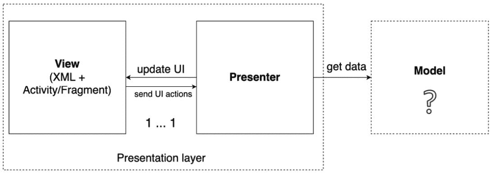
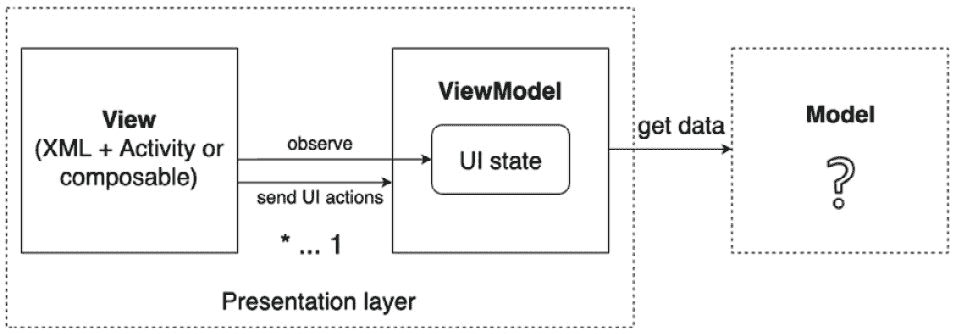

# 第七章：*第七章*：介绍 Android 中的展示模式

在本章中，我们继续探索构建 Android 应用程序的方法。更确切地说，我们将通过引入展示模式来确保我们的应用程序正确地划分了责任。

在第一部分，*介绍 MVC、MVP 和 MVVM 作为展示模式*，我们将简要概述为什么我们需要展示模式，并探讨这些最常见模式在 Android 项目中的实现方式。

接下来，在 *将我们的餐厅应用重构为适合展示模式* 部分，我们将重构我们的餐厅应用以适应 MVVM 展示模式，同时理解为什么 MVVM 最适合我们的基于 Compose 的应用。

在上一节中，*在 ViewModel 中改进状态封装*，我们将看到为什么这对于 `ViewModel` 很重要，并且我们将探讨如何实现这一点。

总结来说，在本章中，我们将涵盖以下主要主题：

+   介绍 **模型-视图-控制器**（**MVC**）、**模型-视图-表示者**（**MVP**）和 **模型-视图-视图模型**（**MVVM**）作为展示模式

+   将我们的餐厅应用重构为展示模式

+   在 ViewModel 中改进状态封装

在深入之前，让我们为这一章节设置技术要求。

# 技术要求

为了构建本章的基于 Compose 的 Android 项目，通常需要你日常使用的工具。然而，为了顺利跟进，请确保你拥有以下内容：

+   Arctic Fox 2020.3.1 版本的 Android Studio。你也可以使用更新的 Android Studio 版本，甚至是 Canary 构建，但请注意，IDE 界面和其他生成的代码文件可能与本书中使用的不同。

+   在 Android Studio 中安装了 Kotlin 1.6.10 或更高版本的插件。

+   上一个章节中的餐厅应用代码。

本章的起点是上一章开发的餐厅应用。如果你没有跟随上一章的实现，可以通过导航到存储库的 `Chapter_06` 目录并导入名为 `chapter_6_restaurants_app` 的 Android 项目来访问本章的起点。

要访问本章的解决方案代码，请导航到 [`github.com/PacktPublishing/Kickstart-Modern-Android-Development-with-Jetpack-and-Kotlin/tree/main/Chapter_07/chapter_7_restaurants_app`](https://github.com/PacktPublishing/Kickstart-Modern-Android-Development-with-Jetpack-and-Kotlin/tree/main/Chapter_07/chapter_7_restaurants_app) 中的 `Chapter_07` 目录。

# 介绍 MVC、MVP 和 MVVM 作为展示模式

在开始之前，大多数 Android 项目都是设计成一系列设置对应**可扩展标记语言**（**XML**）布局的 `Activity` 或 `Fragment` 类。

随着项目的增长和新功能的请求，开发者必须在`Activity`或`Fragment`类中添加更多逻辑，一个开发周期接着一个开发周期。这意味着任何针对特定屏幕的新功能、改进或错误修复都必须在这些`Activity`或`Fragment`类中进行。

经过一段时间，这些类变得越来越大，在某个时候，添加改进或修复错误可能变得像噩梦一样。原因在于`Activity`或`Fragment`类承担了特定项目内的所有责任。这些类会执行以下操作：

+   定义 UI

+   准备要显示的数据并定义不同的 UI 状态

+   从不同的来源获取数据

+   将不同的业务规则应用于数据

*这种方法在项目的不同责任和关注点之间引入了耦合。对于这样的项目，例如，如果需要更改 UI 的一部分，你的更改可能会轻易影响应用程序的其他关注点：数据展示的方式、获取数据逻辑、业务规则等等。

这种情况最糟糕的部分是，当你只需要更改一部分（比如 UI 的一部分）时，你最终会改变其他部分（比如表示层或数据逻辑），你可能会破坏原本正常工作的相关部分，因此可能引入新的错误。

采用所有项目代码都捆绑在`Activity`或`Fragment`类中的方法，会导致你的项目出现以下问题：

+   **脆弱且难以扩展**：添加新功能或改进可能会破坏应用程序的其他部分。

+   **难以测试**：由于应用程序的所有逻辑都捆绑在一个地方，因此仅测试逻辑的一部分非常困难，因为所有逻辑都纠缠在一起，并且与平台相关的依赖项紧密相连。

+   **难以调试**：当责任交织在一起时，你的代码库的各个部分也会交织并耦合。调试一个特定问题变得极其困难，因为很难追踪到确切的罪魁祸首。

为了缓解这些问题，我们可以尝试确定应用程序的核心责任，然后将相应的逻辑和代码分离到不同的组件（或类）中，这些组件（或类）是特定层的组成部分。这样，我们试图遵循**关注点分离**（**SoC**）的原则，其中每个层将包含仅与其对应层关注点紧密相关的类。

为了确保我们的项目遵守 SoC 原则，我们可以将应用程序的责任分为两大类，并为每一类定义一个层，如下所示：

+   **表示层**包含负责定义 UI 和准备要展示的数据的类（或其他组件）。

+   **模型层**包含获取、建模和更新应用程序数据的类。

即使这两层似乎要做的事情不止一件，但所有这些行为定义了一个更广泛的专用责任，它封装了特定的关注点。

在本章中，虽然我们将主要关注结构化表示层，但我们也将开始构建模型层。我们将在*第八章*中继续重构模型层，*Android 中的 Clean Architecture 入门*。

为了在表示层内部分离关注点，你可以使用表示设计模式。**表示设计模式**是定义我们的应用程序中表示层结构的架构模式。

表示层是我们项目中与用户所见内容相关联的部分：UI 及其表示。换句话说，表示层处理与两种类型逻辑相关的两个粒度细小但相关的责任，如下所述：

+   **UI 逻辑**：定义了在单个屏幕或流程中以特定方式显示内容的能力。例如，当为屏幕构建 XML 布局或组合层次结构时，我们正在定义该特定屏幕的 UI 逻辑，因为我们正在定义其 UI 元素。

+   **表示逻辑**：定义 UI（对于单个屏幕或流程）的状态以及当用户与我们的 UI 交互时如何变化，从而定义数据如何呈现给 UI。当我们必须执行以下操作时，我们正在编写表示逻辑：

    +   确保屏幕在特定时间处于加载状态或错误状态

    +   以特定方式格式化内容以呈现屏幕

为了定义 UI 逻辑和表示逻辑，表示层需要一些数据来工作。这就是为什么它必须连接到模型层，模型层提供原始数据，无论是来自网络服务、本地数据库还是其他来源。以下图表展示了这一过程：


图 7.1 – 表示层及其与模型层的关系

目前，我们将模型层视为一个黑盒，它只是为我们提供数据。

我们可以说，这样的分离使得 UI 可以通过表示层内部发生的转换成为模型数据的表示，同时拥有责任不重叠的组件。

在 Android 中，从表示层内部进行的转换是通过以下三种流行的表示模式来建模的，这些模式在其他技术堆栈中也被广泛使用：

+   MVC

+   MVP

+   MVVM

    注意

    作为 Android 开发者，我们已经调整了这些展示模式的实现，以适应 Android 的特定需求。这就是为什么我们展示或实现它们的方式可能与创始人给出的原始定义有所不同——所有这些都是为了观察它们在 Android 项目中的常见用法。

这些展示模式将使我们能够将每个屏幕或应用内流程的 UI 逻辑与展示逻辑分离。通过这样做，我们确保我们的表示层具有更少的耦合代码，更容易维护，更容易随着新功能扩展，更容易测试。

历史上，大多数 Android 项目已经从 MVC 转向 MVP，如今又转向 MVVM。然而，无论它们的结构如何，重要的是要提到，这些展示模式所推崇的 SoC（分离关注点）通常意味着每个 UI 流程都被分解成执行特定任务的类或组件，这些组件与它们的职责紧密相关。

为了了解我在说什么，让我们简要地介绍一下它们，从 MVC 开始。

## MVC

在 Android 项目中，MVC 模式的常见实现定义其层如下：

+   **视图**：从 XML 布局中填充的视图，作为 UI 的表示。这一层只会将控制器接收到的内容渲染到屏幕上。

+   `Activity` 或 `Fragment`。这个组件将通过准备从模型层接收到的数据以供展示，或通过拦截 UI 事件（这些事件反过来会改变状态）来定义 UI 的状态。此外，控制器将负责将实际数据设置到视图层。

+   **模型**：数据的入口点。实际的结构不依赖于 MVC，但我们可以将其视为通过查询本地数据库或远程来源（如 Web **应用程序编程接口** (**API**)）获取所需内容的层。

让我们通过以下方式可视化这种模式带来的实际分离：


图 7.2 – MVC 模式中的表示层

这种 MVC 模式的实现实现了表示层和模型层之间的适当分离，因此解放了 `Activity` 和 `Fragment` 控制器，不再需要它们从 **REpresentational State Transfer** (**REST**) API 或本地数据库中获取数据。然而，至少在这个形式因素中，MVC 并没有在它应该发光的地方发光，因为表示层内部的实际分离可以进一步改进。

这种模式的缺点可能包括以下内容：

+   控制器（`Activity` 或 `Fragment` 控制器）和视图层之间的高耦合。由于控制器是一个具有生命周期的组件，它还必须提供构建和设置 Android 视图的基础设施，包括内容（如构建 `Adapter` 类和传递数据），因此测试它变得困难，因为它与 Android API 紧密耦合。

+   控制器有两个职责：它处理 UI 的状态（表示逻辑），同时也为视图层提供基础设施以使其功能（UI 逻辑）。这两个职责变得纠缠在一起——当你测试其中一个时，你也会测试另一个。

让我们继续探讨 Android 中另一种流行的表示模式。

## MVP

Android 项目中 MVP 模式的一种常见实现定义其层如下：

+   `Activity`或`Fragment`类及其从 XML 中膨胀的视图。这一层现在封装了整个 UI 逻辑：它提供了构建和设置渲染 Android 视图的基础设施，并包含内容。

+   `Activity`或`Fragment`）被建立。该接口允许表示者将准备好的用于表示的数据传递给 UI 层，并在 UI 级别直接修改 UI 状态。

与 MVC 中的控制器不同，表示者不再与生命周期组件或 Android View API 耦合，因此测试它包含的表示逻辑变得更加容易。

+   **模型**：与 MVC 中的相同。

让我们可视化这种模式带来的实际分离，如下所示：



图 7.3 – MVP 模式中的表示层

与 MVC 不同，`Activity`和`Fragment`现在是视图层的一部分，这看起来更自然，因为它们都与 Android UI 紧密相关。这种方法允许表示者准备必须表示的数据，并命令式地修改 UI。

由于我们现在有一个负责向 UI 表示数据的独立实体，我们可以说，与 MVC 不同，MVP 在表示层内部执行 SoC（分离关注点）做得更好。

然而，这种方法仍然存在一些问题，如下所述：

+   表示者手动直接在`Activity`或`Fragment`类中更新 UI 的命令式方法可能会随着项目的增长和新功能的添加而容易出错，并可能导致非法 UI 状态（例如同时显示错误信息和加载状态）。这与 UI 控制器（如`Activity`）也命令式地修改 XML 视图的方法类似——当我们引入具有声明性范式的 Compose 时，我们认为这种方法容易出问题。

+   如果表示层和视图层之间的接口合同设计不当或完全缺失，两者将变得耦合，为其他`Activity`或`Fragment`控制器重用表示者可能会很困难。

让我们继续探讨另一种重要的表示模式。

## MVVM

MVVM 是 Android 中非常流行的一种表示模式，主要是因为它解决了之前提到的 MVP 实现中提到的问题。

Android 项目中 MVVM 的一种常见实现定义其层如下：



图 7.4 – MVVM 模式中的表示层

让我们看看层是如何定义的：

+   `Activity`或`Fragment`类及其 XML 视图，就像在 MVP 中一样。不过，与 MVP 不同的是，视图层观察来自`ViewModel`的可观察状态或可观察字段，两者都包含 UI 数据。每当从这些可观察实体接收到新更新时，视图层就会使用接收到的内容更新 UI。

+   `ViewModel`将 UI 状态定义为可观察属性（或多个可观察字段），并且与视图层完全解耦，因为它没有对其的引用。

+   **模型**：与 MVC 或 MVP 相同。

与 MVP 中的 Presenter 相比，`ViewModel`的一个优点是它不再与视图层耦合，因此可以更容易地重用。与 MVP 相比，视图层负责引用`ViewModel`以获取和观察可观察状态，因此`ViewModel`不再需要引用视图层，变得完全独立。

换句话说，MVVM 中的`ViewModel`强制视图层订阅数据，这与 MVP 不同，在 MVP 中，Presenter 手动设置视图层与数据。这种方法允许多个视图绑定到同一个`ViewModel`，因此在同一`ViewModel`内*共享*相同的 UI 状态。

另一个优点是，由于视图层从`ViewModel`观察 UI 状态并将其作为效果绑定，`ViewModel`不再像 MVP 中的 Presenter 那样通过接口强制更新 UI。换句话说，视图层从`ViewModel`获取 UI 状态并将其绑定到 UI——这导致数据流向单向，不太可能引入错误或非法状态。

注意

在考虑 MVVM 的原始定义时，不应将 ViewModel 与 Jetpack ViewModel 组件混淆——ViewModel 可以是一个简单的类，通过可观察状态来呈现数据。对于我们来说，然而，将 Jetpack ViewModel 视为 MVVM 的实际 ViewModel 是方便的，因为它带来了一些即开即用的优点。

然而，在 Android 中常用模式实现中，将 Jetpack ViewModel 视为 MVVM 中的 ViewModel，这既带来了一系列优点，也带来了一些缺点。

使用 Jetpack ViewModel 作为 MVVM 中的`ViewModel`有以下好处：

+   Jetpack ViewModel 的作用域与 View 的生命周期相同，并提供方便的 API 来取消工作，例如`onCleared()`回调或`viewModelScope`协程作用域，因此提供了一个方便的 API 来取消异步任务并最小化内存泄漏的风险。

+   Jetpack ViewModel 能够存活于配置更改中，因此允许你在用户更改设备方向等情况下自动保留 UI 状态。

+   由于 Jetpack ViewModel 提供了`SavedStateHandle`对象，你可以轻松地在系统启动的进程死亡后恢复 UI 状态。

不幸的是，这种方法存在以下缺点：

+   现在，`ViewModel`已经成为一个库依赖（Jetpack ViewModel），它引入了与 Android 平台的耦合（因为它暴露了如`SavedStateHandle`之类的 API）。这阻止了我们为跨平台项目使用**Kotlin Multiplatform**（**KMP**）重用表示组件。

+   由于 Jetpack ViewModel 是一个除了数据表示之外还处理其他责任的库依赖，例如在系统启动进程死亡后恢复 UI 状态，我们可以认为表示层的关注点并没有很好地分离。

现在我们对表示模式有了快速的了解，是时候来一个实际例子了。

# 将我们的餐厅应用程序重构以适应表示模式

我们计划将我们的餐厅应用程序重构以适应表示模式。从我们之前的比较中，我们可以认为 MVVM 最适合我们的基于 Compose 的应用程序。不用担心——我们稍后会详细讨论这个决定。

但在我们这样做之前，让我们在应用程序中添加更多功能，以更好地突出责任混合可能导致代码难以维护。

总结来说，在本节中，我们将进行以下操作：

+   在我们的餐厅应用程序中添加更多功能

+   将我们的餐厅应用程序重构为 MVVM

让我们开始吧！

## 在我们的餐厅应用程序中添加更多功能

当餐厅应用程序启动时，`RestaurantsScreen()`可组合组件被渲染。在这个屏幕内部，我们正在从服务器加载一系列餐厅，然后我们将它们展示给用户。

尽管我们的应用程序正在等待网络请求完成以及本地缓存到 Room 的操作（以便它能够为 UI 接收餐厅信息），但屏幕仍然保持空白，用户对正在发生的事情一无所知。为了提供更好的**用户体验**（**UX**），我们应该以某种方式向用户暗示我们正在等待从服务器获取内容。

我们可以通过一个加载进度条来实现这一点！在`RestaurantsScreen()`可组合组件内部，我们可以添加一个在`LazyColumn`可组合组件（渲染餐厅列表）填充之前显示的加载 UI 元素。当内容到达时，我们应该隐藏它，从而让用户知道应用程序已经加载了其内容。

让我们立即按照以下方式执行：

1.  首先，在`RestaurantsScreen()`可组合组件内部，将状态中的餐厅列表（从`RestaurantsViewModel`检索）保存到`restaurants`变量中，如下所示：

    ```kt
    @Composable
    fun RestaurantsScreen(onItemClick: (id: Int) -> Unit) {
        val viewModel: RestaurantsViewModel = viewModel()
        val restaurants = viewModel.state.value
        LazyColumn(…){
            items(restaurants) { restaurant ->
                RestaurantItem(…)
            }
        }
    }
    ```

确保还将`restaurants`变量传递给`LazyColumn`可组合组件的`items`**领域特定语言**（**DSL**）函数。

1.  我们需要定义一个条件，让我们知道何时显示加载指示器。作为一个初步尝试，我们可以说当 `restaurants` 变量包含一个空的 `List<Restaurant>` 作为值时，这意味着餐厅尚未到达，内容仍在加载。添加一个 `isLoading` 变量来考虑这一点，如下所示：

    ```kt
    @Composable
    fun RestaurantsScreen(onItemClick: (id: Int) -> Unit) {
        val viewModel: RestaurantsViewModel = viewModel()
        val restaurants = viewModel.state.value
        val isLoading = restaurants.isEmpty()
        LazyColumn(…){ … }
    }
    ```

然而，如果餐厅从服务器到达，`state` 变量将被更新，并且 `restaurants` 变量不再包含空的餐厅列表。此时，`isLoading` 变量变为 `false`。

1.  我们希望在 `isLoading` 变量为 `true` 时显示加载指示器。要做到这一点，将 `LazyColumn` 可组合组件包裹在一个 `Box` 可组合组件中，并在 `LazyColumn` 代码下方检查 `isLoading` 变量是否为 `true`，并传递一个 `CircularProgressIndicator` 可组合组件。代码如下所示：

    ```kt
    @Composable
    fun RestaurantsScreen(onItemClick: (id: Int) -> Unit) {
        …
        val isLoading = restaurants.isEmpty()
        Box() {
            LazyColumn(…){…}
            if(isLoading)
                CircularProgressIndicator()
        }
    }
    ```

`Box` 可组合组件允许我们叠加两个可组合组件：`LazyColumn` 和 `CircularProgressIndicator`。由于我们添加了 `if` 条件，我们现在有以下两种情况：

+   `isLoading` 为 `true`（应用正在等待餐厅），因此两个可组合组件都被组合。当 `CircularProgressIndicator` 可组合组件显示在 `LazyColumn` 可组合组件之上时，`LazyColumn` 可组合组件不包含任何元素，因此不可见。

+   `isLoading` 为 `false`（应用现在有要显示的餐厅），因此只有 `LazyColumn` 可组合组件被组合并可见。

1.  要使 `CircularProgressIndicator` 可组合组件居中，请将 `Alignment.Center` 对齐方式添加到 `Box` 可组合组件的 `contentAlignment` 参数中，同时传递一个 `Modifier.fillMaxSize()` 修饰符。代码如下所示：

    ```kt
    @Composable
    fun RestaurantsScreen(onItemClick: (id: Int) -> Unit) {
        …
        Box(contentAlignment = Alignment.Center,
            modifier = Modifier.fillMaxSize()) {
            …
        }
    }
    ```

1.  构建并运行应用。在一段时间内（直到餐厅加载完成），你应该看到一个加载进度指示器。当餐厅显示时，这个指示器应该消失。

在 UI 层中，我们现在已经添加了加载指示器以及决定何时显示它的逻辑。在这个简单场景中，我们的逻辑是有效的，但如果服务器（或本地数据库）返回一个空的餐厅列表，会发生什么呢？那么加载指示器将永远不会消失。

或者，如果发生错误会发生什么？我们的 `RestaurantsScreen` 可组合组件并不知道错误已被生成。这意味着它不仅不知道何时显示错误，而且也不知道如果发生此类错误，何时隐藏加载指示器。

这些问题源于我们试图在 UI 层（可组合组件所在之处）中定义展示逻辑（何时显示或隐藏加载指示器；何时显示错误消息），从而将 UI 逻辑与展示逻辑混合在一起。

我们现在可以看到一些由将 UI 逻辑与展示逻辑混合而产生的限制，但还有一个事实是，在前几章中，我们已经将展示逻辑与数据逻辑混合了。我们当前方法的长远影响是令人恐惧的：调试将变得困难，测试更是如此。

是时候重构我们的餐厅应用为 MVVM，以便我们更好地分离其职责。

## 重构我们的餐厅应用为 MVVM

为了更好地分离职责，我们将选择最流行的展示模式：MVVM。尽管它有缺陷，但当你将其与我们之前给出的 MVC 和 MVP 定义进行比较时，它目前是最佳候选人，以下是一些原因：

+   它在 UI 逻辑和展示逻辑之间提供了很好的分离。

+   我们的 UI 层（可组合组件）被设计成期望一个可观察的状态（更确切地说，是 Compose `State` 对象），就像 MVVM 中的 `ViewModel` 被设置为暴露的那样。

现在，我们的餐厅应用已经使用了 Jetpack ViewModel（它暴露了一个 Compose `State` 对象，该对象在可组合组件内部被观察和消费），因此我们可以这样说，我们不知不觉地开始实现这个修改后的模式，其中 Jetpack ViewModel 是 MVVM 中的 ViewModel。

注意

目前，我们认为使用 Jetpack ViewModel 作为 MVVM 中的 `ViewModel` 的优点超过了它带来的缺点，因此我们将保持现状。

然而，仅仅因为我们使用了 `ViewModel`，并不意味着我们也正确实现了 MVVM 展示模式。让我们首先看看我们如何为显示餐厅列表的第一个屏幕构建组件和类。你可以看到这里的样子：

![图 7.5 – MVVM 模式中每层组件职责分离不良]

![img/B17788_07_5.jpg]

图 7.5 – MVVM 模式中每层组件职责分离不良

对于这个屏幕，我们注意到两个违反规则的地方，即层包含超过一个职责，如下所述：

+   视图层（由 `RestaurantsScreen()` 可组合组件表示）执行 UI 逻辑和展示逻辑。虽然这个可组合组件应该只包含 UI 逻辑（消费状态内容的无状态可组合组件），但当计算 `isLoading` 变量时，一些展示逻辑隐藏在其中，如下面的代码片段所示：

    ```kt
    @Composable
    fun RestaurantsScreen(onItemClick: (id: Int) -> Unit) {
        …
        val isLoading = restaurants.isEmpty()
        …
    }
    ```

可组合组件不应该负责决定它们自己的状态，就像在这个案例中——`RestaurantsScreen()` 可组合组件不应该持有展示逻辑；相反，这应该移动到 `ViewModel` 内部。

+   `RestaurantsViewModel` 类包含展示逻辑（例如，持有和更新 UI 的状态）和数据逻辑（因为它在获取和缓存餐厅时与 Retrofit 服务 Room **数据访问对象**（**DAO**）一起工作），如下面的代码片段所示：

    ```kt
    class RestaurantsViewModel() : ViewModel() {
        private var restInterface: RestaurantsApiService
        private var restaurantsDao = ...
        val state = mutableStateOf(emptyList<Restaurant>())
        private suspend fun getAllRestaurants(): … {…}
            ...
        private suspend fun refreshCache() {...}
    }
    ```

很明显，当 `state` 变量更新时会发生表示逻辑，但还有大量的数据逻辑，当从 `restInterface` 变量获取餐厅信息，然后将其缓存在 `restaurantsDao` 变量中，等等。

所有这些数据逻辑不应位于 `ViewModel` 内部，而应位于模型层，因为 `ViewModel` 应仅呈现数据，而不关心数据源及其使用方式——它只知道它应该接收一些数据。

现在，让我们看看我们应该如何正确地构建我们的类（遵循 MVVM）以显示餐厅列表的第一流程。组件应该看起来像这样：


图 7.6 – MVVM 模式中每层具有良好分离责任的组件

在之前的图中，每个组件都处理自己的责任，如下所示：

+   View 组件仅包含具有 UI 逻辑的可组合项（`RestaurantsScreen`）（消费 UI 状态）。

+   ViewModel 组件（`RestaurantsViewModel`）仅包含表示逻辑（持有 UI 状态并对其进行修改）。

+   模型组件（我们将创建一个 `RestaurantsRepository` 类——稍后会更详细地介绍）仅包含数据逻辑（从远程源获取餐厅信息，将其缓存在本地源中等）。

为了实现这种分离，在本节中，我们将执行以下操作：

+   将 UI 逻辑与表示逻辑分离

+   将表示逻辑与数据逻辑分离

让我们开始吧！

### 将 UI 逻辑与表示逻辑分离

UI 逻辑（渲染可组合项）已经在 UI 层（Compose UI）中，因此我们从这个角度来看不需要做任何事情。然而，我们需要将表示逻辑从 UI 层提取到 `ViewModel` 中，那里应该是它的位置。

更具体地说，从 `RestaurantsScreen()` 可组合项内部，我们希望将 `isLoading` 变量的计算移动到 `RestaurantsViewModel` 类中，仅仅因为 `ViewModel` 应该决定并且更清楚地知道屏幕何时应该处于加载状态。

为了做到这一点，我们将创建一个 `state` 类，它将保存 UI 需要的所有信息，以便渲染正确的状态。这种方法更有效率，因为 `ViewModel` 负责请求数据，因此更清楚地知道何时内容到达等。因此，稍后我们将非常容易地允许 `ViewModel` 决定屏幕何时必须显示错误状态。按照以下步骤进行操作：

1.  创建一个将模拟 `RestaurantsScreen()` 可组合的 UI 状态的类。通过点击应用程序包，将 `RestaurantsScreenState` 作为名称，并选择 `restaurants` 列表和 `isLoading` 标志。以下代码片段展示了这一过程：

    ```kt
    data class RestaurantsScreenState(
        val restaurants: List<Restaurant>,
        val isLoading: Boolean)
    ```

由于我们使用了`data class`而不是常规的`class`，我们将能够轻松地使用`.copy()`函数对这个对象进行修改，从而确保 Compose 的`state`对象将接收到一个新的对象，并知道触发重新组合。

1.  在`RestaurantsViewModel`类中，更新`state`变量的初始状态值并传递一个`RestaurantsScreenState`对象，如下所示：

    ```kt
    class RestaurantsViewModel() : ViewModel() {
        …
        val state = mutableStateOf(
            RestaurantsScreenState(
                restaurants = listOf(),
                isLoading = true)
        )
        …
    }
    ```

我们将`restaurants`字段标记为空列表，并且`isLoading`为`true`，因为从这一点开始，我们正在等待餐厅信息，UI 应该渲染加载状态。

1.  仍然在`RestaurantsViewModel`类中，找到`getRestaurants()`方法并更新我们更新`state`变量的方式，如下所示：

    ```kt
    private fun getRestaurants() {
        viewModelScope.launch(errorHandler) {
            val restaurants = getAllRestaurants()
            state.value = state.value.copy(
                restaurants = restaurants,
                isLoading = false)
        }
    }
    ```

我们首先将餐厅信息存储在`restaurants`变量中。然后，我们使用`copy()`函数将接收到的新的餐厅列表传递给`restaurants`字段，并将`isLoading`字段标记为`false`，因为数据已经到达，UI 不再需要渲染加载状态。

1.  仍然在`RestaurantsViewModel`类中，确保`toggleFavorite()`方法正确地使用`copy()`函数更新`state`变量对象，如下所示：

    ```kt
    fun toggleFavorite(id: Int, oldValue: Boolean) {
        viewModelScope.launch(errorHandler) {
            val updatedRestaurants = […]
            state.value = state.value.copy(restaurants =      
                updatedRestaurants)
        }
    }
    ```

好了——我们已经在`ViewModel`中添加了所有的展示逻辑，现在是时候更新 UI（我们的 composables）以渲染新的可能的 UI 状态。

1.  重构`RestaurantsScreen()` composable 以消费新的 UI 状态内容，如下所示：

    ```kt
    @Composable
    fun RestaurantsScreen(onItemClick: (id: Int) -> Unit) {
        val viewModel: RestaurantsViewModel = viewModel()
        val state = viewModel.state.value
        Box(…) {
            LazyColumn(…) {
                 items(state.restaurants) {…}
            }
            if (state.isLoading)
                CircularProgressIndicator()
        }
    }
    ```

让我们分解我们所做的工作，如下所示：

+   我们将`restaurants`变量重命名为`state`，以更好地表明这个变量持有这个屏幕的状态。

+   我们将`state.restaurants`传递给`LazyColumn` composable 的`items` DSL 函数。

+   我们删除了这一行：`val isLoading = restaurants.isEmpty()`。

+   我们根据`state.isLoading`的值更新了显示`CircularProgressIndicator()`的条件——在这个 composable 中不再需要决策逻辑。

1.  构建并运行应用。

你应该能够看到加载指示器，就像之前一样，但不同之处在于展示逻辑更好地分离并由`ViewModel`持有。使用我们的新方法，如果出于任何原因我们从数据源（Retrofit 和 Room）收到空列表，应用程序不会表现不佳并显示加载状态，因为 UI 正在检查列表是否为空。

要了解如何简单地向我们的 Compose-based UI 添加新状态，让我们继续设置在`ViewModel`内部抛出任何错误时的错误状态。

1.  在`RestaurantsScreenState`类中，添加一个`error: String`参数，用于存储可能发生的错误信息，如下所示：

    ```kt
    data class RestaurantsScreenState(
        val restaurants: List<Restaurant>,
        val isLoading: Boolean,
        val error: String? = null
    )
    ```

为了简化我们在`ViewModel`内部处理状态的工作，我们将`error`字段的默认值设置为`null`，因为屏幕的初始状态不应该包含任何错误。

1.  在`RestaurantsViewModel`类中，找到我们用来捕获可能由我们的协程抛出的任何异常的`errorHandler`变量，并通过传递`exception.message`错误消息到`error`字段来更新`state`对象。代码如下所示：

    ```kt
    class RestaurantsViewModel() : ViewModel() {
        …
        private val errorHandler =
            CoroutineExceptionHandler { _, exception ->
                exception.printStackTrace()
                state.value = state.value.copy(
                    error = exception.message,
                    isLoading = false
                )
            }
        ...
    }
    ```

此外，我们已将新状态中的`isLoading`字段设置为`false`，仅仅是因为如果抛出错误，我们不想让 UI 保持在加载状态。

如果您想在错误发生后显示并按下重试按钮，您必须在按下该按钮时将`error`字段设置为`null`，这样 UI 就不会无限期地保持在错误状态。

1.  在`RestaurantsScreen()`可组合函数中，在`Box`可组合函数内添加另一个`if`语句。此语句检查`state`对象是否包含要显示的错误消息，如果是`true`，则添加一个`Text`可组合函数来显示错误消息。代码如下所示：

    ```kt
    @Composable
    fun RestaurantsScreen(onItemClick: (id: Int) -> Unit) {
        …
        Box(…) {
            LazyColumn(...) {…}
            if (state.isLoading)
                CircularProgressIndicator()
            if (state.error != null)
                Text(state.error)
        }
    }
    ```

1.  构建项目，现在，让我们测试错误场景。要看到错误消息，我们需要模拟一个错误。

如果您还记得，在我们的`RestaurantsViewModel`类的`getAllRestaurants()`方法中，我们检查是否从服务器（Retrofit 客户端）检索餐厅失败，并且如果 Room DAO 也为空，我们抛出此错误消息：“出了点问题。我们没有数据。”

为了重现此场景，请确保以下条件成立：

+   您已清除应用程序的缓存。为此，在您的设备或模拟器中，进入**设置**，然后进入**应用程序**，搜索我们的餐厅应用并点击它。然后，点击**存储和缓存**，然后点击**清除存储**。

+   您的设备/模拟器已断开互联网连接。

1.  运行应用程序。您应该在屏幕中央看到此消息：“出了点问题。我们没有数据。”

    注意

    为了简化，我们确保 UI 逻辑仅在我们应用程序的第一个屏幕中与展示逻辑分离。当您想要将逻辑移动到相应的类中，从而确保 SoC 时，您需要确保为应用程序中的所有其他屏幕以及它们的`ViewModel`类等执行此操作。

现在我们已经将 UI 逻辑与展示逻辑分离，是时候分离一些数据逻辑了。

### 分离展示逻辑和数据逻辑

虽然`RestaurantsViewModel`类因为与 Retrofit 服务和 Room DAO 交互以获取和缓存餐厅数据而包含数据逻辑，但它应该只包含展示逻辑，因为其核心责任是管理 UI 状态。

我们的`RestaurantsViewModel`积累了大量逻辑的另一个迹象是，它目前大约有 90 行代码——这看起来可能并不多，但请记住，我们的应用程序相当简单，我们只有很少的展示逻辑，所以 90 行对于生产就绪的应用程序来说肯定会变成数千行。

我们希望将数据逻辑从`RestaurantsViewModel`移入一个不同的类。由于数据逻辑是应用程序模型层的一部分，在本节中，我们将开始探讨如何借助`Repository`类来定义模型层。

**Repository**模式代表了一种在应用程序内部抽象数据访问的策略。换句话说，Repository 类隐藏了从服务器解析数据、将其存储在本地数据库或执行任何缓存/刷新机制的所有复杂性。

在我们的应用中，`RestaurantsViewModel`类必须决定是否从`restInterface`（远程）源或从`restaurantsDao`（本地）源获取数据，同时确保刷新缓存。以下代码片段显示了执行的相关代码：

```kt
class RestaurantsViewModel() : ViewModel() {
    private var restInterface: RestaurantsApiService
    private var restaurantsDao = [...]
        ...
    private suspend fun refreshCache() {...}
}
```

这显然是错误的。`ViewModel`不应该关心调用哪个特定的数据源，因为它不应该需要是那个启动本地源缓存的源。`ViewModel`应该只关心接收一些内容，它将为展示做准备。

通过创建一个将抽象所有数据逻辑的`Repository`类来从`RestaurantsViewModel`类中移除这个负担，因为它将与两个数据源（网络 API 和 Room DAO）交互以执行以下操作：

+   向表示层提供一个`List<Restaurant>`对象

+   处理任何缓存逻辑，例如从网络 API 检索餐厅并将其缓存到 Room 本地数据库

+   定义数据的**单一事实来源**（**SSOT**）——Room 数据库

为了做到这一点，我们必须只将数据逻辑从`ViewModel`中移出，并在`Repository`类中将其分离。让我们开始，如下所示：

1.  通过点击应用程序包，将名称设置为`RestaurantsRepository`并选择**类**作为类型来创建一个`Repository`类：

    ```kt
    class RestaurantsRepository { }
    ```

现在，让我们开始移动一些代码！

1.  在`RestaurantsViewModel`类内部，从`init`块中剪切`restInterface`变量及其初始化逻辑，并将其粘贴到`RestaurantsRepository`中，如下所示：

    ```kt
    class RestaurantsRepository {
        private var restInterface: RestaurantsApiService =
            Retrofit.Builder()
                .addConverterFactory(…)
                .baseUrl(…)
                .build()
                .create(RestaurantsApiService::class.java)
    }
    ```

1.  对于`restaurantsDao`变量，也执行相同的操作，如下所示：

    ```kt
    class RestaurantsRepository {
        private var restInterface: RestaurantsApiService = …
        private var restaurantsDao = RestaurantsDb
            .getDaoInstance(
                RestaurantsApplication.getAppContext())
    }
    ```

1.  在`RestaurantsViewModel`类内部，添加一个`repository`变量，并使用`RestaurantsRepository()`构造函数对其进行实例化，如下所示：

    ```kt
    class RestaurantsViewModel() : ViewModel() {
        private val repository = RestaurantsRepository()
        val state = mutableStateOf(…)
        private val errorHandler = CoroutineExceptionHandler { … } 
        init {
            getRestaurants()
        }
         […]
    }
    ```

确保`RestaurantsViewModel`不再包含`restInterface`变量、`restaurantsDao`变量或它们在`init`块中的初始化代码。

1.  将`RestaurantsViewModel`类的`toggleFavoriteRestaurant()`、`getAllRestaurants()`和`refreshCache()`方法移动到`RestaurantsRepository`类，如下所示：

    ```kt
    class RestaurantsRepository {
        private var restInterface: RestaurantsApiService = …
        private var restaurantsDao = […]
        private suspend fun toggleFavoriteRestaurant(…) = […]
        private suspend fun getAllRestaurants(): […] { … }
        private suspend fun refreshCache() { … }
    }
    ```

1.  确保除了`init { }`块之外，`RestaurantsViewModel`类只包含`toggleFavorite()`和`getRestaurants()`方法，如下所示：

    ```kt
    class RestaurantsViewModel() : ViewModel() {
        […]
        init { getRestaurants() }
        fun toggleFavorite(id: Int, oldValue: Boolean) {…}
        private fun getRestaurants() {…}
    }
    ```

1.  在 `RestaurantsRepository` 类中，移除 `getAllRestaurants()` 和 `toggleFavoriteRestaurant()` 方法的 `private` 修饰符，因为 `RestaurantsViewModel` 需要调用它们，所以它们必须是公开的。代码如下所示：

    ```kt
    class RestaurantsRepository {
        […]
        suspend fun toggleFavoriteRestaurant(…) = […]
        suspend fun getAllRestaurants(): […] { … }
        private suspend fun refreshCache() { … }
    }
    ```

1.  返回到 `RestaurantsViewModel` 类内部，更新 `getRestaurants()` 方法，现在调用 `repository.getAllRestaurants()`，如下所示：

    ```kt
    private fun getRestaurants() {
        viewModelScope.launch(errorHandler) {
            val restaurants = repository.getAllRestaurants()
            state.value = state.value.copy(…)
        }
    }
    ```

1.  仍然在 `RestaurantsViewModel` 类中，更新 `toggleFavorite()` 方法，现在调用 `repository.toggleFavoriteRestaurant()`，如下所示：

    ```kt
    fun toggleFavorite(id: Int, oldValue: Boolean) {
        viewModelScope.launch(errorHandler) {
            val updatedRestaurants = repository
                .toggleFavoriteRestaurant(id, oldValue)
            state.value = state.value.copy(…)
        }
    }
    ```

完成了！虽然第一个屏幕的功能应该保持不变，但我们现在已经在这个第一个流程中划分了责任，不仅是在展示层内部，而且在展示层和模型层之间。

任务

你可以在“餐厅”应用的详情屏幕上尝试练习本节学到的内容。

接下来，让我们暂时回到展示层，检查 UI 状态是如何从我们的 `ViewModel` 中暴露出来的。

# 提高 ViewModel 中的状态封装

让我们看看 `RestaurantsViewModel` 类中 UI 状态的定义，如下所示：

```kt
class RestaurantsViewModel() : ViewModel() {
    …
    val state = mutableStateOf(RestaurantsScreenState(
        restaurants = listOf(),
        isLoading = true))
    …
}
```

在 `RestaurantsViewModel` 中，我们使用 `MutableState<RestaurantsScreenState>` 推断类型在 `state` 变量中持有状态。这个变量是公开的，因此在内层 UI 中，从 `RestaurantsScreen()` 组合函数内部，我们可以通过访问 `viewModel` 变量并直接获取 `state` 对象来消费它，如下所示：

```kt
@Composable
fun RestaurantsScreen(onItemClick: (id: Int) -> Unit) {
    val viewModel: RestaurantsViewModel = viewModel()
    val state = viewModel.state.value
    Box(…) {…}
}
```

这种方法的问题可能并不明显，但既然 `state` 变量是 `MutableState` 类型，我们不仅能够读取它的值，还能够写入它的值。换句话说，从组合 UI 层内部，我们通过 `.value` 访问器对 `state` 变量有写访问权限。

这里的危险在于，我们（或我们开发团队中的其他同事）可能会错误地从 UI 层更新 UI 状态，如下所示：

```kt
@Composable
fun RestaurantsScreen(onItemClick: (id: Int) -> Unit) {
    val viewModel: RestaurantsViewModel = viewModel()
    val state = viewModel.state.value
    Box(…) {…}
    viewModel.state.value = viewModel.state.value.copy(
        isLoading = false)
}
```

*你可以尝试添加之前突出显示的代码行，但之后要将其删除！*

这代表了展示层内责任的违反：UI 层不应该执行展示逻辑。换句话说，UI 层不应该能够修改存储在 `ViewModel` 中的自己的状态；相反，只有 `ViewModel` 应该有这个权利。

这样，`ViewModel` 是唯一负责展示逻辑的实体，例如定义或修改 UI 状态。同时，我们展示模式内的责任将得到适当的划分和尊重。

为了解决这个问题，我们必须以某种方式强制 `RestaurantsViewModel` 类公开一个类型为 `State` 的 `state` 变量，而不是 `MutableState`。这将防止 UI 层意外地修改自己的状态。

我们可以通过使用 Kotlin 的`state`变量来实现这一点。这个特性表明，如果一个类有两个在概念上相同的属性，但其中一个属于公共 API，另一个是实现细节，我们可以使用下划线作为私有属性的名称前缀。

让我们通过直接在代码中应用它来了解这意味着什么，如下所示：

1.  首先，在`RestaurantsViewModel`类中，让我们防止我们的`state`变量被访问，因为它属于`MutableState`类型，如下所示：

    ```kt
    class RestaurantsViewModel() : ViewModel() {
        …
        private val state = mutableStateOf(…)
        …
    }
    ```

1.  然后，仍然在`RestaurantsViewModel`类中，将`state`变量重命名为`_state`。你可以通过选择`state`变量，然后按*Shift* + *F6*来实现这一点。确保所有之前的`state`使用现在都称为`_state`。代码在以下片段中展示：

    ```kt
    class RestaurantsViewModel() : ViewModel() {
        …
        private val _state = mutableStateOf(…)
        private val errorHandler =
            CoroutineExceptionHandler {
                …
                exception.printStackTrace()
                _state.value = _state.value.copy(…)
            }
        […]
        fun toggleFavorite(id: Int, oldValue: Boolean) {
            viewModelScope.launch(errorHandler) {
                val updatedRestaurants = …
                _state.value = _state.value.copy(…)
            }
        }
        private fun getRestaurants() {
            viewModelScope.launch(errorHandler) {
                val restaurants =
                    repository.getAllRestaurants()
                _state.value = _state.value.copy(…)
            }
        }
    }
    ```

`_state`变量现在是类型为`MutableState`的私有状态，因此它是我们所说的实现细节。这意味着`ViewModel`可以更改它，但它不应该暴露给外部世界。那么我们应该向 UI 层暴露什么？

1.  仍然在`RestaurantsViewModel`中，创建另一个类型为`State<RestaurantsScreenState>`的`state`变量，并通过`get()`语法定义其自定义获取器，如下所示：

    ```kt
    class RestaurantsViewModel() : ViewModel() {
        …
        private val _state = mutableStateOf(...)
        val state: State<RestaurantsScreenState>
            get() = _state
        …
    }
    ```

`state`变量现在是公共状态类型`State`（因此它是公共 API 的一部分），这意味着当 UI 层尝试获取其值时，将调用`get()`语法，并返回`_state`变量中的内容。

在幕后，`_state`变量的类型`MutableState`被转换为`state`变量的`State`类型。这意味着可组合组件将无法在`ViewModel`内部更改状态。

从概念上讲，`state`变量和`_state`变量是相同的，但`state`用作与外部世界的公共契约的一部分（因此它可以被 UI 层消费），而`_state`用作内部实现细节（一个可以被`ViewModel`更新的`MutableState`对象）。

1.  最后，在`RestaurantsScreen()`可组合函数中，确保`state`变量被消费，如下所示：

    ```kt
    @Composable
    fun RestaurantsScreen(onItemClick: (id: Int) -> Unit) {
        val viewModel: RestaurantsViewModel = viewModel()
        val state = viewModel.state.value
        Box(…) {…}
    }
    ```

如果你现在尝试更改`state`变量的值，就像我们在本节开头所做的那样，那么`val`变量，如下面的代码片段所示：

```kt
@Composable
fun RestaurantsScreen(onItemClick: (id: Int) -> Unit) {
    val viewModel: RestaurantsViewModel = viewModel()
    val state = viewModel.state.value
    Box(…) {…}
    viewModel.state.value = viewModel.state.value.copy(
        isLoading = false)
}
```

这实际上意味着我们的 UI 不再可能意外地更改其自身的状态。

作业

你可以在餐厅应用的详细信息屏幕上尝试练习本节中学到的内容。

# 摘要

在本章中，我们首次了解了 SoC 原则。我们理解了为什么我们必须将应用程序的责任分割到几个层次，并探讨了如何通过展示设计模式来实现这一点。

在本章的第一部分，我们简要回顾了 Android 中最常见的展示模式实现：MVC、MVP 和 MVVM。

之后，我们确定 MVVM 可能适合我们的基于 Compose 的餐厅应用程序。我们了解了每种类型的逻辑必须位于哪个层，然后尝试在我们的应用程序中尽可能实现 SoC（单一职责原则）。

在本章的最后部分，我们注意到我们的 UI 层如何容易地扩展其职责，并通过在`ViewModel`中修改 UI 状态来开始执行展示逻辑。为了应对这种情况，我们学习了如何通过使用后置属性来更好地封装 UI 状态。

让我们在下一章继续我们的旅程，提高我们应用程序的架构。在这一章中，我们将尝试从著名的清洁架构软件设计哲学中采纳一些设计决策。
