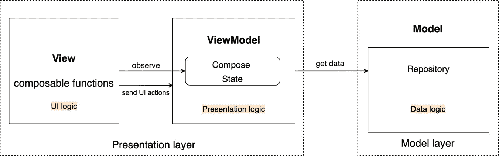
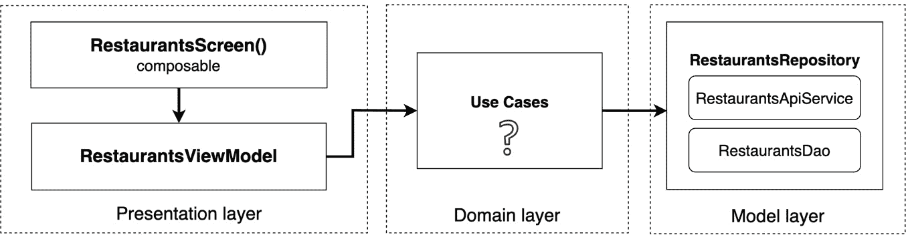
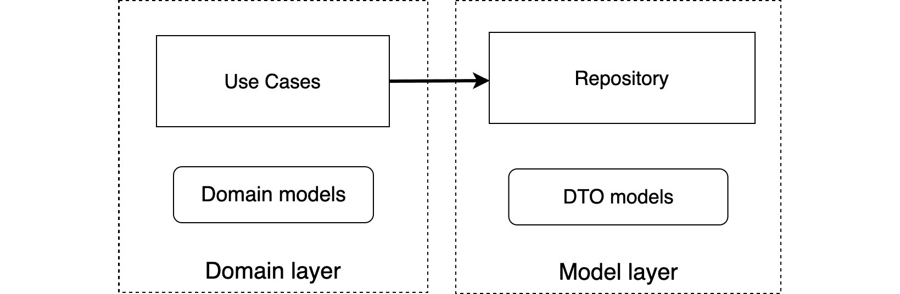
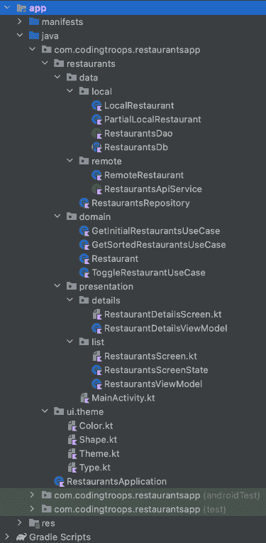
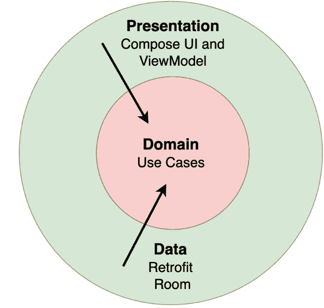

# 第八章：*第八章*：Android 中开始使用 Clean Architecture

在本章中，我们继续改进 Restaurants 应用程序的架构设计之旅。

更具体地说，我们将尝试采用一些来自知名 Clean Architecture 的设计决策。**Clean Architecture** 是一种软件设计哲学，试图创建具有以下最佳水平的项目：

+   关注点的分离

+   可测试性

+   外围层（如 UI 或模型层）使用的框架或库的独立性

通过这样做，Clean Architecture 试图让我们的应用程序的业务部分能够适应不断变化的技术和接口。

Clean Architecture 是一个非常广泛且复杂的话题，因此，在本章中，我们将尝试仅通过进一步分离现有层来建立更好的关注点分离，但更重要的是，通过定义一个名为 **领域层** 的新层。

在本章中，我们将一方面通过 *使用用例定义领域层* 部分和 *将领域模型与数据模型分离* 部分借鉴 Clean Architecture 的一些架构决策。另一方面，我们将通过 *创建包结构* 部分和 *将基于 Compose 的 UI 层与 ViewModel 解耦* 部分尝试使用其他技术改进项目架构。

Clean Architecture 的另一个基本原则是 **依赖规则**，我们将在 *进一步阅读* 部分简要介绍，在那里您将找到适当的资源以跟进。

在本节中，我们将涵盖以下主题：

+   使用用例定义领域层

+   将领域模型与数据模型分离

+   创建包结构

+   将基于 Compose 的 UI 层与 ViewModel 解耦

在深入之前，让我们为本章设置技术要求。

# 技术要求

为本章构建基于 Compose 的 Android 项目通常需要您日常使用的工具。然而，为了顺利跟进，请确保您拥有以下内容：

+   Arctic Fox 2020.3.1 版本的 Android Studio。您也可以使用更新的 Android Studio 版本或甚至 Canary 构建，但请注意，IDE 界面和其他生成的代码文件可能与本书中使用的不同。

+   安装在 Android Studio 中的 Kotlin 1.6.10 或更高版本的插件

+   上一章的 Restaurants 应用程序代码

本章的起点由上一章开发的 Restaurants 应用程序表示。如果您没有跟随上一章的实施，请通过导航到存储库的 `Chapter_07` 目录并导入名为 `chapter_7_restaurants_app` 的 Android 项目来访问本章的起点。

要访问本章的解决方案代码，请导航到 `Chapter_08` 目录：

[`github.com/PacktPublishing/Kickstart-Modern-Android-Development-with-Jetpack-and-Kotlin/tree/main/Chapter_08/chapter_8_restaurants_app`](https://github.com/PacktPublishing/Kickstart-Modern-Android-Development-with-Jetpack-and-Kotlin/tree/main/Chapter_08/chapter_8_restaurants_app).

# 使用用例定义领域层

到目前为止，我们讨论了表示层（带有 UI 和表示逻辑）和模型层（带有数据逻辑）。然而，除了这两个层之外，大多数时候，应用程序还会封装一种不同类型的逻辑，这种逻辑不同于 UI、表示或数据逻辑。

要识别这种逻辑，我们首先必须承认大多数应用程序都有一个专门的业务范围——例如，一个食品配送应用程序的业务范围可能是接受订单并为股东创造收入。**股东**是指对业务感兴趣的实体，例如拥有连锁餐厅的公司。

这样的应用程序可以包含由股东强加的业务规则，这些规则可能包括最低订单金额、某些餐厅的定制可用性范围或不同配送费用的预定义时间框架；这个列表可以继续下去。我们可以将这种由股东规定的业务规则称为**业务逻辑**。

对于我们的餐厅应用程序，让我们想象一下，股东（例如，我们为该公司构建的应用程序）要求我们始终按字母顺序显示餐厅，无论什么情况。这不应该是什么用户会知道的事情；相反，它应该是一个预定义的业务规则，我们必须实现它。

现在，按字母顺序排序餐厅并不是什么大问题，所以自然而然出现的问题是，我们应该在哪里应用这种排序逻辑？

为了弄清楚这一点，让我们回顾一下项目的当前分层。目前，表示层连接到模型层。



图 8.1 – 餐厅应用程序的责任分层

根据我们现有的分层结构，我们可以在以下方面对餐厅进行排序：

+   **UI 级别（可组合项）**：由于这种排序逻辑是业务逻辑，我们应该尽量避免在这里添加它。

+   `ViewModel`类；然而，请记住，这个规则是业务需求的一部分，用户不应该知道这一点，所以在这里实现它可能不是一个好主意。

+   **在存储库内部**：在这里，我们存储数据逻辑（例如缓存），这与业务逻辑不同。

没有任何一种选择是理想的，我们很快就会看到为什么是这样。在此之前，让我们妥协一下，在模型层内部添加这个业务规则：

1.  在`RestaurantsRepository`内部，重构`getAllRestaurants()`方法，通过在返回的餐厅上调用`sortedBy { }`扩展函数来按`title`排序餐厅：

    ```java
    suspend fun getAllRestaurants(): List<Restaurant> {
        return withContext(Dispatchers.IO) {
            try {
                refreshCache()
            } catch (e: Exception) {…}
            return@withContext restaurantsDao.getAll()
                .sortedBy { it.title }
        }
    }
    ```

1.  构建并运行应用程序。

餐厅现在已按标题正确排序，但如果你将餐厅切换为收藏夹，你可能会注意到列表上的初始闪烁和重新排序效果。你能猜到这是为什么吗？

这里的问题是，在`RestaurantsRepository`中，`toggleFavoriteRestaurant()`方法从**数据访问对象**（**DAO**）返回未排序的餐厅版本：

```java
suspend fun toggleFavoriteRestaurant(…)= withContext(…){
    …
    restaurantsDao.getAll()
}
```

为了解决这个问题，我们可以重复`getAllRestaurants()`方法中的相同排序逻辑。

然而，这种方法是有问题的，因为我们可能会重复或复制排序业务规则。更糟糕的是，由于我们处于模型层，我们将数据逻辑与业务逻辑混合在一起。我们不应该将数据缓存逻辑与业务规则混合。

很明显，为了正确封装业务逻辑并能够重用，我们应该将其提取到单独的一层。就像我们想要防止任何对表示层的更改影响其他层，例如 UI 或模型层，我们希望将业务逻辑放在一个单独的层中，以便任何对业务逻辑的更改都不应影响其他层及其相应的逻辑。

根据清洁架构的概念，封装业务规则和业务逻辑的层被称为领域层。该层位于表示层和模型层之间。它应该通过应用其包含的业务规则来处理模型层的数据，然后将符合业务规则的内容提供给表示层。

![图 8.2 – 餐厅应用中的责任分层，包括领域层

![图片 B17788_08_02.jpg]

图 8.2 – 餐厅应用中的责任分层，包括领域层

换句话说，在特定的流程中（例如，在包含餐厅列表的屏幕中），表示层将通过`ViewModel`连接到领域层而不是模型层。反过来，领域层将从模型层获取数据。

注意

并非所有应用程序、屏幕或流程都包含业务逻辑。对于这些情况，领域层是可选的。领域层应该包含业务逻辑，但如果不存在此类逻辑，则不应存在此类层。

但领域层应该包含什么内容呢？

根据清洁架构的概念，与特定应用程序操作或流程相关的可重复业务逻辑应该封装在用例中。换句话说，**用例**是类，它们将与应用程序单个功能相关的可重复业务规则作为一个业务逻辑单元提取出来。

例如，一个在线订餐应用可以拥有与仅显示用户附近商店相关的业务逻辑。为了封装这个业务规则，我们可以创建一个`GetStoresInProximityUseCase`类。或者，可能有一些与用户触发的注销操作相关的业务逻辑（例如在幕后执行一些用户福利或积分计算）；那么，我们可以实现`LogOutUserUseCase`。

因此，在我们的餐厅应用中，任何业务逻辑都必须封装在位于表示层和模型层之间的用例中：



图 8.3 – 责任分层，其中领域层包含用例

分离的领域层带来以下好处：

+   通过将业务逻辑分离到其自己的类中，提高了应用程序的可测试性。这样，业务责任与其他组件分离，并且可以单独测试其逻辑，而无需关心其他层的组件。

+   通过在用例内部分离业务逻辑，我们避免了代码重复，并提高了业务规则及其对应逻辑的可重用性。

+   通过将业务逻辑分离到其自己的类中，提高了包含用例依赖项的类的可读性。这是因为每个业务单元现在都是单独提取的，并为开发者提供了关于每个屏幕或流程执行的业务动作的宝贵见解。

在深入实际例子之前，让我们简要介绍一些用例的重要方面：

+   它们可以使用（或依赖于）其他用例。由于用例定义了一个可重用的单一业务逻辑单元，因此用例可以使用其他用例来定义复杂业务逻辑。

+   它们通常从模型层获取数据，但不是仅限于一个`Repository`类 – 换句话说，你可以在用例内部访问多个仓库。

+   它们通常只有一个公共方法，主要是因为用例封装了与您的应用单个功能相关的业务规则（就像`LogOutUserUseCase`所做的那样）。

+   它们应该遵循一个命名约定。用例类的流行约定是现在时态的动词，定义动作，通常后面跟几个表示*什么*的词，并以 UseCase 后缀结尾。一些例子可以是`GetStoresInProximityUseCase`或`CalculateOrderTotalUseCase`。

是时候看看用例类是什么样的了。在我们的餐厅应用中，按字母顺序排序餐厅的业务逻辑非常适合提取到用例中，因为以下原因：

+   这是一个由利益相关者规定的业务规则。

+   它重复了两次。

+   它是应用中特定操作的一部分（获取餐厅信息）。

让我们定义我们的第一个用例类！

1.  点击应用程序包，将`GetRestaurantsUseCase`作为名称，选择**类**，并添加以下代码：

    ```java
    class GetRestaurantsUseCase {
        private val repository: RestaurantsRepository = 
            RestaurantsRepository()
        suspend operator fun invoke(): List<Restaurant> {
            return repository.getAllRestaurants()
                            .sortedBy { it.title }
        }
    }
    ```

功能上，这个用例类从`RestaurantsRepository`获取餐厅，应用了按字母顺序排序餐厅的业务规则，就像`RestarauntsViewModel`所做的那样，然后返回列表。换句话说，`GetRestaurantsUseCase`现在负责应用业务规则。

这个用例通过一个公共方法实现，这个方法也是一个`suspend`函数，因为`repository.getAllRestaurants()`调用是一个挂起函数调用。但更重要的是，为什么我们给用例的函数命名为`invoke()`，同时指定了`operator`关键字？

我们这样做是因为 Kotlin 允许我们在类上定义一个`invoke`操作符，这样我们就可以在类的任何实例上调用它而不需要方法名。这就是我们将如何调用`GetRestaurantsUseCase`的`invoke()`操作符：

```java
val useCase = GetRestaurantsUseCase()
val result = useCase()
```

这种语法对我们特别有用，因为我们的用例类只有一个方法，类的名称已经足够有暗示性，所以我们不需要命名函数。

1.  确保删除我们在`RestaurantsRepository`的`getAllRestaurants()`方法中最初添加的排序逻辑。该方法返回的数据应如下所示：

    ```java
    suspend fun getAllRestaurants(): List<Restaurant> {
        return withContext(Dispatchers.IO) {
            try { … } catch (e: Exception) {…}
            return@withContext restaurantsDao.getAll()
        }
    }
    ```

1.  在`RestaurantsViewModel`内部，向`GetRestaurantsUseCase`类添加一个新的依赖项：

    ```java
    class RestaurantsViewModel() : ViewModel() {
      private val repository = RestaurantsRepository()
      private val getRestaurantsUseCase = GetRestaurantsUseCase()
      […]
    }
    ```

1.  然后，在`ViewModel`的`getRestaurants()`方法中，移除对`repository`变量的餐厅调用，而是调用`getRestaurantsUseCase`变量的`invoke()`操作符：

    ```java
    private fun getRestaurants() {
        viewModelScope.launch(errorHandler) {
            val restaurants = getRestaurantsUseCase()
            _state.value = _state.value.copy(
                restaurants = restaurants, […])
        }
    }
    ```

在构建和运行应用程序之前，让我们尝试识别此应用程序特定流程的任何其他业务规则。

如果我们查看`RestaurantsRepository`内部，`toggleFavoriteRestaurant()`方法接受一个`oldValue: Boolean`参数，并在将其传递给`PartialRestaurant`的`isFavorite`字段之前对其进行取反：

```java
suspend fun toggleFavoriteRestaurant(
    id: Int,
    oldValue: Boolean
) =
    withContext(Dispatchers.IO) {
        restaurantsDao.update(
            PartialRestaurant(
                id = id,
                isFavorite = !oldValue
            )
        )
        restaurantsDao.getAll()
    }
```

这发生在我们标记餐厅为收藏或非收藏的任何时候。通过传递`!oldValue`取消餐厅收藏状态`oldValue`的规则可以被视为利益相关者强加的业务规则：*每当用户点击餐厅的心形图标时，我们必须将其收藏状态切换到相反的值*。

为了能够重用这个业务逻辑，而不是由`RestaurantsRepository`执行，让我们也将这个规则提取到一个用例中。

1.  首先，在`RestaurantsRepository`内部，将`oldValue`参数重命名为`value`，并确保在将其传递给`PartialRestaurant`的`isFavorite`字段时不再对其进行取反：

    ```java
    suspend fun toggleFavoriteRestaurant(id: Int, value: Boolean)=
        withContext(Dispatchers.IO) {
            restaurantsDao.update(
               PartialRestaurant(id = id, isFavorite = value)
            )
            restaurantsDao.getAll()
        }
    ```

1.  点击应用程序包，将`ToggleRestaurantUseCase`作为名称，选择**类**，并添加以下代码：

    ```java
    class ToggleRestaurantUseCase {
        private val repository: RestaurantsRepository =
            RestaurantsRepository()
        suspend operator fun invoke(
            id: Int,
            oldValue: Boolean
        ): List<Restaurant> {
            val newFav = oldValue.not()
            return repository
                .toggleFavoriteRestaurant(id, newFav)
        }
    }
    ```

这个用例现在封装了通过`val newFav = oldValue.not()`行取消餐厅收藏标志的业务规则。虽然这里的业务逻辑相当简单，但在生产应用中，事情往往会变得更加复杂。每当我们将餐厅标记为收藏或非收藏时，都应该调用此用例。

1.  在`RestaurantsViewModel`内部，添加对`ToggleRestaurantUseCase`类的新依赖：

    ```java
    class RestaurantsViewModel() : ViewModel() {
        private val getRestaurantsUseCase =
    GetRestaurantsUseCase()
        private val toggleRestaurantsUseCase = ToggleRestaurantUseCase()
        […]
    }
    ```

在这一步，你也可以安全地通过移除`repository`变量来移除`RestaurantsViewModel`类对`RestaurantsRepository`类的依赖。

1.  然后，在`ViewModel`的`toggleFavorite()`方法中，移除对`repository`变量的切换餐厅调用，而是调用`toggleRestaurantUseCase`变量的`invoke()`运算符：

    ```java
    fun toggleFavorite(id: Int, oldValue: Boolean) {
        viewModelScope.launch(errorHandler) {
            val updatedRestaurants = 
                toggleRestaurantsUseCase(id, oldValue)
            _state.value = _state.value.copy(…)
        }
    }
    ```

现在，将餐厅切换为收藏或非收藏的业务规则是在`ToggleRestaurantUseCase`内部完成的。

1.  现在我们已经将业务逻辑提取到 Use Case 类中，构建并运行应用程序。应用程序应该表现相同。

然而，如果你尝试切换餐厅为收藏，餐厅列表仍然闪烁，它们的顺序似乎在改变。你能想到为什么会发生这种情况吗？

让我们回到`RestaurantsRepository`并检查`toggleFavoriteRestaurant`方法：

```java
suspend fun toggleFavoriteRestaurant(…)= withContext(…) {
    restaurantsDao.update(
        PartialRestaurant(id = id, isFavorite = value)
    )
    restaurantsDao.getAll()
}
```

这种方法的缺点在于它通过调用`restaurantsDao.getAll()`从 Room DAO 获取餐厅，这些餐厅并没有按照我们的业务规则进行字母顺序排序。因此，每次我们切换餐厅为收藏时，我们都会用未排序的餐厅列表更新 UI。

我们需要以某种方式重用`GetRestaurantsUseCase`中的排序逻辑：

1.  首先，在`RestaurantsRepository`内部，从`toggleFavoriteRestaurant`方法中移除`restaurantsDao.getAll()`调用：

    ```java
    suspend fun toggleFavoriteRestaurant(…)= withContext(…) {
        restaurantsDao.update(
            PartialRestaurant(id = id, isFavorite = value)
        )
    }
    ```

这样，这个方法就不再返回餐厅列表；它只是更新一个特定的餐厅。到目前为止，`toggleFavoriteRestaurant`方法不再返回任何内容。

1.  然后，在`ToggleRestaurantUseCase`类中，移除`repository.toggleFavoriteRestaurant()`行的返回语句，而是通过直接实例化和调用`GetRestaurantsUseCase`类的`invoke()`运算符来返回排序后的餐厅列表：

    ```java
    class ToggleRestaurantUseCase {
        private val repository: … = RestaurantsRepository()
        suspend operator fun invoke(…): List<Restaurant> {
            val newFav = oldValue.not()
            repository.toggleFavoriteRestaurant(id, newFav)
            return GetRestaurantsUseCase().invoke()
        }
    }
    ```

这种方法解决了我们的问题——每次我们切换餐厅为收藏或非收藏时，UI 不再闪烁，因为 UI 是用正确排序的列表更新的——但这发生在一个漫长的延迟之后。

不幸的是，这个功能非常低效，因为每次我们切换餐厅为收藏或非收藏时，`GetRestaurantsUseCase`都会调用`RestaurantsRepository`类的`getAllRestaurants()`方法，这反过来又触发了从 Web API 获取餐厅的请求，尝试将它们缓存到`Room`中，然后才提供给我们列表，这就是我们刚才经历的延迟。

在良好的应用程序架构中，获取新项目列表的网络请求不应该在每次与项目进行 UI 交互后都执行。让我们通过重构我们的代码并创建一个新的仅检索缓存餐厅、排序并返回它们的 Use Case 来解决这个问题：

1.  首先，在`RestaurantsRepository`内部添加一个名为`getRestaurants()`的新方法，该方法仅从我们的 Room DAO 检索餐厅：

    ```java
    suspend fun getRestaurants() : List<Restaurant> {
        return withContext(Dispatchers.IO) {
            return@withContext restaurantsDao.getAll()
        }
    }
    ```

1.  点击应用程序包，选择`GetSortedRestaurantsUseCase`作为名称，选择**类**，并添加以下代码：

    ```java
    class GetSortedRestaurantsUseCase {
        private val repository: RestaurantsRepository = 
            RestaurantsRepository()
        suspend operator fun invoke(): List<Restaurant> {
            return repository.getRestaurants()
                .sortedBy { it.title }
        }
    }
    ```

`GetSortedRestaurantsUseCase`类现在通过调用之前创建的`getRestaurants()`方法（不触发任何网络请求或缓存）从`RestaurantsRepository`检索餐厅，应用排序业务规则，并最终返回餐厅列表。

1.  在`ToggleRestaurantUseCase`中使用新创建的`GetSortedRestaurantsUseCase`类，这样我们每次切换餐厅的收藏或不收藏状态时都只获取缓存的餐厅：

    ```java
    class ToggleRestaurantUseCase {
        private val repository: … = RestaurantsRepository()
        private val getSortedRestaurantsUseCase =
     GetSortedRestaurantsUseCase()
        suspend operator fun invoke(…): List<Restaurant> {
            val newFav = oldValue.not()
            repository.toggleFavoriteRestaurant(id, newFav)
            return getSortedRestaurantsUseCase()
        }
    }
    ```

现在，我们必须重构`GetRestaurantsUseCase`，以便重用`GetSortedRestaurantsUseCase`中的排序业务逻辑，因为字母排序逻辑现在在两个 Use Case 中都重复了：

1.  首先，在`RestaurantsRepository`内部更新`getAllRestaurants`方法，不再通过不再返回`restaurantsDao.getAll()`来返回餐厅，同时删除函数的返回类型：

    ```java
    suspend fun getAllRestaurants() {
        return withContext(Dispatchers.IO) {
            try { … } catch (e: Exception) { … }
        }
    }
    ```

1.  将`getAllRestaurants`方法重命名为`loadRestaurants()`以更好地反映其职责：

    ```java
    suspend fun loadRestaurants() {
        return withContext(Dispatchers.IO) {
            try { … } catch (e: Exception) { … }
        }
    }
    ```

1.  在`GetRestaurantsUseCase`内部添加一个新依赖项到`GetSortedRestaurantUseCase`类，并按以下方式重构该类：

    ```java
    class GetRestaurantsUseCase {
        private val repository: … = RestaurantsRepository()
        private val getSortedRestaurantsUseCase = 
            GetSortedRestaurantsUseCase()
        suspend operator fun invoke(): List<Restaurant> {
            repository.loadRestaurants()
            return getSortedRestaurantsUseCase()
        }
    }
    ```

在`invoke()`函数内部，我们确保首先调用新命名的`loadRestaurants()`方法，然后调用`GetSortedRestaurantsUseCase`，它现在也被返回。

1.  为了更好地反映其目的，将`GetRestaurantsUseCase`类重命名为`GetInitialRestaurantsUseCase`：

    ```java
    class GetInitialRestaurantsUseCase {
        private val repository: … = RestaurantsRepository()
        private val getSortedRestaurantsUseCase = 
            GetSortedRestaurantsUseCase()
        suspend operator fun invoke(): List<Restaurant> {...}
    }
    ```

1.  作为结果，在`RestaurantsViewModel`内部更新`getRestaurantsUseCase`变量的类型：

    ```java
    class RestaurantsViewModel() : ViewModel() {
      private val repository = RestaurantsRepository()
      private val getRestaurantsUseCase = 
          GetInitialRestaurantsUseCase()
      …
    }
    ```

1.  构建并运行应用。现在，当标记餐厅为收藏或不收藏时，应用应表现正确；餐厅保持字母顺序排序。

让我们现在转向另一种改进我们应用架构的方法。

# 将域模型与数据模型分离

在域层内部，除了 Use Cases 之外，我们应用中的另一个重要业务组件是**域模型组件**。域模型组件是那些代表应用中使用的核心业务数据或概念的类。

注意

由于域模型位于域层内部，它们应该对任何第三方库或依赖项无感知——理想情况下，它们应该是纯 Java 或 Kotlin 类。

例如，在我们的餐厅应用中，整个应用中使用的核心实体（检索、更新和显示）是`Restaurant`数据类，它包含诸如`title`和`description`之类的数据。

如果我们仔细思考，我们的餐厅应用的核心业务实体就是餐厅本身：这正是应用的主题，因此将`Restaurant`类视为业务实体是顺理成章的。

注意

在 Clean Architecture 中，领域模型类通常被称为实体类。然而，重要的是要提到，Room 数据库 `@Entity` 注解与 Clean Architecture 没有关系；任何带有 Room `@Entity` 注解的类都不会自动成为实体。实际上，根据 Clean Architecture，实体类应该没有库依赖，例如数据库注解。

尽管如此，如果我们看一下我们的 `Restaurant` 数据类，我们可以识别出一个严重的问题：

```java
import androidx.room.ColumnInfo
      …
import com.google.gson.annotations.SerializedName
@Entity(tableName = "restaurants")
data class Restaurant(
    @PrimaryKey()
    @ColumnInfo(name = "r_id")
    @SerializedName("r_id")
    val id: Int,
    @ColumnInfo(name = "r_title")
    @SerializedName("r_title")
    val title: String,
      …
)
```

你能找到问题吗？

虽然一开始，`Restaurant` 数据类只是一个包含一些字段的纯 Kotlin 数据类，但随着时间的推移，它变得比这更多。

我们首先将 Retrofit 添加到我们的应用程序中，以便从 Web API 获取餐厅，并必须使用 `@SerializedName` 注解标记我们获取的字段，以便 GSON（Google Gson）反序列化能够工作。然后我们添加了 Room，因为我们想缓存餐厅，所以我们必须在类上添加 `@Entity` 注解，以及对其字段的其他注解，如 `@PrimaryKey` 和 `@ColumnInfo`。

虽然在整个应用程序中使用单个数据模型类对我们来说很方便，但现在我们已经将领域模型类 (`Restaurant.kt`) 与库依赖项（如 GSON 或 Room）耦合。这意味着我们的领域模型与负责获取数据的或模型层耦合。

根据 Clean Architecture，领域模型类应位于领域层，并且对与从多个来源检索或缓存数据的方式紧密相关的任何库保持无知。

换句话说，我们需要通过为这两种类型创建单独的类来在领域模型和 **数据传输对象**（**DTOs**）之间进行分离。虽然领域模型是普通的 Kotlin 类，但 DTOs 是包含特定数据操作所需字段以及依赖项（如库注解）的类。

通过这种分离，领域模型现在是一个不关心实现细节（如库）的业务实体，因此每次我们可能需要用另一个库（如 Retrofit 或 Room）替换库时，我们只需更新 DTOs（即模型层），而无需更新领域模型中的类。



图 8.4 – 将领域模型与 DTO 模型分离

要在我们的餐厅应用程序中实现这种分离，我们必须将 `Restaurant` 类拆分为三个类。我们必须执行以下操作：

+   创建两个 DTO 作为 `data class` 类，它们将被用于传输数据：

    +   一个 `RemoteRestaurant` 类，它将包含从 Web API 接收的字段。这些字段也将带有 Retrofit 解析响应所需的 GSON 序列化注解。

    +   一个 `LocalRestaurant` 类，它将包含 Room 缓存餐厅所需的字段及其相应的注解。

+   将`Restaurant`数据类重构为没有第三方依赖的纯 Kotlin 数据类。这样，`Restaurant`数据类将是一个合适的领域模型类，独立于紧密耦合到第三方库的模型层。

让我们开始吧！

1.  点击应用程序包，选择`RemoteRestaurant`作为名称，选择**类**，并将此代码添加以定义我们的远程源（Firebase 远程数据库）的 DTO：

    ```java
    data class RemoteRestaurant(
        @SerializedName("r_id")
        val id: Int,
        @SerializedName("r_title")
        val title: String,
        @SerializedName("r_description")
        val description: String)
    ```

在这个类内部，我们添加了从 Web API 接收的所有字段及其相应的序列化字段。你可以从`Restaurant`类中获取这些注解及其导入。

拥有一个单独的 DTO 类的另一个优点是，它现在只包含必要的字段——例如，与`Restaurant`不同，`RemoteRestaurant`不再包含`isFavorite`字段，因为我们没有从我们的 Firebase 数据库的 REST API 中接收它。

1.  点击应用程序包并创建一个名为`LocalRestaurant`的新文件。将此代码添加以定义我们的本地源（Room 本地数据库）的 DTO：

    ```java
    @Entity(tableName = "restaurants")
    data class LocalRestaurant(
        @PrimaryKey()
        @ColumnInfo(name = "r_id")
        val id: Int,
        @ColumnInfo(name = "r_title")
        val title: String,
        @ColumnInfo(name = "r_description")
        val description: String,
        @ColumnInfo(name = "is_favorite")
        val isFavorite: Boolean = false)
    ```

你可以从`Restaurant`类中获取字段、注解及其导入。

1.  现在，导航到`Restaurant`类。是时候移除所有对 Room 和 GSON 的第三方依赖，将其保留为一个简单的领域模型类，包含定义我们餐厅实体的字段。现在它应该看起来像这样：

    ```java
    data class Restaurant(
        val id: Int,
        val title: String,
        val description: String,
        val isFavorite: Boolean = false)
    ```

确保删除任何对 GSON 和 Room 注解的导入。

1.  在`RestaurantsDb`类内部，更新 Room 中使用的实体为我们的新创建的`LocalRestaurant`，同时更新模式版本为`3`，只是为了确保 Room 将提供一个全新的开始：

    ```java
    @Database(
        entities = [LocalRestaurant::class],
        version = 3,
        exportSchema = false)
    abstract class RestaurantsDb : RoomDatabase() {
        abstract val dao: RestaurantsDao
        …
    }
    ```

1.  将`PartialRestaurant`类重命名为`PartialLocalRestaurant`以更好地说明这个类是用于我们的本地数据源，Room：

    ```java
    @Entity
    class PartialLocalRestaurant(
    @ColumnInfo(name = "r_id")
    val id: Int,
    @ColumnInfo(name = "is_favorite")
    val isFavorite: Boolean)
    ```

1.  在`RestaurantsDao`接口内部，将`Restaurant`类的使用替换为`LocalRestaurant`，将`PartialRestaurant`类的使用替换为`PartialLocalRestaurant`：

    ```java
    @Dao
    interface RestaurantsDao {
        @Query("SELECT * FROM restaurants")
        suspend fun getAll(): List<LocalRestaurant>
        @Insert(onConflict = OnConflictStrategy.REPLACE)
        suspend fun addAll(restaurants: 
            List<LocalRestaurant>)
        @Update(entity = LocalRestaurant::class)
        suspend fun update(partialRestaurant: 
           PartialLocalRestaurant)
        @Update(entity = LocalRestaurant::class)
        suspend fun updateAll(partialRestaurants: 
            List<PartialLocalRestaurant>)
        @Query("SELECT * FROM restaurants WHERE 
            is_favorite = 1")
        suspend fun getAllFavorited(): List<LocalRestaurant>
    }
    ```

1.  在`RestaurantsRepository`内部，导航到`toggleFavoriteRestaurant()`方法，并将`PartialRestaurant`的使用替换为`PartialLocalRestaurant`：

    ```java
    suspend fun toggleFavoriteRestaurant(
          …
    ) = withContext(Dispatchers.IO) {
        restaurantsDao.update(
          PartialLocalRestaurant(id = id, isFavorite = value)
        )
    }
    ```

1.  仍然在`RestaurantsRepository`内部，导航到`getRestaurants()`方法，并将`LocalRestaurant`对象（通过`restaurantsDao.getAll()`方法调用接收）映射到`Restaurant`对象：

    ```java
    suspend fun getRestaurants() : List<Restaurant> {
        return withContext(Dispatchers.IO) {
            return@withContext restaurantsDao.getAll().map {
                Restaurant(it.id, it.title, 
                    it.description, it.isFavorite)
            }
        }
    }
    ```

我们通过使用`.map { }`扩展函数将`List<LocalRestaurant>`映射到`List<Restaurant>`。我们通过从`LocalRestaurant`构造并返回一个`Restaurant`对象来实现，`it`是隐含变量名。

注意

你的模型层（在这里由`Repository`表示），应该只向领域实体返回领域模型对象。在我们的案例中，`RestaurantsRepository`应该返回`Restaurant`对象，而不是`LocalRestaurants`对象，简单来说，因为使用这个`Repository`的使用案例类（因此，领域层）不应该有任何关于模型层 DTO 类的知识。

1.  导航到 `RestaurantsApiService` 接口（Retrofit 接口）并将 `Restaurant` 类的使用替换为 `RemoteRestaurant`：

    ```java
    interface RestaurantsApiService {
       @GET("restaurants.json")
        suspend fun getRestaurants(): List<RemoteRestaurant>
       @GET("restaurants.json?orderBy=\"r_id\"")
        suspend fun getRestaurant(…):  
            Map<String, RemoteRestaurant>
    }
    ```

1.  回到 `RestaurantsRepository`，导航到 `refreshCache()` 方法并将 Retrofit 的 `remoteRestaurants` 列表映射到 `LocalRestaurant` 对象，以便 `restaurantsDao` 可以缓存它们：

    ```java
    private suspend fun refreshCache() {
        val remoteRestaurants = restInterface
            .getRestaurants()
        val favoriteRestaurants = restaurantsDao
            .getAllFavorited()
        restaurantsDao.addAll(remoteRestaurants.map {
            LocalRestaurant(
                it.id,
                it.title,
                it.description,
                false
            )
        })
        restaurantsDao.updateAll(
            favoriteRestaurants.map {
                PartialLocalRestaurant(
                    id = it.id,
                    isFavorite = true
                )
            })
    }
    ```

此外，请确保在 `restaurantsDao.updateAll()` 方法调用中更新 `PartialRestaurant` 的使用为 `PartialLocalRestaurant`。

1.  导航到 `RestaurantsDetailsViewModel` 并在 `getRemoteRestaurant()` 方法中，使用 `?.let{ }` 扩展函数将从 Retrofit API 收到的 `RemoteRestaurant` 对象映射到 `Restaurant` 对象：

    ```java
    private suspend fun getRemoteRestaurant(id: Int): Restaurant {
        return withContext(Dispatchers.IO) {
            val response =  restInterface.getRestaurant(id)
            return@withContext response.values.first().let {
                Restaurant(
                    id = it.id, 
                    title = it.title, 
                    description = it.description
                )
            }
        }
    }
    ```

记住，在餐厅详情屏幕中，我们没有任何业务逻辑或用例，甚至没有 `Repository`，所以我们直接在 `ViewModel` 中添加了一个 Retrofit 接口的变量 – 这就是为什么我们在 `ViewModel` 中映射领域模型的原因。

1.  构建并运行应用程序。应用程序应该表现相同。

现在让我们暂时放下创建类的工作，让我们对项目进行一些组织。

# 创建包结构

我们的餐厅应用已经走了很长的路。随着我们尽可能地将责任和关注点分离，新的类出现了 – 实际上有很多。

如果我们在 Android Studio 的左侧查看，在 **项目** 选项卡中，我们可以看到我们在项目中定义的类的概述。

![图 8.5 – 没有任何包结构策略的项目结构![图 8.5 – 没有任何包结构策略的项目结构图 8.5 – 没有任何包结构策略的项目结构很明显，我们的项目完全没有文件夹结构 – 所有文件和类都随意放在 `restaurantsapp` 根包中。注意如果您为您的应用程序选择了不同的名称，根包的名称可能会有所不同。因为我们选择将任何新的类都放入根包中，所以很难对项目有清晰的可见性。我们的方法类似于在我们的电脑桌面上添加几十个文件和资产 – 随着时间的推移，在屏幕上找到任何东西都变得不可能。为了缓解这个问题，我们可以为我们的项目选择一种**打包策略**，其中每个类都属于一个文件夹。清晰的文件夹结构允许开发者有良好的可见性，并能够获得对应用程序组件的宝贵洞察，从而更容易访问和导航项目文件。最常见的包组织策略如下：+   `presentation` 包将包含与表示层相关的所有文件，无论它们属于哪个功能，例如所有带有 composables 的文件以及所有的 `ViewModel` 类。+   同样，一个 `data` 包将包含与模型层相关的所有文件，无论它们属于哪个功能，例如仓库、Retrofit 接口或 Room DAO 接口。+   `restaurants` 包将包含与 `restaurants` 功能相关的所有类，从 UI 类到 `ViewModel` 类、用例和仓库。这两种方法都有其优缺点，但最值得注意的是，如果应用程序有很多功能，按层组织包的方式扩展性不佳，因为没有方法来区分来自不同功能类的类。另一方面，如果每个功能包中的所有类都没有任何明确的分类，那么按功能组织包可能会出现问题。对于我们的餐厅应用程序，我们将结合使用这两种策略。更具体地说，我们将执行以下操作：+   将 `RestaurantsApplication.kt` 放置在根包内。+   为我们应用程序的唯一功能创建一个根包，命名为 `restaurants`。这个包将包含显示餐厅列表和详情屏幕的功能。+   在 `restaurants` 包内为每个层创建子包：    +   `Presentation`: 用于可组合的类和 `ViewModel` 类。在这个包内，我们还可以将我们已有的屏幕拆分为单独的包：`list` 用于包含餐厅列表的第一个屏幕，`details` 用于包含单个餐厅详情的第二个屏幕。此外，我们还将 `MainActivity` 类放在 `presentation` 包内，因为它是我们 UI 的宿主组件。    +   `Data`: 用于模型层内的类。在这里，我们不仅会添加 `RestaurantsRepository`，还会为两个不同的数据源创建两个子包：`local`（用于缓存类，如 `RestaurantsDao` 和 `LocalRestaurant`），以及 `remote`（用于与远程源相关的类，如 `RestaurantsApiService` 和 `RemoteRestaurant`）。    +   `Domain`: 用于业务相关的类、用例类，以及 `Restaurant.kt` 领域模型类。使用这种方法，如果我们添加一个新功能，比如与订单相关的功能（我们可以称之为 `ordering`），包结构将立即提供我们应用程序包含的功能信息。当我们展开某个功能包时，我们可以展开我们感兴趣工作的层的包，并清楚地了解我们需要更新或修改的组件。要实现这种包装结构，您将需要多次执行以下操作：1.  创建一个新的包。为此，左键单击某个现有包（例如 `restaurantsapp` 包），选择 **新建**，然后 **包**，最后输入包名。1.  将现有类移动到现有包中。为此，只需将文件拖动并放入所需的包中。最后，我们描述并希望实现的包结构如下：

图 8.6 – 应用我们的包结构策略后的项目结构

然而，请注意，当将 `MainActivity.kt` 文件从其初始位置移动到 `presentation` 包时，你可能需要更新 `Manifest.xml` 文件以引用新的正确路径到 `MainActivity.kt` 文件：

```java
<manifest […]>
    […]
    <application
        […]
        <activity
            android:name=".restaurants.presentation.
                MainActivity"
            android:exported="true"
            android:label="@string/app_name"
            android:theme="@style/Theme.RestaurantsApp.
                NoActionBar">
            <intent-filter>
                […]
            </intent-filter>
            <intent-filter>
                […]
            </intent-filter>
        </activity>
    </application>
</manifest>
```

一些版本的 Android Studio 会为你自动完成这项工作；然而，如果它们没有这样做，你可能会遇到一个讨厌的编译错误，因为 `Manifest.xml` 文件不再检测到我们的 `Activity`。

现在我们已经重构了项目的结构，我们可以这样说，包结构为我们提供了关于应用功能（在我们的案例中，只有一个与餐厅相关的功能）的即时信息，同时也提供了一个关于特定功能的组件的清晰概览。

注意

Compose 项目的自动生成文件（`Color.kt`、`Shape.kt`、`Theme.kt` 和 `Type.kt`）被留在了 `ui` 包内的 `theme` 包中。这是因为主题应该在整个功能中保持一致性。

让我们现在转向另一种改进 UI 层内部组合函数与 `ViewModel` 之间解耦的方法。

# 解耦基于 Compose 的 UI 层与 ViewModel

我们的 UI 层（由组合函数表示）与 `ViewModel` 紧密耦合。这是自然的，因为屏幕组合函数会实例化自己的 `ViewModel` 来执行以下操作：

+   获取 UI 状态并消费它

+   将事件（如点击 UI 项目）传递到 `ViewModel`

例如，我们可以看到 `RestaurantsScreen()` 组合函数是如何使用 `RestaurantsViewModel` 实例的：

```java
@Composable
fun RestaurantsScreen(onItemClick: (id: Int) -> Unit) {
    val viewModel: RestaurantsViewModel = viewModel()
    val state = viewModel.state.value
    Box(…) { … }
}
```

我们的方法的问题是，如果我们想稍后测试 UI 层，那么在测试中，`RestaurantsScreen` 组合函数将实例化 `RestaurantsViewModel`，这反过来又会从 Use Case 类获取数据，进而触发 `RestaurantsRepository` 中的重 I/O 工作（如获取餐厅的网络请求，或将其保存在本地数据库中的操作）。

当我们必须测试 UI 时，我们不应该关心 `ViewModel` 是否正确获取数据并将其转换为适当的 UI 状态。分离关注点的效果是，在不需要关心其他层执行其工作的前提下，便于测试目标类（或本讨论中的组合函数）。

目前，我们的屏幕组合函数与一个库依赖项，即 `ViewModel`，紧密相连，理想情况下，我们应该尽可能解耦这样的依赖项，以促进可重用性和可测试性。

为了尽可能地将 `RestaurantsScreen()` 组合函数与其 `ViewModel` 解耦，我们将对其进行重构，以便以下情况发生：

+   它将不再引用一个 `ViewModel` 类（即 `RestaurantsViewModel` 类）。

+   相反，它将接收一个 `RestaurantsScreenState` 对象作为参数。

+   它还将定义新的函数参数来向其调用者公开回调 - 我们将在稍后看到调用者是谁。

    注意

    通过从屏幕组合器，如 `RestaurantsScreen()` 中提取 `ViewModel` 实例化，我们在可重用性方面进行了提升，这意味着我们可以更容易地替换创建此组合器状态的 ViewModel 类型。这种方法还使我们能够更容易地将基于 Compose 的 UI 层移植到 **Kotlin Multiplatform**（**KMP**）项目中。

让我们开始吧！

1.  在 `RestaurantsScreen` 文件中，通过删除其 `viewModel` 和 `state` 变量来更新 `RestaurantsScreen()` 组合器，同时确保它接收一个 `RestaurantsScreenState` 对象作为 `state` 参数和一个 `onFavoriteClick` 函数：

    ```java
    @Composable
    fun RestaurantsScreen(
        state: RestaurantsScreenState,
        onItemClick: (id: Int) -> Unit,
        onFavoriteClick: (id: Int, oldValue: Boolean) -> Unit
    ) {
        Box(…) {
            LazyColumn(…) {
                items(state.restaurants) { restaurant ->
                    RestaurantItem(
                        restaurant,
                        onFavoriteClick = { id, oldValue ->
                            onFavoriteClick(id, oldValue)
                        },
                        onItemClick = { id ->
                            onItemClick(id)
                        }
                    )
                }
            }
            […]
        }
    }
    ```

此外，请确保删除 `viewModel.toggleFavorite()` 调用，并改为在 `RestaurantItem` 对应的回调中调用新添加的 `onFavoriteClick()` 函数。

1.  由于我们更改了 `RestaurantsScreen()` 函数的签名，我们必须更新 `DefaultPreview()` 组合器以正确调用 `RestaurantsScreen()` 组合器：

    ```java
    @Preview(showBackground = true)
    @Composable
    fun DefaultPreview() {
        RestaurantsAppTheme {
            RestaurantsScreen(
                RestaurantsScreenState(listOf(), true),
                {},
                { _, _ -> }
            )
        }
    }
    ```

1.  在 `MainActivity` 类和 `RestaurantsApp()` 组合器内部，使 `RestaurantsScreen()` 的目标组合器负责连接屏幕组合器与其 `ViewModel`，从而确保 `RestaurantsScreen()` 和 `RestaurantsViewModel` 之间良好的通信：

    ```java
    @Composable
    private fun RestaurantsApp() {
        val navController = rememberNavController()
        NavHost(navController, startDestination = 
            "restaurants") {
            composable(route = "restaurants") {
                val viewModel: RestaurantsViewModel = 
                    viewModel()
                RestaurantsScreen(
                    state = viewModel.state.value,
                    onItemClick = { id ->
                        navController
                            .navigate("restaurants/$id")
                    },
                    onFavoriteClick = { id, oldValue ->
                       viewModel.toggleFavorite(id, oldValue)
                    })
            }
            composable(
                route = "restaurants/{restaurant_id}",
                […]) { RestaurantDetailsScreen() }
            }
    ```

使用这种方法，与初始路由 `"restaurants"` 组合的 `composable()` 是管理并连接 `RestaurantsScreen()` 组合到其内容的组合器，通过以下步骤实现：

+   实例化 `RestaurantsViewModel`

+   获取并将状态传递给 `RestaurantsScreen()`

+   处理 `onItemClick()` 和 `onFavoriteClick()` 回调

1.  构建并运行应用程序。应用应该表现相同。

1.  你会注意到，如果你重新构建项目并导航回 `RestaurantsScreen()` 组合器，预览现在将正常工作，因为 `RestaurantsScreen()` 组合器不再绑定到 `ViewModel`，因此 Compose 可以非常容易地预览其内容。

    赋值

    在本章中，我们更好地解耦了应用的第一屏幕（`RestaurantScreen()` 组合器）与其 `ViewModel`，以促进重用性和可测试性。作为作业，你可以练习对 `RestaurantDetailScreen()` 组合器做同样的处理。

# 摘要

在本章中，我们初步探讨了 Android 中的 Clean Architecture。我们首先了解了一些关于 Clean Architecture 的含义以及我们如何在我们的餐厅应用中实现它的一些最佳方法，同时也涵盖了遵循这种软件设计哲学的主要好处。

在第一部分，我们开始了 Clean Architecture 的介绍，其中我们定义了领域层与用例，并在第二部分继续重构，将领域模型与数据模型分离。

然后，我们通过创建包结构和进一步解耦基于 Compose 的 UI 层与 `ViewModel` 类来改进应用的架构。

在下一章中，我们将继续通过采用依赖注入来改进我们应用程序的架构之旅。

# 进一步阅读

清洁架构是一个非常复杂的话题，单靠一章内容是远远不够涵盖的。然而，清洁架构带来的最重要的概念之一就是依赖规则。依赖规则指出，在一个项目中，依赖关系只能指向内部。

要理解依赖规则是什么，让我们通过同心圆的简化版本来可视化我们的餐厅应用程序的层依赖关系。每个同心圆代表软件的不同领域及其相应的层依赖关系（和库）。



图 8.7 – 层和组件的依赖规则

这种表示方法规定，实现细节应放置在*外部*圆圈中（正如 Compose 是 UI 层的实现细节，或者 Retrofit 是数据层的实现细节），而业务策略（来自领域层的用例）则放置在*内部*圆圈中。

这种表示的目的是强制执行依赖规则，该规则指出依赖关系应该只指向内部。

依赖规则（用指向内部的箭头表示）展示了以下内容：

+   表示层依赖于领域层（正如我们应用中的`ViewModel`类正确地依赖于用例类）以及数据层应该如何也依赖于领域层（在我们的应用中，用例依赖于`Repository`类，而应该是相反的——更多内容将在下一部分讨论）。

+   领域层不应依赖于外部层——在我们的应用中，用例依赖于`Repository`类，这违反了依赖规则。

让表示层和数据层（包含实现细节，如 Compose、Room 和 Retrofit 库）依赖于内部领域层的方法是有益的，因为它允许我们有效地将业务策略（即内部圆圈，也就是领域层）与外部层分离。外部层经常改变其实现，我们不希望这些变化影响到内部领域层。

然而，在我们的餐厅应用程序中，领域层依赖于数据层，因为用例类依赖于`Repository`类。换句话说，由于内部圆圈（领域层）依赖于外部圆圈，因此违反了依赖规则。

为了解决这个问题，我们可以为数据层（对于`Repository`类）定义一个`interface`类，并将其视为领域层的一部分（目前，通过将其移动到`domain`包内部）。

这样，用例依赖于在领域层内部定义的接口，因此现在领域层没有外部依赖。另一方面，`Repository` 类（数据层）实现了由领域层提供的接口，因此数据层（来自外部圈）现在依赖于领域层（来自内部圈），从而正确地遵守了依赖规则。

注意

另一种分离关注点（或层）并确保遵守依赖规则的方法是将应用程序模块化成层，其中每一层都是一个 Gradle 模块。

我鼓励你研究罗伯特·C·马丁的博客中关于依赖规则的更多内容，同时也可以查看实现整洁架构的其他策略：[`blog.cleancoder.com/uncle-bob/2012/08/13/the-clean-architecture.html`](https://blog.cleancoder.com/uncle-bob/2012/08/13/the-clean-architecture.html)。
