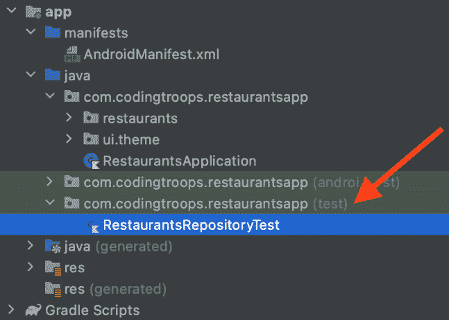
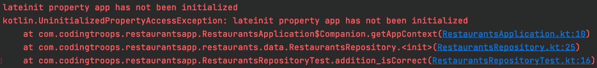
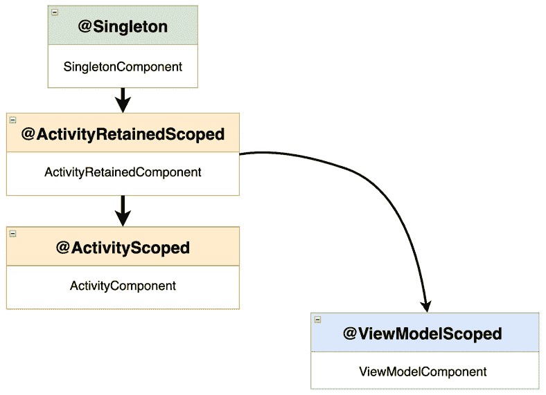
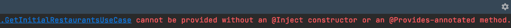

# 第九章：*第九章*：使用 Jetpack Hilt 实现依赖注入

在本章中，我们继续改进 Restaurants 应用的架构设计。更确切地说，我们将把 **依赖注入**（**DI**）融入到我们的项目中。

在第一部分，*什么是 DI？*，我们将从定义 DI 并理解其基本概念开始，从依赖项是什么，依赖项的类型，以及注入代表什么，到依赖容器和手动注入等概念。

之后，在 *为什么需要 DI？* 这一部分，我们将更详细地关注 DI 为我们的项目带来的好处。

在上一节中，*使用 Hilt 实现依赖注入*，我们将首先了解 Jetpack Hilt DI 库的工作原理以及如何使用它，最后，借助它的帮助，我们将把依赖注入融入到我们的 Restaurants 应用程序中。

总结来说，在本章中，我们将涵盖以下内容：

+   什么是 DI？

+   为什么需要 DI？

+   使用 Hilt 实现依赖注入

在深入之前，让我们为本章设置技术要求。

# 技术要求

构建本章的基于 Compose 的 Android 项目通常需要您日常使用的工具；然而，为了顺利跟进，请确保您拥有以下内容：

+   Arctic Fox 2020.3.1 版本的 Android Studio。您也可以使用更新的 Android Studio 版本，甚至可以尝试 Canary 版本，但请注意，IDE 界面和其他生成的代码文件可能与本书中使用的不同。

+   在 Android Studio 中安装了 Kotlin 1.6.10 或更高版本的插件

+   上一章的 Restaurants 应用程序代码

本章的起点是上一章开发的 Restaurants 应用程序。如果您没有跟随上一章的实现，可以通过导航到存储库中的 `Chapter_08` 目录并导入名为 `chapter_8_restaurants_app` 的 Android 项目来访问本章的起点。

要访问本章的解决方案代码，请导航到 `Chapter_09` 目录：[`github.com/PacktPublishing/Kickstart-Modern-Android-Development-with-Jetpack-and-Kotlin/tree/main/Chapter_09/chapter_9_restaurants_app`](https://github.com/PacktPublishing/Kickstart-Modern-Android-Development-with-Jetpack-and-Kotlin/tree/main/Chapter_09/chapter_9_restaurants_app)。

# 什么是 DI？

简而言之，**DI** 代表了提供类所需依赖实例的概念，而不是让它自己构建。但，什么是依赖项？

`ExampleViewModel` 类可能包含一个类型为 `Repository` 的 `repository` 变量：

```kt
class ExampleViewModel {
    private val repository: Repository = Repository()
    fun doSomething() {
        repository.use()
    }
}
```

因此，`ExampleViewModel` 依赖于 `Repository`，或者 `Repository` 是 `ExampleViewModel` 的依赖项。大多数情况下，类有更多的依赖项，但为了简单起见，我们将只关注一个。在这种情况下，`ExampleViewModel` 提供了自己的依赖项，因此创建其实例非常简单：

```kt
fun main() {
    val vm = ExampleViewModel()
    vm.doSomething()
}
```

现在，前面的例子没有实现 DI，主要是因为`ExampleViewModel`为其自己的依赖项提供实例。它是通过实例化一个`Repository`实例（通过`Repository()`构造函数）并将其传递给`repository`变量来做到这一点的。

为了实现 DI，我们必须创建一个提供`ExampleViewModel`依赖项的组件：

```kt
object DependencyContainer {
    val repo: Repository = Repository()
}
```

如其名所示，`DependencyContainer`类将充当**依赖项容器**，因为它将为我们的类提供所有所需的依赖项实例。当一个类需要其依赖项的实例时，这个容器将提供它。这样，我们可以在项目的单个位置集中处理依赖项实例的创建过程（这对于具有其他依赖项的复杂项目来说可能会变得复杂）。

注意

除了 DI 技术，您还可以使用`ServiceLocator`组件。DI 和服务定位器模式都很有用；然而，在本章中我们只会介绍 DI。

回到实现 DI，我们接下来必须允许`DependencyContainer`为`ExampleViewModel`提供一个`Repository`实例：

```kt
class ExampleViewModel {
    private val repository: Repository = 
        DependencyContainer.repo
    fun doSomething() {
        repository.use()
    }
}
```

这种将依赖项声明为变量（例如，`ExampleViewModel`包含一个`repository`变量）然后通过容器提供其实例的技术，是一种称为**字段注入**的 DI 形式。

这种方法有几个问题，主要是由我们将依赖项声明为字段变量的事实引起的。最显著的问题如下：

+   `ExampleViewModel`类与我们的`DependencyContainer`紧密耦合，我们不能在没有它的情况下使用`ViewModel`。

+   依赖项是`ExampleViewModel`不知道`ViewModel`类的依赖项或它们的创建。

这将不允许我们使用相同的`ExampleViewModel`与其他依赖项的实现（考虑到其依赖项，如`Repository`，是可以通过不同类实现的接口）一起重用。

+   由于`ExampleViewModel`有隐藏的依赖项，这使得我们很难对其进行测试。当我们实例化`ExampleViewModel`并将其置于测试之下时，它将创建自己的`Repository`实例，这可能会为每个测试进行真实的 I/O 请求。我们希望我们的测试快速且可靠，并且不依赖于真实的第三方 API。

为了减轻这些问题，我们首先必须重构`ExampleViewModel`，使其通过其公共 API 向外界暴露其依赖项。最合适的方法是通过其公共`构造函数`：

```kt
class ExampleViewModel constructor(private val repo: Repository) {
    fun doSomething() { repo.use() }
}
```

现在，`ExampleViewModel`通过其构造函数向外界暴露其依赖项，使这些依赖项**明确化**。然而，谁将提供外部的依赖项呢？

当我们需要实例化`ExampleViewModel`时，`DependencyContainer`将提供它所需的依赖项：

```kt
fun main() {
    val repoDependency = DependencyContainer.repository
val vm = ExampleViewModel(repoDependency)
vm.doSomething()
}
```

在前面的例子中，我们不是使用字段注入，而是通过其构造函数从外部世界使用`ExampleViewModel`。

与字段注入相比，构造函数注入允许我们做以下事情：

+   将我们的类与 DI 容器解耦，就像`ExampleViewModel`不再依赖于`DependencyContainer`一样。

+   依赖项暴露给外部世界，因此我们可以使用相同的`ExampleViewModel`与其他`Repository`实现（假设`Repository`是一个接口）一起重用。

+   `ExampleViewModel`类不能再决定获取并使用哪种依赖实现，就像字段注入那样，所以我们现在将这个责任从`ExampleViewModel`反转给了外部世界。

+   `ExampleViewModel`更容易测试，因为我们可以轻松传递一个模拟或伪造的`Repository`实现（假设`Repository`是一个接口），它将在测试中以我们期望的方式表现。

到目前为止，借助依赖容器，我们通过允许`DependencyContainer`为我们提供依赖项的实例（即`ExampleViewModel`的实例）来自己实现 DI。这种技术被称为**手动 DI**。

除了手动 DI 之外，你还可以通过框架自动完成 DI，这些框架可以减轻你以下负担：

+   为需要它们的类提供依赖项的实例。更具体地说，框架帮助您为所需的依赖项配置复杂的对象关系，因此您不必编写样板代码来生成实例并将它们传递给适当的对象。这种基础设施代码对于大型应用程序来说通常很繁琐，因此一个为您自动完成这项工作的框架可以非常方便。

+   将依赖项的范围限制在特定的生命周期范围内，例如`Application`范围或`Activity`范围。例如，如果你想某个依赖项是单例（即与应用程序的生命周期相关联），你必须手动确保在内存中只创建一个实例，同时避免由于并发访问而导致的并发问题。框架可以在幕后为你完成这项工作。

在 Android 中，一个非常简单的 DI 库是**Hilt**，我们将在*使用 Hilt 实现 DI*部分中探讨它。但在此之前，让我们更好地理解为什么 DI 最初是必要的。

# 为什么需要 DI？

DI 并非所有项目都必须使用。到目前为止，我们的餐厅应用在没有集成 DI 的情况下运行得很好。然而，虽然不包含 DI 可能看起来不是一个大问题，但通过引入它，你可以给你的项目带来很多好处；最显著的优势是你可以做以下事情：

+   编写更少的样板代码。

+   编写可测试的类。

让我们接下来讨论这两点。

## 编写更少的样板代码

让我们回到我们的餐厅应用，看看我们如何在`RestaurantsRepository`类中实例化 Retrofit 接口：

```kt
class RestaurantsRepository {
    private var restInterface: RestaurantsApiService =
        Retrofit.Builder()
             .addConverterFactory(
                 GsonConverterFactory.create())
             .baseUrl("your_firebase_database_url")
            .build()
            .create(RestaurantsApiService::class.java)
    [...]
}
```

现在，让我们看看我们如何在`RestaurantsDetailsViewModel`类中类似地实例化 Retrofit 接口：

```kt
class RestaurantDetailsViewModel(…): ViewModel() {
    private var restInterface: RestaurantsApiService
    [...]
    init {
        val retrofit: Retrofit = Retrofit.Builder()
            .addConverterFactory(GsonConverterFactory.create())
            .baseUrl("your_firebase_database_url")
            .build()
        restInterface = retrofit
            .create(RestaurantsApiService::class.java)
        [...]
    }
    [...]
}
```

虽然代码看起来不同，但本质上，它需要实例化`RestaurantsApiService`具体实例的相同代码。不幸的是，我们在两个地方重复了此实例化代码，即在`RestaurantsRepository`类和`RestaurantsDetailsViewModel`类中。

在中等或大型生产应用中，对象之间的关系通常要复杂得多，这使得此类基础设施代码成为每个类的常见问题，主要是因为，在没有任何依赖注入（DI）的情况下，每个类都会构建它所需的依赖项的实例。此类代码通常在整个项目中重复出现，最终变得难以管理。

DI 将帮助我们集中管理此类基础设施代码，并将消除在整个项目中提供依赖项实例所需的所有重复代码。

回到我们的餐厅应用，如果我们使用手动 DI，所有这些实例化代码都可以提取到一个`DependencyContainer`类中，该类会在我们需要的地方提供`RestaurantsApiService`实例，这样我们就没有更多的重复代码了！别担心，我们将在即将到来的*使用 Hilt 实现 DI*部分中引入 DI。

现在我们已经讨论了 DI 如何帮助我们包含和组织与构建类实例相关的代码，现在是时候检查 DI 的另一个基本优势了。

## 编写可测试的类

假设我们想要测试`RestaurantsRepository`的行为，以确保它按预期执行。但首先，让我们快速查看`RestaurantsRepository`的现有实现：

```kt
class RestaurantsRepository {
    private var restInterface: RestaurantsApiService = 
        Retrofit.Builder()
            .[...]
            .create(RestaurantsApiService::class.java)
    private var restaurantsDao = RestaurantsDb
        .getDaoInstance(
            RestaurantsApplication.getAppContext()
        )
    suspend fun toggleFavoriteRestaurant(…) = {…}
    suspend fun getRestaurants(): List<Restaurant> {…}
    [...]
}
```

我们可以看到，目前还没有引入 DI，因为`RestaurantsRepository`有两个隐式依赖项：一个`RestaurantsApiService`实例和一个`RestaurantsDao`实例。`RestaurantsRepository`通过构造一个`Retrofit.Builder()`对象并调用`.create(…)`来创建具体实例，首先为它的依赖项提供实例。

现在，假设我们想要测试这个`RestaurantsRepository`类，并通过运行不同的验证来确保它表现正确。让我们想象这样一个测试类会是什么样子：

```kt
class RestaurantsRepositoryTest {
    @Test
    fun repository_worksCorrectly() {
        val repo = RestaurantsRepository()
        assertNotNull(repo)
        // Perform other verifications
    }
}
```

之前的测试结构很简单：我们通过其构造函数创建了一个`RestaurantsRepository`实例，并将其保存在`repo`变量中。然后我们断言`Repository`实例不是`null`，这样我们就可以继续测试其行为。

这虽然是可选的，但如果你正在尝试编写前面的测试类并遵循此流程，请确保`RestaurantsRepositoryTest`类放置在应用程序的`test`目录中：



图 9.1 – 测试类在项目结构中的位置

现在，如果我们尝试运行这个测试，它将在有机会验证任何内容之前抛出异常。堆栈跟踪将如下所示：




图 9.2 – 运行无效测试的堆栈跟踪

这是因为我们试图为`RestaurantsRepository`编写一个小测试，但这个类目前还不能进行测试（实际上，我们正在尝试执行单元测试——我们将在*第十章*，*使用 UI 和单元测试测试您的应用程序*)中更详细地讨论这个问题）。

但是，为什么我们的简单测试会抛出`UninitializedPropertyAccessException`？

如果我们查看堆栈跟踪，我们可以看到崩溃是由于我们的测试尝试通过`RestaurantsApplication`类中的`getAppContext()`方法获取应用程序上下文而引起的。

这是有道理的，因为如果我们再次查看`RestaurantsRepository`，我们可以看到为了获取`restaurantsDao`实例，`Repository`调用`RestaurantsDb.getDaoInstance()`来初始化 Room 数据库，而这需要`Context`实例来完成：

```kt
class RestaurantsRepository {
    […]
    private var restaurantsDao = RestaurantsDb
        .getDaoInstance(
            RestaurantsApplication.getAppContext()
        )
    suspend fun toggleFavoriteRestaurant(…) = {…}
    suspend fun getRestaurants(): List<Restaurant> {…}
    [...]
}
```

我们的小测试不需要`Context`对象，仅仅是因为它不应该尝试创建 Room 数据库，也不应该创建 Retrofit 客户端实例；它甚至不应该依赖于这些具体实现。这对于小测试来说并不高效，因为这些操作内存开销大，只会使我们的测试变慢。

此外，我们不想让我们的小测试（应该轻松运行，非常快，在短时间内多次运行）通过 Room 查询，或者更糟糕的是，通过 Retrofit 进行网络请求，仅仅是因为测试依赖于外部世界，因此它们变得昂贵且难以自动化。

然而，如果我们已经实现了构造函数注入的依赖注入，我们就可以创建自己的类来*模拟*行为，最终使我们的`Repository`类易于测试，并且独立于执行重 I/O 操作的具体实现。我们将在*第十章*，*使用 UI 和单元测试测试您的应用程序*)中更详细地介绍关于测试和*模拟*的内容。

回到我们的应用程序，我们还没有准备好编写测试，因为正如你所看到的，我们在项目中缺少 DI。现在我们已经看到，没有 DI，生活似乎有些艰难，让我们学习如何使用 Hilt 库将 DI 集成到 Restaurants 应用程序中！

# 使用 Hilt 实现 DI

DI 库通常用于简化并加速我们在项目中集成 DI，尤其是在手动 DI 所需的基础设施代码在大型项目中难以管理时。

**Hilt**是 Jetpack 的一部分的 DI 库，它通过生成您否则必须手动开发的代码和基础设施，消除了 Android 应用程序中手动依赖注入的冗余代码。

注意

Hilt 是一个基于另一个流行的依赖注入框架 **Dagger** 的 DI 库，这意味着它们之间有很强的关联，因此在本章中我们经常将 Hilt 称为 *Dagger Hilt*。由于 Dagger API 的学习曲线陡峭，Hilt 被开发为一个抽象层，以允许在 Android 项目中更容易地采用自动 DI。

Dagger Hilt 依赖于注解处理器在构建时自动生成代码，这使得它能够创建和优化在整个项目中管理和提供依赖项的过程。正因为如此，其核心概念与注解的使用紧密相连，因此在我们开始向我们的餐馆应用中添加和实现 Hilt 之前，我们必须首先了解一些概念，以便更好地理解 Dagger Hilt 的工作原理。

总结一下，在本节中我们将进行以下操作：

+   理解 Dagger Hilt 的基础知识

+   设置 Hilt

+   使用 Hilt 进行依赖注入

让我们开始吧！

## 理解 Dagger Hilt 的基础知识

让我们分析三个最重要的概念及其对应的注解，这些注解是我们为了在项目中启用自动 DI 所必须与之合作的：

+   注入

+   模块

+   组件

让我们开始注入吧！

### 注入

Dagger Hilt 需要知道我们希望它为我们提供的实例类型。当我们讨论手动构造函数注入时，我们最初希望 `ExampleViewModel` 在需要的地方被注入，为此我们使用了 `DependencyContainer` 类。

如果我们想让 Dagger Hilt 在某个地方注入类的实例，我们必须首先声明一个该类型的变量，并用 `@Inject` 注解它。

假设在我们用于手动 DI 示例的 `main()` 函数中，我们不再想使用手动 DI 来获取 `ExampleViewModel` 的实例。相反，我们希望 Dagger 实例化这个类。这就是为什么我们将 `ExampleViewModel` 变量用 Java 的 `@Inject` 注解，并避免自己实例化 `ViewModel` 类。现在，Dagger Hilt 应该为我们做这件事：

```kt
import javax.inject.Inject
@Inject
val vm: ExampleViewModel
fun main() {
    vm.doSomething()
}
```

现在，为了使 Dagger Hilt 知道如何为我们提供 `ExampleViewModel` 类的实例，我们还必须将 `@Inject` 注解添加到 `ExampleViewModel` 的依赖项上，这样 Dagger 就知道如何实例化 `ViewModel` 类。

由于 `ExampleViewModel` 的依赖项位于构造函数中（从我们使用手动构造函数注入时开始），我们可以直接在 `constructor` 上添加 `@Inject` 注解：

```kt
class ExampleViewModel @Inject constructor(private val repo:Repository) {
    fun doSomething() { repo.use() }
}
```

现在，Dagger Hilt 还需要知道如何注入 `ExampleViewModel` 的依赖项，更确切地说，是 `Repository` 类。

让我们假设 `Repository` 只有一个依赖项，一个 `Retrofit` 构造函数变量。为了使 Dagger 知道如何注入 `Repository` 类，我们必须用 `@Inject` 注解其构造函数：

```kt
class Repository @Inject constructor(val retrofit: Retrofit){
    fun use() { retrofit.baseUrl() }
}
```

到目前为止，我们通过`@Inject`注解得以幸免，因为我们有访问我们试图注入的类和依赖项，但现在，Dagger 如何知道如何为我们提供`Retrofit`实例呢？我们没有方法进入`Retrofit`类并注解其构造函数为`@Inject`，因为它位于外部库中。

要指导 Dagger 如何为我们提供特定的依赖项，让我们了解一下模块吧！

### 模块

`@Module`允许我们指导 Dagger Hilt 如何提供依赖。例如，我们需要 Dagger Hilt 为我们提供`Repository`中的`Retrofit`实例，因此我们可以定义一个`DataModule`类，告诉 Dagger Hilt 如何这样做：

```kt
@Module
object DataModule {
    @Provides
    fun provideRetrofit(): Retrofit {
        return Retrofit.Builder().baseUrl("some_url").build()
    }
}
```

要告诉库如何为我们提供依赖项，我们必须在`@Module`注解的类内部创建一个方法，手动构建该类的实例。

由于我们没有访问`Retrofit`类，并且需要将其注入，因此我们创建了一个带有`@Provides`注解的`provideRetrofit()`方法（你可以按任何你想要的方式调用它），它返回一个`Retrofit`对象。在方法内部，我们手动创建了`Retrofit`实例，按照我们需要的构建方式。

现在，Dagger Hilt 知道如何为我们提供`ExampleViewModel`需要的所有依赖（它的直接`Repository`依赖和`Repository` `Retrofit`依赖）。然而，Dagger 会抱怨它需要一个组件类，其中我们必须安装我们创建的模块。

让我们简要地看看组件吧！

### 组件

**组件**是表示一组特定依赖项的接口。组件接受模块并确保其依赖项的注入与特定的生命周期相符合。

对于我们的`ExampleViewModel`、`Repository`和`Retrofit`依赖项的示例，假设我们创建一个管理这些依赖项创建的组件。

使用 Dagger Hilt，你可以使用`@DefineComponent`注解定义一个组件：

```kt
@DefineComponent()
interface MyCustomComponent(…) { /* component build code */ }
```

然后，我们可以在该组件中安装我们的`DataModule`：

```kt
@Module
@InstallIn(MyCustomComponent::class)
object DataModule {
    @Provides
    fun provideRetrofit(): Retrofit { […] }
}
```

实际上，定义和构建组件的过程比这更复杂。这是因为组件必须将其依赖项范围到某个生命周期范围内（例如应用程序的生命周期）并且有一个预存在的父组件。

幸运的是，Hilt 为我们提供了现成的组件。这些预定义的组件允许我们在其中安装模块，并将依赖项范围到它们对应的生命周期范围内。

其中一些最重要的预定义组件如下：

+   `SingletonComponent`：允许我们通过使用`@Singleton`注解将依赖项范围到应用程序的生命周期，作为单例。每次请求带有`@Singleton`注解的依赖项时，Dagger 都会提供相同的实例。

+   `ActivityComponent`：允许我们使用 `@ActivityScoped` 注解将依赖项的范围限定为 `Activity` 的生命周期。如果 `Activity` 被重建，将提供一个新的依赖项实例。

+   `ActivityRetainedComponent`：允许我们使用 `@ActivityRetainedScoped` 注解将依赖项的范围限定为 `Activity` 的生命周期，超越其方向改变后的重建。如果 `Activity` 在方向改变时被重建，将提供相同的依赖项实例。

+   `ViewModelComponent`：允许我们使用 `@ViewModelScoped` 注解将依赖项的范围限定为 `ViewModel` 的生命周期。

由于这些组件的生命周期范围不同，这也转化为每个组件从彼此那里推导出其生命周期范围，从最宽的 `@Singleton` 生命周期范围（应用）到更窄的范围，如 `@ActivityScoped`（活动）：



图 9.3 – Dagger Hilt 范围注解及其对应组件的简化版本

在我们的餐厅应用中，我们将主要使用 `SingletonComponent` 和其 `@Singleton` 范围注解；重要的是要注意，Dagger Hilt 提供了更广泛预定义的组件和范围。您可以在以下文档中查看它们：[`dagger.dev/hilt/components.html`](https://dagger.dev/hilt/components.html)。

现在我们简要介绍了组件，是时候将 Hilt 添加到我们的餐厅应用中了！

## 设置 Hilt

在使用 Hilt 注入依赖项之前，我们必须首先设置 Hilt。让我们开始吧！

1.  在项目级别的 `build.gradle` 文件中，在 `dependencies` 块内，添加 Hilt-Android Gradle 依赖项：

    ```kt
    buildscript {
        ...
        dependencies {
            ...
            classpath 'com.google.dagger:hilt-android-
                gradle-plugin:2.40.5'
        }
    }
    ```

1.  在应用级别的 `build.gradle` 文件中移动，在 `plugins` 块内添加 Dagger Hilt 插件：

    ```kt
    plugins {
        […]
        id 'kotlin-kapt'
        id 'dagger.hilt.android.plugin'
    }
    ```

1.  仍然在应用级别的 `build.gradle` 中，在 `dependencies` 块内，添加 Android-Hilt 依赖项：

    ```kt
    dependencies {
        […]
        implementation "com.google.dagger:hilt-
            android:2.40.5"
        kapt "com.google.dagger:hilt-compiler:2.40.5"
    }
    ```

`kapt` 关键字代表 **Kotlin 注解处理器工具**，它是 Dagger Hilt 生成基于我们将使用的注解的代码所必需的。

更新 `build.gradle` 文件后，请确保将项目与其 Gradle 文件同步。您可以通过点击 **文件** 菜单选项，然后选择 **与 Gradle 文件同步项目** 来完成此操作。

1.  使用 `@HiltAndroidApp` 注解标注 `RestaurantsApplication` 类：

    ```kt
    @HiltAndroidApp
    class RestaurantsApplication: Application() { […] }
    ```

要使用 Hilt 的自动化依赖注入，我们必须使用 `HiltAndroidApp` 注解来标注我们的 `Application` 类。这个注解允许 Hilt 生成与依赖注入相关的样板代码，从应用级别的依赖容器开始。

1.  构建项目以触发 Hilt 的代码生成。

1.  可选地，如果您想查看生成的类，首先，展开左侧的 **项目** 选项卡，然后展开生成代码的包。这些类是 Hilt 在幕后生成大量代码的证明，这样我们可以更容易地实现依赖注入：

![Figure 9.4 – Automatically generated classes by Hilt]

![img/B17788_09_4.jpg]

图 9.4 – Hilt 自动生成的类

让我们继续实际的实现！

## 使用 Hilt 进行依赖注入

在本小节中，我们将使用 Hilt 在应用的第一屏中实现依赖注入，该屏显示餐厅列表。换句话说，我们希望注入 `RestaurantsScreen()` 所需或依赖的所有依赖项。

为了有一个起点，让我们看看 `RestaurantsScreen()` 目的地中的 `RestaurantsApp()` 组合函数，看看我们首先需要注入什么：

```kt
@Composable
private fun RestaurantsApp() {
   val navController = rememberNavController()
   NavHost(navController, startDestination = "restaurants") {
      composable(route = "restaurants") {
         val viewModel: RestaurantsViewModel = viewModel()
         RestaurantsScreen(state = viewModel.state.value, […])
      }
      composable(…) { RestaurantDetailsScreen() }
   }
}
```

很明显，`RestaurantsScreen()` 依赖于 `RestaurantsViewModel` 来获取其状态并消费它。

这意味着我们必须首先在 `RestaurantsScreen()` 所在的 `composable()` 目的地中注入一个 `RestaurantsViewModel` 实例：

1.  由于我们无法在组合函数内部添加 `@Inject` 注解，我们必须使用一个特殊的组合函数来注入 `ViewModel`。为此，首先，在应用级别的 `build.gradle` 文件的 `dependencies` 块中添加 `hilt-navigation-compose` 依赖项：

    ```kt
    dependencies {
        […]
        implementation "com.google.dagger:hilt-
            android:2.40.5"
        kapt "com.google.dagger:hilt-compiler:2.40.5"
        implementation 'androidx.hilt:hilt-navigation-
            compose:1.0.0'
    }
    ```

更新 `build.gradle` 文件后，请确保将项目与其 Gradle 文件同步。您可以通过点击 **文件** 菜单选项，然后选择 **与 Gradle 文件同步项目** 来完成此操作。

1.  然后，回到 `RestaurantsApp()` 组合函数内部，在我们的 `RestaurantsScreen()` 组合函数的 DSL `composable()` 目标中，将 `RestaurantsViewModel` 的 `viewModel()` 构造函数替换为 `hiltViewModel()` 组合函数：

    ```kt
    @Composable
    private fun RestaurantsApp() {
       val navController = rememberNavController()
       NavHost(navController, startDestination = 
               "restaurants") {
          composable(route = "restaurants") {
             val viewModel: RestaurantsViewModel = 
                 hiltViewModel()
             RestaurantsScreen(…)
          }
          composable(…) { RestaurantDetailsScreen() }
       }
    }
    ```

`hiltViewModel()` 函数注入一个 `RestaurantsViewModel` 实例，其作用域与 `RestaurantsScreen()` 导航组件目标的生命周期相同。

1.  由于现在我们的组合层次结构在 Hilt 的帮助下在某个点注入了一个 `ViewModel`，我们必须使用 `@AndroidEntryPoint` 注解来注释 `RestaurantsApp()` 根组合函数的宿主 Android 组件。在我们的例子中，`RestaurantsApp()` 组合函数由 `MainActivity` 类托管，因此我们必须使用 `@AndroidEntryPoint` 注解来注释它：

    ```kt
    @AndroidEntryPoint
    class MainActivity : ComponentActivity() {
        override fun onCreate(savedInstanceState: Bundle?) {
            super.onCreate(savedInstanceState)
            setContent {
                RestaurantsAppTheme { RestaurantsApp() }
            }
        }
    }
    ```

`@AndroidEntryPoint` 注解为我们的 `Activity` 生成另一个组件，其生命周期比应用程序的生命周期更短。更确切地说，这个组件允许我们将依赖项的作用域限定到我们的 `Activity` 的生命周期。

1.  在 `RestaurantsViewModel` 类中，首先将其重构为通过将其移动到其构造函数中来显式声明其依赖项，从而通过构造函数注入提高可测试性：

    ```kt
    class RestaurantsViewModel constructor(
       private val getRestaurantsUseCase: 
           GetInitialRestaurantsUseCase,
        private val toggleRestaurantsUseCase: 
            ToggleRestaurantUseCase
    ) : ViewModel() {
        private val _state = mutableStateOf(...)
        [...]
    }
    ```

注意，虽然我们将两个 Use Case 变量提取到构造函数中，但我们不再实例化它们——我们将留给 Hilt 来完成。

1.  为了让 Hilt 帮我们注入 `RestaurantsViewModel`，用 `@HiltViewModel` 注解标记 `ViewModel`，同时用 `@Inject` 注解其构造函数，以便 Hilt 理解 `ViewModel` 的哪些依赖项必须由 Hilt 提供：

    ```kt
    @HiltViewModel
    class RestaurantsViewModel @Inject constructor(
       private val getRestaurantsUseCase: […] ,
       private val toggleRestaurantsUseCase: […]) : 
           ViewModel() {
        [...]
    }
    ```

现在，由于我们的 `ViewModel` 被标记为 `@HiltViewModel`，`RestaurantsViewModel` 的实例将由尊重 `ViewModel` 生命周期的 `ViewModelComponent` 提供（绑定到可组合目的地的生命周期，同时也能在配置更改中存活）。

1.  现在，我们已经指导 Hilt 如何提供 `RestaurantsViewModel`，我们可能会认为我们已经完成了；然而，如果我们构建应用程序，我们将得到这个异常：



图 9.5 – Hilt 编译错误

问题在于，虽然我们指示 Hilt 注入 `RestaurantsViewModel` 及其依赖项，但我们从未确保 Hilt 知道如何提供这些依赖项：既没有 `GetInitialRestaurantsUseCase` 依赖项，也没有 `ToggleRestaurantsUseCase` 依赖项。

换句话说，如果我们想注入 `RestaurantsViewModel`，我们需要确保其依赖项可以由 Hilt 提供，以及它们的依赖项，依此类推。

1.  让我们先确保 Hilt 知道如何将 `GetInitialRestaurantsUseCase` 注入到 `RestaurantsViewModel` 中。在 `GetInitialRestaurantsUseCase` 类中，将其依赖项移动到构造函数中，并用 `@Inject` 标记，就像我们对 `RestaurantsViewModel` 做的那样：

    ```kt
    class GetInitialRestaurantsUseCase @Inject constructor(
        private val repository: RestaurantsRepository,
        private val getSortedRestaurantsUseCase: 
            GetSortedRestaurantsUseCase) {
        suspend operator fun invoke(): List<Restaurant> { … }
    }
    ```

在构造函数中添加 `repository` 和 `getSortedRestaurantsUseCase` 变量后，请记住从 `GetInitialRestaurantsUseCase` 的主体中删除旧成员变量以及它们的实例化代码。

注意，我们没有在 `GetInitialRestaurantsUseCase` 类上使用任何 Hilt 作用域注解，仅仅是因为我们不希望它与某个生命周期作用域绑定。

现在，Hilt 知道如何注入 `GetInitialRestaurantsUseCase` 类，但我们也必须指导 Hilt 如何提供其依赖项：`RestaurantsRepository` 和 `GetSortedRestaurantsUseCase`。

我们需要确保 Hilt 知道如何提供 `RestaurantsRepository` 的实例。我们可以看到，它的依赖项是 `RestaurantsApiService`（Retrofit 接口）和 `RestaurantsDao`（Room 数据访问对象接口）：

```kt
class RestaurantsRepository {
    private var restInterface: RestaurantsApiService =
        Retrofit.Builder()
        […]
        .create(RestaurantsApiService::class.java)
    private var restaurantsDao = RestaurantsDb
        .getDaoInstance(
            RestaurantsApplication.getAppContext()
        )
    […]
}
```

这里的问题是，一旦我们将这些依赖项放入构造函数并注入它们，Hilt 就将无法知道如何提供它们——仅仅是因为我们无法像对 `RestaurantsViewModel`、`GetInitialRestaurantsUseCase` 和现在的 `RestaurantsRepository` 那样，深入 Room 或 Retrofit 的内部工作并注入它们的依赖项。

为了让 Hilt 知道如何提供我们无法触及的依赖项，我们必须创建一个 `module` 类，在其中我们将指导 Hilt 如何提供 `RestaurantsApiService` 和 `RestaurantsDao` 的实例：

1.  展开 `restaurants` 包，然后在 `data` 包上右键单击，创建一个名为 `di`（代表依赖注入）的新包。在这个包内部，创建一个名为 `RestaurantsModule` 的新 `object` 类，并在其中添加以下代码：

    ```kt
    @Module
    @InstallIn(SingletonComponent::class)
    object RestaurantsModule { }
    ```

`RestaurantsModule` 将允许我们指导 Hilt 如何向 `RestaurantsRepository` 提供 Room 和 Retrofit 依赖项。由于这是一个 Hilt 模块，我们做了以下操作：

+   使用 `@Module` 注解，以便 Hilt 识别它为一个提供依赖项实例的模块。

+   使用 `@InstallIn()` 注解，并传递了 Hilt 提供的预定义 `SingletonComponent` 组件。由于我们的模块安装在这个组件中，包含的依赖项可以在应用程序的任何地方提供，因为 `SingletonComponent` 是一个应用程序级别的依赖项容器。

1.  接下来，在 `RestaurantsModule` 中，我们需要告诉 Hilt 如何提供我们的依赖项，因此我们将从 `RestaurantsDao` 开始。为了获取 `RestaurantsDao` 的实例，我们必须首先指导 Hilt 如何实例化 `RestaurantsDb` 类。

添加一个带有 `@Provides` 注解的 `provideRoomDatabase` 方法，该方法将指导 Hilt 如何通过从 `RestaurantsDb` 类的 `companion object` 中借用部分 `database` 类的实例化代码来提供一个 `RestaurantsDb` 对象：

```kt
@Module
@InstallIn(SingletonComponent::class)
object RestaurantsModule {
    @Singleton
    @Provides
    fun provideRoomDatabase(
        @ApplicationContext appContext: Context
    ): RestaurantsDb {
        return Room.databaseBuilder(
            appContext,
            RestaurantsDb::class.java,
            "restaurants_database"
        ).fallbackToDestructiveMigration().build()
    }
}
```

首先，我们使用 `@Singleton` 实例注解了 `provideRoomDatabase()` 方法，这样 Hilt 就会为整个应用程序创建一个 `RestaurantsDb` 实例，从而节省内存。

然后，我们可以看到 `provideRoomDatabase()` 方法构建了一个 `RestaurantsDb` 实例，但为了使其工作，我们需要向 `Room.databaseBuilder()` 方法提供应用程序级别的上下文。为此，我们通过将 `Context` 对象作为 `provideRoomDatabase()` 方法的参数传递，并使用 `@ApplicationContext` 注解来实现这一点。

要了解 Hilt 如何为我们提供应用程序 `Context` 对象，我们必须首先注意，每个 Hilt 容器都附带一组默认绑定，我们可以将其作为依赖项注入。`SingletonComponent` 容器通过定义 `@ApplicationContext` 注解，在需要的地方为我们提供应用程序级别的 `Context` 对象。

1.  现在，Hilt 知道为我们提供 `RestaurantsDb`，我们可以创建另一个 `@Provides` 方法，该方法接受一个 `RestaurantsDb` 变量（Hilt 将知道如何提供）并返回一个 `RestaurantsDao` 实例：

    ```kt
    @Module
    @InstallIn(SingletonComponent::class)
    object RestaurantsModule {
      @Provides
    fun provideRoomDao(database: RestaurantsDb): 
          RestaurantsDao  {
            return database.dao
      }
      @Singleton
      @Provides
      fun provideRoomDatabase(
          @ApplicationContext appContext: Context
      ): RestaurantsDb { ... }
    }
    ```

1.  仍然在 `RestaurantsModule` 中，我们现在必须告诉 Hilt 如何为我们提供一个 `RestaurantsApiService` 的实例。像之前一样操作，但这次添加一个为 `Retrofit` 实例的 `@Provides` 方法，以及一个为 `RestaurantsApiService` 实例的 `@Provides` 方法。现在，`RestaurantsModule` 应该看起来像这样：

    ```kt
    @Module
    @InstallIn(SingletonComponent::class)
    object RestaurantsModule {
        @Provides
        fun provideRoomDao(database: RestaurantsDb): […] {
            return database.dao
        }
        @Singleton
        @Provides
        fun provideRoomDatabase(@ApplicationContext
            appContext: Context): RestaurantsDb {  [...]  }
        @Singleton
        @Provides
        fun provideRetrofit(): Retrofit {
            return Retrofit.Builder()
                .addConverterFactory([…])
                .baseUrl("[…]")
                .build()
        }
        @Provides
        fun provideRetrofitApi(retrofit: Retrofit):  
            RestaurantsApiService {
        return retrofit
            .create(RestaurantsApiService::class.java)
        }
    }
    ```

记住所有这些实例化代码都位于 `RestaurantsRepository` 中，因此你可以从那里获取。

1.  现在 Hilt 知道如何提供 `RestaurantsRepository` 的两个依赖项，让我们回到 `RestaurantsRepository` 类，并使用 Hilt 应用构造函数注入，通过在构造函数上添加 `@Inject` 注解，并将其 `RestaurantsApiService` 和 `RestaurantsDao` 依赖项移动到构造函数中：

    ```kt
    @Singleton
    class RestaurantsRepository @Inject constructor(
        private val restInterface: RestaurantsApiService,
        private val restaurantsDao: RestaurantsDao
    ) {
        suspend fun toggleFavoriteRestaurant(…) = […]
             […]  
        }
    ```

通常，`Repository` 类有一个静态实例，这样在整个应用程序中只有一个实例被重用。当在 `Repository` 类中全局存储不同的数据时，这很有用（在使用系统启动的进程死亡时要小心，因为这会清除内存中的所有内容！）。

最后，为了有一个可以在整个应用程序中重用的 `RestaurantsRepository` 实例，我们使用 `@Singleton` 注解了这个类。这个注解由 Hilt 的 `SingletonComponent` 容器提供，允许我们将类的实例范围限定在应用程序的生命周期内。

1.  现在 Hilt 知道如何注入 `RestaurantsRepository`，让我们回到 `GetInitialRestaurantsUseCase` 的其他剩余依赖项：`GetSortedRestaurantsUseCase` 类。进入这个类，并确保通过将 `repository` 变量移动到构造函数中（就像我们之前对其他类所做的那样）来注入其依赖项：

    ```kt
    class GetSortedRestaurantsUseCase @Inject constructor(
        private val repository: RestaurantsRepository
    ) {
        suspend operator fun invoke(): List<Restaurant> {
            return repository.getRestaurants()
                .sortedBy { it.title }
        }
    }
    ```

虽然我们已经用范围注解注解了 `RestaurantsRepository`，但我们没有为这个 Use Case 类添加任何范围注解，仅仅是因为我们不希望实例在特定的生命周期内被保留。

现在，我们已经指导 Hilt 如何为 `RestaurantsViewModel` 的第一个依赖项提供所有依赖项，即 `GetInitialRestaurantsUseCase`！

1.  接下来，让我们告诉 Hilt 如何为 `RestaurantsViewModel` 的第二个和最后一个依赖项 `ToggleRestaurantUseCase` 类提供依赖项。进入这个类，并确保通过将 `repository` 和 `getSortedRestaurantsUseCase` 变量移动到构造函数中（就像我们之前对其他类所做的那样）来注入其依赖项：

    ```kt
    class ToggleRestaurantUseCase @Inject constructor(
        private val repository: RestaurantsRepository,
    private val getSortedRestaurantsUseCase: 
            GetSortedRestaurantsUseCase
    ) {
        suspend operator fun invoke(id: Int, oldValue: 
            Boolean): List<Restaurant> {
            val newFav = oldValue.not()
            repository.toggleFavoriteRestaurant(id, newFav)
            return getSortedRestaurantsUseCase()
        }
    }
    ```

1.  可选地，你可以进入 `RestaurantsDb` 类并删除负责为我们 `RestaurantsDao` 提供单例实例的整个 `companion object`。现在，`RestaurantsDb` 类应该更加精简，看起来应该是这样的：

    ```kt
    @Database(
        entities = [LocalRestaurant::class],
        version = 3,
        exportSchema = false
    )
    abstract class RestaurantsDb : RoomDatabase() {
        abstract val dao: RestaurantsDao
    }
    ```

现在可以安全地删除这个实例化代码，因为从现在开始，Hilt 会为我们自动完成这项工作。

1.  此外，如果你遵循了清理 `RestaurantsDb` 类的上一步骤，在 `RestaurantsApplication` 中，你也可以删除这个类中与获取应用程序级 `Context` 对象相关的所有逻辑。从现在开始，Hilt 会为我们自动完成这项工作。

`RestaurantsApplication` 类应该更加精简，看起来应该是这样的：

```kt
@HiltAndroidApp
class RestaurantsApplication: Application()
```

1.  构建并运行应用程序。现在，构建应该成功，因为 Hilt 负责提供我们需要的依赖项。

在 DI 的帮助下，我们现在提高了测试性，同时也提取了与构建类实例相关的样板代码。

作业

我们已经将 DI 与 Hilt 集成到 `RestaurantsApplication` 的第一个屏幕中。然而，项目还没有完全采用 DI，因为我们的应用第二个目的地（由 `RestaurantDetailsScreen()` 组合表示）既没有注入其 `RestaurantDetailsViewModel`，也没有注入这个 `ViewModel` 类的依赖项。作为课后作业，将 DI 集成到这个第二个屏幕中。这将允许你从 `RestaurantDetailsViewModel` 中移除冗余的 Retrofit 客户端实例化 – 记住，你现在可以直接使用 Hilt 注入 `RestaurantsApiService` 实例！

# 摘要

在本章中，我们通过引入 DI 改进了“餐厅应用”的架构。

我们讨论了什么是 DI，并涵盖了其基本概念：具有隐式或显式类型的依赖项、注入、依赖容器和手动注入。

我们随后检查了 DI 为我们的项目带来的主要好处：可测试的类和更少的样板代码。

最后，我们介绍了 DI 框架如何帮助我们进行依赖项注入，并探讨了 Jetpack Hilt 库作为 Android 上 DI 的可行解决方案。之后，我们在“餐厅应用”中结合 Hilt 实施了我们所学的知识。

自从我们引入了依赖注入（DI）后，我们的类可以更容易地进行测试这一点变得更加清晰，因此是时候在下一章开始编写一些测试了！

# 进一步阅读

通常情况下，了解如何使用 Hilt 的基础知识就足够应对大多数项目。然而，有时你可能需要使用 Hilt 或 Dagger 的更高级功能。要了解更多关于 Dagger 以及框架如何通过构建依赖图自动为你创建依赖项的信息，请查看这篇文章：[`medium.com/android-news/dagger-2-part-i-basic-principles-graph-dependencies-scopes-3dfd032ccd82`](https://medium.com/android-news/dagger-2-part-i-basic-principles-graph-dependencies-scopes-3dfd032ccd82)。

同样地，除了我们应用中最常用的 `@Singleton` 作用域之外，Dagger Hilt 还公开了更广泛预定义的组件和作用域，允许你将不同的类范围到各种生命周期。更多关于组件及其作用域的信息，请查看官方文档：[`dagger.dev/hilt/components.html`](https://dagger.dev/hilt/components.html)。

除了组件及其作用域之外，在某些项目中，你可能需要允许在除了 `Activity` 之外的其他 Android 类中进行依赖项的注入。要查看哪些 Android 类可以被标注为 `@AndroidEntryPoint`，请查阅文档：https://dagger.dev/hilt/android-entry-point。
