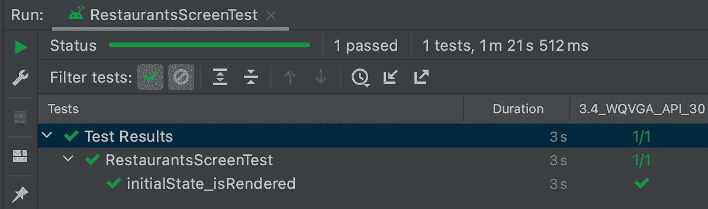
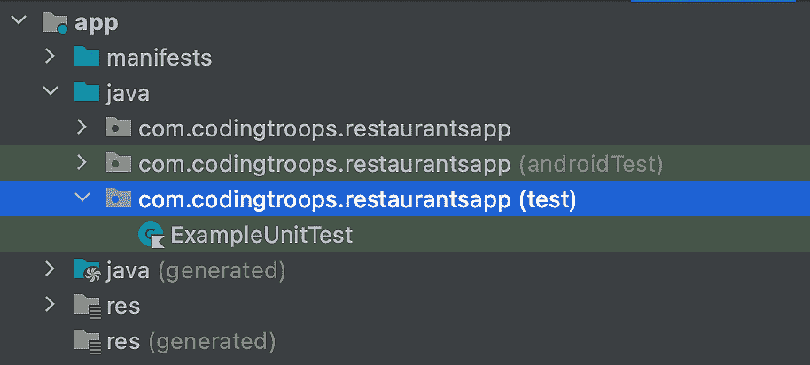
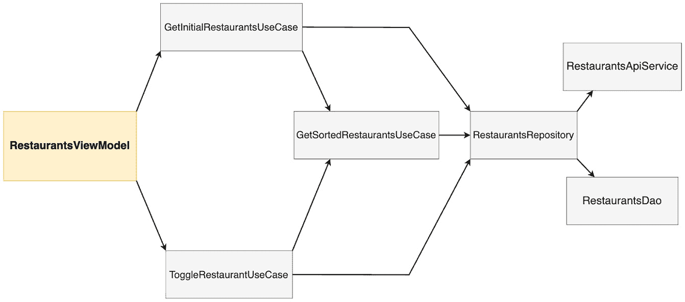
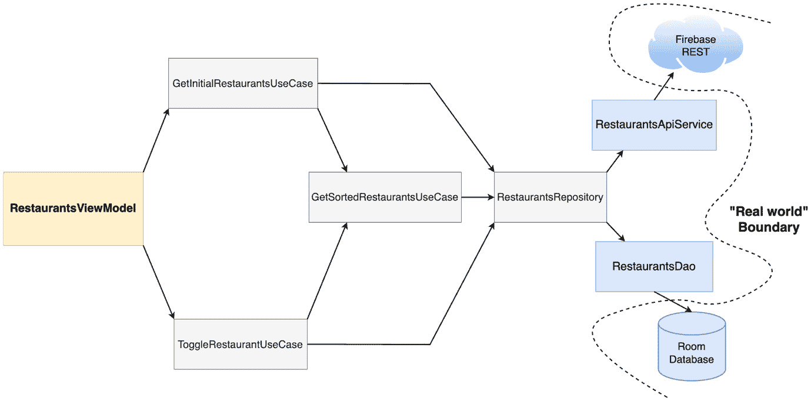
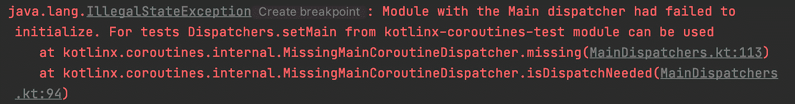
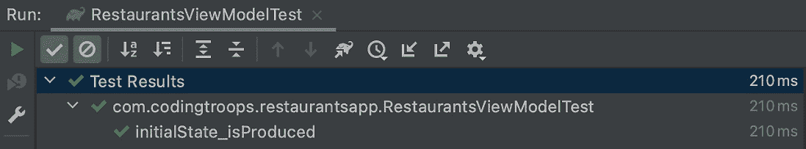

# 第十章：*第十章*：使用 UI 和单元测试测试您的应用

在前面的章节中，我们主要关注的是拥有可测试的架构。我们试图通过解耦不同的组件来实现这一点。

在本章中，由于我们实施的架构，我们将看到测试餐厅应用的不同部分是多么容易进行隔离。

在*探索测试基础*部分，我们将了解测试的好处并探索各种测试类型。在*学习测试 Compose UI 的基础*部分，我们将学习如何测试我们的 Compose UI。

最后，在*覆盖单元测试核心逻辑的基础*部分，我们将学习如何测试餐厅应用的核心功能。

总结来说，在本章中，我们将涵盖以下部分：

+   探索测试的基础

+   学习测试您的 Compose UI 的基础

+   覆盖单元测试核心逻辑的基础

在深入之前，让我们为本章设置技术要求。

# 技术要求

为本章构建基于 Compose 的 Android 项目通常需要您日常使用的工具。然而，为了顺利跟进，请确保您还具备以下条件：

+   Arctic Fox 2020.3.1 版本的 Android Studio。您也可以使用更新的 Android Studio 版本或 Canary 构建，但请注意，IDE 界面和其他生成的代码文件可能与本书中使用的不同。

+   安装在 Android Studio 中的 Kotlin 1.6.10 或更新的插件。

+   前一章中餐厅应用的代码。

本章的起点是前一章中开发的餐厅应用。如果您没有跟随前一章的实现，可以通过导航到存储库的`Chapter_09`目录并导入名为`chapter_9_restaurants_app`的 Android 项目来访问本章的起点。

要访问本章的解决方案代码，请导航到`Chapter_10`目录：[`github.com/PacktPublishing/Kickstart-Modern-Android-Development-with-Jetpack-and-Kotlin/tree/main/Chapter_10/chapter_10_restaurants_app`](https://github.com/PacktPublishing/Kickstart-Modern-Android-Development-with-Jetpack-and-Kotlin/tree/main/Chapter_10/chapter_10_restaurants_app)

# 探索测试的基础

在本节中，我们将简要介绍测试的基础。更确切地说，我们将做以下几件事：

+   理解测试的好处

+   探索测试类型

让我们从测试的好处开始吧！

## 理解测试的好处

测试我们的代码是至关重要的。通过测试，我们确保我们的应用功能行为是正确的，符合预期，同时确保它可用，就像它被设计的那样。通过执行测试，我们可以向最终用户发布稳定且功能齐全的应用。

更重要的是，如果我们开发了一个应用并持续对其进行测试，我们就能确保新的更新（带有新功能）不会破坏现有功能，并且不会出现新的错误。这通常被称为**回归测试**。

您可以通过在您的设备或模拟器上导航应用并确保每条数据都正确显示，同时能够正确与每个 UI 组件交互，来手动测试您的应用。

然而，手动测试既不高效也不快速。使用手动测试，您必须遍历每个用户流程，生成每个用户交互，并验证在任何时刻显示的数据的完整性。此外，您必须在每次应用更新时持续这样做。此外，手动测试的扩展性较差，因为每当包含新功能的每个新更新时，测试整个应用的手动工作量都会增加。

随着时间的推移，手动测试对于中大型应用来说变得负担沉重。此外，手动测试涉及人工测试员，这会产生人为因素——这基本上意味着测试员在某些情况下可能会忽略一些错误。

为了缓解这些问题，在本章中，我们将编写自动化测试。实际上，我们将定义一些脚本测试，然后让工具自动运行它们。这种方法更快、更一致、更高效，因为它可以更好地适应项目规模。

换句话说，我们将编写其他代码块来测试我们应用中的代码。虽然这听起来可能有些奇怪，但拥有自动化测试的方法更加高效、可靠，并且比手动测试节省时间。

接下来，让我们来了解我们可以编写的不同类型的测试。

## 探索测试类型

为了更好地理解如何编写测试，我们首先必须决定在我们的应用中*确切可以测试什么*。从这个角度来看，让我们来了解一下最重要的测试类型：

+   **功能测试**：应用是否在按预期工作？我们已经在“理解测试的好处”部分提到了功能测试及其优势。

+   **兼容性测试**：应用是否在所有设备和 Android API 级别上都能正确工作？如果你考虑到设备的多样性和制造商，Android 生态系统使得这一点尤其困难。

+   **性能测试**：应用是否足够快或高效？有时，应用可能会遭受瓶颈和 UI 卡顿，这些可以通过性能基准测试来识别。

+   **可访问性测试**：应用是否与可访问性服务配合良好？这些服务用于帮助有障碍的用户使用我们的 Android 应用。

在本章中，我们将主要关注功能测试，以确保我们应用的功能完整性。

现在，除了决定要测试什么之外，我们还必须考虑**测试的范围或大小**。范围表示我们正在测试的应用程序部分的大小。从测试范围的角度来看，我们有以下内容：

+   **单元测试**：通常被称为小型测试，这些测试在隔离环境中测试方法、类或类组的函数行为。通常，单元测试针对应用程序的小部分，不与真实世界环境交互；因此，它们比依赖于外部输入的测试更可靠。

+   **集成测试**：通常被称为中等测试，这些测试是否多个单元相互作用并正确地一起工作。

+   **端到端测试**：通常被称为大型测试，这些测试覆盖了应用程序的大面积，从多个屏幕到整个用户流程。

根据测试的大小，每种类型都有一定程度的隔离。**隔离程度**与测试范围紧密相关，因为它衡量了我们正在测试的组件对其他组件的依赖程度。随着测试大小的增加，从小到大，测试的隔离级别会降低。

在本章中，我们将主要关注单元测试，因为它们运行速度快，设置简单，并且最可靠地帮助我们验证应用程序的功能。这些特性与单元测试从外部组件的高隔离级别紧密相关。

最后，我们还必须根据它们将要运行的系统对测试进行分类：

+   **本地测试**：在您的工作站或开发系统上运行（用于**持续集成**（**CI**）等实践），无需使用 Android 设备或模拟器。它们通常很小且运行速度快，将测试的组件与其他应用程序部分隔离开来。大多数情况下，单元测试都是本地测试。

+   **仪器化测试**：在 Android 设备上运行，无论是物理设备还是模拟器。大多数情况下，UI 测试被认为是仪器化测试，因为它们允许在 Android 设备上自动测试应用程序。

在本章中，当我们将测试某些组件的核心逻辑并隔离时，我们的单元测试将是本地的；当我们对特定屏幕进行 UI 单元测试并隔离时，它们将是仪器化的。

让我们先从本地 UI 测试开始！

# 学习测试 Compose UI 的基础知识

UI 测试使我们能够评估我们的 Compose 代码的行为是否符合预期。这样，我们可以在 UI 开发过程的早期阶段捕捉到错误。

要测试我们的 UI，我们首先必须决定我们想要评估什么。为了简化，在本节中，我们将在一个隔离环境中对 UI 进行单元测试。换句话说，我们想要测试以下内容：

+   我们的 composable 屏幕按预期消耗接收到的状态。我们想确保 UI 正确地表示它可以接收的不同状态值。

+   对于我们的可组合屏幕，用户生成的事件被正确地转发到可组合的调用者。

为了保持我们的测试简单，我们将定义这些测试为单元测试，并尝试将屏幕可组合组件与其`ViewModel`或其他屏幕可组合组件隔离；否则，我们的测试将变成集成测试或端到端测试。

换句话说，我们将分别测试每个屏幕，完全不考虑其可组合功能定义之外的内容。即使我们的测试将在 Android 设备上运行，它们也只会测试一个单元——一个屏幕可组合组件。

注意

一些 UI 测试也可以被认为是单元测试，只要它们只测试您应用程序 UI 的一个部分，就像我们在这个部分将要做的那样。

首先，我们需要测试我们应用程序的第一个屏幕，由`RestaurantsScreen()`可组合组件表示。让我们开始吧！

1.  首先，在 app 级别的`build.gradle`文件的`dependencies`块中添加以下测试依赖项：

    ```java
    dependencies {
        […]
        androidTestImplementation "androidx.compose.ui:ui-
            test-junit4:$compose_version"
        debugImplementation "androidx.compose.ui:ui-test-
            manifest:$compose_version"
    }
    ```

这些依赖项将允许我们在 Android 设备上运行我们的 Compose UI 测试。

在更新`build.gradle`文件后，请确保将您的项目与其 Gradle 文件同步。您可以通过点击**文件**菜单选项，然后选择**同步项目与 Gradle 文件**来完成此操作。

1.  在创建测试类之前，找到适合仪器测试的`androidTest`包：

![图 10.1 – 观察 UI 测试的 androidTest 包]

![img/B17788_10_01.jpg]

![图 10.1 – 观察 UI 测试的 androidTest 包]

在 Android 项目中，此目录存储 UI 测试的源文件。此外，请注意预构建的`ExampleInstrumentedTest`类位于此目录中。

1.  在`androidTest`包内创建一个名为`RestaurantsScreenTest`的空 Kotlin 类。

在这个类中，我们将为每个独立的测试定义一个方法。幕后，每个方法都将成为一个独立的 UI 测试，它可以成功或失败。

1.  在创建我们的第一个测试方法之前，在`RestaurantsScreenTest`类内部添加以下代码：

    ```java
    import androidx.compose.ui.test.junit4.*
    import org.junit.Rule
    class RestaurantsScreenTest {
        @get:Rule
    val testRule: ComposeContentTestRule = 
            createComposeRule()
    }
    ```

为了运行我们的 Compose UI 测试，我们使用 JUnit 测试框架，它将允许我们在隔离环境中使用测试规则编写可重复的单元测试。**测试规则**允许我们在测试类中的所有测试中添加功能。

在我们的情况下，我们需要在每个测试方法中测试 Compose UI，因此我们必须使用一个特殊的`ComposeContentTestRule`对象。为了访问此规则，我们之前已经导入了一个特殊的 JUnit 规则依赖项，因此我们的测试类现在定义了一个`testRule`变量，并通过使用`createComposeRule()`方法对其进行实例化。

`ComposeContentTestRule`不仅允许我们设置要测试的 Compose UI，还可以在 Android 设备上运行测试，同时让我们能够与测试中的可组合组件交互或执行 UI 断言。

在编写我们的第一个测试方法之前，我们需要清楚地了解我们试图测试的行为。

让我们看看我们的`RestaurantsScreen()`可组合组件是如何从其`state`参数中消费`RestaurantsScreenState`实例的，以及它是如何通过`onItemClick`和`onFavoriteClick`函数参数将事件传递给调用者的：

```java
@Composable
fun RestaurantsScreen(
    state: RestaurantsScreenState,
    onItemClick: (id: Int) -> Unit,
    onFavoriteClick: (id: Int, oldValue: Boolean) -> Unit
) {
    Box(…) {
        LazyColumn(…) {
            items(state.restaurants) { restaurant ->
                RestaurantItem(restaurant,
                   onFavoriteClick = { id, oldValue ->
                        onFavoriteClick(id, oldValue) },
                   onItemClick = { id -> 
                        onItemClick (id) })
            }
        }
        if(state.isLoading)
            CircularProgressIndicator()
        if(state.error != null)
            Text(state.error)
    }
}
```

通过查看前面的代码片段，我们可以看到我们可以测试`onItemClick`和`onFavoriteClick`函数是如何根据不同的 UI 交互被调用的，以及我们可以测试状态是否被正确消费。然而，我们无法很好地推断出我们的可组合组件接收到的状态的可能值。

为了了解我们想要输入到`RestaurantsScreen()`中以测试其行为的可能状态，我们需要查看其状态生成器，`RestaurantsViewModel`：

```java
class RestaurantsViewModel @Inject constructor(…) : ViewModel() {
    private val _state = mutableStateOf(
        RestaurantsScreenState(
            restaurants = listOf(),
            isLoading = true
        )
    )
    […]
    private val errorHandler = CoroutineExceptionHandler
    { ... ->
        exception.printStackTrace()
        _state.value = _state.value.copy(
            error = exception.message,
            isLoading = false)
}
    init { getRestaurants() }
    fun toggleFavorite(itemId: Int, oldValue: Boolean) {
        […]
    }
    private fun getRestaurants() {
        viewModelScope.launch(errorHandler) {
            val restaurants = getRestaurantsUseCase()
            _state.value = _state.value.copy(
                restaurants = restaurants,
                isLoading = false)
        }
    }
}
```

我们可以说，我们的屏幕应该有三个可能的状态：

+   在`ViewModel`类的初始化中，`_state`变量，其中`RestaurantsScreenState`的`restaurants`参数设置为`emptyList()`，而`isLoading`参数设置为`true`。

+   在`getRestaurants()`方法中，我们修改了初始状态，将`isLoading`参数设置为`false`，同时将餐厅列表传递给`restaurants`参数。

+   在`CoroutineExceptionHandler`中，将`isLoading`参数设置为`false`以重置加载状态，同时将`Exception`的消息传递给`error`参数。

既然我们知道`RestaurantsScreen`可组合组件应该表现出什么行为以及我们应该传递什么输入来产生这种行为，那么现在是时候实际上对我们的可组合屏幕进行测试了。

让我们先验证`RestaurantsScreen`可组合组件是否正确渲染了第一个状态——即初始加载状态。

1.  在`RestaurantsScreenTest`类内部，添加一个名为`initialState_isRendered()`的空测试函数，稍后它将测试我们的`RestaurantsScreen()`可组合组件是否正确渲染初始状态：

    ```java
    class RestaurantsScreenTest {
        @get:Rule
        val testRule: ComposeContentTestRule = 
            createComposeRule()

        @Test
        fun initialState_isRendered() {  }
    }
    ```

为了让 JUnit 测试库运行此方法的单个测试，我们已使用`@Test`注解对其进行注解。

此外，请注意，我们围绕该方法试图测试的具体行为来命名这个方法，从我们要测试的内容（初始状态）到它应该如何表现（正确渲染），同时用下划线将这两个状态分开。对于单元测试，有许多命名约定，但我们将尝试坚持之前提到的简单版本。

注意

每个带有`@Test`注解的测试方法都应该只关注一个特定的行为，就像`initialState_isRendered()`将测试`RestaurantsScreen()`是否正确渲染初始状态，而不涉及其他部分。这使我们能够专注于每个测试方法上的单一行为，以便我们可以在以后更好地识别哪些具体行为不再按预期工作。

1.  准备`initialState_isRendered()`方法，通过调用`testRule.setContent()`来设置 Compose UI，就像我们的`MainActivity`使用自己的`setContent()`方法一样：

    ```java
        @Test
        fun initialState_isRendered() {
            testRule.setContent { }
        }
    ```

1.  在`setContent()`方法暴露的代码块内部，我们必须传递**被测单元**，这实际上就是我们试图测试的可组合组件。

在我们的情况下，我们将传递`RestaurantsScreen()`可组合组件，而不是在将其包裹在`RestaurantsAppTheme()`主题函数之前，这样被测试的 Compose UI 将模仿我们的实际生产代码中显示的内容：

```java
@Test
fun initialState_isRendered() {
    testRule.setContent {
        RestaurantsAppTheme {
            RestaurantsScreen()
        }
    }
}
```

如果你给你的应用命名不同，那么主题可组合组件可能有不同的定义。

1.  现在，`RestaurantsScreen()`可组合组件正在期待一个`RestaurantsScreenState`对象作为其`state`参数，以及两个函数用于其`onFavoriteClick()`和`onItemClick()`参数。让我们添加这些，同时传递屏幕`ViewModel`中预期的初始状态：

    ```java
        @Test
        fun initialState_isRendered() {
            testRule.setContent {
                RestaurantsAppTheme {
                    RestaurantsScreen(
                        state = RestaurantsScreenState(
                            restaurants = emptyList(),
                            isLoading = true),
    onFavoriteClick = 
                            {  _: Int, _: Boolean ->  },
                        onItemClick = { })
                }
            }
        }
    ```

由于我们正在测试`RestaurantsScreen()`是否正确渲染初始状态，我们传递了一个`RestaurantsScreenState`实例，其中`restaurants`参数设置为`emptyList()`，而`isLoading`参数设置为`true`，而`error`参数默认设置为`null`。

我们现在已经完成了`RestaurantsScreen()`可组合组件的设置，并提供了预期的初始状态。现在是时候执行断言，以确定我们的可组合组件是否正确消费了这个初始状态。

在`RestaurantsScreen()`可组合组件中，初始状态主要由表示应用等待内容的加载指示器定义：

```java
@Composable
fun RestaurantsScreen(…) {
    Box(…) {
        LazyColumn(…) {…}
        if(state.isLoading)
            CircularProgressIndicator()
        if(state.error != null)
            Text(state.error)
    }
}
```

正因如此，我们才能检查屏幕上是否可见`CircularProgressIndicator()`。但我们是怎样断言这个可组合组件是否可见的呢？

Compose 为我们提供了几个测试 API，帮助我们查找元素、验证它们的属性，甚至执行用户操作。对于使用 Compose 的 UI 测试，我们将 UI 的各个部分视为**节点**，我们可以借助语义来识别。**语义**为 UI 元素赋予意义，而对于整个可组合组件层次结构，会生成一个语义树来描述它。

换句话说，我们应该能够借助其暴露的语义来识别屏幕上描述的任何内容。

以一个`Text`可组合组件为例，它显示一个`String`对象，例如`"Hello"`，它将成为语义树中的一个节点，我们可以通过其`text`属性值——`"Hello"`来识别。同样，`Image`等可组合组件暴露了一个强制性的`contentDescription`参数，其值将允许我们在测试中识别语义树中的相应节点。不用担心——我们将在下一秒看到一个实际例子。

注意

虽然语义属性主要用于辅助功能目的（例如，`contentDescription`是一个参数，它允许残疾人更好地理解它所描述的视觉元素），但它也是一个很好的工具，它暴露了用于在测试中识别节点所使用的语义。

现在我们简要介绍了如何使用语义信息来识别 UI 元素作为节点，现在是时候回到我们的测试了，该测试应该验证在由`RestaurantsScreen()`消耗的初始状态下，其`CircularProgressIndicator()`是否可见。

然而，如果我们再次审视`CircularProgressIndicator()`的使用，我们可以看到它没有暴露任何语义，我们可以在之后的测试中用来识别它：

```java
@Composable
fun RestaurantsScreen(…) {
    Box(…) {
        LazyColumn(…) {…}
        if(state.isLoading)
            CircularProgressIndicator()
        […]
    }
}
```

没有提供`contentDescription`参数，也没有显示任何视觉文本。为了能够识别`CircularProgressIndicator()`的节点，我们必须手动添加一个语义`contentDescription`属性。

1.  让我们暂时离开`androidTest`目录，回到我们的生产代码所在的主包内部。在`presentation`包内部，创建一个名为`Description`的新`object`类，并定义一个常量描述`String`变量用于我们的加载组合：

    ```java
    object Description {
        const val RESTAURANTS_LOADING =
                "Circular loading icon"
    }
    ```

1.  在`RestaurantsScreen()`组合内部，将`semantics`修饰符传递给`CircularProgressIndicator()`组合，并将其`contentDescription`属性设置为之前定义的`RESTAURANTS_LOADING`：

    ```java
    @Composable
    fun RestaurantsScreen(…) {
        Box(…) {
            LazyColumn(…) { … }
            if (state.isLoading)
                CircularProgressIndicator(
                    Modifier.semantics {
                        this.contentDescription =
                           Description.RESTAURANTS_LOADING
                    })
            […]
        }
    }
    ```

现在，我们将能够通过使用`contentDescription`语义属性来识别 UI 测试中由`CircularProgressIndicator()`组合表示的节点。

1.  现在，回到`androidTest`目录内部，导航到`RestaurantsScreenTest`类，并在`initialState_isRendered()`测试方法中，使用`testRule`变量通过`onNodeWithContentDescription()`方法识别具有`RESTAURANT_LOADING`内容描述的节点，并最终使用`assertIsDisplayed()`方法验证节点是否显示：

    ```java
    @Test
    fun initialState_isRendered() {
        testRule.setContent {
            RestaurantsAppTheme { RestaurantsScreen(…) }
    initialState_isRendered() method, every test method has two parts – the setup of the expected behavior and then the assertions that verify that the resultant behavior is correct.
    ```

1.  在`RestaurantsScreenTest`类内部选择**运行 RestaurantsScreenTest**。

此命令将在该类内部运行所有测试（在我们的例子中只有一个）在 Android 设备上（无论是你的物理 Android 设备还是你的模拟器）。

如果我们切换到`RestaurantsScreen()`是否正确渲染并通过了测试：



图 10.2 – 观察已通过的 UI 测试

注意

虽然我们已经定义了一个通过语义属性识别 UI 元素的测试，但也可以通过使 UI 元素包含一个`testTag`修饰符来匹配一个 UI 元素，该修饰符稍后可以通过`hasTestTag()`匹配器识别。然而，你应该避免这种做法，因为这将使你的 Compose UI 生产代码被仅用于测试的测试标识符所污染。

当你的测试在 Android 设备或模拟器上运行时，你可能会注意到其屏幕上没有显示任何 UI。这是因为 UI 测试非常快。如果你想看到你正在测试的 UI，你可以在测试方法末尾添加一个 `Thread.sleep()` 调用；然而，你应该避免在生产测试代码中这样做。

现在，是时候测试 `RestaurantsScreen()` 组件是否正确渲染另一个状态了——带有内容的州。在这个状态下，餐厅已经到达，因此我们将加载状态重置为 `false` 并渲染餐厅。

1.  在 `RestaurantsScreenTest` 类内部，添加另一个名为 `stateWithContent_isRendered()` 的测试函数，该函数应测试带有内容的州是否正确渲染：

    ```java
    @Test
    fun stateWithContent_isRendered() {
        testRule.setContent {
            RestaurantsAppTheme {
                RestaurantsScreen(
                    state = RestaurantsScreenState(
                        restaurants =,
                        isLoading = false),
                    onFavoriteClick =  
                        { _: Int, _: Boolean -> },
                    onItemClick = { }
                )
            }
        }
    }
    ```

在这个测试方法内部，我们已经将 `RestaurantsScreen()` 组件的状态设置为 `isLoading` 字段为 `false`（因为餐厅已经到达），但还没有传递餐厅列表。我们需要创建一个模拟餐厅列表来模拟数据层的一些餐厅。

1.  让我们暂时离开 `androidTest` 目录，回到我们的生产代码所在的主包内部。在 `restaurants` 包内部，创建一个名为 `DummyContent` 的新 `object` 类，并在该类内部添加一个 `getDomainRestaurants()` 方法，该方法将返回一个包含 `Restaurant` 对象的模拟数组列表：

    ```java
    object DummyContent {
        fun getDomainRestaurants() = arrayListOf(
            Restaurant(0, "title0", "description0", false),
            Restaurant(1, "title1", "description1", false),
            Restaurant(2, "title2", "description2", false),
            Restaurant(3, "title3", "description3", false))
    }
    ```

1.  现在，回到 `androidTest` 目录，导航到 `RestaurantsScreenTest` 类。在 `stateWithContent_isRendered()` 方法内部，声明一个 `restaurants` 变量，该变量将保存来自 `DummyContent` 类的模拟餐厅，并将其传递给 `RestaurantsScreenState` 的 `restaurants` 参数：

    ```java
    @Test
    fun stateWithContent_isRendered() {
        val restaurants = DummyContent.getDomainRestaurants()
        testRule.setContent {
            RestaurantsAppTheme {
                RestaurantsScreen(
                    state = RestaurantsScreenState(
                        restaurants = restaurants,
                        isLoading = false), […])
            }
        }
    }
    ```

现在我们已经完成了这个测试方法的设置部分，是时候执行我们的断言了。由于我们正在测试 `RestaurantsScreen()` 是否正确渲染包含餐厅的状态，让我们快速查看一下正在测试的组件：

```java
@Composable
fun RestaurantsScreen(state: RestaurantsScreenState, […]) {
    Box(…) {
        LazyColumn(…) {
            items(state.restaurants) { restaurant ->
                 RestaurantItem(…)
             }
        }
        if(state.isLoading)
            CircularProgressIndicator()
        if(state.error != null)
            Text(state.error)
    }
}
```

我们可以推断出我们可以断言的两个条件如下：

+   来自 `RestaurantsScreenState` 的餐厅显示在屏幕上。

+   `CircularProgressIndicator()` 组件没有被渲染，因此其节点在屏幕上不可见。

让我们从第一个断言开始。我们不必依赖于 `contentDescription` 语义属性，而可以使用另一个更明显的语义属性——屏幕上显示的文本。由于 `LazyColumn` 将渲染一个 `RestaurantItem()` 组件的列表，每个组件都会调用一个 `Text` 组件，该组件将渲染传递给其 `text` 参数的餐厅标题和描述。借助我们的 `ComposeContentTestRule`，我们可以通过调用 `onNodeWithText()` 方法来识别具有特定文本值的节点。

1.  回到 `stateWithContent_isRendered()` 方法，让我们断言从我们的模拟列表中第一个 `Restaurant` 对象的 `title` 是可见的。

通过将`restaurants`变量中第一个元素的标题传递给`onNodeWithText()`方法，从而识别其对应的节点。最后，调用`assertIsDisplayed()`方法来验证此节点是否显示：

```java
@Test
fun stateWithContent_isRendered() {
    val restaurants = DummyContent.getDomainRestaurants()
    testRule.setContent {
        RestaurantsAppTheme {
            RestaurantsScreen(
                state = RestaurantsScreenState(
                    restaurants = restaurants,
                    isLoading = false
                ),
                […])
        }
    }
    testRule.onNodeWithText(restaurants[0].title)
        .assertIsDisplayed()
}
```

1.  同样，为了断言我们模拟列表中第一家餐厅的标题节点是否显示，验证第一家餐厅的描述节点是否显示：

    ```java
    @Test
    fun stateWithContent_isRendered() {
        val restaurants = DummyContent.getDomainRestaurants()
        testRule.setContent { ... }
        testRule.onNodeWithText(restaurants[0].title)
    .assertIsDisplayed()
        testRule.onNodeWithText(restaurants[0].description)
            .assertIsDisplayed()
    }
    ```

你可能想知道为什么我们不断言`DummyContent`类中所有元素的`title`或`description`是否可见。重要的是要理解，我们的测试是断言屏幕上是否显示了某些节点。

因此，如果我们的`restaurants`列表包含 10 或 15 个元素，并且我们测试所有标题和描述节点是否可见，那么在设备较高的设备上，这个测试方法可能会通过，因为所有餐厅都会适应屏幕并显示，但如果测试设备较小，只有一些餐厅适应屏幕并显示，那么测试可能会失败。

这会使我们的测试变得不可靠。为了防止测试变得不可靠，我们只断言第一家餐厅是否可见，因此最小化了测试在极小屏幕上运行失败的可能性。

为了测试内容是否正确渲染，你可以采取的一个有趣的策略是在测试中模拟滚动动作到底部，并检查最后一个元素是否可见。然而，这更复杂，所以我们将继续使用我们已实现的简单版本。

1.  最后，让我们断言对应于`CircularProgressIndicator()`可组合组件的节点不存在，从而确保应用不再加载任何内容。通过在具有`RESTAURANTS_LOADING`内容描述的节点上调用`assertDoesNotExist()`方法来完成此操作：

    ```java
    @Test
    fun stateWithContent_isRendered() {
        val restaurants = DummyContent.getDomainRestaurants()
        testRule.setContent { … }
        testRule.onNodeWithText(restaurants[0].title)
            .assertIsDisplayed()
        testRule.onNodeWithText(restaurants[0].description)
            .assertIsDisplayed()
        testRule.onNodeWithContentDescription(
            Description.RESTAURANTS_LOADING
        ).assertDoesNotExist()
    }
    ```

1.  现在我们已经完成了编写第二个测试方法，断言`RestaurantsScreen()`可组合组件是否正确渲染了带有内容的界面状态，在`RestaurantsScreenTest`类中并选择**运行 RestaurantsScreenTest**。

测试应该运行并通过。

作业

尝试自己编写一个测试方法，断言`RestaurantsScreen()`可组合组件是否正确渲染了错误状态。作为一个提示，你应该将错误文本传递给`RestaurantsScreen()`的`error`参数，然后你应该断言具有该特定文本的节点是否可见，同时验证对应于`CircularProgressIndicator()`可组合组件的节点不存在。

最后，让我们编写一个测试方法，其中我们可以验证点击我们模拟列表中的餐厅元素时，父`RestaurantsScreen()`可组合组件是否暴露了正确的回调：

1.  在 `RestaurantsScreenTest` 类中，添加另一个名为 `stateWithContent_ClickOnItem_isRegistered()` 的测试函数。在这个方法中，将模拟列表存储在 `restaurants` 变量中，然后将我们将要点击的第一个餐厅存储在 `targetRestaurant` 变量中：

    ```java
    @Test
    fun stateWithContent_ClickOnItem_isRegistered() {
        val restaurants = DummyContent.getDomainRestaurants()
        val targetRestaurant = restaurants[0]
    }
    ```

1.  然后，将 `RestaurantsScreen()` 设置为测试对象，并通过将 `restaurants` 变量的内容传递给 `RestaurantsScreenState` 的 `restaurants` 参数来提供具有内容的状态：

    ```java
    @Test
    fun stateWithContent_ClickOnItem_isRegistered() {
        val restaurants = DummyContent.getDomainRestaurants()
    val targetRestaurant = restaurants[0]
        testRule.setContent {
            RestaurantsAppTheme {
                RestaurantsScreen(
                    state = RestaurantsScreenState(
                        restaurants = restaurants,
                        isLoading = false),
                    onFavoriteClick = { _, _ -> },
                    onItemClick = { id ->  })
            }
        }
    }
    ```

1.  然后，识别包含 `targetRestaurant` 的 `title` 文本的节点，然后通过调用 `performClick()` 方法模拟用户点击此节点：

    ```java
    @Test
    fun stateWithContent_ClickOnItem_isRegistered() {
        val restaurants = DummyContent.getDomainRestaurants()
        val targetRestaurant = restaurants[0]
        testRule.setContent {
            RestaurantsAppTheme {
                RestaurantsScreen(
                    state = RestaurantsScreenState(
                        restaurants = restaurants,
                        isLoading = false),
                    onFavoriteClick = { _, _ -> },
                    onItemClick = { id -> })
            }
        }
        testRule.onNodeWithText(targetRestaurant.title)
            .performClick()
    }
    ```

1.  现在我们已经模拟了用户点击交互，让我们断言由 `RestaurantsScreen()` 组合函数暴露的 `onItemClick` 回调中的 `id` 值与我们所点击的餐厅的 `id` 值相匹配：

    ```java
    @Test
    fun stateWithContent_ClickOnItem_isRegistered() {
        val restaurants = DummyContent.getDomainRestaurants()
        val targetRestaurant = restaurants[0]
        testRule.setContent {
            RestaurantsAppTheme {
                RestaurantsScreen(
                    state = RestaurantsScreenState(
                        restaurants = restaurants,
                        isLoading = false),
                    onFavoriteClick = { _, _ -> },
                    onItemClick = { id ->
                        assert(id == targetRestaurant.id)
                    }
                )
            }
        }
        testRule.onNodeWithText(targetRestaurant.title)
            .performClick()
    }
    ```

1.  在 `RestaurantsScreenTest` 类中，选择**运行 RestaurantsScreenTest**。

这三个测试应该运行并通过。

注意

你可能已经注意到，我们没有关注测试当用户切换餐厅为收藏或非收藏时 UI 如何更新。我们能够做到这一点的方法是为列表中每个餐厅的心形图标添加一个专门的语义属性，然后测试该属性的值。然而，我们会测试一个语义属性值而不是 UI – 对于此类情况，最好考虑**截图测试**策略。截图测试是一种 UI 测试实践，它生成应用程序的截图，然后将其与最初定义的*正确*版本进行比较。

现在我们简要介绍了使用 Compose 的 UI 测试，是时候对应用程序的后台功能进行单元测试了！

# 覆盖单元测试核心逻辑的基础

除了测试我们的 UI 层之外，我们还必须测试应用程序的核心逻辑。这意味着我们应该尽可能多地验证表示逻辑（测试 `ViewModel` 类）、业务逻辑（测试 `UseCase` 类）或甚至数据逻辑（测试 `Repository` 类）的行为。

验证此类逻辑最简单的方法是为我们试图验证的每个类或类组编写单元测试。

在本节中，我们将编写 `RestaurantsViewModel` 类和 `ToggleRestaurantUseCase` 类的单元测试。由于这些组件不直接与 UI 交互，它们的单元测试将直接在本地工作站的 **Java 虚拟机**（**JVM**）上运行，而不是像我们的 UI 测试那样在 Android 设备上运行。

总结来说，在本节中，我们将执行以下操作：

+   测试 `ViewModel` 类的功能

+   测试 `UseCase` 类的功能

让我们从测试 `RestaurantsViewModel` 类开始！

## 测试 `ViewModel` 类的功能

我们想要测试 `RestaurantsViewModel` 的功能，以确保它正确地执行了 `RestaurantsScreen()` 组合组件的状态生产者角色。

为了实现这一点，我们将为这个 `ViewModel` 类单独编写单元测试。让我们开始：

1.  首先，找到适合常规单元测试的 `test` 包：



图 10.3 – 观察用于常规单元测试的测试包

此外，请注意，预构建的 `ExampleUnitTest` 类位于这个包内。

1.  在 `test` 包内创建一个名为 `RestaurantsViewModelTest` 的空 Kotlin 类。在这个类中，我们将为每个独立的测试定义一个方法。幕后，每个方法都将成为一个独立的单元测试，它可以通过或失败。

在开始编写我们的第一个测试方法之前，让我们再次查看 `RestaurantsViewModel` 类，以便我们可以提醒自己我们要测试哪些情况：

```java
class RestaurantsViewModel @Inject constructor(…) : ViewModel() {
    private val _state = mutableStateOf(
        RestaurantsScreenState(
            restaurants = listOf(),
            isLoading = true
        )
    )
    […]
    private val errorHandler = CoroutineExceptionHandler
    { … ->
        exception.printStackTrace()
        _state.value = _state.value.copy(
            error = exception.message, 
            isLoading = false)
    }
    init { getRestaurants() }
    fun toggleFavorite(itemId: Int, oldValue: Boolean) {
        […] 
    }
    private fun getRestaurants() {
        viewModelScope.launch(errorHandler) {
            val restaurants = getRestaurantsUseCase()
            _state.value = _state.value.copy(
                restaurants = restaurants,
                isLoading = false)
        }
    }
}
```

我们可以说，我们的 `RestaurantsViewModel` 应该产生我们提供给 `RestaurantsScreen()` 组合组件的精确的三种状态，这些状态在其自己的 UI 测试中：

+   在 `ViewModel` 类的初始化中 `_state` 变量，其中 `RestaurantsScreenState` 的 `restaurants` 参数设置为 `emptyList()`，而 `isLoading` 参数设置为 `true`。

+   `getRestaurants()` 方法，其中我们修改了初始状态，并将 `isLoading` 参数设置为 `false`，同时将餐厅列表传递给 `restaurants` 参数。

+   `CoroutineExceptionHandler`，其中 `isLoading` 参数设置为 `false` 以重置加载状态，同时将 `Exception` 的消息传递给 `error` 参数。

最后，我们基本上必须断言暴露给 UI 的 `state` 变量（类型为 `RestaurantsScreenState`）的值随时间正确演变，从初始状态到所有可能的状态。

让我们从断言初始状态是否按预期产生的测试方法开始：

1.  在 `RestaurantsViewModelTest` 类中，添加一个名为 `initialState_isProduced()` 的空测试函数，稍后它将测试我们的 `RestaurantsViewModel` 类是否正确地产生了初始状态：

    ```java
        @Test
        fun initialState_isProduced() {  }
    ```

正如 UI 测试一样，我们将使用 JUnit 测试库来定义和运行每个带有 `@Test` 注解的方法的单独单元测试。

同样类似于 UI 测试，我们根据这个方法试图测试的具体行为给它命名，从我们要测试的内容（初始状态）到应该发生的事情（正确产生状态）。

1.  在 `initialState_isProduced()` 方法内部，我们必须创建被测试主题的实例 – 那就是说，`RestaurantsViewModel`。定义一个 `viewModel` 变量，并用 `getViewModel()` 方法返回的值来实例化它，我们将在稍后定义这个方法：

    ```java
    @Test
    fun initialState_isProduced() {
        val viewModel = getViewModel()
    }
    ```

1.  仍然在`RestaurantsViewModelTest`类内部，定义`getViewModel()`方法，它将返回一个`RestaurantsViewModel`实例：

    ```java
    private fun getViewModel(): RestaurantsViewModel {
        return RestaurantsViewModel()
    }
    ```

现在的问题是`RestaurantsViewModel`构造函数需要一个`GetInitialRestaurantsUseCase`和`ToggleRestaurantsUseCase`的实例。反过来，这两个类也有其他依赖项，我们必须实例化。让我们更清楚地看看我们需要实例化哪些类：




图 10.4 – 观察 RestaurantsViewModel 的直接和传递依赖关系

我们可以看到，`GetInitialRestaurantsUseCase`和`ToggleRestaurantsUseCase`都依赖于`GetSortedRestaurantsUseCase`和`RestaurantsRepository`。后者随后依赖于两个库接口 – `RestaurantsApiService`和`RestaurantsDao`。

实质上，我们必须实例化所有这些类来测试我们的`RestaurantsViewModel`。

1.  在`RestaurantsViewModelTest`类内部，重构`getViewModel()`方法以构建`RestaurantsViewModel`的所有必要依赖项：

    ```java
    private fun getViewModel(): RestaurantsViewModel {
        val restaurantsRepository = 
            RestaurantsRepository(?, ?)
        val getSortedRestaurantsUseCase =
            GetSortedRestaurantsUseCase(restaurantsRepository)
        val getInitialRestaurantsUseCase =
            GetInitialRestaurantsUseCase(
                restaurantsRepository,
                getSortedRestaurantsUseCase)
        val toggleRestaurantUseCase =
            ToggleRestaurantUseCase(
                restaurantsRepository,
                getSortedRestaurantsUseCase
            )
    return RestaurantsViewModel(
            getInitialRestaurantsUseCase,
            toggleRestaurantUseCase
        )
    }
    ```

如果你从上一个代码片段的底部向上阅读，你会注意到我们能够构建`RestaurantsViewModel`的所有依赖项，以及它们的依赖项，等等，直到我们遇到`RestaurantsRepository`。这依赖于两个库接口`RestaurantsApiService`和`RestaurantsDao`，它们的实现由 Retrofit 和 Room 库提供。

在我们的生产代码中，这两个接口跨越到*真实世界*的边界，因为它们的实现，由 Retrofit 和 Room 库提供，与真实的 Firebase REST API 和真实的 Room 本地数据库通信：


RestaurantsViewModel 的依赖项



图 10.5 – 观察 RestaurantsViewModel 的传递依赖关系跨越的真实世界边界

如果我们在测试代码中使用 Retrofit 和 Room 提供的这两个接口的现有实现，`RestaurantsViewModel`实例将与外部世界通信，我们的测试将不会隔离。相反，我们的测试代码将会慢且不可靠，因为它将依赖于我们的 Web REST API 和真实的本地数据库。

然而，我们如何使我们的`RestaurantsViewModel`测试变得隔离、快速和可靠呢？我们可以简单地确保，而不是让 Retrofit 和 Room 为`RestaurantsApiService`和`RestaurantsDao`提供实现，我们为这些接口定义了不会与真实世界通信的模拟实现。

这些占位实现通常被称为伪造对象。**伪造对象**是我们希望在测试中与之交互的接口的简化实现。这些实现以非常简化的方式模拟生产实现的行为，通常是通过返回占位数据。伪造对象将仅用于我们的测试，这样我们就可以确保我们的测试环境是隔离的。

除了伪造对象外，为了模拟跨越真实世界边界的组件的功能，你还可以使用模拟对象。**模拟对象**是模拟真实对象行为的对象；然而，你可以动态配置它们的输出，而无需任何额外的类。

在本章中，我们将只关注伪造对象，因为大多数情况下，要创建模拟对象，你需要使用特殊的模拟框架。此外，伪造对象通常更实用，可以在多个测试中重复使用，而模拟对象则可能导致测试变得杂乱，因为它们会引入大量的模板代码。

注意

无论你有一个与真实世界交互的组件，无论是网络 API、本地数据库还是其他生产系统，你都应该为它定义一个接口。这样，在你的生产代码中，其他组件与该接口的真实实现交互，而你的测试则与该接口的伪造实现交互。

让我们看看如何实现伪造对象。在我们的例子中，`RestaurantsRepository` 需要伪造的 `RestaurantsApiService` 和 `RestaurantsDao` 接口的实现。让我们从 `RestaurantsApiService` 接口的伪造实现开始：

1.  要为 `RestaurantsApiService` 接口创建一个伪造对象，我们必须定义一个将实现该接口并模拟 REST API 功能的类。在 `test` 包内，创建一个名为 `FakeApiService` 的 Kotlin 类，实现 `RestaurantsApiService` 接口，并在其中添加以下代码：

    ```java
    class FakeApiService : RestaurantsApiService {
        override suspend fun getRestaurants()
                : List<RemoteRestaurant> {
            delay(1000)
            return DummyContent.getRemoteRestaurants()
        }
        override suspend fun getRestaurant(id: Int)
                : Map<String, RemoteRestaurant> {
            TODO("Not yet implemented")
        }
    }
    ```

我们的 `FakeApiService` 覆盖了所需的方法，并从 `DummyContent` 类返回一些占位餐厅信息。在 `getRestaurants()` 方法中，我们还调用了一个基于协程的 `delay()` 函数，持续时间为 1,000 毫秒，以更好地模拟异步响应。由于我们现在不会在测试中使用 `getRestaurant()` 方法，所以我们还没有在它内部添加任何实现。

回到返回的占位内容，请注意，`getRestaurants()` 方法必须返回一个 `RemoteRestaurant` 对象的列表，因此我们在 `DummyContent` 类上调用了一个不存在的 `getRemoteRestaurants()` 方法。接下来，让我们定义这个方法。

1.  回到主源集，我们的生产代码就在那里。在 `DummyContent` 类中，添加一个名为 `getRemoteRestaurants()` 的新方法，该方法将 `getDomainRestaurants()` 方法返回的 `Restaurant` 对象列表映射到 `RemoteRestaurant` 对象：

    ```java
    object DummyContent {
        fun getDomainRestaurants() = arrayListOf(…)
        fun getRemoteRestaurants() = getDomainRestaurants()
            .map {
                RemoteRestaurant(
                    it.id,
                    it.title,
                    it.description
                )
            }
    }
    ```

1.  现在，回到`test`包中。我们已经为`RestaurantsApiService`接口创建了一个模拟，但我们也必须为`RestaurantsDao`接口创建一个模拟，该模拟将实现接口并模拟本地数据库的功能。在`test`包内部，创建一个名为`FakeRoomDao`的 Kotlin 类，该类实现`RestaurantsDao`接口，并在其中添加以下代码：

    ```java
    class FakeRoomDao : RestaurantsDao {
        private var restaurants =
                  HashMap<Int, LocalRestaurant>()
        override suspend fun getAll()
                : List<LocalRestaurant> {
            delay(1000)
            return restaurants.values.toList()
        }
        override suspend fun addAll(
            restaurants: List<LocalRestaurant>
        ) {
            restaurants.forEach { 
                this.restaurants[it.id] = it 
            }
        }
        override suspend fun update(
            partialRestaurant: PartialLocalRestaurant
        ) {
            delay(1000)
            updateRestaurant(partialRestaurant)
        }
        override suspend fun updateAll(
            partialRestaurants: List<PartialLocalRestaurant>
        ) {
            delay(1000)
            partialRestaurants.forEach { 
                updateRestaurant(it) 
            }
        }
        override suspend fun getAllFavorited()
                : List<LocalRestaurant> {
            return restaurants.values.toList()
                .filter { it.isFavorite }
        }
    }
    ```

我们的`FakeRoomDao`类模仿了真实 Room 数据库的功能，但不是将餐厅存储在本地 SQL 数据库中，而是将它们存储在内存中的`restaurants`变量中。我们不会涵盖`FakeRoomDao`的每个方法实现。

然而，我们将得出结论，每个方法都模拟了与持久存储服务的交互。此外，由于我们的`FakeRoomDao`模拟与真实本地数据库的交互，它的每个操作都会由预构建的挂起`delay()`函数触发的延迟。

然而，我们的`FakeRoom`类使用了我们尚未定义的`updateRestaurant()`方法。让我们现在就定义它。

1.  在`FakeRoom`类的末尾，添加缺失的`updateRestaurant()`方法，该方法切换`isFavorite`字段的值：

    ```java
    class FakeRoomDao : RestaurantsDao {
        [...]
        override suspend fun getAllFavorited()
                : List<LocalRestaurant> { ... }
        private fun updateRestaurant(
            partialRestaurant: PartialLocalRestaurant
        ) {
    val restaurant = 
               this.restaurants[partialRestaurant.id]
           if (restaurant != null)
               this.restaurants[partialRestaurant.id] =
                   restaurant.copy(
    isFavorite = 
                           partialRestaurant.isFavorite
                   )
        }
    }
    ```

1.  现在我们已经实现了`RestaurantsApiService`和`RestaurantsDao`接口的模拟，是时候在我们的测试中传递它们所需的位置了。记住，最后缺失的部分是提供`RestaurantsRepository`依赖项的模拟实现，以便我们的测试是隔离的。

回到`RestaurantsViewModelTest`类中，并更新`getViewModel()`函数，将`FakeApiService`和`FakeRoomDao`类的实例传递给`RestaurantsRepository`：

```java
private fun getViewModel(): RestaurantsViewModel {
    val restaurantsRepository = RestaurantsRepository(
        FakeApiService(), FakeRoomDao())
    […]
    return RestaurantsViewModel(…)
}
```

现在，`getViewModel()`方法能够返回一个`RestaurantsViewModel`实例，我们可以轻松地进行测试，让我们回到`initialState_isProduced()`测试方法，它目前看起来是这样的：

```java
@Test
fun initialState_isProduced() {
    val viewModel = getViewModel()
}
```

记住，这个测试方法的范围是验证当我们的`RestaurantsViewModel`初始化时，它产生一个正确的初始状态。让我们现在就做这件事。

1.  首先，在`initialState_isProduced()`测试方法中，将初始状态存储在`initialState`变量中：

    ```java
    @Test
    fun initialState_isProduced() {
        val viewModel = getViewModel()
        val initialState = viewModel.state.value
    }
    ```

1.  接下来，使用内置的`assert()`函数，验证`initialState`的内容是否符合预期：

    ```java
    @Test
    fun initialState_isProduced() {
        val viewModel = getViewModel()
        val initialState = viewModel.state.value
        assert(
            initialState == RestaurantsScreenState(
                restaurants = emptyList(),
                isLoading = true,
                error = null)
        )
    }
    ```

在这个测试方法中，我们断言`initialState`变量的值是否是一个具有`false` `isLoading`字段和`emptyList()`值在`restaurants`字段中的`RestaurantsScreenState`对象。此外，我们还测试`error`字段中没有存储任何值。

1.  现在我们已经定义了我们的第一个测试方法，是时候运行测试了！

在`RestaurantsViewModelTest`类中，选择**运行 RestaurantsViewModelTest**。此命令将直接在您的本地 JVM 上运行此类中的所有测试（在我们的情况下只有一个），而不是在 Android 设备上运行，就像我们的 UI 测试那样。

如果你切换到 **运行** 选项卡，你会看到我们的测试失败了：



图 10.6 – 观察 RestaurantsViewModelTest 类中的测试失败

这个异常被抛出，是因为我们的餐厅应用通过协程帮助处理异步工作，而我们的测试代码不知道如何与它们交互。

例如，我们的 `RestaurantsViewModel` 启动了调用多个挂起函数的协程，所有这些都在 `viewModelScope` 上发生，该作用域默认设置了 `Dispatchers.Main` 分派器：

```java
@HiltViewModel
class RestaurantsViewModel @Inject constructor(...) : […] {
    [...]
    fun toggleFavorite(itemId: Int, oldValue: Boolean) {
        viewModelScope.launch(errorHandler) { ... }
    }
    private fun getRestaurants() {
        viewModelScope.launch(errorHandler) { ... }
    }
}
```

这里主要的问题是，我们的协程是在本地 JVM 的主线程上启动的，这无法与 UI 线程协同工作。

注意

`Dispatchers.Main` 分派器使用 Android 的 `Looper.getMainLooper()` 函数在 UI 线程上运行代码。该方法在 UI 测试中可用，但在我们 JVM 上运行的常规单元测试中不可用。

为了使我们的测试代码符合协程的使用，我们需要使用 Kotlin 协程测试库，它将为我们提供专门用于测试协程的范围和分派器。如果我们的测试代码是从使用这些专用范围和分派器构建的协程中运行的，我们的测试将不再失败。

让我们添加 Kotlin 协程测试库！

1.  在应用级别的 `build.gradle` 文件中，向 Kotlin 协程测试包添加一个 `testImplementation` 依赖项：

    ```java
    dependencies {
        […]
        testImplementation "com.google.truth:truth:1.1.2"
        testImplementation 'org.jetbrains.kotlinx:kotlinx-
            coroutines-test:1.6.1'
    }
    ```

1.  通过在 Android Studio 中单击 **与 Gradle 文件同步项目** 按钮，或通过按 **文件** 菜单选项然后选择 **与 Gradle 文件同步项目** 来同步你的项目与 Gradle 文件：

1.  返回到 `RestaurantsViewModelTest` 类中，定义一个 `StandardTestDispatcher` 对象的变量和一个基于之前定义的分派器的 `TestScope` 对象的变量：

    ```java
    @ExperimentalCoroutinesApi
    class RestaurantsViewModelTest {
        private val dispatcher = StandardTestDispatcher()
        private val scope = TestScope(dispatcher)
        @Test
        fun initialState_isProduced() {…}
        private fun getViewModel(): RestaurantsViewModel {…}
    }
    ```

此外，我们还在 `RestaurantsViewModelTest` 类上添加了 `@ExperimentalCoroutinesApi` 注解，因为这些测试 API 仍然是实验性的。

1.  接下来，确保 `initialState_isProduced()` 测试方法体内的所有代码都在一个特定于测试的协程中运行。为此，通过在 `TestScope` 类型的 `scope` 变量上调用 `runTest()` 协程构建器来启动一个封装此方法体的协程：

    ```java
    @Test
    fun initialState_isProduced() = scope.runTest {
        val viewModel = getViewModel()
    val initialState = viewModel.state.value
        assert(
            initialState == RestaurantsScreenState(
                restaurants = emptyList(),
                isLoading = true,
                error = null))
    }
    ```

1.  运行 `RestaurantsViewModelTest` 类。如果你切换到 **运行** 选项卡，你会看到我们的测试再次失败，与之前的异常相同。由于我们在测试方法的主体内部封装了一个测试协程，我们的测试代码仍然抛出异常，告诉我们我们仍然需要更改协程的分派器。

如果我们再次查看 `RestaurantsViewModel`，我们可以注意到，使用 `viewModelScope` 启动的所有协程都没有设置分派器，因此它们在幕后使用 `Dispatchers.Main`：

```java
@HiltViewModel
class RestaurantsViewModel @Inject constructor(...) : […] {
    [...]
    fun toggleFavorite(itemId: Int, oldValue: Boolean) {
        viewModelScope.launch(errorHandler) { ... }
    }
    private fun getRestaurants() {
        viewModelScope.launch(errorHandler) { ... }
    }
}
```

然而，在我们的测试中，所有启动的协程都应该使用在测试类中定义的`StandardTestDispatcher`。那么，我们如何将测试调度器传递给在`RestaurantsViewModel`中启动的协程？

我们可以通过使用构造函数并在其中接受一个`CoroutineDispatcher`对象来将调度器注入到`RestaurantsViewModel`类中，该对象将被传递给所有启动的协程。

这样，在我们的生产代码中，`RestaurantsViewModel`将接收并使用`Dispatchers.Main`调度器，而在我们的测试代码中，它将接收并使用`StandardTestDispatcher`调度器。

注意

将调度器注入到基于协程的类中是一种推荐的做法，因为它允许我们更好地隔离和控制单元测试的测试环境。

1.  返回到主要源集，其中包含我们的生产代码。在`RestaurantsViewModel`内部，添加一个类型为`CoroutineDispatcher`的`dispatcher`构造函数参数，并将其传递给`viewModelScope()`调用：

    ```java
    @HiltViewModel
    class RestaurantsViewModel @Inject constructor(
       private val getRestaurantsUseCase: […],
       private val toggleRestaurantsUseCase: […],
       private val dispatcher: CoroutineDispatcher) :  
    ViewModel(){
        [...]
        fun toggleFavorite(itemId: Int, oldValue: Boolean) {
            viewModelScope.launch(errorHandler 
                + dispatcher) { … }
        }
        private fun getRestaurants() {
            viewModelScope.launch(errorHandler 
                + dispatcher) { … }
        }
    }
    ```

然而，如果我们现在构建项目，将会得到一个错误，因为 Hilt 不知道如何为`RestaurantsViewModel`提供`CoroutineDispatcher`的实例。

为了指导 Hilt 如何为我们提供的`ViewModel`提供所需的调度器（即`Dispatchers.Main`），我们必须创建一个 Hilt 模块。

1.  在`di`包内部，创建一个名为`DispatcherModule`的新类，并添加以下代码，告诉 Hilt 如何使用`Dispatchers.Main`提供任何`CoroutineDispatcher`依赖项：

    ```java
    @Module
    @InstallIn(SingletonComponent::class)
    object DispatcherModule {
        @Provides
        fun providesMainDispatcher(): CoroutineDispatcher 
            = Dispatchers.Main
    }
    ```

然而，目前 Hilt 将始终为任何`CoroutineDispatcher`依赖项提供`Dispatchers.Main`。如果我们以后需要获取不同于`Dispatchers.Main`的调度器怎么办？让我们看看我们如何为此做好准备。

1.  在`DispatcherModule`类的主体部分，定义一个名为`MainDispatcher`的注解类，并使用`@Qualifier`注解进行标注：

    ```java
    @Qualifier
    @Retention(AnnotationRetention.BINARY)
    annotation class MainDispatcher

    @Module
    @InstallIn(SingletonComponent::class)
    object DispatcherModule {…}
    ```

`@Qualifier`注解允许我们为`CoroutineDispatcher`依赖项提供不同的调度器。在我们的例子中，我们定义了一个`@MainDispatcher`注解将提供`Dispatchers.Main`调度器。

1.  将`@MainDispatcher`注解添加到`providesMainDispatcher()`方法中，这样当这样的注解用于依赖项时，Hilt 将知道提供哪个调度器：

    ```java
    @Qualifier
    @Retention(AnnotationRetention.BINARY)
    annotation class MainDispatcher
    @Module
    @InstallIn(SingletonComponent::class)
    object DispatcherModule {
        @MainDispatcher
        @Provides
        fun providesMainDispatcher(): CoroutineDispatcher
            = Dispatchers.Main
    }
    ```

1.  然后，在`RestaurantsViewModel`内部，使用新创建的`@MainDispatcher`注解标注`dispatcher`参数，这样 Hilt 就会为我们提供`Dispatchers.Main`调度器：

    ```java
    @HiltViewModel
    class RestaurantsViewModel @Inject constructor(
       private val getRestaurantsUseCase: […],
       private val toggleRestaurantsUseCase: […],
       @MainDispatcher private val dispatcher: 
    CoroutineDispatcher
    ) : ViewModel() { ... }
    ```

1.  现在，由于`RestaurantsViewModel`在我们的生产代码中使用`Dispatcher.Main`调度器，返回到`test`源集，并在`RestaurantsViewModelTest`类内部，通过将`dispatcher`成员字段传递给`RestaurantsViewModel`构造函数调用，更新其`getViewModel()`方法：

    ```java
    @ExperimentalCoroutinesApi
    class RestaurantsViewModelTest {
        private val dispatcher = StandardTestDispatcher()
        private val scope = TestScope(dispatcher)
        @Test
        fun initialState_isProduced() = scope.runTest {…}
        private fun getViewModel(): RestaurantsViewModel {
            […]
            return RestaurantsViewModel(
                getInitialRestaurantsUseCase,
                toggleRestaurantUseCase,
                dispatcher)
        }
    }
    ```

现在，在我们的测试代码中，`RestaurantsViewModel`将使用在测试类中定义的`StandardTestDispatcher`调度器来启动所有协程。

1.  现在，再次运行 `RestaurantsViewModelTest` 类。如果你切换到 **运行** 选项卡，你会看到我们的测试现在已经通过了：



图 10.7 – 观察 RestaurantsViewModelTest 类中的测试是否成功

由于我们的测试使用 `runTest()` 协程构建器，我们伪造实现中的任何 `delay()` 调用都将被跳过，这使得我们的测试运行得很快，只需几百毫秒。

现在我们已经测试了我们的 `ViewModel` 是否产生了一个正确的初始状态，现在是时候测试这个初始状态之后的状态——具有内容的状态了。这个状态是在餐厅到达（来自我们的数据层）时产生的，因此 `isLoading` 字段应该重置为 `false`，而 `restaurants` 字段应该包含餐厅列表。

1.  在 `RestaurantsViewModelTest` 中添加一个新的测试方法，名为 `stateWithContent_isProduced()`，断言是否产生了预期的包含餐厅的状态：

    ```java
    @Test
    fun stateWithContent_isProduced() = scope.runTest {
        val testVM = getViewModel()
        val currentState = testVM.state.value
        assert(
            currentState == RestaurantsScreenState(
                restaurants = 
                       DummyContent.getDomainRestaurants(),
                isLoading = false,
                error = null)
        )
    }
    ```

由于 `FakeApiService` 从 `DummyContent` 类返回 `RemoteRestaurant` 的模拟列表，因此我们自然期望在 `ViewModel` 中得到相同的内容，但以 `Restaurant` 对象的形式——因此我们断言 `currentState` 的 `restaurants` 字段包含 `DummyContent` 中的餐厅。

不幸的是，如果我们运行 `RestaurantsViewModelTest` 类，`stateWithContent_isProduced()` 测试将失败，告诉我们 `currentState` 的 `isLoading` 字段的值为 `true`，并且 `restaurants` 字段中没有餐厅。

这个问题是有意义的，因为我们基本上获取了初始状态并期望它是具有内容的状态，但实际上这个状态会在稍后出现。因为我们的 `FakeApiService` 和 `FakeRoomDao` 实现中有几个 `delay()` 调用，我们必须允许时间过去，以便 `ViewModel` 产生第二个状态——包含餐厅的状态。但我们如何做到这一点呢？

在测试中，为了立即执行所有挂起的任务（例如在 `ViewModel` 中获取餐厅启动的协程）并推进虚拟时钟直到最后一个延迟之后，我们可以调用协程测试库公开的 `advanceUntilIdle()` 函数。

1.  在 `stateWithContent_isProduced()` 测试方法中，在 `RestaurantsViewModel` 实例化之后但在我们的断言之前，添加 `advanceUntilIdle()` 方法调用：

    ```java
    @Test
    fun stateWithContent_isProduced() = scope.runTest {
        val testVM = getViewModel()
        advanceUntilIdle()
        val currentState = testVM.state.value
        assert(
            currentState == RestaurantsScreenState(
                restaurants = 
                    DummyContent.getDomainRestaurants(),
                isLoading = false,
                error = null)
        )
    }
    ```

当我们在类型为 `TestScope` 的 `scope` 变量内部调用 `advanceUntilIdle()` 时，我们正在推进 `StandardTestDispatcher` 中 `TestCoroutineScheduler` 的虚拟时钟，这是我们最初传递给 `scope` 的。

1.  现在，再次运行 `RestaurantsViewModelTest` 类。如果你切换到 `stateWithContent_isProduced()` 测试仍然失败。

这里的主要问题是，当我们试图通过利用我们的测试实例`RestaurantsViewModel`现在在其传递给它的`StandardTestDispatcher`实例上启动协程的事实来推进测试的虚拟时钟时，我们还有一个传递它自己的`CoroutineDispatcher`的类。

如果我们更仔细地查看我们的`RestaurantsRepository`，我们可以看到它正在将一个用于生产的`Dispatchers.IO`分发器传递给所有的`withContext()`调用：

```java
@Singleton
class RestaurantsRepository @Inject constructor(…) {
    suspend fun toggleFavoriteRestaurant(…) =
        withContext(Dispatchers.IO) {…}
    suspend fun getRestaurants() : List<Restaurant> {
        return withContext(Dispatchers.IO) {…}
    }
    suspend fun loadRestaurants() {
        return withContext(Dispatchers.IO) {…}
    }
    private suspend fun refreshCache() {…}
}
```

因为我们的`RestaurantsViewModel`间接依赖的`RestaurantsRepository`实例使用的是`Dispatchers.IO`分发器，而不是`StandardTestDispatcher`，所以测试的虚拟时钟并没有像预期的那样推进。让我们通过在`RestaurantsRepository`中注入分发器来解决这个问题，就像我们对`RestaurantsViewModel`所做的那样。

1.  然而，在进行注入之前，我们必须首先定义一个新的`CoroutineDispatcher`类型，让 Hilt 知道如何注入——即`Dispatchers.IO`分发器。

进入`DispatchersModule`类中，就像我们为`Dispatchers.Main`分发器所做的那样，指导 Hilt 如何为我们提供`Dispatchers.IO`分发器：

```java
@Qualifier
@Retention(AnnotationRetention.BINARY)
annotation class MainDispatcher
@Qualifier
@Retention(AnnotationRetention.BINARY)
annotation class IoDispatcher                         
@Module
@InstallIn(SingletonComponent::class)
object DispatcherModule {
    @MainDispatcher
    @Provides
    fun providesMainDispatcher(): CoroutineDispatcher =        
Dispatchers.Main
    @IoDispatcher
    @Provides
fun providesIoDispatcher(): CoroutineDispatcher = 
        Dispatchers.IO
}
```

1.  回到主源集，我们的生产代码就位于其中。在`RestaurantsRepository`类中，注入`CoroutineDispatcher`，用`@IoDispatcher`注解它，然后将注入的`dispatcher`传递给所有的`withContext()`调用：

    ```java
    @Singleton
    class RestaurantsRepository @Inject constructor(
        private val restInterface: RestaurantsApiService,
        private val restaurantsDao: RestaurantsDao,
    @IoDispatcher private val dispatcher: 
            CoroutineDispatcher
    ) {
        suspend fun toggleFavoriteRestaurant(…) =  
            withContext(dispatcher) {…}
        suspend fun getRestaurants() : List<Restaurant> {
            return withContext(dispatcher) {…}
        }
        suspend fun loadRestaurants() {
            return withContext(dispatcher) {…}
        }
        private suspend fun refreshCache() {…}            }
    ```

1.  然后，回到我们的`test`包中，在`RestaurantsViewModelTest`类中，更新`getViewModel()`方法，将我们的`StandardTestDispatcher`类型的`dispatcher`字段传递给`RestaurantsRepository`构造函数：

    ```java
    private fun getViewModel(): RestaurantsViewModel {
        val restaurantsRepository = RestaurantsRepository(
            FakeApiService(), 
            FakeRoomDao(),
            dispatcher)
        […]
        return RestaurantsViewModel(
            getInitialRestaurantsUseCase,
            toggleRestaurantUseCase,
            dispatcher)
    }
    ```

1.  现在，再次运行`RestaurantsViewModelTest`类。如果你切换到`RestaurantsViewModel`，它正确地生成了一个错误状态。作为一个提示，确保在`FakeApiService`内部抛出一个`Exception`类的实例，但仅针对这个特定的测试方法，你正在验证错误状态。为了实现这一点，你可以在`FakeApiService`中配置一个构造函数参数，以便在需要时抛出异常。

现在我们已经测试了`RestaurantsViewModel`如何生成 UI 状态，让我们简要地看看我们如何测试一个业务组件。

## 测试`UseCase`类的功能

除了对应用程序的表现层进行单元测试之外，测试应用程序中存在的业务规则也非常重要。在我们的餐厅应用程序中，业务逻辑封装在`UseCase`类中。

假设我们想要测试`ToggleRestaurantUseCase`。本质上，我们想要确保当我们为特定的餐厅执行这个`UseCase`类时，否定`Restaurant`的`isFavorite`字段的业务逻辑是正常工作的。

换句话说，如果一家餐厅没有被标记为收藏夹，在执行针对该特定餐厅的`ToggleRestaurantUseCase`之后，其`isFavorite`字段应该变为`true`。虽然这个业务逻辑确实很简单，但在中到大型的应用程序中，这样的业务逻辑可能会变得更加复杂。

让我们看看`ToggleRestaurantUseCase`的单元测试将如何进行：

```java
@ExperimentalCoroutinesApi
class ToggleRestaurantUseCaseTest {
    private val dispatcher = StandardTestDispatcher()
    private val scope = TestScope(dispatcher)
    @Test
    fun toggleRestaurant_IsUpdatingFavoriteField() = 
            scope.runTest {
        // Setup useCase
        val restaurantsRepository = RestaurantsRepository(
            FakeApiService(),
            FakeRoomDao(),
            dispatcher)
        val getSortedRestaurantsUseCase = 
            GetSortedRestaurantsUseCase(restaurantsRepository)
        val useCase = ToggleRestaurantUseCase(
            restaurantsRepository,
            getSortedRestaurantsUseCase)
        // Preload data
        restaurantsRepository.loadRestaurants()
        advanceUntilIdle()
        // Execute useCase
        val restaurants = DummyContent.getDomainRestaurants()
        val targetItem = restaurants[0]
        val isFavorite = targetItem.isFavorite
        val updatedRestaurants = useCase(
            targetItem.id, 
            isFavorite
        )
        advanceUntilIdle()
        // Assertion
        restaurants[0] = targetItem.copy(isFavorite = 
            !isFavorite)
        assert(updatedRestaurants == restaurants)
    }
}
```

这个单元测试与我们在`RestaurantsViewModel`上编写的测试类似，因为它也使用了`StandardTestDispatcher`和`TestScope`，仅仅是因为`ToggleRestaurantUseCase`的`invoke()`操作符是一个`suspending`函数。

测试的结构分为三个部分，由提示性注释分隔：

+   `ToggleRestaurantUseCase`实例及其直接和间接依赖项，同时将我们的测试分发器传递给需要它的依赖项。

+   为了使`ToggleRestaurantUseCase`能够在特定餐厅上执行其业务逻辑，我们首先必须确保我们的`RestaurantsRepository`实例已加载了模拟餐厅。然后我们调用了`advancedUntilIdle()`，允许与获取和缓存模拟餐厅相关的任何挂起（阻塞）工作完成。

+   我们想要切换的`isFavorite`字段作为`targetItem`，获取其当前的`isFavorite`字段值，并执行`ToggleRestaurantUseCase`，将结果餐厅存储在`updatedRestaurants`变量中。由于这个操作刷新并重新从模拟本地数据库中获取餐厅，所以我们随后调用了`advancedUntilIdle()`，允许任何挂起的工作完成。

+   最后，我们断言结果`updatedRestaurants`列表与我们预期正确的结果相同——即`restaurants`。

如果你运行这个测试，它应该通过。

作业

尝试测试其他用例类（如`GetSortedRestaurantsUseCase`）或数据层中的类（如`RestaurantsRepository`）的行为。

# 摘要

在本章中，我们首先探讨了测试的好处，并根据不同方面对测试进行了分类。之后，我们尝试测试基于 Compose 的 UI，并学习了如何利用语义修饰符的强大功能编写 UI 单元测试。

最后，我们学习了如何编写常规的——非 UI——单元测试，以验证我们应用程序的核心功能。在本部分中，我们学习了如何测试基于协程的代码，以及注入`CoroutineDispatcher`对象的重要性。

在下一章中，我们将从 Android 开发的架构方面转向，我们将借助另一个有趣的库 Jetpack Paging 来实现数据分页。

# 进一步阅读

在本章中，我们简要介绍了 UI 和单元测试的基础知识，因此这里教授的核心概念应该为你提供一个坚实的起点。然而，在你继续测试冒险的过程中，你可能还需要了解几个其他主题：

+   对于 UI 测试，我们使用语义修饰符来识别节点层次结构中的 UI 元素。在测试 Compose UI 时，您还应该了解合并和未合并的语义树。通过阅读官方文档了解更多关于这个主题的信息：[`developer.android.com/jetpack/compose/semantics`](https://developer.android.com/jetpack/compose/semantics)。

+   使用 UI 测试，我们在测试 API 方面只是触及了表面。请务必查看这份官方测试速查表：[`developer.android.com/jetpack/compose/testing-cheatsheet`](https://developer.android.com/jetpack/compose/testing-cheatsheet)。

+   我们的单元测试基于 JUnit 测试框架。要了解 JUnit 的强大和灵活性，请查看其官方文档：[`junit.org/junit4/`](https://junit.org/junit4/)。

+   在您基于协程的测试中，除了 `advanceUntilIdle()` API 之外，您还可以使用 `advancetimeBy()` API 来通过一定量快速前进测试的虚拟时钟。从官方协程文档中了解更多关于此功能的信息：[`kotlin.github.io/kotlinx.coroutines/kotlinx-coroutines-test/kotlinx.coroutines.test/-delay-controller/advance-time-by.html`](https://kotlin.github.io/kotlinx.coroutines/kotlinx-coroutines-test/kotlinx.coroutines.test/-delay-controller/advance-time-by.html)。

+   您的单元测试必须在确定性方面是确定的，即对于代码的同一版本，每次运行同一测试都应该总是产生相同的结果。从马丁·福勒那里了解更多关于确定性和非确定性测试的信息：[`martinfowler.com/articles/nonDeterminism.html`](https://martinfowler.com/articles/nonDeterminism.html)。
