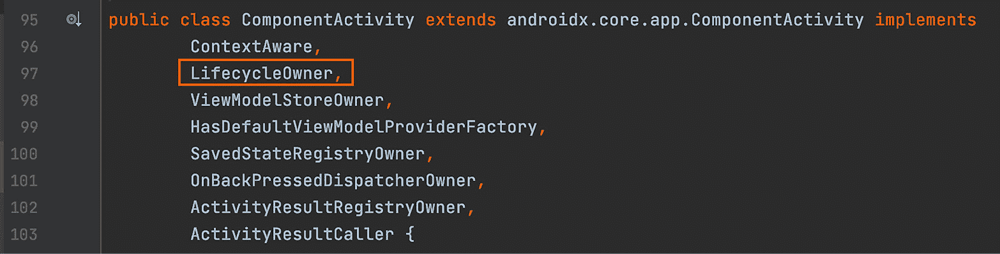
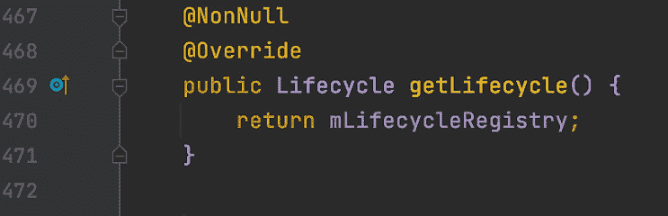
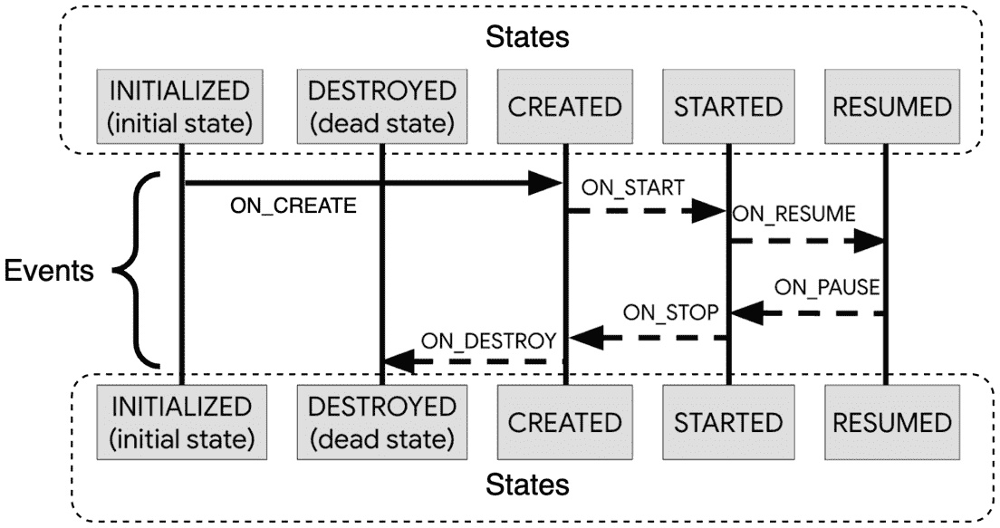
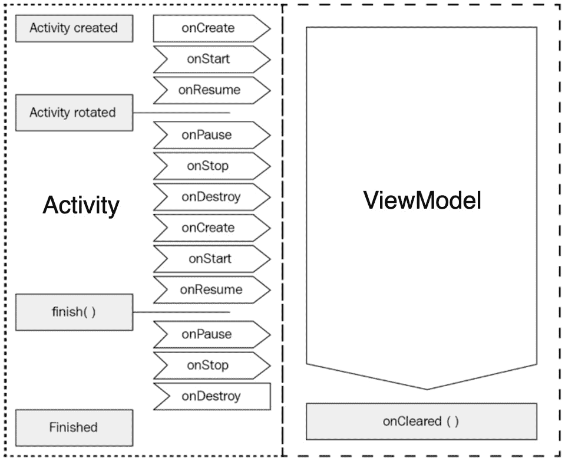
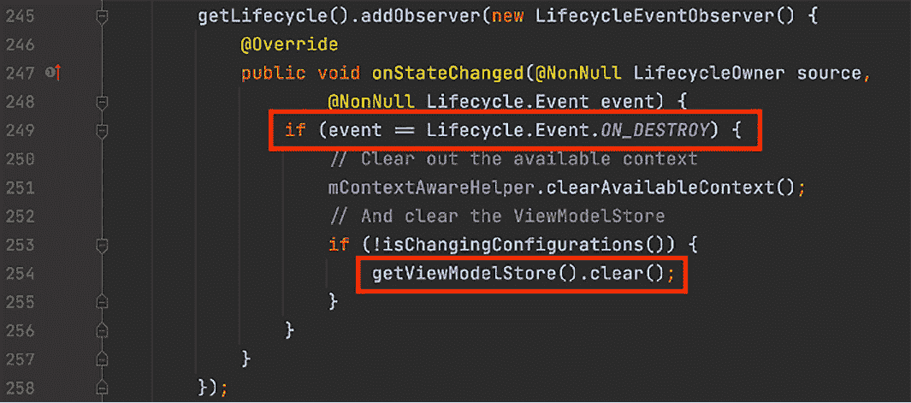
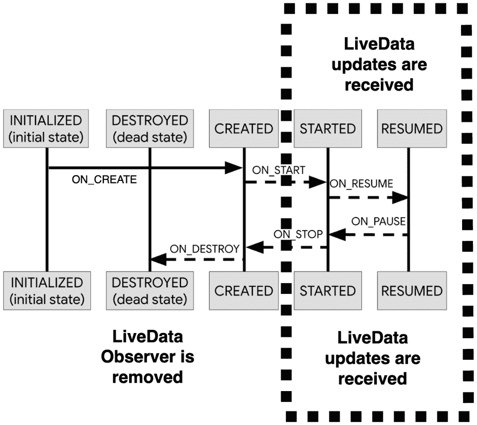
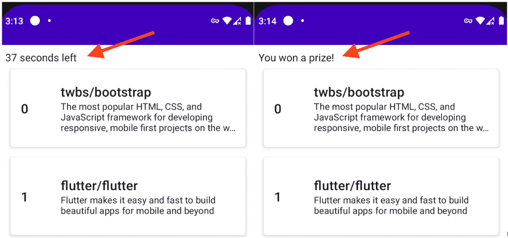

# *第十二章*：探索 Jetpack 生命周期组件

在本章中，我们将在*第十一章*，*使用 Jetpack Paging 和 Kotlin Flow 创建无限列表*的基础上，向我们的仓库应用添加倒计时计时器组件，同时探索 Jetpack 生命周期组件。

在第一部分，*介绍 Jetpack 生命周期组件*，我们想要探索生命周期事件和状态是如何与 Android 组件如`Activity`或`Fragment`相关联的，然后预定义的`Lifecycle`包中的组件是如何对它们做出反应的。

接下来，在*在仓库应用中添加倒计时组件*部分，我们将创建并添加一个倒计时计时器组件到仓库应用中。当 60 秒倒计时结束时，我们将向用户颁发一个虚构的奖品。

然而，我们希望倒计时在计时器在屏幕上可见时运行；否则，用户可以通过最小化应用程序并在后台运行倒计时来作弊。在*创建自己的生命周期感知组件*部分，我们将通过使我们的计时器组件感知 Android 组件遍历的不同生命周期事件和状态来防止用户作弊。

在*使我们的倒计时组件感知 composables 的生命周期*部分，我们会意识到用户也可以通过滚动和隐藏计时器倒计时 UI 元素来在倒计时竞赛中作弊。为了防止他们这样做，我们还将确保我们的倒计时组件知道如何对我们的 Compose UI 功能中的组合周期做出反应。

总结来说，在本章中，我们将涵盖以下部分：

+   介绍 Jetpack 生命周期组件

+   在仓库应用中添加倒计时组件

+   创建自己的生命周期感知组件

+   使我们的倒计时组件感知 composables 的生命周期

在深入之前，让我们为本章设置技术要求。

# 技术要求

为本章构建基于 Compose 的 Android 项目通常需要您日常使用的工具。然而，为了顺利跟随本章，请确保您还具有以下内容：

+   Arctic Fox 2020.3.1 版本的 Android Studio。您也可以使用更新的 Android Studio 版本或甚至 Canary 构建，但请注意，IDE 界面和其他生成的代码文件可能与此书中的不同。

+   在 Android Studio 中安装的 Kotlin 1.6.10 或更高版本的插件。

+   来自本书 GitHub 仓库的现有仓库应用。

本章的起点是上一章开发的仓库应用。如果您没有跟随上一章的实现，可以通过导航到仓库的`Chapter_11`目录并导入名为`repositories_app_solution_ch11`的 Android 项目来访问本章的起点。

要访问本章的解决方案代码，请导航到`Chapter_12`目录：[`github.com/PacktPublishing/Kickstart-Modern-Android-Development-with-Jetpack-and-Kotlin/tree/main/Chapter_12/repositories_app_ch12`](https://github.com/PacktPublishing/Kickstart-Modern-Android-Development-with-Jetpack-and-Kotlin/tree/main/Chapter_12/repositories_app_ch12)。

# 介绍 Jetpack Lifecycle 组件

到现在为止，秘密已经不再是秘密了，Android 框架中的组件在需要与之交互时都有一定的生命周期，我们必须尊重这些生命周期。拥有生命周期的最常见组件是`Activity`和`Fragment`。

作为程序员，我们无法控制 Android 组件的生命周期，因为它们的生命周期是由系统或 Android 的工作方式定义和控制的。

回到 Lifecycle 组件，一个很好的例子是 Android 应用的入口点，由`Activity`组件表示，正如我们所知，它具有生命周期。这意味着为了在 Android 应用中创建一个屏幕，我们需要创建一个`Activity`组件——从这一点开始，我们所有的组件都必须了解其生命周期，以避免内存泄漏。

现在，当我们说`Activity`有一个系统定义的生命周期时，这实际上意味着我们的`Activity`类从`ComponentActivity()`继承，它反过来包含一个`Lifecycle`对象。如果我们查看来自 Repositories 应用的`MainActivity`类，我们可以看到它从`ComponentActivity()`继承：

```kt
class MainActivity : ComponentActivity() {
    override fun onCreate(savedInstanceState: Bundle?) {
        super.onCreate(savedInstanceState)
        […]
    }
}
```

现在，如果我们深入研究`ComponentActivity.java`类的源代码，我们可以看到它实现了`LifecycleOwner`接口：



图 12.1 – 观察 ComponentActivity 如何实现 LifecycleOwner 接口

换句话说，`ComponentActivity`类是一个生命周期的拥有者。如果我们查看源代码中向下几百行处的`LifecycleOwner`接口实现，我们可以看到`LifecycleOwner`接口包含一个名为`getLifecycle()`的单个方法，它返回一个`Lifecycle`对象：



图 12.2 – 观察 LifecycleOwner 接口方法实现

从这些发现中，我们可以推断出我们的`Activity`类具有系统定义的生命周期，因为它们实现了`LifecycleOwner`接口，这反过来意味着它们拥有一个`Lifecycle`对象。

注意

在 Android 中还有其他几个组件具有生命周期。在`Activity`类的上下文中，有其他直接或间接继承自`ComponentActivity`的类，因此拥有一个`Lifecycle`对象 – 例如`AppCompatActivity`或`FragmentActivity`。或者，就像`Activity`类有生命周期一样，`Fragment`组件也有生命周期。如果你查看`Fragment`类的源代码，你会注意到它也实现了`LifecycleOwner`接口，因此它也包含一个`Lifecycle`对象。

简而言之，组件具有生命周期的概念可以归结为它提供了`Lifecycle`接口的具体实现。这带来了这样的想法，即具有生命周期的组件，如`Activity`，会公开与其生命周期相关的信息。

为了更好地理解我们可以从组件的生命周期中找到什么信息，我们必须探索`Lifecycle`抽象类的源代码。如果我们这样做，我们将了解到`Lifecycle`类包含了它所绑定组件（如`Activity`或`Fragment`）的生命周期状态信息。`Lifecycle`类以枚举的形式提供了两个主要的信息追踪点：

+   `onCreate()`, `onStart()`, `onResume()`, `onPause()`, `onStop()`, 和 `onDestroy()`).

+   `INITIALIZED`, `DESTROYED`, `CREATED`, `STARTED`, 和 `RESUMED`。如果我们的`Activity`刚刚接收到`onResume()`回调，这意味着在新的事件到来之前，它将保持在`RESUMED`状态。每当有新的事件（生命周期回调）发生时，状态就会改变。

虽然我们已经对生命周期事件（回调）相当熟悉，但我们可能需要更好地理解生命周期状态是如何定义的。

让我们通过一个实际例子来探讨`Lifecycle`对象可以提供关于`Activity`组件的哪些信息。如前所述，信息是以事件和状态的形式组织的：



图 12.3 – 活动生命周期图，展示了其生命周期事件和状态

在前面的图中，我们能够通过事件和状态来剖析`Activity`组件的生命周期。现在我们也对生命周期事件如何触发生命周期状态之间的转换有了更好的了解。

但为什么所有这些事件和状态对我们来说都很重要呢？

实际上，我们的大部分代码都是根据生命周期信息驱动的。为了避免潜在的崩溃、内存泄漏或资源浪费，仅在正确的状态或正确的生命周期事件上执行操作是至关重要的。

当我们考虑生命周期事件时，我们可以这样说，不同类型的功能只能在适当的时间或在某些生命周期回调之后执行。例如，我们不会想在`Activity`的`onDestroy()`回调之后更新我们的 UI 组件，因为这很可能导致我们的应用崩溃，因为此时 UI 已经被丢弃。另一个例子是，当我们的`Activity`中的`onResume()`事件被调用时，我们知道我们的`Activity`已经获得了（或重新获得了）焦点，因此我们可以在代码中执行某些操作，比如初始化我们的相机组件。

当我们考虑生命周期状态时，我们可以这样说，不同的持续动作只能在某些生命周期期间运行——例如，如果状态是`RESUMED`，我们可能想要开始观察数据库变化，因为那时用户可以与屏幕交互并更改数据。当这个状态转换到另一个状态，比如`CREATED`或`DESTROYED`时，我们可能想要停止观察数据库变化，以避免内存泄漏和资源浪费。

从前面的例子中可以看出，我们的代码应该了解 Android 组件的生命周期。当我们根据生命周期事件或状态编写代码时，我们正在编写了解特定组件生命周期的代码。

让我们举一个例子，并稍微发挥一下想象力——`Presenter`类具有由多个网络请求产生的一个数据流。这个数据流被观察并传递到 UI。然而，任何正在进行的网络请求都必须在`cancelOngoingNetworkRequests()`方法中取消，因为我们的 UI 不再需要消费它们的响应：

```kt
class Presenter() {
    // observe data and pass it to the UI
    fun cancelOngoingNetworkRequests() {
        // stop observing data
    }
}
```

假设我们的`Presenter`类实例在`MainActivity`中使用。自然，它必须尊重`MainActivity`类的生命周期。这就是为什么我们应该通过在`MainActivity`类的`onDestroyed()`生命周期回调中调用`Presenter`类的`cancelOngoingNetworkRequests()`方法来停止`Presenter`类中的任何正在进行的网络请求：

```kt
class MainActivity : ComponentActivity() {
    val presenter = Presenter()
    override fun onStart() {
        super.onStart()
        //consume data from presenter
    }
    override fun onDestroy() {
        super.onDestroy()
        presenter.cancelOngoingNetworkRequests()
    }
}
```

我们可以说，我们的`Presenter`类了解其宿主`MainActivity`的生命周期。

如果一个组件尊重 Android 组件（如`Activity`）的生命周期，那么我们可以认为该组件是**生命周期感知的**。

然而，我们通过手动从`MainActivity`生命周期回调中调用某个清理方法，手动使我们的`Presenter`类成为生命周期感知的。换句话说，我们的`MainActivity`手动告诉`Presenter`它必须停止其正在进行的工作。

此外，无论何时我们需要在其他`Activity`或`Fragment`类中使用我们的`Presenter`，该组件都需要记住在某个生命周期回调中调用`Presenter`的`cancelOngoingNetworkRequests()`方法，因此会产生样板代码。如果`Presenter`需要在某些生命周期回调上执行多个操作，那么这些样板代码就会成倍增加。

使用`Activity`或`Fragment`组件手动通知我们的类某个生命周期事件已被触发，或达到了某种状态 - `Lifecycle`包将帮助我们以更有效的方式在我们的组件内部直接接收回调。

Jetpack 的`Lifecycle`包为我们提供了以下内容：

+   预定义的不同目的的生命周期感知组件，这些组件需要我们更少的样板代码或工作。这些组件是两个 Jetpack 库：

    +   `ViewModel`

    +   `LiveData`

+   一个生命周期 API，使我们能够通过更少的样板代码更容易地创建一个自定义的生命周期感知组件。

在创建我们自己的生命周期感知组件之前，我们应该简要介绍 Jetpack `Lifecycle`包为我们提供的两个预定义的生命周期感知组件。让我们从`ViewModel`开始。

## ViewModel

在这本书中，我们已经介绍了 Jetpack 的`ViewModel`作为一个类，我们的 UI 状态驻留于此，并且大多数展示逻辑也在这里。然而，我们也了解到，为了正确取消数据流或正在进行的网络请求，`ViewModel`了解其宿主`Activity`、`Fragment`甚至其组合目的地（与 Jetpack 导航组件一起）的生命周期。

与我们手动将生命周期与宿主`Activity`的生命周期关联的`Presenter`类相比，Jetpack 的`ViewModel`是一个生命周期感知组件，我们可以用它来消除`Activity`或`Fragment`组件中的任何样板调用。

更精确地说，`ViewModel`知道其宿主组件的生命周期何时结束，并提供了一个回调方法，我们可以通过重写`onCleared()`方法来使用它。在这个回调内部，我们可以取消任何我们不再感兴趣的挂起工作，以避免内存泄漏或资源浪费。

例如，如果我们的`ViewModel`由`Activity`托管，那么它知道在`Activity`的生命周期中何时调用了`onDestroy()`事件，因此它会自动触发`onCleared()`回调：



图 12.4 – ViewModel 的生命周期与 Activity 的生命周期相关联

这基本上意味着，我们不需要手动让我们的`Activity`通知`ViewModel`其生命周期已结束，以便它可以停止其工作，`ViewModel`是一个生命周期感知组件，它为您提供了处理该事件的句柄 - 即`onCleared()`回调：

```kt
class MyViewModel(): ViewModel() {
    override fun onCleared() {
        super.onCleared()
        // Cancel work
    }
}
```

此外，在`Activity`宿主的环境中，`ViewModel`组件也了解由配置更改等事件引起的任何生命周期回调，因此它知道如何超越这些回调并帮助我们保持 UI 状态，即使在配置更改之后。

但是，`ViewModel`是如何知道`Activity`组件的生命周期回调的呢？为了回答这个问题，我们可以通过使用`ViewModelProvider` API 并在`Activity`内部实例化`ViewModel`来查看传统的做法，并指定必须检索的`ViewModel`类型——即`MyViewModel`：

```kt
class MyActivity: ComponentActivity() {
    override fun onCreate(savedInstanceState: Bundle?) {
        super.onCreate(savedInstanceState)
        val vm = 
          ViewModelProvider(this)[MyViewModel::class.java]
         // Perform operations
    }
}
```

要获取`MyViewModel`的实例，我们使用了`ViewModelProvider()`构造函数，并将`MyActivity`类的`this`实例传递给期望一个`ViewModelStoreOwner`对象的`owner`参数。`MyActivity`间接实现了`ViewModelStoreOwner`接口，因为`ComponentActivity`实现了这个接口。

为了控制`ViewModel`实例的生命周期，`ViewModelProvider`需要一个`ViewModelStoreOwner`实例，因为当它实例化我们的`MyViewModel`时，它将*链接*此实例的生命周期到`ViewModelStoreOwner`的生命周期——即`MyActivity`。

但是，`ViewModel`是如何知道它必须被清除的呢？换句话说，什么触发了`MyViewModel`类的`onCleared()`方法？

`ComponentActivity`将等待其`onDestroy()`生命周期回调，当该事件被触发时，它将调用`ViewModelStoreOwner`接口的`getViewModelStore()`方法，并获取一个`ViewModelStore`对象。在这个对象上，它将调用`clear()`方法来清除与`ComponentActivity`关联的`ViewModel`实例——在我们的例子中，是`MyViewModel`实例。

如果你查看`ComponentActivity`类的源代码，你会找到以下实现，这证明了我们试图表达的前述观点：

![图 12.5 – 在`ComponentActivity`的`onDestroy()`回调中清除`ViewModel`

图 12.5 – 在`ComponentActivity`的`onDestroy()`回调中清除`ViewModel`

现在，`ViewModel`生命周期感知组件非常有用，因为它允许我们轻松停止挂起的任务，并在配置更改之间持久化 UI 状态。

然而，还有另一个重要的生命周期感知组件我们没有在本章中介绍，并且我们应该简要提及，那就是`LiveData`。

## LiveData

`LiveData`是一个可观察的数据持有类，它允许我们在 Android 组件内部以生命周期感知的方式获取数据更新，例如`Activity`和`Fragment`。虽然 Kotlin Flow 数据流的特定实现与`LiveData`相似，因为两者都允许我们在一段时间内接收多个数据事件，但`LiveData`具有作为生命周期感知组件的优势。

注意

在本节中，我们不会广泛介绍`LiveData`的 API，而是尝试突出其生命周期感知特性。目前，你不需要跟随代码编写。

不深入细节，让我们看看在`ViewModel`类内部保持的`LiveData`对象的一个简单用法，并从`Activity`组件中消费它。

在 `ViewModel` 中，我们实例化了一个 `MutableLiveData` 对象，该对象将持有 `Int` 类型的值，传递了一个初始值为 `0`，然后在 `init{}` 块中启动了一个协程，在 `5000` 毫秒的延迟后，将值设置为 `100`：

```kt
class MyViewModel(): ViewModel() {
    val numberLiveData: MutableLiveData<Int> = 
        MutableLiveData(0)
    init {
        viewModelScope.launch {
            delay(5000)
            numberLiveData.value = 100
        }
    }
}
```

`numberLiveData` 现在是一个数据持有者，它将首先通知观察它的任何组件其值为 `0`，然后在 5 秒后，值变为 `100`。

现在，一个 `Activity` 可以通过首先获取 `MyViewModel` 的实例，访问其 `numberLiveData` 对象，然后通过 `observe()` 方法开始观察变化来进行观察：

```kt
class MyActivity: ComponentActivity() {
    override fun onCreate(savedInstanceState: Bundle?) {
        super.onCreate(savedInstanceState)
        val vm = 
          ViewModelProvider(this)[MyViewModel::class.java]
        vm.numberLiveData.observe(this, object: Observer<Int> {
            override fun onChanged(t: Int?) {
                // Consume values
            }
        })
    }
}
```

现在，让我们看看传递给 `observe()` 方法的以下内容：

+   首先，将 `MyActivity` 类的 `this` 实例传递给期望 `LifecycleOwner` 对象的 `owner` 参数。这之所以有效，是因为 `MyActivity` 通过 `ComponentActivity` 间接实现了 `LifecycleOwner` 接口，因此拥有一个 `Lifecycle` 对象。`observe()` 方法期望 `LifecycleOwner` 作为其第一个参数，这样观察功能就具有对 `MainActivity` 生命周期的生命周期感知性。

+   一个 Kotlin 内部 `Observer<Int>` 对象，允许我们在 `onChanged()` 回调中接收来自 `MutableLiveData` 对象的数据事件（持有 `Int` 值）。每次有新值传播时，此回调将被触发，我们将接收到最新的值。

现在我们已经简要介绍了如何使用 `LiveData`，让我们更好地理解我们为什么要谈论 `LiveData` 的整个原因。正如我们提到的，`LiveData` 是一个生命周期感知组件，但它是如何实现这一点的呢？

当我们将 `MainActivity` 作为 `LifecycleOwner` 传递给 `observe()` 方法的 `owner` 参数时，在幕后，`LiveData` 开始了一个依赖于提供 `owner` 的 `Lifecycle` 对象的观察过程。

更确切地说，作为 `observe()` 方法的第二个参数提供的 `Observer` 对象将仅在所有者（即 `MainActivity`）处于 `STARTED` 或 `RESUMED` 生命周期状态时接收更新。

*这种行为是至关重要的，因为它允许 Activity 组件仅在它们可见或处于焦点时才从 ViewModel 组件接收 UI 更新，从而确保 UI 可以安全地处理数据事件，不会浪费资源*。

然而，如果更新发生在其他状态，而 UI 未经初始化，我们的应用可能会出现异常行为，甚至更糟，可能会崩溃或引入内存泄漏。为了确保这种行为不会发生，如果所有者移动到 `DESTROYED` 状态，`Observer` 对象将被自动移除。

在下面的图中，您将能够可视化 `LiveData` 更新仅在 `Activity` 组件处于 `RESUMED` 或 `STARTED` 状态时发生，同时当状态变为 `DESTROYED` 时，自动移除 `Observer` 对象：



图 12.6 – 当接收到 LiveData 更新并移除 LiveData 观察者时的生命周期状态和事件

在这种行为下，`LiveData`成为了一个生命周期感知组件，因为任何`LifecycleOwner`都必须处于一个活跃的生命周期状态才能从它那里接收更新。

现在我们已经介绍了`Lifecycle`包中的两个预定义的生命周期感知组件（`ViewModel`和`LiveData`），现在是时候在我们的“仓库”应用中添加一个倒计时计时器组件了，这样我们就可以在以后使用 Lifecycle API 将其转换为一个自定义的生命周期感知组件。

# 在“仓库”应用中添加倒计时组件

我们的计划是学习如何创建我们自己的生命周期感知组件。然而，在我们能够做到这一点之前，我们必须首先创建一个默认情况下不知道任何 Android 组件生命周期的普通组件。

为了做到这一点，我们可以在我们的“仓库”应用中创建一个倒计时计时器组件，该组件将跟踪用户是否在应用上至少花费了 60 秒，如果是这样，我们将向用户颁发一个虚构的奖品。

更具体地说，我们的计划是在`RepositoriesScreen()`内部创建一个倒计时计时器小部件，当倒计时达到 60 秒时，将向用户颁发奖品。然而，为了使倒计时工作并颁发奖品，用户必须处于`RepositoriesScreen()`内部，并且倒计时组合可见。

倒计时将表现得如下：

+   它将从 60 开始，当倒计时达到 0 时结束。每过一秒，计时器将减少 1 个单位。

+   当倒计时结束时，将显示一个奖品信息。

+   如果倒计时组合不可见，它将被暂停。换句话说，如果用户不在`RepositoriesScreen()`组合内部，或者计时器组合在`RepositoriesScreen()`内部不可见或隐藏，那么倒计时应该被暂停。

现在我们有了计划，让我们实现一个倒计时计时器组件：

1.  在根包内部，创建一个名为`CustomCountdown`的新类，并定义其构造函数，使其具有两个将被作为倒计时计时器函数调用的函数参数：

    ```kt
    class CustomCountdown(
        private val onTick: ((currentValue: Int) -> Unit),
        private val onFinish: (() -> Unit),
    ) {
    }
    ```

我们必须在每过一秒后调用`onTick()`函数，并在倒计时结束时调用`onFinish()`函数。

1.  现在，在`CustomCountdown`类内部，让我们创建一个名为`InternalTimer`的内部类，它将继承自内置的 Android `android.os.CountDownTimer`类，并处理实际的倒计时序列：

    ```kt
    class CustomCountdown(
        private val onTick: ((currentValue: Int) -> Unit),
        private val onFinish: (() -> Unit),
    ) {
        class InternalTimer(
            private val onTick: ((currentValue: Int) -> Unit),
            private val onFinish: (() -> Unit),
            millisInFuture: Long,
            countDownInterval: Long
    ) : CountDownTimer(millisInFuture, 
                           countDownInterval){
        }
    }
    ```

虽然`InternalTimer`的构造函数也接受两个相同的函数参数，就像`CustomCountdown`一样，但必须注意它传递给内置 Android `CountDownTimer`类的`millisInFuture`和`countDownInterval`参数。这两个参数将配置计时器的核心功能——倒计时开始的时间和计时器滴答之间的时间间隔。

1.  接下来，让我们完成`InternalTimer`类的实现：

    ```kt
    class CustomCountdown(
        private val onTick: ((currentValue: Int) -> Unit),
        private val onFinish: (() -> Unit),
    ) {
        class InternalTimer(
            private val onTick: ((currentValue: Int) -> Unit),
            private val onFinish: (() -> Unit),
            millisInFuture: Long,
            countDownInterval: Long
        ) : CountDownTimer(millisInFuture, 
            countDownInterval) {
            init {
                this.start()
            }
            override fun onFinish() {
                onFinish.invoke()
            }
            override fun onTick(millisUntilFinished: Long) {
                onTick(millisUntilFinished.toInt())
            }
        }
    }
    ```

为了确保计时器按预期工作，我们已执行以下操作：

+   在`init{}`块中调用继承的父类`CountDownTimer`提供的`start()`方法。这应该在创建时自动启动计时器。

+   实现了继承的父类`CountDownTimer`的两个强制`onFinish()`和`onTick()`方法，并通过调用其`onFinish()`和`onTick()`函数参数将事件传播给`InternalTimer`的调用者。

1.  然后，回到`CustomCountdown`类中，让我们创建一个`InternalTimer`实例，并配置它像一个从`60`开始到`0`结束的 60 秒倒计时计时器：

为了做到这一点，让我们将其构造函数传递给`onFinish`和`onTick`函数参数，并将 60 秒（作为`60000`毫秒）传递给`millisInFuture`参数，将 1 秒（作为`1000`毫秒）传递给`countDownInterval`参数：

```kt
class CustomCountdown(
    private val onTick: ((currentValue: Int) -> Unit),
    private val onFinish: (() -> Unit),
) {
    var timer: InternalTimer = InternalTimer(
        onTick = onTick,
        onFinish = onFinish,
        millisInFuture = 60000,
        countDownInterval = 1000)
    class InternalTimer(
        private val onTick: ((currentValue: Int) -> Unit),
        private val onFinish: (() -> Unit),
        millisInFuture: Long,
        countDownInterval: Long
    ): CountDownTimer(millisInFuture, countDownInterval)
    { … }
}
```

1.  仍然在`CustomCountdown`内部，为了提供一个取消倒计时的方法，添加一个`stop()`方法，这将允许我们调用从 Android `CountDownTimer`类继承的`InternalTimer`的`cancel()`方法：

    ```kt
    class CustomCountdown(…) {
        var timer: InternalTimer = InternalTimer(…)
        fun stop() {
            timer.cancel()
        }
        class InternalTimer(
            […]
        ): CountDownTimer(millisInFuture, countDownInterval)
        { … }
    }
    ```

1.  然后，在`RepositoriesViewModel`中，添加一个`timerState`变量，它将保存我们的倒计时可组合显示的文本状态，以及一个`timer`变量，它将保存一个`CustomCountdown`对象：

    ```kt
    class RepositoriesViewModel(…) : ViewModel() {
        val repositories: Flow<PagingData<Repository>> = […]
        val timerState = mutableStateOf("")
        var timer: CustomCountdown = CustomCountdown(
            onTick = { msLeft ->
                timerState.value =
    (msLeft / 1000).toString() + 
                       " seconds left"
            },
            onFinish = {
                timerState.value = "You won a prize!"
            })
    }
    ```

在`onTick`回调内部，我们正在计算剩余的秒数，并将关于我们的倒计时的`String`消息设置到`timerState`。然后，在`onFinish`回调中，我们将奖品信息设置到`timerState`。

1.  作为一种良好的实践，在`RepositoriesViewModel`内部，确保在用户移动到不同的屏幕时在`onCleared()`回调中停止计时器。这意味着`RepositoriesScreen()`将不再被组合，因此这个`ViewModel`将被清除，倒计时应该停止，这样它就不会发送事件和浪费资源：

    ```kt
    class RepositoriesViewModel(…) : ViewModel() {
        val repositories: Flow<PagingData<Repository>> = […]
        val timerState = mutableStateOf("")
        var timer: CustomCountdown = CustomCountdown(…)
        override fun onCleared() {
            super.onCleared()
            timer.stop()
        }
    }
    ```

1.  现在，转到`MainActivity`并确保，正如仓库被消费并传递给`RepositoriesScreen()`可组合一样，由`ViewModel`产生的倒计时计时器文本也被消费并传递给`RepositoriesScreen()`：

    ```kt
    class MainActivity : ComponentActivity() {
        override fun onCreate(savedInstanceState: Bundle?) {
            super.onCreate(savedInstanceState)
            setContent {
                RepositoriesAppTheme {
                    val viewModel: RepositoriesViewModel = …
                    val reposFlow = viewModel.repositories
    val timerText = 
                        viewModel.timerState.value
                    val lazyRepoItems: […] = […]
                    RepositoriesScreen(
                        lazyRepoItems,
                        timerText
                    )
                }
            }
        }
    }
    ```

1.  然后，在`RepositoriesScreen.kt`文件末尾，创建一个简单的`CountdownItem()`可组合函数，该函数接受一个`timerText: String`参数并将其值设置为`Text`可组合：

    ```kt
    @Composable
    private fun CountdownItem(timerText: String) {
        Text(timerText)
    }
    ```

1.  接下来，在`RepositoriesScreen()`可组合中，添加一个名为`timerText`的新参数，并在`LazyColumn`作用域内，在`itemsIndexed()`调用之前，添加一个单独的`item()` `CountdownItem()`可组合，并将`timerText`变量传递给它：

    ```kt
    @Composable
    fun RepositoriesScreen(
        repos: LazyPagingItems<Repository>,
        timerText: String
    ) {
        LazyColumn(…) {
            item {
                CountdownItem(timerText)
            }
            itemsIndexed(repos) { index, repo -> […] }
            […]
        }
    }
    ```

通过这样做，我们确保倒计时计时器显示在屏幕顶部，作为仓库列表中的第一个项目。

1.  构建并运行应用程序。你应该首先看到倒计时计时器告诉你需要等待多长时间，大约 1 分钟后，你应该看到奖品信息显示：

![图 12.7 – 观察倒计时计时器的工作情况]



图 12.7 – 观察倒计时计时器的工作情况

我们现在已经完成了将倒计时计时器整合到应用中，该计时器通过授予用户虚构的奖品来结束。

然而，有一种情况是我们计时器的工作并不如预期。让我们来识别它：

1.  重新启动应用。你可以通过关闭当前应用实例并重新打开它来实现。

此时，倒计时应该再次从 60 开始。

1.  在倒计时结束之前，记住或写下当前的倒计时值，然后将应用置于后台。

1.  等待几秒钟，然后将应用恢复到前台。

你应该注意到，当应用处于后台时，倒计时仍在继续。我们希望当应用被置于后台时计时器会暂停，当应用被恢复到前台时计时器会继续。这将允许我们奖励那些积极使用应用并且使倒计时计时器可见的用户。然而，这种行为没有发生，因为当应用不可见或未聚焦时，计时器仍在继续计数。

这是因为当应用进入后台或恢复到前台时，我们没有做任何暂停计时器的操作。换句话说，我们的倒计时计时器没有生命周期感知，因此它不会收到通知，也无法对`Activity`宿主的生命周期事件做出反应。

接下来，让我们使我们的倒计时计时器成为一个具有生命周期感知的组件。

# 创建自己的生命周期感知组件

我们需要让我们的`CustomCountdown`了解`MainActivity`的生命周期。换句话说，我们的倒计时逻辑应该观察并响应我们的`LifecycleOwner`（即`MainActivity`）的生命周期事件。

为了使我们的`CustomCountdown`具有生命周期感知，我们必须强制它实现`DefaultLifecycleObserver`接口。通过这样做，`CustomCountdown`将观察`LifecycleOwner`提供的`Lifecycle`对象定义的生命周期事件或状态。

我们的主要目标是当应用被置于后台时暂停倒计时，当应用被恢复到前台时恢复倒计时。更确切地说，我们的`CustomCountdown`必须对`MainActivity`的以下生命周期事件做出反应：

+   `onPause()`: 当`onPause()`回调进入`MainActivity`时，`CustomCountdown`必须暂停其倒计时。

+   `onResume()`: 当`onResume()`回调进入`MainActivity`时，`CustomCountdown`必须恢复其倒计时。

使用这种行为，我们可以奖励那些积极使用应用并且使倒计时计时器可见并处于焦点的用户。

现在我们有了计划，让我们开始编码。

1.  让`CustomCountdown`类实现`DefaultLifecycleObserver`接口，然后重写我们感兴趣的两种生命周期回调，`onResume()`和`onPause()`：

    ```kt
    class CustomCountdown(
        […]
    ): DefaultLifecycleObserver {
        var timer: InternalTimer = InternalTimer(
            onTick = onTick,
            onFinish = onFinish,
            millisInFuture = 60000,
            countDownInterval = 1000)
        override fun onResume(owner: LifecycleOwner) {
            super.onResume(owner)
        }
        override fun onPause(owner: LifecycleOwner) {
            super.onPause(owner)
        }
        fun stop() { timer.cancel() }
        class InternalTimer(…) {…}
    }
    ```

一旦我们的 `CustomCountdown` 观察了 `MainActivity` 的生命周期，当 `MainActivity` 的 `onResume()` 回调被调用时，它的 `onResume(owner: LifecycleOwner)` 回调将被调用，同样地，当 `MainActivity` 的 `onPause()` 回调被调用时，它的 `onPause(owner: LifecycleOwner)` 回调将被调用。

1.  现在我们知道了何时暂停和恢复我们的倒计时计时器，我们需要找到实际暂停和恢复它的方法。

首先，让我们在 `onPause()` 回调中通过调用 `timer` 变量的 `cancel()` 方法来暂停倒计时。

```kt
class CustomCountdown(
    […]
): DefaultLifecycleObserver {
    var timer: InternalTimer = InternalTimer(…)
    override fun onResume(owner: LifecycleOwner) {
        super.onResume(owner)
    }
    override fun onPause(owner: LifecycleOwner) {
        super.onPause(owner)
        timer.cancel()
    }
    fun stop() { timer.cancel() }
    class InternalTimer(…) : CountDownTimer(…) {…}
}
```

在这种行为下，当 `MainActivity` 暂停时，我们正在停止由 `timer` 变量中持有的 `InternalTime` 实例执行的倒计时。

1.  接下来，我们需要在 `onResume()` 回调中恢复 `timer`。然而，为了恢复它，我们需要知道在 `onPause()` 回调触发和计时器被取消之前最后一次倒计时的值。有了这个最后的已知倒计时值，我们可以在 `onResume()` 回调中重新初始化我们的计时器。

在内部 `InternalTimer` 类中，创建一个 `lastKnownTime` 变量，用 `millisInFuture` 的值初始化它，然后确保在 `onFinish()` 和 `onTick()` 计时器回调中更新它：

```kt
class CustomCountdown(
    […]
): DefaultLifecycleObserver {
    var timer: InternalTimer = InternalTimer(
        […]
        millisInFuture = 60000,
        countDownInterval = 1000)
    override fun onResume(owner: LifecycleOwner) { … }
    override fun onPause(owner: LifecycleOwner) { … }
    fun stop() { timer.cancel() }
    class InternalTimer(…) : CountDownTimer(…) {
        var lastKnownTime: Long = millisInFuture
        init { this.start() }
        override fun onFinish() {
            lastKnownTime = 0
            onFinish.invoke()
        }
        override fun onTick(millisUntilFinished: Long) {
            lastKnownTime = millisUntilFinished
            onTick(millisUntilFinished.toInt())
        }
    }
}
```

在 `onFinish()` 回调中，我们已经将 `lastKnownTime` 设置为 `0`，因为倒计时已经完成；在 `onTick()` 回调中，我们确保将最新接收到的 `onTick()` 回调值——即 `millisUntilFinished`——保存到 `lastKnownTime` 变量中。

1.  现在，回到父类 `CustomCountdown`，在 `CustomCountdown` 的 `onResume()` 回调中恢复倒计时，首先取消上一个计时器的倒计时，然后在 `timer` 变量中存储另一个 `InternalTimer` 实例，该实例现在从上一个 `InternalTimer` 实例的 `lastKnownTime` 值开始倒计时：

    ```kt
    class CustomCountdown(
        […]
    ): DefaultLifecycleObserver {
        var timer: InternalTimer = InternalTimer(
            onTick = onTick,
            onFinish = onFinish,
            millisInFuture = 60000,
            countDownInterval = 1000)
        override fun onResume(owner: LifecycleOwner) {
            super.onResume(owner)
            if (timer.lastKnownTime > 0) {
                timer.cancel()
                timer = InternalTimer(
                    onTick = onTick,
                    onFinish = onFinish,
                    millisInFuture = timer.lastKnownTime,
                    countDownInterval = 1000)
            }
        }
        override fun onPause(owner: LifecycleOwner) { […] }
        fun stop() { timer.cancel() }
        class InternalTimer(…) : CountDownTimer(…) {…}
    }
    ```

在这种行为下，当 `MainActivity` 恢复时，我们正在创建一个新的 `InternalTimer` 实例，该实例从上一个计时器在暂停之前记录的值开始倒计时。此外，请注意，新的 `InternalTimer` 实例接收与 `timer` 变量的第一次初始化相同的参数——相同的 `onTick()` 和 `onFinish()` 回调以及相同的 `countDownInterval` ——唯一的区别是倒计时的起点，现在应该小于 60 秒。

为了使 `CustomCountdown` 类的 `onPause()` 和 `onResume()` 回调在 `MainActivity` 内部调用相应生命周期事件时被调用，我们必须有效地将我们的 `DefaultLifecycleObserver`——即 `CustomCountdown` 实例——绑定到我们的 `LifecycleOwner`——即 `MainActivity` 的生命周期上。

让我们接下来这么做。

1.  返回到`RepositoriesScreen.kt`文件，在`CountdownItem()`组合组件内部，首先通过调用`LocalLifeCycleOwner` API 获取组合函数所属的`LifecycleOwner`实例，然后通过访问其`current`变量来获取所有者：

    ```kt
    @Composable
    private fun CountdownItem (timerText: String) {
    val lifecycleOwner: LifecycleOwner  = 
            LocalLifecycleOwner.current
        Text(timerText)
    }
    ```

最后，我们将`LifecycleOwner`实例存储到`lifecycleOwner`变量中。

需要指出的是，由于`CountdownItem()`的父组合组件即`RepositoriesScreen()`是由`MainActivity`承载的，因此我们获得的`LifecycleOwner`实例实际上是`MainActivity`，这是很自然的。

1.  然后，我们需要确保我们的`lifecycleOwner`的`Lifecycle`实例添加和移除我们的`DefaultLifecycleObserver`计时器。

为了实现这一点，我们首先需要创建一个组合副作用，这样我们就可以知道`CountdownItem()`组合组件首次进入组合的时间，以便我们可以添加观察者，然后当它从组合中移除时，我们可以移除观察者。

对于这种情况，我们可以使用`DisposableEffect()`组合组件，它为我们提供了一个代码块，在组合组件进入组合时我们可以执行操作，然后通过其内部的`onDispose()`块执行其他操作：

```kt
@Composable
private fun CountdownItem (timerText: String) {
    val lifecycleOwner: LifecycleOwner = 
        LocalLifecycleOwner.current
    DisposableEffect(key1 = lifecycleOwner) {
        onDispose {

        }
    }
    Text(timerText)
}
```

由于这是一个副作用，我们在`DisposableEffect`函数暴露的代码块中添加的任何内容在重新组合时都不会重新执行。然而，如果提供给`key1`参数的值发生变化，这种效果将会重新启动。在我们的情况下，我们希望这种效果在`lifecycleOwner`的值发生变化时重新启动——这将允许我们在副作用组合组件内部访问正确的`lifecycleOwner`实例。

1.  既然我们知道何时何地可以添加和移除观察者，让我们首先从`lifecycleOwner`变量中获取`Lifecycle`对象，以便我们可以将其存储在`lifecycle`变量中：

    ```kt
    @Composable
    private fun CountdownItem(timerText: String) {
        val lifecycleOwner: LifecycleOwner = 
            LocalLifecycleOwner.current
        val lifecycle = lifecycleOwner.lifecycle
        DisposableEffect(key1 = lifecycleOwner) {
            onDispose {

            }
        }
        Text(timerText)
    }
    ```

接下来，在`lifecycle`变量内部的`Lifecycle`对象上，我们将添加和移除观察者。

1.  在`DisposableEffect()`组合组件暴露的代码块内部，通过调用其`addObserver()`方法在`lifecycle`变量上添加观察者，然后在其暴露的`onDispose()`回调中，使用`removeObserver()`方法将其移除：

    ```kt
    @Composable
    private fun CountdownItem(timerText: String) {
        val lifecycleOwner: LifecycleOwner 
            = LocalLifecycleOwner.current
        val lifecycle = lifecycleOwner.lifecycle
        DisposableEffect(key1 = lifecycleOwner) {
            lifecycle.addObserver()
            onDispose {
                lifecycle.removeObserver()
            }
        }
        Text(timerText)
    }
    ```

使用这种方法，当`CountdownItem()`组合组件首次被组合时，我们的倒计时组件将开始观察`MainActivity`的生命周期事件。然后，当`CountdownItem()`离开组合时，我们的倒计时组件将不再观察这些事件。

然而，你可能已经注意到，`addObserver()`和`removeObserver()`方法都期望一个`LifecycleObserver`对象，但我们没有提供任何。

实际上，我们应该将`CustomCountdown`实例传递给`addObserver()`和`removeObserver()`方法，因为`CustomCountdown`是实现`DefaultLifecycleObserver`的组件，而我们希望它能够响应我们的`MainActivity`的生命周期变化。

接下来，让我们获取`CustomCountdown`实例。

1.  更新`CountdownItem()`函数定义，以接收一个返回`CustomCountdown`计时器的`getTimer()`函数参数。这个回调方法应该被调用，为`addObserver()`和`removeObserver()`方法提供一个`LifecycleObserver`实例：

    ```kt
    @Composable
    private fun CountdownItem(timerText: String, 
        getTimer: () -> CustomCountdown) {
        val lifecycleOwner: LifecycleOwner 
            = LocalLifecycleOwner.current
        val lifecycle = lifecycleOwner.lifecycle
        DisposableEffect(key1 = lifecycleOwner) {
            lifecycle.addObserver(getTimer())
            onDispose {
                lifecycle.removeObserver(getTimer())
            }
        }
        Text(timerText)
    }
    ```

由于`CustomCountdown`类实现了`DefaultLifecycleObserver`，它继承自`FullLifecycleObserver`，而`FullLifecycleObserver`又继承自`LifecycleObserver`，因此`addObserver()`和`removeObserver()`方法接受我们的`CustomCountdown`实例作为观察者，观察我们的`lifecycleOwner`（即`MainActivity`）的`Lifecycle`对象。

1.  由于`CountdownItem()`现在期望一个`getTimer: ()-> CustomCountdown`回调函数，我们必须也强制我们的`RepositoriesScreen()`可组合接受这样的回调函数，并将其传递给我们的`CountdownItem()`可组合：

    ```kt
    @Composable
    fun RepositoriesScreen(
        repos: LazyPagingItems<Repository>,
        timerText: String,
        getTimer: () -> CustomCountdown
    ) {
        LazyColumn(…) {
            item {
                CountdownItem(timerText, getTimer)
            }
            itemsIndexed(repos) { … }
            […]
        }
    }
    ```

1.  最后，在`MainActivity`内部，更新`RepositoriesScreen()`可组合调用，以提供`getTimer()`函数的实现，我们将从`viewModel`变量的`timer`字段中获取`CustomCountdown`实例：

    ```kt
    class MainActivity : ComponentActivity() {
        override fun onCreate(savedInstanceState: Bundle?) {
            super.onCreate(savedInstanceState)
            setContent {
                RepositoriesAppTheme {
                    […]
                    RepositoriesScreen(
                        lazyRepoItems, 
                        timerText,
                        getTimer = {viewModel.timer}
                    )
                }
            }
        }
    }
    ```

我们最终将我们的`DefaultLifecycleObserver`（即`CustomCountdown`实例）绑定到了我们的`LifecycleOwner`（即`MainActivity`）的生命周期上。现在`CustomCountdown`类应该能够响应我们的`MainActivity`的生命周期事件，让我们测试之前的问题场景。

1.  构建并运行应用。此时倒计时应该从 60 再次开始。

1.  在倒计时结束之前，记得或记下当前的倒计时值，并将应用置于后台。

1.  等待几秒钟，然后将应用带回前台。

你现在应该注意到，当应用处于后台时，倒计时被暂停了。我们希望当应用被置于后台时计时器被暂停，当应用被带到前台时再恢复——现在这正是发生的！我们可以现在奖励那些积极使用应用的用户。

然而，我们还没有涵盖一个边缘情况。让我们来发现它：

1.  构建并运行应用。此时倒计时应该从 60 再次开始。

1.  在倒计时结束之前，记得或记下当前的倒计时值，然后快速向下滚动列表，超过四到五个存储库，直到倒计时不再可见。

1.  等待几秒钟，然后向上滚动到列表的顶部，以便倒计时再次可见。

注意，在我们向下滚动后，当计时器不可见时，倒计时仍在继续。我们希望当计时器不再可见时暂停计时器，当计时器再次可见时恢复计时器——这样我们就可以奖励那些计时器可见的用户，使他们不会在我们的比赛中作弊。然而，这种行为没有发生，因为当计时器不可见时，计时器仍在继续计数。

这是因为当计时器组合组件离开组合或再次组合时，我们没有做任何操作来暂停计时器，也没有在组合组件再次组合时恢复它。换句话说，我们的倒计时计时器并不了解我们的计时器组合组件的生命周期。

接下来，让我们使我们的倒计时计时器了解 Compose 组合周期，这样用户就不会在我们的比赛中作弊。

# 使我们的倒计时组件了解组合组件的生命周期

主要问题是我们的`CustomCountdown`组件即使在`CountdownItem()`组合组件离开组合后仍在运行倒计时。我们希望在相应的组合组件不再可见时暂停计时器。采用这种方法，我们可以防止用户作弊，并且只能奖励那些整个倒计时计时器都可见的用户。基本上，如果计时器不再可见，倒计时应该停止。

为了在相应的组合组件离开组合时暂停计时器，我们必须以某种方式调用`CustomCountdown`暴露的`stop()`函数。但我们应该何时这样做呢？

如果你查看`CountdownItem()`组合组件的主体，你会注意到我们已注册了一个`DisposableEffect()`组合组件，它会通知我们当`CountdownItem()`组合组件离开组合时，通过暴露`onDispose()`回调：

```kt
@Composable
private fun CountdownItem(…) {
    val lifecycleOwner: […] = LocalLifecycleOwner.current
    val lifecycle = lifecycleOwner.lifecycle
    DisposableEffect(key1 = lifecycleOwner) {
        lifecycle.addObserver(getTimer())
        onDispose {
            lifecycle.removeObserver(getTimer())
        }
    }
    Text(timerText)
}
```

当组合组件离开组合时，在`onDispose()`回调中，我们已经在将`CustomCountdown`作为观察者从我们的`MainActivity`的生命周期中移除。正是在这一点上，我们也可以暂停计时器，因为组合组件已经离开了组合：

1.  更新`CountdownItem()`函数定义，使其接受一个新的`onPauseTimer()`回调函数，然后确保在`DisposableEffect()`的`onDispose()`回调中调用它：

    ```kt
    @Composable
    private fun CountdownItem(timerText: String,
        getTimer: () -> CustomCountdown,
        onPauseTimer: () -> Unit) {
        val lifecycleOwner: […] = LocalLifecycleOwner.current
        val lifecycle = lifecycleOwner.lifecycle
        DisposableEffect(key1 = lifecycleOwner) {
            lifecycle.addObserver(getTimer())
            onDispose {
                onPauseTimer()
                lifecycle.removeObserver(getTimer())
            }
        }
        Text(timerText)
    }
    ```

1.  由于`CountdownItem()`现在期望一个`onPauseTimer: () -> Unit`回调函数，我们必须也强制我们的`RepositoriesScreen()`组合组件接受这样的回调函数，并将其传递给我们的`CountdownItem()`组合组件：

    ```kt
    @Composable
    fun RepositoriesScreen(
        repos: LazyPagingItems<Repository>,
        timerText: String,
        getTimer: () -> CustomCountdown,
        onPauseTimer: () -> Unit
    ) {
        LazyColumn(…) {
            item {
                CountdownItem(
                    timerText, 
                    getTimer,
                    onPauseTimer
                )
            }
            itemsIndexed(repos) { … }
            […]
        }
    }
    ```

1.  最后，在`MainActivity`内部，更新`RepositoriesScreen()`组合组件的调用，以提供`onPauseTimer()`函数实现，我们将通过`viewModel`变量通过其`timer`字段获取的`CustomCountdown`实例的`stop()`方法来暂停计时器：

    ```kt
    class MainActivity : ComponentActivity() {
        override fun onCreate(savedInstanceState: Bundle?) {
            super.onCreate(savedInstanceState)
            setContent {
                RepositoriesAppTheme {
                    […]
                    RepositoriesScreen(lazyRepoItems, 
                        timerText,
                        getTimer = { viewModel.timer },
    onPauseTimer = 
                            { viewModel.timer.stop() }
                    )
                }
            }
        }
    }
    ```

1.  构建并运行应用。此时，倒计时应该再次从 60 开始。

1.  在倒计时结束之前，记得或记下当前的倒计时值，然后快速向下滚动列表，直到倒计时不再可见。确保滚动过几个仓库，这样 Compose 就会移除计时器可组合组件的节点——如果你只滚动一点，计时器的节点就不会被移除。

1.  等待几秒钟，然后向上滚动到列表的顶部，以便倒计时再次可见。

注意，当`CountdownItem()`可组合组件不可见时，计时器现在是暂停的。我们现在已经实现了预期的效果！

但为什么当可组合组件再次可见时，倒计时会恢复？我们没有做任何处理来覆盖这种情况——当`CountdownItem()`可组合组件离开组合状态时，我们停止了计时器，但没有在它重新进入组合状态时恢复它。

幸运的是，当`CountdownItem()`可组合组件重新进入组合状态时，计时器会自动恢复——但这是为什么？

这种行为是由于 Lifecycle API 提供的一个有趣的副作用所导致的。更确切地说，一旦我们将`LifecycleObserver`实例绑定到`LifecycleOwner`的`Lifecycle`实例上，观察者就会立即接收到对应`LifecycleOwner`当前状态的事件。

让我们来看看`CountdownItem()`可组合组件内部，看看这是如何发生的：

```kt
@Composable
private fun CountdownItem(timerText: String,
    getTimer: () -> CustomCountdown,
    onPauseTimer: () -> Unit) {
    val lifecycleOwner: LifecycleOwner
                = LocalLifecycleOwner.current
    val lifecycle = lifecycleOwner.lifecycle
    DisposableEffect(key1 = lifecycleOwner) {
        lifecycle.addObserver(getTimer())
        onDispose {
            onPauseTimer()
            lifecycle.removeObserver(getTimer())
        }
    }
    Text(timerText)
}
```

在我们的案例中，一旦我们将`DefaultLifecycleObserver`实例——即`CustomCountdown`——绑定到`LifecycleOwner`实例的`Lifecycle`上——即`MainActivity`——观察者就会接收到对应当前状态的事件作为第一个事件。

换句话说，一旦我们的计时器可组合组件可见，我们就将其作为观察者添加到`MainActivity`类的生命周期中。在那个时刻，`RESUMED`状态是`MainActivity`的当前状态，因此`onResume()`回调在`CustomCountdown`组件内部被触发，从而在我们的特定场景中有效地恢复了计时器的倒计时：

```kt
class CustomCountdown([…]): DefaultLifecycleObserver {
    var timer: InternalTimer = InternalTimer(…)
    override fun onResume(owner: LifecycleOwner) {
        super.onResume(owner)
        if (timer.lastKnownTime > 0) {
            timer.cancel()
            timer = InternalTimer(
                onTick = onTick,
                onFinish = onFinish,
                millisInFuture = timer.lastKnownTime,
                countDownInterval = 1000)
        }
    }
    override fun onPause(owner: LifecycleOwner) { […] }
    fun stop() { timer.cancel() }
    class InternalTimer(…) : CountDownTimer(…) {…}
}
```

现在，我们的倒计时计时器已经能够感知 Compose 组合周期了。

# 摘要

在本章中，我们了解了生命周期感知组件是什么，以及我们如何创建一个。

我们首先探讨了生命周期事件和状态是如何与 Android 组件，如`Activity`或`Fragment`相关联的，然后是如何通过`Lifecycle`包中的预定义组件来响应它们。然后，我们在 Repositories 应用中创建并添加了一个倒计时计时器组件。

最后，我们通过使我们的计时器组件不仅能够感知`Activity`组件的不同生命周期事件和状态，还能感知可组合组件的生命周期，从而阻止用户作弊。

# 进一步阅读

在本章中，我们简要介绍了如何通过使我们的`CustomCountdown`组件了解`MainActivity`所展示的生命周期事件来创建一个生命周期感知的组件。然而，当需要时，我们也可以利用`LifecycleOwner`的生命周期状态。要了解如何做到这一点，请查看官方文档中的示例：[`developer.android.com/topic/libraries/architecture/lifecycle#lco`](https://developer.android.com/topic/libraries/architecture/lifecycle#lco)。
