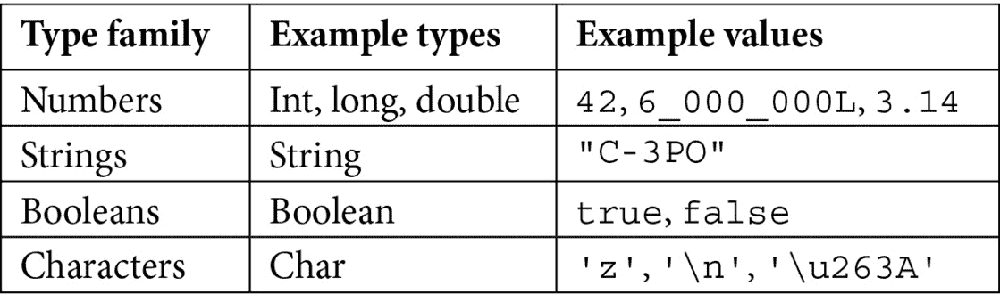

# 第一章：*第一章*：Kotlin 入门

本章的大部分内容将致力于基本 Kotlin 语法。在我们开始实现任何设计模式之前，对语言感到舒适是很重要的。

我们还将简要讨论设计模式解决的问题以及为什么应该在 Kotlin 中使用它们。这对那些对设计模式概念不太熟悉的人会有所帮助。但对于经验丰富的工程师来说，这也可能提供一个有趣的视角。

本章的目标不是涵盖整个语言词汇，而是让你熟悉一些基本概念和习惯用语。接下来的章节将随着我们讨论的设计模式的相关性，让你接触到更多的语言特性。

在本章中，我们将涵盖以下主要内容：

+   基本语言语法和特性

+   理解 Kotlin 代码结构

+   类型系统和 `null` 安全性

+   复习 Kotlin 数据结构

+   控制流程

+   处理文本和循环

+   类和继承

+   扩展函数

+   设计模式简介

到本章结束时，你将掌握 Kotlin 的基础知识，这将是后续章节的基础。

# 技术要求

要遵循本章中的说明，你需要以下内容：

+   IntelliJ IDEA Community Edition ([`www.jetbrains.com/idea/download/`](https://www.jetbrains.com/idea/download/))

+   OpenJDK 11 或更高版本 ([`openjdk.java.net/install/`](https://openjdk.java.net/install/))

本章的代码文件可在 [`github.com/PacktPublishing/Kotlin-Design-Patterns-and-Best-Practices/tree/main/Chapter01`](https://github.com/PacktPublishing/Kotlin-Design-Patterns-and-Best-Practices/tree/main/Chapter01) 找到。

# 基本语言语法和特性

无论你是来自 **Java**、**C#**、**Scala** 或任何其他静态类型编程语言，你都会发现 Kotlin 语法非常熟悉。这不是巧合，而是为了让那些在其他语言中有经验的人尽可能顺利地过渡到这门新语言。除了这种熟悉感之外，Kotlin 还带来了大量的特性，如更好的类型安全性。随着我们继续前进，你会发现它们都在试图解决现实世界的问题。这种实用主义方法在整个语言中都非常一致。例如，Kotlin 最强的优势之一是完整的 Java 互操作性。你可以在 Java 和 Kotlin 类旁边使用，并自由地使用 Kotlin 项目中可用的任何 Java 库。

总结来说，该语言的目标如下：

+   **实用主义**：使经常做的事情变得容易实现

+   **可读性**：在简洁性和代码所做之事的清晰性之间保持平衡

+   **易于重用**：支持将代码适应不同的情况

+   **安全**：使编写崩溃的代码变得困难

+   **互操作性**：允许使用现有的库和框架

本章将讨论如何实现这些目标。

## 多范式语言

编程语言中的主要范式包括过程式、面向对象和函数式范式。

作为一种实用主义，Kotlin 允许使用这些范式中的任何一个。它有类和继承，来自面向对象的方法。它有来自函数式编程的高阶函数。不过，如果你不想的话，你不需要将所有内容都封装在类中。如果你需要，Kotlin 允许你将整个代码结构作为一组过程和结构。你将看到所有这些方法是如何结合在一起的，因为不同的示例将结合不同的范式来解决讨论中的问题。

我们不会从头到尾全面覆盖一个主题的所有方面，而是会在前进的过程中构建知识。

# 理解 Kotlin 代码结构

当你开始用 Kotlin 编程时，你需要做的第一件事是创建一个新文件。Kotlin 的文件扩展名通常是`.kt`。

与 Java 不同，文件名和类名之间没有强关联关系。你可以根据需要将尽可能多的公共类放入你的文件中，只要这些类彼此相关，并且你的文件不会因为过长而难以阅读。

## 命名约定

按照惯例，如果你的文件中只有一个类，那么你应该将文件名与类名相同。

如果你的文件包含多个类，那么文件名应该描述这些类的共同目的。根据 Kotlin 编码约定，在命名文件时使用驼峰式命名法：[`kotlinlang.org/docs/coding-conventions.html`](https://kotlinlang.org/docs/coding-conventions.html)。

你的 Kotlin 项目中的主文件通常应该命名为`Main.kt`。

## 包

**包**是一组文件和类，它们具有相似的目的或领域。包是方便地将所有类和函数放在同一个命名空间中，通常在同一个文件夹中的方法。这就是为什么 Kotlin，类似于许多其他语言，使用包的概念。

文件所属的包使用`package`关键字声明：

```kt
package me.soshin
```

类似于将类放入文件中，你可以将任何包放在任何目录或文件中，但如果你在 Java 和 Kotlin 之间混合使用，Kotlin 文件应遵循 Java 包规则，如[`docs.oracle.com/javase/tutorial/java/package/namingpkgs.html`](https://docs.oracle.com/javase/tutorial/java/package/namingpkgs.html)中所述。

在纯 Kotlin 项目中，可以省略文件夹结构中的常见包前缀。例如，如果你的所有项目都在`me.soshin`包下，并且你的应用程序的一部分处理抵押贷款，你可以直接将文件放在`/mortgages`文件夹中，而不是像 Java 那样放在`/me/soshin/mortgages`文件夹中。

对于你的`Main.kt`文件，没有必要声明包。

## 注释

在接下来的工作中，我们将使用`//`来注释单行注释，使用`/* */`来注释多行注释。

注释是向其他开发者和未来的自己提供更多上下文的有用方式。现在，让我们编写我们的第一个 Kotlin 程序，并讨论 Kotlin 的指导原则是如何应用于其中的。

## Hello Kotlin

没有一本关于编程语言的书籍可以避免无处不在的 *Hello World* 示例。我们当然不会挑战这一光荣传统。

要开始学习 Kotlin 的工作原理，让我们将以下代码放入我们的 `Main.kt` 文件中并运行它：

```kt
fun main() {
```

```kt
    println("Hello Kotlin")
```

```kt
}
```

当你运行这个示例时，例如通过在 IntelliJ IDEA 中按下 **运行** 按钮，它简单地输出以下内容：

```kt
> Hello Kotlin
```

与下面这段执行相同功能的 Java 代码相比，这段代码中有一些有趣的属性：

```kt
class Main {
```

```kt
    public static void main(String[] args) {
```

```kt
        System.out.println("Hello Java");
```

```kt
    }
```

```kt
}
```

让我们在下一节中关注这些属性。

### 没有包装类

在 Java、C#、Scala 以及许多其他语言中，为了使函数可执行，必须将其包装在类中。

虽然 Kotlin 有 **包级别函数** 的概念。如果你的函数不需要访问类的属性，你不需要将其包装在类中。就这么简单。

我们将在接下来的章节中更详细地讨论包级别函数。

重要提示：

从现在开始，我们将使用省略号表示法（*三个点*）来表示代码中省略了一些部分，以便关注重要部分。你可以在本章的 GitHub 链接中找到完整的代码示例。

### 没有参数

作为字符串数组提供的参数是配置命令行应用程序的一种方式。在 Java 中，你不能有一个不接受此参数数组的可运行的 `main()` 函数：

```kt
public static void main(String[] args) { ... }
```

但在 Kotlin 中，这些是完全可以选择的。

### 没有静态修饰符

一些语言使用 `static` 关键字来表示类中的函数可以在不实例化类的情况下执行。`main()` 函数就是一个这样的例子。

在 Kotlin 中，没有这样的限制。如果你的函数没有任何状态，你可以将其放置在类之外，Kotlin 中也没有 `static` 关键字。

### 一个更简洁的打印函数

与输出字符串到标准输出的冗长 `System.out.println` 方法相比，Kotlin 提供了一个名为 `println()` 的别名，它做的是完全相同的事情。

### 没有分号

在 Java 以及许多其他语言中，每个语句或表达式都必须以分号结束，如下面的示例所示：

```kt
System.out.println("Semicolon =>"); 
```

Kotlin 是一种实用主义语言。因此，相反，它在编译期间推断出应该放置分号的位置：

```kt
println("No semicolons! =>")
```

大多数时候，你不需要在代码中放置分号。它们被认为是可选的。

这是一个很好的例子，说明了 Kotlin 如何既实用又简洁。它去掉了许多冗余，让你专注于重要的事情。

重要提示：

对于简单的代码片段，你不必在文件中编写代码。你还可以在线使用该语言：尝试 [`play.kotlinlang.org/`](https://play.kotlinlang.org/) 或者在安装 Kotlin 并运行 `kotlinc` 后使用 REPL 和交互式 shell。

# 理解类型

之前，我们提到 Kotlin 是一种类型安全的语言。现在让我们来检查 Kotlin 的类型系统，并将其与 Java 提供的类型进行比较。

重要提示：

Java 示例是为了熟悉，而不是为了证明 Kotlin 在任何方面优于 Java。

## 基本类型

一些语言在原始类型和对象之间做出区分。以 Java 为例，有 `int` 类型和 `Integer` ——前者更节省内存，后者通过支持缺少值和具有方法而更具表现力。

在 Kotlin 中没有这样的区别。从开发者的角度来看，所有类型都是相同的。

但这并不意味着 Kotlin 在这个方面比 Java 效率低。Kotlin 编译器优化类型。所以，你不必过于担心它。

大多数 Kotlin 类型与 Java 类似命名，例外的是 Java 的 `Integer` 被称为 `Int`，Java 的 void 被称为 `Unit`。

列出所有类型没有太多意义，但这里有一些例子：



表 1.1 - Kotlin 类型

## 类型推断

让我们通过从我们的 `Hello Kotlin` 示例中提取字符串来声明我们的第一个 Kotlin 变量：

```kt
var greeting = "Hello Kotlin"
```

```kt
println(greeting)
```

注意，在我们的代码中并没有声明 `greeting` 是 `String` 类型。相反，编译器决定应该使用哪种类型的变量。与 JavaScript、Python 或 Ruby 等解释型语言不同，变量的类型只定义一次。

在 Kotlin 中，这将产生一个错误：

```kt
var greeting = "Hello Kotlin"
```

```kt
greeting = 1 // <- Greeting is a String
```

如果你希望明确定义变量的类型，可以使用以下符号：

```kt
var greeting: String = "Hello Kotlin"
```

## 值

在 Java 中，变量可以被声明为 `final`。final 变量只能赋值一次，并且它们的引用实际上是不可变的：

```kt
final String s = "Hi";
```

```kt
s = "Bye"; // Doesn't work
```

Kotlin 强调我们应该尽可能使用不可变数据。Kotlin 中的不可变变量称为 `val` 关键字：

```kt
val greeting = "Hi"
```

```kt
greeting = "Bye"// Doesn't work, "Val cannot be reassigned"
```

值比变量更可取。不可变数据更容易推理，尤其是在编写并发代码时。我们将在 *第五章* 中进一步探讨这一点，*介绍函数式编程*。

## 比较和相等

我们在 Java 中很早就被教导，使用 `==` 比较对象不会产生预期的结果，因为它是测试引用相等性——两个指针是否相同，而不是两个对象是否相等。

相反，在 Java 中，我们使用 `equals()` 来比较对象，而使用 `==` 仅比较原始数据类型，这可能会导致一些混淆。

JVM 对整数进行缓存和字符串池化，以防止在某些基本情况下发生这种情况，因此为了示例，我们将使用一个大的整数：

```kt
Integer a = 1000;
```

```kt
Integer b = 1000;
```

```kt
System.out.println(a == b);      // false
```

```kt
System.out.println(a.equals(b)); // true
```

这种行为远非直观。相反，Kotlin 将 `==` 转换为 `equals()`：

```kt
val a = 1000
```

```kt
val b = 1000
```

```kt
println(a == b)      // true
```

```kt
println(a.equals(b)) // true
```

如果你确实想检查引用等价性，请使用`===`。但这对于一些基本类型是不适用的：

```kt
println(a === b) // Still true
```

当我们学习如何实例化类时，我们将更详细地讨论引用等价性。

## 声明函数

在 Java 中，每个方法都必须被一个类或接口包裹，即使它不依赖于任何信息。你可能熟悉 Java 中许多只包含静态方法的`Util`类，它们的唯一目的是满足语言要求并将这些方法捆绑在一起。

我们之前已经提到，在 Kotlin 中，函数可以声明在类之外。我们已经通过`main()`函数看到了这一点。声明函数的关键字是`fun`。参数类型位于参数名称之后，而不是之前：

```kt
fun greet(greeting: String) {
```

```kt
    println(greeting)
```

```kt
}
```

如果你需要返回一个结果，其类型将位于函数声明之后：

```kt
fun getGreeting(): String { 
```

```kt
    return "Hello, Kotlin!"
```

```kt
}
```

你可以亲自尝试一下：

```kt
fun main() {
```

```kt
    greet(getGreeting())
```

```kt
}
```

如果函数不返回任何内容，可以完全省略返回类型。无需将其声明为`void`，或其 Kotlin 对应类型`Unit`。

当一个函数非常短，仅由一个表达式组成，例如我们的`getGreeting()`函数，我们可以省略返回类型和大括号，并使用更简短的表示法：

```kt
fun getGreeting() = "Hello, Kotlin!"
```

在这里，Kotlin 编译器会推断出我们返回的是`String`类型。

与某些脚本语言不同，函数声明的顺序并不重要。你的`main`函数将能够访问其作用域内的所有其他函数，即使这些函数在代码文件中位于其后。

关于函数声明还有很多其他主题，例如命名参数、默认参数和可变数量的参数。我们将在接下来的章节中通过相关示例介绍它们。

重要提示：

本书中的许多示例都假设我们提供的代码被包裹在`main`函数中。如果你没有看到函数的签名，它可能应该是`main`函数的一部分。作为替代，你还可以在 IntelliJ 的临时文件中运行这些示例。

# 空安全

在 Java 世界中，最臭名昭著的异常可能是`NullPointerException`。这个异常背后的原因是 Java 中的每个对象都可以是`null`。这里的代码展示了为什么这是一个问题：

```kt
final String s = null;
```

```kt
System.out.println(s.length()); 
```

```kt
// Causes NullPointerException
```

尽管 Java 没有尝试解决这个问题，但`Optional`构造函数表示可能不存在值的值：

```kt
var optional = Optional.of("I'm not null");
```

```kt
if (optional.isPresent()) { 
```

```kt
    System.out.println(optional.get().length());
```

```kt
}
```

但这并没有解决我们的问题。如果我们的函数接收`Optional`作为参数，我们仍然可以传递一个`null`值，并在运行时崩溃程序：

```kt
void printLength(Optional<String> optional) {
```

```kt
    if (optional.isPresent()) { // <- Missing null check 
```

```kt
      here
```

```kt
        System.out.println(optional.get().length());
```

```kt
    }
```

```kt
}
```

```kt
printLength (null); // Crashes!
```

Kotlin 在编译时检查`null`：

```kt
val s: String = null // Won't compile
```

让我们看看用 Kotlin 编写的`printLength()`函数：

```kt
fun printLength(s: String) { 
```

```kt
    println(s.length)
```

```kt
}
```

使用`null`调用此函数根本无法编译：

```kt
printLength(null) 
```

```kt
// Null cannot be a value of a non-null type String
```

如果你希望你的类型能够接收`null`值，你需要使用问号将其标记为可空：

```kt
fun printLength(stringOrNull: String?) { ... }
```

Kotlin 中有多种处理空值的技术，例如智能转换、Elvis 运算符等。我们将在*第四章*“熟悉行为模式”中讨论空值的替代方案。现在让我们继续讨论 Kotlin 中的数据结构。

# 回顾 Kotlin 数据结构

在 Kotlin 中，我们应该熟悉三个重要的数据结构组：列表、集合和映射。我们将简要介绍每个，然后讨论一些与数据结构相关的话题，例如可变性和元组。

## 列表

一个`listOf()`函数：

```kt
val hobbits = listOf("Frodo", "Sam", "Pippin", "Merry")
```

注意，我们没有指定列表的类型。原因是 Kotlin 在构建集合时也可以使用类型推断，就像在初始化变量时一样。

如果你想提供列表的类型，你可以在定义函数参数时这样做：

```kt
val hobbits: List<String> = listOf("Frodo", "Sam", "Pippin",   "Merry")
```

要访问列表中特定索引的元素，我们使用方括号：

```kt
println(hobbits[1]) 
```

上一段代码将输出以下内容：

```kt
> Sam
```

## 集合

一个**集合**表示一组唯一元素。在集合中查找元素的存在比在列表中查找要快得多。但与列表不同，集合不提供索引访问。

让我们创建一组直到 1994 年之后的足球世界杯冠军：

```kt
val footballChampions = setOf("France", "Germany", "Spain",   "Italy", "Brazil", "France", "Brazil", "Germany")
```

```kt
println(footballChampions) // [France, Germany, Spain,   Italy, Brazil]
```

你可以看到每个国家在集合中恰好存在一次。要检查元素是否在`Set`集合中，你可以使用`in`函数：

```kt
println("Israel" in footballChampions)
```

```kt
println("Italy" in footballChampions) 
```

这将给我们以下结果：

```kt
> false
```

```kt
> true
```

注意，尽管集合通常不保证元素的顺序，但`setOf()`函数的当前实现返回`LinkedHashSet`，它保留了插入顺序——“法国”在输出中首先出现，因为它是在输入中第一个国家。

## 映射

一个`to`。实际上，这并不是一个真正的关键字，而是一个特殊函数。我们将在*第五章*“介绍函数式编程”中了解更多。

同时，让我们创建一个包含一些蝙蝠侠电影及其扮演布鲁斯·韦恩的演员的映射：

```kt
val movieBatmans = mapOf(
```

```kt
    "Batman Returns" to "Michael Keaton",
```

```kt
    "Batman Forever" to "Val Kilmer",
```

```kt
    "Batman & Robin" to "George Clooney"
```

```kt
)
```

```kt
println(movieBatmans) 
```

这将打印以下内容：

```kt
> {Batman Returns=Michael Keaton, 
```

```kt
> Batman Forever=Val Kilmer, 
```

```kt
> Batman & Robin=George Clooney}
```

要通过键访问值，我们使用方括号并提供键：

```kt
println(movieBatmans["Batman Returns"])
```

上一段代码将输出以下内容：

```kt
> Michael Keaton
```

这些数据结构也支持检查元素是否存在：

```kt
println(" Batman Begins " !in movieBatmans)
```

我们得到以下输出：

```kt
> true
```

## 可变性

我们迄今为止讨论的所有数据结构都是不可变的，或者更准确地说，是只读的。

使用`listOf()`函数创建的列表没有添加新元素的方法，我们也不能替换任何元素：

```kt
hobbits[0] = "Bilbo " // Unresolved reference!
```

不可变数据结构非常适合编写并发代码。但有时，我们仍然需要一个可以修改的集合。为了做到这一点，我们可以使用集合函数的可变版本：

```kt
val editableHobbits = mutableListOf("Frodo", "Sam",   "Pippin", "Merry")
```

```kt
editableHobbits.add("Bilbo")
```

可编辑的集合类型具有如`add()`这样的函数，允许我们修改它们，换句话说，对它们进行变异。

## 集合的替代实现

如果你之前与 JVM 合作过，你可能知道还有其他集合和映射的实现。例如，`TreeMap` 按顺序存储键。

这是你在 Kotlin 中实例化它们的方法：

```kt
import java.util.*
```

```kt
// Mutable map that is sorted by its keys 
```

```kt
val treeMap = java.util.TreeMap( 
```

```kt
    mapOf(
```

```kt
        "Practical Pig" to "bricks",
```

```kt
        "Fifer" to "straw",
```

```kt
        "Fiddler" to "sticks"
```

```kt
    )
```

```kt
)
```

```kt
println(treeMap.keys)
```

我们将得到以下输出：

```kt
> [Fiddler, Fifer, Practical Pig]
```

注意，*三只小猪* 的名字是按字母顺序排列的。

## 数组

在本节中，我们还应介绍另一个数据结构 – `String[]`，而字符串列表声明为 `List<String>`。Java 数组中的元素使用方括号访问，而列表中的元素使用 `get()` 方法访问。

要在 Java 中获取数组中的元素数量，我们使用 `length()` 方法，要获取集合中的相同操作，我们使用 `size()` 方法。这是 Java 遗产的一部分，以及它试图与 C++相似的努力。

在 Kotlin 中，数组语法与其他类型的集合保持一致。字符串数组声明为 `Array<String>`：

```kt
val musketeers: Array<String> = arrayOf("Athos", "Porthos",   "Aramis")
```

这是我们第一次在 Kotlin 代码中看到尖括号。类似于 Java 或 TypeScript，它们之间的类型被称为 **类型参数**。它表示这个数组包含字符串。我们将在 *第四章*，*熟悉行为模式* 中详细讨论这个主题，同时介绍泛型。

如果你已经有一个集合并且想要将其转换为数组，请使用 `toTypedArray` 函数：

```kt
listOf(1, 2, 3, 5).toTypedArray()
```

在其能力方面，Kotlin 数组与列表非常相似。例如，要获取 Kotlin 数组中的元素数量，我们使用与其他集合相同的 `size` 属性。

*你什么时候需要使用数组呢？* 一个例子是在 `main` 函数中接受参数。之前，我们只看到没有参数的 main 函数，但有时你希望从命令行传递它们。

这是一个接受命令行参数并打印所有参数的 `main` 函数的示例，参数之间用逗号分隔：

```kt
fun main(args: Array<String>) { 
```

```kt
    println(args.joinToString(", "))
```

```kt
}
```

其他情况包括调用期望数组作为参数的 Java 函数或使用我们将要讨论的 `varargs` 语法，这将在 *第三章*，*理解结构模式* 中介绍。

由于我们现在已经熟悉了一些基本数据结构，现在是时候讨论如何使用 `if` 和 `when` 表达式对它们应用逻辑了。

# 控制流

你可以说，控制流是编写程序的基础。我们将从两个条件表达式开始，`if` 和 `when`。

## if 表达式

在 Java 中，`if` 是一个语句。语句不会返回任何值。让我们看看以下函数，它返回两个可能值中的一个：

```kt
public String getUnixSocketPolling(boolean isBsd) { 
```

```kt
    if (isBsd) {
```

```kt
        return "kqueue"; 
```

```kt
    }
```

```kt
    else {
```

```kt
        return "epoll";
```

```kt
    }
```

```kt
}
```

虽然这个例子很容易理解，但通常情况下，有多个 `return` 语句被认为是坏习惯，因为它们往往使代码更难理解。

我们可以使用 Java 的 `var` 关键字重写这个方法：

```kt
public String getUnixSocketPolling(boolean isBsd) { 
```

```kt
    var pollingType = "epoll";
```

```kt
    if (isBsd) {
```

```kt
        pollingType = "kqueue";
```

```kt
    }
```

```kt
    return pollingType;
```

```kt
}
```

现在，我们有一个单独的`return`语句，但我们必须引入一个可变变量。同样，在这个简单的例子中，这不是问题。但，一般来说，你应该尽可能避免可变共享状态，因为这样的代码不是线程安全的。

*为什么我们一开始就遇到问题呢？*

与 Java 不同，在 Kotlin 中，`if`是一个表达式，意味着它返回一个值。我们可以将之前的函数重写为以下 Kotlin 版本：

```kt
fun getUnixSocketPolling(isBsd: Boolean): String {
```

```kt
    return if (isBsd) {
```

```kt
        "kqueue"
```

```kt
    } else {
```

```kt
        "epoll"
```

```kt
    }
```

```kt
}
```

或者我们可以使用更简短的形式：

```kt
fun getUnixSocketPolling(isBsd: Boolean): String     = if (isBsd) "kqueue" else "epoll"
```

由于`if`是一个表达式，我们不需要引入任何局部变量。

在这里，我们再次利用单表达式函数和类型推断。重要的是`if`返回一个`String`类型的值。根本不需要多个返回语句或可变变量。

重要提示：

Kotlin 的单行函数非常酷且实用，但你应该确保其他人除了你之外也能理解它们的作用。请谨慎使用。

## `when`表达式

*如果我们想在* `if` *语句中添加更多条件怎么办？（没有双关语的意思）*

在 Java 中，我们使用`switch`语句。在 Kotlin 中，有一个`when`表达式，它要强大得多，因为它可以嵌入一些其他 Kotlin 特性。让我们创建一个方法，给定一个超级英雄并告诉我们他们的宿敌是谁：

```kt
fun archenemy(heroName: String) = when (heroName) {
```

```kt
    "Batman" -> "Joker"
```

```kt
    "Superman" -> "Lex Luthor"
```

```kt
    "Spider-Man" -> "Green Goblin"
```

```kt
    else -> "Sorry, no idea"
```

```kt
}
```

`when`表达式非常强大。在接下来的章节中，我们将详细说明如何将它与范围、`enums`和`sealed`类结合使用。

作为一般规则，如果你有超过两个条件，请使用`when`。对于简单情况，请使用`if`。

# 文本处理

我们在上一节中已经看到了许多处理文本的例子。毕竟，没有使用字符串就无法打印`Hello Kotlin`，或者至少会非常尴尬和不方便。

在本节中，我们将讨论一些更高级的特性，这些特性允许你有效地操作文本。

## 字符串插值

假设现在我们想要实际打印上一节的结果。

首先，正如你可能已经注意到的，在之前的某个例子中，Kotlin 提供了一个巧妙的`println()`标准函数，它封装了 Java 中更庞大的`System.out.println`命令。

但，更重要的是，就像许多其他现代语言一样，Kotlin 支持使用`${}`语法进行字符串插值。让我们以前面的例子为例：

```kt
val hero = "Batman"
```

```kt
println("Archenemy of $hero is ${archenemy(hero)}")
```

之前的代码将按以下方式打印：

```kt
> Archenemy of Batman is Joker
```

注意，如果你正在插值一个函数的值，你需要将其包裹在花括号中。如果是变量，则可以省略花括号。

## 多行字符串

Kotlin 支持多行字符串，也称为**原始字符串**。这个特性存在于许多现代语言中，并被引入到**Java 15**中的**文本块**。

这个想法很简单。如果我们想要打印跨越多行的文本，比如说来自刘易斯·卡罗尔的《爱丽丝梦游仙境》的一段，一种方法是将它们连接起来：

```kt
println("Twinkle, Twinkle Little Bat\n" +
```

```kt
    "How I wonder what you're at!\n" +
```

```kt
    "Up above the world you fly,\n" +
```

```kt
    "Like a tea tray in the sky.\n" +
```

```kt
    "Twinkle, twinkle, little bat!\n" +
```

```kt
    "How I wonder what you're at!")
```

虽然这种方法确实有效，但它相当繁琐。

相反，我们可以使用三引号定义相同的字符串字面量：

```kt
println("""Twinkle, Twinkle Little Bat 
```

```kt
           How I wonder what you're at!
```

```kt
           Up above the world you fly,
```

```kt
           Like a tea tray in the sky.
```

```kt
           Twinkle, twinkle, little bat!
```

```kt
           How I wonder what you're at!""")
```

这是一种更干净地实现相同目标的方法。如果你执行这个示例，你可能会惊讶地发现诗歌的缩进不正确。原因是多行字符串保留了空白字符，例如制表符。

为了正确打印结果，我们需要添加一个`trimIndent()`调用：

```kt
println("""
```

```kt
    Twinkle, Twinkle Little Bat
```

```kt
    How I wonder what you're at! 
```

```kt
    """.trimIndent())
```

多行字符串还有另一个好处——不需要在它们中转义引号。让我们看看以下示例：

```kt
println("From \" Alice's Adventures in Wonderland\" ")
```

注意，文本中的引号字符必须使用反斜杠字符进行转义。

现在，让我们使用多行语法查看相同的文本：

```kt
println(""" From " Alice's Adventures in Wonderland" """)
```

注意，不再需要转义字符。

# 循环

现在，让我们讨论另一个典型的控制结构——循环。循环对于大多数开发者来说是一个非常自然的结构。没有循环，重复相同的代码块将非常困难（尽管我们将在后面的章节中讨论如何在没有循环的情况下做到这一点）。

## for-each 循环

在 Kotlin 中，最有助于理解循环类型的是`for`-`each`循环。这个循环可以遍历字符串、数据结构和基本上所有具有迭代器的对象。我们将在*第四章*“熟悉行为模式”中了解更多关于迭代器的知识，所以现在让我们通过一个简单的字符串来演示它们的使用：

```kt
for (c in "Word") {
```

```kt
    println(c)
```

```kt
}
```

这将打印以下内容：

```kt
>W
```

```kt
>o
```

```kt
>r
```

```kt
>d
```

`for`-`each`循环适用于我们之前讨论的所有数据结构类型，即列表、集合和映射。让我们以列表为例：

```kt
val jokers = listOf("Heath Ledger", "Joaquin Phoenix",   "Jack Nicholson")
```

```kt
for (j in jokers) {
```

```kt
    println(j)
```

```kt
}
```

我们将得到以下输出：

```kt
> Heath Ledger
```

```kt
> Joaquin Phoenix
```

```kt
> Jack Nicholson
```

你将在本书中多次看到这个循环，因为它非常有用。

## for 循环

虽然在某些语言中`for`-`each`和`for`循环是完全不同的结构，但在 Kotlin 中，`for`循环只是一个对范围的`for`-`each`循环。

为了更好地理解它，让我们看看一个打印所有单个数字的`for`循环：

```kt
for (i in 0..9) {
```

```kt
    println(i)
```

```kt
}
```

这看起来与 Java 的`for`循环完全不同，可能更让你想起 Python。这两个点被称为**范围运算符**。

如果你运行这段代码，你会注意到这个循环是包含的。它打印了所有的数字，包括`9`。这类似于以下 Java 代码：

```kt
for (int i = 0; i <= 9; i++) 
```

如果你想要你的范围是排他的，不包括最后一个元素，你可以使用`until`函数：

```kt
for (i in 0 until 10) {
```

```kt
    println("for until $i") 
```

```kt
// Same output as the previous 
```

```kt
        loop
```

```kt
}
```

如果你想要以相反的顺序打印数字，可以使用`downTo`函数：

```kt
for (i in 9 downTo 0) {
```

```kt
    println("for downTo $i") // 9, 8, 7...
```

```kt
}
```

虽然看起来它们更像操作符，但`until`和`downTo`被称为函数可能会让人感到困惑。这是 Kotlin 的另一个有趣特性，称为**中缀调用**，稍后我们将对其进行讨论。

## 当循环

与其他一些语言相比，`while`循环的功能没有变化，所以我们非常简短地介绍它们：

```kt
var x = 0
```

```kt
while (x < 10) {
```

```kt
    x++
```

```kt
    println("while $x")
```

```kt
}
```

这将打印从`1`到`10`的数字。请注意，我们被迫将`x`定义为`var`。较少使用的`do while`循环也存在于该语言中：

```kt
var x = 5 
```

```kt
do {
```

```kt
    println("do while $x")
```

```kt
    x--
```

```kt
} while (x > 0)
```

很可能，你不会在 Kotlin 中经常使用`while`循环和`do while`循环。在接下来的章节中，我们将讨论更多更符合习惯的做法。

# 类和继承

虽然 Kotlin 是一种多范式语言，但它与基于类的 Java 编程语言有着强烈的亲和力。考虑到 Java 和 JVM 的互操作性，Kotlin 也有类和经典继承的概念也就不足为奇了。

在本节中，我们将介绍声明类、接口、抽象类和数据类的语法。

## 类

`class`关键字，就像 Java 一样。

让我们想象我们正在开发一个视频游戏。我们可以定义一个类来表示玩家，如下所示：

```kt
class Player {
```

```kt
}
```

类的实例化看起来就像这样：

```kt
val player = Player()
```

注意，Kotlin 中没有`new`关键字。Kotlin 编译器知道我们想要通过类名后面的**圆括号**创建该类的新实例。

如果类没有主体，就像这个简单的例子一样，我们可以省略大括号：

```kt
class Player // Totally fine
```

没有任何函数或属性的类并不特别有用，但我们在*第四章*中会探讨为什么存在这种语法，以及它如何与其他语言特性保持一致，即*熟悉行为模式*。

### 主要构造函数

如果玩家在创建时能够指定他们的姓名将是有用的。为了做到这一点，让我们给我们的类添加一个主要构造函数：

```kt
class Player(name: String) 
```

现在，这个声明将不再有效：

```kt
val player = Player()
```

此外，我们还需要为每个新实例化的玩家提供一个名称：

```kt
val player = Player("Roland")
```

我们很快就会回到构造函数。但到目前为止，让我们讨论属性。

### 属性

在 Java 中，我们习惯于 getter 和 setter 的概念。如果我们用 Java 习惯用法在 Kotlin 中编写表示游戏玩家的类，它可能看起来像这样：

```kt
class Player(name: String) {
```

```kt
    private var name: String = name
```

```kt
    fun getName(): String {
```

```kt
        return name
```

```kt
    }
```

```kt
    fun setName(name: String) {
```

```kt
        this.name = name;
```

```kt
    }
```

```kt
}
```

如果我们要获取玩家的姓名，我们调用`getName()`方法。如果我们想更改玩家的姓名，我们调用`setName()`方法。这很简单，但很冗长。

这是我们在 Kotlin 中第一次看到`this`关键字，所以让我们快速解释一下它的含义。类似于许多其他语言，`this`持有对该类当前对象的引用。在我们的例子中，它指向`Player`类的实例。

*那么，我们为什么不这样写我们的类呢？*

```kt
class Player {
```

```kt
    var name: String = ""
```

```kt
}
```

这种方法似乎有很多好处。当然，它比以前更简洁。现在读取一个人的姓名要短得多——`player.name`。

此外，更改名称的方式更加直观——`player.name = "Alex";`。

但这样做，我们失去了对对象的很多控制。例如，我们无法使`Player`不可变。如果我们想让每个人都能在任何时候读取玩家的姓名，他们也将能够更改它。如果我们以后想更改代码，这将是一个重大问题。使用 setter，我们可以控制这一点，但使用公共字段则不行。

Kotlin 属性为所有这些问题提供了一个解决方案。让我们看看以下类定义：

```kt
class Player(val name: String)
```

注意，这几乎与*主构造函数*部分中的示例相同，但现在`name`有一个`val`修饰符。

这看起来与所有问题的`PublicPerson` Java 示例相同，但实际上，这种实现与`ImmutablePerson`类似，具有所有优点。

*这是怎么可能的？* 在幕后，Kotlin 将为我们的便利生成具有相同名称的成员和获取器。我们可以在构造函数中设置属性值，然后使用其名称访问它：

```kt
val player = Player("Alex")
```

```kt
println(player.name)
```

尝试更改我们的`Player`的名称将导致错误：

```kt
player.name = "Alexey" // value cannot be reassigned
```

由于我们将此属性定义为值，因此它是只读的。要能够更改属性，我们需要将其定义为可变的。在构造函数参数前加上`var`会自动生成一个获取器和设置器：

```kt
class Player(val name: String, var score: Int)
```

如果我们不想在构造时提供值的能力，我们可以将属性移动到类体内部：

```kt
class Player(val name: String) { 
```

```kt
    var score: Int = 0
```

```kt
}
```

注意，现在我们必须为该属性提供一个默认值，因为它不能简单地是`null`。

### 自定义设置器和获取器

尽管我们现在可以轻松地设置分数，但其价值可能无效。以下是一个例子：

```kt
player.score = -10
```

如果我们想要有一个具有一些验证的可变属性，我们需要为它定义一个显式的设置器，使用`set`语法：

```kt
class Player(val name: String) { 
```

```kt
    var score: Int = 0
```

```kt
       set(value) {
```

```kt
             field = if (value >= 0) {
```

```kt
                 value
```

```kt
             } else {
```

```kt
                 0
```

```kt
             }
```

```kt
        }
```

```kt
}
```

在这里，`value`是属性的新的值，而`field`是其当前值。如果我们的新值是负数，我们决定使用默认值。

来自 Java，你可能会倾向于在你的设置器中编写以下代码：

```kt
set(value) {
```

```kt
    this.score = if (value >= 0) value else 0
```

```kt
}
```

但是，在 Kotlin 中，这将创建一个无限递归。你必须记住 Kotlin 为可变属性生成设置器。因此，前面的代码将被翻译成类似以下的内容：

```kt
// This is a pseudocode, not real Kotlin code!
```

```kt
...
```

```kt
fun setValue(value: Int) {
```

```kt
    setValue(value) // Infinite recursion!
```

```kt
}
```

```kt
...
```

因此，我们使用自动提供的`field`标识符。

以类似的方式，我们可以声明一个自定义获取器：

```kt
 class Player(name: String) {
```

```kt
    val name = name
```

```kt
        get() = field.toUpperCase()
```

```kt
}
```

首先，我们将作为构造函数参数接收的值保存到具有相同名称的字段中。然后，我们定义一个自定义获取器，该获取器将转换此属性中的所有字符为大写：

```kt
println(player.name)
```

我们将得到以下输出：

```kt
> ALEX
```

## 接口

你可能已经熟悉其他语言中的**接口**概念。但让我们快速回顾一下。

在类型化语言中，接口提供了一种定义某些类必须实现的行为的方式。定义接口的关键字很简单，就是`interface`。

现在让我们定义一个用于掷骰子的接口：

```kt
interface DiceRoller {
```

```kt
    fun rollDice(): Int
```

```kt
}
```

要实现接口，一个类在冒号后指定其名称。在 Kotlin 中没有`implement`关键字。

```kt
import kotlin.random.*
```

```kt
class Player(...) : DiceRoller 
```

```kt
{
```

```kt
    ...
```

```kt
    fun rollDice() = Random.nextInt(0, 6)
```

```kt
}
```

这也是我们第一次看到`import`关键字。正如其名所示，它允许我们从 Kotlin 标准库中导入另一个包，例如`kotlin.random`。

Kotlin 中的接口也支持默认函数。如果一个函数不依赖于任何状态，例如这个简单地掷出`0`到`5`之间随机数的函数，我们可以将其移动到接口中：

```kt
interface DiceRoller {
```

```kt
    fun rollDice() = Random.nextInt(0, 6)
```

```kt
}
```

## 抽象类

`interface`，一个抽象类可以包含状态。

让我们创建一个抽象类，使其能够移动我们的玩家在棋盘上，或者为了简化，只需存储新的坐标：

```kt
abstract class Moveable() {
```

```kt
    private var x: Int = 0
```

```kt
    private var y: Int = 0
```

```kt
    fun move(x: Int, y: Int) {
```

```kt
        this.x = x
```

```kt
        this.y = y
```

```kt
    } 
```

```kt
}
```

任何实现了`Moveable`接口的类都将继承一个`move()`函数。

现在，让我们更详细地讨论一下这里第一次出现的`private`关键字。

## 可见性修饰符

我们在本章前面提到了`private`关键字，但没有机会解释它。`private`属性或函数仅对其声明的类（在这种情况下为`Moveable`）可访问。

类和属性的默认可见性是公共的，所以没有必要总是使用`public`关键字。

为了扩展一个抽象类，我们只需在它的名字后面加上一个冒号。在 Kotlin 中也没有`extends`关键字。

```kt
class ActivePlayer(name: String) : Moveable(), DiceRoller {
```

```kt
...
```

```kt
}
```

*那么，你如何区分抽象类和接口呢？*

抽象类在其名称后面有圆括号，表示它有一个构造函数。在接下来的章节中，我们将看到这个语法的其他用途。

## 继承

除了扩展抽象类之外，我们还可以扩展常规类。

让我们尝试使用与抽象类相同的语法扩展我们的`Player`类。我们将尝试创建一个`ConfusedPlayer`类，即当给定(*x*和*y*)时，移动到(*y*和*x*)的玩家。

首先，让我们创建一个继承自`Player`的类：

```kt
class ConfusedPlayer(name: String ): ActivePlayer(name)
```

这里，你可以看到为什么即使在抽象类中也需要圆括号。这允许向父类构造函数传递参数。这类似于在 Java 中使用`super`关键字。

意外地，这段代码无法编译。原因是 Kotlin 中的所有类默认都是最终的，不能被继承。

为了允许其他类从它们继承，我们需要将它们声明为`open`：

```kt
open class ActivePlayer (...) : Moveable(), DiceRoller {
```

```kt
...
```

```kt
}
```

现在让我们尝试重写`move`方法：

```kt
class ConfusedPlayer(name : String): Player(name) {
```

```kt
    // move() must be declared open
```

```kt
    override fun move(x: Int, y: Int) {
```

```kt
        this.x = y // must be declared protected
```

```kt
        this.y = x // must be declared protected
```

```kt
    }
```

```kt
}
```

重写允许我们重新定义父类中函数的行为。在 Java 中，`@Override`是一个可选的注解，而在 Kotlin 中`override`是一个强制关键字。你不能隐藏超类型方法，并且没有显式使用`override`的代码无法编译。

在那段代码中，我们引入了两个其他问题。首先，我们不能重写未声明为`open`的方法。其次，由于两个坐标都是`private`的，我们不能从子类中修改我们的玩家坐标。

让我们使用`protected`可见性修饰符使属性对子类可访问，并将函数标记为`open`以能够重写它：

```kt
abstract class Moveable() {
```

```kt
protected var x: Int = 0
```

```kt
protected var y: Int = 0
```

```kt
open fun move(x: Int, y: Int) {
```

```kt
        this.x = x
```

```kt
        this.y = y
```

```kt
    } 
```

```kt
}
```

现在，两个问题都已经解决。你在这里也第一次看到了`protected`关键字。类似于 Java，这个可见性修饰符使得属性或方法只对类本身及其子类可见。

## 数据类

记住，Kotlin 的一切都是关于生产力。Java 开发者最常见的任务之一是创建另一个 `equals` 或 `hashCode` 方法。这个任务如此常见，以至于 Kotlin 将其内置到语言中。它被称为 **data 类**。

让我们看看以下示例：

```kt
data class User(val username: String, private val 
```

```kt
  password: String)
```

这将为我们生成一个具有两个获取器而没有设置器（注意 `val` 部分）的类，它还将以正确的方式实现 `equals`、`hashCode` 和 `clone` 函数。

`data` 类的引入是 Kotlin 语言在减少样板代码方面最显著的改进之一。就像常规类一样，`data` 类可以有自己的函数：

```kt
data class User(val username: String, private val 
```

```kt
  password: String) {
```

```kt
    fun hidePassword() = "*".repeat(password.length)
```

```kt
}
```

```kt
val user = User("Alexey", "abcd1234")
```

```kt
println(user.hidePassword()) // ********
```

与常规类相比，`data` 类的主要限制是它们总是 `final` 的，这意味着没有其他类可以从它们继承。但为了自动生成 `equals` 和 `hashCode` 函数，这只是一个微不足道的代价。

### Kotlin `data` 类与 Java 记录

从 Kotlin 中学习，Java 15 引入了 `record` 的概念：

```kt
public record User(String username, String password) {}
```

这两种语法都很简洁。*但是，它们之间有区别吗？*

+   Kotlin `data` 类有一个 `copy()` 函数，记录没有。我们将在 *第二章* 中介绍它，*使用创建型模式*，同时讨论 **原型** 设计模式。

+   在记录中，所有属性都必须是 `final` 的，或者用 Kotlin 的话说，记录只支持值而不是变量。

+   `data` 类可以继承自其他类，而记录不允许这样做。

总结来说，`data` 类在许多方面优于记录。但两者都是各自语言的优秀特性。由于 Kotlin 是以互操作性为设计理念的，你还可以轻松地将 `data` 类标记为记录，以便从 Java 访问：

```kt
@JvmRecord
```

```kt
data class User(val username: String, val password: String)
```

# 扩展函数

在继续下一章内容之前，我们将介绍最后一个特性 `final`。例如，你可能希望有一个字符串具有上一节中的 `hidePassword()` 函数。

实现这一点的其中一种方法是为我们声明一个包装字符串的类：

```kt
data class Password(val password: String) {
```

```kt
    fun hidePassword() = "*".repeat(password.length)
```

```kt
}
```

这个解决方案相当浪费。它增加了另一个间接层。

在 Kotlin 中，有更好的方法来实现这一点。

要扩展一个类而不从它继承，我们可以在函数名前加上我们想要扩展的类的名称：

```kt
fun String.hidePassword() = "*".repeat(this.length)
```

这看起来几乎像是一个常规的顶层函数声明，但有一个关键的变化——在函数名之前是一个类名。这个类被称为 **方法接收者**。

在函数体内部，`this` 将指向函数被调用的任何 `String` 类。

现在，让我们声明一个常规字符串并尝试在其上调用这个新函数：

```kt
val password: String = "secretpassword"
```

```kt
println("Password: ${password.hidePassword()}")
```

这将打印以下内容：

```kt
> Password: **************
```

*这是什么黑魔法吗？* 我们成功地向一个 `final` 类添加了一个函数，这在技术上应该是不可行的。

这是 Kotlin 编译器的一个特性，是众多特性之一。这个扩展函数将被编译成以下代码：

```kt
// This is not real Kotlin
```

```kt
fun hidePassword(this: String) {
```

```kt
    "*".repeat(this.length)
```

```kt
}
```

你可以看到，实际上，这是一个常规的顶级函数。它的第一个参数是我们扩展的类的实例。这也可能让你想起**Go**语言中结构体的方法是如何工作的。

打印加密密码的代码将被相应地调整：

```kt
val password: String = "secretpassword"
```

```kt
println("Password: ${hidePassword(password)}")
```

因此，扩展函数不能覆盖类的成员函数，也不能访问其`private`或`protected`属性。

# 设计模式简介

现在我们对基本的 Kotlin 语法有了更多的了解，我们可以继续讨论设计模式到底是什么。

## 什么是设计模式？

围绕设计模式存在不同的误解。一般来说，它们如下：

+   设计模式只是缺少语言特性。

+   动态语言中不需要设计模式。

+   设计模式仅与面向对象的语言相关。

+   设计模式仅在企业中使用。

实际上，设计模式只是解决常见问题的一种经过验证的方法。作为一个概念，它们并不局限于特定的编程语言（例如 Java），也不局限于语言家族（例如 C 家族），也不局限于编程本身。你可能甚至听说过软件架构中的设计模式，它们讨论了不同的系统如何高效地相互通信。有面向服务的架构模式，你可能知道它为**服务导向架构**（**SOA**），以及从 SOA 演变而来的微服务设计模式，这些模式在过去几年中涌现出来。未来肯定会带来更多的设计模式家族。

即使在物理世界中，在软件开发之外，我们也被设计模式和针对特定问题的普遍接受解决方案所包围。让我们看看一个例子。

### 生活中的设计模式

*你最近乘坐过电梯吗？电梯墙上有没有镜子？为什么会有镜子？当你最后一次乘坐没有镜子也没有玻璃墙的电梯时，你感觉如何？*

我们在电梯中通常放置镜子的主要原因是为了解决一个常见问题——乘坐电梯很无聊。我们本可以放一张图片。但如果每天至少乘坐同一部电梯两次，图片也会很快变得无聊。虽然便宜，但改善不大。

我们可以像一些人做的那样放一个电视屏幕。但这会使电梯更贵。而且它还需要大量的维护。我们需要在屏幕上放置一些内容，以避免重复。所以，要么有一个人负责偶尔更新内容，要么有第三方公司为我们做这件事。我们还得处理屏幕硬件及其背后的软件可能出现的不同问题。当然，看到*蓝屏死机*是很有趣的，但只是轻微的。

一些建筑师甚至选择将电梯井设置在建筑外部，并使部分墙壁透明。这可能会提供一些令人兴奋的视野。但这个解决方案也需要维护（脏窗户不会带来最佳的视野）以及大量的建筑规划。

因此，我们放了一面镜子。即使你独自乘坐，你也能看到一位有吸引力的人。一些研究表明，无论如何，我们都会觉得自己比实际更有吸引力。也许你有机会在重要会议之前最后一次审视你的外表。镜子从视觉上扩展了空间，使整个旅程不那么压抑或尴尬，尤其是在一天的开始，电梯真的很拥挤。

### 设计过程

让我们尝试理解我们刚才做了什么。

我们并没有在电梯里发明镜子。我们见过它们成千上万次。但我们正式化了这个问题（乘坐电梯很无聊）并讨论了替代方案（电视屏幕和玻璃墙）以及常用解决方案的好处（解决问题且易于实施）。这就是设计模式的所有内容。

设计过程的基本步骤如下：

1.  明确当前问题的定义。

1.  考虑不同的替代方案，基于利弊。

1.  选择解决问题的方案，同时最好地适应你的具体约束。

## 为什么在 Kotlin 中使用设计模式？

Kotlin 出现是为了解决当今的现实世界问题。在接下来的章节中，我们将讨论 1994 年由“四人帮”首次提出的 *设计模式*，以及从函数式编程范式和用于处理应用程序并发的设计模式中出现的模式。

你会发现一些设计模式非常常见或有用，以至于它们已经作为保留关键字或标准函数内置到语言中。其中一些需要结合一组语言特性。而有些则不再那么有用，因为世界已经前进，其他模式正在取代它们。

但无论如何，熟悉设计模式和最佳实践扩展了你的 *开发者工具箱*，并在你和你同事之间创造了一个共享的词汇。

# 摘要

在本章中，我们介绍了 Kotlin 编程语言的主要目标。我们学习了如何声明变量、基本类型、`null` 安全性和类型推断。我们观察到程序流程是通过诸如 `if`、`when`、`for` 和 `while` 等命令控制的，我们还研究了用于定义类和接口的不同关键字：`class`、`interface`、`data` 类和 `abstract` 类。我们学习了如何构建新的类以及如何实现接口和继承其他类。最后，我们讨论了在 Kotlin 中哪些设计模式是合适的以及为什么我们需要它们。

现在，你应该能够编写简单且类型安全的 Kotlin 程序。我们还需要讨论语言的其他许多方面。一旦需要应用它们，我们将在后面的章节中介绍这些内容。

在下一章中，我们将讨论三种设计模式家族中的第一个——创建型模式。

# 问题

1.  Kotlin 中 `var` 和 `val` 有什么区别？

1.  你如何在 Kotlin 中扩展一个类？

1.  你如何向一个 `final` 类添加功能？
