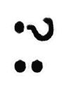

# 第三章：*第三章*：理解结构型模式

本章涵盖了**Kotlin**中的**结构型模式**。一般来说，结构型模式处理**对象**之间的关系。

我们将讨论如何在不产生复杂类层次结构的情况下扩展我们对象的功能。我们还将讨论如何适应未来的变化或修复过去所做的某些设计决策，以及如何减少我们程序的内存占用。

在本章中，我们将涵盖以下模式：

+   装饰器

+   适配器

+   桥接

+   组合

+   外观

+   享元

+   代理

到本章结束时，你将更好地理解如何组合你的对象，以便它们可以更容易地扩展并适应不同类型的变更。

# 技术要求

本章的要求与前面的章节相同——你需要**IntelliJ IDEA**和**JDK**。

你可以在 GitHub 上找到本章的代码文件，地址为[`github.com/PacktPublishing/Kotlin-Design-Patterns-and-Best-Practices/tree/main/Chapter03`](https://github.com/PacktPublishing/Kotlin-Design-Patterns-and-Best-Practices/tree/main/Chapter03)。

# 装饰器

在上一章中，我们讨论了**原型**设计模式，它允许我们创建具有略微（或不是那么略微）不同数据的类的实例。这引发了一个问题：

*如果我们想创建一组所有都具有略微不同行为的类会发生什么？*

好吧，由于 Kotlin 中的函数是**一等公民**（我们将在本章中解释这一点），你可以使用原型设计模式来实现这个目标。毕竟，创建一组具有略微不同行为的类是 JavaScript 成功做到的事情。但本章的目标是讨论对同一问题的另一种方法。毕竟，设计模式都是关于**方法**的。

通过实现**装饰器**设计模式，我们允许我们的代码用户指定他们想要添加的能力。

## 增强类

假设我们有一个相当简单的类，它注册了星际迷航宇宙中的所有船长及其船只：

```kt
open class StarTrekRepository {
```

```kt
    private val starshipCaptains = mutableMapOf("USS 
```

```kt
        Enterprise" to "Jean-Luc Picard")
```

```kt
    open fun getCaptain(starshipName: String): String {
```

```kt
        return starshipCaptains[starshipName] ?: "Unknown"
```

```kt
    }
```

```kt
    open fun addCaptain(starshipName: String, captainName:         String) {
```

```kt
        starshipCaptains[starshipName] = captainName
```

```kt
    }
```

```kt
}
```

一天，你的船长——抱歉，*敏捷大师*——来找你，有一个紧急要求。从现在起，每次有人搜索船长时，我们必须也将此记录到控制台。然而，这个简单任务有一个陷阱：你不能直接修改`StarTrekRepository`类。这个类还有其他消费者，他们不需要这个记录行为。

但在我们深入探讨这个问题之前，让我们讨论一下我们可以在我们的类中观察到的某个特性——那就是在`getCaptain`函数中可以看到的一个奇怪的运算符。

## 爱丽丝运算符

在*第一章* *Kotlin 入门*中，我们了解到 Kotlin 不仅强类型，而且还是一种空安全语言。

*如果，像我们的例子一样，某个键在映射中可能没有存储值会发生什么？*

如果我们在处理一个映射，一个选项是使用 Kotlin 提供的 `getOrDefault` 方法。在这种情况下，这可能是一个可行的选项，但在你可能需要处理空值的情况下，它将不起作用。

另一个选项是使用 `?:` 操作符。如果你想知道这个操作符名字的由来，它确实在一定程度上与猫王艾维斯·普雷斯利的发型相似：

![图 3.1 – 如果我们将 Elvis 操作符顺时针旋转 90 度，它看起来有点像庞克发型]



![图 3.1 – 如果我们将 Elvis 操作符顺时针旋转 90 度，它看起来有点像庞克发型]

Elvis 操作符的目标是在我们收到空值时提供一个默认值。再次看看 `getCaptain` 函数，看看这是如何实现的。该函数的 *去糖化* 形式如下：

```kt
return if (starshipCaptains[starshipName] == null) 
```

```kt
    "Unknown" else starshipCaptains[starshipName]
```

因此，你可以看到这个操作符为我们节省了很多打字。

## 继承问题

让我们回到手头的任务。由于我们的类及其方法被声明为公开的，我们可以扩展这个类并覆盖我们需要的函数：

```kt
class LoggingGetCaptainStarTrekRepository : 
```

```kt
  StarTrekRepository() {
```

```kt
    override fun getCaptain(starshipName: String): String {
```

```kt
        println("Getting captain for $starshipName")
```

```kt
        return super.getCaptain(starshipName)
```

```kt
    }
```

```kt
}
```

这相当简单！尽管那个类的名字变得越来越长。

注意我们是如何通过使用 `super` 关键字将实现委托给父类的。然而，第二天，你的老板（抱歉，*敏捷大师*）又来要求另一个功能。在添加船长时，我们需要检查他们的名字长度不超过 15 个字符。这可能对一些克林贡人来说是个问题，但你决定无论如何都要实现它。顺便说一下，这个功能不应与之前开发的日志记录功能相关。有时我们只想记录日志，有时我们只想进行验证。所以，我们的新类将如下所示：

```kt
class ValidatingAddCaptainStarTrekRepository : 
```

```kt
  StarTrekRepository() {
```

```kt
    override fun addCaptain(starshipName: String, 
```

```kt
        captainName: String) {
```

```kt
        if (captainName.length > 15) {
```

```kt
            throw RuntimeException("$captainName is longer                 than 20 characters!")
```

```kt
        }
```

```kt
        super.addCaptain(starshipName, captainName)
```

```kt
    }
```

```kt
}
```

另一个任务已完成。

然而，第二天，又出现了另一个需求：在某些情况下，我们需要 `StarTrekRepository` 具有日志记录功能并执行验证。我想我们现在得把它命名为 `LoggingGetCaptainValidatingAddCaptainStarTrekRepository`。

这种问题出奇地常见，并且它们是设计模式可能在这里帮助我们的一个明确迹象。

装饰器设计模式的目的是动态地为我们的对象添加新行为。在我们的例子中，*日志记录* 和 *验证* 是我们有时希望应用到对象上，有时又不想应用的行为。

我们首先将 `StarTrekRepository` 转换为一个接口：

```kt
interface StarTrekRepository {
```

```kt
    fun getCaptain(starshipName: String): String
```

```kt
    fun addCaptain(starshipName: String, captainName:         String)
```

```kt
    }
```

然后，我们将使用之前的逻辑实现该接口：

```kt
class DefaultStarTrekRepository : StarTrekRepository {
```

```kt
    private val starshipCaptains = mutableMapOf("USS Enter         prise" to "Jean-Luc Picard")
```

```kt
    override fun getCaptain(starshipName: String): String {
```

```kt
        return starshipCaptains[starshipName] ?: "Unknown"
```

```kt
    }
```

```kt
    override fun addCaptain(starshipName: String, captain         Name: String) {
```

```kt
        starshipCaptains[starshipName] = captainName
```

```kt
    }
```

```kt
}
```

接下来，我们不会扩展我们的具体实现，而是实现接口并使用一个新的关键字 `by`：

```kt
class LoggingGetCaptain(private val repository:
```

```kt
  StarTrekRepository): StarTrekRepository by repository {
```

```kt
    override fun getCaptain(starshipName: String): String {
```

```kt
        println("Getting captain for $starshipName")
```

```kt
        return repository.getCaptain(starshipName)
```

```kt
    }
```

```kt
}
```

`by` 关键字将接口的实现委托给另一个对象。这就是为什么 `LoggingGetCaptain` 类不需要实现接口中声明的任何函数。它们都由实例包装的另一个对象默认实现。

在这种情况下，最难理解的部分是签名。我们需要从装饰器设计模式中得到如下内容：

+   我们需要能够接收我们装饰的对象。

+   我们需要能够保留对象的引用。

+   当我们的装饰器被调用时，我们需要能够决定是否要改变我们持有的对象的行为，或者要委托调用。

+   我们需要能够提取一个接口或者由（库）作者提供。

注意，我们不再使用`super`关键字。如果我们尝试这样做，它将不会工作，因为我们现在正在实现一个类。相反，我们使用对`wrapped`接口的引用。

为了确保我们理解这个模式，让我们实现我们的第二个装饰器：

```kt
class ValidatingAdd(private val repository: 
```

```kt
  StarTrekRepository): StarTrekRepository by repository {
```

```kt
    private val maxNameLength = 15
```

```kt
    override fun addCaptain(starshipName: String,
```

```kt
        captainName: String) {
```

```kt
        require (captainName.length < maxNameLength) {
```

```kt
            "$captainName name is longer than                 $maxNameLength characters!"
```

```kt
        }
```

```kt
        repository.addCaptain(starshipName, captainName)
```

```kt
    }
```

```kt
}
```

前面的例子和`ValidatingAddCaptainStarTrekRepository`实现之间的唯一区别是我们使用`require`函数而不是`if`表达式。这通常更易于阅读，如果表达式为`false`，它还会抛出`IllegalArgumentException`。

让我们看看它是如何工作的：

```kt
val starTrekRepository = DefaultStarTrekRepository()
```

```kt
val withValidating = ValidatingAdd(starTrekRepository)
```

```kt
val withLoggingAndValidating =     LoggingGetCaptain(withValidating)
```

```kt
withLoggingAndValidating.getCaptain("USS Enterprise")
```

```kt
withLoggingAndValidating.addCaptain("USS Voyager",    "Kathryn Janeway")
```

最后一行将抛出异常：

```kt
> Kathryn Janeway name is longer than 15 characters!
```

正如你所看到的，这个模式允许我们*组合行为*，正如我们希望的那样。现在，让我们短暂地偏离一下，讨论一下 Kotlin 中的*操作符重载*，因为这将帮助我们进一步改进我们的设计模式。

## 操作符重载

让我们再次看看提取的接口。在这里，我们描述了通常与数组/映射访问和赋值相关的基本映射操作。在 Kotlin 中，我们有一些称为`DefaultStarTrekRepository`的语法糖，我们可以看到在 Kotlin 中处理映射是非常直观的：

```kt
starshipCaptains[starshipName]
```

```kt
starshipCaptains[starshipName] = captainName
```

如果我们能够像使用地图一样使用我们的仓库，那将很有用：

```kt
withLoggingAndValidating["USS Enterprise"]
```

```kt
withLoggingAndValidating["USS Voyager"] = "Kathryn Janeway"
```

使用 Kotlin，我们实际上可以非常容易地实现这种行为。首先，让我们改变我们的接口：

```kt
interface StarTrekRepository {
```

```kt
    operator fun get(starshipName: String): String
```

```kt
    operator fun set(starshipName: String, captainName:         String)
```

```kt
}
```

注意，我们在函数定义前添加了`operator`关键字。让我们理解这个关键字的意义。

大多数编程语言都支持某种形式的操作符重载。让我们以**Java**为例，看看以下两行代码：

```kt
System.out.println(1 + 1); // Prints 2 
```

```kt
System.out.println("1" + "1") // Prints 11
```

我们可以看到，`+`操作符根据参数是字符串还是整数而表现出不同的行为。也就是说，它可以添加两个数字，也可以连接两个字符串。你可以想象，*加*操作可以在其他类型上定义。例如，使用相同的操作符连接两个列表是非常有意义的：

```kt
List.of("a") + List.of("b")
```

不幸的是，这段代码在 Java 中无法编译，我们对此无能为力。这是因为操作符重载是语言本身保留的功能，而不是为用户保留的。

让我们看看另一个极端，**Scala**编程语言。在 Scala 中，任何一组字符都可以被定义为操作符。因此，你可能会遇到以下这样的代码：

```kt
Seq("a") ==== Seq("b") // You'll have to guess what   this code does
```

Kotlin 在这两种方法之间采取中间立场。它允许你重载某些 **知名** 操作，但限制了可以和不可以重载的内容。尽管这个列表有限，但它相当长，所以我们不会在这里全部列出。然而，你可以在官方 Kotlin 文档中找到它：[`kotlinlang.org/docs/operator-overloading.html`](https://kotlinlang.org/docs/operator-overloading.html)。

如果你使用 `operator` 关键字与不支持或参数设置错误的函数一起使用，你将得到一个编译错误。我们在上一个代码示例中开始使用的方括号称为索引访问运算符，与我们所定义的 `get(x)` 和 `set(x, y)` 方法相关。

## 装饰器设计模式的注意事项

装饰器设计模式很棒，因为它允许我们即时组合对象。使用 Kotlin 的 `by` 关键字使其易于实现。但仍然存在一些限制，你需要注意。

首先，你无法看到装饰器的 **内部**。这意味着没有办法知道它包装了哪个特定的对象：

```kt
println(withLoggingAndValidating is LoggingGetCaptain)
```

```kt
// This is our top level decorator, no problem here
```

```kt
println(withLoggingAndValidating is StarTrekRepository)
```

```kt
// This is the interface we implement, still no problem
```

```kt
println(withLoggingAndValidating is ValidatingAdd)
```

```kt
// We wrap this class, but compiler cannot validate it
```

```kt
println(withLoggingAndValidating is DefaultStarTrekRepository)
```

```kt
// We wrap this class, but compiler cannot validate it
```

虽然 `withLoggingAndValidating` 包含 `ValidatingAdd`（并且它可能表现得像这样），但它并不是 `ValidatingAdd` 的一个实例！在进行类型转换和类型检查时，请记住这一点。

因此，你可能会想知道这个模式在现实世界中会用在何处。一个例子是 `java.io.*` 包，其中包含实现 `Reader` 和 `Writer` 接口类的类。

例如，如果你想高效地读取文件，你可以使用 `BufferedReader`，它将另一个读取器作为其构造函数参数：

```kt
val reader = BufferedReader(FileReader("/some/file"))
```

`FileReader` 用于此目的，因为它实现了 `Reader` 接口。`BufferedReader` 本身也实现了。

让我们继续到我们的下一个设计模式。

# 适配器

**适配器**设计模式的主要目标是转换一个接口到另一个接口。在现实世界中，这个想法的最好例子可能是电源插头适配器或 USB 适配器。

想象一下自己在晚上很晚的时候在酒店房间里，手机只剩下 7% 的电量。你的手机充电器被遗忘在城市的另一端的办公室里。你只有一个 EU 插头充电器和 Mini USB 线。但你的手机使用 USB-C，因为你不得不升级。你在纽约，所以所有的插座当然都是 USB-A。那么，你该怎么办？哦，很简单。你在半夜找 Mini USB 到 USB-C 适配器，并希望你还记得带上 EU 到 US 插头适配器。只剩下 5% 的电量——时间正在流逝！

因此，现在我们了解了适配器在现实世界中的作用，让我们看看我们如何在代码中应用同样的原则。

让我们从接口开始。

`USPlug` 假设电源是 `Int`。如果它有电源，其值为 `1`；如果没有，则值为任何其他值：

```kt
interface USPlug {
```

```kt
    val hasPower: Int
```

```kt
}
```

`EUPlug` 将电源视为 `String`，其值为 `TRUE` 或 `FALSE`：

```kt
interface EUPlug {
```

```kt
    val hasPower: String // "TRUE" or "FALSE"
```

```kt
}
```

对于 `UsbMini`，电源是一个 `enum`：

```kt
interface UsbMini {
```

```kt
    val hasPower: Power
```

```kt
}
```

```kt
enum class Power {
```

```kt
    TRUE, FALSE
```

```kt
}
```

最后，对于 `UsbTypeC`，电源是一个 `Boolean` 值：

```kt
interface UsbTypeC {
```

```kt
    val hasPower: Boolean
```

```kt
}
```

我们的目标是将美国电源插座中的功率值传输到我们的手机上，这将被这个函数表示：

```kt
fun cellPhone(chargeCable: UsbTypeC) {
```

```kt
    if (chargeCable.hasPower) {
```

```kt
        println("I've Got The Power!")
```

```kt
    } else {
```

```kt
        println("No power")
```

```kt
    }
```

```kt
}
```

让我们先声明一下在我们的代码中美国电源插座将是什么样子。它将是一个返回`USPlug`的函数：

```kt
// Power outlet exposes USPlug interface
```

```kt
fun usPowerOutlet(): USPlug {
```

```kt
    return object : USPlug {
```

```kt
        override val hasPower = 1
```

```kt
    }
```

```kt
}
```

在上一章中，我们讨论了`object`关键字的不同用法。在全局范围内，它创建一个单例对象。当与类内部的`companion`关键字一起使用时，它为定义`static`函数提供了一个位置。相同的关键字也可以用来生成匿名类。匿名类是在*即时*创建的类，通常用于以临时方式实现接口。

我们的可充电器将是一个函数，它以`EUPlug`作为输入并输出`UsbMini`：

```kt
// Charger accepts EUPlug interface and exposes UsbMini 
```

```kt
// interface
```

```kt
fun charger(plug: EUPlug): UsbMini {
```

```kt
    return object : UsbMini {
```

```kt
        override val hasPower=Power.valueOf(plug.hasPower)
```

```kt
    }
```

```kt
}
```

接下来，让我们尝试组合我们的`cellPhone`、`charger`和`usPowerOutlet`函数：

```kt
cellPhone(
```

```kt
    // Type mismatch: inferred type is UsbMini but     // UsbTypeC was expected
```

```kt
    charger(
```

```kt
        // Type mismatch: inferred type is USPlug but         // EUPlug was expected
```

```kt
        usPowerOutlet()
```

```kt
    )
```

```kt
)
```

正如你所见，我们得到了两个不同的类型错误——适配器设计模式应该帮助我们解决这些问题。

## 适配现有代码

我们需要两种类型的适配器：一种用于我们的电源插座，另一种用于我们的 USB 端口。

在 Java 中，你通常会为此目的创建一对类。在 Kotlin 中，我们可以用**扩展函数**来替换这些类。我们已经在*第一章*，“Kotlin 入门”中简要提到了扩展函数。现在，是时候更详细地介绍它们了。

我们可以通过定义以下扩展函数来使 US 插头与 EU 插头兼容：

```kt
fun USPlug.toEUPlug(): EUPlug {
```

```kt
    val hasPower = if (this.hasPower == 1) "TRUE" else       "FALSE"
```

```kt
    return object : EUPlug {
```

```kt
        // Transfer power
```

```kt
        override val hasPower = hasPower
```

```kt
    }
```

```kt
}
```

扩展函数中的`this`关键字指的是我们要扩展的对象——就像我们在这个类的定义内部实现这个方法一样。再次强调，我们使用匿名类来即时实现所需的接口。

我们可以用类似的方式在 Mini USB 和 USB-C 实例之间创建一个 USB 适配器：

```kt
fun UsbMini.toUsbTypeC(): UsbTypeC {
```

```kt
    val hasPower = this.hasPower == Power.TRUE
```

```kt
    return object : UsbTypeC {
```

```kt
        override val hasPower = hasPower
```

```kt
    }
```

```kt
}
```

最后，我们可以通过组合所有这些适配器来重新上线：

```kt
cellPhone(
```

```kt
    charger(
```

```kt
        usPowerOutlet().toEUPlug()
```

```kt
    ).toUsbTypeC()
```

```kt
)
```

正如你所见，我们不必创建任何实现这些接口的新类。通过使用 Kotlin 的扩展函数，我们的代码保持简短且直接。

适配器设计模式比其他设计模式更直接，你将看到它被广泛使用。现在，让我们更详细地讨论一些其现实世界的应用。

## 现实世界中的适配器

你可能已经遇到了许多适配器设计模式的用法。这些通常用于在*概念*和*实现*之间进行适配。例如，让我们以 JVM 集合的概念与 JVM 流的概念为例。

我们已经讨论了`listOf()`函数：

```kt
val list = listOf("a", "b", "c")
```

**流**是一个*延迟*的元素集合。你不能简单地将一个集合传递给接收流的函数，即使这可能是有意义的：

```kt
fun printStream(stream: Stream<String>) {
```

```kt
    stream.forEach(e -> println(e))
```

```kt
}
```

```kt
printStream(list) // Doesn't compile
```

幸运的是，集合为我们提供了`.stream()`适配器方法：

```kt
printStream(list.stream()) // Adapted successfully
```

许多其他 Kotlin 对象都有以`to`为前缀的适配器方法。例如，`toTypedArray()`将列表转换为数组。

## 使用适配器的注意事项

*你有没有把 110 伏的美国电器通过适配器插到 220 伏的欧盟插座上，然后完全烧毁过？*

如果你不够小心，你的代码也可能发生这种情况。以下示例使用另一个适配器，它也能编译：

```kt
val stream = Stream.generate { 42 } 
```

```kt
stream.toList()
```

但是它永远不会完成，因为`Stream.generate()`产生了一个无限整数列表。所以，要小心，并且明智地采用这种设计模式。

# 桥接

虽然**适配器**设计模式可以帮助你处理遗留代码，但**桥接**设计模式可以帮助你避免滥用继承。它的工作方式实际上非常简单。

让我们想象一下，我们想要构建一个系统来管理银河帝国的不同类型的冲锋队员。

我们从一个接口开始：

```kt
interface Trooper {
```

```kt
    fun move(x: Long, y: Long)
```

```kt
    fun attackRebel(x: Long, y: Long)
```

```kt
}
```

我们将为不同类型的冲锋队员创建多个实现：

```kt
class StormTrooper : Trooper {
```

```kt
    override fun move(x: Long, y: Long) {
```

```kt
        // Move at normal speed
```

```kt
    }
```

```kt
    override fun attackRebel(x: Long, y: Long) {
```

```kt
        // Missed most of the time 
```

```kt
    }
```

```kt
}
```

```kt
class ShockTrooper : Trooper {
```

```kt
    override fun move(x: Long, y: Long) {
```

```kt
        // Moves slower than regular StormTrooper
```

```kt
    }
```

```kt
    override fun attackRebel(x: Long, y: Long) {
```

```kt
        // Sometimes hits
```

```kt
    }
```

```kt
}
```

它们也有更强的版本：

```kt
class RiotControlTrooper : StormTrooper() {
```

```kt
    override fun attackRebel(x: Long, y: Long) {
```

```kt
        // Has an electric baton, stay away!
```

```kt
    }
```

```kt
}
```

```kt
class FlameTrooper : ShockTrooper() {
```

```kt
    override fun attackRebel(x: Long, y: Long) {
```

```kt
        // Uses flametrower, dangerous!
```

```kt
    }
```

```kt
}
```

此外，还有能够比其他人跑得快的侦察兵：

```kt
class ScoutTrooper : ShockTrooper() {
```

```kt
    override fun move(x: Long, y: Long) {
```

```kt
        // Runs faster
```

```kt
    }
```

```kt
}
```

这有很多类！

有一天，我们亲爱的设计师来了，要求所有的冲锋队员都应该能够喊话，每个人都会有一个不同的短语。没有多想，我们在我们的接口中添加了一个新的功能：

```kt
interface Infantry {
```

```kt
    fun move(x: Long, y: Long) 
```

```kt
    fun attackRebel(x: Long, y: Long)
```

```kt
    fun shout(): String
```

```kt
}
```

这样做，所有实现这个接口的类都无法编译了。我们有很多这样的类。这意味着我们需要做出很多修改。所以，我们只能硬着头皮去工作了。

*我们真的会这样做吗？*

我们去修改了五个不同类的实现，感到幸运的是只有五个而不是五十个。

## 桥接更改

**桥接**设计模式背后的思想是简化类层次结构，并在我们的系统中拥有更少的专用类。它还帮助我们避免在修改超类时引入对继承它的类产生微妙错误的*脆弱基类*问题。

首先，让我们尝试理解为什么我们有这样一个复杂的层次结构和许多类。这是因为我们有两个正交、无关的属性：*武器类型*和*移动速度*。

假设我们想要将这些属性传递给一个实现我们一直在使用的相同接口的类的构造函数：

```kt
data class StormTrooper(
```

```kt
    private val weapon: Weapon,
```

```kt
    private val legs: Legs
```

```kt
) : Trooper {
```

```kt
    override fun move(x: Long, y: Long) {
```

```kt
        legs.move(x, y)
```

```kt
    }
```

```kt
    override fun attackRebel(x: Long, y: Long) {
```

```kt
        weapon.attack(x, y)
```

```kt
    }
```

```kt
}
```

`StormTrooper`接收的属性应该是接口，这样我们就可以稍后选择它们的实现：

```kt
typealias PointsOfDamage = Long 
```

```kt
typealias Meters = Int
```

```kt
interface Weapon {
```

```kt
    fun attack(): PointsOfDamage
```

```kt
}
```

```kt
interface Legs {
```

```kt
    fun move(): Meters
```

```kt
}
```

注意，这些方法返回`Meters`和`PointsOfDamage`而不是简单地返回`Long`和`Int`。这个特性被称为**类型别名**。为了理解它是如何工作的，让我们短暂地偏离一下。

## 类型别名

Kotlin 允许我们为现有类型提供替代名称。这些被称为**别名**。

要声明一个别名，我们使用一个新的关键字：`typealias`。从现在开始，我们可以使用`Meters`而不是普通的`Int`来从我们的`move()`方法返回。这些不是新类型。Kotlin 编译器在编译时始终将`PointsOfDamage`转换为`Long`。使用它们提供了两个优点：

+   第一个优点是*更好的语义*（就像我们的情况一样）。我们可以确切地知道我们返回的值的*含义*。

+   第二个优点是简洁。类型别名允许我们隐藏复杂的泛型表达式。我们将在接下来的章节中进一步探讨这一点。

## 常量

让我们回到我们的`StormTrooper`类。现在是时候为`Weapon`和`Legs`接口提供一些实现了。

首先，让我们定义`StormTrooper`的常规伤害和速度，使用帝国单位：

```kt
const val RIFLE_DAMAGE = 3L
```

```kt
const val REGULAR_SPEED: Meters = 1
```

这些值在编译时已知，因此非常有效。

与 Java 中的`static final`变量不同，它们不能放在类内部。你应该将它们放在包的顶层，或者将它们嵌套在对象内部。

重要提示：

虽然 Kotlin 有类型推断，但我们仍然可以明确指定常量的类型，甚至可以使用类型别名。*那么，在你的代码中使用`DEFAULT_TIMEOUT : Seconds = 60`而不是`DEFAULT_TIMEOUT_SECONDS = 60`怎么样？*

现在，我们可以为我们的接口提供一些实现：

```kt
class Rifle : Weapon {
```

```kt
    override fun attack(x: Long, y: Long) = RIFLE_DAMAGE
```

```kt
}
```

```kt
class Flamethrower : Weapon {
```

```kt
    override fun attack(x: Long, y: Long)= RIFLE_DAMAGE * 2
```

```kt
}
```

```kt
class Batton : Weapon {
```

```kt
    override fun attack(x: Long, y: Long)= RIFLE_DAMAGE * 3
```

```kt
}
```

接下来，让我们看看我们如何移动以下内容：

```kt
class RegularLegs : Legs {
```

```kt
    override fun move() = REGULAR_SPEED
```

```kt
}
```

```kt
class AthleticLegs : Legs {
```

```kt
    override fun move() = REGULAR_SPEED * 2
```

```kt
}
```

最后，我们需要确保我们可以实现相同的功能，而不需要之前复杂类层次结构：

```kt
val stormTrooper = StormTrooper(Rifle(), RegularLegs())
```

```kt
val flameTrooper = StormTrooper(Flamethrower(),     RegularLegs())
```

```kt
val scoutTrooper = StormTrooper(Rifle(), AthleticLegs())
```

现在我们有一个扁平的类层次结构，这使它更容易扩展和理解。如果我们需要更多的功能，比如我们之前提到的呼喊能力，我们就会为我们的类添加一个新的接口和一个新的构造函数参数。

在现实世界中，这种模式通常与依赖注入框架结合使用。例如，这将允许我们用一个模拟接口替换使用真实数据库的实现。这将使我们的代码更容易设置，并且测试速度更快。

# 组合

本章致力于介绍如何在对象之间组合对象，因此单独有一个关于**组合**设计模式的章节可能会显得有些奇怪。因此，这引发了一个问题：

*这个设计模式难道不应该包含所有其他的设计模式吗？*

就像桥接设计模式的情况一样，名称可能并不反映其真正的用途和好处。

让我们继续之前的`StormTrooper`例子。帝国的尉官们很快发现，无论装备多么精良，风暴兵都无法抵挡叛军的进攻，因为他们缺乏协调。

为了提供更好的协调，帝国决定为风暴兵引入一个名为`squad`的概念。一个`squad`应该包含一个或多个任何类型的风暴兵，并且当接到命令时，它应该表现得就像一个单一的单元。

`Squad`显然是由一组风暴兵组成的：

```kt
class Squad(val units: List<Trooper>)
```

让我们先添加几个：

```kt
val bobaFett = StormTrooper(Rifle(), RegularLegs()) 
```

```kt
val squad = Squad(listOf(bobaFett.copy(), bobaFett.copy(), bobaFett.copy()))
```

为了让我们的`squad`表现得像一个单一的单元，我们将向其中添加两个名为`move`和`attack`的方法：

```kt
class Squad(private val units: List<Trooper>) {
```

```kt
    fun move(x: Long, y: Long) {
```

```kt
        for (u in units) {
```

```kt
            u.move(x, y)
```

```kt
        }
```

```kt
    }
```

```kt
    fun attack(x: Long, y: Long) {
```

```kt
        for (u in units) {
```

```kt
            u.attackRebel(x, y)
```

```kt
        }
```

```kt
    }
```

```kt
}
```

这两个函数都会将接收到的命令重复给它们包含的所有单位。起初，这个方法看起来似乎有效。然而，如果我们通过添加一个新函数来更改`Trooper`接口，会发生什么呢？考虑以下代码：

```kt
interface Trooper {
```

```kt
    fun move(x: Long, y: Long)
```

```kt
    fun attackRebel(x: Long, y: Long)
```

```kt
    fun retreat()
```

```kt
}
```

似乎没有出现问题，但我们的`Squad`类不再执行它应该执行的操作——即表现得像一个单一的单位。现在，单一的单位有一个我们的组合类没有的方法。

为了防止未来发生这种情况，让我们看看如果我们的`Squad`类实现了与包含的单位相同的接口会发生什么：

```kt
class Squad(private val units: List<StormTrooper>):  Trooper { ... }
```

这个更改将迫使我们实现`retreat`函数，并用`override`关键字标记其他两个函数：

```kt
class Squad(private val units: List<StormTrooper>): Trooper {
```

```kt
    override fun move(x: Long, y: Long) {
```

```kt
        ...    
```

```kt
    }
```

```kt
    override fun attackRebel(x: Long, y: Long) {
```

```kt
        ...
```

```kt
    }
```

```kt
    override fun retreat() {
```

```kt
        ...
```

```kt
    }
```

```kt
}
```

现在，我们将短暂地偏离主题，讨论一种替代且更方便的方法来处理这个例子——一种可以构建相同对象但结果更易于使用组合的方法。

## 次级构造函数

我们的代码确实实现了其目标。然而，如果我们可以直接传递我们的风暴兵，而不是像现在这样传递风暴兵的列表给构造函数，那会更好：

```kt
val squad = Squad(bobaFett.copy(), bobaFett.copy(), 
```

```kt
  bobaFett.copy())
```

实现这一目标的一种方法是为`Squad`类添加。

到目前为止，我们一直在使用类的*主构造函数*。这是在类名之后声明的构造函数。但我们可以为类定义多个构造函数。我们可以在类体内部使用`constructor`关键字为类定义次级构造函数：

```kt
class Squad(private val units: List<Trooper>): Trooper {
```

```kt
    constructor(): this(listOf())
```

```kt
    constructor(t1: Trooper): this(listOf(t1))
```

```kt
    constructor(t1: Trooper, t2: Trooper): this(listOf(t1, 
```

```kt
      t2))
```

```kt
}
```

与 Java 不同，没有必要为每个构造函数重复类名。这也意味着，如果你决定重命名类，所需进行的更改会更少。

注意，每个次级构造函数都必须调用主构造函数。这类似于在 Java 中使用`super`关键字。

## `vararg`关键字

显然，这不是一个好的方法，因为我们无法预测有人可能会想传递给我们多少个元素。如果你来自 Java，你可能已经考虑过`Trooper... units`。

Kotlin 为我们提供了`vararg`关键字来实现相同的目的。通过将次级构造函数与`varargs`结合，我们得到以下代码，这非常不错：

```kt
class Squad(private val units: List<Trooper>): Trooper {
```

```kt
    constructor(vararg units: Trooper): 
```

```kt
        this(units.toList())
```

```kt
    ...
```

```kt
}
```

现在，我们能够创建包含任意数量风暴兵的班，而无需首先将它们包装在列表中：

```kt
val squad = Squad(bobaFett.copy(), bobaFett.copy(), bobaFett.copy())
```

让我们尝试理解这是如何工作的。Kotlin 编译器将`vararg`参数转换为相同类型的`Array`：

```kt
constructor(units: Array<Trooper>) : this(units.toList())
```

Kotlin 中的数组有一个适配器方法，允许它们被转换为相同类型的列表。有趣的是，我们可以使用适配器设计模式来帮助我们实现组合设计模式。

## 嵌套组合

组合设计模式还有一个有趣的特性。之前，我们证明了我们可以创建包含多个风暴兵的班。我们还可以创建班的班：

```kt
val platoon = Squad(Squad(), Squad())
```

现在，向排下达命令的方式将与向班下达命令的方式完全相同。实际上，这种模式允许我们支持任意复杂度的树状结构，并对所有节点执行操作。

组合设计模式可能在我们达到下一章之前看起来有点不完整，在那里我们将发现它的伙伴：**迭代器**设计模式。当这两种设计模式结合使用时，它们真的会发光。如果你在完成本节后仍然不确定这个模式有什么用，在你学习了迭代器设计模式之后，再回过头来复习它。

在现实世界中，组合设计模式在`View`接口中的`Group`小部件中被广泛使用，以便能够代表它们执行操作。

只要层次结构中的所有对象都实现了相同的接口，无论嵌套有多深，我们都可以要求顶层对象对其下方的所有对象执行一个操作。

# 外观模式

将“外观”作为一个术语来指代设计模式直接来源于建筑学。也就是说，外观是建筑物的正面，通常被设计得比其他部分更有吸引力。在编程中，“外观”可以帮助隐藏实现中的丑陋细节。

外观模式设计模式本身旨在提供一种更优雅、更简单的方式来处理一组类或接口。我们之前在介绍**抽象工厂**设计模式时讨论了类族的概念。抽象工厂设计模式侧重于创建相关类，而外观模式设计模式侧重于创建后如何使用它们。

为了更好地理解这一点，让我们回顾一下我们用于抽象工厂设计模式的示例。为了能够从配置文件使用我们的抽象工厂启动服务器，我们可以向我们的库用户提供一组指令：

+   通过尝试使用**JSON**解析器解析它来检查给定的文件是否为`.json`或`.yaml`。

+   如果我们收到错误，尝试使用**YAML**解析器解析它。

+   如果没有错误，将结果传递给抽象工厂以创建必要的对象。

虽然有帮助，但遵循这一系列指令可能需要相当多的技能和知识。开发者可能难以找到正确的解析器，或者他们可能会忽略在处理`.yaml`文件等情况下从 JSON 解析器抛出的任何异常。

*我们的用户目前面临什么问题？*

为了加载配置，它们至少需要与三个不同的接口进行交互：

+   JSON 解析器（在*第二章*的*抽象工厂*部分中介绍，*使用创建型模式*）

+   YAML 解析器（在*第二章*的*抽象工厂*部分中介绍，*使用创建型模式*）

+   服务器工厂（在*第二章*的*工厂方法*部分中介绍，*使用创建型模式*）

相反，有一个单独的函数（`startFromConfiguration()`）会很好，它将接受一个配置文件的路径，解析它，然后，如果在过程中没有错误，启动我们的服务器。

我们将为用户提供一个 *门面*，以简化与一组类的交互。实现这一目标的一种方法是为我们提供一个新的类来封装所有这些逻辑。这在大多数语言中是一种常见的策略。

然而，在 Kotlin 中，我们有一个更好的选择，这个选择使用了一种我们在本章讨论适配器设计模式时已经讨论过的技术。我们可以将 `startFromConfiguration()` 作为 `Server` 类的一个 *扩展函数*：

```kt
@ExperimentalPathApi
```

```kt
fun Server.startFromConfiguration(fileLocation: String) {
```

```kt
    val path = Path(fileLocation)
```

```kt
    val lines = path.toFile().readLines()
```

```kt
    val configuration = try {
```

```kt
        JsonParser().server(lines)
```

```kt
    }
```

```kt
    catch (e: RuntimeException) {
```

```kt
        YamlParser().server(lines)
```

```kt
    }
```

```kt
    Server.withPort(configuration.port)
```

```kt
}
```

你可以看到，这个实现与适配器设计模式中的实现完全相同。唯一的区别是最终目标。在适配器设计模式的情况下，目标是使一个原本 *不可用* 的类 *可用*。记住，Kotlin 语言的一个目标就是尽可能多地 *重用*。对于门面设计模式，目标是使一个 *复杂* 的类组 *易于使用*。

重要提示：

根据你阅读这本书的时间，你可能不再需要 `ExperimentalPathApi` 注解。这个特性是在 Kotlin 1.4 中引入的，一旦它稳定，它将成为语言的一个组成部分。

我们已经讨论过，在 Kotlin 中，`try` 是一个 *表达式*，它会返回一个 *值*。在这里，你可以看到我们也可以从 `catch` 块中返回一个值，这进一步减少了对于可变变量的需求。

接下来，让我们了解这个函数的前两行发生了什么。`Path` 是一个相对较新的 API，它在 `toFile` 中是一个适配器设计模式的例子，它将路径转换为实际的文件。最后，`readLine()` 函数将尝试将整个文件读入内存，按行分割。考虑在使用任何可以从简化中受益的代码库时使用门面设计模式。

# 享元

`data` 类。但 `data` 类完全是关于状态的。

*那么，数据类与享元设计模式有什么关系吗？*

为了更好地理解这个设计模式，我们需要回顾二十年前。在 1994 年，当原始的 *设计模式* 书籍出版时，你的普通 PC 只有 4 MB 的 RAM。在这个时期，任何进程的主要目标都是节省那宝贵的 RAM，因为你可以放入其中的东西是有限的。

现在，一些 *手机* 有 8 GB 的 RAM。当我们讨论本节中享元设计模式的内容时，请记住这一点。

话虽如此，让我们看看我们如何更有效地使用我们的资源，因为这始终很重要！

## 保守

想象一下，我们正在构建一个 2D 侧滚动街机平台游戏。也就是说，你有你的游戏角色，你可以用箭头键或游戏手柄来控制它。你的角色可以左右移动，并且可以跳跃。

由于我们是一家非常小的独立公司，由一位开发者（同时也是图形设计师、产品经理和销售代表）、两只猫和一只名叫 Michael 的金丝雀组成，我们在游戏中只使用了 16 种颜色。而且我们的角色高 64 像素，宽 64 像素。

我们的角色有很多敌人，主要由肉食性的坦桑尼亚蜗牛组成：

```kt
class TanzanianSnail
```

由于它是一个 2D 游戏，每只蜗牛只有两个移动方向：`LEFT`和`RIGHT`。我们可以使用`enum`类来表示这些方向：

```kt
enum class Direction {
```

```kt
   LEFT,
```

```kt
   RIGHT
```

```kt
}
```

为了能够在屏幕上绘制自己，每只蜗牛将保存一对图像和一个方向：

```kt
class TansanianSnail {
```

```kt
    val directionFacing = Direction.LEFT
```

```kt
    val sprites = listOf(File("snail-left.jpg"), 
```

```kt
                         File("snail-right.jpg"))
```

```kt
    // More information about the state of a snail comes 
```

```kt
        here
```

```kt
    // This may include its health, for example
```

```kt
}
```

重要提示：

`File`类的定义来自`java.io.File`。请记住，您始终可以参考我们的 GitHub 项目以查看所需的导入。

根据方向，我们可以获取当前精灵，它显示了蜗牛面向的方向，并使用它来绘制蜗牛：

```kt
fun getCurrentSprite(): File {
```

```kt
    return when (directionFacing) {
```

```kt
        Direction.LEFT -> sprites[0]
```

```kt
        Direction.RIGHT -> sprites[1]
```

```kt
    }
```

```kt
}
```

当任何敌人移动时，它们基本上只是向左或向右滑动。

我们希望拥有多个动画精灵来再现蜗牛在每个方向上的移动。我们可以使用`List`生成器为每只蜗牛敌人生成这样的精灵列表：

```kt
class TansanianSnail {
```

```kt
    val directionFacing = Direction.LEFT
```

```kt
    val sprites = List(8) { i ->
```

```kt
        File(when(i) {
```

```kt
            0 -> "snail-left.jpg"
```

```kt
            1 -> "snail-right.jpg"
```

```kt
            in 2..4 -> "snail-move-left-${i-1}.jpg"
```

```kt
            else -> "snail-move-right${(4-i)}.jpg"
```

```kt
        })
```

```kt
    }
```

```kt
}
```

在这里，我们初始化一个包含八个元素的列表，将一个`block`函数作为构造函数传递。这种方法的优点是在创建集合的同时，我们仍然可以有效地保持其不可变。

对于每个元素，我们决定获取哪个图像：

+   位置`0`和`1`用于静止图像，面向左和右。

+   位置`2`到`4`用于向左移动。

+   位置`5`到`7`用于向右移动。

现在我们来做一些数学计算。每只蜗牛由一个 64 x 64 的图像表示。假设每种颜色恰好占用一个字节，单个图像将占用 4 KB 的 RAM。由于我们每只蜗牛有八张图像，因此每只蜗牛需要 32 KB 的 RAM，这使得我们只能在 1 MB 的内存中容纳 32 只蜗牛。

由于我们希望在屏幕上显示成千上万这种危险且极其快速的生物，并且能够在 10 年前的手机上运行我们的游戏，我们显然需要一个更好的解决方案。

## 节省内存

*我们所有的蜗牛有什么问题？*

它们实际上相当胖，是重型的蜗牛。我们希望给它们节食。每只蜗牛在其*蜗牛状*身体内存储了八张图像。但这些图像对每只蜗牛来说实际上是相同的。这引发了一个问题：

*如果我们将这些精灵提取到一个单例对象或工厂方法中，然后只从每个实例中引用它们会怎样？*

例如，考虑以下代码：

```kt
object SnailSprites {
```

```kt
    val sprites = List(8) { i ->
```

```kt
        java.io.File(when (i) {
```

```kt
            0 -> "snail-left.jpg"
```

```kt
            1 -> "snail-right.jpg"
```

```kt
            in 2..4 -> "snail-move-left-${i-1}.jpg"
```

```kt
            else -> "snail-move-right${(4-i)}.jpg"
```

```kt
        })
```

```kt
    }
```

```kt
}
```

```kt
class TansanianSnail() {
```

```kt
    val directionFacing = Direction.LEFT
```

```kt
    val sprites = SnailSprites.sprites
```

```kt
}
```

这样，我们的`getCurrentSprite`函数可以保持不变，并且无论我们生成多少只蜗牛，我们只会消耗 256 KB 的内存。我们可以生成数百万只蜗牛，而不会影响我们程序的体积。

这正是 Flyweight 设计模式的理念。也就是说，通过在轻量级对象（在我们的例子中是蜗牛）之间共享它们来限制重量级对象（在我们的例子中是图像文件）的数量。

## Flyweight 设计模式的注意事项

我们应该特别注意我们传递的数据的不可变性。例如，如果我们在一个单例中用`var`代替`val`，这可能会对我们的代码造成灾难。同样，对于可变数据结构也是如此。我们不希望有人删除图片、替换它，或者完全清除图片列表。

幸运的是，Kotlin 使得处理这些情况变得相当容易。只需确保在你的外部状态中始终使用值而不是变量，并记住使用不可变数据结构，这些数据结构在创建后不能被更改。

你可以辩论在这个内存丰富的时代这个模式的有用性。然而，正如我们之前所说的，工具箱中的工具并不占用多少空间，而且拥有另一个设计模式在你的口袋里可能仍然是有用的。

# 代理

与装饰者设计模式类似，**代理**设计模式扩展了一个对象的功能。然而，与总是按指示行事装饰者不同，拥有一个代理可能意味着当被要求做某事时，对象会做完全不同的事情。

当我们在*第二章*“使用创建型模式”中讨论**创建型模式**时，我们已经提到了*昂贵*对象的概念。例如，一个访问网络资源或需要很长时间创建的对象。

我们在**Funny Cat App**上为用户提供每日的搞笑猫咪图片。在我们的主页和移动应用中，每位用户都能看到许多搞笑猫咪的图片。当他们点击或触摸这些图片中的任何一张时，它就会扩展到全屏的辉煌。

通过网络获取猫咪图片非常昂贵，并且消耗大量内存，尤其是如果这些是那些晚餐后倾向于再来一份甜点的猫咪的图片。我们想要做的是，在请求时只获取一次全尺寸图片。如果它被多次请求，我们希望能够向家人或朋友展示它。简而言之，我们不想每次都要获取它。

没有办法避免加载图片一次。但当它第二次被访问时，我们希望避免再次通过网络获取，而是返回内存中缓存的那个结果。这就是**代理**设计模式的想法；而不是每次都通过网络获取预期的行为，我们变得有点懒惰，返回我们已经准备好的结果。

这有点像走进一家便宜的餐厅，点了一份汉堡，两分钟后就拿到了，但却是冷的。嗯，那是因为有人不喜欢洋葱，所以之前就把它退回厨房了。这是真的。

这听起来可能需要很多逻辑。但正如你可能猜到的（尤其是在遇到装饰者设计模式之后），Kotlin 可以通过减少你需要编写的样板代码来达到你的目标，从而创造奇迹：

```kt
data class CatImage(val thumbnailUrl: String,
```

```kt
        val url: String) {
```

```kt
    val image: ByteArray by lazy {
```

```kt
        // Read image as bytes
```

```kt
        URL(url).readBytes()
```

```kt
    }
```

```kt
}
```

之前，我们在不同的上下文中看到了 `by` 关键字——即，当将接口的实现委托给另一个类时（如本章中“装饰器设计模式”部分所述）。

正如你可能注意到的，在这种情况下，我们使用 `by` 关键字将字段的初始化委托给稍后进行。我们使用一个名为 `lazy` 的函数，它是 `image` 属性之一，它将执行我们的代码块并将结果保存到 `image` 属性中。对该属性的后续调用将简单地返回其值。

有时，代理设计模式被分为三个子模式：

+   **虚拟代理**：延迟缓存结果

+   **远程代理**：向远程资源发出调用

+   **保护或访问控制代理**：拒绝未经授权的访问

你可以将我们之前的示例视为虚拟代理或虚拟和远程代理类型的组合。

## 懒加载委托

你可能会想知道如果两个线程同时尝试初始化图像会发生什么。默认情况下，`lazy()` 函数是同步的。只有一个线程会获胜，其他线程将等待图像准备就绪。

如果你不在乎两个线程执行懒加载块（例如，如果它并不那么昂贵），你可以使用 `lazy(LazyThreadSafetyMode.PUBLICATION)` 代替。

如果性能对你至关重要，并且你绝对确信两个线程永远不会同时执行相同的代码块，你可以使用 `LazyThreadSafetyMode.NONE`，它不是线程安全的。

代理和委托是解决许多复杂问题的非常有用方法，我们将在接下来的章节中探讨这一点。

# 摘要

在本章中，我们学习了结构型设计模式如何帮助我们创建更灵活的代码，这些代码可以轻松适应变化，有时甚至在运行时。我们介绍了如何使用装饰器设计模式向现有类添加功能，以及我们探讨了如何通过重载运算符提供更直观的语法来执行常见操作。

我们学习了如何使用扩展方法将一个接口适配到另一个接口，并且我们也学习了如何创建匿名对象以实现接口的一次性实现。接下来，我们讨论了如何使用桥接设计模式简化类层次结构。你现在应该知道如何使用 `typealias` 为类型名创建快捷方式，以及如何使用 `const` 定义高效的常量。

接下来，我们研究了组合设计模式，并考虑了它如何帮助你设计需要以相同方式处理对象组和常规对象系统的系统。我们还学习了辅助构造函数以及当使用 `vararg` 关键字时，一个函数可以接收任意数量的参数。我们学习了外观设计模式如何通过提供一个简单的接口来帮助我们简化与复杂系统的交互，而享元设计模式允许我们减少应用程序的内存占用。

最后，我们已经介绍了在 Kotlin 中如何通过委托给另一个类来实现功能，实现相同的接口，并在 Proxy 设计模式中使用 `by` 关键字，并通过一个 `lazy` 委托来展示其用法。使用这些设计模式，你应该能够以更可扩展和可维护的方式构建你的系统。

在下一章中，我们将讨论经典设计模式的第三大家族：行为模式。

# 问题

1.  Decorator 和 Proxy 设计模式的实现之间有什么区别？

1.  Flyweight 设计模式的主要目标是什么？

1.  Facade 和 Adapter 设计模式之间有什么区别？
