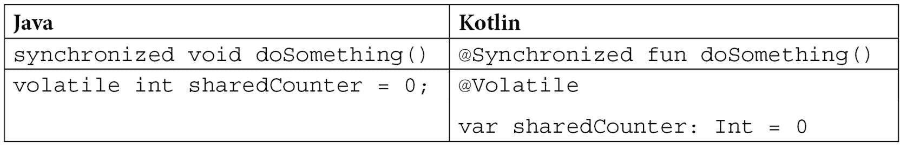

# *第六章*：线程和协程

在上一章中，我们简要地了解了我们的应用程序如何高效地每秒处理数千个请求——为了讨论不可变性为什么很重要，我们使用两个线程引入了竞争条件问题。

在本章中，我们将更深入地探讨如何在 Kotlin 中启动新线程以及为什么协程比线程具有更好的可扩展性。我们将讨论 Kotlin 编译器如何处理协程以及协程作用域和调度器之间的关系。我们将讨论**结构化并发**的概念，以及它是如何帮助我们防止程序中的资源泄漏的。

本章我们将涵盖以下主题：

+   深入了解线程

+   介绍协程和挂起函数

+   启动协程

+   任务

+   协程的内部机制

+   调度器

+   结构化并发

阅读本章后，您将熟悉 Kotlin 的并发原语以及如何最佳地利用它们。

# 技术要求

除了前几章的要求外，您还需要一个启用了**Gradle**的**Kotlin**项目，以便能够添加所需的依赖项。

您可以在此处找到本章的源代码：[`github.com/PacktPublishing/Kotlin-Design-Patterns-and-Best-Practices/tree/main/Chapter06`](https://github.com/PacktPublishing/Kotlin-Design-Patterns-and-Best-Practices/tree/main/Chapter06).

# 深入了解线程

在我们深入探讨细节之前，让我们讨论一下线程可以解决哪些类型的问题。

在您的笔记本电脑中，您有一个具有多个核心的 CPU——可能是四个，甚至八个。这意味着它可以**并行**执行四个不同的计算，考虑到 15 年前，单核 CPU 是默认的，甚至双核也仅限于爱好者。

*但即使在当时，您也不仅仅局限于一次只执行一个任务，对吧？* 您可以在单核 CPU 上同时听音乐和浏览互联网。*您的 CPU 是如何做到这一点的？* 嗯，就像您的头脑一样。它处理任务。当您一边读书一边听朋友说话时，您的一部分时间不是在阅读，另一部分时间不是在听——也就是说，直到我们的大脑至少有两个核心。

您运行代码的服务器基本上拥有相同的 CPU。这意味着它们可以同时处理四个请求。*但是，如果您每秒有 10,000 个请求怎么办？* 您无法并行处理它们，因为您没有 10,000 个 CPU 核心。但是您可以尝试并发处理它们。

JVM 提供的最基本并发模型被称为**线程**。线程允许我们并发运行代码（但不一定是并行），这样我们就可以更好地利用多个 CPU 核心，例如。它们比进程更轻量级。一个进程可能产生数百个线程。与进程不同，线程之间共享数据很容易。但这也引入了许多问题，我们将在后面看到。

让我们先学习如何在 Java 中创建两个线程。每个线程将输出`0`到`100`之间的数字：

```kt
 for (int t = 0; t < 2; t++) {
```

```kt
    int finalT = t;
```

```kt
    new Thread(() -> {
```

```kt
        for (int i = 0; i < 100; i++) {
```

```kt
            System.out.println("Thread " + finalT + ":               " + i);
```

```kt
        }
```

```kt
    }).start();
```

```kt
}
```

输出将类似于以下内容：

```kt
> ... 
```

```kt
> T0: 12 
```

```kt
> T0: 13 
```

```kt
> T1: 60 
```

```kt
> T0: 14 
```

```kt
> T1: 61 
```

```kt
> T0: 15 
```

```kt
> T1: 16 
```

```kt
> ...
```

注意，输出将在不同的执行之间有所不同，并且在任何时候都没有保证它是交错进行的。

Kotlin 中的相同代码如下所示：

```kt
repeat(2) { t ->
```

```kt
    thread { 
```

```kt
        for (i in 1..100) { 
```

```kt
            println("T$t: $i") 
```

```kt
        } 
```

```kt
    }
```

```kt
}
```

在 Kotlin 中，由于有一个帮助我们创建新线程的函数，所以代码更简洁。注意，与 Java 不同，我们不需要调用`start()`来启动线程。它默认启动。如果我们想稍后启动它，我们可以将`start`参数设置为`false`：

```kt
val t = thread(start = false) 
```

```kt
... 
```

```kt
// Later 
```

```kt
t.start()
```

Java 中另一个有用的概念是**守护线程**。这些线程不会阻止 JVM 退出，非常适合非关键的后台任务。

在 Java 中，API 不够流畅，因此我们需要将我们的线程分配给一个变量，将其设置为守护线程，然后启动它。在 Kotlin 中，这要简单得多：

```kt
thread(isDaemon = true) { 
```

```kt
    for (i in 1..1_000_000) { 
```

```kt
        println("daemon thread says: $i") 
```

```kt
    } 
```

```kt
}
```

注意，尽管我们要求这个线程打印到一百万，但它只打印了数百个。这是因为它是一个守护线程。当父线程停止时，所有守护线程也会停止。

## 线程安全

关于**线程安全**的书籍有很多，这有很好的理由。由于缺乏线程安全而引起的并发错误是最难追踪的。它们很难重现，因为你通常需要很多线程竞争相同的资源，以便实际发生竞争。因为这本书是关于 Kotlin 而不是一般的线程安全，所以我们只触及了这个话题的表面。如果你对 JVM 语言中的线程安全主题感兴趣，你应该查看 Brian Goetz 所著的《Java 并发实践》这本书。

我们将从以下示例开始，该示例创建 100,000 个线程来增加一个`counter`。为了确保在检查值之前所有线程都完成了它们的工作，我们将使用`CountDownLatch`：

```kt
var counter = 0
```

```kt
val latch = CountDownLatch(100_000)
```

```kt
repeat(100) {
```

```kt
    thread {
```

```kt
        repeat(1000) {
```

```kt
            counter++
```

```kt
            latch.countDown()
```

```kt
        }
```

```kt
    }
```

```kt
}
```

```kt
latch.await()
```

```kt
println("Counter $counter")
```

这段代码没有打印出正确的数字的原因是我们引入了数据竞争，因为`++`操作不是原子的。所以，如果有更多线程尝试增加我们的计数器，那么数据竞争的机会就更多了。

与 Java 不同，Kotlin 中没有`synchronized`关键字。这是因为 Kotlin 的设计者认为一种语言不应该针对特定的并发模型进行定制。相反，我们可以使用`synchronized()`函数：

```kt
thread {
```

```kt
    repeat(1000) {
```

```kt
        synchronized(latch) {
```

```kt
            counter++
```

```kt
            latch.countDown()
```

```kt
        }
```

```kt
    }
```

```kt
}
```

现在，我们的代码打印出预期的`100,000`。

如果你怀念 Java 中的同步方法，Kotlin 中有`@Synchronized`注解。Java 的`volatile`关键字也被`@Volatile`注解所替代。下表展示了这种比较的例子：



表 6.1 – Java 和 Kotlin（同步和 volatile 方法）之间的比较

`Synchronized`和`Volatile`是注解而不是关键字的原因是，Kotlin 除了可以在 JVM 上编译之外，还可以在其他平台上编译。但是，`synchronized`方法或`volatile`变量的概念是针对 JVM 特定的。

## 为什么线程这么贵？

每次我们创建一个新的线程时，都需要付出代价。每个线程都需要一个新的内存栈。

*如果我们通过让每个线程休眠来模拟一些工作会发生什么？*

在以下代码片段中，我们将尝试创建 10,000 个线程，每个线程休眠一个相对较短的时间：

```kt
val counter = AtomicInteger() 
```

```kt
try { 
```

```kt
    for (i in 0..10_000) { 
```

```kt
        thread { 
```

```kt
            counter.incrementAndGet() 
```

```kt
            Thread.sleep(100) 
```

```kt
        } 
```

```kt
    } 
```

```kt
} catch (oome: OutOfMemoryError) { 
```

```kt
    println("Spawned ${counter.get()} threads before       crashing") 
```

```kt
    System.exit(-42) 
```

```kt
}
```

每个线程需要 1 兆字节的 RAM 来为其栈分配空间。创建如此多的线程将需要与操作系统进行大量通信，并且需要大量内存。我们通过捕获相关异常来尝试识别是否已耗尽内存。

根据你的操作系统，这可能会导致`OutOfMemoryError`或整个系统变得非常缓慢。

当然，有方法可以限制同时运行的线程数量，使用**Executors API**。这个 API 是在**Java 5**中引入的，所以你应该很熟悉。

使用该 API，我们可以创建一个指定大小的新的线程池。尝试将`pool`的大小设置为`1`，机器上的核心数设置为`100`和`2000`，看看会发生什么：

```kt
val pool = Executors.newFixedThreadPool(100)
```

现在，我们想要提交一个新的任务。我们可以通过调用`pool.submit()`来实现：

```kt
val counter = AtomicInteger(0) 
```

```kt
val start = System.currentTimeMillis() 
```

```kt
for (i in 1..10_000) { 
```

```kt
    pool.submit { 
```

```kt
        // Do something 
```

```kt
        counter.incrementAndGet() 
```

```kt
        // Simulate wait on IO 
```

```kt
        Thread.sleep(100) 
```

```kt
        // Do something again 
```

```kt
        counter.incrementAndGet() 
```

```kt
    } 
```

```kt
}
```

在`sleep`之前和之后各增加一次`counter`，我们正在模拟一些业务逻辑 – 例如，准备一些 JSON 然后解析响应 – 而`sleep`本身则模拟网络操作。

然后，我们需要确保池终止，并使用以下行给它`20`秒的时间来完成：

```kt
pool.awaitTermination(20, TimeUnit.SECONDS) 
```

```kt
pool.shutdown() 
```

```kt
println("Took me ${System.currentTimeMillis() - start}   millis to complete ${counter.get() / 2} tasks")
```

注意，这花了我们 20 秒来完成。这是因为新的任务不能开始，直到前面的任务*醒来*并完成它们的工作。

这正是多线程系统在不充分并发的情况下发生的情况。

在下一节中，我们将讨论协程如何尝试解决这个问题。

# 协程介绍

除了 Java 提供的线程模型之外，Kotlin 还有一个**协程**模型。协程可能被认为是轻量级的线程，我们很快就会看到它们相对于现有线程模型的优势。

首先你需要知道的是，协程不是语言的一部分。它们只是 JetBrains 提供的另一个库。因此，如果我们想使用它们，我们需要在 Gradle 配置文件中指定这一点；即`build.gradle.kts`：

```kt
dependencies { 
```

```kt
    ... 
```

```kt
    implementation("org.jetbrains.kotlinx:kotlinx-      coroutines-core:1.5.1") 
```

```kt
}
```

重要提示：

到你阅读这本书的时候，协程库的最新版本将是 **1.6** 或更高。

首先，我们将比较启动一个新的线程和一个新的协程。

## 启动协程

在 *深入探讨线程* 部分中，我们已经看到了如何在 Kotlin 中启动一个新的线程。现在，让我们启动一个新的协程。

我们将创建几乎与线程相同的示例。每个协程将增加某个计数器，休眠一段时间来模拟某种类型的 I/O，然后再次增加它：

```kt
val latch = CountDownLatch(10_000)
```

```kt
val c = AtomicInteger()
```

```kt
val start = System.currentTimeMillis()
```

```kt
for (i in 1..10_000) {
```

```kt
    GlobalScope.launch {
```

```kt
        c.incrementAndGet()
```

```kt
        delay(100)
```

```kt
        c.incrementAndGet()
```

```kt
        latch.countDown()
```

```kt
    }
```

```kt
}
```

```kt
latch.await(10, TimeUnit.SECONDS)
```

```kt
println("Executed ${c.get() / 2} coroutines in   ${System.currentTimeMillis() - start}ms")
```

启动新协程的第一种方式是使用 `launch()` 函数。再次注意，这只是一个函数，而不是语言结构。

另一个有趣的地方是对 `delay()` 函数的调用，我们使用它来模拟一些 I/O 密集型的工作，例如从数据库或网络上获取数据。

就像 `Thread.sleep()` 方法一样，它使当前协程进入休眠状态。但与 `Thread.sleep()` 不同，其他协程可以在它安静地休眠时工作。这是因为 `delay()` 被标记为 `suspend` 关键字，我们将在 *作业* 部分讨论它。

如果你运行这段代码，你会看到任务在协程中大约需要 200 毫秒，而在线程中，要么需要 20 秒，要么耗尽内存。而且我们并没有对代码做太多改变。这都要归功于协程的高度并发性。它们可以在不阻塞运行它们的线程的情况下挂起。不阻塞线程是件好事，因为我们可以使用更少的操作系统线程（这些线程成本高昂）来完成更多的工作。

如果你在这个 IntelliJ IDEA 中运行这段代码，你会注意到 `GlobalScope` 被标记为不应该在现实世界的项目中使用，除非开发者理解其底层工作原理。否则，它可能会导致意外的泄漏。我们将在本章后面学习更好的启动协程的方法。

虽然我们已经看到协程比线程具有更高的并发性，但它们并没有什么神奇之处。现在，让我们了解另一种启动协程的方法，以及协程可能仍然会遇到的一些问题。

我们刚才讨论的 `launch()` 函数启动一个不返回任何内容的协程。相比之下，`async()` 函数启动一个返回某些值的协程。

调用 `launch()` 与调用返回 `Unit` 的函数非常相似。但我们的大多数函数都返回某种类型的结果。为此，我们有了 `async()` 函数。它也启动一个协程，但它返回的是 `Deferred<T>`，其中 `T` 是你期望稍后获得的数据类型。

例如，以下函数将启动一个异步生成 UUID 并返回它的协程：

```kt
fun fastUuidAsync() = GlobalScope.async {
```

```kt
    UUID.randomUUID()
```

```kt
}
```

```kt
println(fastUuidAsync())
```

如果你从我们的 `main` 方法中运行以下代码，则不会打印出预期的结果。这段代码打印出的结果而不是某个 UUID 值如下：

```kt
> DeferredCoroutine{Active}
```

协程返回的对象称为作业。让我们了解这是什么以及如何正确使用它。

## Jobs

异步任务运行的结果称为`Thread`对象代表一个实际的操作系统线程，`job`对象代表一个实际的协程。

这意味着我们试图做的是这个：

```kt
val job: Job = fastUuidAsync()
```

```kt
println(job)
```

`job`有一个简单的生命周期。它可能处于以下状态之一：

+   **新**：已创建但尚未开始。

+   例如，`launch()`函数。这是默认状态。

+   **完成**：一切顺利。

+   **已取消**：出了点问题。

对于具有子任务的作业，还有两个相关的状态：

+   **完成**：在完成之前等待完成执行子任务

+   **取消**：在取消之前等待完成执行子任务

如果你想了解更多关于父任务和子任务的信息，请跳转到本章的*父任务*部分。

我们混淆了其值的任务处于活动状态，这意味着它还没有完成计算我们的 UUID。

拥有值的任务被称为`Deffered`：

```kt
val job: Deferred<UUID> = fastUuidAsync()
```

我们将在*第八章*，“设计并发”中更详细地讨论`Deferred`值。

为了等待任务完成并获取实际值，我们可以使用`await()`函数：

```kt
val job: Deferred<UUID> = fastUuidAsync()
```

```kt
println(job.await())
```

这段代码无法编译：

```kt
> Suspend function 'await' should be called only from a coroutine or another suspend function
```

这是因为，正如错误信息本身所说明的，我们的`main()`函数没有标记为`suspend`关键字，也不是协程。

我们可以通过将我们的代码包裹在`runBlocking`函数中来修复这个问题：

```kt
runBlocking {
```

```kt
    val job: Deferred<UUID> = fastUuidAsync()
```

```kt
    println(job.await())
```

```kt
}
```

此函数将阻塞主线程，直到所有协程完成。这是从*第四章*，“熟悉行为模式”，中桥接设计模式的实现，它允许我们连接常规代码和使用了协程的代码。

现在运行此代码将产生预期的随机 UUID 输出。

重要提示：

在本章中，在讨论协程时，我们有时会省略`runBlocking`以保持简洁。你可以在本书的 GitHub 仓库中找到完整的示例。

`job`对象还有一些其他有用的方法，我们将在接下来的几节中讨论。

## 协程的内部机制

因此，我们已经提到了以下事实几次：

+   协程就像轻量级线程。它们需要的资源比常规线程少，因此你可以创建更多。

+   协程不会像阻塞整个线程那样阻塞自己，而是在等待执行子任务的同时允许线程执行另一段代码。

*但协程是如何工作的呢？*

例如，让我们看看一个组合用户配置文件的函数：

```kt
fun profileBlocking(id: String): Profile { 
```

```kt
    // Takes 1s
```

```kt
    val bio = fetchBioOverHttpBlocking(id)  
```

```kt
    // Takes 100ms
```

```kt
    val picture = fetchPictureFromDBBlocking(id)  
```

```kt
    // Takes 500ms
```

```kt
    val friends = fetchFriendsFromDBBlocking(id) 
```

```kt
    return Profile(bio, picture, friends) 
```

```kt
}
```

在这里，我们的函数大约需要 1.6 秒才能完成。它的执行是完全顺序的，执行线程将在整个过程中被阻塞。

我们可以重新设计这个函数，使其与协程一起工作，如下所示：

```kt
suspend fun profile(id: String): Profile {
```

```kt
    // Takes 1s    
```

```kt
    val bio = fetchBioOverHttpAsync(id) 
```

```kt
    // Takes 100ms
```

```kt
    val picture = fetchPictureFromDBAsync(id) 
```

```kt
    // Takes 500ms
```

```kt
    val friends = fetchFriendsFromDBAsync(id) 
```

```kt
    return Profile(bio.await(), picture.await(),       friends.await())
```

```kt
}
```

没有使用`suspend`关键字，我们的异步代码将无法编译。我们将在本节稍后讨论`suspend`关键字的意义。

为了理解每个异步函数看起来像什么，让我们以其中一个为例：

```kt
fun fetchFriendsFromDBAsync(id: String) = GlobalScope.async 
```

```kt
{
```

```kt
    delay(500)
```

```kt
    emptyList<String>()
```

```kt
}
```

现在，让我们比较这两个函数的性能：一个是以阻塞方式编写的，另一个是使用协程的。

我们可以使用之前看到的 `runBlocking` 函数包装这两个函数，并使用 `measureTimeMillis` 测量它们完成所需的时间：

```kt
runBlocking {
```

```kt
    val t1 = measureTimeMillis {
```

```kt
        blockingProfile("123")
```

```kt
    }
```

```kt
    val t2 = measureTimeMillis {
```

```kt
        profile("123")
```

```kt
    }
```

```kt
    println("Blocking code: $t1")
```

```kt
    println("Async: $t2")
```

```kt
}
```

输出将类似于以下内容：

```kt
> Blocking code: 1623
```

```kt
> Coroutines: 1021
```

并发协程的执行时间是最长协程的最大值，而顺序代码则是所有函数的总和。

在理解了前两个示例之后，让我们看看另一种编写相同代码的方法。

我们将使用 `suspend` 关键字标记每个函数：

```kt
suspend fun fetchFriendsFromDB(id: String): List<String> {
```

```kt
    delay(500)
```

```kt
    return emptyList()
```

```kt
}
```

如果你运行这个示例，性能将与阻塞代码相同。*那么，我们为什么要使用可挂起函数呢？*

可挂起函数不会阻塞线程。从更大的角度来看，通过使用相同数量的线程，我们可以服务更多的用户，这都要归功于 Kotlin 智能地重写可挂起函数。

当 Kotlin 编译器看到 `suspend` 关键字时，它知道它可以分割并重新编写函数，如下所示：

```kt
fun profile(state: Int, id: String, context: ArrayList<Any>): Profile {
```

```kt
    when (state) {
```

```kt
        0 -> {
```

```kt
            context += fetchBioOverHttp(id) 
```

```kt
            profile(1, id, context)
```

```kt
        }
```

```kt
        1 -> {
```

```kt
            context += fetchPictureFromDB(id) 
```

```kt
            profile(2, id, context)
```

```kt
        }
```

```kt
        2 -> {
```

```kt
            context += fetchFriendsFromDB(id) 
```

```kt
            profile(3, id, context)
```

```kt
        }
```

```kt
        3 -> {
```

```kt
            val (bio, picture, friends) = context
```

```kt
            return Profile(bio, picture, friends)
```

```kt
        }
```

```kt
    }
```

```kt
}
```

重新编写的代码使用了来自 *第四章*，*熟悉行为模式* 的 **状态设计模式**，将函数的执行分解成许多步骤。通过这样做，我们可以在状态机的每个阶段释放执行协程的线程。

重要提示：

这并不是生成代码的完美描述。目标是展示 Kotlin 编译器背后的理念，但为了简洁，省略了一些细微的实现细节。

注意，与之前我们产生的异步代码不同，状态机本身是顺序的，执行所有步骤所需的时间与阻塞代码相同。

事实上，这些步骤中没有任何一个会阻塞任何线程，这在本例中非常重要。

### 取消协程

如果你是一名 Java 开发者，你可能知道停止一个线程相当复杂。

例如，`Thread.stop()` 方法已被弃用。有 `Thread.interrupt()`，但并非所有线程都在检查这个标志，更不用说设置一个 `volatile` 标志，这通常被建议，但非常繁琐。

如果你使用线程池，你会得到 `Future`，它有 `cancel(boolean mayInterruptIfRunning)` 方法。在 Kotlin 中，`launch()` 函数返回一个作业。

这个作业可以被取消。尽管如此，前一个示例中的相同规则仍然适用。如果你的协程从未调用另一个 `suspend` 函数或 `yield` 函数，它将忽略 `cancel()`。

为了展示这一点，我们将创建一个偶尔产生 `yield` 的协程：

```kt
val cancellable = launch {
```

```kt
    try {
```

```kt
        for (i in 1..10_000) {
```

```kt
            println("Cancellable: $i")
```

```kt
            yield()
```

```kt
        }
```

```kt
    }
```

```kt
    catch (e: CancellationException) {
```

```kt
        e.printStackTrace()
```

```kt
    }
```

```kt
}
```

如你所见，在每次 `print` 语句之后，协程调用 `yield` 函数。如果它被取消，它将打印堆栈跟踪。

我们还将创建另一个不产生 `yield` 的协程：

```kt
val notCancellable = launch {
```

```kt
    for (i in 1..10_000) {
```

```kt
        if (i % 100 == 0) {
```

```kt
            println("Not cancellable $i")
```

```kt
        }
```

```kt
    }
```

```kt
}
```

这个协程从不让出，并在每 `100` 次迭代时打印其结果以避免垃圾邮件。

现在，让我们尝试取消两个协程：

```kt
println("Canceling cancellable") 
```

```kt
cancellable.cancel() 
```

```kt
println("Canceling not cancellable") 
```

```kt
notCancellable.cancel()
```

然后，我们将等待结果：

```kt
runBlocking { 
```

```kt
    cancellable.join() 
```

```kt
    notCancellable.join() 
```

```kt
}
```

通过调用 `join()`，我们可以等待协程的执行完成。

让我们看看我们代码的输出：

```kt
> Canceling cancellable
```

```kt
> Cancellable: 1
```

```kt
> Not cancellable 100
```

```kt
>...
```

```kt
> Not cancellable 1000
```

```kt
> Canceling not cancellable
```

从这个实验中我们可以学到关于协程行为的几个有趣点如下：

+   取消 `cancellable` 协程不会立即发生。在被取消之前，它可能还会打印一两行。

+   我们可以捕获 `CancellationException`，但我们的协程仍然会被标记为已取消。捕获该异常并不会自动允许我们继续。

现在，让我们了解发生了什么。协程检查它是否被取消，但只有在它切换状态时才会这样做。由于非可取消协程没有任何挂起函数，它从未检查是否被要求停止。

在 `cancellable` 协程中，我们使用了一个新函数：`yield()`。我们本可以在每次循环迭代时调用 `yield()`，但决定每 `100` 次迭代做一次。这个函数检查是否有人想要做些工作。如果没有其他人，当前协程的执行将恢复。否则，另一个协程将开始或从之前停止的地方继续。

注意，如果没有在函数或协程生成器（如 `launch()`）上使用 `suspend` 关键字，我们无法调用 `yield()`。这对于任何标记为 `suspend` 的函数都适用：它应该要么从另一个 `suspend` 函数调用，要么从协程调用。

## 设置超时

让我们考虑以下情况。*如果，在某些情况下，获取用户资料花费的时间过长怎么办？如果我们决定如果资料返回时间超过 0.5 秒，我们就显示没有资料怎么办？*

这可以通过使用 `withTimeout()` 函数来实现：

```kt
val coroutine = async {
```

```kt
    withTimeout(500) {
```

```kt
        try {
```

```kt
            val time = Random.nextLong(1000)
```

```kt
            println("It will take me $time to do")
```

```kt
            delay(time)
```

```kt
            println("Returning profile")
```

```kt
            "Profile"
```

```kt
        }
```

```kt
        catch (e: TimeoutCancellationException) {
```

```kt
            e.printStackTrace()
```

```kt
        }
```

```kt
    }
```

```kt
}
```

我们将超时设置为 `500` 毫秒，我们的协程将在 `0` 到 `1000` 毫秒之间延迟，有 50% 的失败概率。

我们将等待协程的结果并查看会发生什么：

```kt
val result = try { 
```

```kt
    coroutine.await() 
```

```kt
} 
```

```kt
catch (e: TimeoutCancellationException) { 
```

```kt
    "No Profile" 
```

```kt
} 
```

```kt
println(result)
```

在这里，我们得益于 Kotlin 中 `try` 是一个表达式的这一事实。因此，我们可以立即从它返回一个结果。

如果协程在超时之前成功返回，则 `result` 的值变为 `profile`。否则，我们收到 `TimeoutCancellationException`，并将 `result` 的值设置为 `no profile`。

超时和 `try`-`catch` 表达式的组合是一个非常强大的工具，它允许我们创建健壮的交互。

## 分派器

当我们使用 `runBlocking` 函数运行我们的协程时，它们的代码是在主线程上执行的。

你可以通过运行以下代码来检查：

```kt
runBlocking {
```

```kt
    launch {
```

```kt
        println(Thread.currentThread().name) // Prints 
```

```kt
          "main"
```

```kt
    }
```

```kt
}
```

相比之下，当我们使用 `GlobalScope` 运行协程时，它运行在称为 `DefaultDispatcher` 的东西上：

```kt
GlobalScope.launch {
```

```kt
    println("GlobalScope.launch: 
```

```kt
      ${Thread.currentThread().name}")
```

```kt
}
```

这会打印以下输出：

```kt
> DefaultDispatcher-worker-1
```

`DefaultDispatcher` 是一个用于短生命周期协程的线程池。

协程生成器，如 `launch()` 和 `async()`，依赖于默认参数，其中一个参数是它们将要启动的分发器。要指定替代分发器，您可以将它作为参数提供给协程构建器：

```kt
runBlocking {
```

```kt
    launch(Dispatchers.Default) {
```

```kt
        println(Thread.currentThread().name)
```

```kt
    }
```

```kt
}
```

上述代码将打印以下输出：

```kt
> DefaultDispatcher-worker-1
```

除了我们已讨论的 `Main` 和 `Default` 分发器之外，还有一个 `IO` 分发器，用于长时间运行的任务。您可以通过将其提供给协程构建器以类似方式使用它，如下所示：

```kt
async(Dispatchers.IO) { 
```

```kt
    // Some long running task here
```

```kt
}
```

## 结构化并发

从另一个协程内部生成协程是一个非常常见的做法。

结构化并发的第一规则是父协程应该始终等待所有其子协程完成。这可以防止资源泄露，这在没有结构化并发概念的编程语言中非常常见。

这意味着如果我们查看以下代码，它启动了 10 个子协程，父协程不需要显式等待它们全部完成：

```kt
val parent = launch(Dispatchers.Default) {
```

```kt
    val children = List(10) { childId ->
```

```kt
        launch {
```

```kt
            for (i in 1..1_000_000) {
```

```kt
                UUID.randomUUID()
```

```kt
                if (i % 100_000 == 0) {
```

```kt
                    println("$childId - $i")
```

```kt
                    yield()
```

```kt
                }
```

```kt
            }
```

```kt
        }
```

```kt
    }
```

```kt
} 
```

现在，让我们决定其中一个协程在一段时间后抛出异常：

```kt
...
```

```kt
if (i % 100_000 == 0) {
```

```kt
    println("$childId - $i")
```

```kt
    yield()
```

```kt
}
```

```kt
if (childId == 8 && i == 300_000) {
```

```kt
    throw RuntimeException("Something bad happened")
```

```kt
}
```

```kt
...
```

如果你运行此代码，会发生一些有趣的事情。不仅协程本身会终止，而且所有其兄弟协程也会终止。

这里发生的事情是，一个未捕获的异常向上冒泡到父协程并取消它。然后，父协程终止所有其他子协程以防止任何资源泄露。

通常，这是期望的行为。如果我们想防止子异常停止父协程，我们可以使用 `supervisorScope`：

```kt
val parent = launch(Dispatchers.Default) {
```

```kt
    supervisorScope {
```

```kt
        val children = List(10) { childId ->
```

```kt
            ...
```

```kt
        }
```

```kt
    }
```

```kt
}
```

通过使用 `supervisorScope`，即使其中一个协程失败，父任务也不会受到影响。

父协程仍然可以通过使用 `cancel()` 函数来终止所有其子协程。一旦我们在父任务上调用 `cancel()`，所有其子协程也会被取消。

既然我们已经讨论了结构化并发的优点，让我们重申本章开头的一个观点：使用 `GlobalScope` 以及它被标记为 `GlobalScope` 的事实，它暴露了 `launch()` 和 `async()` 等函数，它不受益于结构化并发原则，并且在使用不当时容易发生资源泄露。因此，你应该避免在现实世界的应用程序中使用 `GlobalScope`。

# 摘要

在本章中，我们介绍了如何在 Kotlin 中创建线程和协程，以及协程相对于线程的优点。

与 Java 相比，Kotlin 创建线程的语法已经简化。但它仍然有内存和，通常，性能的开销。协程可以解决这些问题；在 Kotlin 中需要并发执行某些代码时，请始终使用协程。

到目前为止，你应该知道如何启动协程以及如何等待其完成，在此过程中获取其结果。我们还介绍了协程的结构以及它们与分发器的交互。

最后，我们简要提到了结构化并发这个现代概念，它帮助我们轻松地防止并发代码中的资源泄漏。

在下一章中，我们将讨论如何使用这些并发原语来创建适合我们需求的可扩展和健壮的系统。

# 问题

1.  在 Kotlin 中启动协程的不同方法有哪些？

1.  在结构化并发中，如果其中一个协程失败，所有兄弟协程也会被取消。我们如何防止这种行为？

1.  `yield()`函数的目的是什么？
