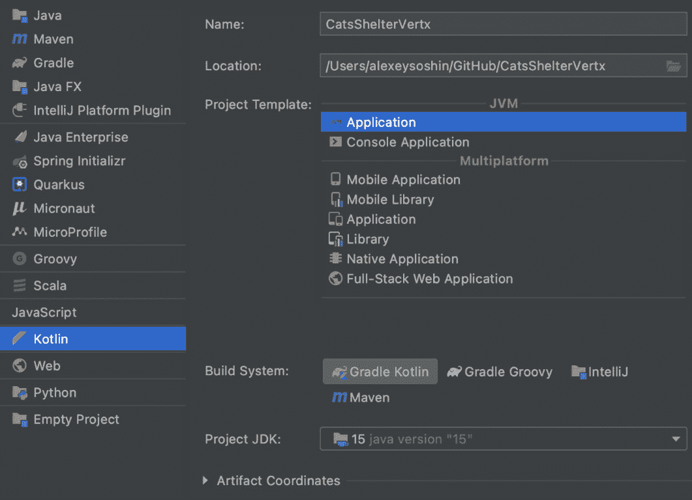

# 第十一章：*第十一章*：使用 Vert.x 的响应式微服务

在上一章中，我们熟悉了 Ktor 框架。我们创建了一个可以存储猫的数据库的 Web 服务。

在本章中，我们将继续使用上一章的例子，但这次使用 Vert.x 框架和 Kotlin。**Vert.x** 是一个基于响应式原则构建的响应式框架，我们在 *第七章* *控制数据流* 中讨论了这些原则。在本章中，我们还将列出 Vert.x 框架的一些其他优点。您可以通过访问官方网站了解更多关于 Vert.x 的信息：[`vertx.io`](https://vertx.io)。

本章中我们将开发的微服务将提供一个健康检查的端点——与我们在 Ktor 中创建的相同——并且能够删除和更新我们数据库中的猫。

在本章中，我们将涵盖以下主题：

+   开始使用 Vert.x

+   Vert.x 中的路由

+   Verticles

+   处理请求

+   测试 Vert.x 应用程序

+   与数据库一起工作

+   理解事件循环

+   通过事件总线进行通信

# 技术要求

对于本章，您需要以下内容：

+   **JDK 11** 或更高版本

+   IntelliJ IDEA

+   **Gradle 6.8** 或更高版本

+   **PostgreSQL 14** 或更高版本

与上一章类似，本章也将假设您已经安装了 PostgreSQL，并且您对其有基本的了解。我们还将使用与 Ktor 创建的相同的表结构。

您可以在此处找到本章的完整源代码：[`github.com/PacktPublishing/Kotlin-Design-Patterns-and-Best-Practices/tree/main/Chapter11`](https://github.com/PacktPublishing/Kotlin-Design-Patterns-and-Best-Practices/tree/main/Chapter11)。

# 开始使用 Vert.x

**Vert.x** 是一个异步且非阻塞的响应式框架。让我们通过一个具体的例子来理解这意味着什么。

我们将首先创建一个新的 Kotlin Gradle 项目，或者使用 [start.vertx.io](http://start.vertx.io)：

1.  从您的 IntelliJ IDEA 应用程序中选择 **文件** | **新建** | **项目**，并在 **新建项目** 向导中选择 **Kotlin**。

1.  然后，为您的项目指定一个名称——例如，我的项目名为 `CatsShelterVertx`——并选择 **Gradle Kotlin** 作为您的 **构建系统**。

1.  然后，从下拉菜单中选择您已安装的 **项目 JDK** 版本。输出应如下所示：



图 11.1 – 创建 Kotlin 应用程序

接下来，将以下依赖项添加到您的 `build.gradle.kts` 文件中：

```kt
val vertxVersion = "4.1.5"
```

```kt
dependencies {
```

```kt
    implementation("io.vertx:vertx-core:$vertxVersion")
```

```kt
    implementation("io.vertx:vertx-web:$vertxVersion")
```

```kt
    implementation("io.vertx:vertx-lang-
```

```kt
        kotlin:$vertxVersion")
```

```kt
    implementation("io.vertx:vertx-lang-kotlin-
```

```kt
        coroutines:$vertxVersion")
```

```kt
    ...
```

```kt
}
```

与上一章中讨论的类似，所有依赖项都必须是同一版本，以避免任何冲突。这就是我们为什么使用库版本变量——以便能够一起更改它们。

以下是对每个依赖项的解释：

+   `vertx-core` 是核心库。

+   `vertx-web` 是必需的，因为我们希望我们的服务是基于 REST 的。

+   `vertx-lang-kotlin`提供了使用 Vert.x 编写 Kotlin 代码的惯用方法。

+   最后，`vertx-lang-kotlin-coroutines`与协程集成，我们在*第六章*，*线程和协程*中详细讨论了它。

然后，我们必须在`src/main/kotlin`文件夹中创建一个名为`server.kt`的文件，并包含以下内容：

```kt
fun main() {
```

```kt
    val vertx = Vertx.vertx()
```

```kt
    vertx.createHttpServer().requestHandler{ ctx ->
```

```kt
        ctx.response().end("OK")
```

```kt
    }.listen(8081)
```

```kt
    println("open http://localhost:8081")
```

```kt
}
```

这就是你需要启动一个 web 服务器的所有内容，当你在浏览器中打开`http://localhost:8081`时，它会返回`OK`。

现在，让我们理解这里发生了什么。首先，我们使用*第三章*，*理解结构模式*中的工厂方法创建一个 Vert.x 实例。

`requestHandler`方法只是一个简单的监听器或订阅者。如果你不记得它是如何工作的，请查看*第四章*，*熟悉行为模式*，了解 Observable 设计模式。在我们的情况下，它将为每个新的请求被调用。这就是 Vert.x 的异步特性在起作用。

接下来，让我们学习如何在 Vert.x 中添加路由。

# Vert.x 中的路由

注意，无论我们指定哪个 URL，我们总是得到相同的结果。当然，这不是我们想要达到的效果。让我们先添加最基础的端点，它只会告诉我们服务正在运行。

为了做到这一点，我们将使用`Router`：

```kt
val vertx = Vertx.vertx()  
```

```kt
val router = Router.router(vertx) 
```

```kt
...
```

`Router`允许你为不同的 HTTP 方法和 URL 指定处理器。

现在，让我们添加一个`/status`端点，它将返回 HTTP 状态码`200`和一个消息，告知用户`OK`：

```kt
router.get("/status").handler { ctx ->
```

```kt
    ctx.response()
```

```kt
        .setStatusCode(200)
```

```kt
        .end("OK")
```

```kt
} 
```

```kt
vertx.createHttpServer()
```

```kt
    .requestHandler(router)
```

```kt
    .listen(8081)
```

现在，我们不再将请求处理器指定为一个块，而是将这个函数传递给我们的`router`对象。这使得我们的代码更容易管理。

我们在第一个示例中学习了如何返回纯文本响应。所以，现在，让我们返回 JSON。大多数实际应用都使用 JSON 进行通信。让我们用以下代码替换状态处理器的主体：

```kt
val json = json {
```

```kt
    obj(
```

```kt
        "status" to "OK"
```

```kt
    )
```

```kt
}
```

```kt
ctx.response()
```

```kt
    .setStatusCode(200)
```

```kt
    .end(json.toString())
```

在这里，我们使用了一种 DSL，我们在*第四章*，*熟悉行为模式*中讨论了它，来创建一个 JSON 对象。

你可以在浏览器中打开`http://localhost:8081/status`并确保你得到`{"status": "OK"}`作为响应。

现在，让我们讨论如何使用 Vert.x 框架更好地组织我们的代码。

# Verticles

我们当前的代码存储在`server.kt`文件中，这个文件正在变得越来越庞大。我们需要找到一种方法来将其拆分。在 Vert.x 中，代码被拆分成称为**verticles**的类。

你可以将 verticle 视为一个轻量级的 actor。我们在*第五章*，*介绍函数式编程*中讨论了 Actors。

让我们看看我们如何创建一个新的 verticle，它将封装我们的服务器：

```kt
class ServerVerticle : CoroutineVerticle() {
```

```kt
    override suspend fun start() {
```

```kt
        val router = router()
```

```kt
        vertx.createHttpServer()
```

```kt
            .requestHandler(router)
```

```kt
            .listen(8081)
```

```kt
        println("open http://localhost:8081")
```

```kt
    }
```

```kt
    private fun router(): Router {
```

```kt
        // Our router code comes here now  
```

```kt
        val router = Router.router(vertx)
```

```kt
        ...
```

```kt
        return router
```

```kt
    }
```

```kt
}
```

每个垂直方向都有一个`start()`方法，用于处理其初始化。正如你所见，我们将所有代码从`main()`函数移动到了`start()`方法。然而，如果我们现在运行代码，什么也不会发生。这是因为垂直方向还没有被启动。

开始一个垂直方向有多种方法，但最简单的方法是将类的实例传递给`deployVerticle()`方法。在我们的例子中，这是`ServerVerticle`类：

```kt
fun main() {
```

```kt
    val vertx = Vertx.vertx()
```

```kt
    vertx.deployVerticle(ServerVerticle())
```

```kt
}
```

这里是另一种更灵活的方法来指定类名作为字符串：

```kt
fun main() {
```

```kt
    val vertx = Vertx.vertx()
```

```kt
    vertx.deployVerticle("ServerVerticle")
```

```kt
}
```

如果我们的垂直方向类不在默认包中，我们需要指定完全限定的路径，以便 Vert.x 能够初始化它。

现在，我们的代码已经分为两个文件，`ServerVerticle.kt`和`server.kt`，并且组织得更好。接下来，我们将学习如何以相同的方式进行重构，以更好地组织我们的路由。

# 处理请求

如我们在本章前面讨论的，Vert.x 中所有请求都由`Router`类处理。我们在上一章中介绍了路由的概念，现在，让我们仅讨论 Ktor 和 Vert.x 在处理请求路由方面的不同方法。

我们将声明两个端点，用于从数据库中删除猫和更新特定猫的信息。我们将分别使用`delete`和`put`动词：

```kt
router.delete("/cats/:id").handler { ctx ->
```

```kt
    // Code for deleting a cat
```

```kt
}
```

```kt
router.put("/cats/:id").handler { ctx ->
```

```kt
    // Code for updating a cat
```

```kt
}
```

两个端点都接收一个 URL 参数。在 Vert.x 中，我们使用冒号表示法来表示。

为了能够解析 JSON 请求和响应，Vert.x 有一个`BodyHandler`类。现在，让我们也声明它。这应该在创建我们的路由对象之后进行：

```kt
val router = Router.router(vertx)
```

```kt
router.route().handler(BodyHandler.create())
```

这将告诉 Vert.x 解析任何请求的请求体为 JSON。

注意，现在我们的代码中`/cat`前缀重复多次。为了避免这种情况并使我们的代码更加模块化，我们可以使用子路由，我们将在下一节中讨论。

## 子路由请求

**子路由**允许我们将路由拆分成多个类，以使我们的代码更加有序。让我们按照以下步骤将新路由移动到新函数中：

1.  我们将保持`/alive`端点不变，但将所有其他端点提取到一个单独的函数中：

    ```kt
    private fun catsRouter(): Router {
        val router = Router.router(vertx)
        router.delete("/:id").handler { ctx ->
            // Code for deleting a cat
        }
        router.put("/:id").handler { ctx ->
            // Code for updating a cat
        }
        return router
    }
    ```

    在这个函数内部，我们创建了一个单独的`Router`对象，它将仅处理猫的路由，而不是状态路由。

1.  现在，我们需要将`SubRouter`连接到我们的主路由：

    ```kt
    router.mountSubRouter("/cats", catsRouter())
    ```

    保持我们的代码干净和分离非常重要。将路由提取到子路由中帮助我们做到这一点。

现在，让我们讨论如何测试这段代码。

# 测试 Vert.x 应用程序

为了测试我们的 Vert.x 应用程序，我们将使用我们在上一章中讨论的**JUnit 5**框架。

你需要在你的`build.gradle.kts`文件中添加以下两个依赖项：

```kt
dependencies {
```

```kt
    ...
```

```kt
    testImplementation("org.junit.jupiter:junit-jupiter-
```

```kt
        api:5.6.0")
```

```kt
    testRuntimeOnly("org.junit.jupiter:junit-jupiter-
```

```kt
        engine:5.6.0")
```

```kt
}
```

我们的第一项测试将位于`/src/test/kotlin/ServerTest.kt`文件中。

所有集成测试的基本结构看起来像这样：

```kt
@TestInstance(TestInstance.Lifecycle.PER_CLASS)
```

```kt
class ServerTest {
```

```kt
    private val vertx: Vertx = Vertx.vertx()
```

```kt
    @BeforeAll
```

```kt
    fun setup() {
```

```kt
        runBlocking {
```

```kt
            vertx.deployVerticle(ServerVerticle()).await()
```

```kt
        }
```

```kt
    }
```

```kt
    @AfterAll
```

```kt
    fun tearDown() {
```

```kt
        // And you want to stop your server once
```

```kt
        vertx.close()
```

```kt
    }
```

```kt
    @Test
```

```kt
    fun `status should return 200`() {
```

```kt
    }
```

```kt
}
```

这种结构与我们在 Ktor 中看到的不同。在这里，我们自己在`setup()`方法中启动服务器。

由于 Vert.x 是响应式的，`deployVerticle()` 方法将立即返回一个 `Future` 对象，释放线程，但这并不意味着服务器 verticle 已经启动。

为了避免这种竞争，我们可以使用 `await()` 方法，这将阻塞我们的测试执行，直到服务器准备好接收请求。

现在，我们想要向我们的 `/status` 端点发出实际的 HTTP 请求，例如，并检查响应代码。为此，我们将使用 Vert.x 网络客户端。

让我们将它添加到我们的 `build.gradle.kts` 依赖项部分：

```kt
testImplementation("io.vertx:vertx-web-client:$vertxVersion")
```

由于我们只计划在测试中使用 `WebClient`，所以我们指定 `testImplementation` 而不是 `implementation`。但 `WebClient` 非常有用，你可能会最终在生产代码中也要使用它。

添加了这个新的依赖项之后，我们需要在 `setup` 方法中实例化我们的网络客户端：

```kt
lateinit var client: WebClient
```

```kt
@BeforeAll
```

```kt
fun setup() {
```

```kt
    vertx.deployVerticle(ServerVerticle())
```

```kt
    client = WebClient.create(
```

```kt
        vertx,
```

```kt
        WebClientOptions()
```

```kt
            .setDefaultPort(8081)
```

```kt
            .setDefaultHost("localhost")
```

```kt
    )
```

```kt
}
```

`setup()` 方法将在所有测试开始之前被调用一次。在这个方法中，我们部署我们的服务器 verticle，并为所有测试创建一个带有一些默认值的网络客户端，以便所有测试可以共享。

现在，让我们编写一个测试来检查我们的服务器是否正在运行：

```kt
@Test
```

```kt
fun `status should return 200`() {
```

```kt
    runBlocking {
```

```kt
        val response = client.get("/status").send().await()
```

```kt
        assertEquals(201, response.statusCode())
```

```kt
    }
```

```kt
}
```

现在，让我们了解这个测试中发生了什么：

+   `client` 是一个 `WebClient` 的实例，它被所有我们的测试共享。我们使用 `get` 动词调用 `/status` 端点。这是一个 Builder 设计模式，因此要发出我们的请求，我们需要使用 `send()` 方法。否则，什么都不会发生。

+   由于 Vert.x 是响应式框架，所以 `send()` 方法不会阻塞我们的线程直到收到响应，而是返回一个 Future。然后，我们使用 `await()`，它将 Future 转换为 Kotlin 协程，以便能够并发地等待结果。

+   一旦收到响应，我们就像在其他测试中做的那样进行检查——使用来自 JUnit 的 `assertEquals` 函数。

既然我们已经知道了如何在 Vert.x 中编写测试，那么让我们讨论如何以响应式的方式与数据库进行交互。

# 与数据库交互

为了能够进一步进行我们的测试，我们需要在数据库中创建实体的能力。为此，我们需要连接到数据库。

首先，让我们将以下两行添加到我们的 `build.gradle.kts` 依赖项部分：

```kt
implementation("org.postgresql:postgresql:42.3.0")
```

```kt
implementation("io.vertx:vertx-pg-client:$vertxVersion")
```

第一行代码获取 PostgreSQL 驱动程序。第二行添加了 Vert.x JDBC 客户端，这使得拥有驱动程序的 Vert.x 能够连接到任何支持 JDBC 的数据库。

## 管理配置

现在，我们希望将数据库配置保存在某个地方。对于本地开发，可能将配置硬编码是可行的。我们将执行以下步骤来完成此操作：

1.  当我们连接到数据库时，我们至少需要指定以下参数：

    +   用户名

    +   密码

    +   主机

    +   数据库名

    我们将存储上述参数在一个 `Singleton` 对象中：

    ```kt
    object Db {
        val username = System.getenv("DATABASE_USERNAME")         ?: "cats_admin"
        val password = System.getenv("DATABASE_PASSWORD")         ?: "abcd1234"
        val database = System.getenv("DATABASE_NAME")         ?: "cats_db"
        val host = System.getenv("DATABASE_HOST")         ?: "localhost"
    }
    ```

    我们的 `Singleton` 对象有四个成员。对于每个成员，我们检查是否设置了环境变量，如果没有设置这样的环境变量，我们将使用 Elvis 运算符提供默认值。

1.  现在，让我们添加一个函数，该函数将返回一个连接池：

    ```kt
    fun connect(vertx: Vertx): SqlClient {
        val connectOptions = PgConnectOptions()
            .setPort(5432)
            .setHost(host)
            .setDatabase(database)
            .setUser(username)
            .setPassword(password)

        val poolOptions = PoolOptions()
            .setMaxSize(20)

        return PgPool.client(
            vertx,
            connectOptions,
            poolOptions
        )
    }
    ```

    我们的`connect()`方法创建了两个配置对象：`PgConnectOptions`设置了我们要连接的数据库的配置，而`PoolOptions`指定了连接池的配置。

1.  现在，我们只需要在我们的测试中实例化数据库客户端：

    ```kt
    ...
    lateinit var db: SqlClient

    @BeforeAll
    fun setup() {
        runBlocking {
            ...
            db = Db.connect(vertx)
        }
    }
    ```

1.  做完这些之后，让我们在我们的测试文件中创建一个新的`Nested`类，用于处理我们预期数据库中会有猫的情况：

    ```kt
    @Nested
    inner class `With Cat` {
        @BeforeEach
        fun createCats() {
            ...
        }

        @AfterEach
        fun deleteAll() {
            ...
        }
    }
    ```

    与我们在上一章中讨论的 Exposed 框架不同，Vert.x 中的数据库客户端没有特定的插入、删除等方法。相反，它提供了一个更底层的 API，允许我们在数据库上执行任何类型的查询。

1.  首先，让我们编写一个查询来清理我们的数据库：

    ```kt
    @AfterEach
    fun deleteAll() {
        runBlocking {
            db.preparedQuery("DELETE FROM cats")            .execute().await()
        }
    }
    ```

    在 Vert.x 中与数据库客户端一起工作的基本结构是将查询传递给`prepareQuery()`方法，然后使用`execute()`方法执行它。

    我们希望在继续下一个测试之前等待查询完成，因此我们使用`await()`函数等待当前的协程，并使用`runBlocking()`适配器方法来创建一个协程上下文以实现这一点。

1.  现在，让我们编写另一个查询，在每次测试运行之前将猫添加到数据库中：

    ```kt
    lateinit var catRow: Row

    @BeforeEach
    fun createCats() {
        runBlocking {
            val result = db.preparedQuery(
                """INSERT INTO cats (name, age) 
                VALUES ($1, $2) 
                RETURNING ID""".trimIndent()
            ).execute(Tuple.of("Binky", 7)).await()
            catRow = result.first()
        }
    }
    ```

    在这里，我们再次使用`preparedQuery()`方法，但这次我们的 SQL 查询字符串包含占位符。每个占位符都以美元符号开始，它们的索引从`1`开始。

    然后，我们将这些占位符的值传递给`execute()`方法。`Tuple.of`是一个你应该现在已经很熟悉的工厂方法设计模式。

    我们还想要记住我们创建的猫的 ID，因为我们将会使用这个 ID 来删除或更新猫。出于这个原因，我们将创建的行存储在一个`lateinit`变量中。

1.  现在我们已经为编写测试做好了准备：

    ```kt
    @Test
    fun `delete deletes a cat by ID`() {
        runBlocking {
            val catId = catRow.getInteger(0)
            client.delete("/cats/${catId}").send().await()

            val result = db.preparedQuery("SELECT * FROM             cats WHERE id = $1")            .execute(Tuple.of(catId)).await()

            assertEquals(0, result.size())
        }
    }
    ```

    首先，我们使用`getInteger()`方法从数据库行中获取我们想要删除的猫的 ID。与以`1`开始的参数不同，数据库行的列从`0`开始。因此，通过获取索引为`0`的整数，我们得到了我们猫的 ID。

    然后，我们调用网络客户端的`delete()`方法并等待其完成。

    之后，我们在数据库上执行一个`SELECT`语句，检查该行确实已被删除。

如果你现在运行这个测试，它将会失败，因为我们还没有实现`delete`端点。我们将在下一节中完成这个任务。

# 理解事件循环

**事件循环**设计模式的目的是在队列中持续检查新事件，并且每次有新事件到来时，都要快速将其派发给知道如何处理它的人。这样，单个线程或非常有限数量的线程就可以处理大量的事件。

在 Vert.x 等 Web 框架的情况下，事件可能是对服务器的请求。

为了更好地理解事件循环的概念，让我们回到我们的服务器代码，并尝试实现一个删除猫的端点：

```kt
val db = Db.connect(vertx)
```

```kt
router.delete("/:id").handler { ctx ->
```

```kt
    val id = ctx.request().getParam("id").toInt()
```

```kt
    db.preparedQuery("DELETE FROM cats WHERE ID = $1")        .execute(Tuple.of(id)).await()
```

```kt
    ctx.end()
```

```kt
}
```

这段代码与我们之前章节测试中写的非常相似。我们使用 `getParam()` 函数从请求中读取 URL 参数，然后将此 ID 传递给预准备的查询。不过，这次我们不能使用 `runBlocking` 适配器函数，因为它会阻塞事件循环。

Vert.x 使用有限数量的线程，大约是 CPU 核心数的两倍，以高效地运行所有代码。然而，这意味着我们无法在这些线程上执行任何阻塞操作，因为这会负面影响我们应用程序的性能。

为了解决这个问题，我们可以使用我们已熟悉的协程构建器：`launch()`。让我们看看它是如何工作的：

```kt
router.delete("/:id").handler { ctx ->
```

```kt
    launch {
```

```kt
        val id = ctx.request().getParam("id").toInt()
```

```kt
        db.preparedQuery("DELETE FROM cats WHERE ID = $1")            .execute(Tuple.of(id)).await()
```

```kt
        ctx.end()
```

```kt
    }
```

```kt
}
```

由于我们的垂直扩展了 `CoroutineVerticle`，我们可以访问所有将在事件循环上运行的常规协程构建器。

现在，我们只需要将我们的路由函数标记为 `suspend` 关键字：

```kt
private suspend fun router(): Router {
```

```kt
    ...
```

```kt
}
```

```kt
private suspend fun catsRouter(): Router {
```

```kt
    ...
```

```kt
}
```

现在，让我们添加另一个测试来更新一只猫：

```kt
@Test
```

```kt
fun `put updates a cat by ID`() {
```

```kt
    runBlocking {
```

```kt
        val catId = catRow.getInteger(0)
```

```kt
        val requestBody = json {
```

```kt
            obj("name" to "Meatloaf", "age" to 4)
```

```kt
        }
```

```kt
        client.put("/cats/${catId}")
```

```kt
            .sendBuffer(Buffer.buffer(requestBody.toString()))
```

```kt
            .await()
```

```kt
        val result = db.preparedQuery("SELECT * FROM cats 
```

```kt
            WHERE id = $1")
```

```kt
            .execute(Tuple.of(catId)).await()
```

```kt
        assertEquals("Meatloaf",             result.first().getString("name"))
```

```kt
        assertEquals(4, result.first().getInteger("age"))
```

```kt
    }
```

```kt
}
```

这个测试与删除测试非常相似，唯一的重大区别是我们使用 `sendBuffer` 而不是 `send()` 方法，这样我们就可以向我们的 `put` 端点发送 JSON body。

我们创建 JSON 的方式与我们在本章前面实现 `/status` 端点时看到的方式类似。

现在，让我们实现 `put` 端点以通过测试：

```kt
router.put("/:id").handler { ctx ->
```

```kt
    launch {
```

```kt
        val id = ctx.request().getParam("id").toInt()
```

```kt
        val body = ctx.bodyAsJson
```

```kt
        db.preparedQuery("UPDATE cats SET name = $1, age =             $2 WHERE ID = $3")
```

```kt
            .execute(
```

```kt
                Tuple.of(
```

```kt
                    body.getString("name"),
```

```kt
                    body.getInteger("age"),
```

```kt
                    id
```

```kt
                )
```

```kt
            ).await()
```

```kt
        ctx.end()
```

```kt
    }
```

```kt
}
```

在这里，与之前我们实现的端点的主要区别是，这次我们需要解析我们的请求 `body`。我们可以通过使用 `bodyAsJson` 属性来完成，然后我们可以使用 JSON 中可用的 `getString` 和 `getInteger` 方法来获取 `name` 和 `age` 的新值。

通过这种方式，你应该拥有所有所需的知识来实现其他端点。现在，让我们学习如何使用事件总线概念以更好的方式来结构化我们的代码，因为所有内容都位于一个单一的大类中。

# 通过事件总线进行通信

**事件总线** 是观察者设计模式的实现，我们在 *第四章*，*熟悉行为模式* 中讨论过。

我们已经提到，Vert.x 基于垂直的概念，这些是隔离的演员。我们已经在 *第六章*，*线程和协程* 中看到了其他类型的演员。Kotlin 的 `coroutines` 库提供了 `actor()` 和 `producer()` 协程生成器，它们创建一个与通道绑定的协程。

同样，Vert.x 框架中的所有垂直都由事件总线绑定，并且可以使用它相互传递消息。现在，让我们将 `ServerVerticle` 类中的代码提取到一个新的类中，我们将称之为 `CatVerticle`。

任何垂直都可以通过选择以下方法之一通过事件总线发送消息：

+   `request()` 将向单个订阅者发送消息并等待响应。

+   `send()` 将向单个订阅者发送消息，而不等待响应。

+   `publish()`将向所有订阅者发送消息，而不等待响应。

无论使用哪种方法发送消息，你都可以使用 Event Bus 上的`consumer()`方法来订阅它。

现在，让我们在我们的`CatsVerticle`类中订阅一个事件：

```kt
class CatsVerticle : CoroutineVerticle() {
```

```kt
    override suspend fun start() {
```

```kt
        val db = Db.connect(vertx)
```

```kt
        vertx.eventBus().consumer<Int>("cats:delete"){req->
```

```kt
            launch {
```

```kt
                val id = req.body()
```

```kt
                db.preparedQuery("DELETE FROM                   cats WHERE ID = $1")
```

```kt
                    .execute(Tuple.of(id)).await()
```

```kt
                req.reply(null)
```

```kt
            }
```

```kt
        }
```

```kt
    }
```

```kt
}
```

`consumer()`方法的泛型类型指定了我们将接收的消息类型。在这种情况下，它是`Int`。

我们提供给方法的字符串——在我们的例子中，`cats:delete`——是我们订阅的地址。它可以是一个任何字符串，但有一个约定会更好，比如我们操作的对象类型以及我们想要对其做什么。

一旦执行了删除操作，我们就使用`reply()`方法对我们的发布者做出响应。由于我们没有要发送的信息，我们简单地发送`null`。

现在，让我们用以下代码替换我们之前的`delete`路由：

```kt
router.delete("/:id").handler { ctx ->
```

```kt
    val id = ctx.request().getParam("id").toInt()
```

```kt
    vertx.eventBus().request<Nothing>("cats:delete", id) {
```

```kt
        ctx.end()
```

```kt
    }
```

```kt
}
```

在这里，我们使用`request()`方法将我们从请求中接收到的猫的 ID 发送给我们的一个监听器，并指定我们的消息类型是`Int`。我们还使用了与消费者代码中指定的相同地址。

由于我们将代码拆分成了一个新的 verticle，我们需要记住也要启动它。在你的测试中，向`main()`函数和`setup()`方法中添加以下行：

```kt
vertx.deployVerticle(CatsVerticle())
```

接下来，让我们学习如何通过 Event Bus 发送复杂对象。

## 通过 Event Bus 发送 JSON

作为我们的最终练习，让我们学习如何更新一只猫。为此，我们需要通过 Event Bus 发送比 ID 更多的信息。

让我们重写我们的`put`处理器，如下所示：

```kt
router.put("/:id").handler { ctx ->
```

```kt
    launch {
```

```kt
        val id = ctx.request().getParam("id").toInt()
```

```kt
        val body: JsonObject = ctx.bodyAsJson.mergeIn(json{            obj("id" to id)
```

```kt
        })
```

```kt
        vertx.eventBus().request<Int>("cats:update", body) 
```

```kt
          { res ->
```

```kt
            ctx.end(res.result().body().toString())
```

```kt
        }
```

```kt
    }
```

```kt
}
```

在这里，你可以看到我们可以轻松地通过 Event Bus 发送 JSON 对象。我们将接收到的 ID 与请求的其余`body`合并，并通过 Event Bus 发送这个 JSON。当收到响应时，我们将它输出给用户。

现在，让我们看看我们如何消费我们刚刚发送的事件：

```kt
vertx.eventBus().consumer<JsonObject>("cats:update"){req ->    launch {
```

```kt
        val body = req.body()
```

```kt
        db.preparedQuery("UPDATE cats SET name = $1, age =             $2 WHERE ID = $3")
```

```kt
            .execute(
```

```kt
                Tuple.of(
```

```kt
                    body.getString("name"),
```

```kt
                    body.getInteger("age"),
```

```kt
                    body.getInteger("id")
```

```kt
                )
```

```kt
            ).await()
```

```kt
        req.reply(body.getInteger("id"))
```

```kt
    }
```

```kt
}
```

我们将逻辑从`Router`移动到了我们的`CatsVerticle`类，但由于我们使用 JSON 进行通信，代码几乎保持不变。在我们的 verticle 中，我们监听`cats:update`事件，一旦我们收到响应，我们就从 JSON 对象中提取`name`、`age`和`id`以确认操作成功。

这就结束了本章。如果你对 Vert.x 框架感兴趣，还有很多东西要学，但凭借你从本章中获得的知识，你应该能够有信心地这样做。

# 摘要

本章结束了我们对 Kotlin 中设计模式的探索。Vert.x 使用称为 verticle 的 actor 来组织应用程序的逻辑。actor 通过 Event Bus 进行通信，Event Bus 是 Observable 设计模式的一种实现。

我们还讨论了 Event Loop 模式，它如何允许 Vert.x 并发处理大量事件，以及为什么不要阻塞其执行很重要。

现在，你应该能够使用两种不同的框架用 Kotlin 编写微服务，你可以选择最适合你的方法。

Vert.x 提供的 API 比 Ktor 更底层，这意味着我们可能需要更多地考虑如何结构化我们的代码，但生成的应用程序也可能更高效。由于这是本书的结尾，我剩下的只是祝愿你在学习 Kotlin 及其生态系统方面一切顺利。你总是可以通过访问 [`stackoverflow.com/questions/tagged/kotlin`](https://stackoverflow.com/questions/tagged/kotlin) 和 [`discuss.kotlinlang.org/`](https://discuss.kotlinlang.org/) 来从我和其他 Kotlin 爱好者那里获得一些帮助。

*快乐学习！*

# 问题

1.  在 Vert.x 中，“verticle”是什么意思？

1.  事件总线（Event Bus）的目标是什么？

1.  为什么我们不应该阻塞事件循环（Event Loop）？
