# 安装和与环境的交互

本章将涵盖以下内容：

+   创建 Kotlin Android 项目

+   如何使用 Gradle 运行 Kotlin 代码

+   如何运行 Kotlin 编译后的类

+   如何使用 Gradle 和 Kotlin 构建可执行的 jar 文件

+   在 Kotlin 中读取控制台输入

+   将 Java 代码转换为 Kotlin 以及相反操作

+   如何使用 Kotlin 编写惯用日志记录器

+   为 Kotlin 中的关键字转义 Java 标识符

+   使用 "as" 关键字消除歧义，以局部重命名冲突实体

+   在 Kotlin 中进行位操作

+   将字符串解析为 Long、Double 或 Int

+   在 Kotlin 中使用字符串模板

# 简介

Android 应用是一项迷人的技术。在 Android 上开发的应用具有全球的吸引力和受众。然而，这也给开发者带来了严峻的挑战。挑战在于更新 API、平台和多样化的设备功能。例如，如果你是一名 Android 开发者，如果你想支持 Android 中的所有 API 级别，你必须依赖 Java 6。Java 6 现在已经过时，甚至它的继任者 Java 7 也有些过时。对于 Android，现代语言的需求非常迫切，它围绕 Android 建立了一个价值万亿美元的行业，并影响了数十亿人的生活。诚然，我们现在有 Java 8，但我们只能用它来开发 API 级别 24 及以上的 Android 应用。然而，这相当于只针对 2017 年的 9% 的 Android 设备；显然，这不是正确的做法。

尽管如此，并没有失去一切，多亏了 JVM，我们可以使用任何在编译时产生 JVM 兼容字节码的语言来编写 Android 应用。所以从理论上讲，我们可以使用 Clojure、Groovy、Scala 和 Kotlin，但 Kotlin 是所有替代方案中最好的，为什么？因为它在 2017 年 4 月，谷歌宣布 Kotlin 为 Android 开发的官方语言。

一些最大的科技公司，如 Pinterest、Uber、Atlassian、Coursera 和 Evernote，现在正在它们的 Android 应用中使用 Kotlin。他们对此的广泛采用已经为 Kotlin 赢得了巨大的声誉。与 Android 和 Java 的 100% 兼容性有助于 Kotlin 的采用。与 Java 相比，Kotlin 更易于使用，除了 Android 应用，你还可以用它来构建 Web 应用。因此，本章将向您介绍 Kotlin，并帮助您开始使用这项令人惊叹的技术。

在本章中，我们将首先了解如何设置环境以开始使用 Kotlin。

# 创建 Kotlin Android 项目

使用 Kotlin 入门非常简单，尤其是在 Google 为该语言添加了官方支持之后。您可以直接使用 Kotlin 与 Android Studio 3 一起使用。撰写本书时，Android Studio 3 仍处于测试版本。使用 Kotlin 进行 Android 开发的最佳之处在于，它与现有的代码兼容，无论是 Java 还是 C++。在用 Kotlin 开发时，您会发现 Kotlin 代码简洁、可扩展且强大。它确实让 Android 开发变得更加有趣。让我们看看如何通过在 Android Studio 3 中首先创建 Kotlin 项目来开始使用 Kotlin 进行开发。

# 准备中

要开始此菜谱，您需要在您的计算机上安装 Android Studio。Android Studio 包含 Android SDK 和 Android 虚拟设备。请确保您已安装 Java 开发工具包。您需要一个安卓手机或模拟器来调试您的项目。如果您不使用安卓手机，您还需要至少安装一个符合您所需规格的 Android 虚拟设备。

因此，基本上，以下是需要安装的清单，在您进入下一节之前需要完成：

+   Java 开发工具包（使用最新版本）

+   Android Studio 3+

+   安卓手机或模拟器

# 如何操作...

在 Android Studio 中创建项目非常简单，要在 Kotlin 中创建它只需多点击一次。以下是进行此操作的步骤：

1.  在 Android Studio 中，在菜单中点击文件 | 新建 | 新建项目。或者，如果您刚刚打开 Android Studio 并看到 Android Studio 欢迎窗口，请点击开始新的 Android Studio 项目。

1.  在向导中，添加您的应用程序名称和公司域名，并简单地勾选包含 Kotlin 支持的复选框。点击“下一步”：

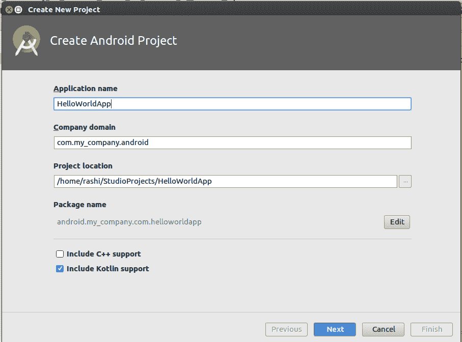

1.  在下一屏幕上，您将被要求选择目标设备和最低 SDK 支持。基本上，它会询问类似的问题：“您希望应用程序在手机和 Android Wear 上运行吗？”以及“您希望支持从 Jelly Bean 开始还是从 KitKat 开始？”


1.  在下一屏幕上，您将被提示向项目中添加活动。您也可以跳过此步骤，稍后添加活动，但在此阶段，只需点击基本活动并点击“下一步”。如果您还选择了可穿戴设备或任何其他选项，您将被提示为这些组件添加活动：


1.  接下来，您将被提示**配置**您添加的活动。基本上，您需要做的是提供**活动名称、布局名称**和**标题**。完成这些后，点击“完成”，因为您已经完成了在 Kotlin 中创建第一个项目的操作。

1.  在您的设备上运行项目：您需要按照以下步骤操作：

    1.  使用 USB 线缆将您的设备连接到您的开发机器。

    1.  通过转到设置 | 开发者选项来在您的设备上启用 USB 调试。

在 Android 4.2 及更高版本中，开发者选项默认隐藏。要使其可用，转到设置 | 关于手机，然后连续点击 Build number 七次。返回上一屏幕以找到开发者选项。

现在在你的 Android Studio 中，点击项目窗口中的 app 模块，然后选择运行（或在工具栏中点击运行）。

在选择部署目标窗口中，选择你的设备，然后点击 OK。过了一会儿，你将在你的手机或模拟器上看到应用程序正在运行。

# 还有更多...

在创建新项目窗口中点击完成按钮后，Android Studio 将配置一些设置并创建你的项目。如果你在步骤 4 中添加了活动，你将看到活动的样板代码。它看起来可能如下所示：

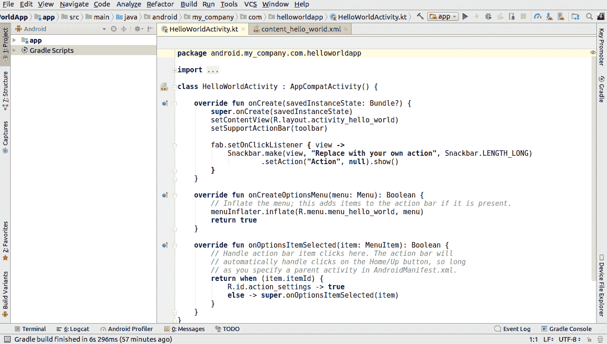

# 如何使用 Gradle 运行 Kotlin 代码

**Gradle** 现在已经成为 Android 的默认构建工具，并且非常强大。它非常适合自动化任务，同时不牺牲可维护性、可用性、灵活性、可扩展性或性能。在本菜谱中，我们将看到如何使用 Gradle 运行 Kotlin 代码。

# 准备工作

我们将使用 IntelliJ IDEA，因为它提供了 Gradle 与 Kotlin 的出色集成，并且是一个非常出色的 IDE 来进行工作。你也可以用它来使用 Android Studio。

# 如何做这件事...

在以下步骤中，我们将使用 Gradle 构建系统创建一个 Kotlin 项目。首先，从菜单中选择创建新项目选项。然后，按照以下步骤操作：

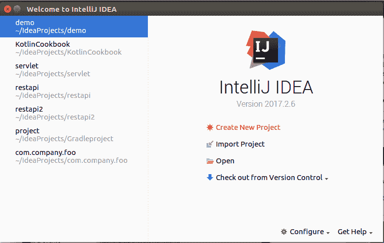

1.  使用 Gradle 构建系统创建项目：

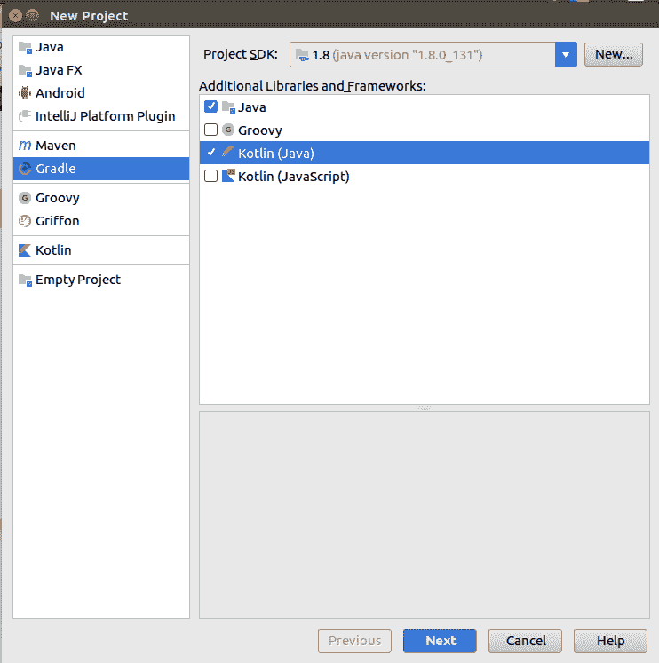

1.  在你创建了项目之后，你将拥有 `build.gradle` 文件，它看起来可能如下所示：

```kt
version '1.0-SNAPSHOT'

buildscript {
  ext.kotlin_version = '1.1.4-3'

  repositories {
      mavenCentral()
  }
  dependencies {
      classpath "org.jetbrains.kotlin:kotlin-gradle-plugin:$kotlin_version"
  }
}

apply plugin: 'java'
apply plugin: 'kotlin'

sourceCompatibility = 1.8

repositories {
  mavenCentral()
}

dependencies {
  compile "org.jetbrains.kotlin:kotlin-stdlib-jre8:$kotlin_version"
  testCompile group: 'junit', name: 'junit', version: '4.12'
}

compileKotlin {
  kotlinOptions.jvmTarget = "1.8"
}
compileTestKotlin {
  kotlinOptions.jvmTarget = "1.8"
}
```

1.  现在我们将创建一个 `HelloWorld` 类，它将有一个简单的 main 函数：

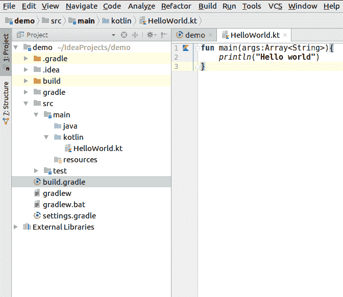

1.  现在，能够直接运行此代码将非常酷。为了做到这一点，我们将使用 `gradle run` 命令。然而，在这样做之前，我们需要启用应用程序插件，这将允许我们直接运行此代码。我们需要在 `build.gradle` 文件中添加两行来设置它：

```kt
apply plugin: 'application'
mainClassName = "HelloWorldKt"
```

1.  在此之后，你可以在终端中输入 `gradle run` 来执行此文件，你将看到方法的输出，如图所示：

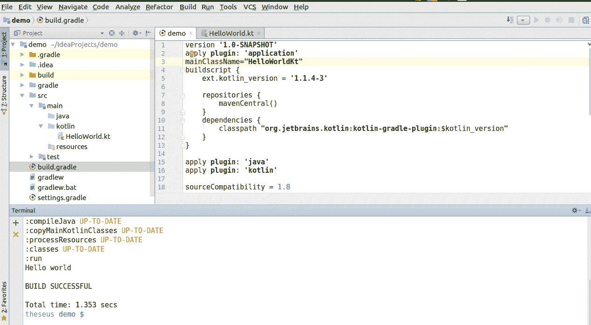

# 还有更多...

当你在 IntelliJ 中创建新项目时，项目的默认结构如图所示：

```kt
project
   - src
       - main (root)
           - kotlin
           - java
```

如果你想要项目有不同的结构，你应该在 `build.gradle` 中声明它。你可以通过在 `build.gradle` 中添加以下行来实现：

如果不使用默认约定，应更新相应的 `sourceSets` 属性：

```kt
sourceSets {
   main.kotlin.srcDirs += 'src/main/myKotlin'
   main.java.srcDirs += 'src/main/myJava'
}
```

虽然你可以将 Kotlin 和 Java 文件放在同一个包下，但将它们分开是一个好的做法。

# 参见

查看本章中的 *如何使用 Gradle 和 Kotlin 构建可执行 jar* 菜单。

# 如何运行编译后的 Kotlin 类

使用任何语言的命令行编译器是更好地理解该语言的第一步之一，这种知识在很多情况下都很有用。在这个菜谱中，我们将使用命令行运行 Kotlin 程序，并且我们还会在 Kotlin 的交互式 shell 中玩一会儿。

# 准备工作

要能够执行此菜谱，你需要在你的开发机器上安装 Kotlin 编译器。每个 Kotlin 版本都附带一个独立编译器。你可以在 [`github.com/JetBrains/kotlin/releases`](https://github.com/JetBrains/kotlin/releases) 找到最新版本。

要手动安装编译器，将独立编译器解压缩到目录中，并可选地将 bin 目录添加到系统路径。bin 目录包含在 Windows、OS X 和 Linux 上编译和运行 Kotlin 所需的脚本。

# 如何做...

现在我们准备使用命令行运行我们的第一个程序。首先，我们将创建一个简单的应用程序，显示“Hello World!”，然后编译它：

1.  创建一个名为 `hello.kt` 的文件，并在该文件中添加以下代码行：

```kt
fun main(args: Array<String>) {
    println("Hello, World!")
 }
```

1.  现在我们使用以下命令编译文件：

```kt
$ kotlinc hello.kt -include-runtime -d hello.jar
```

1.  现在我们使用以下命令运行应用程序：

```kt
$ java -jar hello.jar
```

1.  假设你想创建一个可以与其他 Kotlin 应用程序一起使用的库；我们可以简单地编译相关的 Kotlin 应用程序为 `.jar` 可执行文件，而不使用 `-include-runtime` 选项，即新的命令如下：

```kt
$ kotlinc hello.kt -d hello.jar
```

1.  现在，让我们看看 Kotlin 交互式 shell。只需不带任何参数运行 Kotlin 编译器即可获得交互式 shell。下面是它的样子：

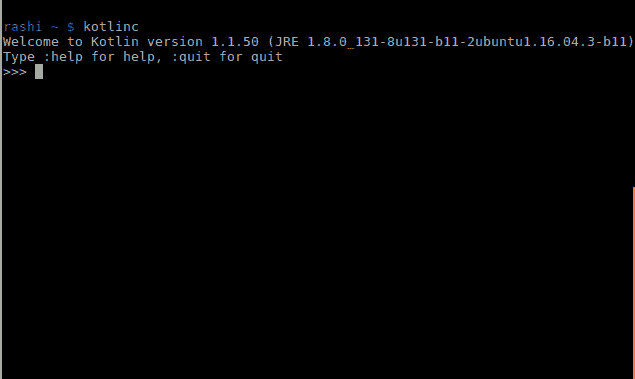

希望你注意到了我总是忽略的信息，那就是退出交互式 shell 的命令是 `:quit`，获取帮助的命令是 `:help`。

你可以在交互式 shell 中运行任何有效的 Kotlin 代码。例如，尝试以下命令中的几个：

+   `3*2+(55/5)`

+   `println("yo")`

+   `println("check this out ${3+4}")`

下面是运行前面代码的截图：

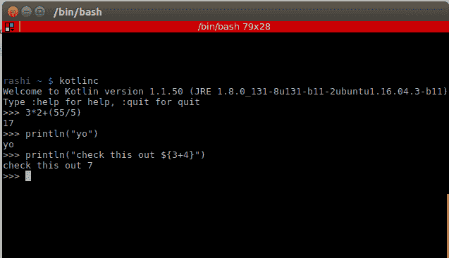

# 如何工作...

`-include-runtime` 选项使得生成的 `.jar` 文件包含 Kotlin 运行时库，从而使其自包含并可运行。然后，我们使用 Java 运行生成的 `.jar` 文件。

命令中的 `-d` 选项表示编译器的输出应该被命名为什么，可能是类文件的目录名或 `.jar` 文件名。

# 更多...

Kotlin 也可以用于编写 shell 脚本。shell 脚本包含顶层可执行代码。

Kotlin 脚本文件具有 `.kts` 扩展名，而不是 Kotlin 应用程序的常用 `.kt` 扩展名。

要运行脚本文件，只需将 `-script` 选项传递给编译器：

```kt
$ kotlinc -script kotlin_script_file_example.kts
```

# 如何使用 Gradle 和 Kotlin 构建可执行的 JAR 文件

Kotlin 是创建小型命令行工具的绝佳选择，这些工具可以打包并作为正常的 JAR 文件分发。在本教程中，我们将看到如何使用 Gradle 构建系统来实现。Gradle 构建系统是最复杂的构建系统之一。它是 Android 的默认构建工具，旨在简化复杂、多语言构建的脚本编写，这些构建通常具有许多依赖项（大型项目的典型特征）。它通过自动化项目而不会牺牲可维护性、可用性、灵活性、可扩展性或性能来实现目标。我们将使用 Gradle 构建系统来创建自解压 JAR 文件。这个 JAR 文件可以在支持 Java 的任何平台上分发和运行。

# 准备工作

您需要一个集成开发环境（最好是 IntelliJ 或 Android Studio），并且需要告诉它 Kotlin 文件所在的位置。您可以通过在 `build.gradle` 文件中指定它来实现，添加以下内容：

```kt
sourceSets {
   main.java.srcDirs += 'src/main/kotlin/'
}
```

如果您的 Kotlin 文件与 Java 包分开，前面的这些行是必需的。这是可选的，您可以在 Java 包下继续使用 Kotlin 文件，但将它们分开是一个好的实践。

我们将创建一个非常简单的函数，当执行时只打印 `Hello World!`。由于它是一个简单的函数，我只是将其添加为一个顶级的 `main()` 函数。

# 如何操作...

让我们一步步来，这样我们可以创建一个可执行的 JAR 文件：

1.  我们将创建一个简单的类 `HelloWorld.kt`，其中包含主函数，该函数只打印出 “Hello world!”：

```kt
fun main(args:Array<String>){
   println("Hello world")
}
```

1.  现在我们需要配置一个 `jar` 任务，Gradle 构建过程会通过它来告知我们的项目入口。在一个 Java 项目中，这将是我们 `main()` 函数所在类的路径，因此您需要在 `build.gradle` 中添加此 `jar` 任务：

```kt
jar {
   manifest {
       attributes 'Main-Class': 'HelloWorldKt'
   }
   from { configurations.compile.collect { it.isDirectory() ? it : zipTree(it) } }
}
```

1.  在将前面的代码片段添加到 `build.gradle` 后，您需要运行以下 gradle 命令来创建 JAR 文件：

```kt
./gradlew clean jar
```

1.  创建的 JAR 文件可以在 `build/libs` 文件夹中找到。现在您只需运行 `java -jar demo.jar` 命令来运行 JAR 文件。

在您完成之后，您可以在控制台中看到输出：

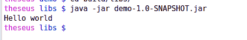

# 它是如何工作的...

要创建可执行 JAR 文件，我们需要在 `META-INF` 目录中一个名为 `MANIFEST.MF` 的清单文件。对于我们的目的，我们只需要指定包含基于 Java 的提取程序 `main()` 方法的 Java 类的名称。

有些人可能会争论，尽管我们没有顶级类声明，但我们已经在 jar 任务中的代码中将其指定为 `HelloWorldKt`：

```kt
manifest {
       attributes 'Main-Class': 'HelloWorldKt'
   }
```

将前面的代码块放在 jar 任务中的原因是 Kotlin 编译器会将所有顶级函数添加到相应的类中，以实现与 JVM 的向后兼容性。因此，Kotlin 编译器生成的类将具有文件名，加上 `Kt` 后缀，使其成为 `HelloWorldKt`。

此外，我们在 jar 任务中添加 `from { configurations.compile.collect { it.isDirectory() ? it : zipTree(it) } }` 的原因是因为我们希望 Gradle 复制 JAR 的所有依赖项。这样做的原因是，默认情况下，当 Gradle（以及 Maven）将一些 Java 类文件打包到 JAR 文件中时，它假设这个 JAR 文件将被应用程序引用，其中所有依赖项都可以在加载应用程序的类路径中访问。因此，通过在 jar 任务中指定前面的行，我们告诉 gradle 将这个 JAR 的所有引用依赖项作为 JAR 本身的一部分复制。在 Java 社区中，这被称为 **胖 JAR**。在胖 JAR 中，所有依赖项最终都会出现在加载应用程序的类路径中，因此代码可以无问题地执行。创建胖 JAR 的唯一缺点是它们的文件大小会不断增长（这也解释了其名称），尽管在大多数情况下这并不是一个大问题。

# 在 Kotlin 中读取控制台输入

在许多应用中，用户交互是一个非常重要的部分，而实现这一点的最基本方式是读取用户输入的内容，并根据它给出输出。在这个菜谱中，我们将了解读取输入的不同方式，并在控制台中提供输出。

# 准备工作

您需要安装一个首选的开发环境，该环境可以编译和运行 Kotlin。您也可以使用命令行来编译和运行您的 Kotlin 代码，这需要安装 Kotlin 编译器和 JDK。

# 如何做到这一点...

让我们通过以下步骤了解如何在 Kotlin 中读取控制台输入：

1.  我们将从一个简单的打印一行输出到控制台开始，随着我们的前进，我们将逐步转向更高级的逻辑：

```kt
println("Just a line")
```

1.  现在，我们将尝试从控制台读取字符串输入并将其再次输出：

```kt
println("Input your first name")
var first_name = readLine()
println("Your first name: $first_name")
```

1.  好的，我们是否可以用 Int 重复这个过程？

```kt
println("Hi $first_name, let us have a quick math test. Enter two numbers separated by space.")
val (a, b) = readLine()!!.split(' ').map(String::toInt)
println("$a + $b = ${a+b}")
```

1.  现在，让我们尝试一段复杂的代码，然后再开始解释：

```kt
fun main(args: Array<String>) {
   println("Input your first name")
   var first_name = readLine()
   println("Input your last name")
   var last_name = readLine()
   println("Hi $first_name $last_name, let us have a quick math test. Enter two numbers separated by space.")
   val (a, b) = readLine()!!.split(' ').map(String::toInt)
  println("what is $a + $b ?")
  println("Your answer is ${if (readLine()!!.toInt() == (a+b)) "correct" else "incorrect"}")
   println("Correct answer = ${a+b}")
 println("what is $a * $b ?")
   println("Your answer is ${if (readLine()!!.toInt() == (a*b)) "correct" else "incorrect"}")
   println("Correct answer = ${a*b}")
   println("Thanks for participating :)")
}
```

下面是编译和运行前面代码的截图：

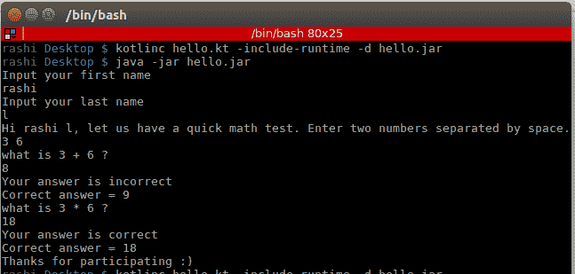

# 它是如何工作的...

让我们尝试理解我们能够通过 Kotlin 读取输入的方法。

在幕后，`Kotlin.io` 使用 `java.io` 进行输入输出。所以 `println` 实际上是 `System.out.println`，但 Kotlin 通过使用字符串模板和 `inline` 函数提供了额外的功能，这使得编写代码变得极其简单和简洁。

这是从 Kotlin `stdlib` 中用于控制台 I/O 的实际代码的一部分：

```kt
/** Prints the given message and newline to the standard output stream. */
@kotlin.internal.InlineOnly
public inline fun println(message: Any?) {
   System.out.println(message)
}
```

# 将 Java 代码转换为 Kotlin 以及相反

Kotlin 最好的部分是它与 Java 的互操作性。此外，使用基于 IntelliJ 的 IDE，我们可以直接将我们的 Java 代码转换为 Kotlin。在这个菜谱中，我们将看到如何做到这一点。

# 准备工作

这个菜谱需要安装基于 IntelliJ 的 IDE，它可以编译和运行 Kotlin 和 Java。

# 如何做到这一点...

让我们看看将 Kotlin 文件转换为 Java 文件的步骤：

1.  在您的 IntelliJ IDE 中，打开您想要转换为 Kotlin 的 Java 文件。

1.  注意，它有一个 `.java` 扩展名。现在，在主菜单中，点击代码菜单并选择“将 Java 文件转换为 Kotlin 文件”选项。您的 Java 文件将被转换为 Kotlin，并且扩展名现在将是 `.kt`。

这里是一个 Java 文件的示例：

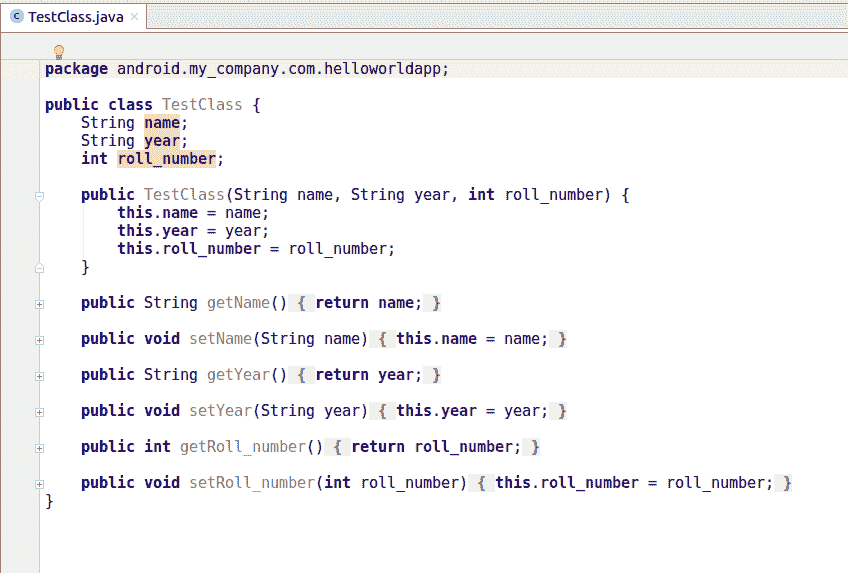

转换为 Kotlin 后，这是我们的结果：

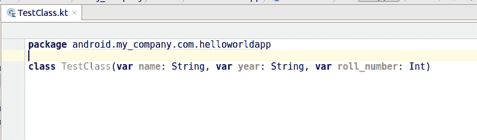

1.  Kotlin 文件可以转换为 Java，但最好避免这样做或找到其他替代方法。如果您必须绝对将 Kotlin 代码转换为 Java，请点击菜单中的“工具 | Kotlin | 显示 Kotlin 字节码”：

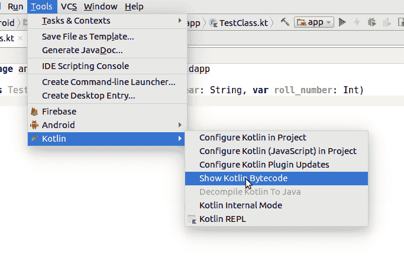

1.  点击“显示 Kotlin 字节码”后，将打开一个标题为“Kotlin 字节码”的窗口：

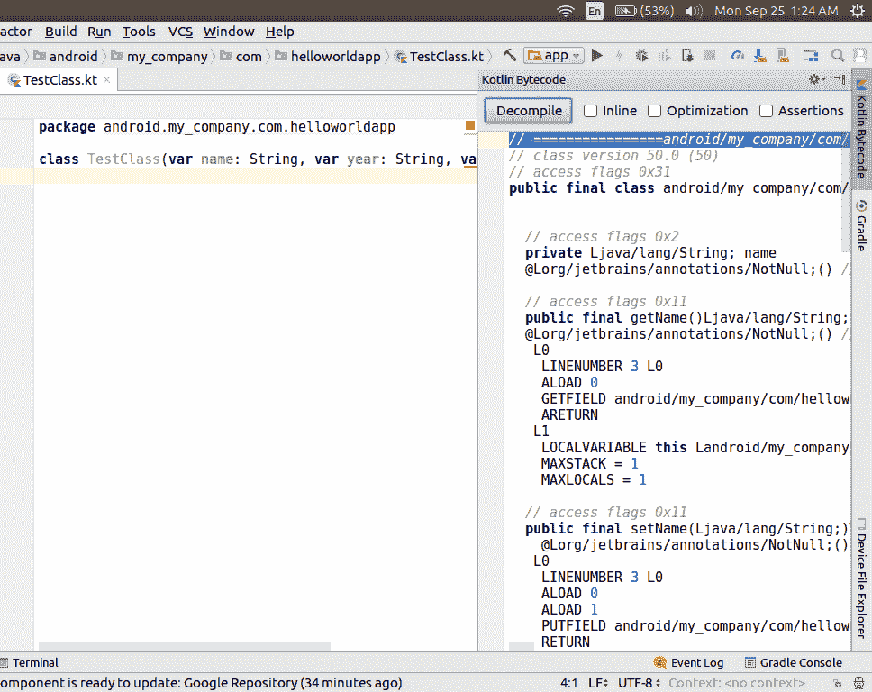

1.  点击“反编译”，将生成一个 `.java` 文件，其中包含从 Kotlin 代码反编译的 Java 字节码：

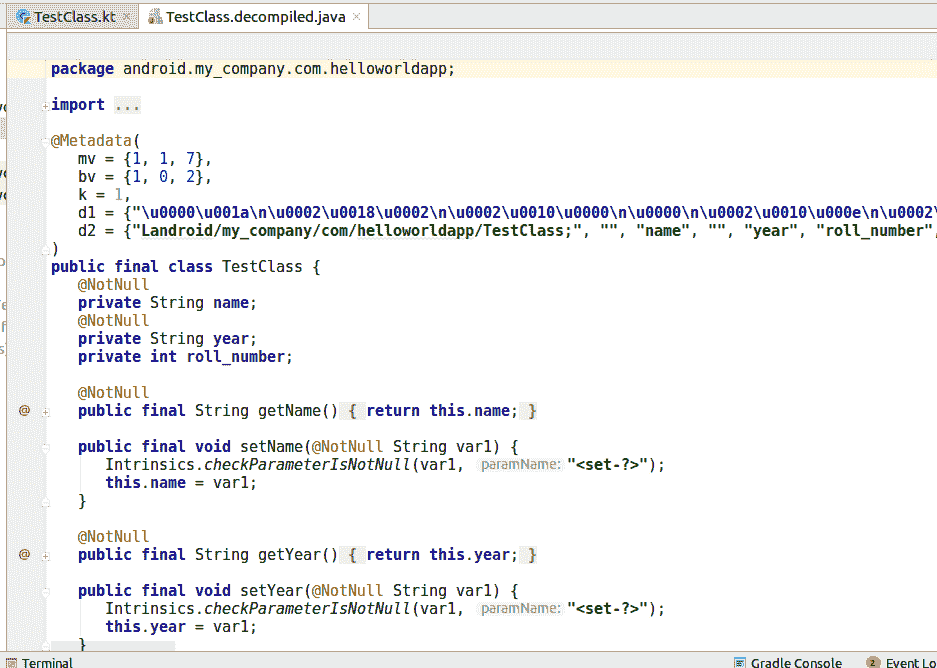

是的，它包含了很多在原始 Java 代码中不存在的多余代码，但这是反编译字节码的情况。目前，这是将 Kotlin 代码转换为 Java 的唯一方法。将反编译的文件复制到 `.java` 文件中，并删除多余的代码。

# 它是如何工作的...

Kotlin 是一种静态类型编程语言，它在 Java 虚拟机上运行，并编译成 JVM 兼容的字节码。这就是我们可以将 Java 代码转换为 Kotlin 并混合 Java 和 Kotlin 代码的原因。这也是为什么您可以从 Kotlin 中以某种方式获取 Java 代码（尽管输出并不完全符合预期）的原因。

# 如何在 Kotlin 中编写惯用的日志记录器

Kotlin 中包含了一些非常强大的功能，我们应该利用这些功能来改进我们的代码。这涉及到重新思考我们旧的编码最佳实践。我们许多旧的编码实践可以用 Kotlin 中的更好替代方案来替换。其中之一就是我们的日志记录器编写方式。尽管有许多库提供了日志功能，但我们将尝试在这个菜谱中仅使用惯用的 Kotlin 创建自己的日志记录器。

# 准备工作

我们将使用 IntelliJ IDE 来编写和执行我们的代码。

# 如何实现...

让我们按照给定的步骤在 Kotlin 中创建一个惯用的日志记录器：

1.  首先，让我们看看在 Java 中是如何实现的。在 Java 中，使用 SLF4J，并且被认为是事实上的标准，以至于在 Java 语言中日志记录似乎是一个已经解决的问题。下面是一个 Java 实现的样子：

```kt
private static final Logger logger = LoggerFactory.getLogger(CurrentClass.class);
…
logger.info(“Hi, {}”, name);
```

1.  显然，它也适用于 Kotlin，当然需要一些小的修改：

```kt
val logger = LoggerFactory.getLogger(CurrentClass::class)
…
logger.info(“Hi, {}”, name)
```

然而，除了这个之外，我们可以利用 Kotlin 的**委托**功能来增强 logger 的功能。在这种情况下，我们将使用 `lazy` 关键字来创建 logger。这样，我们只有在访问它时才会创建对象。委托是一种推迟对象创建直到使用它的好方法。这可以提高启动时间（这在 Android 中非常需要且受欢迎）。让我们探索 Kotlin 中使用懒委托的方法：

1.  我们将内部使用 `java.util.Logging`，但这适用于你选择的任何 Logging 库。所以，让我们使用 Kotlin 的懒委托来获取我们的 logger：

```kt
public fun <R : Any> R.logger(): Lazy<Logger> {
   return lazy { Logger.getLogger(this.javaClass.name) }
}
```

1.  现在在我们的类中，我们可以简单地调用方法来获取我们的 logger 并使用它：

```kt
class SomeClass {
  companion object { val log by logger() }

  fun do_something() {
      log.info("Did Something")
  }
}
```

当你运行代码时，你可以看到以下输出：

```kt
Sep 25, 2017 10:49:00 PM packageA.SomeClass do_something
INFO: Did Something
```

如输出所示，我们还可以得到类名和方法名（如果你是在方法内部访问 logger）。

# 它是如何工作的...

这里，需要注意的是，我们将 logger 放在了伴生对象中。这样做的原因很简单，因为我们希望每个类只有一个 logger 实例。

此外，`logger()` 返回一个委托对象，这意味着对象将在第一次访问时创建，并在后续访问时返回相同的值（对象）。

# 更多内容...

Anko 是一个使用 Kotlin 的 Android 库，它通过扩展函数使 Android 开发更加容易。它提供了**Anko-logger**，如果你不想自己编写 logger，可以使用它。它包含在 *anko-commons* 中，其中还有很多有趣的东西，使其值得将其包含在你的 Kotlin Android 项目中。

在 Anko 中，一个标准的 logger 实现看起来可能如下所示：

```kt
class SomeActivity : Activity(), AnkoLogger {
   private fun someMethod() {
       info("London is the capital of Great Britain")
       debug(5) // .toString() method will be executed
       warn(null) // "null" will be printed
   }
}
```

如你所见，你只需要实现 `AnkoLogger`，然后你就完成了。

每个方法都有两种版本：普通和懒（内联）：

```kt
info("String " + "concatenation")
```

```kt
info { "String " + "concatenation" }
```

只有当 `Log.isLoggable(tag, Log.INFO)` 为 true 时，lambda 结果才会被计算。

# 相关内容

要了解更多关于委托属性的信息，请参考第三章**使用委托属性**的配方**“与委托属性一起工作”**，*类与对象*。

# Kotlin 中关键字作为 Java 标识符的转义

Kotlin 的设计理念是**互操作性**。现有的 Java 代码可以无缝地从 Kotlin 代码中调用，但由于 Java 和 Kotlin 有不同的关键字，我们在调用与 Kotlin 关键字相似的 Java 方法时有时会遇到问题。Kotlin 中有一个解决方案，允许方法被调用时使用代表 Kotlin 关键字的名字。

# 准备工作

确保你有访问代码编辑器的权限，以便你可以编写和运行代码。

# 如何实现...

创建一个方法名等于任何 Kotlin 关键字的 Java 类。我使用 `is` 作为方法名，所以我的 Java 类如下所示：

```kt
public class ASimpleJavaClass {
   static void is(){
       System.out.print("Nothing fancy here");
   }
}
```

现在尝试从 Kotlin 代码中调用该方法。如果您使用的是具有自动完成功能的任何代码编辑器，它将自动将方法名称用反引号（`` ` ` ``）括起来：

```kt
fun main(args: Array<String>) {
   ASimpleJavaClass.`is`()   
}
```

Kotlin 中的其他关键字（在 Java 中是合格标识符）也有类似的情况。

# 它是如何工作的...

根据 Kotlin 的文档，一些 Kotlin 关键字在 Java 中也是有效的标识符：`in`、`object`、`is` 等。如果一个 Java 库使用 Kotlin 关键字作为方法，您仍然可以调用该方法，使用反引号（`` ` ``）进行转义。

以下是在 Kotlin 中的关键字：

| package | as | typealias | class | this | super | val |
| --- | --- | --- | --- | --- | --- | --- |
| var | fun | for | null | true | false | is |
| in | throw | return | break | continue | object | if |
| try | else | while | do | when | interface | typeof |

# 使用 "as" 关键字局部重命名冲突实体以消除歧义

消除歧义是指通过使某事物清晰来消除歧义。在代码中导入库或类是程序员的日常任务。多亏了现在的优秀代码编辑器，将文件导入代码在每种语言中都变得非常容易。

然而，如果您尝试将两个类导入到一个文件中会发生什么？尽管您应该始终为不同的类使用不同的名称，但有时这是不可避免的。例如，在库的类具有相同名称的情况下。在 Java 中，有一个解决方案；您必须使用完全限定符，看起来像这样：

```kt
class X {
   com.very.very.long.prefix.bar.Foo a;
   org.other.very.very.long.prefix.baz.Foo b;
   ...
}
```

脏，不是吗？现在，让我们看看 Kotlin 如何优雅地解决这个问题。

# 准备工作

确保您有一个代码编辑器，可以在其中编写和运行代码。为了测试，您可以创建两个具有相同名称但位于不同包中的类。请参考此处的示例：

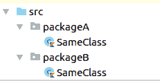

# 如何做到...

在以下步骤和示例中，我们将看到如何使用 Kotlin 的关键字消除具有相似名称的类的歧义。

1.  在 Kotlin 中，您可以使用 `as` 关键字来消除歧义，局部重命名冲突实体。所以，在 Kotlin 中，它看起来会像这样：

```kt
import foo.Bar // Bar is accessible
import bar.Bar as bBar // bBar stands for 'bar.Bar'
```

1.  然后，像这样访问它们的方法：

```kt
Bar.methodOfFooBar()
bBar.methodOfBarBar()
```

例如，让我们看看如何使用 `as` 关键字消除两个具有相同名称（`SomeClass.kt`）但位于不同包中的类的歧义：

`SameClass.kt (packageA)`

```kt
package packageA
class SameClass {
  companion object {
      fun methodA(){
          println("Method a")
      }
  }
}
```

`SameClass.kt (packageB)`

```kt
package packageB
class SameClass {
  companion object {
      fun methodB(){
          println("Method b")
      }
  }
}
```

`HelloWorld.kt` 是使用具有相似名称的类的类：

```kt
import packageA.SameClass as anotherSameClass
import packageB.SameClass
fun main(args: Array<String>) {
   anotherSameClass.methodA()
   SameClass.methodB()

}
```

# 在 Kotlin 中进行位操作

Kotlin 提供了几个函数（以中缀形式）来执行位和位移操作。在本节中，我们将通过示例学习如何在 Kotlin 中执行位级操作。

位和位移运算符仅用于两种整型——Int 和 Long——以执行位级操作。

# 准备工作

这是位操作（仅适用于 Int 和 Long）的完整列表：

+   `shr(bits)`: 有符号右移（Java 的 >>）

+   `ushr(bits)`: 无符号右移（Java 的 >>>）

+   `and(bits)`: 按位与

+   `or(bits)`: 按位或

+   `xor(bits)`: 位异或

+   `inv()`: 位反转

# 如何做到...

让我们看看几个示例来理解位运算。

# 或者

`or` 函数比较两个值的对应位。如果两个位中的任意一个是 1，则返回 1，如果不是，则返回 0。

考虑以下示例：

```kt
fun main(args: Array<String>) {
  val a=2
  val b=3
  print(a or b)
}

```

下面是输出结果：

```kt
 3
```

下面是前面示例的解释：

2 = 10（二进制格式）

3 = 11（二进制格式）

2 和 3 的位或

二进制

10 `OR` 11

11 = 3（十进制格式）

# and

`and` 函数比较两个值的对应位。如果两个位中的任意一个是 0，则返回 0，如果不是且两个位都是 1，则返回 1。

考虑以下示例：

```kt
fun main(args: Array<String>) {
  val a=2
  val b=3
  print(a and b)
}
```

这是输出结果：

```kt
 2
```

让我们看看解释：

2 = 10（二进制格式）

3 = 11（二进制格式）

2 和 3 的位与

二进制

10 `AND` 11

10 = 2（十进制格式）

# xor

`xor` 函数比较两个值的对应位。如果对应位相同，则返回 0，如果不同，则返回 1。

看看这个示例：

```kt
fun main(args: Array<String>) {
  val a=2
  val b=3
  print(a xor b)
}
```

下面是输出结果：

```kt
 1
```

下面是解释：

2 = 10（二进制格式）

3 = 11（二进制格式）

2 和 3 的位异或

二进制

10 `XOR` 11

01 = 1（十进制格式）

# inv

`inv` 函数简单地反转位模式。如果位是 1，则将其变为 0，反之亦然。

下面是一个示例：

```kt
fun main(args: Array<String>) {
    val a=2
   print(a.inv())}
```

这是输出结果：

```kt
 -3
```

下面是解释：

2 = 10（二进制格式）

2 的位补码为 01，但编译器显示的是该数的 2 的补码，即二进制数的负表示法。

整数 *n* 的 2 的补码等于 -(*n*+1)。

# shl

`shl` 函数将位模式向左移动指定的位数。

考虑以下示例：

```kt
fun main(args: Array<String>) {
       println( 5 shl 0)
       println( 5 shl 1)
       println( 5 shl 2)
}
```

这是输出结果：

```kt
5
10
20
```

下面是解释：

5 = 101（二进制格式）

101 左移 0 位 = 101

101 左移 1 位 = 1010（十进制中的 10）

101 左移 2 位 = 10100（十进制中的 20）

# shr

`shr` 函数将位模式向右移动指定的位数。

考虑以下示例：

```kt
fun main(args: Array<String>) {
       println( 5 shr 0)
       println( 5 shr 1)
       println( 5 shr 2)
}
```

这里是输出结果：

```kt
5
2
1
```

下面是解释：

5 = 101（二进制格式）

101 右移 0 位 = 101

101 右移 1 位 = 010（十进制中的 2）

101 右移 2 位 = 001（十进制中的 1）

# ushr

`ushr` 函数将位模式向右移动指定的位数，用 0 填充最左边的位。

下面是一个示例：

```kt
fun main(args: Array<String>) {
       println( 5 ushr 0)
       println( 5 ushr 1)
       println( 5 ushr 2)
}
```

这将输出以下内容：

```kt
5
2
1
```

这是它的解释：

5 = 101（二进制格式）

101 右移 0 位 = 101

101 右移 1 位 = 010（十进制中的 2）

101 右移 2 位 = 001（十进制中的 1）

# 它是如何工作的...

Kotlin 中的位运算符不是像 Java 中的内置运算符，但它们仍然可以用作运算符。为什么？看看它的实现：

```kt
public infix fun shr(bitCount: Int): Int
```

你可以看到该方法具有 `infix` 表示法，这使得它可以作为 `infix` 表达式调用。

# 将字符串解析为 Long、Double 或 Int

Kotlin 使得将字符串解析为其他数据类型（如 Long、Integer 或 Double）变得非常容易。

在 JAVA 中，使用 `Long.parseLong()` 或 `Long.valueOf()` 静态方法，它将字符串参数解析为有符号的十进制长整型并返回一个长整型值，对于其他数据类型如 Int、Double 和 Boolean 也是如此。让我们看看如何在 Kotlin 中实现它。

# 准备工作

您只需要一个 Kotlin 编辑器来编写和运行您的代码。我们将使用长整型的转换作为示例来讨论使用字符串的解析。转换到其他数据类型相当类似。

# 如何做到这一点...

要将字符串解析为长整型数据类型，我们使用字符串的 `.toLong()` 方法。它将字符串解析为一个长整型数字并返回结果。如果字符串不是数字的有效表示，则会抛出 `NumberFormatException`。稍后我们将看到这个示例的例子。

# 将字符串转换为 Long

这里有一个示例，展示了将字符串解析为长整型的过程：

```kt
fun main(args: Array<String>) {
  val str="123"
  print(str.toLong())
}
```

当您运行前面的代码时，您将看到以下输出：

```kt
123
```

如果您不想处理异常，可以使用 `.toLongOrNull()`。此方法将字符串解析为 Long 并返回结果，如果字符串不是数字的有效表示，则返回 null。

# 使用 string.toLongOrNull() 将字符串转换为 Long

在这个示例中，我们将看到如何使用 `.toLongOrNull()` 方法解析字符串：

```kt
fun main(args: Array<String>) {
  val str="123.4"
  val str2="123"
  println(str.toLongOrNull())
  println(str2.toLongOrNull())
}
```

运行前面的程序，将生成以下输出：

```kt
 null 123
```

# 使用特殊基数进行转换

所有的前面示例都使用了基数（基数）10。有些情况下，我们希望将字符串转换为 Long，但使用另一个基数。`string.toLong()` 和 `string.toLongOrNull()` 都可以接收一个自定义的基数用于转换。让我们看看它的实现：

+   `string.toLong(radix)`:

    +   这会将字符串解析为一个 `[Long]` 数字并返回结果

    +   如果字符串不是数字的有效表示，则抛出 `NumberFormatException`

    +   当 `[radix]` 不是字符串转换为数字的有效基数时，抛出 `IllegalArgumentException`

+   `string.toLongOrNull(radix)`:

    +   这会将字符串解析为一个 `[Long]` 数字并返回结果，或者如果字符串不是数字的有效表示，则返回 null

    +   当 `[radix]` 不是字符串转换为数字的有效基数时，抛出 `IllegalArgumentException`

# 使用特殊基数解析字符串到 Long

在前面的示例中，我们使用基数 10 解析字符串，即十进制。默认情况下，基数取为 10，但在某些情况下我们需要不同的基数。例如，将字符串解析为二进制或八进制数字的情况。因此，现在我们将看到如何处理非十进制的基数。虽然您可以使用任何有效的基数，但我们将展示最常用的示例，如二进制和八进制。

+   **二进制**：由于二进制数由 0 和 1 组成，因此使用的基数是 2：

```kt
fun main(args: Array<String>) {
       val str="11111111"
       print(str.toLongOrNull(2))   }
```

运行前面的程序，将生成以下输出：

```kt
 255
```

+   **八进制**：八进制数制，简称八进制，是基数为 8 的数制，使用数字 0 到 7。因此，我们将使用 8 作为基数：

```kt
fun main(args: Array<String>) {
      val str="377"
       print(str.toLongOrNull(8))
   }
```

运行前面的程序，将生成以下输出：

```kt
 255
```

+   **十进制**：十进制系统中有 10 个数字（0-9）；因此，我们将使用 10 作为基数。请注意，没有基数参数的方法（`.toLong() , .toLongOrNull()`）默认使用基数 10：

```kt
fun main(args: Array<String>) {
      val str="255"
       print(str.toLongOrNull(10))
   }
```

运行前面的程序，将生成以下输出：

```kt
 255
```

# 它是如何工作的...

Kotlin 使用如 `.toLong()` 和 `toLongOrNull()` 这样的字符串扩展函数来简化操作。让我们深入了解它们的实现。

+   对于 `Long` 类型，使用此方法：

```kt
public inline fun String.toLong(): Long = java.lang.Long.parseLong(this)
```

如您所见，它内部也调用了 `Long.parseLong(string)` Java 静态方法，并且与其他数据类型类似。

+   对于 `Short` 类型，它是以下内容：

```kt
public inline fun String.toShort(): Short = java.lang.Short.parseShort(this)
```

+   使用此方法进行 `Int` 解析：

```kt
public inline fun String.toInt(): Int = java.lang.Integer.parseInt(this)
```

+   对于使用基数进行解析，请使用以下方法：

```kt
public inline fun String.toLong(radix: Int): Long = java.lang.Long.parseLong(this, checkRadix(radix))
```

`checkRadix` 方法检查给定的 `[radix]` 是否是字符串到数字和数字到字符串转换的有效基数。

# 还有更多...

让我们快速查看 Kotlin 提供的几个其他扩展函数，用于解析字符串：

+   `toBoolean()`: 如果此字符串的内容等于单词 *true*（忽略大小写），则返回 `` `true` ``，否则返回 `` `false` ``。

+   `toShort()`: 将字符串解析为 `[Short]` 数字并返回结果。如果字符串不是数字的有效表示，则抛出 `NumberFormatException`。

+   `toShort(radix)`: 将字符串解析为 `[Short]` 数字并返回结果，如果字符串不是数字的有效表示，则抛出 `NumberFormatException`，如果 `[radix]` 不是字符串到数字转换的有效基数，则抛出 `IllegalArgumentException`。

+   `toInt()`: 将字符串解析为 `[Int]` 数字并返回结果，如果字符串不是数字的有效表示，则抛出 `NumberFormatException`。

+   `toIntOrNull()`: 将字符串解析为 `[Int]` 数字并返回结果，如果字符串不是数字的有效表示，则返回 `` `null` ``。

+   `toIntOrNull(radix)`: 将字符串解析为 `[Int]` 数字并返回结果，如果字符串不是数字的有效表示，则返回 `` `null` ``，如果 `[radix]` 不是字符串到数字转换的有效基数，则抛出 `IllegalArgumentException`。

+   `toFloat()`: 将字符串解析为 `[Float]` 数字并返回结果，如果字符串不是数字的有效表示，则抛出 `NumberFormatException`。

+   `toDouble()` : 将字符串解析为 `[Double]` 数字并返回结果，如果字符串不是数字的有效表示，则抛出 `NumberFormatException`。

# 在 Kotlin 中使用字符串模板

Kotlin 将许多常用数据类型字符串的强大功能打包在一起。其中一个非常酷的特性是字符串模板。此功能允许字符串包含模板表达式。

在 Java 中，你必须使用 **StrSubstitutor** ([`commons.apache.org/proper/commons-text/javadocs/api-release/org/apache/commons/text/StrSubstitutor.html`](https://commons.apache.org/proper/commons-text/javadocs/api-release/org/apache/commons/text/StrSubstitutor.html)) 和相应的映射。Java 中的模板表达式将如下所示：

```kt
Map<String, String> valuesMap = new HashMap<String, String>();
valuesMap.put("city", "Paris");
valuesMap.put("monument", "Eiffel Tower");
String templateString ="Enjoyed ${monument} in ${city}.";
StrSubstitutorsub=newStrSubstitutor(valuesMap);
String resolvedString =sub.replace(templateString);
```

Kotlin 简化了编写模板表达式的痛苦，使其变得有趣、简洁，并且不那么冗长。

使用字符串模板，你可以在不进行字符串连接的情况下将变量或表达式嵌入到字符串中。所以，让我们开始吧！

# 如何做到这一点...

在接下来的步骤中，我们将学习如何使用字符串模板：

1.  在 Kotlin 中，模板表达式以 `$` 符号开始。

1.  字符串模板的语法如下：

```kt
$variableName
```

或者，它也可以是这样的：

```kt
${expression}
```

1.  让我们看看几个例子：

+   考虑一个带有变量的字符串模板的例子：

```kt
fun main(args: Array<String>) {
    val foo = 5;
    val myString = "foo = $foo"
    println(myString)
 }
```

上述代码的输出将是`foo = 5`。

+   考虑一个带有表达式的字符串模板的例子：

```kt
fun main(arr: Array<String>){
  val lang = "Kotlin"
  val str = "The word Kotlin has ${lang.length} characters."
  println(str)
}
```

+   考虑一个带有原始字符串的字符串模板的例子：

    +   **原始字符串**：一个由换行符组成且没有使用 `\n` 的任意字符串。它是一个原始字符串，并放置在三个引号（`"""`）中：

```kt
fun main(args: Array<String>) {
    val a = 5
    val b = 6

    val myString = """
    ${if (a > b) a else b}
 """
    println("Bigger number is: ${myString.trimMargin()}")
 }
```

当你运行程序时，输出将是`Bigger number is: 6`。

# 它是如何工作的...

使用变量名称的字符串模板的使用相当简单。以前，我们通常使用字符串连接，但现在我们只需在变量前指定 `$` 符号即可。

当字符串模板用作表达式时，`${..}` 内的表达式首先被评估，然后将值与字符串连接。在先前的例子（带有原始字符串的字符串模板）中，`${if (a > b) a else b}` 表达式被评估，其值，即 6，与字符串一起打印。

# 还有更多...

字符串模板在字符串属性和函数中也很有用。以下是一个例子：

```kt
fun main(args: Array<String>) {
      val str1="abcdefghijklmnopqrs"
       val str2="tuvwxyz"
       println("str1 equals str2 ? = ${str1.equals(str2)}")
       println("subsequence is ${str1.subSequence(1,4)}")
       println("2nd character is ${str1.get(1)}")
   }
```

这里是输出结果：

```kt
str1 equals str2 ? = false
subsequence is bcd
2nd character is b
```
