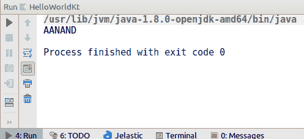

# 第四章：函数

本章将涵盖以下内容：

+   在函数中指定默认值

+   在函数中使用命名参数

+   在 Kotlin 中创建 `RecyclerView` 适配器

+   在 Kotlin 中创建 getter setters

+   将可变参数传递给函数

+   将函数作为参数传递给另一个函数

+   声明一个 `static` 函数

+   在 Kotlin 中使用 `use` 关键字

+   在 Kotlin 中使用闭包

+   带接收者的函数字面量

+   使用匿名函数

# 简介

函数是任何代码的构建块。它们帮助我们使程序更加模块化、安全且易于理解。函数在面向对象编程中至关重要，因为它们在抽象和封装（两个非常重要的设计原则）中扮演着重要角色。Kotlin 通过链式和 lambda 表达式的方式，为我们的函数使用方式带来了许多更新。它使函数式编程变得更加容易。在本章中，我们将学习一些有助于我们处理函数的技巧。那么，让我们开始吧！

# 在函数中指定默认值

如果你来自 Java 世界，你可能记得我们无法为方法指定默认值。这意味着我们无法在 Java 中这样做：

```kt
public void foo(int a, int b=10){
}
```

我们需要为它编写两个方法，这被称为 *方法过载*：

```kt
public void foo(int a){
}

public void foo(int a, int b){
}
```

此外，假设你有一个具有三种不同类型参数的函数，例如这些：

```kt
public void foo (int a,double b, String c){
}
```

然后，你将拥有七个方法过载的实例：

```kt
public void foo (int a,double b, String c),
public void foo (int a,double b) ,
public void foo (double b, String c),
public void foo (int a, String c),
public void foo (int a),
public void foo (double b),
public void foo (String c)
```

Kotlin 通过提供默认值的方法为你提供，这样你可以防止方法过载的数量变得疯狂。有些人可能会说：“嘿，我们为什么不使用构建器模式而不是方法过载呢？”这些人是对的，但 Kotlin 的方法比这更容易。让我们看看吧！

# 准备工作

我们将使用 IntelliJ IDEA 来编写和执行我们的代码。你可以使用你感到舒适的任何开发环境。

# 如何做到这一点...

在 Kotlin 中，函数的参数可以有默认值，并且当省略相应的参数时，它们会被使用。这反过来又减少了过载的数量。前面的例子中，具有三种不同类型的参数可以在 Kotlin 中轻松解决，代码量也少得多：

1.  让我们在编辑器中添加提到的代码，运行它，并检查输出：

```kt
fun main(args: Array<String>) {
    foo()    
    foo(1)
    foo(1,0.1)
    foo(1,0.1,"custom string")
}
fun foo(a:Int=0, b: Double =0.0, c:String="some default value"){
    println("a=$a , b=$b ,c = $c")
}
```

如果你运行前面的代码，你会看到以下输出：

```kt
Output:
a=0 , b=0.0 ,c = some default value
a=1 , b=0.0 ,c = some default value
a=1 , b=0.1 ,c = some default value
a=1 , b=0.1 ,c = custom string
```

1.  如你所见，我们不必实现四个不同的方法，我们可以映射参数。当不通过提供显式参数来调用方法时，会使用默认参数，所以当你不传递任何参数时，它就使用所有默认参数。借助命名参数，我们可以进一步减少方法的数量，但我们将在这下一个技巧中介绍。

1.  需要注意的一件事是，默认参数也会与构造函数一起工作。所以你可以有一个如下所示的类声明：

```kt
data class Event(var eventName: String? = "", var eventSchedule: Date? = Date(), var isPrivate: Boolean = false)
```

想要了解更多关于数据类的信息，请前往[第十一章](https://www.safaribooksonline.com/library/view/kotlin-programming-cookbook/9781788472142/e1822868-fcb7-4623-8727-eb961254acdf.xhtml)，*如何创建数据类食谱*。

1.  然后，我们可以声明对象，如下所示：

```kt
Event("Celebration")
Event("Ceberation",Date())
Event("Ceberation",Date(),true)
```

如你所见，借助构造函数中的默认值，我们避免了实现多个构造函数的需要，这是我们以前在 Java 中经常做的。

记住，这里有一个陷阱。如果你在 Java 中创建对象，我们将无法这样做。这意味着以下代码所示的操作将不会被 Java 接受。现在我知道你会想“Java 的 100%互操作性去哪了？！”：

```kt
new Event("Celebration")
new Event("Celebration",Date())
new Event("Celebration",Date(),true)
```

1.  如果我们想要向 Java 调用者公开多个重载，我们只需要进行一个小修改，即——即在具有默认值的构造函数和函数上添加`@JvmOverloads`，这样前面的类声明就变成了这样：

```kt
data class Event @JvmOverloads constructor (var eventName: String? = "", var date: Date? = Date(), var isPrivate: Boolean = false)
```

1.  此外，我们的方法也变成了这样：

```kt
@JvmOverloads fun foo(a:Int=0, b: Double =0.0, c:String="some default value"){
 println("a=$a , b=$b ,c = $c")
 }
```

这是一点小小的代价，但`@JvmOverloads`注解帮助我们的构造函数和函数在 Java 世界中也能有默认值。

# 还有更多...

如果我们想让我们的代码只在 Kotlin 世界中工作，那么我们不需要`@JvmOverloads`注解，因为 Kotlin 有自己的规则，可以通过这些规则在构造函数和函数中使用默认值。添加`@JvmOverloads`注解会创建所有必要的重载。所以如果你反编译 Kotlin 的字节码，你会看到构造函数和函数的所有重载版本。

# 在函数中使用命名参数

这个食谱可以被视为对之前食谱的扩展，*在函数中指定默认值*。函数中的默认参数和命名参数一起可以大幅减少方法重载的数量。我们已经看到了如何在函数中使用默认参数；现在，让我们看看如何使用命名参数。

# 准备工作

我们将使用 IntelliJ IDEA 来编写和执行我们的代码。你可以使用你感到舒适的任何开发环境。

# 如何做到这一点...

为了减少重载数量并提高代码的可读性，我们还可以使用命名参数。让我们看看以下代码：

1.  以`foo`函数的相同示例，以下是我们可以如何使用命名参数：

```kt
fun main(args: Array<String>) {
     foo(b=0.9)
     foo(a=1,c="Custom string")
}
 fun foo(a:Int=0, b: Double =0.0, c:String="some default value"){
     println("a=$a , b=$b ,c = $c")
}
```

1.  运行上述代码将得到以下输出：

```kt
Output:
a=0 , b=0.9 ,c = some default value
a=1 , b=0.0 ,c = Custom string
```

1.  命名参数防止我们出现重载，并且使我们的代码更加易于阅读。此外，我们不需要输入所有参数。我的意思是，如果你只有两个参数——`a`和`c`——那么你可能需要这样做：

```kt
foo(1, 0.0, "Custom string")
```

1.  你必须添加一个默认值来填充`a`和`c`之间的空间。然而，使用命名参数，你能够使用`foo(a=1,c="Custom string")`而无需在中间添加默认参数。

1.  一个需要注意的关键点是，当我们调用一个同时带有位置参数和命名参数的函数时，我们需要将位置参数放在第一个命名参数之前。例如，`foo(1,b = 0.1)` 调用是允许的，但 `foo(a = 1, 0.1)` 是不允许的。

默认值和命名参数可以将所需的函数重载数量降到最低，使代码量小，并提高代码的可读性。

# 在 Kotlin 中创建 RecyclerView 适配器

`RecyclerView` 是 Android 开发中最广泛使用的元素之一。它本质上用于通过适配器显示列表中的数据。在这个菜谱中，我们将学习如何利用 Kotlin 的强大功能使 `RecyclerView` 更加高效。我们还将使用 `DiffUtils`。它从 24.02 开始可用。根据文档：

DiffUtil 是一个实用类，可以计算两个列表之间的差异，并输出一个更新操作列表，将第一个列表转换为第二个列表。

定义是自我解释的。`notifyDatasetChanged` 是适配器的一个非常昂贵的操作。`DiffUtils` 只更新已更改的部分，而 `notifyDatasetChanged` 则更新整个列表。

# 准备工作

在 Android Studio 中创建一个新的 Android 项目。您也可以克隆 [`gitlab.com/aanandshekharroy/kotlin-cookbook`](https://gitlab.com/aanandshekharroy/kotlin-cookbook) 仓库并检出 1-recycler-view-in-kotlin 分支。

在这个应用中，我们将创建一个简单的列表，列出 Google 发布的不同 Android 风味，类似于这里所看到的：


如您所见，有一个浮动操作按钮；点击它将更新列表的顺序。我们将更新列表（`RecyclerView`），但我们将使用 `DiffUtils` 而不是 `notifyDatasetChanged` 方法来更新它。

# 如何做到这一点...

因此，现在让我们按照以下步骤创建我们刚才讨论的应用：

1.  首先，我们需要创建一个 Android 风味的列表。因此，我们将首先创建一个数据类，它包含图像和风味的名称：

```kt
data class AndroidFlavours (var name:String, val image:Int)
```

我们将图像类型定义为 `Int`，因为我们将会使用可绘制项的 ID。在 `drawable` 文件夹中，我们将保存所有必需的图像。

1.  接下来，我们将创建一个 Android 风味的列表：

```kt
val flavorList= listOf<AndroidFlavours>(
        AndroidFlavours("Cupcake",R.drawable.cupcake),
        AndroidFlavours("Donut",R.drawable.donut),
        AndroidFlavours("Eclair",R.drawable.eclair),
        AndroidFlavours("Froyo",R.drawable.froyo),
        AndroidFlavours("Gingerbread",R.drawable.gingerbread),
        AndroidFlavours("HoneyComb",R.drawable.honeycomb),
        AndroidFlavours("Icecream Sandwich",R.drawable.icecream),
        AndroidFlavours("Jellybean",R.drawable.jellybean),
        AndroidFlavours("KitKat",R.drawable.kitkat),
        AndroidFlavours("Lollipop",R.drawable.lollipop))
```

1.  现在，我们将创建一个适配器。我们将命名为 `AndroidFlavourAdapter`：

```kt
class AndroidFlavourAdapter:RecyclerView.Adapter<AndroidFlavourAdapter.FlavourViewHolder>() {
    var flavourItems:List<AndroidFlavours> by Delegates.observable(emptyList()){
        property, oldValue, newValue ->
        notifyChanges(oldValue,newValue)
    }

    override fun onCreateViewHolder(parent: ViewGroup, viewType: Int): FlavourViewHolder {
        return FlavourViewHolder(parent.inflate(R.layout.flavour_item))
    }

    override fun getItemCount(): Int =flavourItems.size

    override fun onBindViewHolder(holder: FlavourViewHolder, position: Int) {
        holder.name.text=flavourItems.get(holder.adapterPosition).name
        holder.image.loadImage(flavourItems.get(holder.adapterPosition).image)
    }

    inner class FlavourViewHolder(var view: View):RecyclerView.ViewHolder(view){
        var name:TextView = view.findViewById(R.id.textView)
        var image:ImageView = view.findViewById(R.id.imageView)
    }
}
```

上述代码对于 `RecyclerView` 的一般实现来说相当标准，除了两点。

其中之一是 `loadImage` 函数，它不是一个原生函数，而是一个扩展函数，其实现如下：

```kt
fun ImageView.loadImage(image: Int) {
    Glide.with(context).load(image).into(this)
}
```

1.  另一件事是我们已经在适配器中定义了 `AndroidFlavours` 的列表。适配器中的 `flavoursList` 是一个 `observable` 属性。这意味着监听器会通知此属性的变化。因此，我们得到以下结构：

```kt
var flavourItems:List<AndroidFlavours> by Delegates.observable(emptyList()){
    property, oldValue, newValue ->
    notifyChanges(oldValue,newValue)
}

```

1.  现在，每次我们尝试为 `flavourItems` 变量赋值时，`{ .. }` 块下的构造就会运行，如果我们想进行操作，我们将有旧值和新值。在这种情况下，我们将使用 `notifyChanges` 方法。让我们看看 `notifyChanges` 方法：

```kt
private fun notifyChanges(oldValue: List<AndroidFlavours>, newValue: List<AndroidFlavours>) {
    val diff = DiffUtil.calculateDiff(object : DiffUtil.Callback() {
        override fun getChangePayload(oldItemPosition: Int, newItemPosition: Int): Any? {
            val oldFlavor=oldValue.get(oldItemPosition)
            val newFlavor=newValue.get(newItemPosition)
            val bundle=Bundle()
            if(!oldFlavor.name.equals(newFlavor.name)){
                bundle.putString("name",newFlavor.name)
            }
            if(!oldFlavor.image.equals(newFlavor.image)){
                bundle.putInt("image",newFlavor.image)
            }
            if(bundle.size()==0) return null
            return bundle
        }

        override fun areItemsTheSame(oldItemPosition: Int, newItemPosition: Int): Boolean {
            return oldValue.get(oldItemPosition)==newValue.get(newItemPosition)
        }

        override fun areContentsTheSame(oldItemPosition: Int, newItemPosition: Int): Boolean {
            return oldValue.get(oldItemPosition).name.equals(newValue.get(newItemPosition).name)&&oldValue.get(oldItemPosition).image.equals(newValue.get(newItemPosition).image)
        }

        override fun getOldListSize() = oldValue.size

        override fun getNewListSize() = newValue.size

    })

    diff.dispatchUpdatesTo(this)
}
```

我将在下一节解释前面的代码。

1.  现在，让我们设置适配器：

```kt
mAdapter= AndroidFlavourAdapter()
flavour_list.layoutManager=LinearLayoutManager(this)
flavour_list.adapter=mAdapter
mAdapter.flavourItems=flavorList
shuffle.setOnClickListener {
    mAdapter.flavourItems=flavorList.shuffle()
}
```

1.  `shuffle` 函数将随机化 `AndroidFlavours` 列表的顺序。`.shuffle()` 函数不是 Kotlin 或 Java 提供的本地函数，而是一个扩展函数：

```kt
fun <E> List<E>.shuffle(): MutableList<E> {
    val list = this.toMutableList()
    Collections.shuffle(list)
    return list
}
```

# 它是如何工作的...

让我们深入了解 `DiffUtils`。`DiffUtils` 需要两个数组/列表，其中一个应该是旧列表，另一个应该是新列表。

有五个主要函数：

+   `getNewListSize()`: 这个方法返回新列表的大小。

+   `getOldListSize()`: 这个方法返回旧列表的大小。

+   `areItemsTheSame()`: 这个方法用于确定两个对象是否表示相同的项。

+   `areContentsTheSame()`: 这个方法用于确定两个对象是否包含相同的数据。在我们的实现中，如果两个对象都有相同的名称和图像，我们返回 true。

+   `getChangePayload()`: 当 `areItemsTheSame()` 返回 true 且 `areContentsTheSame()` 返回 false 时，`DiffUtils` 调用此方法以获取更改的有效载荷。

在我们实现前面的方法中，我们在有效载荷中添加了名称和图像的更改：

```kt
override fun getChangePayload(oldItemPosition: Int, newItemPosition: Int): Any? {
    val oldFlavor=oldValue.get(oldItemPosition)
    val newFlavor=newValue.get(newItemPosition)
    val bundle=Bundle()
    if(!oldFlavor.name.equals(newFlavor.name)){
        bundle.putString("name",newFlavor.name)
    }
    if(!oldFlavor.image.equals(newFlavor.image)){
        bundle.putInt("image",newFlavor.image)
    }
    if(bundle.size()==0) return null
    return bundle
}
```

最后，在差异计算之后，`DiffUtils` 对象将更改派发到适配器。为此，我们调用 `dispatchUpdatesTo` 方法：

```kt
diff.dispatchUpdatesTo(this)
```

要更新来自有效载荷中的数据的更改，你需要重写 `onBindViewHolder` (*`holder: FlavourViewHolder`*, `position: Int`*, `payloads: MutableList<Any>?`):

```kt
override fun onBindViewHolder(holder: FlavourViewHolder, position: Int, payloads: MutableList<Any>?) {
    if (payloads != null) {
        if (payloads.isEmpty())
            return onBindViewHolder(holder,position)
        else {
            val o = payloads.get(0) as Bundle
            for (key in o.keySet()) {
                if (key == "name") {
                    holder.name.text=o.getString("name")
                } else if (key == "image") {
                    holder.image.loadImage(o.getInt("image"))
                }
            }
        }
    }
}
```

使用适配器的 `notifyItemRangeChanged` 方法将有效载荷中的更改派发。

# 还有更多...

文档指出，如果列表太大，`DiffUtils` 可能需要一些时间来处理两个列表之间的差异，因此这必须在后台线程上计算，例如，使用 `RxJava`。

# 在 Kotlin 中创建 getter-setters

如果你曾经使用过 Java，你可能知道什么是 *getter-setter*。Java 有字段，getter-setters 是用于 **访问**（getter）和 **修改**（setter）成员变量的方法。它们是封装（设计原则之一）的必要部分。

然而，在 Kotlin 中，我们没有字段，而是有 **属性**。属性可以有自定义的访问器和修改器实现。在这个菜谱中，我们将看到我们如何实现自定义访问器和修改器。

# 准备工作

我们将使用 IntelliJ IDEA 来编写和执行我们的代码。你可以使用你感到舒适的任何开发环境。我们将使用示例来理解 Kotlin 的自定义 getter-setters。

# 如何做...

让我们按照以下步骤来了解 Kotlin 中自定义 getter-setters 的工作原理：

1.  Kotlin `property`的语法如下：

```kt
var <propertyName>[: <PropertyType>] [= <property_initializer>]  [<getter>]  [<setter>]
```

所以如果您使用`val a =1`，您将获得默认的`getter`和`setter`。

1.  现在，让我们看看如何创建一个自定义的`getter`。假设我们有一个属性，其值依赖于另一个属性：

```kt
fun main(args: Array<String>) {
    val sample=Sample()
    println(sample.isListBig)
}
class Sample{
    val array= mutableListOf<Int>(1,2,3)
    val isListBig:Boolean
        get()=array.size>2
}
```

如果您运行前面的代码，您将在控制台看到以下输出：


1.  如您所见，我们可以修改属性的`get`方法中的 getter。如果属性类型是从 getter 推断出来的，我们也可以这样做：

```kt
val isListBig get()=array.size>2
```

结果当然是一样的。

现在，让我们看看访问器：

1.  在 Java 中，我们通常做如下操作：

```kt
public setIsListBig(boolean isListBig){
    this.isListBig=isListBig
}
```

1.  如果我们尝试在 Kotlin 中实现这一点，它将类似于以下这样：


1.  如您所见，IDE 会提示我们这是一个递归调用。为什么？因为当您尝试使用`.isListBig`设置值时，您已经在设置器内部使用了设置器，因此形成了**递归循环**。

1.  为了避免递归调用并仍然实现 setter，您需要使用`field`关键字。因此，前面的实现将类似于以下这样：

```kt
var isListBig :Boolean = false
    set(value) {
        field= array.size>2
    }
```

1.  当您在声明属性时初始化`isListBig`，值将分配给后端字段，而不调用 setter。`field`关键字用于访问后端字段，如果属性至少使用了一个访问器的默认实现，或者如果自定义访问器通过`field`标识符引用它，则会生成该字段。

1.  如果您想限制 setter 的访问权限，您可以使用以下方式：

```kt
var isListBig :Boolean = false
    private set(value) {
        field= array.size>2
    }
```

1.  此外，假设您正在使用某种形式的依赖注入。您可以使用以下方式实现：

```kt
var mPresenter:MainActivityMvpPresenter?=null
    @Inject set
```

1.  与`set`类似，您也可以为`get`实现自定义实现。让我们看一个例子：

```kt
class SameClass {
    var name="aanand"
    get() = field.toUpperCase()
}
```

1.  现在，让我们假设我们正在尝试访问`name`属性：

```kt
fun main(args: Array<String>) {
    var s=SameClass()
    println(s.name)
}
```

如果您运行前面的代码，您将看到以下输出：



注意，我们在`get()`方法中也使用了`field`。它是我们之前解释过的同一个后端字段。

# 还有更多...

这里需要注意的是，您不能在构造函数中为您的属性实现自定义的 getter 或 setter。您需要在类的主体中声明属性：

```kt
class Student(val name: String, age: Int) {
  var age: Int = age
      set(value) {
        println("Setting age to $value")
        field = value
  }
}
```

这里需要注意的一个关键点是，您需要保持 getter 的可见性与属性的可见性完全相同：

```kt
protected var name="aanand"
protected get() = field.toUpperCase()
```

前面的代码是完全有效的，尽管再次放置相同的访问修饰符是多余的，因此最好省略它。

另一方面，setter 可以有一个比属性权限低的访问修饰符。考虑以下示例：

```kt
protected var name="aanand"
    private set
```

前面的代码是有效的，因为 setter 的访问修饰符`private`比属性的访问修饰符权限低：

```kt
protected var name="aanand"
    public set
```

然而，前面的代码是无效的，因为`protected`的权限比`public`低。

# 将可变参数传递给函数

在许多场景中，我们需要将可变参数传递给函数。在 Kotlin 中，我们可以使用 `vararg` 修饰符来实现这一点。在本菜谱中，我们将介绍所有实现方法。我们将通过一些示例来展示如何使用 Kotlin 的这一特性。

# 准备工作

您需要安装首选的开发环境，该环境可以编译和运行 Kotlin。您也可以使用命令行来完成此任务，为此您需要安装 Kotlin 编译器和 JDK。我正在使用在线 IDE [`try.kotlinlang.org/`](https://try.kotlinlang.org/) 来编译和运行我的 Kotlin 代码，以完成本菜谱。您也可以使用 IntelliJ IDEA 作为您的开发环境。

# 如何实现...

让我们通过以下步骤来了解，我们将演示如何将可变数量的参数传递给函数：

1.  使用 `vararg`，我们可以将逗号分隔的参数传递给一个函数，其中我们已将方法中的单个参数定义为 `vararg`，如下例所示：

```kt
fun main(args: Array<String>) {
    someMethod("as","you","know","this","works")
}
fun someMethod(vararg a: String) {
    for (a_ in a) {
        println(a_)
    }
}
```

1.  此外，如果您已经有一个值数组，您可以直接使用 `*` 展开操作符传递它：

```kt
fun main(args: Array<String>) {
    val list = arrayOf("as","you","know","this","works")
    someMethod(*list)
}
fun someMethod(vararg a: String) {
    for (a_ in a) {
        println(a_)
    }
}
```

因此，基本上，`vararg` 告诉编译器将传递的参数包装成一个数组。

1.  另一方面，展开操作符简单地告诉编译器展开数组成员并将它们作为单独的参数传递。展开操作符——即 `*`——被放置在传递的数组名称之前。

1.  然而，显然有时可能需要传递其他参数，如命名参数等。

    在下面的示例代码中，我们尝试传递除了 `vararg` 之外的另一个参数：

```kt
fun main(args: Array<String>) {
    val list = arrayOf("as","you","know","this","works")
    someMethod(3, *list)
}
fun someMethod(b: Int, vararg a: String) {
    for (a_ in a) {
        println(a_)
    }
}
```

1.  在下一个示例中，第一个参数类似于 `vararg` 类型，但它可以工作：

```kt
fun main(args: Array<String>) {
    someMethod("3", "as","you","know","this","works")
}
fun someMethod(b: String, vararg a: String) {
    println("b: " + b)
    for (a_ in a) {
        println(a_)
    }
}
```

输出如下：

```kt
b: 3
as
you
know
this
works
```

1.  因此，通常 `vararg` 是最后一个传递的参数，但如果我们想在 `vararg` 之后传递其他参数怎么办？我们可以这样做，但它们必须被命名。这就是为什么以下代码无法编译的原因：

```kt
// does not compile
fun main(args: Array<String>) {
    someMethod("3", "as","you","know","this","works", "what")
}
fun someMethod(b: String, vararg a: String, c: String) {
    println("b: " + b)
    for (a_ in a) {
        println(a_)
    }
    println("c: " + c)
}
```

1.  这段代码无法编译，因为最后传入的字符串被认为是 `vararg` 的一部分，并且编译器抛出错误，因为我们没有传递 `c` 的值。

    要正确实现，我们需要将 `c` 作为命名参数传递，就像这里所示：

```kt
fun main(args: Array<String>) {
    someMethod("3", "as","you","know","this","works", c = "what")
}
fun someMethod(b: String, vararg a: String, c: String) {
    println("b: " + b)
    for (a_ in a) {
        println(a_)
    }
    println("c: " + c)
}
```

输出如下：

```kt
b: 3
as
you
know
this
works
c: what
```

# 它是如何工作的...

`vararg` 修饰符告诉编译器将所有以逗号分隔的参数包装成一个数组，而 `*`（即展开操作符）则展开数组元素并将它们作为参数传递。

# 还有更多...

如果我们希望第一个参数有一个默认值，就像这个例子一样：

```kt
fun main(args: Array<String>) {
    someMethod("3", "as","you","know","this","works")
}
fun someMethod(b: String = "x", vararg a: String) {
    println("b: " + b)
    for (a_ in a) {
        println(a_)
    }
}
```

我们希望所有参数都被视为 `vararg` 的一部分，但编译器将第一个参数读取为 `b`。在这种情况下，命名传递的参数可以解决这个问题：

```kt
fun main(args: Array<String>) {
    someMethod(a = *arrayOf("3", "as","you","know","this","works"))
}
fun someMethod(b: String = "x", vararg a: String) {
    println("b: " + b)
    for (a_ in a) {
        println(a_)
    }
}
```

在前面的代码中，编译器理解到 `b` 的值没有被传递，并采用了默认值。同样，如果您想在函数中拥有两个 `vararg`，您将需要传递命名参数。

# 将函数作为参数传递给另一个

Kotlin 赋予我们声明*高阶函数*的能力。在高阶函数中，我们可以将函数作为参数传递和返回。这是一个极其有用的特性，使得我们的代码更容易处理。实际上，许多 Kotlin 库的函数都是高阶的，例如`map`。在 Kotlin 中，我们可以声明函数和函数引用作为值，然后将其传递给函数。在本节中，我们将首先了解如何声明 lambda，然后了解如何将它们传递给函数。

# 准备工作

您需要安装一个首选的开发环境，该环境可以编译和运行 Kotlin。您也可以使用命令行来完成此目的，为此您需要安装 Kotlin 编译器和 JDK。我正在使用[`try.kotlinlang.org/`](https://try.kotlinlang.org/)上的在线 IDE 来编译和运行我的 Kotlin 代码，以完成这个菜谱。您也可以使用 IntelliJ IDEA 作为开发环境。

# 如何实现...

让我们按照以下步骤来了解高阶函数的工作原理：

1.  让我们先了解如何将函数声明为 lambda：

```kt
fun main(args: Array<String>) {
    val funcMultiply = {a:Int, b:Int -> a*b}
    println(funcMultiply(4,3))
    val funcSayHi = {name: String -> println("Hi $name")} 
    funcSayHi("John")
}
```

1.  在前面的代码块中，我们声明了两个 lambda：一个（`funcMultiply`）接受两个整数并返回一个整数，另一个（`funcSayHi`）lambda 接受一个字符串并返回一个单元——也就是说，它不返回任何内容。

1.  虽然在前面的例子中我们不需要声明参数类型和返回类型，但在某些情况下，我们需要显式地声明参数类型和返回类型。我们按照以下方式来做：

```kt
fun main(args: Array<String>) {
    val funcMultiply : (Int, Int)->Int = {a:Int, b:Int -> a*b}
    println(funcMultiply(4,3))
    val funcSayHi : (String)->Unit = {name: String -> println("Hi $name")} 
    funcSayHi("John")
}
```

1.  现在我们已经对 lambda 的工作原理有了大致的了解，让我们尝试将一个 lambda 传递给另一个函数——也就是说，我们将尝试一个高阶函数。看看这个代码片段：

```kt
fun main(args: Array<String>) {
    val funcMultiply : (Int, Int)->Int = {a:Int, b:Int -> a*b}
    val funcSum : (Int, Int)->Int = {a:Int, b:Int -> a+b}
    performMath(3,4,funcMultiply)
    performMath(3,4,funcSum)
}
fun performMath(a:Int, b:Int, mathFunc : (Int, Int) -> Int) : Unit {
    println("Value of calculation: ${mathFunc(a,b)}")
}
```

1.  是的，就这么简单——创建一个函数 lambda 并将其传递给函数。所以这只是一个高阶函数的一个方面——也就是说，我们可以将一个函数作为参数传递给另一个函数。

1.  高阶函数的另一个用途是返回一个函数。考虑以下示例，我们需要一个根据某些条件转换订单总价的函数。有点像电子商务网站，但简单得多：

```kt
fun main(args: Array<String>) {
    val productPrice1 = 600; // free delivery of order above 499
    val productPrice2 = 300; // not eligible for free deliver
    val totalCost1 = totalCost(productPrice1)
    val totalCost2 = totalCost(productPrice2)

    println("Total cost for item 1 is ${totalCost1(productPrice1)}")
    println("Total cost for item 2 is ${totalCost2(productPrice2)}")
}
fun totalCost(productCost:Int) : (Int) -> Int{
    if(productCost > 499){
        return { x -> x }
    }
    else {
        return { x -> x + 50 }
    }
}
```

1.  注意我们如何需要根据某些条件更改我们应用的函数，以便返回一个符合条件的函数。我们将返回的函数赋值给一个变量，然后我们只需在变量前加上`append ()`就可以将其用作函数，就像我们处理 lambda 一样。这是因为高阶函数本质上返回一个 lambda。

# 它是如何工作的...

在 Kotlin 中，我们可以将一个函数赋值给一个变量，然后我们可以将这个函数传递给另一个函数或从函数中返回它。这是因为它本质上就像一个变量一样声明。这是通过函数的 lambda 声明来实现的。

# 声明一个静态函数

**静态函数**非常有用，因为它们帮助我们避免在多个对象中复制相同的方法，这样我们就可以遵循**不要重复自己**（**DRY**）的原则。当不需要创建对象实例时，它们也非常有用。在 Kotlin 中，我们没有像 Java 那样静态方法/函数和变量，但我们仍然可以实现相同的结果。让我们看看如何实现吧！

# 准备工作

我们将使用 IntelliJ IDEA 来编写和执行我们的代码。你可以使用你感到舒适的任何开发环境。我们将通过示例及其工作原理来学习静态函数。

# 如何实现...

静态方法的一个用例是，我们可以防止在不同类中多次复制相同的方法，并且我们不需要创建封装类的对象。

Kotlin 建议创建包级别的函数。如果你来自 Java 世界，这可能对你来说没有什么意义，因为在 Java 中不支持这一点。让我们看看 Kotlin 中是如何实现的：

1.  你需要创建一个以`.kt`扩展名的 Kotlin 文件，并仅声明你将在许多地方使用的方法。我已经创建了一个`SampleClass.kt`文件，并添加了一个我们将从其他类中调用的方法：

```kt
package packageA
fun foo(){
    println("calling from boo method")
}
```

1.  现在，我将从`HelloWorld.kt`中调用这个方法：

```kt
import packageA.*
fun main(args: Array<String>) {
    foo()
}
```

1.  由于函数存在于`packageA`中，我们使用了`import`语句。这样，我们遵循了 DRY 原则，并且不需要创建任何类的实例。

1.  另一种方法是，通过在对象声明中放置方法或变量来实现。因此，我们可以将`SameClass.kt`修改如下：

```kt
package packageA
object Foo{
    fun callFoo() = println("Foo")
    var foo="foo"
}
```

1.  在对象声明下定义的任何方法或变量都将作为`static`方法或变量工作。为了访问它，我们可以这样做：

```kt
Foo.callFoo()
```

这与调用静态方法非常相似。

1.  然而，假设你想要使用类名作为限定符并访问类的元素。你仍然可以使用`companion`关键字来实现。以下是它的样子：

```kt
fun main(args: Array<String>) {
    SampleClass.foo()
}
class SampleClass{
    companion object {
        fun foo()= print("In foo method")
    }
}
```

1.  如果你想要调用`companion`对象下的方法，你需要像这样访问它：

```kt
SampleClass.Companion.foo();
```

1.  如果`Companion`看起来让你感到不舒服，你可以使用`@JvmStatic`注解：

```kt
companion object {
    @JvmStatic
    fun foo()= print("In foo method")
}
```

1.  然后，你可以像在 Kotlin 类中一样使用`SampleClass.foo()`来访问它。

# 在 Kotlin 中使用 use 关键字

有一些情况下，如果你使用资源（例如，文件），你必须注意其生命周期，以确保不会泄露资源。例如，如果你从文件中读取，使用后需要关闭它，否则你会将其留在不稳定的状态。Java 7 带来了一项更新，可以处理这种情况，而无需显式处理。Kotlin 也提供了这个功能，但方式更加简单。它是通过使用`use`方法来实现的。我们将在接下来的菜谱中了解这一点。那么，让我们开始吧！

# 准备工作

我们将使用 IntelliJ IDEA 来编写和执行我们的代码。你可以使用你感到舒适的任何开发环境。

# 如何实现...

让我们采取以下步骤来理解 Kotlin 的 `use` 函数：

1.  要理解 `use` 关键字，我们需要回到 Java。在 Java 7 之前，管理需要关闭的资源有点繁琐。例如，看看以下代码：

```kt
private static void printFile() throws IOException {
    InputStream input = null;

    try {
        input = new FileInputStream("sampleFile.txt");
        // Some operation using input object
    } finally {
        if(input != null){
            input.close();
        // closing the resource
        }
    }
}
```

1.  让我们检查前面的代码。我们知道在使用 `input` 对象时，`try` 块内部可能会抛出异常。然而，它也可能在 `finally` 块中抛出，因为我们正在尝试关闭 `input` 对象。现在，无论 `try` 块是否抛出异常，`finally` 块都会被调用。假设 `try` 和 `finally` 块都抛出了异常——哪一个将会传播？答案是，异常将在 `finally` 块中抛出，即使 `try` 的异常在这里可能更有意义。

1.  Java 7 通过引入 try-with-resource 构造来更新了这个问题，其外观如下：

```kt
try(FileInputStream input = new FileInputStream("file.txt")) {
        int data = input.read();
        // operations on input object
    }
```

1.  当 `try` 块执行完毕后，`FileInputStream` 对象会自动关闭。此外，如果 `input.read()` 操作和关闭输入对象的操作都抛出异常，`input.read()` 抛出的异常将会传播。Kotlin 的 `use` 关键字做的是完全相同的工作。在本节中，我们将看到它是如何实现的。

1.  在前面的例子中，如果我们实现 `use` 关键字，Java 中的代码将类似于以下内容：

```kt
FileInputStream("file.txt").use {
    input ->
    var data = input.read()
}
```

# 它是如何工作的...

`use` 接受一个函数字面量，并在可关闭实例上定义为一个扩展。它将在函数完成后关闭资源，就像 try-with-resources 构造一样。

已完成，无论是否抛出了异常。

# 处理闭包

MDN ([`developer.mozilla.org/en-US/docs/Web/JavaScript/Closures`](https://developer.mozilla.org/en-US/docs/Web/JavaScript/Closures)) 说：

“闭包是一种特殊的对象，它结合了两样东西：一个函数，以及该函数被创建时的环境。环境包括在闭包创建时处于作用域内的任何局部变量。”

函数式编程中的 **闭包** 是那些 **了解** 自己周围环境的函数。通过这种方式，我的意思是闭包函数可以访问在外部作用域中定义的变量和参数。记住，在 Java 和传统的过程式编程中，变量是绑定到作用域的，一旦块执行完毕，局部属性就会被从内存中清除。Java 8 的 lambda 可以访问外部变量，但不能修改它们，这限制了你在 Java 8 中尝试进行函数式编程的能力。让我们看看一个在 Kotlin 中处理闭包的例子。

# 准备工作

我们将使用 IntelliJ IDEA 来编写和执行我们的代码。你可以使用你熟悉的任何开发环境。

# 如何做到这一点...

在这个例子中，我们将简单地创建一个整数数组并计算其总和：

```kt
fun main(args: Array<String>) {
    var sum=0
    var listOfInteger= arrayOf(0,1,2,3,4,5,6,7)
    listOfInteger.forEach {
        sum+=it
    }
    println(sum)
}
```

在前面的示例中，`sum` 变量是在外部作用域中定义的；尽管如此，我们仍然能够访问和修改它。

# 更多内容...

如果你想了解更多关于高阶函数或闭包的内容，请参阅本章的 *将函数作为参数传递给另一个函数* 食谱。

# 带接收者的函数字面量

**函数字面量** 是一种未声明但作为表达式传递的函数。Lambda 表达式和匿名函数都是函数字面量。在 Kotlin 中，我们可以使用接收者对象调用函数字面量，并且可以在函数字面量的主体内部调用接收者对象的方法，这与 Kotlin 中的扩展函数非常相似。在本食谱中，我们将学习如何使用带接收者的函数字面量。

# 准备工作

您需要安装一个首选的开发环境，该环境可以编译和运行 Kotlin。您也可以使用命令行来完成此任务，这需要安装 Kotlin 编译器和 JDK。我在 [`try.kotlinlang.org/`](https://try.kotlinlang.org/) 上使用在线 IDE 来编译和运行本食谱的 Kotlin 代码。您也可以使用 IntelliJ IDEA 作为开发环境。

# 如何操作...

按以下步骤理解函数字面量：

1.  让我们从在 `String` 上的一个简单函数字面量开始，它返回一个添加到接收者字符串上的字符串：

```kt
fun main(args: Array<String>) {
    var str1 = "The start of a "
    val addStr = fun String.(successor: String): String {
        return this + successor 
    }
    str1 = str1.addStr("beautiful day.")
    println(str1)
}
```

函数字面量可以访问它被调用的接收者，并且可以访问与该接收者相关联的方法。

1.  我们也可以在普通函数中将接收者作为参数传递，其中第一个参数用于接收者。这在需要使用普通函数的场景中可能很有用。

    因此 `String.(String) -> Int` 与 `(String, String) -> Int` 是兼容的。查看以下示例：

```kt
fun main(args: Array<String>) {
    var str1 = "The start of a "
    val addStr = fun String.(successor: String): Int {
        return this.length + successor.length
    }
    var x = str1.addStr("beautiful day.")
    println(x)
    fun testIfEqual(op: (String, String) -> Int, a: String, b: String, c: Int) =
    assert(op(a, b) == c)

    testIfEqual(addStr, "The start of a ", "beautiful day.", str1.length + "beautiful    day.".length) // OK
}
```

如果可以推断接收者类型，则 lambda 可以用作函数字面量。

因此，基本上，我们可以在接收者对象上调用函数字面量，并在函数的主体内部访问和调用接收者对象的方法，这与 Kotlin 中的扩展函数类似。以下是这个语法的示例：

```kt
receiver.functionLliteral(arguments) -> ReturnType
```

# 使用匿名函数

在 Kotlin 中，我们可以通过创建 lambda 表达式来拥有函数表达式。Lambda 表达式是函数字面量——也就是说，它们不是作为声明而是作为表达式，并且可以作为参数传递。然而，我们无法在 lambda 表达式中声明返回类型。尽管 Kotlin 编译器在大多数情况下会自动推断返回类型，但对于那些无法自动推断或需要显式声明的情形，我们使用匿名函数。在本食谱中，我们将了解如何使用匿名函数。

# 准备工作

您需要安装一个首选的开发环境，该环境可以编译和运行 Kotlin。您也可以使用命令行来完成此目的，为此您需要安装 Kotlin 编译器和 JDK。我正在使用[`try.kotlinlang.org/`](https://try.kotlinlang.org/)上的在线 IDE 来编译和运行我的 Kotlin 代码，以完成此菜谱。您也可以使用 IntelliJ IDEA 作为开发环境。

# 如何做到这一点...

在以下步骤中，我们将通过一些示例学习匿名函数：

1.  让我们从将函数声明为 lambda 函数开始：

```kt
fun main(args: Array<String>) {
    val funcMultiply = {a:Int, b:Int -> a*b}
    println(funcMultiply(4,3))
    val funcSayHi = {name: String -> println("Hi $name")} 
    funcSayHi("John")
}
```

在前面的代码块中，我们声明了两个 lambda 函数：一个（`funcMultiply`）接受两个整数并返回一个整数，另一个（`funcSayHi`）lambda 函数接受一个字符串并返回一个单元——也就是说，它不返回任何内容。

1.  虽然在前面的示例中我们不需要声明参数类型和返回类型，但在某些情况下，我们需要显式声明参数类型和返回类型。我们通过以下方式使用匿名函数来完成此操作：

```kt
fun main(args: Array<String>) {
    var funcMultiply = fun (a: Int, b: Int): Int {return a*b}
    println(funcMultiply(4,3))
    fun(name: String): Unit = println("Hi $name")
}
```

1.  因此，现在我们已经对匿名函数的工作方式有了大致的了解。现在，让我们尝试将一个匿名函数传递给另一个函数——也就是说，我们将尝试一个高阶函数。查看以下代码片段：

```kt
fun main(args: Array<String>) {
    var funcMultiply = fun(a: Int, b: Int): Int { return a*b }
    var funcSum = fun(a: Int, b: Int): Int { return a+b }
    performMath(3,4,funcMultiply)
    performMath(3,4,funcSum)
}
fun performMath(a:Int, b:Int, mathFunc : (Int, Int) -> Int) : Unit {
    println("Value of calculation: ${mathFunc(a,b)}")
}
```

1.  因此，基本上，匿名函数的声明方式与常规函数相同，但没有名称。主体可以是一个表达式，如以下示例所示，或者是一个代码块，如前面的示例所示。需要注意的是，在匿名函数的情况下，参数总是传递在括号内，这与 lambda 表达式不同：

```kt
fun main(args: Array<String>) {
    performMath(3,4,fun(a: Int, b: Int): Int = a*b )
    performMath(3,4,fun(a: Int, b: Int): Int = a+b )
}
fun performMath(a:Int, b:Int, mathFunc : (Int, Int) -> Int) : Unit {
    println("Value of calculation: ${mathFunc(a,b)}")
}
```

1.  Lambda 函数和无名函数之间另一个有趣的区别是，在 lambda 函数中，return 语句会从封装函数返回，而在匿名函数中，它只是简单地从函数本身返回。

1.  如果可以自动推断，还可以省略匿名函数的参数类型和返回类型。

1.  匿名函数可以访问和修改其闭包内的变量。

因此，基本上，可以像常规函数一样声明一个匿名函数，而不需要名称（因此得名匿名）。它可以是表达式，也可以是代码块。
