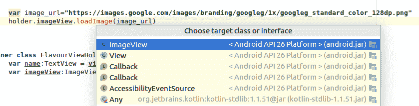

# 第五章：面向对象编程

本章将涵盖以下内容：

+   在 Kotlin 中使用接口

+   Kotlin 中如何实现具有多个重写方法复杂接口

+   Kotlin 中如何扩展类（继承和扩展函数）

+   Kotlin 中如何使用泛型

+   Kotlin 中如何实现多态

+   限制类层次结构

# 简介

**面向对象编程**，也称为**OOP**，是一种基于对象的编程范式。在这个编程范式中，对象以字段的形式包含数据，以方法的形式包含代码，这些代码可以用来修改同一对象的数据。在某些面向对象的语言中，对象是类的实例（例如 Java 和 Kotlin）。在面向对象编程中，我们的代码由相互交互的对象组成。在本章中，我们将学习 OOPs 的一些关键组件，例如接口、类、类层次结构和泛型。

# 在 Kotlin 中使用接口

**面向对象编程**中的**接口**就像**合同**。它们定义了行为或规则。实现它们的类需要这样做，以便符合接口定义的行为。然而，这还不是全部。Kotlin 中的接口提供了更多。在 Java 8 之前，我们无法在接口中实现方法，但在 Kotlin 中，我们也可以这样做！在这个菜谱中，我们将了解如何处理 Kotlin 中的接口。

# 准备工作

我将使用 IntelliJ IDEA 来编写和执行代码。你可以自由地使用任何可以运行 Kotlin 代码的 IDE。

# 如何做到这一点...

正如我们刚才讨论的，Kotlin 中的接口可以有方法实现；让我们按照以下步骤来验证这一点：

1.  让我们创建一个名为`DemoInterface`的接口：

```java
interface DemoInterface {

    fun implementatedMethod() {
        println("From demo interface")
    }
}
```

在接口中定义带有实现的方法就像在类内部做的那样。

1.  现在，让我们看看一个实现了前面接口的类：

```java
class IntefaceImplementation: DemoInterface
```

1.  然后，你可以这样调用方法：

```java
fun main(args: Array<String>) {
    var interfaceImplementation= IntefaceImplementation()
    interfaceImplementation.implementatedMethod()
}
```

这是输出结果：

```java
 From demo interface
```

1.  这种新型接口的一个关键好处是，你可以拥有多个接口的行为，因为它允许方法实现：

```java
fun main(args: Array<String>) {
    var interfaceImplementation= IntefaceImplementation()
    interfaceImplementation.foo()
    interfaceImplementation.bar()

}
interface A {

    fun foo() {
        println("foo from A")
    }
}
class IntefaceImplementation: A,B

interface B  {
    fun bar() {
        println("foo from B")
    }
}
```

如前所述的代码所示，使用多个接口，我们拥有了两个实体的行为。是的，这听起来可能像是多重继承。

1.  假设你有两种类型的接口，并且它们都有相同名称的方法，如下所示：

```java
interface A {
    fun foo() {
        println("foo from A")
    }
}
interface B  {
    fun foo() {
        println("foo from B")
    }
}
```

1.  现在，如果你尝试将两个接口都实现到一个类中，编译器将会抛出一个错误：

```java
Error:(24, 1) Kotlin: Class 'IntefaceImplementation' must override public open fun foo(): Unit defined in packageB.A because it inherits multiple interface methods of it
```

1.  原因是直观的，因为它带来了调用哪个方法的歧义。因此，Kotlin 将要求你实现该方法，并在其中调用所需的方法，类似于以下这样：

```java
class IntefaceImplementation: A,B {
    override fun foo() {
        super<A>.foo()
        super<B>.foo()
    }
}
```

1.  现在，你将简单地调用`foo`方法，就像之前一样：

```java
fun main(args: Array<String>) {
    var interfaceImplementation= IntefaceImplementation()
    interfaceImplementation.foo()
}
```

这是输出结果：

```java
foo from A
foo from B
```

Kotlin 中的接口可以有方法实现，但不能有状态。这意味着你无法在接口中声明一个属性并将其用于存储状态。要么实现它的类需要覆盖它，要么你需要实现它的访问器。

例如，你无法在接口中拥有`val a=23`这样的声明，尽管你可以有类似以下的内容：

```java
val a: Int
    get() = 2
```

或者，简单地定义它在接口中，并在实现类中覆盖它，如下所示：

```java
class InterfaceImplementation: A,B {
    override val a: Int=25}
```

接下来，我们将探讨 Kotlin 中的接口委托：

1.  委托模式，一个对象（[`en.wikipedia.org/wiki/Object_(computer_science)`](https://en.wikipedia.org/wiki/Object_(computer_science)))通过将请求委托给第二个对象来处理。让我们看看以下代码：

```java
fun main(args: Array<String>) {
    var interfaceImplementation= InterfaceImplementation(object :A{
    })
    interfaceImplementation.someMethod()
}
class InterfaceImplementation(var a:A){
    fun someMethod(){
        a.foo()
    }
}
interface A {
    fun foo() {
        println("foo from A")
    }
}
```

1.  在前面的例子中，我们将`foo`方法的调用委托给了实现了接口 A 的对象。虽然前面的代码是完美的，但 Kotlin 允许我们直接使用该函数。看看这段代码：

```java
class InterfaceImplementation(var a:A):A by a{
    fun someMethod(){
        foo()
    }
}
```

1.  如你所见，`InterfaceImplementation`类实现了`A`，但它将实现委托给接收到的作为参数的对象。

# 更多内容…

现在 Kotlin 支持在接口中实现方法，你可能会想，`interface`和`abstract`方法之间有什么区别。

在接口中，你只能定义需要由实现类覆盖的属性。然而，在抽象类中，你可以有一个与状态一起工作的实现，这样它就不能在派生类中被覆盖。在抽象类中，你可以定义一些在派生类中将相同的状态和方法。

另一个关键的区别是，你可以在抽象类中拥有最终成员，但不能在接口中。此外，接口不支持`protected`和`internal`修饰符。它只支持`private`。

# 如何在 Kotlin 中实现具有多个覆盖方法的复杂接口

**SOLID**是一个记忆法缩写，用于定义五个基本的**面向对象设计**原则：

+   单一职责原则

+   开放封闭原则

+   李斯克代换原则

+   接口分离原则

+   依赖倒置原则

**接口分离原则**（**ISP**）指出，如果一个接口变得太长，最好是将其拆分成更小的部分（接口），这样客户端就不需要实现他们不感兴趣的接口。在这个菜谱中，我们将了解为什么这是重要的。

# 准备工作

我们将使用 Android Studio 3.0。请确保你有其最新版本。

# 如何去做…

让我们看看 ISP 如何能帮到我们的一个例子：

1.  这是一个“胖”接口的简单例子：

```java
button.setOnClickListener(object : View.OnClickListener {
    fun onClick(View v) {
       *// TODO: do some stuff...*

    }

    fun onLongClick(View v) {
        *// we don't need it*
    }

    fun onTouch(View v, MotionEvent event) {
        *// we don't need it
*    } 
});
```

1.  如你所见，大接口的问题在于我们被迫实现方法，即使我们那里没有任何事情要做。

1.  一个简单的解决方案是将该接口拆分成更小的接口，如下面的代码所示：

```java
interface OnClickListener { 
    fun onClick( v:View )
} public interface OnLongClickListener { 
    fun onLongClick( v: View)
} interface OnTouchListener { 
    fun onTouch( v: View,  event: MotionEvent)
```

1.  注意，现在我们已经将一个大接口分解成更小的接口，这些接口可以独立实现。

1.  Kotlin 还有一个强大的功能，允许你在接口本身编写方法的完整实现。让我们看一下以下代码来理解它：

```java
fun main(args: Array<String>) {
    Simple().callMethod()
}
class Simple:A{
    fun callMethod(){
        bar()
    }
}
interface A{
    fun bar(){
        println("Printing from interface")
    }
}
```

1.  如您所见，我们在接口中实现了整个方法，并且能够从实现了该接口的类中调用它。

1.  此功能还可以用于遵循 ISP 原则，因为我们可以在接口本身放置一个常用方法；因此，我们不需要每次实现该接口时都实现它。

# 如何在 Kotlin 中扩展类（继承和扩展函数）

在这个菜谱中，我们将学习如何扩展类（继承）以及如何使用 Kotlin 的扩展函数扩展类的功能。

**继承**可能是你在面向对象编程中学习的第一个概念。它是一种机制，其中新类从现有类派生出来。通过这种方式，类可以继承或获取其他类的属性和方法。另一方面，**扩展函数**允许我们跳过创建功能包装器，并能够向类添加额外的函数。现在让我们看看这两个概念。

# 准备工作

由于我们将处理 Android 代码，建议您使用 Android Studio 作为 IDE。源代码可以在 [`gitlab.com/aanandshekharroy/kotlin-cookbook`](https://gitlab.com/aanandshekharroy/kotlin-cookbook) 仓库的 1-recycler-view-in-kotlin 分支中找到。

# 如何做……

从另一个类派生出来的类称为子类，而派生子类的类称为超类。在这个例子中，我们将创建一个超类 A 和一个子类 B。要扩展类 B，我们需要在类声明中使用 `:`，然后添加超类名称及其主构造函数。让我们看看以下步骤：

1.  需要记住的关键一点是，Kotlin 中的类默认是 *封闭* 的，不允许扩展，因此我们需要在类声明前添加 *open* 关键字来打开它们。所以我们的超类 A 看起来是这样的：

```java
open class A
```

1.  然后，我们可以按照以下方式扩展我们的类 B：

```java
class B:A()
```

1.  现在，假设我们的类 A 有一个接受 `String` 变量的主构造函数，如下所示：

```java
open class A(var str:String)
```

现在，如果我们想用 A 扩展 B，有两种方法可以实现：

+   在 B 的主构造函数中初始化 A。在这种方法中，我们将通过从 B 的主构造函数传递参数来初始化 A。考虑以下示例：

```java
class B(var randomString:String): A(randomString)
```

+   如果 B 或任何类没有主构造函数，那么扩展类的每个次级类都需要使用 `super` 关键字来初始化超类。考虑以下示例：

```java
class B: A{
    constructor(randomString:String) : super(randomString)
    constructor(randomString:String, randomInt:Int) : super(randomString)
```

1.  我们通常通过扩展一个类来导入超类的功能，有时我们可能还想覆盖它们以实现自己的版本。与类类似，方法默认也是封闭的，我们需要使用 open 修饰符来“打开”它们：

```java
open class A(var str:String){
    open fun foo(){
        println("foo from A")
    }
}
class B(var string: String): A(string) {
    override fun foo(){
        println("foo from B")
    }
}
```

1.  你也可以将一个方法标记为“final”，以防止任何其他子类覆盖它。考虑以下示例：

```java
open class A(var str:String){
    final fun foo(){
        println("foo from A")
    }
}
```

1.  如果你用一个抽象类扩展你的类，你需要实现抽象类中定义的所有抽象方法。请注意，你不需要将它们标记为公开，以便扩展类可以覆盖它们。将它们设置为抽象本身就完成了这项工作，如下例所示：

```java
class B(var string: String): C() {
    override fun methodC() {
        // Do something here
    }
}
abstract class C{
    abstract fun methodC()
    fun impl(){}
}
```

# 扩展函数

**扩展函数**很有用，因为它们允许我们扩展类的功能，而不必实际修改它。例如，如果你使用 Glide 或 Picasso 库在 `Imageview` 中放置图像，你一定熟悉以下代码：

```java
Glide.with(context).load(image_url).into(imageView)
```

我们可以使用扩展函数使这个看起来更好。让我们在 `imageView` 上调用 `loadImage(imageUrl)` 函数。如果你这样做，你会看到一个错误——未解析的引用- loadImage：


你还会看到两个建议，其中一个就是创建扩展函数：


如果你点击创建扩展函数，你会得到一些选择，就像这个截图所示：



点击 ImageView，因为我们想在它上面创建一个扩展函数。

当你点击它时，在同一文件中创建了一个扩展函数，看起来像这样：

```java
private fun ImageView.loadImage(image_url: String) {

}
```

在这里，我们可以放置我们的 Glide/Picasso 图像加载代码：

```java
private fun ImageView.loadImage(image_url: String) {
    Glide.with(context).load(image_url).into(this)
}
```

因此，即使 `loadImage` 函数不在 `ImageView` 类中，我们也能扩展它，并像这个函数是 `ImageView` 的一部分一样使用它，而且我们甚至不需要修改 `ImageView` 类。扩展函数从外部扩展了 `ImageView` 的功能。

# 它是如何工作的…

扩展函数的前缀（点号前的名称）被称为**接收器类型**，即被扩展的类型。这个接收器对象在函数内部使用 `this` 关键字访问。扩展函数是静态解析的；就像调用一个静态方法。由于这是一个静态方法，它不需要在类下定义，但由于它是静态方法，很难进行测试。例如，Mockito（一个测试框架）无法测试静态方法，所以为了产生高质量的代码，只有当该函数不需要任何测试时才使用扩展函数。

# 还有更多…

当你创建一个与成员函数名称相似的扩展函数时会发生什么？例如，在以下代码中，如果我们调用 `c.foo()`，会发生什么？

```java
fun main(args: Array<String>) {
    var c= C()
    c.foo()
}
class C{
    fun foo(){
        println("from member")
    }
}
private fun C.foo() {
    println("from extension")
}
```

这是我们的输出结果：

```java
 from member
```

因此，如果调用具有相同名称的扩展函数，成员函数将获胜。

# 如何在 Kotlin 中使用泛型

泛型方法和类帮助我们使用相同的方法或类来处理各种类型。这提高了代码的可重用性。在这个菜谱中，我们将了解泛型以及如何在 Kotlin 中使用它。Kotlin 中的泛型与 Java 中的泛型非常相似，但 Kotlin 中有额外的特殊关键字，这使得 Kotlin 中的泛型更加直观。让我们深入探讨。

# 准备工作

您需要安装一个首选的开发环境，该环境可以编译和运行 Kotlin。您也可以使用命令行，为此您需要安装 Kotlin 编译器和 JDK。我使用 IntelliJ IDE 来编译和运行我的 Kotlin 代码，以完成这个菜谱。

# 如何做到这一点...

现在，让我们按照以下步骤，通过一些示例来了解 Kotlin 中泛型的工作原理：

1.  让我们从可以接受任何类型参数的通用类开始：

```java
fun main(args: Array<String>) {
    val intgen: GenCl<Int> = GenCl<Int>(10)
    println(intgen.a)

    // We are letting Kotlin compiler infer type
    val strgen = GenCl("A string")
    println(strgen.a)
}

class GenCl<T>(t: T) {
    var a = t
}
```

该程序的输出如下：

```java
10
A string
```

1.  我们也可以像这样限制在通用类中允许的类型：

```java
fun main(args: Array<String>) {
    val intgen: GenCl<Int> = GenCl<Int>(10)
    println(intgen.a)

    val flgen = GenCl(1.0)
    println(flgen.a)
}

// Restricting T to only be of type Number
class GenCl<T: Number>(t: T) {
    var a = t
}
```

1.  如果我们尝试使用前面的类与不是 `Number` 类型的类型，例如 `String`，我们会得到以下错误：

```java
Error:(8, 17) Type parameter bound for T in constructor GenCl<T : Number>(t: T)
 is not satisfied: inferred type String is not a subtype of Number
```

1.  现在，让我们尝试一个泛型方法的示例：

```java
fun main(args: Array<String>) {
    fun <T> addTwo(a: List<T>) {
        for(x in a) {
            println(x)
        }
    }

    addTwo(listOf(10,20,30,40))
    addTwo(listOf("a","b","c","d","e"))
}
```

上述代码的输出将如下所示：

```java
10 
20 
30 
40 
a 
b 
c 
d 
e
```

# 还有更多...

Java 中的泛型类型是不变的，这意味着 `List<String>` 不是 `List<Object>` 的子类型。Java 有这样的设计，以便我们无法向包含 `String` 且类型为 `Object` 的 `List` 中添加，比如说，一个 `Float`。在 Kotlin 中，我们有一个更好的解决方案，即使用通配符参数 `? extends E`，它表示该方法接受 E 的子类型或 E 的集合，而不仅仅是 E 本身。这使我们能够从 E 的集合中读取，但不能写入，因为我们不知道可以接受哪些项。这使得 Kotlin 具有协变性。

# 如何在 Kotlin 中实现多态

**多态**是对象根据情况采取多种形式的能力。Kotlin 支持两种类型的多态：**编译时多态**和**运行时多态**。在这个菜谱中，我们将尝试两者。让我们开始吧。

# 准备工作

您需要安装一个首选的开发环境，该环境可以编译和运行 Kotlin。您也可以使用命令行，为此您需要安装 Kotlin 编译器和 JDK。我使用 IntelliJ IDE 来编译和运行我的 Kotlin 代码，以完成这个菜谱。

# 如何做到这一点...

在以下步骤中，我们将学习如何在 Kotlin 中使用多态：

1.  让我们从编译时多态开始。在**编译时多态**中，函数名，即签名保持不变，但参数或返回类型不同。在编译时，编译器根据参数类型等确定我们试图调用的函数。查看以下示例：

```java
fun main(args: Array<String>) {
    println(doubleOf(4))

    println(doubleOf(4.3))

    println(doubleOf(4.323))
}

fun doubleOf(a: Int): Int {
    return 2*a
}

fun doubleOf(a: Float): Float {
    return 2*a
}

fun doubleOf(a: Double): Double {
    return 2.00*a
}
```

这是上述代码的输出：

```java
8
8.6
8.646
```

1.  现在，让我们谈谈运行时多态。在**运行时多态**中，编译器在运行时解析对重写/重载方法的调用。我们可以通过方法重写来实现运行时多态。让我们尝试一个扩展超类并重写其成员方法的示例：

```java
fun main(args: Array<String>) {
    var a = Sup()
    a.method1()
    a.method2()

    var b = Sum()
    b.method1()
    b.method2()
}

open class Sup {
    open fun method1() {
        println("Printing method 1 from inside Sup")
    }

    fun method2() {
        println("Printing method 2 from inside Sup")
    }
}

class Sum: Sup() {
    override fun method1() {
        println("Printing method 1 from inside Sum")
    }
}
```

上述代码的输出如下：

```java
Printing method 1 from inside Sup
Printing method 2 from inside Sup
Printing method 1 from inside Sum
Printing method 2 from inside Sup
```

在这里，编译器在运行时确定要执行哪个方法。

# 限制类层次结构

在本食谱中，我们将学习如何在 Kotlin 中限制类层次结构。在我们继续之前，让我们了解为什么这是一个值得花费时间的原因。

# 准备工作

我将使用 Android Studio 来运行本食谱中描述的代码。

# 如何做到这一点...

当我们确定一个值或类只能具有有限的一组类型或子类数量时，那就是我们尝试限制类层次结构的时候。是的，这听起来可能像枚举类，但实际上，它远不止于此。枚举常量仅作为单个实例存在，而密封类的子类可以有多个实例，这些实例可以包含状态。让我们看看以下步骤中的示例：

1.  我们将创建一个名为`ToastOperation`的**密封**类。在同一个源文件中，我们将定义一个`ShowMessageToast`子类：

```java
class ShowMessageToast(val message:String):ToastOperation()
```

1.  此外，我们将定义一个`ShowErrorToast`对象：

```java
object ShowErrorToast:ToastOperation()
```

1.  如您所注意到的，我定义了一个**对象**而不是完整的类声明，因为`ShowErrorToast`**对象**没有任何状态。此外，通过这样做，我们已从`when`块中移除了`is`，因为只有一个实例。

现在，我们可以在`when`语句中使用它，如下所示：

```java
fun doToastOperation(toastOperation: ToastOperation){
    when(toastOperation){
        is ShowMessageToast ->Toast.makeText(this,toastOperation.message,Toast.LENGTH_LONG).show()
        ShowErrorToast->Toast.makeText(this,"Error.. Grr!",Toast.LENGTH_LONG).show()
    }
}
```

1.  关键好处是，我们不需要实现`else`块，当其他语句不符合要求时，它充当默认块。

根据文档，一个**密封**类可以有子类，但所有这些子类都必须与密封类本身在同一个文件中声明。然而，子类的子类不需要在同一个文件中定义。它本身是抽象的，您不能从它实例化对象。

这是我们的密封类结构：

```java
sealed class ToastOperation {
}
object ShowErrorToast:ToastOperation()
class ShowMessageToast(val message:String):ToastOperation()
```

如您所见，我们将所有子类都放在定义了密封类的同一个源文件中。

# 它是如何工作的...

在前面的示例中，我们确信我们只能有两种类型的吐司：错误吐司和自定义消息的吐司。因此，我们创建了一个**密封**类`ToastOperation`，并创建了`ToastOperation`的两个子类。请注意，如果我们不确定子类的类型，我们不会使用**密封**类；在这种情况下，**枚举**类可能更适合。

# 还有更多...

如果您使用的是 Kotlin 1.1 之前的版本，您需要在密封类内部实现子类，就像这样：

```java
sealed class ToastOperation {
    object ShowErrorToast:ToastOperation()
    class ShowMessageToast(val message:String):ToastOperation()
}
```

注意，您也可以在新版本的 Kotlin 中使用前面提到的方法。
