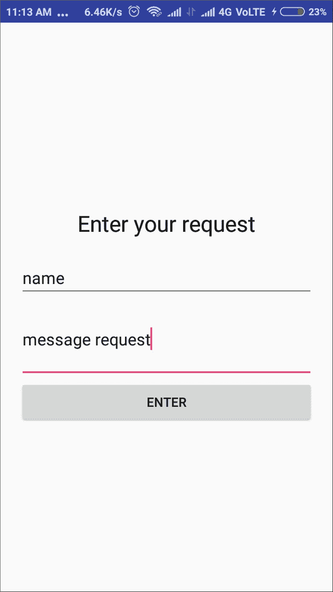
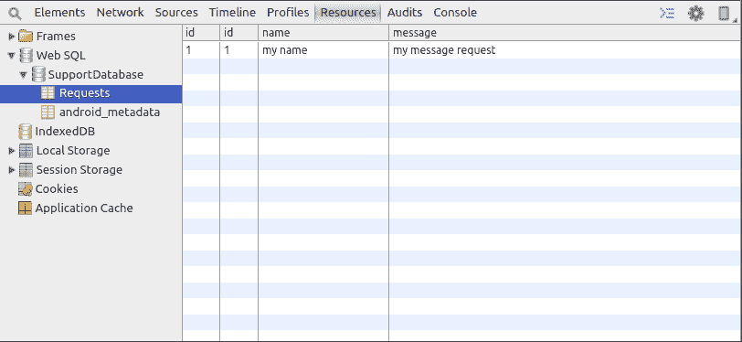
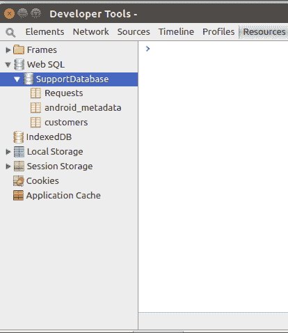
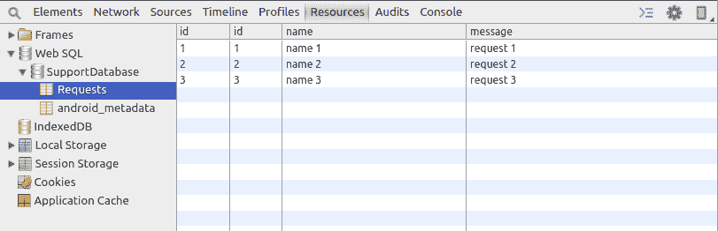
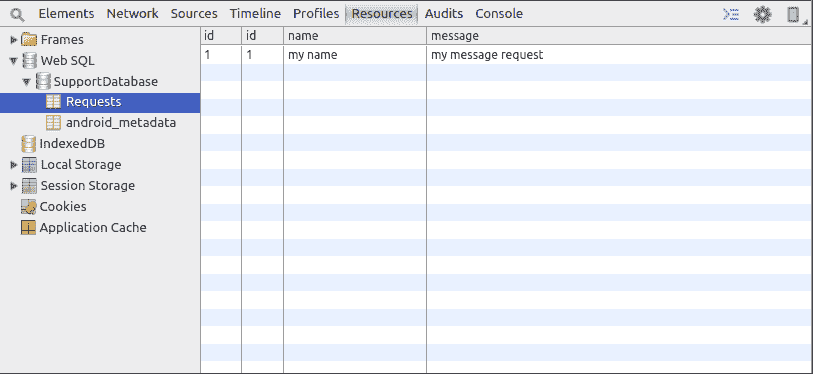

# 数据库和依赖注入

本章将涵盖以下内容：

+   在 Kotlin 中使用 SQLite 数据库

+   创建数据库表

+   在 Kotlin 中注入依赖

+   从数据库读取数据

+   将数据库游标转换为对象列表

+   使用 parseOpt 处理可空对象

+   向数据库中插入数据

+   在 Kotlin 中创建单例

+   在 Kotlin 中使用 Dagger2

+   在 Kotlin 中使用 Butterknife

# 简介

当我们开发应用程序时，我们应该考虑到应用程序可能无法连接到互联网的情况。用户可能在电梯里，或者在他们尝试使用应用程序时可能没有网络覆盖。为了提供良好的用户体验，我们需要确保应用程序的一些部分在没有网络连接的情况下也能工作。为了能够做到这一点，我们需要在应用程序中有一个持久存储机制。这可以通过使用共享首选项或使用数据库来实现。当我们需要存储少量数据，如应用程序的设置值时，共享首选项会很有用。数据库在需要存储结构化数据的情况下功能更强大。在本章中，我们将学习如何使用 Android 内置的数据库 SQLite，还将学习使用 Dagger2 进行依赖注入，这被认为是开发优质应用程序的最佳实践之一。

# 在 Kotlin 中使用 SQLite 数据库

SQLite 是一个关系型数据库。Android 自带内置的 SQLite 数据库。它是一个开源的 SQL 数据库，在 Android 应用程序中得到广泛应用。然而，以原始方式操作非常耗时，消耗了大量的开发和测试时间。你必须与游标一起工作，逐行迭代它们，并将代码包裹在`try-finally`中，等等。当然，你可以使用提供 ORM 映射的库，这使得处理 SQLite 数据库更容易，但如果数据库很小，这很昂贵，并且通常是过度设计。Kotlin，结合 Anko，提供了一个处理 SQLite 数据库的简单方法。那么，让我们开始工作，看看我们如何在 Kotlin 中使用 SQLite 数据库。

# 准备工作

我们将使用 Android Studio 3.0 进行编码。首先，我们需要将`anko-sqlite`添加到我们的`build.gradle`文件中：

```kt
dependencies {
    compile "org.jetbrains.anko:anko-sqlite:$anko_version"
}
```

您可以将`$anko_version`替换为库的最新版本。

# 如何实现...

Anko 为我们内置的 SQLite API 提供了一个包装器，这有助于消除大量的样板代码，并增加了诸如在代码执行完成后关闭数据库等安全机制。

在实现 SQLite 数据库时，第一步是创建数据库辅助类。在这种情况下，我们需要这个类扩展`ManagedSQLiteOpenHelper`类，而不是我们之前使用的`SQLiteOpenHelper`类。`ManagedSQLiteOpenHelper`是并发感知的，并在查询执行结束时关闭数据库。

查看以下代码，这是一个简单的数据库辅助工具，我将在示例中使用它：

```kt
class DatabaseHelper(ctx: Context) : ManagedSQLiteOpenHelper(ctx, "SupportDatabase", null, 1) {
    companion object {
        private var instance: DatabaseHelper? = null

        @Synchronized
        fun getInstance(context: Context): DatabaseHelper {
            if (instance == null) {
                instance = DatabaseHelper(context.applicationContext)
            }
            return instance!!
        }
    }

    override fun onCreate(db: SQLiteDatabase) {
        db.createTable("Requests", true,
                "id" to INTEGER + PRIMARY_KEY + UNIQUE,
                "name" to TEXT,
                "message" to TEXT)
    }

    override fun onUpgrade(db: SQLiteDatabase, oldVersion: Int, newVersion: Int) {
        db.dropTable("Requests", true)
    }
}
```

所以基本上，在`onCreate`中，我们创建表，在`onUpgrade`中，我们升级表。

我在我的数据库中创建了一个单独的表，名为`Requests`。在`Requests`表中，我们拥有`name`、`message`和`id`字段作为主键。

我们可以通过将其添加为上下文的扩展属性来提供对数据库的访问。这允许任何需要上下文的类访问数据库。以下代码将数据库添加为上下文的扩展属性：

```kt
// Access property for Context
val Context.database: DatabaseHelper
    get() = DatabaseHelper.getInstance(getApplicationContext())
```

我将前面的代码添加到了与数据库助手相同的文件中，在类外部。

现在，这是我的活动代码，其中包含姓名和消息字段，在按下 Enter 按钮时，详细信息将存储在数据库中：

```kt
class MainActivity : AppCompatActivity() {

    override fun onCreate(savedInstanceState: Bundle?) {
        super.onCreate(savedInstanceState)
        MainActivityUI().setContentView(this)
        btn_send.onClick {
 database.use {
 insert("Requests",
 "id" to 1,
 "name" to name.text.toString(),
 "message" to message.text.toString())
 }
 }
    }

    class MainActivityUI : AnkoComponent<MainActivity> {
        override fun createView(ui: AnkoContext<MainActivity>) = with(ui) {
            verticalLayout {
                gravity = Gravity.CENTER
                padding = dip(20)

                textView {
                    gravity = Gravity.CENTER
                    text = "Enter your request"
                    textColor = Color.BLACK
                    textSize = 24f
                }.lparams(width = matchParent) {
                    margin = dip(20)
                }

                val name = editText {
                    id = R.id.name
                    hint = "What is your name?"
                }

                editText {
                    id = R.id.message
                    hint = "What is your message?"
                    lines = 3
                }

                button("Enter") {
                    id = R.id.btn_send
                }
            }
        }
    }
}
```

注意粗体代码。基本上，我们可以在 use 块内部对数据库执行操作。数据库将在 use 块开始时打开，并在执行后关闭。

以下是我们布局的截图：



现在尝试将一些内容放入数据库。下面是我的数据库截图，插入操作已成功执行：



我正在使用 Stetho ([`github.com/facebook/stetho`](https://github.com/facebook/stetho))在 Chrome 开发者工具中查看数据库。

对于活动的布局，我使用了 Anko DSL 布局。您可以参考本书的[第九章](https://www.safaribooksonline.com/library/view/kotlin-programming-cookbook/9781788472142/52df376c-f81c-4fee-b607-3c954d405230.xhtml)，*Anko Layouts*，以了解更多信息。

# 创建数据库表

现在您已经学会了如何将 anko-sqlite 依赖项添加到您的项目中，以及如何在第一个菜谱中使用 SQLite 数据库，下一步是学习如何创建数据库表。

# 准备工作

我们将使用 Android Studio 3 进行编码。确保您已将 anko-sqlite 添加到您的`build.gradle`文件中，并完成了关于如何使用 SQLite 数据库的第一个菜谱。

# 如何操作…

我们将创建两个表：`Requests`和`customers`：

1.  对于`Requests`表，我们有`name`和`message`字段，我们可以在数据库助手的`onCreate`方法中直接创建它们，如下所示：

```kt
db.createTable("Requests", true,
    "id" to INTEGER + PRIMARY_KEY + UNIQUE,
    "name" to TEXT,
    "message" to TEXT)
```

1.  对于`customers`表，我们将通过创建数据类并使用它来定义`customers`表的列来采用更好的编码实践。

    这里提供了我们的`Customer`数据类的代码：

```kt
data class Customer(val id: Int, val name: String, val phone_num: String) {
    companion object {
        val COLUMN_ID = "id"
        val TABLE_NAME = "customers"
        val COLUMN_NAME = "name"
        val COLUMN_PHONE_NUM = "phone_num"
    }
}
```

1.  现在，我们将使用这个数据类来创建我们的表，如下所示：

```kt
db.createTable(Customer.TABLE_NAME,
        true,
        Customer.COLUMN_ID to INTEGER + PRIMARY_KEY,
        Customer.COLUMN_NAME to TEXT,
        Customer.COLUMN_PHONE_NUM to TEXT)
```

1.  以下是在为 drop tables 填充代码后，我们的数据库助手最终的样子：

```kt
class DatabaseHelper(ctx: Context) : ManagedSQLiteOpenHelper(ctx, "SupportDatabase", null, 1) {
    companion object {
        private var instance: DatabaseHelper? = null

        @Synchronized
        fun getInstance(context: Context): DatabaseHelper {
            if (instance == null) {
                instance = DatabaseHelper(context.applicationContext)
            }
            return instance!!
        }
    }

    override fun onCreate(db: SQLiteDatabase) {
        db.createTable("Requests", true,
 "id" to INTEGER + PRIMARY_KEY + UNIQUE,
 "name" to TEXT,
 "message" to TEXT)

 db.createTable(Customer.TABLE_NAME,
 true,
 Customer.COLUMN_ID to INTEGER + PRIMARY_KEY,
 Customer.COLUMN_NAME to TEXT,
 Customer.COLUMN_PHONE_NUM to TEXT)
    }

    override fun onUpgrade(db: SQLiteDatabase, oldVersion: Int, newVersion: Int) {
        db.dropTable("Requests", true)
        db.dropTable(Customer.TABLE_NAME, true)
    }
}

// Access property for Context
val Context.database: DatabaseHelper
    get() = DatabaseHelper.getInstance(getApplicationContext())
```

1.  现在，让我们重新安装我们的应用程序，看看是否在我们的数据库中形成了两个表。以下是我们数据库截图的样式（使用 Stetho），并且我们的表已成功创建：



# Kotlin 中的依赖注入

在 Android 开发中，Dagger 2 是最受欢迎的依赖注入框架。你定义依赖对象，然后借助 Dagger 组件，将其注入到你想要的位置。在本食谱中，我们将了解如何注入依赖。我们不会深入探讨如何详细使用 Dagger 2；关于这一点，你可以参考本章中的“使用 Kotlin 与 Dagger2”食谱。

# 准备工作

我们将使用 Android Studio 3.0 进行本食谱。请确保你有其最新版本。

# 如何做…

当你在模块类中定义了所有需要的依赖对象后，你可以获取组件。让我们看看以下步骤：

1.  要注入对象，你只需在变量前添加`@Inject`注解，然后对象就会被注入到那里。让我们看看以下示例：

```kt
@Inject
lateinit var mPresenter:AddActivityMvpPresenter
```

我们还使用了`lateinit`修饰符来避免在使用变量之前进行空检查。

1.  另一种方法是构造函数注入。为了理解它，让我们看看以下代码：

```kt
@Module
class AddActivityModule {
  @Provides @ControllerScope
  fun providesAddActivityPresenter(addActivityPresenter: AddActivityPresenter):AddActivityMvpPresenter =addActivityPresenter
}
```

1.  如你所见，我们在`providesAddActivityPresenter`中发送了`AddActivityPresenter`，但模块没有提供它。除非你按照以下方式提供`AddActivityPresnter`，否则这通常不会起作用：

```kt
class AddActivityPresenter @Inject constructor(var mDataManager:DataManager):AddActivityMvpPresenter
```

# 它是如何工作的…

当你在构造函数中使用`@Inject`注解时，这意味着在创建类之前，它需要`DataManager`对象。Dagger2 将检查依赖树，并在可能的情况下提供依赖。

# 从数据库读取数据

现在我们已经看到了如何创建数据库和如何创建表，让我们学习如何从数据库中读取。

# 准备工作

我将使用 Android Studio 3 来编写代码。你可以通过将 anko-sqlite 依赖项添加到你的项目中，并通过实现本章中的“使用 Kotlin 与 SQLite 数据库”食谱来创建一个包含`Requests`表的 SQLite 数据库来开始。通过使用本食谱中创建的表单，向你的`Requests`表添加一些数据。

# 如何做…

让我们看看以下步骤，以了解如何从数据库中读取数据：

1.  现在，让我们将一个按钮添加到第一个食谱中现有的布局中；点击时，它应该从我们的`Requests`表中检索所有数据。查看以下更新后的代码，其中我添加了一个带有点击监听器的按钮：

```kt
class MainActivity : AppCompatActivity() {

    override fun onCreate(savedInstanceState: Bundle?) {
        super.onCreate(savedInstanceState)
        MainActivityUI().setContentView(this)
        val btn_send = find<Button>(R.id.btn_send)
        btn_send.onClick {
            database.use {
                insert("Requests",
                        "name" to name.text.toString(),
                        "message" to message.text.toString())
            }
            toast("success")
            name.text.clear()
            message.text.clear()
        }
        val btn_read = find<Button>(R.id.btn_read)
        btn_read.onClick {
            var reqs = database.use {
                select("Requests").parseList(classParser<Request>())
 }
            for(x in reqs) {
 logd(x.name + ": " + x.message)
 }
        }
    }

    private fun logd(s: String) {
        Log.d("request", s)
    }

    class MainActivityUI : AnkoComponent<MainActivity> {
        override fun createView(ui: AnkoContext<MainActivity>) = with(ui) {
            verticalLayout {
                padding = dip(20)

                textView {
                    gravity = Gravity.CENTER
                    text = "Enter your request"
                    textColor = Color.BLACK
                    textSize = 24f
                }.lparams(width = matchParent) {
                    margin = dip(20)
                }

                val name = editText {
                    id = R.id.name
                    hint = "What is your name?"
                }

                editText {
                    id = R.id.message
                    hint = "What is your message?"
                    lines = 3
                }

                button("Enter") {
                    id = R.id.btn_send
                }

                button("Show me requests") {
                    id = R.id.btn_read
                }
            }
        }
    }

    class Request(val id: Int, val name: String, val message: String)

}
```

1.  我正在使用 Anko DSL 来创建我的活动的布局。正如我们在之前的食谱中讨论的那样，我们在`database.use{...}`块内执行所有数据库操作。要从数据库中读取数据，我们使用`select`函数。语法如下：

```kt
db.select(tableName, vararg columns) // where db is an instance of the SQLiteDatabase
```

1.  在`database.use {...}`内部，`this`是数据库实例，因此我们可以直接使用`select`和`insert`等方法。以下是在数据库表中的数据和输出：

这是数据：



这是输出：

```kt
11-18 18:21:34.709 12523-12523/android.my_company.com.helloworldapp D/request: name 1: request 1
11-18 18:21:34.709 12523-12523/android.my_company.com.helloworldapp D/request: name 2: request 2
11-18 18:21:34.709 12523-12523/android.my_company.com.helloworldapp D/request: name 3 : request 3
```

1.  查询构建器还有很多我们可以做的事情；以下是 Anko 提供的方法列表：

    +   `column(String)`: 用于将列添加到我们的 `select` 查询中

    +   `distinct(Boolean)`: 用于在查询中添加 distinct

    +   `whereArgs(String)`: 用于指定原始 `where` 字符串

    +   `whereArgs(String, args)`: 用于指定 `where` 查询及其对应的参数

    +   `whereSimple(String, args)`: 用于指定带有 `?` 标记的 `where` 查询及其对应的参数

    +   `orderBy(String, [ASC/DESC])`：用于指定用于排序的列

    +   `groupBy(String)`: 用于指定用于分组的列

    +   `limit(count: Int)`: 用于限制查询返回的行数

    +   `limit(offset: Int, count: Int)`: 用于在 `offset` 之后限制查询返回的行数

    +   `having(String)`: 用于指定原始 `having` 表达式

    +   `having(String, args)`: 用于指定带有参数的原始 `having` 表达式

1.  让我们尝试另一个例子。在这个例子中，我们将使用 `where` 子句从数据库中选择数据：

```kt
select("Requests")
    .whereArgs("(id > {userId})",
        "userId" to 1)
```

这是上一个查询的输出：

```kt
11-18 21:11:04.328 18149-18149/android.my_company.com.helloworldapp D/request: name 2: request 2
11-18 21:11:04.329 18149-18149/android.my_company.com.helloworldapp D/request: name 3 : request 3
```

1.  在获取查询结果后，我们还需要解析结果。我们从查询中获取一个游标，并使用 Anko 提供的方法，我们可以轻松地将它们解析到常规类中。在上一个例子中，我们创建了一个名为 `Request` 的类：

```kt
class Request(val id: Int, val name: String, val message: String)
```

1.  该类包含我们可能从查询结果游标中获取的所有字段。以下是我们用于解析结果的方法：

    +   `parseSingle(rowParser): T`：解析正好且仅一行；如果游标中有多于一行，则抛出异常

    +   `parseOpt(rowParser): T?`：解析零行或一行，但如果游标中有多于一行，则抛出异常

    +   `parseList(rowParser): List<T>`：解析零行或多行

我们在上一个例子中使用了 `parseList`。你可以传递行解析器或映射解析器，你也可以使用你自定义类的 `classParser`，它传递一个行解析器，如下所示：

```kt
val rowParser = classParser<Person>()
```

# 将数据库游标转换为对象列表

在上一个菜谱中，我们学习了如何从数据库表中查询数据。查询的结果是一个游标。在这个菜谱中，我们将学习如何使用 `parseList` 将游标转换为对象的列表。

# 准备工作

我将使用 Android Studio 3 来编写代码。你可以通过向项目中添加 anko-sqlite 依赖项并创建一个类似于我们在 *在 Kotlin 中使用 SQLite 数据库* 菜谱中做的数据库辅助类来开始。

# 如何做到这一点...

按照以下步骤将游标转换为对象列表：

1.  让我们从创建一个 `Customer` 类开始，作为我们的 `customers` 表的模型：

```kt
data class Customer(val id: Int, val name: String, val phone_num: String) {
    companion object {
        val COLUMN_ID = "id"
        val TABLE_NAME = "customers"
        val COLUMN_NAME = "name"
        val COLUMN_PHONE_NUM = "phone_num"
    }
}
```

1.  现在，我们将编写代码在数据库辅助类中创建 `customers` 表。查看以下代码：

```kt
class DatabaseHelper(ctx: Context) : ManagedSQLiteOpenHelper(ctx, "SupportDatabase", null, 1) {
    companion object {
        private var instance: DatabaseHelper? = null

        @Synchronized
        fun getInstance(context: Context): DatabaseHelper {
            if (instance == null) {
                instance = DatabaseHelper(context.applicationContext)
            }
            return instance!!
        }
    }

    override fun onCreate(db: SQLiteDatabase) {
        db.createTable(Customer.TABLE_NAME,
                true,
                Customer.COLUMN_ID to INTEGER + PRIMARY_KEY,
                Customer.COLUMN_NAME to TEXT,
                Customer.COLUMN_PHONE_NUM to TEXT)
    }

    override fun onUpgrade(db: SQLiteDatabase, oldVersion: Int, newVersion: Int) {
        db.dropTable(Customer.TABLE_NAME, true)
    }
}

// Access property for Context
val Context.database: DatabaseHelper
    get() = DatabaseHelper.getInstance(getApplicationContext())
```

1.  现在，我们将创建一个表单来输入客户，并使用`select`函数显示数据库表中的所有客户。我们将使用`parseList`方法获取结果游标中的行作为`List`。我们需要在`parseList`方法中传递一个行解析器或映射解析器。这样做最简单的方法是使用 Anko 提供的`classParser`，并使用我们的`Customer`类构造函数来获取行解析器，如下所示：

```kt
var customers = database.use {
    select(Customer.TABLE_NAME)
    .parseList(classParser<Customer>())
}
```

我建议你在查看解决方案之前先自己尝试这个练习。

下面是我的包含 DSL 布局的活动版本：

```kt
class MainActivity : AppCompatActivity() {

    override fun onCreate(savedInstanceState: Bundle?) {
        super.onCreate(savedInstanceState)
        MainActivityUI().setContentView(this)
        val name = find<EditText>(R.id.name)
        val phone = find<EditText>(R.id.phone)
        btn_send.onClick {
            database.use {
                insert(Customer.TABLE_NAME,
                        Customer.COLUMN_NAME to name.text.toString(),
                        Customer.COLUMN_PHONE_NUM to phone.text.toString())
            }
            toast("success")
            name.text.clear()
            phone.text.clear()
        }
        val btn_read = find<Button>(R.id.btn_read)
        btn_read.onClick {
            var customers = database.use {
                select(Customer.TABLE_NAME)
                        .parseList(classParser<Customer>())
 }
            // customers is the list of objects which we can now iterate on to get individual values as objects of Customer class
            for(c in customers) {
 debug(c.name + " (" + c.phone_num + ")")
 }
        }
    }

    private fun debug(s: String) {
        Log.d("customer", s)
    }

    class MainActivityUI : AnkoComponent<MainActivity> {
        override fun createView(ui: AnkoContext<MainActivity>) = with(ui) {
            verticalLayout {
                padding = dip(20)

                textView {
                    gravity = Gravity.CENTER
                    text = "Enter the customer"
                    textColor = Color.BLACK
                    textSize = 24f
                }.lparams(width = matchParent) {
                    margin = dip(20)
                }

                val name = editText {
                    id = R.id.name
                    hint = "Name"
                }

                editText {
                    id = R.id.phone
                    hint = "Phone no."
                }

                button("Enter") {
                    id = R.id.btn_send
                }

                button("Show me customers") {
                    id = R.id.btn_read
                }

                button("Delete all customers") {
                    id = R.id.btn_delete
                }
            }
        }
    }
}
```

查询结果，即`customers`，是我们现在可以迭代的对象列表，以获取`Customer`类的单个行对象。

# 使用`parseOpt`处理可空对象

当我们在游标中获取多行时，我们使用`parseList`，但当只获取一行时，我们使用`parseSingle`或`parseOpt`。然而，`parseSingle`和`parseOpt`之间有什么区别呢？在本教程中，我们将了解两者的区别以及何时使用哪一个。

# 准备工作

我将使用 Android Studio 3 来编写代码。你可以通过将`anko-sqlite`依赖项添加到你的项目中并创建一个数据库助手来开始，就像我们在`*在 Kotlin 中使用 SQLite 数据库*`教程中所做的那样。你需要阅读并实现上一个教程，以便能够跟随本教程。

# 如何操作…

如果你已经阅读并实现了上一个教程，那么你数据库中必须已经有一个`customers`表。按照提到的步骤来了解`parseSingle`和`parseOpt`之间的区别：

1.  在上一个教程中，我们使用`parseList`获取行列表作为对象。如果我们只需要获取一行作为对象，那么我们需要使用`parseSingle`。以下为`parseSingle`的语法：

```kt
parseSingle(rowParser): T
```

1.  现在我们以以下方式在我们的前一个代码中使用它：

```kt
btn_read.onClick {
    var c = database.use {
        select(Customer.TABLE_NAME)
            .whereArgs("(id = {userId})",
            "userId" to 1)
 .parseSingle(classParser<Customer>())
    }
    debug(c.name + " (" + c.phone_num + ")")
}
```

1.  我们使用`parseSingle`是因为我们将在游标中只得到一行，但如果从游标中获取零行，即我们得到一个空游标，那么我们会得到一个异常：

```kt
android.database.sqlite.SQLiteException: parseSingle accepts only cursors with a single entry
```

然而，如果我们期望得到一个单行游标，但有可能得到一个空游标，会发生什么？它总是会抛出异常，即当我们使用`parseOpt`时；`parseOpt`接受零行或一行游标。此外，如果`parseOpt`得到一个 null 对象，它会相应地处理场景，为每个列提供`null`值。基本上，`parseOpt`用于可能为空的游标和可能为`null`的对象。

`parseOpt`的语法如下：

`parseOpt(rowParser): T?` // `?`表示返回的对象可能是可空的。

下面是如何在我们的代码中使用它的示例：

```kt
btn_read.onClick {
    var c = database.use {
        select(Customer.TABLE_NAME)
            .whereArgs("(id = {userId})",
            "userId" to 1)
 .parseOpt(classParser<Customer>())
    }
    debug(c?.name + " (" + c?.phone_num + ")")
}
```

现在即使返回的游标为空，我们也不会得到异常，并且输出为`null`值。

如果表为空，则输出如下：

```kt
11-18 21:11:04.329 18149-18149/android.my_company.com.helloworldapp D/customer: null (null)
```

# 将数据插入数据库

使用 Anko SQLite 将数据插入数据库就像做蛋糕一样简单。在本教程中，我们将学习如何做到这一点。

# 准备工作

我将使用 Android Studio 3 来编写代码。你可以通过在你的`build.gradle`文件中添加以下行来将`anko-sqlite`依赖项添加到你的项目中开始：

```kt
dependencies {
    compile "org.jetbrains.anko:anko-sqlite:$anko_version"
}
```

你可以将`$anko_version`替换为库的最新版本。

# 如何做到这一点...

按照以下步骤将数据插入我们的数据库：

1.  让我们从我们的数据库助手开始，我们将创建一个包含`name`、`message`和`id`字段的`Requests`表，如下所示：

```kt
class DatabaseHelper(ctx: Context) : ManagedSQLiteOpenHelper(ctx, "SupportDatabase", null, 1) {
    companion object {
        private var instance: DatabaseHelper? = null

        @Synchronized
        fun getInstance(context: Context): DatabaseHelper {
            if (instance == null) {
                instance = DatabaseHelper(context.applicationContext)
            }
            return instance!!
        }
    }

    override fun onCreate(db: SQLiteDatabase) {
        db.createTable("Requests", true,
                "id" to INTEGER + PRIMARY_KEY + UNIQUE + AUTOINCREMENT,
                "name" to TEXT,
                "message" to TEXT)
    }

    override fun onUpgrade(db: SQLiteDatabase, oldVersion: Int, newVersion: Int) {
        db.dropTable("Requests", true)
    }
}

// Access property for Context
val Context.database: DatabaseHelper
    get() = DatabaseHelper.getInstance(getApplicationContext())
```

1.  现在，让我们创建一个活动，其中包含一个表单，用于接收姓名和消息并将其存储在数据库中。我正在使用 Anko DSL 布局来布局活动：

```kt
class MainActivity : AppCompatActivity() {

    override fun onCreate(savedInstanceState: Bundle?) {
        super.onCreate(savedInstanceState)
        MainActivityUI().setContentView(this)
        btn_send.onClick {
            database.use {
 insert("Requests",
 "name" to name.text.toString(),
 "message" to message.text.toString())
 }
            toast("success")
            name.text.clear()
            message.text.clear()
        }
    }

    class MainActivityUI : AnkoComponent<MainActivity> {
        override fun createView(ui: AnkoContext<MainActivity>) = with(ui) {
            verticalLayout {
                padding = dip(20)

                textView {
                    gravity = Gravity.CENTER
                    text = "Enter your request"
                    textColor = Color.BLACK
                    textSize = 24f
                }.lparams(width = matchParent) {
                    margin = dip(20)
                }

                val name = editText {
                    id = R.id.name
                    hint = "What is your name?"
                }

                editText {
                    id = R.id.message
                    hint = "What is your message?"
                    lines = 3
                }

                button("Enter") {
                    id = R.id.btn_send
                }
            }
        }
    }
}
```

1.  注意前面代码片段中加粗的代码。我们将在`database.use {...}`块内执行所有操作，因为它具有并发安全性，并且在块执行后关闭数据库。如果你已经完成了*创建数据库表*的食谱，你会注意到表创建和插入相当相似。语法如下：

```kt
db.insert(TABLE_NAME, 
    COLUMN_NAME_1 to VALUE_1,
    COLUMN_NAME_2 to VALUE_2,
    COLUMN_NAME_3 to VALUE_3
)
```

这是我们的布局：


在输入数据时，我们可以检查我们的姓名和消息是否被存储在我们的数据库中。我正在使用 Stetho 在我的设备上查看数据库。



# 在 Kotlin 中创建单例

单例类是一个类，在任意时刻只能有一个该类的实例/对象。这个概念是为了限制对象的实例化数量。在本食谱中，我们将探索 Kotlin 中的单例。

# 准备工作

我将使用 Android Studio 3 来编写代码。

# 如何做到这一点...

按照以下步骤在 Kotlin 中创建单例：

1.  Kotlin 没有静态成员或变量，因此为了声明类的静态成员，我们使用`companion object`。查看以下示例：

```kt
class SomeClass {

    companion object {
        var intro = "I am some class. Pleased to meet you!"
        fun infoIntro(): String {
            return "I am some class. Pleased to meet you!"
        }
    }
}
```

1.  访问前一个类的`companion`对象的成员和方法与访问任何静态成员或方法相同：

```kt
var x = SomeClass.intro
toast(SomeClass.infoIntro())
```

1.  现在假设我们想要一个单例类，即每次只有一个对象/实例的类？做好准备，这个很有趣。以下是在几行代码内创建单例类的方法：

```kt
object SomeClass {

    var intro = "I am some class. Pleased to meet you!"
    fun infoIntro(): String {
        return "I am some class. Pleased to meet you!"
    }
}
```

此外，我们就像在前面示例中使用静态成员一样使用它：

```kt
var x = SomeClass.intro
toast(SomeClass.infoIntro())
```

# 它是如何工作的...

在 Kotlin 中，反编译字节码是了解幕后发生的事情的绝佳方法。如果我们反编译我们创建的对象的字节码，我们会得到以下代码，这表明在幕后，对象只是一个每次只有一个实例的类：

```kt
public final class SomeClass {
   @NotNull
   private static String intro;
   public static final SomeClass INSTANCE;

   @NotNull
   public final String getIntro() {
      return intro;
   }

   public final void setIntro(@NotNull String var1) {
      Intrinsics.checkParameterIsNotNull(var1, "<set-?>");
      intro = var1;
   }

   @NotNull
   public final String infoIntro() {
      return "I am some class. Pleased to meet you!";
   }

   private SomeClass() {
      INSTANCE = (SomeClass)this;
      intro = "I am some class. Pleased to meet you!";
   }

   static {
      new SomeClass();
   }
}
```

# 使用 Kotlin 与 Dagger 2

Dagger 2 是 Android 社区中最好的依赖注入框架，也是开源的。它由 Google 支持，并且被广泛使用。依赖注入被认为是最佳实践，可以使你的代码库可扩展。在本食谱中，我们将学习如何使用 Dagger 2 在 Kotlin 中进行依赖注入。

# 准备工作

我们将使用 Android Studio 3.0 进行编码。首先，我们需要将 Dagger 2 包含到项目中，通过在`build.gradle`文件中添加以下行来实现：

```kt
compile "com.google.dagger:dagger:$daggerVersion"
kapt "com.google.dagger:dagger-compiler:$daggerVersion"
```

你需要将`$daggerVersion`替换为 Dagger2 的最新版本。

# 如何做到这一点...

在我们继续之前，我们需要了解 Dagger2 是如何工作的。Dagger2 使用注解生成代码，并使用它来访问字段；因此，它不能使用私有字段。

以下注解在 Dagger2 中使用：

+   `@Module`和`@Provides`：定义提供依赖关系的类和方法

+   `@Inject`：请求依赖关系，可以在构造函数、字段或方法中使用

+   `@Component`：启用选定的模块，并用于执行依赖注入

注有`@Module`的类负责提供可注入的对象。提供这些对象的那些方法需要注有`@Provides`。如果方法需要另一个对象来创建依赖对象，它们将在方法参数中提供。Dagger2 创建一个依赖关系树并检查参数是否可以提供。让我们看看模块的实现：

1.  我们将查看一个网络模块的示例，该模块将提供诸如`HttpCache`、`HttpLoggingInterceptor`、GSON 对象等对象：

```kt
@Module
class NetworkModule {
    @Provides @Singleton
    fun getHttpLoggingInterceptor():HttpLoggingInterceptor=
            HttpLoggingInterceptor().
                    setLevel(HttpLoggingInterceptor.Level.BODY)

    @Provides
    @Singleton
    fun provideHttpCache( @AppContext application: App): Cache {
        val cacheSize = 10 * 1024 * 1024
        val cache = Cache(application.cacheDir, cacheSize.toLong())
        return cache
    }

    @Provides
    @Singleton
    fun provideGson(): Gson {
        val gsonBuilder = GsonBuilder()
        gsonBuilder.setFieldNamingPolicy(FieldNamingPolicy.LOWER_CASE_WITH_UNDERSCORES)
        return gsonBuilder.create()
    }

    @Provides
    @Singleton
    fun provideOkhttpClient(cache: Cache, httpLoggingInterceptor: HttpLoggingInterceptor): OkHttpClient =
            OkHttpClient.Builder().addInterceptor(httpLoggingInterceptor).cache(cache).build()

    @Provides @Singleton 
    fun getRetrofit(okHttpClient: OkHttpClient): Retrofit =                                             Retrofit.Builder().addCallAdapterFactory(RxJava2CallAdapterFactory.create())
            .addConverterFactory(GsonConverterFactory.create())
            .client(okHttpClient)
            .baseUrl(AppConstants.INSTAGRAM_BASE_URL)
            .build()

}
```

如你所见，我们注解了每个通过依赖注入提供对象的每个方法，我们使用了`@Singleton`注解，这意味着方法提供了一个单例对象。

你可能会注意到，我们使用了其他对象来创建可注入对象，并将它们作为参数提供。这些参数应从外部或其他注入对象中可用。

1.  现在，让我们看看`Dagger`组件的示例：

```kt
@Component(dependencies = arrayOf(ApplicationComponent::class)
        , modules = arrayOf(AddActivityModule::class))
interface AddActivityComponent {
    fun inject(addActivity: AddActivity)
}
```

组件充当一个接口，告诉我们从哪些模块（或其他组件）满足依赖关系。在上面的示例中，我们创建了一个组件，它将为我们提供来自`AddActivityModule`和另一个`ApplicationComponent`组件的依赖对象。

我们还定义了一个注入方法，它接受一个参数（这里为`AddActivity`），告诉我们对象将被注入的位置。

1.  一旦定义，我们就可以将其注入到我们的`AddActivity`中，如下所示：

```kt
class AddActivity : BaseActivity<AddActivityMvpView,AddActivityMvpPresenter>(),AddActivityMvpView {

    @Inject
    lateinit var mPresenter:AddActivityMvpPresenter
    override fun onCreate(savedInstanceState: Bundle?) {
        super.onCreate(savedInstanceState)
        setContentView(R.layout.activity_add)
        DaggerAddActivityComponent.builder()
                .applicationComponent(applicationComponent)
                .build()
                .inject(this)
    }
}
```

如你所见，我们使用我们的`AddActivityComponent`（现在以*Dagger*为前缀）来注入我们的`AddActivity`类。

此外，我们使用`@Inject`注解标记了我们的依赖对象，这意味着对象将被注入到这里。我们还添加了`lateinit`修饰符，以防止我们每次访问它时都进行空检查。添加`@Inject`注解意味着你想要一个对象，然后 Dagger 将检查其组件和依赖关系以提供该对象。

除了那个模块类之外，你还可以在构造函数级别实例化对象。让我们看看以下示例：

```kt
class AddActivityPresenter @Inject constructor(var mDataManager:DataManager)
```

在前面的示例中，将`@Inject`注解添加到构造函数中意味着在创建类之前，该类需要`DataManager`对象。Dagger 将检查其依赖关系树（在其组件中）并创建`AddActivityPresenter`，如果存在的话。

# 使用 Kotlin 的 Butterknife

Android 世界有许多需要注解处理的库。您只需注解代码，它就会在幕后为您生成所有代码，使您的生活更轻松。许多库，如 Butterknife 和 Dagger2，以类似的方式工作。在本教程中，我们将学习如何使用 Kotlin 的 Butterknife。对于那些不熟悉 Butterknife 的人来说，这是一个将视图绑定到字段而不需要`findViewById`调用的库。它是 Android 开发界的家喻户晓的名字。在 Kotlin 中，Kotlin Android Extension 几乎做同样的工作，并且与 Kotlin 捆绑在一起。然而，如果您正在迁移使用 Butterknife 的 Java 代码，这个教程将帮助您。

# 准备工作

我们将使用 Android Studio 3.0 进行编码。

# 如何做到这一点...

要将 Butterknife 包含到您的项目中，请遵循以下步骤：

1.  首先，将以下行添加到您的`build.gradle`文件中；同时，您需要添加`kotlin-kapt`插件，并将`annotationProcessor`替换为`kapt`。`kapt`是`annotationProcessor`的 Java 等价物，因此无论您在哪里使用了`annotationProcessor`，都需要将其替换为`kapt`：

```kt
apply plugin: 'kotlin-kapt'  
dependencies {  ...  
    compile "com.jakewharton:butterknife:$butterknife-version"  
    kapt "com.jakewharton:butterknife-compiler:$butterknife-version" }
```

1.  在 Java 中，我们使用了 Butterknife 库，如下所示：

```kt
@BindView(R.id.headline) TextView headline;
```

在 Kotlin 中，我们可以这样做：

```kt
@BindView(R.id.headline) lateinit var headline: TextView
```

注意，我们已经使用了`lateinit`修饰符，这将使我们免于声明它为可空。我们还可以实现点击监听器，如下所示：

```kt
@OnClick(R.id.button) 
internal fun sayHello() {  
    Toast.makeText(this, "Hello, World!", LENGTH_SHORT).show() 
}
```

# 还有更多...

理解注解处理器的运作方式很重要。它们基本上充当编译器的钩子，用于分析源代码中定义的注解，并通过产生编译错误、警告或在其位置生成额外代码来处理它们。这使得编写应用程序更快，因为您只需注解，编译器就会在幕后为您生成所有必要的代码。Dagger 2 是一个流行的库，它以这种方式工作。
