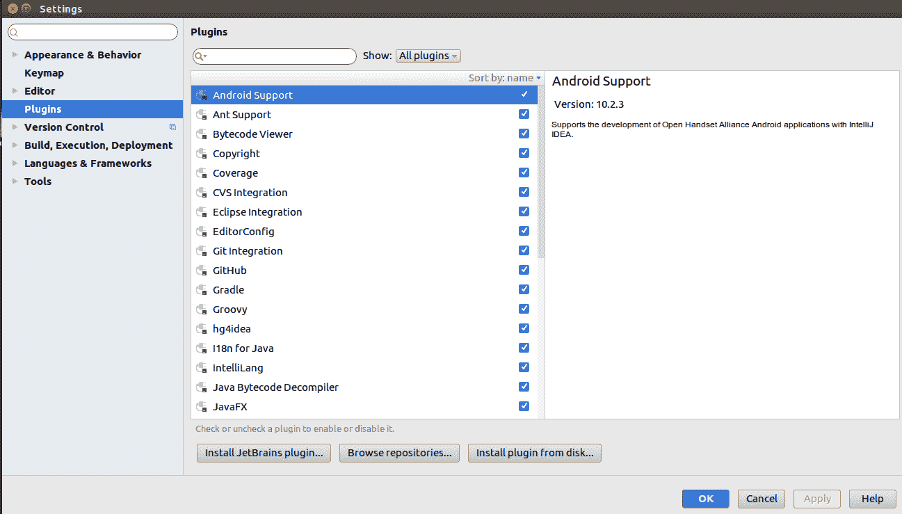
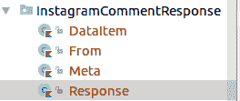
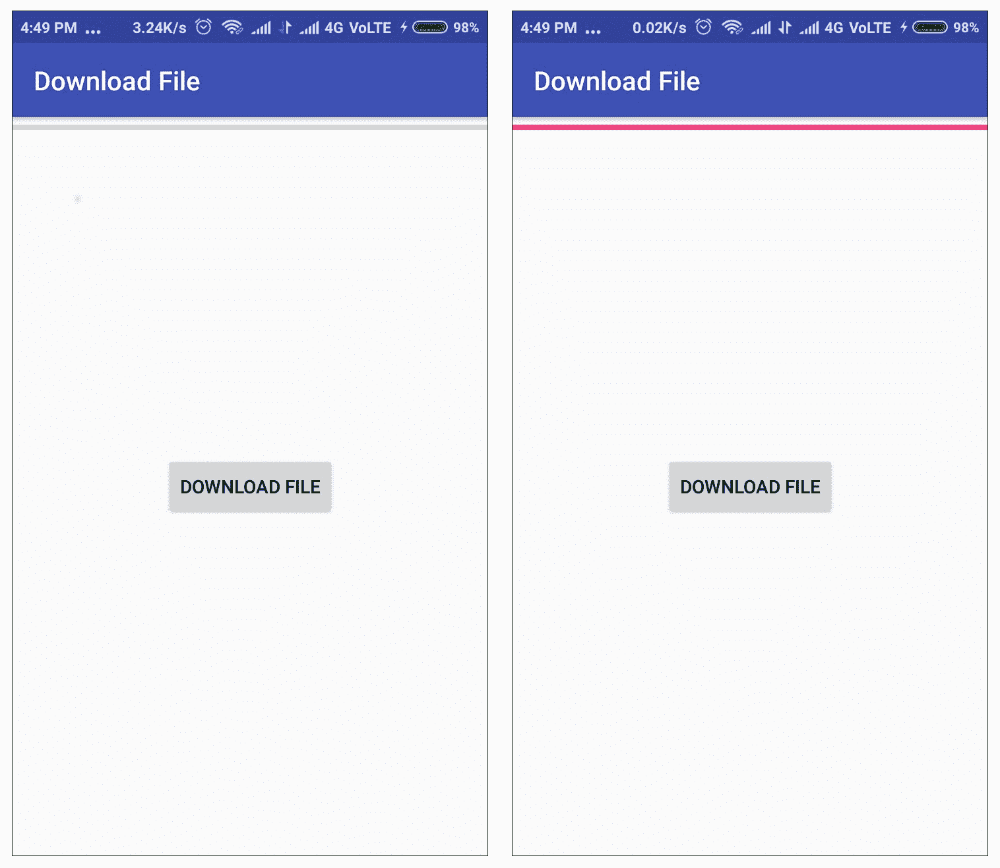
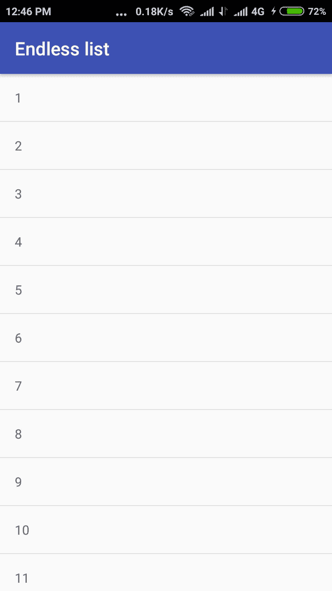

# 第十一章：网络和并发

本章将涵盖以下食谱：

+   如何通过网络获取数据

+   如何创建数据类

+   如何修改后复制数据类

+   如何从网络解析 JSON 数据到数据类

+   如何在 Kotlin 中下载文件

+   如何在 Kotlin 中使用 RxJava 和 Retrofit

+   如何使用 RecyclerView 制作无限列表

+   如何在 Android 中使用 Kotlin 运行后台任务

+   如何使用协程实现多线程

# 简介

你可能会发现很难找到一个不通过网络进行通信的应用程序。在几乎所有的应用程序中，无论是文件共享应用程序、流媒体应用程序、社交网络应用程序还是其他什么，列表可以一直继续。当你想要向你的 Android 应用程序添加网络通信功能时，你需要考虑许多变量。例如，你不能在主线程上运行它，网络请求总是在后台线程上执行。除此之外，你还需要检测网络请求失败的情况，以便向用户反馈出了什么问题。在本章中，我们将讨论如何在 Kotlin 中高效地进行网络请求。

# 如何通过网络获取数据

在 Android 中进行网络请求非常繁琐，除非你使用任何第三方库。例如，让我们看看 Android 中的网络请求过去是如何的：

```java
try {
    URL url = new URL("<api call>");

    urlConnection = (HttpURLConnection) url.openConnection();
    urlConnection.setRequestMethod("GET");
    urlConnection.connect();

    InputStream inputStream = urlConnection.getInputStream();
    StringBuffer buffer = new StringBuffer();
    if (inputStream == null) {
        // Nothing to do.
        return null;
    }
    reader = new BufferedReader(new InputStreamReader(inputStream));

    String line;
    while ((line = reader.readLine()) != null) {
        buffer.append(line + "\n");
    }

    if (buffer.length() == 0) {
        return null;
    }
    result = buffer.toString();
} catch (IOException e) {
    Log.e("Request", "Error ", e);
    return null;
} finally{
    if (urlConnection != null) {
        urlConnection.disconnect();
    }
    if (reader != null) {
        try {
            reader.close();
        } catch (final IOException e) {
            Log.e("Request", "Error closing stream", e);
        }
    }
}
```

当然，前面的代码很丑陋。Kotlin 简化了我们的痛苦，使我们能够进行网络请求。在本食谱中，我们将学习如何在 Kotlin 中进行网络请求。

# 准备工作

我们将使用 Android Studio 3.0。请确保你有其最新版本。

# 如何做到这一点…

让我们看看在 Kotlin 中进行网络请求所需的以下步骤：

1.  记得我们在本食谱开始时看到的那些用于执行网络请求的大量代码？所有这些都可以用一行 Kotlin 代码来替换。让我们看看以下代码：

```java
var response= URL("<url>").readText()
```

这将仅返回从网络请求中获取的 `response`。你只需提供你的 URL 作为参数。

当你在 Android 上使用此方法时，请确保你已经将此任务推送到后台，否则你将得到一个 `NetworkOnMainThread` 异常。

1.  我们想要异步执行的代码被包装在 `doAsync` 块下。将代码包装在异步任务中也非常简单。让我们看看以下代码：

```java
doAsync {
    val result= URL("https://api.instagram.com/319bad89407ffd7082").readText()
    uiThread {
        toast(result)
    }
}
```

我们已经将网络请求包装在一个异步块中，然后我们有一个 `uiThread` 方法，我们可以从中触摸应用程序的 UI 元素。

1.  `uiThread` 方法由 Anko 库提供，你可以通过在你的 `build.gradle` 文件中添加以下行将它们包含到你的项目中：

```java
implementation "org.jetbrains.anko:anko:1.0"
```

# 还有更多…

查看本章的 *如何使用 Anko 在 Android 中使用 Kotlin 运行后台任务* 食谱，了解更多关于如何在 Kotlin 中创建后台任务的信息。

# 如何在 Kotlin 中创建数据类

你是否厌倦了仅仅为了存储数据而编写冗长的样板代码？你是否觉得以下代码只是为了定义一个`Student`模型而显得过于繁琐？:

```java
public class Student {

    private String name;
    private String roll_number;
    private int age;

    public String getName() {
        return name;
    }

    public void setName(String name) {
        this.name = name;
    }

    public String getRoll_number() {
        return roll_number;
    }

    public void setRoll_number(String roll_number) {
        this.roll_number = roll_number;
    }

    public int getAge() {
        return age;
    }

    public void setAge(int age) {
        this.age = age;
    }

    @Override
    public int hashCode() {
        return super.hashCode();
    }

    @Override
    public String toString() {
        return super.toString();
    }
}
```

如果你同意，那么 Kotlin 的数据类正是你所需要的。所以让我们在这个菜谱中深入探讨，了解更多。

# 准备工作

我们将使用 IntelliJ IDEA 来编写我们的代码。你可以使用任何能够执行 Kotlin 代码的 IDE。

# 如何操作...

在每一个现实世界的项目中，你都会创建一些没有其他用途，仅仅用于存储数据的类，就像我们之前描述的`Student`类。在一个具有许多角色和模型的复杂项目中，这些类型的类的数量可能会非常高，这会导致大量的样板代码。Kotlin 为这个问题提供了一个很好的解决方案：

1.  在菜谱开头提到的代码可以简化为仅仅一行：

```java
data class Student(var name:String,var roll_number:String,var age:Int)
```

就这样！

1.  现在，让我们尝试使用我们刚刚创建的数据类：

```java
fun main(args: Array<String>) {
    val student=Student("Aanand","2013001",21)
    println("Student: name- ${student.name}, roll_number:${student.roll_number}, age:${student.age}")
}

//Output: Student: name- Aanand, roll_number:2013001, age:21
```

如你所见，我们不需要任何 getter setter，这节省了我们大量的样板代码。getter setters 已经包含在 Kotlin 属性中。

1.  让我们检查`toString()`方法（我们甚至还没有定义）：

```java
println("${student.toString()}")

//Output: Student(name=Aanand, roll_number=2013001, age=21)
```

这比 Java 的`toString()`方法返回的结果要好。

1.  数据类还提供了很多灵活性。例如，如果你不想要属性的 setter，你可以将属性设置为`val`。这将使属性为只读：

```java
data class Student(val name:String,val roll_number:String,var age:Int)
```

1.  你可以用数据类做的酷事情之一是你可以解构对象以获取属性。查看以下代码以了解更多信息：

```java
fun main(args: Array<String>) {
    val student= Student("Aanand", "2013001", 21)
    val (name, roll_number,age)=student
    println("Student: name- $name, roll_number:$roll_number, age:$age")
}

//Output: Student: name- Aanand, roll_number:2013001, age:21
```

1.  你也可以在类中为属性设置默认值。让我们看看下一个例子：

```java
data class Student(val name:String="Aanand",val roll_number:String,var age:Int)
var studentA= Student(roll_number =  "2013001", age = 21)
println(studentA.toString())

//Output: Student(name=Aanand, roll_number=2013001, age=21)
```

# 还有更多...

数据类有一些限制。根据 Kotlin 文档，这些限制如下：

+   主要构造函数需要至少有一个参数

+   所有主要构造函数参数都需要标记为`val`或`var`

+   数据类不能是抽象的、开放的、密封的或内部的

+   数据类可能不能扩展其他类（但可以实现接口）

# 如何修改后复制数据类

在上一个菜谱中，我们学习了如何使用数据类以及它如何减少大量的样板代码。在这个菜谱中，我们将看到数据类如何使复制另一个数据类变得容易，即使你需要修改属性。

复制数据类的暴力机制可以通过复制所有属性来创建一个数据类，但使用`copy`方法会更容易。

# 准备工作

我们将使用 IntelliJ IDEA 来编写我们的代码。你可以使用任何能够执行 Kotlin 代码的 IDE。

# 如何操作...

我们将使用`copy`方法，该方法接受命名参数并创建一个具有更改的命名参数值的对象副本。让我们看看一个例子：

```java
data class Student(val name:String,val roll_number:String,var age:Int)
fun main(args: Array<String>) {
    var studentA= Student("Aanand Roy", "2013001", 21)
    var olderStudentA=studentA.copy(age = 25)
    println(olderStudentA.toString())
}

//Output: Student(name=Aanand Roy, roll_number=2013001, age=25)
```

# 还有更多...

人们通常会在`copy()`和`apply()`函数之间感到困惑：

+   `apply()`: 它接受一个函数并将其作用域设置为被调用的对象。它是一个转换函数，也可以用来在返回之前评估复杂逻辑。最后，它只是返回一个经过更改（如果进行了更改）的相同对象。

+   `copy()`: `apply` 函数不是线程安全的，并且会修改对象。另一方面，`copy()` 函数返回一个新的对象（不会修改原始对象）。

# 如何从网络解析 JSON 数据到数据类

JSON 是最广泛使用的响应格式之一。通常，APIs 以 JSON 响应的形式提供输出，在 Android 开发中，它们也被广泛使用，因为我们与网络进行通信。将 JSON 响应解析到数据类中可以帮助我们像 Java 对象一样处理它们。你也可以使用 JSONObject 来解析它，但结果会是代码很脏。在这个菜谱中，我们将学习如何将 JSON 数据解析到数据类中。我们使用数据类，因为当类的唯一目的是保存数据时，它们是首选的。那么，让我们开始吧！

# 准备工作

我们将使用 Android Studio 3.0；请确保你有其最新版本。我们将使用 GSON 库，这是谷歌开源的一个用于解析 JSON 响应的库。GSON 非常易于使用，并且是市面上最受欢迎的 JSON 解析库之一。要将 GSON 包含到你的项目中，只需将以下行添加到你的 `build.gradle` 文件中：

```java
compile 'com.google.code.gson:gson:2.8.2'

```

# 如何做…

按照以下步骤了解如何从网络解析 JSON 数据：

1.  通常，我们在发起网络请求后都会得到一个 JSON 响应，所以为了简化，我们将假设在发起一些网络请求后得到了给定的 JSON 响应：

```java
{
 "data": [{
             "id": "17867282641151111",
             "from": {
                 "id": "1391934316",
                 "username": "aanandshekharroy",
                 "full_name": "Aanand Shekhar Roy",
                 "profile_picture": "https://scontent.cdninstagram.com/t51.2885-19/10475071_605790259527941_865730435_a.jpg"
                 },
             "text": "Testing api",
             "created_time": "1501571384"
         }, {
             "id": "17892289033060177",
             "from": {
                 "id": "1391934316",
                 "username": "aanandshekharroy",
                 "full_name": "Aanand Shekhar Roy",
                 "profile_picture": "https://scontent.cdninstagram.com/t51.2885-19/10475071_605790259527941_865730435_a.jpg"
 },
                 "text": "My second test",
                 "created_time": "1501571390"
             }],
         "meta": {
         "code": 200
     }
}
```

IntelliJ IDEA 提供了一个插件，可以帮助将 JSON 响应转换为 Kotlin 对象。我们将使用 `RoboPojoGenerator` 插件。执行以下步骤来安装它：

1.  前往设置 | 插件：



1.  点击 Install JetBrains plugin；它将打开一个对话框。在其中搜索 Robopojo，你将看到一个 RoboPOJOGenerator 插件。点击 Install 并重新启动 Android Studio。


1.  完成这些后，为了根据 JSON 响应生成类，首先创建一个空的包，你将在这里保存这些类。我已经创建了一个名为 `InstagramCommentsResponse` 的包（因为我们使用了 Instagram API 来获取最新的评论）。

1.  现在，右键单击包，选择 New | Generate POJO from JSON。然后，你将看到一个由 RoboPOJO 生成器提供的对话框，你需要将你的 JSON 响应粘贴进去。完成之后，勾选 Kotlin 和 Gson 复选框，然后点击 Generate。

1.  现在，你将看到在该包内部创建了许多类，如图所示：



1.  让我们看看这些类。第一个类是 JSON 响应的外部容器：

```java
@Generated("com.robohorse.robopojogenerator")
data class Response(

   @field:SerializedName("data")
   val data: List<DataItem?>? = null,

   @field:SerializedName("meta")
   val meta: Meta? = null
)
```

```java
// DataItem -  Class that will hold comments
@Generated("com.robohorse.robopojogenerator")
data class DataItem(

   @field:SerializedName("created_time")
   val createdTime: String? = null,

   @field:SerializedName("from")
   val from: From? = null,

   @field:SerializedName("id")
   val id: String? = null,

   @field:SerializedName("text")
   val text: String? = null
)
```

1.  现在，让我们尝试解析从网络调用中接收到的 JSON。我们将尝试获取收到的第一个评论并像在 Kotlin 中那样访问它：

```java
fun main(args:Array<String>){
    var response= URL("https://api.instagram.com/v1/media/1571595528561539504_5812999640/comments?access_token=5812999640.42ee6f0.9441d5bd909f40319bad89407ffd7082").readText()
    var gson= Gson()
    val comments=gson.fromJson(response,Response::class.java)
    println(comments.data?.get(0))
}

//Output: DataItem(createdTime=1501571384, from=From(fullName=Aanand Shekhar Roy, profilePicture=https://scontent.cdninstagram.com/t51.2885-19/10475071_605790259527941_865730435_a.jpg, id=1391934316, username=aanandshekharroy), id=17867282641151111, text=Testing api)

```

如您所见，我们可以将其用作普通的 Kotlin 对象，而无需使用`JSONObject`通过键来解析它，这使得 JSON 解析变得非常简单。

# 如何在 Kotlin 中下载文件

在我们的 Android 应用程序中，我们经常需要下载文件。最基本的方法将是打开 URL 连接并使用`InputStream`读取文件的内容，然后使用`FileOutputStream`将其存储在本地文件中；所有这些都在后台线程中使用`AsyncTask`完成。然而，我们不想重新发明轮子。有许多库可以为我们处理所有这些事情，使我们的工作变得非常简单，帮助我们创建干净的代码。

我们可以使用由谷歌开发者开发的网络库**Volley**([`developer.android.com/training/volley/index.html`](https://developer.android.com/training/volley/index.html))，它使得网络通信变得非常简单快捷。另一个我们可以使用的是**OkHttp**（由*Square*提供），它非常高效，并且我们可以与**Retrofit**（用于 HTTP API）一起使用。

对于这个菜谱，我们将使用一个名为**Fuel**的网络库，它是用 Kotlin 编写的。

# 准备工作

创建一个新的 Android 项目并添加一个活动。现在，通过在您的`build.gradle`中添加以下行并将项目同步，将 fuel 依赖项添加到您的项目依赖项中：

```java
//Fuel - Networking in Kotlin
compile 'com.github.kittinunf.fuel:fuel:$fuel_version' //for JVM
```

在这里，`$fuel_version`是 fuel 库的最新版本。

# 如何做到这一点…

按照以下步骤在 Kotlin 中下载文件：

1.  让我们从视图中添加一个带有`onClickListener`的按钮开始。我还添加了一个`progressBar`到视图中，以便能够看到下载的进度。这是我的视图：

```java
<?xml version="1.0" encoding="utf-8"?>
<android.support.constraint.ConstraintLayout 

    android:layout_width="match_parent"
    android:layout_height="match_parent"
    app:layout_behavior="@string/appbar_scrolling_view_behavior"
    tools:context="android.my_company.com.helloworldapp.DownloadFileActivity"
    tools:showIn="@layout/activity_download_file">

    <Button
        android:id="@+id/btn_download_file"
        android:layout_width="wrap_content"
        android:layout_height="wrap_content"
        android:layout_marginBottom="32dp"
        android:layout_marginTop="32dp"
        android:text="@string/download_file"
        app:layout_constraintBottom_toBottomOf="parent"
        app:layout_constraintLeft_toLeftOf="parent"
        app:layout_constraintRight_toRightOf="parent"
        app:layout_constraintTop_toTopOf="parent" />

    <ProgressBar
        android:id="@+id/progressBar"
        style="?android:attr/progressBarStyleHorizontal"
        android:layout_width="0dp"
        android:layout_height="wrap_content"
        app:layout_constraintLeft_toLeftOf="parent"
        app:layout_constraintRight_toRightOf="parent"
        app:layout_constraintTop_toTopOf="parent"
        android:progress="0"/>
</android.support.constraint.ConstraintLayout>
```

1.  让我们从下载一个临时文件开始。我们将使用[`httpbin.org/`](https://httpbin.org/)来模拟下载文件 API。以下是为下载临时文件编写的代码：

```java
class DownloadFileActivity : AppCompatActivity() {

    override fun onCreate(savedInstanceState: Bundle?) {
        super.onCreate(savedInstanceState)
        setContentView(R.layout.activity_download_file)
        setSupportActionBar(toolbar)
        Log.d("ya", filesDir.absolutePath + " " + filesDir.canonicalPath)

        btn_download_file.onClick {
            progressBar.progress = 0
            Fuel.download("http://httpbin.org/bytes/32768").destination { response, url ->
 File.createTempFile("abcd", ".tmp")
 }.progress { readBytes, totalBytes ->
 val progress = readBytes.toFloat() / totalBytes.toFloat()
 Log.d("progress", progress.toString())
 progressBar.progress = progress.toInt()*100
 }.response { req, res, result ->
 Log.d("status result", result.component1().toString())
 Log.d("status res", res.responseMessage)
 Log.d("status req", req.url.toString())
 }

        }
    }

}
```

这就是我们的 UI 看起来的样子：



现在，正如我们之前提到的，我们将使用`Fuel`库来下载文件；以下是代码的示例：

```java
btn_download_file.onClick {
            progressBar.progress = 0
            Fuel.download("http://httpbin.org/bytes/32768").destination { response, url ->
 File(filesDir , "abcd.txt")
 }.progress { readBytes, totalBytes ->
 val progress = readBytes.toFloat() / totalBytes.toFloat()
 Log.d("ya", progress.toString())
 progressBar.progress = progress.toInt()*100
 }.response { req, res, result ->
 Log.d("status result", result.component1().toString())
 Log.d("status res", res.responseMessage)
 Log.d("status req", req.url.toString())
 }
        }
```

我建议你尝试在 Fuel 中下载文件，包括有进度和无进度的情况，以更好地掌握这一点。你可以在[`github.com/kittinunf/Fuel`](https://github.com/kittinunf/Fuel)上阅读 Fuel 提供的所有其他功能。

还可以尝试在 Android 中使用 Volley 和其他网络库，以了解每个库的不同点和用例。

# 如何在 Kotlin 中使用 RxJava 和 Retrofit

**Retrofit**是 Android 中最广泛使用的网络库之一。它是由*Jake Wharton*创建的开源库。RxJava 是 Java 中 ReactiveX 的开源实现。RxJava 是进行响应式编程或事件驱动编程的绝佳方式。本菜谱不会教你关于响应式编程（[`en.wikipedia.org/wiki/Reactive_programming`](https://en.wikipedia.org/wiki/Reactive_programming)），所以如果你不熟悉它，你可以通过文档（[`github.com/ReactiveX/RxJava`](https://github.com/ReactiveX/RxJava)）来学习。相反，在本菜谱中，你将学习如何一起使用 Retrofit 和 RxJava。

# 准备工作

我们将使用 Android Studio 3.0。请确保您拥有其最新版本。我们还需要添加以下依赖项：

```java
compile "com.squareup.retrofit2:retrofit:$retrofit_version"
compile "com.squareup.retrofit2:adapter-rxjava2:$retrofit_version"
compile "com.squareup.retrofit2:converter-gson:$retrofit_version"
// RxKotlin - Kotlin version of RxJava
compile "io.reactivex.rxjava2:rxkotlin:$rxKotlinVersion"

```

`adapter-rxjava2`库帮助我们返回作为响应的`Observable`，可以被观察者订阅。

# 如何做到这一点...

在 Retrofit 中使用 RxJava 非常简单；让我们看看以下步骤：

1.  Retrofit（用于与网络通信）的实例将按照以下方式创建：

```java
Retrofit.Builder()
        .addCallAdapterFactory(RxJava2CallAdapterFactory.create())
        .addConverterFactory(GsonConverterFactory.create())
        .client(okHttpClient)
        .baseUrl(AppConstants.INSTAGRAM_BASE_URL)
        .build()
```

1.  下面的示例是一个接口，我们在这里定义了所有的 Retrofit 调用。你可能注意到，我们返回的是`Observable`，这是唯一的变化：

```java
interface InstagramApiService {

    @FormUrlEncoded
    @POST("oauth/authorize")
    fun getRedirectCode(@Field("client_id") client_id: String,
                       @Field("redirect_uri") redirect_uri: String,
                       @Field("response_type") response_type: String): Call<String>

    @FormUrlEncoded
    @POST("oauth/access_token")
    fun getAccessToken(@Field("client_id") client_id: String,
                       @Field("client_secret") client_secret: String,
                       @Field("redirect_uri") redirect_uri: String,
                       @Field("grant_type") grant_type: String
                       , @Field("code") code: String)
                        :Observable<InstagramLoginResponse>

    @GET("v1/users/{user_id}/media/recent/")
    fun getInstagramPosts(@Path("user_id") user_id: String?, @Query("access_token") access_token: String?)
                                                        :Observable<InstagramPostsResponse>

    @GET("v1/media/{media_id}/comments")
    fun getCommentsForInstagramPost(@Path("media_id") media_id: String?
                                    , @Query("access_token") access_token: String?)
            :Observable<InstagramCommentsResponse>
}
```

1.  然后，您需要创建您之前提到的服务实例，如下所示：

```java
retrofit.create<InstagramApiService>(InstagramApiService::class.java)
```

1.  现在你只需要调用该方法，并且你需要一个订阅者对象来订阅它：

```java
instagramApiService.getCommentsForInstagramPost(instagramId)
                .subscribeOn(Schedulers.io())
                .observeOn(AndroidSchedulers.mainThread())
                .subscribeBy(onNext={
                    response: InstagramCommentsResponse ->
                   // Do something with response

                },onError = {
                    // Do something with error
                }))
```

1.  我们已经在后台的另一个线程上推送了网络调用。当调用/任务完成时，结果将在主线程上被观察。

# 如何使用 RecyclerView 制作无限列表

Facebook、Instagram 和 Twitter 的动态有什么共同点？它们都几乎有无穷无尽的内容在你不断向下滚动时展示给你。毫无疑问，这是在您的平台上吸引用户的绝佳方式。

在这个菜谱中，我们将了解如何使用`RecyclerView`制作无限列表。它有许多用例，例如社交媒体、电子商务应用程序或任何基于内容的应用程序。

我们将创建一个简单的应用程序，它最初将加载一小部分数据，但一旦用户滚动到内容的底部，我们将获取另一组数据并将其附加到它，给用户一种无限内容的感觉。所以让我们开始吧！

# 准备工作

我们将使用 Android Studio 3.0；请确保您拥有其最新版本。

你还需要在`build.gradle`文件中包含`RecyclerView`，你可以按照以下方式添加：

```java
compile 'com.android.support:recyclerview-v7:26.1.0'

```

你也可以在`https://gitlab.com/aanandshekharroy/Anko-examples/`存储库中找到源代码，通过检出`6-endless-list-using-recycler-view`分支。

# 如何做到这一点...

我们将创建一个简单的应用程序，该程序将在列表中显示数字。当你向下滚动时，列表将无限增长：



列表的创建方式如下：

1.  首先，我们将创建一个将放置在列表中的项。以下是该行项 `recycler_row.xml` 的代码：

```java
<?xml version="1.0" encoding="utf-8"?>
<LinearLayout xmlns:android="http://schemas.android.com/apk/res/android"
    android:layout_width="match_parent"
    android:orientation="vertical"
    android:layout_height="wrap_content">

    <TextView
        android:id="@+id/recycler_row_text_view"
        android:layout_width="match_parent"
        android:layout_height="wrap_content"
        android:padding="16dp" />

    <View
        android:layout_width="match_parent"
        android:layout_height="1dp"
        android:layout_alignParentBottom="true"
        android:alpha="0.1"
        android:background="@android:color/black" />
</LinearLayout>
```

1.  接下来，我们将在主活动布局文件中创建一个 `RecyclerView`：

```java
<?xml version="1.0" encoding="utf-8"?>
<android.support.constraint.ConstraintLayout xmlns:android="http://schemas.android.com/apk/res/android"
    xmlns:app="http://schemas.android.com/apk/res-auto"
    xmlns:tools="http://schemas.android.com/tools"
    android:layout_width="match_parent"
    android:layout_height="match_parent"
    tools:context=".MainActivity">

    <android.support.v7.widget.RecyclerView
        android:id="@+id/recyclerView"
        android:scrollbars="vertical"
        android:layout_width="match_parent"
        android:layout_height="match_parent"/>

</android.support.constraint.ConstraintLayout>
```

1.  现在，我们将创建一个简单的 `RecyclerView` 适配器：

```java
class RecyclerAdapter(val recyclerList: List<Int>) : RecyclerView.Adapter<RecyclerAdapter.ViewHolder>() {
    override fun onBindViewHolder(viewHolder: RecyclerAdapter.ViewHolder, position: Int) {
        viewHolder.bind(recyclerList[position])
    }

    override fun onCreateViewHolder(viewGroup: ViewGroup, position: Int): RecyclerAdapter.ViewHolder {
        val view = LayoutInflater.from(viewGroup.context).inflate(R.layout.recycler_row, viewGroup, false)
        return ViewHolder(view)
    }

    override fun getItemCount(): Int {
        return recyclerList.count()
    }

    class ViewHolder(itemView: View) : RecyclerView.ViewHolder(itemView) {
        val itemTextView :TextView= itemView.findViewById(R.id.recycler_row_text_view)

        fun bind(recyclerItemText: Int) {
            itemTextView.text = recyclerItemText.toString()
        }
    }

}
```

1.  现在，让我们创建一个简单的函数，当调用它时，将 30 个数据项追加到列表中。这正是应用程序中所做的。一旦用户到达列表底部，就会发起一个网络调用，将数据追加到之前的列表中：

```java
fun updateDataList(dataList: MutableList<Int>) : List<Int> {
    kotlin.repeat(30) {
        dataList.add(dataList.size + 1)
    }
    return dataList
}
```

1.  现在，让我们在活动中设置回收视图：

```java
class MainActivity : AppCompatActivity() {
    val dataList = mutableListOf<Int>()

    override fun onCreate(savedInstanceState: Bundle?) {
        super.onCreate(savedInstanceState)
        setContentView(R.layout.activity_main)

        val layoutManager = LinearLayoutManager(this)
        val adapter = RecyclerAdapter(recyclerList = updateDataList(dataList))

        recyclerView.layoutManager = layoutManager
        recyclerView.adapter = adapter
        recyclerView.addOnScrollListener(object :                              RecyclerView.OnScrollListener() {
            override fun onScrolled(recyclerView: RecyclerView, dx: Int, dy: Int) {
                super.onScrolled(recyclerView, dx, dy)
                if (!recyclerView.canScrollVertically(1)) {
                    onScrolledToBottom();
                }
        }
        fun onScrolledToBottom() {
            val initialSize = dataList.size
            updateDataList(dataList)
            val updatedSize = dataList.size
            adapter.notifyItemRangeInserted(initialSize,updatedSize)
        }
})
}
```

# 它是如何工作的...

由于我们必须拦截用户到达列表底部的情况，我们添加了一个 `ScrollListener`。我们重写了 `onScroll` 方法，并使用了 `canScrollVertically` 方法。`canScrollVertically` 方法是在 API 级别 14 中添加的，它用于检查此视图是否可以在某个方向上垂直滚动。它接受一个整数参数（负数用于检查向上滚动，正数用于检查向下滚动）并返回一个布尔值（如果可能则为 `true`，否则为 `false`）。在我们的例子中，我们提供了一个正整数，如果视图可以向下滚动，则返回 `true`，如果不能则返回 `false`。如果不能进一步向下滚动（意味着数据已耗尽），我们将向列表中添加数据，并通过调用适配器的 `notifyItemRangeInserted` 方法来更新列表。

# 如何使用 Anko 在 Android 中用 Kotlin 运行后台任务

**Anko** 是由 JetBrains 团队创建的一个库，它通过许多辅助函数抽象了很多复杂性，使得 Android 开发变得相当容易。其中之一就是处理后台任务。使用 Anko，我们可以非常容易地处理后台任务。在这个菜谱中，我们将学习如何使用 Anko 来处理后台任务。

# 准备工作

我们将使用 Android Studio 3.0 进行编码；确保你有其最新版本。你需要将 Anko 添加到你的 `build.gradle` 文件中，如下所示：

```java
implementation "org.jetbrains.anko:anko:$anko_version"
```

# 如何做到这一点...

在 Kotlin 中在后台执行任务非常简单。让我们看看下一个例子。在这个例子中，我们将发起一个网络请求（这需要在后台执行，否则你会得到一个 `NetworkOnMainThread` 异常）；一旦网络请求完成，我们将使用 toast 显示成功消息。由于我们不能从后台线程触摸 UI 元素，我们需要回到 UI 线程来完成它。我们将使用 Anko 提供的 `uiThread` 方法，该方法将在后台任务完成后被调用：

```java
class MainActivity : AppCompatActivity() {
    override fun onCreate(savedInstanceState: Bundle?) {
        super.onCreate(savedInstanceState)
        setContentView(R.layout.activity_main)
        doAsync {
            val result= URL("https://api.instagram.com/v1/media/1571595528561539504_5812999640/comments?access_token=5812999640.42ee6f0.9441d5bd909f40319bad89407ffd7082").readText()
 uiThread {
                toast(result)
 } }
    }
}
```

正如你所见，`URL().readText()` 是一个长时间处理任务，因此我们将其放在后台任务中。

# 如何工作…

你必须已经使用过异步任务来在后台执行任务，但这并不是一个很有效的方法来做这件事。它处理屏幕旋转时的它们时存在问题，因为它没有注意到活动生命周期。

`doAsync` 方法是由活动调用的，如果活动正在销毁，则 `uiThread` 不会执行。这确保了你只能触摸 UI 直到它存在。

# 如何使用协程实现多线程

**协程** 是 Kotlin 中的一项优秀语言特性。以下是文档中对协程的一个恰当的定义：

"协程是编写异步、非阻塞代码（以及更多）的新方法。"

不仅使用起来方便，而且比线程更强大，尤其是在移动环境中，即使是一毫秒的性能提升也值得赞赏。启动多个线程可能会引起性能问题，但协程不会，因为即使有成千上万的协程运行，性能水平也不会有太大下降。

以下内容是 Kotlin 官方文档中所述：

"可以将协程想象为一个轻量级的线程。像线程一样，协程可以并行运行，互相等待，并进行通信。最大的区别是协程非常便宜，几乎是免费的；我们可以创建成千上万的协程，而在性能方面付出的代价非常小。另一方面，真正的线程启动和保持的成本很高。一千个线程对于一个现代机器来说可能是一个严重的挑战。”

这个事实使得它非常强大，Kotlin 团队也提供了简单的语法来使其易于使用。在这个菜谱中，我们将学习如何使用协程。那么，让我们开始吧！

# 准备工作

我们将使用 Android Studio 3.0 进行编码。协程作为一个库提供，它抽象了所有复杂性，并让库来处理。你需要在 `build.gradle` 文件中添加这个库，如下所示：

```java
dependencies {  
    ...  
    compile "org.jetbrains.kotlinx:kotlinx-coroutines-core:0.19.2" 
}
```

这个库发布到了 Bintray JCenter 仓库，所以你需要在你的仓库中添加 `jcenter()`，如下所示：

```java
repositories {
 jcenter()
}
```

有一个需要注意的事项是，在 Kotlin 1.1 中协程是实验性的，所以你需要明确告诉编译器你知道这一点，并且你愿意使用它。为此，你需要在你的 `build.gradle` 文件中添加以下行：

```java
apply plugin: 'kotlin'
 kotlin {
    experimental {
    coroutines 'enable'
 }
}
```

现在一切准备就绪，你可以在你的项目中开始使用协程。

# 如何操作…

让我们按照给定的步骤来了解 Kotlin 中协程的工作原理：

1.  有两个函数可以启动协程：

    +   `launch{}`

    +   `async{}`

1.  让我们尝试编写我们的第一个简单的协程函数：

```java
class MainActivity : AppCompatActivity() {
    override fun onCreate(savedInstanceState: Bundle?) {
        super.onCreate(savedInstanceState)
        setContentView(R.layout.activity_main)
        launch {
            delay(10000)
 println("Hello")
        }
    }
}
```

上述函数将在 10 秒后打印 "Hello" 到 Android Studio 控制台。请注意，我们使用了 `launch` 函数来启动一个协程，它返回一个 Job，但它不携带任何结果值。它在一个给定的线程池上启动一个新的协程（默认情况下，协程是在一个共享的线程池上运行的）。尽管基于协程的程序中仍然存在线程，但一个线程可以运行多个协程，因此我们不需要太多线程。

1.  协程的关键在于挂起函数。我们只需在函数上添加`suspend`修饰符就可以创建一个挂起函数。考虑以下示例：

```java
suspend fun timeConsumingMethod(arg: String): Boolean {
     //...
}
```

1.  挂起函数只能从协程或另一个挂起函数中调用。如果你尝试从其他地方调用它们，你的代码甚至无法编译。

安东尼奥·利瓦（Antonio Leiva）将挂起函数解释如下：

**“...当它们被调用时可以停止执行，一旦它们完成自己的任务就会继续执行。”**

协程至少需要有一个挂起函数（在上一个示例中，`delay`是一个挂起函数）。

1.  接下来，我们将看到`async`函数。从概念上讲，它与启动函数非常相似，除了`async`返回一个延迟的——一个轻量级的非阻塞未来，它代表了一个承诺，稍后提供结果（类似于 Java 的`Future`）。要从该延迟中获取结果，你使用`.await()`，由于延迟也是一个`Job`，因此如果需要，你可以取消它。让我们看看`async`的一个示例。

1.  首先，我们将创建两个挂起函数并并发执行它们，然后将从两个函数中添加结果：

```java
suspend fun longOperationOne(): Int {
    delay(1000L) 
    return 10
}

suspend fun longOperationTwo(): Int {
    delay(1000L) 
    return 20
}
```

```java
val one = async { longOperationOne() }
val two = async { longOperationTwo() }
async {
    println("The answer is ${one.await() + two.await()}")
}
```

1.  在前面的示例中，我们得到了延迟对象，这是一个`Future`对象。要从其中获取结果，我们使用了`await`函数。`await`函数本身就是一个挂起函数；这就是为什么我们将其包裹在一个`async`块中的原因。

1.  一个需要注意的关键点是，这两个作业都是异步和并发运行的，因此是非阻塞的。

1.  如果你想要以阻塞的方式运行它，你需要使用`runBlocking`方法。以下是相同的示例，但它将在获取结果时阻塞主线程：

```java
val one = async { longOperationOne() }
val two = async { longOperationTwo() }
runBlocking {
    println("The answer is ${one.await() + two.await()}")
}
```

# 还有更多...

无论何时在考虑使用线程还是协程时，请记住罗马（来自 JetBrains 团队的工程师）的这些话：

“协程适用于大多数时候都在等待某些事情异步任务。线程适用于 CPU 密集型任务。”

在 Android 的上下文中，你总是想更新 UI，但你不能从后台线程中这样做。协程为此提供了一个解决方案。让我们看看下一个示例：

```java
launch(UI) {
     val sum = lengthyJobOne.await() +lengthyJobTwo.await()
     myTextView.text = "Sum of results is $sum."
}
```

在前面的代码中，我们不仅可以在不阻塞主线程的情况下在后台计算两个作业，我们还可以触摸 UI 线程来更新视图。
