# 第十三章：测试

本章将涵盖以下食谱：

+   Kotlin 代码的单元测试

+   使用 Mockito 进行单元测试

+   运行仪器测试

+   在 Kotlin 中编写 JUnit 规则（@Rule）

+   使用 Espresso Kotlin 进行验收测试

+   在 Kotlin 中编写 assertEquals

# 简介

如果您希望代码库可扩展且可维护，测试是软件工程的基本部分。在 Android 中，基本上有两种类型的测试：一种是**单元测试**，另一种是**集成测试**。单元测试是一种独立测试各个单元的测试类型，而集成测试（有时也称为仪器测试），则需要 Android 设备或模拟器来运行测试。由于集成测试需要真实设备或模拟器，这些测试通常执行速度较慢。单元测试速度快，因为它们不需要真实设备或模拟器来运行。由于单元测试速度快而仪器测试慢，人们通常认为一个健壮的测试套件应该有这些测试的比例为 80%到 20%。因此，您的代码库应该由 80%的单元测试和 20%的仪器测试组成。

# Kotlin 代码的单元测试

单元测试基本上涉及**单元测试**。这些测试通常执行速度更快，因为它们在 JVM 中执行，因此不需要进行 dexing、打包和在模拟器上安装的步骤，将测试周期从分钟缩短到秒，以便您可以快速迭代和重构代码。另一方面，集成测试则需要上述所有步骤。除了测试代码外，单元测试还充当代码库的绝佳文档。这就是为什么如果您看到方法名称以奇特的方式表达，例如，`testIfConfirmationEmailIsSent`，您可能不会感到惊讶。

在本食谱中，我们将学习如何为您的 Android 代码编写单元测试。

# 准备工作

您将需要 Android Studio，因为我们将学习如何为 Android 代码编写单元测试，并且因为 Android Studio 为单元测试提供了极大的支持。您还可以在[`gitlab.com/aanandshekharroy/Anko-examples`](https://gitlab.com/aanandshekharroy/Anko-examples)的 4-unit-tests 分支中找到源代码。

# 如何操作...

按照以下步骤了解如何在 Kotlin 语言中编写 Android 代码的单元测试：

1.  当您在 Android Studio 中创建一个新的 Android 项目时，Android Studio 将提供对单元测试和 Android 测试的支持。它为您提供了单独的目录，您可以在其中放置您的测试。请看以下截图：

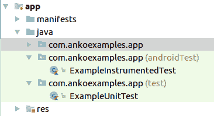

如您所见，test 是放置**单元测试**的地方，androidTest 是放置**Android 测试**或**仪器测试**的地方。

1.  已经为你提供了两个演示测试：ExampleUnitTest 和 ExampleInstrumentedTest。要运行它们，只需右键单击 ExampleUnitTest 并点击运行 ExampleUnitTest。运行测试后，你可以在控制台中看到测试结果，如下面的截图所示：

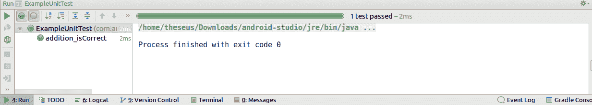

现在，让我们尝试创建我们自己的单元测试：

1.  我们通常在我们的代码中有一个 `Utility` 类，它包含可以被任何类使用的方法，所以我们不是在每一个类中定义这些方法，而是在 `Utility` 类中定义它们。所以，让我们创建一个方法，`addTwoNumbers`，它将接受两个参数，`a` 和 `b`，并返回一个结果——`a+b`：

```kt
class Utility {
  companion object {
      fun addTwoNumbers(a:Int, b:Int):Int=a+b
  }
}
```

1.  在 Android Studio 中，你可以直接从类本身创建测试。只需右键单击类名，然后点击创建测试：

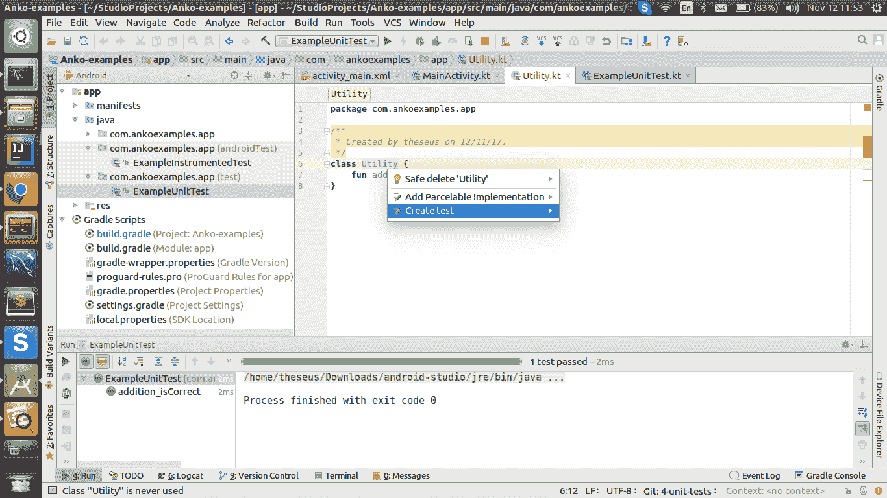

1.  之后，你将看到一个对话框，你可以选择你想要创建测试的所有方法。建议为每个方法都编写测试：

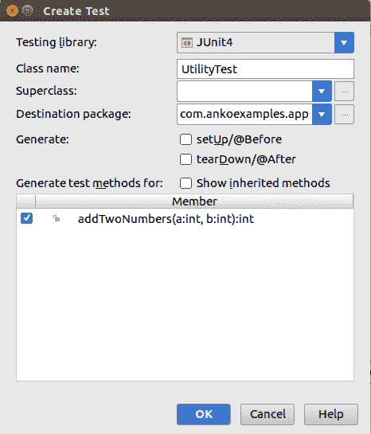

1.  当你点击“确定”时，将显示另一个对话框，询问你将测试放在哪里。在这种情况下，这是一个单元测试，所以我们将它放在 `app/src/test…`：

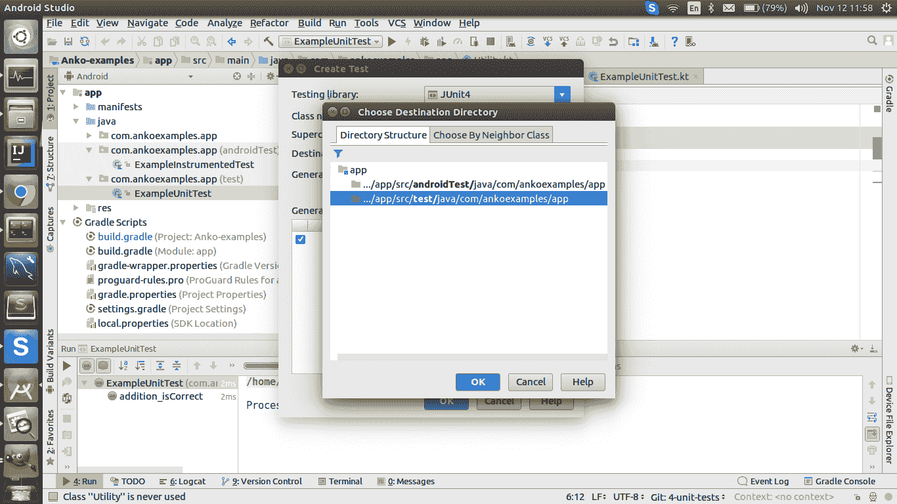

1.  当你点击“确定”时，Android Studio 会自动在 `UtilityTest.kt` 中生成样板代码，如下所示：

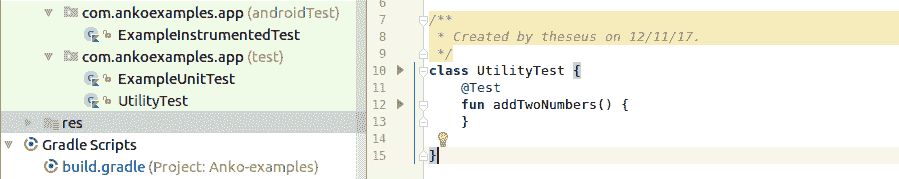

1.  现在，我们将添加几个 `assertEquals` 语句，这些语句将检查预期值与结果：

```kt
class UtilityTest {
  @Test
  fun addTwoNumbers() {
      assertEquals(5,Utility.addTwoNumbers(2,3))
      assertEquals(5,Utility.addTwoNumbers(4,1))
      assertNotEquals(5,Utility.addTwoNumbers(2,5))
  }
}
```

第一个参数是预期值，第二个参数是函数的输出。如果你运行测试，它将通过。

# 它是如何工作的…

当你运行单元测试时，它们会测试所有带有 `@Test` 注释的方法。还有一个 `@Before` 注释，它位于一个方法上方。带有 `@Before` 注释的方法将在类的任何其他方法之前运行。这在你设置可能被以后使用到的对象和变量时非常有用。

在这里需要注意的是，单元测试不能使用 Android SDK 组件。要使用这些组件，你需要使用仪器测试，或者使用像 **Mockito** 这样的模拟框架，它模拟 Android 组件以便在单元测试中使用。我们将在下一个菜谱中介绍这一点。

# 使用 Mockito 进行单元测试

正如我们在前面的菜谱中讨论的，我们不能在单元测试中使用 Android 组件。这就是为什么我们能够更快地运行它们，而且不需要任何设备。如果你想在测试中使用 Android 组件，有两种选择：

+   编写集成测试，这些测试将在你的设备或模拟器上运行。

+   使用模拟框架，例如 Mockito，它基本上模拟了 Android SDK 组件，这样你就可以在不使用任何设备或模拟器的情况下使用它们，就像其他单元测试一样。模拟框架的好处是测试运行时间大大减少，因为测试基本上是单元测试。以下是 Vogella 对模拟对象的准确定义：

"一个**模拟对象**是一个接口或类的占位实现，在其中你定义了某些方法调用的输出。模拟对象被配置为在测试期间执行特定的行为。它们通常会记录与系统的交互，测试可以验证这些交互。"

有了这个想法，让我们尝试使用 Mockito 编写单元测试。

# 准备工作

你需要 Android Studio，因为它为单元测试提供了很好的支持，我们还将学习如何编写 Android 代码的单元测试。

你也可以在[`gitlab.com/aanandshekharroy/Anko-examples`](https://gitlab.com/aanandshekharroy/Anko-examples)的 4-unit-tests 分支中找到源代码。

首先，你需要将 Mockito 依赖项添加到你的项目中。你可以在你的`build.gradle`文件中添加以下行来实现这一点，在 app 级别：

```kt
testImplementation 'org.mockito:mockito-core:2.8.47'

```

一旦添加了依赖项，你就可以继续前进。

# 如何做…

我们通常使用 Mockito 来模拟 Android 类，但让我们用 Mockito 测试一个简单的类：

1.  这里有一个小的测试，用于测试`Utility`类的`functionUnderTest`函数：

```kt
@Test
fun test_functionUnderTest(){
    val classUnderTest= mock(Utility::class.java)
    classUnderTest.functionUnderTest()
    verify(classUnderTest).functionUnderTest()
}
```

1.  在前面的类中，我们调用`functionUnderTest`方法，然后验证该方法是否被调用过。（是的，这不是一个很好的测试用例，但让我们尝试运行这个测试）当你运行它时，你会看到一个错误，如下所示：

```kt
org.mockito.exceptions.base.MockitoException: 
Cannot mock/spy class com.ankoexamples.app.Utility
Mockito cannot mock/spy because :
 - final class
```

1.  前面错误的原因是 Kotlin 中每个类默认都是 final 的。如果你想扩展或模拟它们，你需要将它们打开。然而，这意味着你需要为想要测试的每个类添加`open`修饰符吗？这听起来是个坏主意，确实如此。有一个解决这个问题的方法。这个方法是在`test/resources/mockito-extensions`文件夹中手动添加模拟 final 类的选项。你需要创建一个名为`org.mockito.plugins.MockMaker`的文件，并将以下代码放入该文件中：

```kt
mock-maker-inline
```

现在如果你运行代码，它将顺利通过。

1.  `verify`方法有许多变体，如下所示：

    +   `verify(classUnderTest, never()).functionUnderTest()`，这测试了该方法是否从未被调用过

    +   `atLeastOnce()`、`atLeast(2)`、`times(5)`、`atMost(3)`，这些也可以用来验证与方法的交互次数

1.  让我们看看另一个 Mockito 测试，它模拟了`SharedPreferences`（一个 Android 组件）：

```kt
@Test
fun testSharedPreference(){
    val sharedPreferences=mock(SharedPreferences::class.java)
    `when`(sharedPreferences.getInt("random_int",-1)).thenReturn(1)
    assertEquals(sharedPreferences.getInt("random_int",-1),1)
}
```

`when(...).thenReturn(...)`结构会监视对象，当`when`结构内的方法被调用时，它返回`thenReturn`结构下的值。注意`when`周围的```kt `` ```；这是因为`when`是 Kotlin 中的保留关键字，所以我们用反引号来调用它。

1.  你还可以返回多个值，这模拟了多次调用方法：

```kt
@Test
fun testSharedPreference(){
    val sharedPreferences=mock(SharedPreferences::class.java)
    `when`(sharedPreferences.getInt("random_int",-1)).thenReturn(1).thenReturn(2)
    assertEquals(sharedPreferences.getInt("random_int",-1),1)
    assertEquals(sharedPreferences.getInt("random_int",-1),2)
}
```

在前面的示例中，对 `getInt` 方法的第一次调用将返回 `1`，第二次调用将返回 `2`。

# 还有更多…

让我们了解单元测试中的 `spy` 对象。

# 间谍对象

模拟框架还提供了一个 `spy` 方法，可以用来包装真实对象。对间谍对象的调用被委派给真实对象。你可能会想，这有什么用呢？它可以检查真实对象上的交互，如果对象没有被模拟，这是不可能的。让我们看看以下示例：

```kt
@Test
fun testSpyObject(){
    val list = List(2,init = {-1})
    val spy= spy(list)
    assertEquals(spy.get(0),-1)
    verify(spy).get(0)
}
```

前面的测试将会通过。

注意，调用 `spy.get(0)` 返回 `-1`，这与你与真实对象交互时得到的结果相同。此外，你还能验证交互。

# Mockito 限制

Mockito 有某些限制——例如，你不能模拟 `static` 和 `private` 方法。这超出了本书的范围，所以想了解更多关于 Mockito 限制的信息，请访问 [`github.com/mockito/mockito/wiki/FAQ#what-are-the-limitations-of-mockito`](https://github.com/mockito/mockito/wiki/FAQ#what-are-the-limitations-of-mockito)。

# 运行仪器测试

在前面的菜谱中，我们学习了如何运行和编写单元测试。在这个菜谱中，我们将学习如何运行仪器测试。集成测试位于你的 Android 项目中的 androidTest 目录下。

# 准备工作

由于仪器测试需要在真实设备或模拟器上运行，请确保你拥有其中之一。我们将使用 Android Studio 3.0 进行编码。你可以从 [`gitlab.com/aanandshekharroy/Anko-examples`](https://gitlab.com/aanandshekharroy/Anko-examples) 下载源代码，并切换到 `5-instrumentation-tests` 分支。我们还将使用 *Espresso* 编写仪器测试，因为它是最容易使用的软件。当你创建新项目时，Espresso 会自动包含在你的项目中。

**Espresso** 面向那些认为自动化测试是开发生命周期中不可或缺部分的开发者。虽然它可以用于黑盒测试，但只有熟悉待测代码库的人才能解锁 Espresso 的全部功能。

# 如何做…

在以下步骤中，你将学习如何运行仪器测试：

1.  让我们创建一个简单的应用程序，它将只包含 Hello World! 文本和一个按钮：

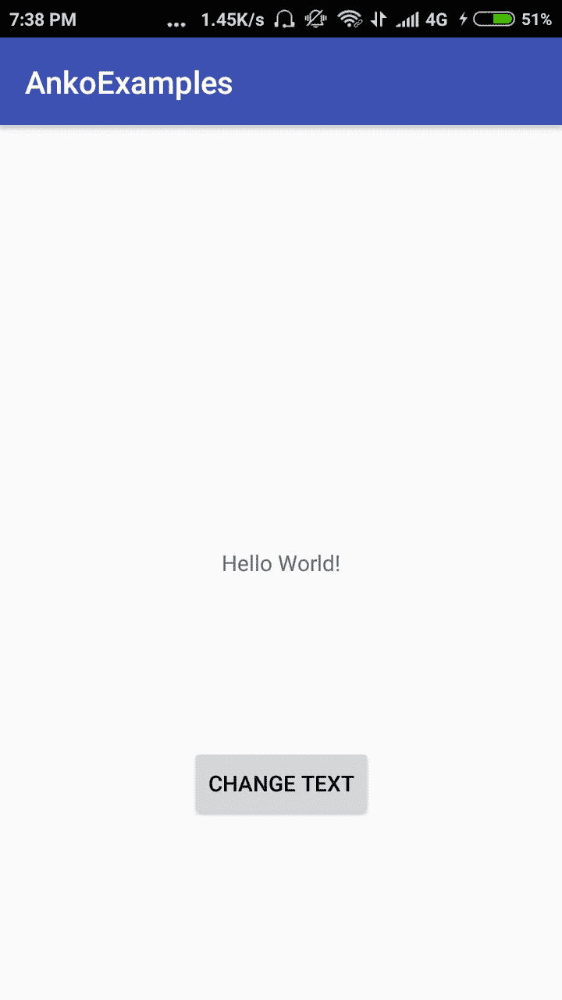

1.  点击按钮时，文本将更改为 Goodbye World!：

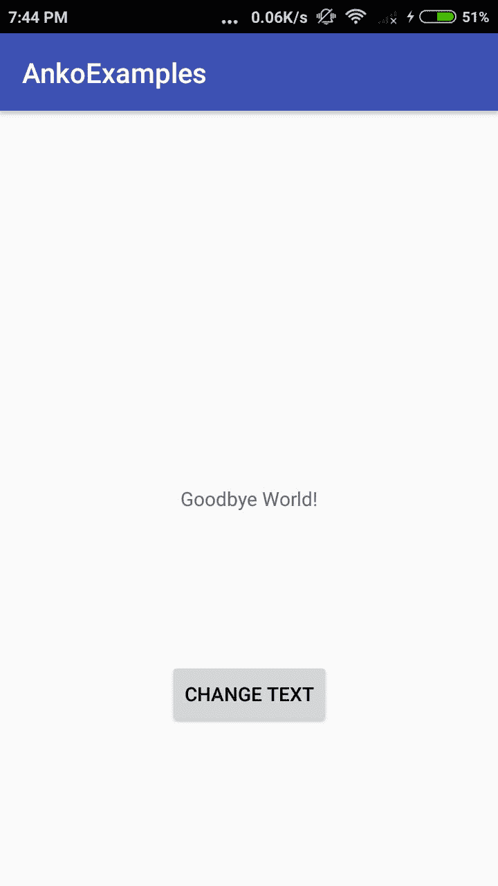

1.  现在，让我们编写一个测试来验证这个行为。

在这个菜谱中，我们将学习如何运行咖啡测试；在下一个菜谱中，我们将学习如何编写咖啡测试，所以请耐心等待，直到我解释如何在后续菜谱中编写咖啡测试，因为它很复杂，需要整个菜谱来公正地处理它。

这是一个咖啡测试：

```kt
class MainActivityTest {
    @Rule
    @JvmField var activityRule: ActivityTestRule<MainActivity> = ActivityTestRule(MainActivity::class.java)

    @Test
    fun testButtonBehaviour() {
        onView(withText("Hello World!"))
                .check(matches(isDisplayed()))
        onView(withId(button)).perform(click())
        onView(withText("Goodbye World!"))
                .check(matches(isDisplayed()))

    }

}
```

在 `testButtonBehaviour` 方法的第一行，我们正在检查“Hello World!”是否出现在屏幕上。然后，我们对按钮执行点击操作，最后检查“Goodbye World!”是否出现在屏幕上。

1.  要运行前面的测试，只需右键单击测试类并选择运行 MainActivityTest：

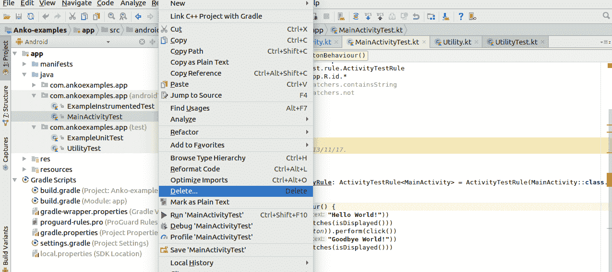

1.  一旦选择该选项，就会弹出一个对话框，询问您要在哪个设备上运行测试。您可以选择一个真实设备或模拟器。

1.  之后，您可以在设备上看到测试的运行情况（您将看到代码中写出的步骤在设备上执行）。

# 还有更多……

如果运行任何仪器测试，您会注意到即使是一个小测试，它也需要很长时间才能通过。在当前场景中，**测试驱动开发（TDD**）越来越受欢迎，但它的测试执行时间很长；这不是使用 TDD 的好方法。因此，应该将仪器测试的数量保持在最低限度，并且最好使用模拟框架，如 Mockito 或 Robolectric。

维基百科表示，TDD 是一种依赖非常短的开发周期重复的软件开发过程：需求被转化为非常具体的测试用例，然后软件被改进以通过新的测试。

# 在 Kotlin 中编写 JUnit 规则（@Rule）

规则是一种为类中所有测试添加功能的方式。例如，`ExternalResource` 在测试方法前后执行代码。这可以在测试方法之前设置数据库、网络和文件系统连接，并在测试完成后断开它们。当然，您也可以使用 `@Before` 和 `@After` 注解来完成，但使用 `ExternalResource`（作为 JUnit 规则）有助于代码重用。

# 准备工作

我将使用 Android Studio 3.0 进行编码。

# 如何做到这一点……

在这个菜谱中，我们将使用 `ExpectedException` 作为 JUnit 规则，因为它有助于测试声明期望出现异常，并提供了一种清晰表达期望行为的方式。它比使用 `@Test(expected= ...)` 注解更加灵活，因为我们可以测试特定的错误消息和自定义字段。

在以下步骤中，我们将学习如何编写 JUnit 测试：

1.  让我们先创建一个会抛出异常的简单方法。然后我们将编写一个测试来测试这个方法：

```kt
fun methodThrowsException() {
    throw IllegalArgumentException("Age must be integer")
}
```

1.  现在，让我们为 `ExpectedException` 类创建一个新的规则并编写一个测试：

```kt
@Rule
var thrown = ExpectedException.none()

@Test
fun testExceptionFlow() {
    thrown.expect(IllegalArgumentException::class.java)
    thrown.expectMessage("Age must be integer")
    Utility.methodThrowsException()
}
```

1.  如果运行前面的代码，您将得到一个错误：

```kt
org.junit.internal.runners.rules.ValidationError: The @Rule 'thrown' must be public.
```

1.  错误是因为 JUnit 允许通过测试类字段或 getter 方法提供规则。然而，在 Kotlin 中我们没有字段——我们有属性；所以您在这里真正注解的是属性，而不是字段。

1.  解决这个问题的最简单方法是通过添加 `@JvmField` 注解和 `@Rule`：

```kt
@Rule @JvmField
var thrown = ExpectedException.none()
```

1.  如果现在运行测试，它将通过。

# 它是如何工作的……

我们知道 Kotlin 与 Java 不同，它操作的是属性而不是字段。然而，为了与 Java 语言兼容，可以使用 `@JvmField` 指示 Kotlin 编译器不要为这个属性生成 getters-setters，并将其作为字段暴露。

然而，在使用注解时有一些限制。我们无法与以下内容一起使用：

+   私有属性

+   带有 `open`、`override` 和 `const` 修饰符的属性

+   委托属性

# 使用 Espresso Kotlin 进行验收测试

Espresso 是 Android 最受欢迎的 UI 测试框架。它于 2013 年由 Google 发布，是同类中最容易使用的。它支持复杂的功能，例如确保在运行测试之前运行活动，或者等待观察到的后台任务完成。在 Espresso 之前，这些事情很难同步，UI 测试被认为是一项困难的任务。

在这个菜谱中，我们将学习如何使用 Espresso 进行验收测试。

**验收测试**是一种软件测试级别，其中测试系统是否可接受。此测试的目的是评估系统是否符合业务需求，并判断其是否适合交付。

来源：[`softwaretestingfundamentals.com/`](http://softwaretestingfundamentals.com/)

# 准备工作

我们将使用 Android Studio 3.0 进行编码。你可以从[`gitlab.com/aanandshekharroy/Anko-examples`](https://gitlab.com/aanandshekharroy/Anko-examples)下载源代码，并切换到 5-instrumentation-tests 分支。

# 如何做到这一点...

在 Espresso 中，我们主要有三个组件：

+   `ViewMatchers`: 允许你在当前视图层次结构中查找视图。这可以通过多种方式完成，例如通过 `id`、`name`、`child` 等进行搜索。你还可以使用 Hamcrest 匹配器，例如 `containsString`。

+   `ViewActions`: 允许你在视图中执行操作，例如点击、输入、清除文本等。

+   `ViewAssertions`: 允许你断言视图的状态，检查视图断言下的条件是否通过。

让我们看看以下步骤，以了解如何使用 Espresso 进行验收测试：

1.  这里是一个文本匹配器（文本匹配器匹配文本；它是 `ViewMatchers` 的一部分）的示例：

```kt
onView(withId(R.id.textView)).check(matches(withText(not(containsString("Hello")))));
```

1.  现在我们将创建一个简单的测试，以测试点击按钮是否将文本从 Hello World! 更改为 Goodbye World!：

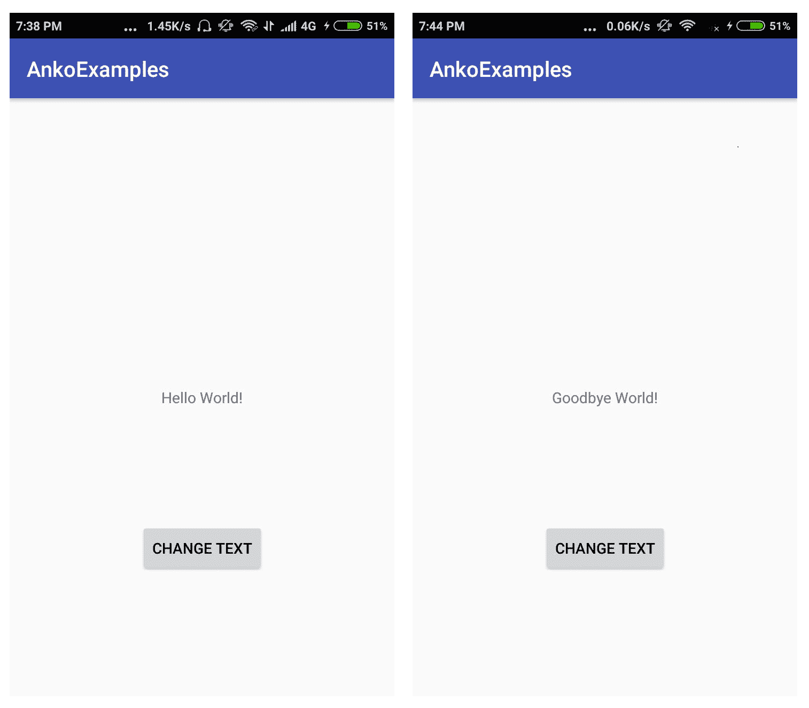

1.  以下是一个用于测试前面功能的 Espresso 测试示例：

```kt
class MainActivityTest {
    @Rule
    @JvmField var activityRule: ActivityTestRule<MainActivity> = ActivityTestRule(MainActivity::class.java)

    @Test
    fun testButtonBehaviour() {
        // Testing if the text is initially Hello World!        
        onView(withText("Hello World!"))
                .check(matches(isDisplayed()))
        onView(withId(button)).perform(click())
        // Testing if the text is initially Goodbye World!
        onView(withText("Goodbye World!"))
                .check(matches(isDisplayed()))

    }

}
```

1.  在第一行，我们创建了一个规则，它提供了单个活动的功能测试。这将打开测试运行之前的活动，并在测试完成后关闭它。`testButtonBehaviour` 方法中的语句检查 UI 条件，例如文本是否最初为 Hello World!（第一个条件），然后对按钮执行点击操作，最后检查文本是否现在是 Goodbye World!。

1.  您也可以使用 instrumentation API 获取“上帝”对象——即 `Context`：

```kt
var targetContext:Context = InstrumentationRegistry.getTargetContext()
```

1.  如果您想从意图中启动活动，您只需在 `ActivityTestRule` 构造函数中将第三个参数提供为 `false` 即可；它可以像下面这样使用：

```kt
@Rule
@JvmField var intentActivityRule: ActivityTestRule<MainActivity> = ActivityTestRule(MainActivity::class.java,true,false)

@Test
fun testIntentLaunch(){
    val intent = Intent()
    intentActivityRule.launchActivity(intent)
    onView(withText("Hello World!"))
            .check(matches(isDisplayed()))
}
```

Espresso 的另一个酷特性是使用 **Record Espresso Test** 记录交互。这将记录您与应用程序的所有交互，并可以从中生成测试。要使用该功能，请按照以下步骤操作：

1.  在工具栏上转到“运行”并选择“Record Espresso Test”：

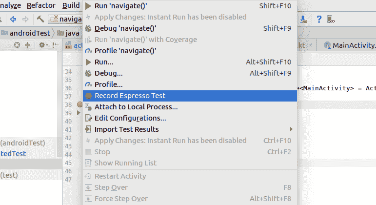

1.  然后将打开一个对话框，您可以在其中看到记录的步骤：

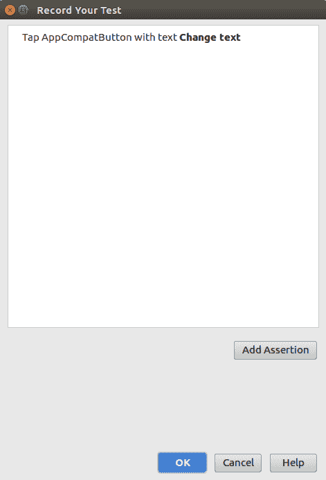

1.  点击 OK 将自动根据您的交互生成测试。

# 还有更多...

注意，我们已经在规则中使用了 `@JvmField` 注解。关于这一点，在 *如何在 Kotlin 中编写 JUnit 规则 (@Rule)* 菜谱中有详细的讨论。

# 在 Kotlin 中编写 assertEquals

`assertEquals` 语句在测试代码中得到了广泛的应用。它基本上接受两个参数——一个预期值和一个实际值，还有一个可选的第三个参数消息。如果预期值与实际值匹配，`assertEquals` 通过——否则，它失败。

使用原始类型与 `assertEquals` 一起使用很简单，但如果你想用它与自定义对象一起使用，你将不得不做更多的工作。例如，以下 `assertEquals` 将不会通过：

```kt
assertEquals(MyObj("abc"),MyObj("abc"))
```

在这个菜谱中，我们将学习如何编写 `assertEquals` 语句。

# 准备工作

我们将使用 Android Studio 3.0 进行我们的编码。您可以从 [`gitlab.com/aanandshekharroy/Anko-examples`](https://gitlab.com/aanandshekharroy/Anko-examples) 下载源代码，并切换到 `5-instrumentation-tests` 分支。

# 如何做到这一点...

让我们通过以下步骤来了解`assertEquals`：

1.  在以下代码中，如果您运行给定的 `assertEquals`，它将不会通过：

```kt
assertEquals(MyObj("abc"),MyObj("abc"))
```

1.  如果您检查差异，它将告诉您它们不相等，因为它们是两个不同的对象：

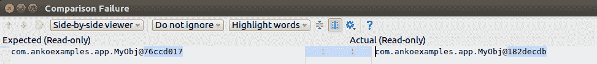

1.  因此，我们需要重写 `MyObj` 类的 `equals` 方法，我们将检查以下内容：

    +   是否其他对象引用相同的对象——这可以通过使用 `===` 运算符来完成，它检查引用相等性

    +   是否问题中的对象等于其他对象的 Java 类

    +   两个对象的内容是否相同：

```kt
override fun equals(other: Any?): Boolean {
    if (this === other) return true
    if (other?.javaClass != javaClass) return false
    other as MyObj

    if (name != other.name) return false

    return true
}
```

现在，当你用内容相同的两个对象运行 `assertEquals` 时，它将顺利通过。
