# 基础知识

对于许多人来说，学习编程语言是一种令人畏惧的经历，大多数人通常不会选择去承担这样的任务。既然你已经选择了阅读这本书，我假设你对学习 Kotlin 编程语言感兴趣，也许有一天你甚至会成为这个领域的专家。因此，请允许我祝贺你勇敢地迈出了学习这门语言的第一步。

无论你希望为哪个问题域构建解决方案，无论是应用开发、网络还是分布式系统，Kotlin 都是开发实现所需解决方案的系统的一个好选择。换句话说，开发者学习 Kotlin 是不会出错的。在这个时候，对 Kotlin 语言进行适当的介绍是必要的。

Kotlin 是一种强类型、面向对象的编程语言，它在 **Java 虚拟机**（**JVM**）上运行，并且可以用于在众多问题域中开发应用程序。除了在 JVM 上运行外，Kotlin 还可以编译成 JavaScript，因此它也是开发客户端网络应用程序的一个同样强大的选择。Kotlin 还可以通过 Kotlin/Native 直接编译成在无虚拟机系统上运行的本地二进制文件。Kotlin 编程语言主要是由位于俄罗斯圣彼得堡的 JetBrains 公司开发的。JetBrains 的开发者是当前的语言维护者。Kotlin 以 Kotlin 岛命名——一个位于圣彼得堡附近的小岛。

Kotlin 被设计用来在许多领域开发工业级软件，但它的主要用途来自 Android 生态系统。在撰写本文时，Kotlin 是 Google 宣布的三种官方 Android 语言之一。Kotlin 的语法与 Java 类似。事实上，它被设计成 Java 的更好替代品。因此，在软件开发中使用 Kotlin 而不是 Java 有许多显著的优点。

在本章中，你将学习以下内容：

+   Kotlin 的安装

+   Kotlin 编程语言的基础知识

+   安装和设置 Android Studio

+   Gradle

+   网络基础知识

# 开始学习 Kotlin

为了开发 Kotlin 程序，你首先需要在你的计算机上安装 **Java 运行时环境**（**JRE**）。JRE 可以与 **Java 开发工具包**（**JDK**）一起预包装下载。为了安装起见，我们将使用 JDK。

在计算机上安装 JDK 最简单的方法是使用 Oracle（Java 的所有者）提供的 JDK 安装程序之一。所有主要操作系统都有不同的安装程序可用。可以从 [`www.oracle.com/technetwork/java/javase/downloads/index.html`](http://www.oracle.com/technetwork/java/javase/downloads/index.html) 下载 JDK 的版本：

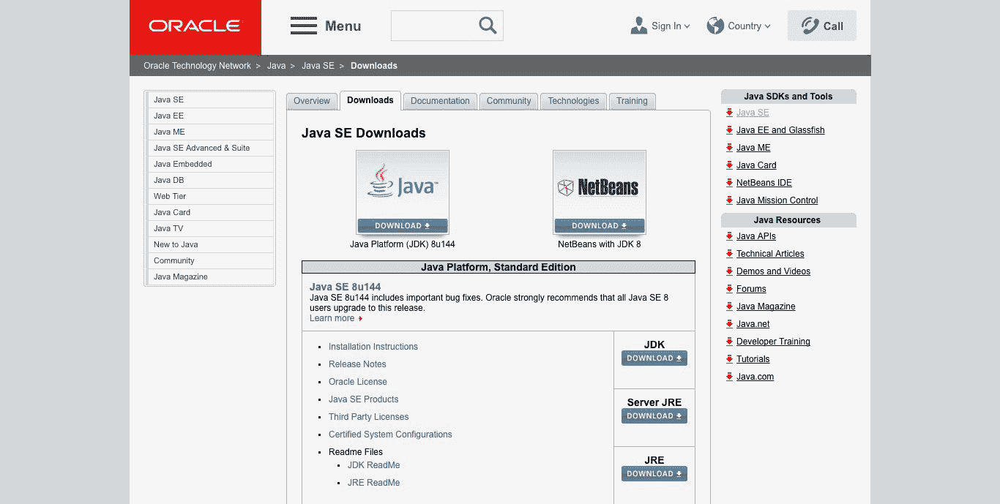

Java SE 网页

点击 JDK 下载按钮将带您到一个网页，您可以下载适合您操作系统和 CPU 架构的 JDK。下载适合您计算机的 JDK 并继续到下一部分：

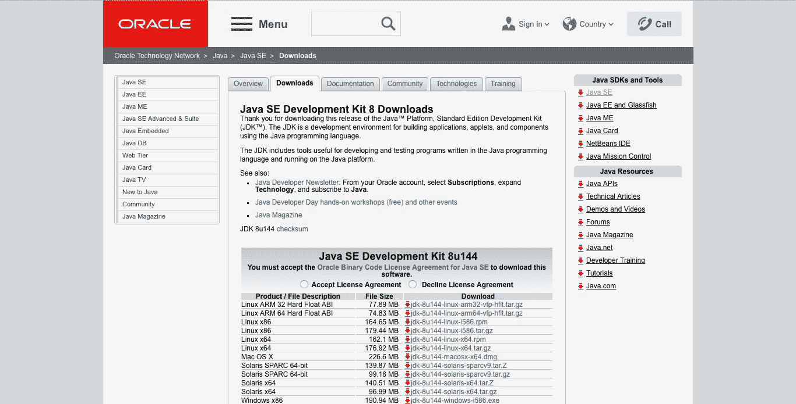

JDK 下载页面

# JDK 安装

为了在您的计算机上安装 JDK，请根据您的操作系统从以下部分检查必要的安装信息。

# Windows 上的安装

在 Windows 上安装 JDK 可以通过四个简单的步骤完成：

1.  双击下载的安装文件以启动 JDK 安装程序。

1.  在欢迎窗口中点击“下一步”按钮。此操作将带您到一个可以选择要安装的组件的窗口。保持默认选择并点击“下一步”。

1.  以下窗口提示选择安装目标文件夹。目前，请保持此文件夹为默认设置（同时注意此文件夹的位置，您将在后续步骤中需要它）。点击“下一步”。

1.  按照即将出现的窗口中的说明操作，并在必要时点击“下一步”。您可能需要输入管理员密码，如有需要请输入。Java 将被安装到您的计算机上。

JDK 安装完成后，您需要在您的计算机上设置 `JAVA_HOME` 环境变量。为此：

1.  打开您的控制面板。

1.  选择“编辑环境变量”。

1.  在打开的窗口中，点击“新建”按钮。您将被提示添加一个新的环境变量。

1.  将变量名输入为 `JAVA_HOME` 并输入 JDK 的安装路径作为变量值。

1.  点击“确定”一次以添加环境变量。

# macOS 上的安装

为了在 macOS 上安装 JDK，请执行以下步骤：

1.  下载您所需的 JDK `.dmg` 文件。

1.  定位下载的 `.dmg` 文件并双击它。

1.  打开一个包含 JDK 包图标的查找器窗口。双击此图标以启动安装程序。

1.  在介绍窗口中点击“继续”。

1.  在出现的安装窗口中点击“安装”。

1.  当需要时输入管理员登录名和密码，然后点击“安装软件”。

JDK 将被安装，并显示一个确认窗口。

# Linux 上的安装

使用 `apt-get` 在 Linux 上安装 JDK 很简单且直接：

1.  更新您的计算机的软件包索引。从您的终端运行：

```
 sudo apt-get update
```

1.  通过运行以下命令检查 Java 是否已经安装：

```
 java -version
```

1.  如果系统上 Java 安装的版本信息被打印出来，您就会知道 Java 已经安装。如果没有安装版本，请运行：

```
 sudo apt-get install default-jdk
```

就这样！JDK 将被安装到您的计算机上。

# 编译 Kotlin 程序

现在我们已经设置了 JDK 并准备使用，我们需要安装一种实际编译和运行我们的 Kotlin 程序的方法。

Kotlin 程序可以直接使用 Kotlin 命令行编译器编译，或者使用**集成开发环境**（**IDE**）构建和运行。

# 使用命令行编译器

命令行编译器可以通过 Homebrew、SDKMAN! 和 MacPorts 进行安装。设置命令行编译器的另一种选项是手动安装。

# 在 macOS 上安装命令行编译器

Kotlin 命令行编译器可以在 macOS 上以多种方式安装。在 macOS 上安装它的两种最常见方法是使用 Homebrew 和 MacPorts。

# Homebrew

Homebrew 是 macOS 系统的软件包管理器。它被广泛用于安装构建软件项目所需的软件包。要安装 Homebrew，定位您的 macOS 终端并运行：

```
/usr/bin/ruby -e "$(curl -fsSL https://raw.githubusercontent.com/Homebrew/install/master/install)"
```

您将需要等待几秒钟以完成 Homebrew 的下载和安装。安装完成后，通过在终端中运行以下命令来检查 Homebrew 是否正常工作：

```
brew -v
```

如果您的计算机上安装的 Homebrew 版本在终端中打印出来，则表示 Homebrew 已成功安装在您的计算机上。

在正确安装 Homebrew 后，定位您的终端并执行以下命令：

```
brew install kotlin
```

等待安装完成，之后您就可以使用命令行编译器编译 Kotlin 程序了。

# MacPorts

与 HomeBrew 类似，MacPorts 是 macOS 的软件包管理器。安装 MacPorts 很简单。可以通过以下方式在系统上安装：

1.  安装 Xcode 和 Xcode 命令行工具。

1.  同意 Xcode 许可协议。这可以通过在终端中运行 `xcodebuild -license` 来完成。

1.  安装所需版本的 MacPorts。

MacPort 版本可以从 [`www.macports.org/install.php`](https://www.macports.org/install.php) 下载。

下载完成后，定位您的终端并以超级用户身份运行 `port install kotlin` 命令：

```
sudo port install kotlin
```

# 在 Linux 上安装命令行编译器

Linux 用户可以使用 SDKMAN! 轻松安装 Kotlin 的命令行编译器

# SDKMAN!

这可以用于在基于 Unix 的系统（如 Linux 及其各种发行版，例如 Fedora 和 Solaris）上安装软件包。SDKMAN! 可以通过以下三个简单步骤进行安装：

1.  使用 `curl` 将软件下载到您的系统上。定位您的终端并运行：

```
 curl -s "https://get.sdkman.io" | bash
```

1.  在运行上述命令后，您的终端将出现一系列说明。按照这些说明完成安装。完成说明后，运行：

```
 source "$HOME/.sdkman/bin/sdkman-init.sh"
```

1.  运行以下命令：

```
 sdk version
```

如果刚刚安装的 SDKMAN! 的版本号在您的终端窗口中打印出来，则表示安装成功。

现在我们已经成功在我们的系统上安装了 SDKMAN!，我们可以通过运行以下命令来安装命令行编译器：

```
 sdk install kotlin
```

# 在 Windows 上安装命令行编译器

为了在 Windows 上使用 Kotlin 命令行编译器：

1.  从 [`github.com/JetBrains/kotlin/releases/tag/v1.2.30`](https://github.com/JetBrains/kotlin/releases/tag/v1.2.30) 下载软件的 GitHub 发布版

1.  定位并解压下载的文件

1.  打开解压后的 `kotlinc\bin` 文件夹

1.  使用文件夹路径启动命令提示符

您现在可以从命令行使用 Kotlin 编译器。

# 运行您的第一个 Kotlin 程序

现在我们已经设置了命令行编译器，让我们用一个简单的 Kotlin 程序来试试。导航到您的家目录，并创建一个名为 `Hello.kt` 的新文件。所有 Kotlin 文件都会在文件名末尾附加 `.kt` 扩展名。

使用您选择的文本编辑器打开您刚刚创建的文件，并输入以下内容：

```
// The following program prints Hello world to the standard system output.
fun main (args: Array<String>) {
  println("Hello world!")
}
```

保存对程序文件的更改。更改保存后，打开您的终端窗口并输入以下命令：

```
kotlinc hello.kt -include-runtime -d hello.jar
```

上述命令将您的程序编译成可执行文件 `hello.jar`。`-include-` 运行时标志用于指定您希望编译的 JAR 文件是自包含的。通过向命令中添加此标志，Kotlin 运行时库将被包含在您的 JAR 中。`-d` 标志指定在这种情况下，我们希望编译器的输出被调用。

现在我们已经编译了我们的第一个 Kotlin 程序，我们需要运行它——毕竟，如果程序不能在以后运行，编写程序就没有乐趣了。打开您的终端，如果尚未打开，请导航到保存 JAR 文件的目录（在本例中为家目录）。要运行编译后的 JAR 文件，请执行以下操作：

```
java -jar hello.jar
```

运行上述命令后，您应该在显示屏上看到打印出 `Hello world!`。恭喜您，您刚刚编写了您的第一个 Kotlin 程序！

# 使用 Kotlin 编写脚本

如前所述，Kotlin 可以用来编写脚本。脚本是为特定运行时环境编写的程序，其通用目的是自动化任务的执行。在 Kotlin 中，脚本文件名会附加 `.kts` 扩展名。

编写 Kotlin 脚本与编写 Kotlin 程序类似。实际上，用 Kotlin 编写的脚本与常规 Kotlin 程序完全相同！Kotlin 脚本与常规 Kotlin 程序之间唯一的显著区别是缺少主函数。

在您选择的目录中创建一个名为 `NumberSum.kts` 的文件。打开文件并输入以下程序：

```
val x: Int = 1
val y: Int = 2
val z: Int = x + y
println(z)

```

如您所猜测的，前面的脚本将打印 `1` 和 `2` 的和到标准系统输出。保存文件更改并运行脚本：

```
kotlinc -script NumberSum.kts
```

需要注意的一个重要事项是，Kotlin 脚本不需要编译。

# 使用 REPL

REPL 是一个代表 **读取-评估-打印循环** 的缩写。REPL 是一个交互式外壳环境，在其中可以执行程序并立即获得结果。可以通过运行不带任何参数的 `kotlinc` 命令来调用交互式外壳环境。

可以通过在终端中运行 `kotlinc` 来启动 Kotlin REPL。

如果 REPL 成功启动，您的终端将打印一条欢迎信息，然后是下一行的`>>>`，提示我们 REPL 正在等待输入。现在您可以在终端中输入代码，就像在任何文本编辑器中一样，并立即从 REPL 获得反馈。这在上面的屏幕截图中得到了演示：

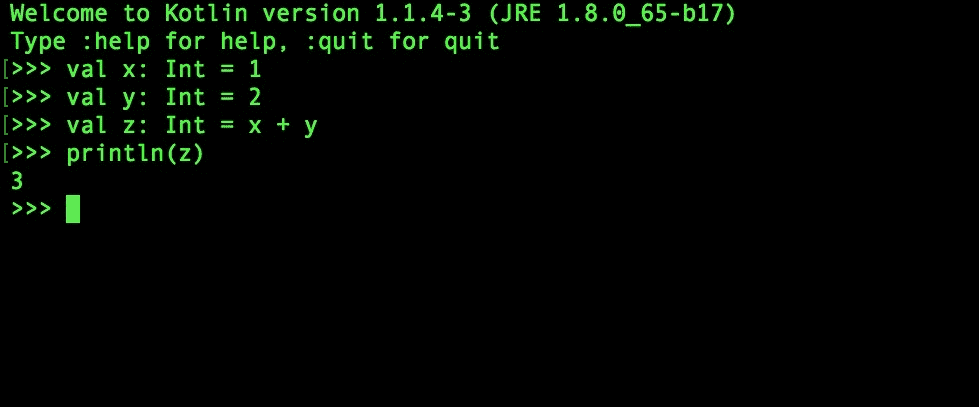

Kotlin REPL

在前面的屏幕截图中，整数`1`和`2`分别赋值给`x`和`y`。`x`和`y`的和存储在新的`z`变量中，`z`的值通过`print()`函数打印到显示。

# 使用 IDE 进行工作

使用命令行编写程序有其用途，但在大多数情况下，使用专门为使开发者能够编写程序而构建的软件会更好。这在处理大型项目时尤其如此。

IDE 是一种计算机应用程序，它为程序员提供了一系列工具和实用程序，用于软件开发。有多个 IDE 可以用于 Kotlin 开发。在这些 IDE 中，IntelliJ IDEA 是为开发 Kotlin 应用程序而设计的功能最全面的 IDE。由于 IntelliJ IDEA 是由 Kotlin 的创造者开发的，因此与其他 IDE 相比，使用它有许多优势，例如编写 Kotlin 程序的无与伦比的工具集，以及针对 Kotlin 编程语言最新进步和新增功能的及时更新。

# 安装 IntelliJ IDEA

IntelliJ IDEA 可以从 JetBrains 的网站直接下载：[`www.jetbrains.com/idea/download`](https://www.jetbrains.com/idea/download)。在网页上，您可以看到两个可供下载的版本：付费的终极版和免费的社区版。如果您想运行本章的程序，社区版就足够了。选择您要下载的版本：


IntelliJ IDEA 下载页面

下载完成后，双击下载的文件，并将其安装到您的操作系统上，就像安装任何程序一样。

# 使用 IntelliJ 设置 Kotlin 项目

使用 IntelliJ 设置 Kotlin 项目的流程很简单：

1.  启动 IntelliJ IDE 应用程序。

1.  点击创建新项目。

1.  在新打开窗口的左侧选择可用的项目选项中的 Java。

1.  将 Kotlin/JVM 作为附加库添加到项目中。

1.  在窗口的下拉列表中选择一个项目 SDK。

1.  点击下一步。

1.  如果您想使用模板，请选择一个，然后继续到下一屏幕。

1.  在提供的输入字段中提供项目名称。现在将项目命名为`HelloWorld`。

1.  在输入字段中设置项目位置。

1.  点击完成。

您的项目将被创建，您将看到 IDE 窗口：

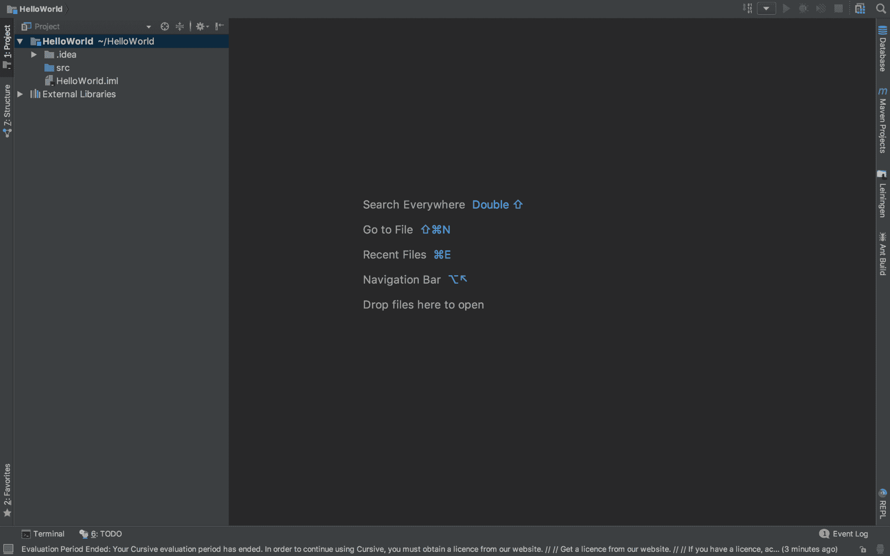

在窗口的左侧，你将立即看到项目视图。这个视图显示了你的项目文件的逻辑结构。

有两个文件夹存在。这些是：

+   `.idea`：这包含 IntelliJ 的项目特定设置文件。

+   `src`：这是你的项目源文件夹。你将在这个文件夹中放置你的程序文件。

现在项目已经设置好了，我们将编写一个简单的程序。在源文件夹中添加一个名为 `hello.kt` 的文件（右键点击 `src` 文件夹，选择 New | Kotlin File/Class，并将文件命名为 `hello`）。将以下代码复制并粘贴到文件中：

```
fun main(args: Array<String>) {
  println("Hello world!")
}
```

运行程序时，点击主函数旁边相邻的 Kotlin 图标，然后选择运行 HelloKt:

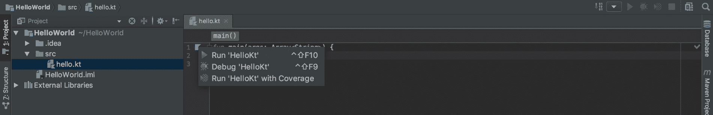

项目构建并运行后，`Hello world!` 将被打印到标准系统输出。

# Kotlin 编程语言的基础

现在我们已经设置了我们的开发环境和所选择的 IDE，是时候探索 Kotlin 了。我们将从深入了解语言的基础开始，然后进入更高级的主题，例如 **面向对象编程** (**OOP**)。

# Kotlin 基础

在本节中，我们将探讨 Kotlin 的基础知识——如果你愿意，可以说是构建块。我们将从讨论变量开始。

# 变量

变量是一个标识符，用于表示一个存储值的内存位置。更简单地说，变量就是一个持有值的标识符。考虑以下程序：

```
fun main(args: Array<String>) {
  var x: Int = 1
}

```

前面的 `x` 是一个变量，它持有的值是 `1`。更具体地说，`x` 是一个整型变量。`x` 被称为整型变量，因为 `x` 被定义为具有 `Int` 数据类型。因此，`x` 变量只能持有整数值。更准确地说，我们可以说 `x` 是 `Int` 类的一个实例。此时，你一定想知道在这个上下文中“实例”和“类”这两个词的含义。所有答案都将适时揭晓。现在，让我们专注于变量的主题。

在 Kotlin 中定义变量时，我们使用 `var` 关键字。这个关键字指定变量是可变的。因此，它可以被更改。声明的变量的数据类型位于变量标识符后面的分号之后。需要注意的是，变量的数据类型不必显式定义。这是因为 Kotlin 支持类型推断——在定义时推断对象类型的能力。我们甚至可以将我们的 `x` 变量的定义写成如下：

```
var x = 1
```

定义的结果将是相同的。可以在变量定义的行尾添加分号，但与 JavaScript 等语言类似，这不是必需的：

```
var x = 1 // I am a variable identified by x and I hold a value of 1
var y = 2 // I am a variable identified by y and I hold a value of 2
var z: Int = x + y // I am a variable identified by z and I hold a value of 3
```

如果我们不想在程序执行过程中改变变量的值，我们可以通过使它们不可变来实现。不可变变量使用 `val` 关键字定义，如下所示：

```
val x = 200
```

# 变量作用域

变量的作用域是程序中变量具有意义的区域。换句话说，变量的作用域是程序中变量可以使用的区域。Kotlin 变量具有块作用域。因此，变量可以在它们定义的代码块覆盖的所有区域中使用：

```
fun main(args: Array<String>) {
  // block A begins
  var a = 10
  var i = 1

  while (i < 10) {
    // block B begins
    val b = a / i
    print(b)
    i++
  }
  print(b) // Error occurs: variable b is out of scope
}
```

在前面的程序中，我们可以通过查看两个代码块来直接观察到块作用域的影响。一个函数的定义开启了一个新的代码块。在我们的例子中，我们将这个代码块标记为`B`。在`A`内部，`a`和`i`变量被声明。因此，`a`和`i`变量的作用域存在于`A`内部。

在`A`内部创建了一个`while`循环，因此打开了一个新的`B`代码块。循环声明标志着新代码块的开始。在`B`内部声明了一个`b`值。`b`值存在于`B`的作用域内，不能在其作用域之外使用。因此，当我们尝试在`B`代码块之外打印`b`值所持有的值时，将发生错误。

值得注意的是，`a`和`i`变量仍然可以在`B`代码块中使用。这是因为`B`存在于`A`的作用域内。

# 局部变量

这些是局部于作用域的变量。在我们之前的例子中，`a`、`i`和`b`变量都是局部变量。

# 操作数和运算符

运算符是指令的一部分，它指定要操作的价值。运算符还对其操作数执行特定的操作。运算符的示例包括`+`、`-`、`*`、`/`和`%`。运算符可以根据执行的操作类型和运算符作用的操作数数量进行分类。

根据运算符执行的操作类型，我们可以将运算符分为以下几类：

+   关系运算符

+   赋值运算符

+   逻辑运算符

+   算术运算符

+   位运算符

| **运算符类型** | **示例** |
| --- | --- |
| 关系运算符 | `>`, `<`, `>=`, `<=`, `==` |
| 赋值运算符 | `+=`, `-=`, `*=`, `/=`, `=` |
| 逻辑运算符 | `&&`, ` | | `, `!` |
| 算术运算符 | `+`, `-`, `*`, `/` |
| 位运算符 | `and(bits)`, `or(bits)`, `xor(bits)`, `inv()`, `shl(bits)`, `shr(bits)`, `ushr(bits)` |

根据运算符作用的操作数数量，Kotlin 中有两种主要的运算符类型：

+   一元运算符

+   二元运算符

| **运算符类型** | **描述** | **示例** |
| --- | --- | --- |
| 一元运算符 | 只需要一个操作数 | `!`, `++`, `--` |
| 二元运算符 | 需要两个操作数 | `+`, `-`, `*`, `/`, `%`, `&&`, ` | | ` |

# 类型

变量的类型，就其值域而言，是变量可以拥有的可能值的集合。在许多情况下，能够显式指定你想要声明的变量持有的值的类型是有用的。这可以通过使用数据类型来实现。

Kotlin 中一些重要的类型包括：

+   `整数`

+   `浮点数`

+   `双精度浮点数`

+   `布尔`

+   `字符串`

+   `字符`

+   `数组`

# `整数`

这种类型表示一个 32 位有符号整数。当一个变量使用这种类型声明时，变量的值域是整数集，也就是说，变量只能持有整数值。到目前为止，我们在示例中已经多次看到了这种类型的使用。`Int`类型可以持有从-2,147,483,648 到 2,147,483,647 范围内的整数值。

# Float

这种类型表示单精度 32 位浮点数。当与变量一起使用时，此类型指定变量只能持有浮点值。其范围大约是±3.40282347E+38F（6-7 位有效数字）：

```
var pi: Float = 3.142
```

# Double

这种类型表示双精度 64 位浮点数。与`Float`类型类似，这种类型指定了正在声明的变量持有浮点值。`Double`和`Float`类型之间的重要区别是`Double`可以在不溢出的情况下持有更大范围的数字。其范围大约是±1.79769313486231570E+308（15 位有效数字）：

```
var d: Double = 3.142
```

# Boolean

`true`和`false`逻辑真值由`Boolean`类型表示：

```
var t: Boolean = true
var f: Boolean = false
```

布尔值通过`&&`、`||`和`!`逻辑运算符进行操作：

| **运算符名称** | **运算符** | **描述** | **运算符类型** |
| --- | --- | --- | --- |
| 逻辑与 | `&&` | 当其两个操作数都为`true`时返回`true`，否则返回`false`。 | 二元 |
| 逻辑或 | `&#124;&#124;` | 当至少有一个操作数为`true`时返回`true`，否则返回`false`。 | 二元 |
| 否定 | `!` | 取反其布尔操作数的值。 | 一元 |

# String

字符串是一系列字符的序列。在 Kotlin 中，字符串由字符串类表示。可以通过输入一系列字符并用双引号包围来轻松地写出字符串：

```
val martinLutherQuote: String = "Free at last, Free at last, Thank God almighty we are free at last."
```

# Char

这种类型用于表示字符。字符是信息单位，大致对应于图形符号、类似图形符号的单位或符号。在 Kotlin 中，字符是`Char`类型。Kotlin 中单引号内的字符，如`a`、`$`、`%`和`&`，都是字符的例子：

```
val c: Char = 'i' // I am a character
```

回想我们之前提到的，字符串是一系列字符的序列：

```
var c: Char
val sentence: String = "I am made up of characters."

for (character in sentence) {
  c = character // Value of character assigned to c without error
  println(c)
}
```

# Array

数组是一种数据结构，由一组具有至少一个索引或键的元素或值组成。数组在存储你希望在程序中稍后利用的元素集合时非常有用。

在 Kotlin 中，使用`arrayOf()`库方法创建数组。你希望存储在数组中的值以逗号分隔的序列传递：

```
val names = arrayOf("Tobi", "Tonia", "Timi")
```

每个数组的值都有一个唯一的索引，它既指定了其在数组中的位置，也可以用于稍后检索该值。数组的索引集合从索引 0 开始，以 1 为增量递增。

可以通过调用`Array#get()`方法或使用`[]`操作来检索数组中任何给定索引位置的值：

```
val numbers = arrayOf(1, 2, 3, 4)
println(numbers[0]) // Prints 1
println(numbers.get(1)) // Prints 2
```

在任何时刻，都可以更改数组中某个位置上的值：

```
val numbers = arrayOf(1, 2, 3, 4)
println(numbers[0]) // Prints 1
numbers[0] = 23
println(numbers[0]) // Prints 23
```

您可以随时使用其`length`属性来检查数组的大小：

```
val numbers = arrayOf(1, 2, 3, 4)
println(numbers.length) // Prints 4
```

# 函数

函数是一段可以被定义一次并多次重用的代码块。在编写程序时，将复杂的程序流程分解成执行特定任务的较小单元是最佳实践。这样做有许多优点，其中一些包括：

+   **提高代码可读性**：将程序分解成功能单元的程序更容易阅读。这是因为当使用函数时，任何给定时刻需要理解代码的范围都会减小。大多数时候，程序员只需要编写或调整大型代码库的一部分。当使用函数时，为了改善程序逻辑，需要阅读的程序上下文仅限于编写逻辑的函数体。

+   **提高代码库的可维护性**：在代码库中使用函数使得维护程序变得容易。如果需要对特定程序功能进行更改，很多时候只需调整创建该功能的函数即可。

# 声明函数

函数使用`fun`关键字声明。以下是一个简单的函数定义：

```
fun printSum(a: Int, b: Int) {
  print(a + b)
}
```

函数简单地打印出传递给它作为参数的两个值的总和。函数定义可以分解为以下组件：

+   **函数标识符**：函数的标识符是赋予它的名称。如果我们希望在程序中稍后调用该函数，则需要一个标识符。在前面的函数声明中，`printSum`是函数的标识符。

+   **包含逗号分隔的参数列表的括号对**：传递给函数的值称为函数的参数。传递给函数的所有参数都必须有类型。参数的类型定义位于参数名称后的分号之后。

+   **返回类型指定**：函数的返回类型与变量和属性的类型的指定方式类似。返回类型指定位于最后一个括号之后，通过在分号之后写入类型来完成。

+   **包含函数主体的代码块**。

观察前面的函数，它可能看起来没有返回类型。这并不`true`，该函数的返回类型是`Unit`。不需要显式指定单元返回类型。该函数也可以声明如下：

```
fun printSum(a: Int, b: Int): Unit {
  print(a + b)
}
```

函数不需要标识符。没有标识符的函数称为匿名函数。在 Kotlin 中，匿名函数以 lambda 的形式存在。

# 调用函数

函数定义后不会立即执行。为了执行函数内的代码，必须调用该函数。函数可以作为函数、方法调用，也可以通过使用 `invoke()` 和 `call()` 方法间接调用。以下展示了使用函数本身的直接函数调用：

```
fun repeat(word: String, times: Int) { 
  var i = 0

  while (i < times) {
    println(word)
    i++
  }
}

fun main(args: Array<String>) {
  repeat("Hello!", 5)
}
```

编译并运行前面的代码。屏幕上会打印出五次单词 `Hello`。`Hello` 是作为函数的第一个值传递的，而 `5` 是作为第二个值传递的。因此，`word` 和 `times` 参数被设置为在重复函数中保留 `Hello` 和 `5` 的值。我们的 `while` 循环会一直运行并打印我们的单词，直到 `i` 小于指定的次数。`i++` 用于将 `i` 的值增加 1。每次循环迭代时，`i` 的值都会增加 1。当 `i` 等于 `5` 时，循环停止。因此，我们的单词 `Hello` 将被打印五次。编译并运行程序将给出以下输出：

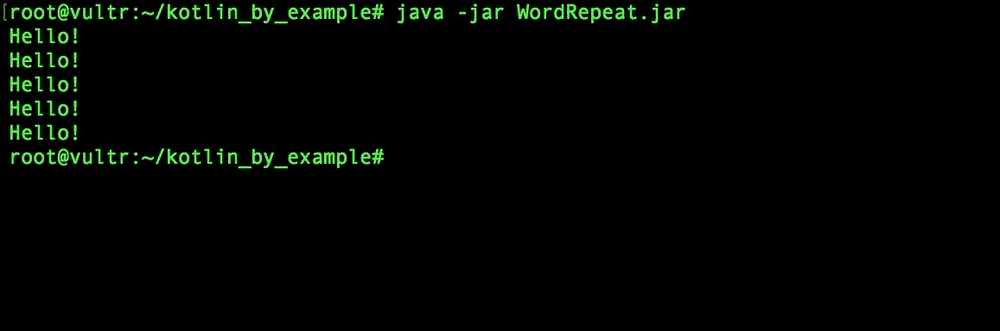

本书将演示函数调用的其他方法。

# 返回值

返回值——正如其名所示——是方法返回的值。Kotlin 中的函数在执行时可以返回值。函数返回值的类型由函数的返回类型定义。以下代码片段展示了这一点：

```
fun returnFullName(firstName: String, surname: String): String {
  return "${firstName} ${surname}"
}

fun main(args: Array<String>) {
  val fullName: String = returnFullName("James", "Cameron")
  println(fullName) // prints: James Cameron
}
```

在前面的代码中，`returnFullName` 函数接受两个不同的字符串作为其输入参数，并在调用时返回一个字符串值。返回类型已在函数头部定义。返回的字符串是通过字符串模板创建的：

```
"${firstName} ${surname}"
```

首名和姓氏的值被插入到字符字符串中。

# 函数命名约定

Kotlin 中命名函数的约定与 Java 类似。在命名方法时，使用驼峰式命名法。在驼峰式命名法中，名称的每个单词都以大写字母开头，没有空格或标点符号：

```
//Good function name
fun sayHello() {
  println("Hello")
}

//Bad function name
fun say_hello() {
  println("Hello")
}
```

# 注释

在编写代码时，你可能需要记下与正在编写的代码相关的关键信息。这是通过使用注释来完成的。Kotlin 中有三种类型的注释：

+   单行注释

+   多行注释

+   文档注释

# 单行注释

如其名所示，这些注释跨越单行。单行注释以两个反斜杠（`//`）开始。在程序编译时，这些斜杠之后的所有字符都将被忽略。考虑以下代码：

```
val b: Int = 957 // This is a single line comment
// println(b)
```

变量 `b` 的值永远不会打印到控制台，因为执行打印操作的函数已被注释掉。

# 多行注释

多行注释跨越多行。它们以反斜杠后跟一个星号（`/*`）开始，以星号后跟一个反斜杠（`*/`）结束：

```
/*
 * I am a multiline comment.
 * Everything within me is commented out.
*/
```

# 文档注释

这种注释类似于多行注释。主要区别在于它用于在程序中注释代码。文档注释以反斜杠后跟两个星号字符（`/**`）开始，并以星号后跟反斜杠（`*/`）结束：

```
/**
 * Adds an [item] to the queue.
 * @return the new size of the queue.
*/
fun enqueue(item: Object): Int { ... }
```

# 控制程序流程

在编写程序时，经常遇到的一个场景是我们想要控制程序的执行方式。如果我们想编写可以根据条件和程序状态做出决策的程序，这是必要的。Kotlin 拥有用于此目的的多种结构，这些结构对以前使用过编程语言的人来说很熟悉，例如 `if`、`while` 和 `for` 构造。还有一些可能对个人来说不太熟悉的结构，例如 `when` 构造。在本节中，我们将探讨我们可以用来控制程序流程的结构。

# 条件表达式

条件表达式用于分支程序流程。它们根据条件测试的结果执行或跳过程序语句。条件语句是程序中的决策点。

Kotlin 处理分支有两个主要结构。这些是 `if` 表达式和 `when` 表达式。

# `if` 表达式

`if` 表达式用于根据条件的满足情况做出逻辑决策。我们使用 `if` 关键字来编写 `if` 表达式：

```
val a = 1

if (a == 1) {
 print("a is one")
} 
```

前面的 `if` 表达式测试 `a == 1`（读作：`a` 等于 `1`）条件是否成立。如果条件为 `true`，则屏幕上打印出 `a is one` 字符串，否则不打印任何内容。

一个 `if` 表达式通常有一个或多个伴随的 `else` 或 `else if` 关键字。这些伴随关键字可以用来进一步控制程序的流程。以下是一个 `if` 表达式的例子：

```
val a = 4
if (a == 1) {
  print("a is equal to one.")
} else if (a == 2) {
    print("a is equal to two.")
} else {
    print("a is neither one nor two.")
}
```

前面的表达式首先测试 `a` 是否等于 `1`。这个测试的结果是 `false`，因此接下来测试了另一个条件。显然 `a` 不等于 `2`。因此，第二个条件的结果也是 `false`。由于所有前面的条件都评估为 `false`，所以执行了最后的语句。因此，屏幕上打印出 `a is neither one nor two.`。

# `when` 表达式

`when` 表达式是另一种控制程序流程的方法。让我们通过一个简单的例子来看看它是如何工作的：

```
fun printEvenNumbers(numbers: Array<Int>) {
  numbers.forEach {
    when (it % 2) {
      0 -> println(it)
    }
  }
}

fun main (args: Array<String>) {
  val numberList: Array<Int> = arrayOf(1, 2, 3, 4, 5, 6)
  printEvenNumbers(numberList)
}
```

前面的 `printEvenSum` 函数只接受一个整数数组作为其唯一参数。我们将在本章后面讨论数组，但就现在而言，可以将它们视为存在于值空间中的值的有序集合。在这种情况下，传递的数组包含存在于整数值空间中的值。使用 `forEach` 方法迭代数组的每个元素，并在 `when` 表达式中测试每个数字。

在这里，`it` 指的是 `forEach` 方法正在迭代的当前值。`%` 操作符是一个二元操作符，作用于两个操作数。它将第一个操作数除以第二个操作数，并返回除法的余数。因此，`when` 表达式测试当前迭代的值（`it` 中保存的值）除以 `2` 是否有余数为 `0`。如果有，则该值是偶数，因此打印该值。

要观察程序的工作方式，请将前面的代码复制并粘贴到一个文件中，然后编译并运行程序：

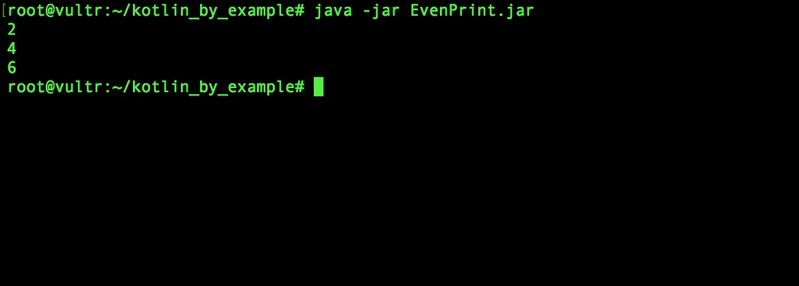

# Elvis 操作符

Elvis 操作符是 Kotlin 中存在的一种简洁结构。它具有以下形式：

```
(expression) ?: value2

```

在以下代码块中展示了在 Kotlin 程序中的使用：

```
val nullName: String? = null
val firstName = nullName ?: "John"
```

如果 `nullName` 保存的值不是 `null`，则 Elvis 操作符返回它，否则返回 `"John"` 字符串。因此，`firstName` 被分配给 Elvis 操作符返回的值。

# 循环

循环语句用于确保代码块中的语句集合在执行中重复。也就是说，循环确保程序中的多个语句执行多次。Kotlin 提供的循环结构是 `for` 循环、`while` 循环和 `do…while` 循环。

# `for` 循环

Kotlin 中的 `for` 循环遍历任何提供迭代器的对象。它与 Ruby 中的 `for..in` 循环类似。循环具有以下语法：

```
for (obj in collection) { … }
```

如果循环中只有一个语句，则 `for` 循环中的块不是必需的。集合是一种提供迭代器的结构类型。考虑以下程序：

```
val numSet = arrayOf(1, 563, 23)

for (number in numSet) {
  println(number)
}
```

`numSet` 数组中的每个值都会被循环迭代，并分配给变量 `number`。然后，`number` 被打印到标准系统输出。

数组的每个元素都有一个索引。索引是元素在数组中持有的位置。Kotlin 中数组索引的集合从零开始。

如果我们不想打印迭代的数字的数值，而是想打印每个数字的索引，我们可以这样做：

```
for (index in numSet.indices) {
  println(index)
}
```

您可以为迭代器变量指定一个类型：

```
for (number: Int in numSet) {
  println(number)
}
```

# `while` 循环

当满足指定条件时，`while` 循环会执行一个块内的指令。`while` 循环是通过使用 `while` 关键字创建的。它具有以下形式：

```
while (condition) { … }
```

与 `for` 循环的情况一样，当循环范围内只有一个句子时，块是可选的。在 `while` 循环中，块内的语句在指定的条件仍然保持时重复执行。考虑以下代码：

```
val names = arrayOf("Jeffrey", "William", "Golding", "Segun", "Bob")
var i = 0

while (!names[i].equals("Segun")) {
  println("I am not Segun.")
  i++
}
```

在前面的程序中，`while` 循环内的代码块执行并打印 `I am not Segun`，直到遇到名称 `Segun`。一旦遇到 `Segun`，循环终止，不再打印其他内容，如下面的截图所示：

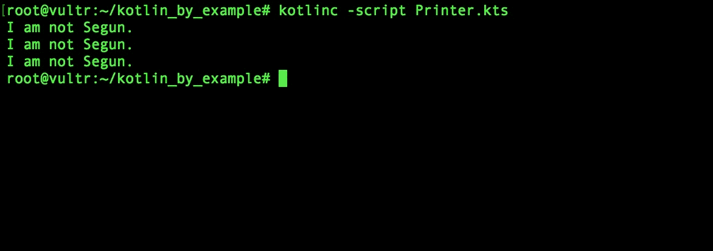

# `break` 和 `continue` 关键字

常常在声明循环时，需要根据条件满足与否，从循环中跳出，或者在任何时间点开始下一次迭代。这可以通过使用`break`和`continue`关键字来实现。让我们通过一个例子来进一步解释这一点。打开一个新的 Kotlin 脚本文件，并将以下代码复制到其中：

```
data class Student(val name: String, val age: Int, val school: String)

val prospectiveStudents: ArrayList<Student> = ArrayList()
val admittedStudents: ArrayList<Student> = ArrayList()

prospectiveStudents.add(Student("Daniel Martinez", 12, "Hogwarts"))
prospectiveStudents.add(Student("Jane Systrom", 22, "Harvard"))
prospectiveStudents.add(Student("Matthew Johnson", 22, "University of Maryland"))
prospectiveStudents.add(Student("Jide Sowade", 18, "University of Ibadan"))
prospectiveStudents.add(Student("Tom Hanks", 25, "Howard University"))

for (student in prospectiveStudents) {
  if (student.age < 16) {
    continue
  }
  admittedStudents.add(student)

  if (admittedStudents.size >= 3) {
    break
  }
}

println(admittedStudents)
```

上述程序是一个从潜在学生名单中选择录取学生的简单软件。我们在程序开始时创建一个数据类来模拟每个学生的数据，然后创建了两个数组列表。一个数组列表包含潜在学生的信息，那些申请入学的人，另一个列表包含已被录取的学生信息。

接下来的五行代码将潜在的学生添加到潜在学生名单中。然后我们声明一个循环，遍历潜在学生名单中的所有学生。如果循环中当前学生的年龄小于 16 岁，循环将跳到下一次迭代。这模拟了学生年龄太小无法被录取（因此不会被添加到录取学生名单中）的情况。

如果学生年龄为 16 岁或以上，该学生将被添加到录取名单中。然后使用`if`表达式检查录取学生的数量是否大于或等于三个。如果条件为真，程序将跳出循环，不再进行进一步的迭代。程序的最后一行打印出名单中的学生。

运行程序以查看输出：

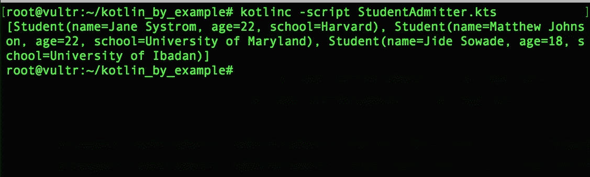

# do…while 循环

`do…while`循环与`while`循环类似，区别在于在循环重迭代的条件测试中，它是在第一次迭代之后进行的。它具有以下形式：

```
do { 
 ...
} while (condition) 
```

当测试的条件保持`true`时，将执行块内的语句：

```
var i = 0

do {
 println("I’m in here!")
 i++
} while (i < 10)

println("I’m out here!")
```

**可空值**：`NullPointerException`是那些有编写 Java 代码第一手经验的个人肯定遇到过的事情。Kotlin 类型系统是空安全的——它试图消除代码中空引用的发生。因此，Kotlin 具有可空类型和非可空类型（可以持有空值和不能持有空值的类型）。

为了正确解释`NullPointerException`，我们将考虑以下 Java 程序：

```
class NullPointerExample {

 public static void main(String[] args) {
  String name = "James Gates";
  System.out.println(name.length()); // Prints 11

  name = null; // assigning a value of null to name
  System.out.println(name.length()); // throws NullPointerException
 }
}
```

上述程序执行了一个简单的任务，即将字符串变量的长度打印到标准系统输出。我们的程序中只有一个问题。当我们编译并运行它时，它会抛出一个空指针异常，并在执行中途终止，如下面的截图所示：

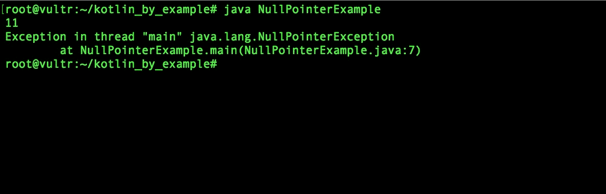

你能找到 `NullPointerException` 的原因吗？异常是由于在 null 引用上使用了 `String#length` 方法而引发的。因此，程序停止执行并抛出异常。显然，我们不希望在我们的程序中发生这种情况。

我们可以通过防止将 null 值分配给名称对象来防止这种情况在 Kotlin 中发生：

```
var name: String = "James Gates"
println(name.length)

name = null // null value assignment not permitted
println(name.length)
```

如以下截图所示，Kotlin 的类型系统检测到 `name` 变量被不适当地分配了 null 值，并迅速通知程序员这个错误，以便进行纠正：

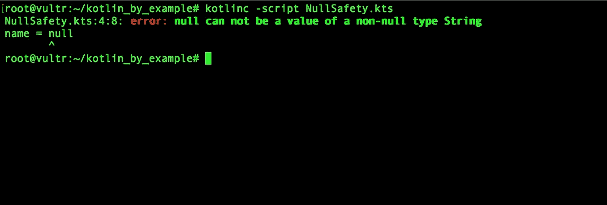

到目前为止，你可能想知道如果出现程序员意图允许传递 null 值的场景会发生什么。在这种情况下，程序员只需通过在变量的类型后附加 `?` 来声明该值为可空：

```
var name: String? = "James"
println(name.length)

name = null // null value assignment permitted
println(name.length)
```

尽管我们已声明变量名为可空，但在运行程序时我们仍然会得到错误。这是因为我们必须以安全的方式访问变量的长度属性。这可以通过 `?.` 来实现：

```
var name: String? = "James"
println(name?.length)

name = null // null value assignment permitted
println(name?.length)
```

现在我们已经使用了 `?.` 安全操作符，程序将按预期运行。不会抛出空指针异常，类型系统会识别出已引用了 null 指针，并防止在 null 对象上调用 `length()`。以下截图显示了类型安全的输出：

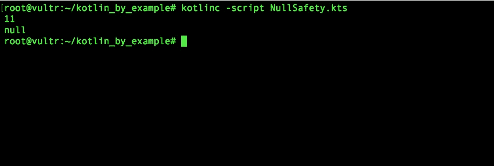

使用 `?.` 安全操作符的替代方法是使用 `!!` 操作符。`!!` 操作符允许程序继续执行，并在尝试在 null 引用上调用函数时抛出 `KotlinNullPointerException`。

我们可以通过将程序中写下的 `?.` 替换为 `!!.` 来看到效果。以下截图显示了程序运行时的输出。由于使用了 `!!` 操作符，抛出了 `KotlinNullPointerException`。

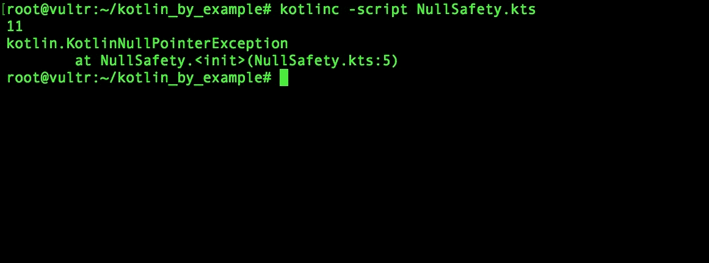

# 包

包是相关类、接口、枚举、注解和函数的逻辑分组。随着源文件变得越来越大，出于各种原因，如提高应用程序的可维护性、防止名称冲突和访问控制，有必要将这些文件分组到有意义的、不同的集合中。

包是通过 `package` 关键字后跟包名来创建的：

```
package foo
```

每个程序文件只能有一个包声明。如果一个程序文件的包没有被指定，则文件的内容将放置在默认包中。

# 导入关键字

通常，类和类型需要使用它们声明的包之外存在的其他类和类型。这可以通过导入包资源来实现。如果两个类属于同一个包，则不需要导入：

```
package animals
data class Buffalo(val mass: Int, val maxSpeed: Int, var isDead: Boolean = false)
```

在下面的代码片段中，`Buffalo` 类不需要导入到程序中，因为它与 `Lion` 类存在于同一个包（`animals`）中：

```
package animals
class Lion(val mass: Int, val maxSpeed: Int) {

  fun kill(animal: Buffalo) { // Buffalo type used with our import
    if (!animal.isDead) {
      println("Lion attacking animal.")
      animal.isDead = true
      println("Lion kill successful.")
    }
  }
}
```

为了在不同的包中导入类、函数、接口和类型，我们使用 `import` 关键字后跟包名。例如，下面的 `main` 函数存在于默认包中。因此，如果我们想在 `main` 函数中使用 `Lion` 和 `Buffalo` 类，我们必须使用 `import` 关键字导入它们。考虑以下代码：

```
import animals.Buffalo
import animals.Lion

fun main(args: Array<String>) {
  val lion = Lion(190, 80)
  val buffalo = Buffalo(620, 60)
  println("Buffalo is dead: ${buffalo.isDead}")
  lion.kill(buffalo)
  println("Buffalo is dead: ${buffalo.isDead}")
}
```

# 面向对象编程概念

到目前为止，我们在许多示例中使用了类，但还没有深入探讨这个概念。本节将向您介绍 Kotlin 中类的基本知识以及其他面向对象的构造。

# 简介

在高级编程语言的开端，程序是按照过程性编写的。当时可用的编程语言主要是过程性的。过程式编程语言是一种利用一系列结构化、定义良好的步骤来编写程序的编程语言。

随着软件行业的扩大和程序的膨胀，有必要设计一种更好的软件设计方法。这导致了面向对象编程语言的诞生。

面向对象编程模型是一种围绕对象和数据而不是动作和顺序逻辑组织的模型。在面向对象编程中，对象、类和接口被组合、扩展和继承，以实现构建工业级软件的目标。

**类**是一个可修改和可扩展的程序模板，用于创建对象并通过使用变量、常量和属性来维护状态。类具有特性和行为。特性以变量的形式暴露，行为以方法的形式实现。方法是特定于类或类集合的函数。类能够从其他类继承特性和行为。这种能力被称为**继承**。

Kotlin 是一种完全面向对象的编程语言，因此支持面向对象编程的所有特性。在 Kotlin 中，类似于 Java 和 Ruby，只允许单继承。一些语言，如 C++，支持多重继承。多重继承的一个缺点是它会产生管理问题，例如同名冲突。从一个类继承的类被称为子类，而它继承的类是其超类。

**接口**是一种强制在类中实施某些特性和行为的结构。通过在类中实现接口，可以执行行为强制。类似于类，接口可以扩展另一个接口。

**对象**是类的实例，可能具有其自己的独特状态。

# 与类一起工作

类是通过 `class` 关键字后跟类名来声明的：

```
class Person
```

正如前一个示例中所示，Kotlin 中的类不一定需要有主体。虽然这很吸引人，但几乎每次你都会希望你的类在主体中包含特性和行为。这可以通过使用开括号和闭括号来完成：

```
class HelloPrinter {
  fun printHello() {
    println("Hello!")
  }
}
```

在前面的代码片段中，我们有一个名为 `HelloPrinter` 的类，其中声明了一个函数。在类中声明的函数被称为方法。方法也可以被称为行为。一旦声明了方法，它就可以被类的所有实例使用。

# 创建对象

声明类的实例或对象类似于声明变量。我们可以创建 `HelloPrinter` 类的实例，如下面的代码所示：

```
val printer = HelloPrinter()
```

前面的 `printer` 是 `HelloPrinter` 类的一个实例。在 `HelloPrinter` 类名之后的开括号和闭括号用于调用 `HelloPrinter` 类的主构造函数。构造函数类似于函数。构造函数是一个特殊的函数，用于初始化一个类型的对象。

在 `HelloPrinter` 类中声明的函数可以在任何时间点直接通过 `printer` 对象调用：

```
printer.printHello() // Prints hello
```

有时，你可能需要一个函数可以直接通过类调用，而不需要创建一个对象。这可以通过使用伴生对象来实现。

# 伴生对象

伴生对象是通过在类中使用 `companion` 和 `object` 关键字来声明的。你可以在伴生对象中使用静态函数：

```
class Printer {
  companion object DocumentPrinter {
    fun printDocument() = println("Document printing successful.")
  }
}

fun main(args: Array<String>) {
  Printer.printDocument() // printDocument() invoked via companion object
  Printer.Companion.printDocument() // also invokes printDocument() via 
                                    // a companion object
}
```

有时，你可能想给伴生对象一个标识符。这可以通过在 `object` 关键字后放置名称来完成。考虑以下示例：

```
class Printer {
  companion object DocumentPrinter { // Companion object identified by DocumentPrinter
    fun printDocument() = println("Document printing successful.")
  }
}

fun main(args: Array<String>) {
  Printer.DocumentPrinter.printDocument() // printDocument() invoked via
                                          // a named companion object
}
```

# 属性

类可以有使用 `var` 和 `val` 关键字声明的属性。例如，在以下代码片段中，`Person` 类有三个属性，`age`、`firstName` 和 `surname`：

```
class Person {    var age = 0
  var firstName = ""
  var surname = ""
}
```

属性可以通过持有属性的类的实例来访问。这是通过在实例标识符后附加一个单独的点字符（`.`）并跟随着属性名称来完成的。例如，在以下代码片段中，创建了一个名为 `person` 的 `Person` 类的实例，并通过访问属性来分配其 `firstName`、`surname` 和 `age` 属性：

```
val person = Person()
person.firstName = "Raven"
person.surname = "Spacey"
person.age = 35
```

# Kotlin 的优势

如前所述，Kotlin 被设计成比 Java 更好，因此使用 Kotlin 而不是 Java 有许多优势：

+   **空安全**：Java 程序中常见的一个问题是抛出 `NullPointerException`。Kotlin 通过提供空安全类型系统来减轻这个问题。

+   **扩展函数的存在**：可以在程序文件中定义的类中轻松添加函数，以各种方式扩展其功能。这可以通过 Kotlin 中的扩展函数来实现。

+   **单例模式**：在 Kotlin 程序中实现单例模式非常简单。在 Java 中实现单例模式比在 Kotlin 中实现要费劲得多。

+   **数据类**：在编写程序时，通常需要创建一个类，仅用于在变量中存储数据。这通常会导致编写大量代码来完成这样的平凡任务。Kotlin 中的数据类使得使用单行代码创建这样的数据类变得极其简单。

+   **函数类型**：与 Java 不同，Kotlin 拥有函数类型。这使得函数能够接受其他函数作为参数，以及定义返回函数的函数。

# 使用 Kotlin 开发 Android 应用程序

我们简要地回顾了 Kotlin 为我们提供的一些开发强大应用程序的功能。在本书的整个过程中，我们将探讨如何利用这些功能进行 Android 应用程序开发——这是 Kotlin 大放异彩的领域。

在开始这段旅程之前，我们必须为手头的任务设置我们的系统。开发 Android 应用程序的一个主要需求是合适的 IDE——它不是必需的，但它可以使开发过程更容易。Android 开发者有许多 IDE 选择。最受欢迎的是：

+   Android Studio

+   Eclipse

+   IntelliJ IDE

在 Android 开发方面，Android Studio 无疑是所有 IDE 中最强大的。因此，我们将在这本书的所有与 Android 相关的章节中使用这个 IDE。

# 设置 Android Studio

在撰写本文时，包含完整 Kotlin 支持的 Android Studio 版本是 Android Studio 3.0。该软件的测试版可以从[`developer.android.com/studio/preview/index.html`](https://developer.android.com/studio/preview/index.html)下载。下载后，打开下载的包或可执行文件，按照安装说明进行操作。存在一个设置向导，可引导您完成 IDE 设置过程：


继续到下一个设置屏幕将提示您选择您想要的 Android Studio 设置类型：

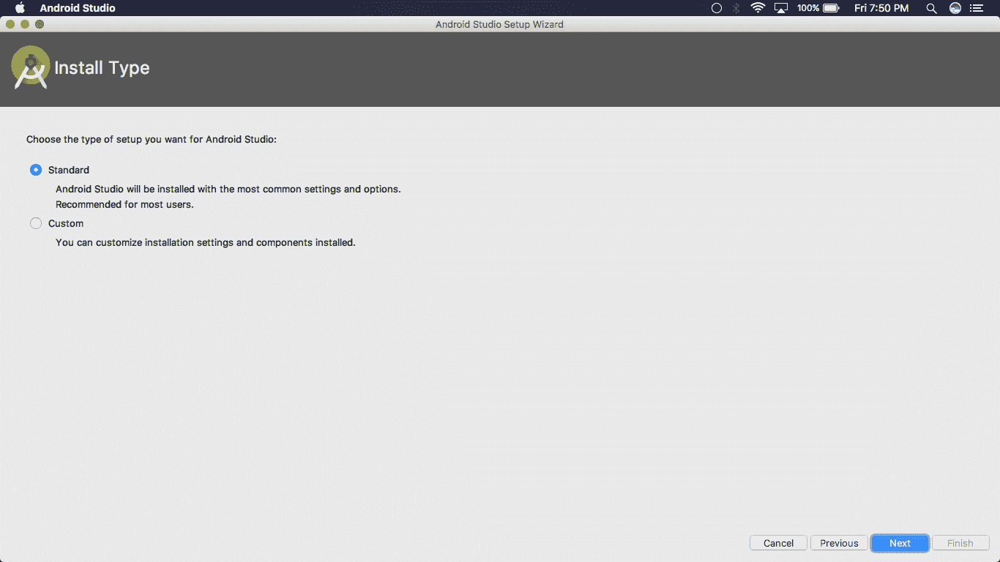

选择标准设置并继续到下一个屏幕。在验证设置屏幕上点击完成。现在，Android Studio 将下载设置所需的组件。您需要等待几分钟，直到所需的组件下载完成：

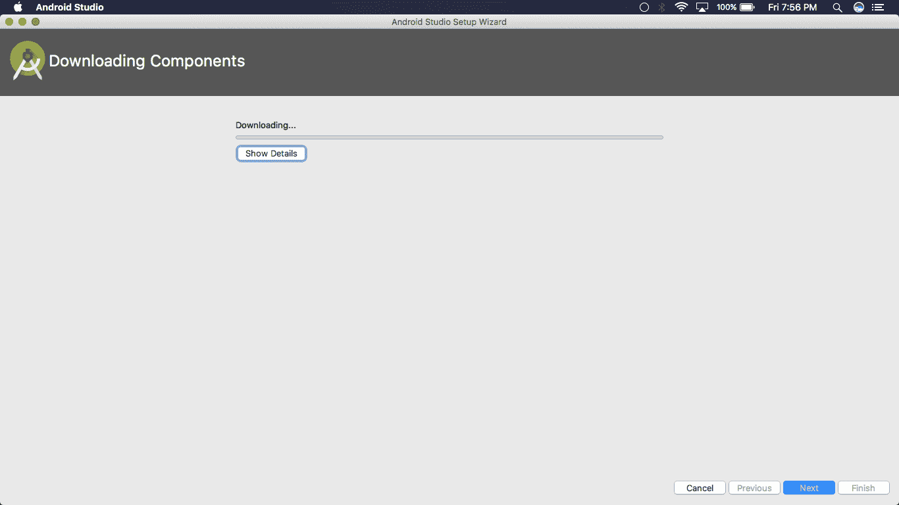

组件下载完成后，点击完成。您将被带到 Android Studio 的登录屏幕。现在，您已经准备好使用 Android Studio 了：

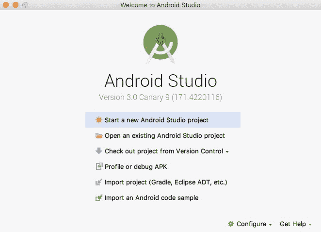

# 构建您的第一个 Android 应用程序

不再拖延，让我们探索如何使用 Android Studio 创建一个简单的 Android 应用程序。我们将构建*HelloApp*。*HelloApp*是一个在按钮点击后在屏幕上显示`Hello world!`的应用程序。

在 Android Studio 的登录屏幕上，点击“开始新的 Android Studio 项目”。您将被带到屏幕，您将指定一些与您即将构建的应用程序相关的详细信息，例如应用程序名称、公司域名和项目位置。

将应用程序名称输入为`HelloApp`，并输入公司域名。如果您没有公司域名，请在公司域名输入框中填写任何有效的域名 – 由于这是一个简单的项目，不需要合法的域名。指定您想要保存此项目的位置，并勾选包含 Kotlin 支持的复选框。

在填写了所需的参数后，继续到下一屏幕：

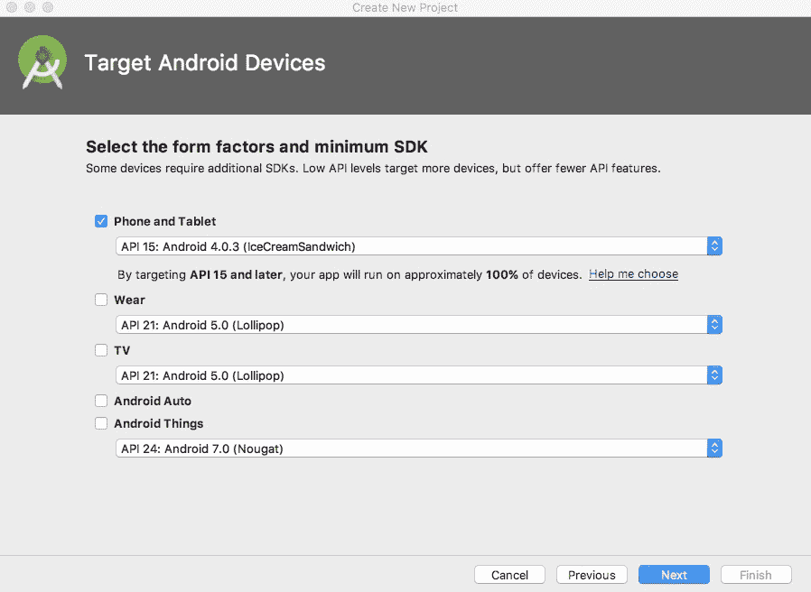

在这里，我们需要指定我们的目标设备。我们正在构建这个应用程序，使其在智能手机上运行，因此如果尚未勾选，请勾选“手机”和“平板电脑”复选框。您会在每个设备选项旁边注意到一个选项菜单。此下拉菜单用于指定正在创建的项目目标 API 级别。API 级别是唯一标识 Android 平台版本提供的框架 API 分区的整数。如果尚未选择，请选择 API 级别 15 并继续到下一屏幕：

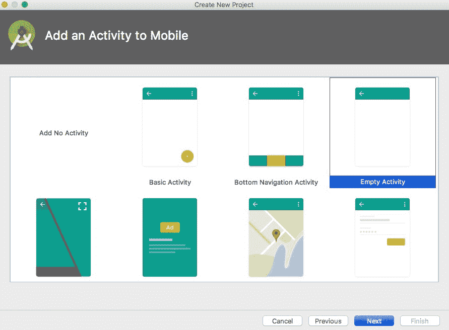

在下一屏幕上，我们需要选择要添加到应用程序中的活动。活动是一个具有独特用户界面的单个屏幕 – 类似于窗口。我们将在第二章“构建 Android 应用程序 – 沙漏游戏”中更深入地讨论活动。现在，选择空活动并继续到下一屏幕。

现在，我们需要配置我们刚才指定的应该创建的活动。将活动命名为`HelloActivity`，并确保勾选了“生成布局文件”和“向后兼容性”复选框：

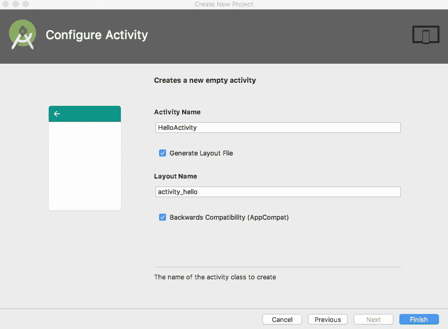

现在，点击“完成”按钮。Android Studio 可能需要几分钟来设置您的项目。

设置完成后，您将看到一个包含项目文件的 IDE 窗口。

在项目开发过程中，可能会在任何阶段遇到与缺少必需项目组件相关的错误。缺少的组件可以从 SDK 管理器中下载。

确保 IDE 的项目窗口已打开（在导航栏中，选择视图 | 工具窗口 | 项目），并且 Android 视图当前已从项目窗口顶部的下拉列表中选择。您将在窗口的左侧看到以下文件：

+   `app` | `java` | `com.mydomain.helloapp` | `HelloActivity.java`: 这是你的应用程序的主活动。当你构建和运行应用程序时，系统将启动这个活动的实例：

+   `app` | `res` | `layout` | `activity_hello.xml`: `HelloActivity` 的用户界面定义在这个 XML 文件中。它包含一个放置在 `ConstraintLayout` 的 `ViewGroup` 中的 `TextView` 元素。`TextView` 的文本已被设置为 Hello World!

+   `app` | `manifests` | `AndroidManifest.xml`: `AndroidManifest` 文件用于描述应用程序的基本特征。此外，这也是定义应用程序组件的文件。

+   `Gradle 脚本` | `build.gradle`: 在你的项目中将存在两个 `build.gradle` 文件。第一个 `build.gradle` 文件是针对项目的，第二个是针对应用模块的。你将最频繁地使用模块的 `build.gradle` 文件来配置 Gradle 工具的编译过程和构建你的应用。

Gradle 是一个开源的构建自动化系统，用于声明项目配置。在 Android 中，Gradle 被用作构建工具，目的是构建包和管理应用程序依赖项。

# 创建用户界面

**用户界面**（**UI**）是用户与应用程序交互的主要方式。Android 应用程序的用户界面是通过创建和操作布局文件来实现的。布局文件是存在于 `app | res | layout` 中的 XML 文件。

要为 `HelloApp` 创建布局，我们将做三件事：

1.  将 `LinearLayout` 添加到我们的布局文件中

1.  将 `TextView` 放置在 `LinearLayout` 中，并移除它所拥有的 `android:text` 属性

1.  向 `LinearLayout` 添加一个按钮

如果 `activity_hello.xml` 文件尚未打开，请打开它。你将看到布局编辑器。如果编辑器处于 `Design` 视图，请通过切换布局编辑器底部的选项将其更改为 `Text` 视图。现在，你的布局编辑器应该看起来类似于以下截图：

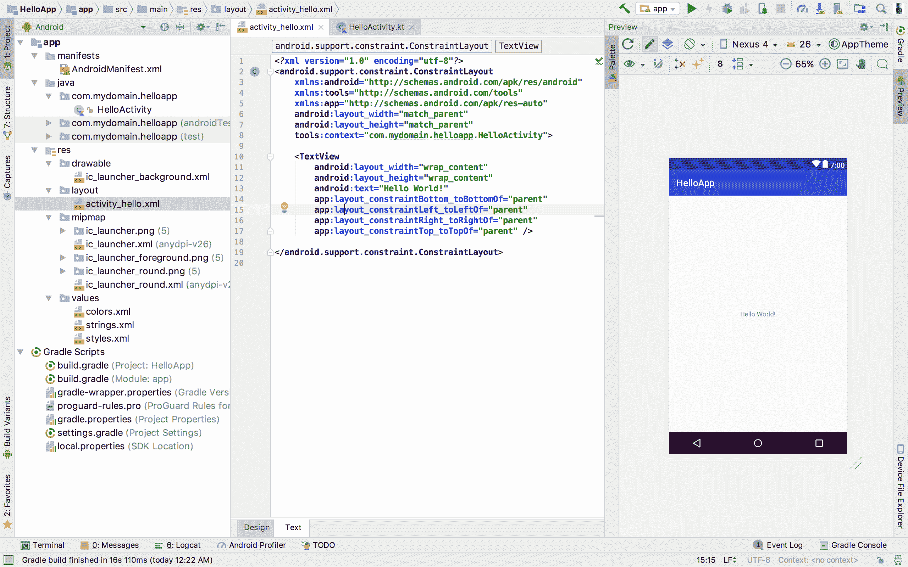

`LinearLayout` 是一个 `ViewGroup`，它以水平或垂直方式在单列内排列子视图。从以下块中复制我们所需的 `LinearLayout` 的代码片段，并将其粘贴到 `ConstraintLayout` 中 `TextView` 之前：

```
<LinearLayout
       android:id="@+id/ll_component_container"
       android:layout_width="match_parent"
       android:layout_height="match_parent"
       android:orientation="vertical"
       android:gravity="center">
</LinearLayout>
```

现在，将 `activity_hello.xml` 文件中现有的 `TextView` 复制并粘贴到 `LinearLayout` 元素的主体中，并移除 `android:text` 属性：

```
<LinearLayout
       android:id="@+id/ll_component_container"
       android:layout_width="match_parent"
       android:layout_height="match_parent"
       android:orientation="vertical"
       android:gravity="center">
  <TextView
       android:id="@+id/tv_greeting"
       android:layout_width="wrap_content"
       android:layout_height="wrap_content"
       android:textSize="50sp" />
</LinearLayout>
```

最后，我们需要将一个按钮元素添加到我们的布局文件中。这个元素将是我们的 `LinearLayout` 的子元素。要创建一个按钮，我们使用 `Button` 元素：

```
<LinearLayout
       android:id="@+id/ll_component_container"
       android:layout_width="match_parent"
       android:layout_height="match_parent"
       android:orientation="vertical"
       android:gravity="center">
  <TextView
       android:id="@+id/tv_greeting"
       android:layout_width="wrap_content"
       android:layout_height="wrap_content"
       android:textSize="50sp" />
  <Button
       android:id="@+id/btn_click_me"
       android:layout_width="wrap_content"
       android:layout_height="wrap_content"
       android:layout_marginTop="16dp"
       android:text="Click me!"/>
</LinearLayout>
```

切换到布局编辑器的设计视图，以查看我们迄今为止所做的更改在用户界面上的渲染效果：


现在我们有了布局，但有一个问题。我们的“点击我！”按钮在被点击时实际上并没有做任何事情。我们将通过向按钮添加点击事件监听器来解决这个问题。找到并打开`HelloActivity.java`文件，并编辑函数以添加“点击我！”按钮的点击事件逻辑以及所需的包导入，如下面的代码所示：

```
package com.mydomain.helloapp
import android.support.v7.app.AppCompatActivity
import android.os.Bundle
import android.text.TextUtils
import android.widget.Button
import android.widget.TextView
import android.widget.Toast

class HelloActivity : AppCompatActivity() {

  override fun onCreate(savedInstanceState: Bundle?) {
    super.onCreate(savedInstanceState)
    setContentView(R.layout.activity_hello)
    val tvGreeting = findViewById<TextView>(R.id.tv_greeting)
    val btnClickMe = findViewById<Button>(R.id.btn_click_me)

    btnClickMe.setOnClickListener {
      if (TextUtils.isEmpty(tvGreeting.text)) {
        tvGreeting.text = "Hello World!"
      } else {
        Toast.makeText(this, "I have been clicked!", 
                       Toast.LENGTH_LONG).show()
      }
    }
  }
}
```

在前面的代码片段中，我们通过使用`findViewById`函数添加了对`activity_hello`布局文件中存在的`TextView`和`Button`元素的引用。`findViewById`函数可以用来获取当前设置的内容视图中布局元素的引用。`onCreate`函数的第二行将`HelloActivity`的内容视图设置为`activity_hello.xml`布局。

在`findViewById`函数标识符旁边，我们有两个尖括号之间的`TextView`类型。这被称为函数泛型。它被用来强制传递给`findViewById`的资源 ID 属于`TextView`元素。

在添加我们的引用对象后，我们为`btnClickMe`设置了一个`onClickListener`。监听器用于监听应用程序内事件的发生。为了在元素被点击时执行某个动作，我们将包含要执行的动作的 lambda 表达式传递给元素的`setOnClickListener`方法。

当`btnClickMe`被点击时，会检查`tvGreeting`是否被设置为包含任何文本。如果没有设置任何文本到`TextView`，则其文本设置为`Hello World!`，否则会显示包含`I have been clicked!`文本的吐司。

# 运行应用程序

为了运行应用程序，点击 IDE 窗口右上角的“运行 'app' (^R)”按钮，并选择一个部署目标。`HelloApp`将在部署目标上构建、安装和启动：


您可以使用可用的预包装虚拟设备之一或创建一个自定义虚拟设备作为部署目标。您还可以决定通过 USB 将物理 Android 设备连接到您的计算机，并将其作为目标选择。选择权在您手中。选择部署设备后，点击“确定”以构建和运行应用程序。

当应用程序启动时，我们创建的布局会被渲染：


当点击“点击我！”时，用户会看到“Hello World！”：


随后的点击“点击我！”按钮会显示包含文本“我已经被点击了！”的吐司消息：


# 网络基础

大多数应用程序以某种方式与服务器进行通信。在继续阅读本书之前，了解与网络相关的几个概念至关重要。本节简要解释了这些概念。

# 什么是网络？

网络是一个由相互连接的系统组成的复杂系统，它能够通过一个或多个协议与存在于公共网络上的其他系统进行通信。协议是一种官方的、定义良好的规则系统，用于规范设备之间信息交换。

# 超文本传输协议

所有通过网络的通信都是按照协议进行的。对于促进系统间通信来说，一个特别重要的协议是**超文本传输协议**（**HTTP**）。

每天都有数十亿的张图片、视频、文本文件、文档和其他文件通过互联网传输。这些文件都是通过 HTTP 传输的。HTTP 是一种用于分布式和超媒体信息系统的应用协议。它可以被认为是互联网通信的基础组件。使用 HTTP 在系统间传输数据的主要好处是它非常可靠。这是由于其利用了可靠的协议，如**传输控制协议**（**TCP**）和**互联网协议**（**IP**）。

# 客户端和服务器

网络客户端是任何使用 HTTP 与网络服务器通信的应用程序。网络服务器是一台提供或服务网络资源的计算机。网络资源是提供网络内容的一切。网络资源可以是媒体文件、HTML 文档、网关等。客户端需要网络内容用于各种目的，如信息呈现和数据操作。

客户端和服务器通过 HTTP 进行通信。使用 HTTP 的一个主要原因是它在数据传输方面极其可靠。使用 HTTP 确保在请求-响应周期中不会发生数据丢失。

# HTTP 请求和响应

HTTP 请求——正如其名所示——是由网络客户端通过 HTTP 发送到服务器的对网络资源的请求。HTTP 响应是对 HTTP 事务中请求的回复——由服务器发送：

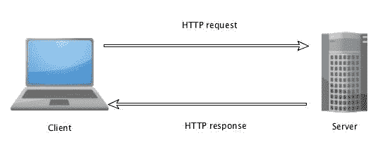

# HTTP 方法

HTTP 支持多种请求方法。这些方法也可以称为命令。HTTP 方法指定服务器要执行的操作类型。一些常见的 HTTP 方法如下表所示：

| **HTTP 方法** | **描述** |
| --- | --- |
| GET | 从客户端检索一个命名的资源。 |
| POST | 从客户端向服务器发送数据。 |
| DELETE | 删除服务器上驻留的命名资源。 |
| PUT | 将客户端收集的数据存储在服务器上名为资源的存储中。 |
| OPTIONS | 返回服务器支持的所有 HTTP 方法。 |
| HEAD | 获取没有内容的 HTTP 头部信息。 |

# 摘要

在本章中，我们介绍了 Kotlin 并探讨了其基础知识。在这个过程中，我们学习了如何在计算机上安装 Kotlin，什么是 IDE，可用于编写 Kotlin 程序的 IDE，如何编写和运行 Kotlin 脚本，以及如何使用 REPL。此外，我们还学习了如何使用 IntelliJ IDEA 和 Android Studio，之后我们实现了一个简单的 Android 应用程序。最后，我们回顾了与网络相关的根本概念。

在下一章中，我们将通过创建一个 Android 应用程序来更熟悉地编写 Kotlin 程序。我们将探讨 Android 应用程序架构以及 Android 应用程序的重要组件，以及更多主题。
