# 构建 Android 应用程序 – 俄罗斯方块

在上一章中，我们简要地回顾了与 Kotlin 核心语言相关的关键主题。这些主题带我们了解了 Kotlin 的基础知识，以及它为我们提供的强大的面向对象编程方法。在本章中，我们将通过开发一个 Android 应用程序来将上一章中获得的知识付诸实践。

在本章中，你将学习以下主题：

+   Android 应用程序组件

+   视图

+   视图组

+   布局约束

+   使用 XML 实现布局

+   字符串和维度资源

+   处理输入事件

我们将通过实际操作的方法，通过实现一个经典游戏——俄罗斯方块——的布局和组件，以 Android 应用程序的形式来学习这些主题。由于我们是以 Android 应用程序的形式开发游戏的，在继续之前，简要概述 Android 操作系统是至关重要的。

# Android – 概述

Android 是由 Google 开发和维护的基于 Linux 的移动操作系统，主要用于为智能手机和平板电脑等智能移动设备提供动力。与 Android 操作系统交互的主要界面是基于**图形用户界面**（**GUI**）。由 Android 驱动的设备用户主要通过在显示屏上执行触摸操作，如点击和滑动，来操作和与操作系统环境进行交互。

软件可以以应用的形式安装在 Android 操作系统上。应用是在环境中运行的应用程序，它执行一个或多个任务以实现目标或一系列目标。在移动设备上安装应用程序的能力为用户和应用程序开发者提供了巨大的机会。用户利用应用提供的功能来实现日常目标，开发者则利用对软件应用程序的需求，开发满足用户需求的应用程序，也许还能盈利。

对于开发者来说，Android 提供了一系列工具和实用程序，用于开发高性能应用程序。这些应用程序可以针对不同的市场，如娱乐、企业和电子商务。应用程序也可以以游戏的形式出现。

在本章的整个过程中，我们将更详细地探讨 Android 应用程序框架提供的一些工具和实用程序。

# 应用程序组件

Android 应用程序框架为我们提供了一系列组件，我们可以利用这些组件为*俄罗斯方块*应用程序构建用户界面。Android 中的组件是一个可重用的程序模板或对象，可以用来定义应用程序的各个方面。Android 应用程序框架提供的一些重要组件包括：

+   活动

+   意图

+   意图过滤器

+   碎片

+   服务

+   加载器

+   内容提供者

# 活动

活动是 Android 组件，对于应用程序流程和组件间交互的实现至关重要。活动以类的形式实现。活动实例由 Android 系统用于代码启动。

活动在创建应用程序用户界面方面非常重要。它提供了一个可以绘制用户界面元素的窗口。简单来说，应用程序屏幕是通过考虑使用活动来创建的。

# 意图

意图促进了交互之间的通信。意图可以被视为 Android 应用程序中的信使。它们是用于从应用程序组件请求操作的消息对象。意图可以用于 Android 系统环境中的操作，例如请求启动活动或发送广播。

有两种类型的意图。这些是：

+   隐式意图

+   显式意图

**隐式意图**：这些是信使对象，它们不特别标识应用程序组件以执行操作，但指定要执行的操作，并允许可能存在于另一个应用程序中的组件执行该操作。可以处理隐式请求的操作的组件由 Android 系统识别。

**显式意图**：这些意图明确指定了应执行操作的应用程序组件。这些可以在您的应用程序中用于执行操作，例如启动活动：

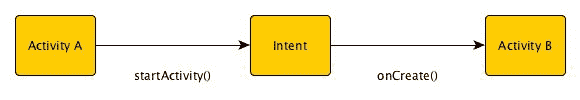

# 意图过滤器

意图过滤器是应用程序清单文件中的一个声明，它指定了组件希望接收的意图类型。这在许多情况下都很有用，例如，在您希望应用程序中的活动处理另一个应用程序中的组件请求的特定操作的场景中。为此，可以在希望处理外部请求的活动清单中声明意图过滤器。如果您不希望活动处理隐式意图，您只需不为其声明意图过滤器即可。

# 片段

片段是一个应用程序组件，它代表存在于活动中的用户界面的一部分。类似于活动，片段具有可以修改的布局，并且绘制在活动窗口上。

# 服务

与大多数其他组件不同，服务不提供用户界面。服务用于在应用程序中执行后台进程。服务不需要创建它的应用程序处于前台即可运行。

# 加载器

加载器是一个组件，它使数据从数据源（如内容提供者）加载成为可能，以便稍后在活动或片段中显示。

# 内容提供者

这些组件帮助应用程序控制对存储在应用程序内部或另一个应用程序中的数据资源的访问。此外，内容提供者通过公开的应用程序编程接口促进与其他应用程序的数据共享：

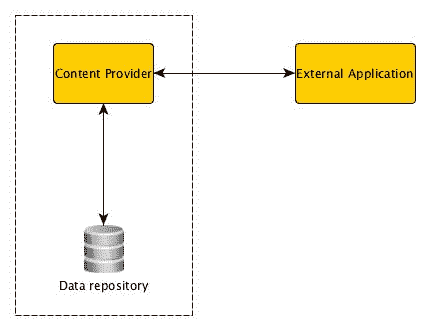

# 理解俄罗斯方块

在尝试将俄罗斯方块游戏作为 Android 应用程序开发之前，我们需要了解这个游戏、它的规则和限制。

俄罗斯方块是一款使用拼图块的匹配拼图视频游戏。"俄罗斯方块"这个名字来源于单词 tetra——希腊数字前缀四——和网球。俄罗斯方块中的拼图块组合成四连体，即由四个正方形组成的几何形状：

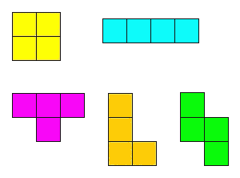

俄罗斯方块四连体块

在俄罗斯方块中，一系列随机的四连体块会落在游戏场上。玩家可以操纵这些四连体块。每个四连体块可以执行多种动作。块可以左右移动，旋转。此外，每个块的下降速度可以加快。游戏的目标是用下降的块创建一个不间断的十单元格水平线。当创建这样的线时，该线就会被清除。

现在我们已经了解了俄罗斯方块的工作原理，让我们具体了解一下，以便构建应用程序的用户界面。

# 创建用户界面

如前所述，用户界面是应用程序用户与应用程序交互的方式。应用程序的用户界面的重要性不容忽视。在实际编码用户界面之前，制作要实现的 UI 的图形表示可能是有帮助的。这可以用不同的工具完成，例如 Photoshop，但在这个案例中，一个简单的草图就足够了：

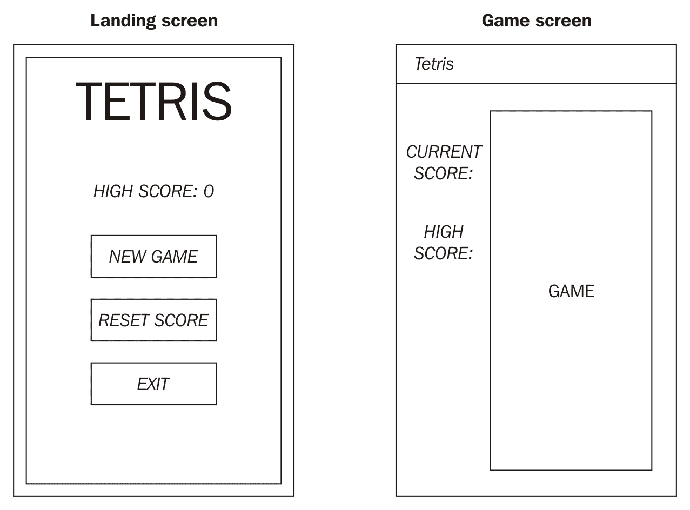

从前面的草图可以看出，在这个应用程序中，我们需要两个不同的屏幕：一个是着陆屏幕，另一个是游戏屏幕，实际的游戏将在这个屏幕上进行。这两个屏幕将需要两个独立的活动。我们将这两个活动称为`MainActivity`和`GameActivity`。

`MainActivity`将作为我们应用程序的入口点。它将包含用户界面以及与我们的着陆屏幕相关的所有逻辑。正如我们可以在我们的草图中所观察到的，着陆屏幕的 UI 包含应用程序标题、一个显示用户当前最高分的视图，以及执行不同操作的三个按钮。正如其名所示，**新游戏**按钮将引导用户进入游戏活动。**重置分数**将用户的分数重置为零，**退出**将关闭应用程序。

`GameActivity` 将是游戏界面的程序模板。在这个活动中，我们将创建视图以及用户和游戏之间的逻辑交互。这个活动的用户界面包含一个标题栏，上面显示了应用程序的标题，两个文本视图，用于显示用户的当前得分和他们的最高分，以及一个布局元素，Tetris 游戏将在其中进行。

# 实现布局

现在我们知道了在这个应用程序中需要哪些活动，并且对用户界面在用户查看时的外观有一个大致的想法，我们可以进入用户界面的实际实现。

在 Android Studio 中创建一个新的 Android 项目，并将其命名为 `Tetris no activity`。一旦 IDE 窗口打开，您将注意到项目结构类似于 第一章，*基础*。

我们需要做的第一件事是将 `MainActivity` 添加到我们的项目中。我们希望 `MainActivity` 是一个空活动。我们可以通过在源包上右键单击并选择“新建 | 活动 | 空活动”来将 `MainActivity` 添加到我们的项目中：

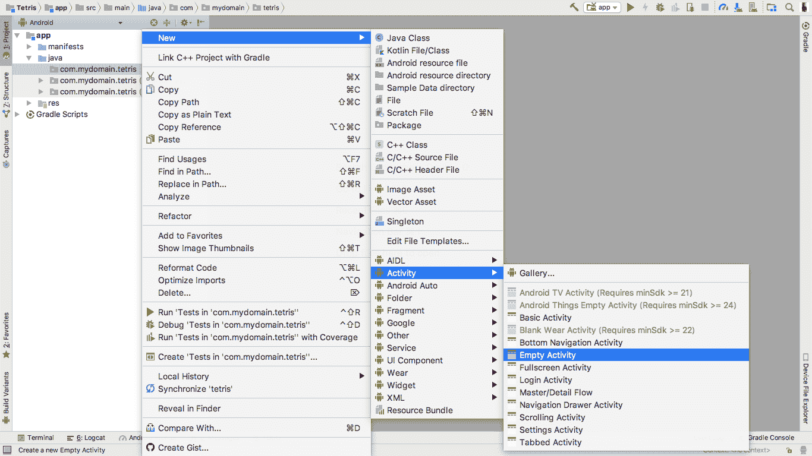

将活动命名为 `MainActivity`，并确保勾选了“生成布局文件”、“启动器活动”和“向后兼容性（AppCompat）”复选框。

在将活动添加到您的项目后，导航到其布局资源文件。它应该看起来类似于以下代码：

```
<?xml version="1.0" encoding="utf-8"?><android.support.constraint.ConstraintLayout xmlns:android="http://schemas.android.com/apk/res/android"
    xmlns:app="http://schemas.android.com/apk/res-auto"
    xmlns:tools="http://schemas.android.com/tools"
    android:layout_width="match_parent"
    android:layout_height="match_parent"
    tools:context="com.mydomain.tetris.MainActivity">
</android.support.constraint.ConstraintLayout>
```

资源文件的第一行指定了文件中使用的 XML 版本以及使用的字符编码。此文件中使用的字符编码为 `utf-8`。**UTF** 代表 **Unicode Transformation Format**。它是一种编码格式，可以与 **American Standard Code for Information Interchange**（**ASCII**）一样紧凑——这是最常见的文本文件字符格式——并且可以包含任何 Unicode 字符。接下来的八行定义了一个要在 `MainActivity` 的用户界面中渲染的 `ConstraintLayout`。

在继续之前，让我们更详细地考虑一下 `ConstraintLayout`。

# ConstraintLayout

`ConstraintLayout` 是一种视图组，允许灵活地定位和调整应用程序小部件的大小。在 `ConstraintLayout` 上可以使用各种类型的约束。一些例子包括。

# 边距

边距是两个布局元素之间的空间。当在元素上设置侧边距时，如果可用，它将应用于其相应的布局约束，通过在目标侧和源侧（添加边距的元素的一侧）之间添加边距作为空间来实现：

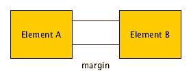

# 链

链是提供单轴类似组行为的约束。轴可以是水平或垂直：

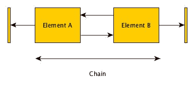

如果一组元素都是双向连接的，则它们构成一个链。

# 尺寸约束

这些约束涉及布局中放置的小部件的大小。可以在小部件上设置尺寸约束，并使用`ConstraintLayout`：

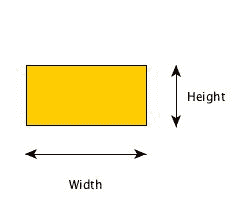

尺寸约束

小部件的尺寸可以通过使用`android:layout_width`和`android:layout_height`来指定：

```
<TextView
 android:layout_height="16dp"
 android:layout_width="32dp"/>
```

在许多情况下，你可能希望小部件与其父视图组的尺寸相同。这可以通过将`match_parent`值分配给尺寸属性来完成：

```
<LinearLayout
 android:layout_width="120dp"
 android:layout_height="100dp">
 <TextView
  android:layout_width="match_parent"
  android:layout_height="match_parent"/>
</LinearLayout>
```

或者，如果你想让小部件的尺寸不是固定的，而是包裹其内部包含的元素，则应将`wrap_content`值分配给尺寸属性：

```
<TextView
 android:layout_width="wrap_content"
 android:layout_height="wrap_content"
 android:text="I wrap around the content within me"
 android:textSize="15sp"/>
```

现在我们对`ConstraintLayout`以及小部件约束有了更好的理解，让我们再次查看我们的`activity_main.xml`文件：

```
<android.support.constraint.ConstraintLayout xmlns:android="http://schemas.android.com/apk/res/android"
    xmlns:app="http://schemas.android.com/apk/res-auto"
    xmlns:tools="http://schemas.android.com/tools"
    android:layout_width="match_parent"
    android:layout_height="match_parent"
    tools:context="com.mydomain.tetris.MainActivity">
</android.support.constraint.ConstraintLayout>
```

观察到`ConstraintLayout`元素，我们可以立即注意到其宽度和高度尺寸已被设置为`match_parent`。这意味着`ConstraintLayout`的尺寸设置为与当前窗口匹配。具有`xmlns:`前缀的属性用于定义 XML 命名空间。为所有 XML 命名空间属性设置的值是命名空间 URI。**URI**是**Uniform Resource Identifier**的缩写，正如其名，它标识了命名空间所需资源。

`tools:context`属性通常设置在 XML 布局文件的根元素上，并指定与布局关联的活动——在这种情况下，`MainActivity`。

现在我们已经理解了`activity_main.xml`布局中的情况，让我们向其中添加一些布局元素。从我们的草图可以看出，所有布局元素都是垂直排列的。我们可以使用`LinearLayout`来实现这一点：

```
<android.support.constraint.ConstraintLayout xmlns:android="http://schemas.android.com/apk/res/android"
    xmlns:app="http://schemas.android.com/apk/res-auto"
    xmlns:tools="http://schemas.android.com/tools"
    android:layout_width="match_parent"
    android:layout_height="match_parent"
    tools:context="com.mydomain.tetris.MainActivity">
    <LinearLayout
        android:layout_width="match_parent"
        android:layout_height="match_parent"
        app:layout_constraintBottom_toBottomOf="parent"
        app:layout_constraintLeft_toLeftOf="parent"
        app:layout_constraintRight_toRightOf="parent"
        app:layout_constraintTop_toTopOf="parent"
        android:layout_marginVertical="16dp"
        android:orientation="vertical">
    </LinearLayout>
</android.support.constraint.ConstraintLayout>
```

由于我们希望`LinearLayout`的尺寸与其父级相同，我们将`android:layout_width`和`android:layout_height`都设置为`match_parent`。接下来，我们使用`app:layout_constraintBottom_toBottomOf`、`app:layout_constraintLeft_toLeftOf`、`app:layout_constraintRight_toRightOff`和`app:layout_constraintTop_toTopOf`属性指定`LinearLayout`的边缘约束。

+   `app:layout_constraintBottom_toBottomOf`：将一个元素的底部边缘与另一个元素的底部对齐

+   `app:layout_constraintLeft_toLeftOf`：将一个元素的左边缘与另一个元素的左边缘对齐

+   `app:layout_constraintRight_toRightOf`：将一个元素的右边缘与另一个元素的右边缘对齐

+   `app:layout_constraintTop_toTopOf`：将一个元素的顶部与另一个元素的顶部对齐。

在这种情况下，`LinearLayout`的所有边缘都与父级——`ConstraintLayout`的边缘对齐。`android:layout_marginVertical`为元素的顶部和底部添加了`16dp`的边距。

# 定义尺寸资源

通常在布局文件中，我们可以有多个元素指定相同的约束值给属性。这些值应添加到维度资源文件中。现在让我们创建一个维度资源文件。在应用程序项目视图中，导航到 res | values 并在目录中创建一个名为`dimens`的新值资源文件：

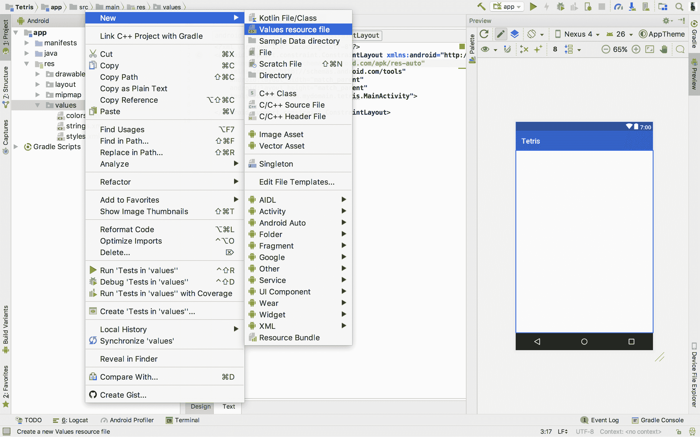

将所有其他文件属性保留在默认值：

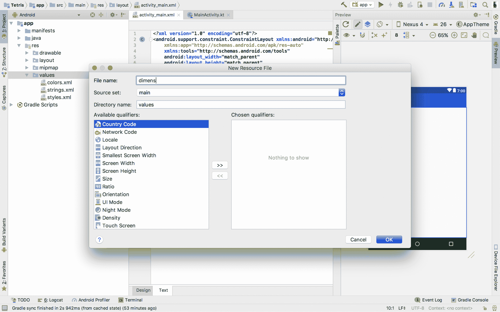

在创建文件时打开它。其内容应类似于以下代码：

```
<?xml version="1.0" encoding="utf-8"?>
<resources></resources>
```

`dimens.xml`的第一行声明了文件中使用的 XML 版本和字符编码。第二行包含一个`<resources>`资源标签。我们的维度将在这个标签内声明。添加一些维度值，如下面的代码所示：

```
<?xml version="1.0" encoding="utf-8"?>
<resources>
    <dimen name="layout_margin_top">16dp</dimen>
    <dimen name="layout_margin_bottom">16dp</dimen>
    <dimen name="layout_margin_start">16dp</dimen>
    <dimen name="layout_margin_end">16dp</dimen>
    <dimen name="layout_margin_vertical">16dp</dimen>
</resources>
```

使用`<dimen>`标签声明新维度。维度名称通常应写成蛇形。维度的值添加在`<dimen>`和`</dimens>`标签之间。

现在我们已经添加了一些维度，我们可以在线性布局中使用它们：

```
<android.support.constraint.ConstraintLayout xmlns:android="http://schemas.android.com/apk/res/android"
    xmlns:app="http://schemas.android.com/apk/res-auto"
    xmlns:tools="http://schemas.android.com/tools"
    android:layout_width="match_parent"
    android:layout_height="match_parent"
    tools:context="com.mydomain.tetris.MainActivity">
    <LinearLayout
        android:layout_width="match_parent"
        android:layout_height="match_parent"
        app:layout_constraintBottom_toBottomOf="parent"
        app:layout_constraintLeft_toLeftOf="parent"
        app:layout_constraintRight_toRightOf="parent"
        app:layout_constraintTop_toTopOf="parent"
        android:layout_marginTop="@dimen/layout_margin_top" 
<!— layout_margin_top dimension reference —>
        android:layout_marginBottom="@dimen/layout_margin_bottom" 
<!— layout_margin_top dimension reference —>
        android:orientation="vertical"
        android:gravity="center_horizontal">
    </LinearLayout>
</android.support.constraint.ConstraintLayout>
```

我们已经设置了`LinearLayout`视图组，现在需要向其中添加所需的布局视图。在这样做之前，我们需要理解视图和视图组的概念。

# 视图

视图是占据屏幕特定区域的布局元素，负责绘制和事件处理。视图是 UI 元素或小部件（如文本字段、输入字段和按钮）的基类。所有视图都扩展了 View 类。

视图可以在源文件中的 XML 布局中创建。考虑以下代码：

```
<TextView
 android:layout_width="wrap_content"
 android:layout_height="wrap_content"
 android:text="Roll the dice!"/>
```

除了在布局文件中直接创建视图外，它们还可以在程序文件中通过编程方式创建。例如，可以通过创建`TextView`类的实例并将`context`传递给其构造函数来创建一个文本视图。以下代码片段展示了这一点：

```
class MainActivity : AppCompatActivity() {
  override fun onCreate(savedInstanceState: Bundle?) {
    super.onCreate(savedInstanceState)
    setContentView(R.layout.activity_main)
    val textView: TextView = TextView(this)
  }
}
```

# 视图组

视图组是一种特殊的视图，能够包含其他视图。包含一个或多个视图的视图组通常被称为父视图，而包含的视图被称为子视图。视图组是其他几个视图容器的父类。视图组的例子包括`LinearLayout`、`CoordinatorLayout`、`ConstraintLayout`、`RelativeLayout`、`AbsoluteLayout`、`GridLayout`和`FrameLayout`。

视图组可以在源文件中的 XML 布局中创建：

```
<LinearLayout
 android:layout_width="wrap_content"
 android:layout_height="wrap_content"
 android:layout_marginTop="16dp"
 android:layout_marginBottom="16dp"/>
```

与视图类似，视图组可以在组件类中通过编程方式创建。在下面的代码片段中，通过创建`LinearLayout`类的实例并将`MainActivity`的`context`传递给其构造函数来创建一个线性布局：

```
class MainActivity : AppCompatActivity() {
  override fun onCreate(savedInstanceState: Bundle?) {
    super.onCreate(savedInstanceState)
    setContentView(R.layout.activity_main)
    val linearLayout: LinearLayout = LinearLayout(this)
  }
}
```

理解了视图和视图组的概念后，我们可以在布局中添加更多视图。通过`<TextView>`元素添加文本视图，通过`<Button>`元素添加按钮：

```
<?xml version="1.0" encoding="utf-8"?>
<android.support.constraint.ConstraintLayout xmlns:android="http://schemas.android.com/apk/res/android"
    xmlns:app="http://schemas.android.com/apk/res-auto"
    xmlns:tools="http://schemas.android.com/tools"
    android:layout_width="match_parent"
    android:layout_height="match_parent"
    tools:context="com.mydomain.tetris.MainActivity">
  <LinearLayout
        android:layout_width="match_parent"
        android:layout_height="match_parent"
        app:layout_constraintBottom_toBottomOf="parent"
        app:layout_constraintLeft_toLeftOf="parent"
        app:layout_constraintRight_toRightOf="parent"
        app:layout_constraintTop_toTopOf="parent"
        android:layout_marginTop="@dimen/layout_margin_top"
        android:layout_marginBottom="@dimen/layout_margin_bottom"
        android:orientation="vertical">
    <TextView
            android:layout_width="wrap_content"
            android:layout_height="wrap_content"
            android:text="TETRIS"
            android:textSize="80sp"/>
    <TextView
            android:id="@+id/tv_high_score"
            android:layout_width="wrap_content"
            android:layout_height="wrap_content"
            android:text="High score: 0"
            android:textSize="20sp"
            android:layout_marginTop="@dimen/layout_margin_top"/>
    <LinearLayout
            android:layout_width="match_parent"
            android:layout_height="0dp"
            android:layout_weight="1"
            android:orientation="vertical">
      <Button
           android:id="@+id/btn_new_game"
           android:layout_width="wrap_content"
           android:layout_height="wrap_content"
           android:text="New game"/>
      <Button
           android:id="@+id/btn_reset_score"
           android:layout_width="wrap_content"
           android:layout_height="wrap_content"
           android:text="Reset score"/>
      <Button
           android:id="@+id/btn_exit"
           android:layout_width="wrap_content"
           android:layout_height="wrap_content"
           android:text="exit"/>
    </LinearLayout>
  </LinearLayout>
</android.support.constraint.ConstraintLayout>
```

如我们的草图所示，我们添加了两个文本视图来显示应用程序标题和最高分，以及三个按钮来执行所需操作。我们使用了两个新属性。这些属性是 `android:id` 和 `android:layout_weight`。`android:id` 属性用于在布局中为元素设置一个唯一的标识符。同一布局中的两个元素不能有相同的 ID。`android:layout_weight` 属性用于指定视图在其父容器中应占用的优先级值：

```
<LinearLayout
    android:layout_width="match_parent"
    android:layout_height="match_parent"
    android:orientation="vertical">
  <Button
       android:layout_width="70dp"
       android:layout_height="40dp"
       android:text="Click me"/>
  <View
       android:layout_width="70dp"
       android:layout_height="0dp"
       android:layout_weight="1"/>
</LinearLayout>
```

在前面的代码片段中，两个子视图被一个线性布局包含。按钮明确地将其尺寸约束设置为 `70dp` 和 `40dp`。另一方面，视图的宽度被明确设置为 `70dp`，高度设置为 `0dp`。由于存在设置为 `1` 的 `android:layout_weight` 属性，视图的高度被设置为覆盖父视图中的所有剩余空间。

现在我们完全理解了布局中的情况，我们可以看看布局设计预览：

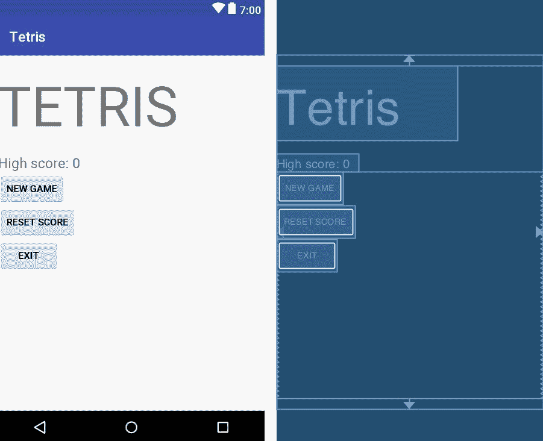

我们可以看到似乎有些不对劲。与我们的草图不同，我们的布局项不是居中，而是右对齐。我们可以通过在线性布局视图组中使用 `android:gravity` 属性来解决此问题。在以下代码片段中，我们使用了 `android:gravity` 属性来在两个线性布局中居中布局小部件：

```
<?xml version="1.0" encoding="utf-8"?>
<android.support.constraint.ConstraintLayout xmlns:android="http://schemas.android.com/apk/res/android"
    xmlns:app="http://schemas.android.com/apk/res-auto"
    xmlns:tools="http://schemas.android.com/tools"
    android:layout_width="match_parent"
    android:layout_height="match_parent"
    tools:context="com.mydomain.tetris.MainActivity">
  <LinearLayout
        android:layout_width="match_parent"
        android:layout_height="match_parent"
        app:layout_constraintBottom_toBottomOf="parent"
        app:layout_constraintLeft_toLeftOf="parent"
        app:layout_constraintRight_toRightOf="parent"
        app:layout_constraintTop_toTopOf="parent"
        android:layout_marginTop="@dimen/layout_margin_top"
        android:layout_marginBottom="@dimen/layout_margin_bottom"
        android:orientation="vertical"
        android:gravity="center"> 
    <!-- Aligns child elements to the centre of view group  -->
    <TextView
         android:layout_width="wrap_content"
         android:layout_height="wrap_content"
         android:text="TETRIS"
         android:textSize="80sp"/>
    <TextView
         android:id="@+id/tv_high_score"
         android:layout_width="wrap_content"
         android:layout_height="wrap_content"
         android:text="High score: 0"
         android:textSize="20sp"
         android:layout_marginTop="@dimen/layout_margin_top"/>
    <LinearLayout
           android:layout_width="match_parent"
           android:layout_height="0dp"
           android:layout_weight="1"
           android:orientation="vertical"
           android:gravity="center"> 
      <!-- Aligns child elements to the centre of view group  -->
      <Button
           android:id="@+id/btn_new_game"
           android:layout_width="wrap_content"
           android:layout_height="wrap_content"
           android:text="New game"/>
      <Button
           android:id="@+id/btn_reset_score"
           android:layout_width="wrap_content"
           android:layout_height="wrap_content"
           android:text="Reset score"/>
      <Button
           android:id="@+id/btn_exit"
           android:layout_width="wrap_content"
           android:layout_height="wrap_content"
           android:text="exit"/>
    </LinearLayout>
  </LinearLayout>
</android.support.constraint.ConstraintLayout>
```

由于 `android:gravity` 被设置为 `center`，小部件被正确地排列，正如我们所期望的那样。将 `android:gravity` 视图组应用于我们的布局视图组的效果可以在以下屏幕截图中看到：

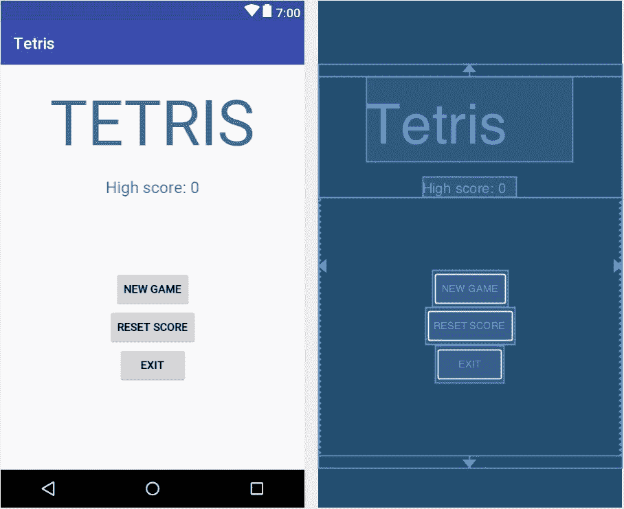

# 定义字符串资源

到目前为止，我们一直将硬编码的字符串作为值传递给需要设置文本的元素属性。这不是最佳实践，通常应该避免。相反，应该在字符串资源文件中添加字符串值。

字符串资源的默认文件是 `strings.xml`，它位于 `res` | `values` 目录中：

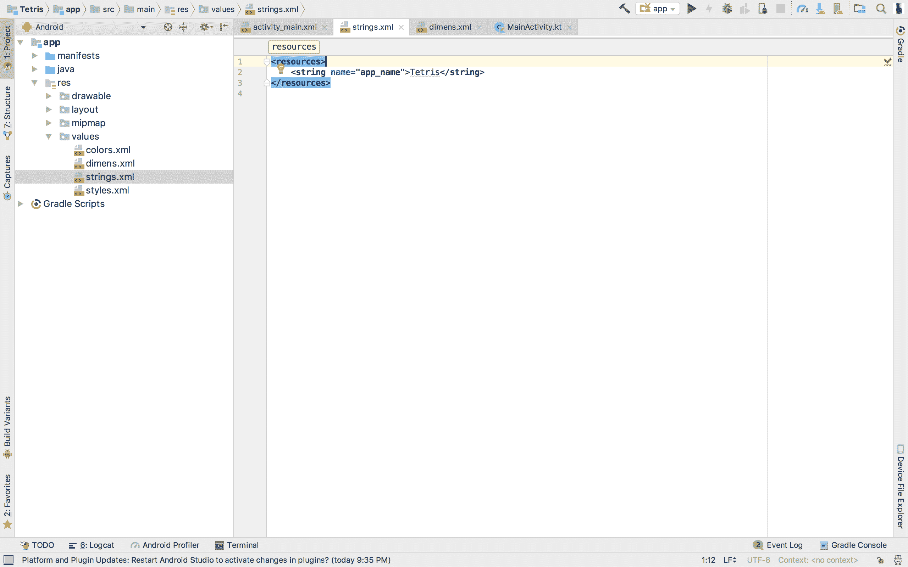

使用 `<string>` XML 标签添加字符串值作为字符串资源。我们需要为迄今为止使用的所有字符串值添加字符串资源。将以下代码添加到您的字符串资源文件中：

```
<resources>
  <string name="app_name">Tetris</string>
  <string name="high_score_default">High score: 0</string>
  <string name="new_game">New game</string>
  <string name="reset_score">Reset score</string>
  <string name="exit">exit</string>
</resources>
```

现在有必要编辑我们的 `MainActivity` 布局文件以利用这些创建的资源。字符串资源可以通过在字符串资源名称前加上 `@strings/` 前缀来引用。考虑以下代码：

```
<?xml version="1.0" encoding="utf-8"?>
<android.support.constraint.ConstraintLayout xmlns:android="http://schemas.android.com/apk/res/android"
    xmlns:app="http://schemas.android.com/apk/res-auto"
    xmlns:tools="http://schemas.android.com/tools"
    android:layout_width="match_parent"
    android:layout_height="match_parent"
    tools:context="com.mydomain.tetris.MainActivity">
  <LinearLayout
         android:layout_width="match_parent"
         android:layout_height="match_parent"
         app:layout_constraintBottom_toBottomOf="parent"
         app:layout_constraintLeft_toLeftOf="parent"
         app:layout_constraintRight_toRightOf="parent"
         app:layout_constraintTop_toTopOf="parent"
         android:layout_marginTop="@dimen/layout_margin_top"
         android:layout_marginBottom="@dimen/layout_margin_bottom"
         android:orientation="vertical"
         android:gravity="center"> 
    <!-- Aligns child elements to the centre of view group  -->
    <TextView
         android:layout_width="wrap_content"
         android:layout_height="wrap_content"
         android:text="@string/app_name"
         android:textAllCaps="true"
         android:textSize="80sp"/>
    <TextView
         android:id="@+id/tv_high_score"
         android:layout_width="wrap_content"
         android:layout_height="wrap_content"
         android:text="@string/high_score_default"
         android:textSize="20sp"
         android:layout_marginTop="@dimen/layout_margin_top"/>
    <LinearLayout
           android:layout_width="match_parent"
           android:layout_height="0dp"
           android:layout_weight="1"
           android:orientation="vertical"
           android:gravity="center"> 
      <!-- Aligns child elements to the centre of view group  -->
      <Button
           android:id="@+id/btn_new_game"
           android:layout_width="wrap_content"
           android:layout_height="wrap_content"
           android:text="@string/new_game"/>
      <Button
           android:id="@+id/btn_reset_score"
           android:layout_width="wrap_content"
           android:layout_height="wrap_content"
           android:text="@string/reset_score"/>
      <Button
           android:id="@+id/btn_exit"
           android:layout_width="wrap_content"
           android:layout_height="wrap_content"
           android:text="@string/exit"/>
    </LinearLayout>
  </LinearLayout>
</android.support.constraint.ConstraintLayout>
```

# 处理输入事件

在用户与应用程序交互的周期中，用户可以通过与小部件交互来提供某种形式的输入以执行一个过程。这些输入可以通过事件来捕获。在 Android 应用程序中，事件是从用户与之交互的特定视图对象中捕获的。处理输入事件所需的必要结构和程序由 View 类提供。

# 事件监听器

事件监听器是应用程序程序中的一个过程，它等待 UI 事件的发生。应用程序中可以发出许多类型的事件。一些常见的事件包括点击事件、触摸事件、长按事件和文本更改事件。

为了捕获小部件事件并在其发生时执行操作，必须在视图中设置事件监听器。这可以通过调用视图的`setListener()`方法并传递 lambda 或函数引用到方法调用中来实现。

以下示例演示了在按钮上捕获点击事件。将 lambda 传递到视图类的`setOnClickListener`方法中：

```
val button: Button = findViewById<Button>(R.id.btn_send)
button.setOnClickListener { 
  // actions to perform on click event
}
```

可以用一个函数的引用来代替 lambda：

```
class MainActivity : AppCompatActivity() {
  override fun onCreate(savedInstanceState: Bundle?) {
    super.onCreate(savedInstanceState)
    setContentView(R.layout.activity_main)
    val btnExit: Button = findViewById<Button>(R.id.btn_exit)
    btnExit.setOnClickListener(this::handleExitEvent)
  }
  fun handleExitEvent(view: View) {
    finish()
  }
}
```

视图类中提供了许多监听器设置方法。以下是一些示例：

+   `setOnClickListener()`: 在视图被点击时设置要调用的函数

+   `setOnContextClickListener()`: 在视图上发生上下文点击时设置要调用的函数

+   `setOnCreateContextMenuListener()`: 在创建视图的上下文菜单时设置要调用的函数

+   `setOnDragListener()`: 在视图上发生拖动事件时设置要调用的函数

+   `setOnFocusChangeListener()`: 在视图的焦点改变时设置要调用的函数

+   `setOnHoverChangeListener()`: 当视图上发生悬停事件时设置要调用的函数

+   `setOnLongClickListener()`: 在视图上发生长按事件时设置要调用的函数

+   `setOnScrollChangeListener()`: 当视图的滚动位置（X 或 Y）改变时设置要调用的函数

事件监听器是应用程序程序中的一个过程，它等待 UI 事件的发生。

由于我们现在已经很好地理解了如何处理输入事件，我们可以继续在`MainActivity`中实现一些逻辑。

主活动屏幕包含一个应用栏。我们需要隐藏这个布局元素，因为我们的视图不需要它：

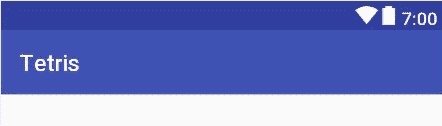

应用栏

应用栏也被称为操作栏。操作栏是`ActionBar`类的实例。布局中操作栏小部件的实例可以通过`supportActionBar`访问器变量检索。以下代码检索操作栏，并在没有返回 null 引用的情况下将其隐藏：

```
package com.mydomain.tetris
import android.support.v7.app.AppCompatActivity
import android.os.Bundle
import android.support.v7.app.ActionBar
import android.view.View
import android.widget.Button

class MainActivity : AppCompatActivity() {
  override fun onCreate(savedInstanceState: Bundle?) {
    super.onCreate(savedInstanceState)
    setContentView(R.layout.activity_main)
    val appBar: ActionBar? = supportActionBar

    if (appBar != null) {
      appBar.hide()
    }
  }
}
```

尽管前面的代码执行了必要的操作，但通过利用 Kotlin 的类型安全系统，其长度可以大大缩短，如下所示：

```
package com.mydomain.tetris
import android.support.v7.app.AppCompatActivity
import android.os.Bundle
import android.view.View
import android.widget.Button

class MainActivity : AppCompatActivity() {
  override fun onCreate(savedInstanceState: Bundle?) {
    super.onCreate(savedInstanceState)
    setContentView(R.layout.activity_main)
    supportActionBar?.hide()
  }
}
```

如果 `supportActionBar` 不是一个空对象引用，则如果没有其他操作发生，将调用 `hide()` 方法。这将防止抛出空指针异常。

我们需要为布局中存在的小部件创建对象引用。这出于许多原因，例如监听器注册。可以通过将视图的资源 ID 传递给 `findViewById()` 来检索视图的对象引用。我们在以下代码片段中将对象引用添加到 `MainActivity`（存在于 `MainActivity.kt` 文件中）：

```
package com.mydomain.tetris
import android.support.v7.app.AppCompatActivity
import android.os.Bundle
import android.view.View
import android.widget.Button
import android.widget.TextView

class MainActivity : AppCompatActivity() {

  var tvHighScore: TextView? = null

  override fun onCreate(savedInstanceState: Bundle?) {
    super.onCreate(savedInstanceState)
    setContentView(R.layout.activity_main)
    supportActionBar?.hide()

    val btnNewGame = findViewById<Button>(R.id.btn_new_game)
    val btnResetScore = findViewById<Button>(R.id.btn_reset_score)
    val btnExit = findViewById<Button>(R.id.btn_exit)
    tvHighScore = findViewById<TextView>(R.id.tv_high_score)
  }
}
```

现在我们已经为用户界面元素创建了对象引用，我们需要处理它们的一些事件。我们必须为布局中的所有按钮设置点击监听器（毕竟，点击后什么也不做的按钮是没有意义的）。

正如我们之前所述，新游戏按钮的唯一任务是引导用户导航到游戏活动（游戏发生的地方）。为了做到这一点，我们需要使用一个显式意图。将包含在“新游戏”按钮点击时执行的逻辑的私有函数添加到 `MainActivity`（在 `MainActivity.kt` 文件中），并通过 `setOnClickListener()` 调用设置函数的引用：

```
package com.mydomain.tetris
import android.support.v7.app.AppCompatActivity
import android.os.Bundle
import android.view.View
import android.widget.Button
import android.widget.TextView

class MainActivity : AppCompatActivity() {

  var tvHighScore: TextView? = null

  override fun onCreate(savedInstanceState: Bundle?) {
    super.onCreate(savedInstanceState)
    setContentView(R.layout.activity_main)
    supportActionBar?.hide()
    val btnNewGame = findViewById<Button>(R.id.btn_new_game)
    val btnResetScore = findViewById<Button>(R.id.btn_reset_score)
    val btnExit = findViewById<Button>(R.id.btn_exit)
    tvHighScore = findViewById<TextView>(R.id.tv_high_score)

    btnNewGame.setOnClickListener(this::onBtnNewGameClick)
  }

  private fun onBtnNewGameClick(view: View) {    }
}
```

创建一个新的空活动并将其命名为 `GameActivity`。一旦活动创建完成，我们就可以利用意图在点击“新游戏”按钮时启动该活动，如下面的代码所示：

```
private fun onBtnNewGameClick(view: View) {
  val intent = Intent(this, GameActivity::class.java)
  startActivity(intent)
}
```

函数体的第一行创建了一个新的 `Intent` 类实例，并将当前上下文和所需的活动类传递给构造函数。注意我们传递 `this` 作为构造函数的第一个参数。`this` 关键字用于引用 `this` 被调用时的当前实例。因此，我们实际上是将当前活动（`MainActivity`）作为构造函数的第一个参数传递。此时，你可能会问为什么我们要将活动作为 `Intent` 构造函数的第一个参数传递，因为它需要一个上下文作为其第一个参数。这是因为所有活动都是 `Context` 抽象类的扩展。因此，所有活动都是它们自己的上下文。

使用 `startActivity()` 方法从不需要结果的活动启动。当传递一个意图作为其唯一参数时，它将从不需要结果的活动启动。运行应用程序以观察按钮点击的效果。

`Context` 是 Android 应用程序框架中的一个抽象类。`Context` 的实现由 Android 系统提供。`Context` 允许访问应用程序特定的资源。`Context` 还允许访问应用程序级操作，例如启动活动、发送广播和接收意图。

现在让我们实现以下功能，用于处理“退出”和“重置分数”按钮的点击：

```
package com.mydomain.tetris
import android.content.Intent
import android.support.v7.app.AppCompatActivity
import android.os.Bundle
import android.view.View
import android.widget.Button
import android.widget.TextView

class MainActivity : AppCompatActivity() {

  var tvHighScore: TextView? = null

  override fun onCreate(savedInstanceState: Bundle?) {
    super.onCreate(savedInstanceState)
    setContentView(R.layout.activity_main)
    supportActionBar?.hide()

    val btnNewGame = findViewById<Button>(R.id.btn_new_game)
    val btnResetScore = findViewById<Button>(R.id.btn_reset_score)
    val btnExit = findViewById<Button>(R.id.btn_exit)
    tvHighScore = findViewById<TextView>(R.id.tv_high_score)
    btnNewGame.setOnClickListener(this::onBtnNewGameClick)
    btnResetScore.setOnClickListener(this::onBtnResetScoreClick)
    btnExit.setOnClickListener(this::onBtnExitClick)
  }

  private fun onBtnNewGameClick(view: View) {
    val intent = Intent(this, GameActivity::class.java)
    startActivity(intent)
  }

  private fun onBtnResetScoreClick(view: View) {}

  private fun onBtnExitClick(view: View) {
    System.exit(0)
  }
}
```

在 `onBtnExitClick` 函数中的 `System.exit()` 调用停止了程序的进一步执行，并在传递 `0` 整数作为其参数时退出程序。关于处理点击事件，我们最后需要实现重置高分的逻辑。为此，我们需要首先实现一些数据存储逻辑来存储高分。我们将使用 `SharedPreferences` 来完成这项工作。

# 使用 SharedPreferences

`SharedPreferences` 是一个用于存储、访问和修改数据的接口。`SharedPreferences` API 允许以键值对集合的形式存储数据。

我们将设置一个简单的工具来处理此应用程序的数据存储需求，利用 `SharedPreferences` 接口。在项目的源目录中创建一个名为 `storage` 的包（在源目录上右键单击并选择 New | Package）：

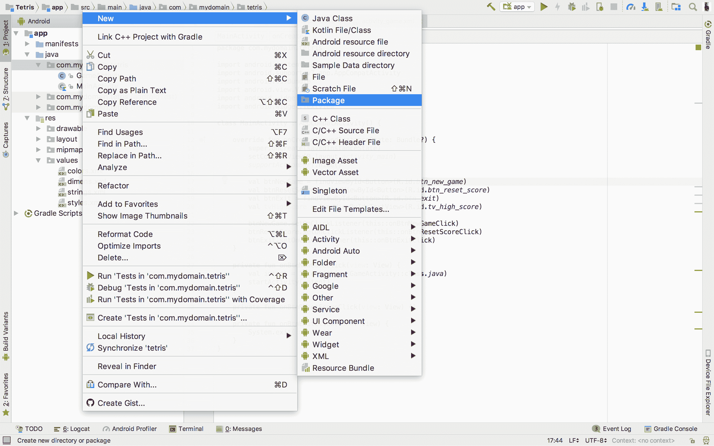

接下来，在 `storage` 包内创建一个名为 `AppPreferences` 的新 Kotlin 类。将以下代码输入到类文件中：

```
package com.mydomain.tetris.storage
import android.content.Context
import android.content.SharedPreferences

class AppPreferences(ctx: Context) {

  var data: SharedPreferences = ctx.getSharedPreferences
                                ("APP_PREFERENCES", Context.MODE_PRIVATE)

  fun saveHighScore(highScore: Int) {
    data.edit().putInt("HIGH_SCORE", highScore).apply()
  }

  fun getHighScore(): Int {
    return data.getInt("HIGH_SCORE", 0)
  }

  fun clearHighScore() {
    data.edit().putInt("HIGH_SCORE", 0).apply()
  }
}
```

在前面的代码片段中，在创建类的实例时需要将 `Context` 传递给类的构造函数。`Context` 提供了对 `getSharedPreferences()` 方法的访问，该方法检索指定的首选项文件。首选项文件由作为 `getSharedPreferences()` 方法第一个参数传递的字符串中的名称标识。

`saveHighScore()` 函数接受一个整数——要保存的高分——作为其唯一参数。`data.edit()` 返回一个 `Editor` 对象，允许修改首选项文件。调用编辑器的 `putInt()` 方法以在首选项文件中存储一个整数。传递给 `putInt()` 的第一个参数是一个表示将用于访问存储值的键的字符串。该方法的方法参数是存储的整数——在这种情况下，是高分。

`getHighScore()` 通过调用 `data.getInt()` 返回高分。`getInt()` 是 `SharedPreferences` 实现的一个函数，它提供了对存储的整数值的读取访问。`HIGH_SCORE` 是要检索的值的唯一标识符。传递给函数第二个参数的 `0` 指定了在不存在对应于指定键的值时返回的默认值。

`clearHighScore()` 通过简单地用 `0` 覆盖对应于 `HIGH_SCORE` 键的值来将高分重置为零。

现在我们已经设置了 `AppPreferences` 工具类，我们可以在 `MainActivity` 中完成 `onBtnResetScoreClick()` 函数：

```
private fun onBtnResetScoreClick(view: View) {
  val preferences = AppPreferences(this)
  preferences.clearHighScore()
}
```

现在当点击高分重置按钮时，高分将被重置为零。当发生此类操作时，您可能希望给用户某种形式的反馈。我们可以使用 `Snackbar` 来提供这种用户反馈。

为了在 Android 应用程序中使用`Snackbar`类，必须在模块级别的 Gradle 构建脚本中添加 Android 设计支持库依赖项。通过在`build.gradle`的依赖项闭包下添加以下行代码来完成此操作：

```
implementation 'com.android.support:design:26.1.0'
```

添加该行后，您的模块级别`build.gradle`脚本应类似于以下内容：

```
apply plugin: 'com.android.application'
apply plugin: 'kotlin-android'
apply plugin: 'kotlin-android-extensions'

android {
  compileSdkVersion 26
  buildToolsVersion "26.0.1"
  defaultConfig {
    applicationId "com.mydomain.tetris"
    minSdkVersion 15
    targetSdkVersion 26
    versionCode 1
    versionName "1.0"
    testInstrumentationRunner "android.support.test.runner
                               .AndroidJUnitRunner"
  }
  buildTypes {
    release {
      minifyEnabled false
      proguardFiles getDefaultProguardFile('proguard-android.txt'),
                    'proguard-rules.pro'
    }
  }
}

dependencies {
  implementation fileTree(dir: 'libs', include: ['*.jar'])
  implementation "org.jetbrains.kotlin:
                  kotlin-stdlib-jre7:$kotlin_version"
  implementation 'com.android.support:appcompat-v7:26.1.0'
  implementation 'com.android.support.constraint:
                  constraint-layout:1.0.2'
  testImplementation 'junit:junit:4.12'
  androidTestImplementation 'com.android.support.test:runner:1.0.1'
  androidTestImplementation 'com.android.support.test.espresso:espresso-core:3.0.1'
  implementation 'com.android.support:design:26.1.0' 
  // adding android design support library
}
```

修改完成后，通过在编辑器窗口中出现的闪消息中点击“立即同步”，同步您的项目，如图所示：

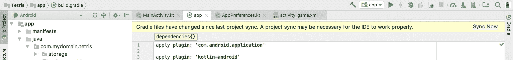

不再拖延，让我们修改`onBtnResetClick()`方法，以便在执行分数重置操作后以`Snackbar`的形式提供用户反馈，如下所示：

```
private fun onBtnResetScoreClick(view: View) {
  val preferences = AppPreferences(this)
  preferences.clearHighScore()
  Snackbar.make(view, "Score successfully reset",
                Snackbar.LENGTH_SHORT).show()
}
```

点击重置分数后，玩家的最高分如以下截图所示成功重置：

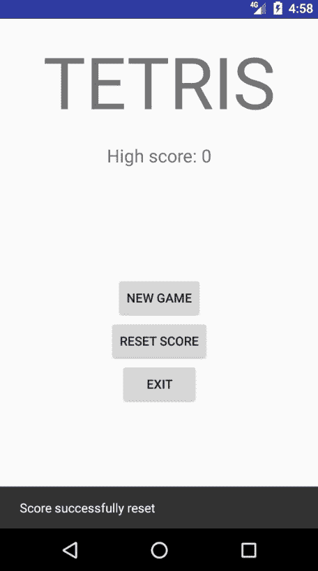

在继续之前，您需要更新`MainActivity`布局中显示的最高分数文本视图中的文本，以反映重置的分数。这可以通过更改文本视图中的文本如下完成：

```
private fun onBtnResetScoreClick(view: View) {
  val preferences = AppPreferences(this)
  preferences.clearHighScore()
  Snackbar.make(view, "Score successfully reset",
                Snackbar.LENGTH_SHORT).show()
  tvHighScore?.text = "High score: ${preferences.getHighScore()}"
}
```

# 实现游戏活动布局

到目前为止，我们已经成功创建了主活动的布局。在我们结束这一章之前，我们必须创建`GameActivity`的布局也是至关重要的。打开`activity_game.xml`并添加以下代码到其中：

```
<?xml version="1.0" encoding="utf-8"?>
<android.support.constraint.ConstraintLayout xmlns:android="http://schemas.android.com/apk/res/android"
    xmlns:app="http://schemas.android.com/apk/res-auto"
    xmlns:tools="http://schemas.android.com/tools"
    android:layout_width="match_parent"
    android:layout_height="match_parent"
    tools:context="com.mydomain.tetris.GameActivity">
  <LinearLayout
         android:layout_width="match_parent"
         android:layout_height="match_parent"
         android:orientation="horizontal"
         android:weightSum="10"
         android:background="#e8e8e8">
    <LinearLayout
           android:layout_width="wrap_content"
           android:layout_height="match_parent"
           android:orientation="vertical"
           android:gravity="center"
           android:paddingTop="32dp"
           android:paddingBottom="32dp"
           android:layout_weight="1">
      <LinearLayout
             android:layout_width="wrap_content"
             android:layout_height="0dp"
             android:layout_weight="1"
             android:orientation="vertical"
             android:gravity="center">
        <TextView
             android:layout_width="wrap_content"
             android:layout_height="wrap_content"
             android:text="@string/current_score"
             android:textAllCaps="true"
             android:textStyle="bold"
             android:textSize="14sp"/>
        <TextView
             android:id="@+id/tv_current_score"
             android:layout_width="wrap_content"
             android:layout_height="wrap_content"
             android:textSize="18sp"/>
        <TextView
             android:layout_width="wrap_content"
             android:layout_height="wrap_content"
             android:layout_marginTop="@dimen/layout_margin_top"
             android:text="@string/high_score"
             android:textAllCaps="true"
             android:textStyle="bold"
             android:textSize="14sp"/>
        <TextView
             android:id="@+id/tv_high_score"
             android:layout_width="wrap_content"
             android:layout_height="wrap_content"
             android:textSize="18sp"/>
      </LinearLayout>
      <Button
             android:id="@+id/btn_restart"
             android:layout_width="wrap_content"
             android:layout_height="wrap_content"
             android:text="@string/btn_restart"/>
    </LinearLayout>
    <View
          android:layout_width="1dp"
          android:layout_height="match_parent"
          android:background="#000"/>
    <LinearLayout
           android:layout_width="0dp"
           android:layout_height="match_parent"
           android:layout_weight="9">

    </LinearLayout>
  </LinearLayout>
</android.support.constraint.ConstraintLayout>
```

在此布局中使用的多数视图属性之前已经使用过，因此不需要进一步解释。唯一的例外是`android:background`和`android:layout_weightSum`属性。

`android:background`属性用于设置视图或视图组的背景颜色。在布局中使用`android:background`的两次实例中，`#e8e8e8`和`#000`被用作值。`#e8e8e8`是灰色十六进制颜色代码，而`#000`是黑色十六进制代码。

`android:layout_weightSum`定义了视图组中的最大权重和，它是视图组中所有子视图的`layout_weight`值的总和。`activity_game.xml`中的第一个线性布局声明所有子视图的权重和为`10`。因此，线性布局的直接子视图具有布局权重`1`和`9`。

我们使用了三个之前未添加到我们的字符串资源文件中的字符串资源。请将以下字符串资源添加到`strings.xml`中：

```
<string name="high_score">High score</string>
<string name="current_score">Current score</string>
<string name="btn_restart">Restart</string>
```

最后，我们必须为游戏活动添加一些简单的逻辑，以便填充最高分和当前分数文本视图，如下所示：

```
package com.mydomain.tetris

import android.os.Bundle
import android.support.v7.app.AppCompatActivity
import android.widget.Button
import android.widget.TextView
import com.mydomain.tetris.storage.AppPreferences

class GameActivity: AppCompatActivity() {

  var tvHighScore: TextView? = null
  var tvCurrentScore: TextView? = null
  var appPreferences: AppPreferences? = null

  public override fun onCreate(savedInstanceState: Bundle?) {
    super.onCreate(savedInstanceState)
    setContentView(R.layout.activity_game)
    appPreferences = AppPreferences(this)

    val btnRestart = findViewById<Button>(R.id.btn_restart)
    tvHighScore = findViewById<TextView>(R.id.tv_high_score)
    tvCurrentScore = findViewById<TextView>(R.id.tv_current_score)

    updateHighScore()
    updateCurrentScore()
  }

  private fun updateHighScore() {
    tvHighScore?.text = "${appPreferences?.getHighScore()}"
  }

  private fun updateCurrentScore() {
    tvCurrentScore?.text = "0"
  }
}
```

在前面的代码片段中，创建了布局视图元素的引用对象。此外，我们声明了`updateHighScore()`和`updateCurrentScore()`函数。这两个函数在视图创建时被调用。它们设置在布局文件中声明的当前分数和最高分数文本视图显示的默认分数。

保存对项目的更改并构建和运行应用程序。在应用程序启动后，点击“新建游戏”按钮以查看我们刚刚创建的布局：

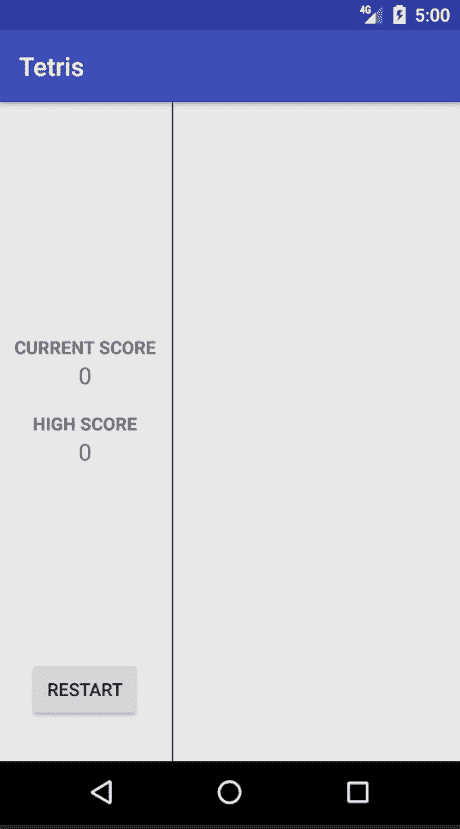

布局右侧不包含内容的部分是俄罗斯方块游戏发生的区域。我们将在第三章中实现这一功能：实现俄罗斯方块逻辑和功能。在进入下一章之前，我们必须理解的是应用程序清单。

# 应用程序清单

应用程序清单是一个存在于每个 Android 应用程序中的 XML 文件。它位于应用程序根文件夹的清单中。`manifest`文件包含有关 Android 操作系统中应用程序的关键信息。在应用程序可以运行之前，Android 系统必须读取应用程序的`androidManifest.xml`文件中包含的信息。必须在应用程序清单中注册的一些信息包括：

+   应用程序的 Java 包名

+   应用程序中的活动

+   应用程序中使用的服务

+   将隐式意图指向活动的意图过滤器

+   应用程序中使用的广播接收器的描述

+   应用程序中存在的内容提供者的数据

+   实现各种应用程序组件的类

+   应用程序所需的权限

# 应用程序清单文件的结构

`androidManifest.xml`文件的总体结构如下所示。片段包含`manifest`文件中可能存在的所有可能元素和声明：

```
<?xml version="1.0" encoding="utf-8"?>
<manifest>
  <uses-permission />
  <permission />
  <permission-tree />
  <permission-group />
  <instrumentation />
  <uses-sdk />
  <uses-configuration /> 
  <uses-feature /> 
  <supports-screens /> 
  <compatible-screens /> 
  <supports-gl-texture /> 

  <application>
    <activity>
      <intent-filter>
        <action />
        <category />
        <data />
      </intent-filter>
      <meta-data />
    </activity>
    <activity-alias>
      <intent-filter> 
        . . . 
      </intent-filter>
      <meta-data />
    </activity-alias>
    <service>
      <intent-filter> 
        . . .
      </intent-filter>
      <meta-data/>
    </service>
    <receiver>
      <intent-filter> . . . </intent-filter>
      <meta-data />
    </receiver>
    <provider>
      <grant-uri-permission />
      <meta-data />
      <path-permission />
    </provider>
    <uses-library />
  </application>
</manifest>
```

如前述代码片段所示，`manifest`文件中可以出现大量元素。本书将涵盖许多这些元素。实际上，我们已经在俄罗斯方块应用程序中使用了一些这些清单元素。请打开俄罗斯方块应用程序的`androidManifest.xml`文件。文件内容应类似于以下代码片段：

```
<?xml version="1.0" encoding="utf-8"?>
<manifest xmlns:android="http://schemas.android.com/apk/res/android"
    package="com.mydomain.tetris">

  <application
      android:allowBackup="true"
      android:icon="@mipmap/ic_launcher"
      android:label="@string/app_name"
      android:roundIcon="@mipmap/ic_launcher_round"
      android:supportsRtl="true"
      android:theme="@style/AppTheme">
    <activity android:name=".MainActivity">
      <intent-filter>
        <action android:name="android.intent.action.MAIN" />
        <category android:name="android.intent.category.LAUNCHER" />
      </intent-filter>
    </activity>
    <activity android:name=".GameActivity" />
  </application>

</manifest>
```

在前面的`manifest`文件中使用的元素（按字母顺序排列）如下：

+   `<action>`

+   `<activity>`

+   `<application>`

+   `<category>`

+   `<intent-filter>`

+   `<manifest>`

# `<action>`

这用于向意图过滤器添加操作。`<action>`元素始终是`<intent-filter>`元素的子元素。意图过滤器应包含一个或多个这些元素。如果没有为意图过滤器声明操作元素，则过滤器不接受任何`Intent`对象。其语法如下：

```
<action name=""/>
```

前面的`name`属性是一个指定正在处理的操作名称的属性。

# `<activity>`

此元素声明了一个应用程序中存在的活动。所有活动都必须在应用程序清单中声明，以便被 Android 系统看到。`<activity>` 总是放置在父 `<application>` 元素内。以下代码片段显示了使用 `<activity>` 元素在清单文件中声明活动的示例：

```
<activity android:name=".GameActivity" />
```

前面的代码片段中的 `name` 属性是一个属性，用于指定实现所声明活动的类的名称。

# `<application>`

此元素是应用程序的声明。它包含子元素，用于声明应用程序中存在的组件。以下代码演示了 `<application>` 的使用：

```
<application
      android:allowBackup="true"
      android:icon="@mipmap/ic_launcher"
      android:label="@string/app_name"
      android:roundIcon="@mipmap/ic_launcher_round"
      android:supportsRtl="true"
      android:theme="@style/AppTheme">
  <activity android:name=".MainActivity">
    <intent-filter>
      <action android:name="android.intent.action.MAIN" />
      <category android:name="android.intent.category.LAUNCHER" />
    </intent-filter>
  </activity>
  <activity android:name=".GameActivity" />
</application>
```

前面的代码片段中的 `<application>` 元素使用了四个属性。这些属性是：

+   `android:allowBackup`: 它用于指定应用程序是否允许参与备份和恢复基础设施。当设置为 `true` 时，应用程序可以被 Android 系统备份。否则，如果此属性设置为 `false`，Android 系统永远不会创建应用程序的备份。

+   `android:icon`: 它指定了应用程序的图标资源。它也可以用来指定应用程序组件的图标资源。

+   `android:label`: 它指定了整个应用程序的默认标签。它也可以用来指定应用程序组件的默认标签。

+   `android:roundIcon`: 它指定了在需要圆形图标资源时使用的图标资源。当启动器请求应用程序图标时，Android 框架返回 `android:icon` 或 `android:roundIcon`；返回哪个取决于设备的构建配置。由于两者都可能返回，因此为这两个属性指定资源是很重要的。

+   `android:supportsRtl`: 它指定了应用程序是否愿意支持 **从右到左**（**RTL**）布局。当此属性设置为 `true` 时，应用程序设置为支持它。否则，应用程序不支持 RTL 布局。

+   `android:theme`: 它指定了一个定义应用程序中所有活动默认主题的样式资源。

# `<category>`

此元素是 `<intent-filter>` 的子元素。它用于指定一个类别名称给其父意图过滤器组件。

# `<intent-filter>`

指定活动、服务和广播接收器组件可以响应的意图类型。意图过滤器始终在具有 `<intent-filter>` 元素的父组件中声明。

# `<manifest>`

这是应用程序清单文件的根元素。它包含一个单独的 `<application>` 元素，并指定了 `xmlns:android` 和 `package` 属性。

# 摘要

在本章中，我们更深入地研究了 Android 应用程序框架。在这个过程中，我们了解了许多事情，例如七个基本的 Android 应用程序组件：活动、意图、意图过滤器、片段、服务、加载器和内容提供者。

此外，我们还仔细研究了创建布局的过程，包括约束布局、现有的布局约束类型、字符串、尺寸资源、视图、视图组以及如何使用`SharedPreferences`。在下一章中，我们将进一步深入到俄罗斯方块的世界，并实现游戏玩法以及关键的应用逻辑。
