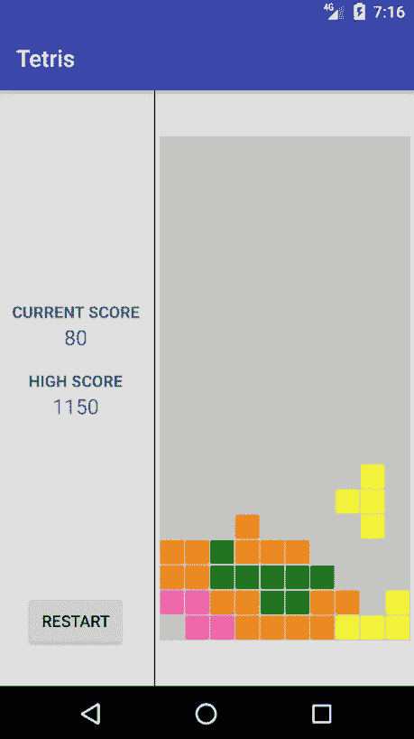
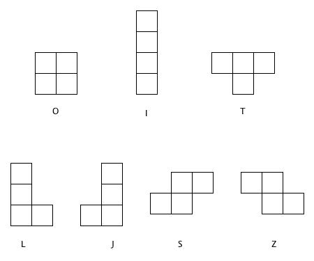
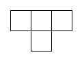
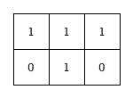
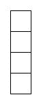
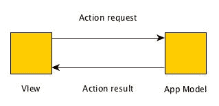
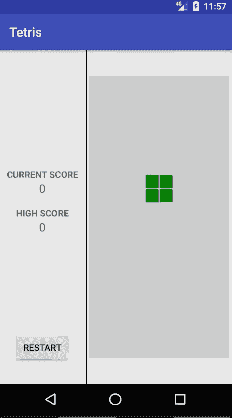
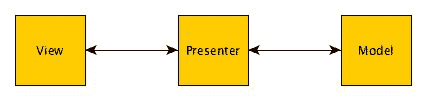

# 第三章：实现俄罗斯方块逻辑和功能

在上一章中，我们开始了经典游戏*俄罗斯方块*的开发。我们确定了应用程序的布局要求并实现了我们确定的布局元素。在这个过程中，我们为应用程序创建了两个活动：`MainActivity`和`GameActivity`。我们还实现了视图的基本特性和行为，但没有任何关于应用程序核心游戏玩法的内容。在本章中，我们将实现这个游戏玩法。在本章的进程中，你将了解以下主题：

+   异常处理

+   模型-视图-表示器模式

# 实现俄罗斯方块游戏玩法

由于我们关注实现游戏玩法，在本章中我们将进一步开发的活动是`GameActivity`。以下截图显示了本章所有开发工作的最终产品：



既然我们已经对最终游戏的外观有了概念，让我们开始其开发。

在第二章的*理解俄罗斯方块*部分，我们在*构建 Android 应用程序 - 俄罗斯方块*中了解到，俄罗斯方块是一种使用瓦片的拼图匹配游戏。这些瓦片组合成更大的形状，称为四元形。作为提醒，四元形是由四个正交连接的正方形组成的几何形状。

# 模拟四元形

由于四元形对于俄罗斯方块的游戏玩法至关重要，我们必须正确地通过编程来模拟这些元素。为了做到这一点，让我们将每个四元形单元视为一个构建块。构建块具有它们所拥有的特征。这些特征可以分为特性和行为。

# 块的特性

以下是一些方块所具有的特性：

+   **形状**：一个方块具有固定的形状，不能改变。

+   **尺寸**：一个方块具有尺寸特性。这些特性是高度和宽度。

+   **颜色**：一个方块始终具有一种颜色。方块所具有的颜色是固定的，并且在其存在的过程中保持不变。

+   **空间特性**：一个方块占据固定量的空间。

+   **位置特性**：在任何给定的时间点，一个方块在两个轴上都有一个位置，即*X*轴和*Y*轴。

# 块的行为

块的主要行为是其体验不同运动的能力。这些运动包括平移运动和旋转运动。平移运动是一种运动，其中物体从一个空间点移动到另一个空间点。在俄罗斯方块游戏中，一个方块可以体验到向左、向右和向下的平移运动。旋转运动是一种存在于刚体中并遵循曲线路径的运动。换句话说，旋转运动涉及物体在自由空间中的旋转。俄罗斯方块中的所有方块都可以旋转。

现在我们已经了解了方块的基本特性和行为，你可能想知道我们如何将它们转化为与四联体相关的内容。事实是，对这些特征特征的转换并不必要。方块的所有特性都适用于四联体。需要注意的是只有两件事：

+   四联体由四个方块组成

+   四联体中的所有方块都是正交排列的

话虽如此，让我们将这些特性转化为程序模型。我们将从建模形状开始。

# 建模方块形状

用于建模形状的方法取决于许多变量，例如必须测量的形状类型以及形状要建模的空间维度。在所有条件相同的情况下，建模三维形状比建模二维形状更困难。幸运的是，四联体在本质上来说是二维的。在我们开始以编程方式建模形状之前，了解我们试图建模的确切形状是非常重要的。俄罗斯方块中有七个基本的四联体方块。这些方块是 O、I、T、L、J、S 和 Z 四联体。以下图片显示了俄罗斯方块中存在的四联体基本形状：



所有的先前形状都在其边缘范围内占据空间。形状覆盖的空间区域可以看作是一个轮廓或框架。这与图片被框架所包含的方式相似。我们需要建模这个将包含单个形状的框架。由于框架内持有的形状在本质上来说是二维的，我们将利用一个二维字节数组来保存框架特定的信息。字节是信息的一个数字单位，通常由八个比特组成。比特是二进制数字。它是计算机中最小的数据单位，其值为 1 或 0。

理念是通过用二维数组表示框架覆盖的区域，用字节的值为 1 表示，而用字节的值为 0 表示未被覆盖的区域来建模形状的框架。以下框架为例：



我们可以将其视为一个整体形状，也可以将其视为一个具有两行三列的字节二维数组：



将字节的值为 1 分配给组成框架形状的数组中的单元格。另一方面，将字节的值为 0 分配给不是框架形状一部分的单元格。用类来建模这一点相当简单。首先，我们需要一个函数来生成我们将用于存储框架字节的所需字节数组结构。在你的源包内创建一个新的包，并将其命名为`helpers`。在这个包内创建一个`HelperFunctions.kt`文件。这个文件将包含在开发此应用过程中使用的所有辅助函数。打开`HelperFunctions.kt`并在文件中输入以下代码：

```
package com.mydomain.tetris.helpers

fun array2dOfByte(sizeOuter: Int, sizeInner: Int): Array<ByteArray>
        = Array(sizeOuter) { ByteArray(sizeInner) }
```

上述代码定义了一个 `array2dOfByte()` 函数，它接受两个参数。第一个参数是要生成的数组的期望行数，第二个参数是要生成的字节数组的期望列数。`array2dOFByte()` 方法生成并返回一个具有指定属性的新数组。现在我们已经设置了我们的字节数组生成辅助函数，让我们继续创建 `Frame` 类。在您的源包中创建一个新的包，并将其命名为 `models`。所有对象模型都将包含在这个创建的包中。在 `models` 包中，在 `Frame.kt` 文件中创建一个 `Frame` 类，并将以下代码输入到文件中：

```
package com.mydomain.tetris.models

import com.mydomain.tetris.helpers.array2dOfByte

class Frame(private val width: Int) {
  val data: ArrayList<ByteArray> = ArrayList()

  fun addRow(byteStr: String): Frame {
    val row = ByteArray(byteStr.length)

    for (index in byteStr.indices) {
      row[index] = "${byteStr[index]}".toByte()
    }
    data.add(row)
    return this
  }

  fun as2dByteArray(): Array<ByteArray> {
    val bytes = array2dOfByte(data.size, width)
    return data.toArray(bytes)
  }
}
```

`Frame` 类有两个属性：`width` 和 `data`。宽度是一个整数属性，用于保存要生成的框架的期望宽度（框架字节数组的列数）。`data` 属性保存了一个元素在 `ByteArray` 值空间中的数组列表。我们声明了两个不同的函数，`addRow()` 和 `get()`。`addRow()` 接受一个字符串，将字符串的每个单独字符转换为字节表示，然后将字节表示添加到字节数组中，之后将字节数组添加到数据列表中。`get()` 将数据数组列表转换为字节数组并返回该数组。

在为我们的方块建模了一个合适的框架之后，我们可以继续建模游戏中可能出现的独特四元形的形状。为了做到这一点，我们将使用一个 `enum` 类。在继续之前，在 `models` 包中创建一个 `Shape.kt` 文件。我们将从建模以下简单的四元形形状开始：



将框架视为字节的二维数组的概念应用于，我们可以将前一个形状的框架视为一个具有四行和单列的二维字节数组，每个单元格都填充了字节值 `1`。考虑到这一点，让我们建模这个形状。在 `Shape.kt` 中，创建一个 `Shape` 枚举类，如下面的代码所示：

```
enum class Shape(val frameCount: Int, val startPosition: Int) {
  Tetromino(2, 2) {
    override fun getFrame(frameNumber: Int): Frame {
      return when (frameNumber) {
        0 -> Frame(4).addRow("1111")
        1 -> Frame(1)
                     .addRow("1")
                     .addRow("1")
                     .addRow("1")
                     .addRow("1")
        else -> throw IllegalArgumentException("$frameNumber is an invalid 
                                                frame number.")
      }
    }
  };
  abstract fun getFrame(frameNumber: Int): Frame
}
```

`enum` 类是通过在 `class` 关键字之前放置 `enum` 关键字来声明的。前一个 `Shape` 枚举类的构造函数主要接受两个参数。第一个参数是 `frameCount`，它是一个整数变量，用于指定形状可以处于的可能帧的数量。第二个参数是 `startPosition`，它指定了形状在游戏场中沿 *X* 轴的预期起始位置。在 `enum` 类文件的下文中，声明了一个 `getFrame()` 函数。这个函数与我们之前声明的函数有一个显著的区别。`getFrame()` 是用抽象关键字声明的。抽象函数没有实现（因此没有主体）并且用于抽象一个必须由扩展类实现的行为。让我们仔细审查 `enum` 类中的以下代码行：

```
Tetromino(2, 2) {
  override fun getFrame(frameNumber: Int): Frame {
    return when (frameNumber) {
      0 -> Frame(4).addRow("1111")
      1 -> Frame(1)
                   .addRow("1")
                   .addRow("1")
                   .addRow("1")
                   .addRow("1")
      else -> throw IllegalArgumentException("$frameNumber is an invalid
                                              frame number.")
    }
  }
};
```

在前面的代码块中，正在创建一个`enum`实例，该实例提供了声明的抽象函数的实现。实例的标识符是`Tetromino`。我们将整数值`2`作为`frameCount`和`startPosition`属性的参数传递给`Tetromino`的构造函数。此外，`Tetromino`通过覆盖在`Shape`中声明的`getFrame()`函数在其对应的块中提供了`getFrame()`函数的实现。函数通过`override`关键字进行覆盖。`Tetromino`中`getFrame()`的实现接受一个`frameNumber`整数。这个框架数决定了将返回的`tetromino`框架。此时你可能想知道为什么`tetromino`具有多个框架。这仅仅是`tetromino`旋转可能性的结果。我们之前看到的单列`tetromino`可以左右旋转，以形成以下图示中的形状：


当将`frameNumber`传递给`getFrame()`时，如果`frameNumber`为`0`，`getFrame()`将返回一个`Frame`对象，该对象模拟了`Tetromino`在其水平状态下的框架，如之前所示。当`frameNumber`为`1`时，它返回一个模拟形状在其垂直状态下的框架对象。

如果`frameNumber`既不是`0`也不是`1`，函数将抛出`IllegalArgumentException`异常。

需要注意的是，`Tetromino`不仅是一个对象，还是一个常量。通常，使用`enum`类来创建常量。`enum`类是模拟我们的`tetromino`形状的完美选择，因为我们需要实现一组固定的形状。

在理解了`Shape`枚举类的工作原理之后，我们可以根据以下代码块模拟其他可能的`tetromino`形状：

```
enum class Shape(val frameCount: Int, val startPosition: Int) {
```

让我们创建一个具有一个框架和起始位置为 1 的`tetromino`形状。这里模拟的`tetromino`是正方形或'O'形状的`tetromino`。

```
Tetromino1(1, 1) {
    override fun getFrame(frameNumber: Int): Frame {
      return Frame(2)
             .addRow("11")
             .addRow("11")
    }
  },
```

让我们创建一个具有两个框架和起始位置为 1 的`tetromino`形状。这里模拟的`tetromino`是'Z'形状的`tetromino`。

```
  Tetromino2(2, 1) {
    override fun getFrame(frameNumber: Int): Frame {
      return when (frameNumber) {
        0 -> Frame(3)
                   .addRow("110")
                   .addRow("011")
        1 -> Frame(2)
                   .addRow("01")
                   .addRow("11")
                   .addRow("10")
        else -> throw IllegalArgumentException("$frameNumber is an invalid 
                                                frame number.")
        }
      }
    },

```

让我们创建一个具有两个框架和起始位置为`1`的`tetromino`形状。这里模拟的`tetromino`是'S'形状的`tetromino`。

```
    Tetromino3(2, 1) {
      override fun getFrame(frameNumber: Int): Frame {
        return when (frameNumber) {
          0 -> Frame(3)
                     .addRow("011")
                     .addRow("110")
          1 -> Frame(2)
                     .addRow("10")
                     .addRow("11")
                     .addRow("01")
          else -> throw IllegalArgumentException("$frameNumber is 
                                       an invalid frame number.")
        }
      }
    },
```

让我们创建一个具有两个框架和起始位置为 2 的`tetromino`形状。这里模拟的`tetromino`是'I'形状的`tetromino`。

```
    Tetromino4(2, 2) {
      override fun getFrame(frameNumber: Int): Frame {
        return when (frameNumber) {
          0 -> Frame(4).addRow("1111")
          1 -> Frame(1)
                       .addRow("1")
                       .addRow("1")
                       .addRow("1")
                       .addRow("1")
          else -> throw IllegalArgumentException("$frameNumber is an 
                                       invalid frame number.")
        }
      }
    },

```

让我们创建一个具有四个框架和起始位置为 1 的`tetromino`形状。这里模拟的`tetromino`是'T'形状的`tetromino`。

```
    Tetromino5(4, 1) {
      override fun getFrame(frameNumber: Int): Frame {
        return when (frameNumber) {
          0 -> Frame(3)
                     .addRow("010")
                     .addRow("111")
          1 -> Frame(2)
                     .addRow("10")
                     .addRow("11")
                     .addRow("10")
          2 -> Frame(3)
                     .addRow("111")
                     .addRow("010")
          3 -> Frame(2)
                     .addRow("01")
                     .addRow("11")
                     .addRow("01")
          else -> throw IllegalArgumentException("$frameNumber is an 
                                       invalid frame number.")
        }
      }
    },
```

让我们创建一个具有四个框架和起始位置为 1 的`tetromino`形状。这里模拟的`tetromino`是'J'形状的`tetromino`。

```
    Tetromino6(4, 1) {
      override fun getFrame(frameNumber: Int): Frame {
        return when (frameNumber) {
          0 -> Frame(3)
                     .addRow("100")
                     .addRow("111")
          1 -> Frame(2)
                     .addRow("11")
                     .addRow("10")
                     .addRow("10")
          2 -> Frame(3)
                     .addRow("111")
                     .addRow("001")
          3 -> Frame(2)
                     .addRow("01")
                     .addRow("01")
                     .addRow("11")
          else -> throw IllegalArgumentException("$frameNumber is 
                                       an invalid frame number.")
        }
      }
    },
```

让我们创建一个具有四个框架和起始位置为 1 的`tetromino`形状。这里模拟的`tetromino`是'L'形状的`tetromino`。

```
    Tetromino7(4, 1) {
      override fun getFrame(frameNumber: Int): Frame {
        return when (frameNumber) {
          0 ->  Frame(3)
                     .addRow("001")
                     .addRow("111")
          1 -> Frame(2)
                     .addRow("10")
                     .addRow("10")
                     .addRow("11")
          2 -> Frame(3)
                     .addRow("111")
                     .addRow("100")
          3 -> Frame(2)
                     .addRow("11")
                     .addRow("01")
                     .addRow("01")
          else -> throw IllegalArgumentException("$frameNumber is 
                                       an invalid frame number.")
        }
      }
    };

    abstract fun getFrame(frameNumber: Int): Frame
}
```

在对块框架和形状建模之后，下一步我们必须通过编程方式对块本身进行建模。我们将利用这个机会通过使用 Java 实现模型来展示 Kotlin 与 Java 的无缝互操作性。在`models`目录中（models | New | Java Class）创建一个新的 Java 类，命名为`Block`。我们将通过添加代表块特征的实例变量来开始建模过程。考虑以下代码：

```
package com.mydomain.tetris.models;
import android.graphics.Color;
import android.graphics.Point;

public class Block {
  private int shapeIndex;
  private int frameNumber;
  private BlockColor color;
  private Point position;

  public enum BlockColor {
    PINK(Color.rgb(255, 105, 180), (byte) 2),
    GREEN(Color.rgb(0, 128, 0), (byte) 3),
    ORANGE(Color.rgb(255, 140, 0), (byte) 4),
    YELLOW(Color.rgb(255, 255, 0), (byte) 5),
    CYAN(Color.rgb(0, 255, 255), (byte) 6);

    BlockColor(int rgbValue, byte value) {
      this.rgbValue = rgbValue;
      this.byteValue = value;
    }

    private final int rgbValue;
    private final byte byteValue;
  }
}
```

在前面的代码块中，我们添加了四个实例变量：`shapeIndex`、`frameNumber`、`color`和`position`。`shapeIndex`将保存块形状的索引，`frameNumber`将跟踪块形状的帧数，`color`将保存块的颜色特征，而`position`将用于跟踪块在游戏场中的当前空间位置。

在`Block`类中添加了一个`enum`模板，名为`BlockColor`。这个`enum`创建了一个`BlockColor`实例的常量集合，每个实例都拥有`rgbValue`和`byteValue`属性。`rgbValue`是一个整数，用于唯一标识使用`Color.rgb()`方法指定的 RGB 颜色。`Color`是由 Android 应用程序框架提供的一个类，`rgb()`是定义在`Color`类中的一个类方法。五个`Colour.rgb()`调用分别指定了粉红色、绿色、橙色、黄色和青色。

在`Block`类中，我们使用了`private`和`public`关键字。这些关键字并非仅仅为了美观；它们各自都有用途。这两个关键字，连同`protected`关键字，被称为访问修饰符。

访问修饰符是用于指定类、方法、函数、变量和结构访问限制的关键字。Java 有三种访问修饰符：`private`、`public`和`protected`。在 Kotlin 中，访问修饰符被称为可见性修饰符。Kotlin 中可用的可见性修饰符有`public`、`protected`、`private`和`internal`。

# 私有访问修饰符（private）

声明为私有的方法、变量、构造函数和结构只能在声明类内部访问。这有一个例外，即私有顶层函数和属性对所有同一文件成员都是可见的。类内部的私有变量可以通过声明允许访问的 getter 和 setter 方法从类外部访问。以下代码展示了在 Java 中定义 setter 和 getter 方法：

```
public class Person {
  Person(String fullName, int age) {
    this.fullName = fullName;
    this.age = age;
  }

  private String fullName;
  private int age;

  public String getFullName() {
    return fullName;
  }

  public int getAge() {
    return age;
  }
}
```

在 Kotlin 中，setter 和 getter 的创建方式如下：

```
public class Person(private var fullName: String) {
  var name: String
  get() = fullName
  set(value)  {
    fullName = value
  }
}
```

使用私有访问修饰符是程序中信息隐藏的主要手段。信息隐藏也称为封装。

# 公共访问修饰符（public）

声明为公共的方法、变量、构造函数和结构可以在声明类的外部自由访问。存在于访问类不同包中的公共类在使用之前必须导入。以下类使用了公共访问修饰符：

```
public class Person { .. }
```

# 受保护的访问修饰符（protected）

声明为受保护的变量、方法、函数和结构只能由与定义类在同一包中的类或存在于单独包中的定义类的子类访问：

```
public class Person(private var fullName: String) {
  protected name: String
  get() = fullName
  set(value)  {
    fullName = value
  }
}
```

# 内部可见性修饰符（internal）

内部可见性修饰符用于声明一个成员在同一模块内可见。模块是一组编译在一起的 Kotlin 文件。模块可能是一个 Maven 项目、一个 Gradle 源集、一个 IntelliJ IDEA 模块，或者是一组使用 Ant 任务调用编译的文件集。使用内部修饰符与使用其他可见性修饰符类似：

```
internal class Person { }
```

在理解了访问和可见性修饰符之后，我们可以继续 `Block` 类的实现。接下来我们需要做的是为类创建一个构造函数，该构造函数将初始化我们创建的实例变量到其初始状态。Java 中的构造函数定义在语法上与 Kotlin 构造函数定义不同：

```
public class Block {
  private int shapeIndex;
  private int frameNumber;
  private BlockColor color;
  private Point position;
```

让我们看看构造函数的定义：

```
  private Block(int shapeIndex, BlockColor blockColor) {
    this.frameNumber = 0;
    this.shapeIndex = shapeIndex;
    this.color = blockColor;
    this.position = new Point(AppModel.FieldConstants
                              .COLUMN_COUNT.getValue() / 2, 0);
  }

  public enum BlockColor {
    PINK(Color.rgb(255, 105, 180), (byte) 2),
    GREEN(Color.rgb(0, 128, 0), (byte) 3),
    ORANGE(Color.rgb(255, 140, 0), (byte) 4),
    YELLOW(Color.rgb(255, 255, 0), (byte) 5),
    CYAN(Color.rgb(0, 255, 255), (byte) 6);

    BlockColor(int rgbValue, byte value) {
      this.rgbValue = rgbValue;
      this.byteValue = value;
    }

    private final int rgbValue;
    private final byte byteValue;
  }
}
```

注意到前面的构造函数定义已被赋予私有访问权限。我们这样做是因为我们不希望这个构造函数在 `Block` 之外被访问。由于我们仍然希望其他类有创建块实例的手段，我们必须定义一个允许这样做的方法。我们将把这个方法命名为 `createBlock`：

```
public class Block {
  private int shapeIndex;
  private int frameNumber;
  private BlockColor color;
  private Point position;

```

让我们看看构造函数的定义：

```

  private Block(int shapeIndex, BlockColor blockColor) {
    this.frameNumber = 0;
    this.shapeIndex = shapeIndex;
</span>    this.color = blockColor;
    this.position = new Point( FieldConstants.COLUMN_COUNT
                               .getValue()/2, 0);
  }

  public static Block createBlock() {
    Random random = new Random();
    int shapeIndex = random.nextInt(Shape.values().length);
    BlockColor blockColor = BlockColor.values() 
         [random.nextInt(BlockColor.values().length)];

    Block block = new Block(shapeIndex, blockColor);
    block.position.x = block.position.x - Shape.values()
          [shapeIndex].getStartPosition();
    return block;
  }

  public enum BlockColor {
    PINK(Color.rgb(255, 105, 180), (byte) 2),
    GREEN(Color.rgb(0, 128, 0), (byte) 3),
    ORANGE(Color.rgb(255, 140, 0), (byte) 4),
    YELLOW(Color.rgb(255, 255, 0), (byte) 5),
    CYAN(Color.rgb(0, 255, 255), (byte) 6);

    BlockColor(int rgbValue, byte value) {
      this.rgbValue = rgbValue;
      this.byteValue = value;
    }

    private final int rgbValue;
    private final byte byteValue;
  }
}
```

`createBlock()` 随机选择 `Shape` 枚举类中一个四联体形状的索引以及一个 `BlockColor`，并将两个随机选择的值分配给 `shapeIndex` 和 `blockColor`。使用这两个值作为参数创建一个新的 `Block` 实例，并设置块沿 *X* 轴的位置。最后，`createBlock()` 返回创建并初始化的块。

我们需要向 `Block` 添加一些获取器和设置器方法。这些方法将提供对块实例关键属性的访问。将以下方法添加到 `Block` 类中：

```
public static int getColor(byte value) {
  for (BlockColor colour : BlockColor.values()) {
    if (value == colour.byteValue) {
      return colour.rgbValue;
    }
  }
  return -1;
}

public final void setState(int frame, Point position) {
  this.frameNumber = frame;
  this.position = position;
}

@NonNull
public final byte[][] getShape(int frameNumber) {
  return Shape.values()[shapeIndex].getFrame(frameNumber).as2dByteArray();
}

public Point getPosition() {
  return this.position;
}

public final int getFrameCount() {
  return Shape.values()[shapeIndex].getFrameCount();
}

public int getFrameNumber() {
  return frameNumber;
}

public int getColor() {
  return color.rgbValue;
}

public byte getStaticValue() {
  return color.byteValue;
}
```

`@NonNull` 是 Android 应用程序框架提供的一个注解，表示一个字段、参数或方法返回值永远不会为 null。在上面的代码片段中，它在 `getShape()` 方法定义之前的行中使用，表示该方法不能返回 null 值。

在 Java 中，注解是一种可以添加到 Java 源代码的元数据形式。注解可以用于类、方法、变量、参数和包。注解也可以在 Kotlin 中声明和使用。

`@NotNull` 注解存在于 `android.support.annotation` 包中。将包导入添加到 `Block.java` 顶部的包导入中：

```
import android.support.annotation.NonNull;
```

在继续前进之前，我们应在 `Block` 类中注意最后一件事。在 `Block` 构造函数的最后一行，当前块实例的位置实例变量被设置为以下内容：

```
this.position = new Point(FieldConstants.COLUMN_COUNT.getValue()/2, 0);
```

`10` 是将要生成俄罗斯方块的场地的列数。这是一个将在代码中多次使用的常量值，因此最好将其声明为常量。在基础应用程序源包中创建一个名为 `constants` 的包，并向该包中添加一个名为 `FieldConstants` 的新 Kotlin 文件。接下来，添加表示游戏场地将拥有的列数和行数的常量。场地应该有十列和二十行：

```
enum class FieldConstants(val value: Int) {
  COLUMN_COUNT(10), ROW_COUNT(20);
}
```

将带有 `FieldConstants` 枚举类的包导入 `Block.java`，并将 `10` 整数替换为 `COLUMN_COUNT` 的常量值：

```
this.position = new Point( FieldConstants.COLUMN_COUNT.getValue()/2, 0);
```

就这样！我们已经完成了 `Block` 类的程序化建模。

# 创建应用程序模型

到目前为止，我们一直关注于建模组成俄罗斯方块块的特定组件。现在是我们关注定义应用程序逻辑的时候了。我们将创建一个应用程序模型来实现必要的俄罗斯方块游戏逻辑，并作为视图和我们所创建的方块组件之间的中介接口。



视图将向应用程序模型发送性能请求，如果操作有效，模型将执行操作并向视图发送反馈。类似于我们迄今为止创建的模型，我们需要为应用程序模型创建一个单独的类文件。继续创建一个名为 `AppModel.kt` 的新 Kotlin 文件，并在文件中添加一个名为 `AppModel` 的类，包含对 `Point`、`FieldConstants`、`array2dOfByte` 和 `AppPreferences` 的导入：

```
package com.mydomain.tetris.models

import android.graphics.Point
import com.mydomain.tetris.constants.FieldConstants
import com.mydomain.tetris.helpers.array2dOfByte
import com.mydomain.tetris.storage.AppPreferences

class AppModel
```

`AppModel` 的某些功能是跟踪当前分数、俄罗斯方块游戏场地的状态、当前方块、游戏当前状态、游戏当前状态以及当前方块所经历的运动。`AppModel` 还必须通过我们创建的 `AppPreferences` 类直接访问应用程序的 `SharedPreferences` 文件中的值。满足这些不同的需求可能一开始看起来令人畏惧，但实际上就像做饼一样简单。

我们必须做的第一件事是添加 `AppModel` 将要使用的必要常量。我们需要为可能的游戏状态和游戏过程中可能发生的运动创建常量。这些常量可以通过使用 `enum` 类轻松创建：

```
class AppModel {
  enum class Statuses {
    AWAITING_START, ACTIVE, INACTIVE, OVER
  }

  enum class Motions {
    LEFT, RIGHT, DOWN, ROTATE
  }
}
```

我们之前创建了四个状态常量。`AWAITING_START` 是游戏开始之前游戏的状态。`ACTIVE` 是游戏在进行游戏时存在的状态。`OVER` 是游戏结束时游戏的状态。

在本章的早期，提到一个方块上可以发生四种不同的运动。方块可以被移动到右边、左边、向上、向下，以及旋转。`LEFT`、`RIGHT`、`UP`、`DOWN` 和 `ROTATE` 在 `Motions` 枚举类中被定义为表示这些不同的运动。

添加了所需的常量后，我们可以继续添加`AppModel`所需的类属性，如下所示：

```
package com.mydomain.tetris.models

import android.graphics.Point
import com.mydomain.tetris.constants.FieldConstants
import com.mydomain.tetris.helpers.array2dOfByte
import com.mydomain.tetris.storage.AppPreferences

class AppModel {
  var score: Int = 0
  private var preferences: AppPreferences? = null

  var currentBlock: Block? = null
  var currentState: String = Statuses.AWAITING_START.name

  private var field: Array<ByteArray> = array2dOfByte(
    FieldConstants.ROW_COUNT.value,
    FieldConstants.COLUMN_COUNT.value
  )

  enum class Statuses {
    AWAITING_START, ACTIVE, INACTIVE, OVER
  }

  enum class Motions {
    LEFT, RIGHT, DOWN, ROTATE
  }
}
```

`score`是一个整数属性，将用于在游戏会话中保存玩家的当前分数。`preferences`是一个私有属性，将保存一个`AppPreferences`对象，以提供对应用程序的`SharedPreferences`文件的直接访问。`currentBlock`是一个属性，将保存当前正在游戏场中转换的块。`currentState`保存游戏的状态。`Statuses.AWAITING_START.name`以`AWAITING_START`字符串的形式返回`Statuses.AWAITING_START`的名称。游戏的状态立即初始化为`AWAITING_START`，因为这是`GameActivity`在启动时必须过渡到的第一个状态。最后，`field`是一个二维数组，将用作游戏的比赛场。

接下来，我们必须添加一些设置器和获取器函数。这些函数是`setPreferences()`、`setCellStatus()`和`getCellStatus()`。将以下函数添加到`AppModel`中：

```
fun setPreferences(preferences: AppPreferences?) {
  this.preferences = preferences
}

fun getCellStatus(row: Int, column: Int): Byte? {
  return field[row][column]
}

private fun setCellStatus(row: Int, column: Int, status: Byte?) {
  if (status != null) {
    field[row][column] = status
  }
}
```

`setPreferences()`方法将`AppModel`的偏好属性设置为传递给函数的`AppPreferences`实例。`getCellStatus()`方法返回在字段二维数组中指定行-列位置存在的单元格的状态。`setCellStatus()`方法将字段中存在的单元格的状态设置为指定的字节。

在模型中也需要检查状态的函数。这些将作为断言游戏当前状态的媒介。由于有三个可能的游戏状态对应于三个可能的游戏状态，因此每个游戏状态都需要三个函数。这些方法是`isGameAwaitingStart()`、`isGameActive()`和`isGameOver()`：

```
class AppModel {

  var score: Int = 0
  private var preferences: AppPreferences? = null

  var currentBlock: Block? = null
  var currentState: String = Statuses.AWAITING_START.name

  private var field: Array<ByteArray> = array2dOfByte(
    FieldConstants.ROW_COUNT.value,
    FieldConstants.COLUMN_COUNT.value
  )

  fun setPreferences(preferences: AppPreferences?) {
    this.preferences = preferences
  }

  fun getCellStatus(row: Int, column: Int): Byte? {
    return field[row][column]
  }

  private fun setCellStatus(row: Int, column: Int, status: Byte?) {
    if (status != null) {
      field[row][column] = status
    }
  }

  fun isGameOver(): Boolean {
    return currentState == Statuses.OVER.name
  }

  fun isGameActive(): Boolean {
    return currentState == Statuses.ACTIVE.name
  }

  fun isGameAwaitingStart(): Boolean {
    return currentState == Statuses.AWAITING_START.name
  }

  enum class Statuses {
    AWAITING_START, ACTIVE, INACTIVE, OVER
  }

  enum class Motions {
    LEFT, RIGHT, DOWN, ROTATE
  }
}
```

所有三种方法都返回布尔值，要么是`true`要么是`false`，这取决于游戏是否存在于它们各自的状态中。到目前为止，我们还没有在`AppModel`中使用`score`。让我们添加一个可以用来增加`score`所持有的分数值的函数。我们将把这个函数命名为`boostScore()`。

```
private fun boostScore() {
  score += 10
  if (score > preferences?.getHighScore() as Int)
    preferences?.saveHighScore(score)
}
```

当被调用时，`boostScore()`将玩家的当前分数增加 10 分，之后它会检查玩家的当前分数是否大于记录在偏好文件中的高分。如果当前分数高于保存的高分，则高分将被当前分数覆盖。

在基本函数和字段运行起来之后，我们可以继续创建稍微复杂一些的函数。这些函数中的第一个是`generateNextBlock()`：

```
private fun generateNextBlock() {
  currentBlock = Block.createBlock()
}
```

`generateNextBlock()`函数创建一个新的块实例，并将`currentBlock`设置为新创建的实例。

在进一步定义方法之前，让我们创建一个额外的 `enum` 类来存储常量单元格值。在常量包中创建一个 `CellConstants.kt` 文件，并将以下源代码添加到其中：

```
package com.mydomain.tetris.constants

enum class CellConstants(val value: Byte) {
  EMPTY(0), EPHEMERAL(1)
}
```

你可能想知道这些常量是用来做什么的。回想一下，当我们创建 `Frame` 类来模拟块框架时，我们定义了 `addRow()`，它接受一个由 1 和 0 组成的字符串作为其参数——其中 1 代表组成框架的单元格，0 代表从框架中排除的单元格——并将这些 1 和 0 转换为字节表示。我们将在未来的函数中操作这些字节，并且我们需要为它们提供相应的常量。

将新创建的 `enum` 类导入到 `AppModel` 中。我们将在即将到来的函数中使用它。

```
private fun validTranslation(position: Point, shape: Array<ByteArray>): Boolean {
  return if (position.y < 0 || position.x < 0) {
    false
  } else if (position.y + shape.size > FieldConstants.ROW_COUNT.value) {
    false
  } else if (position.x + shape[0].size > FieldConstants
             .COLUMN_COUNT.value) {
    false
  } else {
    for (i in 0 until shape.size) {
      for (j in 0 until shape[i].size) {
        val y = position.y + i
        val x = position.x + j

        if (CellConstants.EMPTY.value != shape[i][j] && 
            CellConstants.EMPTY.value != field[y][x]) {
          return false
        }
      }
    }
    true
    }
  }
```

将前面的 `validTranslation()` 方法添加到 `AppModel` 中。正如其名称所暗示的，此函数用于根据一组条件检查玩场中四元形的平移运动是否有效。如果平移有效，则返回 `true` 布尔值，否则返回 `false`。前三个条件检查四元形正在平移到的场中的位置是否有效。`else` 块检查四元形试图平移到的单元格是否为空。如果不为空，则返回 `false`。

我们需要一个用于 `validTranslation()` 的调用函数。我们将声明 `moveValid()` 来完成这个任务。将以下函数添加到 `AppModel` 中。

```
private fun moveValid(position: Point, frameNumber: Int?): Boolean {
  val shape: Array<ByteArray>? = currentBlock?
                                 .getShape(frameNumber as Int)
  return validTranslation(position, shape as Array<ByteArray>)
}
```

`moveValid()` 使用 `validTranslation()` 检查玩家执行的运动是否被允许。如果运动被允许，则返回 `true`，否则返回 `false`。我们需要创建一些其他重要方法。这些方法是 `generateField()`、`resetField()`、`persistCellData()`、`assessField()`、`translateBlock()`、`blockAdditionPossible()`、`shiftRows()`、`startGame()`、`restartGame()`、`endGame()` 和 `resetModel()`。

我们首先将专注于 `generateField()` 方法。将以下代码添加到 `AppModel` 中。

```
fun generateField(action: String) {
  if (isGameActive()) {
    resetField()
    var frameNumber: Int? = currentBlock?.frameNumber
    val coordinate: Point? = Point()
    coordinate?.x = currentBlock?.position?.x
    coordinate?.y = currentBlock?.position?.y

    when (action) {
      Motions.LEFT.name -> {
        coordinate?.x = currentBlock?.position?.x?.minus(1)
      }
      Motions.RIGHT.name -> {
        coordinate?.x = currentBlock?.position?.x?.plus(1)
      }
      Motions.DOWN.name -> {
        coordinate?.y = currentBlock?.position?.y?.plus(1)
      }
      Motions.ROTATE.name -> {
        frameNumber = frameNumber?.plus(1)

        if (frameNumber != null) {
          if (frameNumber >= currentBlock?.frameCount as Int) {
            frameNumber = 0
          }
        }
      }
    }

    if (!moveValid(coordinate as Point, frameNumber)) {
      translateBlock(currentBlock?.position as Point, 
                     currentBlock?.frameNumber as Int)
      if (Motions.DOWN.name == action) {
        boostScore()
        persistCellData()
        assessField()
        generateNextBlock()

        if (!blockAdditionPossible()) {
          currentState = Statuses.OVER.name;
          currentBlock = null;
          resetField(false);
        }
      }
    } else {
      if (frameNumber != null) {
        translateBlock(coordinate, frameNumber)
        currentBlock?.setState(frameNumber, coordinate)
      }
    }
  }
}
```

`generateField()` 生成字段的刷新。这种字段刷新由传递给 `generateField()` 的动作参数确定。

首先，`generateField()` 检查在调用时游戏是否处于活动状态。如果游戏处于活动状态，则检索框架编号和块的坐标。然后通过 `when` 表达式确定请求的动作。确定了请求的动作后，如果请求的动作是向左、向右或向下移动，则相应地更改块的坐标。如果请求的是旋转运动，则 `frameNumber` 被更改为表示旋转中四元形的适当帧编号。

然后，`generateField()` 方法通过 `moveValid()` 检查请求的运动是否是有效的运动。如果运动无效，则使用 `translateBlock()` 将当前块固定在字段中的当前位置。

`resetField()`、`persistCellData()`和`assessField()`方法由`generateField()`调用，如下所示。将它们添加到`AppModel`中：

```
private fun resetField(ephemeralCellsOnly: Boolean = true) {
  for (i in 0 until FieldConstants.ROW_COUNT.value) {
    (0 until FieldConstants.COLUMN_COUNT.value)
    .filter { !ephemeralCellsOnly || field[i][it] == 
              CellConstants.EPHEMERAL.value }
    .forEach { field[i][it] = CellConstants.EMPTY.value }
  }
}

private fun persistCellData() {
  for (i in 0 until field.size) {
    for (j in 0 until field[i].size) {
      var status = getCellStatus(i, j)

      if (status == CellConstants.EPHEMERAL.value) {
        status = currentBlock?.staticValue
        setCellStatus(i, j, status)
      }
    }
  }
}

private fun assessField() {
  for (i in 0 until field.size) {
    var emptyCells = 0;

    for (j in 0 until field[i].size) {
      val status = getCellStatus(i, j)
      val isEmpty = CellConstants.EMPTY.value == status
      if (isEmpty)
        emptyCells++
    }
    if (emptyCells == 0)
      shiftRows(i)
  }
}
```

如您可能已经注意到的，`translateBlock()`尚未实现。继续添加此方法以及`blockAdditionPossible()`、`shiftRows()`、`startGame()`、`restartGame()`、`endGame()`和`resetModel()`到`AppModel`中，如下所示：

```
private fun translateBlock(position: Point, frameNumber: Int) {
  synchronized(field) {
    val shape: Array<ByteArray>? = currentBlock?.getShape(frameNumber)

    if (shape != null) {
      for (i in shape.indices) {
        for (j in 0 until shape[i].size) {
          val y = position.y + i
          val x = position.x + j

          if (CellConstants.EMPTY.value != shape[i][j]) {
            field[y][x] = shape[i][j]
          }
        }
      }
    }
  }
}

private fun blockAdditionPossible(): Boolean {
  if (!moveValid(currentBlock?.position as Point, 
      currentBlock?.frameNumber)) {
    return false
  }
  return true
}

private fun shiftRows(nToRow: Int) {
  if (nToRow > 0) {
    for (j in nToRow - 1 downTo 0) {
      for (m in 0 until field[j].size) {
        setCellStatus(j + 1, m, getCellStatus(j, m))
      }
    }
  }

  for (j in 0 until field[0].size) {
    setCellStatus(0, j, CellConstants.EMPTY.value)
  }
}

fun startGame() {
  if (!isGameActive()) {
    currentState = Statuses.ACTIVE.name
    generateNextBlock()
  }
}

fun restartGame() {
  resetModel()
  startGame()
}

fun endGame() {
  score = 0
  currentState = AppModel.Statuses.OVER.name
}

private fun resetModel() {
  resetField(false)
  currentState = Statuses.AWAITING_START.name
  score = 0
}
```

在请求的移动是向下移动且移动无效的情况下，这意味着方块已经到达了场地的底部。在这种情况下，玩家的分数通过`boostScore()`提升，并且通过`persistCellData()`将场地中所有单元格的状态持久化。然后调用`assessField()`方法逐行扫描场地，检查一行中的所有单元格是否都已填满：

```
private fun assessField() {
  for (i in 0 until field.size) {
    var emptyCells = 0;

    for (j in 0 until field[i].size) {
      val status = getCellStatus(i, j)
      val isEmpty = CellConstants.EMPTY.value == status

      if (isEmpty)
        emptyCells++
    }

    if (emptyCells == 0)
      shiftRows(i)
  }
}
```

在一行中的所有单元格都填满的情况下，该行通过`shiftRow()`被清除并移动。在完成场地的评估后，通过`generateNextBlock()`生成一个新的方块：

```
private fun generateNextBlock() {
  currentBlock = Block.createBlock()
}
```

在新产生的方块可以推入场地之前，`AppModel`确保场地尚未填满，并且可以通过`blockAdditionPossible()`将方块移动到场地中：

```
private fun blockAdditionPossible(): Boolean {
  if (!moveValid(currentBlock?.position as Point,
      currentBlock?.frameNumber)) {
    return false
  }
  return true
}
```

如果方块添加不可行，这意味着所有方块都已堆叠到场地的顶部边缘。这导致游戏结束。因此，将当前游戏状态设置为`Statuses.OVER`，并将`currentBlock`设置为`null`。最后，清除场地。

另一方面，如果移动从一开始就是有效的，则通过`translateBlock()`将方块转换到新的坐标，并将当前方块的状态设置为新的坐标和`frameNumber`。

在这些添加到位之后，我们已经成功创建了处理游戏逻辑的应用程序模型。现在我们必须创建一个利用`AppModel`的视图。

# 创建 TetrisView

到目前为止，一切顺利。我们已经成功实现了用于在应用程序中建模不同四元形块的类，以及实现了`AppModel`类来协调视图和这些程序组件之间的所有交互。如果没有这个视图存在，用户就无法与`AppModel`进行交互。如果用户无法与游戏交互，那么游戏几乎可以不存在。在本节中，我们将实现`TetrisView`，这是用户将通过它来玩俄罗斯方块的界面。

在你的源包中创建一个名为`view`的包，并在其中添加一个`TetrisView.kt`文件。由于我们希望`TetrisView`是一个`View`，我们必须声明它扩展`View`类。将以下代码添加到`TetrisView.kt`中。

```
package com.mydomain.tetris.views

import android.content.Context
import android.graphics.Canvas
import android.graphics.Color
import android.graphics.Paint
import android.graphics.RectF
import android.os.Handler
import android.os.Message
import android.util.AttributeSet
import android.view.View
import android.widget.Toast
import com.mydomain.tetris.constants.CellConstants
import com.mydomain.tetris.GameActivity
import com.mydomain.tetris.constants.FieldConstants
import com.mydomain.tetris.models.AppModel
import com.mydomain.tetris.models.Block

class TetrisView : View {

  private val paint = Paint()
  private var lastMove: Long = 0
  private var model: AppModel? = null
  private var activity: GameActivity? = null
  private val viewHandler = ViewHandler(this)
  private var cellSize: Dimension = Dimension(0, 0)
  private var frameOffset: Dimension = Dimension(0, 0)

  constructor(context: Context, attrs: AttributeSet) : 
             super(context, attrs)

  constructor(context: Context, attrs: AttributeSet, defStyle: Int) :
             super(context, attrs, defStyle)

  companion object {
    private val DELAY = 500
    private val BLOCK_OFFSET = 2
    private val FRAME_OFFSET_BASE = 10
  }
}
```

`TetrisView` 类被声明为扩展 `View`。`View` 是所有应用程序视图元素必须扩展的类。由于 `View` 类型有一个必须初始化的构造函数，我们为 `TetrisView` 声明两个二级构造函数，以初始化视图类的两个不同的构造函数，具体取决于调用哪个二级构造函数。

`paint` 属性是 `android.graphics.Paint` 的一个实例。`Paint` 类包含有关如何绘制文本、位图和几何形状的样式和颜色信息。`lastMove` 将用于跟踪最后一次移动的时间（以毫秒为单位）。`model` 实例将用于保存 `AppModel` 实例，该实例将由 `TetrisView` 交互以控制游戏玩法。`Activity` 是我们创建的 `GameActivity` 类的一个实例。`cellSize` 和 `frameOffset` 是将分别持有游戏单元格大小和框架偏移量的属性。

`ViewHandler` 和 `Dimension` 都不是 Android 应用程序框架为我们提供的类。我们必须实现这两个类。

# 实现 `ViewHandler`

由于方块将在间隔固定的时间延迟下沿着字段移动，我们需要一种方法来使处理方块移动的线程休眠，并在一段时间后唤醒线程以使方块移动。满足这一需求的一个好方法是使用处理器来处理消息延迟请求，并在延迟完成后继续消息处理。用更直接的话来说，根据 Android 的文档，*处理器允许你向线程的消息队列发送和处理与线程相关的消息对象*。每个处理器实例都与一个线程及其消息队列相关联。

`ViewHandler` 是我们将为 `TetrisView` 实现的自定义处理器，以满足视图的消息发送和处理需求。由于 `ViewHandler` 是 `Handler` 的子类，我们必须扩展 `Handler` 并将必要的操作添加到 `ViewHandler` 类中。

在 `TetrisView` 中添加以下 `ViewHandler` 类作为私有类：

```
private class ViewHandler(private val owner: TetrisView) : Handler() {

  override fun handleMessage(message: Message) {
    if (message.what == 0) {
      if (owner.model != null) {
        if (owner.model!!.isGameOver()) {
          owner.model?.endGame()
          Toast.makeText(owner.activity, "Game over", 
                         Toast.LENGTH_LONG).show();
        }
        if (owner.model!!.isGameActive()) {
          owner.setGameCommandWithDelay(AppModel.Motions.DOWN)
        }
      }
    }
  }

  fun sleep(delay: Long) {
    this.removeMessages(0)
    sendMessageDelayed(obtainMessage(0), delay)
  }
}
```

`ViewHandler` 类在其构造函数中接受一个 `TetrisView` 实例作为参数。`ViewHandler` 重写了其超类中存在的 `handleMessage()` 函数。`handleMessage()` 检查发送了什么消息。`what` 是一个表示发送的消息的整数值。如果 `what` 等于 `0`，并且 `TetrisView` 的实例（所有者）传递的模型不等于 `0`，则检查一些游戏状态。如果游戏结束，它将调用 `AppModel` 函数的 `endGame()` 并向玩家显示一个弹出警告，告知游戏已结束。如果游戏处于活动状态，则触发一个向下移动。

`sleep()` 方法简单地移除之前发送的消息，并使用延迟参数指定的延迟发送一个新的消息。

# 实现 `Dimension`

`Dimension` 只需要能够持有两个属性：宽度和高度。因此，它是一个使用数据类的完美候选。将以下私有类添加到 `TetrisView` 类中：

```
private data class Dimension(val width: Int, val height: Int)
```

前面的单行代码为我们提供了所需的属性，以及它们的设置器和获取器。

# 实现 TetrisView

如您所猜想的，到目前为止，`TetrisView` 还远未完成。首先，我们必须实现一些用于视图的 `model` 和 `activity` 属性的设置方法。这些方法如下所示。请确保将它们添加到您的 `TetrisView` 类中。

```
fun setModel(model: AppModel) {
    this.model = model
}

fun setActivity(gameActivity: GameActivity) {
    this.activity = gameActivity
}
```

`setModel()` 和 `setActivity()` 是模型和活动实例属性的设置函数。正如其名称所暗示的，`setModel()` 设置视图当前使用的模型，而 `setActivity()` 设置正在使用的活动。现在，让我们添加三个额外的方法 `setGameCommand()`、`setGameCommandWithDelay()` 和 `updateScore()`。

```
fun setGameCommand(move: AppModel.Motions) {
  if (null != model && (model?.currentState == AppModel.Statuses.ACTIVE.name)) {
    if (AppModel.Motions.DOWN == move) {
      model?.generateField(move.name)
      invalidate()
      return
    }
    setGameCommandWithDelay(move)
  }
}

fun setGameCommandWithDelay(move: AppModel.Motions) {
  val now = System.currentTimeMillis()

  if (now - lastMove > DELAY) {
    model?.generateField(move.name)
    invalidate()
    lastMove = now
  }
  updateScores()
  viewHandler.sleep(DELAY.toLong())
}

private fun updateScores() {
  activity?.tvCurrentScore?.text = "${model?.score}"
  activity?.tvHighScore?.text = "${activity?.appPreferences?.getHighScore()}"
}
```

`setGameCommand()` 设置游戏正在执行的运动命令。如果一个 `DOWN` 运动命令正在执行，应用程序模型会为经历向下运动的方块生成字段。在 `setGameCommand()` 中被调用的 `invalidate()` 方法可以被视为在屏幕上绘制更改的请求。`invalidate()` 最终会导致调用 `onDraw()`。

`onDraw()` 是从 `View` 类继承的方法。当视图需要渲染其内容时会被调用。我们需要为我们的视图提供一个自定义的实现。将以下代码添加到您的 `TetrisView` 类中。

```
override fun onDraw(canvas: Canvas) {
  super.onDraw(canvas)
  drawFrame(canvas)

  if (model != null) {
    for (i in 0 until FieldConstants.ROW_COUNT.value) {
      for (j in 0 until FieldConstants.COLUMN_COUNT.value) {
        drawCell(canvas, i, j)
      }
    }
  }
}

private fun drawFrame(canvas: Canvas) {
  paint.color = Color.LTGRAY

  canvas.drawRect(frameOffset.width.toFloat(),
            frameOffset.height.toFloat(), width - frameOffset.width.toFloat(),
            height - frameOffset.height.toFloat(), paint)
}

private fun drawCell(canvas: Canvas, row: Int, col: Int) {
  val cellStatus = model?.getCellStatus(row, col)

  if (CellConstants.EMPTY.value != cellStatus) {
    val color = if (CellConstants.EPHEMERAL.value == cellStatus) {
      model?.currentBlock?.color
    } else {
      Block.getColor(cellStatus as Byte)
    }
    drawCell(canvas, col, row, color as Int)
  }
}

private fun drawCell(canvas: Canvas, x: Int, y: Int, rgbColor: Int) {
  paint.color = rgbColor

  val top: Float = (frameOffset.height + y * cellSize.height + BLOCK_OFFSET).toFloat()
  val left: Float = (frameOffset.width + x * cellSize.width + BLOCK_OFFSET).toFloat()
  val bottom: Float = (frameOffset.height + (y + 1) * cellSize.height - BLOCK_OFFSET).toFloat()
  val right: Float = (frameOffset.width + (x + 1) * cellSize.width - BLOCK_OFFSET).toFloat()
  val rectangle = RectF(left, top, right, bottom)

  canvas.drawRoundRect(rectangle, 4F, 4F, paint)
}

override fun onSizeChanged(width: Int, height: Int, previousWidth: Int, previousHeight: Int) {
  super.onSizeChanged(width, height, previousWidth, previousHeight)

  val cellWidth = (width - 2 * FRAME_OFFSET_BASE) / FieldConstants.COLUMN_COUNT.value
  val cellHeight = (height - 2 * FRAME_OFFSET_BASE) / FieldConstants.ROW_COUNT.value
  val n = Math.min(cellWidth, cellHeight)
  this.cellSize = Dimension(n, n)
  val offsetX = (width - FieldConstants.COLUMN_COUNT.value * n) / 2
  val offsetY = (height - FieldConstants.ROW_COUNT.value * n) / 2
  this.frameOffset = Dimension(offsetX, offsetY)
}
```

`TetrisView` 中的 `onDraw()` 方法覆盖了其超类的 `onDraw()` 方法。`onDraw()` 方法接受一个画布对象作为其唯一参数，并且必须调用其超类的 `onDraw()` 函数。这是通过调用 `super.onDraw()` 并传递画布实例作为参数来实现的。

在调用 `super.onDraw()` 之后，`TetrisView` 中的 `onDraw()` 会调用 `drawFrame()`，这会为 `TetrisView` 绘制框架。之后，通过使用我们创建的 `drawCell()` 函数，在画布中绘制单个单元格。

`setGameCommandWithDelay()` 与 `setGameCommand()` 类似，但更新游戏分数，并在执行游戏命令后将 `viewHandler` 置于休眠状态。`updateScore()` 函数用于更新游戏活动中的当前分数和最高分文本视图。

当视图的大小发生变化时，会调用 `onSizeChanged()` 函数。该函数提供了访问视图当前宽度和高度以及其之前宽度和高度的方法。与其他我们使用过的覆盖函数一样，我们调用其超类中的对应函数。我们使用提供的宽度和高度参数来计算和设置每个单元格的大小——`cellSize`。最后，在 `onSizeChanged()` 中，`offsetX` 和 `offsetY` 被计算并用于设置 `frameOffset`。

# 完成游戏活动

到目前为止，你已经成功实现了构建俄罗斯方块游戏所需的视图、处理程序、辅助函数、类和模型。现在我们将通过在 `GameActivity` 中将所有这些放在一起来完成我们开始的工作。我们首要任务是向游戏活动的布局中添加新创建的 `tetris` 视图。我们可以通过使用 `<com.mydomain.tetris.views.TetrisView>` 布局标签，轻松地将 `TetrisView` 作为子元素添加到布局文件中的任何位置：

```
<?xml version="1.0" encoding="utf-8"?>
<android.support.constraint.ConstraintLayout xmlns:android="http://schemas.android.com/apk/res/android"
    xmlns:app="http://schemas.android.com/apk/res-auto"
    xmlns:tools="http://schemas.android.com/tools"
    android:layout_width="match_parent"
    android:layout_height="match_parent"
    tools:context="com.mydomain.tetris.GameActivity">
  <LinearLayout
         android:layout_width="match_parent"
         android:layout_height="match_parent"
         android:orientation="horizontal"
         android:weightSum="10"
         android:background="#e8e8e8">
    <LinearLayout
           android:layout_width="wrap_content"
           android:layout_height="match_parent"
           android:orientation="vertical"
           android:gravity="center"
           android:paddingTop="32dp"
           android:paddingBottom="32dp"
           android:layout_weight="1">
      <LinearLayout
              android:layout_width="wrap_content"
              android:layout_height="0dp"
              android:layout_weight="1"
              android:orientation="vertical"
              android:gravity="center">
        <TextView
              android:layout_width="wrap_content"
              android:layout_height="wrap_content"
              android:text="@string/current_score"
              android:textAllCaps="true"
              android:textStyle="bold"
              android:textSize="14sp"/>
         <TextView
              android:id="@+id/tv_current_score"
              android:layout_width="wrap_content"
              android:layout_height="wrap_content"
              android:textSize="18sp"/>
         <TextView
              android:layout_width="wrap_content"
              android:layout_height="wrap_content"
              android:layout_marginTop="@dimen/layout_margin_top"
              android:text="@string/high_score"
              android:textAllCaps="true"
              android:textStyle="bold"
              android:textSize="14sp"/>
         <TextView
              android:id="@+id/tv_high_score"
              android:layout_width="wrap_content"
              android:layout_height="wrap_content"
              android:textSize="18sp"/>
       </LinearLayout>
       <Button
               android:id="@+id/btn_restart"
               android:layout_width="wrap_content"
               android:layout_height="wrap_content"
               android:text="@string/btn_restart"/>
     </LinearLayout>
     <View
           android:layout_width="1dp"
           android:layout_height="match_parent"
           android:background="#000"/>
     <LinearLayout
            android:layout_width="0dp"
            android:layout_height="match_parent"
            android:layout_weight="9">
       <!-- Adding TetrisView -->
       <com.mydomain.tetris.views.TetrisView
                android:id="@+id/view_tetris"
                android:layout_width="match_parent"
                android:layout_height="match_parent" />

     </LinearLayout>
   </LinearLayout>
</android.support.constraint.ConstraintLayout>
```

一旦你将 `tetris` 视图添加到 `activity_game.xml` 中，打开 `GameActivity` 类并应用以下代码块中显示的类更改：

```
package com.mydomain.tetris

import android.os.Bundle
import android.support.v7.app.AppCompatActivity
import android.view.MotionEvent
import android.view.View
import android.widget.Button
import android.widget.TextView
import com.mydomain.tetris.models.AppModel
import com.mydomain.tetris.storage.AppPreferences
import com.mydomain.tetris.views.TetrisView

class GameActivity: AppCompatActivity() {

  var tvHighScore: TextView? = null
  var tvCurrentScore: TextView? = null
  private lateinit var tetrisView: TetrisView 

  var appPreferences: AppPreferences? = null
  private val appModel: AppModel = AppModel() 

  public override fun onCreate(savedInstanceState: Bundle?) {
    super.onCreate(savedInstanceState)
    setContentView(R.layout.activity_game)
    appPreferences = AppPreferences(this)
    appModel.setPreferences(appPreferences) 

    val btnRestart = findViewById<Button>(R.id.btn_restart)
    tvHighScore = findViewById<TextView>(R.id.tv_high_score)
    tvCurrentScore = findViewById<TextView>(R.id.tv_current_score)
    tetrisView = findViewById<TetrisView>(R.id.view_tetris) 
    tetrisView.setActivity(this) 
    tetrisView.setModel(appModel) 

    tetrisView.setOnTouchListener(this::onTetrisViewTouch)
    btnRestart.setOnClickListener(this::btnRestartClick)

    updateHighScore()
    updateCurrentScore()
  }

  private fun btnRestartClick(view: View) {
    appModel.restartGame()
  }

  private fun onTetrisViewTouch(view: View, event: MotionEvent):
              Boolean {
    if (appModel.isGameOver() || appModel.isGameAwaitingStart()) {
      appModel.startGame()
      tetrisView.setGameCommandWithDelay(AppModel.Motions.DOWN)

    } else if(appModel.isGameActive()) {
      when (resolveTouchDirection(view, event)) {
        0 -> moveTetromino(AppModel.Motions.LEFT)
        1 -> moveTetromino(AppModel.Motions.ROTATE)
        2 -> moveTetromino(AppModel.Motions.DOWN)
        3 -> moveTetromino(AppModel.Motions.RIGHT)
      }
    }
    return true
  }

  private fun resolveTouchDirection(view: View, event: MotionEvent): 
              Int {
    val x = event.x / view.width
    val y = event.y / view.height
    val direction: Int

    direction = if (y > x) {
      if (x > 1 - y) 2 else 0 
    } 
    else {
      if (x > 1 - y) 3 else 1
    }
    return direction
  }

  private fun moveTetromino(motion: AppModel.Motions) {
    if (appModel.isGameActive()) {
      tetrisView.setGameCommand(motion)
    }
  }

  private fun updateHighScore() {
    tvHighScore?.text = "${appPreferences?.getHighScore()}"
  }

  private fun updateCurrentScore() {
    tvCurrentScore?.text = "0"
  }
}
```

我们在 `activity_game.xml` 中将 `tetris` 视图布局元素添加为一个对象引用，形式为 `tetrisView` 属性；我们还创建了一个 `AppModel` 实例，该实例将被 `GameActivity` 使用。在 `oncreate()` 方法中，我们将 `tetrisView` 使用的活动设置为当前 `GameActivity` 实例，并将 `tetrisView` 使用的模型设置为 `appModel` – 我们创建的 `AppModel` 实例属性。此外，`tetrisView` 的触摸监听器被设置为 `onTetrisViewTouch()` 函数。

如果触摸 `tetrisView` 并且游戏处于 `AWAITING_START` 或 `OVER` 状态，则会启动新游戏。如果触摸 `tetrisView` 并且游戏处于其 `ACTIVE` 状态，则使用 `resolveTouchDirection()` 函数确定 `tetrisView` 上触摸的方向。`moveTetromino()` 用于根据传递给它的操作移动一个俄罗斯方块块。如果发生了左触摸，则使用 `AppModel.Motions.LEFT` 作为参数调用 `moveTetromino()`。这会导致俄罗斯方块块在场上向左移动。在 `tetrisView` 上的右、下和上触摸会导致向右、向下和旋转动作。

在添加所有这些之后，构建并运行项目。一旦项目在你的目标设备上启动，导航到游戏活动并触摸屏幕右侧的 `tetris` 视图。游戏将开始：



随意玩玩你创建的游戏吧。你应得的！

# MVP 模式介绍

在开发俄罗斯方块应用程序的过程中，我们试图通过根据它们执行的任务将程序文件分离到不同的包中来在我们的代码库中添加结构。我们试图将应用程序逻辑抽象到 `AppModel` 类中，并将与游戏玩法相关的用户交互由 `TetrisView` 视图类处理。这当然在我们的代码库中带来了一些秩序，与将所有逻辑放入一个大类文件相比。

不言而喻，在 Android 应用程序中分离关注点有更好的方法。一种方法是 MVP 模式。

# 什么是 MVP？

MVP 是 Android 中的一种常见模式，它源自 **模型-视图-控制器**（**MVC**）模式。MVP 试图从应用程序逻辑的角度看待与视图相关的问题。这样做的原因有很多，例如：

+   为了提高代码库的可维护性

+   为了提高应用程序的可靠性



让我们熟悉 MVP 模式中的参与者。

# 模型

在 MVP 中，模型是具有管理数据任务的接口。模型的责任包括与数据库交互、进行 API 调用、通过网络通信以及协调对象和其他程序组件以执行特定任务。

# 视图

视图是向用户展示内容并作为用户输入接口的应用实体。一个视图可以是一个活动、一个片段或一个 Android 小部件。视图负责以由视图控制器决定的方式渲染数据。

# 视图控制器

视图控制器是一个充当视图和模型之间中间人的层。视图控制器的主要职责是查询模型并更新视图。简单来说，展示逻辑会放入视图控制器中。需要记住的一个重要事情是，视图控制器与视图之间有一个一对一的关系。

# MVP 的不同实现

MVP 模式在实践中有多种实现方式。例如，一些 MVP 实现使用 *合约* 来描述视图和视图控制器之间的交互。

此外，还有一些 MVP 的实现利用了在视图中的生命周期回调，例如 `onCreate()`。这是试图模仿活动生命周期中存在的回调。其他实现则完全放弃了这些回调的实现。

实际上，在 Android 应用程序中并没有一个真正的 MVP 实现，但在实现 MVP 时可以遵循一些最佳实践。你将在第五章 构建 Messenger Android 应用中了解这些最佳实践，并通过使用 Kotlin 开发 MVP 应用程序获得实践经验。

# 摘要

在本章中，我们通过实现经典的游戏 *俄罗斯方块* 来深入研究了 Kotlin。在本章的整个过程中，我们学习了大量内容，例如如何使用类来建模应用程序的逻辑组件、访问和可见性修饰符、如何在 Android 应用程序中创建视图和处理程序、如何使用数据类轻松创建数据模型，以及 MVP 模式。

在下一章中，我们将通过实现一个消息应用的后端来将我们对 Kotlin 的知识应用到网络领域。
