# 第四章：使用 Spring Boot 2.0 设计和实现消息后端

在过去的几章中，我们通过实现经典的俄罗斯方块游戏，对 Kotlin 编程语言的基础知识有了牢固的掌握。在第三章，*实现俄罗斯方块逻辑和功能*中，我们通过实现应用程序逻辑完成了游戏开发。我们通过应用程序模型类创建了方块、形状、框架以及整个应用程序的程序模型。此外，我们还学习了如何通过实现俄罗斯方块视图——用户与应用程序交互以玩游戏的一个视图——来创建自定义视图。

我们将通过为 Android 平台开发一个简单的消息应用来进一步磨练我们的 Kotlin 开发技能。在实现 Android 应用程序的过程中，我们首先将开发一个 RESTful API，该 API 将为后台的应用程序提供网络内容。应用程序编程接口将使用 Spring Boot 2.0 构建。在开发应用程序编程接口之后，我们将将其部署到远程服务器。在本章的整个过程中，你将学习以下主题：

+   基本系统设计

+   使用状态图建模系统行为

+   数据库设计基础

+   使用实体关系（E-R）图建模数据库

+   使用 Spring Boot 2.0 构建 backend 微服务

+   使用 PostgreSQL

+   使用 Maven 进行依赖管理

+   亚马逊网络服务 (AWS)

不再赘述，让我们通过设计消息应用程序编程接口来深入本章内容。

# 设计消息 API

为了为我们的消息 Android 应用程序设计一个完全功能性的 RESTful 应用程序编程接口，我们必须完全理解应用程序编程接口的概念，**表示状态转移**（**REST**）以及 RESTful 服务。

# 应用程序编程接口

应用程序编程接口是一组可用于构建软件的函数、例程、过程、协议和资源。换句话说，应用程序编程接口——简称 API——是一组定义良好且结构适当的软件组件之间的方法或通信渠道集合。

应用程序编程接口可以用于各种应用程序领域。API 开发的一些常见应用程序领域包括基于 Web 的系统、操作系统和计算机硬件的开发，以及与嵌入式系统的交互。

# REST

RESTful 状态转移是一种通过互联网促进两个或更多不同系统（或子系统）之间功能操作和交互的方式。遵循 REST 的 Web 服务允许交互系统访问 Web 内容；它们还对其可访问的 Web 内容执行授权操作。这些跨系统通信是通过一组定义良好的无状态操作完成的。RESTful Web 服务遵循 REST，并通过预定的无状态操作向通信系统提供 Web 内容。

在当今，许多与 Web 服务通信的系统都使用 REST。可能使用 REST 的系统基于客户端-服务器架构。我们将开发的 API 基于 REST，因此将利用表示状态转移。

# 设计信使 API 系统

在本节中，我们将尝试简要地设计信使 API 系统。你可能此时会想知道系统设计究竟是什么，以及它包含哪些内容。不用担心，我们将在接下来的几段中解释这些。

系统设计是定义系统架构、模块、接口和数据的流程，以满足来自预执行系统分析阶段的特定要求。系统设计包括多个流程和不同设计方向的利用。此外，深入设计系统需要理解许多主题，如耦合和内聚，这些主题远远超出了本书的范围。考虑到这一点，我们将尝试给出我们系统中交互和数据的基本定义。我们将通过逐步设计系统来实现这一点。

# 增量开发

增量开发是一种可以用于系统开发的方法。增量开发利用增量构建模型。增量构建模型是一种软件开发方法，其中产品是逐步设计、实现和测试的。我们将逐步开发信使 API。我们不会在开始编码之前试图指定信使 API 所需的所有内容。我们将确定一组规格来启动开发，然后创建一些功能，之后我们将重复这个过程。

为了舒适地利用增量开发方法，我们必须使用不会因我们在开发过程中进行更改而惩罚我们的软件，例如我们需要更改系统提供的数据类型的情况。Spring Boot 是开发增量系统的完美候选者，因为它允许快速轻松地对系统进行更改。

到目前为止，我们已经提到了 Spring Boot 几次，但既没有讨论它是什么，也没有讨论它的用途。让我们利用这个机会快速地了解一下。

# Spring Boot

Spring Boot 是一个为启动和开发 Spring 应用程序而设计和开发的 Web 应用程序框架。Spring 是一个用于 Java 平台的 Web 应用程序框架，它简化了 Web 应用程序的开发。Spring Boot 使得创建工业级的生产级基于 Spring 的应用程序变得容易。

我们将在本章中探讨如何使用 Spring Boot 创建 Web 应用程序，但现在还不是时候。在我们开始开发应用程序之前，我们必须明确应用程序实际上要做什么（毕竟，如果我们不知道它的工作原理，就无法构建任何东西）。

# 信使系统做什么

在这里，我们将确定信使系统的初始需求以及系统内可以发生哪些活动。我们将确定信使应用程序的高级用例。

# 用例

用例是一个关于实体如何使用系统的陈述。这里的实体指的是与系统交互的用户类型或组件。在用例定义中，实体也可以被称为参与者。

我们首先识别信使系统中的参与者。一个显而易见的参与者是应用程序的用户（使用应用程序来满足他们的消息需求的人）。另一个理想情况下应该考虑的参与者是管理员。然而，为了这个简单的信使应用程序，我们将为单个用户参与者提供服务。用户的用例如下：

+   用户使用信使平台发送和接收消息

+   用户使用信使平台查看信使应用上的其他用户

+   用户使用信使平台设置和更新其状态

+   用户可以注册到信使平台

+   用户可以登录到信使平台

上述用例足以让我们开始。如果在系统开发的任何阶段遇到新的用例，我们都可以轻松地将它添加到系统中。现在我们已经确定了系统的用例，我们必须适当地描述系统为满足这些用例而表现出的行为。

# 系统行为

我们定义系统行为是为了准确了解系统做什么，以及清楚地描述系统组件之间的交互。由于这是一个非常简单的应用程序，我们可以借助图表清楚地描述应用程序的行为。我们将使用状态图来正确描述这种行为。

**状态图**：状态图用于描述系统的行为。状态图描述了一个系统利用不同的可能状态。在状态图中，存在有限数量的可能状态，系统可以处于这些状态之一。

以下是我们系统的状态图，考虑到定义的用例：

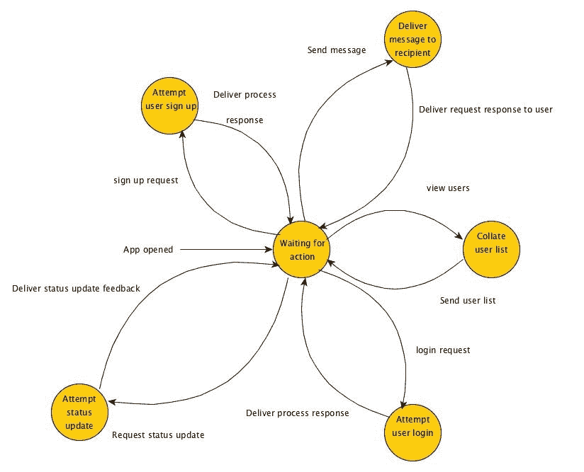

前面的图中每个圆圈代表系统在某一时间点的执行状态。每条箭头代表用户可以请求系统执行的操作。在初始启动时，API 等待来自客户端应用程序的请求。这种行为在**等待操作**状态中显示。当 API 从客户端应用程序接收到操作请求时，系统就会离开**等待操作**状态，并使用适当的过程处理发送的请求。

例如，当用户从 Android 应用程序请求状态更新时，服务器会从**等待操作**状态变为执行**尝试状态更新**过程，之后又回到**等待操作**状态。

# 确定数据

在实施系统之前，了解所需数据的类型是很重要的。我们可以很容易地从我们之前给出的用例定义中识别这些数据。从我们的用例规范中，我们可以确定需要两种基本类型的数据。这些是用户数据和消息数据。正如名称所暗示的，用户数据是每个用户所需的数据，而消息数据是与发送的消息相关的数据。我们目前还不关心诸如模式、实体或实体关系图之类的事情。我们只需要了解系统所需的数据。

由于这是一个消息传递应用，我们将需要用户名、电话号码、密码和状态消息。跟踪他们的账户状态也很有用，以便知道特定用户的账户是否已激活或因某些原因被停用。目前关于发送的消息不需要太多。我们需要跟踪消息的发送者和消息的预期接收者。

关于所需数据的讨论就到这里。随着应用程序的开发进展，我们将识别更多所需的数据，但就目前而言，让我们开始编码。

# 实现消息传递后端

现在我们对整个消息传递系统的用例、系统内部所需的数据以及系统的行为有了大致的方向，我们可以开始开发系统的后端。正如我们之前所说的，我们将利用 Spring Boot 来开发消息传递 API，因为它非常适合增量开发。此外，Kotlin 和 Spring Boot 配合得非常好。

由于我们将在消息传递 API 中处理数据，我们需要一个合适的数据库来存储消息传递系统所需的数据。我们将使用 PostgreSQL 作为我们的数据库。让我们简要了解一下 PostgreSQL。

# PostgreSQL

PostgreSQL 是一种特别强调可扩展性和标准兼容性的对象关系型数据库管理系统。PostgreSQL 也被称为 Postgres。它通常用作数据库服务器。当以这种方式使用时，其主要功能是安全存储数据，并按照软件应用程序的请求返回存储的数据。

使用 PostgreSQL 作为数据存储有许多优点。其中一些优点包括：

+   **可扩展性**：PostgreSQL 的功能可以很容易地由其用户扩展。这是因为其源代码对所有用户免费提供。

+   **可移植性**：PostgreSQL 可用于所有主要平台。几乎每个 UNIX 品牌都有 PostgreSQL 的版本。通过 Cygwin 框架，Windows 兼容性也成为可能。

+   **完整性**：基于 GUI 的工具随时可用，便于轻松与 PostgreSQL 交互。

# 安装 PostgreSQL

在所有平台上安装 PostgreSQL 都很简单。本节重点介绍了 Windows、macOS 和 Linux 上的安装过程。

# Windows 安装

要在 Windows 上安装 PostgreSQL，请执行以下步骤：

1.  下载并运行适合的 Windows PostgreSQL 交互式安装程序。您可以从 [`www.enterprisedb.com/downloads/postgres-postgresql-downloads#windows`](https://www.enterprisedb.com/downloads/postgres-postgresql-downloads#windows) 下载。

1.  将 PostgreSQL 安装为 Windows 服务。确保您记下 PostgreSQL Windows 服务账户名称和密码。您在安装过程中需要这些详细信息。

1.  当安装程序提示时，选择要安装的 PL/pgsql 过程性语言。

1.  当您被引导到安装选项屏幕时，您可以选择安装 pgAdmin。如果您安装了 pgAdmin，当安装程序提示时，请启用 Adminpack contrib 模块。

如果您正确遵循了前面的步骤，PostgreSQL 将会成功安装在您的系统上。

# macOS 安装

使用 Homebrew 可以轻松地在 macOS 上安装 PostgreSQL。如果您系统上尚未安装 Homebrew，请参阅第一章 *基础* 的安装说明。一旦确定 Homebrew 已安装在您的系统上，打开您的终端并运行以下命令：

```
brew search postgres
```

当在终端中提示时，请遵循安装说明。在安装过程中，您可能需要输入系统管理员密码。输入密码并等待安装完成。安装完成后，您将收到提示。

# Linux 安装

使用 PostgreSQL Linux 安装程序，可以轻松地在 Linux 上安装 PostgreSQL：

1.  访问 PostgreSQL 安装程序下载网页：[`www.enterprisedb.com/downloads/postgres-postgresql-downloads`](https://www.enterprisedb.com/downloads/postgres-postgresql-downloads)。

1.  选择您想要安装的 PostgreSQL 版本。

1.  选择适合 PostgreSQL 的适当 Linux 安装程序。

1.  点击下载按钮下载安装程序。

1.  下载安装程序后，按照所有安装说明进行操作。

1.  一旦提供了安装程序所需的信息，PostgreSQL 将安装到你的系统上。

现在我们已经在系统上设置了 PostgreSQL，我们可以开始创建 messenger API。

# 创建新的 Spring Boot 应用程序

利用 IntelliJ IDE 和 Spring Initializer，在 Spring Boot 应用程序上的初始创建很容易。打开 IntelliJ IDE，并使用 Spring Initializer 创建一个新项目。这可以通过在“新建项目”屏幕的左侧栏中点击“创建新项目”并选择“Spring Initializer”来完成：

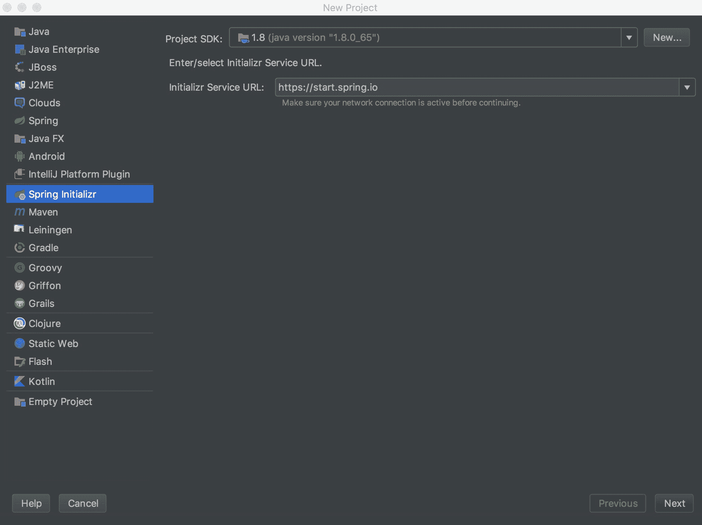

在选择 Spring Initializer 后，通过点击“下一步”按钮进入下一屏幕。在显示下一屏幕之前，IDE 将检索 Spring Initializer。这只需要几分钟。

Spring 插件仅在 IntelliJ IDEA 的 Ultimate 版本中可用，该版本包含付费订阅。

一旦获取了 Spring Initializer，你将被要求提供创建项目的适当详细信息。填写必要的详细信息。你可以选择使用本书中应用程序开发所使用的详细信息，或者决定输入你自己的信息。然而，如果你想要使用我们的详细信息，请按照以下步骤操作：

1.  将`com.example`作为组 ID 输入。

1.  将`messenger-api`作为工件 ID 输入。

1.  如果尚未选择，请选择 Maven 项目作为项目类型。

1.  保持包装选项和 Java 版本不变。

1.  选择 Kotlin 作为语言。这很重要，因为毕竟我们是在学习 Kotlin 语言。

1.  保持 SNAPSHOT 值不变。

1.  输入你选择的描述。

1.  将`com.example.messenger.api`作为包名输入。

在填写所需的项目信息后，通过点击“下一步”按钮进入下一屏幕：


在下一屏幕，你将被要求选择项目依赖项。一开始，我们需要选择 Security、Web、JPA 和 PostgreSQL 依赖项。Security 可以在“核心”类别下找到，Web 可以在“Web”类别下找到，而 JPA 和 PostgreSQL 可以在“SQL”类别下找到。此外，在屏幕顶部的 Spring Boot 版本选择下拉菜单中，选择 2.0.0 M5 作为版本。

在选择必要的依赖项后，内容应类似于以下截图：

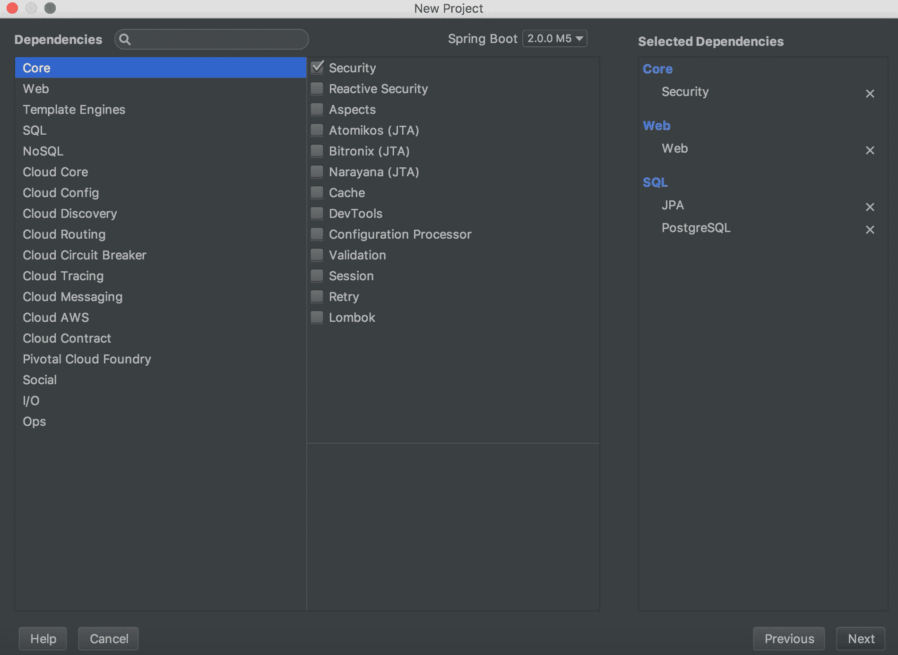

在选择适当的依赖项后，点击“下一步”继续到最后一个设置屏幕。你将被要求提供项目名称和项目位置。将项目名称填写为 `messenger-api` 并选择你希望在计算机上保存项目的位置。选择“完成”并等待项目设置完成。你将被带到一个新的 IDE 窗口，其中包含初始项目文件。

# 熟悉 Spring Boot

让我们来看看这个 Spring Boot 应用程序的初始程序文件的结构。以下是你 Spring Boot 应用程序文件结构的截图：

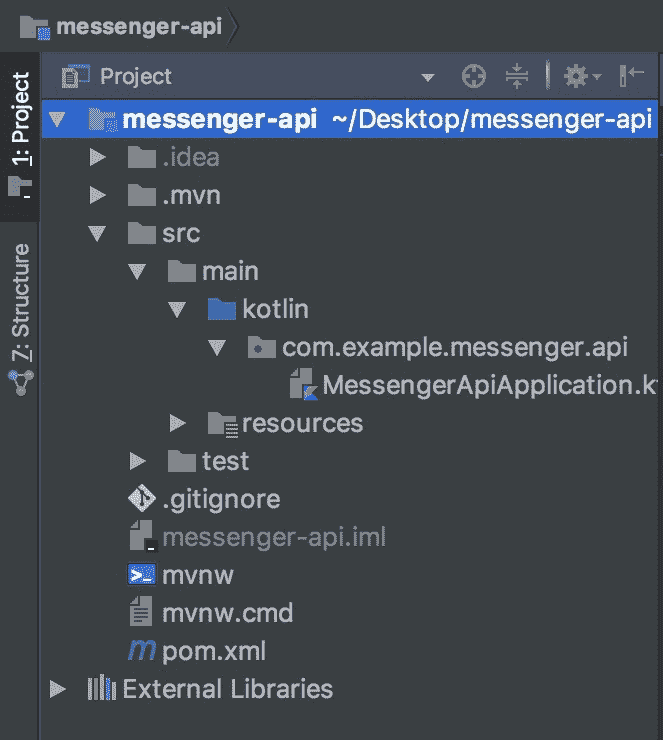

所有源文件都包含在 `src` 目录中。该目录包含核心应用程序程序文件以及为应用程序编写的测试程序。核心应用程序程序文件应放在 `src/main` 目录中，测试程序位于 `src/test`。主目录包含两个子目录。这些是 `kotlin` 目录和 `resources` 目录。在本章的整个过程中，所有包和主源文件都将放置在这个目录中。更具体地说，我们的程序文件和包将放置在 `com.example.messenger.api` 包内。让我们快速看一下 `MessengerApiApplication.kt` 文件：

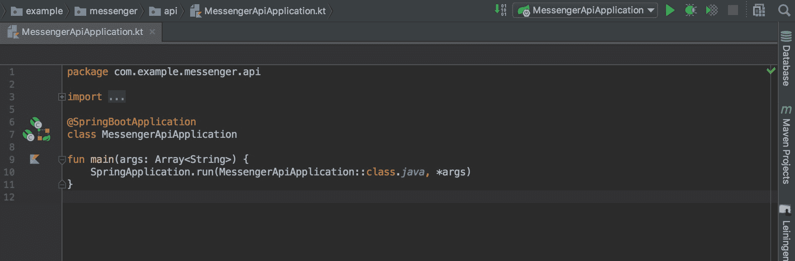

`MessengerApplication.kt` 文件包含主函数。这是每个 Spring Boot 应用程序的入口点。当应用程序启动时，会调用此函数。一旦调用，该函数通过调用 `SpringApplication.run()` 函数来运行 Spring 应用程序。此函数接受两个参数。第一个参数是一个类引用，第二个参数是在应用程序启动时传递给应用程序的参数。

在同一文件中，有一个 `MessengerApiApplication` 类。这个类被 `@SpringBootApplication` 注解所标注。使用此注解相当于同时使用 `@Configuration`、`@EnableAutoConfiguration` 和 `@ComponentScan` 注解。被 `@Configuration` 注解的类是 bean 定义源。

Bean 是由 Spring IoC 容器实例化和组装的对象。

`@EnableAutoConfiguration` 属性告诉 Spring Boot，你希望你的 Spring 应用程序根据你提供的 jar 依赖项自动配置。`@ComponentScan` 注解配置了用于与 `@Configuration` 类一起使用的组件扫描目录。

在开发 Spring Boot 应用程序的过程中，出于各种原因，将需要使用多个注解。一开始使用这些注解可能会感到有些令人不知所措，但随着时间的推移，它们将变得习以为常。

除了`MessengerApplication.kt`之外，另一个重要的文件是位于`src/main/resources`的`application.properties`文件。该文件用于配置 Spring Boot 应用程序的属性。打开此文件时，你会发现它没有任何内容。这是因为我们尚未定义任何应用程序配置或属性。让我们继续添加一些配置。将以下内容输入到`application.properties`文件中：

```
spring.jpa.generate-ddl=true
spring.jpa.hibernate.ddl-auto=create-drop
```

`spring.jpa.generate-ddl`属性指定是否在应用程序启动时生成数据库模式。当此属性设置为`true`时，模式将在应用程序启动时生成，否则模式不会生成。`spring.jpa.hibernate.ddl-auto`属性用于指定 DDL 模式。我们使用`create-drop`是因为我们希望在应用程序启动时创建模式，并在应用程序终止时销毁模式。

我们已经利用属性定义了数据库的模式，但尚未为`messenger-api`创建实际的数据库。如果你与 PostgreSQL 一起安装了 pgAdmin，你可以使用该软件轻松创建数据库。如果你没有安装 pgAdmin，不要担心，我们仍然可以通过使用 PostgreSQL 的`createdb`命令轻松为我们的应用程序创建数据库。导航到你的终端，并输入以下命令：

```
createdb -h localhost --username=<username> --password messenger-api
```

`-h`标志用于指定数据库服务器正在运行的机器的主机名。`--username`标志指定用于连接服务器的用户名。`--password`标志强制提示输入密码。`messenger-api`是我们为正在创建的数据库所取的名字。用`<username>`替换你的服务器用户名。输入命令后，按回车键运行命令。当提示时输入一个想要的密码。将在 PostgreSQL 中创建一个名为`messenger-api`的数据库。

现在我们已经设置了数据库，我们需要将 Spring Boot 应用程序连接到数据库。我们可以通过使用`spring.datasource.url`、`spring.datasource.username`和`spring.datasource.password`属性来实现这一点。将以下配置添加到`application.properties`文件中：

```
spring.jpa.generate-ddl=true
spring.jpa.hibernate.ddl-auto=create-drop
spring.datasource.url=jdbc:postgresql://localhost:5432/messenger-api
spring.datasource.username=<username>
spring.datasource.password=<password>
```

`spring.datasource.url`属性指定 Spring Boot 将通过该 JDBC URL 连接到数据库。`spring.datasource.username`和`spring.datasource.password`是用于指定与指定用户名相关联的服务器用户名和密码的属性。用`<username>`和`<password>`替换你的用户名和密码。

一旦你设置了这些属性，你就可以开始启动 Spring Boot 应用程序了。

一旦你设置了这些属性，你就可以开始启动 Spring Boot 应用程序。你可以通过点击`MessengerApiApplication.kt`中主函数旁边的 Kotlin 标志并选择运行选项来运行`messenger-api`应用程序，如下面的截图所示：

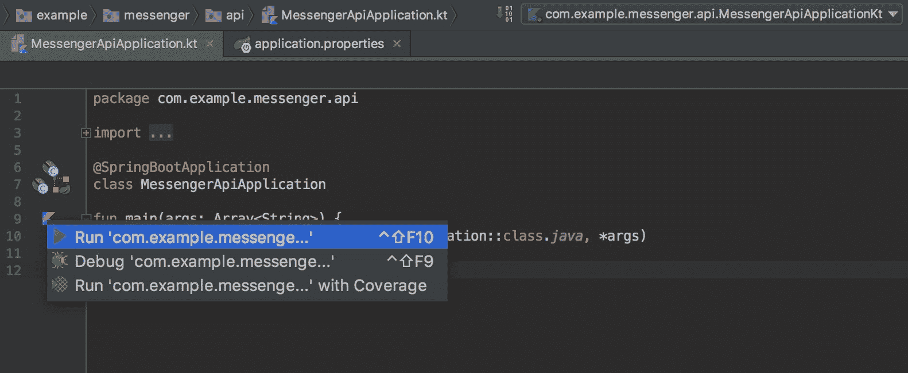

请稍等片刻，等待项目构建完成。一旦项目构建过程完成，应用程序将在 Tomcat 服务器上启动。

让我们继续探索我们的项目文件。在项目的根目录下找到`pom.xml`文件。**POM**代表**项目对象模型**。在 Apache Maven 网站上，关于 POM 有这样的描述：*项目对象模型或 POM 是 Maven 中的基本工作单元。* 它是一个包含有关项目和 Maven 构建项目时使用的配置细节的 XML 文件。一旦找到这个文件，就打开它。简单直接，对吧？一切都很好，但是为了清晰起见，这里简要介绍一下 Maven。

# Maven

Apache Maven 是一个基于 POM 概念的项目管理和理解工具。Maven 可用于多个目的，例如项目构建管理和文档。

在一定程度上理解了项目文件后，我们将通过实现一些模型来继续开发，以满足我们之前确定的数据。

# 创建模型

在这里，我们将把已经确定的数据建模成适合的实体类，这样 Spring Boot 就可以通过它们构建合适的数据库模式。我们将首先关注的是用户模型。在`com.example.messenger.api`包下创建一个名为`models`的包。在包内创建一个`User.kt`文件，并输入以下代码：

```
package com.example.messenger.api.models

import org.hibernate.validator.constraints.Length
import org.springframework.format.annotation.DateTimeFormat
import java.time.Instant
import java.util.*
import javax.persistence.*
import javax.validation.constraints.Pattern
import javax.validation.constraints.Size

@Entity
@Table(name = "`user`")
@EntityListeners(UserListener::class)
class User(
  @Column(unique = true)
  @Size(min = 2)
  var username: String = "",
  @Size(min = 11)
  @Pattern(regexp="^\\(?(\\d{3})\\)?[- ]?(\\d{3})[- ]?(\\d{4})$")
  var phoneNumber: String = "",
  @Size(min = 60, max = 60)
  var password: String = "",
  var status: String = "",
  @Pattern(regexp = "\\A(activated|deactivated)\\z")
  var accountStatus: String = "activated"
)
```

在前面的代码块中，我们使用了大量的注解。我们将按照它们出现的顺序查看每个注解的作用。首先是`@Entity`注解，它表示该类是一个**Java 持久化 API**（**JPA**）实体。使用`@Table`注解指定了由该类表示的实体的表名。这在模式生成期间很有用。如果没有使用`@Table`注解，生成的表名将是类名。将在 PostgreSQL 中创建一个名为`user`的数据库表。`@EntityListener`，正如其名所示，指定了实体类的实体监听器。我们尚未创建`UserListener`类，但不用担心，我们稍后会做这件事。

现在让我们看看`User`类的属性。我们总共添加了七个类属性。前五个是`username`、`password`、`phoneNumber`、`accountStatus`和`status`；每个属性代表我们为用户所需的一种数据类型，正如我们在本章的*识别数据*部分中早期所确定的。我们现在已经创建了用户实体，并准备继续前进。但是等等，有一个问题。我们需要一种方法来唯一标识创建的每个用户。此外，为了未来的参考，跟踪新用户何时被添加到消息平台也很重要。经过仔细考虑，我们意识到在我们的实体中拥有`id`和`createdAt`属性是很重要的。你可能想知道——为什么我们要在用户实体中添加`id`和`createdAt`属性？毕竟，我们之前并没有指定我们需要它们。这是真的。但是，由于我们正在增量开发这个后端，当需要时，我们可以进行更改和添加。让我们继续添加这两个属性：

```
@Entity
@Table(name = "`user`")
@EntityListeners(UserListener::class)
class User(
  @Column(unique = true)
  @Size(min = 2)
  var username: String = "",
  @Size(min = 8, max = 15)
  @Column(unique = true)
  @Pattern(regexp = "^\\(?(\\d{3})\\)?[- ]?(\\d{3})[- ]?(\\d{4})$")
  var phoneNumber: String = "",
  @Size(min = 60, max = 60)
  var password: String = "",
  var status: String = "available",
  @Pattern(regexp = "\\A(activated|deactivated)\\z")
  var accountStatus: String = "activated",
  @Id
  @GeneratedValue(strategy = GenerationType.AUTO)
  var id: Long = 0,
  @DateTimeFormat
  var createdAt: Date = Date.from(Instant.now())
)
```

完美。现在我们需要了解每个注解的作用。`@Column`用于指定表示表列的属性。在实践中，实体的所有属性都代表表中的一列。我们在代码中特别使用`@Column(unique = true)`来对属性施加唯一性约束。当我们不希望多条记录具有特定的属性值时，这很有用。`@Size`，正如你可能猜到的，用于指定表中存在的属性的尺寸。`@Pattern`指定了一个表属性必须匹配的模式，才能被认为是有效的。

`@Id`指定了一个唯一标识实体的属性（在这个例子中是`id`属性）。`@GeneratedValue(strategy = GenerationType.AUTO)`指定我们希望`id`值自动生成。`@DateTimeFormat`将时间戳约束应用于要存储在用户表`created_at`列中的值。

是时候创建一个`UserListener`类了。创建一个新的包名为`listeners`。将以下`UserListener`类添加到该包中：

```
package com.example.messenger.api.listeners

import com.example.messenger.api.models.User
import org.springframework.security.crypto.bcrypt.BCryptPasswordEncoder
import javax.persistence.PrePersist
import javax.persistence.PreUpdate

class UserListener {

  @PrePersist
  @PreUpdate
  fun hashPassword(user: User) {
    user.password = BCryptPasswordEncoder().encode(user.password)
  }
}
```

用户密码永远不应该以纯文本形式存储在数据库中。出于安全原因，在存储之前必须适当地对它们进行散列。`hashPassword()`函数通过使用`BCrypt`将用户对象的密码属性的字符串值替换为其散列等价物来执行此散列过程。`@PrePersist`和`@PreUpdate`指定在数据库中持久化或更新用户记录之前应该调用此函数。

现在让我们为消息创建一个实体。请继续在`models`包中添加一个`Message`类，并将以下代码添加到该类中：

```
package com.example.messenger.api.models

import org.springframework.format.annotation.DateTimeFormat
import java.time.Instant
import java.util.*
import javax.persistence.*

@Entity
class Message(
  @ManyToOne(optional = false)
  @JoinColumn(name = "user_id", referencedColumnName = "id")
  var sender: User? = null,
  @ManyToOne(optional = false)
  @JoinColumn(name = "recipient_id", referencedColumnName = "id")
  var recipient: User? = null,
  var body: String? = "",
  @ManyToOne(optional = false)
  @JoinColumn(name="conversation_id", referencedColumnName = "id")
  var conversation: Conversation? = null,
  @Id @GeneratedValue(strategy = GenerationType.AUTO) var id: Long = 0,
  @DateTimeFormat
  var createdAt: Date = Date.from(Instant.now())
)
```

我们使用了一些熟悉的注解以及两个新的注解。正如我们之前讨论的，每条消息都有一个发送者和一个接收者。消息的发送者和接收者都是信使平台上的用户，因此消息实体既有发送者的 `User` 类型属性，也有接收者的 `User` 类型属性。一个用户可以是许多消息的发送者，也可以是许多消息的接收者。这些都是需要实现的关系。我们使用 `@ManyToOne` 注解来完成这个任务。多对一关系不是可选的，因此我们使用 `@ManyToOne(optional = false)`。`@JoinColumn` 指定了一个用于连接实体关联或元素集合的列：

```
@JoinColumn(name = "user_id", referencedColumnName = "id")
var sender: User? = null
```

代码片段向 `message` 表中添加了一个 `user_id` 属性，该属性引用了用户的 `id`。

仔细检查后，你会注意到在 `Message` 类中使用了会话属性。这是因为用户之间发送的消息发生在会话线程中。简单来说，每条消息都属于一个线程。我们需要在我们的 `models` 包中添加一个 `Conversation` 类，代表会话实体：

```
package com.example.messenger.api.models

import org.springframework.format.annotation.DateTimeFormat
import java.time.Instant
import java.util.*
import javax.persistence.*

@Entity
class Conversation(
  @ManyToOne(optional = false)
  @JoinColumn(name = "sender_id", referencedColumnName = "id")
  var sender: User? = null,
  @ManyToOne(optional = false)
  @JoinColumn(name = "recipient_id", referencedColumnName = "id")
  var recipient: User? = null,
  @Id
  @GeneratedValue(strategy = GenerationType.AUTO)
  var id: Long = 0,
  @DateTimeFormat
  val createdAt: Date = Date.from(Instant.now())
) {

  @OneToMany(mappedBy = "conversation", targetEntity = Message::class)
  private var messages: Collection<Message>? = null
}
```

许多消息属于一个会话，因此我们在 `Conversation` 类的体中有一个 `messages` 集合。

我们几乎完成了实体模型的创建。剩下要做的就是为用户的发送和接收消息添加适当的集合：

```
package com.example.messenger.api.models

import com.example.messenger.api.listeners.UserListener
import org.springframework.format.annotation.DateTimeFormat
import java.time.Instant
import java.util.*
import javax.persistence.*
import javax.validation.constraints.Pattern
import javax.validation.constraints.Size

@Entity
@Table(name = "`user`")
@EntityListeners(UserListener::class)
class User(
  @Column(unique = true)
  @Size(min = 2)
  var username: String = "",
  @Size(min = 8, max = 15)
  @Column(unique = true)
  @Pattern(regexp = "^\\(?(\\d{3})\\)?[- ]?(\\d{3})[- ]?(\\d{4})$")
  var phoneNumber: String = "",
  @Size(min = 60, max = 60)
  var password: String = "",
  var status: String = "available",
  @Pattern(regexp = "\\A(activated|deactivated)\\z")
  var accountStatus: String = "activated",
  @Id
  @GeneratedValue(strategy = GenerationType.AUTO)
  var id: Long = 0,
  @DateTimeFormat
  var createdAt: Date = Date.from(Instant.now())
) {
  //collection of sent messages
  @OneToMany(mappedBy = "sender", targetEntity = Message::class)
  private var sentMessages: Collection<Message>? = null

  //collection of received messages
  @OneToMany(mappedBy = "recipient", targetEntity = Message::class)
  private var receivedMessages: Collection<Message>? = null
}
```

就这样！我们已经完成了实体的创建。为了帮助您理解我们所创建的实体及其关系，这里有一个实体关系图（E-R 图）。它显示了我们所创建的实体及其关系：

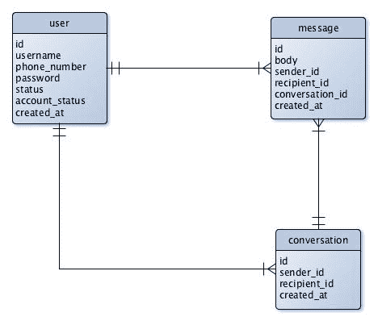

根据 E-R 图，一个用户有多个消息，一个消息属于一个用户，一个消息属于一个会话，一个会话有多个消息。此外，一个用户有多个会话。

在创建了必要的模型之后，只有一个问题。我们没有方法访问这些实体存储的数据。我们需要创建仓库来完成这个任务。

# 创建仓库

**Spring Data JPA** 具有从仓库接口自动创建仓库实现的能力，在运行时进行。我们将通过创建一个访问 `User` 实体的仓库来了解这是如何工作的。创建一个 `repositories` 包，并将 `UserRepository.kt` 包含在内：

```
package com.example.messenger.api.repositories

import com.example.messenger.api.models.User
import org.springframework.data.repository.CrudRepository

interface UserRepository : CrudRepository<User, Long> {

  fun findByUsername(username: String): User?

  fun findByPhoneNumber(phoneNumber: String): User?
}
```

`UserRepository` 扩展了 `CrudRepository` 接口。它所处理的 `entity` 类型以及 `id` 类型在 `CrudRepository` 的泛型参数中指定。通过扩展 `CrudRepository`，`UserRepository` 继承了处理 `User` 持久化的方法，例如保存、查找和删除 `User` 实体的方法。

此外，Spring JPA 允许通过方法签名声明其他查询函数。我们利用这一功能创建了 `findByUsername()` 和 `findByPhoneNumber()` 函数。

由于我们目前有三个实体，我们需要三个存储库来查询它们。在`repositories`中创建一个`MessageRepository`接口：

```
package com.example.messenger.api.repositories

import com.example.messenger.api.models.Message
import org.springframework.data.repository.CrudRepository

interface MessageRepository : CrudRepository<Message, Long> {
  fun findByConversationId(conversationId: Long): List<Message>
}
```

注意到前面的方法签名指定了`List<Message>`作为其返回类型。Spring JPA 会自动识别这一点，并在调用`findByConversationId()`时返回一个`Message`元素的列表。

最后，实现一个`ConversationRepository`接口：

```
package com.example.messenger.api.repositories

import com.example.messenger.api.models.Conversation
import org.springframework.data.repository.CrudRepository

interface ConversationRepository : CrudRepository<Conversation, Long> {
    fun findBySenderId(id: Long): List<Conversation>

    fun findByRecipientId(id: Long): List<Conversation>

    fun findBySenderIdAndRecipientId(senderId: Long,
        recipientId: Long): Conversation?
}
```

既然我们已经设置了实体和查询这些实体的必要存储库，我们就可以开始实现信使后端的业务逻辑了。这需要我们了解服务和服务的实现。

# 服务和服务的实现

服务实现是一个被`@Service`注解的 Spring bean。Spring 应用程序的业务逻辑通常放在服务实现中。另一方面，*服务*是一个具有应用行为函数签名的接口，这些函数必须由实现类实现。回忆这两个概念之间的区别的一个简单方法是记住服务是一个接口，而服务实现是一个实现服务的类。

现在要创建一些服务和服务的实现。创建一个`service`包。我们将在其中添加服务和服务的实现。在包中创建一个`UserService`接口，如下所示：

```
package com.example.messenger.api.services

import com.example.messenger.api.models.User

interface UserService {
  fun attemptRegistration(userDetails: User): User

  fun listUsers(currentUser): List<User>

  fun retrieveUserData(username: String): User?

  fun retrieveUserData(id: Long): User?

  fun usernameExists(username: String): Boolean
}
```

在前面的`UserService`接口中，我们定义了必须由实现`UserService`的类声明的函数。就这样！`UserService`已经准备好实现。现在要创建服务的实现。在服务包中添加一个`UserServiceImpl`类。我们将实现`UserService`，因此我们需要为`attemptRegistration()`、`listUsers()`、`retrieveUserData()`和`usernameExists()`重写函数：

```
package com.example.messenger.api.services

import com.example.messenger.api.exceptions.InvalidUserIdException
import com.example.messenger.api.exceptions.UserStatusEmptyException
import com.example.messenger.api.exceptions.UsernameUnavailableException
import com.example.messenger.api.models.User
import com.example.messenger.api.repositories.UserRepository
import org.springframework.stereotype.Service

@Service
class UserServiceImpl(val repository: UserRepository) : UserService {
  @Throws(UsernameUnavailableException::class)
  override fun attemptRegistration(userDetails: User): User {
    if (!usernameExists(userDetails.username)) {
      val user = User()
      user.username = userDetails.username
      user.phoneNumber = userDetails.phoneNumber
      user.password = userDetails.password
      repository.save(user)
      obscurePassword(user)
      return user
    }
    throw UsernameUnavailableException("The username 
                  ${userDetails.username} is unavailable.")
  }

  @Throws(UserStatusEmptyException::class)
  fun updateUserStatus(currentUser: User, updateDetails: User): User {
    if (!updateDetails.status.isEmpty()) {
      currentUser.status = updateDetails.status
      repository.save(currentUser)
      return  currentUser
    }
    throw UserStatusEmptyException()
  }

  override fun listUsers(currentUser: User): List<User> {
    return repository.findAll().mapTo(ArrayList(), { it })
                     .filter{ it != currentUser }
  }

  override fun retrieveUserData(username: String): User? {
    val user = repository.findByUsername(username)
    obscurePassword(user)
    return user
  }

  @Throws(InvalidUserIdException::class)
  override fun retrieveUserData(id: Long): User {
    val userOptional = repository.findById(id)
    if (userOptional.isPresent) {
      val user = userOptional.get()
      obscurePassword(user)
      return user
    }
    throw InvalidUserIdException("A user with an id of '$id' 
                                 does not exist.")
  }

  override fun usernameExists(username: String): Boolean {
    return repository.findByUsername(username) != null
  }

  private fun obscurePassword(user: User?) {
    user?.password = "XXX XXXX XXX"
  }
}
```

在`UserServiceImpl`的主要构造函数定义中，指定了一个`UserRepository`实例作为必需的参数。你不需要担心自己传递这样的参数。Spring 认识到`UserServiceImpl`需要一个`UserRepository`实例，并通过依赖注入为该类提供一个实例。除了实现的函数外，我们还声明了一个`obscurePassword()`函数，该函数只是使用`XXX XXXX XXX`在`User`实体中对密码进行散列。

仍然在创建服务和服务的实现的精神下，让我们继续添加一些用于消息和会话的。在`service`包中添加一个`MessageService`接口：

```
package com.example.messenger.api.services

import com.example.messenger.api.models.Message
import com.example.messenger.api.models.User

interface MessageService {

  fun sendMessage(sender: User, recipientId: Long, 
                  messageText: String): Message
}
```

我们为`sendMessage()`添加了一个必须由`MessageServiceImpl`覆盖的方法签名。以下是对消息服务的实现：

```
package com.example.messenger.api.services

import com.example.messenger.api.exceptions.MessageEmptyException
import com.example.messenger.api.exceptions.MessageRecipientInvalidException
import com.example.messenger.api.models.Conversation
import com.example.messenger.api.models.Message
import com.example.messenger.api.models.User
import com.example.messenger.api.repositories.ConversationRepository
import com.example.messenger.api.repositories.MessageRepository
import com.example.messenger.api.repositories.UserRepository
import org.springframework.stereotype.Service

@Service
class MessageServiceImpl(val repository: MessageRepository,
             val conversationRepository: ConversationRepository,
             val conversationService: ConversationService,
             val userRepository: UserRepository) : MessageService {

  @Throws(MessageEmptyException::class, 
          MessageRecipientInvalidException::class)
  override fun sendMessage(sender: User, recipientId: Long, 
                           messageText: String): Message {
    val optional = userRepository.findById(recipientId)

      if (optional.isPresent) {
        val recipient = optional.get()

        if (!messageText.isEmpty()) {
          val conversation: Conversation = if (conversationService
                     .conversationExists(sender, recipient)) {
            conversationService.getConversation(sender, recipient) 
                               as Conversation
          } else {
            conversationService.createConversation(sender, recipient)
          }
          conversationRepository.save(conversation)

          val message = Message(sender, recipient, messageText, 
                                conversation)
          repository.save(message)
          return message
        }
      } else {
        throw MessageRecipientInvalidException("The recipient id 
                              '$recipientId' is invalid.")
      }
      throw MessageEmptyException()
    }
  }
```

之前 `sendMessage()` 的实现首先检查消息内容是否为空。如果不为空，则函数检查发送者和接收者之间是否存在一个活跃的对话。如果存在，则检索并存储在 `conversation` 中，否则在两个用户之间创建一个新的 `Conversation` 并存储在 `conversation` 中。然后保存对话，并创建并保存消息。

现在可以实现对 `ConversationService` 和 `ConversationServiceImpl` 的实现。在 `services` 包中创建一个 `ConversationService` 接口，并添加以下代码：

```
package com.example.messenger.api.services

import com.example.messenger.api.models.Conversation
import com.example.messenger.api.models.User

interface ConversationService {

  fun createConversation(userA: User, userB: User): Conversation
  fun conversationExists(userA: User, userB: User): Boolean
  fun getConversation(userA: User, userB: User): Conversation?
  fun retrieveThread(conversationId: Long): Conversation
  fun listUserConversations(userId: Long): List<Conversation>
  fun nameSecondParty(conversation: Conversation, userId: Long): String
}
```

目前我们已经添加了六个函数签名。它们是 `createConversation()`、`conversationExists()`、`getConversation()`、`retrieveThread()`、`listUserConversations()` 和 `nameSecondParty()`。现在我们将在 `services` 包中添加 `ConversationServiceImpl` 并实现前三个方法 `createConversation()`、`conversationExists()` 和 `getConversation()`。以下代码片段展示了这种实现：

```
package com.example.messenger.api.services

import com.example.messenger.api.exceptions.ConversationIdInvalidException
import com.example.messenger.api.models.Conversation
import com.example.messenger.api.models.User
import com.example.messenger.api.repositories.ConversationRepository
import org.springframework.stereotype.Service

@Service
class ConversationServiceImpl(val repository: ConversationRepository) :
      ConversationService {

  override fun createConversation(userA: User, userB: User):
               Conversation {
    val conversation = Conversation(userA, userB)
    repository.save(conversation)
    return  conversation
  }

  override fun conversationExists(userA: User, userB: User): Boolean {
    return if (repository.findBySenderIdAndRecipientId
               (userA.id, userB.id) != null)
    true
    else repository.findBySenderIdAndRecipientId
               (userB.id, userA.id) != null
  }

  override fun getConversation(userA: User, userB: User): Conversation? {
    return when {
      repository.findBySenderIdAndRecipientId(userA.id,
                               userB.id) != null ->
      repository.findBySenderIdAndRecipientId(userA.id, userB.id)
      repository.findBySenderIdAndRecipientId(userB.id, 
                               userA.id) != null ->
      repository.findBySenderIdAndRecipientId(userB.id, userA.id)
      else -> null
    }

  }
}
```

在添加了前三个方法之后，继续将剩余的三个方法 `retrieveThread()`、`listUserConversations()` 和 `nameSecondParty()` 添加到 `ConversationServiceImpl` 中：

```
override fun retrieveThread(conversationId: Long): Conversation {
  val conversation = repository.findById(conversationId)

  if (conversation.isPresent) {
    return conversation.get()
  }
  throw ConversationIdInvalidException("Invalid conversation id 
                                        '$conversationId'")
}

override fun listUserConversations(userId: Long): 
               ArrayList<Conversation> {
  val conversationList: ArrayList<Conversation> = ArrayList()
  conversationList.addAll(repository.findBySenderId(userId))
  conversationList.addAll(repository.findByRecipientId(userId))

  return conversationList
}

override fun nameSecondParty(conversation: Conversation,
                             userId: Long): String {
  return if (conversation.sender?.id == userId) {
    conversation.recipient?.username as String
  } else {
    conversation.sender?.username as String
  }
}
```

你可能已经注意到，我们在服务实现类中多次抛出了不同类型的异常。由于我们尚未创建这些异常，我们需要这样做。此外，我们还需要为这些异常中的每一个创建一个 `ExceptionHandler`。这些异常处理器将在抛出异常的情况下向客户端发送适当的错误响应。

创建一个 `exceptions` 包，并向其中添加一个 `AppExceptions.kt` 文件。将以下代码包含到该文件中：

```
package com.example.messenger.api.exceptions

class UsernameUnavailableException(override val message: String) : RuntimeException()

class InvalidUserIdException(override val message: String) : RuntimeException()

class MessageEmptyException(override val message: String = "A message cannot be empty.") : RuntimeException()

class MessageRecipientInvalidException(override val message: String) : RuntimeException()

class ConversationIdInvalidException(override val message: String) : RuntimeException()

class UserDeactivatedException(override val message: String) : RuntimeException()

class UserStatusEmptyException(override val message: String = "A user's status cannot be empty") : RuntimeException()
```

由于这些异常发生在服务器运行时，因此每个异常都扩展了 `RuntimeException`。所有异常也都有一个 `message` 属性。正如其名所示，这是异常消息。现在我们已经添加了这些异常，我们需要创建控制器建议类。`ControllerAdvice` 类用于处理在 Spring 应用程序中发生的错误。它们使用 `@ControllerAdvice` 注解创建。此外，控制器建议是一种 Spring 组件。让我们创建一个控制器建议类来处理一些前面的异常。

查看以下异常：`UsernameUnavailableException`、`InvalidUserIdException` 和 `UserStatusEmptyException`，我们会发现这三个异常都与用户相关。因此，我们可以将处理所有这些异常的控制器建议命名为 `UserControllerAdvice`。创建一个 `components` 包，并将以下 `UserControllerAdvice` 类添加到其中：

```
package com.example.messenger.api.components

import com.example.messenger.api.constants.ErrorResponse
import com.example.messenger.api.constants.ResponseConstants
import com.example.messenger.api.exceptions.InvalidUserIdException
import com.example.messenger.api.exceptions.UserStatusEmptyException
import com.example.messenger.api.exceptions.UsernameUnavailableException
import org.springframework.http.ResponseEntity
import org.springframework.web.bind.annotation.ControllerAdvice
import org.springframework.web.bind.annotation.ExceptionHandler

@ControllerAdvice
class UserControllerAdvice {

  @ExceptionHandler(UsernameUnavailableException::class)
  fun usernameUnavailable(usernameUnavailableException: 
                          UsernameUnavailableException):
      ResponseEntity<ErrorResponse> {
    val res = ErrorResponse(ResponseConstants.USERNAME_UNAVAILABLE
                      .value, usernameUnavailableException.message)
    return ResponseEntity.unprocessableEntity().body(res)
  }

  @ExceptionHandler(InvalidUserIdException::class)
  fun invalidId(invalidUserIdException: InvalidUserIdException):
      ResponseEntity<ErrorResponse> {
    val res = ErrorResponse(ResponseConstants.INVALID_USER_ID.value,
                            invalidUserIdException.message)
    return ResponseEntity.badRequest().body(res)
  }

  @ExceptionHandler(UserStatusEmptyException::class)
  fun statusEmpty(userStatusEmptyException: UserStatusEmptyException):
      ResponseEntity<ErrorResponse> {
    val res = ErrorResponse(ResponseConstants.EMPTY_STATUS.value,
                            userStatusEmptyException.message)
    return ResponseEntity.unprocessableEntity().body(res)
  }
}
```

我们已经定义了函数来处理可能发生的三个异常，并为每个函数添加了 `@ExceptionHanlder()` 注解。`@ExceptionHanlder()` 接收一个类引用，该类引用是函数正在处理的异常。每个函数接收一个参数，该参数是抛出的异常实例。此外，所有定义的函数都返回一个 `ResponseEntity<ErrorResponse>` 实例。响应实体表示发送给客户端的整个 HTTP 响应。

`ErrorResponse` 类尚未创建。创建一个 `constants` 包，并将以下 `ErrorResponse` 类添加到其中：

```
package com.example.messenger.api.constants

class ErrorResponse(val errorCode: String, val errorMessage: String)
```

`ErrorResponse` 是一个具有两个属性 `errorCode` 和 `errorMessage` 的简单类。在我们继续之前，请将以下 `ResponseConstants` 枚举类添加到 `constants` 包中：

```
package com.example.messenger.api.constants

enum class ResponseConstants(val value: String) {
  SUCCESS("success"), ERROR("error"),
  USERNAME_UNAVAILABLE("USR_0001"),
  INVALID_USER_ID("USR_002"),
  EMPTY_STATUS("USR_003"),
  MESSAGE_EMPTY("MES_001"),
  MESSAGE_RECIPIENT_INVALID("MES_002"),
  ACCOUNT_DEACTIVATED("GLO_001")
}
```

现在，让我们创建另外三个控制器建议类。这些类是 `MessageControllerAdvice`、`ConversationControllerAdvice` 和 `RestControllerAdvice`。`RestControllerAdvice` 将定义在服务器运行过程中可能发生的错误异常处理器。

以下是 `MessageControllerAdvice` 类：

```
package com.example.messenger.api.components

import com.example.messenger.api.constants.ErrorResponse
import com.example.messenger.api.constants.ResponseConstants
import com.example.messenger.api.exceptions.MessageEmptyException
import com.example.messenger.api.exceptions.MessageRecipientInvalidException
import org.springframework.http.ResponseEntity
import org.springframework.web.bind.annotation.ControllerAdvice
import org.springframework.web.bind.annotation.ExceptionHandler

@ControllerAdvice
class MessageControllerAdvice {
  @ExceptionHandler(MessageEmptyException::class)
  fun messageEmpty(messageEmptyException: MessageEmptyException): 
      ResponseEntity<ErrorResponse> {
    //ErrorResponse object creation
    val res = ErrorResponse(ResponseConstants.MESSAGE_EMPTY.value,
                            messageEmptyException.message)

    // Returning ResponseEntity containing appropriate ErrorResponse
    return ResponseEntity.unprocessableEntity().body(res)
  }

  @ExceptionHandler(MessageRecipientInvalidException::class)
    fun messageRecipientInvalid(messageRecipientInvalidException: 
                                MessageRecipientInvalidException):
        ResponseEntity<ErrorResponse> {
    val res = ErrorResponse(ResponseConstants.MESSAGE_RECIPIENT_INVALID
                     .value, messageRecipientInvalidException.message)
    return ResponseEntity.unprocessableEntity().body(res)
  }
}
```

接下来，添加 `ConversationControllerAdvice` 类，如下所示：

```
package com.example.messenger.api.components

import com.example.messenger.api.constants.ErrorResponse
import com.example.messenger.api.exceptions.ConversationIdInvalidException
import org.springframework.http.ResponseEntity
import org.springframework.web.bind.annotation.ControllerAdvice
import org.springframework.web.bind.annotation.ExceptionHandler

@ControllerAdvice
class ConversationControllerAdvice {
  @ExceptionHandler
  fun conversationIdInvalidException(conversationIdInvalidException:
          ConversationIdInvalidException): ResponseEntity<ErrorResponse> {
    val res = ErrorResponse("", conversationIdInvalidException.message)
    return ResponseEntity.unprocessableEntity().body(res)
  }
}
```

最后，添加 `RestControllerAdvice` 类：

```
package com.example.messenger.api.components

import com.example.messenger.api.constants.ErrorResponse
import com.example.messenger.api.constants.ResponseConstants
import com.example.messenger.api.exceptions.UserDeactivatedException
import org.springframework.http.HttpStatus
import org.springframework.http.ResponseEntity
import org.springframework.web.bind.annotation.ControllerAdvice
import org.springframework.web.bind.annotation.ExceptionHandler

@ControllerAdvice
class RestControllerAdvice {

  @ExceptionHandler(UserDeactivatedException::class)
  fun userDeactivated(userDeactivatedException: 
                      UserDeactivatedException): 
      ResponseEntity<ErrorResponse> {
    val res = ErrorResponse(ResponseConstants.ACCOUNT_DEACTIVATED
                     .value, userDeactivatedException.message)

    // Return an HTTP 403 unauthorized error response
    return ResponseEntity(res, HttpStatus.UNAUTHORIZED)
  }
}
```

我们已经实现了业务逻辑，我们几乎准备好通过 REST 端点将 HTTP 请求条目传递到我们的 API。在我们这样做之前，我们必须保护我们的 API。

# 限制 API 访问

从安全角度来看，允许任何人访问 RESTful API 资源是一个巨大的禁忌。我们必须想出一个方法来限制对服务器的访问，只允许注册和登录的用户。我们将使用 **Spring Security** 和 **JSON Web Tokens** (**JWTs**) 来做到这一点。

# Spring Security

Spring Security 是一个高度可定制的访问控制框架，用于 Spring 应用程序。它是使用 Spring 构建的应用程序的接受标准。由于我们在创建项目之初就选择了添加安全依赖项，因此我们不需要将 Spring Security 依赖项添加到 `pom.xml` 中，因为它已经添加了。

# JSON Web Tokens

根据 JWT 网站 ([`tools.ietf.org/html/rfc7519`](https://tools.ietf.org/html/rfc7519))，*JSON Web Tokens 是一种开放、行业标准的表示安全声明的方法，用于在双方之间进行安全通信*。JWT 允许您解码、验证和生成 JWT。JWT 可以轻松地与 Spring Boot 结合使用，以在应用程序中实现身份验证。以下部分将演示如何使用 JWT 和 Spring Security 组合来保护消息后端。

为了在 Spring 应用程序中开始使用 JWT，您必须首先将其依赖项添加到项目的 `pom.xml` 文件中：

```
<dependencies> 
  ...
  <dependency>
    <groupId>io.jsonwebtoken</groupId>
    <artifactId>jjwt</artifactId>
    <version>0.7.0</version>
  </dependency>
</dependencies>
```

在 `pom.xml` 中包含新的 Maven 依赖项后，IntelliJ 将提示您导入新的依赖项：

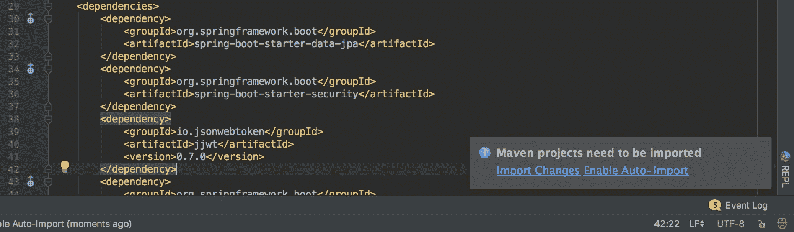

当出现提示时，点击导入更改，JWT 依赖项将被导入到项目中。

# 配置网络安全性

我们需要做的第一件事是创建一个自定义的网络安全性配置。在 `com.example.messenger.api` 中创建一个 `config` 包。向该包中添加一个 `WebSecurityConfig` 类，并输入以下代码：

```
package com.example.messenger.api.config

import com.example.messenger.api.filters.JWTAuthenticationFilter
import com.example.messenger.api.filters.JWTLoginFilter
import com.example.messenger.api.services.AppUserDetailsService
import org.springframework.context.annotation.Configuration
import org.springframework.http.HttpMethod
import org.springframework.security.config.annotation.authentication.builders.AuthenticationManagerBuilder
import org.springframework.security.config.annotation.web.builders.HttpSecurity
import org.springframework.security.config.annotation.web.configuration.EnableWebSecurity
import org.springframework.security.config.annotation.web.configuration.WebSecurityConfigurerAdapter
import org.springframework.security.core.userdetails.UserDetailsService
import org.springframework.security.crypto.bcrypt.BCryptPasswordEncoder
import org.springframework.security.web.authentication.UsernamePasswordAuthenticationFilter

@Configuration
@EnableWebSecurity
class WebSecurityConfig(val userDetailsService: AppUserDetailsService)
         : WebSecurityConfigurerAdapter() {

  @Throws(Exception::class)
  override fun configure(http: HttpSecurity) {
    http.csrf().disable().authorizeRequests()
        .antMatchers(HttpMethod.POST, "/users/registrations")
        .permitAll()
        .antMatchers(HttpMethod.POST, "/login").permitAll()
        .anyRequest().authenticated()
        .and()

```

让我们 `Filter` `/login` 请求：

```
        .addFilterBefore(JWTLoginFilter("/login",
                authenticationManager()),
                UsernamePasswordAuthenticationFilter::class.java)
```

让我们过滤其他请求以检查头部中 JWT 的存在：

```
       .addFilterBefore(JWTAuthenticationFilter(),
                UsernamePasswordAuthenticationFilter::class.java)
  }

  @Throws(Exception::class)
  override fun configure(auth: AuthenticationManagerBuilder) {
    auth.userDetailsService<UserDetailsService>(userDetailsService)
        .passwordEncoder(BCryptPasswordEncoder())
  }
}
```

`WebSecurityConfig` 使用 `@EnableWebSecurity` 注解。这启用了 Spring Security 的网络安全性支持。此外，`WebSecurityConfig` 扩展了 `WebSecurityConfigurerAdapter` 并覆盖了一些其 `configure()` 方法以添加一些对网络安全性配置的定制。

`configure(HttpSecurity)` 方法配置了哪些 URL 路径需要被保护以及哪些不需要。在 `WebSecurityConfig` 中，我们允许所有对 `/users/registrations` 和 `/login` 路径的 `POST` 请求。这两个端点不需要被保护，因为用户在登录或在其平台上注册之前无法进行身份验证。此外，我们还添加了对请求的过滤器。对 `/login` 的请求将通过 `JWTLoginFilter`（我们尚未实现）进行过滤；所有未认证和未经授权的请求将通过 `JWTAuthenticationFilter`（我们尚未实现）进行过滤。

`configure(AuthenticationManagerBuilder)` 设置 `UserDetailsService` 并指定要使用的密码编码器。

我们使用了一些尚未实现的类。我们将首先实现 `JWTLoginFilter`。创建一个新的包，命名为 `filters`，并向其中添加以下 `JWTLoginFilter` 类：

```
package com.example.messenger.api.filters

import com.example.messenger.api.security.AccountCredentials
import com.example.messenger.api.services.TokenAuthenticationService
import com.fasterxml.jackson.databind.ObjectMapper
import org.springframework.security.authentication.AuthenticationManager
import org.springframework.security.authentication.UsernamePasswordAuthenticationToken
import org.springframework.security.core.Authentication
import org.springframework.security.core.AuthenticationException
import org.springframework.security.web.authentication.AbstractAuthenticationProcessingFilter
import org.springframework.security.web.util.matcher.AntPathRequestMatcher

import javax.servlet.FilterChain
import javax.servlet.ServletException
import javax.servlet.http.HttpServletRequest
import javax.servlet.http.HttpServletResponse
import java.io.IOException

class JWTLoginFilter(url: String, authManager: AuthenticationManager) :
    AbstractAuthenticationProcessingFilter(AntPathRequestMatcher(url)){

  init {
    authenticationManager = authManager
  }

  @Throws(AuthenticationException::class, IOException::class,
          ServletException::class)
  override fun attemptAuthentication( req: HttpServletRequest,
                      res: HttpServletResponse): Authentication{
    val credentials = ObjectMapper()
        .readValue(req.inputStream, AccountCredentials::class.java)
    return authenticationManager.authenticate(
      UsernamePasswordAuthenticationToken(
        credentials.username,
        credentials.password,
        emptyList()
      )
    )
  }

  @Throws(IOException::class, ServletException::class)
  override fun successfulAuthentication(
               req: HttpServletRequest,
               res: HttpServletResponse, chain: FilterChain,
               auth: Authentication) {
    TokenAuthenticationService.addAuthentication(res, auth.name)
  }
}
```

`JWTLoginFilter` 以字符串 URL 和 `AuthenticationManager` 实例作为其主构造函数的参数。您还可以看到它扩展了 `AbstractAuthenticationProcessingFilter`。此过滤器拦截对服务器的传入 HTTP 请求并尝试对其进行认证。`attemptAuthentication()` 执行实际的认证过程。它使用 `ObjectMapper()` 实例读取 `via` HTTP 请求中存在的凭证，之后使用 `authenticationManager` 对请求进行认证。`AccountCredentials` 是我们尚未实现的另一个类。创建一个新的包，命名为 `security`，并向其中添加一个 `AccountCredentials.kt` 文件：

```
package com.example.messenger.api.security

class AccountCredentials {
  lateinit var username: String
  lateinit var password: String
}
```

我们有 `username` 和 `password` 的变量，因为这些是我们将用于用户认证的。

当用户成功认证时，会调用 `SuccessfulAuthentication()` 方法。该函数中唯一执行的任务是将认证令牌添加到 HTTP 响应的 `Authorization` 头部。实际添加此头部是由 `TokenAuthenticationService.addAuthentication()` 完成的。让我们将此服务添加到我们的 `services` 包中：

```
package com.example.messenger.api.services
import io.jsonwebtoken.Jwts
import io.jsonwebtoken.SignatureAlgorithm
import org.springframework.security.authentication.UsernamePasswordAuthenticationToken
import org.springframework.security.core.Authentication
import org.springframework.security.core.GrantedAuthority

import javax.servlet.http.HttpServletRequest
import javax.servlet.http.HttpServletResponse
import java.util.Date

import java.util.Collections.emptyList

internal object TokenAuthenticationService {
  private val TOKEN_EXPIRY: Long = 864000000
  private val SECRET = "$78gr43g7g8feb8we"
  private val TOKEN_PREFIX = "Bearer"
  private val AUTHORIZATION_HEADER_KEY = "Authorization"

  fun addAuthentication(res: HttpServletResponse, username: String) {
    val JWT = Jwts.builder()
                  .setSubject(username)
                  .setExpiration(Date(System.currentTimeMillis() +
                                      TOKEN_EXPIRY))
                  .signWith(SignatureAlgorithm.HS512, SECRET)
                  .compact()
    res.addHeader(AUTHORIZATION_HEADER_KEY, "$TOKEN_PREFIX $JWT")
  }

  fun getAuthentication(request: HttpServletRequest): Authentication? {
    val token = request.getHeader(AUTHORIZATION_HEADER_KEY)
    if (token != null) {

```

让我们解析令牌：

```
      val user = Jwts.parser().setSigningKey(SECRET)
                     .parseClaimsJws(token.replace(TOKEN_PREFIX, ""))
                     .body.subject

      if (user != null)
        return UsernamePasswordAuthenticationToken(user, null,
                               emptyList<GrantedAuthority>())
    }
    return null
  }
}
```

如其名称所示，`addAuthentication()`向 HTTP 响应的`Authorization`头中添加一个认证令牌，而`getAuthentication()`则验证用户。

现在，让我们将`JWTAuthenticationFilter`添加到`filters`包中。将以下`JWTAuthenticationFilter`类添加到`filters`包中：

```
package com.example.messenger.api.filters

import com.example.messenger.api.services.TokenAuthenticationService
import org.springframework.security.core.context.SecurityContextHolder
import org.springframework.web.filter.GenericFilterBean
import javax.servlet.FilterChain
import javax.servlet.ServletException
import javax.servlet.ServletRequest
import javax.servlet.ServletResponse
import javax.servlet.http.HttpServletRequest
import java.io.IOException

class JWTAuthenticationFilter : GenericFilterBean() {

  @Throws(IOException::class, ServletException::class)
  override fun doFilter(request: ServletRequest,
                        response: ServletResponse,
                        filterChain: FilterChain) {
    val authentication = TokenAuthenticationService
              .getAuthentication(request as HttpServletRequest)
    SecurityContextHolder.getContext().authentication = authentication
    filterChain.doFilter(request, response)
  }
}
```

`JWTAuthenticationFilter`的`doFilter()`函数在容器每次将请求/响应对通过过滤器链传递给客户端请求的资源时被调用。传递给`doFilter()`的`FilterChain`实例允许过滤器将请求和响应传递给过滤器链中的下一个实体。

最后，我们需要像往常一样实现`AppUserDetailsService`类，我们将把这个类放在项目的`services`包中：

```
package com.example.messenger.api.services

import com.example.messenger.api.repositories.UserRepository
import org.springframework.security.core.GrantedAuthority
import org.springframework.security.core.authority.SimpleGrantedAuthority
import org.springframework.security.core.userdetails.User
import org.springframework.security.core.userdetails.UserDetails
import org.springframework.security.core.userdetails.UserDetailsService
import org.springframework.security.core.userdetails.UsernameNotFoundException
import org.springframework.stereotype.Component
import java.util.ArrayList

@Component
class AppUserDetailsService(val userRepository: UserRepository) : UserDetailsService {

  @Throws(UsernameNotFoundException::class)
  override fun loadUserByUsername(username: String): UserDetails {
    val user = userRepository.findByUsername(username) ?:
               throw UsernameNotFoundException("A user with the 
                             username $username doesn't exist")

    return User(user.username, user.password,
                ArrayList<GrantedAuthority>())
  }
}
```

`loadUsername(String)`尝试加载与函数传递的`username`匹配的用户的`UserDetails`。如果找不到与提供的用户名匹配的用户，将抛出`UsernameNotFoundException`。

就这样，我们已经成功配置了 Spring Security。我们现在可以使用控制器通过 RESTful 端点公开一些 API 功能。

# 通过 RESTful 端点访问服务器资源

到目前为止，我们已经创建了模型、组件、服务以及服务实现，并将 Spring Security 集成到信使应用程序中。我们还没有做的事情是实际上创建任何外部客户端可以与信使 API 通信的手段。我们将通过创建处理不同 HTTP 请求路径的控制器类来实现这一点。一如既往，我们必须做的第一件事是创建一个包来包含我们即将创建的控制器。现在创建一个`controllers`包。

我们将要实现的第一个控制器是`UserController`。这个控制器将用户资源的 HTTP 请求映射到类内的操作，这些操作处理并响应 HTTP 请求。首先，我们需要一个端点来方便新用户的注册。我们将处理此类注册请求的操作称为`create`。以下带有`create`操作的`UserController`代码：

```
package com.example.messenger.api.controllers

import com.example.messenger.api.models.User
import com.example.messenger.api.repositories.UserRepository
import com.example.messenger.api.services.UserServiceImpl
import org.springframework.http.ResponseEntity
import org.springframework.validation.annotation.Validated
import org.springframework.web.bind.annotation.*
import javax.servlet.http.HttpServletRequest

@RestController
@RequestMapping("/users")
class UserController(val userService: UserServiceImpl, 
                     val userRepository: UserRepository) {

  @PostMapping
  @RequestMapping("/registrations")
  fun create(@Validated @RequestBody userDetails: User):
             ResponseEntity<User> {
    val user = userService.attemptRegistration(userDetails)
    return ResponseEntity.ok(user)
  }
}
```

控制器类被注解为`@RestController`和`@RequestMapping`。`@RestController`注解指定了一个类是一个 REST 控制器。`@RequestMapping`，正如之前与`UserController`类一起使用的那样，将所有以`/users`开头的请求映射到`UserController`。

`create`函数被`@PostMapping`和`@RequestMapping("/registrations")`注解。这两个注解的组合将所有带有`/users/registrations`路径的 POST 请求映射到创建函数。一个被`@Validated`和`@RequestBody`注解的`User`实例传递给`create`。`@RequestBody`将 POST 请求体中发送的 JSON 值绑定到`userDetails`。`@Validated`确保 JSON 参数得到验证。现在我们有一个正在运行的端点，让我们测试一下。启动应用程序并导航到您的终端窗口。使用以下方式向信使 API 发送请求：

```
curl -H "Content-Type: application/json" -X POST -d '{"username":"kevin.stacey",
  "phoneNumber":"5472457893",
  "password":"Hello123"}'
 http://localhost:8080/users/registrations
```

服务器将创建用户并发送一个类似于以下内容的响应：

```
{
  "username":"kevin.stacey",
  "phoneNumber":"5472457893",
  "password":"XXX XXXX XXX",
  "status":"available",
  "accountStatus":"activated",
  "id":6,"createdAt":1508579448634
}
```

这一切都很好，但我们可以看到 HTTP 响应中有许多不希望出现的值，例如`password`和`accountStatus`响应参数。此外，我们希望`createdAt`包含一个可读的日期。我们将使用汇编器和值对象来完成所有这些事情。

首先，让我们创建值对象。我们正在创建的值对象将包含我们想要以适当形式发送给客户端的用户数据，没有更多。创建一个包含`ValueObjects.kt`文件的`helpers.objects`包：

```
package com.example.messenger.api.helpers.objects

data class UserVO(
  val id: Long,
  val username: String,
  val phoneNumber: String,
  val status: String,
  val createdAt: String
)
```

如您所见，`UserVO`是一个数据类，它模拟了我们想要发送给用户的信息，没有更多。在此期间，让我们添加一些其他响应的价值对象，以避免返回此文件：

```
package com.example.messenger.api.helpers.objects

data class UserVO(
  val id: Long,
  val username: String,
  val phoneNumber: String,
  val status: String,
  val createdAt: String
)

data class UserListVO(
  val users: List<UserVO>
)

data class MessageVO(
  val id: Long,
  val senderId: Long?,
  val recipientId: Long?,
  val conversationId: Long?,
  val body: String?,
  val createdAt: String
)

data class ConversationVO(
  val conversationId: Long,
  val secondPartyUsername: String,
  val messages: ArrayList<MessageVO>
)

data class ConversationListVO(
  val conversations: List<ConversationVO>
)
```

现在我们已经设置了所需的价值对象，让我们为`UserVO`创建一个汇编器。汇编器简单来说就是一个`assembles`所需对象值的组件。我们将我们创建的汇编器命名为`UserAssembler`。由于它是一个组件，它属于`components`包：

```
package com.example.messenger.api.components

import com.example.messenger.api.helpers.objects.UserListVO
import com.example.messenger.api.helpers.objects.UserVO
import com.example.messenger.api.models.User
import org.springframework.stereotype.Component

@Component
class UserAssembler {

  fun toUserVO(user: User): UserVO {
    return UserVO(user.id, user.username, user.phoneNumber,
                  user.status, user.createdAt.toString())
  }

  fun toUserListVO(users: List<User>): UserListVO {
    val userVOList = users.map { toUserVO(it) }
    return  UserListVO(userVOList)
  }
}
```

该汇编器有一个单一的`toUserVO()`函数，它接受一个`User`作为其参数并返回相应的`UserVO`。`toUserListVO()`接受一个`User`实例列表并返回相应的`UserListVO`。

现在让我们编辑创建端点以使用`UserAssembler`和`UserVO`：

```
package com.example.messenger.api.controllers

import com.example.messenger.api.components.UserAssembler
import com.example.messenger.api.helpers.objects.UserVO
import com.example.messenger.api.models.User
import com.example.messenger.api.repositories.UserRepository
import com.example.messenger.api.services.UserServiceImpl
import org.springframework.http.ResponseEntity
import org.springframework.validation.annotation.Validated
import org.springframework.web.bind.annotation.*
import javax.servlet.http.HttpServletRequest

@RestController
@RequestMapping("/users")
class UserController(val userService: UserServiceImpl,
                     val userAssembler: UserAssembler, 
                     val userRepository: UserRepository) {

  @PostMapping
  @RequestMapping("/registrations")
  fun create(@Validated @RequestBody userDetails: User): 
             ResponseEntity<UserVO> {
    val user = userService.attemptRegistration(userDetails)
    return ResponseEntity.ok(userAssembler.toUserVO(user))
  }
}
```

重新启动服务器并发送一个新的请求来注册一个`User`。我们将从 API 获得一个更加合适的响应：

```
{
  "id":6,
  "username":"kevin.stacey",
  "phoneNumber":"5472457893",
  "status":"available",
  "createdAt":"Sat Oct 21 11:11:36 WAT 2017"
}
```

让我们通过为信使 Android 应用程序创建所有必要的端点来总结我们的端点创建过程。首先，让我们向`UserController`添加显示用户详情、列出所有用户、获取当前用户详情以及更新用户`User`状态到`UserController`的端点：

```
package com.example.messenger.api.controllers

import com.example.messenger.api.components.UserAssembler
import com.example.messenger.api.helpers.objects.UserListVO
import com.example.messenger.api.helpers.objects.UserVO
import com.example.messenger.api.models.User
import com.example.messenger.api.repositories.UserRepository
import com.example.messenger.api.services.UserServiceImpl
import org.springframework.http.ResponseEntity
import org.springframework.validation.annotation.Validated
import org.springframework.web.bind.annotation.*
import javax.servlet.http.HttpServletRequest

@RestController
@RequestMapping("/users")
class UserController(val userService: UserServiceImpl,
                     val userAssembler: UserAssembler, 
                     val userRepository: UserRepository) {

  @PostMapping
  @RequestMapping("/registrations")
  fun create(@Validated @RequestBody userDetails: User): 
             ResponseEntity<UserVO> {
    val user = userService.attemptRegistration(userDetails)
    return ResponseEntity.ok(userAssembler.toUserVO(user))
  }

  @GetMapping
  @RequestMapping("/{user_id}")
  fun show(@PathVariable("user_id") userId: Long):
           ResponseEntity<UserVO> {
    val user = userService.retrieveUserData(userId)
    return ResponseEntity.ok(userAssembler.toUserVO(user))
  }

  @GetMapping
  @RequestMapping("/details")
  fun echoDetails(request: HttpServletRequest): ResponseEntity<UserVO>{
    val user = userRepository.findByUsername
               (request.userPrincipal.name) as User
    return ResponseEntity.ok(userAssembler.toUserVO(user))
  }

  @GetMapping
  fun index(request: HttpServletRequest): ResponseEntity<UserListVO> {
    val user = userRepository.findByUsername
               (request.userPrincipal.name) as User
    val users = userService.listUsers(user)

    return ResponseEntity.ok(userAssembler.toUserListVO(users))
  }

  @PutMapping
  fun update(@RequestBody updateDetails: User,
      request: HttpServletRequest): ResponseEntity<UserVO> {
    val currentUser = userRepository.findByUsername
                      (request.userPrincipal.name)
    userService.updateUserStatus(currentUser as User, updateDetails)
    return ResponseEntity.ok(userAssembler.toUserVO(currentUser))
  }
}
```

现在我们将创建控制器来处理消息资源和会话资源。这些将是`MessageController`和`ConversationController`，分别。在创建控制器之前，让我们创建用于从 JPA 实体组装值对象的汇编器。以下是`MessageAssembler`：

```
package com.example.messenger.api.components

import com.example.messenger.api.helpers.objects.MessageVO
import com.example.messenger.api.models.Message
import org.springframework.stereotype.Component

@Component
class MessageAssembler {
  fun toMessageVO(message: Message): MessageVO {
    return MessageVO(message.id, message.sender?.id,
                     message.recipient?.id, message.conversation?.id,
                     message.body, message.createdAt.toString())
  }
}
```

现在，让我们创建`ConversationAssembler`，如下所示：

```
package com.example.messenger.api.components

import com.example.messenger.api.helpers.objects.ConversationListVO
import com.example.messenger.api.helpers.objects.ConversationVO
import com.example.messenger.api.helpers.objects.MessageVO
import com.example.messenger.api.models.Conversation
import com.example.messenger.api.services.ConversationServiceImpl
import org.springframework.stereotype.Component

@Component
class ConversationAssembler(val conversationService: 
                            ConversationServiceImpl, 
                            val messageAssembler: MessageAssembler) {

  fun toConversationVO(conversation: Conversation, userId: Long): ConversationVO {
    val conversationMessages: ArrayList<MessageVO> = ArrayList()
    conversation.messages.mapTo(conversationMessages) {
      messageAssembler.toMessageVO(it)
    }
    return ConversationVO(conversation.id, conversationService
                          .nameSecondParty(conversation, userId),
                          conversationMessages)
  }

  fun toConversationListVO(conversations: ArrayList<Conversation>,
                           userId: Long): ConversationListVO {
    val conversationVOList = conversations.map { toConversationVO(it,
                                                 userId) }
    return  ConversationListVO(conversationVOList)
  }
}
```

`MessageController` 和 `ConversationController` 的所有准备工作都已就绪。对于我们的简单消息传递应用，我们只需要为 `MessageController` 提供一个消息创建操作。以下带有消息创建操作 `create` 的 `MessageController`：

```
package com.example.messenger.api.controllers

import com.example.messenger.api.components.MessageAssembler
import com.example.messenger.api.helpers.objects.MessageVO
import com.example.messenger.api.models.User
import com.example.messenger.api.repositories.UserRepository
import com.example.messenger.api.services.MessageServiceImpl
import org.springframework.http.ResponseEntity
import org.springframework.web.bind.annotation.*
import javax.servlet.http.HttpServletRequest

@RestController
@RequestMapping("/messages")
class MessageController(val messageService: MessageServiceImpl,
                        val userRepository: UserRepository, 
                        val messageAssembler: MessageAssembler) {

  @PostMapping
  fun create(@RequestBody messageDetails: MessageRequest, 
             request: HttpServletRequest): ResponseEntity<MessageVO> {
    val principal = request.userPrincipal
    val sender = userRepository.findByUsername(principal.name) as User
    val message = messageService.sendMessage(sender,
                  messageDetails.recipientId, messageDetails.message)
    return ResponseEntity.ok(messageAssembler.toMessageVO(message))
  }

  data class MessageRequest(val recipientId: Long, val message: String)
}
```

最后，我们必须创建 `ConversationController`。我们只需要两个端点：一个用于列出用户的全部活跃对话，另一个用于获取对话线程中存在的消息。这些端点将由 `list()` 和 `show()` 操作分别处理。以下是 `ConversationController` 类：

```
package com.example.messenger.api.controllers

import com.example.messenger.api.components.ConversationAssembler
import com.example.messenger.api.helpers.objects.ConversationListVO
import com.example.messenger.api.helpers.objects.ConversationVO
import com.example.messenger.api.models.User
import com.example.messenger.api.repositories.UserRepository
import com.example.messenger.api.services.ConversationServiceImpl
import org.springframework.http.ResponseEntity
import org.springframework.web.bind.annotation.*
import javax.servlet.http.HttpServletRequest

@RestController
@RequestMapping("/conversations")
class ConversationController(
  val conversationService: ConversationServiceImpl,
  val conversationAssembler: ConversationAssembler,
  val userRepository: UserRepository
) {

  @GetMapping
  fun list(request: HttpServletRequest): ResponseEntity<ConversationListVO> {
    val user = userRepository.findByUsername(request
                   .userPrincipal.name) as User
    val conversations = conversationService.listUserConversations
                     (user.id)
    return ResponseEntity.ok(conversationAssembler
                       .toConversationListVO(conversations, user.id))
  }

  @GetMapping
  @RequestMapping("/{conversation_id}")
  fun show(@PathVariable(name = "conversation_id") conversationId: Long,
         request: HttpServletRequest): ResponseEntity<ConversationVO> {
    val user = userRepository.findByUsername(request
                         .userPrincipal.name) as User
    val conversationThread = conversationService.retrieveThread
                           (conversationId)
    return ResponseEntity.ok(conversationAssembler
                   .toConversationVO(conversationThread, user.id))
  }
}
```

一切看起来都很完美！只有一个小问题。记住，用户有一个账户状态，账户可能被停用，对吧？在这种情况下，作为 API 创建者，我们不想让停用的用户能够使用我们的平台。因此，我们必须想出一个方法来防止此类用户与我们的 API 交互。有几种方法可以实现这一点，但在这个例子中，我们将使用拦截器。拦截器拦截 HTTP 请求，并在它继续沿着请求链之前对其进行一个或多个操作。类似于装配器，拦截器是一个组件。我们将称我们的检查账户有效性的拦截器为 `AccountValidityInterceptor`。以下是该拦截器类（记住，它属于 `components` 包）：

```
package com.example.messenger.api.components

import com.example.messenger.api.exceptions.UserDeactivatedException
import com.example.messenger.api.models.User
import com.example.messenger.api.repositories.UserRepository
import org.springframework.stereotype.Component
import org.springframework.web.servlet.handler.HandlerInterceptorAdapter
import java.security.Principal
import javax.servlet.http.HttpServletRequest
import javax.servlet.http.HttpServletResponse

@Component
class AccountValidityInterceptor(val userRepository: UserRepository) : 
      HandlerInterceptorAdapter() {

  @Throws(UserDeactivatedException::class)
  override fun preHandle(request: HttpServletRequest, 
           response: HttpServletResponse, handler: Any?): Boolean {
    val principal: Principal? = request.userPrincipal

    if (principal != null) {
      val user = userRepository.findByUsername(principal.name) 
                 as User

      if (user.accountStatus == "deactivated") {
        throw UserDeactivatedException("The account of this user has
                                        been deactivated.")
      }
    }
    return super.preHandle(request, response, handler)
  }
}
```

`AccountValidityInterceptor` 类重写了其超类的 `preHandle()` 函数。这个函数将在请求被路由到其必要的控制器操作之前被调用，以执行一些操作。创建拦截器后，拦截器必须注册到 Spring 应用程序中。此配置可以使用 `WebMvcConfigurer` 来完成。将 `AppConfig` 文件添加到项目的 `config` 包中。在文件中输入以下代码：

```
package com.example.messenger.api.config

import com.example.messenger.api.components.AccountValidityInterceptor
import org.springframework.beans.factory.annotation.Autowired
import org.springframework.context.annotation.Configuration
import org.springframework.web.servlet.config.annotation.InterceptorRegistry
import org.springframework.web.servlet.config.annotation.WebMvcConfigurer

@Configuration
class AppConfig : WebMvcConfigurer {

  @Autowired
  lateinit var accountValidityInterceptor: AccountValidityInterceptor

  override fun addInterceptors(registry: InterceptorRegistry) {
    registry.addInterceptor(accountValidityInterceptor)
    super.addInterceptors(registry)
  }
}
```

`AppConfig` 是 `WebMvcConfigurer` 的子类，并重写了其超类中的 `addInterceptor(InterceptorRegistry)` 函数。使用 `registry.addInterceptor()` 将 `accountValidityInterceptor` 添加到拦截器注册表中。

我们现在已经完成了为消息传递 Android 应用提供网络资源所需的所有代码。现在我们必须将此代码部署到远程服务器。

# 在 AWS 上部署消息传递 API

将 Spring Boot 应用部署到 **Amazon Web Services**（**AWS**）是一个简单且愉快的过程。部署过程可以在 10 分钟内完成。在本节中，你将学习如何将基于 Spring 的应用程序部署到 AWS。在应用部署之前，我们必须在 AWS 上设置一个 PostgreSQL 数据库，该数据库将是应用程序连接到的数据库。

# 在 AWS 上设置 PostgreSQL

您必须做的第一件事是创建一个 AWS 账户。现在请通过以下链接创建一个账户：[`portal.aws.amazon.com/billing/signup#/start`](https://portal.aws.amazon.com/billing/signup#/start) 。注册后，登录 AWS 控制台，并转到 Amazon **关系数据库服务**（**RDS**）（从导航栏，点击服务 | 数据库 | RDS）。一旦进入 RDS 仪表板，点击立即开始：

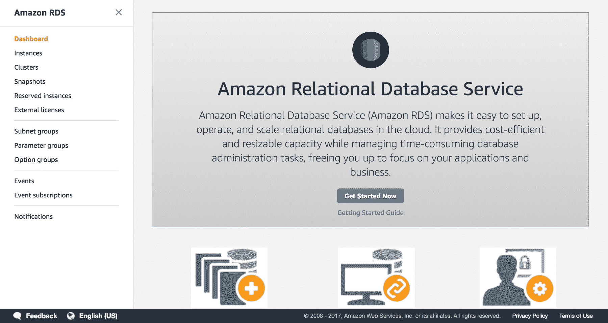

您将被导航到启动 DB 实例的网页。在这里，您需要做出一些与 DB 设置相关的选择。选择作为 DB 引擎使用的 PostgreSQL：

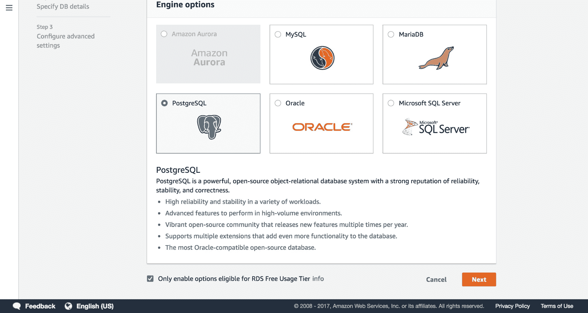

确保勾选“仅启用适用于 RDS 免费使用层的选项”复选框。通过点击下一步，导航到下一组设置步骤。在下一页，保留实例规格不变，并输入必要的 DB 设置。输入 DB 实例名称、主用户名和主密码。我们使用了`messenger-api`作为我们的 DB 实例名称，您也可以选择使用您喜欢的另一个名称。无论您的选择如何，请确保记录下您所做的所有输入。完成输入后，继续到下一屏幕。

您将被导航到配置高级设置屏幕。在网络与安全部分，确保启用公共可访问性，并在 VPC 安全组下选择创建新的 VPC 安全组选项。滚动到屏幕的数据库选项部分，并输入一个 DB 名称。再次，我们使用了`MessengerDB`作为 DB 名称。保留剩余选项不变，并在网页底部点击启动 DB 实例：

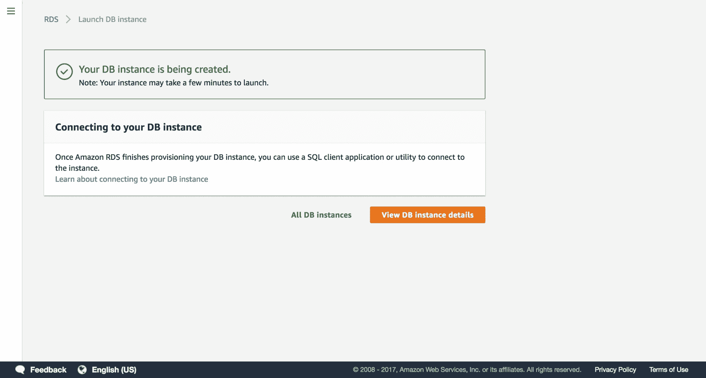

您的 DB 实例将由 AWS 创建。创建过程可能需要长达 10 分钟，因此在这个时候喝杯咖啡可能是个好主意。

稍等片刻后，点击查看 DB 实例详情。这将带您到一个页面，您可以查看刚刚部署的 DB 实例的详细信息。滚动到页面的连接部分，以查看 DB 实例的连接详情：

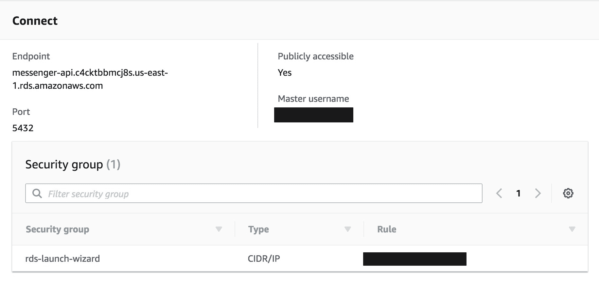

我们需要这些详细信息才能成功连接到这个 PostgreSQL DB 实例上的`MessengerDB`。为了使`messenger-api`能够连接到`MessengerDB`，您必须编辑`application.properties`文件中的`spring.datasource.url`、`spring.datasource.username`和`spring.datasource.password`属性。完成此操作后，`application.properties`应类似于以下内容：

```
spring.jpa.generate-ddl=true
spring.jpa.hibernate.ddl-auto=create-drop
spring.datasource.url=jdbc:postgresql://<endpoint>/MessengerDB
spring.datasource.username=<master_username>
spring.datasource.password=<password>
```

我们将要做的最后一件事是将 messenger API 部署到 Amazon EC2 实例。

# 将 messenger API 部署到 Amazon Elastic Beanstalk

将应用程序部署到 AWS 也很简单。导航到 AWS 控制台，选择“服务”|“计算”| Elastic Beanstalk**。**进入 Elastic Beanstalk 管理控制台后，点击“创建新应用程序”。一旦进入“创建应用程序”页面，你将被要求为新创建的应用程序提供名称和描述。将应用命名为 `messenger-api` 并进入下一屏幕。你将进入一个屏幕，其中会提示你创建一个新的环境：

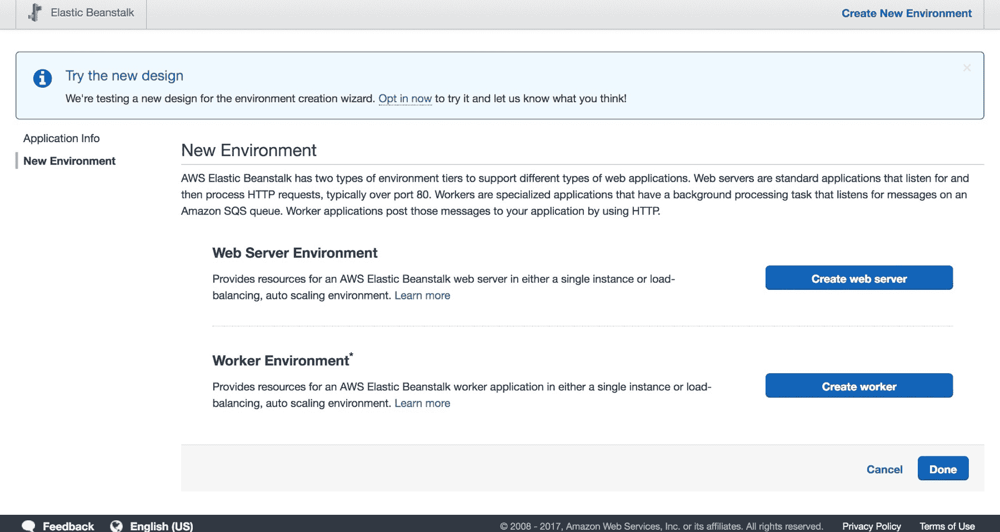

在此屏幕上创建一个网络服务器环境。接下来，你需要配置环境类型。选择 Tomcat 预定义配置，并将环境类型更改为单实例：

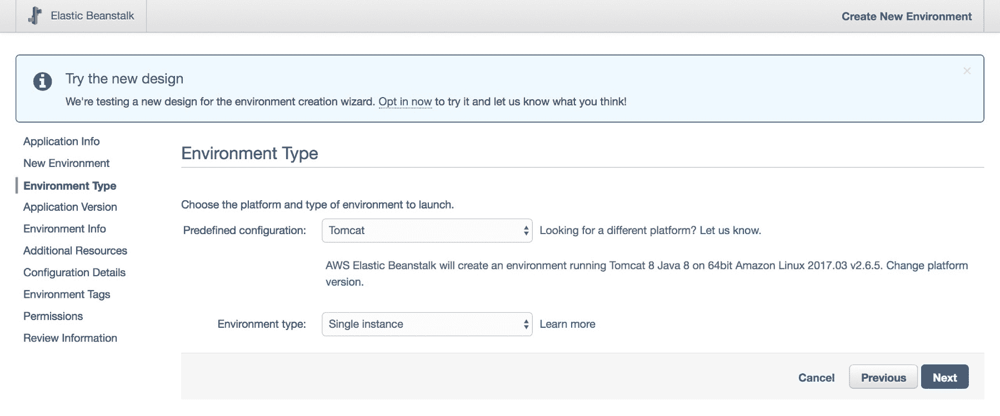

当你准备好时，继续到下一屏幕。在下一屏幕中，你需要选择应用程序的源。选择“上传自己的”：

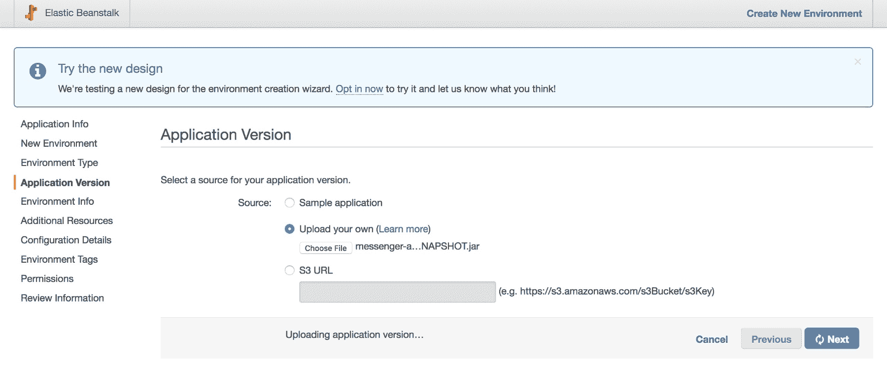

现在我们需要创建一个适合上传的项目 jar。我们可以使用 Maven 将 messenger API 打包成一个 jar：

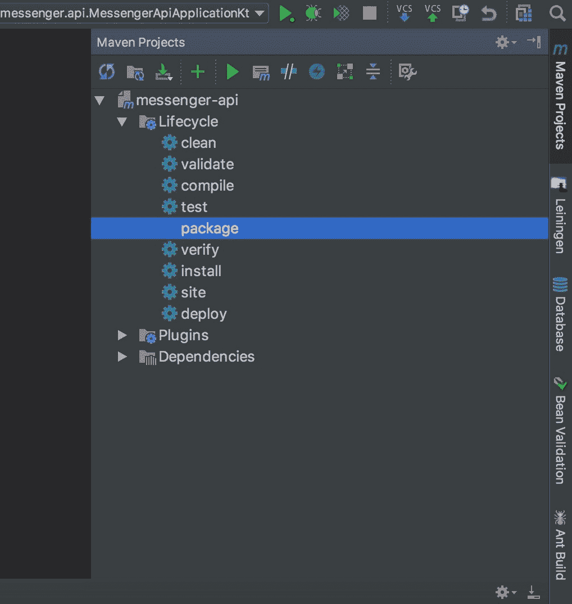

点击项目 IDE 屏幕右侧的 Maven Projects 按钮，选择 messenger-api | 生命周期 | package。项目 jar 将被打包并存储在项目的目标目录中。

现在回到 AWS 并选择这个 jar 文件作为要上传的源文件。保留其他属性不变，然后点击“下一步”。在打包的 jar 文件上传过程中，你可能需要等待几分钟。上传完成后，你将被带到一个新的屏幕，其中将展示你的环境信息。通过点击“下一步”继续浏览接下来的几页，直到你看到“配置详情”屏幕。将实例类型更改为 `t2.micro`。

继续浏览下一屏幕，直到到达“审查信息”部分。滚动到页面底部，直到到达“环境信息”部分：

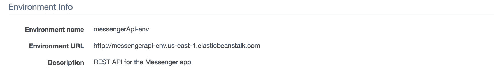

你的环境 URL 将不同。注意此信息，因为你稍后需要用到它。滚动到网页底部并点击“启动”。Elastic Beanstalk 将启动你的新环境。

一旦启动完成，你就可以开始了。你已经成功将 `messenger-api` 部署到 AWS。

# 摘要

在本章中，我们探讨了如何利用 Kotlin 构建 Spring Boot REST 应用程序编程接口。在这个过程中，我们学习了设计系统的基础知识。我们使用状态图来表示 messenger API 系统的行为，并学习了如何正确解释状态图中表示的信息。我们进一步通过创建 E-R 图来详细表示系统实体及其关系。

此外，我们学习了如何在本地机器上设置 PostgreSQL 并创建一个新的 PostgreSQL 数据库。我们还探讨了如何使用 Spring Boot 2.0 构建微服务，将微服务连接到数据库，并使用 Spring Data 与数据库中现有的数据进行交互。

除了这些，我们还学习了如何使用 Spring Security 和 **JSON Web Tokens**（**JWTs**）正确地保护 RESTful Spring Boot 网络应用。我们创建了自定义的 Spring Security 配置，以帮助使用 JWTs 进行用户认证，并创建了自定义过滤器以简化认证过程。最后，我们学习了如何将 Spring Boot 应用部署到 AWS。

在下一章中，你将通过构建 Android 消息应用来进一步探索 Kotlin 在 Android 领域的应用。
