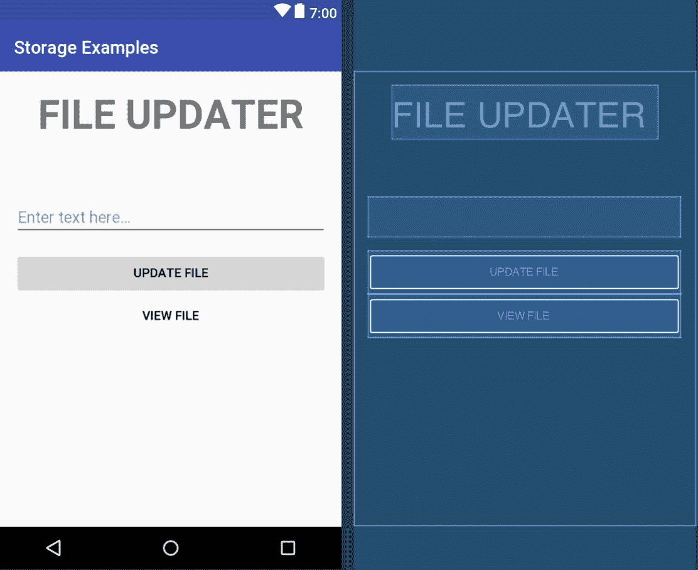
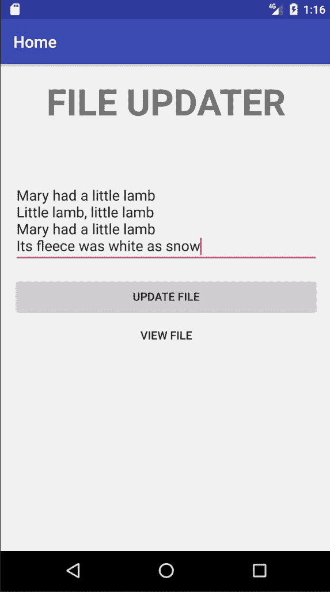
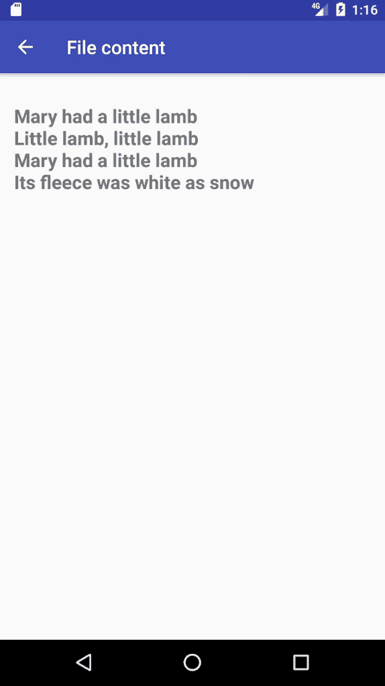
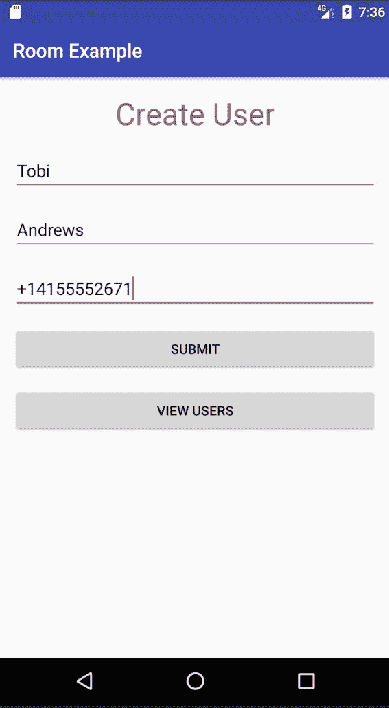
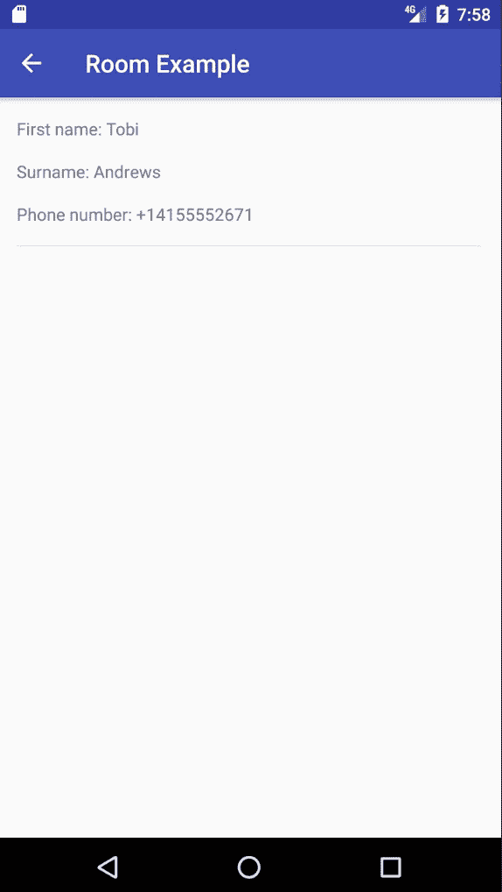
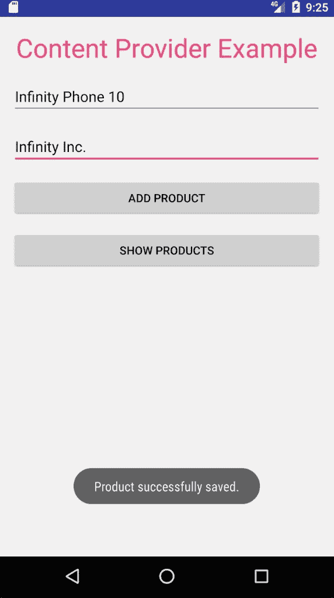
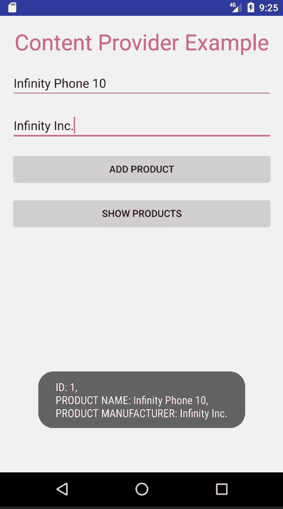

# 在数据库中存储信息

在上一章中，我们讨论了重要的话题，例如使用第三方库、Android 应用程序测试以及如何在 Android 平台上运行后台任务。在本章中，我们将专注于数据的存储。在本书的整个过程中，我们在必要时在不同实例中存储了持久应用程序数据。到目前为止，我们已经使用了`SharedPreferences`来满足所有我们的数据存储需求。这绝不是 Android 应用程序框架提供的唯一数据存储选项。在本章中，我们将深入探讨我们在 Android 上可用的数据存储方式。在这个过程中，我们将了解以下内容：

+   内部存储

+   外部存储

+   网络存储

+   SQLite 数据库

+   内容提供者

此外，我们还将确定哪种存储方法最适合各种用例。让我们从学习内部存储开始本章。

代码之间的省略号表示代码文件中将包含更多代码。

# 与内部存储一起工作

这是在 Android 应用程序框架中可用的一种存储介质，它使开发者能够在设备的内存中存储私有数据。正如“私有”一词所暗示的，其他应用程序无法通过内部存储访问应用程序存储的数据。此外，当应用程序被卸载时，这些文件将从存储中删除。

# 将文件写入内部存储

为了在内部存储上创建一个私有文件，必须调用`openFileOutput()`。`openFileOutput()`函数接受两个参数。第一个是要打开的文件（以`String`形式）的名称，第二个是操作模式。请注意，`openFileOutput()`必须在`Context`实例中调用，例如`Activity`。

`openFileOutput()`方法返回一个`FileOutputStream`。然后可以使用`write()`方法来告诉文件已完成写入。一旦写入完成，应该通过调用其`close()`方法来关闭`FileOutputStream`。以下代码片段演示了此过程：

```
private fun writeFile(fileName: String) {
  val content: String = "Hello world"
  val stream: FileOutputStream = openFileOutput(fileName,
                                     Context.MODE_PRIVATE)
  stream.write(content.toByteArray())
  stream.close()
}
```

`MODE_PRIVATE`是一种操作模式，它创建一个具有给定名称（或替换具有相应名称的文件）的文件，并将其设置为对您的应用程序私有。

# 从内部存储读取文件

为了读取一个私有文件，通过调用`openFileInput()`获取一个`FileInputStream`。此方法接受单个参数——要读取的文件的名称。`openFileInput()`必须在`Context`实例中调用。在获取`FileInputStream`之后，通过调用其`read()`函数从文件中读取字节。一旦完成从文件中读取，通过调用`close()`关闭它。

查看以下代码：

```
private fun readFile(fileName: String) {
  val stream: FileInputStream = openFileInput(fileName)
  val data = ByteArray(1024)

  stream.read(data)
  stream.close()
}
```

# 使用内部存储的示例应用

作为一个合适的例子通常有助于理解一个概念，让我们创建一个快速简单的*文件更新器*应用程序，该程序利用内部存储。文件更新器的操作很简单。它通过输入字段从用户那里收集文本数据，并更新存储在内部存储中的文件。然后，用户可以从应用程序中的视图检查该文件中存在的文本。简单，对吧？它应该是这样的！创建一个新的 Android 项目，并给它起任何您想要的名字。只需确保您给出的名字反映了应用程序的目的。一旦项目创建完成，在`src`项目包中创建两个新的包，分别命名为`base`和`main`。

在`base`包中添加一个`BaseView`接口，包含以下代码：

```
package com.example.storageexamples.base

interface BaseView {

  fun bindViews()

  fun setupInstances()
}
```

如果您阅读了上一章，您将已经熟悉视图接口定义。如果您还没有，现在是做这件事的好时机。在`main`包中，创建一个扩展`BaseView`的`MainView`，如下所示：

```
package com.example.storageexamples.main

import com.example.storageexamples.base.BaseView

interface MainView : BaseView {

  fun navigateToHome()
  fun navigateToContent()
}
```

文件更新应用程序将以两种不同的视图形式存在，以供用户显示。第一个视图是主页视图，用户可以从该视图更新文件的内容，第二个视图是内容视图，用户可以从该视图读取更新文件的文本内容。

现在，在`main`中创建一个新的空活动。将此活动命名为`MainActivity`。确保您将`MainActivity`设置为启动活动。一旦创建了`MainActivity`，在继续之前，确保它扩展了`MainView`。打开`activity_main.xml`并编辑它以包含以下内容：

```
<?xml version="1.0" encoding="utf-8"?>
<android.support.constraint.ConstraintLayout

xmlns:android="http://schemas.android.com/apk/res/android"
 xmlns:tools="http://schemas.android.com/tools"
 android:layout_width="match_parent"
 android:layout_height="match_parent"
 tools:context="com.example.storageexamples.main.MainActivity">

  <LinearLayout
         android:id="@+id/ll_container"
         android:layout_width="match_parent"
         android:layout_height="match_parent"
         android:orientation="vertical"/>
</android.support.constraint.ConstraintLayout>

```

我们在布局文件的根视图中添加了一个`LinearLayout`视图组。这个布局将作为应用程序主页和内容片段的容器。我们现在需要为主页和内容片段创建布局。以下是为主页片段创建的布局（`fragment_home.xml`）：

```
<?xml version="1.0" encoding="utf-8"?>
<LinearLayout xmlns:android="http://schemas.android.com/apk/res/android"
 android:orientation="vertical"
 android:layout_width="match_parent"
 android:paddingTop="@dimen/padding_default"
 android:paddingBottom="@dimen/padding_default"
 android:paddingStart="@dimen/padding_default"
 android:paddingEnd="@dimen/padding_default"
 android:gravity="center_horizontal"
 android:layout_height="match_parent">
  <TextView
       android:id="@+id/tv_header"
       android:layout_width="wrap_content"
       android:layout_height="wrap_content"
       android:text="@string/header_title"
       android:textSize="45sp"
       android:textStyle="bold"/>
  <EditText
        android:id="@+id/et_input"
        android:layout_width="match_parent"
        android:layout_height="wrap_content"
        android:layout_marginTop="@dimen/margin_top_large"
        android:hint="@string/hint_enter_text"/>
  <Button
        android:id="@+id/btn_submit"
        android:layout_width="match_parent"
        android:layout_height="wrap_content"
        android:layout_marginTop="@dimen/margin_default"
        android:text="@string/submit"/>
  <Button
        android:id="@+id/btn_view_file"
        android:layout_width="match_parent"
        android:layout_height="wrap_content"
        android:text="@string/view_file"
        android:background="@android:color/transparent"/>
</LinearLayout>
```

在您打开设计窗口查看布局如何转换之前，我们需要添加一些值资源。您的项目的`strings.xml`文件应类似于以下内容（除了`app_name`字符串资源）：

```
<resources>
  <string name="app_name">Storage Examples</string>
  <string name="hint_enter_text">Enter text here…</string>
  <string name="submit">Update file</string>
  <string name="view_file">View file</string>
  <string name="header_title">FILE UPDATER</string>
</resources>

```

此外，您的项目应该有一个包含以下代码的`dimens.xml`文件：

```
<?xml version="1.0" encoding="utf-8"?>
<resources>
  <dimen name="padding_default">16dp</dimen>
  <dimen name="margin_default">16dp</dimen>
  <dimen name="margin_top_large">64dp</dimen>
</resources>
```

一旦您添加了上述资源，您就可以查看`fragment_home.xml`的布局设计窗口：



接下来是内容片段布局。将一个名为`fragment_content.xml`的布局文件添加到布局资源目录中，包含以下代码：

```
<?xml version="1.0" encoding="utf-8"?>
<LinearLayout xmlns:android="http://schemas.android.com/apk/res/android"
 android:orientation="vertical"
 android:layout_width="match_parent"
 android:padding="@dimen/padding_default"
 android:layout_height="match_parent">
  <TextView
        android:id="@+id/tv_content"
        android:layout_width="match_parent"
        android:layout_height="wrap_content"
        android:textSize="20sp"
        android:textStyle="bold"
        android:layout_marginTop="@dimen/margin_default"/>
</LinearLayout>
```

布局包含一个单独的`TextView`，它将渲染存储在内部存储文件中的文本给应用程序的用户。如果您想检查布局设计窗口，可以这样做，但您不会看到太多内容。

我们已经到达了需要创建适当的片段类以渲染我们刚刚创建的片段布局的阶段。将`HomeFragment`类添加到`MainActivity`中，如下所示：

```
class HomeFragment : Fragment(), BaseView, View.OnClickListener {

  private lateinit var layout: LinearLayout
  private lateinit var tvHeader: TextView
  private lateinit var etInput: EditText
  private lateinit var btnSubmit: Button
  private lateinit var btnViewFile: Button

  private var outputStream: FileOutputStream? = null

  override fun onCreateView(inflater: LayoutInflater,
                            container: ViewGroup?,
                            savedInstanceState: Bundle?): View {

    // inflate the fragment_home.xml layout
    layout = inflater.inflate(R.layout.fragment_home,
                              container, false) as LinearLayout
    setupInstances()
    bindViews()

    return layout
  }

  override fun bindViews() {
    tvHeader = layout.findViewById(R.id.tv_header)
    etInput = layout.findViewById(R.id.et_input)
    btnSubmit = layout.findViewById(R.id.btn_submit)
    btnViewFile = layout.findViewById(R.id.btn_view_file)

    btnSubmit.setOnClickListener(this)
    btnViewFile.setOnClickListener(this)
  }
```

以下方法用于实例化实例属性：

```
  override fun setupInstances() {   
```

让我们打开一个名为`content_file`的新`FileOutputStream`。此文件是存储在内部存储中的私有文件，因此只能由您的应用程序访问：

```
    outputStream = activity?.openFileOutput("content_file",
                                            Context.MODE_PRIVATE)
  }
```

以下函数在给出无效输入时向用户显示错误：

```
private fun showInputError() {
  etInput.error = "File input cannot be empty."
  etInput.requestFocus()
} 
```

让我们使用文件通过`FileOutputStream`写入字符串内容

```
private fun writeFile(content: String) {
  outputStream?.write(content.toByteArray())
  outputStream?.close()
}
```

以下函数被调用以清除输入字段中的输入：

```
private fun clearInput() {
  etInput.setText("")
} 
```

当调用时，以下代码片段向用户显示成功消息：

```
private fun showSaveSuccess() {
  Toast.makeText(activity, "File updated successfully.",
                 Toast.LENGTH_LONG).show()
}

override fun onClick(view: View?) {
  val id = view?.id

  if (id == R.id.btn_submit) {
    if (TextUtils.isEmpty(etInput.text)) {    
```

如果用户提交空值作为文件内容输入，它将显示错误消息：

```
  showInputError()
} else {      
```

让我们将内容写入文件，清除输入的`EditText`并显示文件更新成功消息：

```
     writeFile(etInput.text.toString())
     clearInput()
     showSaveSuccess()
   }
} else if (id == R.id.btn_view_file) {
  // retrieve a reference to MainActivity
  val mainActivity = activity as MainActivity
```

让我们引导用户到内容片段，并在工具栏上显示主页按钮，以便用户能够返回到上一个片段：

```
      mainActivity.navigateToContent()
      mainActivity.showHomeNavigation()
    }
  }
}
```

阅读`HomeFragment`的注释以确保您理解正在发生的事情。现在，我们已经将`HomeFragment`添加到`MainActivity`中，我们还必须添加一个片段来渲染`fragment_content.xml`布局给用户。以下是需要添加到`MainActivity`的`ContentFragment`类：

```
class ContentFragment : Fragment(), BaseView {

  private lateinit var layout: LinearLayout
  private lateinit var tvContent: TextView

  private lateinit var inputStream: FileInputStream

  override fun onCreateView(inflater: LayoutInflater?,
                            container: ViewGroup?,
                            savedInstanceState: Bundle?): View {

    layout = inflater?.inflate(R.layout.fragment_content,
                               container, false) as LinearLayout
    setupInstances()
    bindViews()

    return layout
  }

  override fun onResume() {
```

当片段恢复时，让我们更新`TextView`中渲染的内容：

```
  updateContent()
  super.onResume()
}

private fun updateContent() {
  tvContent.text = readFile()
}

override fun bindViews() {
  tvContent = layout.findViewById(R.id.tv_content)
}

override fun setupInstances() {
  inputStream = activity.openFileInput("content_file")
}
```

以下代码读取内部存储中文件的内容，并将内容作为字符串返回：

```
  private fun readFile(): String {
    var c: Int
    var content = ""

    c = inputStream.read()

    while (c != -1) {
      content += Character.toString(c.toChar())
      c = inputStream.read()
    }

    inputStream.close()

    return content
  }
}
```

当`ContentFragment`活动恢复时，`tvContent`实例（向用户显示文件内容的`TextView`）将被更新。`TextView`的内容通过将`TextView`的文本设置为从文件中读取的内容（使用`readFile()`）来更新。最后一件必要的事情是完成`MainActivity`。

您完全完成的`MainActivity`类应类似于以下内容：

```
package com.example.storageexamples.main

import android.aupport.v4.app.Fragment
import android.content.Context
import android.support.v7.app.AppCompatActivity
import android.os.Bundle
import android.text.TextUtils
import android.view.LayoutInflater
import android.view.MenuItem
import android.view.View
import android.view.ViewGroup
import android.widget.*
import com.example.storageexamples.R
import com.example.storageexamples.base.BaseView
import java.io.FileInputStream
import java.io.FileOutputStream

class MainActivity : AppCompatActivity(), MainView {

  private lateinit var llContainer: LinearLayout

```

让我们设置片段实例：

```

  private lateinit var homeFragment: HomeFragment
  private lateinit var contentFragment: ContentFragment

  override fun onCreate(savedInstanceState: Bundle?) {
    super.onCreate(savedInstanceState)
    setContentView(R.layout.activity_main)
    setupInstances()
    bindViews()
    navigateToHome()
  }

  override fun bindViews() {
    llContainer = findViewById(R.id.ll_container)
  }

  override fun setupInstances() {
    homeFragment = HomeFragment()
    contentFragment = ContentFragment()
  }

  private fun hideHomeNavigation() {
    supportActionBar?.setDisplayHomeAsUpEnabled(false)
  }

  private fun showHomeNavigation() {
    supportActionBar?.setDisplayHomeAsUpEnabled(true)
  }

  override fun navigateToHome() {
    val transaction = supportFragmentManager.beginTransaction()
    transaction.replace(R.id.ll_container, homeFragment)
    transaction.commit()

    supportActionBar?.title = "Home"
  }

  override fun navigateToContent() {
    val transaction = supportFragmentManager.beginTransaction()
    transaction.replace(R.id.ll_container, contentFragment)
    transaction.commit()

    supportActionBar?.title = "File content"
  }

  override fun onOptionsItemSelected(item: MenuItem?): Boolean {
    val id = item?.itemId

    if (id == android.R.id.home) {
      navigateToHome()
      hideHomeNavigation()
    }

    return super.onOptionsItemSelected(item)
  }

  class HomeFragment : Fragment(), BaseView, View.OnClickListener {

    private lateinit var layout: LinearLayout
    private lateinit var tvHeader: TextView
    private lateinit var etInput: EditText
    private lateinit var btnSubmit: Button
    private lateinit var btnViewFile: Button

    private lateinit var outputStream: FileOutputStream

    override fun onCreateView(inflater: LayoutInflater?,
                              container: ViewGroup?,
                              savedInstanceState: Bundle?): View {
```

让我们创建`fragment_home.xml`布局：

```
  layout = inflater?.inflate(R.layout.fragment_home,
                             container, false) as LinearLayout
  setupInstances()
  bindViews()

  return layout
}

override fun bindViews() {
  tvHeader = layout.findViewById(R.id.tv_header)
  etInput = layout.findViewById(R.id.et_input)
  btnSubmit = layout.findViewById(R.id.btn_submit)
  btnViewFile = layout.findViewById(R.id.btn_view_file)

  btnSubmit.setOnClickListener(this)
  btnViewFile.setOnClickListener(this)
}

//Method for the instantiation of instance properties
override fun setupInstances() {
```

让我们打开一个名为`content_file`的新`FileOutputStream`。此文件是存储在内部存储中的私有文件，因此只能由您的应用程序访问：

```

  outputStream = activity.openFileOutput("content_file",
                                         Context.MODE_PRIVATE)
}

//Called to display an error to the user if an invalid input is given

private fun showInputError() {
  etInput.error = "File input cannot be empty."
  etInput.requestFocus()
}

// Writes string content to a file via a [FileOutputStream]
private fun writeFile(content: String) {
  outputStream.write(content.toByteArray())
}

//Called to clear the input in the input field

private fun clearInput() {
  etInput.setText("")
}

//Shows a success message to the user when invoked.

private fun showSaveSuccess() {
  Toast.makeText(activity, "File updated successfully.",
                 Toast.LENGTH_LONG).show()
}

override fun onClick(view: View?) {
  val id = view?.id

  if (id == R.id.btn_submit) {
```

以下代码片段会在用户提交空值作为文件内容输入时显示错误消息：

```
  if (TextUtils.isEmpty(etInput.text)) {
    showInputError()
  } else {
    //Write content to the file, clear the input
    //EditText and show a file update success message

    writeFile(etInput.text.toString())
    clearInput()
    showSaveSuccess()
  }
} else if (id == R.id.btn_view_file) {
  // retrieve a reference to MainActivity
  val mainActivity = activity as MainActivity  
```

我们将引导用户到内容片段，并在工具栏上显示主页按钮，以便用户能够返回到上一个片段：

```

       mainActivity.navigateToContent()
      mainActivity.showHomeNavigation()
    }
  }
}

class ContentFragment : Fragment(), BaseView {

  private lateinit var layout: LinearLayout
  private lateinit var tvContent: TextView

  private lateinit var inputStream: FileInputStream

  override fun onCreateView(inflater: LayoutInflater?,
                            container: ViewGroup?,
                            savedInstanceState: Bundle?): View {

    layout = inflater?.inflate(R.layout.fragment_content,
                         container, false) as LinearLayout
    setupInstances()
    bindViews()

    return layout
}
```

让我们在片段恢复时更新`TextView`中渲染的内容：

```
override fun onResume() {
  updateContent()
  super.onResume()
}

private fun updateContent() {
  tvContent.text = readFile()
}

override fun bindViews() {
  tvContent = layout.findViewById(R.id.tv_content)
}

override fun setupInstances() {
  inputStream = activity.openFileInput("content_file")
}
```

现在，我们将读取内部存储中文件的 内容，并将内容作为字符串返回：

```
    private fun readFile(): String {
      var c: Int
      var content = ""

      c = inputStream.read()

      while (c != -1) {
        content += Character.toString(c.toChar())
        c = inputStream.read()
      }

      inputStream.close()

      return content
    }
  }
}
```

现在我们已经完成了`MainActivity`，应用程序准备运行。

在您选择的设备上构建并运行项目。当应用程序启动时，`MainActivity`的主片段将在设备上显示。在`EditText`输入中输入您选择的内容：



在向 `EditText` 添加内容后，点击 UPDATE FILE 按钮。内部存储文件将更新为提供的内容，更新完成后会通过 toast 消息通知您。更新文件后，点击 VIEW FILE 按钮：



内容片段将通过包含更新后文件内容的 `TextView` 显示。虽然简单，但我们刚刚创建的文件更新应用程序是一个很好的例子，展示了 Android 应用程序如何与内部存储一起工作。

# 保存缓存文件

如果您不想永久存储数据，而是将数据缓存到存储中，请使用 `cacheDir` 打开一个表示目录（在内部存储中）的文件，您的应用程序应在此目录中保存临时缓存文件。

`cacheDir` 返回一个 `File` 对象。因此，您可以利用 `File` 类提供的所有方法，例如 `outputStream()`，它返回一个 `FileOutputStream`。

# 与外部存储一起工作

外部存储用于创建和访问非私有、共享、世界可读的文件。所有 Android 设备都支持共享外部存储。开始使用外部存储的第一件事是获取其权限。

# 获取外部存储权限

在您的应用程序可以使用外部存储 API 之前，必须获取 `READ_EXTERNAL_STORAGE` 和 `WRITE_EXTERNAL_STORAGE` 权限。当您只需要从外部存储读取时，`READ_EXTERNAL_STORAGE` 是必要的。当您的应用程序需要直接写入外部存储的能力时，`WRITE_EXTERNAL_STORAGE` 权限是必要的。

如前几章所见，这两个权限可以轻松添加到清单文件中：

```
<uses-permission android:name="android.permission.WRITE_EXTERNAL_STORAGE" />
<uses-permission android:name="android.permission.READ_EXTERNAL_STORAGE" />
```

应该注意的是，`WRITE_EXTERNAL_STORAGE` 隐含包含了 `READ_EXTERNAL_STORAGE`。因此，如果需要这两个权限，只需请求 `WRITE_EXTERNAL_STORAGE` 权限即可：

```
<uses-permission android:name="android.permission.WRITE_EXTERNAL_STORAGE" />
```

# 断言媒体可用性

有时——由于各种原因，例如存储设备丢失——外部存储介质可能无法访问。因此，在尝试使用它们之前，检查外部存储介质的可用性非常重要。

为了检查媒体是否可用，应该调用 `getExternalStorageState()` 方法。您可以使用以下代码片段来检查应用程序是否可以写入外部存储：

```
private fun isExternalStorageWritable(): Boolean {
  val state = Environment.getExternalStorageState()

  return Environment.MEDIA_MOUNTED == state
}
```

首先，我们检索外部存储的当前状态，然后检查它是否处于 `MEDIA_MOUNTED` 状态。如果处于此状态，您的应用程序可以写入它。因此，`isExternalStorageWritable()` 方法返回 true。

检查外部存储是否可读同样简单：

```
private fun isExternalStorageReadable(): Boolean {
  val state = Environment.getExternalStorageState()

  return Environment.MEDIA_MOUNTED == state ||
         Environment.MEDIA_MOUNTED_READ_ONLY == state
}
```

如果外部存储处于 `MEDIA_MOUNTED` 或 `MEDIA_MOUNTED_READ_ONLY` 状态，您的应用程序可以从中读取数据。

# 存储可共享文件

用户或其他应用程序可能需要稍后访问的文件应存储在共享公共目录中。此类目录的示例包括 `Pictures/` 和 `Music/` 目录。

应用程序应调用 `getExternalStoragePulicDirectory()` 方法以检索表示所需公共目录的 `File` 对象。要检索的目录类型应作为函数的唯一参数传递。

以下是一个创建用于存储音乐的目录的函数：

```
private fun getMusicStorageDir(collectionName: String): File {
  val file = File(Environment.getExternalStoragePublicDirectory(
        Environment.DIRECTORY_MUSIC), collectionName)

  if (!file.mkdir()) {
    Log.d("DIR_CREATION_STATUS", "Directory creation failed.")
  }

  return file
}
```

在创建公共目录时发生错误的情况下，适当的消息会被记录到控制台。

# 使用外部存储缓存文件

可能会出现需要使用外部存储缓存文件的场景。您可以使用 `externalCacheDir` 打开表示外部存储目录的文件，以便在您的应用程序中保存缓存文件。

# 网络存储

这是远程服务器上的数据存储。与其他我们讨论过的存储方式不同，这种存储方式利用网络连接来存储和检索存在于远程服务器上的数据。在上一章创建 Android 消息应用时，您使用了这种存储介质。消息应用严重依赖于远程服务器进行信息的存储和检索。当远程服务器作为客户端应用程序的数据源时，客户端-服务器架构主要发挥作用。客户端通过 HTTP 向服务器发送所需数据（通常是 GET 请求）的请求，服务器通过发送所需数据作为响应来响应，从而完成 HTTP 事务周期。

# 与 SQLite 数据库一起工作

SQLite 是一个流行的 **关系数据库管理系统**（**RDBMS**），与许多 RDBMS 系统不同，它不是一个客户端-服务器数据库引擎。相反，SQLite 数据库直接嵌入到应用程序中。

Android 完全支持 SQLite。SQLite 数据库可以通过类在 Android 项目中访问。请注意，在 Android 中，数据库仅对创建它的应用程序可访问。

在 Android 中使用 Room 持久化库是推荐的工作方式。在 Android 中使用 `room` 的第一步是在项目的 `build.gradle` 脚本中包含其必要的依赖项：

```
implementation "android.arch.persistence.room:runtime:1.0.0-alpha9-1"
implementation "android.arch.persistence.room:rxjava2:1.0.0-alpha9-1"
implementation "io.reactivex.rxjava2:rxandroid:2.0.1"
kapt "android.arch.persistence.room:compiler:1.0.0-alpha9-1"

```

可以借助 `Room` 轻松创建实体。所有实体都必须使用 `@Entity` 注解。以下是一个简单的 `User` 实体：

```
package com.example.roomexample.data

import android.arch.persistence.room.ColumnInfo
import android.arch.persistence.room.Entity
import android.arch.persistence.room.PrimaryKey

@Entity
data class User(
  @ColumnInfo(name = "first_name")
  var firstName: String = "",
  @ColumnInfo(name = "surname")
  var surname: String = "",
  @ColumnInfo(name = "phone_number")
  var phoneNumber: String = "",
  @PrimaryKey(autoGenerate = true)
  var id: Long = 0
)
```

`Room` 将为定义的 `User` 实体创建必要的 SQLite 表。该表将有一个名为 `user` 的名称，并将有四个属性：`id`、`first_name`、`surname` 和 `phone_number`。`id` 属性是创建的用户表的主键。我们通过使用 `@PrimaryKey` 注解指定了这一点。我们通过在 `@PrimaryKey` 注解中将 `autoGenerate` 设置为 `true` 来指定用户表中每条记录的主键应由 `Room` 生成。`@ColumnInfo` 是一个用于指定与表中列相关的额外信息的注解。以下是一个示例代码片段：

```
@ColumnInfo(name = "first_name")
var firstName: String = ""
```

上述代码指定了 `User` 拥有一个 `firstName` 属性。`@ColumnInfo(name="first_name")` 将 `firstName` 属性在用户表中的列名设置为 `first_name`。

为了在数据库中读取和写入记录，你需要一个**数据访问对象**（**DAO**）。DAO 允许通过注解方法执行数据库操作。以下是一个针对 `User` 实体的 DAO 示例：

```
package com.example.roomexample.data

import android.arch.persistence.room.Dao
import android.arch.persistence.room.Insert
import android.arch.persistence.room.OnConflictStrategy
import android.arch.persistence.room.Query
import io.reactivex.Flowable

@Dao
interface UserDao {

  @Query("SELECT * FROM user")
  fun all(): Flowable<List<User>>

  @Query("SELECT * FROM user WHERE id = :id")
  fun findById(id: Long): Flowable<User>

  @Insert(onConflict = OnConflictStrategy.REPLACE)
  fun insert(user: User)
}
```

`@Query` 注解将 DAO 类中的方法标记为查询方法。当方法被调用时，将运行的查询作为值传递给注解。自然地，传递给 `@Query` 的查询是 SQL 查询。编写 SQL 查询是一个过于庞大的主题，在这里无法涵盖，但花些时间了解如何正确编写它们是个好主意。

`@Insert` 注解用于向表中插入数据。其他重要的注解包括 `@Update` 和 `@Delete`。它们用于在数据库表中更新和删除数据。

最后，在创建必要的实体和 DAO 之后，你必须定义你的应用程序数据库。为此，你必须创建 `RoomDatabase` 的一个子类，并用 `@Database` 注解它。至少，该注解应包括实体类引用的集合和数据库版本号。以下是一个示例 `AppDatabase` 抽象类：

```
@Database(entities = [User::class], version = 1)
public abstract class AppDatabase : RoomDatabase() {
  abstract fun userDao(): UserDao
}Now that we have our DAO and entity created, we must create an AppDatabase class. Add
```

一旦创建了你的应用数据库类，你可以通过调用 `databaseBuilder()` 来获取数据库的一个实例：

```
val db = Room.databaseBuilder(<context>, AppDatabase::class.java, 
                              "app-database").build()
```

一旦你有了 `RoomDatabase` 的实例，你可以使用它来检索数据访问对象，进而可以使用这些对象从数据库中读取、写入、更新、查询和删除数据。

按照我们迄今为止采用的实践，让我们创建一个简单的应用程序，展示如何在 Android 中使用 `Room` 利用 SQLite。我们将要构建的应用程序将允许应用程序用户手动输入有关人员（用户）的信息，并在稍后查看所有用户输入的信息。

创建一个新的 Android 项目，并将一个空的 `MainActivity` 设置为启动活动。将以下依赖项添加到你的应用的 `build.gradle` 脚本中：

```
implementation 'com.android.support:design:26.1.0'
implementation "android.arch.persistence.room:runtime:1.0.0"
implementation "android.arch.persistence.room:rxjava2:1.0.0"
implementation "io.reactivex.rxjava2:rxandroid:2.0.1"
kapt "android.arch.persistence.room:compiler:1.0.0"
```

此外，将 `kotlin-kapt` 独立插件应用到你的 `build.gradle` 脚本中：

```
apply plugin: 'kotlin-kapt'
```

在添加了前面的项目依赖项后，在项目源包内创建一个`data`和一个`ui`包。在`ui`包中，添加`MainView`，如下所示：

```
package com.example.roomexample.ui

interface MainView {

  fun bindViews()
  fun setupInstances()
}
```

将`MainView`添加到`ui`包后，将`MainActivity`也移至`ui`包。现在让我们来处理我们应用程序的数据库。由于应用程序将要存储用户信息，我们需要创建一个`User`实体。将以下`User`实体添加到`data`包中：

```
package com.example.roomexample.data

import android.arch.persistence.room.ColumnInfo
import android.arch.persistence.room.Entity
import android.arch.persistence.room.PrimaryKey

@Entity
data class User(
  @ColumnInfo(name = "first_name")
  var firstName: String = "",
  @ColumnInfo(name = "surname")
  var surname: String = "",
  @ColumnInfo(name = "phone_number")
  var phoneNumber: String = "",
  @PrimaryKey(autoGenerate = true)
  var id: Long = 0
)
```

现在在`data`包中创建一个`UserDao`：

```
package com.example.roomexample.data

import android.arch.persistence.room.Dao
import android.arch.persistence.room.Insert
import android.arch.persistence.room.OnConflictStrategy
import android.arch.persistence.room.Query
import io.reactivex.Flowable

@Dao
interface UserDao {

  @Query("SELECT * FROM user")
  fun all(): Flowable<List<User>>

  @Query("SELECT * FROM user WHERE id = :id")
  fun findById(id: Long): Flowable<User>

  @Insert(onConflict = OnConflictStrategy.REPLACE)
  fun insert(user: User)
}
```

`UserDao`接口有三个方法：`all()`、`findById()`和`Insert()`。`all()`方法返回一个包含所有用户的`Flowable`列表。`findById()`方法查找一个`User`，其 id 与传递给方法的方法匹配，如果有的话，并在`Flowable`中返回该`User`。`insert()`方法用于将用户作为记录插入到`user`表中。

现在我们已经创建了 DAO 和实体，我们必须创建一个`AppDatabase`类。将以下内容添加到`data`包中：

```
package com.example.roomexample.data

import android.arch.persistence.room.Database
import android.arch.persistence.room.Room
import android.arch.persistence.room.RoomDatabase
import android.content.Context

@Database(entities = arrayOf(User::class), version = 1, exportSchema = false)
internal abstract class AppDatabase : RoomDatabase() {

  abstract fun userDao(): UserDao

  companion object Factory {
    private var appDatabase: AppDatabase? = null

    fun create(ctx: Context): AppDatabase {
      if (appDatabase == null) {
        appDatabase = Room.databaseBuilder(ctx.applicationContext,
                                           AppDatabase::class.java,
                                           "app-database").build()

      }

      return appDatabase as AppDatabase
    }
  }
}
```

我们创建了一个拥有单个`create()`函数的`Factory`伴随对象，该函数的唯一任务是创建一个`AppDatabase`实例（如果尚未创建）并返回该实例以供使用。

创建一个`AppDatabase`是我们需要做的关于数据的最后一件事。现在我们必须为我们的应用程序视图创建合适的布局。在我们的`MainActivity`中，我们将使用两个片段。第一个将用于收集创建新用户所需的输入，第二个将显示所有已创建用户的信息，在一个`RecyclerView`中。首先，修改`activity_main.xml`布局以包含以下内容：

```
<?xml version="1.0" encoding="utf-8"?>
<android.support.constraint.ConstraintLayout
 xmlns:android="http://schemas.android.com/apk/res/android"
 xmlns:tools="http://schemas.android.com/tools"
 android:layout_width="match_parent"
 android:layout_height="match_parent"
 tools:context="com.example.roomexample.ui.MainActivity">

  <LinearLayout
        android:id="@+id/ll_container"
        android:layout_width="match_parent"
        android:layout_height="match_parent"
        android:orientation="vertical"/>
</android.support.constraint.ConstraintLayout>
```

`activity_main.xml`中的`LinearLayout`将包含`MainActivity`的片段。将一个`fragment_create_user.xml`文件添加到`resource`布局目录中，并包含以下内容：

```
<?xml version="1.0" encoding="utf-8"?>
<LinearLayout xmlns:android="http://schemas.android.com/apk/res/android"
 android:orientation="vertical"
 android:layout_width="match_parent"
 android:layout_height="match_parent"
 android:gravity="center_horizontal"
 android:padding="@dimen/padding_default">
  <TextView
        android:layout_width="wrap_content"
        android:layout_height="wrap_content"
        android:textSize="32sp"
        android:text="@string/create_user"/>
  <EditText
        android:id="@+id/et_first_name"
        android:layout_width="match_parent"
        android:layout_height="wrap_content"
        android:layout_marginTop="@dimen/margin_default"
        android:hint="@string/first_name"
        android:inputType="text"/>
  <EditText
        android:id="@+id/et_surname"
        android:layout_width="match_parent"
        android:layout_height="wrap_content"
        android:layout_marginTop="@dimen/margin_default"
        android:hint="@string/surname"
        android:inputType="text"/>
  <EditText
        android:id="@+id/et_phone_number"
        android:layout_width="match_parent"
        android:layout_height="wrap_content"
        android:layout_marginTop="@dimen/margin_default"
        android:hint="@string/phone_number"
        android:inputType="phone"/>
  <Button
        android:id="@+id/btn_submit"
        android:layout_width="match_parent"
        android:layout_height="wrap_content"
        android:layout_marginTop="@dimen/margin_default"
        android:text="@string/submit"/>
  <Button
        android:id="@+id/btn_view_users"
        android:layout_width="match_parent"
        android:layout_height="wrap_content"
        android:layout_marginTop="@dimen/margin_default"
        android:text="@string/view_users"/>
</LinearLayout>
```

现在添加一个包含以下内容的`fragment_list_users.xml`布局资源：

```
<?xml version="1.0" encoding="utf-8"?>
<LinearLayout xmlns:android="http://schemas.android.com/apk/res/android"
 android:orientation="vertical"
 android:layout_width="match_parent"
 android:layout_height="match_parent">
  <android.support.v7.widget.RecyclerView
        android:id="@+id/rv_users"
        android:layout_width="match_parent"
        android:layout_height="match_parent"/>
</LinearLayout>
```

`fragment_list_users.xml`文件包含一个`RecyclerView`，它将显示保存到数据库中的每个用户的信息。我们必须为这个`RecyclerView`创建一个视图持有者布局资源项。我们将把这个布局文件命名为`vh_user.xml`。创建一个新的`vh_user.xml`资源文件，并添加以下内容：

```
<?xml version="1.0" encoding="utf-8"?>
<LinearLayout xmlns:android="http://schemas.android.com/apk/res/android"
 android:orientation="vertical"
 android:layout_width="match_parent"
 android:padding="@dimen/padding_default"
 android:layout_height="wrap_content">
  <TextView
       android:id="@+id/tv_first_name"
       android:layout_width="wrap_content"
       android:layout_height="wrap_content"/>
  <TextView
       android:id="@+id/tv_surname"
       android:layout_width="wrap_content"
       android:layout_height="wrap_content"
       android:layout_marginTop="@dimen/margin_default"/>
  <TextView
       android:id="@+id/tv_phone_number"
       android:layout_width="wrap_content"
       android:layout_height="wrap_content"
       android:layout_marginTop="@dimen/margin_default"/>
  <View
       android:layout_width="match_parent"
       android:layout_height="1dp"
       android:layout_marginTop="@dimen/margin_default"
       android:background="#e8e8e8"/>
</LinearLayout>
```

如你所预期，我们必须向我们的项目中添加一些字符串和维度资源。打开你的应用程序的`strings.xml`布局文件，并添加以下字符串资源：

```
<resources>
...
  <string name="first_name">First name</string>
  <string name="surname">Surname</string>
  <string name="phone_number">Phone number</string>
  <string name="submit">Submit</string>
  <string name="create_user">Create User</string>
  <string name="view_users">View users</string>
</resources>

```

现在在你的项目中创建以下维度资源：

```
<?xml version="1.0" encoding="utf-8"?>
<resources>
  <dimen name="padding_default">16dp</dimen>
  <dimen name="margin_default">16dp</dimen>
</resources>
```

现在是时候开始工作于`MainActivity`了。正如我们之前所确定的，我们将在`MainActivity`类中使用两个不同的片段。第一个片段允许一个人将个人的数据保存到 SQL 数据库中，下一个将允许用户查看数据库中已保存的人的信息。

我们将首先创建一个`CreateUserFragment`。将以下片段类添加到`MainActivity`（位于`MainActivity.kt`）中。

```
class CreateUserFragment : Fragment(), MainView, View.OnClickListener {

  private lateinit var btnSubmit: Button
  private lateinit var etSurname: EditText
  private lateinit var btnViewUsers: Button
  private lateinit var layout: LinearLayout
  private lateinit var etFirstName: EditText
  private lateinit var etPhoneNumber: EditText

  private lateinit var userDao: UserDao
  private lateinit var appDatabase: AppDatabase

  override fun onCreateView(inflater: LayoutInflater,
               container: ViewGroup?, savedInstanceState: Bundle?): View {
    layout = inflater.inflate(R.layout.fragment_create_user,
                       container, false) as LinearLayout
    bindViews()
    setupInstances()
    return layout
  }

  override fun bindViews() {
    btnSubmit = layout.findViewById(R.id.btn_submit)
    btnViewUsers = layout.findViewById(R.id.btn_view_users)
    etSurname = layout.findViewById(R.id.et_surname)
    etFirstName = layout.findViewById(R.id.et_first_name)
    etPhoneNumber = layout.findViewById(R.id.et_phone_number)

    btnSubmit.setOnClickListener(this)
    btnViewUsers.setOnClickListener(this)
  }

  override fun setupInstances() {
    appDatabase = AppDatabase.create(activity) 
      // getting an instance of AppDatabase
    userDao = appDatabase.userDao() // getting an instance of UserDao
  }

```

以下方法验证在创建用户表单中提交的输入：

```
private fun inputsValid(): Boolean {
  var inputValid = true
  val firstName = etFirstName.text
  val surname = etSurname.text
  val phoneNumber = etPhoneNumber.text

  if (TextUtils.isEmpty(firstName)) {
    etFirstName.error = "First name cannot be empty"
    etFirstName.requestFocus()
    inputValid = false

  } else if (TextUtils.isEmpty(surname)) {
    etSurname.error = "Surname cannot be empty"
    etSurname.requestFocus()
    inputValid = false

  } else if (TextUtils.isEmpty(phoneNumber)) {
    etPhoneNumber.error = "Phone number cannot be empty"
    etPhoneNumber.requestFocus()
    inputValid = false

  } else if (!android.util.Patterns.PHONE
                     .matcher(phoneNumber).matches()) {
    etPhoneNumber.error = "Valid phone number required"
    etPhoneNumber.requestFocus()
    inputValid = false
  }

  return inputValid
}
```

以下函数显示提示消息，表明用户已成功创建：

```
  private fun showCreationSuccess() {
    Toast.makeText(activity, "User successfully created.",
                   Toast.LENGTH_LONG).show()
  }

  override fun onClick(view: View?) {
    val id = view?.id

    if (id == R.id.btn_submit) {
      if (inputsValid()) {
        val user = User(
          etFirstName.text.toString(),
          etSurname.text.toString(),
          etPhoneNumber.text.toString())

        Observable.just(userDao)
                  .subscribeOn(Schedulers.io())
                  .subscribe( { dao ->
          dao.insert(user)  // using UserDao to save user to database.
          activity?.runOnUiThread { showCreationSuccess() }
        }, Throwable::printStackTrace)
      }
    } else if (id == R.id.btn_view_users) {
      val mainActivity = activity as MainActivity

      mainActivity.navigateToList()
      mainActivity.showHomeButton()
    }
  }
}
```

我们已经多次使用过片段。因此，我们的解释重点将放在与 `AppDatabase` 一起工作的这个片段的部分。在 `setupInstances()` 中，我们设置了 `AppDatabase` 和 `UserDao` 的引用。通过调用 `AppDatabase` 的 `Factory` 伴生对象的 `create()` 函数获取 `AppDatabase` 的一个实例。通过调用 `appDatabase.userDao()` 轻松获取 `UserDao` 的一个实例。

让我们继续到片段类的 `onClick()` 方法。当点击提交按钮时，将检查提交的用户信息的有效性。如果任何输入无效，将显示适当的错误消息。一旦断定所有输入都有效，将创建一个新的包含提交用户信息的 `User` 对象并将其保存到数据库中。这是在以下几行中完成的：

```
if (inputsValid()) {
  val user = User(
    etFirstName.text.toString(),
    etSurname.text.toString(),
    etPhoneNumber.text.toString())

  Observable.just(userDao)
            .subscribeOn(Schedulers.io())
            .subscribe( { dao ->
    dao.insert(user)  // using UserDao to save user to database.
    activity?.runOnUiThread { showCreationSuccess() }
  }, Throwable::printStackTrace)
}
```

创建 `ListUsersFragment` 同样容易实现。将以下 `ListUsersFragment` 添加到 `MainActivity`：

```
class ListUsersFragment : Fragment(), MainView {

  private lateinit var layout: LinearLayout
  private lateinit var rvUsers: RecyclerView

  private lateinit var appDatabase: AppDatabase

  override fun onCreateView(inflater: LayoutInflater,
               container: ViewGroup?, savedInstanceState: Bundle?): View {

    layout = inflater.inflate(R.layout.fragment_list_users,
                              container, false) as LinearLayout
    bindViews()
    setupInstances()

    return layout
  }
```

将用户回收视图实例绑定到其布局元素：

```
 override fun bindViews() {
    rvUsers = layout.findViewById(R.id.rv_users)
  }

  override fun setupInstances() {
    appDatabase = AppDatabase.create(activity)
    rvUsers.layoutManager = LinearLayoutManager(activity)
    rvUsers.adapter = UsersAdapter(appDatabase)
  }

  private class UsersAdapter(appDatabase: AppDatabase) : 
               RecyclerView.Adapter<UsersAdapter.ViewHolder>() {

    private val users: ArrayList<User> = ArrayList()
    private val userDao: UserDao = appDatabase.userDao()

    init {
      populateUsers()
    }

    override fun onCreateViewHolder(parent: ViewGroup?, viewType: Int):
                 ViewHolder {
      val layout = LayoutInflater.from(parent?.context)
                                 .inflate(R.layout.vh_user, parent, false)

      return ViewHolder(layout)
    }

    override fun onBindViewHolder(holder: ViewHolder?, position: Int) {
      val layout = holder?.itemView
      val user = users[position]

      val tvFirstName = layout?.findViewById<TextView>(R.id.tv_first_name)
      val tvSurname = layout?.findViewById<TextView>(R.id.tv_surname)
      val tvPhoneNumber = layout?.findViewById<TextView>
                          (R.id.tv_phone_number)

      tvFirstName?.text = "First name: ${user.firstName}"
      tvSurname?.text = "Surname: ${user.surname}"
      tvPhoneNumber?.text = "Phone number: ${user.phoneNumber}"
    }

   //Populates users ArrayList with User objects 
    private fun populateUsers() {
      users.clear()
```

让我们获取数据库中用户表的所有用户。在成功检索到列表后，将列表中的所有用户对象添加到用户 `ArrayList` 中：

```
      userDao.all()
             .subscribeOn(Schedulers.io())
             .observeOn(AndroidSchedulers.mainThread())
             .subscribe({ res ->
        users.addAll(res)
        notifyDataSetChanged()
      }, Throwable::printStackTrace)
    }

    override fun getItemCount(): Int {
      return users.size
    }

    class ViewHolder(itemView: View) : RecyclerView.ViewHolder(itemView)
  }
}
```

`ListUsersFragment` 中的 `UsersAdapter` 使用 `UserDao` 的一个实例来填充其用户列表。这个填充操作是在 `populateUsers()` 方法中完成的。当调用 `populateUsers()` 方法时，通过调用 `userDao.all()` 获取应用程序已保存的所有用户列表。在成功检索到所有用户后，所有 `User` 对象都被添加到 `UserAdapter` 的用户 `ArrayList` 中。然后通过调用 `notifyDataSetChanged()` 通知适配器其数据集中的数据已更改。

`MainActivity` 本身需要一些小的添加。你的完成后的 `MainActivity` 应该看起来像这样：

```
package com.example.roomexample.ui

import android.app.Fragment
import android.support.v7.app.AppCompatActivity
import android.os.Bundle
import android.support.v7.widget.LinearLayoutManager
import android.support.v7.widget.RecyclerView
import android.text.TextUtils
import android.view.LayoutInflater
import android.view.MenuItem
import android.view.View
import android.view.ViewGroup
import android.widget.*
import com.example.roomexample.R
import com.example.roomexample.data.AppDatabase
import com.example.roomexample.data.User
import com.example.roomexample.data.UserDao
import io.reactivex.Observable
import io.reactivex.android.schedulers.AndroidSchedulers
import io.reactivex.schedulers.Schedulers

class MainActivity : AppCompatActivity() {

  override fun onCreate(savedInstanceState: Bundle?) {
    super.onCreate(savedInstanceState)
    setContentView(R.layout.activity_main)
    navigateToForm()
  }

  private fun showHomeButton() {
    supportActionBar?.setDisplayHomeAsUpEnabled(true)
  }

  private fun hideHomeButton() {
    supportActionBar?.setDisplayHomeAsUpEnabled(false)
  }

  private fun navigateToForm() {
    val transaction = fragmentManager.beginTransaction()
    transaction.add(R.id.ll_container, CreateUserFragment())
    transaction.commit()
  }
```

当用户点击后退按钮时，以下函数被调用，如果片段的后退栈中有一个或多个片段，片段管理器将弹出片段并显示给用户：

```
  override fun onBackPressed() {
    if (fragmentManager.backStackEntryCount > 0) {
      fragmentManager.popBackStack()
      hideHomeButton()
    } else {
      super.onBackPressed()
    }
  }

  private fun navigateToList() {
    val transaction = fragmentManager.beginTransaction()
    transaction.replace(R.id.ll_container, ListUsersFragment())
    transaction.addToBackStack(null)
    transaction.commit()
  }

  override fun onOptionsItemSelected(item: MenuItem?): Boolean {
    val id = item?.itemId

    if (id == android.R.id.home) {
      onBackPressed()
      hideHomeButton()
    }

    return super.onOptionsItemSelected(item)
  }

  class CreateUserFragment : Fragment(), MainView, View.OnClickListener {
    ...
  }

  class ListUsersFragment : Fragment(), MainView {
    ...
  }
}
```

我们现在必须运行应用程序以查看它是否按我们的预期工作。在您选择的设备上构建并运行项目。一旦项目启动，您将面对用户创建表单。请继续在表单中输入一些用户信息：



一旦你在创建用户表单中输入了有效的信息，点击提交按钮将用户保存到应用程序的 SQLite 数据库中。用户保存成功后，你会收到通知。通知后，点击“查看用户”以查看你刚刚保存的用户信息：



您可以创建和查看任意数量的用户信息。数据库可以包含的信息量没有上限！

# 与内容提供者一起工作

我们在第二章中简要介绍了内容提供者作为 Android 组件，*构建 Android 应用程序 - 橡皮泥*。在这样做的时候，我们确立了这样一个事实：内容提供者帮助应用程序控制对存储在应用程序内部或另一个应用程序中的数据资源的访问。此外，我们还确立了内容提供者通过公开的应用程序编程接口促进数据与其他应用程序的共享。

内容提供者的行为类似于数据库的行为。内容提供者允许插入、删除、编辑、更新和查询内容。这些能力通过使用`insert()`、`update()`、`delete()`和`query()`等方法来实现。在许多情况下，由内容提供者控制的数据存在于 SQLite 数据库中。

创建内容提供者的应用程序可以按以下五个简单步骤进行：

1.  创建一个扩展`ContentProvider`的内容提供者类。

1.  定义内容 URI 地址。

1.  创建内容提供者将与之交互的数据源。此数据源通常是 SQLite 数据库的形式。在 SQLite 是数据源的情况下，您需要创建一个`SQLiteOpenHelper`并覆盖其`onCreate()`方法，以便创建内容提供者将控制的数据库。

1.  实现所需的内容提供者方法。

1.  在项目的清单文件中注册内容提供者。

总的来说，内容提供者必须实现六个方法。这些是：

+   `onCreate()`: 此方法被调用以初始化数据库

+   `query()`: 此方法通过`Cursor`将数据返回给调用者

+   `insert()`: 此方法被调用以将新数据插入内容提供者

+   `delete()`: 此方法被调用以从内容提供者中删除数据

+   `update()`: 此方法被调用以更新内容提供者中的数据

+   `getType()`: 当调用此方法时，它返回内容提供者中数据的 MIME 类型

为了确保您完全理解内容提供者的工作原理，让我们创建一个快速示例项目，该项目利用内容提供者和 SQLite 数据库。创建一个新的名为`ContentProvider`的 Android Studio 项目，并在创建时向其中添加一个空的`MainActivity`。与本章中创建的所有其他应用程序类似，此示例在本质上很简单。该应用程序允许用户在文本字段中输入产品的详细信息（产品名称及其制造商），并将它们保存到 SQLite 数据库中。然后，用户可以通过点击按钮查看他们之前保存的产品信息。

修改`activity_main.xml`以包含以下 XML：

```
<?xml version="1.0" encoding="utf-8"?>
<LinearLayout xmlns:android="http://schemas.android.com/apk/res/android"
 xmlns:tools="http://schemas.android.com/tools"
 android:layout_width="match_parent"
 android:layout_height="match_parent"
 android:orientation="vertical"
 android:gravity="center_horizontal"
 android:padding="16dp"
 tools:context="com.example.contentproviderexample.MainActivity">
  <TextView
       android:layout_width="wrap_content"
       android:layout_height="wrap_content"
       android:gravity="center"
       android:text="@string/content_provider_example"
       android:textColor="@color/colorAccent"
       android:textSize="32sp"/>
  <EditText
       android:id="@+id/et_product_name"
       android:layout_width="match_parent"
       android:layout_height="wrap_content"
       android:layout_marginTop="16dp"
       android:hint="Product Name"/>
  <EditText
       android:id="@+id/et_product_manufacturer"
       android:layout_width="match_parent"
       android:layout_height="wrap_content"
       android:layout_marginTop="16dp"
       android:hint="Product Manufacturer"/>
  <Button
       android:id="@+id/btn_add_product"
       android:layout_width="match_parent"
       android:layout_height="wrap_content"
       android:layout_marginTop="16dp"
       android:text="Add product"/>
  <Button
       android:id="@+id/btn_show_products"
       android:layout_width="match_parent"
       android:layout_height="wrap_content"
       android:layout_marginTop="16dp"
       android:text="Show products"/>
</LinearLayout>

```

在进行上述修改后，将以下字符串资源添加到项目的`strings.xml`文件中：

```
<string name="content_provider_example">Content Provider Example</string>

```

现在在`com.example.contentproviderexample`包中创建一个名为`ProductProvider.kt`的文件，并添加以下内容：

```
package com.example.contentproviderexample

import android.content.*
import android.database.Cursor
import android.database.SQLException
import android.database.sqlite.SQLiteDatabase
import android.database.sqlite.SQLiteOpenHelper
import android.database.sqlite.SQLiteQueryBuilder
import android.net.Uri
import android.text.TextUtils

internal class ProductProvider : ContentProvider() {

  companion object {

    val PROVIDER_NAME: String = "com.example.contentproviderexample
                                  .ProductProvider"
    val URL: String = "content://$PROVIDER_NAME/products"
    val CONTENT_URI: Uri = Uri.parse(URL)

    val PRODUCTS = 1
    val PRODUCT_ID = 2

    // Database and table property declarations
    val DATABASE_VERSION = 1
    val DATABASE_NAME = "Depot"
    val PRODUCTS_TABLE_NAME = "products"

    // 'products' table column name declarations
    val ID: String = "id"
    val NAME: String = "name"
    val MANUFACTURER: String = "manufacturer"
    val uriMatcher: UriMatcher = UriMatcher(UriMatcher.NO_MATCH)
    val PRODUCTS_PROJECTION_MAP: HashMap<String, String> = HashMap()

```

创建内容提供者数据库的 `SQLiteOpenHelper` 类：

```

    private class DatabaseHelper(context: Context) :
      SQLiteOpenHelper(context, DATABASE_NAME, null,
 DATABASE_VERSION) {

      override fun onCreate(db: SQLiteDatabase) {
        val query = " CREATE TABLE " + PRODUCTS_TABLE_NAME +
                    " (id INTEGER PRIMARY KEY AUTOINCREMENT, " +
                    " name VARCHAR(255) NOT NULL, " +
                    " manufacturer VARCHAR(255) NOT NULL);"

        db.execSQL(query)
      }

      override fun onUpgrade(db: SQLiteDatabase, oldVersion: Int,
                             newVersion: Int) {
        val query = "DROP TABLE IF EXISTS $PRODUCTS_TABLE_NAME"

        db.execSQL(query)
        onCreate(db)
      }
    }
  }

  private lateinit var db: SQLiteDatabase

  override fun onCreate(): Boolean {
    uriMatcher.addURI(PROVIDER_NAME, "products", PRODUCTS)
    uriMatcher.addURI(PROVIDER_NAME, "products/#", PRODUCT_ID)

    val helper = DatabaseHelper(context)    
```

让我们使用 `SQLiteOpenHelper` 来获取一个可写数据库；如果尚不存在，则会创建一个新的数据库：

```
    db = helper.writableDatabase

    return true
  }

  override fun insert(uri: Uri, values: ContentValues): Uri {
   //Insert a new product record into the products table

    val rowId = db.insert(PRODUCTS_TABLE_NAME, "", values)

    //If rowId is greater than 0 then the product record was added successfully.

    if (rowId > 0) {
      val _uri = ContentUris.withAppendedId(CONTENT_URI, rowId)
      context.contentResolver.notifyChange(_uri, null)

      return _uri
    }

    // throws an exception if the product was not successfully added.
    throw SQLException("Failed to add product into " + uri)
  }

  override fun query(uri: Uri, projection: Array<String>?,
                     selection: String?, selectionArgs: Array<String>?,
                     sortOrder: String): Cursor {

    val queryBuilder = SQLiteQueryBuilder()
    queryBuilder.tables = PRODUCTS_TABLE_NAME

    when (uriMatcher.match(uri)) {
      PRODUCTS -> queryBuilder.setProjectionMap(PRODUCTS_PROJECTION_MAP)
      PRODUCT_ID -> queryBuilder.appendWhere(
        "$ID = ${uri.pathSegments[1]}"
      )
    }

    val cursor: Cursor = queryBuilder.query(db, projection, selection,
                         selectionArgs, null, null, sortOrder)

    cursor.setNotificationUri(context.contentResolver, uri)
    return cursor
  }

  override fun delete(uri: Uri, selection: String, 
                      selectionArgs: Array<String>): Int {

    val count = when(uriMatcher.match(uri)) {

      PRODUCTS -> db.delete(PRODUCTS_TABLE_NAME, selection, selectionArgs)
      PRODUCT_ID -> {
        val id = uri.pathSegments[1]
        db.delete(PRODUCTS_TABLE_NAME, "$ID = $id " +
          if (!TextUtils.isEmpty(selection)) "AND 
            ($selection)" else "", selectionArgs)
      }
      else -> throw IllegalArgumentException("Unknown URI: $uri")
    }

    context.contentResolver.notifyChange(uri, null)
    return count
  }

  override fun update(uri: Uri, values: ContentValues, selection: String,
                      selectionArgs: Array<String>): Int {

    val count = when(uriMatcher.match(uri)) {
      PRODUCTS -> db.update(PRODUCTS_TABLE_NAME, values,
                            selection, selectionArgs)
      PRODUCT_ID -> {
        db.update(PRODUCTS_TABLE_NAME, values,
                  "$ID = ${uri.pathSegments[1]} " +
                  if (!TextUtils.isEmpty(selection)) " AND
                  ($selection)" else "", selectionArgs)
      }
      else -> throw  IllegalArgumentException("Unknown URI: $uri")
    }

    context.contentResolver.notifyChange(uri, null)
    return count
  }

  override fun getType(uri: Uri): String {
    //Returns the appropriate MIME type of records

    return when (uriMatcher.match(uri)){
      PRODUCTS -> "vnd.android.cursor.dir/vnd.example.products"
      PRODUCT_ID -> "vnd.android.cursor.item/vnd.example.products"
      else -> throw IllegalArgumentException("Unpermitted URI: " + uri)
    }
  }
}
```

在添加了一个合适的 `ProductProvider` 来提供与已保存产品相关的内容后，我们必须在 `AndroidManifest` 文件中注册新组件。我们已在以下代码片段中将提供者添加到清单文件中：

```
<?xml version="1.0" encoding="utf-8"?>
<manifest xmlns:android="http://schemas.android.com/apk/res/android"
    package="com.example.contentproviderexample">

  <application
        android:allowBackup="true"
        android:icon="@mipmap/ic_launcher"
        android:label="@string/app_name"
        android:roundIcon="@mipmap/ic_launcher_round"
        android:supportsRtl="true"
        android:theme="@style/AppTheme">
    <activity android:name=".MainActivity">
      <intent-filter>
        <action android:name="android.intent.action.MAIN" />

        <category android:name="android.intent.category.LAUNCHER" />
      </intent-filter>
    </activity>
    <provider android:authorities="com.example.contentproviderexample
                     .ProductProvider" android:name="ProductProvider"/>
  </application>

</manifest>
```

现在，让我们修改 `MainActivity` 以利用这个新注册的提供者。将 `MainActivity.kt` 修改为包含以下内容：

```
package com.example.contentproviderexample

import android.content.ContentValues
import android.net.Uri
import android.support.v7.app.AppCompatActivity
import android.os.Bundle
import android.text.TextUtils
import android.view.View
import android.widget.Button
import android.widget.EditText
import android.widget.Toast

class MainActivity : AppCompatActivity(), View.OnClickListener {

  private lateinit var etProductName: EditText
  private lateinit var etProductManufacturer: EditText
  private lateinit var btnAddProduct: Button
  private lateinit var btnShowProduct: Button

  override fun onCreate(savedInstanceState: Bundle?) {
    super.onCreate(savedInstanceState)
    setContentView(R.layout.activity_main)
    bindViews()
    setupInstances()
  }

  private fun bindViews() {
    etProductName = findViewById(R.id.et_product_name)
    etProductManufacturer = findViewById(R.id.et_product_manufacturer)
    btnAddProduct = findViewById(R.id.btn_add_product)
    btnShowProduct = findViewById(R.id.btn_show_products)
  }

  private fun setupInstances() {
    btnAddProduct.setOnClickListener(this)
    btnShowProduct.setOnClickListener(this)
    supportActionBar?.hide()
  }

  private fun inputsValid(): Boolean {
    var inputsValid = true
    if (TextUtils.isEmpty(etProductName.text)) {
      etProductName.error = "Field required."
      etProductName.requestFocus()
      inputsValid = false

    } else if (TextUtils.isEmpty(etProductManufacturer.text)) {
      etProductManufacturer.error = "Field required."
      etProductManufacturer.requestFocus()
      inputsValid = false
    }

    return inputsValid
  }

  private fun addProduct() {
    val contentValues = ContentValues()

    contentValues.put(ProductProvider.NAME, etProductName.text.toString())
    contentValues.put(ProductProvider.MANUFACTURER, 
                      etProductManufacturer.text.toString())
    contentResolver.insert(ProductProvider.CONTENT_URI, contentValues)

    showSaveSuccess()
  }
```

以下函数被调用以显示数据库中存在的产品：

```

  private fun showProducts() {
    val uri = Uri.parse(ProductProvider.URL)
    val cursor = managedQuery(uri, null, null, null, "name")

    if (cursor != null) {
      if (cursor.moveToFirst()) {
        do {
          val res = "ID: ${cursor.getString(cursor.getColumnIndex
                   (ProductProvider.ID))}" + ",
          \nPRODUCT NAME: ${cursor.getString(cursor.getColumnIndex
                   ( ProductProvider.NAME))}" + ", 
          \nPRODUCT MANUFACTURER: ${cursor.getString(cursor.getColumnIndex
                   (ProductProvider.MANUFACTURER))}"

          Toast.makeText(this, res, Toast.LENGTH_LONG).show()
        } while (cursor.moveToNext())
      }
    } else {
      Toast.makeText(this, "Oops, something went wrong.",
                     Toast.LENGTH_LONG).show()
    }
  }

  private fun showSaveSuccess() {
    Toast.makeText(this, "Product successfully saved.",
                   Toast.LENGTH_LONG).show()
  }

  override fun onClick(view: View) {
    val id = view.id

    if (id == R.id.btn_add_product) {
      if (inputsValid()) {
        addProduct()
      }
    } else if (id == R.id.btn_show_products) {
      showProducts()
    }
  }
}
```

在前面的代码块中，你应该关注的方法是 `addProduct()` 和 `showProducts()`。`addProduct()` 将产品数据存储在 `contentValues` 实例中，然后通过调用 `contentResolver.insert(ProductProvider.CONTENT_URI, contentValues)` 并借助 `ProductProvider` 将这些数据插入 SQLite 数据库。`showProducts()` 使用 `Cursor` 在 toast 消息中显示存储在数据库中的产品信息。

现在我们已经了解了情况，让我们运行应用程序。像以前一样构建并运行应用程序，等待应用程序安装并启动。你将被直接带到 `MainActivity`，并呈现一个表单来输入产品的名称和制造商：



输入有效的产品信息后，点击“添加产品”。产品将被作为新记录插入到应用程序的 SQLite 数据库中的产品表中。使用表单添加更多产品并点击“显示产品”：



执行此操作将导致在 `MainActivity` 中调用 `showProducts()`。所有产品记录将依次从数据库中检索并显示在 toast 消息中。

这就是我们在一个示例应用程序中需要实现的内容，以演示内容提供者的工作原理。尝试通过实现更新和删除产品记录的功能来使应用程序更加出色。这样做将是一个良好的实践！

# 概述

在本章中，我们深入探讨了 Android 应用程序框架为我们提供的各种数据存储介质。我们查看了一下如何使用内部存储和外部存储来存储私有和公共文件中的数据。此外，我们还学习了如何在内部和外部存储的帮助下与缓存文件一起工作。

在本章的进一步内容中，我们学习了 SQLite RDBMS 并探讨了如何在我们的 Android 应用程序中利用它。我们学习了如何使用 `Room` 从 SQLite 数据库中检索和存储数据，然后进一步探讨了如何使用内容提供者来控制以 SQLite 数据库作为底层数据存储的数据访问。

在下一章中，我们将通过学习如何确保和部署一个 Android 应用程序来总结我们对 Android 应用框架的探索。
