# 实现地点评论者前端

在上一章中，我们继续探索 Kotlin 作为创建 Web 应用程序的可行语言，开始构建地点评论者网站。我们以讨论模型-视图-控制器设计模式并从高层次查看 MVC 应用程序中起主要作用的组件：模型、视图和控制器开始本章。一旦我们对 MVC 设计模式及其工作原理有了清晰的理解，我们就开始了*地点评论者*应用程序后端的开发和实现。

首先，我们确定了并清楚地说明了我们应用程序预期的用例。接下来，我们确定了构建一个能够促进已识别用例的应用程序所需的数据。在确定要提供的数据后，我们全力以赴地开发了后端。我们设置了一个 Postgres 数据库，我们的应用程序将通过它与数据库通信，然后实现了我们应用程序所需的必要实体和模型。

在本章的进一步内容中，我们发现了如何使用 Spring Security 来确保我们的应用程序——从认证的角度来看——这次没有使用 JWT。最后，我们学习了如何为基于 Spring MVC 的应用程序创建控制器，以及如何使用 ELK 堆栈管理服务器日志。

在本章中，我们将通过实现其前端来完成*地点评论者*应用程序的创建。在这个过程中，我们将了解以下内容：

+   使用 Google 地点 API

+   应用程序测试

+   将 Web 应用程序部署到 AWS

让我们直接进入本章，通过实现我们应用程序的视图来开始。

# 使用 Thymeleaf 创建视图

如前所述，视图是存在于应用程序中并由应用程序生成数据的表示。视图是用户与使用 MVC 模式构建的应用程序的主要交互点。视图层可能利用不同的技术向用户呈现信息。Spring 支持多种视图选项。这些视图选项也被称为模板。Spring 应用程序中的模板支持由模板引擎提供。简单来说，模板引擎使应用程序的视图层能够使用静态模板文件。模板引擎也可以称为模板库。以下模板库可用于与 Spring 一起使用：

+   Thymeleaf

+   JSP/JSTL

+   Freemaker

+   Tiles

+   Velocity

这个列表绝对不是详尽的。还有许多其他模板库可用于与 Spring 一起使用。我们将依赖 Thymeleaf 为我们提供模板处理支持。如果您还记得，我们在项目初始创建时就包括了 Thymeleaf 的模板支持。检查我们项目`pom.xml`文件的依赖关系部分将揭示 Thymeleaf 被添加到我们的项目中：

```
<dependencies>
...
<dependency>
 <groupId>org.springframework.boot</groupId>
 <artifactId>spring-boot-starter-thymeleaf</artifactId>
</dependency>
...
</dependencies>
```

在这个阶段，你可能希望有一个更正式的定义来确切了解 Thymeleaf 是什么。正如 Thymeleaf 官方网站上所述，*Thymeleaf 是一个现代的服务端 Java 模板引擎，适用于 Web 和独立环境。Thymeleaf 的主要目标是为您的发展工作流程带来优雅的自然模板 - 可以在浏览器中正确显示并且也可以作为静态原型工作的 HTML，从而在开发团队中实现更强的协作。* 如果你需要更深入地了解 Thymeleaf 及其目标，你可以在[`thymeleaf.org`](http://thymeleaf.org)找到更多关于它的信息。

在上一章中，我们通过为`HelloController`实现一个`hello.html`视图来展示了 Spring 中视图创建的一个简单例子。然而，我们创建的视图仅向观众显示了`Hello world!`消息。在本章中，我们将创建稍微复杂一些的视图。我们将首先创建一个视图，以方便在平台上进行用户注册。

# 实现用户注册视图

在本节中，我们将完成两个任务。首先，我们将创建一个视图层，以方便在 Place Reviewer 平台上注册新用户。其次，我们将创建合适的控制器和操作，以向用户展示注册视图并处理注册表单的提交。简单吧？很高兴你这么想！现在，在`Place Reviewer`项目中创建一个`register.html`模板。回想一下，所有模板文件都应位于资源目录下的`templates`目录中。现在，将以下模板 HTML 添加到文件中：

```

<!DOCTYPE html>
<html lang="en" xmlns:th="http://www.thymeleaf.org">
<head>
  <title>Register</title>
  <link rel="stylesheet" th:href="@{/css/app.css}"/>
  <link rel="stylesheet" 
   href="/webjars/bootstrap/4.0.0-beta.3/css/bootstrap.min.css"/>

  <script src="img/jquery.min.js"></script>
  <script src="img/bootstrap.min.js"></script>
</head>
<body>
  <nav class="navbar navbar-default nav-enhanced">
    <div class="container-fluid container-nav">
      <div class="navbar-header">
        <div class="navbar-brand">
          Place Reviewer
        </div>
      </div>
      <ul class="navbar-nav" th:if="${principal != null}">
        <li>
          <form th:action="@{/logout}" method="post">
            <button class="btn btn-danger" type="submit">
              <i class="fa fa-power-off" aria-hidden="true"></i>
              Sign Out
            </button>
          </form>
        </li>
      </ul>
    </div>
  </nav>
  <div class="container-fluid" style="z-index: 2; position: absolute">
    <div class="row mt-5">
      <div class="col-sm-4 col-xs-2">  </div>
      <div class="col-sm-4 col-xs-8">
        <form class="form-group col-sm-12 form-vertical form-app" 
         id="form-register" method="post" 
         th:action="@{/users/registrations}">
          <div class="col-sm-12 mt-2 lead text-center text-primary">
            Create an account
          </div>
          <hr>
          <input class="form-control" type="text" name="username" 
           placeholder="Username" required/>
          <input class="form-control mt-2" type="email" name="email" 
           placeholder="Email" required/>
          <input class="form-control mt-2" type="password" name="password"
           placeholder="Password" required/>
          <span th:if="${error != null}" class="mt-2 text-danger" 
           style="font-size: 10px" th:text="${error}"></span>
          <button class="btn btn-primary form-control mt-2 mb-3" 
           type="submit">
            Sign Up!
          </button>
        </form>
      </div>
      <div class="col-sm-4 col-xs-2"></div>
    </div>
  </div>
  </body>
</html>
```

在此代码片段中，我们利用 HTML 创建了一个用户注册页面的模板。网页本身很简单。它包含一个导航栏和一个表单，用户将在其中输入所需的注册详细信息以进行提交。由于这是一个 Thymeleaf 模板，我们使用了一些 Thymeleaf 特定的属性也就不足为奇了。让我们看看其中的一些属性：

+   `th:href`：这是一个属性修饰符属性。当模板引擎处理它时，它会计算要使用的链接 URL 并将其设置在使用的适当标签中。此属性可以用于的标签示例包括`<a>`和`<link>`。正如以下代码片段所示，我们使用了`th:href`属性：

```
        <link rel="stylesheet" th:href="@{/css/app.css}"/>
```

+   `th:action`：此属性的工作方式与 HTML action 属性相同。它指定在表单提交时将表单数据发送到何处。以下代码片段指定表单数据应发送到路径为`/users/registrations`的端点：

```
        <form class="form-group col-sm-12 form-vertical form-app" 
         id="form-register" method="post" 
         th:action="@{/users/registrations}">
          ...
        </form>
```

+   `th:text`：此属性用于指定容器中持有的文本：

```
        <span th:text="Hello world"></span>
```

+   `th:if`：此属性可以用来指定是否根据条件测试的结果渲染 HTML 标签：

```
        <span th:if="${error != null}" class="mt-2 text-danger" 
         style="font-size: 10px" th:text="${error}"></span>
```

在此代码片段中，如果存在模型属性错误且其值不等于 null，则`span`标签将在 HTML 页面上渲染；否则，它不会被渲染。

我们还在导航栏中使用了`th:if`来指定何时显示允许用户注销账户的按钮：

```
<ul class="navbar-nav" th:if="${principal != null}">
  <li>
    <form th:action="@{/logout}" method="post">
      <button class="btn btn-danger" type="submit">
        <i class="fa fa-power-off" aria-hidden="true"></i> Sign Out
      </button>
    </form>
  </li>
</ul>
```

如果模板中的`principal`模型属性被设置且不是`null`，则显示注销按钮。除非用户已登录其账户，否则`principal`始终为`null`。

我们直接将导航栏添加到模板中的做法，乍一看可能看起来没问题，但重要的是我们要对我们的做法进行更多思考。在应用程序中多次使用导航栏 DOM 元素并不罕见。事实上，这种情况非常常见！我们不希望在模板中反复重写相同的导航栏代码。为了避免这种不必要的重复，我们需要将导航栏实现为一个可以在模板中随时包含的片段。

在`templates`目录下创建一个`fragments`目录，并向其中添加一个`navbar.html`文件，包含以下代码：

```
<!DOCTYPE html>
<html lang="en" xmlns:th="http://www.thymeleaf.org">
  <head>
    <meta charset="UTF-8">
  </head>
  <body>
    <nav class="navbar navbar-default nav-enhanced" th:fragment="navbar">
      <div class="container-fluid container-nav">
        <div class="navbar-header">
          <div class="navbar-brand">
            Place Reviewer
          </div>
        </div>
        <ul class="navbar-nav" th:if="${principal != null}">
          <li>
            <form th:action="@{/logout}" method="post">
              <button class="btn btn-danger" type="submit">
                <i class="fa fa-power-off" aria-hidden="true"></i> Sign Out
              </button>
            </form>
          </li>
        </ul>
      </div>
    </nav>
  </body>
</html>
```

在此代码片段中，我们定义了一个可用于在模板中包含的导航栏片段，并使用`th:fragment`属性。定义的片段可以在模板中的任何位置使用`th:insert`插入。按照以下方式修改`register.html`中的`<body>`标签的内部 HTML，以使用新定义的片段：

```
<!DOCTYPE html>
<html lang="en" xmlns:th="http://www.thymeleaf.org">
  <head>
    <title>Register</title>
    <link rel="stylesheet" th:href="@{/css/app.css}"/>
    <link rel="stylesheet" 
     href="/webjars/bootstrap/4.0.0-beta.3/css/bootstrap.min.css"/>
    <script src="img/jquery.min.js"></script>
    <script src="img/bootstrap.min.js"></script>
  </head>
  <body>
    <div th:insert="fragments/navbar :: navbar"></div> 
    <!-- inserting navbar fragment -->
    <div class="container-fluid" style="z-index: 2; position: absolute">
      <div class="row mt-5">
        <div class="col-sm-4 col-xs-2">
        </div>
        <div class="col-sm-4 col-xs-8">
          <form class="form-group col-sm-12 form-vertical form-app" 
           id="form-register" method="post" 
           th:action="@{/users/registrations}">
            <div class="col-sm-12 mt-2 lead text-center text-primary">
              Create an account
            </div>
            <hr>
            <input class="form-control" type="text" name="username" 
             placeholder="Username" required/>
            <input class="form-control mt-2" type="email" name="email" 
             placeholder="Email" required/>
            <input class="form-control mt-2" type="password" 
             name="password" placeholder="Password" required/>
            <span th:if="${error != null}" class="mt-2 text-danger" 
             style="font-size: 10px" th:text="${error}"></span>
            <button class="btn btn-primary form-control mt-2 mb-3" 
             type="submit">
              Sign Up!
            </button>
          </form>
        </div>
        <div class="col-sm-4 col-xs-2"></div>
        </div>
      </div>
  </body>
</html>
```

如已所见，将我们的导航栏 HTML 代码分离成片段，使我们的代码更加简洁，并将对开发模板的质量产生积极影响。

在创建了用户注册页面的必要模板之后，我们需要创建一个控制器，用于将此模板渲染给网站的访客。让我们创建一个应用程序控制器。它的任务将在用户请求时渲染`Place Reviewer`应用程序的网页。

将以下所示的`ApplicationController`类添加到控制器包中：

```
package com.example.placereviewer.controller

import org.springframework.stereotype.Controller
import org.springframework.web.bind.annotation.GetMapping

@Controller
class ApplicationController {

  @GetMapping("/register")
  fun register(): String {
    return "register"
  }
}
```

在此代码片段中，没有进行任何特殊操作。我们创建了一个 MVC 控制器，包含一个处理对`/register`路径的 HTTP `GET`请求的动作，通过渲染`register.html`视图给用户。

我们几乎准备好查看新创建的注册页面了。在我们检查它之前，我们必须添加`register.html`所需的`app.css`文件。CSS 文件等静态资源应添加到应用程序`resource`目录下的`static`目录中。在`static`目录下添加一个`css`目录，并向其中添加一个包含以下代码的`app.css`文件：

```
//app.css
.nav-enhanced {
  background-color: #00BFFF;
  border-color: blueviolet;
  box-shadow: 0 0 3px black;
}

.container-nav {
  height: 10%;
  width: 100%;
  margin-bottom: 0;
}

.form-app {
  background-color: white;
  box-shadow: 0 0 1px black;
  margin-top: 50px !important;
  padding: 10px 0;
}
```

干得好！现在，继续运行`Place Reviewer`应用程序。启动应用程序后，打开您最喜欢的浏览器，访问位于`http://localhost:5000/register`的网页。

现在，我们必须实现注册用户涉及的逻辑。为此，我们必须声明一个动作，该动作接受注册表单发送的表单数据，并适当处理数据，目标是成功在平台上注册用户。如果你还记得，我们指定表单数据应该通过`POST`发送到`/users/registrations`。因此，我们需要一个处理此类 HTTP 请求的动作。将`UserController`类添加到`com.example.placereviewer.controller`包中，代码如下：

```
package com.example.placereviewer.controller

import com.example.placereviewer.component.UserValidator
import com.example.placereviewer.data.model.User
import com.example.placereviewer.service.SecurityService
import com.example.placereviewer.service.UserService
import org.springframework.stereotype.Controller
import org.springframework.ui.Model
import org.springframework.validation.BindingResult
import org.springframework.web.bind.annotation.GetMapping
import org.springframework.web.bind.annotation.ModelAttribute
import org.springframework.web.bind.annotation.PostMapping
import org.springframework.web.bind.annotation.RequestMapping

@Controller
@RequestMapping("/users")
class UserController(val userValidator: UserValidator, 
      val userService: UserService, val securityService: SecurityService) {

  @PostMapping("/registrations")
  fun create(@ModelAttribute form: User, bindingResult: BindingResult, 
             model: Model): String {
    userValidator.validate(form, bindingResult)

    if (bindingResult.hasErrors()) {
      model.addAttribute("error", bindingResult.allErrors.first()
                                               .defaultMessage)
      model.addAttribute("username", form.username)
      model.addAttribute("email", form.email)
      model.addAttribute("password", form.password)

      return "register"
    }

    userService.register(form.username, form.email, form.password)
    securityService.autoLogin(form.username, form.password)

    return "redirect:/home"
  }
}
```

`create()`处理发送到`/users/registrations`的 HTTP `POST`请求。它接受三个参数。第一个是表单，它是`User`类的一个对象。`@ModelAttribute`用于注释`form`。`@ModelAttribute`表示应该通过模型检索参数。表单模型属性由表单提交到端点的数据填充。`username`、`email`和`password`参数都是由注册表单提交的。所有类型的`User`对象都有`username`、`email`和`password`属性，因此表单提交的数据被分配给相应的模型属性。

函数的第二个参数是`BindingResult`的一个实例。`BindingResult`作为`DataBinder`的结果持有者。在这种情况下，我们使用它来绑定由`UserValidator`完成的验证过程的结果，我们将在稍后创建它。第三个参数是`Model`。我们使用它来向我们的模型添加属性，以便后续由视图层访问。

在进一步解释`create()`动作中实现的逻辑之前，我们必须实现`UserValidator`和`SecurityService`。`UserValidator`的唯一任务是验证提交给后端的用户信息。创建一个`com.example.placereviewer.component`包，并将`UserValidator`类包含在其中：

```
package com.example.placereviewer.component

import com.example.placereviewer.data.model.User
import com.example.placereviewer.data.repository.UserRepository
import org.springframework.stereotype.Component
import org.springframework.validation.Errors
import org.springframework.validation.ValidationUtils
import org.springframework.validation.Validator

@Component
class UserValidator(private val userRepository: UserRepository) : Validator {

  override fun supports(aClass: Class<*>?): Boolean {
    return User::class == aClass
  }

  override fun validate(obj: Any?, errors: Errors) {
    val user: User = obj as User

```

验证提交的用户参数不为空。空参数被错误代码和错误消息拒绝：

```

    ValidationUtils.rejectIfEmptyOrWhitespace(errors, "username",
              "Empty.userForm.username", "Username cannot be empty")
    ValidationUtils.rejectIfEmptyOrWhitespace(errors, "password", 
              "Empty.userForm.password", "Password cannot be empty")
    ValidationUtils.rejectIfEmptyOrWhitespace(errors, "email", 
              "Empty.userForm.email", "Email cannot be empty")

```

验证提交的用户名长度。长度小于 6 的用户名被拒绝：

```

    if (user.username.length < 6) {
      errors.rejectValue("username", "Length.userForm.username",
                   "Username must be at least 6 characters in length")
    }

```

验证提交的用户名尚未被占用。已被用户占用的用户名被拒绝：

```

if (userRepository.findByUsername(user.username) != null) {
  errors.rejectValue("username", "Duplicate.userForm.username",
                     "Username unavailable")
}

```

验证提交的密码长度。长度小于 8 个字符的密码被拒绝：

```

    if (user.password.length < 8) {
      errors.rejectValue("password", "Length.userForm.password",
                   "Password must be at least 8 characters in length")
    }
  }
}
```

`UserValidator`实现了`Validator`接口，该接口用于验证对象。因此，它覆盖了两个方法：`supports(Class<*>?)`和`validate(Any?, Errors)`。`supports()`用于断言验证器可以验证它提供的对象。在`UserValidator`的情况下，`supports()`断言提供的对象是`User`类的一个实例。因此，`UserValidator`支持所有类型的`User`对象进行验证。

`validate()`验证提供的对象。在验证拒绝的情况下，它将错误注册到提供的`Error`对象中。确保您阅读`validate()`方法体内的注释，以更好地了解方法内部发生的情况。

现在，我们将着手实现`SecurityService`。我们将实现一个`SecurityService`以方便识别当前登录用户以及在用户注册后的自动登录。

在这里将`SecurityService`接口添加到`com.example.placereviewer.service`：

```
package com.example.placereviewer.service

interface SecurityService {
  fun findLoggedInUser(): String?
  fun autoLogin(username: String, password: String)
}
```

现在，向`com.example.placereviewer.service`添加一个`SecurityServiceImpl`类。正如其名所示，`SecurityServiceImpl`实现了`SecurityService`：

```
package com.example.placereviewer.service

import org.springframework.beans.factory.annotation.Autowired
import org.springframework.security.authentication.AuthenticationManager
import org.springframework.security.authentication.UsernamePasswordAuthenticationToken
import org.springframework.security.core.context.SecurityContextHolder
import org.springframework.security.core.userdetails.UserDetails
import org.springframework.stereotype.Service

@Service
class SecurityServiceImpl(private val userDetailsService: AppUserDetailsService)
      : SecurityService {

  @Autowired
  lateinit var authManager: AuthenticationManager

  override fun findLoggedInUser(): String? {
    val userDetails = SecurityContextHolder.getContext()
                                           .authentication.details

    if (userDetails is UserDetails) {
      return userDetails.username
    }

    return null
  }

  override fun autoLogin(username: String, password: String) {
    val userDetails: UserDetails = userDetailsService
                                       .loadUserByUsername(username)

    val usernamePasswordAuthenticationToken = 
                UsernamePasswordAuthenticationToken(userDetails, password,
                                userDetails.authorities)

    authManager.authenticate(usernamePasswordAuthenticationToken)

    if (usernamePasswordAuthenticationToken.isAuthenticated) {
      SecurityContextHolder.getContext().authentication = 
              usernamePasswordAuthenticationToken
    }
  }
}
```

`findLoggedInUser()`返回当前登录用户的用户名。通过调用`SecurityContextHolder.getContext().authentication.details`来使用 Spring 框架的`SecurityContextHolder`类检索`Username`。需要注意的是，`SecurityContextHolder.getContext().authentication.details`返回一个`Object`而不是`UserDetails`的实例。因此，我们必须进行类型检查以确保检索到的对象符合`UserDetails`类型。如果是，我们返回当前登录用户的用户名。否则，我们返回 null。

`autoLogin()`方法将用于在平台上注册后对用户进行简单认证的任务。用户的提交用户名和密码作为参数传递给`autoLogin()`，之后为注册用户创建一个`UsernamePasswordAuthenticationToken`实例。一旦创建了`UsernamePasswordAuthenticationToken`实例，我们就利用`AuthenticationManager`来验证用户的令牌。如果`UsernamePasswordAuthenticationToken`成功验证，我们将当前用户的认证属性设置为`UsernamePasswordAuthenticationToken`。

在添加了必要的类之后，让我们回到`UserController`以完成对创建操作的说明。在`create()`方法中，首先使用`UserValidator`实例验证提交的表单输入。在表单数据验证过程中出现的所有错误都绑定到由 Spring 注入到我们的控制器中的`BindingResult`实例。考虑以下代码行：

```
if (bindingResult.hasErrors()) {
  model.addAttribute("error", bindingResult.allErrors
                                           .first().defaultMessage)
  model.addAttribute("username", form.username)
  model.addAttribute("email", form.email)
  model.addAttribute("password", form.password)

  return "register"
}
```

首先检查`bindingResult`以确认在表单数据验证过程中是否发生了任何错误。如果发生错误，我们检索第一个检测到的错误的消息，并将错误消息设置为一个`model`属性错误，以便稍后由视图访问。此外，我们创建`model`属性来保存用户提交的每个输入。最后，我们将注册视图重新渲染给用户。

注意我们在之前的代码片段中是如何对同一个`Model`实例进行多次方法调用的。我们可以用一种更干净的方式来做这件事。这涉及到 Kotlin 的`with`函数的使用：

```
if (bindingResult.hasErrors()) {
  with (model) {
    addAttribute("error", bindingResult.allErrors.first().defaultMessage)
    addAttribute("error", form.username)
    addAttribute("email", form.email)
    addAttribute("password", form.password)
  }
  return "register"
}
```

看看这个函数使用起来有多简单、方便？继续修改`UserController`，使其使用`with`，如前述代码所示。

你可能想知道我们为什么决定将用户提交的数据存储在模型属性中。我们这样做是为了在重新渲染注册视图后，有一种方法可以将注册表单中包含的数据重置为最初提交的内容。如果只有一个表单输入无效，用户不得不反复输入所有表单数据，这肯定会让人感到沮丧。

当用户提交的所有输入都无效时，以下代码会运行：

```
userService.register(form.username, form.email, form.password)
securityService.autoLogin(form.username, form.password)
return "redirect:/home"
```

如预期的那样，当用户提交的数据有效时，他将在平台上注册并自动登录到他的账户。最后，他将被重定向到他的主页。在我们尝试我们的注册表单之前，我们必须做两件事：

+   利用`register.html`中指定的模型属性

+   创建一个`home.html`模板和一个控制器来渲染该模板

幸运的是，这两者都相当简单。首先，为了利用`model`属性。按照以下方式修改`register.html`中的表单：

```
<form class="form-group col-sm-12 form-vertical form-app" 
 id="form-register" method="post" th:action="@{/users/registrations}">
  <div class="col-sm-12 mt-2 lead text-center text-primary">
    Create an account
  </div>
  <hr>
  <!-- utilized model attributes with th:value -->
  <input class="form-control" type="text" name="username" 
   placeholder="Username" th:value="${username}" required/>
  <input class="form-control mt-2" type="email" name="email" 
   placeholder="Email" th:value="${email}" required/>
  <input class="form-control mt-2" type="password" name="password" 
   placeholder="Password" th:value="${password}" required/>
  <span th:if="${error != null}" class="mt-2 text-danger" 
   style="font-size: 10px" th:text="${error}"></span>
  <button class="btn btn-primary form-control mt-2 mb-3" type="submit">
    Sign Up!
  </button>
</form>
```

你能发现我们做了哪些改动吗？如果你说我们使用了 Thymeleaf 的`th:value`模板属性来预置表单输入所持有的值与相应的`model`属性值，你就对了。现在，让我们制作一个简单的`home.html`模板。将`home.html`模板添加到`templates`目录中：

```
<html>
  <head>
    <title> Home</title>
  </head>
  <body>
    You have been successfully registered and are now in your home page.
  </body>
</html>
```

现在，更新`ApplicationController`以包括处理 GET 请求到`/home`的操作，如下所示：

```
package com.example.placereviewer.controller

import com.example.placereviewer.service.ReviewService
import org.springframework.stereotype.Controller
import org.springframework.ui.Model
import org.springframework.web.bind.annotation.GetMapping
import java.security.Principal
import javax.servlet.http.HttpServletRequest

@Controller
class ApplicationController(val reviewService: ReviewService) {

  @GetMapping("/register")
  fun register(): String {
    return "register"
  }

  @GetMapping("/home")
  fun home(request: HttpServletRequest, model: Model, 
           principal: Principal): String {
    val reviews = reviewService.listReviews()

    model.addAttribute("reviews", reviews)
    model.addAttribute("principal", principal)

    return "home"
  }
}
```

`home`操作检索数据库中存储的所有评论列表。此外，`home`操作设置一个模型属性，该属性包含有关当前登录用户的信息。最后，`home`操作将主页渲染给用户。

完成必要的步骤后，让我们在 Place Reviewer 平台上注册一个用户。构建并运行应用程序，然后从您的浏览器中访问注册页面（`http://localhost:5000/register`）。首先，我们想通过输入和提交无效的表单数据来检查我们的表单验证是否工作。

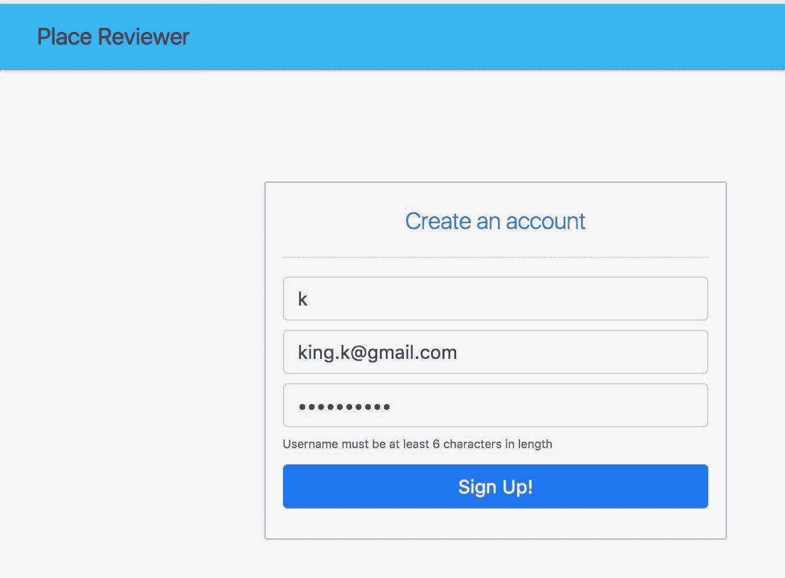

如上图所示，错误被`UserValidator`检测到，并成功绑定到`BindingResult`，然后在视图中适当地显示为错误。请随意输入其他表单输入的无效数据，并确保我们实现的其它验证按预期工作。现在来验证我们的注册逻辑。在用户名、电子邮件和密码字段中输入`king.kevin`、`king.k@gmail.com`和`Kingsman406`，然后点击注册！将创建一个新的账户，并将主页展示给你：

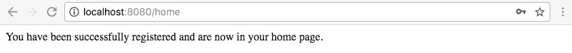

在本章中，我们将对主页进行重大修改，这对你来说可能不会感到惊讶。然而，现在让我们将注意力转向创建一个合适的用户登录页面。

# 实现登录视图

与我们实现用户注册视图的方式类似，首先我们必须处理视图模板。登录视图所需的模板必须包含一个表单，该表单接受要登录的用户名和密码作为输入。我们还必须提供一个按钮，以便用户可以提交登录表单——毕竟，如果表单无法提交，那么它就没有意义。此外，我们必须有一种方法来提醒用户登录过程中可能出现的错误，例如在用户输入无效的用户名和密码组合的情况下。最后，我们应该提供一个链接到账户注册页面，以便登录页面的查看者尚未拥有账户。

在确定了模板中需要实现的内容后，让我们继续创建它。将一个`login.html`文件添加到模板目录中。现在，是时候开始处理模板了。和往常一样，我们首先需要将必要的样式表和脚本包含到模板中。这可以通过以下代码片段完成：

```
<!DOCTYPE html>
<html lang="en" xmlns:th="http://www.thymeleaf.org">
  <head>
    <title>Login</title>
    <link rel="stylesheet" th:href="@{/css/app.css}"/>
    <link rel="stylesheet" 
     href="/webjars/bootstrap/4.0.0-beta.3/css/bootstrap.min.css"/>

    <script src="img/jquery.min.js"></script>
    <script src="img/bootstrap.min.js"></script>
  </head>
  <body>
  </body>
</html>
```

在添加了模板所需的样式和 JavaScript 包含后，我们现在可以开始处理模板的`<body>`部分。正如我们之前所说的，HTML 模板的主体包含在页面加载时将渲染给用户的 DOM 元素。在`login.html`的`<body>`标签内添加以下代码：

```
    <div th:insert="fragments/navbar :: navbar"></div>

    <div class="container-fluid" style="z-index: 2; position: absolute">
      <div class="row mt-5">
        <div class="col-sm-4 col-xs-2"></div>
        <div class="col-sm-4 col-xs-8">
          <form class="form-group col-sm-12 form-vertical form-app" 
           id="form-login" method="post" th:action="@{/login}">
            <div class="col-sm-12 mt-2 lead text-center text-primary">
              Login to your account
            </div>
            <hr>
            <input class="form-control" type="text" name="username" 
             placeholder="Username" required/>
            <input class="form-control mt-2" type="password" 
             name="password" placeholder="Password" required/>
            <span th:if="${param.error}" class="mt-2 text-danger" 
             style="font-size: 10px">
              Invalid username and password combination
            </span>
            <button class="btn btn-primary form-control mt-2 mb-3" 
             type="submit">
              Go!
            </button>
          </form>
          <div class="col-sm-12 text-center" style="font-size: 12px">
            Don't an account? Register <a href="/register">here</a>
          </div>
        </div>
        <div class="col-sm-4 col-xs-2">
          <div th:if="${param.logout}" 
           class="col-sm-12 text-success text-right">
            You have been logged out.
          </div>
        </div>
      </div>
    </div>
```

在添加了主体后，我们创建的 HTML 已经足够描述我们登录页面所需的结构。除了添加必要的表单，我们还添加了之前创建的导航栏片段到页面中——无需编写样板代码。我们还添加了一种方式，用户可以通过它获得有关登录过程中可能出现的错误反馈。这是通过以下几行代码实现的：

```
<span th:if="${param.error}" class="mt-2 text-danger" 
 style="font-size: 10px">
  Invalid username and password combination
</span>
```

当`param.error`被设置时，表示在用户登录过程中发生了错误，因此向用户显示一个无效的用户名和密码组合信息。需要注意的是，登录页面通常是用户与 Web 应用接触的第一个点，也可能是用户在会话期间与该应用的最后一个接触点。这在用户注销的情况下尤其如此。当用户完成与应用的交互并注销后，他们应该被重定向到登录屏幕。由于这种可能性，我们在通知用户他们已被注销的文本中添加了一些内容：

```
<div th:if="${param.logout}" class="col-sm-12 text-success text-right">
  You have been logged out.
</div>
```

在用户成功注销账户后，会显示一个`<div>`标签。在这个时候，理想情况下我们应该实现一个控制器来渲染`login.html`，但如果你记得，我们已经通过使用自定义 Spring MVC 配置以及我们实现的`MvcConfig`类来做到了这一点，具体代码如下：

```
...

override fun addViewControllers(registry: ViewControllerRegistry?) {
  registry?.addViewController("/login")?.setViewName("login")
}

...
```

我们使用`ViewControllerRegistry`实例添加了一个处理`/login`请求的视图控制器，并将要使用的视图设置为刚刚实现的登录模板。构建并运行应用程序以查看新实现的视图。可以通过`http:localhost:5000/login`访问网页：

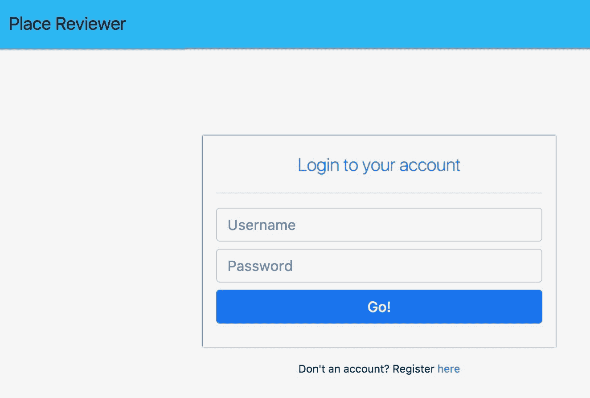

使用无效的用户凭据尝试登录会显示一个友好的错误消息：


另一方面，使用有效的凭据尝试登录将带我们到应用程序的主页。说到主页，我们需要完成其视图层的工作。从现在开始，我们将直接与 Google Places API 进行工作。因此，在继续之前，我们必须设置我们的应用程序以这样做。

# 使用 Google Places API Web 服务设置 Place Reviewer 应用程序

使用 Google Places API 设置 Web 应用程序的过程快速且无痛苦，可以在五分钟内完成。总的来说，设置可以在两个简单步骤中完成：

1.  获取 API 密钥

1.  将 Google Places API 集成到您的 Web 应用程序中

# 获取 API 密钥

通过访问[`developers.google.com/places/web-service/get-api-key`](https://developers.google.com/places/web-service/get-api-key)，滚动到“获取 API 密钥”部分，并点击“GET A KEY”按钮，可以获取一个 API 密钥：

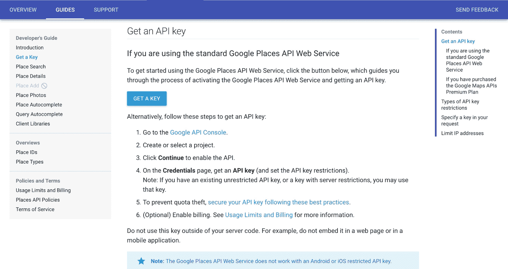

点击按钮后，您将看到一个模态窗口，您可以从中选择或创建一个要集成到 Google Places API Web 服务中的项目。点击下拉菜单并选择“创建新项目”。您将被要求提供项目名称。输入`Place Reviewer`作为项目名称：

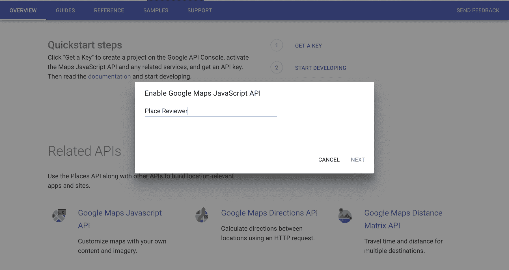

提供项目名称后，点击“下一步”继续。您的项目将配置为使用 API，并将向您展示一个可使用的 API 密钥！

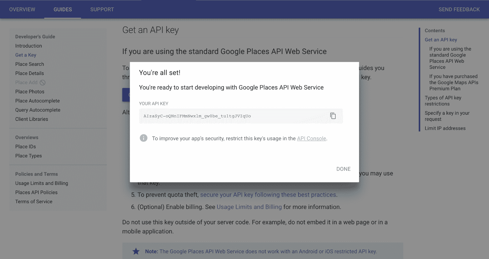

现在我们有了 API 密钥，让我们看看如何使用它。

# 将 Google Places API 集成到您的 Web 应用程序中

利用 Google Places API Web 服务的 API 密钥就像生成 API 密钥一样简单——如果不是更简单的话。要在您的 Web 应用程序中使用生成的 API 密钥，只需在您想要使用 Web 服务的页面标记中包含以下 HTML 行即可：

```
<script type="text/javascript" src="img/js?key={{API_KEY}}&libraries=places"></script>
```

确保将`{{API_KEY}}`替换为您生成的 API 密钥。

# 实现主页视图

如预期的那样，在这个阶段，我们将需要做一些编码工作。按照我们在前几章中遵循的实践，在我们开始编码之前，首先制作一个我们想要创建的视图的裸骨图形草图是明智的。这将通过提供关于我们想要构建的清晰方向，在长期内节省大量时间。

我们希望我们正在创建的首页能够做到以下：

1.  显示平台上发布的最新地点评论

1.  提供直接访问创建审查网页的方式

1.  提供一种用户可以注销其账户的方式

1.  使用地图帮助用户查看已审查地点的确切位置

考虑到所有这些要求，我们可以绘制一个最终模板的粗略草图，看起来像这样：

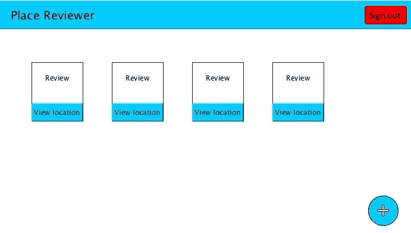

在我们的布局设计中，我们追求的是功能而非闪存。你可以看到，这个草图立即满足了布局要求一至四。点击“查看位置”将向应用程序用户展示一个模态窗口，其中将显示已审查的确切位置的地图。

明确说明了我们将要创建的模板后，让我们开始编码。和往常一样，首先和最重要的是，我们需要将外部样式表和脚本包含到我们的模板中。打开`home.html`并添加以下代码：

```
<!DOCTYPE html>
<html lang="en" xmlns:th="http://www.thymeleaf.org">
  <head>
    <title>Home</title>
    <!-- Addition of external stylesheets -->
    <link rel="stylesheet" th:href="@{/css/app.css}"/>
    <link rel="stylesheet" 
      href="https://cdnjs.cloudflare.com/ajax/libs/toastr.js
            /latest/toastr.min.css">
    <link rel="stylesheet" 
     href="/webjars/bootstrap/4.0.0-beta.3/css/bootstrap.min.css"/>
    <link rel="stylesheet" 
     href="https://maxcdn.bootstrapcdn.com/font-awesome
           /4.7.0/css/font-awesome.min.css"/>
    <link href="https://fastcdn.org/Buttons/2.0.0/css/buttons.css" 
     rel="stylesheet">

    <!-- Inclusion of external Javascript -->
    <script src="img/jquery.min.js"></script>
    <script src="img/toastr.min.js">
    </script>
    <script src="img/popper.min.js">
    </script>
    <script src="img/bootstrap.min.js"></script>
    <script src="img/buttons.js"></script>
    <script type="text/javascript" 
     src="img/>          &libraries=places">
  </head>
</html>
```

很好！除了外部样式表，我们还将在这个模板中使用内部样式。要在 HTML 文件中定义内部样式表，只需在 HTML 的头部添加一个`<style>`标签，并输入你想要的 CSS 规则。将以下样式添加到`home.html`：

```
</script>

    <!-- Definition of internal styles -->
    <style>
      #map {
        height: 400px;
      }

      .container-review {
        background-color: white;
        border-radius: 2px;
        font-family:sans-serif;
        box-shadow: 0 0 1px black;
        border-color: black;
        padding: 0;
        min-width: 250px;
        height: 230px;
      }

      .review-author {
        font-size: 15px
      }

      .review-location {
        font-size: 12px
      }

      .review-title {
        font-size: 13px;
        text-decoration-style: dotted;
        height: calc(20 / 100 * 230px);
      }

      .review-content {
        font-size: 12px;
        height: calc(40 / 100 * 230px);
      }

      .review-header {
        height: calc(20 / 100 * 230px)
      }

      hr {
        margin: 0;
      }

      .review-footer {
        height: calc(20 / 100 * 230px);
      }
    </style>
```

现在，让我们开始处理页面的主体。正如你所知，组成 HTML 模板主体的所有元素都必须存在于一个`<body>`标签中。考虑到这一点，我们可以开始处理`home.html`。首先，将以下 HTML 添加到模板文件中：

```
  <!-- Invokes the showNoReviewNotification() function defined in -->
  <!-- internal Javascript of this file upon document load. -->
  <body 
    th:onload="'javascript:showNoReviewNotification(
      ' + ${reviews.size() == 0} + '
    )'">
  <div th:insert="fragments/navbar :: navbar"></div>
  <div class="container">
    <div class="row mt-5">
      <!-- Creates view containers for each review retrieved -->
      <!-- Distinct <div> containers are created for the -->
      <!-- review author, location, title and body. -->
      <div th:each="review: ${reviews}" 
       class="col-sm-2 container-review mt-4 mr-2">
        <div class="review-header pt-1">
          <div class="col-sm-12 review-author text-success">
            <b th:text="${review.reviewer.username}"></b>
          </div>
          <div th:text="${review.placeName}" 
           class="col-sm-12 review-location">
          </div>
          </div>
          <hr>
          <b>
            <div th:text="${review.title}" 
             class="col-sm-12 review-title pt-1">
            </div>
          </b>
          <hr>
          <div th:text="${review.body}" 
           class="col-sm-12 review-content pt-2">
          </div>
          <div class="review-footer">
            <!-- Creation of distinct DOM 
            <button> elements for the display of reviewed locations. -->
              <!-- Upon button click, the application renders a modal 
               showing the reviewed location on a map -->
              <button class="col-sm-12 button button-small button-primary"
               type="button" data-toggle="modal" data-target="#mapModal" 
               style="height: inherit; border-radius: 2px;" 
               th:onclick="'javascript:showLocation(
                 ' + ${review.latitude} + ',' 
                   + ${review.longitude} + ',\'' 
                   + ${review.placeId} + '\'
               )'">
               <i class="fa fa-map-o" aria-hidden="true"></i>
               View location
             </button>
           </div>
         </div>
       </div>
     </div>
```

干得好！现在不必太担心前面的代码块做了什么。我们将在适当的时候解释一切。继续在`home.html`的主体中添加以下代码行：

```
<!-- Modal creation -->
<div class="modal fade" id="mapModal">
  <div class="modal-dialog modal-lg" role="document">
    <div class="modal-content">
      <div class="modal-header">
        <h5 class="modal-title">Reviewed location</h5>
        <button type="button" class="close" 
         data-dismiss="modal" aria-label="Close">
          <span aria-hidden="true">&times;</span>
        </button>
      </div>
      <div class="modal-body">
        <div class="container-fluid">
          <div id="map"> </div>
        </div>
      </div>
      <div class="modal-footer">
        <button type="button" class="btn btn-primary" 
         data-dismiss="modal">
          Done
        </button>
      </div>
    </div>
  </div>
</div>
```

前面的代码声明了一个模态，其中将包含显示评论创建的确切位置的地图——根据用户的请求。我们还没有完成首页模板。继续在`<body>`中添加以下代码行：

```

<span style="bottom: 20px; right: 20px; position: fixed">
  <form method="get" th:action="@{/create-review}">
    <button class="button button-primary button-circle 
     button-giant navbar-bottom" type="submit">
      <i class="fa fa-plus"></i>
    </button>
  </form>
</span>
```

最后，为 HTML 页面添加内部 JavaScript：

```
     <script>
       //Shows a toast notification to the user when no review is present
       function showNoReviewNotification(show) {
         if (show) {
           toastr.info('No reviews to see');
         }
       }

```

以下函数初始化并显示一个地图，显示撰写评论的位置：

```

function showLocation(latitude, longitude, placeId) {
  var center = new google.maps.LatLng(latitude, longitude);

  var map = new google.maps.Map(document.getElementById('map'), {
    center: center,
    zoom: 15,
    scrollwheel: false
  });
  var service = new google.maps.places.PlacesService(map);

  loadPlaceMarker(service, map, placeId);
}

```

加载地点标记在已审查的位置创建地图标记：

```

     function loadPlaceMarker(service, map, placeId) {
       var request = {
         placeId: placeId
       };

       service.getDetails(request, function (place, status) {
         if (status === google.maps.places.PlacesServiceStatus.OK) {
           new google.maps.Marker({
              map: map,
              title: place.name,
            place: {
              placeId: place.place_id,
              location: place.geometry.location
            }

          })
        }
      });
    }
  </script>
</body>
```

在`home.html`上已经做了很多工作，所以让我们谈谈视图中的具体内容，从`<head>`标签开始。我们从`<head>`标签的第 4 行到第 16 行包含了主页所需的样式表和脚本。包含的 CSS 如下：

```
<link rel="stylesheet" th:href="@{/css/app.css}"/>
<link rel="stylesheet" href="https://cdnjs.cloudflare.com/ajax/libs/toastr.js/latest/toastr.min.css">
<link rel="stylesheet" href="/webjars/bootstrap/4.0.0-beta.3/css/bootstrap.min.css"/>
<link rel="stylesheet" href="https://maxcdn.bootstrapcdn.com/font-awesome/4.7.0/css/font-awesome.min.css"/>
<link href="https://fastcdn.org/Buttons/2.0.0/css/buttons.css" rel="stylesheet">
```

这些是我们应用程序 CSS 的外部样式表包含；Toastr，一个用于创建 JavaScript toast 通知的库；Bootstrap，一个用于设计和开发网站及 Web 应用程序的强大库；**Font Awesome**，一个用于网站和 Web 应用程序的图标工具包；以及按钮，一个功能强大且高度可定制的 Web 和 CSS 按钮库。

在 CSS 包含之后，我们还有一系列外部 JavaScript 包含：

```
<script src="img/jquery.min.js"></script>
<script src="img/toastr.min.js"></script>
<script src="img/popper.min.js"></script>
<script src="img/bootstrap.min.js"></script>
<script src="img/buttons.js"></script>
<script type="text/javascript" src="img/js?key={{API_KEY}}&libraries=places"></script>
```

按照各自的顺序，脚本包含是为了：JQuery，一个专门设计来简化客户端 HTML 脚本过程的 JavaScript 库；Toastr；Popper，一个用于管理 Web 应用程序中 popper 的库；Bootstrap；buttons；以及 Google Places API Web 服务。再次提醒，确保将 `{{API_KEY}}` 替换为 Google Places API Web 服务的 API 密钥——这一点很重要。

在 JavaScript 包含之后，我们定义了一个网页的内部样式表。不幸的是，关于样式表及其创建的解释超出了本书的范围。然而，在业余时间复习 CSS 将是一个好主意。在 `home.html` 的下方，我们添加了如下 `<body>` 标签：

```
<body th:onload="'javascript:showNoReviewNotification(' + ${reviews.size() == 0} + ')'">
```

在这里，`th:onload` 用于指定在页面完全加载后必须运行的 JavaScript。简而言之，它指定了在 `onload` 事件发生后要执行的代码。在这种情况下，要运行的脚本是我们进一步在模板中定义的 JavaScript 函数 `showNoReviewNotification(boolean)`。该函数显示一个 toast 消息，表明当模型提供的评论列表为空时没有可查看的评论。`showNoReviewNotification(boolean)` 如下声明在我们的模板中：

```
function showNoReviewNotification(show) {
  if (show) {
    toastr.info('No reviews to see');
  }
}
```

`showNoReviewNotification(boolean)` 接收一个单一的 `Boolean` 参数 `show`。当 `show` 为真时，向用户渲染一个包含消息 “没有可查看的评论” 的 toast 通知。向用户显示 toast 通知是通过我们正在使用的 Toastr 库实现的。

当有评论可供用户查看时，就会为每个评论项创建一个容器，如下所示：

```
<!-- Creates view containers for each review retrieved -->
<!-- Distinct <div> containers are created for the -->
<!-- review author, location, title and body. -->
<div th:each="review: ${reviews}" class="col-sm-2 container-review mt-4 mr-2">
  <div class="review-header pt-1">
    <div class="col-sm-12 review-author text-success">
      <b th:text="${review.reviewer.username}"></b>
    </div>
    <div th:text="${review.placeName}" class="col-sm-12 review-location">
    </div>
  </div>
  <hr>
  <b>
    <div th:text="${review.title}" class="col-sm-12 review-title pt-1">
    </div>
  </b>
  <hr>
  <div th:text="${review.body}" class="col-sm-12 review-content pt-2">
  </div>
  <div class="review-footer">
    <!-- Creation of distinct DOM <button> elements for the 
     display of reviewed locations. -->
    <!-- Upon button click, the application renders a modal 
     showing the reviewed location on a map -->
    <button class="col-sm-12 button button-small button-primary" 
     type="button" data-toggle="modal" data-target="#mapModal" 
     style="height: inherit; border-radius: 2px;"
     th:onclick="'javascript:showLocation(' 
       + ${review.latitude} + ',' 
       + ${review.longitude} + ',\'' 
       + ${review.placeId} + '\
     ')'">
      <i class="fa fa-map-o" aria-hidden="true"></i>
      View location
    </button>
  </div>
</div>
```

每个评论容器都会显示评论者的用户名、被评论地点的名称、评论标题、评论正文以及一个按钮，允许用户查看被评论的位置。Thymeleaf 的 `th:each` 属性被用来遍历 `reviews` 列表中的每个评论，如下所示：

```
<div th:each="review: ${reviews}" class="col-sm-2 container-review mt-4 mr-2">
```

理解迭代过程的一个好方法是阅读 `th:each="review: ${reviews}"` 如同 “遍历 reviews 列表中的每个评论”。当前正在迭代的评论由 `review` 变量持有。因此，可以像访问任何其他对象一样访问正在迭代的评论所持有的数据。这里就是这种情况：

```
<div th:text="${review.placeName}" class="col-sm-12 review-location"></div>
```

`th:text` 将 `<div>` 中持有的文本设置为 `review.placeName` 分配的值。同时，也需要解释通过何种过程向用户展示位置地图。仔细查看以下代码行：

```
<button class="col-sm-12 button button-small button-primary" type="button"
 data-toggle="modal" data-target="#mapModal" style="height: inherit; 
 border-radius: 2px;"
 th:onclick="'javascript:showLocation(' 
   + ${review.latitude} + ',' 
   + ${review.longitude} + ',\'' 
   + ${review.placeId} + '\
 ')'">
  <i class="fa fa-map-o" aria-hidden="true"></i>
  View location
</button>
```

此代码块定义了一个按钮，当在它上发生点击事件时执行两个操作。首先，它向用户显示一个 ID 为`mapModal`的模态框。其次，它初始化并渲染一个显示已评论的确切位置的地图。地图的渲染是通过我们在模板文件中定义的`showLocation()` JavaScript 函数实现的。

`showLocation()`接受三个参数作为其参数。第一个是经度坐标，第二个是纬度坐标，第三个是已评论位置的唯一标识符——位置 ID。位置 ID 由 Google Places API 提供。首先，`showLocation()`通过利用 Google Places API 的`google.maps.LatLng`类检索提供的定位坐标的中心点。简单来说，`LatLng`是地理坐标中的一个点（经度和纬度）。在检索到中心点后，使用`Map`类（同样由 Google Places API 提供）创建一个新的地图，如以下代码片段所示：

```
var map = new google.maps.Map(document.getElementById('map'), {
  center: center,
  zoom: 15,
  scrollwheel: false
});
```

创建的地图被放置在一个具有 ID `map`的 DOM 容器元素中。在创建必要的地图后，我们使用`loadPlaceMarker()`函数在确切位置创建一个位置标记。`loadPlaceMarker()`函数接受`google.maps.places.PlacesService`、`Map`和位置 ID 作为其三个参数。`PlacesService`是一个具有检索位置信息和搜索位置的方法的类。

`google.maps.places.PlacesService`的实例首先用于检索具有指定位置 ID（已评论的位置）的位置详细信息。如果位置详细信息检索成功，`status === google.maps.places.PlacesServiceStatus.OK`评估为 true，则在地图上放置一个位置标记。标记是通过`google.maps.Marker`类创建的。`Marker()`接受一个可选的选项对象作为其唯一参数。当存在选项对象时，使用指定的选项创建位置标记。在这种情况下，我们在选项对象中指定了一个地图。因此，在创建时，标记被添加到地图上。

最后，我们在模板中添加了一个表单，当提交表单时，它会向`/reviews/new`路径发送一个`GET`请求，并添加了一个按钮，点击该按钮会提交表单。这是在以下代码行中完成的：

```
<form method="get" th:action="@{/reviews/new}">
  <button class="button button-primary button-circle button-giant 
   navbar-bottom" type="submit"><i class="fa fa-plus"></i></button>
</form>
```

关于主页，我们所需做的就这些了，所以请继续检查它！重新构建并运行应用程序，注册一个账户，查看您刚刚创建的主页！


如您所见，平台上尚未创建任何用于查看的评论。我们现在必须制作一个网页，允许创建评论。

# 实现评论创建网页

到目前为止，我们已经创建了用户注册和登录的视图，以及一个供已登录用户浏览平台上发布的评论的主页。现在我们必须着手创建一个视图，以便创建这些评论。一如既往地，首先，在创建视图之前，让我们先工作于一个负责将即将开发的视图渲染给用户的动作。打开`ApplicationController`类，并向其中添加以下方法：

```
@GetMapping("/create-review")
fun createReview(model: Model, principal: Principal): String {
 model.addAttribute("principal", principal) 
 return "create-review"
}
```

`createReview()`动作处理对`/create-review`请求路径的 HTTP `GET`请求，通过向客户端返回一个`create-review.html`模板来渲染。现在，请将`create-review.html`文件添加到项目的`template`目录中。

与我们之前所做的一样，让我们首先在`create-review.html`中添加外部样式和脚本：

```
<!DOCTYPE html>
<html lang="en" xmlns:th="http://www.thymeleaf.org">
  <head>
    <title>New review</title>
    <!-- Addition of external stylesheets -->
    <link rel="stylesheet" th:href="@{/css/app.css}"/>
    <link rel="stylesheet" href="/webjars/bootstrap/4.0.0-beta.3
                                 /css/bootstrap.min.css"/>
    <link rel="stylesheet" href="https://maxcdn.bootstrapcdn.com
                            /font-awesome/4.7.0/css/font-awesome.min.css"/>
    <link href="https://fastcdn.org/Buttons/2.0.0/css/buttons.css"
     rel="stylesheet">

    <!-- Inclusion of external Javascript -->
    <script src="img/jquery.min.js"></script>
    <script src="img/popper.min.js"></script>
    <script src="img/bootstrap.min.js"></script>
    <script src="img/buttons.js"></script>
    <script type="text/javascript" src="img/js?key={{API_KEY}}&libraries=places">
    </script>

```

现在，添加我们网页所需的内部样式表：

```
    <!-- Definition of internal styles -->
    <style>
      #map {
        height: 400px;
      }

      #container-place-data {
        height: 0;
        visibility: hidden;
      }

      #container-place-info {
        font-size: 14px;
      }

      #container-selection-status {
        visibility: hidden;
      }
    </style>
  </head>
```

我们下一步要做的事情是创建必要的表单，以便输入评论数据。在`create-review.html`模板中继续以下代码：

```
<body>
  <div th:insert="fragments/navbar :: navbar"> </div>
  <div class="container-fluid">
    <div class="row">
      <div class="col-sm-12 col-xs-12">
        <!-- Review form creation -->
        <form class="form-group col-sm-12 form-vertical form-app" 
         id="form-login" method="post" th:action="@{/reviews}">
          <div class="col-sm-12 mt-2 lead">Write your review</div>
          <div th:if="${error != null}" class="text-danger" 
           th:text="${error}"> </div>
          <hr>
          <input class="form-control" type="text" name="title" 
           placeholder="Title" th:value="${title}" required/>
          <textarea class="form-control mt-4" rows="13" name="body" 
           placeholder="Review" th:value="${body}" required></textarea>
          <div class="form-group" id="container-place-data">
            <!-- Input fields for location specific form data -->
            <!-- Form input data for the fields below are 
             provided by the Google Places API -->
            <input class="form-control" id="place_address" 
             th:value="${placeAddress}" type="text" name="placeAddress"
             required/>
            <input class="form-control" id="place_name" type="text" 
             name="placeName" th:value="${placeName}" required/>
            <input class="form-control" id="place_id" type="text" 
             name="placeId" th:value="${placeId}" required/>
            <input id="location-lat" type="number" name="latitude" 
             step="any" th:value="${latitude}" required/>
            <input id="location-lng" type="number" name="longitude" 
             step="any" th:value="${longitude}" required/>
          </div>
          <div class="form-group mb-3">
            <button class="button button-pill" type="button" 
             data-toggle="modal" data-target="#mapModal">
              <i class="fa fa-map-marker" aria-hidden="true"></i> 
              Select Location
            </button>
            <button class="button button-pill button-primary">
            Submit Review</button>
            </div>
            <div class="text-success ml-2" id="container-selection-status">
            Location selected</div>
          </form>
        </div>
      </div>
```

现在，让我们添加一个模态框，使用户能够从地图中选择评论位置。目前不必过于担心选择过程的细节。我们稍后会详细讨论：

```
      <!-- Map Modal -->
      <div class="modal fade" id="mapModal">
        <div class="modal-dialog modal-lg" role="document">
          <div class="modal-content">
            <div class="modal-header">
              <h5 class="modal-title">Select place to review</h5>
              <button type="button" class="close" data-dismiss="modal"
               aria-label="Close">
                <span aria-hidden="true">&times;</span>
              </button>
            </div>
            <div class="modal-body">
              <div class="container-fluid">
                <div id="map"> </div>
                  <div class="row mt-2" id="container-place-info">
                    <div class="col-sm-12" id="container-place-name">
                      <b>Place Name:</b>
                    </div>
                    <div class="col-sm-12" id="container-place-address">
                      <b>Place Address:</b>
                    </div>
                  </div>
                </div>
              </div>
              <div class="modal-footer">
                <button type="button" class="btn btn-primary" 
                 data-dismiss="modal">Done</button>
              </div>
            </div>
          </div>
        </div>
      </div>
```

最后，我们通过包含以下代码片段中的内部 JavaScript 来完成模板：

```
      <script>
        // form field reference creation
        var formattedAddressField = document
                            .getElementById('place_address');
        var placeNameField = document.getElementById('place_name');
        var placeIdField = document.getElementById('place_id');
        var latitudeField = document.getElementById('location-lat');
        var longitudeField = document.getElementById('location-lng');

        // container reference creation
        var containerPlaceName = document.getElementById
                                 ('container-place-name');
        var containerPlaceAddress = document.getElementById
                                 ('container-place-address');
        var containerSelectionStatus = document.getElementById
                                 ('container-selection-status');
```

在前面的代码片段中，我们创建了页面中存在的关键 DOM 元素的引用。这些引用包括对特定地点输入字段的引用（地址、名称、ID 以及地点的经纬度坐标字段）。此外，我们还添加了显示所选地点详细信息的容器引用，例如地点名称和地点地址。在此阶段，我们将声明几个函数。这些函数是`initialize()`、`getPlaceDetailsById()`、`updateViewData()`、`setFormValues()`、`showSelectionsStatusContainer()`和`setContainerText()`。

首先，将这里显示的`initialize()`和`getPlaceDetailsById()`函数添加到模板中：

```
        //invoked to initialize Google map
        function initialize() {

          navigator.geolocation.getCurrentPosition(function(location) {
            var latitude = location.coords.latitude;
            var longitude = location.coords.longitude;

            var center = new google.maps.LatLng(latitude, longitude);

            var map = new google.maps.Map(document.getElementById('map'), {
              center: center,
              zoom: 15,
              scrollwheel: false
            });

            var service = new google.maps.places.PlacesService(map);

            map.addListener('click', function(data) {
              getPlaceDetailsById(service, data.placeId);
            });
          });

        }

```

我们添加了以下函数，以便从调用的 Google Places API 中获取特定地点的详细信息：

```

        function getPlaceDetailsById(service, placeId) {
          var request = {
            placeId: placeId
          };

          service.getDetails(request, function (place, status) {
            if (status === google.maps.places.PlacesServiceStatus.OK) {
              updateViewData(place)
            }
          });
        }
```

现在，添加`updateView()`和`setFormValues()`，如下所示：

```
        //Invoked to update view information
        function updateViewData(place) {
          setFormValues(
            place.formatted_address,
            place.name,
            place.place_id,
            place.geometry.location.lat(),
            place.geometry.location.lng()
          );

          setContainerText('<b>Place Name: </b>' + place.name,
            '<b>Place Address: </b>' + place.formatted_address);

          showSelectionStatusContainer();
        }    
```

以下函数被调用以更新视图表单数据：

```

        function setFormValues(formattedAddress, placeName, placeId,
                               latitude, longitude) {
          formattedAddressField.value = formattedAddress;
          placeNameField.value = placeName;
          placeIdField.value = placeId;
          latitudeField.value = latitude;
          longitudeField.value = longitude;
        }
```

最后，通过添加以下代码来完成模板：

```
        function showSelectionStatusContainer() {
          containerSelectionStatus.style.visibility = 'visible'
        }

        function setContainerText(placeNameText, placeAddressText) {
          containerPlaceName.innerHTML = placeNameText;
          containerPlaceAddress.innerHTML = placeAddressText;
        } 

        // Initializes map upon window load completion
        google.maps.event.addDomListener(window, 'load', initialize);
    </script>
  </body>
</html>
```

与之前的模板类似，我们以添加模板在 HTML `<head>`标签中所需的内外部 CSS 和 JavaScript 开始`create-review.html`。在模板的进一步部分，我们创建了一个表单，它接受以下表单数据作为输入：

+   `title`: 用户为创建的评论定义的标题。

+   `body`: 评论的主体。这是主要的评论文本。

+   `placeAddress`: 被评论地点的地址。

+   `placeName`: 被评论地点的名称。

+   `placeId`: 被评论地点的唯一 ID。

+   `latitude`：被评论地点的纬度。

+   `longitude`：被评论地点的经度。

用户无需为`placeAddress`、`placeName`、`placeId`、`latitude`和`longitude`提供表单输入。因此，我们已经隐藏了上述输入元素的父`<div>`。我们将利用 Google Places API 来检索特定地点的信息。请确保注意，在模板中我们使用模态来显示用于位置选择的地图。该模态可以通过我们在模板中添加的`button`切换，如下所示：

```
<button class="button button-pill" type="button" data-toggle="modal" data-target="#mapModal">
  <i class="fa fa-map-marker" aria-hidden="true"></i> Select Location
</button>
```

点击按钮将向用户显示地图模态。在渲染地图后，用户可以从地图上点击他们想要的评论位置。执行此类点击操作将触发地图的点击事件，然后由我们在模板中定义的监听器处理，如下所示：

```
map.addListener('click', function(data) {
  getPlaceDetailsById(service, data.placeId);
});
```

`getPlacesDetailsById()`接受两个参数：一个`google.maps.places.PlacesService`的实例和要检索信息的地点的 ID。然后使用`PlacesService`实例检索地点信息。在信息检索之后，视图将相应地更新检索到的信息：设置特定地点的表单数据，更新地图模态中的地点名称和地址容器，并向用户显示一个表示已成功选择位置的消息。在选择了位置并输入所有必要表单数据后，用户可以提交他们的评论。

我们几乎准备好尝试评论创建页面了。在我们这样做之前，我们必须创建一个评论验证器，以及一个处理发送到`/reviews`路径的`POST`请求的控制器操作。让我们从`ReviewValidator`开始。将以下`ReviewValidator`类添加到`com.example.placereviewer.component`中：

```
package com.example.placereviewer.component

import com.example.placereviewer.data.model.Review
import org.springframework.stereotype.Component
import org.springframework.validation.Errors
import org.springframework.validation.ValidationUtils
import org.springframework.validation.Validator

@Component
class ReviewValidator: Validator {

  override fun supports(aClass: Class<*>?): Boolean {
    return Review::class == aClass
  }

  override fun validate(obj: Any?, errors: Errors) {
    val review = obj as Review

    ValidationUtils.rejectIfEmptyOrWhitespace(errors, "title",
                         "Empty.reviewForm.title", "Title cannot be empty")
    ValidationUtils.rejectIfEmptyOrWhitespace(errors, "body", 
                         "Empty.reviewForm.body", "Body cannot be empty")
    ValidationUtils.rejectIfEmptyOrWhitespace(errors, "placeName",
                         "Empty.reviewForm.placeName")
    ValidationUtils.rejectIfEmptyOrWhitespace(errors, "placeAddress", 
                         "Empty.reviewForm.placeAddress")
    ValidationUtils.rejectIfEmptyOrWhitespace(errors, "placeId",
                         "Empty.reviewForm.placeId")
    ValidationUtils.rejectIfEmptyOrWhitespace(errors, "latitude", 
                         "Empty.reviewForm.latitude")
    ValidationUtils.rejectIfEmptyOrWhitespace(errors, "longitude",
                         "Empty.reviewForm.longitude")

    if (review.title.length < 5) {
      errors.rejectValue("title", "Length.reviewForm.title",
                         "Title must be at least 5 characters long")
    }

    if (review.body.length < 5) {
      errors.rejectValue("body", "Length.reviewForm.body",
                         "Body must be at least 5 characters long")
    }
  }
}
```

如我们之前解释过的自定义验证器的运作方式，这里就没有太多必要解释这个验证器是如何工作的了。不耽误时间，让我们来实现一个控制器类，用于处理与评论相关的 HTTP 请求。在`com.example.placereviewer.controller`中创建一个`ReviewController`类，并向其中添加以下代码：

```
package com.example.placereviewer.controller

import com.example.placereviewer.component.ReviewValidator
import com.example.placereviewer.data.model.Review
import com.example.placereviewer.service.ReviewService
import org.springframework.stereotype.Controller
import org.springframework.ui.Model
import org.springframework.validation.BindingResult
import org.springframework.web.bind.annotation.ModelAttribute
import org.springframework.web.bind.annotation.PostMapping
import org.springframework.web.bind.annotation.RequestMapping
import javax.servlet.http.HttpServletRequest

@Controller
@RequestMapping("/reviews")
class ReviewController(val reviewValidator: ReviewValidator, 
                       val reviewService: ReviewService) {

  @PostMapping
  fun create(@ModelAttribute reviewForm: Review, bindingResult: BindingResult,
             model: Model, request: HttpServletRequest): String {
    reviewValidator.validate(reviewForm, bindingResult)

    if (!bindingResult.hasErrors()) {
      val res = reviewService.createReview(request.userPrincipal.name,
                                            reviewForm)

      if (res) {
        return "redirect:/home"
      }
    }

    with (model) {
      addAttribute("error", bindingResult.allErrors.first().defaultMessage)
      addAttribute("title", reviewForm.title)
      addAttribute("body", reviewForm.body)
      addAttribute("placeName", reviewForm.placeName)
      addAttribute("placeAddress", reviewForm.placeAddress)
      addAttribute("placeId", reviewForm.placeId)
      addAttribute("longitude", reviewForm.longitude)
      addAttribute("latitude", reviewForm.latitude)
    }

    return "create-review"
  }
}
```

添加了`ReviewValidator`和`ReviewController`类之后，构建并运行项目，以用户身份登录，并从您喜欢的浏览器导航到`http://localhost:5000/create-review`。

页面加载时，您将看到一个表单，您可以使用它来添加新的评论：

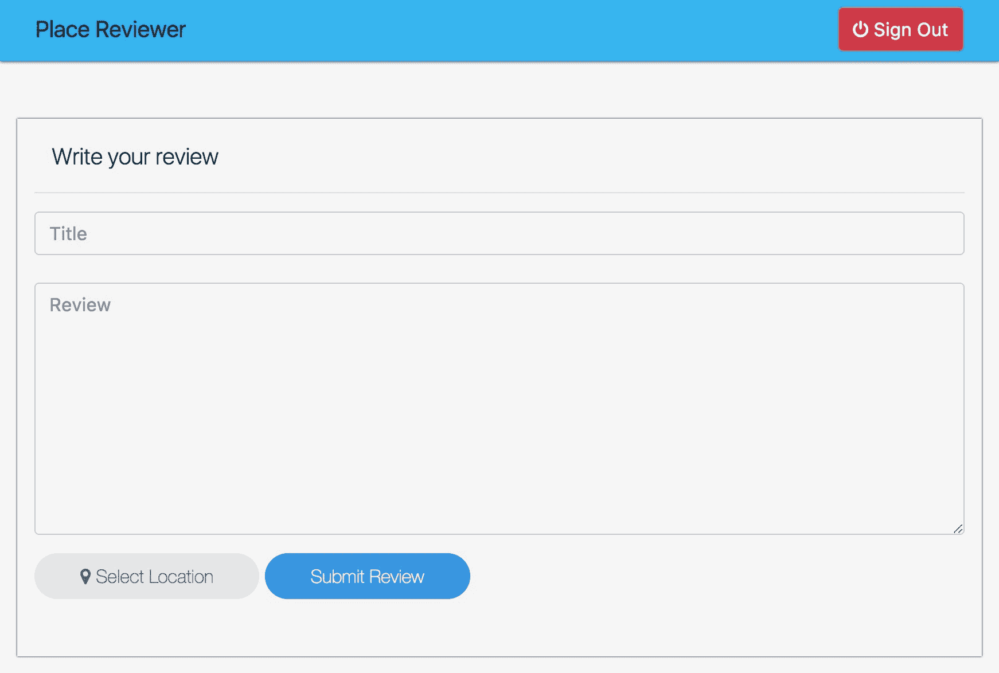

用户在提交评论之前必须选择评论位置。要选择评论位置，请点击“选择位置”按钮：

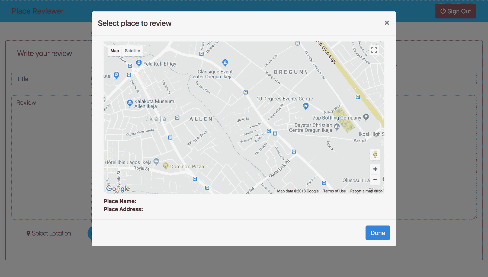

点击“选择位置”按钮将向用户展示一个包含地图的模态窗口，用户可以从中选择他们想要评论的位置。点击地图上的位置将在地图上弹出一个信息窗口，包含有关点击位置的数据。此外，用于保存所选地点名称和地址的模态容器也将被更新：

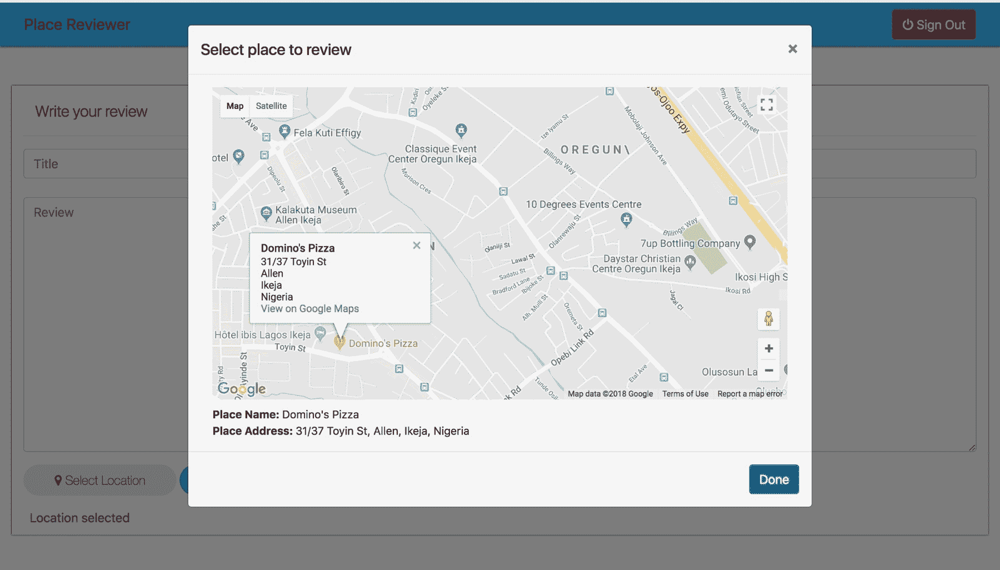

用户选择他们偏好的评论位置后，可以通过点击“完成”来关闭模态窗口，并继续填写他们的评论标题和正文：

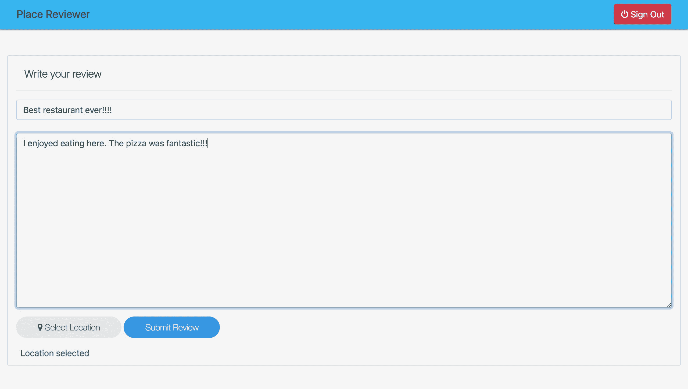

注意，评论表单现在显示已成功选择评论位置。一旦用户填写了所有必要的评论信息，他们可以通过点击“提交评论”来提交评论：

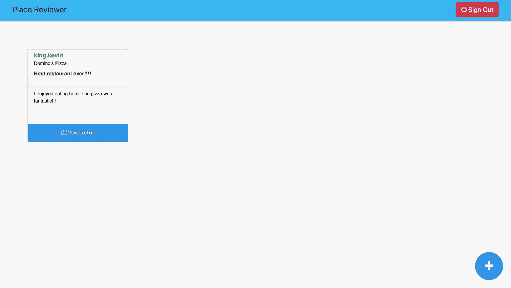

在评论提交后，用户将被重定向到他们的主页，在那里他们现在可以看到他们提交的评论。点击主页上显示的任何评论的“查看位置”按钮将显示一个包含显示评论确切位置的地图的模态窗口：

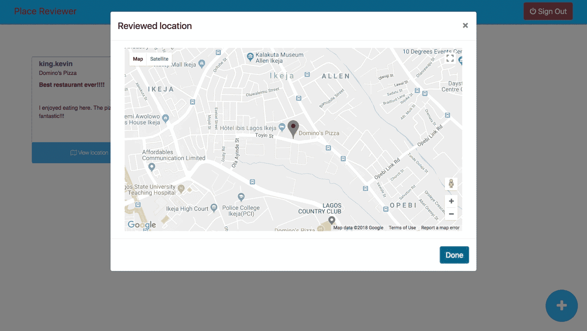

展示给用户的地图上有一个标记，指示评论者评论的确切位置。

在此阶段，我们已经完成了“地点评论者”应用的核心功能。在我们结束这一章之前，让我们探讨如何测试 Spring 应用程序。

# Spring 应用程序测试

在本书的早期，我们讨论了应用程序测试及其在创建可靠软件中的必要性。现在我们必须探索测试 Spring 应用程序的过程。Spring 应用程序可以通过四个简单的步骤进行测试：

1.  向项目中添加必要的测试依赖项

1.  创建配置类

1.  配置测试类以使用自定义配置

1.  编写必要的测试

我们将逐一查看这些步骤。

# 向项目中添加必要的测试依赖项

这涉及到在项目中包含合适的测试依赖项。打开“地点评论者”项目的`pom.xml`文件，并添加以下依赖项：

```
<dependency>
  <groupId>junit</groupId>
  <artifactId>junit</artifactId>
  <version>4.12</version>
  <scope>test</scope>
  <exclusions>
    <exclusion>
      <groupId>org.hamcrest</groupId>
      <artifactId>hamcrest-core</artifactId>
    </exclusion>
  </exclusions>
</dependency>
<dependency>
  <groupId>org.hamcrest</groupId>
  <artifactId>hamcrest-library</artifactId>
  <version>1.3</version>
  <scope>test</scope>
</dependency>
```

在接下来的章节中，我们将学习如何使用 JUnit 和 Hamcrest 编写测试。JUnit 是 Java 编程语言的测试框架，Hamcrest 是一个提供匹配器的库，这些匹配器可以组合起来创建有意义的意图表达式。

# 创建配置类

创建测试配置类有助于正确运行编写的测试。在“地点评论者”项目的`src/test/kotlin`目录中，向`com.example.placereviewer`添加一个`config`包。将以下`TestConfig`类添加到创建的包中：

```
package com.example.placereviewer.config

import org.springframework.context.annotation.ComponentScan
import org.springframework.context.annotation.Configuration

@Configuration
@ComponentScan(basePackages = ["com.example.placereviewer"])
class TestConfig
```

# 配置测试类以使用自定义配置

要这样做，打开 Spring 应用程序的测试类，并使用 `@ContextConfiguration` 注解来指定测试类将使用的配置类。打开 `PlaceReviewerApplicationTests.kt`（位于你项目 `src/test/kotlin` 目录下的 `com.example.placereviewer` 包中）。现在，将其配置类设置为以下内容：

```
package com.example.placereviewer

import com.example.placereviewer.config.TestConfig
import org.junit.runner.RunWith
import org.springframework.boot.test.context.SpringBootTest
import org.springframework.test.context.ContextConfiguration
import org.springframework.test.context.junit4.SpringRunner

@RunWith(SpringRunner::class)
@SpringBootTest
@ContextConfiguration(classes = [TestConfig::class])
class PlaceReviewerApplicationTests
```

干得好！你现在可以开始编写一些应用程序测试了。

# 编写你的第一个测试

为应用程序测试编写代码就像为 Spring 应用程序的任何其他部分编写代码一样。你可以像在其他任何部分一样使用组件和服务。让我们来演示这一点，好吗？

将以下 `TestUserService` 接口添加到 `com.example.placereviewer.service`：

```
package com.example.placereviewer.service

import com.example.placereviewer.data.model.User

interface TestUserService {
  fun getUser(): User
}
```

现在，将以下 `TestUserServiceImpl` 类添加到包中：

```
package com.example.placereviewer.service

import com.example.placereviewer.data.model.User
import org.springframework.stereotype.Service

@Service
internal class TestUserServiceImpl : TestUserService {

  //Test stub mimicking user retrieval
  override fun getUser(): User {
    return User(
      "user@gmaiil.com",
      "test.user",
      "password"
    )
  }
}
```

返回到 `PlaceReviewerApplicationTests.kt` 文件，并修改它以反映这些更改：

```
package com.example.placereviewer

import com.example.placereviewer.config.TestConfig
import com.example.placereviewer.data.model.User
import com.example.placereviewer.service.TestUserService
import org.hamcrest.Matchers.instanceOf
import org.hamcrest.MatcherAssert.assertThat
import org.junit.Test
import org.junit.runner.RunWith
import org.springframework.beans.factory.annotation.Autowired
import org.springframework.boot.test.context.SpringBootTest
import org.springframework.test.context.ContextConfiguration
import org.springframework.test.context.junit4.SpringRunner

@RunWith(SpringRunner::class)
@SpringBootTest
@ContextConfiguration(classes = [TestConfig::class])
class PlaceReviewerApplicationTests {

  @Autowired
  lateinit var userService: TestUserService

  @Test
  fun testUserRetrieval() {
    val user = userService.getUser()

    assertThat(user, instanceOf(User::class.java))
  }
}
```

`testUserRetrieval()` 方法是一个测试，当运行时，会使用我们在 `TestUserServiceImpl` 中定义的存根方法来检索一个用户，并断言该函数返回的对象是 `User` 类的实例。

要运行编写的测试，请点击 IDE 窗口中创建的测试右侧的“运行测试”按钮：

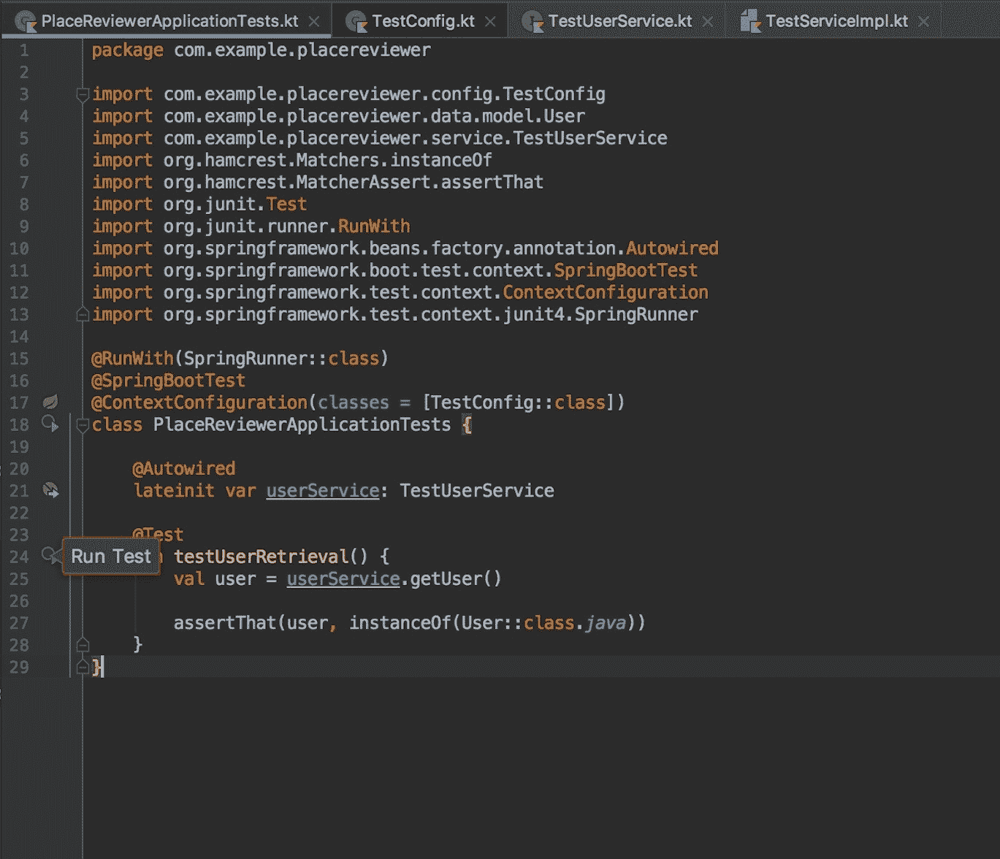

`testUserRetrieval` 将会被执行，并且测试运行的结果将在 IDE 窗口的底部显示：

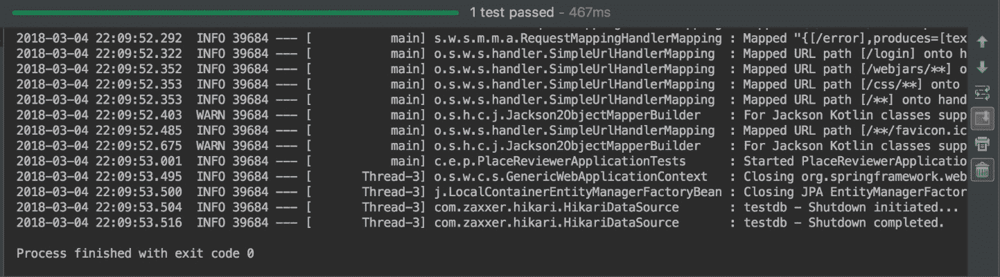

在这种情况下，我们编写的测试通过了。这是一个非常好的事情。然而，随着你开发更大、更复杂的应用程序并为应用程序模块编写测试，你将发现，很多时候编写的测试会失败。当这种情况发生时，不要烦恼；只需保持冷静并调试你的应用程序。随着时间的推移，你会学会创建更可靠的软件。

# 摘要

在这一章中，我们通过完成 *Place Reviewer* 应用程序来结束了 Kotlin 的旅程。在这个过程中，我们深入探讨了基于 Spring MVC 的应用程序视图层的创建。此外，我们学习了如何将应用程序与 Google Places API Web 服务集成，目的是使应用程序具有位置感知能力。

此外，我们在 `Validator` 类和 `BindingResult` 的帮助下学习了表单输入验证。最后，我们介绍了如何为基于 Spring 的应用程序配置测试并编写测试。
