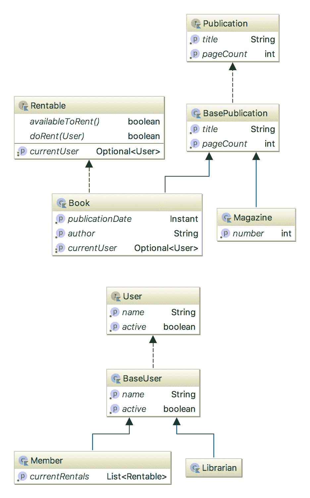
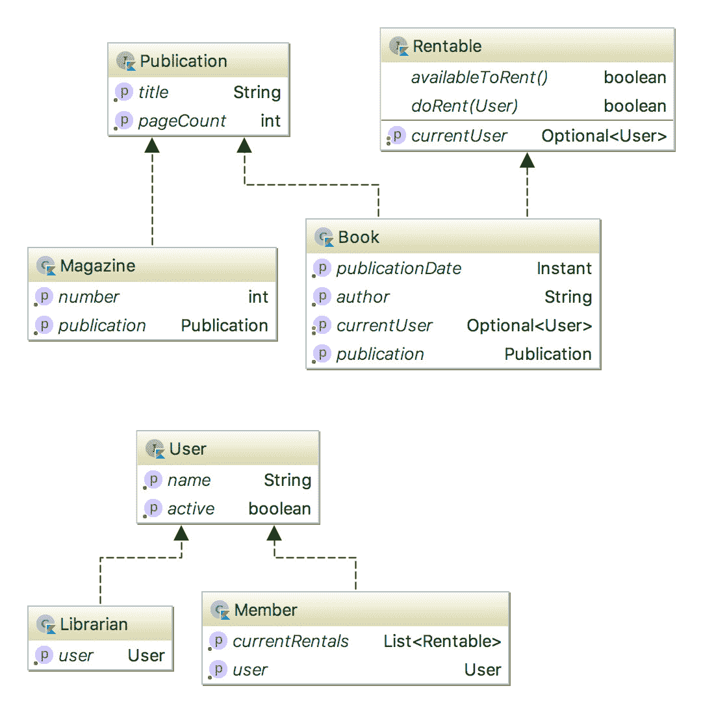

# 第五章：精美的设计模式采用 Kotlin 概念

在本章中，我们将涵盖以下食谱：

+   实现策略模式

+   探索委托模式的强大功能

+   实现委托类属性

+   使用观察者模式跟踪状态

+   使用可撤销委托限制属性更新

+   通过定义自定义属性委托实现高级观察者模式

+   使用 Lazy 委托

+   智能方式实现构建器

# 简介

以下章节将介绍适用于各种编程问题的流行通用设计模式。以下食谱专注于利用 Kotlin 内置的语言支持来实现特定概念和模式。除了基本设计模式，如策略或构建器之外，该章节将重点介绍在多种应用程序和场景中不同用途的委托。一旦你熟悉了本章中介绍的概念，你将能够在设计和开发优雅且可靠系统时利用语言内置的功能。

# 实现策略模式

策略设计模式用于提供一组可互换的策略，这些策略可以应用于给定的输入并返回特定类型的输出。我们可以将策略的概念理解为可以应用于输入的动作或算法。负责处理输入的机制应该能够在运行时在提供的策略之间切换。为了说明策略模式，我们将实现一个文本格式化机制，允许我们对输入文本进行转换并将其打印到控制台。我们将实现一个名为`Printer`的类，它将为打印文本到控制台提供一个`printText(text: String)`函数。在将文本打印到控制台之前，`Printer`类将根据所选的文本格式化策略对给定的`text`参数进行转换。

# 如何做到这一点...

1.  实现`Printer`类：

```java
class Printer(val textFormattingStrategy: (String) -> String) {
    fun printText(text: String) {
        val processedText = textFormattingStrategy(text)
        println(processedText)
    }
}
```

1.  添加示例策略：

```java
val lowerCaseFormattingStrategy: (String) -> String = {
    it.toLowerCase()
}

val upperCaseFormattingStrategy: (String) -> String = {
    it.toUpperCase()
}
```

# 它是如何工作的...

让我们先测试一下我们的`Printer`类在实际操作中的工作情况。首先，声明两个`Printer`类的实例——第一个实例使用`lowerCaseFormattingStrategy`作为`textFormattingStrategy`属性的值，第二个实例使用`upperCaseFormattingStrategy`：

```java
val lowerCasePrinter = Printer(lowerCaseFormattingStrategy)
val upperCasePrinter = Printer(upperCaseFormattingStrategy)
```

接下来，让我们使用它们来格式化和显示以下文本：

```java
val text = "This functional-style Strategy pattern looks tasty!"

lowerCasePrinter.printText(text)
upperCasePrinter.printText(text)
```

以下输出将打印到控制台：

```java
this functional-style strategy pattern looks tasty!
THIS FUNCTIONAL-STYLE STRATEGY PATTERN LOOKS TASTY!
```

`Printer.textFormattingStrategy`属性是一个函数，它接受一个`String`类型的单个参数，并返回一个`String`类型的输出。它在`printText(text: String)`函数内部使用`text`参数调用，并且其输出由该函数返回。

# 还有更多...

你可以通过实现自己的文本格式化策略来练习。尝试实现一个新的文本格式化策略，称为`capitalizeFormattingStrategy`，它将负责将输入文本的首字母大写。完成后，创建一个新的策略，由之前实现的两个策略——`lowerCaseFormattingStrategy`和`capitalizeFormattingStrategy`——组合而成。你可以参考第三章中的*函数组合*配方，*用 Kotlin 函数式编程特性塑造代码*来了解更多关于组合函数的通用方法。

# 参见

+   如果你不太熟悉用于声明`Printer.textFormattingStrategy`属性的更高阶函数的概念，你可以探索第三章中的*使用高阶函数工作*配方，*用 Kotlin 函数式编程特性塑造代码*。

# 探索委托模式的强大功能

委托模式是典型类继承的一个很好的替代方案。委托允许一个类从另一个类派生或实现一个接口。然而，在底层，派生类不是基类的子类，而是使用组合来提供基类的属性给派生类。每当对基类部分的属性发出请求时，它会被重定向到委托对象。这类似于子类将请求委派给父类。然而，委托不仅允许我们实现与继承相同的代码重用性，而且它还更加强大和可定制。Kotlin 通过提供使用`by`关键字声明委托的内置支持，使得委托模式更加引人注目。

在这个配方中，我们将实现一个组合依赖类，模拟一个简单的图书管理系统。我们将编写一个 UML 类图的代码，该类图描述了一组使用继承的依赖类。然而，我们将使用委托模式而不是任何继承出现。

# 准备工作

我们将使用委托模式而不是继承来实现以下类集：



在这个类图中，你可以看到两个基类，它们从`BasePublication`类派生，该类有`Book`和`Magazine`子类，以及`BaseUser`类，它被`Member`和`Librarian`子类扩展。请注意，这些基类正在实现声明其属性的相应接口。`BaseUser`类实现了`User`接口，而`BasePublication`类实现了`Publication`接口。还有一个`Rental`接口，它声明了由`Book`子类实现的方法。

为了使用语言内置的语言特性来实现委托，我们将直接操作接口并移除任何现有的继承。我们不会扩展 `BaseUser` 和 `BasePublication` 基类，而是将它们用作最终 `User`、`Librarian`、`Book` 和 `Magazine` 类的属性，如下面的图所示：



# 如何做到这一点...

1.  声明实现 `Publication` 接口的 `Magazine` 类：

```java
class Magazine(val number: Int,
               title: String,
               pageCount: Int) : Publication
```

1.  将 `Publication` 接口委托给 `Publication` 类型的类属性：

```java
class Magazine(val number: Int,
               val publication: Publication) :
        Publication by publication
```

1.  实现 `Rentable` 接口：

```java
interface Rentable {
    var currentUser: Optional<User>

    fun availableToRent() = !currentUser.isPresent

    fun doRent(user: User): Boolean {
        return if (availableToRent()) {
            currentUser = Optional.of(user)
            true
        } else {
            false
        }
    }
}
```

1.  实现 `Book` 类，将其 `Publication` 接口功能委托给类成员：

```java
class Book(val publicationDate: Instant,
           val author: String,
           val publication: Publication) :
        Publication by publication, Rentable {

    override var currentUser: Optional<User> = Optional.empty()
}
```

1.  实现 `Member` 和 `Librarian` 类，实现 `User` 接口并将其委托给它们的类属性：

```java
class Member(val currentRentals: List<Rentable>,
             name: String,
             isActive: Boolean,
             user: User) : User by user

class Librarian(user: User) : User by user
```

# 它是如何工作的...

使用 `by` 关键字，我们将 `User` 和 `Publication` 接口的实现委托给作为类成员定义的专用对象。在 `Book` 和 `Magazine` 类的情况下，`Publication` 接口的责任被委托给 `publication: Publication` 类属性，而在 `Member` 和 `Librarian` 类的情况下，`User` 接口的责任被委托给 `user: User` 属性。

现在，让我们探索如何使用委托类型。让我们首先创建一个 `Book` 类的实例。我们通过重用原始的 `BasePublication` 类声明提供了一个 `Book.publication` 属性，其类型为 `Publication`：

```java
class BasePublication(override val title: String, 
                      override val pageCount: Int): Publication
```

注意，我们能够直接从 `Book` 类实例访问 `Publication` 接口的所有公共成员。对这些 `Publication` 接口属性的任何请求都被重定向到 `Book` 类的 `val publication` 属性：

```java
val book = Book(Instant.now(), "Sam", 
        BasePublication("Kotlin Standard Library Cookbook",
         Integer.MAX_VALUE))

println("${book.title} written by ${book.author} has ${book.pageCount} pages.")
```

在结果中，前面的代码应该在控制台输出以下内容：

```java
Kotlin Standard Library Cookbook written by Sam has 2147483647 pages.
```

# 参见

+   另一种优秀的委托设计模式与委托类属性相关。你可以在 *实现委托类属性* 章节中了解更多信息。

# 实现委托类属性

Kotlin 中的类属性不仅仅是普通的类字段。Kotlin 属性的关键特性是它们的值由自动生成的访问器函数指定。Kotlin 中的每个类属性都有一组专用的访问器函数可用。默认情况下，Kotlin 编译器会生成一个字段来存储属性的值及其 getter 或 setter。每个不可变的`val`属性都有一个相应的`get()`函数，而用`var`关键字声明的可变属性除了`get()`函数外，还有一个`set()`函数。我们还可以覆盖访问器函数的默认实现，这使得属性高度可定制且功能强大。例如，我们可以覆盖属性的`get()`函数并提供一个自定义实现，这样就可以阻止编译器在字段中存储属性的值。此外，属性由其访问器函数表示而不是由字段值表示，这使得*属性委托*成为可能。属性委托的基本用例包括：

+   实现惰性属性——仅在首次访问时计算其值的属性

+   可观察属性——监听器会在属性发生变化时收到通知

+   将属性存储在映射中，而不是为每个属性单独存储一个字段

在这个菜谱中，我们将学习如何创建一个函数，通过委托其属性以存储在映射中来轻松地将类实例序列化为 JSON 格式。

# 准备工作

类似于接口委托，类属性委托是通过以下方式使用`by`关键字实现的：

```java
class MyClass {
    var property: String by MyDelegate
}
```

被委托的对象应实现以下接口之一——来自`kotlin.properties`包的`ReadWriteProperty`或`ReadOnlyProperty`。这些接口公开了`getValue()`和`setValue()`函数，它们为属性提供值。

我们将使用`Gson`库将对象转换为它们的 JSON 格式表示。这是一个广泛使用的 Java 库，用于处理 JSON 格式的对象。您可以在其 GitHub 网站上了解更多关于该库的信息（[`github.com/google/gson`](https://github.com/google/gson)）。如果您使用 Gradle 构建工具，您需要将 Gson 工件添加到项目依赖项中：

```java
dependencies {
    implementation 'com.google.code.gson:gson:2.8.4'
}
```

# 如何实现...

1.  实现包含`Map<String, Any>`类型数据属性的`Client`类：

```java
data class Client(private val data: Map<String, Any>)
```

1.  实现以下`CreditCard`类：

```java
data class CreditCard(val holderName: String,
                      val number: String,
                      val cvcCode: String,
                      val expiration: Long)
```

1.  将`name`、`email`和`creditCards`属性添加到`Client`类中，并将它们委托给`data`属性：

```java
data class Client(private val data: Map<String, Any>) {
    val name: String by data
    val email: String by data
    val creditCards: List<CreditCard> by data
}
```

1.  实现成员函数`toJson(): String`，允许我们将`Client`类型对象序列化为 JSON 格式，以及负责相反操作的实用函数`fromJson(json: String): Client`：

```java
data class Client(private val data: Map<String, Any>) {
    val name: String by data
    val email: String by data
    val creditCards: List<CreditCard> by data

    /**
     * Function for serializing instance of Client class into
       JSON format
     */
    fun toJson(): String = gson.toJson(data)

    companion object {
        private val gson = Gson()

        /**
         * Utility function for instantiating Client class from
           JSON string
         */
        fun fromJson(json: String): Client {
            val mapType = object : TypeToken<Map<String,
             Any>>() {}.type
            val data: Map<String, Any> = gson.fromJson(json,
             mapType)
            return Client(data)
        }
    }
}
```

# 它是如何工作的...

类属性可以被委派给一个 `Map` 或 `MutableMap` 实例，该实例包含 `String` 类型的键和 `Any` 类型的值。映射的键对应于类属性的名称，与它们关联的映射值存储属性值。委派给映射的映射将在委派属性更新时动态更新。

让我们看看如何利用这个菜谱中实现的 `Client` 类。我们可以通过将 `Map` 实例传递给类构造函数来实例化 `Client` 类：

```java
val SAMPLE_CLIENT_MAP = mapOf("name" to "Mark Zuck",
        "email" to "mark@fb.com",
        "creditCards" to listOf(
                CreditCard("Mark Zuckerberg", "123345456789", "123",
                 1527330705017),
                CreditCard("Mark Zuckerberg", "987654321", "321",
                 1527330719816))
)
val client1 = Client(SAMPLE_CLIENT_MAP)
```

我们还可以使用 `fromJson()` 函数实例化 `Client` 类，传递一个包含样本 `Client` 类型对象 JSON 表示的字符串：

```java
@Language("JSON")
const val SAMPLE_CLIENT_JSON =
        "{\n  \"name\": \"Mark Zuck\",
          \n  \"email\": \"mark@fb.com\",
          \n  \"creditCards\": [
          \n    {
          \n      \"holderName\": \"Mark Zuckerber\",
          \n      \"number\": \"123345456789\",
          \n      \"cvc\": \"123\",
          \n      \"expiration\": 1527330705017
          \n    },
          \n    {
          \n      \"holderName\": \"Mark Zuckerber\",
          \n      \"number\": \"987654321\",
          \n      \"cvc\": \"321\",
          \n      \"expiration\": 1527330719816
          \n    }
          \n  ]
          \n}"
val client2 = Client.fromJson(SAMPLE_CLIENT_JSON)
```

如果你正在使用 IntelliJ IDE，你可以使用一个酷炫的*语言注入*功能，该功能允许我们将另一个语言的代码片段作为字符串类型注入，并提供对特定语言语法进行编辑和格式化的支持。你可以用它来将 JSON 片段注入为 Kotlin 字符串。你可以在官方 JetBrains 教程中了解更多信息（[`www.jetbrains.com/help/idea/using-language-injections.html`](https://www.jetbrains.com/help/idea/using-language-injections.html)）。

在底层，`Client.fromJson()` 函数使用 Gson 将 JSON 数据转换为 `Map<String, Any>` 实例。

我们现在可以测试这两种方法，并将 `client1` 和 `client2` 对象的内容打印到控制台：

```java
println("name: ${client1.name}, mail: ${client1.email}, cards: ${client1.creditCards}")
println("name: ${client2.name}, email: ${client2.email}, cards: ${client2.creditCards}")
```

作为结果，我们将得到以下输出打印到控制台：

```java
name: Mark Zuck, email: mark@fb.com, cards: [{holderName=Mark Zuckerber, number=123345456789, cvc=123, expiration=1.527330705017E12}, {holderName=Mark Zuckerber, number=987654321, cvc=321, expiration=1.527330719816E12}]

name: Mark Zuck, email: mark@fb.com, cards: [CreditCard(holderName=Mark Zuckerberg, number=123345456789, cvcCode=123, expiration=1527330705017), CreditCard(holderName=Mark Zuckerberg, number=987654321, cvcCode=321, expiration=1527330719816)]
```

在这两种情况下，无论选择哪种方式实例化 `Client` 类，所有类属性都存储在 `data` 映射对象中。将属性委派给映射允许我们实现一个机制，自动将 `Client` 对象的状态导出到映射中。映射对象在 `Client` 类中内部存储，但也可以在别处声明。

# 更多内容...

在这个菜谱中，我们创建了包含不可变 `val` 属性的 `Client` 类。为了存储可变的 `var` 属性，我们可以使用 `MutableMap` 实例而不是只读的 `Map`。

内置对类属性的支持是语言的一个强大功能。它为以整洁的方式塑造代码带来了惊人的可能性。当你在一个更复杂的项目上工作时，你绝对应该尝试一下。例如，你可以将你的实体属性委派给直接从数据库读取和写入。标准库中也内置了一些现成的委托，如 *Lazy* 或 *Observable* 委托。你可以在本章的下一节中了解更多关于它们应用的信息。你可以在官方标准库文档中探索内置委托的全套：[`kotlinlang.org/api/latest/jvm/stdlib/kotlin.properties/-delegates/index.html.`](https://kotlinlang.org/api/latest/jvm/stdlib/kotlin.properties/-delegates/index.html)

# 参见

+   如果你想探索接口委托的概念，可以查看*探索委托模式的强大功能*配方

+   你还应该了解标准库提供的标准属性委托

# 使用观察者模式跟踪状态

观察者模式是一个概念，其中一个对象允许我们订阅其状态的变化，并在对象状态发生变化时自动通知一组观察者。借助标准库提供的内置`Observable`属性委托，在 Kotlin 中实现观察者模式非常简单。在这个配方中，我们将实现一个可观察变量，允许我们订阅其状态的变化。订阅的监听器应在任何状态更新后立即被通知。在以下示例中，我们将声明`temperature: Int`变量并订阅其变化。

# 如何做...

1.  定义温度变量的初始值：

```java
val initialValue = 1
```

1.  声明将被观察的变量的监听器：

```java
val initialValue = 1
val changesListener: (KProperty<*>, Int, Int) -> Unit =
 { _, _: Int, newValue: Int -> println("Current temperature: $newValue") }
```

1.  声明`temperature`变量，将其值委托给由`Delegates.observable()`函数返回的`ReadWriteProperty`实例：

```java
val initialValue = 1
val changesListener: (KProperty<*>, Int, Int) -> Unit =
        { _, _: Int, newValue: Int -> println("Current temperature: $newValue") }
var temperature: Int by Delegates.observable(initialValue, changesListener)
```

# 它是如何工作的...

我们将`var temperature`变量委托给`Delegates.observable()`函数的结果，该函数返回一个`ReadWriteProperty`类的实例。这一事实使得我们可以将`temperature`声明为一个可变变量。`observe()`函数接受两个参数——初始值和一个钩子函数的实例，该函数将在对委托变量进行每次更改时被调用。在我们的例子中，我们将该函数实例化为 lambda 块，其目的是将新的`temperature`值打印到控制台。

让我们测试我们的实现将如何工作。我们将直接修改温度值几次：

```java
temperature = 10
temperature = 11
temperature = 12
temperature = 30
```

因此，我们得到以下输出：

```java
Current temperature: 10
Current temperature: 11
Current temperature: 12
Current temperature: 30
```

在温度值每次更改时，监听器函数都会被调用，并将属性的前一个和新的值作为参数传递。

# 相关内容

+   如果你想探索属性委托在底层是如何工作的，可以查看*实现委托类属性*配方

# 使用可撤销委托限制属性更新

在这个配方中，我们将探索标准库提供的可撤销委托的使用。与 Observable 类似，Vetoable 跟踪对委托属性的更改。然而，如果未满足预定义的更新条件，可撤销委托可以拒绝更新委托属性。我们将声明一个`Int`类型的变量并指定更新条件，这样我们只能在变化的绝对值大于或等于`10`时更新变量。

# 如何做...

1.  让我们从为温度变量定义一个初始值开始：

```java
val initialValue = 1
```

1.  定义观察变量的更新条件：

```java
val initialTemperature = 1
val updateCondition: (KProperty<*>, Int, Int) -> Boolean =
 { _, oldValue: Int, newValue: Int -> Math.abs(oldValue - newValue) >= 10 }
```

1.  声明 `temperature: Int` 变量并将其委派给 `Delegates.vetoable()` 函数的结果：

```java
val initialTemperature = 1
val updateCondition: (KProperty<*>, Int, Int) -> Boolean =
        { _, oldValue: Int, newValue: Int -> Math.abs(oldValue - newValue) >= 10 }
var temperature: Int by Delegates.vetoable(initialTemperature, updateCondition)
```

# 它是如何工作的...

我们将 `var temperature` 变量委派给 `Delegates.vetoable()` 函数的结果，该函数返回一个 `ReadWriteProperty` 类的实例。这一事实使得将 `temperature` 声明为可变变量成为可能。`vetoable()` 函数接受两个参数——初始值和将被调用的钩子函数的实例，该函数将在对委派变量进行的每次更改上被调用。

该函数提供了委派变量的当前值和新值的候选者。作为结果，该函数返回一个布尔值——如果值可以更新，则返回 `true`，如果更新条件不满足，则返回 `false`。在我们的情况下，我们将该函数实例化为 lambda 块，在其中检查变化的绝对值是否大于或等于 `10`：

```java
{ _, oldValue: Int, newValue: Int -> Math.abs(oldValue - newValue) >= 10 }
```

让我们测试我们的实现将如何工作。我们将直接修改 `temperature` 的值几次，使用不同的值，并通过将 `temperature` 状态打印到控制台来验证更新是否被批准：

```java
temperature = 10
println("Current temperature: $temperature")

temperature = 11
println("Current temperature: $temperature")

temperature = 12
println("Current temperature: $temperature")

temperature = 30
println("Current temperature: $temperature")
```

因此，我们得到以下输出打印出来：

```java
Current temperature: 1
Current temperature: 11
Current temperature: 11
Current temperature: 30
```

如您所见，每次我们用不满足指定条件的值赋值给温度时，温度的值都保持不变。

# 参见

+   在下一个菜谱中，*使用自定义属性代理实现高级观察者*，我们将通过实现我们的自定义代理来结合 Observable 和 Vetoable 代理的功能。继续阅读，了解如何在一个属性代理中同时过滤属性更新并实现观察者模式。

# 通过定义自定义属性代理实现高级观察者模式

在这个菜谱中，我们将实现一个自定义的、通用的属性代理，结合标准库中可用的 Observable 和 Vetoable 代理的功能。换句话说，我们希望实现一个属性代理，允许我们通知订阅的监听器关于观察属性所做的任何更改。同时，我们还想让代理允许过滤对委派属性的更新。在这个例子中，我们将声明 `temperature: Int` 变量，并将其委派给我们的 `ObservableVetoable` 代理类的自定义实现。我们将创建一个通用类，允许我们传递初始值、负责过滤属性更新的函数以及将在属性更改后立即调用的函数。

# 如何实现...

1.  定义一个名为 `ObservableVetoableDelegate` 的自定义属性代理，作为 `ObservableProperty` 类的子类：

```java
class ObservableVetoable<T>(initialValue: T,
                          val updatePrecondition: (old: T, new: T)
                           -> Boolean,
                          val updateListener: (old: T, new: T)
                           -> Unit) :
        ObservableProperty<T>(initialValue = initialValue) {

    override fun beforeChange(property: KProperty<*>,
                              oldValue: T,
                              newValue: T): Boolean =
            updatePrecondition(oldValue, newValue)

    override fun afterChange(property: KProperty<*>,
                             oldValue: T,
                             newValue: T) = 
            updateListener(oldValue, newValue)
}
```

1.  定义 `ObservableVetoable` 类所需的 `initialTemperature`、`updatePrecondition` 和 `updateListener` 参数：

```java
val initialTemperature = 1
val updatePrecondition: (Int, Int) -> Boolean =
        { oldValue, newValue -> Math.abs(oldValue - newValue) >= 10 }

val updateListener: (Int, Int) -> Unit = { _, newValue -> println(newValue) }
```

1.  通过委托给`ObservableVetoable`类实例来声明`temperature: Int`变量：

```java
var temperature: Int by ObservableVetoable(initialTemperature, 
                                           updatePrecondition, 
                                           updateListener)
```

# 它是如何工作的...

我们已经定义了`ObservableVetoable`类，并将`var temperature: Int`变量委托给`ObservableVetoable`实例。我们的`ObservableVetoable`类扩展了`ObservableProperty`类，后者在底层实现了`ReadWriteProperty`接口。正因为如此，`ObservableProperty`允许我们将可变属性委托给它。`ObservableProperty`类还具有`beforeChange(): Boolean`和`afterChange(): Unit`公开函数，这些函数在`setValue()`函数内部被调用：

```java
public override fun setValue(thisRef: Any?, property: KProperty<*>, value: T) {
    val oldValue = this.value
    if (!beforeChange(property, oldValue, value)) {
        return
    }
    this.value = value
    afterChange(property, oldValue, value)
}
```

如您所见，每当委托属性被分配给新值时，`beforeChange()`函数就会被调用以检查新值是否符合指定条件。如果条件满足，属性将被更新，并且会调用`afterChange()`函数。实际上，我们的`ObservableVetoable`类接受函数实现的实例，`updatePrecondition`和`updateListener`，这些函数覆盖了`beforeChange()`和`afterChange()`基函数。这样，我们既能观察委托属性的变化，又能立即通知变化监听器以过滤对其所做的更改。

例如，我们可以通过用不同的值更新`temperature`变量五次来测试我们的实现：

```java
temperature = 11
temperature = 12
temperature = 13
temperature = 14
temperature = 30
```

结果，我们将在控制台输出只有两行：

```java
11
30
```

这意味着我们的机制正在正常工作，因为我们的更新前提条件函数正在检查变化的绝对值是否大于或等于`10`。只有当新值被`updatePrecondition()`函数接受时，才会调用`updateListener()`。

# 参见

+   如果你想熟悉 Kotlin 中属性委托支持的基础知识，请查看*实现委托类属性*配方，其中包含对语言对委托概念的深入介绍和解释。

+   你还可以探索*使用 Vetoable 委托限制属性更新*和*使用观察者模式跟踪状态*配方，以熟悉标准库提供的观察者和 Vetoable 委托。

# 使用懒委托

懒初始化是另一种有专用委托实现的设计模式，该实现包含在标准库中。懒初始化的概念指的是延迟创建对象、计算值或执行某些昂贵操作，直到第一次需要时。在这个配方中，我们将定义一个示例类，`CoffeeMaker`，并通过`Lazy`委托声明其类型的对象。然后我们将对该对象执行示例操作，以探索懒委托在实际操作中的工作方式。

# 如何做到这一点...

1.  让我们从定义`CoffeeMaker`类开始：

```java
class CoffeeMaker {
    init {
        println("I'm being created right now... Ready to make some
         coffee!")
    }

    fun makeEspresso() {
        println("Un espresso, per favore!")
    }

    fun makeAmericano() {
        print("Un caffè americano, per favore!")
    }
}
```

1.  使用`lazy`委托声明一个`CoffeMaker`类型的变量：

```java
val coffeeMaker: CoffeeMaker by lazy { CoffeeMaker() }
```

# 它是如何工作的...

让我们通过运行以下代码来测试 `coffeeMaker` 实例的行为：

```java
val coffeMaker: CoffeeMaker by lazy { CoffeeMaker() }
println("Is the CoffeMaker created already?")

```

```java
coffeMaker.makeEspresso()
coffeMaker.makeAmericano()
```

下面是打印到控制台的结果：

```java
Is the CoffeMaker created already?
I'm being created right now... Ready to make some coffe!
Un espresso, per favore!
Un caffè americano, per favore!
```

如您所想象的那样，`CoffeeMaker` 类的构造函数仅在第一次请求 `coffeeMaker` 变量时被调用。实际上，传递给懒函数的 lambda 块是在调用 `coffeeMaker.makeEspresso()` 函数时被调用的。一旦 `CoffeeMaker` 对象被实例化，它将被用于对该对象进行的任何连续操作。

默认情况下，懒属性的评估是同步的；值仅在单个线程中计算，所有线程都将看到相同的值。如果不需要初始化代理的同步，以便多个线程可以同时执行它，请将 `LazyThreadSafetyMode.PUBLICATION` 作为参数传递给 `lazy()` 函数。如果您确信初始化总是在单个线程上发生，您可以使用 `LazyThreadSafetyMode.NONE` 模式，它不提供任何线程安全保证，也没有相关的开销（[`kotlinlang.org/docs/reference/delegated-properties.html#lazy`](https://kotlinlang.org/docs/reference/delegated-properties.html#lazy)）。

`lazy()` 函数创建并返回 `Lazy<T>` 接口的实例：

```java
public interface Lazy<out T> {
    public val value: T
    public fun isInitialized(): Boolean
}
```

如您所见，`value` 属性是不可变的，并且无法使用懒代理声明可变变量或属性。在底层，`Lazy` 实现返回它所持有的对象的特定值，并内部检查它是否已经被评估。在第一次访问对象时，传递给懒函数作为参数的 `initializer` 函数正在执行，并且其结果被分配给专用属性。之后，将使用缓存的值而不是每次重新评估值。

# 参考也

+   如果您想探索属性代理在底层是如何工作的，请查看 *实现委托类属性* 菜单

# 智能地实现构建器

建造者设计模式是 Java 语言中用于实例化复杂类型最常用的机制之一。它在 Joshua Bloch 的《*Effective Java*》一书中被强烈推荐。Bloch 表示，当我们需要实现多个构造函数时，应该使用构建器。他还提到，构建器模式模拟了命名可选参数。然而，在 Kotlin 中，那些实现专用构建器类的论据不再有效。Kotlin 允许我们为类构造函数参数和属性提供默认值，并且它具有内置的命名参数支持。鉴于这些 Kotlin 特性，在大多数情况下，我们无需实现构建器，因为我们可以直接使用语言内置的概念来实现其功能。然而，在 Kotlin 中，我们可以将构建器模式适应得更加灵活。我们将利用构建器的概念，结合高阶函数和内联 lambda 参数的可能性，为给定类的实例化定义类似 DSL 的语法。

# 准备工作

假设我们有一个 `Dialog` 类在外部依赖中指定，提供的接口如下：

```java
class Dialog {
    lateinit var title: String
    lateinit var message: String
    lateinit var messageColor: String
    lateinit var image: ByteArray

    fun show() = println("Dialog...\n$this")

    override fun toString() = "Title: $title \nImage: $image \nMessage:
     $message"
}
```

`Dialog` 类公开以下属性——`title: String`、`message: String`、`messageColor: String` 和 `image: File`。我们将实现一个 `DialogBuilder` 类，它允许我们使用构建器模式实例化 `Dialog` 类。作为结果，我们希望创建一个机制，允许我们使用类似于 JSON 格式的 DSL 语法实例化 `Dialog` 类型：

```java
val dialog: Dialog = 
    dialog {
        title {
            "Title"
        }
        message {
            text = "Message"
            color = "#FF0000"
        }
        image {
            File("path")
        }
    }
```

# 如何做到这一点...

1.  创建一个包含 `Dialog` 类属性所需值的 `DialogBuilder` 类：

```java
class DialogBuilder() {
 private var titleHolder = "-"
  private var messageHolder = StyleableText("-", "#000")
 private var imageHolder: File = File.createTempFile("empty", "")

  class StyleableText(
 var text: String = "",
      var color: String = "#000"
  )
}
```

1.  添加 `title()`、`message()` 和 `image()` 函数，允许我们修改 `titleHolder`、`message` 和 `image` 属性：

```java
class DialogBuilder() {
  private var titleHolder = "-"
  private var messageHolder = StyleableText("-", "#000")
  private var imageHolder: File = File.createTempFile("empty", "")

  fun title(block: () -> String) {
 titleHolder = block()
 }

 fun message(block: StyleableText.() -> Unit) {
 messageHolder.apply { block() }
  }

 fun image(block: File.() -> Unit) {
 imageHolder.apply { block() }
  }

  class StyleableText(
      var text: String = "",
      var color: String = "#000"
  )
}
```

1.  添加 `build()` 函数，返回 `Dialog` 类实例：

```java
class DialogBuilder() {
  private var titleHolder = "-"
  private var messageHolder = StyleableText("-", "#000")
  private var imageHolder: File = File.createTempFile("empty", "")

  fun title(block: () -> String) {
      titleHolder = block()
  }

  fun message(block: StyleableText.() -> Unit) {
      messageHolder.apply { block() }
  }

  fun image(block: File.() -> Unit) {
      imageHolder.apply { block() }
  }

  fun build(): Dialog = Dialog().apply {
      title = titleHolder
      message = messageHolder.text
      messageColor = messageHolder.color

      imageHolder.apply {
          image = readBytes()
 } }

  class StyleableText(
      var text: String = "",
      var color: String = "#000"
  )
}
```

1.  声明一个构造函数，它接受一个负责初始化 `DialogBuilder` 类的函数：

```java
class DialogBuilder() {
  private var titleHolder = "-"
  private var messageHolder = StyleableText("-", "#000")
  private var imageHolder: File = File.createTempFile("empty", "")

  constructor(initBlock: DialogBuilder.() -> Unit): this() {
 initBlock()
 }

  fun title(block: () -> String) {
      titleHolder = block()
  }

  fun message(block: StyleableText.() -> Unit) {
      messageHolder.apply { block() }
  }

  fun image(block: File.() -> Unit) {
      imageHolder.apply { block() }
  }

  fun build(): Dialog = Dialog().apply {
      title = titleHolder
      message = messageHolder.text
      messageColor = messageHolder.color

      imageHolder.apply {
          image = readBytes()
      }
  }

  class StyleableText(
      var text: String = "",
      var color: String = "#000"
  )
}
```

1.  实现一个 `dialog()` 辅助函数，它接受一个负责初始化 `DialogBuilder` 的函数，并返回 `Dialog` 类实例：

```java
fun dialog(block: DialogBuilder.() -> Unit): Dialog =            DialogBuilder(block).build()
```

# 它是如何工作的...

让我们先测试一下如何在实际操作中使用我们的 `dialog()` 函数。让我们用它来定义一个示例 `Dialog` 类实例：

```java
val dialog =
        dialog {
            title {
                "Warning!"
            }
            message {
                text = "You have 99999 viruses on your computer!"
                color = "#FF0000"
            }
            image {
                File.createTempFile("red_alert", "png")
            }
        }
```

现在，我们可以在 `dialog` 变量上调用 `show()` 函数，这将打印以下输出到控制台：

```java
Dialog...
Title: Warning! 
Image: [B@548c4f57 
Message: You have 99999 viruses on your computer!
```

这非常酷！`DialogBuilder` 类允许我们以可读和自然的方式组合 `Dialog` 类型的实例。

通过使用高阶函数和 lambda 参数的内联表示法，实现了 `Dialog` 类组合的新语法。请注意，每个准备目标类属性状态信息的 `DialogBuilder` 函数，如 `title()`、`message()` 和 `image()`，都接受一个单一的功能参数。功能参数以 lambda 块的形式传递。在构建方法中作为参数使用的有两种类型的函数类型——第一种简单地返回属性的特定值，第二种返回带有接收者类型的函数。第二种类型的函数返回 `Unit` 但接受接收者类型的一个实例。

函数类型允许有一个额外的接收者类型，该类型在点号之前声明。在以下表示法中，`A.(B) -> C` 类型代表一个可以在 `A` 类型接收者对象上调用，带有 `B` 类型参数并返回 `C` 类型值的函数。在函数字面量的主体内部，传递给调用的接收者对象成为隐式的 `this`，这样你就可以无需任何额外的限定符访问该接收者对象的成员，或者使用 `this` 关键字访问接收者对象。你可以在官方 Kotlin 参考[`kotlinlang.org/docs/reference/lambdas.html#function-types`](https://kotlinlang.org/docs/reference/lambdas.html#function-types)中了解更多关于可用函数类型及其应用的信息。

例如，`title(block: () -> String)` 函数简单地调用块函数并将结果分配给 `DialogBuilder.titleHolder` 属性。另一方面，当我们处理复杂类型，如 `StyleableText` 时，我们使用带有接收者类型函数参数的第二种方法。例如，让我们分析 `message(block: StyleableText.() -> Unit)` 函数：

```java
fun message(block: StyleableText.() -> Unit) {
    messageHolder.apply { block() }
}
```

在底层，它执行的是 `block: StyleableText.() -> Unit` 参数来直接修改 `messageHolder: StyleableText` 属性实例。`block` 参数通过 `apply` 函数内部的 `()` 修饰符被调用，在这种情况下，它通过局部 `this` 关键字提供了对 `messageHolder` 实例的访问。同样的方法也用于 `DialogBuilder` 类的构造函数中：

```java
constructor(initBlock: DialogBuilder.() -> Unit): this() {
    initBlock()
}
```

`DialogBuilder` 类的接收者被提供给功能参数，并且作为 `initBlock` 传递的函数在构造函数内部被调用，这允许我们修改其状态。

# 还有更多...

DSL 风格构建器的概念在许多 Kotlin 库和框架中被广泛使用。它也被标准库所采用。例如，我们可以使用 `kotlinx.html` 库中的 `html` 函数([`github.com/Kotlin/kotlinx.html`](https://github.com/Kotlin/kotlinx.html))来生成 HTML 代码：

```java
val result =
        html {
            head {
                title { +"HTML encoding with Kotlin" }
            }
            body {
                h1 { "HTML encoding with Kotlin" }
                p { +"this format can be used as an alternative to HTML" }

                // an element with attributes and text content
                a(href = "http://jetbrains.com/kotlin") { +"Kotlin" }
            }
        }
println(result)
```

上述代码将生成有效的 HTML 代码并将其打印到控制台：

```java
<html>   
    <head>     
        <title>HTML encoding with Kotlin</title>   
    </head>   
    <body>     
        <h1>HTML encoding with Kotlin</h1>     
        <p>this format can be used as an alternative to HTML</p>     
        <a href="http://jetbrains.com/kotlin">Kotlin</a>   
    </body>
</html>
```

你可以在[`kotlinlang.org/docs/reference/type-safe-builders.html.`](https://kotlinlang.org/docs/reference/type-safe-builders.html)探索 Kotlin 中 Builders 的更多精彩应用。

# 参见

+   如果你想了解更多关于高阶函数和函数参数内联表示法的技术细节，你可以研究第二章中的“*闭包类型参数的内联*”配方，*表达性函数和可调整接口*，以及第三章中的“*使用高阶函数进行工作*”配方，*使用 Kotlin 函数式编程特性塑造代码*。
