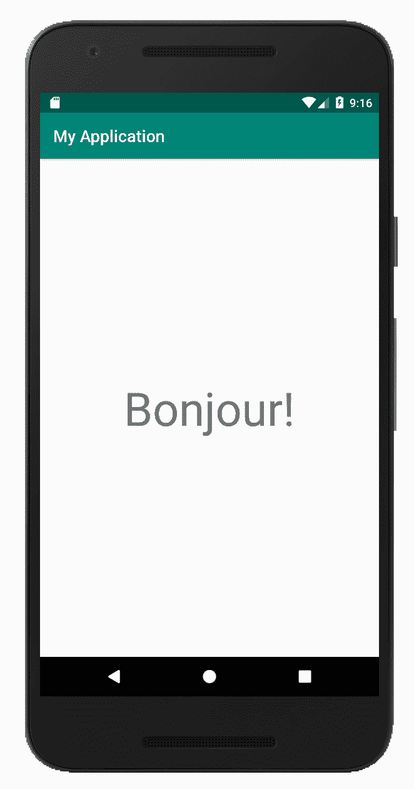

# 第八章：Android、JUnit 和 JVM UI 框架的最佳实践

在本章中，我们将涵盖以下菜谱：

+   使用 Android Extensions 插件进行干净且安全的 `View` 绑定

+   在 Android 上、JavaFX 和 Swing 中应用协程进行异步 UI 编程

+   使用 `@Parcelize` 注解在 Android 上轻松进行类序列化

+   实现提供生命周期感知值的自定义属性代理

+   在 `SharedPreferences` 上进行轻松操作

+   更少的样板 `Cursor` 数据解析

+   使用 Mockito Kotlin 库模拟依赖项

+   验证函数调用

+   Kotlin 协程的单元测试

# 简介

当前章节将解决 Kotlin 最常使用的流行框架的特定问题。总的来说，它将侧重于 Android 平台特定的方面，以及在 Android 和 JVM 框架（如 JavaFX 和 Swing）上的异步 UI 编程，同时也会指导您使用 JUnit 框架（[`junit.org/junit5/`](https://junit.org/junit5/)) 为 JVM 平台编写有效的单元测试。与单元测试相关的菜谱还将包括更高级的主题，例如使用 `mockito-kotlin` ([`github.com/nhaarman/mockito-kotlin`](https://github.com/nhaarman/mockito-kotlin)) 库模拟依赖项、基于协程框架测试异步代码，以及使用标准库提供的断言。

# 使用 Android Extensions 插件进行干净且安全的视图绑定

在这个菜谱中，我们将探索 Kotlin Android Extensions 插件提供的视图绑定功能。它允许我们以简单且健壮的方式获取在 XML 布局文件中声明的 `View` 类型元素的引用，而不使用原始的 `findViewById()` 函数。我们将声明一个 `TextView` 元素在 `Activity` 布局中，并获取其引用以在其中显示示例文本。

# 准备工作

为了使用 Kotlin Android Extensions 插件，我们需要在 Android 项目模块级别的 `build.gradle` 脚本中启用它，通过添加以下声明：

```kt
apply plugin: 'kotlin-android-extensions'
```

您可以在本书 GitHub 仓库中找到的 AndroidSamples 项目中检查与 Android 框架相关的菜谱的实现和配置：[`github.com/PacktPublishing/Kotlin-Standard-Library-Cookbook/`](https://github.com/PacktPublishing/Kotlin-Standard-Library-Cookbook/)。要遵循与 Android 相关的菜谱，您只需在 Android Studio 中创建一个新的项目。

# 如何做到...

1.  在项目中创建一个新的 Activity：

```kt
class MainActivity : AppCompatActivity() {}
```

1.  在 `src/main/res/layout/` 目录下的 `activity_main.xml` 文件中实现 UI 布局：

```kt
<?xml version="1.0" encoding="utf-8"?>
<androidx.constraintlayout.widget.ConstraintLayout     xmlns:android="http://schemas.android.com/apk/res/android"
    xmlns:app="http://schemas.android.com/apk/res-auto"
    xmlns:tools="http://schemas.android.com/tools"
    android:layout_width="match_parent"
    android:layout_height="match_parent"
    tools:context=".MainActivity">

 <TextView
        android:id="@+id/text_field"
        android:layout_width="wrap_content"
        android:layout_height="wrap_content"
        android:textSize="56sp"
        app:layout_constraintBottom_toBottomOf="parent"
        app:layout_constraintLeft_toLeftOf="parent"
        app:layout_constraintRight_toRightOf="parent"
        app:layout_constraintTop_toTopOf="parent" />

</androidx.constraintlayout.widget.ConstraintLayout>
```

1.  在 `onCreate()` 钩子函数中设置 `MainActivity` 的布局：

```kt
class MainActivity : AppCompatActivity() {
    override fun onCreate(savedInstanceState: Bundle?) {
        super.onCreate(savedInstanceState)
        setContentView(R.layout.activity_main)
    }
}
```

1.  获取在 XML 布局中声明的 `TextView` 的引用并在其中显示示例文本：

```kt
class MainActivity : AppCompatActivity() {
    override fun onCreate(savedInstanceState: Bundle?) {
        super.onCreate(savedInstanceState)
        setContentView(R.layout.activity_main)
        text_field.text = "Bonjour!"
    }
}
```

# 它是如何工作的...

因此，`MainActivity` 类将在 `TextView` 中显示问候语：



在底层，Android 扩展插件为 `activity_main.xml` 文件中声明的每个 `View` 元素为 `MainActivity` 类生成了扩展属性。生成的属性与它们对应布局元素的 ID 名称相同。

与使用 `findViewById(): View` 函数获取 `View` 类引用的标准方式相比，Android 扩展绑定机制更加简洁和易于忍受。它还非常安全和健壮，因为它不需要将 `View` 类型强制转换为特定的子类，并且每当 XML 布局文件有任何更改时，它都会重新生成所有扩展属性。此外，与其他第三方视图绑定库相比，它更容易使用，因为它不需要任何手动属性声明。它只需无缝工作。

# 还有更多...

默认情况下，Android 扩展插件支持 `Activity`、`Fragment` 和 `View` 类型容器，在这些容器中你可以直接使用自动视图绑定机制。然而，通过实现 `LayoutContainer` 接口，你可以使用任何类作为 Android 扩展容器。例如，它可以用在 `RecyclerView.ViewHolder` 的子类中：

```kt
class ViewHolder(override val containerView: View) : ViewHolder(containerView),
    LayoutContainer {  
    fun setupItemView(title: String) {  itemTitle.text = "Hello World!"  } 
}
```

你可以在官方参考中了解更多关于 Android 扩展应用程序的信息：[`kotlinlang.org/docs/tutorials/android-plugin.html`](https://kotlinlang.org/docs/tutorials/android-plugin.html)。

# 在 Android、JavaFX 和 Swing 上应用协程进行异步 UI 编程

大多数基于 JVM 的 GUI 框架有一个共同点——它们运行一个特定的线程，该线程负责更新应用程序 UI 的状态。在这个菜谱中，我们将学习如何在后台异步执行任务，并切换到 UI 线程以更新应用程序的 GUI。我们将创建一个简单的计数器，它将每秒显示递增的整数值。负责无限计数器递增的机制应在后台运行，但是每当它需要更新 UI 状态时，它应该切换到 UI 线程上下文。

# 准备工作

开始使用 Kotlin 协程的第一步是将核心框架依赖项添加到项目中：

```kt
implementation 'org.jetbrains.kotlinx:kotlinx-coroutines-core:0.23.3' 
```

除了 Coroutines 核心依赖项之外，我们还需要添加一个框架特定的协程子模块，提供负责在 UI 线程上调度协程的协程上下文实现。你可以在官方指南中找到协程框架子模块的列表：[`github.com/Kotlin/kotlinx.coroutines/blob/master/ui/coroutines-guide-ui.md`](https://github.com/Kotlin/kotlinx.coroutines/blob/master/ui/coroutines-guide-ui.md)。在这个菜谱中，我们将针对 Android 平台，然而，你可以轻松地将示例代码移植到支持的框架之一，例如 Android、Swing 或 JavaFx。

你可以在 GitHub 仓库中查看与 Android 框架相关的配方实现和配置，该仓库位于 AndroidSamples 项目：[`github.com/PacktPublishing/Kotlin-Standard-Library-Cookbook/`](https://github.com/PacktPublishing/Kotlin-Standard-Library-Cookbook/)。要遵循与 Android 相关的配方，你只需要在 Android Studio 中创建一个新的项目。

# 如何做到这一点...

1.  添加一个新的 Activity 子类：

```kt
class MainActivity: AppCompatActivity() {}
```

1.  在`src/main/res/layout/`目录下的`activity_main.xml`文件中实现 UI 布局：

```kt
<?xml version="1.0" encoding="utf-8"?>
<androidx.constraintlayout.widget.ConstraintLayout xmlns:android="http://schemas.android.com/apk/res/android"
    xmlns:app="http://schemas.android.com/apk/res-auto"
    android:layout_width="match_parent"
    android:layout_height="match_parent" >

 <TextView
        android:id="@+id/text_field"
        android:layout_width="wrap_content"
        android:layout_height="wrap_content"
        android:textSize="56sp"
        app:layout_constraintBottom_toBottomOf="parent"
        app:layout_constraintLeft_toLeftOf="parent"
        app:layout_constraintRight_toRightOf="parent"
        app:layout_constraintTop_toTopOf="parent" />

 <Button
            android:id="@+id/cancel_btn"
            android:layout_width="wrap_content"
            android:layout_height="wrap_content"
            android:text="Cancel"
            app:layout_constraintBottom_toBottomOf="parent"
            app:layout_constraintLeft_toLeftOf="parent"
            app:layout_constraintRight_toRightOf="parent"/>

</androidx.constraintlayout.widget.ConstraintLayout>
```

1.  在`onCreate()`钩子函数内设置`MainActivity`的布局：

```kt
class MainActivity : AppCompatActivity() {
    override fun onCreate(savedInstanceState: Bundle?) {
        super.onCreate(savedInstanceState)
        setContentView(R.layout.activity_main)
    }
}
```

1.  在后台启动一个新的协程，每秒增加计数器并在从 XML 布局中获得的`TextView`中显示：

```kt
class MainActivity: AppCompatActivity() {
    override fun onCreate(savedInstanceState: Bundle?) {
        super.onCreate(savedInstanceState)
        setContentView(R.layout.activity_main)
        val job = launch {
 var counter = 1
            while (true) {
 delay(1000)
 counter++
 withContext(UI) {
                    text_field.text = counter.toString()
 }
            }
        }
    }
}
```

1.  通过点击**取消**按钮允许协程取消：

```kt
class MainActivity: AppCompatActivity() {

    override fun onCreate(savedInstanceState: Bundle?) {
        super.onCreate(savedInstanceState)
        setContentView(R.layout.activity_main)
        text_field.text = "Bonjour!"

        val job = launch {
            var counter = 1
            while (true) {
                delay(1000)
                counter++
                withContext(UI) {
                    text_field.text = counter.toString()
                }
            }
        }

 cancel_btn.setOnClickListener {
            job.cancel()
 }
    }
}
```

# 它是如何工作的...

在`MainActivity.onCreate()`函数中启动的协程正在运行一个无限`while`循环。每次迭代都以一分钟延迟和计数器变量的增加开始。接下来，我们使用`withContext()`函数来更新`TextView`的新值。

`withContext()`函数允许我们切换到从上下文参数获得的新协程调度器，以执行传递给它的代码块。它不会创建和启动一个新的协程，而是立即修改父协程的上下文。新调度器仅临时应用于执行给定的代码块。在`withContext()`函数调用之后，在协程作用域内执行的任何进一步操作都将使用原始协程上下文运行。

我们将协程返回的`Job`实例分配给`job`变量。接下来，我们设置取消按钮的监听器。每次点击取消按钮时，都会在协程`Job`引用上调用`cancel()`函数。

因此，我们的`MainActivity`实现将每秒更新`TextView`的值。一旦点击取消按钮，更新机制将立即停止。

# 还有更多...

如果你正在使用不同的 JVM 框架开发应用程序，为了从后台切换到 UI 线程，你可以使用带有`JavaFx`或`Swing`常量的`withContext()`函数，而不是 Android 的`UI`上下文常量。

# 参见

+   如果你想探索协程框架的基础知识，你应该查看第七章中的配方，*让异步编程再次伟大*。

# 使用`@Parcelize`注解在 Android 上轻松实现类序列化

在这个配方中，我们将使用`@Parcelize`注解来简化 Android `Parcelable`接口的实现，使我们能够有效地序列化对象。`@Parcelize`在 Kotlin Android Extensions 插件中可用，并为实现`Parcelable`接口的 Kotlin 类提供自动代码生成。

# 准备工作

我们将实现 Android 仪器化测试用例，以验证类序列化和反序列化在实际中的效果。为了使用 Android KTX 库，我们需要将其添加到项目依赖项中。在我们的例子中，我们将在 `android-test` 模块中使用它。我们可以通过以下声明添加它：

```kt
androidTestImplementation 'androidx.core:core-ktx:1.0.+'
```

为了使用 Kotlin Android 扩展插件，我们需要在 Android 项目模块级别的 `build.gradle` 脚本中启用它，通过添加以下声明：

```kt
apply plugin: 'kotlin-android-extensions'
```

您可以在书中 GitHub 仓库中找到的 AndroidSamples 项目中检查与 Android 框架相关的食谱的实现和配置：[`github.com/PacktPublishing/Kotlin-Standard-Library-Cookbook/`](https://github.com/PacktPublishing/Kotlin-Standard-Library-Cookbook/)。要遵循与 Android 相关的食谱，您只需在 Android Studio 中创建一个新的项目。

# 如何实现...

1.  让我们从创建一个使用 `@Parcelize` 注解实现 `Parcelable` 接口的示例 `User` 类开始：

```kt
@Parcelize
data class User(val name: String, val address: Address): Parcelable

@Parcelize
data class Address(val street: String, 
                   val number: String, 
                   val city: String): Parcelable
```

1.  通过编写和读取 `Bundle` 实例来验证 `User` 类实例的序列化和反序列化：

```kt
@Test
fun testUserParcelisation() {
    // given
    val originalUser = User("Bob", Address("Rue de Paris", "123",
     "Warsaw"))
    val bundle = Bundle()

    // when
    bundle.putParcelable("my_user", originalUser)

    // then
    val deserialisedUser = bundle.get("my_user") as User
    assertEquals(originalUser, deserialisedUser)
} 
```

# 它是如何工作的...

我们首先定义了 `User` 类，其中包含 `Address` 类的属性。`User` 和 `Address` 都被 `@Parcelize` 注解装饰。它告诉 Android 扩展插件生成 `Parcelable` 接口实现的代码。在 `testUserParcelisation()` 函数内部，我们创建了一个 `User` 类的实例，并使用 Android 的 `Bundle` 机制对其进行序列化。我们将原始的 `User` 类实例放在 `"my_user"` 键下，然后通过调用 `bundle.get("my_user") as User` 反序列化其实例。最后，我们使用 `assertEquals()` 函数比较原始和反序列化的 `User` 实例。

`@Parcelize` 处理为以下类型生成 `Parcelable` 实现：

所有原始类型、`String`、`CharSequence`、对象和枚举、`Exception`、`Size`、`SizeF`、`Bundle`、`IBinder`、`IInterface`、`FileDescriptor`、`SparseArray`、`SparseIntArray`、`SparseLongArray` 和 `SparseBooleanArray`。它还支持任何 `Serializable` 类型（例如，`java.util.Date`），以及 `Collection` 和 `Array` 类型。它还适用于可空类型。

# 参见

+   您可以通过学习官方指南来了解更多关于 Kotlin Android 扩展插件针对 Android 开发的功能：[`kotlinlang.org/docs/tutorials/android-plugin.html`](https://kotlinlang.org/docs/tutorials/android-plugin.html)

# 实现一个自定义属性委托，提供生命周期感知的值

通常，我们需要声明一个类属性，该属性应依赖于 `Activity` 或 `Fragment` 的生命周期状态。在这个菜谱中，我们将使用 Kotlin 的 `Lazy` 代理和 Android 架构组件库提供的 `Lifecycle` 类 ([`developer.android.com/topic/libraries/architecture/`](https://developer.android.com/topic/libraries/architecture/))。我们将实现一个自定义属性代理，它将以懒加载的方式提供值。这意味着它们只会在第一次调用时实例化。此外，一旦 `Activity` 或 `Fragment` 被销毁，我们将清除它们的值。这将避免由使用标准 `Lazy` 代理管理依赖于 `Context` 实例的属性而导致的内存泄漏。

# 准备工作

使用标准库提供的 `lazy()` 函数初始化的基本 `Lazy` 代理提供了声明非空类型属性的能力，该属性只能在某个生命周期事件之后实例化。例如，我们仅在 `Activity.onCreate()` 钩子函数内部设置布局之后，在属性中引用屏幕布局的元素。

然而，如果属性内部持有 `Activity` 实例的引用，则使用 `Lazy` 实现的这种实现将导致内存泄漏，因为它不允许垃圾收集器删除它。这是因为懒代理正在缓存它所持有的实例。我们将实现自己的属性代理，称为 `LifeCycleAwareLazy`，它将扩展 `Lazy` 接口，并在活动即将被销毁时清除它所持有的值。

我们将使用由 Google 提供的 Android 架构组件中的 `Lifecycle` 库模块。我们需要将其添加到模块级别的 `build.gradle` 脚本中的项目依赖项：

```kt
implementation "android.arch.lifecycle:runtime:1.1.1"

```

# 如何实现...

1.  声明 `LifecycleAwareLazy` 类：

```kt
class LifecycleAwareLazy<T>(lifecycle: Lifecycle, val initializer: () -> T):             Lazy<T>, GenericLifecycleObserver
```

1.  在 `init` 块内注册观察者到给定的 `Lifecycle` 实例：

```kt
class LifecycleAwareLazy<T>(lifecycle: Lifecycle, val initializer: () -> T):             Lazy<T>, GenericLifecycleObserver {
    init {
 lifecycle.addObserver(this)
 }
}
```

1.  实现一个表示代理当前存储值的内部字段：

```kt
class LifecycleAwareLazy<T>(lifecycle: Lifecycle, val initializer: () -> T):             Lazy<T>, GenericLifecycleObserver {

    init {
        lifecycle.addObserver(this)
    }

    private object UNINITIALIZED_VALUE
 private var _value: Any? = UNINITIALIZED_VALUE }
```

1.  实现 `Lazy` 接口所需的 `value` 属性和 `isInitialized()` 函数：

```kt
class LifecycleAwareLazy<T>(lifecycle: Lifecycle, val initializer: () -> T): Lazy<T>, GenericLifecycleObserver {

    init {
        lifecycle.addObserver(this)
    }

    private object UNINITIALIZED_VALUE
    private var _value: Any? = UNINITIALIZED_VALUE

 @get:Synchronized
    override val value: T get() {
 if (_value === UNINITIALIZED_VALUE) {
 _value = initializer.invoke()
 }
 return _value as T
        }

 override fun isInitialized(): Boolean = _value != UNINITIALIZED_VALUE
}

```

1.  实现 `GenericLifecycleObserver` 接口：

```kt
class LifecycleAwareLazy<T>(lifecycle: Lifecycle, val initializer: () -> T): Lazy<T>, GenericLifecycleObserver {

    init {
        lifecycle.addObserver(this)
    }

    private object UNINITIALIZED_VALUE
    private var _value: Any? = UNINITIALIZED_VALUE

    @get:Synchronized
    override val value: T
        get() {
            if (_value === UNINITIALIZED_VALUE) {
                _value = initializer.invoke()
            }
            return _value as T
        }

    override fun isInitialized(): Boolean = _value != UNINITIALIZED_VALUE

    override fun onStateChanged(source: LifecycleOwner?, event: Lifecycle.Event?) {
 when (event) {
 Lifecycle.Event.ON_STOP -> {
 _value = UNINITIALIZED_VALUE
 }
 else -> return
        }
 }
}
```

# 它是如何工作的...

我们实现的`LifecycleAwareLazy`类可以看作是标准`Lazy`代理实现的扩展版本。它观察由构造函数传递给它的`Lifecycle`实例发出的事件，并相应地处理值。内部，它包含一个私有可变属性`_value: Any?`，初始设置为`UNINITIALIZED_VALUE`对象，表示空状态。`_value`属性反映了委托属性的当前状态，可以是已初始化或未初始化。`LifecycleAwareLazy`类还公开了一个不可变的`value`属性，该属性负责返回委托属性的最终值。注意，它被标记为`@get:Synchronized`注解，这会通知编译器为这个属性生成线程安全的获取器函数。

在`value`属性获取器内部，检查`_value`属性当前的值。每当它等于`UNINITIALIZED_VALUE`时，首先将其重新分配为构造函数中传递的`initialiser`函数的结果，然后作为委托属性的值返回。

`Lifecycle`是一个包含关联组件（如活动或片段）当前生命周期状态的类。它允许其他对象通过订阅状态更改事件来观察此状态，通过将回调传递给`Lifecycle.addObserver()`函数。你也可以通过访问`Lifecycle.currentState`属性来获取当前状态。

在`init`块中，我们正在订阅通过`LifecycleAwareLazy`构造函数参数传递的`Lifecycle`对象的州更新。我们通过使用`GenericLifecycleObserver`实现将`LifecycleAwareLazy`实例传递给`lifecycle.addObserver(this)`函数。

我们通过在`LifecycleAwareLazy`类内部覆盖`onStateChanged()`函数来实现`GenericLifeObserver`接口。正如你所看到的，每当`Lifecycle.Event.ON_STOP`事件被触发时，即活动即将被销毁，我们都会将可变属性`_value`更新为`UNINITIALIZED_VALUE`对象。这样，我们可以确保即使`_value`属性直接或间接地持有活动`Context`实例的引用，它也不会阻止活动或片段被垃圾回收。与标准的懒加载代理相比，这是一个巨大的优势，因为标准的懒加载代理可能导致潜在的内存泄漏。

# 参见

+   如果你想要熟悉属性委托模式的基础知识，请查看第五章中的*实现委托类属性*配方，*采用 Kotlin 概念的优雅设计模式*。

# 在 SharedPreferences 上的简单操作

在这个菜谱中，我们将使用由 Google 开发的 Android KTX 库，它提供了一套针对 Android 应用开发的实用扩展和工具。我们将应用扩展函数，允许我们以干净和健壮的方式操作 `SharedPreferences` 类。

# 准备工作

为了使用 Android KTX 库，我们需要将其添加到项目的依赖项中。在我们的例子中，我们将在 `android-test` 模块中使用它。我们可以通过以下声明来添加它：

```kt
androidTestImplementation 'androidx.core:core-ktx:1.0.+'
```

我们将实现 Android 仪器测试用例，以验证我们对 `SharedPreferences` 执行的操作的效果。你可以在 GitHub 仓库中找到的 AndroidSamples 项目中检查与 Android 框架相关的菜谱的实现和配置：[`github.com/PacktPublishing/Kotlin-Standard-Library-Cookbook/`](https://github.com/PacktPublishing/Kotlin-Standard-Library-Cookbook/)。要遵循与 Android 相关的菜谱，你只需要在 Android Studio 中创建一个新的项目。

# 如何操作...

1.  创建一个返回 `SharedPreferences` 实例的函数：

```kt
fun getDefaultSharedPreferences() =                                 PreferenceManager.getDefaultSharedPreferences(InstrumentationRegistry.getContext())
```

1.  将一个示例字符串保存到 `SharedPreferences` 实例中：

```kt
@Test
fun testUserParcelization() {
 val prefs = getDefaultSharedPreferences()
 val userName: String = "Gonzo"
    prefs.edit {
        putString("user_name", userName)
 }
}
```

1.  验证字符串是否已成功保存：

```kt
@Test
fun testSharedPrefs() {
    val prefs = getDefaultSharedPreferences()
    val userName: String = "Gonzo"
    prefs.edit {
        putString("user_name", userName)
    }

    val DEFAULT_VALUE = "empty"
    val fetchedUserName = prefs.getString("user_name",
     DEFAULT_VALUE)
 assertSame(userName, fetchedUserName)
}
```

# 它是如何工作的...

我们正在使用 KTX 库为 `SharedPreferences` 类提供的 `edit()` 扩展函数。它接受一个 lambda 块，包括我们想要在 `SharedPreferences.Editor` 实例上执行的操作，并自动调用 `SharedPreferences.Editor.apply()` 函数来提交事务。传递给 `edit()` 函数的 lambda 块实现了类型 `SharedPreferences.Editor.() -> Unit`，这允许我们通过隐式的 `this` 修饰符访问 `Editor` 实例。

如果你希望使用阻塞的 `commit()` 方法而不是异步的 `apply()` 函数来提交对 `Editor` 的操作，你应该将额外的 `commit = true` 参数传递给 `edit()` 函数。

# 参见

+   如果你想要熟悉 Android KTX 库提供的更多功能，请查看库的官方指南：[`developer.android.com/kotlin/ktx`](https://developer.android.com/kotlin/ktx)

# 更少的样板 `Cursor` 数据解析

在这个菜谱中，我们将学习如何以更有效和简单的方式在 Android 中使用 `Cursor` 类型。我们将为 `Cursor` 类型创建一个扩展函数，允许我们以干净的方式查询它。我们还将实现一个实际示例，展示如何访问系统内容解析器以获取设备上存储的联系人，并将 `Cursor` 转换为表示联系人名称的字符串列表。

# 准备工作

你可以在 GitHub 仓库中找到的 AndroidSamples 项目中检查与 Android 框架相关的菜谱的实现和配置：[`github.com/PacktPublishing/Kotlin-Standard-Library-Cookbook/`](https://github.com/PacktPublishing/Kotlin-Standard-Library-Cookbook/)。要遵循与 Android 相关的菜谱，你只需要在 Android Studio 中创建一个新的项目。

# 如何做到这一点...

1.  实现一个扩展函数，允许我们从 `Cursor` 中获取请求的列名值：

```kt
fun Cursor.getString(columnName: String): String? {
    return getString(getColumnIndex(columnName))
}
```

1.  获取指向系统联系人表的 `Cursor` 实例：

```kt
val NOT_SPECIFIED = ""
val content = getContext().contentResolver
val projection = arrayOf(ContactsContract.Data.DISPLAY_NAME)
val cursor =
        content.query(ContactsContract.Contacts.CONTENT_URI,
                projection,
                NOT_SPECIFIED,
                emptyArray(),
                NOT_SPECIFIED)
```

1.  在 `cursor` 实例上调用 `use` 函数，并在其作用域内迭代数据：

```kt
val NOT_SPECIFIED = ""
val content = getContext().contentResolver
val projection = arrayOf(ContactsContract.Data.DISPLAY_NAME)
val cursor =
        content.query(ContactsContract.Contacts.CONTENT_URI,
                projection,
                NOT_SPECIFIED,
                emptyArray(),
                NOT_SPECIFIED)

val contacts = cursor.use {
    val contactsList = mutableListOf<String?>()
 while (it.moveToNext()) {
 val contactName = it.getString(ContactsContract.Data.DISPLAY_NAME)
 contactsList.add(contactName)
 }
 contactsList
}
```

# 它是如何工作的...

我们正在使用标准库提供的 `use()` 扩展函数来在 `Cursor` 实例上执行一系列操作。`use()` 可以在任何实现了 `Closeable` 接口类上调用。内部，在执行传递给它的 lambda 块之后，`use()` 会自动调用它所调用的对象的 `close()` 函数。多亏了这一点，我们可以在 `Cursor` 实例上安全地执行任何操作，并且可以确信，即使其中一些操作失败或抛出异常，光标最终也会被关闭。

在 `use()` 函数的作用域内，我们通过 `while` 循环迭代光标，每次迭代都将光标移动到下一行。对于每一行，我们使用 `getString()` 扩展函数从光标中获取当前的联系人显示名称。这允许我们通过将 `Cursor.getString()` 和 `Cursor.getColumnIndex()` 结合起来避免代码重复。

# 使用 Mockito Kotlin 库模拟依赖项

经常在编写复杂类的单元测试用例时，我们会遇到一个问题，即需要实例化大量我们想要测试的类所依赖的属性。虽然这个问题可以通过依赖注入来解决，但模拟特定对象的行为而不实例化它更快、更高效、更受欢迎。在这个菜谱中，我们将探讨如何使用 Mockito Kotlin 库在编写一个包含内部依赖项的简单注册表单的单元测试时模拟依赖项。

# 准备工作

我们将使用 JUnit 库，它为运行测试用例类提供核心框架。我们需要通过在 `gradle.build` 脚本中声明它来将其添加到我们项目的依赖项列表中：

```kt
implementation group: 'junit', name: 'junit', version: '4.12'
```

为了使用 Kotlin Mockito 库，我们可以通过以下声明将其添加到项目的依赖项中：

```kt
implementation 'com.nhaarman:mockito-kotlin:1.5.0'
```

您可以在 GitHub 仓库中找到的 AndroidSamples 项目中查看与 Android 框架相关的食谱的实现和配置：[`github.com/PacktPublishing/Kotlin-Standard-Library-Cookbook/`](https://github.com/PacktPublishing/Kotlin-Standard-Library-Cookbook/)。要遵循与 Android 相关的食谱，您只需在 Android Studio 中创建一个新的项目。

在这个食谱中，我们将为以下声明的`RegistrationFormController`类编写单元测试：

```kt
class RegistrationFormController(val api: RegistrationApi) {
    var currentEmailAddress: String = ""

    fun isEmailValid(): Boolean = currentEmailAddress.contains("@")

    fun checkIfEmailCanBeRegistered(): Boolean =
        isEmailIsValid() && api.isEmailAddressAvailable(currentEmailAddress)
}
```

`RegistrationApi`接口定义如下：

```kt
interface RegistrationApi {
    fun isEmailAddressAvailable(email: String): Boolean
} 
```

由于我们不希望为了实例化`RegistrationFormController`类而实现`RegistrationApi`接口，我们将使用 Mockito Kotlin 的`mock()`函数来模拟它。

# 如何做...

1.  创建一个新的测试类：

```kt
class MyTest {
}
```

1.  创建一个`RegistrationApi`接口的模拟实例作为测试类的属性：

```kt
class MyTest {
 private val api = mock<RegistrationApi>()
}
```

1.  添加一个`RegistrationFormController`类型的类属性：

```kt
class MyTest {
    private val api = mock<RegistrationApi>()
    private var registrationFormController = 
        RegistrationFormController(api = api)
}
```

1.  创建一个测试方法来检查`checkIfEmailCanBeRegistered()`方法在无效电子邮件地址出现时是否表现正确：

```kt
class MyTest {
    private val api = mock<RegistrationApi>()
    private lateinit var registrationFormController: RegistrationFormController

    @Before
    fun setup() {
        registrationFormController = RegistrationFormController(api = api)
    }

    @Test
    fun `email shouldn't be registered if it's not valid`() {
 // given
        assertNotNull(registrationFormController)
 whenever(api.isEmailAddressAvailable(anyString())) doReturn(true)
 // when
        registrationFormController.currentEmailAddress = "Hilary"
        // then
        assertFalse(registrationFormController.checkIfEmailCanBeRegistered())
 } }
```

# 它是如何工作的...

在`email shouldn't be registered if it's not valid`测试方法中，我们设置我们的模拟`RegistrationApi`属性，使其在`isEmailAddressAvailable()`函数被调用时返回`true`，无论传递给它的字符串值是什么。接下来，我们将`RegistrationFormController`类的`currentEmailAddress`属性更新为无效的电子邮件地址值。测试将通过，因为`isEmailIsValid()`函数工作正常，并且对于给定的电子邮件地址值返回`false`。

如您所见，得益于模拟，我们避免了实现被测试类的依赖项。这是一种适当的技巧，它允许我们在模拟依赖项期望行为的同时测试业务逻辑的特定部分。当依赖项是特定于不兼容纯 JVM（即 Android）平台的平台时，模拟也可能很有用。

# 相关内容

+   您可以查看*验证函数调用*食谱，以了解如何检查是否观察到与模拟依赖项的任何特定交互

# 验证函数调用

除了在测试方法中模拟依赖项的特定行为之外，模拟还允许我们验证模拟对象的具体函数是否被调用。在这个食谱中，我们将为简单的注册表单控制器编写单元测试。注册表单包含两个内部依赖项，我们将使用 Mockito Kotlin 库来模拟它们。我们将测试在不同场景下是否调用了适当的函数。

# 准备工作

我们将使用 JUnit 库来提供一个核心框架，用于运行测试用例类。我们需要通过在`gradle.build`脚本中声明它来将其添加到我们的项目依赖项列表中：

```kt
implementation group: 'junit', name: 'junit', version: '4.12'
```

为了使用 Kotlin Mockito 库，我们可以通过以下声明将其添加到项目依赖项中：

```kt
implementation 'com.nhaarman:mockito-kotlin:1.5.0'
```

您可以在 GitHub 仓库中找到的 AndroidSamples 项目中查看与 Android 框架相关的菜谱的实现和配置：[`github.com/PacktPublishing/Kotlin-Standard-Library-Cookbook/`](https://github.com/PacktPublishing/Kotlin-Standard-Library-Cookbook/)。要遵循与 Android 相关的菜谱，您只需在 Android Studio 中创建一个新的项目。

在这个菜谱中，我们将编写一个针对`RegistrationFormController`类的单元测试，该类声明如下：

```kt
class RegistrationForm(val api: RegistrationApi, val view: TextView) {
    var currentEmailAddress: String by 
        Delegates.observable("", ::onEmailAddressNewValue)

    fun onEmailAddressNewValue(prop: KProperty<*>, old: String,
     new: String) {
        if (checkIfEmailCanBeRegistered()) {
            view.showSuccessMessage("Email address is available!")
        } else {
            view.showErrorMessage("This email address is not
             available.")
        }
    }

    fun checkIfEmailCanBeRegistered(): Boolean =
            isEmailIsValid() && api.isEmailAddressAvailable(currentEmailAddress)

    fun isEmailIsValid(): Boolean = currentEmailAddress.contains("@")

}
```

它包含一个`RegistrationApi`属性，该属性定义为以下接口：

```kt
interface RegistrationApi {
    fun isEmailAddressAvailable(email: String): Boolean
} 
```

以及以下方式定义的`TextView`类型属性：

```kt
interface TextView {
    fun showSuccessMessage(message: String)
    fun showErrorMessage(message: String)
}
```

由于我们不想为了在测试中实例化`RegistrationFormController`类而实现`RegistrationApi`和`TextView`接口，我们将使用 Mockito Kotlin 的`mock()`函数来模拟它们。

# 如何做到这一点...

1.  创建一个新的测试类：

```kt
class MyTest {
}
```

1.  创建一个`RegistrationApi`接口的模拟实例作为测试类的属性：

```kt
class MyTest {
    private val api = mock<RegistrationApi>()
}
```

1.  创建一个模拟的`TextView`实例：

```kt
class MyTest {
    private val api = mock<RegistrationApi>()
 private val view = mock<TextView>()
}
```

1.  将`RegistrationFormController`对象作为`MyTest`类的属性创建：

```kt
class MyTest {
    private val api = mock<RegistrationApi>()
    private val view = mock<TextView>()
    private var registrationForm = RegistrationForm(api, view)
}
```

1.  添加一个测试方法以验证如果地址可用，是否会显示成功消息：

```kt
class MyTest {
    private val api = mock<RegistrationApi>()
    private val view = mock<TextView>()
    private var registrationForm = RegistrationForm(api, view)

 @Test
    fun `should display success message when email address is available`() {
 // given
        assertNotNull(registrationForm)
 // when we update the currentEmailAddress to any String
        whenever(api.isEmailAddressAvailable(ArgumentMatchers.anyString()))             doReturn(true)
 registrationForm.currentEmailAddress = "hilary@gmail.com"
        // then
        assertTrue(registrationForm.checkIfEmailCanBeRegistered())
 verify(view).showSuccessMessage("Email address is 
         available!")
 }
}
```

1.  添加一个测试方法以验证如果地址不可用，是否会显示错误消息：

```kt
class MyTest {
    private val api = mock<RegistrationApi>()
    private val view = mock<TextView>()
    private var registrationForm = RegistrationForm(api, view)

    @Test
    fun `should display success message when email address is available`() {
        // given
        assertNotNull(registrationForm)
        // when we update the currentEmailAddress to any String
        whenever(api.isEmailAddressAvailable(ArgumentMatchers.anyString()))             doReturn(true)
        registrationForm.currentEmailAddress = "hilary@gmail.com"
        // then
        assertTrue(registrationForm.checkIfEmailCanBeRegistered())
        verify(view).showSuccessMessage("Email address is available!")
    }

    @Test
 fun `should display error message when email address isn't available`() {
 // given
        assertNotNull(registrationForm)
 // when
        registrationForm.currentEmailAddress = "hilary@gmail.com"
        whenever(api.isEmailAddressAvailable(ArgumentMatchers.anyString()))             doReturn(false)
 // then
        assertTrue(registrationForm.isEmailIsValid())
 verify(view).showErrorMessage(anyString())
 }
}
```

# 它是如何工作的...

除了行为模拟之外，Mockito Kotlin 提供了一种可靠的方式来验证在执行测试方法期间与模拟依赖项的交互。在`should display success message when email address is available`和`should display error message when email address isn't available`函数中，我们只想检查`TextView`依赖项的期望功能是否被调用。为了做到这一点，我们调用`verify()`函数。例如，为了检查`showErrorMessage()`函数是否在模拟的`view: TextView`依赖项上被调用，我们调用以下代码：

```kt
verify(view).showErrorMessage(anyString())
```

如果`showErrorMessage()`没有被调用，测试方法将失败，并且适当的日志消息将被打印到控制台。

# Kotlin 协程的单元测试

在这个菜谱中，我们将探讨如何有效地测试使用协程内部代码的代码。我们将编写一个单元测试，用于测试在尝试使用外部 API 验证给定用户凭据的同时，在后台异步运行的代码部分。我们将使用 Kotlin Mockito 库来模拟对外部 API 和`TextCoroutineContext`类的调用，从而能够轻松地测试异步代码。

# 准备工作

我们将使用 JUnit 库为运行测试用例类提供核心框架。我们需要通过在 `gradle.build` 脚本中声明它来将其添加到我们项目的项目依赖项列表中：

```kt
implementation group: 'junit', name: 'junit', version: '4.12'
```

为了使用 Kotlin Mockito 库，我们可以通过以下声明将其添加到项目依赖项中：

```kt
implementation 'com.nhaarman:mockito-kotlin:1.5.0'
```

您可以在 GitHub 仓库中找到的 AndroidSamples 项目中检查与 Android 框架相关的食谱的实现和配置：[`github.com/PacktPublishing/Kotlin-Standard-Library-Cookbook/`](https://github.com/PacktPublishing/Kotlin-Standard-Library-Cookbook/)。要遵循与 Android 相关的食谱，您只需在 Android Studio 中创建一个新的项目。

在这个食谱中，我们将为以下定义的 `Authenticator` 类编写一个单元测试：

```kt
class Authenticator(val api: Api) {

    fun tryToAuthorise(encodedUserNameAndPassword: ByteArray, 
                       context: CoroutineContext): Deferred<String> =
            async(context) {
                var authToken = api.authorise(encodedUserNameAndPassword)

                var retryCount = 0
                while (authToken.isEmpty() && retryCount <= 8) {
                    delay(10, TimeUnit.SECONDS)
                    authToken = api.authorise(encodedUserNameAndPassword)
                    retryCount++
                }

                authToken
            }
}
```

`Api` 属性如下所示：

```kt
interface Api {
    // returns a non-empty auth token when the given credentials were authorised
    fun authorise(encodedUserNameAndPassword: ByteArray): String
}
```

# 如何操作...

1.  创建一个新的测试类：

```kt
class MyTest {
}
```

1.  添加一个模拟的 `Api` 类型测试类属性：

```kt
class MyTest {
 val api: Api = mock()
}
```

1.  将 `Authenticator` 类实例化为类属性：

```kt
class MyTest {
    val api: Api = mock()
 val authenticator = Authenticator(api)
}
```

1.  实现测试以验证在连续授权尝试失败的情况下，`Api.authorise()` 函数是否至少被调用 10 次：

```kt
class MyTest {
    val api: Api = mock()
    val authenticator = Authenticator(api)

    @Test
    fun `should retry auth at least 10 times when Api returns empty
    token`() {
 whenever(api.authorise(any())) doReturn ""

        val context = TestCoroutineContext()

 runBlocking(context) {
          authenticator.tryToAuthorise("admin:1234".toByteArray(),
            context)
 .await()
 context.advanceTimeBy(100, TimeUnit.SECONDS)
 verify(api, atLeast(10)).authorise(any())
 }
    }
}
```

# 它是如何工作的...

首先，通过模拟，我们避免了实现我们正在为其编写测试的 `Authenticator` 类的 `Api` 依赖。实际上，我们对测试 `Api` 实现返回的真实结果不感兴趣。我们想要测试 `tryToAuthorise()` 函数的机制，并验证在连续授权失败的情况下，它是否会至少重试调用 `Api.authorise()` 函数 10 次。这就是为什么我们将 `api` 模拟设置为对 `authorise()` 函数的结果始终返回空字符串的原因。

如您所想象，这样的测试将花费很多时间才能完成，因为内部，`tryToAuthorise()` 函数在重试授权之前会等待 10 秒。为了避免执行时间过长，我们需要通过将时间人为地向前推进 100 秒来检查 `Api.authorise()` 函数是否至少被调用 10 次。我们能够通过安排使用 `runBlocking()` 函数启动的两个协程，并在 `tryToAuthorise()` 函数内部，在同一个 `TestCoroutineContext` 实例上运行，来实现这一点。然后，为了将时间向前推进 100 秒，我们只需在 `TestCoroutineContext` 实例上调用 `advanceTimeBy(100, TimeUnit.SECONDS)` 函数。结果，我们的测试方法将在不到一秒内完成。
