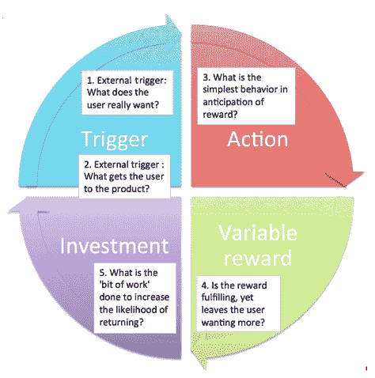

# 第一章：是的，确实有相应的应用程序

对于几乎所有的事情，似乎都已经有了相应的应用程序。创建一个盈利的应用程序并不容易，但如果你以明智的方式开发你的应用程序，你的公司也可以取得成功！

本书旨在帮助你利用精益创业方法在你的移动应用程序周围建立一个盈利的业务。与许多其他书籍不同，这本书不仅面向你组织中的以商业为导向的成员。相反，它是一本非常实用的指南，解释了可以用来以精益方式开发应用程序的工具和技术。对于技术导向的人来说，对精益创业方法产生热情也很重要，这也是为什么这本书主要面向技术共同所有者和开发者。他们需要拥有正确的工具，以便将方法论应用于他们的日常移动应用程序开发。我们将讨论如何通过使用一系列技术和工具来节省时间和减少浪费。

另一方面，这本书对非技术人员也有兴趣。如果他们能够更好地理解应用程序开发中涉及的基本技术过程，那将是理想的。我们需要商业人士找到并明确界定问题，以便技术人员可以为他们提供正确的解决方案。每个人都需要紧密合作。如果你对彼此的视角有良好的理解，你可以取得更好的结果。

如果你的创业公司缺少一个技术共同创始人，那么现在是寻找的时候了。不要外包开发（现在）。当你的创业公司处于早期阶段时，这通常效果不佳。

在本书的这一章中，我们将首先了解精益创业方法，并学习为什么它对你们创业公司的所有成员都很重要。

本章将讨论以下主题：

+   应用程序生态系统

+   精益创业方法的介绍

+   让你的用户对你的应用程序上瘾

# 应用程序生态系统

我们首先将深入探讨应用程序生态系统所呈现的悖论——名利双收的前景，但被数百万应用程序淹没的隐秘性。我们还将讨论每个内部创业者或企业家在开始构建新应用程序之前需要思考的关键问题。同样的原则也适用于现有应用程序的新想法。你应该首先问自己的是：

+   用户为什么要使用我的应用程序？

+   他们会在什么目的或什么时候真正需要它？

+   他们为什么要不断回来使用它？

创建一个盈利的应用程序很难，但并非不可能。有许多著名的例子。其中之一是《愤怒的小鸟》。2013 年 5 月，越南的一名不出名的独立应用程序开发者 Nguyen Ha Dong 在 iOS 应用商店发布了一款游戏。该应用程序的初始反应并不热烈，只有少数下载。几个月后，在 2014 年初，该游戏因人气激增而复活，并成为当时应用商店中最受欢迎的游戏。

在 2014 年 1 月达到流行顶峰时，这款游戏每天通过应用内广告和销售赚取 50,000 美元。一个月后，在 2014 年 2 月，Dong 著名地将游戏从商店中撤下。这导致了一个短暂的、狂热的时期，当时安装了该应用的手机在线上以溢价出售。

该应用现在是一个广为人知的从贫穷到一夜暴富的成功故事。但无论是偶然还是有意为之，Dong 的成功远非典型。很少有独立应用开发者成功地货币化他们的应用。

对于每一个拥有闪亮、明亮、新想法的内创业者或企业家来说，他们面临的几率都是不利的。当史蒂夫·乔布斯著名地开玩笑说“有应用可以做到这一点”时，他真的是这么想的。几乎每件事都有应用！那么，你的新想法为什么重要呢？

# 并非每个应用都有“飞黄腾达”的结局

如果你建好了，他们就会来。嗯，这显然是不正确的。仅仅在 App Store 或 Play Store 发布你的应用是不够的。在谷歌 Play 和苹果 App Store 上，开发者发布的 10 个应用中，有 9 个应用的下载量不到 5,000 次。已经有这么多应用了。人们如何才能注意到你的应用？

无论你的应用有多好，没有良好的计划，它将在应用海洋中淹没。要成功，你首先需要问自己一些重要的问题：

+   谁需要你的应用？

+   人们将如何了解你的应用？

+   为什么有人会下载你的应用？

+   他们为什么还会回来使用它？

+   别人会如何了解到这个应用？

+   一旦你的应用成功，是什么阻止别人复制它？

进入排行榜顶端的应用与没有进入的应用相比，下载量要大得多。在市场上存在长尾特征的情况是有道理的。亚马逊因说过他们卖的书比之前没有库存的书赚得更多而闻名。他们的市场具有强大的长尾特征，几本细分领域的书籍找到了读者。

然而，App Store 的动态并不利于细分市场。应用的发现性仍然是一个挑战，使得出版商在细分类别中难以成功。除了发现性本身，还有更多的摩擦涉及到人们下载应用而不是仅仅访问移动网站。

# 精益创业方法简介

当前的移动世界已经远远超过了 2000 年代末的淘金热。谷歌 Play 有 190 万款应用，下载量超过 500 亿次。苹果的 App Store 有 140 万款应用，下载量达到 1000 亿次。大多数应用类别都相当饱和，大多数事情都有免费应用。市场的设计激励应用开发者降低价格，以便进入排行榜顶端，从而获得广泛的分布。

你是否会被这一切所劝阻？这难道意味着成功的可能性如此之低，领域如此令人畏惧，以至于我们最好放弃吗？远非如此！正如时间所证明的，总有新的机会。众所周知，今天的一些领先公司，如谷歌和 Facebook，都是从 2000 年代初的互联网泡沫破裂的尘埃中诞生的。

但与公司以前在构建产品时采取的爆炸式方法不同，我们现在拥有更多科学的方法来将新想法推向市场。这就是埃里克·莱斯概述的精益创业方法彻底改变了几个初创公司和大型公司开发软件的方式。

精益创业原则通过快速实验帮助你实现你的愿景。它们提供了一种方法，即首先识别你正在做出的关键高风险假设，这些假设的失败意味着你的想法将失败。下一步是制定小型市场实验来测试这些假设。一个成功的实验将验证一个假设，这让你可以继续到下一个假设并制定下一个实验。实验的失败将使一个假设无效，这意味着你当前形式的想法将失败。

如果你是一名开发者，你可能想知道精益创业方法是否只是一堆为穿着暗色西装的严肃人士保留的商业管理术语。这将是一个不幸的误解。埃里克·莱斯试图为创业开发一个易于理解的管理原则，否则它被视为一种神秘的黑暗艺术形式。

然而，埃里克的根源更接近开发者社区，而不是商业社区。他在 IMVU 构建软件的经历启发了他的精益创业想法。他是早期支持软件开发过程中的持续开发和持续集成的先驱之一。这是一个尝试去除开发者花费时间上的所有浪费周期，并帮助他们专注于构建对客户最重要的东西的尝试。

经验丰富的开发者关心效率和编写真正有影响力的代码。与其他行业相比，软件行业有无数例子表明，数百万行代码被废弃，因为它们被用于构建没有人想要的特性。这是对开发者无尽的努力时间的浪费，这些时间本可以更好地用于构建有用的软件。

精益创业方法也与敏捷软件开发紧密相关。敏捷开发概述了软件构建的重要周期。这个周期通常是内向的，发生在软件开发团队内部，在经理、开发人员和测试人员之间。精益创业增加了客户开发的概念。客户开发是一个外向的周期，发生在软件开发团队和客户之间。这个周期包括通过进行访谈、观察客户行为、进行市场实验以及汇总结果与客户合作。

如果你在一个自上而下的文化组织中担任开发者，那里西装革履的人挥舞着双手，精通 PowerPoint，精益创业可以帮助你。在许多组织中，决策仍然基于谁有最好的 PowerPoint 演示文稿以及关键游说团影响决策的能力。没有什么能比这更能伤害企业的自下而上的创新了。

精益创业为开发者提供了一个框架，使他们能够通过客户实验的真实数据来影响决策。如果需要做出决策，推动会议上的其他人要么提供数据来证明它，要么运行实验来收集它。这是至关重要的。

过去十年中，大多数组织都采用了敏捷开发，Scrum 和极限编程变得司空见惯。在未来的几年里，对精益创业的了解将成为寻求提升技能的开发者的一项宝贵资产。

精益创业不是一个固定不变的过程，它是一套原则，旨在帮助你在未知领域找到方向。在野外，指南针和地图是徒步旅行者用来导航和避免潜在致命陷阱的工具。就像指南针和地图一样，精益提供了一套框架来导航新的发现。这些发现使你能够做出关于下一步该采取哪些步骤以及朝哪个方向前进的关键决策。

精益方法并不能保证下一个《Flappy Bird》的成功。但这样想：我们仍然处于一个从概念到市场的创新仍然具有偶然性的时代。这就像火的发现和轮子的发明一样，可能更多的是偶然和渐进的演变，而不是深思熟虑的选择。在科学使我们能够发展出系统化的实验室实验方法之前，我们花了几个世纪。尽管如此，传奇发明家托马斯·阿尔瓦·爱迪生在发明电灯泡之前也经历了数百次失败的实验。

"天才就是 99%的汗水加 1%的灵感。"

- 爱迪生

尽管如此，科学确实加速了这一过程。偶然发现需要几个世纪。上个世纪见证了新发现和重大科学进步的加速。实验仍然会失败，那些持续多年的研究项目往往会被放弃。但今天，实验室科学家的成功几率显著高于野外穴居人的几率。

精益创业（Lean Startup）改变了我们理解客户需求以及如何构建产品以满足这些需求的方式。我们的成功几率比十年前一个软件开发者要高得多。这种方法论如何帮助开发者利用正确的工具在正确的时间做正确的事情？答案就在这本书里。它面向技术联合创始人以及其他与创业公司相关的开发者。它可以帮助你学习如何将精益创业方法论应用于移动应用程序开发。它将为你提供如何在实用和动手方法之间取得平衡的见解，同时仍然以正确的方式做事。

其中一个关键要素是早期验证。无论你是以解决方案为导向还是以问题为导向的人，你都有一定的假设。这些假设可能是正确的，但更有可能是不正确的。找到答案的唯一方法是通过创建一个可以非常快速构建并用于收集反馈的应用程序或模拟应用程序。这样的解决方案被称为**最小可行产品**（**MVP**）。MVP 只包含你需要的功能，以证明你的假设。应用程序中所有不能帮助收集反馈的其他功能都是浪费，不应该存在。

对于一个商人来说，MVP（最小可行产品）的概念可能听起来很奇怪。你只有一次机会给人留下第一印象，对吧？此外，作为一个开发者，你也不想写一大堆代码，然后又把它们扔掉。那么，MVP 究竟应该包含什么？关于 MVP 的更深入解释将在第五章《实用方法》中进行。

# 让你的用户对你的应用程序上瘾

9/10 的应用程序下载量少于 5000 次，而且 9/10 的应用程序只发布过一次。你可以自己计算。就在那里，你可以看到，拥有一个被超过 5000 人定期使用的应用程序的几率已经下降到 0.01，或者说 100 个中只有 1 个。

发生这种情况的原因有很多。有些用户安装了他们听说的应用程序，但不喜欢它，可能会立即选择卸载。如果他们喜欢这个应用程序，他们可能会保留它。虽然这听起来像是一个胜利，但情况并不总是如此。通常，用户只是忘记了应用程序，甚至可能不会考虑再次启动它，即使它满足了他们的需求。

你可能已经开发了一个帮助用户通过预算节省金钱的出色应用，但除非用户记得定期启动应用并跟踪她的财务状况，否则它将不会帮助她。在第十五章，*增长吸引力和提高留存率*，该章节讨论了吸引力和留存率，我们将看到一些实用的实现方法来吸引用户的注意力。例如，发送（相关）推送通知通常是一种有效的方法，将用户的注意力重新吸引到应用上。

经常使用会创造更多机会，鼓励人们邀请他们的朋友，广播内容，并通过口碑分享。

让我们退一步，关注这个问题：“人们将如何了解到这个应用？”除非它被特色推荐（例如，由苹果推荐），或者除非它意外被发现（就像 Flappy Bird 那样），否则你需要积极推广它。你可以考虑谷歌广告、传单和电视广告。这可能会变得相当昂贵。然而，如果你能让它自然增长，结果可能会好得多，而且成本会更低。例如，人们可能会在 Twitter 和其他社交媒体平台上听说你的应用有多好。为了实现这一点，人们首先需要成为你应用的热情和常规用户，然后他们才会与他们的朋友或商业同事分享。

持续在产品中发现价值的用户更有可能告诉他们的朋友。

一些产品吸引了广泛的关注。Nir Eyal 在他的书《钩子》中描述了是什么让我们出于纯粹的习惯与某些产品互动。例如，宝可梦 GO！、Facebook 或 Instagram 都是非常上瘾的应用。人们听说这个应用，下载它，并且每天都在使用它。为什么是这样？似乎有一种潜在的模式，解释了技术如何吸引我们。Nir Eyal 通过介绍钩子模型来回答这个问题和其他问题。这是一个四步骤的过程，被嵌入到许多成功公司的产品中，以微妙地鼓励客户行为。

上瘾的用户成为品牌传教士——你公司的扩音器。

Nir Eyal 的经典钩子模型包含四个步骤：

+   触发

+   行动

+   奖励

+   投资

简而言之，这就是你在模型中看到的内容：触发是带来用户到产品采取行动，从而产生奖励，随后是进一步的投入。

在行动步骤中，用户将被要求执行一个简单的动作，这将提高用户的动机。这个钩子阶段借鉴了可用性设计和艺术科学，以确保用户按照设计者的意图采取行动。

提供可变和不可预测的奖励是吸引用户的重要工具。已经存在许多反馈循环，但它们都是可预测的。可预测的循环不会产生任何欲望。我们应该让用户感到惊喜，并在用户中创造欲望。游戏化是完成这一目标的工具之一。我们可以用徽章或其他数字（或非数字）激励来奖励用户。

吸引钩子的最后阶段是我们将要求用户做出相应的行动。我们不仅希望增加用户再次通过吸引钩子的几率，除了鼓励用户继续（解锁新等级并获得另一个徽章！）之外，我们还可以要求用户在 App Store 对应用进行评分，或者我们可以要求用户在社交媒体上分享应用的内容（挑战朋友！）。

如果我们将这个模型应用到另一个知名的游戏，比如《精灵宝可梦 Go！》，那么这个模型看起来会是这样：用户收到通知，屏幕上显示一个宝可梦（触发）。用户感到无聊或想找乐子，想要玩游戏（行动）。用户因为获得了一个（特殊的）宝可梦（可变奖励）而继续玩游戏或被要求分享最近的成就（投资）。

你也可以将这个模型应用到你的应用中。你应用中可能或将会有的上瘾功能是什么？你能做些什么来让用户更频繁地回到你的应用？这个过程不仅可以帮助你的应用成长，还会增加你公司（感知）的价值——投资者对**月活跃用户数**（MAU）的兴趣比对用户数量的兴趣更大。

要实现这一点，你需要构建一个人们真正想要使用的应用。要了解人们想要什么，你可以问他们他们需要什么。这听起来比实际上容易。确保你提出正确的问题，并避免只得到社会期望的答案。此外，确保你仔细倾听他们告诉你的内容。记住，有时，他们直到看到它之前，都不知道自己想要什么。以下是一个调查的例子。

当我们开始与真正的潜在用户互动时，我们问他们的问题之一如下：

*"你喜欢这个应用吗？"*

答案总是礼貌的：

*"是的，这是一个非常酷的想法。"*

*"哇，这个卡拉 OK 的想法很棒。"*

最初，我们没有足够重视用户的评论：

*"你没有我想要的歌或课程。"*

*"我的老师的歌不在你的应用上。"*

*"这怎么帮我找到老师？"*

*"谁会审阅我的录音？"*

如果我们当时更加关注用户的评论并提出正确的问题，那么我们可能会更快地意识到，我们正在观察的是一个连接学生和老师的市场，应用是这个连接的工具。我们最终选择了这条路线，并与几位世界著名的音乐家和教师合作建立了平台。但如果我们从一开始就提出正确的问题，我们就可以在早期节省时间和资源。

# 摘要

在本章中，我们了解到让用户意识到你的应用非常重要。如果他们能够被吸引，那就更好了，这就是你阅读过的钩子模型引入的原因。最后，我们学习了精益创业方法论如何帮助制作出更好的应用。

在接下来的章节中，我们将看到你可以使用哪些工具和方法来缩短开发周期，以及如何减少浪费。在下一章中，我们将探讨商业画布模型，在那里我们可以概述我们业务中每个元素的基本假设。这可以帮助我们确定我们的商业想法，而无需撰写一份 100 页的商业计划，而这份计划没有人会去阅读。这听起来你已经节省了时间。多么酷啊？
