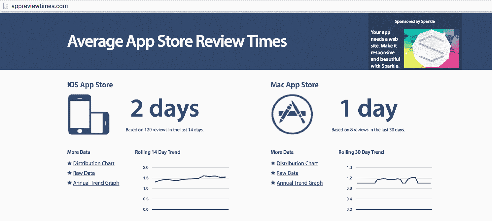
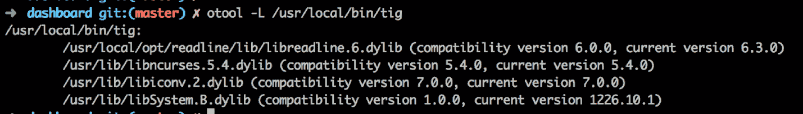
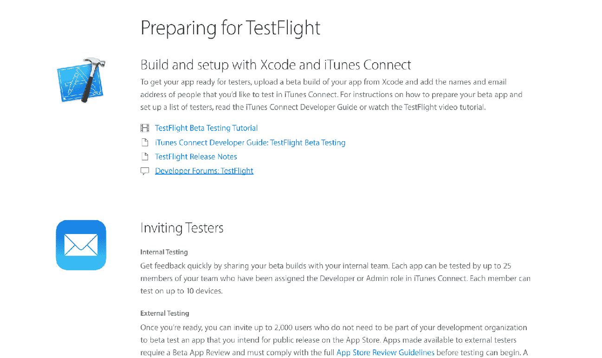
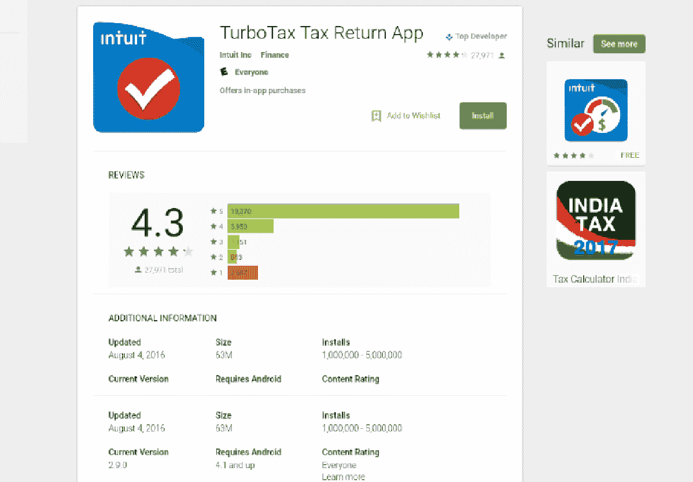

# 第三章：将精益应用于构建移动应用时的挑战

在上一章中，我们讨论了精益创业的一些核心原则。我们讨论了商业模式画布、敏捷开发、客户开发和 MVP。

在本章中，我们将深入探讨本书背后的基本前提，并探讨作为精益应用开发者将面临的一些最大挑战。虽然关于精益的书籍有很多，但将精益应用于构建移动应用相对是一个新的领域。接下来，我们将介绍其中一些核心挑战，其中许多将在本书后面的部分详细回顾：

+   与开发网络应用相比，应用开发者面临更高的设计标准

+   应用商店的提交周期，这会在你的完成迭代和它们对公众开放的时间之间造成延迟

+   开发多个平台带来的挑战

+   早期测试者面临的困难，以及这如何使得扩大早期用户基础变得困难

+   应用评分，这对你的用户基础增长和运行某些类型实验的能力有直接影响

让我们深入探讨一些主要挑战，看看为什么它们对于一个寻求应用实验的开发者来说非常重要。

# 更高的设计标准

从 2000 年代中期的普通网络应用中脱颖而出，苹果通过 iPhone 彻底改变了移动世界，提供了自己精心设计的应用，并精选了被 App Store 接受的应用。多亏了苹果对设计的更高标准，消费者开始期待直观、设计良好的应用。这种影响非常深远，促使谷歌推动其边界，开发出材料设计，这是一种已成为 Android 应用独特标志的设计语言。

与网络世界相比，其中一些流行的应用可以忍受平庸的设计，移动应用面临着更高的设计标准。

精益开发者试图通过简单的实验来验证一个初步的概念。然而，应用的基本价值可能会被糟糕的设计和体验所掩盖，导致错误的否定结果。

另一方面，对错误否定的恐惧可能会让开发者走上添加过多抛光以测试假设的道路。

正如我们稍后将警告的那样，避免分析瘫痪和过早的完美主义非常重要。目标是找到一个合适的平衡点，即一个设计糟糕的原型可能会干扰测试和数据，以及一个过度抛光的 app 可能会浪费你的时间和金钱。

# 苹果应用商店的提交周期

苹果应用商店的审查流程——比谷歌 Play 更严格——可能会在应用迭代准备发布和实际上线之间造成重大延迟。这种滞后会带来头痛，使得时间难以把握，并延长了从客户那里学习的时间。

使用 Web 应用，开发者可以在早餐时边喝咖啡边进行实验，然后在上班前将其回滚。一系列支持持续集成和持续部署的工具使得在 Web 领域具有显著的敏捷性。

然而，移动应用开发者常常需要等待数周，有时甚至数月，才能看到他们的应用在 App Store 中列出。苹果严格的审核流程让开发者感觉与墙对话可能更好。

在 App Store 的早期，公司争先恐后地与苹果建立关系，以确保他们的提交能够顺利通过。我记得应用提交需要数月，需要我们团队与苹果分类领导之间进行多次电子邮件交流：

幸运的是，时代已经改变，如今苹果致力于快速审核。

然而，如果有疑问，可以查看[www.appreviewtimes.com](http://www.appreviewtimes.com)以了解 iOS 和 Mac App Store 的平均审核时间。在撰写本书时，审核时间以天为单位，但节假日和重要苹果公告发布时变化很快。

精益开发者必须考虑 App Store 的提交周期，他们专注于缩短完成构建-度量-学习循环的时间。当你不确定何时可以开始与用户进行实际测试时，进度可能会迅速停滞。App Store 不可预测的特性使得难以保持节奏和速度进行敏捷循环，并且快速与客户完成闭环。

# 无法动态加载库

原生应用开发工具链仅允许静态链接库。这意味着没有直接的方法将库组件动态加载到你的应用中，就像 Web 开发者可能会选择在网络上动态拉取不同的 JavaScript 模块一样。

在 iOS 的情况下，有一些技巧可以通过加载库。默认的 iOS Xcode 设置不允许你创建动态库，但可以通过复制 MacOS 设置来解决这个问题。然而，虽然这可以在本地进行测试，但在代码签名时会出现障碍，内核会杀死未使用相同证书签名的苹果应用库。话虽如此，由于应用审核过程禁止动态加载，它不太可能通过他们的清单。

可以尝试和测试这种或网上可以找到的其他解决方案，看看它们是否能够通过提交流程。然而，如果它们不成功，为你的应用开发静态加载策略可能是有益的：

在 Android 的情况下，有一些类似的技巧可以通过 `Dex` 文件加载、提取和调用。这是因为 Dalvik 虚拟机允许从本地存储或远程网络等不同位置进行一定程度的自定义类加载。然而，这并不适用于所有应用，并且在正确处理所有场景时具有一定的复杂性。

与网页开发者可以轻松切换开关并更改仪表板上渲染的组件不同，应用开发者需要进行杂技般的操作。如果他更愿意专注于他应用的核心问题，他需要将新的应用版本推送到市场，然后等待用户下载新版本。

在实际情况下，这可能意味着在实验开始之前需要几周到几个月的时间才能达到目标用户群。尽管这种延迟可能会非常成问题，但在后面的章节中，我们将讨论工作流程和技术，可以帮助你绕过这些技术障碍。

# 跨平台发布

如果你正在推出一款新应用，需要在 iOS 和 Android 之间快速做出选择，这很快就会成为一个早期决策点。如果你是自筹资金，你可能会最终选择其中之一。虽然存在混合解决方案，但它们可能会牺牲一些体验方面的内容。我们将在第九章原生、混合或跨平台中讨论混合与原生的问题。

网页开发者大约十年前在浏览器大战中遇到了某些类似的问题。为 IE、Mozilla 和 Opera 开发感觉有时像是三个完全不同的浏览器。推出新产品时，开发者通常需要谨慎行事，一开始只专注于一个流行的主流平台。

对于移动应用开发者来说，一开始只选择一个平台适用于许多实用型应用。然而，许多应用，如即时通讯应用，涉及到与社区中其他人的互动。在实验环境中，这很快就会变得困难，因为它要求其他人使用相同的平台。在招募用户进行测试时，这也会变得稍微棘手一些，因为你需要专注于那些使用你目标平台的用户。

在本书的后面部分，我们将探讨跨平台应用与原生应用之间的利弊，然后讨论选择正确方法的技术，以适应你的初始业务。

# 让用户下载应用

作为网页开发者，让某人查看你的应用就像发给他们一个链接并请他们告诉你他们的想法一样简单。你甚至可以与他们进行 Skype 电话通话，让他们在浏览应用时与你共享屏幕，并观察他们的互动。

另一方面，对于移动应用来说，一个重大的障碍是让用户去商店下载你的应用。你可以发送链接给他们，但他们随后必须跟随链接到相关的商店，完成下载过程，然后访问应用以进行测试。iOS 通过要求密码才能下载应用，使得这个过程变得更加困难。

无论你如何招募用户进行实验，尽可能使一系列步骤尽可能无缝是很重要的。在第十一章，*入职和注册*中，我们将讨论如何通过使用 TestFlight、HockeyApp 和 PlayStore 的 Alpha/Beta 频道等服务来简化入职和测试流程，以减少这种摩擦：

这些工具将有助于简化此过程，但如果目标受众不是技术达人，那么这个过程仍然不太顺畅。针对早期采用者，本书后面也会讨论这一点，这是帮助你找到那些对您的应用有足够需求以克服入职摩擦的用户的一种方法。

# 维护应用评分

如果你已经在你的应用上拥有大量的用户基础，你可能会受到在应用商店上保持 4+评分的压力。应用评分决定了你的应用可能被突出显示在列表和搜索结果中的可能性，这与你有机扩大用户基础的能力有自然的直接相关性。

例如，在像 Intuit 这样的公司，尽管在税务季节期间会进行许多实验，但随着评分下降，保持评分在 4.0 以上的下载压力显著降低：

运行实验，这些实验对于你的应用进化是必要的，可能会对评分产生不确定的影响。

当将精益方法应用于应用开发时，健康的评分和持续的实验都是必要的。然而，由于评分降低会对用户获取产生负面影响，你需要找到一种方法来最小化这种影响。在可能破坏性实验和良好评分之间找到平衡是一个持续的挑战，尤其是在应用成熟之后。

在早期阶段，快速行动并打破常规是有效的。然而，对于一个评分健康、用户基础稳定的应用来说，进行可能降低评分的实验可能很难合理化。毕竟，较低的评分降低了你的应用被突出显示或获得编辑推荐列表的可能性，这两者都可以极大地增加曝光和下载量。

向其他团队领导证明实验的合理性可能具有挑战性，但在应用已经建立之后，这可能是必要的。毕竟，应用越成功，它获得竞争的可能性就越大。稍后，我们将讨论进行分割测试的方法，这些测试可以提供有用的数据而不会造成太大的破坏。

# 摘要

将精益方法应用于移动应用开发并不容易。存在一些独特的挑战，这些挑战阻碍了与客户进行紧密的构建-度量-学习循环，并最大化验证学习。在本章中，我们讨论了一些最大的挑战，例如平台、应用商店以及用户自身所提出的挑战。

在下一章中，我们将探讨为什么你应该采取务实的应用开发方法，如何在务实的同时保持结构化，并且我们将探讨一些现实世界的工具和技术，以帮助你保持专注和实用。
